cola Report for GDS4146
==================

**Date**: 2019-12-25 21:11:50 CET, **cola version**: 1.3.2

----------------------------------------------------------------

<style type='text/css'>

body, td, th {
   font-family: Arial,Helvetica,sans-serif;
   background-color: white;
   font-size: 13px;
  max-width: 800px;
  margin: auto;
  margin-left:210px;
  padding: 0px 10px 0px 10px;
  border-left: 1px solid #EEEEEE;
  line-height: 150%;
}

tt, code, pre {
   font-family: 'DejaVu Sans Mono', 'Droid Sans Mono', 'Lucida Console', Consolas, Monaco, 

monospace;
}

h1 {
   font-size:2.2em;
}

h2 {
   font-size:1.8em;
}

h3 {
   font-size:1.4em;
}

h4 {
   font-size:1.0em;
}

h5 {
   font-size:0.9em;
}

h6 {
   font-size:0.8em;
}

a {
  text-decoration: none;
  color: #0366d6;
}

a:hover {
  text-decoration: underline;
}

a:visited {
   color: #0366d6;
}

pre, img {
  max-width: 100%;
}
pre {
  overflow-x: auto;
}
pre code {
   display: block; padding: 0.5em;
}

code {
  font-size: 92%;
  border: 1px solid #ccc;
}

code[class] {
  background-color: #F8F8F8;
}

table, td, th {
  border: 1px solid #ccc;
}

blockquote {
   color:#666666;
   margin:0;
   padding-left: 1em;
   border-left: 0.5em #EEE solid;
}

hr {
   height: 0px;
   border-bottom: none;
   border-top-width: thin;
   border-top-style: dotted;
   border-top-color: #999999;
}

@media print {
   * {
      background: transparent !important;
      color: black !important;
      filter:none !important;
      -ms-filter: none !important;
   }

   body {
      font-size:12pt;
      max-width:100%;
   }

   a, a:visited {
      text-decoration: underline;
   }

   hr {
      visibility: hidden;
      page-break-before: always;
   }

   pre, blockquote {
      padding-right: 1em;
      page-break-inside: avoid;
   }

   tr, img {
      page-break-inside: avoid;
   }

   img {
      max-width: 100% !important;
   }

   @page :left {
      margin: 15mm 20mm 15mm 10mm;
   }

   @page :right {
      margin: 15mm 10mm 15mm 20mm;
   }

   p, h2, h3 {
      orphans: 3; widows: 3;
   }

   h2, h3 {
      page-break-after: avoid;
   }
}
</style>


## Summary


All available functions which can be applied to this `res_list` object:


```r
res_list
```

```
#> A 'ConsensusPartitionList' object with 24 methods.
#>   On a matrix with 21512 rows and 125 columns.
#>   Top rows are extracted by 'SD, CV, MAD, ATC' methods.
#>   Subgroups are detected by 'hclust, kmeans, skmeans, pam, mclust, NMF' method.
#>   Number of partitions are tried for k = 2, 3, 4, 5, 6.
#>   Performed in total 30000 partitions by row resampling.
#> 
#> Following methods can be applied to this 'ConsensusPartitionList' object:
#>  [1] "cola_report"           "collect_classes"       "collect_plots"         "collect_stats"        
#>  [5] "colnames"              "functional_enrichment" "get_anno_col"          "get_anno"             
#>  [9] "get_classes"           "get_matrix"            "get_membership"        "get_stats"            
#> [13] "is_best_k"             "is_stable_k"           "ncol"                  "nrow"                 
#> [17] "rownames"              "show"                  "suggest_best_k"        "test_to_known_factors"
#> [21] "top_rows_heatmap"      "top_rows_overlap"     
#> 
#> You can get result for a single method by, e.g. object["SD", "hclust"] or object["SD:hclust"]
#> or a subset of methods by object[c("SD", "CV")], c("hclust", "kmeans")]
```

The call of `run_all_consensus_partition_methods()` was:


```
#> run_all_consensus_partition_methods(data = mat, mc.cores = 4, anno = anno)
```

Dimension of the input matrix:


```r
mat = get_matrix(res_list)
dim(mat)
```

```
#> [1] 21512   125
```

### Density distribution

The density distribution for each sample is visualized as in one column in the
following heatmap. The clustering is based on the distance which is the
Kolmogorov-Smirnov statistic between two distributions.


```r
library(ComplexHeatmap)
densityHeatmap(mat, top_annotation = HeatmapAnnotation(df = get_anno(res_list), 
    col = get_anno_col(res_list)), ylab = "value", cluster_columns = TRUE, show_column_names = FALSE,
    mc.cores = 4)
```


### Suggest the best k


Folowing table shows the best `k` (number of partitions) for each combination
of top-value methods and partition methods. Clicking on the method name in
the table goes to the section for a single combination of methods.

[The cola vignette](http://bioconductor.org/packages/devel/bioc/vignettes/cola/inst/doc/cola.html#toc_13)
explains the definition of the metrics used for determining the best
number of partitions.


```r
suggest_best_k(res_list)
```


|                            | The best k| 1-PAC| Mean silhouette| Concordance|   |Optional k |
|:---------------------------|----------:|-----:|---------------:|-----------:|:--|:----------|
|[MAD:kmeans](#MAD-kmeans)   |          2| 1.000|           0.986|       0.992|** |           |
|[MAD:skmeans](#MAD-skmeans) |          2| 1.000|           0.985|       0.993|** |           |
|[ATC:kmeans](#ATC-kmeans)   |          2| 1.000|           0.996|       0.998|** |           |
|[ATC:NMF](#ATC-NMF)         |          2| 1.000|           0.987|       0.994|** |           |
|[CV:kmeans](#CV-kmeans)     |          2| 1.000|           0.962|       0.982|** |           |
|[CV:skmeans](#CV-skmeans)   |          2| 0.999|           0.957|       0.981|** |           |
|[ATC:skmeans](#ATC-skmeans) |          3| 0.985|           0.923|       0.958|** |2          |
|[ATC:pam](#ATC-pam)         |          3| 0.973|           0.948|       0.978|** |2          |
|[SD:kmeans](#SD-kmeans)     |          2| 0.967|           0.969|       0.984|** |           |
|[SD:skmeans](#SD-skmeans)   |          2| 0.966|           0.971|       0.985|** |           |
|[MAD:NMF](#MAD-NMF)         |          2| 0.932|           0.948|       0.977|*  |           |
|[CV:NMF](#CV-NMF)           |          2| 0.915|           0.937|       0.973|*  |           |
|[ATC:mclust](#ATC-mclust)   |          3| 0.915|           0.913|       0.963|*  |           |
|[SD:NMF](#SD-NMF)           |          2| 0.886|           0.932|       0.971|   |           |
|[SD:mclust](#SD-mclust)     |          6| 0.833|           0.769|       0.894|   |           |
|[CV:mclust](#CV-mclust)     |          6| 0.827|           0.797|       0.904|   |           |
|[ATC:hclust](#ATC-hclust)   |          4| 0.720|           0.820|       0.892|   |           |
|[MAD:mclust](#MAD-mclust)   |          5| 0.673|           0.725|       0.839|   |           |
|[SD:pam](#SD-pam)           |          3| 0.501|           0.757|       0.869|   |           |
|[MAD:pam](#MAD-pam)         |          4| 0.484|           0.667|       0.823|   |           |
|[CV:pam](#CV-pam)           |          3| 0.311|           0.725|       0.823|   |           |
|[SD:hclust](#SD-hclust)     |          5| 0.306|           0.589|       0.761|   |           |
|[CV:hclust](#CV-hclust)     |          4| 0.185|           0.601|       0.771|   |           |
|[MAD:hclust](#MAD-hclust)   |          3| 0.146|           0.680|       0.807|   |           |

\*\*: 1-PAC > 0.95, \*: 1-PAC > 0.9


### CDF of consensus matrices

Cumulative distribution function curves of consensus matrix for all methods.


```r
collect_plots(res_list, fun = plot_ecdf)
```


### Consensus heatmap

Consensus heatmaps for all methods. ([What is a consensus heatmap?](http://bioconductor.org/packages/devel/bioc/vignettes/cola/inst/doc/cola.html#toc_9))


<style type='text/css'>


.ui-helper-hidden {
	display: none;
}
.ui-helper-hidden-accessible {
	border: 0;
	clip: rect(0 0 0 0);
	height: 1px;
	margin: -1px;
	overflow: hidden;
	padding: 0;
	position: absolute;
	width: 1px;
}
.ui-helper-reset {
	margin: 0;
	padding: 0;
	border: 0;
	outline: 0;
	line-height: 1.3;
	text-decoration: none;
	font-size: 100%;
	list-style: none;
}
.ui-helper-clearfix:before,
.ui-helper-clearfix:after {
	content: "";
	display: table;
	border-collapse: collapse;
}
.ui-helper-clearfix:after {
	clear: both;
}
.ui-helper-zfix {
	width: 100%;
	height: 100%;
	top: 0;
	left: 0;
	position: absolute;
	opacity: 0;
	filter:Alpha(Opacity=0); 
}

.ui-front {
	z-index: 100;
}


.ui-state-disabled {
	cursor: default !important;
	pointer-events: none;
}


.ui-icon {
	display: inline-block;
	vertical-align: middle;
	margin-top: -.25em;
	position: relative;
	text-indent: -99999px;
	overflow: hidden;
	background-repeat: no-repeat;
}

.ui-widget-icon-block {
	left: 50%;
	margin-left: -8px;
	display: block;
}


.ui-widget-overlay {
	position: fixed;
	top: 0;
	left: 0;
	width: 100%;
	height: 100%;
}
.ui-accordion .ui-accordion-header {
	display: block;
	cursor: pointer;
	position: relative;
	margin: 2px 0 0 0;
	padding: .5em .5em .5em .7em;
	font-size: 100%;
}
.ui-accordion .ui-accordion-content {
	padding: 1em 2.2em;
	border-top: 0;
	overflow: auto;
}
.ui-autocomplete {
	position: absolute;
	top: 0;
	left: 0;
	cursor: default;
}
.ui-menu {
	list-style: none;
	padding: 0;
	margin: 0;
	display: block;
	outline: 0;
}
.ui-menu .ui-menu {
	position: absolute;
}
.ui-menu .ui-menu-item {
	margin: 0;
	cursor: pointer;
	
	list-style-image: url("data:image/gif;base64,R0lGODlhAQABAIAAAAAAAP///yH5BAEAAAAALAAAAAABAAEAAAIBRAA7");
}
.ui-menu .ui-menu-item-wrapper {
	position: relative;
	padding: 3px 1em 3px .4em;
}
.ui-menu .ui-menu-divider {
	margin: 5px 0;
	height: 0;
	font-size: 0;
	line-height: 0;
	border-width: 1px 0 0 0;
}
.ui-menu .ui-state-focus,
.ui-menu .ui-state-active {
	margin: -1px;
}


.ui-menu-icons {
	position: relative;
}
.ui-menu-icons .ui-menu-item-wrapper {
	padding-left: 2em;
}


.ui-menu .ui-icon {
	position: absolute;
	top: 0;
	bottom: 0;
	left: .2em;
	margin: auto 0;
}


.ui-menu .ui-menu-icon {
	left: auto;
	right: 0;
}
.ui-button {
	padding: .4em 1em;
	display: inline-block;
	position: relative;
	line-height: normal;
	margin-right: .1em;
	cursor: pointer;
	vertical-align: middle;
	text-align: center;
	-webkit-user-select: none;
	-moz-user-select: none;
	-ms-user-select: none;
	user-select: none;

	
	overflow: visible;
}

.ui-button,
.ui-button:link,
.ui-button:visited,
.ui-button:hover,
.ui-button:active {
	text-decoration: none;
}


.ui-button-icon-only {
	width: 2em;
	box-sizing: border-box;
	text-indent: -9999px;
	white-space: nowrap;
}


input.ui-button.ui-button-icon-only {
	text-indent: 0;
}


.ui-button-icon-only .ui-icon {
	position: absolute;
	top: 50%;
	left: 50%;
	margin-top: -8px;
	margin-left: -8px;
}

.ui-button.ui-icon-notext .ui-icon {
	padding: 0;
	width: 2.1em;
	height: 2.1em;
	text-indent: -9999px;
	white-space: nowrap;

}

input.ui-button.ui-icon-notext .ui-icon {
	width: auto;
	height: auto;
	text-indent: 0;
	white-space: normal;
	padding: .4em 1em;
}


input.ui-button::-moz-focus-inner,
button.ui-button::-moz-focus-inner {
	border: 0;
	padding: 0;
}
.ui-controlgroup {
	vertical-align: middle;
	display: inline-block;
}
.ui-controlgroup > .ui-controlgroup-item {
	float: left;
	margin-left: 0;
	margin-right: 0;
}
.ui-controlgroup > .ui-controlgroup-item:focus,
.ui-controlgroup > .ui-controlgroup-item.ui-visual-focus {
	z-index: 9999;
}
.ui-controlgroup-vertical > .ui-controlgroup-item {
	display: block;
	float: none;
	width: 100%;
	margin-top: 0;
	margin-bottom: 0;
	text-align: left;
}
.ui-controlgroup-vertical .ui-controlgroup-item {
	box-sizing: border-box;
}
.ui-controlgroup .ui-controlgroup-label {
	padding: .4em 1em;
}
.ui-controlgroup .ui-controlgroup-label span {
	font-size: 80%;
}
.ui-controlgroup-horizontal .ui-controlgroup-label + .ui-controlgroup-item {
	border-left: none;
}
.ui-controlgroup-vertical .ui-controlgroup-label + .ui-controlgroup-item {
	border-top: none;
}
.ui-controlgroup-horizontal .ui-controlgroup-label.ui-widget-content {
	border-right: none;
}
.ui-controlgroup-vertical .ui-controlgroup-label.ui-widget-content {
	border-bottom: none;
}


.ui-controlgroup-vertical .ui-spinner-input {

	
	width: 75%;
	width: calc( 100% - 2.4em );
}
.ui-controlgroup-vertical .ui-spinner .ui-spinner-up {
	border-top-style: solid;
}

.ui-checkboxradio-label .ui-icon-background {
	box-shadow: inset 1px 1px 1px #ccc;
	border-radius: .12em;
	border: none;
}
.ui-checkboxradio-radio-label .ui-icon-background {
	width: 16px;
	height: 16px;
	border-radius: 1em;
	overflow: visible;
	border: none;
}
.ui-checkboxradio-radio-label.ui-checkboxradio-checked .ui-icon,
.ui-checkboxradio-radio-label.ui-checkboxradio-checked:hover .ui-icon {
	background-image: none;
	width: 8px;
	height: 8px;
	border-width: 4px;
	border-style: solid;
}
.ui-checkboxradio-disabled {
	pointer-events: none;
}
.ui-datepicker {
	width: 17em;
	padding: .2em .2em 0;
	display: none;
}
.ui-datepicker .ui-datepicker-header {
	position: relative;
	padding: .2em 0;
}
.ui-datepicker .ui-datepicker-prev,
.ui-datepicker .ui-datepicker-next {
	position: absolute;
	top: 2px;
	width: 1.8em;
	height: 1.8em;
}
.ui-datepicker .ui-datepicker-prev-hover,
.ui-datepicker .ui-datepicker-next-hover {
	top: 1px;
}
.ui-datepicker .ui-datepicker-prev {
	left: 2px;
}
.ui-datepicker .ui-datepicker-next {
	right: 2px;
}
.ui-datepicker .ui-datepicker-prev-hover {
	left: 1px;
}
.ui-datepicker .ui-datepicker-next-hover {
	right: 1px;
}
.ui-datepicker .ui-datepicker-prev span,
.ui-datepicker .ui-datepicker-next span {
	display: block;
	position: absolute;
	left: 50%;
	margin-left: -8px;
	top: 50%;
	margin-top: -8px;
}
.ui-datepicker .ui-datepicker-title {
	margin: 0 2.3em;
	line-height: 1.8em;
	text-align: center;
}
.ui-datepicker .ui-datepicker-title select {
	font-size: 1em;
	margin: 1px 0;
}
.ui-datepicker select.ui-datepicker-month,
.ui-datepicker select.ui-datepicker-year {
	width: 45%;
}
.ui-datepicker table {
	width: 100%;
	font-size: .9em;
	border-collapse: collapse;
	margin: 0 0 .4em;
}
.ui-datepicker th {
	padding: .7em .3em;
	text-align: center;
	font-weight: bold;
	border: 0;
}
.ui-datepicker td {
	border: 0;
	padding: 1px;
}
.ui-datepicker td span,
.ui-datepicker td a {
	display: block;
	padding: .2em;
	text-align: right;
	text-decoration: none;
}
.ui-datepicker .ui-datepicker-buttonpane {
	background-image: none;
	margin: .7em 0 0 0;
	padding: 0 .2em;
	border-left: 0;
	border-right: 0;
	border-bottom: 0;
}
.ui-datepicker .ui-datepicker-buttonpane button {
	float: right;
	margin: .5em .2em .4em;
	cursor: pointer;
	padding: .2em .6em .3em .6em;
	width: auto;
	overflow: visible;
}
.ui-datepicker .ui-datepicker-buttonpane button.ui-datepicker-current {
	float: left;
}


.ui-datepicker.ui-datepicker-multi {
	width: auto;
}
.ui-datepicker-multi .ui-datepicker-group {
	float: left;
}
.ui-datepicker-multi .ui-datepicker-group table {
	width: 95%;
	margin: 0 auto .4em;
}
.ui-datepicker-multi-2 .ui-datepicker-group {
	width: 50%;
}
.ui-datepicker-multi-3 .ui-datepicker-group {
	width: 33.3%;
}
.ui-datepicker-multi-4 .ui-datepicker-group {
	width: 25%;
}
.ui-datepicker-multi .ui-datepicker-group-last .ui-datepicker-header,
.ui-datepicker-multi .ui-datepicker-group-middle .ui-datepicker-header {
	border-left-width: 0;
}
.ui-datepicker-multi .ui-datepicker-buttonpane {
	clear: left;
}
.ui-datepicker-row-break {
	clear: both;
	width: 100%;
	font-size: 0;
}


.ui-datepicker-rtl {
	direction: rtl;
}
.ui-datepicker-rtl .ui-datepicker-prev {
	right: 2px;
	left: auto;
}
.ui-datepicker-rtl .ui-datepicker-next {
	left: 2px;
	right: auto;
}
.ui-datepicker-rtl .ui-datepicker-prev:hover {
	right: 1px;
	left: auto;
}
.ui-datepicker-rtl .ui-datepicker-next:hover {
	left: 1px;
	right: auto;
}
.ui-datepicker-rtl .ui-datepicker-buttonpane {
	clear: right;
}
.ui-datepicker-rtl .ui-datepicker-buttonpane button {
	float: left;
}
.ui-datepicker-rtl .ui-datepicker-buttonpane button.ui-datepicker-current,
.ui-datepicker-rtl .ui-datepicker-group {
	float: right;
}
.ui-datepicker-rtl .ui-datepicker-group-last .ui-datepicker-header,
.ui-datepicker-rtl .ui-datepicker-group-middle .ui-datepicker-header {
	border-right-width: 0;
	border-left-width: 1px;
}


.ui-datepicker .ui-icon {
	display: block;
	text-indent: -99999px;
	overflow: hidden;
	background-repeat: no-repeat;
	left: .5em;
	top: .3em;
}
.ui-dialog {
	position: absolute;
	top: 0;
	left: 0;
	padding: .2em;
	outline: 0;
}
.ui-dialog .ui-dialog-titlebar {
	padding: .4em 1em;
	position: relative;
}
.ui-dialog .ui-dialog-title {
	float: left;
	margin: .1em 0;
	white-space: nowrap;
	width: 90%;
	overflow: hidden;
	text-overflow: ellipsis;
}
.ui-dialog .ui-dialog-titlebar-close {
	position: absolute;
	right: .3em;
	top: 50%;
	width: 20px;
	margin: -10px 0 0 0;
	padding: 1px;
	height: 20px;
}
.ui-dialog .ui-dialog-content {
	position: relative;
	border: 0;
	padding: .5em 1em;
	background: none;
	overflow: auto;
}
.ui-dialog .ui-dialog-buttonpane {
	text-align: left;
	border-width: 1px 0 0 0;
	background-image: none;
	margin-top: .5em;
	padding: .3em 1em .5em .4em;
}
.ui-dialog .ui-dialog-buttonpane .ui-dialog-buttonset {
	float: right;
}
.ui-dialog .ui-dialog-buttonpane button {
	margin: .5em .4em .5em 0;
	cursor: pointer;
}
.ui-dialog .ui-resizable-n {
	height: 2px;
	top: 0;
}
.ui-dialog .ui-resizable-e {
	width: 2px;
	right: 0;
}
.ui-dialog .ui-resizable-s {
	height: 2px;
	bottom: 0;
}
.ui-dialog .ui-resizable-w {
	width: 2px;
	left: 0;
}
.ui-dialog .ui-resizable-se,
.ui-dialog .ui-resizable-sw,
.ui-dialog .ui-resizable-ne,
.ui-dialog .ui-resizable-nw {
	width: 7px;
	height: 7px;
}
.ui-dialog .ui-resizable-se {
	right: 0;
	bottom: 0;
}
.ui-dialog .ui-resizable-sw {
	left: 0;
	bottom: 0;
}
.ui-dialog .ui-resizable-ne {
	right: 0;
	top: 0;
}
.ui-dialog .ui-resizable-nw {
	left: 0;
	top: 0;
}
.ui-draggable .ui-dialog-titlebar {
	cursor: move;
}
.ui-draggable-handle {
	-ms-touch-action: none;
	touch-action: none;
}
.ui-resizable {
	position: relative;
}
.ui-resizable-handle {
	position: absolute;
	font-size: 0.1px;
	display: block;
	-ms-touch-action: none;
	touch-action: none;
}
.ui-resizable-disabled .ui-resizable-handle,
.ui-resizable-autohide .ui-resizable-handle {
	display: none;
}
.ui-resizable-n {
	cursor: n-resize;
	height: 7px;
	width: 100%;
	top: -5px;
	left: 0;
}
.ui-resizable-s {
	cursor: s-resize;
	height: 7px;
	width: 100%;
	bottom: -5px;
	left: 0;
}
.ui-resizable-e {
	cursor: e-resize;
	width: 7px;
	right: -5px;
	top: 0;
	height: 100%;
}
.ui-resizable-w {
	cursor: w-resize;
	width: 7px;
	left: -5px;
	top: 0;
	height: 100%;
}
.ui-resizable-se {
	cursor: se-resize;
	width: 12px;
	height: 12px;
	right: 1px;
	bottom: 1px;
}
.ui-resizable-sw {
	cursor: sw-resize;
	width: 9px;
	height: 9px;
	left: -5px;
	bottom: -5px;
}
.ui-resizable-nw {
	cursor: nw-resize;
	width: 9px;
	height: 9px;
	left: -5px;
	top: -5px;
}
.ui-resizable-ne {
	cursor: ne-resize;
	width: 9px;
	height: 9px;
	right: -5px;
	top: -5px;
}
.ui-progressbar {
	height: 2em;
	text-align: left;
	overflow: hidden;
}
.ui-progressbar .ui-progressbar-value {
	margin: -1px;
	height: 100%;
}
.ui-progressbar .ui-progressbar-overlay {
	background: url("data:image/gif;base64,R0lGODlhKAAoAIABAAAAAP///yH/C05FVFNDQVBFMi4wAwEAAAAh+QQJAQABACwAAAAAKAAoAAACkYwNqXrdC52DS06a7MFZI+4FHBCKoDeWKXqymPqGqxvJrXZbMx7Ttc+w9XgU2FB3lOyQRWET2IFGiU9m1frDVpxZZc6bfHwv4c1YXP6k1Vdy292Fb6UkuvFtXpvWSzA+HycXJHUXiGYIiMg2R6W459gnWGfHNdjIqDWVqemH2ekpObkpOlppWUqZiqr6edqqWQAAIfkECQEAAQAsAAAAACgAKAAAApSMgZnGfaqcg1E2uuzDmmHUBR8Qil95hiPKqWn3aqtLsS18y7G1SzNeowWBENtQd+T1JktP05nzPTdJZlR6vUxNWWjV+vUWhWNkWFwxl9VpZRedYcflIOLafaa28XdsH/ynlcc1uPVDZxQIR0K25+cICCmoqCe5mGhZOfeYSUh5yJcJyrkZWWpaR8doJ2o4NYq62lAAACH5BAkBAAEALAAAAAAoACgAAAKVDI4Yy22ZnINRNqosw0Bv7i1gyHUkFj7oSaWlu3ovC8GxNso5fluz3qLVhBVeT/Lz7ZTHyxL5dDalQWPVOsQWtRnuwXaFTj9jVVh8pma9JjZ4zYSj5ZOyma7uuolffh+IR5aW97cHuBUXKGKXlKjn+DiHWMcYJah4N0lYCMlJOXipGRr5qdgoSTrqWSq6WFl2ypoaUAAAIfkECQEAAQAsAAAAACgAKAAAApaEb6HLgd/iO7FNWtcFWe+ufODGjRfoiJ2akShbueb0wtI50zm02pbvwfWEMWBQ1zKGlLIhskiEPm9R6vRXxV4ZzWT2yHOGpWMyorblKlNp8HmHEb/lCXjcW7bmtXP8Xt229OVWR1fod2eWqNfHuMjXCPkIGNileOiImVmCOEmoSfn3yXlJWmoHGhqp6ilYuWYpmTqKUgAAIfkECQEAAQAsAAAAACgAKAAAApiEH6kb58biQ3FNWtMFWW3eNVcojuFGfqnZqSebuS06w5V80/X02pKe8zFwP6EFWOT1lDFk8rGERh1TTNOocQ61Hm4Xm2VexUHpzjymViHrFbiELsefVrn6XKfnt2Q9G/+Xdie499XHd2g4h7ioOGhXGJboGAnXSBnoBwKYyfioubZJ2Hn0RuRZaflZOil56Zp6iioKSXpUAAAh+QQJAQABACwAAAAAKAAoAAACkoQRqRvnxuI7kU1a1UU5bd5tnSeOZXhmn5lWK3qNTWvRdQxP8qvaC+/yaYQzXO7BMvaUEmJRd3TsiMAgswmNYrSgZdYrTX6tSHGZO73ezuAw2uxuQ+BbeZfMxsexY35+/Qe4J1inV0g4x3WHuMhIl2jXOKT2Q+VU5fgoSUI52VfZyfkJGkha6jmY+aaYdirq+lQAACH5BAkBAAEALAAAAAAoACgAAAKWBIKpYe0L3YNKToqswUlvznigd4wiR4KhZrKt9Upqip61i9E3vMvxRdHlbEFiEXfk9YARYxOZZD6VQ2pUunBmtRXo1Lf8hMVVcNl8JafV38aM2/Fu5V16Bn63r6xt97j09+MXSFi4BniGFae3hzbH9+hYBzkpuUh5aZmHuanZOZgIuvbGiNeomCnaxxap2upaCZsq+1kAACH5BAkBAAEALAAAAAAoACgAAAKXjI8By5zf4kOxTVrXNVlv1X0d8IGZGKLnNpYtm8Lr9cqVeuOSvfOW79D9aDHizNhDJidFZhNydEahOaDH6nomtJjp1tutKoNWkvA6JqfRVLHU/QUfau9l2x7G54d1fl995xcIGAdXqMfBNadoYrhH+Mg2KBlpVpbluCiXmMnZ2Sh4GBqJ+ckIOqqJ6LmKSllZmsoq6wpQAAAh+QQJAQABACwAAAAAKAAoAAAClYx/oLvoxuJDkU1a1YUZbJ59nSd2ZXhWqbRa2/gF8Gu2DY3iqs7yrq+xBYEkYvFSM8aSSObE+ZgRl1BHFZNr7pRCavZ5BW2142hY3AN/zWtsmf12p9XxxFl2lpLn1rseztfXZjdIWIf2s5dItwjYKBgo9yg5pHgzJXTEeGlZuenpyPmpGQoKOWkYmSpaSnqKileI2FAAACH5BAkBAAEALAAAAAAoACgAAAKVjB+gu+jG4kORTVrVhRlsnn2dJ3ZleFaptFrb+CXmO9OozeL5VfP99HvAWhpiUdcwkpBH3825AwYdU8xTqlLGhtCosArKMpvfa1mMRae9VvWZfeB2XfPkeLmm18lUcBj+p5dnN8jXZ3YIGEhYuOUn45aoCDkp16hl5IjYJvjWKcnoGQpqyPlpOhr3aElaqrq56Bq7VAAAOw==");
	height: 100%;
	filter: alpha(opacity=25); 
	opacity: 0.25;
}
.ui-progressbar-indeterminate .ui-progressbar-value {
	background-image: none;
}
.ui-selectable {
	-ms-touch-action: none;
	touch-action: none;
}
.ui-selectable-helper {
	position: absolute;
	z-index: 100;
	border: 1px dotted black;
}
.ui-selectmenu-menu {
	padding: 0;
	margin: 0;
	position: absolute;
	top: 0;
	left: 0;
	display: none;
}
.ui-selectmenu-menu .ui-menu {
	overflow: auto;
	overflow-x: hidden;
	padding-bottom: 1px;
}
.ui-selectmenu-menu .ui-menu .ui-selectmenu-optgroup {
	font-size: 1em;
	font-weight: bold;
	line-height: 1.5;
	padding: 2px 0.4em;
	margin: 0.5em 0 0 0;
	height: auto;
	border: 0;
}
.ui-selectmenu-open {
	display: block;
}
.ui-selectmenu-text {
	display: block;
	margin-right: 20px;
	overflow: hidden;
	text-overflow: ellipsis;
}
.ui-selectmenu-button.ui-button {
	text-align: left;
	white-space: nowrap;
	width: 14em;
}
.ui-selectmenu-icon.ui-icon {
	float: right;
	margin-top: 0;
}
.ui-slider {
	position: relative;
	text-align: left;
}
.ui-slider .ui-slider-handle {
	position: absolute;
	z-index: 2;
	width: 1.2em;
	height: 1.2em;
	cursor: default;
	-ms-touch-action: none;
	touch-action: none;
}
.ui-slider .ui-slider-range {
	position: absolute;
	z-index: 1;
	font-size: .7em;
	display: block;
	border: 0;
	background-position: 0 0;
}


.ui-slider.ui-state-disabled .ui-slider-handle,
.ui-slider.ui-state-disabled .ui-slider-range {
	filter: inherit;
}

.ui-slider-horizontal {
	height: .8em;
}
.ui-slider-horizontal .ui-slider-handle {
	top: -.3em;
	margin-left: -.6em;
}
.ui-slider-horizontal .ui-slider-range {
	top: 0;
	height: 100%;
}
.ui-slider-horizontal .ui-slider-range-min {
	left: 0;
}
.ui-slider-horizontal .ui-slider-range-max {
	right: 0;
}

.ui-slider-vertical {
	width: .8em;
	height: 100px;
}
.ui-slider-vertical .ui-slider-handle {
	left: -.3em;
	margin-left: 0;
	margin-bottom: -.6em;
}
.ui-slider-vertical .ui-slider-range {
	left: 0;
	width: 100%;
}
.ui-slider-vertical .ui-slider-range-min {
	bottom: 0;
}
.ui-slider-vertical .ui-slider-range-max {
	top: 0;
}
.ui-sortable-handle {
	-ms-touch-action: none;
	touch-action: none;
}
.ui-spinner {
	position: relative;
	display: inline-block;
	overflow: hidden;
	padding: 0;
	vertical-align: middle;
}
.ui-spinner-input {
	border: none;
	background: none;
	color: inherit;
	padding: .222em 0;
	margin: .2em 0;
	vertical-align: middle;
	margin-left: .4em;
	margin-right: 2em;
}
.ui-spinner-button {
	width: 1.6em;
	height: 50%;
	font-size: .5em;
	padding: 0;
	margin: 0;
	text-align: center;
	position: absolute;
	cursor: default;
	display: block;
	overflow: hidden;
	right: 0;
}

.ui-spinner a.ui-spinner-button {
	border-top-style: none;
	border-bottom-style: none;
	border-right-style: none;
}
.ui-spinner-up {
	top: 0;
}
.ui-spinner-down {
	bottom: 0;
}
.ui-tabs {
	position: relative;
	padding: .2em;
}
.ui-tabs .ui-tabs-nav {
	margin: 0;
	padding: .2em .2em 0;
}
.ui-tabs .ui-tabs-nav li {
	list-style: none;
	float: left;
	position: relative;
	top: 0;
	margin: 1px .2em 0 0;
	border-bottom-width: 0;
	padding: 0;
	white-space: nowrap;
}
.ui-tabs .ui-tabs-nav .ui-tabs-anchor {
	float: left;
	padding: .5em 1em;
	text-decoration: none;
}
.ui-tabs .ui-tabs-nav li.ui-tabs-active {
	margin-bottom: -1px;
	padding-bottom: 1px;
}
.ui-tabs .ui-tabs-nav li.ui-tabs-active .ui-tabs-anchor,
.ui-tabs .ui-tabs-nav li.ui-state-disabled .ui-tabs-anchor,
.ui-tabs .ui-tabs-nav li.ui-tabs-loading .ui-tabs-anchor {
	cursor: text;
}
.ui-tabs-collapsible .ui-tabs-nav li.ui-tabs-active .ui-tabs-anchor {
	cursor: pointer;
}
.ui-tabs .ui-tabs-panel {
	display: block;
	border-width: 0;
	padding: 1em 1.4em;
	background: none;
}
.ui-tooltip {
	padding: 8px;
	position: absolute;
	z-index: 9999;
	max-width: 300px;
}
body .ui-tooltip {
	border-width: 2px;
}

.ui-widget {
	font-family: Arial,Helvetica,sans-serif;
	font-size: 1em;
}
.ui-widget .ui-widget {
	font-size: 1em;
}
.ui-widget input,
.ui-widget select,
.ui-widget textarea,
.ui-widget button {
	font-family: Arial,Helvetica,sans-serif;
	font-size: 1em;
}
.ui-widget.ui-widget-content {
	border: 1px solid #c5c5c5;
}
.ui-widget-content {
	border: 1px solid #dddddd;
	background: #ffffff;
	color: #333333;
}
.ui-widget-content a {
	color: #333333;
}
.ui-widget-header {
	border: 1px solid #dddddd;
	background: #e9e9e9;
	color: #333333;
	font-weight: bold;
}
.ui-widget-header a {
	color: #333333;
}


.ui-state-default,
.ui-widget-content .ui-state-default,
.ui-widget-header .ui-state-default,
.ui-button,


html .ui-button.ui-state-disabled:hover,
html .ui-button.ui-state-disabled:active {
	border: 1px solid #c5c5c5;
	background: #f6f6f6;
	font-weight: normal;
	color: #454545;
}
.ui-state-default a,
.ui-state-default a:link,
.ui-state-default a:visited,
a.ui-button,
a:link.ui-button,
a:visited.ui-button,
.ui-button {
	color: #454545;
	text-decoration: none;
}
.ui-state-hover,
.ui-widget-content .ui-state-hover,
.ui-widget-header .ui-state-hover,
.ui-state-focus,
.ui-widget-content .ui-state-focus,
.ui-widget-header .ui-state-focus,
.ui-button:hover,
.ui-button:focus {
	border: 1px solid #cccccc;
	background: #ededed;
	font-weight: normal;
	color: #2b2b2b;
}
.ui-state-hover a,
.ui-state-hover a:hover,
.ui-state-hover a:link,
.ui-state-hover a:visited,
.ui-state-focus a,
.ui-state-focus a:hover,
.ui-state-focus a:link,
.ui-state-focus a:visited,
a.ui-button:hover,
a.ui-button:focus {
	color: #2b2b2b;
	text-decoration: none;
}

.ui-visual-focus {
	box-shadow: 0 0 3px 1px rgb(94, 158, 214);
}
.ui-state-active,
.ui-widget-content .ui-state-active,
.ui-widget-header .ui-state-active,
a.ui-button:active,
.ui-button:active,
.ui-button.ui-state-active:hover {
	border: 1px solid #003eff;
	background: #007fff;
	font-weight: normal;
	color: #ffffff;
}
.ui-icon-background,
.ui-state-active .ui-icon-background {
	border: #003eff;
	background-color: #ffffff;
}
.ui-state-active a,
.ui-state-active a:link,
.ui-state-active a:visited {
	color: #ffffff;
	text-decoration: none;
}


.ui-state-highlight,
.ui-widget-content .ui-state-highlight,
.ui-widget-header .ui-state-highlight {
	border: 1px solid #dad55e;
	background: #fffa90;
	color: #777620;
}
.ui-state-checked {
	border: 1px solid #dad55e;
	background: #fffa90;
}
.ui-state-highlight a,
.ui-widget-content .ui-state-highlight a,
.ui-widget-header .ui-state-highlight a {
	color: #777620;
}
.ui-state-error,
.ui-widget-content .ui-state-error,
.ui-widget-header .ui-state-error {
	border: 1px solid #f1a899;
	background: #fddfdf;
	color: #5f3f3f;
}
.ui-state-error a,
.ui-widget-content .ui-state-error a,
.ui-widget-header .ui-state-error a {
	color: #5f3f3f;
}
.ui-state-error-text,
.ui-widget-content .ui-state-error-text,
.ui-widget-header .ui-state-error-text {
	color: #5f3f3f;
}
.ui-priority-primary,
.ui-widget-content .ui-priority-primary,
.ui-widget-header .ui-priority-primary {
	font-weight: bold;
}
.ui-priority-secondary,
.ui-widget-content .ui-priority-secondary,
.ui-widget-header .ui-priority-secondary {
	opacity: .7;
	filter:Alpha(Opacity=70); 
	font-weight: normal;
}
.ui-state-disabled,
.ui-widget-content .ui-state-disabled,
.ui-widget-header .ui-state-disabled {
	opacity: .35;
	filter:Alpha(Opacity=35); 
	background-image: none;
}
.ui-state-disabled .ui-icon {
	filter:Alpha(Opacity=35); 
}


.ui-icon {
	width: 16px;
	height: 16px;
}
.ui-icon,
.ui-widget-content .ui-icon {
	background-image: url("images/ui-icons_444444_256x240.png");
}
.ui-widget-header .ui-icon {
	background-image: url("images/ui-icons_444444_256x240.png");
}
.ui-state-hover .ui-icon,
.ui-state-focus .ui-icon,
.ui-button:hover .ui-icon,
.ui-button:focus .ui-icon {
	background-image: url("images/ui-icons_555555_256x240.png");
}
.ui-state-active .ui-icon,
.ui-button:active .ui-icon {
	background-image: url("images/ui-icons_ffffff_256x240.png");
}
.ui-state-highlight .ui-icon,
.ui-button .ui-state-highlight.ui-icon {
	background-image: url("images/ui-icons_777620_256x240.png");
}
.ui-state-error .ui-icon,
.ui-state-error-text .ui-icon {
	background-image: url("images/ui-icons_cc0000_256x240.png");
}
.ui-button .ui-icon {
	background-image: url("images/ui-icons_777777_256x240.png");
}


.ui-icon-blank { background-position: 16px 16px; }
.ui-icon-caret-1-n { background-position: 0 0; }
.ui-icon-caret-1-ne { background-position: -16px 0; }
.ui-icon-caret-1-e { background-position: -32px 0; }
.ui-icon-caret-1-se { background-position: -48px 0; }
.ui-icon-caret-1-s { background-position: -65px 0; }
.ui-icon-caret-1-sw { background-position: -80px 0; }
.ui-icon-caret-1-w { background-position: -96px 0; }
.ui-icon-caret-1-nw { background-position: -112px 0; }
.ui-icon-caret-2-n-s { background-position: -128px 0; }
.ui-icon-caret-2-e-w { background-position: -144px 0; }
.ui-icon-triangle-1-n { background-position: 0 -16px; }
.ui-icon-triangle-1-ne { background-position: -16px -16px; }
.ui-icon-triangle-1-e { background-position: -32px -16px; }
.ui-icon-triangle-1-se { background-position: -48px -16px; }
.ui-icon-triangle-1-s { background-position: -65px -16px; }
.ui-icon-triangle-1-sw { background-position: -80px -16px; }
.ui-icon-triangle-1-w { background-position: -96px -16px; }
.ui-icon-triangle-1-nw { background-position: -112px -16px; }
.ui-icon-triangle-2-n-s { background-position: -128px -16px; }
.ui-icon-triangle-2-e-w { background-position: -144px -16px; }
.ui-icon-arrow-1-n { background-position: 0 -32px; }
.ui-icon-arrow-1-ne { background-position: -16px -32px; }
.ui-icon-arrow-1-e { background-position: -32px -32px; }
.ui-icon-arrow-1-se { background-position: -48px -32px; }
.ui-icon-arrow-1-s { background-position: -65px -32px; }
.ui-icon-arrow-1-sw { background-position: -80px -32px; }
.ui-icon-arrow-1-w { background-position: -96px -32px; }
.ui-icon-arrow-1-nw { background-position: -112px -32px; }
.ui-icon-arrow-2-n-s { background-position: -128px -32px; }
.ui-icon-arrow-2-ne-sw { background-position: -144px -32px; }
.ui-icon-arrow-2-e-w { background-position: -160px -32px; }
.ui-icon-arrow-2-se-nw { background-position: -176px -32px; }
.ui-icon-arrowstop-1-n { background-position: -192px -32px; }
.ui-icon-arrowstop-1-e { background-position: -208px -32px; }
.ui-icon-arrowstop-1-s { background-position: -224px -32px; }
.ui-icon-arrowstop-1-w { background-position: -240px -32px; }
.ui-icon-arrowthick-1-n { background-position: 1px -48px; }
.ui-icon-arrowthick-1-ne { background-position: -16px -48px; }
.ui-icon-arrowthick-1-e { background-position: -32px -48px; }
.ui-icon-arrowthick-1-se { background-position: -48px -48px; }
.ui-icon-arrowthick-1-s { background-position: -64px -48px; }
.ui-icon-arrowthick-1-sw { background-position: -80px -48px; }
.ui-icon-arrowthick-1-w { background-position: -96px -48px; }
.ui-icon-arrowthick-1-nw { background-position: -112px -48px; }
.ui-icon-arrowthick-2-n-s { background-position: -128px -48px; }
.ui-icon-arrowthick-2-ne-sw { background-position: -144px -48px; }
.ui-icon-arrowthick-2-e-w { background-position: -160px -48px; }
.ui-icon-arrowthick-2-se-nw { background-position: -176px -48px; }
.ui-icon-arrowthickstop-1-n { background-position: -192px -48px; }
.ui-icon-arrowthickstop-1-e { background-position: -208px -48px; }
.ui-icon-arrowthickstop-1-s { background-position: -224px -48px; }
.ui-icon-arrowthickstop-1-w { background-position: -240px -48px; }
.ui-icon-arrowreturnthick-1-w { background-position: 0 -64px; }
.ui-icon-arrowreturnthick-1-n { background-position: -16px -64px; }
.ui-icon-arrowreturnthick-1-e { background-position: -32px -64px; }
.ui-icon-arrowreturnthick-1-s { background-position: -48px -64px; }
.ui-icon-arrowreturn-1-w { background-position: -64px -64px; }
.ui-icon-arrowreturn-1-n { background-position: -80px -64px; }
.ui-icon-arrowreturn-1-e { background-position: -96px -64px; }
.ui-icon-arrowreturn-1-s { background-position: -112px -64px; }
.ui-icon-arrowrefresh-1-w { background-position: -128px -64px; }
.ui-icon-arrowrefresh-1-n { background-position: -144px -64px; }
.ui-icon-arrowrefresh-1-e { background-position: -160px -64px; }
.ui-icon-arrowrefresh-1-s { background-position: -176px -64px; }
.ui-icon-arrow-4 { background-position: 0 -80px; }
.ui-icon-arrow-4-diag { background-position: -16px -80px; }
.ui-icon-extlink { background-position: -32px -80px; }
.ui-icon-newwin { background-position: -48px -80px; }
.ui-icon-refresh { background-position: -64px -80px; }
.ui-icon-shuffle { background-position: -80px -80px; }
.ui-icon-transfer-e-w { background-position: -96px -80px; }
.ui-icon-transferthick-e-w { background-position: -112px -80px; }
.ui-icon-folder-collapsed { background-position: 0 -96px; }
.ui-icon-folder-open { background-position: -16px -96px; }
.ui-icon-document { background-position: -32px -96px; }
.ui-icon-document-b { background-position: -48px -96px; }
.ui-icon-note { background-position: -64px -96px; }
.ui-icon-mail-closed { background-position: -80px -96px; }
.ui-icon-mail-open { background-position: -96px -96px; }
.ui-icon-suitcase { background-position: -112px -96px; }
.ui-icon-comment { background-position: -128px -96px; }
.ui-icon-person { background-position: -144px -96px; }
.ui-icon-print { background-position: -160px -96px; }
.ui-icon-trash { background-position: -176px -96px; }
.ui-icon-locked { background-position: -192px -96px; }
.ui-icon-unlocked { background-position: -208px -96px; }
.ui-icon-bookmark { background-position: -224px -96px; }
.ui-icon-tag { background-position: -240px -96px; }
.ui-icon-home { background-position: 0 -112px; }
.ui-icon-flag { background-position: -16px -112px; }
.ui-icon-calendar { background-position: -32px -112px; }
.ui-icon-cart { background-position: -48px -112px; }
.ui-icon-pencil { background-position: -64px -112px; }
.ui-icon-clock { background-position: -80px -112px; }
.ui-icon-disk { background-position: -96px -112px; }
.ui-icon-calculator { background-position: -112px -112px; }
.ui-icon-zoomin { background-position: -128px -112px; }
.ui-icon-zoomout { background-position: -144px -112px; }
.ui-icon-search { background-position: -160px -112px; }
.ui-icon-wrench { background-position: -176px -112px; }
.ui-icon-gear { background-position: -192px -112px; }
.ui-icon-heart { background-position: -208px -112px; }
.ui-icon-star { background-position: -224px -112px; }
.ui-icon-link { background-position: -240px -112px; }
.ui-icon-cancel { background-position: 0 -128px; }
.ui-icon-plus { background-position: -16px -128px; }
.ui-icon-plusthick { background-position: -32px -128px; }
.ui-icon-minus { background-position: -48px -128px; }
.ui-icon-minusthick { background-position: -64px -128px; }
.ui-icon-close { background-position: -80px -128px; }
.ui-icon-closethick { background-position: -96px -128px; }
.ui-icon-key { background-position: -112px -128px; }
.ui-icon-lightbulb { background-position: -128px -128px; }
.ui-icon-scissors { background-position: -144px -128px; }
.ui-icon-clipboard { background-position: -160px -128px; }
.ui-icon-copy { background-position: -176px -128px; }
.ui-icon-contact { background-position: -192px -128px; }
.ui-icon-image { background-position: -208px -128px; }
.ui-icon-video { background-position: -224px -128px; }
.ui-icon-script { background-position: -240px -128px; }
.ui-icon-alert { background-position: 0 -144px; }
.ui-icon-info { background-position: -16px -144px; }
.ui-icon-notice { background-position: -32px -144px; }
.ui-icon-help { background-position: -48px -144px; }
.ui-icon-check { background-position: -64px -144px; }
.ui-icon-bullet { background-position: -80px -144px; }
.ui-icon-radio-on { background-position: -96px -144px; }
.ui-icon-radio-off { background-position: -112px -144px; }
.ui-icon-pin-w { background-position: -128px -144px; }
.ui-icon-pin-s { background-position: -144px -144px; }
.ui-icon-play { background-position: 0 -160px; }
.ui-icon-pause { background-position: -16px -160px; }
.ui-icon-seek-next { background-position: -32px -160px; }
.ui-icon-seek-prev { background-position: -48px -160px; }
.ui-icon-seek-end { background-position: -64px -160px; }
.ui-icon-seek-start { background-position: -80px -160px; }

.ui-icon-seek-first { background-position: -80px -160px; }
.ui-icon-stop { background-position: -96px -160px; }
.ui-icon-eject { background-position: -112px -160px; }
.ui-icon-volume-off { background-position: -128px -160px; }
.ui-icon-volume-on { background-position: -144px -160px; }
.ui-icon-power { background-position: 0 -176px; }
.ui-icon-signal-diag { background-position: -16px -176px; }
.ui-icon-signal { background-position: -32px -176px; }
.ui-icon-battery-0 { background-position: -48px -176px; }
.ui-icon-battery-1 { background-position: -64px -176px; }
.ui-icon-battery-2 { background-position: -80px -176px; }
.ui-icon-battery-3 { background-position: -96px -176px; }
.ui-icon-circle-plus { background-position: 0 -192px; }
.ui-icon-circle-minus { background-position: -16px -192px; }
.ui-icon-circle-close { background-position: -32px -192px; }
.ui-icon-circle-triangle-e { background-position: -48px -192px; }
.ui-icon-circle-triangle-s { background-position: -64px -192px; }
.ui-icon-circle-triangle-w { background-position: -80px -192px; }
.ui-icon-circle-triangle-n { background-position: -96px -192px; }
.ui-icon-circle-arrow-e { background-position: -112px -192px; }
.ui-icon-circle-arrow-s { background-position: -128px -192px; }
.ui-icon-circle-arrow-w { background-position: -144px -192px; }
.ui-icon-circle-arrow-n { background-position: -160px -192px; }
.ui-icon-circle-zoomin { background-position: -176px -192px; }
.ui-icon-circle-zoomout { background-position: -192px -192px; }
.ui-icon-circle-check { background-position: -208px -192px; }
.ui-icon-circlesmall-plus { background-position: 0 -208px; }
.ui-icon-circlesmall-minus { background-position: -16px -208px; }
.ui-icon-circlesmall-close { background-position: -32px -208px; }
.ui-icon-squaresmall-plus { background-position: -48px -208px; }
.ui-icon-squaresmall-minus { background-position: -64px -208px; }
.ui-icon-squaresmall-close { background-position: -80px -208px; }
.ui-icon-grip-dotted-vertical { background-position: 0 -224px; }
.ui-icon-grip-dotted-horizontal { background-position: -16px -224px; }
.ui-icon-grip-solid-vertical { background-position: -32px -224px; }
.ui-icon-grip-solid-horizontal { background-position: -48px -224px; }
.ui-icon-gripsmall-diagonal-se { background-position: -64px -224px; }
.ui-icon-grip-diagonal-se { background-position: -80px -224px; }


.ui-corner-all,
.ui-corner-top,
.ui-corner-left,
.ui-corner-tl {
	border-top-left-radius: 3px;
}
.ui-corner-all,
.ui-corner-top,
.ui-corner-right,
.ui-corner-tr {
	border-top-right-radius: 3px;
}
.ui-corner-all,
.ui-corner-bottom,
.ui-corner-left,
.ui-corner-bl {
	border-bottom-left-radius: 3px;
}
.ui-corner-all,
.ui-corner-bottom,
.ui-corner-right,
.ui-corner-br {
	border-bottom-right-radius: 3px;
}


.ui-widget-overlay {
	background: #aaaaaa;
	opacity: .3;
	filter: Alpha(Opacity=30); 
}
.ui-widget-shadow {
	-webkit-box-shadow: 0px 0px 5px #666666;
	box-shadow: 0px 0px 5px #666666;
} 
</style>
<script src='js/jquery-1.12.4.js'></script>
<script src='js/jquery-ui.js'></script>

<script>
$( function() {
	$( '#tabs-collect-consensus-heatmap' ).tabs();
} );
</script>
<div id='tabs-collect-consensus-heatmap'>
<ul>
<li><a href='#tab-collect-consensus-heatmap-1'>k = 2</a></li>
<li><a href='#tab-collect-consensus-heatmap-2'>k = 3</a></li>
<li><a href='#tab-collect-consensus-heatmap-3'>k = 4</a></li>
<li><a href='#tab-collect-consensus-heatmap-4'>k = 5</a></li>
<li><a href='#tab-collect-consensus-heatmap-5'>k = 6</a></li>
</ul>
<div id='tab-collect-consensus-heatmap-1'>
<pre><code class="r">collect_plots(res_list, k = 2, fun = consensus_heatmap, mc.cores = 4)
</code></pre>

<p></p>

</div>
<div id='tab-collect-consensus-heatmap-2'>
<pre><code class="r">collect_plots(res_list, k = 3, fun = consensus_heatmap, mc.cores = 4)
</code></pre>

<p></p>

</div>
<div id='tab-collect-consensus-heatmap-3'>
<pre><code class="r">collect_plots(res_list, k = 4, fun = consensus_heatmap, mc.cores = 4)
</code></pre>

<p></p>

</div>
<div id='tab-collect-consensus-heatmap-4'>
<pre><code class="r">collect_plots(res_list, k = 5, fun = consensus_heatmap, mc.cores = 4)
</code></pre>

<p></p>

</div>
<div id='tab-collect-consensus-heatmap-5'>
<pre><code class="r">collect_plots(res_list, k = 6, fun = consensus_heatmap, mc.cores = 4)
</code></pre>

<p></p>

</div>
</div>


### Membership heatmap

Membership heatmaps for all methods. ([What is a membership heatmap?](http://bioconductor.org/packages/devel/bioc/vignettes/cola/inst/doc/cola.html#toc_12))


<script>
$( function() {
	$( '#tabs-collect-membership-heatmap' ).tabs();
} );
</script>
<div id='tabs-collect-membership-heatmap'>
<ul>
<li><a href='#tab-collect-membership-heatmap-1'>k = 2</a></li>
<li><a href='#tab-collect-membership-heatmap-2'>k = 3</a></li>
<li><a href='#tab-collect-membership-heatmap-3'>k = 4</a></li>
<li><a href='#tab-collect-membership-heatmap-4'>k = 5</a></li>
<li><a href='#tab-collect-membership-heatmap-5'>k = 6</a></li>
</ul>
<div id='tab-collect-membership-heatmap-1'>
<pre><code class="r">collect_plots(res_list, k = 2, fun = membership_heatmap, mc.cores = 4)
</code></pre>

<p></p>

</div>
<div id='tab-collect-membership-heatmap-2'>
<pre><code class="r">collect_plots(res_list, k = 3, fun = membership_heatmap, mc.cores = 4)
</code></pre>

<p></p>

</div>
<div id='tab-collect-membership-heatmap-3'>
<pre><code class="r">collect_plots(res_list, k = 4, fun = membership_heatmap, mc.cores = 4)
</code></pre>

<p></p>

</div>
<div id='tab-collect-membership-heatmap-4'>
<pre><code class="r">collect_plots(res_list, k = 5, fun = membership_heatmap, mc.cores = 4)
</code></pre>

<p></p>

</div>
<div id='tab-collect-membership-heatmap-5'>
<pre><code class="r">collect_plots(res_list, k = 6, fun = membership_heatmap, mc.cores = 4)
</code></pre>

<p></p>

</div>
</div>


### Signature heatmap

Signature heatmaps for all methods. ([What is a signature heatmap?](http://bioconductor.org/packages/devel/bioc/vignettes/cola/inst/doc/cola.html#toc_22))


Note in following heatmaps, rows are scaled.


<script>
$( function() {
	$( '#tabs-collect-get-signatures' ).tabs();
} );
</script>
<div id='tabs-collect-get-signatures'>
<ul>
<li><a href='#tab-collect-get-signatures-1'>k = 2</a></li>
<li><a href='#tab-collect-get-signatures-2'>k = 3</a></li>
<li><a href='#tab-collect-get-signatures-3'>k = 4</a></li>
<li><a href='#tab-collect-get-signatures-4'>k = 5</a></li>
<li><a href='#tab-collect-get-signatures-5'>k = 6</a></li>
</ul>
<div id='tab-collect-get-signatures-1'>
<pre><code class="r">collect_plots(res_list, k = 2, fun = get_signatures, mc.cores = 4)
</code></pre>

<p>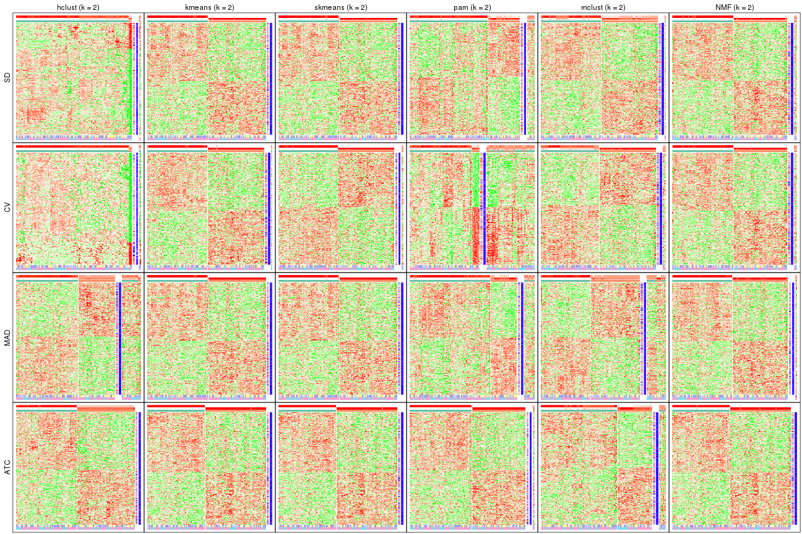</p>

</div>
<div id='tab-collect-get-signatures-2'>
<pre><code class="r">collect_plots(res_list, k = 3, fun = get_signatures, mc.cores = 4)
</code></pre>

<p></p>

</div>
<div id='tab-collect-get-signatures-3'>
<pre><code class="r">collect_plots(res_list, k = 4, fun = get_signatures, mc.cores = 4)
</code></pre>

<p>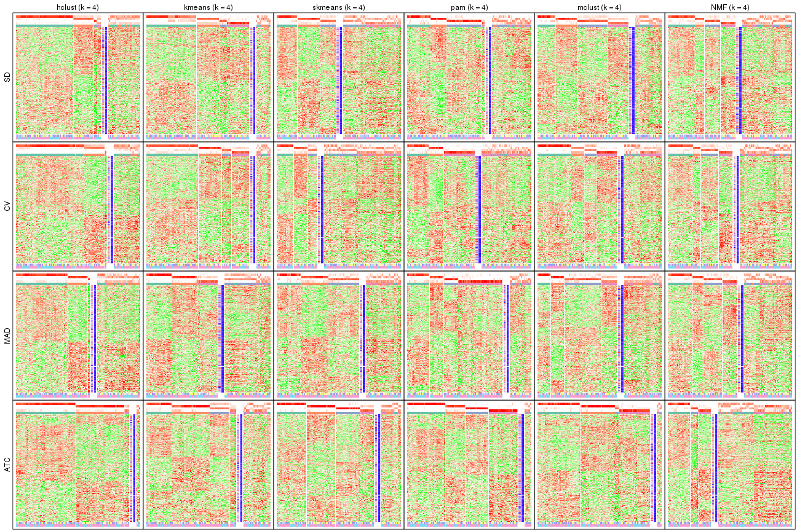</p>

</div>
<div id='tab-collect-get-signatures-4'>
<pre><code class="r">collect_plots(res_list, k = 5, fun = get_signatures, mc.cores = 4)
</code></pre>

<p></p>

</div>
<div id='tab-collect-get-signatures-5'>
<pre><code class="r">collect_plots(res_list, k = 6, fun = get_signatures, mc.cores = 4)
</code></pre>

<p></p>

</div>
</div>


### Statistics table

The statistics used for measuring the stability of consensus partitioning.
([How are they
defined?](http://bioconductor.org/packages/devel/bioc/vignettes/cola/inst/doc/cola.html#toc_13))


<script>
$( function() {
	$( '#tabs-get-stats-from-consensus-partition-list' ).tabs();
} );
</script>
<div id='tabs-get-stats-from-consensus-partition-list'>
<ul>
<li><a href='#tab-get-stats-from-consensus-partition-list-1'>k = 2</a></li>
<li><a href='#tab-get-stats-from-consensus-partition-list-2'>k = 3</a></li>
<li><a href='#tab-get-stats-from-consensus-partition-list-3'>k = 4</a></li>
<li><a href='#tab-get-stats-from-consensus-partition-list-4'>k = 5</a></li>
<li><a href='#tab-get-stats-from-consensus-partition-list-5'>k = 6</a></li>
</ul>
<div id='tab-get-stats-from-consensus-partition-list-1'>
<pre><code class="r">get_stats(res_list, k = 2)
</code></pre>

<pre><code>#&gt;             k 1-PAC mean_silhouette concordance area_increased  Rand Jaccard
#&gt; SD:NMF      2 0.886           0.932       0.971         0.5015 0.498   0.498
#&gt; CV:NMF      2 0.915           0.937       0.973         0.5011 0.498   0.498
#&gt; MAD:NMF     2 0.932           0.948       0.977         0.5023 0.497   0.497
#&gt; ATC:NMF     2 1.000           0.987       0.994         0.5041 0.496   0.496
#&gt; SD:skmeans  2 0.966           0.971       0.985         0.5042 0.496   0.496
#&gt; CV:skmeans  2 0.999           0.957       0.981         0.5042 0.496   0.496
#&gt; MAD:skmeans 2 1.000           0.985       0.993         0.5043 0.496   0.496
#&gt; ATC:skmeans 2 1.000           0.994       0.998         0.5043 0.496   0.496
#&gt; SD:mclust   2 0.268           0.782       0.797         0.4485 0.497   0.497
#&gt; CV:mclust   2 0.400           0.849       0.872         0.4437 0.496   0.496
#&gt; MAD:mclust  2 0.423           0.722       0.588         0.3967 0.498   0.498
#&gt; ATC:mclust  2 0.416           0.798       0.882         0.4512 0.567   0.567
#&gt; SD:kmeans   2 0.967           0.969       0.984         0.5039 0.496   0.496
#&gt; CV:kmeans   2 1.000           0.962       0.982         0.5036 0.497   0.497
#&gt; MAD:kmeans  2 1.000           0.986       0.992         0.5043 0.496   0.496
#&gt; ATC:kmeans  2 1.000           0.996       0.998         0.5043 0.496   0.496
#&gt; SD:pam      2 0.567           0.825       0.899         0.4163 0.587   0.587
#&gt; CV:pam      2 0.119           0.469       0.732         0.4013 0.708   0.708
#&gt; MAD:pam     2 0.444           0.799       0.896         0.3856 0.632   0.632
#&gt; ATC:pam     2 1.000           0.975       0.990         0.5014 0.499   0.499
#&gt; SD:hclust   2 0.338           0.854       0.889         0.1795 0.938   0.938
#&gt; CV:hclust   2 0.908           0.917       0.946         0.0977 0.953   0.953
#&gt; MAD:hclust  2 0.211           0.646       0.706         0.3334 0.550   0.550
#&gt; ATC:hclust  2 0.496           0.966       0.857         0.3689 0.496   0.496
</code></pre>

</div>
<div id='tab-get-stats-from-consensus-partition-list-2'>
<pre><code class="r">get_stats(res_list, k = 3)
</code></pre>

<pre><code>#&gt;             k 1-PAC mean_silhouette concordance area_increased  Rand Jaccard
#&gt; SD:NMF      3 0.403           0.543       0.753          0.318 0.741   0.525
#&gt; CV:NMF      3 0.381           0.508       0.702          0.307 0.806   0.632
#&gt; MAD:NMF     3 0.452           0.538       0.734          0.322 0.727   0.505
#&gt; ATC:NMF     3 0.593           0.639       0.818          0.280 0.818   0.646
#&gt; SD:skmeans  3 0.442           0.608       0.720          0.298 0.834   0.673
#&gt; CV:skmeans  3 0.409           0.523       0.696          0.299 0.842   0.691
#&gt; MAD:skmeans 3 0.551           0.763       0.835          0.295 0.835   0.676
#&gt; ATC:skmeans 3 0.985           0.923       0.958          0.261 0.833   0.674
#&gt; SD:mclust   3 0.286           0.623       0.651          0.331 0.668   0.427
#&gt; CV:mclust   3 0.288           0.647       0.739          0.301 0.858   0.730
#&gt; MAD:mclust  3 0.347           0.649       0.762          0.492 0.817   0.663
#&gt; ATC:mclust  3 0.915           0.913       0.963          0.480 0.731   0.539
#&gt; SD:kmeans   3 0.583           0.601       0.779          0.247 0.886   0.777
#&gt; CV:kmeans   3 0.606           0.649       0.772          0.239 0.866   0.734
#&gt; MAD:kmeans  3 0.545           0.460       0.705          0.262 0.925   0.850
#&gt; ATC:kmeans  3 0.693           0.654       0.796          0.244 0.945   0.890
#&gt; SD:pam      3 0.501           0.757       0.869          0.504 0.764   0.610
#&gt; CV:pam      3 0.311           0.725       0.823          0.480 0.643   0.521
#&gt; MAD:pam     3 0.273           0.664       0.800          0.546 0.761   0.625
#&gt; ATC:pam     3 0.973           0.948       0.978          0.279 0.856   0.714
#&gt; SD:hclust   3 0.194           0.569       0.756          1.132 0.656   0.633
#&gt; CV:hclust   3 0.297           0.739       0.839          1.634 0.984   0.984
#&gt; MAD:hclust  3 0.146           0.680       0.807          0.486 0.827   0.715
#&gt; ATC:hclust  3 0.949           0.953       0.982          0.404 0.992   0.984
</code></pre>

</div>
<div id='tab-get-stats-from-consensus-partition-list-3'>
<pre><code class="r">get_stats(res_list, k = 4)
</code></pre>

<pre><code>#&gt;             k 1-PAC mean_silhouette concordance area_increased  Rand Jaccard
#&gt; SD:NMF      4 0.441           0.463       0.700         0.1205 0.847   0.584
#&gt; CV:NMF      4 0.425           0.428       0.660         0.1283 0.756   0.429
#&gt; MAD:NMF     4 0.452           0.459       0.721         0.1168 0.803   0.499
#&gt; ATC:NMF     4 0.458           0.385       0.619         0.1417 0.791   0.496
#&gt; SD:skmeans  4 0.428           0.457       0.695         0.1347 0.827   0.554
#&gt; CV:skmeans  4 0.404           0.410       0.639         0.1345 0.779   0.469
#&gt; MAD:skmeans 4 0.465           0.544       0.725         0.1365 0.875   0.658
#&gt; ATC:skmeans 4 0.728           0.689       0.864         0.1532 0.866   0.646
#&gt; SD:mclust   4 0.423           0.583       0.693         0.1467 0.814   0.521
#&gt; CV:mclust   4 0.486           0.517       0.710         0.1625 0.863   0.688
#&gt; MAD:mclust  4 0.510           0.509       0.689         0.1417 0.839   0.613
#&gt; ATC:mclust  4 0.767           0.824       0.902         0.0618 0.950   0.854
#&gt; SD:kmeans   4 0.617           0.651       0.767         0.1259 0.835   0.628
#&gt; CV:kmeans   4 0.607           0.693       0.781         0.1213 0.904   0.760
#&gt; MAD:kmeans  4 0.560           0.549       0.717         0.1380 0.729   0.432
#&gt; ATC:kmeans  4 0.604           0.644       0.761         0.1361 0.785   0.534
#&gt; SD:pam      4 0.458           0.530       0.779         0.1362 0.917   0.792
#&gt; CV:pam      4 0.371           0.457       0.745         0.1425 0.960   0.906
#&gt; MAD:pam     4 0.484           0.667       0.823         0.1720 0.879   0.710
#&gt; ATC:pam     4 0.885           0.885       0.937         0.1486 0.902   0.730
#&gt; SD:hclust   4 0.157           0.578       0.762         0.3312 0.860   0.775
#&gt; CV:hclust   4 0.185           0.601       0.771         0.7043 0.640   0.616
#&gt; MAD:hclust  4 0.350           0.478       0.759         0.2021 0.966   0.930
#&gt; ATC:hclust  4 0.720           0.820       0.892         0.1445 0.965   0.927
</code></pre>

</div>
<div id='tab-get-stats-from-consensus-partition-list-4'>
<pre><code class="r">get_stats(res_list, k = 5)
</code></pre>

<pre><code>#&gt;             k 1-PAC mean_silhouette concordance area_increased  Rand Jaccard
#&gt; SD:NMF      5 0.460           0.376       0.620         0.0668 0.839   0.474
#&gt; CV:NMF      5 0.455           0.349       0.595         0.0694 0.842   0.475
#&gt; MAD:NMF     5 0.493           0.409       0.606         0.0680 0.875   0.570
#&gt; ATC:NMF     5 0.526           0.484       0.706         0.0593 0.843   0.508
#&gt; SD:skmeans  5 0.463           0.424       0.618         0.0675 0.907   0.670
#&gt; CV:skmeans  5 0.405           0.358       0.571         0.0652 0.933   0.747
#&gt; MAD:skmeans 5 0.484           0.474       0.658         0.0649 0.898   0.632
#&gt; ATC:skmeans 5 0.728           0.733       0.841         0.0646 0.908   0.676
#&gt; SD:mclust   5 0.788           0.768       0.878         0.1382 0.939   0.775
#&gt; CV:mclust   5 0.769           0.793       0.894         0.1527 0.782   0.427
#&gt; MAD:mclust  5 0.673           0.725       0.839         0.1329 0.865   0.563
#&gt; ATC:mclust  5 0.850           0.875       0.923         0.0666 0.901   0.695
#&gt; SD:kmeans   5 0.626           0.733       0.789         0.0821 0.843   0.536
#&gt; CV:kmeans   5 0.604           0.606       0.737         0.0798 0.887   0.664
#&gt; MAD:kmeans  5 0.632           0.730       0.792         0.0687 0.893   0.623
#&gt; ATC:kmeans  5 0.636           0.671       0.758         0.0793 0.876   0.588
#&gt; SD:pam      5 0.482           0.478       0.736         0.0496 0.933   0.798
#&gt; CV:pam      5 0.390           0.430       0.721         0.0303 0.948   0.872
#&gt; MAD:pam     5 0.552           0.621       0.811         0.0679 0.934   0.795
#&gt; ATC:pam     5 0.783           0.659       0.844         0.0617 0.979   0.923
#&gt; SD:hclust   5 0.306           0.589       0.761         0.1596 0.901   0.810
#&gt; CV:hclust   5 0.149           0.566       0.752         0.1915 0.930   0.880
#&gt; MAD:hclust  5 0.379           0.597       0.716         0.0851 0.861   0.706
#&gt; ATC:hclust  5 0.659           0.778       0.865         0.1262 0.899   0.779
</code></pre>

</div>
<div id='tab-get-stats-from-consensus-partition-list-5'>
<pre><code class="r">get_stats(res_list, k = 6)
</code></pre>

<pre><code>#&gt;             k 1-PAC mean_silhouette concordance area_increased  Rand Jaccard
#&gt; SD:NMF      6 0.514           0.377       0.610         0.0438 0.912   0.615
#&gt; CV:NMF      6 0.492           0.302       0.535         0.0410 0.870   0.495
#&gt; MAD:NMF     6 0.533           0.369       0.616         0.0430 0.901   0.587
#&gt; ATC:NMF     6 0.540           0.413       0.640         0.0368 0.905   0.648
#&gt; SD:skmeans  6 0.488           0.317       0.568         0.0401 0.917   0.665
#&gt; CV:skmeans  6 0.450           0.289       0.496         0.0414 0.911   0.635
#&gt; MAD:skmeans 6 0.513           0.386       0.608         0.0402 0.966   0.839
#&gt; ATC:skmeans 6 0.732           0.642       0.801         0.0390 0.941   0.740
#&gt; SD:mclust   6 0.833           0.769       0.894         0.0437 0.927   0.695
#&gt; CV:mclust   6 0.827           0.797       0.904         0.0515 0.952   0.786
#&gt; MAD:mclust  6 0.818           0.766       0.886         0.0699 0.935   0.716
#&gt; ATC:mclust  6 0.892           0.887       0.928         0.0841 0.924   0.694
#&gt; SD:kmeans   6 0.648           0.695       0.776         0.0448 0.977   0.894
#&gt; CV:kmeans   6 0.635           0.658       0.745         0.0474 0.911   0.663
#&gt; MAD:kmeans  6 0.694           0.666       0.752         0.0503 0.975   0.887
#&gt; ATC:kmeans  6 0.700           0.633       0.765         0.0485 0.946   0.761
#&gt; SD:pam      6 0.498           0.471       0.724         0.0179 0.975   0.910
#&gt; CV:pam      6 0.403           0.419       0.719         0.0127 0.999   0.998
#&gt; MAD:pam     6 0.563           0.529       0.779         0.0321 0.990   0.963
#&gt; ATC:pam     6 0.815           0.775       0.888         0.0554 0.900   0.620
#&gt; SD:hclust   6 0.354           0.594       0.775         0.0719 0.886   0.753
#&gt; CV:hclust   6 0.175           0.545       0.736         0.1012 0.904   0.821
#&gt; MAD:hclust  6 0.385           0.540       0.721         0.0776 0.981   0.948
#&gt; ATC:hclust  6 0.634           0.695       0.796         0.0653 0.976   0.934
</code></pre>

</div>
</div>

Following heatmap plots the partition for each combination of methods and the
lightness correspond to the silhouette scores for samples in each method. On
top the consensus subgroup is inferred from all methods by taking the mean
silhouette scores as weight.


<script>
$( function() {
	$( '#tabs-collect-stats-from-consensus-partition-list' ).tabs();
} );
</script>
<div id='tabs-collect-stats-from-consensus-partition-list'>
<ul>
<li><a href='#tab-collect-stats-from-consensus-partition-list-1'>k = 2</a></li>
<li><a href='#tab-collect-stats-from-consensus-partition-list-2'>k = 3</a></li>
<li><a href='#tab-collect-stats-from-consensus-partition-list-3'>k = 4</a></li>
<li><a href='#tab-collect-stats-from-consensus-partition-list-4'>k = 5</a></li>
<li><a href='#tab-collect-stats-from-consensus-partition-list-5'>k = 6</a></li>
</ul>
<div id='tab-collect-stats-from-consensus-partition-list-1'>
<pre><code class="r">collect_stats(res_list, k = 2)
</code></pre>

<p></p>

</div>
<div id='tab-collect-stats-from-consensus-partition-list-2'>
<pre><code class="r">collect_stats(res_list, k = 3)
</code></pre>

<p></p>

</div>
<div id='tab-collect-stats-from-consensus-partition-list-3'>
<pre><code class="r">collect_stats(res_list, k = 4)
</code></pre>

<p></p>

</div>
<div id='tab-collect-stats-from-consensus-partition-list-4'>
<pre><code class="r">collect_stats(res_list, k = 5)
</code></pre>

<p></p>

</div>
<div id='tab-collect-stats-from-consensus-partition-list-5'>
<pre><code class="r">collect_stats(res_list, k = 6)
</code></pre>

<p></p>

</div>
</div>

### Partition from all methods


Collect partitions from all methods:


<script>
$( function() {
	$( '#tabs-collect-classes-from-consensus-partition-list' ).tabs();
} );
</script>
<div id='tabs-collect-classes-from-consensus-partition-list'>
<ul>
<li><a href='#tab-collect-classes-from-consensus-partition-list-1'>k = 2</a></li>
<li><a href='#tab-collect-classes-from-consensus-partition-list-2'>k = 3</a></li>
<li><a href='#tab-collect-classes-from-consensus-partition-list-3'>k = 4</a></li>
<li><a href='#tab-collect-classes-from-consensus-partition-list-4'>k = 5</a></li>
<li><a href='#tab-collect-classes-from-consensus-partition-list-5'>k = 6</a></li>
</ul>
<div id='tab-collect-classes-from-consensus-partition-list-1'>
<pre><code class="r">collect_classes(res_list, k = 2)
</code></pre>

<p></p>

</div>
<div id='tab-collect-classes-from-consensus-partition-list-2'>
<pre><code class="r">collect_classes(res_list, k = 3)
</code></pre>

<p></p>

</div>
<div id='tab-collect-classes-from-consensus-partition-list-3'>
<pre><code class="r">collect_classes(res_list, k = 4)
</code></pre>

<p></p>

</div>
<div id='tab-collect-classes-from-consensus-partition-list-4'>
<pre><code class="r">collect_classes(res_list, k = 5)
</code></pre>

<p></p>

</div>
<div id='tab-collect-classes-from-consensus-partition-list-5'>
<pre><code class="r">collect_classes(res_list, k = 6)
</code></pre>

<p></p>

</div>
</div>


### Top rows overlap


Overlap of top rows from different top-row methods:


<script>
$( function() {
	$( '#tabs-top-rows-overlap-by-euler' ).tabs();
} );
</script>
<div id='tabs-top-rows-overlap-by-euler'>
<ul>
<li><a href='#tab-top-rows-overlap-by-euler-1'>top_n = 1000</a></li>
<li><a href='#tab-top-rows-overlap-by-euler-2'>top_n = 2000</a></li>
<li><a href='#tab-top-rows-overlap-by-euler-3'>top_n = 3000</a></li>
<li><a href='#tab-top-rows-overlap-by-euler-4'>top_n = 4000</a></li>
<li><a href='#tab-top-rows-overlap-by-euler-5'>top_n = 5000</a></li>
</ul>
<div id='tab-top-rows-overlap-by-euler-1'>
<pre><code class="r">top_rows_overlap(res_list, top_n = 1000, method = &quot;euler&quot;)
</code></pre>

<p></p>

</div>
<div id='tab-top-rows-overlap-by-euler-2'>
<pre><code class="r">top_rows_overlap(res_list, top_n = 2000, method = &quot;euler&quot;)
</code></pre>

<p></p>

</div>
<div id='tab-top-rows-overlap-by-euler-3'>
<pre><code class="r">top_rows_overlap(res_list, top_n = 3000, method = &quot;euler&quot;)
</code></pre>

<p></p>

</div>
<div id='tab-top-rows-overlap-by-euler-4'>
<pre><code class="r">top_rows_overlap(res_list, top_n = 4000, method = &quot;euler&quot;)
</code></pre>

<p></p>

</div>
<div id='tab-top-rows-overlap-by-euler-5'>
<pre><code class="r">top_rows_overlap(res_list, top_n = 5000, method = &quot;euler&quot;)
</code></pre>

<p></p>

</div>
</div>

Also visualize the correspondance of rankings between different top-row methods:


<script>
$( function() {
	$( '#tabs-top-rows-overlap-by-correspondance' ).tabs();
} );
</script>
<div id='tabs-top-rows-overlap-by-correspondance'>
<ul>
<li><a href='#tab-top-rows-overlap-by-correspondance-1'>top_n = 1000</a></li>
<li><a href='#tab-top-rows-overlap-by-correspondance-2'>top_n = 2000</a></li>
<li><a href='#tab-top-rows-overlap-by-correspondance-3'>top_n = 3000</a></li>
<li><a href='#tab-top-rows-overlap-by-correspondance-4'>top_n = 4000</a></li>
<li><a href='#tab-top-rows-overlap-by-correspondance-5'>top_n = 5000</a></li>
</ul>
<div id='tab-top-rows-overlap-by-correspondance-1'>
<pre><code class="r">top_rows_overlap(res_list, top_n = 1000, method = &quot;correspondance&quot;)
</code></pre>

<p></p>

</div>
<div id='tab-top-rows-overlap-by-correspondance-2'>
<pre><code class="r">top_rows_overlap(res_list, top_n = 2000, method = &quot;correspondance&quot;)
</code></pre>

<p></p>

</div>
<div id='tab-top-rows-overlap-by-correspondance-3'>
<pre><code class="r">top_rows_overlap(res_list, top_n = 3000, method = &quot;correspondance&quot;)
</code></pre>

<p></p>

</div>
<div id='tab-top-rows-overlap-by-correspondance-4'>
<pre><code class="r">top_rows_overlap(res_list, top_n = 4000, method = &quot;correspondance&quot;)
</code></pre>

<p></p>

</div>
<div id='tab-top-rows-overlap-by-correspondance-5'>
<pre><code class="r">top_rows_overlap(res_list, top_n = 5000, method = &quot;correspondance&quot;)
</code></pre>

<p></p>

</div>
</div>


Heatmaps of the top rows:


<script>
$( function() {
	$( '#tabs-top-rows-heatmap' ).tabs();
} );
</script>
<div id='tabs-top-rows-heatmap'>
<ul>
<li><a href='#tab-top-rows-heatmap-1'>top_n = 1000</a></li>
<li><a href='#tab-top-rows-heatmap-2'>top_n = 2000</a></li>
<li><a href='#tab-top-rows-heatmap-3'>top_n = 3000</a></li>
<li><a href='#tab-top-rows-heatmap-4'>top_n = 4000</a></li>
<li><a href='#tab-top-rows-heatmap-5'>top_n = 5000</a></li>
</ul>
<div id='tab-top-rows-heatmap-1'>
<pre><code class="r">top_rows_heatmap(res_list, top_n = 1000)
</code></pre>

<p>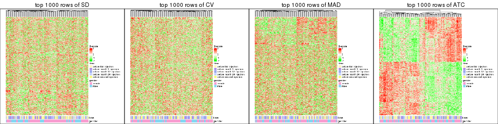</p>

</div>
<div id='tab-top-rows-heatmap-2'>
<pre><code class="r">top_rows_heatmap(res_list, top_n = 2000)
</code></pre>

<p></p>

</div>
<div id='tab-top-rows-heatmap-3'>
<pre><code class="r">top_rows_heatmap(res_list, top_n = 3000)
</code></pre>

<p></p>

</div>
<div id='tab-top-rows-heatmap-4'>
<pre><code class="r">top_rows_heatmap(res_list, top_n = 4000)
</code></pre>

<p></p>

</div>
<div id='tab-top-rows-heatmap-5'>
<pre><code class="r">top_rows_heatmap(res_list, top_n = 5000)
</code></pre>

<p></p>

</div>
</div>


### Test to known annotations


Test correlation between subgroups and known annotations. If the known
annotation is numeric, one-way ANOVA test is applied, and if the known
annotation is discrete, chi-squared contingency table test is applied.


<script>
$( function() {
	$( '#tabs-test-to-known-factors-from-consensus-partition-list' ).tabs();
} );
</script>
<div id='tabs-test-to-known-factors-from-consensus-partition-list'>
<ul>
<li><a href='#tab-test-to-known-factors-from-consensus-partition-list-1'>k = 2</a></li>
<li><a href='#tab-test-to-known-factors-from-consensus-partition-list-2'>k = 3</a></li>
<li><a href='#tab-test-to-known-factors-from-consensus-partition-list-3'>k = 4</a></li>
<li><a href='#tab-test-to-known-factors-from-consensus-partition-list-4'>k = 5</a></li>
<li><a href='#tab-test-to-known-factors-from-consensus-partition-list-5'>k = 6</a></li>
</ul>
<div id='tab-test-to-known-factors-from-consensus-partition-list-1'>
<pre><code class="r">test_to_known_factors(res_list, k = 2)
</code></pre>

<pre><code>#&gt;               n time(p) gender(p) k
#&gt; SD:NMF      122   0.187     0.983 2
#&gt; CV:NMF      122   0.187     0.983 2
#&gt; MAD:NMF     123   0.204     0.974 2
#&gt; ATC:NMF     125   0.294     0.840 2
#&gt; SD:skmeans  125   0.294     0.864 2
#&gt; CV:skmeans  123   0.351     0.717 2
#&gt; MAD:skmeans 125   0.294     0.864 2
#&gt; ATC:skmeans 125   0.294     0.840 2
#&gt; SD:mclust   124   0.251     0.918 2
#&gt; CV:mclust   122   0.221     0.813 2
#&gt; MAD:mclust  105   0.152     0.888 2
#&gt; ATC:mclust  118   0.757     0.493 2
#&gt; SD:kmeans   125   0.294     0.864 2
#&gt; CV:kmeans   124   0.305     0.767 2
#&gt; MAD:kmeans  125   0.294     0.864 2
#&gt; ATC:kmeans  125   0.294     0.840 2
#&gt; SD:pam      117   0.187     0.674 2
#&gt; CV:pam       74   0.296     0.849 2
#&gt; MAD:pam     114   0.475     0.713 2
#&gt; ATC:pam     123   0.187     0.611 2
#&gt; SD:hclust   123   0.017     0.625 2
#&gt; CV:hclust   123   0.230     1.000 2
#&gt; MAD:hclust  105   0.061     0.284 2
#&gt; ATC:hclust  125   0.410     0.586 2
</code></pre>

</div>
<div id='tab-test-to-known-factors-from-consensus-partition-list-2'>
<pre><code class="r">test_to_known_factors(res_list, k = 3)
</code></pre>

<pre><code>#&gt;               n time(p) gender(p) k
#&gt; SD:NMF       88  0.2971   0.13500 3
#&gt; CV:NMF       79  0.0180   0.61484 3
#&gt; MAD:NMF      84  0.4218   0.21684 3
#&gt; ATC:NMF      99  0.2127   0.88886 3
#&gt; SD:skmeans  103  0.0949   0.52546 3
#&gt; CV:skmeans   81  0.2386   0.44805 3
#&gt; MAD:skmeans 116  0.1462   0.42124 3
#&gt; ATC:skmeans 121  0.3702   0.20330 3
#&gt; SD:mclust   103  0.3108   0.15157 3
#&gt; CV:mclust   106  0.4228   0.10739 3
#&gt; MAD:mclust  112  0.3519   0.06390 3
#&gt; ATC:mclust  120  0.9210   0.56544 3
#&gt; SD:kmeans    89  0.8149   0.26592 3
#&gt; CV:kmeans    85  0.4249   0.17186 3
#&gt; MAD:kmeans   66  0.0459   0.70560 3
#&gt; ATC:kmeans  111  0.0113   0.50252 3
#&gt; SD:pam      111  0.8339   0.00140 3
#&gt; CV:pam      112  0.9423   0.00227 3
#&gt; MAD:pam     108  0.8769   0.01078 3
#&gt; ATC:pam     122  0.2339   0.26808 3
#&gt; SD:hclust    91  0.0746   0.16548 3
#&gt; CV:hclust   117  0.0807   1.00000 3
#&gt; MAD:hclust  105  0.1015   0.40946 3
#&gt; ATC:hclust  124  0.3527   0.50133 3
</code></pre>

</div>
<div id='tab-test-to-known-factors-from-consensus-partition-list-3'>
<pre><code class="r">test_to_known_factors(res_list, k = 4)
</code></pre>

<pre><code>#&gt;               n time(p) gender(p) k
#&gt; SD:NMF       72  0.4911  0.594910 4
#&gt; CV:NMF       69  0.5889  0.660010 4
#&gt; MAD:NMF      74  0.5090  0.882721 4
#&gt; ATC:NMF      47  0.4064  0.878403 4
#&gt; SD:skmeans   64  0.2892  0.134287 4
#&gt; CV:skmeans   43  0.5188  0.393641 4
#&gt; MAD:skmeans  88  0.1080  0.298711 4
#&gt; ATC:skmeans 104  0.3257  0.583588 4
#&gt; SD:mclust    97  0.5113  0.098201 4
#&gt; CV:mclust    85  0.7019  0.101248 4
#&gt; MAD:mclust   85  0.8486  0.089913 4
#&gt; ATC:mclust  120  0.2480  0.635177 4
#&gt; SD:kmeans   110  0.1713  0.117765 4
#&gt; CV:kmeans   110  0.4348  0.125246 4
#&gt; MAD:kmeans   77  0.1908  0.193359 4
#&gt; ATC:kmeans   96  0.2780  0.707428 4
#&gt; SD:pam       83  0.8489  0.000344 4
#&gt; CV:pam       72  0.9392  0.000563 4
#&gt; MAD:pam     102  0.5526  0.083092 4
#&gt; ATC:pam     118  0.0881  0.440116 4
#&gt; SD:hclust    91  0.1590  0.010107 4
#&gt; CV:hclust    97  0.2204  0.318291 4
#&gt; MAD:hclust   80  0.3296  0.214152 4
#&gt; ATC:hclust  121  0.4526  0.209832 4
</code></pre>

</div>
<div id='tab-test-to-known-factors-from-consensus-partition-list-4'>
<pre><code class="r">test_to_known_factors(res_list, k = 5)
</code></pre>

<pre><code>#&gt;               n time(p) gender(p) k
#&gt; SD:NMF       38  0.6711  0.006390 5
#&gt; CV:NMF       31  0.9297  0.020622 5
#&gt; MAD:NMF      61  0.3619  0.106234 5
#&gt; ATC:NMF      73  0.4175  0.754588 5
#&gt; SD:skmeans   57  0.4632  0.080870 5
#&gt; CV:skmeans   31  0.9623  0.389385 5
#&gt; MAD:skmeans  67  0.1326  0.468893 5
#&gt; ATC:skmeans 115  0.4521  0.600715 5
#&gt; SD:mclust   112  0.1152  0.240353 5
#&gt; CV:mclust   113  0.4502  0.220560 5
#&gt; MAD:mclust  113  0.1119  0.670623 5
#&gt; ATC:mclust  119  0.1349  0.643813 5
#&gt; SD:kmeans   115  0.0948  0.202733 5
#&gt; CV:kmeans   101  0.6148  0.178639 5
#&gt; MAD:kmeans  113  0.1591  0.337730 5
#&gt; ATC:kmeans  110  0.3298  0.543516 5
#&gt; SD:pam       68  0.6542  0.000115 5
#&gt; CV:pam       65  0.9676  0.000138 5
#&gt; MAD:pam      95  0.4565  0.050487 5
#&gt; ATC:pam      99  0.1276  0.838360 5
#&gt; SD:hclust    93  0.2505  0.011882 5
#&gt; CV:hclust    95  0.4349  0.230826 5
#&gt; MAD:hclust  100  0.5770  0.006428 5
#&gt; ATC:hclust  118  0.4695  0.127073 5
</code></pre>

</div>
<div id='tab-test-to-known-factors-from-consensus-partition-list-5'>
<pre><code class="r">test_to_known_factors(res_list, k = 6)
</code></pre>

<pre><code>#&gt;               n time(p) gender(p) k
#&gt; SD:NMF       50   0.768  0.000246 6
#&gt; CV:NMF       28   0.344  0.085625 6
#&gt; MAD:NMF      43   0.813  0.002708 6
#&gt; ATC:NMF      59   0.315  0.374447 6
#&gt; SD:skmeans   28   0.697  0.243273 6
#&gt; CV:skmeans   18   0.581  0.409925 6
#&gt; MAD:skmeans  43   0.392  0.621304 6
#&gt; ATC:skmeans  92   0.714  0.351397 6
#&gt; SD:mclust   112   0.298  0.156095 6
#&gt; CV:mclust   116   0.382  0.137336 6
#&gt; MAD:mclust  112   0.114  0.853829 6
#&gt; ATC:mclust  121   0.379  0.538141 6
#&gt; SD:kmeans   109   0.032  0.101524 6
#&gt; CV:kmeans   112   0.469  0.037405 6
#&gt; MAD:kmeans  106   0.198  0.616267 6
#&gt; ATC:kmeans   89   0.364  0.608636 6
#&gt; SD:pam       73   0.436  0.000708 6
#&gt; CV:pam       65   0.968  0.000138 6
#&gt; MAD:pam      87   0.377  0.045498 6
#&gt; ATC:pam     110   0.376  0.348822 6
#&gt; SD:hclust    81   0.441  0.097866 6
#&gt; CV:hclust    91   0.310  0.394331 6
#&gt; MAD:hclust   92   0.854  0.008004 6
#&gt; ATC:hclust  112   0.568  0.152476 6
</code></pre>

</div>
</div>


 
## Results for each method


---------------------------------------------------


### SD:hclust


The object with results only for a single top-value method and a single partition method 
can be extracted as:

```r
res = res_list["SD", "hclust"]
# you can also extract it by
# res = res_list["SD:hclust"]
```

A summary of `res` and all the functions that can be applied to it:

```r
res
```

```
#> A 'ConsensusPartition' object with k = 2, 3, 4, 5, 6.
#>   On a matrix with 21512 rows and 125 columns.
#>   Top rows (1000, 2000, 3000, 4000, 5000) are extracted by 'SD' method.
#>   Subgroups are detected by 'hclust' method.
#>   Performed in total 1250 partitions by row resampling.
#>   Best k for subgroups seems to be 5.
#> 
#> Following methods can be applied to this 'ConsensusPartition' object:
#>  [1] "cola_report"             "collect_classes"         "collect_plots"          
#>  [4] "collect_stats"           "colnames"                "compare_signatures"     
#>  [7] "consensus_heatmap"       "dimension_reduction"     "functional_enrichment"  
#> [10] "get_anno_col"            "get_anno"                "get_classes"            
#> [13] "get_consensus"           "get_matrix"              "get_membership"         
#> [16] "get_param"               "get_signatures"          "get_stats"              
#> [19] "is_best_k"               "is_stable_k"             "membership_heatmap"     
#> [22] "ncol"                    "nrow"                    "plot_ecdf"              
#> [25] "rownames"                "select_partition_number" "show"                   
#> [28] "suggest_best_k"          "test_to_known_factors"
```

`collect_plots()` function collects all the plots made from `res` for all `k` (number of partitions)
into one single page to provide an easy and fast comparison between different `k`.

```r
collect_plots(res)
```


The plots are:

- The first row: a plot of the ECDF (empirical cumulative distribution
  function) curves of the consensus matrix for each `k` and the heatmap of
  predicted classes for each `k`.
- The second row: heatmaps of the consensus matrix for each `k`.
- The third row: heatmaps of the membership matrix for each `k`.
- The fouth row: heatmaps of the signatures for each `k`.

All the plots in panels can be made by individual functions and they are
plotted later in this section.

`select_partition_number()` produces several plots showing different
statistics for choosing "optimized" `k`. There are following statistics:

- ECDF curves of the consensus matrix for each `k`;
- 1-PAC. [The PAC
  score](https://en.wikipedia.org/wiki/Consensus_clustering#Over-interpretation_potential_of_consensus_clustering)
  measures the proportion of the ambiguous subgrouping.
- Mean silhouette score.
- Concordance. The mean probability of fiting the consensus class ids in all
  partitions.
- Area increased. Denote $A_k$ as the area under the ECDF curve for current
  `k`, the area increased is defined as $A_k - A_{k-1}$.
- Rand index. The percent of pairs of samples that are both in a same cluster
  or both are not in a same cluster in the partition of k and k-1.
- Jaccard index. The ratio of pairs of samples are both in a same cluster in
  the partition of k and k-1 and the pairs of samples are both in a same
  cluster in the partition k or k-1.

The detailed explanations of these statistics can be found in [the _cola_
vignette](http://bioconductor.org/packages/devel/bioc/vignettes/cola/inst/doc/cola.html#toc_13).

Generally speaking, lower PAC score, higher mean silhouette score or higher
concordance corresponds to better partition. Rand index and Jaccard index
measure how similar the current partition is compared to partition with `k-1`.
If they are too similar, we won't accept `k` is better than `k-1`.

```r
select_partition_number(res)
```


The numeric values for all these statistics can be obtained by `get_stats()`.

```r
get_stats(res)
```

```
#>   k 1-PAC mean_silhouette concordance area_increased  Rand Jaccard
#> 2 2 0.338           0.854       0.889         0.1795 0.938   0.938
#> 3 3 0.194           0.569       0.756         1.1320 0.656   0.633
#> 4 4 0.157           0.578       0.762         0.3312 0.860   0.775
#> 5 5 0.306           0.589       0.761         0.1596 0.901   0.810
#> 6 6 0.354           0.594       0.775         0.0719 0.886   0.753
```

`suggest_best_k()` suggests the best $k$ based on these statistics. The rules are as follows:

- All $k$ with Jaccard index larger than 0.95 are removed because increasing
  $k$ does not provide enough extra information. If all $k$ are removed, it is
  marked as no subgroup is detected.
- For all $k$ with 1-PAC score larger than 0.9, the maximal $k$ is taken as
  the best $k$, and other $k$ are marked as optional $k$.
- If it does not fit the second rule. The $k$ with the maximal vote of the
  highest 1-PAC score, highest mean silhouette, and highest concordance is
  taken as the best $k$.

```r
suggest_best_k(res)
```

```
#> [1] 5
```


Following shows the table of the partitions (You need to click the **show/hide
code output** link to see it). The membership matrix (columns with name `p*`)
is inferred by
[`clue::cl_consensus()`](https://www.rdocumentation.org/link/cl_consensus?package=clue)
function with the `SE` method. Basically the value in the membership matrix
represents the probability to belong to a certain group. The finall class
label for an item is determined with the group with highest probability it
belongs to.

In `get_classes()` function, the entropy is calculated from the membership
matrix and the silhouette score is calculated from the consensus matrix.


<script>
$( function() {
	$( '#tabs-SD-hclust-get-classes' ).tabs();
} );
</script>
<div id='tabs-SD-hclust-get-classes'>
<ul>
<li><a href='#tab-SD-hclust-get-classes-1'>k = 2</a></li>
<li><a href='#tab-SD-hclust-get-classes-2'>k = 3</a></li>
<li><a href='#tab-SD-hclust-get-classes-3'>k = 4</a></li>
<li><a href='#tab-SD-hclust-get-classes-4'>k = 5</a></li>
<li><a href='#tab-SD-hclust-get-classes-5'>k = 6</a></li>
</ul>

<div id='tab-SD-hclust-get-classes-1'>
<p><a id='tab-SD-hclust-get-classes-1-a' style='color:#0366d6' href='#'>show/hide code output</a></p>
<pre><code class="r">cbind(get_classes(res, k = 2), get_membership(res, k = 2))
</code></pre>

<pre><code>#&gt;           class entropy silhouette    p1    p2
#&gt; GSM601872     1  0.7453      0.833 0.788 0.212
#&gt; GSM601882     1  0.7528      0.827 0.784 0.216
#&gt; GSM601887     1  0.2948      0.889 0.948 0.052
#&gt; GSM601892     1  0.2603      0.888 0.956 0.044
#&gt; GSM601897     1  0.5294      0.867 0.880 0.120
#&gt; GSM601902     1  0.6887      0.848 0.816 0.184
#&gt; GSM601912     1  0.2778      0.887 0.952 0.048
#&gt; GSM601927     1  0.0938      0.883 0.988 0.012
#&gt; GSM601932     1  0.6623      0.855 0.828 0.172
#&gt; GSM601937     1  0.9491      0.273 0.632 0.368
#&gt; GSM601942     2  0.9608      0.480 0.384 0.616
#&gt; GSM601947     1  0.5946      0.869 0.856 0.144
#&gt; GSM601957     1  0.1414      0.884 0.980 0.020
#&gt; GSM601972     1  0.6531      0.858 0.832 0.168
#&gt; GSM601977     1  0.7453      0.829 0.788 0.212
#&gt; GSM601987     1  0.7453      0.829 0.788 0.212
#&gt; GSM601877     1  0.0376      0.884 0.996 0.004
#&gt; GSM601907     1  0.7674      0.815 0.776 0.224
#&gt; GSM601917     1  0.5408      0.875 0.876 0.124
#&gt; GSM601922     1  0.5519      0.873 0.872 0.128
#&gt; GSM601952     1  0.5737      0.876 0.864 0.136
#&gt; GSM601962     1  0.1843      0.877 0.972 0.028
#&gt; GSM601967     1  0.1414      0.884 0.980 0.020
#&gt; GSM601982     1  0.4562      0.887 0.904 0.096
#&gt; GSM601992     1  0.7815      0.793 0.768 0.232
#&gt; GSM601873     1  0.7883      0.808 0.764 0.236
#&gt; GSM601883     1  0.7453      0.829 0.788 0.212
#&gt; GSM601888     1  0.2948      0.889 0.948 0.052
#&gt; GSM601893     1  0.2778      0.888 0.952 0.048
#&gt; GSM601898     1  0.1414      0.880 0.980 0.020
#&gt; GSM601903     1  0.6887      0.848 0.816 0.184
#&gt; GSM601913     1  0.1633      0.879 0.976 0.024
#&gt; GSM601928     1  0.0938      0.883 0.988 0.012
#&gt; GSM601933     1  0.7453      0.825 0.788 0.212
#&gt; GSM601938     1  0.7376      0.831 0.792 0.208
#&gt; GSM601943     1  0.7950      0.810 0.760 0.240
#&gt; GSM601948     1  0.4562      0.885 0.904 0.096
#&gt; GSM601958     1  0.1414      0.880 0.980 0.020
#&gt; GSM601973     1  0.6712      0.852 0.824 0.176
#&gt; GSM601978     1  0.7815      0.813 0.768 0.232
#&gt; GSM601988     1  0.6531      0.797 0.832 0.168
#&gt; GSM601878     1  0.0376      0.884 0.996 0.004
#&gt; GSM601908     1  0.7745      0.815 0.772 0.228
#&gt; GSM601918     1  0.5737      0.870 0.864 0.136
#&gt; GSM601923     1  0.0376      0.884 0.996 0.004
#&gt; GSM601953     1  0.7299      0.828 0.796 0.204
#&gt; GSM601963     1  0.2043      0.875 0.968 0.032
#&gt; GSM601968     1  0.1633      0.885 0.976 0.024
#&gt; GSM601983     1  0.1633      0.887 0.976 0.024
#&gt; GSM601993     1  0.7950      0.784 0.760 0.240
#&gt; GSM601874     1  0.7453      0.824 0.788 0.212
#&gt; GSM601884     1  0.7528      0.827 0.784 0.216
#&gt; GSM601889     1  0.1633      0.882 0.976 0.024
#&gt; GSM601894     1  0.1633      0.883 0.976 0.024
#&gt; GSM601899     1  0.3114      0.888 0.944 0.056
#&gt; GSM601904     1  0.5059      0.878 0.888 0.112
#&gt; GSM601914     1  0.2236      0.877 0.964 0.036
#&gt; GSM601929     1  0.1843      0.890 0.972 0.028
#&gt; GSM601934     1  0.7453      0.825 0.788 0.212
#&gt; GSM601939     1  0.1414      0.881 0.980 0.020
#&gt; GSM601944     1  0.7950      0.812 0.760 0.240
#&gt; GSM601949     1  0.4690      0.887 0.900 0.100
#&gt; GSM601959     1  0.1414      0.880 0.980 0.020
#&gt; GSM601974     1  0.5059      0.875 0.888 0.112
#&gt; GSM601979     1  0.7674      0.820 0.776 0.224
#&gt; GSM601989     1  0.1633      0.882 0.976 0.024
#&gt; GSM601879     1  0.0376      0.884 0.996 0.004
#&gt; GSM601909     1  0.2236      0.884 0.964 0.036
#&gt; GSM601919     1  0.5737      0.870 0.864 0.136
#&gt; GSM601924     1  0.0376      0.884 0.996 0.004
#&gt; GSM601954     1  0.5519      0.877 0.872 0.128
#&gt; GSM601964     1  0.2043      0.875 0.968 0.032
#&gt; GSM601969     1  0.3114      0.887 0.944 0.056
#&gt; GSM601984     1  0.1633      0.889 0.976 0.024
#&gt; GSM601994     1  0.7883      0.792 0.764 0.236
#&gt; GSM601875     1  0.7528      0.824 0.784 0.216
#&gt; GSM601885     1  0.7453      0.829 0.788 0.212
#&gt; GSM601890     1  0.3114      0.888 0.944 0.056
#&gt; GSM601895     1  0.2423      0.879 0.960 0.040
#&gt; GSM601900     1  0.2603      0.881 0.956 0.044
#&gt; GSM601905     1  0.5519      0.874 0.872 0.128
#&gt; GSM601915     1  0.1843      0.876 0.972 0.028
#&gt; GSM601930     1  0.0938      0.883 0.988 0.012
#&gt; GSM601935     1  0.6623      0.764 0.828 0.172
#&gt; GSM601940     1  0.1414      0.881 0.980 0.020
#&gt; GSM601945     1  0.7883      0.809 0.764 0.236
#&gt; GSM601950     1  0.1843      0.887 0.972 0.028
#&gt; GSM601960     1  0.2778      0.868 0.952 0.048
#&gt; GSM601975     1  0.6438      0.860 0.836 0.164
#&gt; GSM601980     2  0.6623      0.838 0.172 0.828
#&gt; GSM601990     1  0.2043      0.874 0.968 0.032
#&gt; GSM601880     1  0.0672      0.885 0.992 0.008
#&gt; GSM601910     1  0.2236      0.885 0.964 0.036
#&gt; GSM601920     1  0.5629      0.873 0.868 0.132
#&gt; GSM601925     1  0.0672      0.885 0.992 0.008
#&gt; GSM601955     2  0.7299      0.851 0.204 0.796
#&gt; GSM601965     1  0.2603      0.890 0.956 0.044
#&gt; GSM601970     1  0.1633      0.884 0.976 0.024
#&gt; GSM601985     1  0.0672      0.882 0.992 0.008
#&gt; GSM601995     2  0.7950      0.841 0.240 0.760
#&gt; GSM601876     1  0.1843      0.883 0.972 0.028
#&gt; GSM601886     1  0.4815      0.884 0.896 0.104
#&gt; GSM601891     1  0.3274      0.890 0.940 0.060
#&gt; GSM601896     1  0.1633      0.882 0.976 0.024
#&gt; GSM601901     1  0.6973      0.847 0.812 0.188
#&gt; GSM601906     1  0.5059      0.878 0.888 0.112
#&gt; GSM601916     1  0.6438      0.859 0.836 0.164
#&gt; GSM601931     1  0.1414      0.882 0.980 0.020
#&gt; GSM601936     1  0.6801      0.771 0.820 0.180
#&gt; GSM601941     1  0.6712      0.852 0.824 0.176
#&gt; GSM601946     1  0.1414      0.882 0.980 0.020
#&gt; GSM601951     1  0.5294      0.880 0.880 0.120
#&gt; GSM601961     1  0.6973      0.850 0.812 0.188
#&gt; GSM601976     1  0.6343      0.862 0.840 0.160
#&gt; GSM601981     1  0.7056      0.843 0.808 0.192
#&gt; GSM601991     1  0.2778      0.872 0.952 0.048
#&gt; GSM601881     1  0.0376      0.884 0.996 0.004
#&gt; GSM601911     1  0.3274      0.890 0.940 0.060
#&gt; GSM601921     1  0.5519      0.874 0.872 0.128
#&gt; GSM601926     1  0.0376      0.884 0.996 0.004
#&gt; GSM601956     1  0.7219      0.834 0.800 0.200
#&gt; GSM601966     1  0.6801      0.850 0.820 0.180
#&gt; GSM601971     1  0.2236      0.886 0.964 0.036
#&gt; GSM601986     1  0.3114      0.890 0.944 0.056
#&gt; GSM601996     1  0.7674      0.801 0.776 0.224
</code></pre>

<script>
$('#tab-SD-hclust-get-classes-1-a').parent().next().next().hide();
$('#tab-SD-hclust-get-classes-1-a').click(function(){
  $('#tab-SD-hclust-get-classes-1-a').parent().next().next().toggle();
  return(false);
});
</script>
</div>

<div id='tab-SD-hclust-get-classes-2'>
<p><a id='tab-SD-hclust-get-classes-2-a' style='color:#0366d6' href='#'>show/hide code output</a></p>
<pre><code class="r">cbind(get_classes(res, k = 3), get_membership(res, k = 3))
</code></pre>

<pre><code>#&gt;           class entropy silhouette    p1    p2    p3
#&gt; GSM601872     2  0.7377    0.74950 0.452 0.516 0.032
#&gt; GSM601882     2  0.6587    0.77972 0.424 0.568 0.008
#&gt; GSM601887     1  0.3618    0.68112 0.884 0.104 0.012
#&gt; GSM601892     1  0.3043    0.69478 0.908 0.084 0.008
#&gt; GSM601897     1  0.5730    0.59229 0.796 0.144 0.060
#&gt; GSM601902     1  0.7074   -0.26752 0.500 0.480 0.020
#&gt; GSM601912     1  0.2772    0.72042 0.916 0.080 0.004
#&gt; GSM601927     1  0.1860    0.73283 0.948 0.052 0.000
#&gt; GSM601932     1  0.6925   -0.16527 0.532 0.452 0.016
#&gt; GSM601937     2  0.9702   -0.39493 0.320 0.444 0.236
#&gt; GSM601942     3  0.8716    0.45053 0.172 0.240 0.588
#&gt; GSM601947     1  0.6600   -0.00392 0.604 0.384 0.012
#&gt; GSM601957     1  0.1399    0.73560 0.968 0.028 0.004
#&gt; GSM601972     1  0.6962   -0.05579 0.568 0.412 0.020
#&gt; GSM601977     2  0.7004    0.78702 0.428 0.552 0.020
#&gt; GSM601987     2  0.6617    0.78277 0.436 0.556 0.008
#&gt; GSM601877     1  0.1860    0.73177 0.948 0.052 0.000
#&gt; GSM601907     2  0.6577    0.78661 0.420 0.572 0.008
#&gt; GSM601917     1  0.6161    0.46962 0.708 0.272 0.020
#&gt; GSM601922     1  0.6501    0.35846 0.664 0.316 0.020
#&gt; GSM601952     1  0.6684    0.33894 0.676 0.292 0.032
#&gt; GSM601962     1  0.1337    0.72910 0.972 0.012 0.016
#&gt; GSM601967     1  0.1711    0.73684 0.960 0.032 0.008
#&gt; GSM601982     1  0.6027    0.34574 0.712 0.272 0.016
#&gt; GSM601992     2  0.6255    0.51274 0.300 0.684 0.016
#&gt; GSM601873     2  0.7747    0.73866 0.404 0.544 0.052
#&gt; GSM601883     2  0.6598    0.77914 0.428 0.564 0.008
#&gt; GSM601888     1  0.3618    0.68112 0.884 0.104 0.012
#&gt; GSM601893     1  0.2774    0.70483 0.920 0.072 0.008
#&gt; GSM601898     1  0.0661    0.73135 0.988 0.004 0.008
#&gt; GSM601903     1  0.7074   -0.26752 0.500 0.480 0.020
#&gt; GSM601913     1  0.1015    0.72855 0.980 0.008 0.012
#&gt; GSM601928     1  0.1860    0.73283 0.948 0.052 0.000
#&gt; GSM601933     2  0.6608    0.76500 0.432 0.560 0.008
#&gt; GSM601938     2  0.6608    0.76967 0.432 0.560 0.008
#&gt; GSM601943     2  0.7451    0.75548 0.396 0.564 0.040
#&gt; GSM601948     1  0.5692    0.44173 0.724 0.268 0.008
#&gt; GSM601958     1  0.0848    0.73018 0.984 0.008 0.008
#&gt; GSM601973     1  0.7069   -0.25412 0.508 0.472 0.020
#&gt; GSM601978     2  0.6910    0.78448 0.396 0.584 0.020
#&gt; GSM601988     1  0.7368    0.18198 0.604 0.352 0.044
#&gt; GSM601878     1  0.1860    0.73177 0.948 0.052 0.000
#&gt; GSM601908     2  0.6553    0.78731 0.412 0.580 0.008
#&gt; GSM601918     1  0.6629    0.19100 0.624 0.360 0.016
#&gt; GSM601923     1  0.1860    0.73177 0.948 0.052 0.000
#&gt; GSM601953     2  0.6608    0.77843 0.432 0.560 0.008
#&gt; GSM601963     1  0.1315    0.72448 0.972 0.008 0.020
#&gt; GSM601968     1  0.1999    0.73689 0.952 0.036 0.012
#&gt; GSM601983     1  0.2173    0.73427 0.944 0.048 0.008
#&gt; GSM601993     2  0.6416    0.46146 0.304 0.676 0.020
#&gt; GSM601874     2  0.6398    0.78931 0.416 0.580 0.004
#&gt; GSM601884     2  0.6587    0.77972 0.424 0.568 0.008
#&gt; GSM601889     1  0.0848    0.73500 0.984 0.008 0.008
#&gt; GSM601894     1  0.1015    0.73282 0.980 0.012 0.008
#&gt; GSM601899     1  0.3845    0.66672 0.872 0.116 0.012
#&gt; GSM601904     1  0.5992    0.46955 0.716 0.268 0.016
#&gt; GSM601914     1  0.1482    0.72590 0.968 0.012 0.020
#&gt; GSM601929     1  0.2796    0.72517 0.908 0.092 0.000
#&gt; GSM601934     2  0.6617    0.76427 0.436 0.556 0.008
#&gt; GSM601939     1  0.0983    0.73392 0.980 0.016 0.004
#&gt; GSM601944     2  0.8457    0.62704 0.396 0.512 0.092
#&gt; GSM601949     1  0.5580    0.45814 0.736 0.256 0.008
#&gt; GSM601959     1  0.0848    0.73313 0.984 0.008 0.008
#&gt; GSM601974     1  0.6109    0.55894 0.760 0.192 0.048
#&gt; GSM601979     2  0.6661    0.78618 0.400 0.588 0.012
#&gt; GSM601989     1  0.1585    0.73446 0.964 0.028 0.008
#&gt; GSM601879     1  0.1964    0.73127 0.944 0.056 0.000
#&gt; GSM601909     1  0.2414    0.72813 0.940 0.040 0.020
#&gt; GSM601919     1  0.6629    0.19100 0.624 0.360 0.016
#&gt; GSM601924     1  0.1860    0.73177 0.948 0.052 0.000
#&gt; GSM601954     1  0.6570    0.34927 0.680 0.292 0.028
#&gt; GSM601964     1  0.1315    0.72448 0.972 0.008 0.020
#&gt; GSM601969     1  0.3415    0.71033 0.900 0.080 0.020
#&gt; GSM601984     1  0.3116    0.70441 0.892 0.108 0.000
#&gt; GSM601994     2  0.6224    0.49520 0.296 0.688 0.016
#&gt; GSM601875     2  0.6235    0.77765 0.436 0.564 0.000
#&gt; GSM601885     2  0.6598    0.77914 0.428 0.564 0.008
#&gt; GSM601890     1  0.3129    0.70318 0.904 0.088 0.008
#&gt; GSM601895     1  0.1919    0.72546 0.956 0.020 0.024
#&gt; GSM601900     1  0.2176    0.72806 0.948 0.032 0.020
#&gt; GSM601905     1  0.6161    0.43373 0.696 0.288 0.016
#&gt; GSM601915     1  0.1129    0.72551 0.976 0.004 0.020
#&gt; GSM601930     1  0.1860    0.73283 0.948 0.052 0.000
#&gt; GSM601935     1  0.7101    0.41659 0.704 0.216 0.080
#&gt; GSM601940     1  0.0983    0.73392 0.980 0.016 0.004
#&gt; GSM601945     2  0.7222    0.76003 0.388 0.580 0.032
#&gt; GSM601950     1  0.2496    0.73051 0.928 0.068 0.004
#&gt; GSM601960     1  0.2031    0.72016 0.952 0.016 0.032
#&gt; GSM601975     1  0.6994   -0.05479 0.556 0.424 0.020
#&gt; GSM601980     3  0.2550    0.78872 0.056 0.012 0.932
#&gt; GSM601990     1  0.1315    0.72360 0.972 0.008 0.020
#&gt; GSM601880     1  0.1964    0.73117 0.944 0.056 0.000
#&gt; GSM601910     1  0.2116    0.72759 0.948 0.040 0.012
#&gt; GSM601920     1  0.6294    0.43369 0.692 0.288 0.020
#&gt; GSM601925     1  0.1964    0.73117 0.944 0.056 0.000
#&gt; GSM601955     3  0.3587    0.79950 0.088 0.020 0.892
#&gt; GSM601965     1  0.3715    0.68675 0.868 0.128 0.004
#&gt; GSM601970     1  0.1636    0.73720 0.964 0.020 0.016
#&gt; GSM601985     1  0.0592    0.73412 0.988 0.012 0.000
#&gt; GSM601995     3  0.7558    0.73099 0.188 0.124 0.688
#&gt; GSM601876     1  0.1525    0.73553 0.964 0.032 0.004
#&gt; GSM601886     1  0.5574    0.60252 0.784 0.184 0.032
#&gt; GSM601891     1  0.3532    0.68245 0.884 0.108 0.008
#&gt; GSM601896     1  0.1585    0.73449 0.964 0.028 0.008
#&gt; GSM601901     2  0.6816    0.67225 0.472 0.516 0.012
#&gt; GSM601906     1  0.5956    0.48209 0.720 0.264 0.016
#&gt; GSM601916     1  0.7004   -0.14621 0.552 0.428 0.020
#&gt; GSM601931     1  0.1989    0.73311 0.948 0.048 0.004
#&gt; GSM601936     1  0.7509    0.26398 0.636 0.300 0.064
#&gt; GSM601941     1  0.7072   -0.25930 0.504 0.476 0.020
#&gt; GSM601946     1  0.1399    0.73539 0.968 0.028 0.004
#&gt; GSM601951     1  0.6062    0.39791 0.708 0.276 0.016
#&gt; GSM601961     1  0.6678   -0.60689 0.512 0.480 0.008
#&gt; GSM601976     1  0.6769    0.06854 0.592 0.392 0.016
#&gt; GSM601981     2  0.7121    0.73139 0.428 0.548 0.024
#&gt; GSM601991     1  0.2187    0.72326 0.948 0.028 0.024
#&gt; GSM601881     1  0.1860    0.73177 0.948 0.052 0.000
#&gt; GSM601911     1  0.4682    0.59633 0.804 0.192 0.004
#&gt; GSM601921     1  0.6262    0.44093 0.696 0.284 0.020
#&gt; GSM601926     1  0.1860    0.73177 0.948 0.052 0.000
#&gt; GSM601956     2  0.6763    0.77621 0.436 0.552 0.012
#&gt; GSM601966     1  0.6948   -0.34529 0.512 0.472 0.016
#&gt; GSM601971     1  0.2680    0.72634 0.924 0.068 0.008
#&gt; GSM601986     1  0.4399    0.60830 0.812 0.188 0.000
#&gt; GSM601996     2  0.6369    0.50910 0.316 0.668 0.016
</code></pre>

<script>
$('#tab-SD-hclust-get-classes-2-a').parent().next().next().hide();
$('#tab-SD-hclust-get-classes-2-a').click(function(){
  $('#tab-SD-hclust-get-classes-2-a').parent().next().next().toggle();
  return(false);
});
</script>
</div>

<div id='tab-SD-hclust-get-classes-3'>
<p><a id='tab-SD-hclust-get-classes-3-a' style='color:#0366d6' href='#'>show/hide code output</a></p>
<pre><code class="r">cbind(get_classes(res, k = 4), get_membership(res, k = 4))
</code></pre>

<pre><code>#&gt;           class entropy silhouette    p1    p2    p3    p4
#&gt; GSM601872     2  0.5531     0.5924 0.228 0.716 0.012 0.044
#&gt; GSM601882     2  0.4136     0.6221 0.196 0.788 0.000 0.016
#&gt; GSM601887     1  0.3626     0.7252 0.844 0.136 0.004 0.016
#&gt; GSM601892     1  0.2805     0.7541 0.888 0.100 0.000 0.012
#&gt; GSM601897     1  0.5769     0.6133 0.736 0.180 0.048 0.036
#&gt; GSM601902     2  0.7726     0.0579 0.296 0.444 0.000 0.260
#&gt; GSM601912     1  0.2778     0.7746 0.900 0.080 0.004 0.016
#&gt; GSM601927     1  0.2408     0.7824 0.920 0.044 0.000 0.036
#&gt; GSM601932     2  0.7704     0.0912 0.336 0.432 0.000 0.232
#&gt; GSM601937     4  0.8976    -0.2457 0.180 0.132 0.196 0.492
#&gt; GSM601942     3  0.7186     0.2972 0.084 0.304 0.580 0.032
#&gt; GSM601947     1  0.7374    -0.1509 0.456 0.380 0.000 0.164
#&gt; GSM601957     1  0.1182     0.7892 0.968 0.016 0.000 0.016
#&gt; GSM601972     1  0.7602    -0.1919 0.420 0.380 0.000 0.200
#&gt; GSM601977     2  0.4857     0.6187 0.192 0.764 0.004 0.040
#&gt; GSM601987     2  0.4599     0.6245 0.212 0.760 0.000 0.028
#&gt; GSM601877     1  0.2411     0.7813 0.920 0.040 0.000 0.040
#&gt; GSM601907     2  0.4857     0.6174 0.176 0.772 0.004 0.048
#&gt; GSM601917     1  0.7119     0.4368 0.584 0.200 0.004 0.212
#&gt; GSM601922     1  0.7459     0.3006 0.532 0.252 0.004 0.212
#&gt; GSM601952     1  0.7661     0.1783 0.508 0.284 0.008 0.200
#&gt; GSM601962     1  0.1486     0.7865 0.960 0.008 0.008 0.024
#&gt; GSM601967     1  0.1617     0.7903 0.956 0.024 0.008 0.012
#&gt; GSM601982     1  0.6173     0.2598 0.604 0.340 0.008 0.048
#&gt; GSM601992     4  0.7221     0.6553 0.140 0.428 0.000 0.432
#&gt; GSM601873     2  0.5675     0.5222 0.172 0.744 0.032 0.052
#&gt; GSM601883     2  0.4136     0.6221 0.196 0.788 0.000 0.016
#&gt; GSM601888     1  0.3626     0.7252 0.844 0.136 0.004 0.016
#&gt; GSM601893     1  0.2662     0.7630 0.900 0.084 0.000 0.016
#&gt; GSM601898     1  0.0524     0.7860 0.988 0.004 0.008 0.000
#&gt; GSM601903     2  0.7726     0.0579 0.296 0.444 0.000 0.260
#&gt; GSM601913     1  0.0859     0.7838 0.980 0.008 0.004 0.008
#&gt; GSM601928     1  0.2408     0.7824 0.920 0.044 0.000 0.036
#&gt; GSM601933     2  0.5213     0.6055 0.224 0.724 0.000 0.052
#&gt; GSM601938     2  0.4872     0.6099 0.212 0.752 0.004 0.032
#&gt; GSM601943     2  0.5238     0.5427 0.164 0.768 0.024 0.044
#&gt; GSM601948     1  0.6352     0.4483 0.632 0.260 0.000 0.108
#&gt; GSM601958     1  0.0712     0.7850 0.984 0.004 0.008 0.004
#&gt; GSM601973     2  0.7726     0.0545 0.296 0.444 0.000 0.260
#&gt; GSM601978     2  0.4148     0.5889 0.156 0.816 0.012 0.016
#&gt; GSM601988     1  0.8231    -0.0959 0.464 0.200 0.028 0.308
#&gt; GSM601878     1  0.2411     0.7813 0.920 0.040 0.000 0.040
#&gt; GSM601908     2  0.4936     0.6161 0.176 0.768 0.004 0.052
#&gt; GSM601918     1  0.7520     0.1266 0.492 0.328 0.004 0.176
#&gt; GSM601923     1  0.2411     0.7813 0.920 0.040 0.000 0.040
#&gt; GSM601953     2  0.4996     0.6147 0.192 0.752 0.000 0.056
#&gt; GSM601963     1  0.1471     0.7850 0.960 0.004 0.012 0.024
#&gt; GSM601968     1  0.1943     0.7891 0.944 0.032 0.008 0.016
#&gt; GSM601983     1  0.2245     0.7901 0.932 0.040 0.008 0.020
#&gt; GSM601993     4  0.7324     0.6716 0.144 0.352 0.004 0.500
#&gt; GSM601874     2  0.4375     0.6242 0.180 0.788 0.000 0.032
#&gt; GSM601884     2  0.4095     0.6206 0.192 0.792 0.000 0.016
#&gt; GSM601889     1  0.0779     0.7894 0.980 0.000 0.004 0.016
#&gt; GSM601894     1  0.0937     0.7880 0.976 0.012 0.000 0.012
#&gt; GSM601899     1  0.3737     0.7249 0.840 0.136 0.004 0.020
#&gt; GSM601904     1  0.6723     0.4782 0.616 0.188 0.000 0.196
#&gt; GSM601914     1  0.1509     0.7826 0.960 0.008 0.012 0.020
#&gt; GSM601929     1  0.3421     0.7705 0.868 0.088 0.000 0.044
#&gt; GSM601934     2  0.5136     0.6078 0.224 0.728 0.000 0.048
#&gt; GSM601939     1  0.0859     0.7875 0.980 0.008 0.004 0.008
#&gt; GSM601944     2  0.7645     0.2252 0.144 0.612 0.060 0.184
#&gt; GSM601949     1  0.6081     0.4848 0.652 0.260 0.000 0.088
#&gt; GSM601959     1  0.0712     0.7881 0.984 0.004 0.008 0.004
#&gt; GSM601974     1  0.6318     0.5492 0.684 0.220 0.028 0.068
#&gt; GSM601979     2  0.4093     0.5901 0.156 0.816 0.004 0.024
#&gt; GSM601989     1  0.1362     0.7890 0.964 0.020 0.004 0.012
#&gt; GSM601879     1  0.2500     0.7805 0.916 0.044 0.000 0.040
#&gt; GSM601909     1  0.2553     0.7753 0.916 0.060 0.008 0.016
#&gt; GSM601919     1  0.7490     0.1372 0.496 0.328 0.004 0.172
#&gt; GSM601924     1  0.2411     0.7813 0.920 0.040 0.000 0.040
#&gt; GSM601954     1  0.7512     0.2664 0.536 0.264 0.008 0.192
#&gt; GSM601964     1  0.1471     0.7850 0.960 0.004 0.012 0.024
#&gt; GSM601969     1  0.4198     0.7310 0.828 0.052 0.004 0.116
#&gt; GSM601984     1  0.3934     0.7405 0.836 0.116 0.000 0.048
#&gt; GSM601994     4  0.7202     0.6838 0.140 0.396 0.000 0.464
#&gt; GSM601875     2  0.4323     0.6309 0.204 0.776 0.000 0.020
#&gt; GSM601885     2  0.4136     0.6221 0.196 0.788 0.000 0.016
#&gt; GSM601890     1  0.3102     0.7461 0.872 0.116 0.004 0.008
#&gt; GSM601895     1  0.1770     0.7836 0.952 0.016 0.016 0.016
#&gt; GSM601900     1  0.1985     0.7864 0.944 0.020 0.012 0.024
#&gt; GSM601905     1  0.6886     0.4430 0.596 0.200 0.000 0.204
#&gt; GSM601915     1  0.1247     0.7829 0.968 0.004 0.012 0.016
#&gt; GSM601930     1  0.2408     0.7824 0.920 0.044 0.000 0.036
#&gt; GSM601935     1  0.7327     0.4380 0.632 0.100 0.060 0.208
#&gt; GSM601940     1  0.0859     0.7875 0.980 0.008 0.004 0.008
#&gt; GSM601945     2  0.4804     0.5407 0.152 0.792 0.016 0.040
#&gt; GSM601950     1  0.2892     0.7824 0.896 0.068 0.000 0.036
#&gt; GSM601960     1  0.1985     0.7820 0.944 0.012 0.024 0.020
#&gt; GSM601975     2  0.7683     0.0864 0.384 0.400 0.000 0.216
#&gt; GSM601980     3  0.1690     0.7221 0.032 0.008 0.952 0.008
#&gt; GSM601990     1  0.1362     0.7823 0.964 0.004 0.012 0.020
#&gt; GSM601880     1  0.2589     0.7803 0.912 0.044 0.000 0.044
#&gt; GSM601910     1  0.1985     0.7847 0.940 0.040 0.004 0.016
#&gt; GSM601920     1  0.7208     0.4124 0.572 0.216 0.004 0.208
#&gt; GSM601925     1  0.2589     0.7803 0.912 0.044 0.000 0.044
#&gt; GSM601955     3  0.4324     0.7176 0.056 0.024 0.840 0.080
#&gt; GSM601965     1  0.4199     0.7310 0.824 0.128 0.004 0.044
#&gt; GSM601970     1  0.1516     0.7902 0.960 0.016 0.008 0.016
#&gt; GSM601985     1  0.0707     0.7885 0.980 0.000 0.000 0.020
#&gt; GSM601995     3  0.6396     0.6441 0.088 0.016 0.668 0.228
#&gt; GSM601876     1  0.1396     0.7894 0.960 0.032 0.004 0.004
#&gt; GSM601886     1  0.6381     0.6112 0.696 0.136 0.020 0.148
#&gt; GSM601891     1  0.3612     0.7198 0.840 0.144 0.004 0.012
#&gt; GSM601896     1  0.1509     0.7885 0.960 0.020 0.008 0.012
#&gt; GSM601901     2  0.5918     0.5308 0.276 0.660 0.004 0.060
#&gt; GSM601906     1  0.6650     0.4950 0.624 0.176 0.000 0.200
#&gt; GSM601916     2  0.7729     0.0680 0.372 0.400 0.000 0.228
#&gt; GSM601931     1  0.2499     0.7841 0.920 0.044 0.004 0.032
#&gt; GSM601936     1  0.7764     0.2462 0.560 0.136 0.040 0.264
#&gt; GSM601941     2  0.7732     0.0193 0.288 0.444 0.000 0.268
#&gt; GSM601946     1  0.1369     0.7885 0.964 0.016 0.004 0.016
#&gt; GSM601951     1  0.6896     0.3567 0.596 0.260 0.004 0.140
#&gt; GSM601961     2  0.6214     0.4617 0.332 0.604 0.004 0.060
#&gt; GSM601976     1  0.7502    -0.0464 0.456 0.356 0.000 0.188
#&gt; GSM601981     2  0.6343     0.4889 0.220 0.660 0.004 0.116
#&gt; GSM601991     1  0.2089     0.7839 0.940 0.012 0.020 0.028
#&gt; GSM601881     1  0.2411     0.7813 0.920 0.040 0.000 0.040
#&gt; GSM601911     1  0.5136     0.6100 0.728 0.224 0.000 0.048
#&gt; GSM601921     1  0.7179     0.4188 0.576 0.212 0.004 0.208
#&gt; GSM601926     1  0.2319     0.7814 0.924 0.040 0.000 0.036
#&gt; GSM601956     2  0.4959     0.6149 0.196 0.752 0.000 0.052
#&gt; GSM601966     2  0.7536     0.0921 0.284 0.488 0.000 0.228
#&gt; GSM601971     1  0.3785     0.7560 0.856 0.056 0.004 0.084
#&gt; GSM601986     1  0.4951     0.6278 0.744 0.212 0.000 0.044
#&gt; GSM601996     4  0.7313     0.6381 0.152 0.416 0.000 0.432
</code></pre>

<script>
$('#tab-SD-hclust-get-classes-3-a').parent().next().next().hide();
$('#tab-SD-hclust-get-classes-3-a').click(function(){
  $('#tab-SD-hclust-get-classes-3-a').parent().next().next().toggle();
  return(false);
});
</script>
</div>

<div id='tab-SD-hclust-get-classes-4'>
<p><a id='tab-SD-hclust-get-classes-4-a' style='color:#0366d6' href='#'>show/hide code output</a></p>
<pre><code class="r">cbind(get_classes(res, k = 5), get_membership(res, k = 5))
</code></pre>

<pre><code>#&gt;           class entropy silhouette    p1    p2    p3    p4    p5
#&gt; GSM601872     2  0.3464    0.80218 0.008 0.848 0.108 0.028 0.008
#&gt; GSM601882     2  0.3867    0.81212 0.012 0.824 0.076 0.088 0.000
#&gt; GSM601887     3  0.3354    0.71431 0.004 0.140 0.832 0.024 0.000
#&gt; GSM601892     3  0.2408    0.74668 0.000 0.092 0.892 0.016 0.000
#&gt; GSM601897     3  0.5516    0.57641 0.028 0.192 0.712 0.028 0.040
#&gt; GSM601902     4  0.5556    0.62963 0.008 0.244 0.100 0.648 0.000
#&gt; GSM601912     3  0.3065    0.75373 0.012 0.080 0.876 0.028 0.004
#&gt; GSM601927     3  0.2795    0.74728 0.000 0.028 0.872 0.100 0.000
#&gt; GSM601932     4  0.6176    0.63387 0.016 0.260 0.132 0.592 0.000
#&gt; GSM601937     1  0.8655    0.00000 0.484 0.108 0.092 0.172 0.144
#&gt; GSM601942     5  0.5874    0.10301 0.040 0.352 0.020 0.012 0.576
#&gt; GSM601947     4  0.7099    0.53593 0.012 0.292 0.308 0.388 0.000
#&gt; GSM601957     3  0.0898    0.77566 0.000 0.008 0.972 0.020 0.000
#&gt; GSM601972     4  0.6500    0.61596 0.004 0.216 0.264 0.516 0.000
#&gt; GSM601977     2  0.3579    0.82385 0.008 0.840 0.068 0.084 0.000
#&gt; GSM601987     2  0.4138    0.82174 0.016 0.808 0.092 0.084 0.000
#&gt; GSM601877     3  0.2761    0.74620 0.000 0.024 0.872 0.104 0.000
#&gt; GSM601907     2  0.2734    0.82856 0.008 0.892 0.048 0.052 0.000
#&gt; GSM601917     3  0.6022   -0.13185 0.004 0.084 0.460 0.448 0.004
#&gt; GSM601922     4  0.6610    0.30861 0.012 0.128 0.408 0.448 0.004
#&gt; GSM601952     3  0.7512   -0.38122 0.024 0.252 0.384 0.332 0.008
#&gt; GSM601962     3  0.1461    0.77255 0.028 0.000 0.952 0.016 0.004
#&gt; GSM601967     3  0.1428    0.77610 0.004 0.012 0.956 0.024 0.004
#&gt; GSM601982     3  0.6264    0.15227 0.012 0.336 0.544 0.104 0.004
#&gt; GSM601992     4  0.6930    0.24955 0.124 0.252 0.068 0.556 0.000
#&gt; GSM601873     2  0.3994    0.76444 0.048 0.840 0.068 0.020 0.024
#&gt; GSM601883     2  0.3867    0.81346 0.012 0.824 0.076 0.088 0.000
#&gt; GSM601888     3  0.3354    0.71431 0.004 0.140 0.832 0.024 0.000
#&gt; GSM601893     3  0.2248    0.75366 0.000 0.088 0.900 0.012 0.000
#&gt; GSM601898     3  0.0727    0.77195 0.004 0.000 0.980 0.012 0.004
#&gt; GSM601903     4  0.5556    0.62963 0.008 0.244 0.100 0.648 0.000
#&gt; GSM601913     3  0.0932    0.77239 0.020 0.004 0.972 0.004 0.000
#&gt; GSM601928     3  0.2795    0.74728 0.000 0.028 0.872 0.100 0.000
#&gt; GSM601933     2  0.4524    0.77738 0.008 0.768 0.092 0.132 0.000
#&gt; GSM601938     2  0.4567    0.79333 0.016 0.788 0.080 0.108 0.008
#&gt; GSM601943     2  0.3350    0.78711 0.036 0.872 0.060 0.020 0.012
#&gt; GSM601948     3  0.6163    0.14145 0.000 0.168 0.540 0.292 0.000
#&gt; GSM601958     3  0.0613    0.77109 0.004 0.000 0.984 0.008 0.004
#&gt; GSM601973     4  0.5706    0.62964 0.012 0.244 0.104 0.640 0.000
#&gt; GSM601978     2  0.2550    0.82452 0.012 0.908 0.044 0.032 0.004
#&gt; GSM601988     3  0.8474   -0.22604 0.224 0.116 0.396 0.248 0.016
#&gt; GSM601878     3  0.2761    0.74620 0.000 0.024 0.872 0.104 0.000
#&gt; GSM601908     2  0.3184    0.82889 0.012 0.868 0.052 0.068 0.000
#&gt; GSM601918     4  0.7137    0.47734 0.012 0.232 0.356 0.396 0.004
#&gt; GSM601923     3  0.2761    0.74620 0.000 0.024 0.872 0.104 0.000
#&gt; GSM601953     2  0.2664    0.83004 0.004 0.892 0.064 0.040 0.000
#&gt; GSM601963     3  0.1369    0.77073 0.028 0.000 0.956 0.008 0.008
#&gt; GSM601968     3  0.1725    0.77602 0.004 0.024 0.944 0.024 0.004
#&gt; GSM601983     3  0.2221    0.77453 0.012 0.024 0.924 0.036 0.004
#&gt; GSM601993     4  0.6982    0.08031 0.160 0.184 0.068 0.584 0.004
#&gt; GSM601874     2  0.3275    0.83804 0.008 0.860 0.064 0.068 0.000
#&gt; GSM601884     2  0.3807    0.81209 0.012 0.828 0.072 0.088 0.000
#&gt; GSM601889     3  0.0833    0.77461 0.004 0.000 0.976 0.016 0.004
#&gt; GSM601894     3  0.0854    0.77514 0.012 0.004 0.976 0.008 0.000
#&gt; GSM601899     3  0.3433    0.71552 0.004 0.132 0.832 0.032 0.000
#&gt; GSM601904     3  0.5821   -0.04706 0.004 0.080 0.492 0.424 0.000
#&gt; GSM601914     3  0.1404    0.76939 0.028 0.004 0.956 0.008 0.004
#&gt; GSM601929     3  0.3622    0.72453 0.000 0.048 0.816 0.136 0.000
#&gt; GSM601934     2  0.4480    0.78045 0.008 0.772 0.092 0.128 0.000
#&gt; GSM601939     3  0.1026    0.77406 0.004 0.004 0.968 0.024 0.000
#&gt; GSM601944     2  0.6878    0.28673 0.260 0.576 0.044 0.104 0.016
#&gt; GSM601949     3  0.6043    0.26468 0.000 0.176 0.572 0.252 0.000
#&gt; GSM601959     3  0.0833    0.77380 0.004 0.000 0.976 0.016 0.004
#&gt; GSM601974     3  0.6491    0.41206 0.016 0.196 0.624 0.140 0.024
#&gt; GSM601979     2  0.2438    0.82529 0.008 0.908 0.044 0.040 0.000
#&gt; GSM601989     3  0.1186    0.77601 0.008 0.020 0.964 0.008 0.000
#&gt; GSM601879     3  0.2813    0.74451 0.000 0.024 0.868 0.108 0.000
#&gt; GSM601909     3  0.2368    0.76357 0.012 0.060 0.912 0.012 0.004
#&gt; GSM601919     4  0.7036    0.45874 0.008 0.228 0.364 0.396 0.004
#&gt; GSM601924     3  0.2761    0.74620 0.000 0.024 0.872 0.104 0.000
#&gt; GSM601954     3  0.6956   -0.31684 0.008 0.208 0.420 0.360 0.004
#&gt; GSM601964     3  0.1369    0.77073 0.028 0.000 0.956 0.008 0.008
#&gt; GSM601969     3  0.3915    0.67019 0.004 0.024 0.788 0.180 0.004
#&gt; GSM601984     3  0.4192    0.68199 0.004 0.068 0.784 0.144 0.000
#&gt; GSM601994     4  0.6845    0.17211 0.132 0.232 0.064 0.572 0.000
#&gt; GSM601875     2  0.3618    0.83187 0.004 0.840 0.076 0.076 0.004
#&gt; GSM601885     2  0.3867    0.81346 0.012 0.824 0.076 0.088 0.000
#&gt; GSM601890     3  0.3031    0.73014 0.004 0.128 0.852 0.016 0.000
#&gt; GSM601895     3  0.1805    0.77101 0.020 0.008 0.944 0.012 0.016
#&gt; GSM601900     3  0.2121    0.77280 0.020 0.016 0.932 0.020 0.012
#&gt; GSM601905     3  0.6024   -0.12628 0.008 0.088 0.472 0.432 0.000
#&gt; GSM601915     3  0.1026    0.76964 0.024 0.000 0.968 0.004 0.004
#&gt; GSM601930     3  0.2795    0.74728 0.000 0.028 0.872 0.100 0.000
#&gt; GSM601935     3  0.7286    0.35988 0.192 0.064 0.592 0.116 0.036
#&gt; GSM601940     3  0.1026    0.77406 0.004 0.004 0.968 0.024 0.000
#&gt; GSM601945     2  0.2809    0.79151 0.036 0.896 0.048 0.016 0.004
#&gt; GSM601950     3  0.2708    0.76600 0.000 0.044 0.884 0.072 0.000
#&gt; GSM601960     3  0.1834    0.76855 0.032 0.008 0.940 0.004 0.016
#&gt; GSM601975     4  0.6467    0.64335 0.012 0.228 0.204 0.556 0.000
#&gt; GSM601980     5  0.1554    0.45072 0.024 0.004 0.012 0.008 0.952
#&gt; GSM601990     3  0.1202    0.76822 0.032 0.000 0.960 0.004 0.004
#&gt; GSM601880     3  0.2900    0.74316 0.000 0.028 0.864 0.108 0.000
#&gt; GSM601910     3  0.1731    0.77317 0.012 0.040 0.940 0.008 0.000
#&gt; GSM601920     3  0.6217   -0.18536 0.004 0.104 0.448 0.440 0.004
#&gt; GSM601925     3  0.2900    0.74316 0.000 0.028 0.864 0.108 0.000
#&gt; GSM601955     5  0.4958    0.40904 0.220 0.008 0.028 0.024 0.720
#&gt; GSM601965     3  0.4427    0.67199 0.008 0.088 0.776 0.128 0.000
#&gt; GSM601970     3  0.1347    0.77540 0.008 0.008 0.960 0.020 0.004
#&gt; GSM601985     3  0.0865    0.77437 0.000 0.004 0.972 0.024 0.000
#&gt; GSM601995     5  0.5970    0.15912 0.280 0.008 0.056 0.032 0.624
#&gt; GSM601876     3  0.1739    0.77727 0.004 0.032 0.940 0.024 0.000
#&gt; GSM601886     3  0.6006    0.51156 0.044 0.048 0.656 0.236 0.016
#&gt; GSM601891     3  0.3504    0.69844 0.000 0.160 0.816 0.016 0.008
#&gt; GSM601896     3  0.1340    0.77695 0.004 0.016 0.960 0.016 0.004
#&gt; GSM601901     2  0.5794    0.64761 0.016 0.680 0.148 0.148 0.008
#&gt; GSM601906     3  0.5771   -0.00932 0.004 0.076 0.500 0.420 0.000
#&gt; GSM601916     4  0.6703    0.62728 0.016 0.252 0.208 0.524 0.000
#&gt; GSM601931     3  0.2899    0.75014 0.004 0.028 0.872 0.096 0.000
#&gt; GSM601936     3  0.7825    0.14597 0.212 0.068 0.508 0.188 0.024
#&gt; GSM601941     4  0.5506    0.62969 0.008 0.236 0.100 0.656 0.000
#&gt; GSM601946     3  0.1525    0.77370 0.004 0.012 0.948 0.036 0.000
#&gt; GSM601951     3  0.6579   -0.08708 0.004 0.168 0.492 0.332 0.004
#&gt; GSM601961     2  0.5859    0.42919 0.000 0.628 0.220 0.144 0.008
#&gt; GSM601976     4  0.6552    0.60290 0.004 0.204 0.296 0.496 0.000
#&gt; GSM601981     2  0.5368    0.61594 0.016 0.688 0.088 0.208 0.000
#&gt; GSM601991     3  0.1938    0.76816 0.036 0.008 0.936 0.012 0.008
#&gt; GSM601881     3  0.2761    0.74620 0.000 0.024 0.872 0.104 0.000
#&gt; GSM601911     3  0.5587    0.49512 0.004 0.188 0.656 0.152 0.000
#&gt; GSM601921     3  0.6180   -0.17564 0.004 0.100 0.452 0.440 0.004
#&gt; GSM601926     3  0.2707    0.74685 0.000 0.024 0.876 0.100 0.000
#&gt; GSM601956     2  0.2934    0.83046 0.008 0.884 0.068 0.036 0.004
#&gt; GSM601966     4  0.6576    0.47775 0.028 0.356 0.112 0.504 0.000
#&gt; GSM601971     3  0.3594    0.69801 0.004 0.012 0.804 0.176 0.004
#&gt; GSM601986     3  0.5420    0.52447 0.004 0.172 0.676 0.148 0.000
#&gt; GSM601996     4  0.6866    0.26647 0.112 0.252 0.072 0.564 0.000
</code></pre>

<script>
$('#tab-SD-hclust-get-classes-4-a').parent().next().next().hide();
$('#tab-SD-hclust-get-classes-4-a').click(function(){
  $('#tab-SD-hclust-get-classes-4-a').parent().next().next().toggle();
  return(false);
});
</script>
</div>

<div id='tab-SD-hclust-get-classes-5'>
<p><a id='tab-SD-hclust-get-classes-5-a' style='color:#0366d6' href='#'>show/hide code output</a></p>
<pre><code class="r">cbind(get_classes(res, k = 6), get_membership(res, k = 6))
</code></pre>

<pre><code>#&gt;           class entropy silhouette    p1    p2    p3    p4    p5    p6
#&gt; GSM601872     2  0.3002     0.7876 0.064 0.872 0.004 0.040 0.012 0.008
#&gt; GSM601882     2  0.3516     0.8002 0.028 0.812 0.000 0.136 0.024 0.000
#&gt; GSM601887     1  0.3163     0.7463 0.824 0.144 0.000 0.024 0.008 0.000
#&gt; GSM601892     1  0.2264     0.7873 0.888 0.096 0.000 0.012 0.004 0.000
#&gt; GSM601897     1  0.5487     0.5488 0.684 0.200 0.020 0.036 0.044 0.016
#&gt; GSM601902     4  0.3447     0.3297 0.020 0.104 0.004 0.836 0.032 0.004
#&gt; GSM601912     1  0.3201     0.7866 0.852 0.084 0.000 0.040 0.020 0.004
#&gt; GSM601927     1  0.2431     0.7822 0.860 0.000 0.000 0.132 0.008 0.000
#&gt; GSM601932     4  0.4207     0.3676 0.056 0.120 0.008 0.788 0.024 0.004
#&gt; GSM601937     5  0.6553    -0.4044 0.044 0.064 0.136 0.016 0.636 0.104
#&gt; GSM601942     2  0.6643    -0.3415 0.004 0.364 0.300 0.004 0.012 0.316
#&gt; GSM601947     4  0.5992     0.4261 0.236 0.216 0.000 0.532 0.016 0.000
#&gt; GSM601957     1  0.0870     0.8239 0.972 0.004 0.000 0.012 0.012 0.000
#&gt; GSM601972     4  0.5144     0.4673 0.192 0.140 0.000 0.656 0.012 0.000
#&gt; GSM601977     2  0.3101     0.8129 0.036 0.848 0.000 0.104 0.008 0.004
#&gt; GSM601987     2  0.3571     0.8097 0.048 0.816 0.000 0.116 0.020 0.000
#&gt; GSM601877     1  0.2362     0.7807 0.860 0.000 0.000 0.136 0.004 0.000
#&gt; GSM601907     2  0.2257     0.8134 0.008 0.900 0.000 0.076 0.012 0.004
#&gt; GSM601917     4  0.5190     0.4577 0.364 0.016 0.000 0.572 0.032 0.016
#&gt; GSM601922     4  0.5502     0.4892 0.320 0.048 0.000 0.588 0.032 0.012
#&gt; GSM601952     4  0.7672     0.3217 0.308 0.200 0.044 0.396 0.036 0.016
#&gt; GSM601962     1  0.1313     0.8203 0.952 0.000 0.004 0.016 0.028 0.000
#&gt; GSM601967     1  0.1542     0.8250 0.944 0.016 0.000 0.024 0.016 0.000
#&gt; GSM601982     1  0.5982     0.0618 0.512 0.328 0.004 0.140 0.016 0.000
#&gt; GSM601992     4  0.6417    -0.2531 0.036 0.168 0.000 0.432 0.364 0.000
#&gt; GSM601873     2  0.2645     0.7613 0.020 0.900 0.012 0.008 0.024 0.036
#&gt; GSM601883     2  0.3516     0.8005 0.028 0.812 0.000 0.136 0.024 0.000
#&gt; GSM601888     1  0.3163     0.7463 0.824 0.144 0.000 0.024 0.008 0.000
#&gt; GSM601893     1  0.2113     0.7955 0.896 0.092 0.000 0.008 0.004 0.000
#&gt; GSM601898     1  0.0820     0.8212 0.972 0.000 0.000 0.016 0.012 0.000
#&gt; GSM601903     4  0.3447     0.3297 0.020 0.104 0.004 0.836 0.032 0.004
#&gt; GSM601913     1  0.0891     0.8206 0.968 0.000 0.000 0.008 0.024 0.000
#&gt; GSM601928     1  0.2431     0.7822 0.860 0.000 0.000 0.132 0.008 0.000
#&gt; GSM601933     2  0.3671     0.7782 0.040 0.784 0.000 0.168 0.008 0.000
#&gt; GSM601938     2  0.4278     0.7842 0.032 0.768 0.004 0.156 0.036 0.004
#&gt; GSM601943     2  0.1929     0.7721 0.012 0.932 0.004 0.008 0.016 0.028
#&gt; GSM601948     1  0.5587    -0.1294 0.488 0.112 0.000 0.392 0.008 0.000
#&gt; GSM601958     1  0.0725     0.8206 0.976 0.000 0.000 0.012 0.012 0.000
#&gt; GSM601973     4  0.3463     0.3252 0.020 0.096 0.008 0.840 0.032 0.004
#&gt; GSM601978     2  0.2014     0.8125 0.008 0.920 0.000 0.052 0.008 0.012
#&gt; GSM601988     5  0.7476     0.0207 0.364 0.064 0.016 0.180 0.364 0.012
#&gt; GSM601878     1  0.2362     0.7807 0.860 0.000 0.000 0.136 0.004 0.000
#&gt; GSM601908     2  0.2661     0.8145 0.012 0.876 0.000 0.092 0.016 0.004
#&gt; GSM601918     4  0.6303     0.4764 0.260 0.160 0.000 0.540 0.028 0.012
#&gt; GSM601923     1  0.2362     0.7807 0.860 0.000 0.000 0.136 0.004 0.000
#&gt; GSM601953     2  0.2339     0.8118 0.020 0.904 0.000 0.056 0.016 0.004
#&gt; GSM601963     1  0.1230     0.8185 0.956 0.000 0.008 0.008 0.028 0.000
#&gt; GSM601968     1  0.1794     0.8229 0.932 0.028 0.000 0.024 0.016 0.000
#&gt; GSM601983     1  0.2014     0.8210 0.924 0.024 0.004 0.032 0.016 0.000
#&gt; GSM601993     5  0.6327     0.0683 0.032 0.092 0.020 0.412 0.444 0.000
#&gt; GSM601874     2  0.2502     0.8225 0.020 0.884 0.000 0.084 0.012 0.000
#&gt; GSM601884     2  0.3440     0.8002 0.024 0.816 0.000 0.136 0.024 0.000
#&gt; GSM601889     1  0.0972     0.8238 0.964 0.000 0.000 0.028 0.008 0.000
#&gt; GSM601894     1  0.0779     0.8235 0.976 0.008 0.000 0.008 0.008 0.000
#&gt; GSM601899     1  0.3182     0.7491 0.828 0.136 0.000 0.024 0.012 0.000
#&gt; GSM601904     4  0.4974     0.4202 0.408 0.024 0.000 0.544 0.016 0.008
#&gt; GSM601914     1  0.1155     0.8170 0.956 0.000 0.004 0.004 0.036 0.000
#&gt; GSM601929     1  0.3372     0.7424 0.796 0.020 0.000 0.176 0.008 0.000
#&gt; GSM601934     2  0.3637     0.7805 0.040 0.788 0.000 0.164 0.008 0.000
#&gt; GSM601939     1  0.0993     0.8218 0.964 0.000 0.000 0.024 0.012 0.000
#&gt; GSM601944     2  0.6043     0.1503 0.000 0.516 0.000 0.024 0.156 0.304
#&gt; GSM601949     1  0.5601     0.0681 0.532 0.128 0.000 0.332 0.008 0.000
#&gt; GSM601959     1  0.0909     0.8227 0.968 0.000 0.000 0.020 0.012 0.000
#&gt; GSM601974     1  0.6221     0.3010 0.584 0.164 0.008 0.208 0.028 0.008
#&gt; GSM601979     2  0.1925     0.8137 0.008 0.920 0.000 0.060 0.004 0.008
#&gt; GSM601989     1  0.1251     0.8263 0.956 0.024 0.000 0.008 0.012 0.000
#&gt; GSM601879     1  0.2402     0.7783 0.856 0.000 0.000 0.140 0.004 0.000
#&gt; GSM601909     1  0.2280     0.8097 0.904 0.064 0.004 0.012 0.016 0.000
#&gt; GSM601919     4  0.6267     0.4763 0.268 0.160 0.000 0.536 0.024 0.012
#&gt; GSM601924     1  0.2362     0.7807 0.860 0.000 0.000 0.136 0.004 0.000
#&gt; GSM601954     4  0.6927     0.3755 0.356 0.156 0.008 0.428 0.040 0.012
#&gt; GSM601964     1  0.1230     0.8185 0.956 0.000 0.008 0.008 0.028 0.000
#&gt; GSM601969     1  0.3996     0.6413 0.752 0.008 0.000 0.204 0.028 0.008
#&gt; GSM601984     1  0.3824     0.6995 0.780 0.040 0.000 0.164 0.016 0.000
#&gt; GSM601994     4  0.6202    -0.3235 0.032 0.136 0.000 0.420 0.412 0.000
#&gt; GSM601875     2  0.3029     0.8173 0.032 0.852 0.000 0.104 0.008 0.004
#&gt; GSM601885     2  0.3516     0.8005 0.028 0.812 0.000 0.136 0.024 0.000
#&gt; GSM601890     1  0.3024     0.7622 0.840 0.128 0.000 0.016 0.016 0.000
#&gt; GSM601895     1  0.1584     0.8192 0.944 0.004 0.012 0.004 0.032 0.004
#&gt; GSM601900     1  0.1963     0.8195 0.928 0.012 0.012 0.016 0.032 0.000
#&gt; GSM601905     4  0.5090     0.4586 0.392 0.028 0.000 0.552 0.020 0.008
#&gt; GSM601915     1  0.0922     0.8180 0.968 0.000 0.004 0.004 0.024 0.000
#&gt; GSM601930     1  0.2431     0.7822 0.860 0.000 0.000 0.132 0.008 0.000
#&gt; GSM601935     1  0.6253     0.2195 0.568 0.032 0.016 0.056 0.300 0.028
#&gt; GSM601940     1  0.0993     0.8218 0.964 0.000 0.000 0.024 0.012 0.000
#&gt; GSM601945     2  0.1414     0.7771 0.004 0.952 0.000 0.012 0.012 0.020
#&gt; GSM601950     1  0.2763     0.8029 0.868 0.036 0.000 0.088 0.008 0.000
#&gt; GSM601960     1  0.1783     0.8163 0.936 0.004 0.008 0.008 0.036 0.008
#&gt; GSM601975     4  0.4760     0.4525 0.132 0.108 0.008 0.732 0.020 0.000
#&gt; GSM601980     6  0.4531     0.2031 0.000 0.000 0.408 0.000 0.036 0.556
#&gt; GSM601990     1  0.1194     0.8174 0.956 0.000 0.004 0.008 0.032 0.000
#&gt; GSM601880     1  0.2686     0.7758 0.848 0.004 0.000 0.140 0.004 0.004
#&gt; GSM601910     1  0.1820     0.8203 0.928 0.044 0.000 0.012 0.016 0.000
#&gt; GSM601920     4  0.5423     0.4683 0.352 0.032 0.000 0.568 0.036 0.012
#&gt; GSM601925     1  0.2686     0.7758 0.848 0.004 0.000 0.140 0.004 0.004
#&gt; GSM601955     3  0.0547     0.0000 0.020 0.000 0.980 0.000 0.000 0.000
#&gt; GSM601965     1  0.4096     0.6820 0.764 0.060 0.000 0.160 0.016 0.000
#&gt; GSM601970     1  0.1528     0.8245 0.944 0.012 0.000 0.028 0.016 0.000
#&gt; GSM601985     1  0.0790     0.8219 0.968 0.000 0.000 0.032 0.000 0.000
#&gt; GSM601995     6  0.6850     0.2770 0.028 0.000 0.352 0.024 0.176 0.420
#&gt; GSM601876     1  0.1767     0.8250 0.932 0.020 0.000 0.036 0.012 0.000
#&gt; GSM601886     1  0.6147     0.3695 0.600 0.012 0.004 0.228 0.112 0.044
#&gt; GSM601891     1  0.3554     0.7147 0.796 0.168 0.000 0.020 0.008 0.008
#&gt; GSM601896     1  0.1458     0.8270 0.948 0.016 0.000 0.016 0.020 0.000
#&gt; GSM601901     2  0.5185     0.6715 0.096 0.680 0.004 0.196 0.020 0.004
#&gt; GSM601906     4  0.4991     0.3928 0.416 0.020 0.000 0.536 0.020 0.008
#&gt; GSM601916     4  0.5121     0.4102 0.132 0.148 0.000 0.688 0.032 0.000
#&gt; GSM601931     1  0.2431     0.7844 0.860 0.000 0.000 0.132 0.008 0.000
#&gt; GSM601936     1  0.7031    -0.1297 0.476 0.032 0.012 0.124 0.320 0.036
#&gt; GSM601941     4  0.3325     0.3296 0.020 0.088 0.004 0.848 0.036 0.004
#&gt; GSM601946     1  0.1367     0.8205 0.944 0.000 0.000 0.044 0.012 0.000
#&gt; GSM601951     4  0.5808     0.3025 0.432 0.116 0.000 0.436 0.016 0.000
#&gt; GSM601961     2  0.5664     0.4726 0.176 0.612 0.000 0.192 0.012 0.008
#&gt; GSM601976     4  0.5350     0.4766 0.228 0.128 0.000 0.628 0.016 0.000
#&gt; GSM601981     2  0.4752     0.6237 0.040 0.668 0.000 0.268 0.020 0.004
#&gt; GSM601991     1  0.1686     0.8157 0.932 0.000 0.004 0.008 0.052 0.004
#&gt; GSM601881     1  0.2362     0.7807 0.860 0.000 0.000 0.136 0.004 0.000
#&gt; GSM601911     1  0.5396     0.4497 0.632 0.164 0.000 0.188 0.016 0.000
#&gt; GSM601921     4  0.5378     0.4658 0.360 0.028 0.000 0.564 0.036 0.012
#&gt; GSM601926     1  0.2320     0.7819 0.864 0.000 0.000 0.132 0.004 0.000
#&gt; GSM601956     2  0.2389     0.8129 0.020 0.904 0.008 0.052 0.016 0.000
#&gt; GSM601966     4  0.5057     0.2088 0.024 0.244 0.000 0.656 0.076 0.000
#&gt; GSM601971     1  0.3859     0.6566 0.756 0.004 0.000 0.208 0.020 0.012
#&gt; GSM601986     1  0.5242     0.4853 0.652 0.148 0.000 0.184 0.016 0.000
#&gt; GSM601996     4  0.6442    -0.2357 0.040 0.164 0.000 0.440 0.356 0.000
</code></pre>

<script>
$('#tab-SD-hclust-get-classes-5-a').parent().next().next().hide();
$('#tab-SD-hclust-get-classes-5-a').click(function(){
  $('#tab-SD-hclust-get-classes-5-a').parent().next().next().toggle();
  return(false);
});
</script>
</div>
</div>

Heatmaps for the consensus matrix. It visualizes the probability of two
samples to be in a same group.


<script>
$( function() {
	$( '#tabs-SD-hclust-consensus-heatmap' ).tabs();
} );
</script>
<div id='tabs-SD-hclust-consensus-heatmap'>
<ul>
<li><a href='#tab-SD-hclust-consensus-heatmap-1'>k = 2</a></li>
<li><a href='#tab-SD-hclust-consensus-heatmap-2'>k = 3</a></li>
<li><a href='#tab-SD-hclust-consensus-heatmap-3'>k = 4</a></li>
<li><a href='#tab-SD-hclust-consensus-heatmap-4'>k = 5</a></li>
<li><a href='#tab-SD-hclust-consensus-heatmap-5'>k = 6</a></li>
</ul>
<div id='tab-SD-hclust-consensus-heatmap-1'>
<pre><code class="r">consensus_heatmap(res, k = 2)
</code></pre>

<p></p>

</div>
<div id='tab-SD-hclust-consensus-heatmap-2'>
<pre><code class="r">consensus_heatmap(res, k = 3)
</code></pre>

<p></p>

</div>
<div id='tab-SD-hclust-consensus-heatmap-3'>
<pre><code class="r">consensus_heatmap(res, k = 4)
</code></pre>

<p></p>

</div>
<div id='tab-SD-hclust-consensus-heatmap-4'>
<pre><code class="r">consensus_heatmap(res, k = 5)
</code></pre>

<p></p>

</div>
<div id='tab-SD-hclust-consensus-heatmap-5'>
<pre><code class="r">consensus_heatmap(res, k = 6)
</code></pre>

<p></p>

</div>
</div>

Heatmaps for the membership of samples in all partitions to see how consistent they are:


<script>
$( function() {
	$( '#tabs-SD-hclust-membership-heatmap' ).tabs();
} );
</script>
<div id='tabs-SD-hclust-membership-heatmap'>
<ul>
<li><a href='#tab-SD-hclust-membership-heatmap-1'>k = 2</a></li>
<li><a href='#tab-SD-hclust-membership-heatmap-2'>k = 3</a></li>
<li><a href='#tab-SD-hclust-membership-heatmap-3'>k = 4</a></li>
<li><a href='#tab-SD-hclust-membership-heatmap-4'>k = 5</a></li>
<li><a href='#tab-SD-hclust-membership-heatmap-5'>k = 6</a></li>
</ul>
<div id='tab-SD-hclust-membership-heatmap-1'>
<pre><code class="r">membership_heatmap(res, k = 2)
</code></pre>

<p></p>

</div>
<div id='tab-SD-hclust-membership-heatmap-2'>
<pre><code class="r">membership_heatmap(res, k = 3)
</code></pre>

<p></p>

</div>
<div id='tab-SD-hclust-membership-heatmap-3'>
<pre><code class="r">membership_heatmap(res, k = 4)
</code></pre>

<p></p>

</div>
<div id='tab-SD-hclust-membership-heatmap-4'>
<pre><code class="r">membership_heatmap(res, k = 5)
</code></pre>

<p></p>

</div>
<div id='tab-SD-hclust-membership-heatmap-5'>
<pre><code class="r">membership_heatmap(res, k = 6)
</code></pre>

<p></p>

</div>
</div>

As soon as we have had the classes for columns, we can look for signatures
which are significantly different between classes which can be candidate marks
for certain classes. Following are the heatmaps for signatures.


Signature heatmaps where rows are scaled:


<script>
$( function() {
	$( '#tabs-SD-hclust-get-signatures' ).tabs();
} );
</script>
<div id='tabs-SD-hclust-get-signatures'>
<ul>
<li><a href='#tab-SD-hclust-get-signatures-1'>k = 2</a></li>
<li><a href='#tab-SD-hclust-get-signatures-2'>k = 3</a></li>
<li><a href='#tab-SD-hclust-get-signatures-3'>k = 4</a></li>
<li><a href='#tab-SD-hclust-get-signatures-4'>k = 5</a></li>
<li><a href='#tab-SD-hclust-get-signatures-5'>k = 6</a></li>
</ul>
<div id='tab-SD-hclust-get-signatures-1'>
<pre><code class="r">get_signatures(res, k = 2)
</code></pre>

<p></p>

</div>
<div id='tab-SD-hclust-get-signatures-2'>
<pre><code class="r">get_signatures(res, k = 3)
</code></pre>

<p></p>

</div>
<div id='tab-SD-hclust-get-signatures-3'>
<pre><code class="r">get_signatures(res, k = 4)
</code></pre>

<p></p>

</div>
<div id='tab-SD-hclust-get-signatures-4'>
<pre><code class="r">get_signatures(res, k = 5)
</code></pre>

<p></p>

</div>
<div id='tab-SD-hclust-get-signatures-5'>
<pre><code class="r">get_signatures(res, k = 6)
</code></pre>

<p></p>

</div>
</div>


Signature heatmaps where rows are not scaled:


<script>
$( function() {
	$( '#tabs-SD-hclust-get-signatures-no-scale' ).tabs();
} );
</script>
<div id='tabs-SD-hclust-get-signatures-no-scale'>
<ul>
<li><a href='#tab-SD-hclust-get-signatures-no-scale-1'>k = 2</a></li>
<li><a href='#tab-SD-hclust-get-signatures-no-scale-2'>k = 3</a></li>
<li><a href='#tab-SD-hclust-get-signatures-no-scale-3'>k = 4</a></li>
<li><a href='#tab-SD-hclust-get-signatures-no-scale-4'>k = 5</a></li>
<li><a href='#tab-SD-hclust-get-signatures-no-scale-5'>k = 6</a></li>
</ul>
<div id='tab-SD-hclust-get-signatures-no-scale-1'>
<pre><code class="r">get_signatures(res, k = 2, scale_rows = FALSE)
</code></pre>

<p></p>

</div>
<div id='tab-SD-hclust-get-signatures-no-scale-2'>
<pre><code class="r">get_signatures(res, k = 3, scale_rows = FALSE)
</code></pre>

<p></p>

</div>
<div id='tab-SD-hclust-get-signatures-no-scale-3'>
<pre><code class="r">get_signatures(res, k = 4, scale_rows = FALSE)
</code></pre>

<p></p>

</div>
<div id='tab-SD-hclust-get-signatures-no-scale-4'>
<pre><code class="r">get_signatures(res, k = 5, scale_rows = FALSE)
</code></pre>

<p></p>

</div>
<div id='tab-SD-hclust-get-signatures-no-scale-5'>
<pre><code class="r">get_signatures(res, k = 6, scale_rows = FALSE)
</code></pre>

<p></p>

</div>
</div>


Compare the overlap of signatures from different k:

```r
compare_signatures(res)
```


`get_signature()` returns a data frame invisibly. TO get the list of signatures, the function
call should be assigned to a variable explicitly. In following code, if `plot` argument is set
to `FALSE`, no heatmap is plotted while only the differential analysis is performed.

```r
# code only for demonstration
tb = get_signature(res, k = ..., plot = FALSE)
```

An example of the output of `tb` is:

```
#>   which_row         fdr    mean_1    mean_2 scaled_mean_1 scaled_mean_2 km
#> 1        38 0.042760348  8.373488  9.131774    -0.5533452     0.5164555  1
#> 2        40 0.018707592  7.106213  8.469186    -0.6173731     0.5762149  1
#> 3        55 0.019134737 10.221463 11.207825    -0.6159697     0.5749050  1
#> 4        59 0.006059896  5.921854  7.869574    -0.6899429     0.6439467  1
#> 5        60 0.018055526  8.928898 10.211722    -0.6204761     0.5791110  1
#> 6        98 0.009384629 15.714769 14.887706     0.6635654    -0.6193277  2
...
```

The columns in `tb` are:

1. `which_row`: row indices corresponding to the input matrix.
2. `fdr`: FDR for the differential test. 
3. `mean_x`: The mean value in group x.
4. `scaled_mean_x`: The mean value in group x after rows are scaled.
5. `km`: Row groups if k-means clustering is applied to rows.


UMAP plot which shows how samples are separated.


<script>
$( function() {
	$( '#tabs-SD-hclust-dimension-reduction' ).tabs();
} );
</script>
<div id='tabs-SD-hclust-dimension-reduction'>
<ul>
<li><a href='#tab-SD-hclust-dimension-reduction-1'>k = 2</a></li>
<li><a href='#tab-SD-hclust-dimension-reduction-2'>k = 3</a></li>
<li><a href='#tab-SD-hclust-dimension-reduction-3'>k = 4</a></li>
<li><a href='#tab-SD-hclust-dimension-reduction-4'>k = 5</a></li>
<li><a href='#tab-SD-hclust-dimension-reduction-5'>k = 6</a></li>
</ul>
<div id='tab-SD-hclust-dimension-reduction-1'>
<pre><code class="r">dimension_reduction(res, k = 2, method = &quot;UMAP&quot;)
</code></pre>

<p></p>

</div>
<div id='tab-SD-hclust-dimension-reduction-2'>
<pre><code class="r">dimension_reduction(res, k = 3, method = &quot;UMAP&quot;)
</code></pre>

<p></p>

</div>
<div id='tab-SD-hclust-dimension-reduction-3'>
<pre><code class="r">dimension_reduction(res, k = 4, method = &quot;UMAP&quot;)
</code></pre>

<p></p>

</div>
<div id='tab-SD-hclust-dimension-reduction-4'>
<pre><code class="r">dimension_reduction(res, k = 5, method = &quot;UMAP&quot;)
</code></pre>

<p></p>

</div>
<div id='tab-SD-hclust-dimension-reduction-5'>
<pre><code class="r">dimension_reduction(res, k = 6, method = &quot;UMAP&quot;)
</code></pre>

<p></p>

</div>
</div>


Following heatmap shows how subgroups are split when increasing `k`:

```r
collect_classes(res)
```


Test correlation between subgroups and known annotations. If the known
annotation is numeric, one-way ANOVA test is applied, and if the known
annotation is discrete, chi-squared contingency table test is applied.

```r
test_to_known_factors(res)
```

```
#>             n time(p) gender(p) k
#> SD:hclust 123  0.0170    0.6253 2
#> SD:hclust  91  0.0746    0.1655 3
#> SD:hclust  91  0.1590    0.0101 4
#> SD:hclust  93  0.2505    0.0119 5
#> SD:hclust  81  0.4411    0.0979 6
```


If matrix rows can be associated to genes, consider to use `functional_enrichment(res,
...)` to perform function enrichment for the signature genes. See [this vignette](http://bioconductor.org/packages/devel/bioc/vignettes/cola/inst/doc/functional_enrichment.html) for more detailed explanations.


 

---------------------------------------------------


### SD:kmeans**


The object with results only for a single top-value method and a single partition method 
can be extracted as:

```r
res = res_list["SD", "kmeans"]
# you can also extract it by
# res = res_list["SD:kmeans"]
```

A summary of `res` and all the functions that can be applied to it:

```r
res
```

```
#> A 'ConsensusPartition' object with k = 2, 3, 4, 5, 6.
#>   On a matrix with 21512 rows and 125 columns.
#>   Top rows (1000, 2000, 3000, 4000, 5000) are extracted by 'SD' method.
#>   Subgroups are detected by 'kmeans' method.
#>   Performed in total 1250 partitions by row resampling.
#>   Best k for subgroups seems to be 2.
#> 
#> Following methods can be applied to this 'ConsensusPartition' object:
#>  [1] "cola_report"             "collect_classes"         "collect_plots"          
#>  [4] "collect_stats"           "colnames"                "compare_signatures"     
#>  [7] "consensus_heatmap"       "dimension_reduction"     "functional_enrichment"  
#> [10] "get_anno_col"            "get_anno"                "get_classes"            
#> [13] "get_consensus"           "get_matrix"              "get_membership"         
#> [16] "get_param"               "get_signatures"          "get_stats"              
#> [19] "is_best_k"               "is_stable_k"             "membership_heatmap"     
#> [22] "ncol"                    "nrow"                    "plot_ecdf"              
#> [25] "rownames"                "select_partition_number" "show"                   
#> [28] "suggest_best_k"          "test_to_known_factors"
```

`collect_plots()` function collects all the plots made from `res` for all `k` (number of partitions)
into one single page to provide an easy and fast comparison between different `k`.

```r
collect_plots(res)
```


The plots are:

- The first row: a plot of the ECDF (empirical cumulative distribution
  function) curves of the consensus matrix for each `k` and the heatmap of
  predicted classes for each `k`.
- The second row: heatmaps of the consensus matrix for each `k`.
- The third row: heatmaps of the membership matrix for each `k`.
- The fouth row: heatmaps of the signatures for each `k`.

All the plots in panels can be made by individual functions and they are
plotted later in this section.

`select_partition_number()` produces several plots showing different
statistics for choosing "optimized" `k`. There are following statistics:

- ECDF curves of the consensus matrix for each `k`;
- 1-PAC. [The PAC
  score](https://en.wikipedia.org/wiki/Consensus_clustering#Over-interpretation_potential_of_consensus_clustering)
  measures the proportion of the ambiguous subgrouping.
- Mean silhouette score.
- Concordance. The mean probability of fiting the consensus class ids in all
  partitions.
- Area increased. Denote $A_k$ as the area under the ECDF curve for current
  `k`, the area increased is defined as $A_k - A_{k-1}$.
- Rand index. The percent of pairs of samples that are both in a same cluster
  or both are not in a same cluster in the partition of k and k-1.
- Jaccard index. The ratio of pairs of samples are both in a same cluster in
  the partition of k and k-1 and the pairs of samples are both in a same
  cluster in the partition k or k-1.

The detailed explanations of these statistics can be found in [the _cola_
vignette](http://bioconductor.org/packages/devel/bioc/vignettes/cola/inst/doc/cola.html#toc_13).

Generally speaking, lower PAC score, higher mean silhouette score or higher
concordance corresponds to better partition. Rand index and Jaccard index
measure how similar the current partition is compared to partition with `k-1`.
If they are too similar, we won't accept `k` is better than `k-1`.

```r
select_partition_number(res)
```


The numeric values for all these statistics can be obtained by `get_stats()`.

```r
get_stats(res)
```

```
#>   k 1-PAC mean_silhouette concordance area_increased  Rand Jaccard
#> 2 2 0.967           0.969       0.984         0.5039 0.496   0.496
#> 3 3 0.583           0.601       0.779         0.2471 0.886   0.777
#> 4 4 0.617           0.651       0.767         0.1259 0.835   0.628
#> 5 5 0.626           0.733       0.789         0.0821 0.843   0.536
#> 6 6 0.648           0.695       0.776         0.0448 0.977   0.894
```

`suggest_best_k()` suggests the best $k$ based on these statistics. The rules are as follows:

- All $k$ with Jaccard index larger than 0.95 are removed because increasing
  $k$ does not provide enough extra information. If all $k$ are removed, it is
  marked as no subgroup is detected.
- For all $k$ with 1-PAC score larger than 0.9, the maximal $k$ is taken as
  the best $k$, and other $k$ are marked as optional $k$.
- If it does not fit the second rule. The $k$ with the maximal vote of the
  highest 1-PAC score, highest mean silhouette, and highest concordance is
  taken as the best $k$.

```r
suggest_best_k(res)
```

```
#> [1] 2
```


Following shows the table of the partitions (You need to click the **show/hide
code output** link to see it). The membership matrix (columns with name `p*`)
is inferred by
[`clue::cl_consensus()`](https://www.rdocumentation.org/link/cl_consensus?package=clue)
function with the `SE` method. Basically the value in the membership matrix
represents the probability to belong to a certain group. The finall class
label for an item is determined with the group with highest probability it
belongs to.

In `get_classes()` function, the entropy is calculated from the membership
matrix and the silhouette score is calculated from the consensus matrix.


<script>
$( function() {
	$( '#tabs-SD-kmeans-get-classes' ).tabs();
} );
</script>
<div id='tabs-SD-kmeans-get-classes'>
<ul>
<li><a href='#tab-SD-kmeans-get-classes-1'>k = 2</a></li>
<li><a href='#tab-SD-kmeans-get-classes-2'>k = 3</a></li>
<li><a href='#tab-SD-kmeans-get-classes-3'>k = 4</a></li>
<li><a href='#tab-SD-kmeans-get-classes-4'>k = 5</a></li>
<li><a href='#tab-SD-kmeans-get-classes-5'>k = 6</a></li>
</ul>

<div id='tab-SD-kmeans-get-classes-1'>
<p><a id='tab-SD-kmeans-get-classes-1-a' style='color:#0366d6' href='#'>show/hide code output</a></p>
<pre><code class="r">cbind(get_classes(res, k = 2), get_membership(res, k = 2))
</code></pre>

<pre><code>#&gt;           class entropy silhouette    p1    p2
#&gt; GSM601872     2  0.0000      0.986 0.000 1.000
#&gt; GSM601882     2  0.0000      0.986 0.000 1.000
#&gt; GSM601887     1  0.6343      0.828 0.840 0.160
#&gt; GSM601892     1  0.0376      0.982 0.996 0.004
#&gt; GSM601897     1  0.6531      0.817 0.832 0.168
#&gt; GSM601902     2  0.0376      0.985 0.004 0.996
#&gt; GSM601912     1  0.0938      0.977 0.988 0.012
#&gt; GSM601927     1  0.0000      0.982 1.000 0.000
#&gt; GSM601932     2  0.0376      0.985 0.004 0.996
#&gt; GSM601937     2  0.0000      0.986 0.000 1.000
#&gt; GSM601942     2  0.0000      0.986 0.000 1.000
#&gt; GSM601947     2  0.0376      0.985 0.004 0.996
#&gt; GSM601957     1  0.0376      0.982 0.996 0.004
#&gt; GSM601972     2  0.0376      0.985 0.004 0.996
#&gt; GSM601977     2  0.0000      0.986 0.000 1.000
#&gt; GSM601987     2  0.0000      0.986 0.000 1.000
#&gt; GSM601877     1  0.0000      0.982 1.000 0.000
#&gt; GSM601907     2  0.0000      0.986 0.000 1.000
#&gt; GSM601917     2  0.0672      0.983 0.008 0.992
#&gt; GSM601922     2  0.3274      0.935 0.060 0.940
#&gt; GSM601952     2  0.0376      0.985 0.004 0.996
#&gt; GSM601962     1  0.0376      0.982 0.996 0.004
#&gt; GSM601967     1  0.0376      0.982 0.996 0.004
#&gt; GSM601982     2  0.0938      0.977 0.012 0.988
#&gt; GSM601992     2  0.0000      0.986 0.000 1.000
#&gt; GSM601873     2  0.0000      0.986 0.000 1.000
#&gt; GSM601883     2  0.0000      0.986 0.000 1.000
#&gt; GSM601888     1  0.6343      0.828 0.840 0.160
#&gt; GSM601893     1  0.0376      0.982 0.996 0.004
#&gt; GSM601898     1  0.0376      0.982 0.996 0.004
#&gt; GSM601903     2  0.0376      0.985 0.004 0.996
#&gt; GSM601913     1  0.0000      0.982 1.000 0.000
#&gt; GSM601928     1  0.0000      0.982 1.000 0.000
#&gt; GSM601933     2  0.0000      0.986 0.000 1.000
#&gt; GSM601938     2  0.0000      0.986 0.000 1.000
#&gt; GSM601943     2  0.0000      0.986 0.000 1.000
#&gt; GSM601948     1  0.0000      0.982 1.000 0.000
#&gt; GSM601958     1  0.0376      0.982 0.996 0.004
#&gt; GSM601973     2  0.0376      0.985 0.004 0.996
#&gt; GSM601978     2  0.0000      0.986 0.000 1.000
#&gt; GSM601988     2  0.0000      0.986 0.000 1.000
#&gt; GSM601878     1  0.0000      0.982 1.000 0.000
#&gt; GSM601908     2  0.0000      0.986 0.000 1.000
#&gt; GSM601918     2  0.0376      0.985 0.004 0.996
#&gt; GSM601923     1  0.0000      0.982 1.000 0.000
#&gt; GSM601953     2  0.0000      0.986 0.000 1.000
#&gt; GSM601963     1  0.0376      0.982 0.996 0.004
#&gt; GSM601968     1  0.0938      0.977 0.988 0.012
#&gt; GSM601983     1  0.0376      0.982 0.996 0.004
#&gt; GSM601993     2  0.0000      0.986 0.000 1.000
#&gt; GSM601874     2  0.0000      0.986 0.000 1.000
#&gt; GSM601884     2  0.0000      0.986 0.000 1.000
#&gt; GSM601889     1  0.0376      0.982 0.996 0.004
#&gt; GSM601894     1  0.0376      0.982 0.996 0.004
#&gt; GSM601899     1  0.5059      0.883 0.888 0.112
#&gt; GSM601904     2  0.4815      0.886 0.104 0.896
#&gt; GSM601914     1  0.0376      0.982 0.996 0.004
#&gt; GSM601929     1  0.0000      0.982 1.000 0.000
#&gt; GSM601934     2  0.0000      0.986 0.000 1.000
#&gt; GSM601939     1  0.0000      0.982 1.000 0.000
#&gt; GSM601944     2  0.0000      0.986 0.000 1.000
#&gt; GSM601949     1  0.0000      0.982 1.000 0.000
#&gt; GSM601959     1  0.0376      0.982 0.996 0.004
#&gt; GSM601974     2  0.8386      0.628 0.268 0.732
#&gt; GSM601979     2  0.0000      0.986 0.000 1.000
#&gt; GSM601989     1  0.0376      0.982 0.996 0.004
#&gt; GSM601879     1  0.0000      0.982 1.000 0.000
#&gt; GSM601909     1  0.0376      0.982 0.996 0.004
#&gt; GSM601919     2  0.0376      0.985 0.004 0.996
#&gt; GSM601924     1  0.0000      0.982 1.000 0.000
#&gt; GSM601954     2  0.0376      0.985 0.004 0.996
#&gt; GSM601964     1  0.0376      0.982 0.996 0.004
#&gt; GSM601969     1  0.0000      0.982 1.000 0.000
#&gt; GSM601984     1  0.0000      0.982 1.000 0.000
#&gt; GSM601994     2  0.0000      0.986 0.000 1.000
#&gt; GSM601875     2  0.0000      0.986 0.000 1.000
#&gt; GSM601885     2  0.0000      0.986 0.000 1.000
#&gt; GSM601890     1  0.1414      0.971 0.980 0.020
#&gt; GSM601895     1  0.0376      0.982 0.996 0.004
#&gt; GSM601900     1  0.0376      0.982 0.996 0.004
#&gt; GSM601905     2  0.0376      0.985 0.004 0.996
#&gt; GSM601915     1  0.0376      0.982 0.996 0.004
#&gt; GSM601930     1  0.0000      0.982 1.000 0.000
#&gt; GSM601935     1  0.5178      0.874 0.884 0.116
#&gt; GSM601940     1  0.0000      0.982 1.000 0.000
#&gt; GSM601945     2  0.0000      0.986 0.000 1.000
#&gt; GSM601950     1  0.0000      0.982 1.000 0.000
#&gt; GSM601960     1  0.0376      0.982 0.996 0.004
#&gt; GSM601975     2  0.0376      0.985 0.004 0.996
#&gt; GSM601980     2  0.0000      0.986 0.000 1.000
#&gt; GSM601990     1  0.0376      0.982 0.996 0.004
#&gt; GSM601880     1  0.0000      0.982 1.000 0.000
#&gt; GSM601910     1  0.0376      0.982 0.996 0.004
#&gt; GSM601920     2  0.0376      0.985 0.004 0.996
#&gt; GSM601925     1  0.0000      0.982 1.000 0.000
#&gt; GSM601955     2  0.0672      0.981 0.008 0.992
#&gt; GSM601965     1  0.0000      0.982 1.000 0.000
#&gt; GSM601970     1  0.0000      0.982 1.000 0.000
#&gt; GSM601985     1  0.0000      0.982 1.000 0.000
#&gt; GSM601995     2  0.0000      0.986 0.000 1.000
#&gt; GSM601876     1  0.0000      0.982 1.000 0.000
#&gt; GSM601886     2  0.2603      0.951 0.044 0.956
#&gt; GSM601891     1  0.7219      0.772 0.800 0.200
#&gt; GSM601896     1  0.0000      0.982 1.000 0.000
#&gt; GSM601901     2  0.0000      0.986 0.000 1.000
#&gt; GSM601906     1  0.3733      0.921 0.928 0.072
#&gt; GSM601916     2  0.0376      0.985 0.004 0.996
#&gt; GSM601931     1  0.0000      0.982 1.000 0.000
#&gt; GSM601936     2  0.0000      0.986 0.000 1.000
#&gt; GSM601941     2  0.0376      0.985 0.004 0.996
#&gt; GSM601946     1  0.0000      0.982 1.000 0.000
#&gt; GSM601951     1  0.0000      0.982 1.000 0.000
#&gt; GSM601961     2  0.0000      0.986 0.000 1.000
#&gt; GSM601976     2  0.0376      0.985 0.004 0.996
#&gt; GSM601981     2  0.0000      0.986 0.000 1.000
#&gt; GSM601991     1  0.0376      0.982 0.996 0.004
#&gt; GSM601881     1  0.0000      0.982 1.000 0.000
#&gt; GSM601911     2  0.8267      0.651 0.260 0.740
#&gt; GSM601921     2  0.0376      0.985 0.004 0.996
#&gt; GSM601926     1  0.0000      0.982 1.000 0.000
#&gt; GSM601956     2  0.0000      0.986 0.000 1.000
#&gt; GSM601966     2  0.0376      0.985 0.004 0.996
#&gt; GSM601971     1  0.0000      0.982 1.000 0.000
#&gt; GSM601986     1  0.0938      0.975 0.988 0.012
#&gt; GSM601996     2  0.0376      0.985 0.004 0.996
</code></pre>

<script>
$('#tab-SD-kmeans-get-classes-1-a').parent().next().next().hide();
$('#tab-SD-kmeans-get-classes-1-a').click(function(){
  $('#tab-SD-kmeans-get-classes-1-a').parent().next().next().toggle();
  return(false);
});
</script>
</div>

<div id='tab-SD-kmeans-get-classes-2'>
<p><a id='tab-SD-kmeans-get-classes-2-a' style='color:#0366d6' href='#'>show/hide code output</a></p>
<pre><code class="r">cbind(get_classes(res, k = 3), get_membership(res, k = 3))
</code></pre>

<pre><code>#&gt;           class entropy silhouette    p1    p2    p3
#&gt; GSM601872     2  0.3551     0.4665 0.000 0.868 0.132
#&gt; GSM601882     2  0.0747     0.6103 0.000 0.984 0.016
#&gt; GSM601887     1  0.8762     0.5738 0.576 0.264 0.160
#&gt; GSM601892     1  0.5536     0.8349 0.804 0.052 0.144
#&gt; GSM601897     1  0.9625     0.3193 0.408 0.204 0.388
#&gt; GSM601902     2  0.6302     0.2049 0.000 0.520 0.480
#&gt; GSM601912     1  0.6535     0.7912 0.728 0.052 0.220
#&gt; GSM601927     1  0.0592     0.8623 0.988 0.000 0.012
#&gt; GSM601932     2  0.6302     0.2049 0.000 0.520 0.480
#&gt; GSM601937     3  0.5785     0.5350 0.004 0.300 0.696
#&gt; GSM601942     2  0.6079    -0.0349 0.000 0.612 0.388
#&gt; GSM601947     2  0.6126     0.3959 0.004 0.644 0.352
#&gt; GSM601957     1  0.3340     0.8609 0.880 0.000 0.120
#&gt; GSM601972     2  0.5926     0.3955 0.000 0.644 0.356
#&gt; GSM601977     2  0.0747     0.6044 0.000 0.984 0.016
#&gt; GSM601987     2  0.0747     0.6103 0.000 0.984 0.016
#&gt; GSM601877     1  0.0747     0.8620 0.984 0.000 0.016
#&gt; GSM601907     2  0.0000     0.6076 0.000 1.000 0.000
#&gt; GSM601917     2  0.7295     0.1216 0.028 0.488 0.484
#&gt; GSM601922     3  0.7993    -0.1023 0.060 0.456 0.484
#&gt; GSM601952     2  0.6126     0.2768 0.000 0.600 0.400
#&gt; GSM601962     1  0.5016     0.8098 0.760 0.000 0.240
#&gt; GSM601967     1  0.3482     0.8606 0.872 0.000 0.128
#&gt; GSM601982     2  0.2680     0.5621 0.008 0.924 0.068
#&gt; GSM601992     2  0.5968     0.3263 0.000 0.636 0.364
#&gt; GSM601873     2  0.3752     0.4494 0.000 0.856 0.144
#&gt; GSM601883     2  0.0747     0.6103 0.000 0.984 0.016
#&gt; GSM601888     2  0.9088    -0.2413 0.396 0.464 0.140
#&gt; GSM601893     1  0.8167     0.6753 0.644 0.188 0.168
#&gt; GSM601898     1  0.3482     0.8595 0.872 0.000 0.128
#&gt; GSM601903     2  0.6302     0.2049 0.000 0.520 0.480
#&gt; GSM601913     1  0.3412     0.8609 0.876 0.000 0.124
#&gt; GSM601928     1  0.0592     0.8623 0.988 0.000 0.012
#&gt; GSM601933     2  0.1031     0.6095 0.000 0.976 0.024
#&gt; GSM601938     2  0.2165     0.5948 0.000 0.936 0.064
#&gt; GSM601943     2  0.4605     0.3439 0.000 0.796 0.204
#&gt; GSM601948     1  0.1163     0.8630 0.972 0.000 0.028
#&gt; GSM601958     1  0.3267     0.8614 0.884 0.000 0.116
#&gt; GSM601973     2  0.6302     0.2049 0.000 0.520 0.480
#&gt; GSM601978     2  0.1031     0.5945 0.000 0.976 0.024
#&gt; GSM601988     3  0.5480     0.5979 0.004 0.264 0.732
#&gt; GSM601878     1  0.0747     0.8620 0.984 0.000 0.016
#&gt; GSM601908     2  0.0424     0.6096 0.000 0.992 0.008
#&gt; GSM601918     2  0.5882     0.4046 0.000 0.652 0.348
#&gt; GSM601923     1  0.0747     0.8620 0.984 0.000 0.016
#&gt; GSM601953     2  0.1031     0.5945 0.000 0.976 0.024
#&gt; GSM601963     1  0.4555     0.8340 0.800 0.000 0.200
#&gt; GSM601968     1  0.5115     0.8377 0.796 0.016 0.188
#&gt; GSM601983     1  0.4605     0.8321 0.796 0.000 0.204
#&gt; GSM601993     3  0.5882     0.4399 0.000 0.348 0.652
#&gt; GSM601874     2  0.0237     0.6063 0.000 0.996 0.004
#&gt; GSM601884     2  0.0892     0.6086 0.000 0.980 0.020
#&gt; GSM601889     1  0.3412     0.8603 0.876 0.000 0.124
#&gt; GSM601894     1  0.3686     0.8571 0.860 0.000 0.140
#&gt; GSM601899     1  0.8657     0.6027 0.592 0.244 0.164
#&gt; GSM601904     3  0.9109     0.1099 0.148 0.364 0.488
#&gt; GSM601914     1  0.4654     0.8278 0.792 0.000 0.208
#&gt; GSM601929     1  0.0592     0.8623 0.988 0.000 0.012
#&gt; GSM601934     2  0.0747     0.6103 0.000 0.984 0.016
#&gt; GSM601939     1  0.0424     0.8652 0.992 0.000 0.008
#&gt; GSM601944     2  0.6180     0.0709 0.000 0.584 0.416
#&gt; GSM601949     1  0.1163     0.8630 0.972 0.000 0.028
#&gt; GSM601959     1  0.3340     0.8609 0.880 0.000 0.120
#&gt; GSM601974     3  0.5423     0.5406 0.084 0.096 0.820
#&gt; GSM601979     2  0.0237     0.6064 0.000 0.996 0.004
#&gt; GSM601989     1  0.3192     0.8618 0.888 0.000 0.112
#&gt; GSM601879     1  0.0747     0.8620 0.984 0.000 0.016
#&gt; GSM601909     1  0.4504     0.8394 0.804 0.000 0.196
#&gt; GSM601919     2  0.6867     0.3809 0.028 0.636 0.336
#&gt; GSM601924     1  0.0747     0.8620 0.984 0.000 0.016
#&gt; GSM601954     2  0.5733     0.4162 0.000 0.676 0.324
#&gt; GSM601964     1  0.4555     0.8340 0.800 0.000 0.200
#&gt; GSM601969     1  0.3412     0.8612 0.876 0.000 0.124
#&gt; GSM601984     1  0.0592     0.8631 0.988 0.000 0.012
#&gt; GSM601994     2  0.5968     0.3263 0.000 0.636 0.364
#&gt; GSM601875     2  0.0000     0.6076 0.000 1.000 0.000
#&gt; GSM601885     2  0.0747     0.6103 0.000 0.984 0.016
#&gt; GSM601890     1  0.8767     0.6233 0.588 0.204 0.208
#&gt; GSM601895     1  0.4887     0.8212 0.772 0.000 0.228
#&gt; GSM601900     1  0.4399     0.8411 0.812 0.000 0.188
#&gt; GSM601905     2  0.7187     0.1442 0.024 0.496 0.480
#&gt; GSM601915     1  0.3482     0.8591 0.872 0.000 0.128
#&gt; GSM601930     1  0.0592     0.8623 0.988 0.000 0.012
#&gt; GSM601935     3  0.5291     0.2610 0.268 0.000 0.732
#&gt; GSM601940     1  0.1031     0.8667 0.976 0.000 0.024
#&gt; GSM601945     2  0.0892     0.5974 0.000 0.980 0.020
#&gt; GSM601950     1  0.1163     0.8630 0.972 0.000 0.028
#&gt; GSM601960     1  0.4931     0.8170 0.768 0.000 0.232
#&gt; GSM601975     2  0.6302     0.2049 0.000 0.520 0.480
#&gt; GSM601980     3  0.5588     0.5768 0.004 0.276 0.720
#&gt; GSM601990     1  0.4702     0.8259 0.788 0.000 0.212
#&gt; GSM601880     1  0.0747     0.8620 0.984 0.000 0.016
#&gt; GSM601910     1  0.4702     0.8323 0.788 0.000 0.212
#&gt; GSM601920     3  0.8135    -0.0920 0.068 0.448 0.484
#&gt; GSM601925     1  0.0747     0.8620 0.984 0.000 0.016
#&gt; GSM601955     3  0.5244     0.5938 0.004 0.240 0.756
#&gt; GSM601965     1  0.0747     0.8657 0.984 0.000 0.016
#&gt; GSM601970     1  0.3686     0.8586 0.860 0.000 0.140
#&gt; GSM601985     1  0.0424     0.8654 0.992 0.000 0.008
#&gt; GSM601995     3  0.4883     0.6091 0.004 0.208 0.788
#&gt; GSM601876     1  0.0424     0.8634 0.992 0.000 0.008
#&gt; GSM601886     3  0.5295     0.5633 0.036 0.156 0.808
#&gt; GSM601891     1  0.9329     0.4303 0.488 0.332 0.180
#&gt; GSM601896     1  0.0000     0.8650 1.000 0.000 0.000
#&gt; GSM601901     2  0.3116     0.5786 0.000 0.892 0.108
#&gt; GSM601906     1  0.6750     0.3335 0.640 0.024 0.336
#&gt; GSM601916     2  0.7074     0.1554 0.020 0.500 0.480
#&gt; GSM601931     1  0.0592     0.8623 0.988 0.000 0.012
#&gt; GSM601936     3  0.5529     0.5540 0.000 0.296 0.704
#&gt; GSM601941     2  0.6302     0.2049 0.000 0.520 0.480
#&gt; GSM601946     1  0.0592     0.8623 0.988 0.000 0.012
#&gt; GSM601951     1  0.1031     0.8604 0.976 0.000 0.024
#&gt; GSM601961     2  0.0892     0.5984 0.000 0.980 0.020
#&gt; GSM601976     2  0.6302     0.2028 0.000 0.520 0.480
#&gt; GSM601981     2  0.0747     0.6098 0.000 0.984 0.016
#&gt; GSM601991     1  0.6280     0.5141 0.540 0.000 0.460
#&gt; GSM601881     1  0.0747     0.8620 0.984 0.000 0.016
#&gt; GSM601911     1  0.8561    -0.1320 0.484 0.420 0.096
#&gt; GSM601921     2  0.6302     0.2046 0.000 0.520 0.480
#&gt; GSM601926     1  0.0747     0.8620 0.984 0.000 0.016
#&gt; GSM601956     2  0.1031     0.5945 0.000 0.976 0.024
#&gt; GSM601966     2  0.5650     0.4106 0.000 0.688 0.312
#&gt; GSM601971     1  0.2959     0.8645 0.900 0.000 0.100
#&gt; GSM601986     1  0.1453     0.8550 0.968 0.008 0.024
#&gt; GSM601996     2  0.6225     0.2572 0.000 0.568 0.432
</code></pre>

<script>
$('#tab-SD-kmeans-get-classes-2-a').parent().next().next().hide();
$('#tab-SD-kmeans-get-classes-2-a').click(function(){
  $('#tab-SD-kmeans-get-classes-2-a').parent().next().next().toggle();
  return(false);
});
</script>
</div>

<div id='tab-SD-kmeans-get-classes-3'>
<p><a id='tab-SD-kmeans-get-classes-3-a' style='color:#0366d6' href='#'>show/hide code output</a></p>
<pre><code class="r">cbind(get_classes(res, k = 4), get_membership(res, k = 4))
</code></pre>

<pre><code>#&gt;           class entropy silhouette    p1    p2    p3    p4
#&gt; GSM601872     2  0.4274     0.7071 0.000 0.808 0.044 0.148
#&gt; GSM601882     2  0.4453     0.7194 0.000 0.744 0.012 0.244
#&gt; GSM601887     2  0.7171    -0.2398 0.352 0.516 0.128 0.004
#&gt; GSM601892     1  0.7113     0.5903 0.532 0.316 0.152 0.000
#&gt; GSM601897     3  0.7748    -0.2015 0.280 0.280 0.440 0.000
#&gt; GSM601902     4  0.1174     0.8666 0.000 0.012 0.020 0.968
#&gt; GSM601912     1  0.7155     0.6357 0.536 0.164 0.300 0.000
#&gt; GSM601927     1  0.1151     0.7419 0.968 0.000 0.008 0.024
#&gt; GSM601932     4  0.1174     0.8666 0.000 0.012 0.020 0.968
#&gt; GSM601937     3  0.4245     0.7099 0.000 0.064 0.820 0.116
#&gt; GSM601942     3  0.4804     0.3639 0.000 0.384 0.616 0.000
#&gt; GSM601947     4  0.3122     0.8372 0.016 0.084 0.012 0.888
#&gt; GSM601957     1  0.6075     0.7250 0.684 0.168 0.148 0.000
#&gt; GSM601972     4  0.2730     0.8405 0.000 0.088 0.016 0.896
#&gt; GSM601977     2  0.3972     0.7338 0.000 0.788 0.008 0.204
#&gt; GSM601987     2  0.4319     0.7289 0.000 0.760 0.012 0.228
#&gt; GSM601877     1  0.1811     0.7360 0.948 0.004 0.020 0.028
#&gt; GSM601907     2  0.3726     0.7349 0.000 0.788 0.000 0.212
#&gt; GSM601917     4  0.1953     0.8314 0.044 0.004 0.012 0.940
#&gt; GSM601922     4  0.2207     0.8198 0.056 0.004 0.012 0.928
#&gt; GSM601952     4  0.5412     0.7165 0.000 0.168 0.096 0.736
#&gt; GSM601962     1  0.7169     0.5970 0.508 0.148 0.344 0.000
#&gt; GSM601967     1  0.6324     0.7240 0.660 0.172 0.168 0.000
#&gt; GSM601982     2  0.4648     0.7214 0.004 0.748 0.016 0.232
#&gt; GSM601992     4  0.6238     0.5568 0.000 0.236 0.112 0.652
#&gt; GSM601873     2  0.4706     0.6953 0.000 0.788 0.072 0.140
#&gt; GSM601883     2  0.4420     0.7215 0.000 0.748 0.012 0.240
#&gt; GSM601888     2  0.5156     0.3209 0.120 0.776 0.096 0.008
#&gt; GSM601893     2  0.7226    -0.3517 0.388 0.468 0.144 0.000
#&gt; GSM601898     1  0.6503     0.7084 0.640 0.164 0.196 0.000
#&gt; GSM601903     4  0.1042     0.8663 0.000 0.008 0.020 0.972
#&gt; GSM601913     1  0.6691     0.6872 0.612 0.152 0.236 0.000
#&gt; GSM601928     1  0.1151     0.7419 0.968 0.000 0.008 0.024
#&gt; GSM601933     2  0.4319     0.7289 0.000 0.760 0.012 0.228
#&gt; GSM601938     2  0.4635     0.6920 0.000 0.720 0.012 0.268
#&gt; GSM601943     2  0.4656     0.6076 0.000 0.792 0.136 0.072
#&gt; GSM601948     1  0.3322     0.7467 0.892 0.036 0.040 0.032
#&gt; GSM601958     1  0.5807     0.7316 0.708 0.160 0.132 0.000
#&gt; GSM601973     4  0.1174     0.8663 0.000 0.012 0.020 0.968
#&gt; GSM601978     2  0.3528     0.7338 0.000 0.808 0.000 0.192
#&gt; GSM601988     3  0.4936     0.6906 0.004 0.052 0.768 0.176
#&gt; GSM601878     1  0.1707     0.7386 0.952 0.004 0.020 0.024
#&gt; GSM601908     2  0.4328     0.7119 0.000 0.748 0.008 0.244
#&gt; GSM601918     4  0.2665     0.8361 0.008 0.088 0.004 0.900
#&gt; GSM601923     1  0.1707     0.7386 0.952 0.004 0.020 0.024
#&gt; GSM601953     2  0.3710     0.7329 0.000 0.804 0.004 0.192
#&gt; GSM601963     1  0.6916     0.6694 0.572 0.148 0.280 0.000
#&gt; GSM601968     1  0.7159     0.6677 0.548 0.180 0.272 0.000
#&gt; GSM601983     1  0.6916     0.6694 0.572 0.148 0.280 0.000
#&gt; GSM601993     3  0.5943     0.4386 0.000 0.048 0.592 0.360
#&gt; GSM601874     2  0.3726     0.7349 0.000 0.788 0.000 0.212
#&gt; GSM601884     2  0.4262     0.7256 0.000 0.756 0.008 0.236
#&gt; GSM601889     1  0.6245     0.7202 0.668 0.168 0.164 0.000
#&gt; GSM601894     1  0.6576     0.7068 0.632 0.168 0.200 0.000
#&gt; GSM601899     2  0.7260    -0.2605 0.356 0.504 0.136 0.004
#&gt; GSM601904     4  0.3852     0.6051 0.180 0.000 0.012 0.808
#&gt; GSM601914     1  0.6975     0.6429 0.560 0.148 0.292 0.000
#&gt; GSM601929     1  0.1256     0.7399 0.964 0.000 0.008 0.028
#&gt; GSM601934     2  0.4284     0.7306 0.000 0.764 0.012 0.224
#&gt; GSM601939     1  0.0779     0.7527 0.980 0.004 0.016 0.000
#&gt; GSM601944     2  0.7871    -0.0902 0.000 0.384 0.284 0.332
#&gt; GSM601949     1  0.2555     0.7521 0.920 0.040 0.032 0.008
#&gt; GSM601959     1  0.6075     0.7250 0.684 0.168 0.148 0.000
#&gt; GSM601974     3  0.7512     0.3283 0.048 0.064 0.468 0.420
#&gt; GSM601979     2  0.3870     0.7353 0.000 0.788 0.004 0.208
#&gt; GSM601989     1  0.5990     0.7277 0.692 0.164 0.144 0.000
#&gt; GSM601879     1  0.1920     0.7341 0.944 0.004 0.024 0.028
#&gt; GSM601909     1  0.7152     0.6656 0.544 0.172 0.284 0.000
#&gt; GSM601919     4  0.3374     0.8255 0.028 0.080 0.012 0.880
#&gt; GSM601924     1  0.1598     0.7402 0.956 0.004 0.020 0.020
#&gt; GSM601954     4  0.3501     0.7988 0.000 0.132 0.020 0.848
#&gt; GSM601964     1  0.6993     0.6550 0.556 0.148 0.296 0.000
#&gt; GSM601969     1  0.7001     0.7224 0.664 0.156 0.136 0.044
#&gt; GSM601984     1  0.2196     0.7529 0.936 0.016 0.032 0.016
#&gt; GSM601994     4  0.6259     0.5637 0.000 0.232 0.116 0.652
#&gt; GSM601875     2  0.4049     0.7352 0.000 0.780 0.008 0.212
#&gt; GSM601885     2  0.4453     0.7194 0.000 0.744 0.012 0.244
#&gt; GSM601890     2  0.7534    -0.3567 0.360 0.448 0.192 0.000
#&gt; GSM601895     1  0.7138     0.6405 0.540 0.164 0.296 0.000
#&gt; GSM601900     1  0.7118     0.6487 0.548 0.168 0.284 0.000
#&gt; GSM601905     4  0.0657     0.8622 0.004 0.000 0.012 0.984
#&gt; GSM601915     1  0.6675     0.6909 0.616 0.156 0.228 0.000
#&gt; GSM601930     1  0.1151     0.7419 0.968 0.000 0.008 0.024
#&gt; GSM601935     3  0.3453     0.6775 0.052 0.000 0.868 0.080
#&gt; GSM601940     1  0.2032     0.7586 0.936 0.036 0.028 0.000
#&gt; GSM601945     2  0.3626     0.7319 0.000 0.812 0.004 0.184
#&gt; GSM601950     1  0.2218     0.7523 0.932 0.028 0.036 0.004
#&gt; GSM601960     1  0.7156     0.6120 0.520 0.152 0.328 0.000
#&gt; GSM601975     4  0.1174     0.8666 0.000 0.012 0.020 0.968
#&gt; GSM601980     3  0.4718     0.7025 0.000 0.116 0.792 0.092
#&gt; GSM601990     1  0.7023     0.6195 0.544 0.144 0.312 0.000
#&gt; GSM601880     1  0.1707     0.7386 0.952 0.004 0.020 0.024
#&gt; GSM601910     1  0.7222     0.6518 0.528 0.172 0.300 0.000
#&gt; GSM601920     4  0.2179     0.8110 0.064 0.000 0.012 0.924
#&gt; GSM601925     1  0.1707     0.7386 0.952 0.004 0.020 0.024
#&gt; GSM601955     3  0.4362     0.7063 0.000 0.096 0.816 0.088
#&gt; GSM601965     1  0.2686     0.7585 0.916 0.032 0.040 0.012
#&gt; GSM601970     1  0.6790     0.7027 0.604 0.168 0.228 0.000
#&gt; GSM601985     1  0.1798     0.7571 0.944 0.016 0.040 0.000
#&gt; GSM601995     3  0.4015     0.7097 0.000 0.052 0.832 0.116
#&gt; GSM601876     1  0.1854     0.7571 0.948 0.020 0.024 0.008
#&gt; GSM601886     3  0.5074     0.5307 0.008 0.004 0.656 0.332
#&gt; GSM601891     2  0.7195    -0.0349 0.276 0.576 0.136 0.012
#&gt; GSM601896     1  0.1920     0.7580 0.944 0.028 0.024 0.004
#&gt; GSM601901     2  0.4907     0.4251 0.000 0.580 0.000 0.420
#&gt; GSM601906     1  0.5483     0.0118 0.536 0.000 0.016 0.448
#&gt; GSM601916     4  0.0927     0.8661 0.000 0.008 0.016 0.976
#&gt; GSM601931     1  0.1151     0.7419 0.968 0.000 0.008 0.024
#&gt; GSM601936     3  0.5524     0.5818 0.000 0.048 0.676 0.276
#&gt; GSM601941     4  0.1042     0.8663 0.000 0.008 0.020 0.972
#&gt; GSM601946     1  0.1059     0.7484 0.972 0.000 0.016 0.012
#&gt; GSM601951     1  0.1109     0.7386 0.968 0.000 0.004 0.028
#&gt; GSM601961     2  0.4399     0.7318 0.000 0.768 0.020 0.212
#&gt; GSM601976     4  0.1059     0.8665 0.000 0.016 0.012 0.972
#&gt; GSM601981     2  0.3975     0.7219 0.000 0.760 0.000 0.240
#&gt; GSM601991     3  0.4804     0.4578 0.160 0.064 0.776 0.000
#&gt; GSM601881     1  0.1707     0.7386 0.952 0.004 0.020 0.024
#&gt; GSM601911     1  0.6785     0.3698 0.632 0.096 0.020 0.252
#&gt; GSM601921     4  0.1339     0.8547 0.024 0.004 0.008 0.964
#&gt; GSM601926     1  0.1707     0.7386 0.952 0.004 0.020 0.024
#&gt; GSM601956     2  0.3626     0.7302 0.000 0.812 0.004 0.184
#&gt; GSM601966     4  0.4399     0.6752 0.000 0.212 0.020 0.768
#&gt; GSM601971     1  0.5651     0.7432 0.740 0.128 0.124 0.008
#&gt; GSM601986     1  0.2841     0.7515 0.912 0.024 0.032 0.032
#&gt; GSM601996     4  0.2623     0.8384 0.000 0.064 0.028 0.908
</code></pre>

<script>
$('#tab-SD-kmeans-get-classes-3-a').parent().next().next().hide();
$('#tab-SD-kmeans-get-classes-3-a').click(function(){
  $('#tab-SD-kmeans-get-classes-3-a').parent().next().next().toggle();
  return(false);
});
</script>
</div>

<div id='tab-SD-kmeans-get-classes-4'>
<p><a id='tab-SD-kmeans-get-classes-4-a' style='color:#0366d6' href='#'>show/hide code output</a></p>
<pre><code class="r">cbind(get_classes(res, k = 5), get_membership(res, k = 5))
</code></pre>

<pre><code>#&gt;           class entropy silhouette    p1    p2    p3    p4    p5
#&gt; GSM601872     2  0.1774    0.82880 0.000 0.932 0.052 0.000 0.016
#&gt; GSM601882     2  0.3018    0.84096 0.000 0.884 0.044 0.036 0.036
#&gt; GSM601887     3  0.6192    0.53808 0.116 0.284 0.584 0.004 0.012
#&gt; GSM601892     3  0.5484    0.72102 0.204 0.104 0.680 0.004 0.008
#&gt; GSM601897     3  0.6213    0.56487 0.088 0.028 0.652 0.020 0.212
#&gt; GSM601902     4  0.2414    0.85341 0.000 0.080 0.008 0.900 0.012
#&gt; GSM601912     3  0.5809    0.76766 0.224 0.004 0.660 0.024 0.088
#&gt; GSM601927     1  0.1280    0.86773 0.960 0.000 0.024 0.008 0.008
#&gt; GSM601932     4  0.2414    0.85589 0.000 0.080 0.012 0.900 0.008
#&gt; GSM601937     5  0.3126    0.80363 0.000 0.008 0.076 0.048 0.868
#&gt; GSM601942     5  0.5936    0.58041 0.000 0.240 0.096 0.028 0.636
#&gt; GSM601947     4  0.4159    0.83665 0.012 0.124 0.032 0.812 0.020
#&gt; GSM601957     3  0.4235    0.72933 0.336 0.000 0.656 0.008 0.000
#&gt; GSM601972     4  0.2746    0.84930 0.000 0.112 0.008 0.872 0.008
#&gt; GSM601977     2  0.0968    0.85394 0.000 0.972 0.012 0.012 0.004
#&gt; GSM601987     2  0.2342    0.84610 0.000 0.916 0.040 0.020 0.024
#&gt; GSM601877     1  0.0324    0.86791 0.992 0.000 0.004 0.004 0.000
#&gt; GSM601907     2  0.1095    0.85191 0.000 0.968 0.008 0.012 0.012
#&gt; GSM601917     4  0.4369    0.83708 0.032 0.064 0.040 0.824 0.040
#&gt; GSM601922     4  0.4605    0.82938 0.048 0.060 0.040 0.812 0.040
#&gt; GSM601952     4  0.6439    0.70350 0.008 0.208 0.048 0.632 0.104
#&gt; GSM601962     3  0.6436    0.69881 0.332 0.000 0.536 0.028 0.104
#&gt; GSM601967     3  0.4484    0.73608 0.352 0.004 0.636 0.004 0.004
#&gt; GSM601982     2  0.3856    0.82599 0.016 0.848 0.060 0.028 0.048
#&gt; GSM601992     2  0.7968    0.03191 0.000 0.376 0.092 0.316 0.216
#&gt; GSM601873     2  0.1728    0.84119 0.000 0.940 0.020 0.004 0.036
#&gt; GSM601883     2  0.2861    0.84023 0.000 0.892 0.040 0.036 0.032
#&gt; GSM601888     2  0.4848    0.28875 0.008 0.584 0.396 0.004 0.008
#&gt; GSM601893     3  0.5760    0.64738 0.128 0.192 0.664 0.004 0.012
#&gt; GSM601898     3  0.4643    0.75593 0.320 0.000 0.656 0.012 0.012
#&gt; GSM601903     4  0.2414    0.85341 0.000 0.080 0.008 0.900 0.012
#&gt; GSM601913     3  0.6192    0.70045 0.348 0.000 0.548 0.032 0.072
#&gt; GSM601928     1  0.1153    0.86727 0.964 0.000 0.024 0.004 0.008
#&gt; GSM601933     2  0.3229    0.82570 0.000 0.872 0.040 0.032 0.056
#&gt; GSM601938     2  0.3323    0.82774 0.000 0.868 0.044 0.048 0.040
#&gt; GSM601943     2  0.2513    0.81656 0.000 0.904 0.040 0.008 0.048
#&gt; GSM601948     1  0.4683    0.59910 0.728 0.004 0.220 0.040 0.008
#&gt; GSM601958     3  0.4478    0.71668 0.360 0.000 0.628 0.008 0.004
#&gt; GSM601973     4  0.2518    0.85347 0.000 0.080 0.008 0.896 0.016
#&gt; GSM601978     2  0.0566    0.84961 0.000 0.984 0.012 0.004 0.000
#&gt; GSM601988     5  0.3861    0.78860 0.000 0.004 0.088 0.092 0.816
#&gt; GSM601878     1  0.0162    0.86873 0.996 0.000 0.000 0.004 0.000
#&gt; GSM601908     2  0.2436    0.84305 0.000 0.912 0.020 0.032 0.036
#&gt; GSM601918     4  0.4857    0.82308 0.012 0.136 0.040 0.772 0.040
#&gt; GSM601923     1  0.0162    0.86873 0.996 0.000 0.000 0.004 0.000
#&gt; GSM601953     2  0.1195    0.84276 0.000 0.960 0.028 0.000 0.012
#&gt; GSM601963     3  0.6460    0.69669 0.352 0.000 0.524 0.036 0.088
#&gt; GSM601968     3  0.4559    0.77156 0.260 0.004 0.708 0.008 0.020
#&gt; GSM601983     3  0.6354    0.70033 0.348 0.000 0.532 0.028 0.092
#&gt; GSM601993     5  0.5398    0.60810 0.000 0.020 0.088 0.200 0.692
#&gt; GSM601874     2  0.1074    0.85244 0.000 0.968 0.016 0.012 0.004
#&gt; GSM601884     2  0.2761    0.84501 0.000 0.896 0.048 0.028 0.028
#&gt; GSM601889     3  0.4487    0.73999 0.332 0.000 0.652 0.008 0.008
#&gt; GSM601894     3  0.4260    0.75762 0.308 0.000 0.680 0.008 0.004
#&gt; GSM601899     3  0.6054    0.57304 0.116 0.256 0.612 0.004 0.012
#&gt; GSM601904     4  0.3169    0.75724 0.100 0.004 0.020 0.864 0.012
#&gt; GSM601914     3  0.6373    0.73076 0.284 0.000 0.576 0.032 0.108
#&gt; GSM601929     1  0.1588    0.86572 0.948 0.000 0.028 0.016 0.008
#&gt; GSM601934     2  0.2313    0.84648 0.000 0.916 0.032 0.012 0.040
#&gt; GSM601939     1  0.1883    0.85867 0.932 0.000 0.048 0.008 0.012
#&gt; GSM601944     2  0.7773    0.02966 0.000 0.424 0.080 0.208 0.288
#&gt; GSM601949     1  0.4091    0.64390 0.756 0.004 0.220 0.012 0.008
#&gt; GSM601959     3  0.4235    0.73204 0.336 0.000 0.656 0.008 0.000
#&gt; GSM601974     4  0.7300    0.04136 0.016 0.020 0.240 0.492 0.232
#&gt; GSM601979     2  0.0566    0.85245 0.000 0.984 0.004 0.012 0.000
#&gt; GSM601989     3  0.5256    0.73666 0.344 0.000 0.608 0.016 0.032
#&gt; GSM601879     1  0.0727    0.86251 0.980 0.000 0.004 0.012 0.004
#&gt; GSM601909     3  0.4313    0.77751 0.260 0.000 0.716 0.008 0.016
#&gt; GSM601919     4  0.5090    0.81895 0.028 0.124 0.040 0.768 0.040
#&gt; GSM601924     1  0.0000    0.86907 1.000 0.000 0.000 0.000 0.000
#&gt; GSM601954     4  0.4965    0.78353 0.008 0.200 0.032 0.732 0.028
#&gt; GSM601964     3  0.6460    0.69669 0.352 0.000 0.524 0.036 0.088
#&gt; GSM601969     3  0.5626    0.59774 0.388 0.004 0.556 0.028 0.024
#&gt; GSM601984     1  0.1988    0.84299 0.928 0.000 0.048 0.008 0.016
#&gt; GSM601994     2  0.7932    0.00676 0.000 0.368 0.088 0.332 0.212
#&gt; GSM601875     2  0.0566    0.85245 0.000 0.984 0.004 0.012 0.000
#&gt; GSM601885     2  0.2861    0.84023 0.000 0.892 0.040 0.036 0.032
#&gt; GSM601890     3  0.5803    0.63451 0.120 0.196 0.664 0.004 0.016
#&gt; GSM601895     3  0.5485    0.77298 0.232 0.000 0.668 0.016 0.084
#&gt; GSM601900     3  0.4872    0.77934 0.248 0.000 0.692 0.004 0.056
#&gt; GSM601905     4  0.2275    0.85339 0.004 0.068 0.008 0.912 0.008
#&gt; GSM601915     3  0.5880    0.72494 0.336 0.000 0.580 0.032 0.052
#&gt; GSM601930     1  0.1280    0.86773 0.960 0.000 0.024 0.008 0.008
#&gt; GSM601935     5  0.3685    0.76350 0.016 0.000 0.132 0.028 0.824
#&gt; GSM601940     1  0.2505    0.82308 0.888 0.000 0.092 0.000 0.020
#&gt; GSM601945     2  0.0324    0.85189 0.000 0.992 0.000 0.004 0.004
#&gt; GSM601950     1  0.3952    0.64413 0.764 0.004 0.216 0.008 0.008
#&gt; GSM601960     3  0.6352    0.74756 0.240 0.000 0.600 0.032 0.128
#&gt; GSM601975     4  0.2177    0.85486 0.000 0.080 0.004 0.908 0.008
#&gt; GSM601980     5  0.4848    0.79145 0.000 0.032 0.148 0.064 0.756
#&gt; GSM601990     3  0.6358    0.70662 0.312 0.000 0.560 0.032 0.096
#&gt; GSM601880     1  0.0486    0.86828 0.988 0.000 0.004 0.004 0.004
#&gt; GSM601910     3  0.4783    0.77662 0.252 0.000 0.700 0.012 0.036
#&gt; GSM601920     4  0.4508    0.80627 0.068 0.036 0.044 0.816 0.036
#&gt; GSM601925     1  0.0324    0.86791 0.992 0.000 0.004 0.004 0.000
#&gt; GSM601955     5  0.4715    0.79272 0.000 0.020 0.160 0.064 0.756
#&gt; GSM601965     1  0.2908    0.78251 0.868 0.000 0.108 0.008 0.016
#&gt; GSM601970     3  0.4739    0.76769 0.320 0.000 0.652 0.012 0.016
#&gt; GSM601985     1  0.2270    0.82943 0.916 0.000 0.052 0.012 0.020
#&gt; GSM601995     5  0.3807    0.80201 0.000 0.008 0.116 0.056 0.820
#&gt; GSM601876     1  0.2396    0.84180 0.904 0.000 0.068 0.004 0.024
#&gt; GSM601886     5  0.4254    0.68497 0.000 0.000 0.040 0.220 0.740
#&gt; GSM601891     3  0.5608    0.39836 0.048 0.352 0.584 0.004 0.012
#&gt; GSM601896     1  0.2331    0.83345 0.900 0.000 0.080 0.000 0.020
#&gt; GSM601901     2  0.4816    0.51639 0.000 0.680 0.020 0.280 0.020
#&gt; GSM601906     1  0.4757    0.43735 0.648 0.000 0.012 0.324 0.016
#&gt; GSM601916     4  0.2861    0.84932 0.000 0.076 0.016 0.884 0.024
#&gt; GSM601931     1  0.1153    0.86727 0.964 0.000 0.024 0.004 0.008
#&gt; GSM601936     5  0.3681    0.75122 0.000 0.008 0.036 0.136 0.820
#&gt; GSM601941     4  0.2673    0.85494 0.000 0.076 0.016 0.892 0.016
#&gt; GSM601946     1  0.1442    0.86511 0.952 0.000 0.032 0.004 0.012
#&gt; GSM601951     1  0.1597    0.86473 0.948 0.000 0.020 0.024 0.008
#&gt; GSM601961     2  0.1770    0.83294 0.000 0.936 0.048 0.008 0.008
#&gt; GSM601976     4  0.2569    0.85470 0.000 0.076 0.012 0.896 0.016
#&gt; GSM601981     2  0.1484    0.84833 0.000 0.944 0.008 0.048 0.000
#&gt; GSM601991     5  0.5967    0.27340 0.068 0.000 0.340 0.024 0.568
#&gt; GSM601881     1  0.0324    0.86791 0.992 0.000 0.004 0.004 0.000
#&gt; GSM601911     1  0.6104    0.61852 0.712 0.112 0.052 0.048 0.076
#&gt; GSM601921     4  0.4389    0.84354 0.016 0.084 0.044 0.816 0.040
#&gt; GSM601926     1  0.0000    0.86907 1.000 0.000 0.000 0.000 0.000
#&gt; GSM601956     2  0.1653    0.84598 0.000 0.944 0.028 0.004 0.024
#&gt; GSM601966     4  0.6960    0.31293 0.000 0.348 0.084 0.492 0.076
#&gt; GSM601971     1  0.4695   -0.44900 0.524 0.000 0.464 0.008 0.004
#&gt; GSM601986     1  0.2956    0.82363 0.884 0.000 0.060 0.020 0.036
#&gt; GSM601996     4  0.6427    0.62453 0.000 0.112 0.092 0.644 0.152
</code></pre>

<script>
$('#tab-SD-kmeans-get-classes-4-a').parent().next().next().hide();
$('#tab-SD-kmeans-get-classes-4-a').click(function(){
  $('#tab-SD-kmeans-get-classes-4-a').parent().next().next().toggle();
  return(false);
});
</script>
</div>

<div id='tab-SD-kmeans-get-classes-5'>
<p><a id='tab-SD-kmeans-get-classes-5-a' style='color:#0366d6' href='#'>show/hide code output</a></p>
<pre><code class="r">cbind(get_classes(res, k = 6), get_membership(res, k = 6))
</code></pre>

<pre><code>#&gt;           class entropy silhouette    p1    p2    p3    p4    p5    p6
#&gt; GSM601872     2   0.218     0.8176 0.004 0.912 0.012 0.000 0.020 0.052
#&gt; GSM601882     2   0.331     0.7951 0.004 0.816 0.004 0.028 0.000 0.148
#&gt; GSM601887     3   0.431     0.5463 0.008 0.236 0.712 0.000 0.004 0.040
#&gt; GSM601892     3   0.308     0.6976 0.020 0.080 0.860 0.000 0.004 0.036
#&gt; GSM601897     3   0.545     0.5625 0.008 0.020 0.644 0.000 0.216 0.112
#&gt; GSM601902     4   0.156     0.7581 0.000 0.000 0.000 0.932 0.012 0.056
#&gt; GSM601912     3   0.460     0.7285 0.036 0.000 0.744 0.000 0.096 0.124
#&gt; GSM601927     1   0.196     0.8612 0.888 0.000 0.112 0.000 0.000 0.000
#&gt; GSM601932     4   0.108     0.7764 0.000 0.000 0.000 0.956 0.004 0.040
#&gt; GSM601937     5   0.374     0.5741 0.004 0.000 0.040 0.004 0.780 0.172
#&gt; GSM601942     5   0.531     0.3603 0.032 0.160 0.008 0.000 0.684 0.116
#&gt; GSM601947     4   0.335     0.7695 0.020 0.032 0.004 0.836 0.000 0.108
#&gt; GSM601957     3   0.240     0.7444 0.112 0.000 0.872 0.000 0.000 0.016
#&gt; GSM601972     4   0.137     0.7744 0.000 0.004 0.000 0.948 0.012 0.036
#&gt; GSM601977     2   0.216     0.8431 0.000 0.912 0.012 0.016 0.004 0.056
#&gt; GSM601987     2   0.280     0.8130 0.004 0.852 0.000 0.024 0.000 0.120
#&gt; GSM601877     1   0.209     0.8616 0.900 0.000 0.080 0.000 0.000 0.020
#&gt; GSM601907     2   0.135     0.8401 0.000 0.952 0.012 0.012 0.000 0.024
#&gt; GSM601917     4   0.391     0.7597 0.032 0.004 0.004 0.772 0.008 0.180
#&gt; GSM601922     4   0.388     0.7600 0.032 0.004 0.004 0.776 0.008 0.176
#&gt; GSM601952     4   0.575     0.6478 0.020 0.080 0.004 0.660 0.044 0.192
#&gt; GSM601962     3   0.620     0.6630 0.124 0.000 0.600 0.000 0.128 0.148
#&gt; GSM601967     3   0.285     0.7476 0.132 0.000 0.844 0.000 0.004 0.020
#&gt; GSM601982     2   0.458     0.7693 0.016 0.756 0.048 0.024 0.004 0.152
#&gt; GSM601992     6   0.658     0.6546 0.000 0.224 0.004 0.188 0.060 0.524
#&gt; GSM601873     2   0.322     0.7801 0.016 0.852 0.004 0.004 0.032 0.092
#&gt; GSM601883     2   0.321     0.7938 0.004 0.816 0.000 0.028 0.000 0.152
#&gt; GSM601888     2   0.487     0.2347 0.004 0.536 0.416 0.000 0.004 0.040
#&gt; GSM601893     3   0.340     0.6664 0.012 0.116 0.828 0.000 0.004 0.040
#&gt; GSM601898     3   0.356     0.7685 0.104 0.000 0.816 0.000 0.012 0.068
#&gt; GSM601903     4   0.130     0.7677 0.000 0.000 0.000 0.948 0.012 0.040
#&gt; GSM601913     3   0.581     0.6896 0.156 0.000 0.632 0.000 0.068 0.144
#&gt; GSM601928     1   0.196     0.8612 0.888 0.000 0.112 0.000 0.000 0.000
#&gt; GSM601933     2   0.305     0.8017 0.004 0.832 0.000 0.028 0.000 0.136
#&gt; GSM601938     2   0.342     0.7720 0.004 0.792 0.000 0.028 0.000 0.176
#&gt; GSM601943     2   0.276     0.7919 0.016 0.880 0.004 0.000 0.032 0.068
#&gt; GSM601948     1   0.568     0.4705 0.536 0.000 0.356 0.056 0.000 0.052
#&gt; GSM601958     3   0.335     0.7303 0.160 0.000 0.804 0.000 0.004 0.032
#&gt; GSM601973     4   0.130     0.7682 0.000 0.000 0.000 0.948 0.012 0.040
#&gt; GSM601978     2   0.110     0.8359 0.004 0.964 0.008 0.000 0.004 0.020
#&gt; GSM601988     5   0.577     0.3791 0.004 0.004 0.048 0.052 0.560 0.332
#&gt; GSM601878     1   0.209     0.8616 0.900 0.000 0.080 0.000 0.000 0.020
#&gt; GSM601908     2   0.234     0.8202 0.000 0.896 0.000 0.020 0.012 0.072
#&gt; GSM601918     4   0.416     0.7567 0.020 0.036 0.004 0.776 0.008 0.156
#&gt; GSM601923     1   0.209     0.8616 0.900 0.000 0.080 0.000 0.000 0.020
#&gt; GSM601953     2   0.149     0.8308 0.004 0.948 0.020 0.000 0.008 0.020
#&gt; GSM601963     3   0.612     0.6744 0.128 0.000 0.608 0.000 0.112 0.152
#&gt; GSM601968     3   0.237     0.7509 0.056 0.000 0.900 0.000 0.020 0.024
#&gt; GSM601983     3   0.602     0.6788 0.120 0.000 0.620 0.000 0.112 0.148
#&gt; GSM601993     6   0.602     0.2464 0.000 0.016 0.004 0.152 0.312 0.516
#&gt; GSM601874     2   0.118     0.8417 0.004 0.960 0.004 0.008 0.000 0.024
#&gt; GSM601884     2   0.292     0.8136 0.008 0.844 0.000 0.020 0.000 0.128
#&gt; GSM601889     3   0.293     0.7545 0.124 0.000 0.844 0.000 0.004 0.028
#&gt; GSM601894     3   0.286     0.7602 0.108 0.000 0.856 0.000 0.008 0.028
#&gt; GSM601899     3   0.391     0.6116 0.008 0.180 0.768 0.000 0.004 0.040
#&gt; GSM601904     4   0.314     0.7711 0.048 0.000 0.004 0.844 0.004 0.100
#&gt; GSM601914     3   0.584     0.6866 0.088 0.000 0.636 0.000 0.124 0.152
#&gt; GSM601929     1   0.200     0.8605 0.884 0.000 0.116 0.000 0.000 0.000
#&gt; GSM601934     2   0.277     0.8148 0.004 0.852 0.000 0.020 0.000 0.124
#&gt; GSM601939     1   0.291     0.8505 0.836 0.000 0.136 0.000 0.000 0.028
#&gt; GSM601944     6   0.726     0.4054 0.024 0.292 0.000 0.104 0.124 0.456
#&gt; GSM601949     1   0.422     0.4894 0.556 0.000 0.428 0.000 0.000 0.016
#&gt; GSM601959     3   0.258     0.7388 0.128 0.000 0.856 0.000 0.000 0.016
#&gt; GSM601974     4   0.694     0.2886 0.008 0.004 0.160 0.524 0.208 0.096
#&gt; GSM601979     2   0.087     0.8422 0.000 0.972 0.004 0.012 0.000 0.012
#&gt; GSM601989     3   0.401     0.7471 0.136 0.000 0.772 0.000 0.008 0.084
#&gt; GSM601879     1   0.212     0.8586 0.900 0.000 0.076 0.000 0.000 0.024
#&gt; GSM601909     3   0.283     0.7611 0.056 0.000 0.876 0.000 0.028 0.040
#&gt; GSM601919     4   0.445     0.7475 0.028 0.036 0.004 0.752 0.008 0.172
#&gt; GSM601924     1   0.209     0.8616 0.900 0.000 0.080 0.000 0.000 0.020
#&gt; GSM601954     4   0.460     0.7219 0.012 0.076 0.004 0.748 0.012 0.148
#&gt; GSM601964     3   0.620     0.6673 0.128 0.000 0.600 0.000 0.120 0.152
#&gt; GSM601969     3   0.529     0.6272 0.156 0.000 0.692 0.040 0.008 0.104
#&gt; GSM601984     1   0.398     0.7993 0.768 0.000 0.140 0.004 0.000 0.088
#&gt; GSM601994     6   0.663     0.6634 0.000 0.200 0.004 0.220 0.060 0.516
#&gt; GSM601875     2   0.087     0.8426 0.000 0.972 0.004 0.012 0.000 0.012
#&gt; GSM601885     2   0.321     0.7938 0.004 0.816 0.000 0.028 0.000 0.152
#&gt; GSM601890     3   0.392     0.6494 0.008 0.140 0.792 0.000 0.016 0.044
#&gt; GSM601895     3   0.425     0.7415 0.036 0.000 0.776 0.000 0.096 0.092
#&gt; GSM601900     3   0.363     0.7584 0.036 0.000 0.824 0.000 0.060 0.080
#&gt; GSM601905     4   0.162     0.7765 0.004 0.000 0.000 0.928 0.004 0.064
#&gt; GSM601915     3   0.523     0.7231 0.124 0.000 0.688 0.000 0.048 0.140
#&gt; GSM601930     1   0.196     0.8612 0.888 0.000 0.112 0.000 0.000 0.000
#&gt; GSM601935     5   0.466     0.5513 0.004 0.000 0.100 0.004 0.704 0.188
#&gt; GSM601940     1   0.378     0.7906 0.740 0.000 0.224 0.000 0.000 0.036
#&gt; GSM601945     2   0.171     0.8312 0.012 0.928 0.000 0.000 0.004 0.056
#&gt; GSM601950     1   0.402     0.5308 0.580 0.000 0.412 0.000 0.000 0.008
#&gt; GSM601960     3   0.566     0.6814 0.056 0.000 0.644 0.000 0.156 0.144
#&gt; GSM601975     4   0.130     0.7800 0.004 0.000 0.000 0.952 0.012 0.032
#&gt; GSM601980     5   0.337     0.5797 0.036 0.024 0.028 0.000 0.856 0.056
#&gt; GSM601990     3   0.609     0.6664 0.108 0.000 0.612 0.000 0.128 0.152
#&gt; GSM601880     1   0.212     0.8589 0.900 0.000 0.076 0.000 0.000 0.024
#&gt; GSM601910     3   0.304     0.7596 0.056 0.000 0.864 0.000 0.044 0.036
#&gt; GSM601920     4   0.400     0.7597 0.024 0.008 0.004 0.768 0.012 0.184
#&gt; GSM601925     1   0.220     0.8568 0.896 0.000 0.076 0.000 0.000 0.028
#&gt; GSM601955     5   0.341     0.5819 0.036 0.020 0.028 0.000 0.852 0.064
#&gt; GSM601965     1   0.468     0.7091 0.688 0.000 0.204 0.004 0.000 0.104
#&gt; GSM601970     3   0.352     0.7684 0.132 0.000 0.812 0.000 0.016 0.040
#&gt; GSM601985     1   0.383     0.8046 0.780 0.000 0.140 0.000 0.004 0.076
#&gt; GSM601995     5   0.188     0.5990 0.020 0.000 0.028 0.000 0.928 0.024
#&gt; GSM601876     1   0.374     0.8086 0.764 0.000 0.184 0.000 0.000 0.052
#&gt; GSM601886     5   0.626     0.1122 0.008 0.000 0.012 0.200 0.492 0.288
#&gt; GSM601891     3   0.448     0.4829 0.004 0.288 0.664 0.000 0.004 0.040
#&gt; GSM601896     1   0.377     0.7990 0.752 0.000 0.204 0.000 0.000 0.044
#&gt; GSM601901     2   0.468     0.4149 0.004 0.656 0.000 0.280 0.004 0.056
#&gt; GSM601906     1   0.520     0.4945 0.648 0.000 0.032 0.256 0.004 0.060
#&gt; GSM601916     4   0.217     0.7192 0.000 0.000 0.000 0.888 0.012 0.100
#&gt; GSM601931     1   0.200     0.8604 0.884 0.000 0.116 0.000 0.000 0.000
#&gt; GSM601936     5   0.581     0.2813 0.008 0.012 0.012 0.084 0.564 0.320
#&gt; GSM601941     4   0.191     0.7627 0.000 0.000 0.000 0.908 0.012 0.080
#&gt; GSM601946     1   0.267     0.8543 0.852 0.000 0.128 0.000 0.000 0.020
#&gt; GSM601951     1   0.322     0.8502 0.836 0.000 0.112 0.040 0.000 0.012
#&gt; GSM601961     2   0.256     0.7893 0.000 0.884 0.076 0.004 0.004 0.032
#&gt; GSM601976     4   0.204     0.7686 0.004 0.000 0.000 0.908 0.016 0.072
#&gt; GSM601981     2   0.181     0.8325 0.000 0.920 0.000 0.060 0.000 0.020
#&gt; GSM601991     5   0.631    -0.0639 0.024 0.000 0.376 0.000 0.420 0.180
#&gt; GSM601881     1   0.209     0.8616 0.900 0.000 0.080 0.000 0.000 0.020
#&gt; GSM601911     1   0.688     0.5818 0.576 0.104 0.100 0.048 0.000 0.172
#&gt; GSM601921     4   0.369     0.7671 0.020 0.008 0.004 0.792 0.008 0.168
#&gt; GSM601926     1   0.209     0.8616 0.900 0.000 0.080 0.000 0.000 0.020
#&gt; GSM601956     2   0.172     0.8259 0.004 0.932 0.012 0.000 0.004 0.048
#&gt; GSM601966     4   0.635    -0.5047 0.004 0.204 0.004 0.432 0.008 0.348
#&gt; GSM601971     3   0.427     0.5192 0.316 0.000 0.648 0.000 0.000 0.036
#&gt; GSM601986     1   0.445     0.7825 0.736 0.000 0.144 0.012 0.000 0.108
#&gt; GSM601996     6   0.565     0.4435 0.000 0.072 0.004 0.396 0.024 0.504
</code></pre>

<script>
$('#tab-SD-kmeans-get-classes-5-a').parent().next().next().hide();
$('#tab-SD-kmeans-get-classes-5-a').click(function(){
  $('#tab-SD-kmeans-get-classes-5-a').parent().next().next().toggle();
  return(false);
});
</script>
</div>
</div>

Heatmaps for the consensus matrix. It visualizes the probability of two
samples to be in a same group.


<script>
$( function() {
	$( '#tabs-SD-kmeans-consensus-heatmap' ).tabs();
} );
</script>
<div id='tabs-SD-kmeans-consensus-heatmap'>
<ul>
<li><a href='#tab-SD-kmeans-consensus-heatmap-1'>k = 2</a></li>
<li><a href='#tab-SD-kmeans-consensus-heatmap-2'>k = 3</a></li>
<li><a href='#tab-SD-kmeans-consensus-heatmap-3'>k = 4</a></li>
<li><a href='#tab-SD-kmeans-consensus-heatmap-4'>k = 5</a></li>
<li><a href='#tab-SD-kmeans-consensus-heatmap-5'>k = 6</a></li>
</ul>
<div id='tab-SD-kmeans-consensus-heatmap-1'>
<pre><code class="r">consensus_heatmap(res, k = 2)
</code></pre>

<p></p>

</div>
<div id='tab-SD-kmeans-consensus-heatmap-2'>
<pre><code class="r">consensus_heatmap(res, k = 3)
</code></pre>

<p></p>

</div>
<div id='tab-SD-kmeans-consensus-heatmap-3'>
<pre><code class="r">consensus_heatmap(res, k = 4)
</code></pre>

<p></p>

</div>
<div id='tab-SD-kmeans-consensus-heatmap-4'>
<pre><code class="r">consensus_heatmap(res, k = 5)
</code></pre>

<p></p>

</div>
<div id='tab-SD-kmeans-consensus-heatmap-5'>
<pre><code class="r">consensus_heatmap(res, k = 6)
</code></pre>

<p></p>

</div>
</div>

Heatmaps for the membership of samples in all partitions to see how consistent they are:


<script>
$( function() {
	$( '#tabs-SD-kmeans-membership-heatmap' ).tabs();
} );
</script>
<div id='tabs-SD-kmeans-membership-heatmap'>
<ul>
<li><a href='#tab-SD-kmeans-membership-heatmap-1'>k = 2</a></li>
<li><a href='#tab-SD-kmeans-membership-heatmap-2'>k = 3</a></li>
<li><a href='#tab-SD-kmeans-membership-heatmap-3'>k = 4</a></li>
<li><a href='#tab-SD-kmeans-membership-heatmap-4'>k = 5</a></li>
<li><a href='#tab-SD-kmeans-membership-heatmap-5'>k = 6</a></li>
</ul>
<div id='tab-SD-kmeans-membership-heatmap-1'>
<pre><code class="r">membership_heatmap(res, k = 2)
</code></pre>

<p></p>

</div>
<div id='tab-SD-kmeans-membership-heatmap-2'>
<pre><code class="r">membership_heatmap(res, k = 3)
</code></pre>

<p></p>

</div>
<div id='tab-SD-kmeans-membership-heatmap-3'>
<pre><code class="r">membership_heatmap(res, k = 4)
</code></pre>

<p></p>

</div>
<div id='tab-SD-kmeans-membership-heatmap-4'>
<pre><code class="r">membership_heatmap(res, k = 5)
</code></pre>

<p></p>

</div>
<div id='tab-SD-kmeans-membership-heatmap-5'>
<pre><code class="r">membership_heatmap(res, k = 6)
</code></pre>

<p></p>

</div>
</div>

As soon as we have had the classes for columns, we can look for signatures
which are significantly different between classes which can be candidate marks
for certain classes. Following are the heatmaps for signatures.


Signature heatmaps where rows are scaled:


<script>
$( function() {
	$( '#tabs-SD-kmeans-get-signatures' ).tabs();
} );
</script>
<div id='tabs-SD-kmeans-get-signatures'>
<ul>
<li><a href='#tab-SD-kmeans-get-signatures-1'>k = 2</a></li>
<li><a href='#tab-SD-kmeans-get-signatures-2'>k = 3</a></li>
<li><a href='#tab-SD-kmeans-get-signatures-3'>k = 4</a></li>
<li><a href='#tab-SD-kmeans-get-signatures-4'>k = 5</a></li>
<li><a href='#tab-SD-kmeans-get-signatures-5'>k = 6</a></li>
</ul>
<div id='tab-SD-kmeans-get-signatures-1'>
<pre><code class="r">get_signatures(res, k = 2)
</code></pre>

<p></p>

</div>
<div id='tab-SD-kmeans-get-signatures-2'>
<pre><code class="r">get_signatures(res, k = 3)
</code></pre>

<p></p>

</div>
<div id='tab-SD-kmeans-get-signatures-3'>
<pre><code class="r">get_signatures(res, k = 4)
</code></pre>

<p></p>

</div>
<div id='tab-SD-kmeans-get-signatures-4'>
<pre><code class="r">get_signatures(res, k = 5)
</code></pre>

<p></p>

</div>
<div id='tab-SD-kmeans-get-signatures-5'>
<pre><code class="r">get_signatures(res, k = 6)
</code></pre>

<p></p>

</div>
</div>


Signature heatmaps where rows are not scaled:


<script>
$( function() {
	$( '#tabs-SD-kmeans-get-signatures-no-scale' ).tabs();
} );
</script>
<div id='tabs-SD-kmeans-get-signatures-no-scale'>
<ul>
<li><a href='#tab-SD-kmeans-get-signatures-no-scale-1'>k = 2</a></li>
<li><a href='#tab-SD-kmeans-get-signatures-no-scale-2'>k = 3</a></li>
<li><a href='#tab-SD-kmeans-get-signatures-no-scale-3'>k = 4</a></li>
<li><a href='#tab-SD-kmeans-get-signatures-no-scale-4'>k = 5</a></li>
<li><a href='#tab-SD-kmeans-get-signatures-no-scale-5'>k = 6</a></li>
</ul>
<div id='tab-SD-kmeans-get-signatures-no-scale-1'>
<pre><code class="r">get_signatures(res, k = 2, scale_rows = FALSE)
</code></pre>

<p></p>

</div>
<div id='tab-SD-kmeans-get-signatures-no-scale-2'>
<pre><code class="r">get_signatures(res, k = 3, scale_rows = FALSE)
</code></pre>

<p></p>

</div>
<div id='tab-SD-kmeans-get-signatures-no-scale-3'>
<pre><code class="r">get_signatures(res, k = 4, scale_rows = FALSE)
</code></pre>

<p></p>

</div>
<div id='tab-SD-kmeans-get-signatures-no-scale-4'>
<pre><code class="r">get_signatures(res, k = 5, scale_rows = FALSE)
</code></pre>

<p></p>

</div>
<div id='tab-SD-kmeans-get-signatures-no-scale-5'>
<pre><code class="r">get_signatures(res, k = 6, scale_rows = FALSE)
</code></pre>

<p></p>

</div>
</div>


Compare the overlap of signatures from different k:

```r
compare_signatures(res)
```


`get_signature()` returns a data frame invisibly. TO get the list of signatures, the function
call should be assigned to a variable explicitly. In following code, if `plot` argument is set
to `FALSE`, no heatmap is plotted while only the differential analysis is performed.

```r
# code only for demonstration
tb = get_signature(res, k = ..., plot = FALSE)
```

An example of the output of `tb` is:

```
#>   which_row         fdr    mean_1    mean_2 scaled_mean_1 scaled_mean_2 km
#> 1        38 0.042760348  8.373488  9.131774    -0.5533452     0.5164555  1
#> 2        40 0.018707592  7.106213  8.469186    -0.6173731     0.5762149  1
#> 3        55 0.019134737 10.221463 11.207825    -0.6159697     0.5749050  1
#> 4        59 0.006059896  5.921854  7.869574    -0.6899429     0.6439467  1
#> 5        60 0.018055526  8.928898 10.211722    -0.6204761     0.5791110  1
#> 6        98 0.009384629 15.714769 14.887706     0.6635654    -0.6193277  2
...
```

The columns in `tb` are:

1. `which_row`: row indices corresponding to the input matrix.
2. `fdr`: FDR for the differential test. 
3. `mean_x`: The mean value in group x.
4. `scaled_mean_x`: The mean value in group x after rows are scaled.
5. `km`: Row groups if k-means clustering is applied to rows.


UMAP plot which shows how samples are separated.


<script>
$( function() {
	$( '#tabs-SD-kmeans-dimension-reduction' ).tabs();
} );
</script>
<div id='tabs-SD-kmeans-dimension-reduction'>
<ul>
<li><a href='#tab-SD-kmeans-dimension-reduction-1'>k = 2</a></li>
<li><a href='#tab-SD-kmeans-dimension-reduction-2'>k = 3</a></li>
<li><a href='#tab-SD-kmeans-dimension-reduction-3'>k = 4</a></li>
<li><a href='#tab-SD-kmeans-dimension-reduction-4'>k = 5</a></li>
<li><a href='#tab-SD-kmeans-dimension-reduction-5'>k = 6</a></li>
</ul>
<div id='tab-SD-kmeans-dimension-reduction-1'>
<pre><code class="r">dimension_reduction(res, k = 2, method = &quot;UMAP&quot;)
</code></pre>

<p></p>

</div>
<div id='tab-SD-kmeans-dimension-reduction-2'>
<pre><code class="r">dimension_reduction(res, k = 3, method = &quot;UMAP&quot;)
</code></pre>

<p></p>

</div>
<div id='tab-SD-kmeans-dimension-reduction-3'>
<pre><code class="r">dimension_reduction(res, k = 4, method = &quot;UMAP&quot;)
</code></pre>

<p></p>

</div>
<div id='tab-SD-kmeans-dimension-reduction-4'>
<pre><code class="r">dimension_reduction(res, k = 5, method = &quot;UMAP&quot;)
</code></pre>

<p></p>

</div>
<div id='tab-SD-kmeans-dimension-reduction-5'>
<pre><code class="r">dimension_reduction(res, k = 6, method = &quot;UMAP&quot;)
</code></pre>

<p></p>

</div>
</div>


Following heatmap shows how subgroups are split when increasing `k`:

```r
collect_classes(res)
```


Test correlation between subgroups and known annotations. If the known
annotation is numeric, one-way ANOVA test is applied, and if the known
annotation is discrete, chi-squared contingency table test is applied.

```r
test_to_known_factors(res)
```

```
#>             n time(p) gender(p) k
#> SD:kmeans 125  0.2945     0.864 2
#> SD:kmeans  89  0.8149     0.266 3
#> SD:kmeans 110  0.1713     0.118 4
#> SD:kmeans 115  0.0948     0.203 5
#> SD:kmeans 109  0.0320     0.102 6
```


If matrix rows can be associated to genes, consider to use `functional_enrichment(res,
...)` to perform function enrichment for the signature genes. See [this vignette](http://bioconductor.org/packages/devel/bioc/vignettes/cola/inst/doc/functional_enrichment.html) for more detailed explanations.


 

---------------------------------------------------


### SD:skmeans**


The object with results only for a single top-value method and a single partition method 
can be extracted as:

```r
res = res_list["SD", "skmeans"]
# you can also extract it by
# res = res_list["SD:skmeans"]
```

A summary of `res` and all the functions that can be applied to it:

```r
res
```

```
#> A 'ConsensusPartition' object with k = 2, 3, 4, 5, 6.
#>   On a matrix with 21512 rows and 125 columns.
#>   Top rows (1000, 2000, 3000, 4000, 5000) are extracted by 'SD' method.
#>   Subgroups are detected by 'skmeans' method.
#>   Performed in total 1250 partitions by row resampling.
#>   Best k for subgroups seems to be 2.
#> 
#> Following methods can be applied to this 'ConsensusPartition' object:
#>  [1] "cola_report"             "collect_classes"         "collect_plots"          
#>  [4] "collect_stats"           "colnames"                "compare_signatures"     
#>  [7] "consensus_heatmap"       "dimension_reduction"     "functional_enrichment"  
#> [10] "get_anno_col"            "get_anno"                "get_classes"            
#> [13] "get_consensus"           "get_matrix"              "get_membership"         
#> [16] "get_param"               "get_signatures"          "get_stats"              
#> [19] "is_best_k"               "is_stable_k"             "membership_heatmap"     
#> [22] "ncol"                    "nrow"                    "plot_ecdf"              
#> [25] "rownames"                "select_partition_number" "show"                   
#> [28] "suggest_best_k"          "test_to_known_factors"
```

`collect_plots()` function collects all the plots made from `res` for all `k` (number of partitions)
into one single page to provide an easy and fast comparison between different `k`.

```r
collect_plots(res)
```


The plots are:

- The first row: a plot of the ECDF (empirical cumulative distribution
  function) curves of the consensus matrix for each `k` and the heatmap of
  predicted classes for each `k`.
- The second row: heatmaps of the consensus matrix for each `k`.
- The third row: heatmaps of the membership matrix for each `k`.
- The fouth row: heatmaps of the signatures for each `k`.

All the plots in panels can be made by individual functions and they are
plotted later in this section.

`select_partition_number()` produces several plots showing different
statistics for choosing "optimized" `k`. There are following statistics:

- ECDF curves of the consensus matrix for each `k`;
- 1-PAC. [The PAC
  score](https://en.wikipedia.org/wiki/Consensus_clustering#Over-interpretation_potential_of_consensus_clustering)
  measures the proportion of the ambiguous subgrouping.
- Mean silhouette score.
- Concordance. The mean probability of fiting the consensus class ids in all
  partitions.
- Area increased. Denote $A_k$ as the area under the ECDF curve for current
  `k`, the area increased is defined as $A_k - A_{k-1}$.
- Rand index. The percent of pairs of samples that are both in a same cluster
  or both are not in a same cluster in the partition of k and k-1.
- Jaccard index. The ratio of pairs of samples are both in a same cluster in
  the partition of k and k-1 and the pairs of samples are both in a same
  cluster in the partition k or k-1.

The detailed explanations of these statistics can be found in [the _cola_
vignette](http://bioconductor.org/packages/devel/bioc/vignettes/cola/inst/doc/cola.html#toc_13).

Generally speaking, lower PAC score, higher mean silhouette score or higher
concordance corresponds to better partition. Rand index and Jaccard index
measure how similar the current partition is compared to partition with `k-1`.
If they are too similar, we won't accept `k` is better than `k-1`.

```r
select_partition_number(res)
```


The numeric values for all these statistics can be obtained by `get_stats()`.

```r
get_stats(res)
```

```
#>   k 1-PAC mean_silhouette concordance area_increased  Rand Jaccard
#> 2 2 0.966           0.971       0.985         0.5042 0.496   0.496
#> 3 3 0.442           0.608       0.720         0.2985 0.834   0.673
#> 4 4 0.428           0.457       0.695         0.1347 0.827   0.554
#> 5 5 0.463           0.424       0.618         0.0675 0.907   0.670
#> 6 6 0.488           0.317       0.568         0.0401 0.917   0.665
```

`suggest_best_k()` suggests the best $k$ based on these statistics. The rules are as follows:

- All $k$ with Jaccard index larger than 0.95 are removed because increasing
  $k$ does not provide enough extra information. If all $k$ are removed, it is
  marked as no subgroup is detected.
- For all $k$ with 1-PAC score larger than 0.9, the maximal $k$ is taken as
  the best $k$, and other $k$ are marked as optional $k$.
- If it does not fit the second rule. The $k$ with the maximal vote of the
  highest 1-PAC score, highest mean silhouette, and highest concordance is
  taken as the best $k$.

```r
suggest_best_k(res)
```

```
#> [1] 2
```


Following shows the table of the partitions (You need to click the **show/hide
code output** link to see it). The membership matrix (columns with name `p*`)
is inferred by
[`clue::cl_consensus()`](https://www.rdocumentation.org/link/cl_consensus?package=clue)
function with the `SE` method. Basically the value in the membership matrix
represents the probability to belong to a certain group. The finall class
label for an item is determined with the group with highest probability it
belongs to.

In `get_classes()` function, the entropy is calculated from the membership
matrix and the silhouette score is calculated from the consensus matrix.


<script>
$( function() {
	$( '#tabs-SD-skmeans-get-classes' ).tabs();
} );
</script>
<div id='tabs-SD-skmeans-get-classes'>
<ul>
<li><a href='#tab-SD-skmeans-get-classes-1'>k = 2</a></li>
<li><a href='#tab-SD-skmeans-get-classes-2'>k = 3</a></li>
<li><a href='#tab-SD-skmeans-get-classes-3'>k = 4</a></li>
<li><a href='#tab-SD-skmeans-get-classes-4'>k = 5</a></li>
<li><a href='#tab-SD-skmeans-get-classes-5'>k = 6</a></li>
</ul>

<div id='tab-SD-skmeans-get-classes-1'>
<p><a id='tab-SD-skmeans-get-classes-1-a' style='color:#0366d6' href='#'>show/hide code output</a></p>
<pre><code class="r">cbind(get_classes(res, k = 2), get_membership(res, k = 2))
</code></pre>

<pre><code>#&gt;           class entropy silhouette    p1    p2
#&gt; GSM601872     2  0.0000      0.991 0.000 1.000
#&gt; GSM601882     2  0.0000      0.991 0.000 1.000
#&gt; GSM601887     1  0.6343      0.827 0.840 0.160
#&gt; GSM601892     1  0.0000      0.979 1.000 0.000
#&gt; GSM601897     1  0.6048      0.841 0.852 0.148
#&gt; GSM601902     2  0.0000      0.991 0.000 1.000
#&gt; GSM601912     1  0.0672      0.974 0.992 0.008
#&gt; GSM601927     1  0.0000      0.979 1.000 0.000
#&gt; GSM601932     2  0.0000      0.991 0.000 1.000
#&gt; GSM601937     2  0.0000      0.991 0.000 1.000
#&gt; GSM601942     2  0.0000      0.991 0.000 1.000
#&gt; GSM601947     2  0.0000      0.991 0.000 1.000
#&gt; GSM601957     1  0.0000      0.979 1.000 0.000
#&gt; GSM601972     2  0.0000      0.991 0.000 1.000
#&gt; GSM601977     2  0.0000      0.991 0.000 1.000
#&gt; GSM601987     2  0.0000      0.991 0.000 1.000
#&gt; GSM601877     1  0.0000      0.979 1.000 0.000
#&gt; GSM601907     2  0.0000      0.991 0.000 1.000
#&gt; GSM601917     2  0.0672      0.986 0.008 0.992
#&gt; GSM601922     2  0.3114      0.943 0.056 0.944
#&gt; GSM601952     2  0.0000      0.991 0.000 1.000
#&gt; GSM601962     1  0.0000      0.979 1.000 0.000
#&gt; GSM601967     1  0.0000      0.979 1.000 0.000
#&gt; GSM601982     2  0.2043      0.966 0.032 0.968
#&gt; GSM601992     2  0.0000      0.991 0.000 1.000
#&gt; GSM601873     2  0.0000      0.991 0.000 1.000
#&gt; GSM601883     2  0.0000      0.991 0.000 1.000
#&gt; GSM601888     1  0.6973      0.790 0.812 0.188
#&gt; GSM601893     1  0.0376      0.976 0.996 0.004
#&gt; GSM601898     1  0.0000      0.979 1.000 0.000
#&gt; GSM601903     2  0.0000      0.991 0.000 1.000
#&gt; GSM601913     1  0.0000      0.979 1.000 0.000
#&gt; GSM601928     1  0.0000      0.979 1.000 0.000
#&gt; GSM601933     2  0.0000      0.991 0.000 1.000
#&gt; GSM601938     2  0.0000      0.991 0.000 1.000
#&gt; GSM601943     2  0.0000      0.991 0.000 1.000
#&gt; GSM601948     1  0.0000      0.979 1.000 0.000
#&gt; GSM601958     1  0.0000      0.979 1.000 0.000
#&gt; GSM601973     2  0.0000      0.991 0.000 1.000
#&gt; GSM601978     2  0.0000      0.991 0.000 1.000
#&gt; GSM601988     2  0.0000      0.991 0.000 1.000
#&gt; GSM601878     1  0.0000      0.979 1.000 0.000
#&gt; GSM601908     2  0.0000      0.991 0.000 1.000
#&gt; GSM601918     2  0.0000      0.991 0.000 1.000
#&gt; GSM601923     1  0.0000      0.979 1.000 0.000
#&gt; GSM601953     2  0.0000      0.991 0.000 1.000
#&gt; GSM601963     1  0.0000      0.979 1.000 0.000
#&gt; GSM601968     1  0.0672      0.974 0.992 0.008
#&gt; GSM601983     1  0.0000      0.979 1.000 0.000
#&gt; GSM601993     2  0.0000      0.991 0.000 1.000
#&gt; GSM601874     2  0.0000      0.991 0.000 1.000
#&gt; GSM601884     2  0.0000      0.991 0.000 1.000
#&gt; GSM601889     1  0.0000      0.979 1.000 0.000
#&gt; GSM601894     1  0.0000      0.979 1.000 0.000
#&gt; GSM601899     1  0.5178      0.877 0.884 0.116
#&gt; GSM601904     2  0.4431      0.905 0.092 0.908
#&gt; GSM601914     1  0.0000      0.979 1.000 0.000
#&gt; GSM601929     1  0.0000      0.979 1.000 0.000
#&gt; GSM601934     2  0.0000      0.991 0.000 1.000
#&gt; GSM601939     1  0.0000      0.979 1.000 0.000
#&gt; GSM601944     2  0.0000      0.991 0.000 1.000
#&gt; GSM601949     1  0.0000      0.979 1.000 0.000
#&gt; GSM601959     1  0.0000      0.979 1.000 0.000
#&gt; GSM601974     2  0.4815      0.887 0.104 0.896
#&gt; GSM601979     2  0.0000      0.991 0.000 1.000
#&gt; GSM601989     1  0.0000      0.979 1.000 0.000
#&gt; GSM601879     1  0.0000      0.979 1.000 0.000
#&gt; GSM601909     1  0.0000      0.979 1.000 0.000
#&gt; GSM601919     2  0.0000      0.991 0.000 1.000
#&gt; GSM601924     1  0.0000      0.979 1.000 0.000
#&gt; GSM601954     2  0.0000      0.991 0.000 1.000
#&gt; GSM601964     1  0.0000      0.979 1.000 0.000
#&gt; GSM601969     1  0.0000      0.979 1.000 0.000
#&gt; GSM601984     1  0.0000      0.979 1.000 0.000
#&gt; GSM601994     2  0.0000      0.991 0.000 1.000
#&gt; GSM601875     2  0.0000      0.991 0.000 1.000
#&gt; GSM601885     2  0.0000      0.991 0.000 1.000
#&gt; GSM601890     1  0.2043      0.955 0.968 0.032
#&gt; GSM601895     1  0.0000      0.979 1.000 0.000
#&gt; GSM601900     1  0.0000      0.979 1.000 0.000
#&gt; GSM601905     2  0.1843      0.970 0.028 0.972
#&gt; GSM601915     1  0.0000      0.979 1.000 0.000
#&gt; GSM601930     1  0.0000      0.979 1.000 0.000
#&gt; GSM601935     1  0.8608      0.608 0.716 0.284
#&gt; GSM601940     1  0.0000      0.979 1.000 0.000
#&gt; GSM601945     2  0.0000      0.991 0.000 1.000
#&gt; GSM601950     1  0.0000      0.979 1.000 0.000
#&gt; GSM601960     1  0.0000      0.979 1.000 0.000
#&gt; GSM601975     2  0.0000      0.991 0.000 1.000
#&gt; GSM601980     2  0.0000      0.991 0.000 1.000
#&gt; GSM601990     1  0.0000      0.979 1.000 0.000
#&gt; GSM601880     1  0.0000      0.979 1.000 0.000
#&gt; GSM601910     1  0.0938      0.971 0.988 0.012
#&gt; GSM601920     2  0.1184      0.980 0.016 0.984
#&gt; GSM601925     1  0.0000      0.979 1.000 0.000
#&gt; GSM601955     2  0.1414      0.977 0.020 0.980
#&gt; GSM601965     1  0.0000      0.979 1.000 0.000
#&gt; GSM601970     1  0.0000      0.979 1.000 0.000
#&gt; GSM601985     1  0.0000      0.979 1.000 0.000
#&gt; GSM601995     2  0.0000      0.991 0.000 1.000
#&gt; GSM601876     1  0.0000      0.979 1.000 0.000
#&gt; GSM601886     2  0.2236      0.963 0.036 0.964
#&gt; GSM601891     1  0.7376      0.762 0.792 0.208
#&gt; GSM601896     1  0.0000      0.979 1.000 0.000
#&gt; GSM601901     2  0.0000      0.991 0.000 1.000
#&gt; GSM601906     1  0.4815      0.888 0.896 0.104
#&gt; GSM601916     2  0.0672      0.986 0.008 0.992
#&gt; GSM601931     1  0.0000      0.979 1.000 0.000
#&gt; GSM601936     2  0.0376      0.989 0.004 0.996
#&gt; GSM601941     2  0.0000      0.991 0.000 1.000
#&gt; GSM601946     1  0.0000      0.979 1.000 0.000
#&gt; GSM601951     1  0.0000      0.979 1.000 0.000
#&gt; GSM601961     2  0.0000      0.991 0.000 1.000
#&gt; GSM601976     2  0.0376      0.989 0.004 0.996
#&gt; GSM601981     2  0.0000      0.991 0.000 1.000
#&gt; GSM601991     1  0.0000      0.979 1.000 0.000
#&gt; GSM601881     1  0.0000      0.979 1.000 0.000
#&gt; GSM601911     2  0.4815      0.887 0.104 0.896
#&gt; GSM601921     2  0.0000      0.991 0.000 1.000
#&gt; GSM601926     1  0.0000      0.979 1.000 0.000
#&gt; GSM601956     2  0.0000      0.991 0.000 1.000
#&gt; GSM601966     2  0.0000      0.991 0.000 1.000
#&gt; GSM601971     1  0.0000      0.979 1.000 0.000
#&gt; GSM601986     1  0.2948      0.938 0.948 0.052
#&gt; GSM601996     2  0.0000      0.991 0.000 1.000
</code></pre>

<script>
$('#tab-SD-skmeans-get-classes-1-a').parent().next().next().hide();
$('#tab-SD-skmeans-get-classes-1-a').click(function(){
  $('#tab-SD-skmeans-get-classes-1-a').parent().next().next().toggle();
  return(false);
});
</script>
</div>

<div id='tab-SD-skmeans-get-classes-2'>
<p><a id='tab-SD-skmeans-get-classes-2-a' style='color:#0366d6' href='#'>show/hide code output</a></p>
<pre><code class="r">cbind(get_classes(res, k = 3), get_membership(res, k = 3))
</code></pre>

<pre><code>#&gt;           class entropy silhouette    p1    p2    p3
#&gt; GSM601872     2  0.6204     0.7110 0.000 0.576 0.424
#&gt; GSM601882     2  0.4654     0.8270 0.000 0.792 0.208
#&gt; GSM601887     3  0.4830     0.4863 0.084 0.068 0.848
#&gt; GSM601892     3  0.4974     0.5827 0.236 0.000 0.764
#&gt; GSM601897     3  0.1877     0.5304 0.032 0.012 0.956
#&gt; GSM601902     2  0.1491     0.8042 0.016 0.968 0.016
#&gt; GSM601912     3  0.4409     0.5867 0.172 0.004 0.824
#&gt; GSM601927     1  0.0237     0.7045 0.996 0.000 0.004
#&gt; GSM601932     2  0.1170     0.8087 0.008 0.976 0.016
#&gt; GSM601937     2  0.5882     0.7010 0.000 0.652 0.348
#&gt; GSM601942     2  0.5760     0.7871 0.000 0.672 0.328
#&gt; GSM601947     2  0.4165     0.8133 0.048 0.876 0.076
#&gt; GSM601957     3  0.6309     0.3618 0.500 0.000 0.500
#&gt; GSM601972     2  0.2096     0.8221 0.004 0.944 0.052
#&gt; GSM601977     2  0.5178     0.8203 0.000 0.744 0.256
#&gt; GSM601987     2  0.4842     0.8220 0.000 0.776 0.224
#&gt; GSM601877     1  0.0661     0.7021 0.988 0.008 0.004
#&gt; GSM601907     2  0.5397     0.8034 0.000 0.720 0.280
#&gt; GSM601917     2  0.6025     0.6211 0.232 0.740 0.028
#&gt; GSM601922     2  0.5723     0.6177 0.240 0.744 0.016
#&gt; GSM601952     2  0.2945     0.8260 0.004 0.908 0.088
#&gt; GSM601962     3  0.6917     0.5469 0.368 0.024 0.608
#&gt; GSM601967     3  0.6305     0.4117 0.484 0.000 0.516
#&gt; GSM601982     2  0.6627     0.7728 0.020 0.644 0.336
#&gt; GSM601992     2  0.1964     0.8189 0.000 0.944 0.056
#&gt; GSM601873     2  0.5591     0.7994 0.000 0.696 0.304
#&gt; GSM601883     2  0.4750     0.8237 0.000 0.784 0.216
#&gt; GSM601888     3  0.5625     0.4371 0.076 0.116 0.808
#&gt; GSM601893     3  0.3784     0.5514 0.132 0.004 0.864
#&gt; GSM601898     3  0.6305     0.4307 0.484 0.000 0.516
#&gt; GSM601903     2  0.1182     0.8061 0.012 0.976 0.012
#&gt; GSM601913     1  0.6192    -0.2012 0.580 0.000 0.420
#&gt; GSM601928     1  0.0237     0.7045 0.996 0.000 0.004
#&gt; GSM601933     2  0.4399     0.8296 0.000 0.812 0.188
#&gt; GSM601938     2  0.4062     0.8311 0.000 0.836 0.164
#&gt; GSM601943     2  0.5905     0.7748 0.000 0.648 0.352
#&gt; GSM601948     1  0.6168     0.5076 0.740 0.036 0.224
#&gt; GSM601958     1  0.6244    -0.2451 0.560 0.000 0.440
#&gt; GSM601973     2  0.1315     0.8046 0.008 0.972 0.020
#&gt; GSM601978     2  0.5560     0.7948 0.000 0.700 0.300
#&gt; GSM601988     2  0.5244     0.7588 0.004 0.756 0.240
#&gt; GSM601878     1  0.0000     0.7045 1.000 0.000 0.000
#&gt; GSM601908     2  0.4750     0.8254 0.000 0.784 0.216
#&gt; GSM601918     2  0.2564     0.8129 0.028 0.936 0.036
#&gt; GSM601923     1  0.0000     0.7045 1.000 0.000 0.000
#&gt; GSM601953     2  0.5650     0.7909 0.000 0.688 0.312
#&gt; GSM601963     3  0.6260     0.5197 0.448 0.000 0.552
#&gt; GSM601968     3  0.5553     0.6123 0.272 0.004 0.724
#&gt; GSM601983     3  0.6192     0.5453 0.420 0.000 0.580
#&gt; GSM601993     2  0.1753     0.8117 0.000 0.952 0.048
#&gt; GSM601874     2  0.5529     0.7966 0.000 0.704 0.296
#&gt; GSM601884     2  0.5397     0.8085 0.000 0.720 0.280
#&gt; GSM601889     1  0.6307    -0.3875 0.512 0.000 0.488
#&gt; GSM601894     3  0.6308     0.4060 0.492 0.000 0.508
#&gt; GSM601899     3  0.3802     0.5232 0.080 0.032 0.888
#&gt; GSM601904     1  0.7289     0.0102 0.504 0.468 0.028
#&gt; GSM601914     3  0.6140     0.5626 0.404 0.000 0.596
#&gt; GSM601929     1  0.1781     0.6946 0.960 0.020 0.020
#&gt; GSM601934     2  0.5363     0.8110 0.000 0.724 0.276
#&gt; GSM601939     1  0.3686     0.6084 0.860 0.000 0.140
#&gt; GSM601944     2  0.3686     0.8318 0.000 0.860 0.140
#&gt; GSM601949     1  0.4963     0.5724 0.792 0.008 0.200
#&gt; GSM601959     1  0.6308    -0.3681 0.508 0.000 0.492
#&gt; GSM601974     3  0.9425     0.0105 0.180 0.368 0.452
#&gt; GSM601979     2  0.5363     0.8052 0.000 0.724 0.276
#&gt; GSM601989     3  0.6302     0.4212 0.480 0.000 0.520
#&gt; GSM601879     1  0.0848     0.7023 0.984 0.008 0.008
#&gt; GSM601909     3  0.5859     0.5976 0.344 0.000 0.656
#&gt; GSM601919     2  0.7213     0.6785 0.212 0.700 0.088
#&gt; GSM601924     1  0.0592     0.7031 0.988 0.000 0.012
#&gt; GSM601954     2  0.4418     0.8223 0.020 0.848 0.132
#&gt; GSM601964     3  0.6180     0.5523 0.416 0.000 0.584
#&gt; GSM601969     1  0.8427    -0.0340 0.500 0.088 0.412
#&gt; GSM601984     1  0.3670     0.6649 0.888 0.020 0.092
#&gt; GSM601994     2  0.0892     0.8127 0.000 0.980 0.020
#&gt; GSM601875     2  0.5497     0.7982 0.000 0.708 0.292
#&gt; GSM601885     2  0.4796     0.8263 0.000 0.780 0.220
#&gt; GSM601890     3  0.2651     0.5397 0.060 0.012 0.928
#&gt; GSM601895     3  0.6154     0.5608 0.408 0.000 0.592
#&gt; GSM601900     3  0.6460     0.5120 0.440 0.004 0.556
#&gt; GSM601905     2  0.5610     0.6690 0.196 0.776 0.028
#&gt; GSM601915     1  0.6307    -0.4150 0.512 0.000 0.488
#&gt; GSM601930     1  0.0424     0.7037 0.992 0.000 0.008
#&gt; GSM601935     3  0.8941     0.4113 0.300 0.156 0.544
#&gt; GSM601940     1  0.4399     0.5485 0.812 0.000 0.188
#&gt; GSM601945     2  0.5291     0.8097 0.000 0.732 0.268
#&gt; GSM601950     1  0.4629     0.5813 0.808 0.004 0.188
#&gt; GSM601960     3  0.6008     0.5827 0.372 0.000 0.628
#&gt; GSM601975     2  0.0848     0.8106 0.008 0.984 0.008
#&gt; GSM601980     2  0.6169     0.7039 0.004 0.636 0.360
#&gt; GSM601990     3  0.6235     0.5220 0.436 0.000 0.564
#&gt; GSM601880     1  0.0592     0.7015 0.988 0.012 0.000
#&gt; GSM601910     3  0.6193     0.6073 0.292 0.016 0.692
#&gt; GSM601920     2  0.6686     0.3647 0.372 0.612 0.016
#&gt; GSM601925     1  0.0424     0.7030 0.992 0.008 0.000
#&gt; GSM601955     2  0.6509     0.4493 0.004 0.524 0.472
#&gt; GSM601965     1  0.7014     0.4728 0.712 0.080 0.208
#&gt; GSM601970     3  0.6235     0.5092 0.436 0.000 0.564
#&gt; GSM601985     1  0.4346     0.5337 0.816 0.000 0.184
#&gt; GSM601995     2  0.5902     0.6272 0.004 0.680 0.316
#&gt; GSM601876     1  0.4062     0.5886 0.836 0.000 0.164
#&gt; GSM601886     2  0.7433     0.6301 0.168 0.700 0.132
#&gt; GSM601891     3  0.3445     0.4652 0.016 0.088 0.896
#&gt; GSM601896     1  0.3412     0.6294 0.876 0.000 0.124
#&gt; GSM601901     2  0.4409     0.8320 0.004 0.824 0.172
#&gt; GSM601906     1  0.5111     0.5277 0.808 0.168 0.024
#&gt; GSM601916     2  0.4677     0.7392 0.132 0.840 0.028
#&gt; GSM601931     1  0.0237     0.7045 0.996 0.000 0.004
#&gt; GSM601936     2  0.5455     0.7770 0.028 0.788 0.184
#&gt; GSM601941     2  0.1315     0.8047 0.008 0.972 0.020
#&gt; GSM601946     1  0.1411     0.6951 0.964 0.000 0.036
#&gt; GSM601951     1  0.2903     0.6757 0.924 0.028 0.048
#&gt; GSM601961     2  0.6330     0.7070 0.004 0.600 0.396
#&gt; GSM601976     2  0.4966     0.7753 0.100 0.840 0.060
#&gt; GSM601981     2  0.4702     0.8268 0.000 0.788 0.212
#&gt; GSM601991     3  0.6686     0.5625 0.372 0.016 0.612
#&gt; GSM601881     1  0.0000     0.7045 1.000 0.000 0.000
#&gt; GSM601911     1  0.8817     0.0880 0.500 0.380 0.120
#&gt; GSM601921     2  0.4453     0.7252 0.152 0.836 0.012
#&gt; GSM601926     1  0.0000     0.7045 1.000 0.000 0.000
#&gt; GSM601956     2  0.5733     0.7863 0.000 0.676 0.324
#&gt; GSM601966     2  0.1289     0.8170 0.000 0.968 0.032
#&gt; GSM601971     1  0.6008     0.0534 0.628 0.000 0.372
#&gt; GSM601986     1  0.5677     0.5651 0.804 0.124 0.072
#&gt; GSM601996     2  0.0747     0.8090 0.000 0.984 0.016
</code></pre>

<script>
$('#tab-SD-skmeans-get-classes-2-a').parent().next().next().hide();
$('#tab-SD-skmeans-get-classes-2-a').click(function(){
  $('#tab-SD-skmeans-get-classes-2-a').parent().next().next().toggle();
  return(false);
});
</script>
</div>

<div id='tab-SD-skmeans-get-classes-3'>
<p><a id='tab-SD-skmeans-get-classes-3-a' style='color:#0366d6' href='#'>show/hide code output</a></p>
<pre><code class="r">cbind(get_classes(res, k = 4), get_membership(res, k = 4))
</code></pre>

<pre><code>#&gt;           class entropy silhouette    p1    p2    p3    p4
#&gt; GSM601872     2  0.4352   0.568453 0.000 0.816 0.080 0.104
#&gt; GSM601882     2  0.4472   0.576945 0.000 0.760 0.020 0.220
#&gt; GSM601887     3  0.7609   0.298857 0.060 0.392 0.488 0.060
#&gt; GSM601892     3  0.7486   0.485045 0.176 0.156 0.620 0.048
#&gt; GSM601897     3  0.5982   0.565489 0.028 0.108 0.736 0.128
#&gt; GSM601902     4  0.5284   0.460679 0.020 0.308 0.004 0.668
#&gt; GSM601912     3  0.6176   0.574751 0.104 0.076 0.740 0.080
#&gt; GSM601927     1  0.0336   0.743553 0.992 0.000 0.008 0.000
#&gt; GSM601932     4  0.5244   0.377561 0.004 0.372 0.008 0.616
#&gt; GSM601937     4  0.7588   0.272136 0.000 0.220 0.312 0.468
#&gt; GSM601942     2  0.6474   0.367284 0.000 0.624 0.120 0.256
#&gt; GSM601947     2  0.6005  -0.123393 0.040 0.500 0.000 0.460
#&gt; GSM601957     3  0.5915   0.267029 0.400 0.000 0.560 0.040
#&gt; GSM601972     2  0.4998  -0.102352 0.000 0.512 0.000 0.488
#&gt; GSM601977     2  0.4267   0.617555 0.000 0.788 0.024 0.188
#&gt; GSM601987     2  0.2401   0.660193 0.000 0.904 0.004 0.092
#&gt; GSM601877     1  0.1022   0.739418 0.968 0.000 0.000 0.032
#&gt; GSM601907     2  0.0921   0.662522 0.000 0.972 0.000 0.028
#&gt; GSM601917     4  0.7200   0.474278 0.164 0.216 0.016 0.604
#&gt; GSM601922     4  0.7252   0.458353 0.212 0.200 0.008 0.580
#&gt; GSM601952     2  0.6217   0.133796 0.008 0.552 0.040 0.400
#&gt; GSM601962     3  0.6692   0.522374 0.136 0.024 0.672 0.168
#&gt; GSM601967     3  0.6097   0.318590 0.372 0.012 0.584 0.032
#&gt; GSM601982     2  0.5461   0.563621 0.008 0.752 0.096 0.144
#&gt; GSM601992     2  0.4999  -0.062098 0.000 0.508 0.000 0.492
#&gt; GSM601873     2  0.4378   0.622760 0.000 0.796 0.040 0.164
#&gt; GSM601883     2  0.2760   0.649497 0.000 0.872 0.000 0.128
#&gt; GSM601888     2  0.6989   0.033330 0.024 0.532 0.380 0.064
#&gt; GSM601893     3  0.7488   0.462950 0.084 0.288 0.576 0.052
#&gt; GSM601898     3  0.5414   0.384248 0.376 0.000 0.604 0.020
#&gt; GSM601903     4  0.5060   0.475251 0.016 0.288 0.004 0.692
#&gt; GSM601913     3  0.6071   0.239324 0.452 0.000 0.504 0.044
#&gt; GSM601928     1  0.0921   0.741572 0.972 0.000 0.028 0.000
#&gt; GSM601933     2  0.4011   0.610041 0.000 0.784 0.008 0.208
#&gt; GSM601938     2  0.5090   0.431067 0.000 0.660 0.016 0.324
#&gt; GSM601943     2  0.3803   0.616092 0.000 0.836 0.032 0.132
#&gt; GSM601948     1  0.6683   0.491619 0.628 0.008 0.248 0.116
#&gt; GSM601958     1  0.5590   0.000809 0.524 0.000 0.456 0.020
#&gt; GSM601973     4  0.5060   0.481407 0.012 0.284 0.008 0.696
#&gt; GSM601978     2  0.0707   0.660678 0.000 0.980 0.000 0.020
#&gt; GSM601988     4  0.7271   0.318056 0.000 0.244 0.216 0.540
#&gt; GSM601878     1  0.0927   0.742594 0.976 0.000 0.008 0.016
#&gt; GSM601908     2  0.3219   0.616101 0.000 0.836 0.000 0.164
#&gt; GSM601918     2  0.5662  -0.059614 0.016 0.524 0.004 0.456
#&gt; GSM601923     1  0.0779   0.742392 0.980 0.000 0.004 0.016
#&gt; GSM601953     2  0.1820   0.642249 0.000 0.944 0.036 0.020
#&gt; GSM601963     3  0.5732   0.534504 0.264 0.000 0.672 0.064
#&gt; GSM601968     3  0.5214   0.578153 0.128 0.060 0.784 0.028
#&gt; GSM601983     3  0.5576   0.569296 0.184 0.000 0.720 0.096
#&gt; GSM601993     4  0.5716   0.427699 0.000 0.272 0.060 0.668
#&gt; GSM601874     2  0.1489   0.663697 0.000 0.952 0.004 0.044
#&gt; GSM601884     2  0.3307   0.662683 0.000 0.868 0.028 0.104
#&gt; GSM601889     3  0.5467   0.374020 0.364 0.000 0.612 0.024
#&gt; GSM601894     3  0.5968   0.446256 0.328 0.008 0.624 0.040
#&gt; GSM601899     3  0.7675   0.392698 0.072 0.344 0.524 0.060
#&gt; GSM601904     4  0.6612   0.298612 0.372 0.048 0.020 0.560
#&gt; GSM601914     3  0.5056   0.580190 0.164 0.000 0.760 0.076
#&gt; GSM601929     1  0.3745   0.705300 0.852 0.000 0.060 0.088
#&gt; GSM601934     2  0.4307   0.620232 0.000 0.784 0.024 0.192
#&gt; GSM601939     1  0.4284   0.600658 0.764 0.000 0.224 0.012
#&gt; GSM601944     2  0.5649   0.244522 0.004 0.580 0.020 0.396
#&gt; GSM601949     1  0.5911   0.445910 0.656 0.008 0.288 0.048
#&gt; GSM601959     3  0.5908   0.197545 0.432 0.004 0.536 0.028
#&gt; GSM601974     4  0.9066  -0.014596 0.116 0.136 0.368 0.380
#&gt; GSM601979     2  0.0707   0.662699 0.000 0.980 0.000 0.020
#&gt; GSM601989     3  0.5436   0.397227 0.356 0.000 0.620 0.024
#&gt; GSM601879     1  0.2089   0.733571 0.932 0.000 0.020 0.048
#&gt; GSM601909     3  0.4901   0.583606 0.144 0.020 0.792 0.044
#&gt; GSM601919     2  0.7344  -0.167418 0.136 0.452 0.004 0.408
#&gt; GSM601924     1  0.1677   0.741011 0.948 0.000 0.040 0.012
#&gt; GSM601954     2  0.6871   0.124503 0.020 0.524 0.060 0.396
#&gt; GSM601964     3  0.5747   0.563045 0.196 0.000 0.704 0.100
#&gt; GSM601969     3  0.8130   0.100040 0.396 0.052 0.440 0.112
#&gt; GSM601984     1  0.5397   0.645208 0.752 0.004 0.136 0.108
#&gt; GSM601994     4  0.4996   0.091882 0.000 0.484 0.000 0.516
#&gt; GSM601875     2  0.1488   0.662289 0.000 0.956 0.012 0.032
#&gt; GSM601885     2  0.3725   0.640782 0.000 0.812 0.008 0.180
#&gt; GSM601890     3  0.6443   0.502139 0.032 0.252 0.660 0.056
#&gt; GSM601895     3  0.5172   0.582982 0.188 0.000 0.744 0.068
#&gt; GSM601900     3  0.6519   0.520923 0.280 0.012 0.628 0.080
#&gt; GSM601905     4  0.6532   0.497422 0.100 0.256 0.008 0.636
#&gt; GSM601915     3  0.5436   0.430409 0.356 0.000 0.620 0.024
#&gt; GSM601930     1  0.1256   0.742648 0.964 0.000 0.028 0.008
#&gt; GSM601935     3  0.7222   0.302092 0.084 0.024 0.532 0.360
#&gt; GSM601940     1  0.4855   0.523765 0.712 0.000 0.268 0.020
#&gt; GSM601945     2  0.2799   0.665691 0.000 0.884 0.008 0.108
#&gt; GSM601950     1  0.5334   0.492527 0.684 0.004 0.284 0.028
#&gt; GSM601960     3  0.5457   0.576813 0.184 0.000 0.728 0.088
#&gt; GSM601975     4  0.4817   0.362812 0.000 0.388 0.000 0.612
#&gt; GSM601980     4  0.7860   0.175697 0.000 0.312 0.292 0.396
#&gt; GSM601990     3  0.5902   0.552563 0.184 0.000 0.696 0.120
#&gt; GSM601880     1  0.1109   0.740412 0.968 0.000 0.004 0.028
#&gt; GSM601910     3  0.5664   0.592571 0.112 0.056 0.768 0.064
#&gt; GSM601920     4  0.7484   0.424183 0.248 0.200 0.008 0.544
#&gt; GSM601925     1  0.1635   0.736473 0.948 0.000 0.008 0.044
#&gt; GSM601955     3  0.7665  -0.148668 0.000 0.216 0.424 0.360
#&gt; GSM601965     1  0.8909   0.227393 0.488 0.108 0.220 0.184
#&gt; GSM601970     3  0.4661   0.523444 0.256 0.000 0.728 0.016
#&gt; GSM601985     1  0.4838   0.537696 0.724 0.000 0.252 0.024
#&gt; GSM601995     4  0.7362   0.225434 0.000 0.164 0.372 0.464
#&gt; GSM601876     1  0.3852   0.661463 0.808 0.000 0.180 0.012
#&gt; GSM601886     4  0.7389   0.446650 0.096 0.112 0.140 0.652
#&gt; GSM601891     3  0.6658   0.240767 0.008 0.420 0.508 0.064
#&gt; GSM601896     1  0.4012   0.655330 0.800 0.000 0.184 0.016
#&gt; GSM601901     2  0.4472   0.568149 0.000 0.760 0.020 0.220
#&gt; GSM601906     1  0.5733   0.469976 0.648 0.004 0.040 0.308
#&gt; GSM601916     4  0.5867   0.516500 0.084 0.216 0.004 0.696
#&gt; GSM601931     1  0.0817   0.742077 0.976 0.000 0.024 0.000
#&gt; GSM601936     4  0.7568   0.300383 0.016 0.276 0.164 0.544
#&gt; GSM601941     4  0.4799   0.474930 0.004 0.284 0.008 0.704
#&gt; GSM601946     1  0.3157   0.688373 0.852 0.000 0.144 0.004
#&gt; GSM601951     1  0.4898   0.656590 0.780 0.000 0.104 0.116
#&gt; GSM601961     2  0.4743   0.546516 0.008 0.804 0.104 0.084
#&gt; GSM601976     4  0.6905   0.442811 0.064 0.308 0.032 0.596
#&gt; GSM601981     2  0.3764   0.620630 0.000 0.816 0.012 0.172
#&gt; GSM601991     3  0.6075   0.539073 0.112 0.008 0.700 0.180
#&gt; GSM601881     1  0.0804   0.742421 0.980 0.000 0.008 0.012
#&gt; GSM601911     1  0.9025  -0.217743 0.364 0.220 0.068 0.348
#&gt; GSM601921     4  0.6344   0.420600 0.064 0.348 0.004 0.584
#&gt; GSM601926     1  0.1356   0.743003 0.960 0.000 0.032 0.008
#&gt; GSM601956     2  0.2256   0.646625 0.000 0.924 0.020 0.056
#&gt; GSM601966     4  0.5295   0.106100 0.000 0.488 0.008 0.504
#&gt; GSM601971     1  0.5888   0.138135 0.540 0.000 0.424 0.036
#&gt; GSM601986     1  0.7976   0.455664 0.600 0.100 0.156 0.144
#&gt; GSM601996     4  0.5028   0.330325 0.000 0.400 0.004 0.596
</code></pre>

<script>
$('#tab-SD-skmeans-get-classes-3-a').parent().next().next().hide();
$('#tab-SD-skmeans-get-classes-3-a').click(function(){
  $('#tab-SD-skmeans-get-classes-3-a').parent().next().next().toggle();
  return(false);
});
</script>
</div>

<div id='tab-SD-skmeans-get-classes-4'>
<p><a id='tab-SD-skmeans-get-classes-4-a' style='color:#0366d6' href='#'>show/hide code output</a></p>
<pre><code class="r">cbind(get_classes(res, k = 5), get_membership(res, k = 5))
</code></pre>

<pre><code>#&gt;           class entropy silhouette    p1    p2    p3    p4    p5
#&gt; GSM601872     2   0.448     0.5825 0.000 0.764 0.036 0.024 0.176
#&gt; GSM601882     2   0.567     0.5377 0.000 0.636 0.008 0.248 0.108
#&gt; GSM601887     5   0.757     0.7156 0.040 0.296 0.240 0.004 0.420
#&gt; GSM601892     3   0.766    -0.4229 0.088 0.128 0.408 0.004 0.372
#&gt; GSM601897     3   0.640     0.1638 0.004 0.144 0.620 0.032 0.200
#&gt; GSM601902     4   0.457     0.5752 0.004 0.160 0.004 0.760 0.072
#&gt; GSM601912     3   0.770     0.2355 0.112 0.080 0.548 0.040 0.220
#&gt; GSM601927     1   0.160     0.6969 0.948 0.000 0.024 0.020 0.008
#&gt; GSM601932     4   0.594     0.4946 0.000 0.260 0.008 0.604 0.128
#&gt; GSM601937     3   0.855    -0.2083 0.000 0.204 0.296 0.232 0.268
#&gt; GSM601942     2   0.676     0.4634 0.000 0.596 0.076 0.124 0.204
#&gt; GSM601947     4   0.620     0.3770 0.020 0.332 0.000 0.552 0.096
#&gt; GSM601957     3   0.695     0.1953 0.300 0.004 0.456 0.008 0.232
#&gt; GSM601972     4   0.576     0.2798 0.000 0.384 0.004 0.532 0.080
#&gt; GSM601977     2   0.540     0.6011 0.000 0.712 0.028 0.152 0.108
#&gt; GSM601987     2   0.369     0.6322 0.000 0.812 0.000 0.136 0.052
#&gt; GSM601877     1   0.239     0.6911 0.908 0.000 0.004 0.040 0.048
#&gt; GSM601907     2   0.223     0.6409 0.000 0.912 0.000 0.040 0.048
#&gt; GSM601917     4   0.735     0.5404 0.140 0.092 0.028 0.596 0.144
#&gt; GSM601922     4   0.653     0.5317 0.180 0.096 0.004 0.636 0.084
#&gt; GSM601952     2   0.724    -0.0343 0.012 0.428 0.032 0.392 0.136
#&gt; GSM601962     3   0.626     0.3995 0.092 0.024 0.676 0.044 0.164
#&gt; GSM601967     3   0.745     0.1268 0.284 0.016 0.432 0.016 0.252
#&gt; GSM601982     2   0.742     0.4717 0.016 0.556 0.076 0.144 0.208
#&gt; GSM601992     2   0.671    -0.0133 0.000 0.408 0.008 0.404 0.180
#&gt; GSM601873     2   0.603     0.5949 0.000 0.664 0.048 0.116 0.172
#&gt; GSM601883     2   0.456     0.5944 0.000 0.740 0.000 0.180 0.080
#&gt; GSM601888     5   0.725     0.6302 0.028 0.392 0.148 0.012 0.420
#&gt; GSM601893     5   0.784     0.5817 0.064 0.192 0.324 0.008 0.412
#&gt; GSM601898     3   0.583     0.4040 0.300 0.000 0.576 0.000 0.124
#&gt; GSM601903     4   0.356     0.5774 0.000 0.144 0.000 0.816 0.040
#&gt; GSM601913     3   0.524     0.4077 0.312 0.000 0.620 0.000 0.068
#&gt; GSM601928     1   0.157     0.6921 0.944 0.000 0.044 0.004 0.008
#&gt; GSM601933     2   0.530     0.5793 0.000 0.688 0.004 0.176 0.132
#&gt; GSM601938     2   0.595     0.5080 0.000 0.612 0.008 0.240 0.140
#&gt; GSM601943     2   0.514     0.6223 0.000 0.736 0.040 0.068 0.156
#&gt; GSM601948     1   0.795     0.3308 0.484 0.008 0.168 0.124 0.216
#&gt; GSM601958     3   0.646     0.1967 0.396 0.000 0.444 0.004 0.156
#&gt; GSM601973     4   0.503     0.5708 0.008 0.160 0.012 0.740 0.080
#&gt; GSM601978     2   0.257     0.6408 0.000 0.896 0.004 0.032 0.068
#&gt; GSM601988     4   0.843     0.1921 0.000 0.168 0.264 0.336 0.232
#&gt; GSM601878     1   0.151     0.6977 0.952 0.000 0.012 0.012 0.024
#&gt; GSM601908     2   0.412     0.6268 0.000 0.792 0.004 0.132 0.072
#&gt; GSM601918     4   0.590     0.3975 0.012 0.324 0.000 0.576 0.088
#&gt; GSM601923     1   0.151     0.6965 0.952 0.000 0.012 0.012 0.024
#&gt; GSM601953     2   0.301     0.6081 0.000 0.844 0.000 0.016 0.140
#&gt; GSM601963     3   0.396     0.4912 0.184 0.000 0.776 0.000 0.040
#&gt; GSM601968     3   0.735    -0.0812 0.088 0.080 0.520 0.016 0.296
#&gt; GSM601983     3   0.463     0.4784 0.144 0.000 0.752 0.004 0.100
#&gt; GSM601993     4   0.753     0.2667 0.000 0.256 0.052 0.440 0.252
#&gt; GSM601874     2   0.298     0.6455 0.000 0.868 0.000 0.076 0.056
#&gt; GSM601884     2   0.421     0.6410 0.000 0.788 0.004 0.120 0.088
#&gt; GSM601889     3   0.683     0.3185 0.276 0.012 0.520 0.008 0.184
#&gt; GSM601894     3   0.661     0.3185 0.268 0.000 0.512 0.008 0.212
#&gt; GSM601899     5   0.749     0.7019 0.024 0.268 0.292 0.008 0.408
#&gt; GSM601904     4   0.634     0.4460 0.268 0.020 0.012 0.600 0.100
#&gt; GSM601914     3   0.357     0.4872 0.120 0.000 0.824 0.000 0.056
#&gt; GSM601929     1   0.490     0.6315 0.768 0.004 0.032 0.108 0.088
#&gt; GSM601934     2   0.558     0.5868 0.000 0.676 0.012 0.152 0.160
#&gt; GSM601939     1   0.465     0.5185 0.708 0.000 0.244 0.004 0.044
#&gt; GSM601944     2   0.676     0.3507 0.000 0.520 0.020 0.268 0.192
#&gt; GSM601949     1   0.777     0.2201 0.496 0.032 0.140 0.056 0.276
#&gt; GSM601959     3   0.684     0.2435 0.328 0.000 0.440 0.008 0.224
#&gt; GSM601974     3   0.927    -0.1308 0.060 0.128 0.284 0.272 0.256
#&gt; GSM601979     2   0.257     0.6424 0.000 0.896 0.004 0.068 0.032
#&gt; GSM601989     3   0.650     0.3379 0.260 0.000 0.532 0.008 0.200
#&gt; GSM601879     1   0.275     0.6940 0.896 0.000 0.020 0.044 0.040
#&gt; GSM601909     3   0.582     0.3619 0.136 0.016 0.676 0.008 0.164
#&gt; GSM601919     4   0.723     0.4293 0.104 0.260 0.000 0.528 0.108
#&gt; GSM601924     1   0.220     0.6961 0.920 0.000 0.036 0.008 0.036
#&gt; GSM601954     2   0.731    -0.1050 0.020 0.392 0.008 0.376 0.204
#&gt; GSM601964     3   0.392     0.4799 0.120 0.000 0.808 0.004 0.068
#&gt; GSM601969     5   0.893     0.1455 0.248 0.056 0.256 0.088 0.352
#&gt; GSM601984     1   0.693     0.4340 0.580 0.000 0.204 0.084 0.132
#&gt; GSM601994     2   0.621     0.0401 0.000 0.456 0.000 0.404 0.140
#&gt; GSM601875     2   0.412     0.6338 0.000 0.788 0.000 0.104 0.108
#&gt; GSM601885     2   0.537     0.5570 0.000 0.652 0.000 0.236 0.112
#&gt; GSM601890     5   0.703     0.6168 0.016 0.216 0.360 0.000 0.408
#&gt; GSM601895     3   0.518     0.4257 0.100 0.004 0.716 0.008 0.172
#&gt; GSM601900     3   0.674     0.3479 0.152 0.020 0.600 0.024 0.204
#&gt; GSM601905     4   0.637     0.5729 0.064 0.120 0.004 0.652 0.160
#&gt; GSM601915     3   0.450     0.4667 0.280 0.000 0.688 0.000 0.032
#&gt; GSM601930     1   0.223     0.6942 0.920 0.000 0.040 0.012 0.028
#&gt; GSM601935     3   0.769     0.3004 0.056 0.036 0.532 0.152 0.224
#&gt; GSM601940     1   0.608     0.3399 0.580 0.000 0.280 0.008 0.132
#&gt; GSM601945     2   0.379     0.6491 0.000 0.820 0.004 0.104 0.072
#&gt; GSM601950     1   0.663     0.4058 0.596 0.016 0.180 0.016 0.192
#&gt; GSM601960     3   0.362     0.4821 0.108 0.000 0.824 0.000 0.068
#&gt; GSM601975     4   0.516     0.5145 0.004 0.256 0.000 0.668 0.072
#&gt; GSM601980     2   0.858    -0.0340 0.000 0.276 0.248 0.212 0.264
#&gt; GSM601990     3   0.373     0.4800 0.100 0.000 0.828 0.008 0.064
#&gt; GSM601880     1   0.199     0.6991 0.932 0.000 0.016 0.020 0.032
#&gt; GSM601910     3   0.700     0.2115 0.104 0.048 0.584 0.024 0.240
#&gt; GSM601920     4   0.677     0.5122 0.172 0.072 0.004 0.612 0.140
#&gt; GSM601925     1   0.240     0.6933 0.912 0.000 0.012 0.036 0.040
#&gt; GSM601955     3   0.824     0.0333 0.000 0.168 0.388 0.176 0.268
#&gt; GSM601965     1   0.893     0.0690 0.372 0.052 0.256 0.104 0.216
#&gt; GSM601970     3   0.591     0.3727 0.224 0.000 0.612 0.004 0.160
#&gt; GSM601985     1   0.447     0.4654 0.684 0.000 0.292 0.004 0.020
#&gt; GSM601995     3   0.809    -0.0978 0.000 0.100 0.368 0.272 0.260
#&gt; GSM601876     1   0.571     0.5186 0.660 0.000 0.216 0.020 0.104
#&gt; GSM601886     4   0.897     0.3826 0.080 0.112 0.160 0.416 0.232
#&gt; GSM601891     5   0.734     0.6773 0.016 0.332 0.244 0.008 0.400
#&gt; GSM601896     1   0.553     0.5094 0.656 0.000 0.212 0.004 0.128
#&gt; GSM601901     2   0.610     0.3667 0.004 0.580 0.016 0.312 0.088
#&gt; GSM601906     1   0.680     0.3948 0.564 0.008 0.048 0.280 0.100
#&gt; GSM601916     4   0.616     0.5588 0.064 0.152 0.004 0.672 0.108
#&gt; GSM601931     1   0.146     0.6913 0.952 0.000 0.032 0.008 0.008
#&gt; GSM601936     4   0.873     0.2269 0.020 0.200 0.144 0.348 0.288
#&gt; GSM601941     4   0.458     0.5674 0.004 0.160 0.000 0.752 0.084
#&gt; GSM601946     1   0.342     0.6182 0.816 0.000 0.164 0.004 0.016
#&gt; GSM601951     1   0.561     0.6082 0.716 0.000 0.072 0.120 0.092
#&gt; GSM601961     2   0.579     0.3811 0.000 0.652 0.028 0.088 0.232
#&gt; GSM601976     4   0.761     0.4981 0.084 0.196 0.024 0.552 0.144
#&gt; GSM601981     2   0.560     0.4601 0.000 0.632 0.004 0.256 0.108
#&gt; GSM601991     3   0.501     0.4332 0.044 0.008 0.760 0.048 0.140
#&gt; GSM601881     1   0.148     0.6977 0.952 0.000 0.008 0.012 0.028
#&gt; GSM601911     1   0.953    -0.3126 0.260 0.232 0.068 0.252 0.188
#&gt; GSM601921     4   0.664     0.5311 0.052 0.192 0.004 0.612 0.140
#&gt; GSM601926     1   0.178     0.6987 0.940 0.000 0.028 0.008 0.024
#&gt; GSM601956     2   0.431     0.6342 0.000 0.788 0.012 0.072 0.128
#&gt; GSM601966     4   0.573     0.0455 0.000 0.436 0.000 0.480 0.084
#&gt; GSM601971     1   0.685     0.0484 0.448 0.000 0.356 0.016 0.180
#&gt; GSM601986     1   0.905     0.2722 0.428 0.088 0.132 0.172 0.180
#&gt; GSM601996     4   0.616     0.3371 0.008 0.308 0.000 0.556 0.128
</code></pre>

<script>
$('#tab-SD-skmeans-get-classes-4-a').parent().next().next().hide();
$('#tab-SD-skmeans-get-classes-4-a').click(function(){
  $('#tab-SD-skmeans-get-classes-4-a').parent().next().next().toggle();
  return(false);
});
</script>
</div>

<div id='tab-SD-skmeans-get-classes-5'>
<p><a id='tab-SD-skmeans-get-classes-5-a' style='color:#0366d6' href='#'>show/hide code output</a></p>
<pre><code class="r">cbind(get_classes(res, k = 6), get_membership(res, k = 6))
</code></pre>

<pre><code>#&gt;           class entropy silhouette    p1    p2    p3    p4    p5    p6
#&gt; GSM601872     2   0.546   0.512939 0.000 0.696 0.040 0.024 0.128 0.112
#&gt; GSM601882     2   0.674   0.326353 0.000 0.484 0.016 0.296 0.160 0.044
#&gt; GSM601887     6   0.575   0.354430 0.024 0.248 0.040 0.004 0.052 0.632
#&gt; GSM601892     6   0.539   0.424504 0.064 0.080 0.108 0.004 0.024 0.720
#&gt; GSM601897     3   0.759   0.098187 0.012 0.132 0.484 0.020 0.192 0.160
#&gt; GSM601902     4   0.492   0.440665 0.008 0.100 0.008 0.732 0.132 0.020
#&gt; GSM601912     3   0.779   0.292322 0.056 0.076 0.500 0.028 0.128 0.212
#&gt; GSM601927     1   0.307   0.655136 0.872 0.000 0.044 0.020 0.020 0.044
#&gt; GSM601932     4   0.604   0.410686 0.008 0.156 0.020 0.608 0.196 0.012
#&gt; GSM601937     3   0.738  -0.517855 0.000 0.080 0.392 0.164 0.340 0.024
#&gt; GSM601942     2   0.706   0.150427 0.000 0.492 0.132 0.092 0.264 0.020
#&gt; GSM601947     4   0.683   0.400175 0.052 0.240 0.008 0.552 0.116 0.032
#&gt; GSM601957     6   0.613   0.409761 0.240 0.004 0.176 0.000 0.028 0.552
#&gt; GSM601972     4   0.493   0.334485 0.000 0.312 0.000 0.600 0.088 0.000
#&gt; GSM601977     2   0.679   0.446860 0.000 0.536 0.044 0.208 0.180 0.032
#&gt; GSM601987     2   0.444   0.558425 0.000 0.724 0.004 0.156 0.116 0.000
#&gt; GSM601877     1   0.216   0.653277 0.916 0.000 0.004 0.016 0.024 0.040
#&gt; GSM601907     2   0.347   0.613222 0.000 0.836 0.000 0.048 0.072 0.044
#&gt; GSM601917     4   0.712   0.338223 0.156 0.052 0.016 0.548 0.192 0.036
#&gt; GSM601922     4   0.814   0.308243 0.184 0.100 0.028 0.464 0.168 0.056
#&gt; GSM601952     2   0.798  -0.087675 0.020 0.332 0.064 0.304 0.252 0.028
#&gt; GSM601962     3   0.548   0.366360 0.072 0.008 0.704 0.016 0.144 0.056
#&gt; GSM601967     6   0.746   0.385737 0.224 0.016 0.192 0.024 0.064 0.480
#&gt; GSM601982     2   0.802   0.395052 0.032 0.504 0.076 0.124 0.164 0.100
#&gt; GSM601992     4   0.661   0.093881 0.004 0.344 0.012 0.368 0.268 0.004
#&gt; GSM601873     2   0.644   0.482290 0.000 0.600 0.060 0.076 0.212 0.052
#&gt; GSM601883     2   0.543   0.478017 0.000 0.628 0.004 0.244 0.104 0.020
#&gt; GSM601888     6   0.532   0.189902 0.004 0.364 0.008 0.000 0.076 0.548
#&gt; GSM601893     6   0.711   0.353711 0.056 0.148 0.124 0.008 0.088 0.576
#&gt; GSM601898     3   0.603  -0.153373 0.172 0.000 0.464 0.000 0.012 0.352
#&gt; GSM601903     4   0.458   0.442189 0.016 0.096 0.016 0.764 0.104 0.004
#&gt; GSM601913     3   0.675   0.057498 0.316 0.000 0.440 0.004 0.048 0.192
#&gt; GSM601928     1   0.280   0.652598 0.884 0.000 0.028 0.012 0.020 0.056
#&gt; GSM601933     2   0.605   0.464175 0.000 0.596 0.020 0.200 0.164 0.020
#&gt; GSM601938     2   0.598   0.428162 0.000 0.556 0.016 0.224 0.200 0.004
#&gt; GSM601943     2   0.610   0.463800 0.000 0.612 0.056 0.044 0.236 0.052
#&gt; GSM601948     1   0.817   0.004567 0.356 0.004 0.088 0.112 0.116 0.324
#&gt; GSM601958     6   0.639   0.309660 0.280 0.000 0.264 0.004 0.012 0.440
#&gt; GSM601973     4   0.485   0.400744 0.000 0.104 0.004 0.700 0.180 0.012
#&gt; GSM601978     2   0.313   0.613066 0.000 0.852 0.000 0.032 0.088 0.028
#&gt; GSM601988     3   0.812  -0.552997 0.008 0.124 0.304 0.284 0.256 0.024
#&gt; GSM601878     1   0.239   0.650597 0.904 0.000 0.008 0.012 0.028 0.048
#&gt; GSM601908     2   0.472   0.567219 0.000 0.720 0.000 0.136 0.124 0.020
#&gt; GSM601918     4   0.635   0.317237 0.020 0.296 0.000 0.512 0.156 0.016
#&gt; GSM601923     1   0.104   0.655859 0.964 0.000 0.004 0.000 0.008 0.024
#&gt; GSM601953     2   0.377   0.593139 0.000 0.820 0.008 0.024 0.080 0.068
#&gt; GSM601963     3   0.550   0.342008 0.156 0.000 0.668 0.004 0.048 0.124
#&gt; GSM601968     6   0.694   0.282644 0.080 0.044 0.284 0.008 0.060 0.524
#&gt; GSM601983     3   0.564   0.386095 0.120 0.000 0.668 0.004 0.080 0.128
#&gt; GSM601993     4   0.717   0.000201 0.004 0.168 0.084 0.404 0.336 0.004
#&gt; GSM601874     2   0.340   0.614104 0.000 0.832 0.000 0.052 0.096 0.020
#&gt; GSM601884     2   0.594   0.574553 0.000 0.648 0.040 0.140 0.144 0.028
#&gt; GSM601889     6   0.634   0.316025 0.184 0.012 0.300 0.004 0.008 0.492
#&gt; GSM601894     6   0.662   0.276843 0.208 0.000 0.324 0.004 0.032 0.432
#&gt; GSM601899     6   0.633   0.364958 0.020 0.228 0.092 0.004 0.060 0.596
#&gt; GSM601904     4   0.793   0.169204 0.284 0.036 0.040 0.404 0.196 0.040
#&gt; GSM601914     3   0.481   0.340106 0.108 0.000 0.724 0.000 0.036 0.132
#&gt; GSM601929     1   0.612   0.552360 0.660 0.000 0.056 0.092 0.068 0.124
#&gt; GSM601934     2   0.618   0.518505 0.000 0.620 0.036 0.128 0.180 0.036
#&gt; GSM601939     1   0.551   0.385336 0.616 0.000 0.144 0.004 0.012 0.224
#&gt; GSM601944     2   0.728   0.136062 0.008 0.412 0.028 0.284 0.240 0.028
#&gt; GSM601949     6   0.652   0.190238 0.348 0.016 0.028 0.052 0.044 0.512
#&gt; GSM601959     6   0.587   0.377646 0.216 0.000 0.212 0.000 0.016 0.556
#&gt; GSM601974     3   0.920  -0.266514 0.056 0.080 0.296 0.188 0.252 0.128
#&gt; GSM601979     2   0.239   0.607828 0.000 0.892 0.000 0.076 0.020 0.012
#&gt; GSM601989     6   0.671   0.208166 0.228 0.000 0.336 0.004 0.032 0.400
#&gt; GSM601879     1   0.380   0.619822 0.824 0.000 0.012 0.032 0.064 0.068
#&gt; GSM601909     6   0.698   0.100353 0.108 0.012 0.384 0.004 0.080 0.412
#&gt; GSM601919     4   0.803   0.292244 0.136 0.268 0.000 0.392 0.144 0.060
#&gt; GSM601924     1   0.375   0.628164 0.812 0.000 0.056 0.004 0.020 0.108
#&gt; GSM601954     2   0.798  -0.099181 0.008 0.336 0.028 0.332 0.180 0.116
#&gt; GSM601964     3   0.494   0.409824 0.120 0.000 0.724 0.000 0.068 0.088
#&gt; GSM601969     6   0.788   0.361390 0.184 0.044 0.072 0.068 0.116 0.516
#&gt; GSM601984     1   0.781   0.293810 0.456 0.004 0.248 0.072 0.120 0.100
#&gt; GSM601994     4   0.653   0.113569 0.000 0.364 0.020 0.412 0.196 0.008
#&gt; GSM601875     2   0.372   0.616681 0.000 0.828 0.008 0.052 0.072 0.040
#&gt; GSM601885     2   0.617   0.494427 0.000 0.596 0.020 0.200 0.152 0.032
#&gt; GSM601890     6   0.694   0.300386 0.020 0.180 0.184 0.004 0.072 0.540
#&gt; GSM601895     3   0.681   0.036881 0.100 0.004 0.452 0.004 0.092 0.348
#&gt; GSM601900     3   0.758  -0.095864 0.152 0.004 0.372 0.028 0.088 0.356
#&gt; GSM601905     4   0.717   0.341315 0.100 0.076 0.016 0.580 0.160 0.068
#&gt; GSM601915     3   0.605   0.063321 0.228 0.000 0.520 0.000 0.016 0.236
#&gt; GSM601930     1   0.252   0.654948 0.892 0.000 0.044 0.000 0.016 0.048
#&gt; GSM601935     3   0.603   0.067294 0.032 0.012 0.620 0.072 0.240 0.024
#&gt; GSM601940     1   0.647   0.170819 0.480 0.000 0.148 0.004 0.044 0.324
#&gt; GSM601945     2   0.465   0.598522 0.000 0.736 0.004 0.076 0.156 0.028
#&gt; GSM601950     6   0.553   0.129027 0.404 0.000 0.032 0.012 0.036 0.516
#&gt; GSM601960     3   0.498   0.334650 0.084 0.000 0.700 0.000 0.040 0.176
#&gt; GSM601975     4   0.558   0.452047 0.016 0.180 0.012 0.660 0.124 0.008
#&gt; GSM601980     5   0.795   0.430122 0.000 0.184 0.272 0.188 0.336 0.020
#&gt; GSM601990     3   0.435   0.422375 0.092 0.000 0.780 0.004 0.052 0.072
#&gt; GSM601880     1   0.196   0.657872 0.928 0.000 0.008 0.012 0.024 0.028
#&gt; GSM601910     3   0.818  -0.041627 0.072 0.064 0.372 0.036 0.112 0.344
#&gt; GSM601920     4   0.820   0.236927 0.196 0.088 0.016 0.404 0.240 0.056
#&gt; GSM601925     1   0.204   0.655696 0.924 0.000 0.008 0.020 0.016 0.032
#&gt; GSM601955     3   0.738  -0.333781 0.004 0.108 0.456 0.080 0.308 0.044
#&gt; GSM601965     1   0.928  -0.006413 0.308 0.052 0.236 0.112 0.156 0.136
#&gt; GSM601970     6   0.627   0.201662 0.160 0.000 0.384 0.004 0.020 0.432
#&gt; GSM601985     1   0.547   0.411902 0.632 0.000 0.224 0.004 0.020 0.120
#&gt; GSM601995     3   0.696  -0.479762 0.000 0.040 0.416 0.180 0.344 0.020
#&gt; GSM601876     1   0.628   0.445952 0.580 0.000 0.160 0.024 0.028 0.208
#&gt; GSM601886     4   0.851  -0.195702 0.044 0.080 0.152 0.384 0.276 0.064
#&gt; GSM601891     6   0.711   0.227742 0.012 0.312 0.084 0.016 0.100 0.476
#&gt; GSM601896     1   0.663   0.230894 0.484 0.000 0.168 0.016 0.032 0.300
#&gt; GSM601901     2   0.655   0.295502 0.000 0.504 0.028 0.292 0.156 0.020
#&gt; GSM601906     1   0.752   0.339620 0.484 0.004 0.060 0.220 0.172 0.060
#&gt; GSM601916     4   0.660   0.372905 0.056 0.128 0.024 0.620 0.148 0.024
#&gt; GSM601931     1   0.262   0.651586 0.888 0.000 0.032 0.008 0.008 0.064
#&gt; GSM601936     5   0.864   0.314273 0.028 0.112 0.224 0.256 0.328 0.052
#&gt; GSM601941     4   0.517   0.432635 0.008 0.160 0.020 0.704 0.100 0.008
#&gt; GSM601946     1   0.532   0.509999 0.676 0.000 0.132 0.008 0.024 0.160
#&gt; GSM601951     1   0.742   0.366553 0.528 0.004 0.056 0.144 0.100 0.168
#&gt; GSM601961     2   0.541   0.432182 0.004 0.656 0.008 0.052 0.044 0.236
#&gt; GSM601976     4   0.839   0.230827 0.068 0.164 0.068 0.452 0.188 0.060
#&gt; GSM601981     2   0.572   0.418322 0.000 0.600 0.004 0.200 0.180 0.016
#&gt; GSM601991     3   0.478   0.386944 0.040 0.004 0.744 0.008 0.144 0.060
#&gt; GSM601881     1   0.148   0.655206 0.944 0.000 0.008 0.000 0.012 0.036
#&gt; GSM601911     1   0.978  -0.271558 0.216 0.212 0.100 0.168 0.192 0.112
#&gt; GSM601921     4   0.761   0.346343 0.088 0.156 0.016 0.464 0.252 0.024
#&gt; GSM601926     1   0.193   0.654733 0.924 0.000 0.028 0.004 0.004 0.040
#&gt; GSM601956     2   0.514   0.587046 0.000 0.712 0.012 0.088 0.148 0.040
#&gt; GSM601966     4   0.602   0.225173 0.008 0.352 0.004 0.472 0.164 0.000
#&gt; GSM601971     6   0.706   0.255069 0.340 0.000 0.248 0.008 0.048 0.356
#&gt; GSM601986     1   0.929   0.175622 0.340 0.064 0.160 0.104 0.188 0.144
#&gt; GSM601996     4   0.607   0.355070 0.004 0.252 0.012 0.524 0.208 0.000
</code></pre>

<script>
$('#tab-SD-skmeans-get-classes-5-a').parent().next().next().hide();
$('#tab-SD-skmeans-get-classes-5-a').click(function(){
  $('#tab-SD-skmeans-get-classes-5-a').parent().next().next().toggle();
  return(false);
});
</script>
</div>
</div>

Heatmaps for the consensus matrix. It visualizes the probability of two
samples to be in a same group.


<script>
$( function() {
	$( '#tabs-SD-skmeans-consensus-heatmap' ).tabs();
} );
</script>
<div id='tabs-SD-skmeans-consensus-heatmap'>
<ul>
<li><a href='#tab-SD-skmeans-consensus-heatmap-1'>k = 2</a></li>
<li><a href='#tab-SD-skmeans-consensus-heatmap-2'>k = 3</a></li>
<li><a href='#tab-SD-skmeans-consensus-heatmap-3'>k = 4</a></li>
<li><a href='#tab-SD-skmeans-consensus-heatmap-4'>k = 5</a></li>
<li><a href='#tab-SD-skmeans-consensus-heatmap-5'>k = 6</a></li>
</ul>
<div id='tab-SD-skmeans-consensus-heatmap-1'>
<pre><code class="r">consensus_heatmap(res, k = 2)
</code></pre>

<p></p>

</div>
<div id='tab-SD-skmeans-consensus-heatmap-2'>
<pre><code class="r">consensus_heatmap(res, k = 3)
</code></pre>

<p></p>

</div>
<div id='tab-SD-skmeans-consensus-heatmap-3'>
<pre><code class="r">consensus_heatmap(res, k = 4)
</code></pre>

<p></p>

</div>
<div id='tab-SD-skmeans-consensus-heatmap-4'>
<pre><code class="r">consensus_heatmap(res, k = 5)
</code></pre>

<p></p>

</div>
<div id='tab-SD-skmeans-consensus-heatmap-5'>
<pre><code class="r">consensus_heatmap(res, k = 6)
</code></pre>

<p></p>

</div>
</div>

Heatmaps for the membership of samples in all partitions to see how consistent they are:


<script>
$( function() {
	$( '#tabs-SD-skmeans-membership-heatmap' ).tabs();
} );
</script>
<div id='tabs-SD-skmeans-membership-heatmap'>
<ul>
<li><a href='#tab-SD-skmeans-membership-heatmap-1'>k = 2</a></li>
<li><a href='#tab-SD-skmeans-membership-heatmap-2'>k = 3</a></li>
<li><a href='#tab-SD-skmeans-membership-heatmap-3'>k = 4</a></li>
<li><a href='#tab-SD-skmeans-membership-heatmap-4'>k = 5</a></li>
<li><a href='#tab-SD-skmeans-membership-heatmap-5'>k = 6</a></li>
</ul>
<div id='tab-SD-skmeans-membership-heatmap-1'>
<pre><code class="r">membership_heatmap(res, k = 2)
</code></pre>

<p></p>

</div>
<div id='tab-SD-skmeans-membership-heatmap-2'>
<pre><code class="r">membership_heatmap(res, k = 3)
</code></pre>

<p></p>

</div>
<div id='tab-SD-skmeans-membership-heatmap-3'>
<pre><code class="r">membership_heatmap(res, k = 4)
</code></pre>

<p></p>

</div>
<div id='tab-SD-skmeans-membership-heatmap-4'>
<pre><code class="r">membership_heatmap(res, k = 5)
</code></pre>

<p></p>

</div>
<div id='tab-SD-skmeans-membership-heatmap-5'>
<pre><code class="r">membership_heatmap(res, k = 6)
</code></pre>

<p></p>

</div>
</div>

As soon as we have had the classes for columns, we can look for signatures
which are significantly different between classes which can be candidate marks
for certain classes. Following are the heatmaps for signatures.


Signature heatmaps where rows are scaled:


<script>
$( function() {
	$( '#tabs-SD-skmeans-get-signatures' ).tabs();
} );
</script>
<div id='tabs-SD-skmeans-get-signatures'>
<ul>
<li><a href='#tab-SD-skmeans-get-signatures-1'>k = 2</a></li>
<li><a href='#tab-SD-skmeans-get-signatures-2'>k = 3</a></li>
<li><a href='#tab-SD-skmeans-get-signatures-3'>k = 4</a></li>
<li><a href='#tab-SD-skmeans-get-signatures-4'>k = 5</a></li>
<li><a href='#tab-SD-skmeans-get-signatures-5'>k = 6</a></li>
</ul>
<div id='tab-SD-skmeans-get-signatures-1'>
<pre><code class="r">get_signatures(res, k = 2)
</code></pre>

<p></p>

</div>
<div id='tab-SD-skmeans-get-signatures-2'>
<pre><code class="r">get_signatures(res, k = 3)
</code></pre>

<p></p>

</div>
<div id='tab-SD-skmeans-get-signatures-3'>
<pre><code class="r">get_signatures(res, k = 4)
</code></pre>

<p></p>

</div>
<div id='tab-SD-skmeans-get-signatures-4'>
<pre><code class="r">get_signatures(res, k = 5)
</code></pre>

<p></p>

</div>
<div id='tab-SD-skmeans-get-signatures-5'>
<pre><code class="r">get_signatures(res, k = 6)
</code></pre>

<p></p>

</div>
</div>


Signature heatmaps where rows are not scaled:


<script>
$( function() {
	$( '#tabs-SD-skmeans-get-signatures-no-scale' ).tabs();
} );
</script>
<div id='tabs-SD-skmeans-get-signatures-no-scale'>
<ul>
<li><a href='#tab-SD-skmeans-get-signatures-no-scale-1'>k = 2</a></li>
<li><a href='#tab-SD-skmeans-get-signatures-no-scale-2'>k = 3</a></li>
<li><a href='#tab-SD-skmeans-get-signatures-no-scale-3'>k = 4</a></li>
<li><a href='#tab-SD-skmeans-get-signatures-no-scale-4'>k = 5</a></li>
<li><a href='#tab-SD-skmeans-get-signatures-no-scale-5'>k = 6</a></li>
</ul>
<div id='tab-SD-skmeans-get-signatures-no-scale-1'>
<pre><code class="r">get_signatures(res, k = 2, scale_rows = FALSE)
</code></pre>

<p></p>

</div>
<div id='tab-SD-skmeans-get-signatures-no-scale-2'>
<pre><code class="r">get_signatures(res, k = 3, scale_rows = FALSE)
</code></pre>

<p></p>

</div>
<div id='tab-SD-skmeans-get-signatures-no-scale-3'>
<pre><code class="r">get_signatures(res, k = 4, scale_rows = FALSE)
</code></pre>

<p></p>

</div>
<div id='tab-SD-skmeans-get-signatures-no-scale-4'>
<pre><code class="r">get_signatures(res, k = 5, scale_rows = FALSE)
</code></pre>

<p></p>

</div>
<div id='tab-SD-skmeans-get-signatures-no-scale-5'>
<pre><code class="r">get_signatures(res, k = 6, scale_rows = FALSE)
</code></pre>

<p></p>

</div>
</div>


Compare the overlap of signatures from different k:

```r
compare_signatures(res)
```


`get_signature()` returns a data frame invisibly. TO get the list of signatures, the function
call should be assigned to a variable explicitly. In following code, if `plot` argument is set
to `FALSE`, no heatmap is plotted while only the differential analysis is performed.

```r
# code only for demonstration
tb = get_signature(res, k = ..., plot = FALSE)
```

An example of the output of `tb` is:

```
#>   which_row         fdr    mean_1    mean_2 scaled_mean_1 scaled_mean_2 km
#> 1        38 0.042760348  8.373488  9.131774    -0.5533452     0.5164555  1
#> 2        40 0.018707592  7.106213  8.469186    -0.6173731     0.5762149  1
#> 3        55 0.019134737 10.221463 11.207825    -0.6159697     0.5749050  1
#> 4        59 0.006059896  5.921854  7.869574    -0.6899429     0.6439467  1
#> 5        60 0.018055526  8.928898 10.211722    -0.6204761     0.5791110  1
#> 6        98 0.009384629 15.714769 14.887706     0.6635654    -0.6193277  2
...
```

The columns in `tb` are:

1. `which_row`: row indices corresponding to the input matrix.
2. `fdr`: FDR for the differential test. 
3. `mean_x`: The mean value in group x.
4. `scaled_mean_x`: The mean value in group x after rows are scaled.
5. `km`: Row groups if k-means clustering is applied to rows.


UMAP plot which shows how samples are separated.


<script>
$( function() {
	$( '#tabs-SD-skmeans-dimension-reduction' ).tabs();
} );
</script>
<div id='tabs-SD-skmeans-dimension-reduction'>
<ul>
<li><a href='#tab-SD-skmeans-dimension-reduction-1'>k = 2</a></li>
<li><a href='#tab-SD-skmeans-dimension-reduction-2'>k = 3</a></li>
<li><a href='#tab-SD-skmeans-dimension-reduction-3'>k = 4</a></li>
<li><a href='#tab-SD-skmeans-dimension-reduction-4'>k = 5</a></li>
<li><a href='#tab-SD-skmeans-dimension-reduction-5'>k = 6</a></li>
</ul>
<div id='tab-SD-skmeans-dimension-reduction-1'>
<pre><code class="r">dimension_reduction(res, k = 2, method = &quot;UMAP&quot;)
</code></pre>

<p></p>

</div>
<div id='tab-SD-skmeans-dimension-reduction-2'>
<pre><code class="r">dimension_reduction(res, k = 3, method = &quot;UMAP&quot;)
</code></pre>

<p></p>

</div>
<div id='tab-SD-skmeans-dimension-reduction-3'>
<pre><code class="r">dimension_reduction(res, k = 4, method = &quot;UMAP&quot;)
</code></pre>

<p></p>

</div>
<div id='tab-SD-skmeans-dimension-reduction-4'>
<pre><code class="r">dimension_reduction(res, k = 5, method = &quot;UMAP&quot;)
</code></pre>

<p></p>

</div>
<div id='tab-SD-skmeans-dimension-reduction-5'>
<pre><code class="r">dimension_reduction(res, k = 6, method = &quot;UMAP&quot;)
</code></pre>

<p></p>

</div>
</div>


Following heatmap shows how subgroups are split when increasing `k`:

```r
collect_classes(res)
```

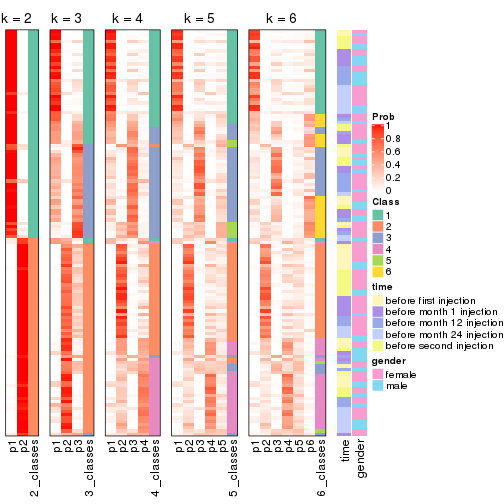


Test correlation between subgroups and known annotations. If the known
annotation is numeric, one-way ANOVA test is applied, and if the known
annotation is discrete, chi-squared contingency table test is applied.

```r
test_to_known_factors(res)
```

```
#>              n time(p) gender(p) k
#> SD:skmeans 125  0.2945    0.8638 2
#> SD:skmeans 103  0.0949    0.5255 3
#> SD:skmeans  64  0.2892    0.1343 4
#> SD:skmeans  57  0.4632    0.0809 5
#> SD:skmeans  28  0.6970    0.2433 6
```


If matrix rows can be associated to genes, consider to use `functional_enrichment(res,
...)` to perform function enrichment for the signature genes. See [this vignette](http://bioconductor.org/packages/devel/bioc/vignettes/cola/inst/doc/functional_enrichment.html) for more detailed explanations.


 

---------------------------------------------------


### SD:pam


The object with results only for a single top-value method and a single partition method 
can be extracted as:

```r
res = res_list["SD", "pam"]
# you can also extract it by
# res = res_list["SD:pam"]
```

A summary of `res` and all the functions that can be applied to it:

```r
res
```

```
#> A 'ConsensusPartition' object with k = 2, 3, 4, 5, 6.
#>   On a matrix with 21512 rows and 125 columns.
#>   Top rows (1000, 2000, 3000, 4000, 5000) are extracted by 'SD' method.
#>   Subgroups are detected by 'pam' method.
#>   Performed in total 1250 partitions by row resampling.
#>   Best k for subgroups seems to be 3.
#> 
#> Following methods can be applied to this 'ConsensusPartition' object:
#>  [1] "cola_report"             "collect_classes"         "collect_plots"          
#>  [4] "collect_stats"           "colnames"                "compare_signatures"     
#>  [7] "consensus_heatmap"       "dimension_reduction"     "functional_enrichment"  
#> [10] "get_anno_col"            "get_anno"                "get_classes"            
#> [13] "get_consensus"           "get_matrix"              "get_membership"         
#> [16] "get_param"               "get_signatures"          "get_stats"              
#> [19] "is_best_k"               "is_stable_k"             "membership_heatmap"     
#> [22] "ncol"                    "nrow"                    "plot_ecdf"              
#> [25] "rownames"                "select_partition_number" "show"                   
#> [28] "suggest_best_k"          "test_to_known_factors"
```

`collect_plots()` function collects all the plots made from `res` for all `k` (number of partitions)
into one single page to provide an easy and fast comparison between different `k`.

```r
collect_plots(res)
```


The plots are:

- The first row: a plot of the ECDF (empirical cumulative distribution
  function) curves of the consensus matrix for each `k` and the heatmap of
  predicted classes for each `k`.
- The second row: heatmaps of the consensus matrix for each `k`.
- The third row: heatmaps of the membership matrix for each `k`.
- The fouth row: heatmaps of the signatures for each `k`.

All the plots in panels can be made by individual functions and they are
plotted later in this section.

`select_partition_number()` produces several plots showing different
statistics for choosing "optimized" `k`. There are following statistics:

- ECDF curves of the consensus matrix for each `k`;
- 1-PAC. [The PAC
  score](https://en.wikipedia.org/wiki/Consensus_clustering#Over-interpretation_potential_of_consensus_clustering)
  measures the proportion of the ambiguous subgrouping.
- Mean silhouette score.
- Concordance. The mean probability of fiting the consensus class ids in all
  partitions.
- Area increased. Denote $A_k$ as the area under the ECDF curve for current
  `k`, the area increased is defined as $A_k - A_{k-1}$.
- Rand index. The percent of pairs of samples that are both in a same cluster
  or both are not in a same cluster in the partition of k and k-1.
- Jaccard index. The ratio of pairs of samples are both in a same cluster in
  the partition of k and k-1 and the pairs of samples are both in a same
  cluster in the partition k or k-1.

The detailed explanations of these statistics can be found in [the _cola_
vignette](http://bioconductor.org/packages/devel/bioc/vignettes/cola/inst/doc/cola.html#toc_13).

Generally speaking, lower PAC score, higher mean silhouette score or higher
concordance corresponds to better partition. Rand index and Jaccard index
measure how similar the current partition is compared to partition with `k-1`.
If they are too similar, we won't accept `k` is better than `k-1`.

```r
select_partition_number(res)
```


The numeric values for all these statistics can be obtained by `get_stats()`.

```r
get_stats(res)
```

```
#>   k 1-PAC mean_silhouette concordance area_increased  Rand Jaccard
#> 2 2 0.567           0.825       0.899         0.4163 0.587   0.587
#> 3 3 0.501           0.757       0.869         0.5043 0.764   0.610
#> 4 4 0.458           0.530       0.779         0.1362 0.917   0.792
#> 5 5 0.482           0.478       0.736         0.0496 0.933   0.798
#> 6 6 0.498           0.471       0.724         0.0179 0.975   0.910
```

`suggest_best_k()` suggests the best $k$ based on these statistics. The rules are as follows:

- All $k$ with Jaccard index larger than 0.95 are removed because increasing
  $k$ does not provide enough extra information. If all $k$ are removed, it is
  marked as no subgroup is detected.
- For all $k$ with 1-PAC score larger than 0.9, the maximal $k$ is taken as
  the best $k$, and other $k$ are marked as optional $k$.
- If it does not fit the second rule. The $k$ with the maximal vote of the
  highest 1-PAC score, highest mean silhouette, and highest concordance is
  taken as the best $k$.

```r
suggest_best_k(res)
```

```
#> [1] 3
```


Following shows the table of the partitions (You need to click the **show/hide
code output** link to see it). The membership matrix (columns with name `p*`)
is inferred by
[`clue::cl_consensus()`](https://www.rdocumentation.org/link/cl_consensus?package=clue)
function with the `SE` method. Basically the value in the membership matrix
represents the probability to belong to a certain group. The finall class
label for an item is determined with the group with highest probability it
belongs to.

In `get_classes()` function, the entropy is calculated from the membership
matrix and the silhouette score is calculated from the consensus matrix.


<script>
$( function() {
	$( '#tabs-SD-pam-get-classes' ).tabs();
} );
</script>
<div id='tabs-SD-pam-get-classes'>
<ul>
<li><a href='#tab-SD-pam-get-classes-1'>k = 2</a></li>
<li><a href='#tab-SD-pam-get-classes-2'>k = 3</a></li>
<li><a href='#tab-SD-pam-get-classes-3'>k = 4</a></li>
<li><a href='#tab-SD-pam-get-classes-4'>k = 5</a></li>
<li><a href='#tab-SD-pam-get-classes-5'>k = 6</a></li>
</ul>

<div id='tab-SD-pam-get-classes-1'>
<p><a id='tab-SD-pam-get-classes-1-a' style='color:#0366d6' href='#'>show/hide code output</a></p>
<pre><code class="r">cbind(get_classes(res, k = 2), get_membership(res, k = 2))
</code></pre>

<pre><code>#&gt;           class entropy silhouette    p1    p2
#&gt; GSM601872     2  0.3879      0.842 0.076 0.924
#&gt; GSM601882     1  0.4022      0.881 0.920 0.080
#&gt; GSM601887     2  0.4022      0.841 0.080 0.920
#&gt; GSM601892     2  0.9983      0.309 0.476 0.524
#&gt; GSM601897     1  0.6531      0.783 0.832 0.168
#&gt; GSM601902     1  0.3274      0.913 0.940 0.060
#&gt; GSM601912     1  0.0376      0.915 0.996 0.004
#&gt; GSM601927     1  0.0672      0.916 0.992 0.008
#&gt; GSM601932     1  0.2423      0.915 0.960 0.040
#&gt; GSM601937     1  0.2778      0.914 0.952 0.048
#&gt; GSM601942     1  0.4298      0.894 0.912 0.088
#&gt; GSM601947     2  0.8499      0.681 0.276 0.724
#&gt; GSM601957     1  0.9933     -0.055 0.548 0.452
#&gt; GSM601972     1  0.6801      0.767 0.820 0.180
#&gt; GSM601977     1  0.9732      0.198 0.596 0.404
#&gt; GSM601987     2  0.7299      0.806 0.204 0.796
#&gt; GSM601877     1  0.3114      0.910 0.944 0.056
#&gt; GSM601907     2  0.2948      0.845 0.052 0.948
#&gt; GSM601917     1  0.3114      0.910 0.944 0.056
#&gt; GSM601922     1  0.3584      0.910 0.932 0.068
#&gt; GSM601952     1  0.3733      0.909 0.928 0.072
#&gt; GSM601962     1  0.4161      0.902 0.916 0.084
#&gt; GSM601967     1  0.4939      0.888 0.892 0.108
#&gt; GSM601982     1  0.3879      0.890 0.924 0.076
#&gt; GSM601992     1  0.1184      0.915 0.984 0.016
#&gt; GSM601873     2  0.8327      0.731 0.264 0.736
#&gt; GSM601883     1  0.9460      0.290 0.636 0.364
#&gt; GSM601888     2  0.0672      0.837 0.008 0.992
#&gt; GSM601893     1  0.9000      0.462 0.684 0.316
#&gt; GSM601898     1  0.1843      0.918 0.972 0.028
#&gt; GSM601903     1  0.3879      0.903 0.924 0.076
#&gt; GSM601913     1  0.0672      0.917 0.992 0.008
#&gt; GSM601928     1  0.3431      0.912 0.936 0.064
#&gt; GSM601933     2  0.5408      0.839 0.124 0.876
#&gt; GSM601938     2  0.2603      0.843 0.044 0.956
#&gt; GSM601943     2  0.9209      0.654 0.336 0.664
#&gt; GSM601948     2  0.8207      0.690 0.256 0.744
#&gt; GSM601958     1  0.0376      0.915 0.996 0.004
#&gt; GSM601973     1  0.1843      0.917 0.972 0.028
#&gt; GSM601978     2  0.3114      0.844 0.056 0.944
#&gt; GSM601988     1  0.0938      0.913 0.988 0.012
#&gt; GSM601878     1  0.4022      0.903 0.920 0.080
#&gt; GSM601908     2  0.6343      0.825 0.160 0.840
#&gt; GSM601918     2  0.9286      0.560 0.344 0.656
#&gt; GSM601923     1  0.3733      0.904 0.928 0.072
#&gt; GSM601953     2  0.0938      0.838 0.012 0.988
#&gt; GSM601963     1  0.1843      0.915 0.972 0.028
#&gt; GSM601968     2  0.8813      0.689 0.300 0.700
#&gt; GSM601983     1  0.1843      0.918 0.972 0.028
#&gt; GSM601993     1  0.0376      0.916 0.996 0.004
#&gt; GSM601874     2  0.4690      0.844 0.100 0.900
#&gt; GSM601884     1  0.6623      0.790 0.828 0.172
#&gt; GSM601889     1  0.6148      0.799 0.848 0.152
#&gt; GSM601894     1  0.0938      0.913 0.988 0.012
#&gt; GSM601899     2  0.2043      0.844 0.032 0.968
#&gt; GSM601904     1  0.3879      0.907 0.924 0.076
#&gt; GSM601914     1  0.4431      0.905 0.908 0.092
#&gt; GSM601929     1  0.3274      0.911 0.940 0.060
#&gt; GSM601934     2  0.9754      0.463 0.408 0.592
#&gt; GSM601939     1  0.2236      0.914 0.964 0.036
#&gt; GSM601944     1  0.1414      0.915 0.980 0.020
#&gt; GSM601949     2  0.9087      0.634 0.324 0.676
#&gt; GSM601959     1  0.2603      0.908 0.956 0.044
#&gt; GSM601974     1  0.2423      0.915 0.960 0.040
#&gt; GSM601979     2  0.2603      0.843 0.044 0.956
#&gt; GSM601989     1  0.0672      0.914 0.992 0.008
#&gt; GSM601879     1  0.3274      0.910 0.940 0.060
#&gt; GSM601909     2  0.8661      0.674 0.288 0.712
#&gt; GSM601919     2  0.1633      0.834 0.024 0.976
#&gt; GSM601924     1  0.3114      0.910 0.944 0.056
#&gt; GSM601954     2  0.0000      0.833 0.000 1.000
#&gt; GSM601964     1  0.2603      0.915 0.956 0.044
#&gt; GSM601969     2  0.9427      0.571 0.360 0.640
#&gt; GSM601984     1  0.1414      0.916 0.980 0.020
#&gt; GSM601994     1  0.2423      0.908 0.960 0.040
#&gt; GSM601875     2  0.2043      0.844 0.032 0.968
#&gt; GSM601885     2  0.4815      0.843 0.104 0.896
#&gt; GSM601890     2  0.1184      0.838 0.016 0.984
#&gt; GSM601895     1  0.0376      0.915 0.996 0.004
#&gt; GSM601900     1  0.6712      0.766 0.824 0.176
#&gt; GSM601905     1  0.1184      0.918 0.984 0.016
#&gt; GSM601915     1  0.0000      0.915 1.000 0.000
#&gt; GSM601930     1  0.2778      0.911 0.952 0.048
#&gt; GSM601935     1  0.0000      0.915 1.000 0.000
#&gt; GSM601940     1  0.0672      0.916 0.992 0.008
#&gt; GSM601945     2  0.3733      0.842 0.072 0.928
#&gt; GSM601950     1  0.6973      0.791 0.812 0.188
#&gt; GSM601960     1  0.3431      0.909 0.936 0.064
#&gt; GSM601975     1  0.3431      0.907 0.936 0.064
#&gt; GSM601980     2  0.8081      0.734 0.248 0.752
#&gt; GSM601990     1  0.2043      0.916 0.968 0.032
#&gt; GSM601880     1  0.2778      0.912 0.952 0.048
#&gt; GSM601910     1  0.9686      0.331 0.604 0.396
#&gt; GSM601920     1  0.8813      0.576 0.700 0.300
#&gt; GSM601925     1  0.4161      0.902 0.916 0.084
#&gt; GSM601955     1  0.9922      0.162 0.552 0.448
#&gt; GSM601965     1  0.3274      0.909 0.940 0.060
#&gt; GSM601970     1  0.4161      0.908 0.916 0.084
#&gt; GSM601985     1  0.0672      0.916 0.992 0.008
#&gt; GSM601995     1  0.2778      0.902 0.952 0.048
#&gt; GSM601876     1  0.0376      0.915 0.996 0.004
#&gt; GSM601886     1  0.1414      0.917 0.980 0.020
#&gt; GSM601891     2  0.0938      0.838 0.012 0.988
#&gt; GSM601896     1  0.0376      0.915 0.996 0.004
#&gt; GSM601901     1  0.3274      0.904 0.940 0.060
#&gt; GSM601906     1  0.1843      0.917 0.972 0.028
#&gt; GSM601916     1  0.2423      0.918 0.960 0.040
#&gt; GSM601931     1  0.2603      0.910 0.956 0.044
#&gt; GSM601936     1  0.0938      0.913 0.988 0.012
#&gt; GSM601941     1  0.3584      0.909 0.932 0.068
#&gt; GSM601946     1  0.0000      0.915 1.000 0.000
#&gt; GSM601951     1  0.3114      0.915 0.944 0.056
#&gt; GSM601961     2  0.2948      0.844 0.052 0.948
#&gt; GSM601976     1  0.3114      0.899 0.944 0.056
#&gt; GSM601981     2  0.7219      0.809 0.200 0.800
#&gt; GSM601991     1  0.0000      0.915 1.000 0.000
#&gt; GSM601881     1  0.2603      0.912 0.956 0.044
#&gt; GSM601911     1  0.0376      0.916 0.996 0.004
#&gt; GSM601921     2  0.8608      0.667 0.284 0.716
#&gt; GSM601926     1  0.2603      0.910 0.956 0.044
#&gt; GSM601956     2  0.2423      0.843 0.040 0.960
#&gt; GSM601966     1  0.3584      0.896 0.932 0.068
#&gt; GSM601971     1  0.6148      0.854 0.848 0.152
#&gt; GSM601986     1  0.2603      0.910 0.956 0.044
#&gt; GSM601996     1  0.0672      0.914 0.992 0.008
</code></pre>

<script>
$('#tab-SD-pam-get-classes-1-a').parent().next().next().hide();
$('#tab-SD-pam-get-classes-1-a').click(function(){
  $('#tab-SD-pam-get-classes-1-a').parent().next().next().toggle();
  return(false);
});
</script>
</div>

<div id='tab-SD-pam-get-classes-2'>
<p><a id='tab-SD-pam-get-classes-2-a' style='color:#0366d6' href='#'>show/hide code output</a></p>
<pre><code class="r">cbind(get_classes(res, k = 3), get_membership(res, k = 3))
</code></pre>

<pre><code>#&gt;           class entropy silhouette    p1    p2    p3
#&gt; GSM601872     3  0.0237     0.8645 0.004 0.000 0.996
#&gt; GSM601882     2  0.2625     0.8340 0.000 0.916 0.084
#&gt; GSM601887     3  0.0661     0.8641 0.008 0.004 0.988
#&gt; GSM601892     3  0.6168     0.2693 0.000 0.412 0.588
#&gt; GSM601897     2  0.4261     0.7847 0.012 0.848 0.140
#&gt; GSM601902     2  0.6008     0.4901 0.372 0.628 0.000
#&gt; GSM601912     2  0.0000     0.8467 0.000 1.000 0.000
#&gt; GSM601927     2  0.6305    -0.0835 0.484 0.516 0.000
#&gt; GSM601932     2  0.1399     0.8506 0.028 0.968 0.004
#&gt; GSM601937     2  0.1636     0.8517 0.016 0.964 0.020
#&gt; GSM601942     2  0.2584     0.8441 0.008 0.928 0.064
#&gt; GSM601947     1  0.0829     0.8711 0.984 0.004 0.012
#&gt; GSM601957     2  0.7446     0.1327 0.036 0.532 0.432
#&gt; GSM601972     2  0.4915     0.7455 0.012 0.804 0.184
#&gt; GSM601977     2  0.6260     0.2469 0.000 0.552 0.448
#&gt; GSM601987     3  0.3482     0.8131 0.000 0.128 0.872
#&gt; GSM601877     1  0.1031     0.8758 0.976 0.024 0.000
#&gt; GSM601907     3  0.0000     0.8643 0.000 0.000 1.000
#&gt; GSM601917     1  0.1647     0.8765 0.960 0.036 0.004
#&gt; GSM601922     1  0.3610     0.8475 0.888 0.096 0.016
#&gt; GSM601952     2  0.4277     0.8135 0.132 0.852 0.016
#&gt; GSM601962     2  0.6235     0.3879 0.436 0.564 0.000
#&gt; GSM601967     1  0.3116     0.8337 0.892 0.108 0.000
#&gt; GSM601982     2  0.5635     0.7659 0.180 0.784 0.036
#&gt; GSM601992     2  0.2443     0.8527 0.032 0.940 0.028
#&gt; GSM601873     3  0.5070     0.7134 0.004 0.224 0.772
#&gt; GSM601883     2  0.6434     0.3609 0.008 0.612 0.380
#&gt; GSM601888     3  0.0592     0.8625 0.012 0.000 0.988
#&gt; GSM601893     2  0.5835     0.5141 0.000 0.660 0.340
#&gt; GSM601898     2  0.4062     0.7741 0.164 0.836 0.000
#&gt; GSM601903     2  0.5047     0.8088 0.140 0.824 0.036
#&gt; GSM601913     2  0.3116     0.8317 0.108 0.892 0.000
#&gt; GSM601928     1  0.4555     0.7666 0.800 0.200 0.000
#&gt; GSM601933     3  0.2096     0.8559 0.004 0.052 0.944
#&gt; GSM601938     3  0.0237     0.8645 0.004 0.000 0.996
#&gt; GSM601943     3  0.6082     0.6003 0.012 0.296 0.692
#&gt; GSM601948     1  0.1015     0.8722 0.980 0.008 0.012
#&gt; GSM601958     2  0.2261     0.8375 0.068 0.932 0.000
#&gt; GSM601973     2  0.1399     0.8501 0.028 0.968 0.004
#&gt; GSM601978     3  0.0000     0.8643 0.000 0.000 1.000
#&gt; GSM601988     2  0.0000     0.8467 0.000 1.000 0.000
#&gt; GSM601878     1  0.0829     0.8748 0.984 0.012 0.004
#&gt; GSM601908     3  0.3784     0.8098 0.004 0.132 0.864
#&gt; GSM601918     1  0.0892     0.8690 0.980 0.000 0.020
#&gt; GSM601923     1  0.0592     0.8754 0.988 0.012 0.000
#&gt; GSM601953     3  0.0000     0.8643 0.000 0.000 1.000
#&gt; GSM601963     2  0.4654     0.7533 0.208 0.792 0.000
#&gt; GSM601968     3  0.7453     0.6514 0.092 0.228 0.680
#&gt; GSM601983     2  0.4235     0.7824 0.176 0.824 0.000
#&gt; GSM601993     2  0.1015     0.8494 0.008 0.980 0.012
#&gt; GSM601874     3  0.1832     0.8594 0.008 0.036 0.956
#&gt; GSM601884     2  0.4291     0.7824 0.008 0.840 0.152
#&gt; GSM601889     2  0.4645     0.7596 0.008 0.816 0.176
#&gt; GSM601894     2  0.0661     0.8494 0.008 0.988 0.004
#&gt; GSM601899     3  0.0592     0.8625 0.012 0.000 0.988
#&gt; GSM601904     2  0.5465     0.6787 0.288 0.712 0.000
#&gt; GSM601914     2  0.5992     0.6954 0.268 0.716 0.016
#&gt; GSM601929     1  0.2860     0.8654 0.912 0.084 0.004
#&gt; GSM601934     3  0.6648     0.4080 0.016 0.364 0.620
#&gt; GSM601939     1  0.5404     0.7128 0.740 0.256 0.004
#&gt; GSM601944     2  0.0829     0.8512 0.004 0.984 0.012
#&gt; GSM601949     1  0.7572     0.6609 0.688 0.128 0.184
#&gt; GSM601959     2  0.1585     0.8514 0.008 0.964 0.028
#&gt; GSM601974     2  0.4291     0.7622 0.180 0.820 0.000
#&gt; GSM601979     3  0.0000     0.8643 0.000 0.000 1.000
#&gt; GSM601989     2  0.0237     0.8475 0.000 0.996 0.004
#&gt; GSM601879     1  0.0592     0.8751 0.988 0.012 0.000
#&gt; GSM601909     1  0.2599     0.8562 0.932 0.016 0.052
#&gt; GSM601919     1  0.0424     0.8703 0.992 0.000 0.008
#&gt; GSM601924     1  0.0829     0.8743 0.984 0.012 0.004
#&gt; GSM601954     3  0.2711     0.8150 0.088 0.000 0.912
#&gt; GSM601964     2  0.3752     0.8061 0.144 0.856 0.000
#&gt; GSM601969     3  0.9292     0.3763 0.272 0.208 0.520
#&gt; GSM601984     2  0.4399     0.7752 0.188 0.812 0.000
#&gt; GSM601994     2  0.2384     0.8483 0.008 0.936 0.056
#&gt; GSM601875     3  0.0592     0.8658 0.000 0.012 0.988
#&gt; GSM601885     3  0.2749     0.8464 0.012 0.064 0.924
#&gt; GSM601890     3  0.0592     0.8625 0.012 0.000 0.988
#&gt; GSM601895     2  0.0237     0.8471 0.004 0.996 0.000
#&gt; GSM601900     2  0.7027     0.7050 0.104 0.724 0.172
#&gt; GSM601905     2  0.0892     0.8503 0.020 0.980 0.000
#&gt; GSM601915     2  0.2625     0.8278 0.084 0.916 0.000
#&gt; GSM601930     1  0.1529     0.8773 0.960 0.040 0.000
#&gt; GSM601935     2  0.0424     0.8473 0.008 0.992 0.000
#&gt; GSM601940     2  0.4178     0.7653 0.172 0.828 0.000
#&gt; GSM601945     3  0.0237     0.8653 0.000 0.004 0.996
#&gt; GSM601950     1  0.5365     0.6971 0.744 0.252 0.004
#&gt; GSM601960     2  0.5431     0.6646 0.284 0.716 0.000
#&gt; GSM601975     2  0.2318     0.8528 0.028 0.944 0.028
#&gt; GSM601980     3  0.7107     0.6815 0.092 0.196 0.712
#&gt; GSM601990     2  0.1860     0.8498 0.052 0.948 0.000
#&gt; GSM601880     1  0.1529     0.8774 0.960 0.040 0.000
#&gt; GSM601910     2  0.7962     0.3889 0.072 0.576 0.352
#&gt; GSM601920     1  0.6351     0.7477 0.760 0.168 0.072
#&gt; GSM601925     1  0.0424     0.8740 0.992 0.008 0.000
#&gt; GSM601955     2  0.9491     0.3164 0.220 0.488 0.292
#&gt; GSM601965     2  0.5785     0.5944 0.332 0.668 0.000
#&gt; GSM601970     1  0.6676     0.0422 0.516 0.476 0.008
#&gt; GSM601985     2  0.1529     0.8504 0.040 0.960 0.000
#&gt; GSM601995     2  0.2200     0.8471 0.004 0.940 0.056
#&gt; GSM601876     2  0.0592     0.8480 0.012 0.988 0.000
#&gt; GSM601886     2  0.0592     0.8481 0.012 0.988 0.000
#&gt; GSM601891     3  0.0829     0.8644 0.012 0.004 0.984
#&gt; GSM601896     2  0.0424     0.8479 0.008 0.992 0.000
#&gt; GSM601901     2  0.1832     0.8506 0.008 0.956 0.036
#&gt; GSM601906     2  0.2165     0.8494 0.064 0.936 0.000
#&gt; GSM601916     2  0.2625     0.8453 0.084 0.916 0.000
#&gt; GSM601931     1  0.2878     0.8609 0.904 0.096 0.000
#&gt; GSM601936     2  0.0475     0.8481 0.004 0.992 0.004
#&gt; GSM601941     2  0.3502     0.8446 0.084 0.896 0.020
#&gt; GSM601946     2  0.0747     0.8495 0.016 0.984 0.000
#&gt; GSM601951     1  0.5285     0.7246 0.752 0.244 0.004
#&gt; GSM601961     3  0.0661     0.8647 0.004 0.008 0.988
#&gt; GSM601976     2  0.2280     0.8481 0.008 0.940 0.052
#&gt; GSM601981     3  0.4912     0.7614 0.008 0.196 0.796
#&gt; GSM601991     2  0.0237     0.8472 0.004 0.996 0.000
#&gt; GSM601881     1  0.1964     0.8736 0.944 0.056 0.000
#&gt; GSM601911     2  0.0424     0.8483 0.008 0.992 0.000
#&gt; GSM601921     1  0.8975     0.1180 0.484 0.132 0.384
#&gt; GSM601926     1  0.1031     0.8755 0.976 0.024 0.000
#&gt; GSM601956     3  0.0592     0.8643 0.012 0.000 0.988
#&gt; GSM601966     2  0.2955     0.8380 0.008 0.912 0.080
#&gt; GSM601971     1  0.0661     0.8734 0.988 0.008 0.004
#&gt; GSM601986     2  0.6204     0.3866 0.424 0.576 0.000
#&gt; GSM601996     2  0.1182     0.8499 0.012 0.976 0.012
</code></pre>

<script>
$('#tab-SD-pam-get-classes-2-a').parent().next().next().hide();
$('#tab-SD-pam-get-classes-2-a').click(function(){
  $('#tab-SD-pam-get-classes-2-a').parent().next().next().toggle();
  return(false);
});
</script>
</div>

<div id='tab-SD-pam-get-classes-3'>
<p><a id='tab-SD-pam-get-classes-3-a' style='color:#0366d6' href='#'>show/hide code output</a></p>
<pre><code class="r">cbind(get_classes(res, k = 4), get_membership(res, k = 4))
</code></pre>

<pre><code>#&gt;           class entropy silhouette    p1    p2    p3    p4
#&gt; GSM601872     2  0.0188    0.75440 0.000 0.996 0.000 0.004
#&gt; GSM601882     3  0.6080   -0.29652 0.000 0.044 0.488 0.468
#&gt; GSM601887     2  0.0000    0.75551 0.000 1.000 0.000 0.000
#&gt; GSM601892     2  0.4888    0.16328 0.000 0.588 0.412 0.000
#&gt; GSM601897     3  0.6344    0.49497 0.000 0.128 0.648 0.224
#&gt; GSM601902     3  0.7289    0.33727 0.252 0.000 0.536 0.212
#&gt; GSM601912     3  0.0336    0.67902 0.000 0.000 0.992 0.008
#&gt; GSM601927     3  0.5000   -0.09479 0.496 0.000 0.504 0.000
#&gt; GSM601932     3  0.4819    0.43732 0.004 0.000 0.652 0.344
#&gt; GSM601937     3  0.4262    0.58603 0.000 0.008 0.756 0.236
#&gt; GSM601942     4  0.4635    0.52534 0.000 0.012 0.268 0.720
#&gt; GSM601947     1  0.4999    0.41718 0.508 0.000 0.000 0.492
#&gt; GSM601957     3  0.6671    0.02090 0.024 0.424 0.512 0.040
#&gt; GSM601972     4  0.6188    0.27946 0.000 0.056 0.396 0.548
#&gt; GSM601977     2  0.7871   -0.25264 0.000 0.384 0.284 0.332
#&gt; GSM601987     2  0.6195    0.41688 0.000 0.648 0.100 0.252
#&gt; GSM601877     1  0.0000    0.81151 1.000 0.000 0.000 0.000
#&gt; GSM601907     2  0.0188    0.75450 0.000 0.996 0.000 0.004
#&gt; GSM601917     1  0.1174    0.81465 0.968 0.000 0.012 0.020
#&gt; GSM601922     1  0.5361    0.63968 0.716 0.000 0.060 0.224
#&gt; GSM601952     3  0.5467    0.35529 0.008 0.008 0.584 0.400
#&gt; GSM601962     3  0.6714    0.37718 0.360 0.000 0.540 0.100
#&gt; GSM601967     1  0.2401    0.76972 0.904 0.000 0.092 0.004
#&gt; GSM601982     3  0.7956   -0.03559 0.176 0.020 0.476 0.328
#&gt; GSM601992     3  0.5989   -0.24216 0.024 0.008 0.496 0.472
#&gt; GSM601873     2  0.7114    0.27679 0.004 0.584 0.192 0.220
#&gt; GSM601883     4  0.6626    0.50825 0.008 0.084 0.312 0.596
#&gt; GSM601888     2  0.0000    0.75551 0.000 1.000 0.000 0.000
#&gt; GSM601893     3  0.4624    0.36087 0.000 0.340 0.660 0.000
#&gt; GSM601898     3  0.3862    0.62826 0.152 0.000 0.824 0.024
#&gt; GSM601903     3  0.6125    0.23020 0.048 0.000 0.516 0.436
#&gt; GSM601913     3  0.3342    0.67994 0.100 0.000 0.868 0.032
#&gt; GSM601928     1  0.4756    0.72730 0.772 0.000 0.052 0.176
#&gt; GSM601933     2  0.2983    0.70087 0.000 0.892 0.040 0.068
#&gt; GSM601938     4  0.4933    0.01578 0.000 0.432 0.000 0.568
#&gt; GSM601943     2  0.7472    0.06148 0.000 0.504 0.264 0.232
#&gt; GSM601948     1  0.5095    0.57584 0.624 0.004 0.004 0.368
#&gt; GSM601958     3  0.1792    0.67234 0.068 0.000 0.932 0.000
#&gt; GSM601973     4  0.4978    0.29034 0.004 0.000 0.384 0.612
#&gt; GSM601978     2  0.0188    0.75440 0.000 0.996 0.000 0.004
#&gt; GSM601988     3  0.0707    0.67810 0.000 0.000 0.980 0.020
#&gt; GSM601878     1  0.0000    0.81151 1.000 0.000 0.000 0.000
#&gt; GSM601908     4  0.6792    0.04451 0.000 0.428 0.096 0.476
#&gt; GSM601918     1  0.5360    0.41211 0.552 0.012 0.000 0.436
#&gt; GSM601923     1  0.0376    0.81262 0.992 0.000 0.004 0.004
#&gt; GSM601953     2  0.0000    0.75551 0.000 1.000 0.000 0.000
#&gt; GSM601963     3  0.4464    0.60889 0.208 0.000 0.768 0.024
#&gt; GSM601968     2  0.6189    0.43347 0.092 0.676 0.224 0.008
#&gt; GSM601983     3  0.4553    0.62508 0.180 0.000 0.780 0.040
#&gt; GSM601993     3  0.4679    0.24706 0.000 0.000 0.648 0.352
#&gt; GSM601874     2  0.4936    0.45143 0.000 0.672 0.012 0.316
#&gt; GSM601884     4  0.5436    0.44347 0.000 0.024 0.356 0.620
#&gt; GSM601889     3  0.3636    0.59939 0.000 0.172 0.820 0.008
#&gt; GSM601894     3  0.0336    0.67965 0.000 0.000 0.992 0.008
#&gt; GSM601899     2  0.0188    0.75441 0.000 0.996 0.000 0.004
#&gt; GSM601904     3  0.6508    0.45700 0.104 0.000 0.600 0.296
#&gt; GSM601914     3  0.6362    0.55617 0.176 0.000 0.656 0.168
#&gt; GSM601929     1  0.1978    0.80407 0.928 0.000 0.068 0.004
#&gt; GSM601934     2  0.5818    0.20606 0.004 0.600 0.364 0.032
#&gt; GSM601939     1  0.4252    0.63288 0.744 0.000 0.252 0.004
#&gt; GSM601944     3  0.2179    0.66551 0.000 0.012 0.924 0.064
#&gt; GSM601949     1  0.7446    0.59756 0.636 0.140 0.064 0.160
#&gt; GSM601959     3  0.1733    0.68137 0.000 0.028 0.948 0.024
#&gt; GSM601974     3  0.6323    0.51021 0.164 0.000 0.660 0.176
#&gt; GSM601979     2  0.0000    0.75551 0.000 1.000 0.000 0.000
#&gt; GSM601989     3  0.0000    0.67741 0.000 0.000 1.000 0.000
#&gt; GSM601879     1  0.0000    0.81151 1.000 0.000 0.000 0.000
#&gt; GSM601909     1  0.2967    0.79558 0.904 0.028 0.016 0.052
#&gt; GSM601919     1  0.2345    0.77874 0.900 0.000 0.000 0.100
#&gt; GSM601924     1  0.0000    0.81151 1.000 0.000 0.000 0.000
#&gt; GSM601954     2  0.3168    0.68454 0.060 0.884 0.000 0.056
#&gt; GSM601964     3  0.4514    0.64779 0.064 0.000 0.800 0.136
#&gt; GSM601969     2  0.8628    0.15082 0.216 0.512 0.188 0.084
#&gt; GSM601984     3  0.3810    0.63771 0.188 0.000 0.804 0.008
#&gt; GSM601994     4  0.5755    0.31580 0.000 0.028 0.444 0.528
#&gt; GSM601875     2  0.0188    0.75447 0.000 0.996 0.004 0.000
#&gt; GSM601885     2  0.5614    0.34567 0.000 0.628 0.036 0.336
#&gt; GSM601890     2  0.0000    0.75551 0.000 1.000 0.000 0.000
#&gt; GSM601895     3  0.0336    0.67877 0.000 0.000 0.992 0.008
#&gt; GSM601900     3  0.6159    0.55122 0.088 0.160 0.720 0.032
#&gt; GSM601905     3  0.0707    0.68421 0.020 0.000 0.980 0.000
#&gt; GSM601915     3  0.2542    0.66563 0.084 0.000 0.904 0.012
#&gt; GSM601930     1  0.1059    0.81585 0.972 0.000 0.016 0.012
#&gt; GSM601935     3  0.1716    0.68564 0.000 0.000 0.936 0.064
#&gt; GSM601940     3  0.3219    0.62910 0.164 0.000 0.836 0.000
#&gt; GSM601945     2  0.0000    0.75551 0.000 1.000 0.000 0.000
#&gt; GSM601950     1  0.5798    0.62347 0.696 0.000 0.208 0.096
#&gt; GSM601960     3  0.6473    0.51196 0.188 0.000 0.644 0.168
#&gt; GSM601975     3  0.4548    0.59830 0.008 0.008 0.752 0.232
#&gt; GSM601980     4  0.4929    0.36668 0.008 0.236 0.020 0.736
#&gt; GSM601990     3  0.3577    0.66285 0.012 0.000 0.832 0.156
#&gt; GSM601880     1  0.0895    0.81531 0.976 0.000 0.020 0.004
#&gt; GSM601910     3  0.7997    0.23807 0.028 0.268 0.516 0.188
#&gt; GSM601920     1  0.4819    0.68705 0.784 0.060 0.152 0.004
#&gt; GSM601925     1  0.0336    0.81300 0.992 0.000 0.000 0.008
#&gt; GSM601955     3  0.9087   -0.00762 0.092 0.176 0.388 0.344
#&gt; GSM601965     3  0.4605    0.49444 0.336 0.000 0.664 0.000
#&gt; GSM601970     1  0.7269    0.08245 0.456 0.000 0.396 0.148
#&gt; GSM601985     3  0.1118    0.68680 0.036 0.000 0.964 0.000
#&gt; GSM601995     3  0.5673    0.11971 0.000 0.032 0.596 0.372
#&gt; GSM601876     3  0.1022    0.67957 0.000 0.000 0.968 0.032
#&gt; GSM601886     3  0.1557    0.68306 0.000 0.000 0.944 0.056
#&gt; GSM601891     2  0.0000    0.75551 0.000 1.000 0.000 0.000
#&gt; GSM601896     3  0.0000    0.67741 0.000 0.000 1.000 0.000
#&gt; GSM601901     3  0.2500    0.67994 0.000 0.040 0.916 0.044
#&gt; GSM601906     3  0.4008    0.65451 0.032 0.000 0.820 0.148
#&gt; GSM601916     3  0.3638    0.67015 0.032 0.000 0.848 0.120
#&gt; GSM601931     1  0.1716    0.80528 0.936 0.000 0.064 0.000
#&gt; GSM601936     3  0.0469    0.67936 0.000 0.000 0.988 0.012
#&gt; GSM601941     4  0.3142    0.53106 0.008 0.000 0.132 0.860
#&gt; GSM601946     3  0.1209    0.68118 0.004 0.000 0.964 0.032
#&gt; GSM601951     1  0.6316    0.61985 0.660 0.000 0.184 0.156
#&gt; GSM601961     2  0.0000    0.75551 0.000 1.000 0.000 0.000
#&gt; GSM601976     3  0.2759    0.67796 0.000 0.052 0.904 0.044
#&gt; GSM601981     2  0.4820    0.56418 0.000 0.772 0.168 0.060
#&gt; GSM601991     3  0.0817    0.68118 0.000 0.000 0.976 0.024
#&gt; GSM601881     1  0.1302    0.81184 0.956 0.000 0.044 0.000
#&gt; GSM601911     3  0.0376    0.67993 0.004 0.000 0.992 0.004
#&gt; GSM601921     4  0.8768    0.19104 0.256 0.232 0.060 0.452
#&gt; GSM601926     1  0.0188    0.81289 0.996 0.000 0.004 0.000
#&gt; GSM601956     2  0.1022    0.74281 0.000 0.968 0.000 0.032
#&gt; GSM601966     3  0.6310   -0.14511 0.000 0.060 0.512 0.428
#&gt; GSM601971     1  0.3649    0.73064 0.796 0.000 0.000 0.204
#&gt; GSM601986     3  0.5229    0.36591 0.428 0.000 0.564 0.008
#&gt; GSM601996     3  0.5203   -0.03949 0.008 0.000 0.576 0.416
</code></pre>

<script>
$('#tab-SD-pam-get-classes-3-a').parent().next().next().hide();
$('#tab-SD-pam-get-classes-3-a').click(function(){
  $('#tab-SD-pam-get-classes-3-a').parent().next().next().toggle();
  return(false);
});
</script>
</div>

<div id='tab-SD-pam-get-classes-4'>
<p><a id='tab-SD-pam-get-classes-4-a' style='color:#0366d6' href='#'>show/hide code output</a></p>
<pre><code class="r">cbind(get_classes(res, k = 5), get_membership(res, k = 5))
</code></pre>

<pre><code>#&gt;           class entropy silhouette    p1    p2    p3    p4    p5
#&gt; GSM601872     2  0.0162    0.76054 0.000 0.996 0.000 0.000 0.004
#&gt; GSM601882     5  0.5564    0.44643 0.000 0.032 0.456 0.020 0.492
#&gt; GSM601887     2  0.0000    0.76129 0.000 1.000 0.000 0.000 0.000
#&gt; GSM601892     2  0.4210    0.17317 0.000 0.588 0.412 0.000 0.000
#&gt; GSM601897     3  0.7492    0.35091 0.000 0.096 0.496 0.148 0.260
#&gt; GSM601902     3  0.7146    0.22272 0.232 0.000 0.492 0.240 0.036
#&gt; GSM601912     3  0.0992    0.66775 0.000 0.000 0.968 0.008 0.024
#&gt; GSM601927     3  0.4307   -0.09120 0.496 0.000 0.504 0.000 0.000
#&gt; GSM601932     3  0.4883    0.16935 0.004 0.000 0.516 0.464 0.016
#&gt; GSM601937     3  0.5654    0.39900 0.000 0.008 0.592 0.076 0.324
#&gt; GSM601942     5  0.6431    0.28458 0.000 0.008 0.176 0.280 0.536
#&gt; GSM601947     4  0.3700    0.37089 0.240 0.000 0.000 0.752 0.008
#&gt; GSM601957     3  0.7529   -0.07257 0.020 0.336 0.440 0.176 0.028
#&gt; GSM601972     4  0.6996    0.12203 0.000 0.036 0.280 0.508 0.176
#&gt; GSM601977     5  0.7388    0.30820 0.000 0.348 0.272 0.028 0.352
#&gt; GSM601987     2  0.5717    0.37256 0.000 0.608 0.092 0.008 0.292
#&gt; GSM601877     1  0.0000    0.75865 1.000 0.000 0.000 0.000 0.000
#&gt; GSM601907     2  0.0162    0.76064 0.000 0.996 0.000 0.000 0.004
#&gt; GSM601917     1  0.2116    0.73853 0.912 0.000 0.008 0.076 0.004
#&gt; GSM601922     1  0.5807    0.43599 0.664 0.000 0.052 0.220 0.064
#&gt; GSM601952     3  0.4700    0.18388 0.000 0.008 0.516 0.472 0.004
#&gt; GSM601962     3  0.6814    0.39136 0.184 0.000 0.500 0.020 0.296
#&gt; GSM601967     1  0.2295    0.70630 0.900 0.000 0.088 0.004 0.008
#&gt; GSM601982     3  0.6169   -0.25853 0.084 0.016 0.452 0.000 0.448
#&gt; GSM601992     5  0.5146    0.45943 0.016 0.000 0.428 0.016 0.540
#&gt; GSM601873     2  0.6179    0.26366 0.004 0.572 0.180 0.000 0.244
#&gt; GSM601883     5  0.7355    0.42465 0.004 0.060 0.280 0.156 0.500
#&gt; GSM601888     2  0.0000    0.76129 0.000 1.000 0.000 0.000 0.000
#&gt; GSM601893     3  0.3983    0.36444 0.000 0.340 0.660 0.000 0.000
#&gt; GSM601898     3  0.5325    0.56397 0.136 0.000 0.732 0.076 0.056
#&gt; GSM601903     4  0.5847   -0.11445 0.032 0.000 0.452 0.480 0.036
#&gt; GSM601913     3  0.3815    0.66774 0.088 0.000 0.832 0.020 0.060
#&gt; GSM601928     1  0.4118    0.62102 0.772 0.000 0.032 0.188 0.008
#&gt; GSM601933     2  0.3243    0.68933 0.000 0.848 0.032 0.004 0.116
#&gt; GSM601938     5  0.6288    0.11246 0.000 0.372 0.000 0.156 0.472
#&gt; GSM601943     2  0.7441   -0.00601 0.000 0.476 0.256 0.060 0.208
#&gt; GSM601948     4  0.4367    0.01878 0.416 0.004 0.000 0.580 0.000
#&gt; GSM601958     3  0.2102    0.65688 0.068 0.000 0.916 0.004 0.012
#&gt; GSM601973     4  0.6702   -0.09121 0.000 0.000 0.344 0.408 0.248
#&gt; GSM601978     2  0.0404    0.75851 0.000 0.988 0.000 0.000 0.012
#&gt; GSM601988     3  0.1043    0.66016 0.000 0.000 0.960 0.000 0.040
#&gt; GSM601878     1  0.0000    0.75865 1.000 0.000 0.000 0.000 0.000
#&gt; GSM601908     5  0.7043    0.15650 0.000 0.360 0.064 0.104 0.472
#&gt; GSM601918     4  0.5554    0.26993 0.328 0.004 0.000 0.592 0.076
#&gt; GSM601923     1  0.0162    0.75854 0.996 0.000 0.000 0.004 0.000
#&gt; GSM601953     2  0.0000    0.76129 0.000 1.000 0.000 0.000 0.000
#&gt; GSM601963     3  0.5382    0.53573 0.120 0.000 0.656 0.000 0.224
#&gt; GSM601968     2  0.5386    0.45141 0.088 0.676 0.224 0.012 0.000
#&gt; GSM601983     3  0.5551    0.48348 0.104 0.000 0.612 0.000 0.284
#&gt; GSM601993     3  0.4924   -0.01071 0.000 0.000 0.552 0.028 0.420
#&gt; GSM601874     2  0.6373    0.36508 0.000 0.572 0.012 0.204 0.212
#&gt; GSM601884     5  0.4622    0.40911 0.000 0.012 0.164 0.068 0.756
#&gt; GSM601889     3  0.4992    0.52765 0.000 0.168 0.728 0.092 0.012
#&gt; GSM601894     3  0.0290    0.66061 0.000 0.000 0.992 0.008 0.000
#&gt; GSM601899     2  0.1197    0.74260 0.000 0.952 0.000 0.048 0.000
#&gt; GSM601904     3  0.6210    0.45029 0.084 0.000 0.588 0.292 0.036
#&gt; GSM601914     3  0.7291    0.37420 0.080 0.000 0.480 0.120 0.320
#&gt; GSM601929     1  0.1768    0.74338 0.924 0.000 0.072 0.004 0.000
#&gt; GSM601934     2  0.6192    0.13861 0.004 0.536 0.356 0.012 0.092
#&gt; GSM601939     1  0.3783    0.54409 0.740 0.000 0.252 0.008 0.000
#&gt; GSM601944     3  0.2586    0.64453 0.000 0.012 0.892 0.012 0.084
#&gt; GSM601949     1  0.7025    0.26264 0.508 0.120 0.060 0.312 0.000
#&gt; GSM601959     3  0.2523    0.66334 0.000 0.024 0.908 0.040 0.028
#&gt; GSM601974     3  0.5572    0.48671 0.164 0.000 0.644 0.192 0.000
#&gt; GSM601979     2  0.0000    0.76129 0.000 1.000 0.000 0.000 0.000
#&gt; GSM601989     3  0.0162    0.65902 0.000 0.000 0.996 0.004 0.000
#&gt; GSM601879     1  0.0000    0.75865 1.000 0.000 0.000 0.000 0.000
#&gt; GSM601909     1  0.6082    0.38873 0.584 0.016 0.008 0.076 0.316
#&gt; GSM601919     1  0.3756    0.58441 0.744 0.000 0.000 0.248 0.008
#&gt; GSM601924     1  0.0000    0.75865 1.000 0.000 0.000 0.000 0.000
#&gt; GSM601954     2  0.4337    0.59283 0.052 0.744 0.000 0.204 0.000
#&gt; GSM601964     3  0.5600    0.50263 0.032 0.000 0.636 0.048 0.284
#&gt; GSM601969     2  0.8360   -0.06474 0.200 0.376 0.192 0.232 0.000
#&gt; GSM601984     3  0.3953    0.62227 0.188 0.000 0.780 0.008 0.024
#&gt; GSM601994     5  0.6131    0.46231 0.000 0.020 0.356 0.084 0.540
#&gt; GSM601875     2  0.0162    0.76049 0.000 0.996 0.004 0.000 0.000
#&gt; GSM601885     2  0.5047    0.29033 0.000 0.588 0.032 0.004 0.376
#&gt; GSM601890     2  0.0000    0.76129 0.000 1.000 0.000 0.000 0.000
#&gt; GSM601895     3  0.0912    0.66500 0.000 0.000 0.972 0.012 0.016
#&gt; GSM601900     3  0.6301    0.54948 0.084 0.148 0.680 0.020 0.068
#&gt; GSM601905     3  0.0671    0.66623 0.016 0.000 0.980 0.004 0.000
#&gt; GSM601915     3  0.2676    0.64874 0.080 0.000 0.884 0.000 0.036
#&gt; GSM601930     1  0.1200    0.76052 0.964 0.000 0.016 0.008 0.012
#&gt; GSM601935     3  0.3412    0.64699 0.000 0.000 0.820 0.028 0.152
#&gt; GSM601940     3  0.2773    0.62030 0.164 0.000 0.836 0.000 0.000
#&gt; GSM601945     2  0.0290    0.75978 0.000 0.992 0.000 0.000 0.008
#&gt; GSM601950     1  0.6128    0.35035 0.560 0.000 0.188 0.252 0.000
#&gt; GSM601960     3  0.6232    0.49654 0.176 0.000 0.624 0.172 0.028
#&gt; GSM601975     3  0.4692    0.59279 0.004 0.004 0.720 0.228 0.044
#&gt; GSM601980     5  0.5451    0.10284 0.004 0.064 0.000 0.344 0.588
#&gt; GSM601990     3  0.5338    0.50561 0.000 0.000 0.604 0.072 0.324
#&gt; GSM601880     1  0.0798    0.76144 0.976 0.000 0.016 0.008 0.000
#&gt; GSM601910     3  0.8680    0.03906 0.012 0.180 0.364 0.236 0.208
#&gt; GSM601920     1  0.4381    0.60125 0.776 0.060 0.152 0.000 0.012
#&gt; GSM601925     1  0.0290    0.75966 0.992 0.000 0.000 0.000 0.008
#&gt; GSM601955     5  0.8207   -0.02615 0.008 0.096 0.204 0.324 0.368
#&gt; GSM601965     3  0.4235    0.49430 0.336 0.000 0.656 0.000 0.008
#&gt; GSM601970     1  0.8489   -0.15561 0.320 0.000 0.244 0.256 0.180
#&gt; GSM601985     3  0.0963    0.67075 0.036 0.000 0.964 0.000 0.000
#&gt; GSM601995     5  0.4777    0.31248 0.000 0.016 0.356 0.008 0.620
#&gt; GSM601876     3  0.1648    0.66309 0.000 0.000 0.940 0.020 0.040
#&gt; GSM601886     3  0.2171    0.67219 0.000 0.000 0.912 0.064 0.024
#&gt; GSM601891     2  0.0000    0.76129 0.000 1.000 0.000 0.000 0.000
#&gt; GSM601896     3  0.0000    0.65855 0.000 0.000 1.000 0.000 0.000
#&gt; GSM601901     3  0.2688    0.66294 0.000 0.036 0.896 0.056 0.012
#&gt; GSM601906     3  0.3903    0.64326 0.020 0.000 0.800 0.160 0.020
#&gt; GSM601916     3  0.3929    0.66009 0.028 0.000 0.820 0.116 0.036
#&gt; GSM601931     1  0.1410    0.75047 0.940 0.000 0.060 0.000 0.000
#&gt; GSM601936     3  0.0798    0.66234 0.000 0.000 0.976 0.008 0.016
#&gt; GSM601941     4  0.4226    0.32280 0.000 0.000 0.060 0.764 0.176
#&gt; GSM601946     3  0.1630    0.66496 0.004 0.000 0.944 0.016 0.036
#&gt; GSM601951     1  0.6248    0.28821 0.520 0.000 0.172 0.308 0.000
#&gt; GSM601961     2  0.0000    0.76129 0.000 1.000 0.000 0.000 0.000
#&gt; GSM601976     3  0.3238    0.66370 0.000 0.048 0.872 0.032 0.048
#&gt; GSM601981     2  0.5012    0.57848 0.000 0.748 0.136 0.032 0.084
#&gt; GSM601991     3  0.1894    0.66452 0.000 0.000 0.920 0.008 0.072
#&gt; GSM601881     1  0.1121    0.75639 0.956 0.000 0.044 0.000 0.000
#&gt; GSM601911     3  0.1059    0.66644 0.004 0.000 0.968 0.008 0.020
#&gt; GSM601921     4  0.8609    0.30802 0.204 0.184 0.048 0.452 0.112
#&gt; GSM601926     1  0.0162    0.75995 0.996 0.000 0.004 0.000 0.000
#&gt; GSM601956     2  0.1571    0.73989 0.000 0.936 0.000 0.004 0.060
#&gt; GSM601966     5  0.5902    0.34273 0.000 0.044 0.452 0.028 0.476
#&gt; GSM601971     1  0.4318    0.45621 0.644 0.000 0.004 0.348 0.004
#&gt; GSM601986     3  0.4841    0.34664 0.416 0.000 0.560 0.000 0.024
#&gt; GSM601996     3  0.5666   -0.30720 0.008 0.000 0.524 0.060 0.408
</code></pre>

<script>
$('#tab-SD-pam-get-classes-4-a').parent().next().next().hide();
$('#tab-SD-pam-get-classes-4-a').click(function(){
  $('#tab-SD-pam-get-classes-4-a').parent().next().next().toggle();
  return(false);
});
</script>
</div>

<div id='tab-SD-pam-get-classes-5'>
<p><a id='tab-SD-pam-get-classes-5-a' style='color:#0366d6' href='#'>show/hide code output</a></p>
<pre><code class="r">cbind(get_classes(res, k = 6), get_membership(res, k = 6))
</code></pre>

<pre><code>#&gt;           class entropy silhouette    p1    p2    p3    p4    p5    p6
#&gt; GSM601872     2  0.0146    0.74010 0.000 0.996 0.000 0.000 0.004 0.000
#&gt; GSM601882     5  0.4559    0.51730 0.000 0.016 0.412 0.008 0.560 0.004
#&gt; GSM601887     2  0.0000    0.74040 0.000 1.000 0.000 0.000 0.000 0.000
#&gt; GSM601892     2  0.3782    0.19265 0.000 0.588 0.412 0.000 0.000 0.000
#&gt; GSM601897     3  0.7488    0.36692 0.000 0.096 0.492 0.140 0.056 0.216
#&gt; GSM601902     3  0.6834    0.17360 0.232 0.000 0.476 0.240 0.024 0.028
#&gt; GSM601912     3  0.0891    0.68248 0.000 0.000 0.968 0.008 0.000 0.024
#&gt; GSM601927     3  0.3868   -0.09549 0.496 0.000 0.504 0.000 0.000 0.000
#&gt; GSM601932     4  0.4393   -0.08674 0.004 0.000 0.480 0.500 0.016 0.000
#&gt; GSM601937     3  0.6168    0.45772 0.000 0.008 0.592 0.064 0.112 0.224
#&gt; GSM601942     5  0.6778    0.34868 0.000 0.000 0.152 0.256 0.492 0.100
#&gt; GSM601947     4  0.2558    0.27122 0.156 0.000 0.000 0.840 0.004 0.000
#&gt; GSM601957     3  0.7127   -0.05927 0.016 0.324 0.416 0.204 0.020 0.020
#&gt; GSM601972     4  0.5902    0.19074 0.000 0.020 0.224 0.560 0.196 0.000
#&gt; GSM601977     5  0.6934    0.31810 0.000 0.332 0.268 0.024 0.360 0.016
#&gt; GSM601987     2  0.5045    0.15834 0.000 0.512 0.076 0.000 0.412 0.000
#&gt; GSM601877     1  0.0000    0.75479 1.000 0.000 0.000 0.000 0.000 0.000
#&gt; GSM601907     2  0.0260    0.73999 0.000 0.992 0.000 0.000 0.008 0.000
#&gt; GSM601917     1  0.2909    0.71217 0.864 0.000 0.008 0.096 0.020 0.012
#&gt; GSM601922     1  0.6322    0.35480 0.584 0.000 0.048 0.240 0.100 0.028
#&gt; GSM601952     3  0.4315    0.04960 0.000 0.004 0.492 0.492 0.012 0.000
#&gt; GSM601962     3  0.5959    0.39065 0.160 0.000 0.496 0.008 0.004 0.332
#&gt; GSM601967     1  0.2062    0.70413 0.900 0.000 0.088 0.004 0.008 0.000
#&gt; GSM601982     3  0.6859   -0.17675 0.056 0.016 0.460 0.000 0.324 0.144
#&gt; GSM601992     5  0.4234    0.56174 0.008 0.000 0.300 0.008 0.672 0.012
#&gt; GSM601873     2  0.5795    0.22706 0.004 0.556 0.168 0.000 0.264 0.008
#&gt; GSM601883     5  0.5640    0.52869 0.000 0.036 0.212 0.116 0.632 0.004
#&gt; GSM601888     2  0.0000    0.74040 0.000 1.000 0.000 0.000 0.000 0.000
#&gt; GSM601893     3  0.3578    0.41014 0.000 0.340 0.660 0.000 0.000 0.000
#&gt; GSM601898     3  0.5140    0.55233 0.132 0.000 0.724 0.076 0.020 0.048
#&gt; GSM601903     4  0.5785    0.00434 0.028 0.000 0.440 0.468 0.036 0.028
#&gt; GSM601913     3  0.3571    0.67708 0.088 0.000 0.832 0.012 0.016 0.052
#&gt; GSM601928     1  0.3730    0.63815 0.772 0.000 0.032 0.188 0.004 0.004
#&gt; GSM601933     2  0.3861    0.59895 0.000 0.744 0.028 0.000 0.220 0.008
#&gt; GSM601938     5  0.5594    0.27202 0.000 0.308 0.000 0.136 0.548 0.008
#&gt; GSM601943     2  0.6919   -0.01919 0.000 0.452 0.244 0.052 0.244 0.008
#&gt; GSM601948     4  0.3769    0.06474 0.356 0.004 0.000 0.640 0.000 0.000
#&gt; GSM601958     3  0.1888    0.67309 0.068 0.000 0.916 0.004 0.000 0.012
#&gt; GSM601973     4  0.6372    0.01301 0.000 0.000 0.340 0.404 0.240 0.016
#&gt; GSM601978     2  0.0790    0.73318 0.000 0.968 0.000 0.000 0.032 0.000
#&gt; GSM601988     3  0.1267    0.67205 0.000 0.000 0.940 0.000 0.060 0.000
#&gt; GSM601878     1  0.0000    0.75479 1.000 0.000 0.000 0.000 0.000 0.000
#&gt; GSM601908     5  0.5607    0.33887 0.000 0.280 0.048 0.064 0.604 0.004
#&gt; GSM601918     4  0.5313    0.23137 0.228 0.004 0.000 0.652 0.088 0.028
#&gt; GSM601923     1  0.0146    0.75472 0.996 0.000 0.000 0.004 0.000 0.000
#&gt; GSM601953     2  0.0000    0.74040 0.000 1.000 0.000 0.000 0.000 0.000
#&gt; GSM601963     3  0.4684    0.55753 0.088 0.000 0.656 0.000 0.000 0.256
#&gt; GSM601968     2  0.4838    0.45234 0.088 0.676 0.224 0.012 0.000 0.000
#&gt; GSM601983     3  0.5173    0.50507 0.084 0.000 0.604 0.000 0.012 0.300
#&gt; GSM601993     3  0.5717   -0.02413 0.000 0.000 0.528 0.016 0.336 0.120
#&gt; GSM601874     2  0.6094    0.31071 0.000 0.524 0.008 0.228 0.232 0.008
#&gt; GSM601884     5  0.6156    0.39018 0.000 0.012 0.128 0.052 0.600 0.208
#&gt; GSM601889     3  0.4660    0.54132 0.000 0.168 0.712 0.108 0.000 0.012
#&gt; GSM601894     3  0.0260    0.67482 0.000 0.000 0.992 0.008 0.000 0.000
#&gt; GSM601899     2  0.1204    0.71830 0.000 0.944 0.000 0.056 0.000 0.000
#&gt; GSM601904     3  0.5851    0.41580 0.076 0.000 0.584 0.292 0.024 0.024
#&gt; GSM601914     3  0.6679    0.34314 0.072 0.000 0.464 0.112 0.008 0.344
#&gt; GSM601929     1  0.1588    0.74097 0.924 0.000 0.072 0.000 0.004 0.000
#&gt; GSM601934     2  0.6232    0.08803 0.000 0.468 0.332 0.000 0.176 0.024
#&gt; GSM601939     1  0.3398    0.55843 0.740 0.000 0.252 0.008 0.000 0.000
#&gt; GSM601944     3  0.3309    0.63764 0.000 0.004 0.816 0.004 0.148 0.028
#&gt; GSM601949     1  0.6308    0.26698 0.476 0.108 0.060 0.356 0.000 0.000
#&gt; GSM601959     3  0.2642    0.67479 0.000 0.024 0.892 0.052 0.008 0.024
#&gt; GSM601974     3  0.5108    0.44411 0.164 0.000 0.628 0.208 0.000 0.000
#&gt; GSM601979     2  0.0000    0.74040 0.000 1.000 0.000 0.000 0.000 0.000
#&gt; GSM601989     3  0.0146    0.67318 0.000 0.000 0.996 0.004 0.000 0.000
#&gt; GSM601879     1  0.0000    0.75479 1.000 0.000 0.000 0.000 0.000 0.000
#&gt; GSM601909     1  0.5906    0.30378 0.548 0.016 0.008 0.092 0.008 0.328
#&gt; GSM601919     1  0.4433    0.50529 0.656 0.000 0.000 0.304 0.016 0.024
#&gt; GSM601924     1  0.0000    0.75479 1.000 0.000 0.000 0.000 0.000 0.000
#&gt; GSM601954     2  0.4204    0.50483 0.052 0.696 0.000 0.252 0.000 0.000
#&gt; GSM601964     3  0.4896    0.52144 0.024 0.000 0.628 0.032 0.004 0.312
#&gt; GSM601969     2  0.7582   -0.08691 0.204 0.344 0.192 0.260 0.000 0.000
#&gt; GSM601984     3  0.3832    0.62826 0.184 0.000 0.772 0.004 0.028 0.012
#&gt; GSM601994     5  0.4872    0.56392 0.000 0.016 0.252 0.052 0.672 0.008
#&gt; GSM601875     2  0.0146    0.73976 0.000 0.996 0.004 0.000 0.000 0.000
#&gt; GSM601885     2  0.5308    0.23873 0.000 0.560 0.028 0.008 0.368 0.036
#&gt; GSM601890     2  0.0000    0.74040 0.000 1.000 0.000 0.000 0.000 0.000
#&gt; GSM601895     3  0.0767    0.67776 0.000 0.000 0.976 0.008 0.004 0.012
#&gt; GSM601900     3  0.5858    0.56993 0.084 0.144 0.680 0.008 0.028 0.056
#&gt; GSM601905     3  0.1007    0.68275 0.016 0.000 0.968 0.004 0.004 0.008
#&gt; GSM601915     3  0.2404    0.66658 0.080 0.000 0.884 0.000 0.000 0.036
#&gt; GSM601930     1  0.1121    0.75614 0.964 0.000 0.016 0.004 0.008 0.008
#&gt; GSM601935     3  0.3338    0.66247 0.000 0.000 0.812 0.024 0.012 0.152
#&gt; GSM601940     3  0.2491    0.62573 0.164 0.000 0.836 0.000 0.000 0.000
#&gt; GSM601945     2  0.0972    0.73123 0.000 0.964 0.000 0.000 0.028 0.008
#&gt; GSM601950     1  0.5607    0.34405 0.532 0.000 0.184 0.284 0.000 0.000
#&gt; GSM601960     3  0.5632    0.48716 0.168 0.000 0.628 0.176 0.004 0.024
#&gt; GSM601975     3  0.4602    0.57834 0.004 0.004 0.716 0.216 0.032 0.028
#&gt; GSM601980     5  0.6586   -0.30260 0.004 0.020 0.000 0.328 0.396 0.252
#&gt; GSM601990     3  0.5046    0.51692 0.000 0.000 0.592 0.044 0.024 0.340
#&gt; GSM601880     1  0.0748    0.75707 0.976 0.000 0.016 0.004 0.004 0.000
#&gt; GSM601910     3  0.8559   -0.09488 0.012 0.172 0.324 0.260 0.052 0.180
#&gt; GSM601920     1  0.4751    0.60162 0.748 0.056 0.148 0.004 0.020 0.024
#&gt; GSM601925     1  0.0291    0.75565 0.992 0.000 0.000 0.000 0.004 0.004
#&gt; GSM601955     6  0.4661    0.00000 0.004 0.016 0.028 0.112 0.076 0.764
#&gt; GSM601965     3  0.3835    0.48749 0.336 0.000 0.656 0.000 0.004 0.004
#&gt; GSM601970     1  0.7755   -0.14970 0.296 0.000 0.228 0.288 0.004 0.184
#&gt; GSM601985     3  0.0865    0.68502 0.036 0.000 0.964 0.000 0.000 0.000
#&gt; GSM601995     3  0.6779   -0.30525 0.000 0.012 0.324 0.016 0.324 0.324
#&gt; GSM601876     3  0.1679    0.67792 0.000 0.000 0.936 0.008 0.028 0.028
#&gt; GSM601886     3  0.2136    0.68400 0.000 0.000 0.908 0.064 0.012 0.016
#&gt; GSM601891     2  0.0000    0.74040 0.000 1.000 0.000 0.000 0.000 0.000
#&gt; GSM601896     3  0.0000    0.67292 0.000 0.000 1.000 0.000 0.000 0.000
#&gt; GSM601901     3  0.2594    0.67793 0.000 0.036 0.888 0.056 0.020 0.000
#&gt; GSM601906     3  0.3649    0.64279 0.016 0.000 0.800 0.156 0.012 0.016
#&gt; GSM601916     3  0.3889    0.66258 0.024 0.000 0.812 0.108 0.036 0.020
#&gt; GSM601931     1  0.1267    0.74702 0.940 0.000 0.060 0.000 0.000 0.000
#&gt; GSM601936     3  0.0862    0.67736 0.000 0.000 0.972 0.004 0.016 0.008
#&gt; GSM601941     4  0.3521    0.22948 0.000 0.000 0.036 0.804 0.148 0.012
#&gt; GSM601946     3  0.1629    0.67988 0.004 0.000 0.940 0.004 0.028 0.024
#&gt; GSM601951     1  0.5713    0.25689 0.476 0.000 0.172 0.352 0.000 0.000
#&gt; GSM601961     2  0.0000    0.74040 0.000 1.000 0.000 0.000 0.000 0.000
#&gt; GSM601976     3  0.3084    0.67935 0.000 0.048 0.872 0.020 0.036 0.024
#&gt; GSM601981     2  0.5104    0.56947 0.000 0.720 0.112 0.020 0.120 0.028
#&gt; GSM601991     3  0.1700    0.68204 0.000 0.000 0.916 0.004 0.000 0.080
#&gt; GSM601881     1  0.1007    0.75309 0.956 0.000 0.044 0.000 0.000 0.000
#&gt; GSM601911     3  0.1225    0.68228 0.004 0.000 0.956 0.004 0.032 0.004
#&gt; GSM601921     4  0.8350    0.12759 0.168 0.156 0.048 0.460 0.116 0.052
#&gt; GSM601926     1  0.0146    0.75590 0.996 0.000 0.004 0.000 0.000 0.000
#&gt; GSM601956     2  0.2239    0.70722 0.000 0.900 0.000 0.008 0.072 0.020
#&gt; GSM601966     5  0.5367    0.36149 0.000 0.032 0.428 0.004 0.500 0.036
#&gt; GSM601971     1  0.4006    0.43264 0.600 0.000 0.004 0.392 0.000 0.004
#&gt; GSM601986     3  0.4536    0.34649 0.408 0.000 0.560 0.000 0.028 0.004
#&gt; GSM601996     5  0.4973    0.45668 0.008 0.000 0.420 0.040 0.528 0.004
</code></pre>

<script>
$('#tab-SD-pam-get-classes-5-a').parent().next().next().hide();
$('#tab-SD-pam-get-classes-5-a').click(function(){
  $('#tab-SD-pam-get-classes-5-a').parent().next().next().toggle();
  return(false);
});
</script>
</div>
</div>

Heatmaps for the consensus matrix. It visualizes the probability of two
samples to be in a same group.


<script>
$( function() {
	$( '#tabs-SD-pam-consensus-heatmap' ).tabs();
} );
</script>
<div id='tabs-SD-pam-consensus-heatmap'>
<ul>
<li><a href='#tab-SD-pam-consensus-heatmap-1'>k = 2</a></li>
<li><a href='#tab-SD-pam-consensus-heatmap-2'>k = 3</a></li>
<li><a href='#tab-SD-pam-consensus-heatmap-3'>k = 4</a></li>
<li><a href='#tab-SD-pam-consensus-heatmap-4'>k = 5</a></li>
<li><a href='#tab-SD-pam-consensus-heatmap-5'>k = 6</a></li>
</ul>
<div id='tab-SD-pam-consensus-heatmap-1'>
<pre><code class="r">consensus_heatmap(res, k = 2)
</code></pre>

<p></p>

</div>
<div id='tab-SD-pam-consensus-heatmap-2'>
<pre><code class="r">consensus_heatmap(res, k = 3)
</code></pre>

<p></p>

</div>
<div id='tab-SD-pam-consensus-heatmap-3'>
<pre><code class="r">consensus_heatmap(res, k = 4)
</code></pre>

<p></p>

</div>
<div id='tab-SD-pam-consensus-heatmap-4'>
<pre><code class="r">consensus_heatmap(res, k = 5)
</code></pre>

<p></p>

</div>
<div id='tab-SD-pam-consensus-heatmap-5'>
<pre><code class="r">consensus_heatmap(res, k = 6)
</code></pre>

<p></p>

</div>
</div>

Heatmaps for the membership of samples in all partitions to see how consistent they are:


<script>
$( function() {
	$( '#tabs-SD-pam-membership-heatmap' ).tabs();
} );
</script>
<div id='tabs-SD-pam-membership-heatmap'>
<ul>
<li><a href='#tab-SD-pam-membership-heatmap-1'>k = 2</a></li>
<li><a href='#tab-SD-pam-membership-heatmap-2'>k = 3</a></li>
<li><a href='#tab-SD-pam-membership-heatmap-3'>k = 4</a></li>
<li><a href='#tab-SD-pam-membership-heatmap-4'>k = 5</a></li>
<li><a href='#tab-SD-pam-membership-heatmap-5'>k = 6</a></li>
</ul>
<div id='tab-SD-pam-membership-heatmap-1'>
<pre><code class="r">membership_heatmap(res, k = 2)
</code></pre>

<p></p>

</div>
<div id='tab-SD-pam-membership-heatmap-2'>
<pre><code class="r">membership_heatmap(res, k = 3)
</code></pre>

<p></p>

</div>
<div id='tab-SD-pam-membership-heatmap-3'>
<pre><code class="r">membership_heatmap(res, k = 4)
</code></pre>

<p></p>

</div>
<div id='tab-SD-pam-membership-heatmap-4'>
<pre><code class="r">membership_heatmap(res, k = 5)
</code></pre>

<p></p>

</div>
<div id='tab-SD-pam-membership-heatmap-5'>
<pre><code class="r">membership_heatmap(res, k = 6)
</code></pre>

<p></p>

</div>
</div>

As soon as we have had the classes for columns, we can look for signatures
which are significantly different between classes which can be candidate marks
for certain classes. Following are the heatmaps for signatures.


Signature heatmaps where rows are scaled:


<script>
$( function() {
	$( '#tabs-SD-pam-get-signatures' ).tabs();
} );
</script>
<div id='tabs-SD-pam-get-signatures'>
<ul>
<li><a href='#tab-SD-pam-get-signatures-1'>k = 2</a></li>
<li><a href='#tab-SD-pam-get-signatures-2'>k = 3</a></li>
<li><a href='#tab-SD-pam-get-signatures-3'>k = 4</a></li>
<li><a href='#tab-SD-pam-get-signatures-4'>k = 5</a></li>
<li><a href='#tab-SD-pam-get-signatures-5'>k = 6</a></li>
</ul>
<div id='tab-SD-pam-get-signatures-1'>
<pre><code class="r">get_signatures(res, k = 2)
</code></pre>

<p></p>

</div>
<div id='tab-SD-pam-get-signatures-2'>
<pre><code class="r">get_signatures(res, k = 3)
</code></pre>

<p></p>

</div>
<div id='tab-SD-pam-get-signatures-3'>
<pre><code class="r">get_signatures(res, k = 4)
</code></pre>

<p></p>

</div>
<div id='tab-SD-pam-get-signatures-4'>
<pre><code class="r">get_signatures(res, k = 5)
</code></pre>

<p></p>

</div>
<div id='tab-SD-pam-get-signatures-5'>
<pre><code class="r">get_signatures(res, k = 6)
</code></pre>

<p></p>

</div>
</div>


Signature heatmaps where rows are not scaled:


<script>
$( function() {
	$( '#tabs-SD-pam-get-signatures-no-scale' ).tabs();
} );
</script>
<div id='tabs-SD-pam-get-signatures-no-scale'>
<ul>
<li><a href='#tab-SD-pam-get-signatures-no-scale-1'>k = 2</a></li>
<li><a href='#tab-SD-pam-get-signatures-no-scale-2'>k = 3</a></li>
<li><a href='#tab-SD-pam-get-signatures-no-scale-3'>k = 4</a></li>
<li><a href='#tab-SD-pam-get-signatures-no-scale-4'>k = 5</a></li>
<li><a href='#tab-SD-pam-get-signatures-no-scale-5'>k = 6</a></li>
</ul>
<div id='tab-SD-pam-get-signatures-no-scale-1'>
<pre><code class="r">get_signatures(res, k = 2, scale_rows = FALSE)
</code></pre>

<p></p>

</div>
<div id='tab-SD-pam-get-signatures-no-scale-2'>
<pre><code class="r">get_signatures(res, k = 3, scale_rows = FALSE)
</code></pre>

<p></p>

</div>
<div id='tab-SD-pam-get-signatures-no-scale-3'>
<pre><code class="r">get_signatures(res, k = 4, scale_rows = FALSE)
</code></pre>

<p></p>

</div>
<div id='tab-SD-pam-get-signatures-no-scale-4'>
<pre><code class="r">get_signatures(res, k = 5, scale_rows = FALSE)
</code></pre>

<p></p>

</div>
<div id='tab-SD-pam-get-signatures-no-scale-5'>
<pre><code class="r">get_signatures(res, k = 6, scale_rows = FALSE)
</code></pre>

<p></p>

</div>
</div>


Compare the overlap of signatures from different k:

```r
compare_signatures(res)
```


`get_signature()` returns a data frame invisibly. TO get the list of signatures, the function
call should be assigned to a variable explicitly. In following code, if `plot` argument is set
to `FALSE`, no heatmap is plotted while only the differential analysis is performed.

```r
# code only for demonstration
tb = get_signature(res, k = ..., plot = FALSE)
```

An example of the output of `tb` is:

```
#>   which_row         fdr    mean_1    mean_2 scaled_mean_1 scaled_mean_2 km
#> 1        38 0.042760348  8.373488  9.131774    -0.5533452     0.5164555  1
#> 2        40 0.018707592  7.106213  8.469186    -0.6173731     0.5762149  1
#> 3        55 0.019134737 10.221463 11.207825    -0.6159697     0.5749050  1
#> 4        59 0.006059896  5.921854  7.869574    -0.6899429     0.6439467  1
#> 5        60 0.018055526  8.928898 10.211722    -0.6204761     0.5791110  1
#> 6        98 0.009384629 15.714769 14.887706     0.6635654    -0.6193277  2
...
```

The columns in `tb` are:

1. `which_row`: row indices corresponding to the input matrix.
2. `fdr`: FDR for the differential test. 
3. `mean_x`: The mean value in group x.
4. `scaled_mean_x`: The mean value in group x after rows are scaled.
5. `km`: Row groups if k-means clustering is applied to rows.


UMAP plot which shows how samples are separated.


<script>
$( function() {
	$( '#tabs-SD-pam-dimension-reduction' ).tabs();
} );
</script>
<div id='tabs-SD-pam-dimension-reduction'>
<ul>
<li><a href='#tab-SD-pam-dimension-reduction-1'>k = 2</a></li>
<li><a href='#tab-SD-pam-dimension-reduction-2'>k = 3</a></li>
<li><a href='#tab-SD-pam-dimension-reduction-3'>k = 4</a></li>
<li><a href='#tab-SD-pam-dimension-reduction-4'>k = 5</a></li>
<li><a href='#tab-SD-pam-dimension-reduction-5'>k = 6</a></li>
</ul>
<div id='tab-SD-pam-dimension-reduction-1'>
<pre><code class="r">dimension_reduction(res, k = 2, method = &quot;UMAP&quot;)
</code></pre>

<p></p>

</div>
<div id='tab-SD-pam-dimension-reduction-2'>
<pre><code class="r">dimension_reduction(res, k = 3, method = &quot;UMAP&quot;)
</code></pre>

<p></p>

</div>
<div id='tab-SD-pam-dimension-reduction-3'>
<pre><code class="r">dimension_reduction(res, k = 4, method = &quot;UMAP&quot;)
</code></pre>

<p>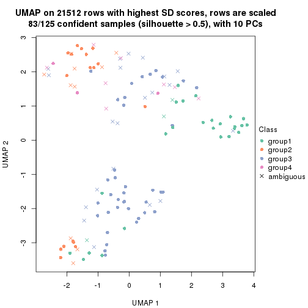</p>

</div>
<div id='tab-SD-pam-dimension-reduction-4'>
<pre><code class="r">dimension_reduction(res, k = 5, method = &quot;UMAP&quot;)
</code></pre>

<p></p>

</div>
<div id='tab-SD-pam-dimension-reduction-5'>
<pre><code class="r">dimension_reduction(res, k = 6, method = &quot;UMAP&quot;)
</code></pre>

<p></p>

</div>
</div>


Following heatmap shows how subgroups are split when increasing `k`:

```r
collect_classes(res)
```


Test correlation between subgroups and known annotations. If the known
annotation is numeric, one-way ANOVA test is applied, and if the known
annotation is discrete, chi-squared contingency table test is applied.

```r
test_to_known_factors(res)
```

```
#>          n time(p) gender(p) k
#> SD:pam 117   0.187  0.674103 2
#> SD:pam 111   0.834  0.001401 3
#> SD:pam  83   0.849  0.000344 4
#> SD:pam  68   0.654  0.000115 5
#> SD:pam  73   0.436  0.000708 6
```


If matrix rows can be associated to genes, consider to use `functional_enrichment(res,
...)` to perform function enrichment for the signature genes. See [this vignette](http://bioconductor.org/packages/devel/bioc/vignettes/cola/inst/doc/functional_enrichment.html) for more detailed explanations.


 

---------------------------------------------------


### SD:mclust


The object with results only for a single top-value method and a single partition method 
can be extracted as:

```r
res = res_list["SD", "mclust"]
# you can also extract it by
# res = res_list["SD:mclust"]
```

A summary of `res` and all the functions that can be applied to it:

```r
res
```

```
#> A 'ConsensusPartition' object with k = 2, 3, 4, 5, 6.
#>   On a matrix with 21512 rows and 125 columns.
#>   Top rows (1000, 2000, 3000, 4000, 5000) are extracted by 'SD' method.
#>   Subgroups are detected by 'mclust' method.
#>   Performed in total 1250 partitions by row resampling.
#>   Best k for subgroups seems to be 6.
#> 
#> Following methods can be applied to this 'ConsensusPartition' object:
#>  [1] "cola_report"             "collect_classes"         "collect_plots"          
#>  [4] "collect_stats"           "colnames"                "compare_signatures"     
#>  [7] "consensus_heatmap"       "dimension_reduction"     "functional_enrichment"  
#> [10] "get_anno_col"            "get_anno"                "get_classes"            
#> [13] "get_consensus"           "get_matrix"              "get_membership"         
#> [16] "get_param"               "get_signatures"          "get_stats"              
#> [19] "is_best_k"               "is_stable_k"             "membership_heatmap"     
#> [22] "ncol"                    "nrow"                    "plot_ecdf"              
#> [25] "rownames"                "select_partition_number" "show"                   
#> [28] "suggest_best_k"          "test_to_known_factors"
```

`collect_plots()` function collects all the plots made from `res` for all `k` (number of partitions)
into one single page to provide an easy and fast comparison between different `k`.

```r
collect_plots(res)
```


The plots are:

- The first row: a plot of the ECDF (empirical cumulative distribution
  function) curves of the consensus matrix for each `k` and the heatmap of
  predicted classes for each `k`.
- The second row: heatmaps of the consensus matrix for each `k`.
- The third row: heatmaps of the membership matrix for each `k`.
- The fouth row: heatmaps of the signatures for each `k`.

All the plots in panels can be made by individual functions and they are
plotted later in this section.

`select_partition_number()` produces several plots showing different
statistics for choosing "optimized" `k`. There are following statistics:

- ECDF curves of the consensus matrix for each `k`;
- 1-PAC. [The PAC
  score](https://en.wikipedia.org/wiki/Consensus_clustering#Over-interpretation_potential_of_consensus_clustering)
  measures the proportion of the ambiguous subgrouping.
- Mean silhouette score.
- Concordance. The mean probability of fiting the consensus class ids in all
  partitions.
- Area increased. Denote $A_k$ as the area under the ECDF curve for current
  `k`, the area increased is defined as $A_k - A_{k-1}$.
- Rand index. The percent of pairs of samples that are both in a same cluster
  or both are not in a same cluster in the partition of k and k-1.
- Jaccard index. The ratio of pairs of samples are both in a same cluster in
  the partition of k and k-1 and the pairs of samples are both in a same
  cluster in the partition k or k-1.

The detailed explanations of these statistics can be found in [the _cola_
vignette](http://bioconductor.org/packages/devel/bioc/vignettes/cola/inst/doc/cola.html#toc_13).

Generally speaking, lower PAC score, higher mean silhouette score or higher
concordance corresponds to better partition. Rand index and Jaccard index
measure how similar the current partition is compared to partition with `k-1`.
If they are too similar, we won't accept `k` is better than `k-1`.

```r
select_partition_number(res)
```


The numeric values for all these statistics can be obtained by `get_stats()`.

```r
get_stats(res)
```

```
#>   k 1-PAC mean_silhouette concordance area_increased  Rand Jaccard
#> 2 2 0.268           0.782       0.797         0.4485 0.497   0.497
#> 3 3 0.286           0.623       0.651         0.3313 0.668   0.427
#> 4 4 0.423           0.583       0.693         0.1467 0.814   0.521
#> 5 5 0.788           0.768       0.878         0.1382 0.939   0.775
#> 6 6 0.833           0.769       0.894         0.0437 0.927   0.695
```

`suggest_best_k()` suggests the best $k$ based on these statistics. The rules are as follows:

- All $k$ with Jaccard index larger than 0.95 are removed because increasing
  $k$ does not provide enough extra information. If all $k$ are removed, it is
  marked as no subgroup is detected.
- For all $k$ with 1-PAC score larger than 0.9, the maximal $k$ is taken as
  the best $k$, and other $k$ are marked as optional $k$.
- If it does not fit the second rule. The $k$ with the maximal vote of the
  highest 1-PAC score, highest mean silhouette, and highest concordance is
  taken as the best $k$.

```r
suggest_best_k(res)
```

```
#> [1] 6
```


Following shows the table of the partitions (You need to click the **show/hide
code output** link to see it). The membership matrix (columns with name `p*`)
is inferred by
[`clue::cl_consensus()`](https://www.rdocumentation.org/link/cl_consensus?package=clue)
function with the `SE` method. Basically the value in the membership matrix
represents the probability to belong to a certain group. The finall class
label for an item is determined with the group with highest probability it
belongs to.

In `get_classes()` function, the entropy is calculated from the membership
matrix and the silhouette score is calculated from the consensus matrix.


<script>
$( function() {
	$( '#tabs-SD-mclust-get-classes' ).tabs();
} );
</script>
<div id='tabs-SD-mclust-get-classes'>
<ul>
<li><a href='#tab-SD-mclust-get-classes-1'>k = 2</a></li>
<li><a href='#tab-SD-mclust-get-classes-2'>k = 3</a></li>
<li><a href='#tab-SD-mclust-get-classes-3'>k = 4</a></li>
<li><a href='#tab-SD-mclust-get-classes-4'>k = 5</a></li>
<li><a href='#tab-SD-mclust-get-classes-5'>k = 6</a></li>
</ul>

<div id='tab-SD-mclust-get-classes-1'>
<p><a id='tab-SD-mclust-get-classes-1-a' style='color:#0366d6' href='#'>show/hide code output</a></p>
<pre><code class="r">cbind(get_classes(res, k = 2), get_membership(res, k = 2))
</code></pre>

<pre><code>#&gt;           class entropy silhouette    p1    p2
#&gt; GSM601872     2   0.961      0.805 0.384 0.616
#&gt; GSM601882     2   0.900      0.853 0.316 0.684
#&gt; GSM601887     1   0.311      0.797 0.944 0.056
#&gt; GSM601892     1   0.295      0.805 0.948 0.052
#&gt; GSM601897     1   0.327      0.793 0.940 0.060
#&gt; GSM601902     2   0.373      0.753 0.072 0.928
#&gt; GSM601912     1   0.260      0.806 0.956 0.044
#&gt; GSM601927     1   0.958      0.647 0.620 0.380
#&gt; GSM601932     2   0.605      0.817 0.148 0.852
#&gt; GSM601937     2   0.961      0.805 0.384 0.616
#&gt; GSM601942     2   0.961      0.805 0.384 0.616
#&gt; GSM601947     2   0.625      0.820 0.156 0.844
#&gt; GSM601957     1   0.163      0.818 0.976 0.024
#&gt; GSM601972     2   0.595      0.813 0.144 0.856
#&gt; GSM601977     2   0.909      0.849 0.324 0.676
#&gt; GSM601987     2   0.895      0.854 0.312 0.688
#&gt; GSM601877     1   0.895      0.689 0.688 0.312
#&gt; GSM601907     2   0.891      0.856 0.308 0.692
#&gt; GSM601917     2   0.343      0.744 0.064 0.936
#&gt; GSM601922     2   0.343      0.744 0.064 0.936
#&gt; GSM601952     2   0.781      0.846 0.232 0.768
#&gt; GSM601962     1   0.260      0.806 0.956 0.044
#&gt; GSM601967     1   0.402      0.807 0.920 0.080
#&gt; GSM601982     2   0.946      0.822 0.364 0.636
#&gt; GSM601992     2   0.753      0.842 0.216 0.784
#&gt; GSM601873     2   0.961      0.805 0.384 0.616
#&gt; GSM601883     2   0.871      0.857 0.292 0.708
#&gt; GSM601888     1   0.327      0.793 0.940 0.060
#&gt; GSM601893     1   0.295      0.800 0.948 0.052
#&gt; GSM601898     1   0.141      0.817 0.980 0.020
#&gt; GSM601903     2   0.373      0.753 0.072 0.928
#&gt; GSM601913     1   0.242      0.819 0.960 0.040
#&gt; GSM601928     1   0.952      0.653 0.628 0.372
#&gt; GSM601933     2   0.881      0.856 0.300 0.700
#&gt; GSM601938     2   0.900      0.853 0.316 0.684
#&gt; GSM601943     2   0.961      0.805 0.384 0.616
#&gt; GSM601948     1   0.662      0.779 0.828 0.172
#&gt; GSM601958     1   0.163      0.818 0.976 0.024
#&gt; GSM601973     2   0.552      0.805 0.128 0.872
#&gt; GSM601978     2   0.961      0.805 0.384 0.616
#&gt; GSM601988     2   0.961      0.805 0.384 0.616
#&gt; GSM601878     1   0.833      0.724 0.736 0.264
#&gt; GSM601908     2   0.850      0.856 0.276 0.724
#&gt; GSM601918     2   0.506      0.790 0.112 0.888
#&gt; GSM601923     1   0.958      0.647 0.620 0.380
#&gt; GSM601953     2   0.946      0.823 0.364 0.636
#&gt; GSM601963     1   0.141      0.817 0.980 0.020
#&gt; GSM601968     1   0.242      0.817 0.960 0.040
#&gt; GSM601983     1   0.141      0.817 0.980 0.020
#&gt; GSM601993     2   0.866      0.858 0.288 0.712
#&gt; GSM601874     2   0.917      0.845 0.332 0.668
#&gt; GSM601884     2   0.955      0.812 0.376 0.624
#&gt; GSM601889     1   0.163      0.818 0.976 0.024
#&gt; GSM601894     1   0.141      0.817 0.980 0.020
#&gt; GSM601899     1   0.295      0.800 0.948 0.052
#&gt; GSM601904     2   0.443      0.765 0.092 0.908
#&gt; GSM601914     1   0.163      0.816 0.976 0.024
#&gt; GSM601929     1   0.839      0.731 0.732 0.268
#&gt; GSM601934     2   0.900      0.853 0.316 0.684
#&gt; GSM601939     1   0.584      0.791 0.860 0.140
#&gt; GSM601944     2   0.876      0.857 0.296 0.704
#&gt; GSM601949     1   0.541      0.795 0.876 0.124
#&gt; GSM601959     1   0.242      0.819 0.960 0.040
#&gt; GSM601974     1   0.998     -0.465 0.528 0.472
#&gt; GSM601979     2   0.904      0.852 0.320 0.680
#&gt; GSM601989     1   0.184      0.819 0.972 0.028
#&gt; GSM601879     1   0.866      0.706 0.712 0.288
#&gt; GSM601909     1   0.141      0.817 0.980 0.020
#&gt; GSM601919     2   0.563      0.805 0.132 0.868
#&gt; GSM601924     1   0.839      0.722 0.732 0.268
#&gt; GSM601954     2   0.753      0.842 0.216 0.784
#&gt; GSM601964     1   0.141      0.817 0.980 0.020
#&gt; GSM601969     1   0.689      0.775 0.816 0.184
#&gt; GSM601984     1   0.738      0.757 0.792 0.208
#&gt; GSM601994     2   0.745      0.843 0.212 0.788
#&gt; GSM601875     2   0.913      0.847 0.328 0.672
#&gt; GSM601885     2   0.881      0.856 0.300 0.700
#&gt; GSM601890     1   0.295      0.800 0.948 0.052
#&gt; GSM601895     1   0.163      0.816 0.976 0.024
#&gt; GSM601900     1   0.224      0.818 0.964 0.036
#&gt; GSM601905     2   0.456      0.778 0.096 0.904
#&gt; GSM601915     1   0.141      0.817 0.980 0.020
#&gt; GSM601930     1   0.955      0.651 0.624 0.376
#&gt; GSM601935     1   0.714      0.542 0.804 0.196
#&gt; GSM601940     1   0.494      0.802 0.892 0.108
#&gt; GSM601945     2   0.909      0.850 0.324 0.676
#&gt; GSM601950     1   0.541      0.796 0.876 0.124
#&gt; GSM601960     1   0.163      0.816 0.976 0.024
#&gt; GSM601975     2   0.518      0.795 0.116 0.884
#&gt; GSM601980     2   0.961      0.805 0.384 0.616
#&gt; GSM601990     1   0.141      0.817 0.980 0.020
#&gt; GSM601880     1   0.958      0.647 0.620 0.380
#&gt; GSM601910     1   0.327      0.810 0.940 0.060
#&gt; GSM601920     2   0.373      0.752 0.072 0.928
#&gt; GSM601925     1   0.958      0.647 0.620 0.380
#&gt; GSM601955     2   0.961      0.805 0.384 0.616
#&gt; GSM601965     1   0.753      0.750 0.784 0.216
#&gt; GSM601970     1   0.141      0.817 0.980 0.020
#&gt; GSM601985     1   0.615      0.786 0.848 0.152
#&gt; GSM601995     2   0.961      0.805 0.384 0.616
#&gt; GSM601876     1   0.653      0.777 0.832 0.168
#&gt; GSM601886     2   0.827      0.853 0.260 0.740
#&gt; GSM601891     1   0.343      0.789 0.936 0.064
#&gt; GSM601896     1   0.482      0.803 0.896 0.104
#&gt; GSM601901     2   0.861      0.857 0.284 0.716
#&gt; GSM601906     1   0.969      0.642 0.604 0.396
#&gt; GSM601916     2   0.574      0.810 0.136 0.864
#&gt; GSM601931     1   0.958      0.647 0.620 0.380
#&gt; GSM601936     2   0.900      0.854 0.316 0.684
#&gt; GSM601941     2   0.595      0.815 0.144 0.856
#&gt; GSM601946     1   0.689      0.769 0.816 0.184
#&gt; GSM601951     1   0.886      0.695 0.696 0.304
#&gt; GSM601961     2   0.904      0.852 0.320 0.680
#&gt; GSM601976     2   0.615      0.819 0.152 0.848
#&gt; GSM601981     2   0.861      0.857 0.284 0.716
#&gt; GSM601991     1   0.295      0.800 0.948 0.052
#&gt; GSM601881     1   0.955      0.650 0.624 0.376
#&gt; GSM601911     2   0.730      0.828 0.204 0.796
#&gt; GSM601921     2   0.343      0.744 0.064 0.936
#&gt; GSM601926     1   0.958      0.647 0.620 0.380
#&gt; GSM601956     2   0.943      0.826 0.360 0.640
#&gt; GSM601966     2   0.574      0.810 0.136 0.864
#&gt; GSM601971     1   0.653      0.777 0.832 0.168
#&gt; GSM601986     1   0.781      0.751 0.768 0.232
#&gt; GSM601996     2   0.615      0.819 0.152 0.848
</code></pre>

<script>
$('#tab-SD-mclust-get-classes-1-a').parent().next().next().hide();
$('#tab-SD-mclust-get-classes-1-a').click(function(){
  $('#tab-SD-mclust-get-classes-1-a').parent().next().next().toggle();
  return(false);
});
</script>
</div>

<div id='tab-SD-mclust-get-classes-2'>
<p><a id='tab-SD-mclust-get-classes-2-a' style='color:#0366d6' href='#'>show/hide code output</a></p>
<pre><code class="r">cbind(get_classes(res, k = 3), get_membership(res, k = 3))
</code></pre>

<pre><code>#&gt;           class entropy silhouette    p1    p2    p3
#&gt; GSM601872     2  0.1643    0.83232 0.000 0.956 0.044
#&gt; GSM601882     2  0.0747    0.84112 0.016 0.984 0.000
#&gt; GSM601887     3  0.7044    0.79999 0.032 0.348 0.620
#&gt; GSM601892     3  0.6794    0.81967 0.028 0.324 0.648
#&gt; GSM601897     3  0.5859    0.73240 0.000 0.344 0.656
#&gt; GSM601902     1  0.5650    0.55050 0.688 0.312 0.000
#&gt; GSM601912     3  0.5845    0.82753 0.004 0.308 0.688
#&gt; GSM601927     1  0.5678    0.55925 0.684 0.000 0.316
#&gt; GSM601932     1  0.5785    0.53195 0.668 0.332 0.000
#&gt; GSM601937     2  0.6372    0.71520 0.068 0.756 0.176
#&gt; GSM601942     2  0.5514    0.75430 0.044 0.800 0.156
#&gt; GSM601947     1  0.6033    0.54426 0.660 0.336 0.004
#&gt; GSM601957     3  0.6908    0.82571 0.036 0.308 0.656
#&gt; GSM601972     1  0.6209    0.50050 0.628 0.368 0.004
#&gt; GSM601977     2  0.0424    0.84007 0.008 0.992 0.000
#&gt; GSM601987     2  0.0237    0.84006 0.004 0.996 0.000
#&gt; GSM601877     1  0.6026    0.53656 0.624 0.000 0.376
#&gt; GSM601907     2  0.0000    0.83906 0.000 1.000 0.000
#&gt; GSM601917     1  0.6082    0.56601 0.692 0.296 0.012
#&gt; GSM601922     1  0.6224    0.56671 0.688 0.296 0.016
#&gt; GSM601952     2  0.4834    0.63814 0.204 0.792 0.004
#&gt; GSM601962     3  0.5958    0.70288 0.008 0.300 0.692
#&gt; GSM601967     3  0.7424    0.81638 0.060 0.300 0.640
#&gt; GSM601982     2  0.4094    0.74878 0.028 0.872 0.100
#&gt; GSM601992     1  0.6299    0.29405 0.524 0.476 0.000
#&gt; GSM601873     2  0.1267    0.83931 0.004 0.972 0.024
#&gt; GSM601883     2  0.1753    0.82201 0.048 0.952 0.000
#&gt; GSM601888     2  0.7278   -0.41281 0.028 0.516 0.456
#&gt; GSM601893     3  0.6931    0.81684 0.032 0.328 0.640
#&gt; GSM601898     3  0.5580    0.82708 0.008 0.256 0.736
#&gt; GSM601903     1  0.5678    0.54699 0.684 0.316 0.000
#&gt; GSM601913     3  0.5551    0.81464 0.020 0.212 0.768
#&gt; GSM601928     1  0.5678    0.55925 0.684 0.000 0.316
#&gt; GSM601933     2  0.1643    0.83282 0.044 0.956 0.000
#&gt; GSM601938     2  0.1989    0.82959 0.048 0.948 0.004
#&gt; GSM601943     2  0.1289    0.83666 0.000 0.968 0.032
#&gt; GSM601948     1  0.8972    0.25857 0.460 0.128 0.412
#&gt; GSM601958     3  0.6451    0.83240 0.024 0.292 0.684
#&gt; GSM601973     1  0.5733    0.54018 0.676 0.324 0.000
#&gt; GSM601978     2  0.0592    0.83554 0.000 0.988 0.012
#&gt; GSM601988     2  0.6093    0.73501 0.068 0.776 0.156
#&gt; GSM601878     1  0.6432    0.50357 0.568 0.004 0.428
#&gt; GSM601908     2  0.2066    0.81134 0.060 0.940 0.000
#&gt; GSM601918     1  0.5859    0.52587 0.656 0.344 0.000
#&gt; GSM601923     1  0.5678    0.55925 0.684 0.000 0.316
#&gt; GSM601953     2  0.0592    0.83583 0.000 0.988 0.012
#&gt; GSM601963     3  0.4963    0.80614 0.008 0.200 0.792
#&gt; GSM601968     3  0.6742    0.82385 0.028 0.316 0.656
#&gt; GSM601983     3  0.5247    0.81965 0.008 0.224 0.768
#&gt; GSM601993     2  0.6144    0.75381 0.132 0.780 0.088
#&gt; GSM601874     2  0.0000    0.83906 0.000 1.000 0.000
#&gt; GSM601884     2  0.0237    0.83821 0.000 0.996 0.004
#&gt; GSM601889     3  0.6744    0.82757 0.032 0.300 0.668
#&gt; GSM601894     3  0.6357    0.83255 0.020 0.296 0.684
#&gt; GSM601899     3  0.7123    0.77988 0.032 0.364 0.604
#&gt; GSM601904     1  0.6387    0.56532 0.680 0.300 0.020
#&gt; GSM601914     3  0.4784    0.80543 0.004 0.200 0.796
#&gt; GSM601929     1  0.8984    0.55579 0.496 0.136 0.368
#&gt; GSM601934     2  0.0424    0.84008 0.008 0.992 0.000
#&gt; GSM601939     1  0.8844    0.19717 0.444 0.116 0.440
#&gt; GSM601944     2  0.2879    0.82249 0.052 0.924 0.024
#&gt; GSM601949     1  0.9862   -0.11474 0.392 0.256 0.352
#&gt; GSM601959     3  0.6927    0.82460 0.040 0.296 0.664
#&gt; GSM601974     2  0.9001    0.13642 0.148 0.520 0.332
#&gt; GSM601979     2  0.0000    0.83906 0.000 1.000 0.000
#&gt; GSM601989     3  0.6984    0.82578 0.040 0.304 0.656
#&gt; GSM601879     1  0.6745    0.50779 0.560 0.012 0.428
#&gt; GSM601909     3  0.6541    0.82920 0.024 0.304 0.672
#&gt; GSM601919     1  0.6510    0.52150 0.624 0.364 0.012
#&gt; GSM601924     1  0.6565    0.50794 0.576 0.008 0.416
#&gt; GSM601954     2  0.6421   -0.05789 0.424 0.572 0.004
#&gt; GSM601964     3  0.4963    0.80365 0.008 0.200 0.792
#&gt; GSM601969     3  0.8876    0.55451 0.220 0.204 0.576
#&gt; GSM601984     1  0.9098    0.52733 0.492 0.148 0.360
#&gt; GSM601994     1  0.6295    0.30951 0.528 0.472 0.000
#&gt; GSM601875     2  0.0000    0.83906 0.000 1.000 0.000
#&gt; GSM601885     2  0.0892    0.83972 0.020 0.980 0.000
#&gt; GSM601890     3  0.7044    0.79972 0.032 0.348 0.620
#&gt; GSM601895     3  0.5244    0.82493 0.004 0.240 0.756
#&gt; GSM601900     3  0.5956    0.83255 0.016 0.264 0.720
#&gt; GSM601905     1  0.5896    0.56711 0.700 0.292 0.008
#&gt; GSM601915     3  0.4963    0.80614 0.008 0.200 0.792
#&gt; GSM601930     1  0.5678    0.55925 0.684 0.000 0.316
#&gt; GSM601935     3  0.7974    0.18088 0.060 0.436 0.504
#&gt; GSM601940     3  0.9502    0.49965 0.272 0.236 0.492
#&gt; GSM601945     2  0.0000    0.83906 0.000 1.000 0.000
#&gt; GSM601950     3  0.9776    0.07312 0.380 0.232 0.388
#&gt; GSM601960     3  0.4963    0.80365 0.008 0.200 0.792
#&gt; GSM601975     1  0.5706    0.54641 0.680 0.320 0.000
#&gt; GSM601980     2  0.6083    0.73041 0.060 0.772 0.168
#&gt; GSM601990     3  0.4963    0.80365 0.008 0.200 0.792
#&gt; GSM601880     1  0.5678    0.55925 0.684 0.000 0.316
#&gt; GSM601910     3  0.6255    0.83190 0.016 0.300 0.684
#&gt; GSM601920     1  0.6051    0.56836 0.696 0.292 0.012
#&gt; GSM601925     1  0.5678    0.55925 0.684 0.000 0.316
#&gt; GSM601955     2  0.6348    0.70846 0.060 0.752 0.188
#&gt; GSM601965     1  0.9602    0.41538 0.460 0.320 0.220
#&gt; GSM601970     3  0.5812    0.83110 0.012 0.264 0.724
#&gt; GSM601985     3  0.8084   -0.09590 0.384 0.072 0.544
#&gt; GSM601995     2  0.6424    0.71052 0.068 0.752 0.180
#&gt; GSM601876     1  0.7841    0.36313 0.480 0.052 0.468
#&gt; GSM601886     2  0.7828    0.18928 0.340 0.592 0.068
#&gt; GSM601891     3  0.7263    0.72368 0.032 0.400 0.568
#&gt; GSM601896     1  0.9537   -0.00798 0.428 0.192 0.380
#&gt; GSM601901     2  0.4784    0.60985 0.200 0.796 0.004
#&gt; GSM601906     1  0.9175    0.59475 0.540 0.216 0.244
#&gt; GSM601916     1  0.6082    0.56675 0.692 0.296 0.012
#&gt; GSM601931     1  0.5678    0.55925 0.684 0.000 0.316
#&gt; GSM601936     2  0.5764    0.76400 0.076 0.800 0.124
#&gt; GSM601941     1  0.5882    0.51414 0.652 0.348 0.000
#&gt; GSM601946     1  0.7549    0.43765 0.524 0.040 0.436
#&gt; GSM601951     1  0.6879    0.51985 0.556 0.016 0.428
#&gt; GSM601961     2  0.5816    0.48157 0.024 0.752 0.224
#&gt; GSM601976     1  0.6543    0.53248 0.640 0.344 0.016
#&gt; GSM601981     2  0.1031    0.83830 0.024 0.976 0.000
#&gt; GSM601991     3  0.6441    0.71165 0.028 0.276 0.696
#&gt; GSM601881     1  0.5678    0.55925 0.684 0.000 0.316
#&gt; GSM601911     1  0.7546    0.43114 0.560 0.396 0.044
#&gt; GSM601921     1  0.5560    0.55779 0.700 0.300 0.000
#&gt; GSM601926     1  0.5678    0.55925 0.684 0.000 0.316
#&gt; GSM601956     2  0.0424    0.83690 0.000 0.992 0.008
#&gt; GSM601966     1  0.5988    0.49101 0.632 0.368 0.000
#&gt; GSM601971     3  0.7533    0.34906 0.244 0.088 0.668
#&gt; GSM601986     1  0.9515    0.50402 0.480 0.304 0.216
#&gt; GSM601996     1  0.5968    0.49317 0.636 0.364 0.000
</code></pre>

<script>
$('#tab-SD-mclust-get-classes-2-a').parent().next().next().hide();
$('#tab-SD-mclust-get-classes-2-a').click(function(){
  $('#tab-SD-mclust-get-classes-2-a').parent().next().next().toggle();
  return(false);
});
</script>
</div>

<div id='tab-SD-mclust-get-classes-3'>
<p><a id='tab-SD-mclust-get-classes-3-a' style='color:#0366d6' href='#'>show/hide code output</a></p>
<pre><code class="r">cbind(get_classes(res, k = 4), get_membership(res, k = 4))
</code></pre>

<pre><code>#&gt;           class entropy silhouette    p1    p2    p3    p4
#&gt; GSM601872     2  0.5712     0.4864 0.000 0.644 0.308 0.048
#&gt; GSM601882     2  0.3999     0.6908 0.000 0.824 0.036 0.140
#&gt; GSM601887     3  0.5953     0.6205 0.100 0.172 0.716 0.012
#&gt; GSM601892     3  0.6009     0.6416 0.172 0.104 0.712 0.012
#&gt; GSM601897     3  0.5452     0.6523 0.096 0.116 0.768 0.020
#&gt; GSM601902     4  0.4839     0.8141 0.044 0.200 0.000 0.756
#&gt; GSM601912     3  0.5122     0.6672 0.164 0.080 0.756 0.000
#&gt; GSM601927     1  0.0336     0.7059 0.992 0.000 0.008 0.000
#&gt; GSM601932     4  0.5168     0.8164 0.040 0.248 0.000 0.712
#&gt; GSM601937     3  0.7434     0.2055 0.008 0.156 0.524 0.312
#&gt; GSM601942     3  0.7706    -0.1627 0.008 0.352 0.464 0.176
#&gt; GSM601947     4  0.4957     0.7820 0.016 0.300 0.000 0.684
#&gt; GSM601957     3  0.4617     0.6402 0.204 0.032 0.764 0.000
#&gt; GSM601972     4  0.4836     0.7596 0.008 0.320 0.000 0.672
#&gt; GSM601977     2  0.4236     0.7189 0.000 0.824 0.088 0.088
#&gt; GSM601987     2  0.0921     0.7375 0.000 0.972 0.000 0.028
#&gt; GSM601877     1  0.2266     0.7154 0.912 0.000 0.084 0.004
#&gt; GSM601907     2  0.0000     0.7299 0.000 1.000 0.000 0.000
#&gt; GSM601917     4  0.4877     0.8171 0.044 0.204 0.000 0.752
#&gt; GSM601922     4  0.5184     0.8158 0.056 0.212 0.000 0.732
#&gt; GSM601952     2  0.5660     0.0148 0.000 0.576 0.028 0.396
#&gt; GSM601962     3  0.4762     0.6596 0.112 0.048 0.812 0.028
#&gt; GSM601967     3  0.5343     0.5992 0.240 0.052 0.708 0.000
#&gt; GSM601982     2  0.6188     0.6186 0.020 0.708 0.168 0.104
#&gt; GSM601992     4  0.5699     0.6740 0.032 0.380 0.000 0.588
#&gt; GSM601873     2  0.6229     0.5078 0.000 0.628 0.284 0.088
#&gt; GSM601883     2  0.2197     0.7249 0.000 0.916 0.004 0.080
#&gt; GSM601888     3  0.6676     0.5012 0.072 0.312 0.600 0.016
#&gt; GSM601893     3  0.5926     0.6373 0.132 0.132 0.724 0.012
#&gt; GSM601898     3  0.3708     0.6686 0.148 0.020 0.832 0.000
#&gt; GSM601903     4  0.4839     0.8141 0.044 0.200 0.000 0.756
#&gt; GSM601913     3  0.4260     0.6525 0.180 0.020 0.796 0.004
#&gt; GSM601928     1  0.0336     0.7059 0.992 0.000 0.008 0.000
#&gt; GSM601933     2  0.3583     0.6376 0.000 0.816 0.004 0.180
#&gt; GSM601938     2  0.4741     0.5645 0.000 0.744 0.028 0.228
#&gt; GSM601943     2  0.6720     0.4709 0.000 0.580 0.300 0.120
#&gt; GSM601948     1  0.5478     0.5140 0.628 0.028 0.344 0.000
#&gt; GSM601958     3  0.4225     0.6538 0.184 0.024 0.792 0.000
#&gt; GSM601973     4  0.5056     0.8204 0.044 0.224 0.000 0.732
#&gt; GSM601978     2  0.2647     0.7165 0.000 0.880 0.120 0.000
#&gt; GSM601988     3  0.7587     0.1592 0.008 0.168 0.496 0.328
#&gt; GSM601878     1  0.2868     0.7121 0.864 0.000 0.136 0.000
#&gt; GSM601908     2  0.1004     0.7347 0.000 0.972 0.004 0.024
#&gt; GSM601918     4  0.4792     0.7671 0.008 0.312 0.000 0.680
#&gt; GSM601923     1  0.0336     0.7059 0.992 0.000 0.008 0.000
#&gt; GSM601953     2  0.2704     0.7077 0.000 0.876 0.124 0.000
#&gt; GSM601963     3  0.3088     0.6639 0.128 0.000 0.864 0.008
#&gt; GSM601968     3  0.4842     0.6484 0.192 0.048 0.760 0.000
#&gt; GSM601983     3  0.2814     0.6657 0.132 0.000 0.868 0.000
#&gt; GSM601993     4  0.7846    -0.0484 0.008 0.216 0.308 0.468
#&gt; GSM601874     2  0.0188     0.7321 0.000 0.996 0.004 0.000
#&gt; GSM601884     2  0.3205     0.7280 0.000 0.872 0.104 0.024
#&gt; GSM601889     3  0.4562     0.6353 0.208 0.028 0.764 0.000
#&gt; GSM601894     3  0.4182     0.6579 0.180 0.024 0.796 0.000
#&gt; GSM601899     3  0.5733     0.5969 0.064 0.208 0.716 0.012
#&gt; GSM601904     4  0.5889     0.7918 0.080 0.196 0.012 0.712
#&gt; GSM601914     3  0.3105     0.6624 0.120 0.000 0.868 0.012
#&gt; GSM601929     1  0.4444     0.6880 0.788 0.008 0.184 0.020
#&gt; GSM601934     2  0.2676     0.7275 0.000 0.896 0.012 0.092
#&gt; GSM601939     1  0.5345     0.3646 0.560 0.012 0.428 0.000
#&gt; GSM601944     2  0.6317     0.3952 0.000 0.624 0.096 0.280
#&gt; GSM601949     1  0.6123     0.3971 0.572 0.056 0.372 0.000
#&gt; GSM601959     3  0.4744     0.5939 0.240 0.024 0.736 0.000
#&gt; GSM601974     3  0.8606     0.2511 0.108 0.288 0.492 0.112
#&gt; GSM601979     2  0.0000     0.7299 0.000 1.000 0.000 0.000
#&gt; GSM601989     3  0.4706     0.6175 0.224 0.028 0.748 0.000
#&gt; GSM601879     1  0.2704     0.7147 0.876 0.000 0.124 0.000
#&gt; GSM601909     3  0.4500     0.6513 0.192 0.032 0.776 0.000
#&gt; GSM601919     4  0.5793     0.7089 0.016 0.336 0.020 0.628
#&gt; GSM601924     1  0.2831     0.7151 0.876 0.004 0.120 0.000
#&gt; GSM601954     2  0.6380    -0.1036 0.008 0.536 0.048 0.408
#&gt; GSM601964     3  0.3032     0.6637 0.124 0.000 0.868 0.008
#&gt; GSM601969     3  0.6622    -0.0452 0.444 0.060 0.488 0.008
#&gt; GSM601984     1  0.5830     0.5899 0.672 0.016 0.276 0.036
#&gt; GSM601994     4  0.5686     0.6775 0.032 0.376 0.000 0.592
#&gt; GSM601875     2  0.0592     0.7375 0.000 0.984 0.000 0.016
#&gt; GSM601885     2  0.1824     0.7387 0.000 0.936 0.004 0.060
#&gt; GSM601890     3  0.5878     0.6184 0.092 0.176 0.720 0.012
#&gt; GSM601895     3  0.3501     0.6722 0.132 0.020 0.848 0.000
#&gt; GSM601900     3  0.4004     0.6659 0.164 0.024 0.812 0.000
#&gt; GSM601905     4  0.4877     0.8171 0.044 0.204 0.000 0.752
#&gt; GSM601915     3  0.3428     0.6620 0.144 0.000 0.844 0.012
#&gt; GSM601930     1  0.0336     0.7059 0.992 0.000 0.008 0.000
#&gt; GSM601935     3  0.7230     0.2474 0.008 0.136 0.548 0.308
#&gt; GSM601940     3  0.5731     0.0960 0.428 0.028 0.544 0.000
#&gt; GSM601945     2  0.0657     0.7360 0.000 0.984 0.012 0.004
#&gt; GSM601950     1  0.5847     0.3657 0.560 0.036 0.404 0.000
#&gt; GSM601960     3  0.3047     0.6617 0.116 0.000 0.872 0.012
#&gt; GSM601975     4  0.4877     0.8169 0.044 0.204 0.000 0.752
#&gt; GSM601980     3  0.7346     0.2271 0.008 0.148 0.536 0.308
#&gt; GSM601990     3  0.3161     0.6628 0.124 0.000 0.864 0.012
#&gt; GSM601880     1  0.0524     0.7044 0.988 0.000 0.008 0.004
#&gt; GSM601910     3  0.4898     0.6712 0.156 0.072 0.772 0.000
#&gt; GSM601920     4  0.5321     0.8019 0.064 0.192 0.004 0.740
#&gt; GSM601925     1  0.0524     0.7044 0.988 0.000 0.008 0.004
#&gt; GSM601955     3  0.7346     0.2271 0.008 0.148 0.536 0.308
#&gt; GSM601965     1  0.8399     0.0478 0.424 0.144 0.380 0.052
#&gt; GSM601970     3  0.3991     0.6588 0.172 0.020 0.808 0.000
#&gt; GSM601985     1  0.4898     0.4150 0.584 0.000 0.416 0.000
#&gt; GSM601995     3  0.7324     0.2283 0.008 0.144 0.536 0.312
#&gt; GSM601876     1  0.4877     0.5623 0.664 0.008 0.328 0.000
#&gt; GSM601886     4  0.8387    -0.0843 0.016 0.324 0.320 0.340
#&gt; GSM601891     3  0.5577     0.5810 0.040 0.244 0.704 0.012
#&gt; GSM601896     1  0.5636     0.3490 0.552 0.024 0.424 0.000
#&gt; GSM601901     2  0.4546     0.5132 0.000 0.732 0.012 0.256
#&gt; GSM601906     1  0.7686     0.3787 0.580 0.080 0.076 0.264
#&gt; GSM601916     4  0.4914     0.8178 0.044 0.208 0.000 0.748
#&gt; GSM601931     1  0.0336     0.7059 0.992 0.000 0.008 0.000
#&gt; GSM601936     3  0.7900    -0.0127 0.008 0.204 0.420 0.368
#&gt; GSM601941     4  0.5312     0.8082 0.040 0.268 0.000 0.692
#&gt; GSM601946     1  0.4343     0.6300 0.732 0.004 0.264 0.000
#&gt; GSM601951     1  0.3300     0.7106 0.848 0.000 0.144 0.008
#&gt; GSM601961     2  0.4891     0.6814 0.008 0.792 0.124 0.076
#&gt; GSM601976     4  0.5484     0.8118 0.040 0.248 0.008 0.704
#&gt; GSM601981     2  0.1489     0.7404 0.000 0.952 0.004 0.044
#&gt; GSM601991     3  0.4078     0.5440 0.036 0.004 0.828 0.132
#&gt; GSM601881     1  0.0336     0.7059 0.992 0.000 0.008 0.000
#&gt; GSM601911     4  0.8797     0.3587 0.104 0.344 0.120 0.432
#&gt; GSM601921     4  0.4877     0.8171 0.044 0.204 0.000 0.752
#&gt; GSM601926     1  0.0336     0.7059 0.992 0.000 0.008 0.000
#&gt; GSM601956     2  0.2814     0.7061 0.000 0.868 0.132 0.000
#&gt; GSM601966     4  0.5231     0.7912 0.028 0.296 0.000 0.676
#&gt; GSM601971     1  0.4998     0.2041 0.512 0.000 0.488 0.000
#&gt; GSM601986     1  0.8792     0.3118 0.504 0.184 0.208 0.104
#&gt; GSM601996     4  0.5442     0.7971 0.040 0.288 0.000 0.672
</code></pre>

<script>
$('#tab-SD-mclust-get-classes-3-a').parent().next().next().hide();
$('#tab-SD-mclust-get-classes-3-a').click(function(){
  $('#tab-SD-mclust-get-classes-3-a').parent().next().next().toggle();
  return(false);
});
</script>
</div>

<div id='tab-SD-mclust-get-classes-4'>
<p><a id='tab-SD-mclust-get-classes-4-a' style='color:#0366d6' href='#'>show/hide code output</a></p>
<pre><code class="r">cbind(get_classes(res, k = 5), get_membership(res, k = 5))
</code></pre>

<pre><code>#&gt;           class entropy silhouette    p1    p2    p3    p4    p5
#&gt; GSM601872     2  0.5569     0.2054 0.000 0.556 0.080 0.000 0.364
#&gt; GSM601882     2  0.0898     0.8256 0.000 0.972 0.008 0.020 0.000
#&gt; GSM601887     3  0.1082     0.8374 0.000 0.028 0.964 0.008 0.000
#&gt; GSM601892     3  0.0566     0.8431 0.000 0.012 0.984 0.004 0.000
#&gt; GSM601897     3  0.3266     0.8302 0.000 0.004 0.796 0.000 0.200
#&gt; GSM601902     4  0.0290     0.9190 0.000 0.008 0.000 0.992 0.000
#&gt; GSM601912     3  0.1043     0.8545 0.000 0.000 0.960 0.000 0.040
#&gt; GSM601927     1  0.0000     0.8399 1.000 0.000 0.000 0.000 0.000
#&gt; GSM601932     4  0.0609     0.9183 0.000 0.020 0.000 0.980 0.000
#&gt; GSM601937     5  0.0000     0.8645 0.000 0.000 0.000 0.000 1.000
#&gt; GSM601942     5  0.3177     0.6549 0.000 0.208 0.000 0.000 0.792
#&gt; GSM601947     4  0.1197     0.9086 0.000 0.048 0.000 0.952 0.000
#&gt; GSM601957     3  0.0290     0.8466 0.008 0.000 0.992 0.000 0.000
#&gt; GSM601972     4  0.1270     0.9061 0.000 0.052 0.000 0.948 0.000
#&gt; GSM601977     2  0.0162     0.8303 0.000 0.996 0.004 0.000 0.000
#&gt; GSM601987     2  0.0000     0.8308 0.000 1.000 0.000 0.000 0.000
#&gt; GSM601877     1  0.1341     0.8582 0.944 0.000 0.056 0.000 0.000
#&gt; GSM601907     2  0.0000     0.8308 0.000 1.000 0.000 0.000 0.000
#&gt; GSM601917     4  0.0290     0.9190 0.000 0.008 0.000 0.992 0.000
#&gt; GSM601922     4  0.0451     0.9176 0.004 0.008 0.000 0.988 0.000
#&gt; GSM601952     2  0.3684     0.5895 0.000 0.720 0.000 0.280 0.000
#&gt; GSM601962     3  0.3561     0.7739 0.000 0.000 0.740 0.000 0.260
#&gt; GSM601967     3  0.2284     0.8194 0.096 0.000 0.896 0.004 0.004
#&gt; GSM601982     2  0.3013     0.7047 0.000 0.832 0.160 0.008 0.000
#&gt; GSM601992     4  0.2291     0.8816 0.000 0.036 0.000 0.908 0.056
#&gt; GSM601873     2  0.3123     0.6798 0.000 0.812 0.004 0.000 0.184
#&gt; GSM601883     2  0.3741     0.6012 0.000 0.732 0.004 0.264 0.000
#&gt; GSM601888     3  0.3452     0.5674 0.000 0.244 0.756 0.000 0.000
#&gt; GSM601893     3  0.0798     0.8401 0.000 0.016 0.976 0.008 0.000
#&gt; GSM601898     3  0.2970     0.8429 0.004 0.000 0.828 0.000 0.168
#&gt; GSM601903     4  0.0290     0.9190 0.000 0.008 0.000 0.992 0.000
#&gt; GSM601913     3  0.3370     0.8431 0.028 0.000 0.824 0.000 0.148
#&gt; GSM601928     1  0.0000     0.8399 1.000 0.000 0.000 0.000 0.000
#&gt; GSM601933     2  0.1952     0.7877 0.000 0.912 0.004 0.084 0.000
#&gt; GSM601938     2  0.4605     0.6032 0.000 0.708 0.004 0.248 0.040
#&gt; GSM601943     2  0.4410     0.1719 0.000 0.556 0.004 0.000 0.440
#&gt; GSM601948     1  0.1892     0.8562 0.916 0.000 0.080 0.000 0.004
#&gt; GSM601958     3  0.1851     0.8251 0.088 0.000 0.912 0.000 0.000
#&gt; GSM601973     4  0.0290     0.9190 0.000 0.008 0.000 0.992 0.000
#&gt; GSM601978     2  0.0451     0.8292 0.000 0.988 0.004 0.000 0.008
#&gt; GSM601988     5  0.1851     0.8236 0.000 0.088 0.000 0.000 0.912
#&gt; GSM601878     1  0.1638     0.8591 0.932 0.000 0.064 0.000 0.004
#&gt; GSM601908     2  0.2629     0.7474 0.000 0.860 0.004 0.136 0.000
#&gt; GSM601918     4  0.1197     0.9086 0.000 0.048 0.000 0.952 0.000
#&gt; GSM601923     1  0.0000     0.8399 1.000 0.000 0.000 0.000 0.000
#&gt; GSM601953     2  0.0000     0.8308 0.000 1.000 0.000 0.000 0.000
#&gt; GSM601963     3  0.2966     0.8373 0.000 0.000 0.816 0.000 0.184
#&gt; GSM601968     3  0.0566     0.8496 0.000 0.000 0.984 0.004 0.012
#&gt; GSM601983     3  0.2852     0.8428 0.000 0.000 0.828 0.000 0.172
#&gt; GSM601993     4  0.4456     0.6330 0.000 0.032 0.004 0.716 0.248
#&gt; GSM601874     2  0.0000     0.8308 0.000 1.000 0.000 0.000 0.000
#&gt; GSM601884     2  0.0451     0.8292 0.000 0.988 0.004 0.000 0.008
#&gt; GSM601889     3  0.0162     0.8472 0.004 0.000 0.996 0.000 0.000
#&gt; GSM601894     3  0.0162     0.8480 0.000 0.000 0.996 0.000 0.004
#&gt; GSM601899     3  0.0992     0.8365 0.000 0.024 0.968 0.008 0.000
#&gt; GSM601904     4  0.0566     0.9188 0.004 0.012 0.000 0.984 0.000
#&gt; GSM601914     3  0.2966     0.8372 0.000 0.000 0.816 0.000 0.184
#&gt; GSM601929     1  0.1704     0.8595 0.928 0.000 0.068 0.004 0.000
#&gt; GSM601934     2  0.0324     0.8310 0.000 0.992 0.004 0.004 0.000
#&gt; GSM601939     1  0.4420     0.2618 0.548 0.000 0.448 0.000 0.004
#&gt; GSM601944     2  0.4820     0.5893 0.000 0.700 0.004 0.240 0.056
#&gt; GSM601949     1  0.3048     0.8046 0.820 0.000 0.176 0.000 0.004
#&gt; GSM601959     3  0.1043     0.8427 0.040 0.000 0.960 0.000 0.000
#&gt; GSM601974     3  0.7527     0.0544 0.000 0.348 0.388 0.048 0.216
#&gt; GSM601979     2  0.0000     0.8308 0.000 1.000 0.000 0.000 0.000
#&gt; GSM601989     3  0.0324     0.8483 0.004 0.000 0.992 0.000 0.004
#&gt; GSM601879     1  0.1638     0.8595 0.932 0.000 0.064 0.004 0.000
#&gt; GSM601909     3  0.0671     0.8504 0.000 0.000 0.980 0.004 0.016
#&gt; GSM601919     4  0.1357     0.9082 0.004 0.048 0.000 0.948 0.000
#&gt; GSM601924     1  0.1638     0.8591 0.932 0.000 0.064 0.000 0.004
#&gt; GSM601954     2  0.4446     0.0999 0.000 0.520 0.000 0.476 0.004
#&gt; GSM601964     3  0.2966     0.8373 0.000 0.000 0.816 0.000 0.184
#&gt; GSM601969     1  0.4822     0.2637 0.540 0.004 0.444 0.008 0.004
#&gt; GSM601984     1  0.1928     0.8576 0.920 0.004 0.072 0.000 0.004
#&gt; GSM601994     4  0.2124     0.8874 0.000 0.028 0.000 0.916 0.056
#&gt; GSM601875     2  0.0000     0.8308 0.000 1.000 0.000 0.000 0.000
#&gt; GSM601885     2  0.0324     0.8310 0.000 0.992 0.004 0.004 0.000
#&gt; GSM601890     3  0.0693     0.8417 0.000 0.012 0.980 0.008 0.000
#&gt; GSM601895     3  0.2966     0.8373 0.000 0.000 0.816 0.000 0.184
#&gt; GSM601900     3  0.2930     0.8454 0.004 0.000 0.832 0.000 0.164
#&gt; GSM601905     4  0.0290     0.9190 0.000 0.008 0.000 0.992 0.000
#&gt; GSM601915     3  0.2929     0.8388 0.000 0.000 0.820 0.000 0.180
#&gt; GSM601930     1  0.0000     0.8399 1.000 0.000 0.000 0.000 0.000
#&gt; GSM601935     5  0.1571     0.8263 0.000 0.004 0.060 0.000 0.936
#&gt; GSM601940     1  0.4589     0.2680 0.520 0.000 0.472 0.004 0.004
#&gt; GSM601945     2  0.0162     0.8310 0.000 0.996 0.000 0.004 0.000
#&gt; GSM601950     1  0.2674     0.8308 0.856 0.000 0.140 0.000 0.004
#&gt; GSM601960     3  0.2966     0.8372 0.000 0.000 0.816 0.000 0.184
#&gt; GSM601975     4  0.0404     0.9190 0.000 0.012 0.000 0.988 0.000
#&gt; GSM601980     5  0.0162     0.8654 0.000 0.004 0.000 0.000 0.996
#&gt; GSM601990     3  0.3003     0.8357 0.000 0.000 0.812 0.000 0.188
#&gt; GSM601880     1  0.0000     0.8399 1.000 0.000 0.000 0.000 0.000
#&gt; GSM601910     3  0.2329     0.8527 0.000 0.000 0.876 0.000 0.124
#&gt; GSM601920     4  0.0579     0.9156 0.008 0.008 0.000 0.984 0.000
#&gt; GSM601925     1  0.0000     0.8399 1.000 0.000 0.000 0.000 0.000
#&gt; GSM601955     5  0.0162     0.8654 0.000 0.004 0.000 0.000 0.996
#&gt; GSM601965     1  0.5247     0.7247 0.732 0.040 0.164 0.060 0.004
#&gt; GSM601970     3  0.3269     0.8437 0.056 0.000 0.848 0.000 0.096
#&gt; GSM601985     1  0.4310     0.4183 0.604 0.000 0.392 0.000 0.004
#&gt; GSM601995     5  0.0000     0.8645 0.000 0.000 0.000 0.000 1.000
#&gt; GSM601876     1  0.2011     0.8528 0.908 0.000 0.088 0.000 0.004
#&gt; GSM601886     4  0.6424     0.2377 0.000 0.328 0.004 0.500 0.168
#&gt; GSM601891     3  0.2193     0.8130 0.000 0.092 0.900 0.008 0.000
#&gt; GSM601896     1  0.2964     0.8164 0.840 0.000 0.152 0.004 0.004
#&gt; GSM601901     2  0.4288     0.4122 0.000 0.612 0.004 0.384 0.000
#&gt; GSM601906     1  0.4729     0.6262 0.708 0.004 0.052 0.236 0.000
#&gt; GSM601916     4  0.0290     0.9190 0.000 0.008 0.000 0.992 0.000
#&gt; GSM601931     1  0.0000     0.8399 1.000 0.000 0.000 0.000 0.000
#&gt; GSM601936     5  0.6417     0.2533 0.000 0.336 0.004 0.164 0.496
#&gt; GSM601941     4  0.1331     0.9067 0.000 0.008 0.000 0.952 0.040
#&gt; GSM601946     1  0.1831     0.8571 0.920 0.000 0.076 0.000 0.004
#&gt; GSM601951     1  0.1544     0.8591 0.932 0.000 0.068 0.000 0.000
#&gt; GSM601961     2  0.0671     0.8222 0.000 0.980 0.016 0.000 0.004
#&gt; GSM601976     4  0.1282     0.9014 0.000 0.044 0.004 0.952 0.000
#&gt; GSM601981     2  0.0451     0.8309 0.000 0.988 0.004 0.008 0.000
#&gt; GSM601991     3  0.4114     0.6067 0.000 0.000 0.624 0.000 0.376
#&gt; GSM601881     1  0.0000     0.8399 1.000 0.000 0.000 0.000 0.000
#&gt; GSM601911     4  0.6811     0.3487 0.304 0.092 0.056 0.544 0.004
#&gt; GSM601921     4  0.0290     0.9190 0.000 0.008 0.000 0.992 0.000
#&gt; GSM601926     1  0.0000     0.8399 1.000 0.000 0.000 0.000 0.000
#&gt; GSM601956     2  0.0324     0.8298 0.000 0.992 0.004 0.000 0.004
#&gt; GSM601966     4  0.1197     0.9086 0.000 0.048 0.000 0.952 0.000
#&gt; GSM601971     3  0.4420     0.0746 0.448 0.000 0.548 0.000 0.004
#&gt; GSM601986     1  0.4045     0.7804 0.812 0.008 0.064 0.112 0.004
#&gt; GSM601996     4  0.1943     0.8923 0.000 0.020 0.000 0.924 0.056
</code></pre>

<script>
$('#tab-SD-mclust-get-classes-4-a').parent().next().next().hide();
$('#tab-SD-mclust-get-classes-4-a').click(function(){
  $('#tab-SD-mclust-get-classes-4-a').parent().next().next().toggle();
  return(false);
});
</script>
</div>

<div id='tab-SD-mclust-get-classes-5'>
<p><a id='tab-SD-mclust-get-classes-5-a' style='color:#0366d6' href='#'>show/hide code output</a></p>
<pre><code class="r">cbind(get_classes(res, k = 6), get_membership(res, k = 6))
</code></pre>

<pre><code>#&gt;           class entropy silhouette    p1    p2    p3    p4    p5    p6
#&gt; GSM601872     2  0.1418     0.9103 0.000 0.944 0.000 0.000 0.032 0.024
#&gt; GSM601882     2  0.0632     0.9241 0.000 0.976 0.000 0.024 0.000 0.000
#&gt; GSM601887     6  0.1007     0.7429 0.000 0.000 0.044 0.000 0.000 0.956
#&gt; GSM601892     6  0.1267     0.7434 0.000 0.000 0.060 0.000 0.000 0.940
#&gt; GSM601897     3  0.3958     0.7025 0.000 0.000 0.764 0.000 0.128 0.108
#&gt; GSM601902     4  0.0000     0.9090 0.000 0.000 0.000 1.000 0.000 0.000
#&gt; GSM601912     3  0.2941     0.6985 0.000 0.000 0.780 0.000 0.000 0.220
#&gt; GSM601927     1  0.0000     0.8647 1.000 0.000 0.000 0.000 0.000 0.000
#&gt; GSM601932     4  0.0000     0.9090 0.000 0.000 0.000 1.000 0.000 0.000
#&gt; GSM601937     5  0.0508     0.8798 0.000 0.004 0.012 0.000 0.984 0.000
#&gt; GSM601942     5  0.3215     0.6495 0.000 0.240 0.000 0.000 0.756 0.004
#&gt; GSM601947     4  0.0665     0.9080 0.000 0.008 0.000 0.980 0.008 0.004
#&gt; GSM601957     6  0.5079     0.2258 0.084 0.000 0.380 0.000 0.000 0.536
#&gt; GSM601972     4  0.0363     0.9068 0.000 0.012 0.000 0.988 0.000 0.000
#&gt; GSM601977     2  0.0000     0.9390 0.000 1.000 0.000 0.000 0.000 0.000
#&gt; GSM601987     2  0.0000     0.9390 0.000 1.000 0.000 0.000 0.000 0.000
#&gt; GSM601877     1  0.0458     0.8662 0.984 0.000 0.016 0.000 0.000 0.000
#&gt; GSM601907     2  0.0000     0.9390 0.000 1.000 0.000 0.000 0.000 0.000
#&gt; GSM601917     4  0.0405     0.9086 0.000 0.000 0.000 0.988 0.008 0.004
#&gt; GSM601922     4  0.0405     0.9086 0.000 0.000 0.000 0.988 0.008 0.004
#&gt; GSM601952     2  0.3989     0.0549 0.000 0.528 0.000 0.468 0.000 0.004
#&gt; GSM601962     3  0.0146     0.8223 0.000 0.000 0.996 0.000 0.004 0.000
#&gt; GSM601967     6  0.5885     0.3184 0.228 0.000 0.304 0.000 0.000 0.468
#&gt; GSM601982     2  0.2810     0.7727 0.000 0.832 0.004 0.008 0.000 0.156
#&gt; GSM601992     4  0.0820     0.8991 0.000 0.000 0.000 0.972 0.016 0.012
#&gt; GSM601873     2  0.0692     0.9297 0.000 0.976 0.000 0.000 0.020 0.004
#&gt; GSM601883     2  0.0458     0.9321 0.000 0.984 0.000 0.016 0.000 0.000
#&gt; GSM601888     6  0.1398     0.7426 0.000 0.008 0.052 0.000 0.000 0.940
#&gt; GSM601893     6  0.1007     0.7429 0.000 0.000 0.044 0.000 0.000 0.956
#&gt; GSM601898     3  0.0146     0.8243 0.000 0.000 0.996 0.000 0.000 0.004
#&gt; GSM601903     4  0.0000     0.9090 0.000 0.000 0.000 1.000 0.000 0.000
#&gt; GSM601913     3  0.0291     0.8238 0.004 0.000 0.992 0.000 0.000 0.004
#&gt; GSM601928     1  0.0000     0.8647 1.000 0.000 0.000 0.000 0.000 0.000
#&gt; GSM601933     2  0.2793     0.7021 0.000 0.800 0.000 0.200 0.000 0.000
#&gt; GSM601938     4  0.4178     0.2842 0.000 0.428 0.000 0.560 0.008 0.004
#&gt; GSM601943     2  0.1225     0.9152 0.000 0.952 0.000 0.000 0.036 0.012
#&gt; GSM601948     1  0.2301     0.8148 0.884 0.000 0.020 0.000 0.000 0.096
#&gt; GSM601958     3  0.3650     0.6826 0.116 0.000 0.792 0.000 0.000 0.092
#&gt; GSM601973     4  0.0000     0.9090 0.000 0.000 0.000 1.000 0.000 0.000
#&gt; GSM601978     2  0.0291     0.9376 0.000 0.992 0.000 0.000 0.004 0.004
#&gt; GSM601988     5  0.0767     0.8786 0.000 0.008 0.012 0.000 0.976 0.004
#&gt; GSM601878     1  0.0458     0.8662 0.984 0.000 0.016 0.000 0.000 0.000
#&gt; GSM601908     2  0.0363     0.9356 0.000 0.988 0.000 0.012 0.000 0.000
#&gt; GSM601918     4  0.0665     0.9080 0.000 0.008 0.000 0.980 0.008 0.004
#&gt; GSM601923     1  0.0000     0.8647 1.000 0.000 0.000 0.000 0.000 0.000
#&gt; GSM601953     2  0.0146     0.9386 0.000 0.996 0.000 0.000 0.000 0.004
#&gt; GSM601963     3  0.0000     0.8246 0.000 0.000 1.000 0.000 0.000 0.000
#&gt; GSM601968     6  0.3847     0.0485 0.000 0.000 0.456 0.000 0.000 0.544
#&gt; GSM601983     3  0.0000     0.8246 0.000 0.000 1.000 0.000 0.000 0.000
#&gt; GSM601993     5  0.3111     0.7747 0.000 0.008 0.000 0.156 0.820 0.016
#&gt; GSM601874     2  0.0000     0.9390 0.000 1.000 0.000 0.000 0.000 0.000
#&gt; GSM601884     2  0.0146     0.9384 0.000 0.996 0.000 0.000 0.004 0.000
#&gt; GSM601889     3  0.2912     0.7014 0.000 0.000 0.784 0.000 0.000 0.216
#&gt; GSM601894     3  0.2631     0.7551 0.008 0.000 0.840 0.000 0.000 0.152
#&gt; GSM601899     6  0.1007     0.7429 0.000 0.000 0.044 0.000 0.000 0.956
#&gt; GSM601904     4  0.0436     0.9084 0.004 0.000 0.000 0.988 0.004 0.004
#&gt; GSM601914     3  0.0000     0.8246 0.000 0.000 1.000 0.000 0.000 0.000
#&gt; GSM601929     1  0.0806     0.8655 0.972 0.000 0.020 0.000 0.000 0.008
#&gt; GSM601934     2  0.0000     0.9390 0.000 1.000 0.000 0.000 0.000 0.000
#&gt; GSM601939     1  0.2312     0.7996 0.876 0.000 0.112 0.000 0.000 0.012
#&gt; GSM601944     4  0.3766     0.6502 0.000 0.232 0.000 0.736 0.032 0.000
#&gt; GSM601949     1  0.4105     0.4454 0.632 0.000 0.020 0.000 0.000 0.348
#&gt; GSM601959     3  0.5495     0.2864 0.164 0.000 0.548 0.000 0.000 0.288
#&gt; GSM601974     3  0.6285     0.2337 0.000 0.024 0.480 0.328 0.164 0.004
#&gt; GSM601979     2  0.0000     0.9390 0.000 1.000 0.000 0.000 0.000 0.000
#&gt; GSM601989     3  0.3518     0.6436 0.012 0.000 0.732 0.000 0.000 0.256
#&gt; GSM601879     1  0.0603     0.8660 0.980 0.000 0.016 0.000 0.000 0.004
#&gt; GSM601909     3  0.3647     0.4578 0.000 0.000 0.640 0.000 0.000 0.360
#&gt; GSM601919     4  0.0665     0.9080 0.000 0.008 0.000 0.980 0.008 0.004
#&gt; GSM601924     1  0.0458     0.8662 0.984 0.000 0.016 0.000 0.000 0.000
#&gt; GSM601954     4  0.4211     0.1454 0.000 0.456 0.000 0.532 0.008 0.004
#&gt; GSM601964     3  0.0000     0.8246 0.000 0.000 1.000 0.000 0.000 0.000
#&gt; GSM601969     6  0.4650    -0.0711 0.472 0.000 0.040 0.000 0.000 0.488
#&gt; GSM601984     1  0.1528     0.8531 0.936 0.000 0.048 0.000 0.000 0.016
#&gt; GSM601994     4  0.0820     0.8991 0.000 0.000 0.000 0.972 0.016 0.012
#&gt; GSM601875     2  0.0000     0.9390 0.000 1.000 0.000 0.000 0.000 0.000
#&gt; GSM601885     2  0.0146     0.9383 0.000 0.996 0.000 0.004 0.000 0.000
#&gt; GSM601890     6  0.1152     0.7409 0.000 0.000 0.044 0.000 0.004 0.952
#&gt; GSM601895     3  0.0146     0.8246 0.000 0.000 0.996 0.000 0.000 0.004
#&gt; GSM601900     3  0.0653     0.8222 0.004 0.000 0.980 0.000 0.004 0.012
#&gt; GSM601905     4  0.0291     0.9090 0.000 0.000 0.000 0.992 0.004 0.004
#&gt; GSM601915     3  0.0146     0.8243 0.000 0.000 0.996 0.000 0.000 0.004
#&gt; GSM601930     1  0.0000     0.8647 1.000 0.000 0.000 0.000 0.000 0.000
#&gt; GSM601935     5  0.2527     0.7634 0.000 0.000 0.168 0.000 0.832 0.000
#&gt; GSM601940     1  0.4881     0.5451 0.656 0.000 0.208 0.000 0.000 0.136
#&gt; GSM601945     2  0.0146     0.9384 0.000 0.996 0.000 0.004 0.000 0.000
#&gt; GSM601950     1  0.3487     0.6742 0.756 0.000 0.020 0.000 0.000 0.224
#&gt; GSM601960     3  0.0000     0.8246 0.000 0.000 1.000 0.000 0.000 0.000
#&gt; GSM601975     4  0.0000     0.9090 0.000 0.000 0.000 1.000 0.000 0.000
#&gt; GSM601980     5  0.0508     0.8796 0.000 0.000 0.012 0.000 0.984 0.004
#&gt; GSM601990     3  0.0000     0.8246 0.000 0.000 1.000 0.000 0.000 0.000
#&gt; GSM601880     1  0.0000     0.8647 1.000 0.000 0.000 0.000 0.000 0.000
#&gt; GSM601910     3  0.3446     0.5319 0.000 0.000 0.692 0.000 0.000 0.308
#&gt; GSM601920     4  0.0405     0.9086 0.000 0.000 0.000 0.988 0.008 0.004
#&gt; GSM601925     1  0.0000     0.8647 1.000 0.000 0.000 0.000 0.000 0.000
#&gt; GSM601955     5  0.0508     0.8796 0.000 0.000 0.012 0.000 0.984 0.004
#&gt; GSM601965     1  0.5306     0.4592 0.596 0.000 0.080 0.304 0.000 0.020
#&gt; GSM601970     3  0.2257     0.7699 0.008 0.000 0.876 0.000 0.000 0.116
#&gt; GSM601985     1  0.3833     0.5119 0.648 0.000 0.344 0.000 0.000 0.008
#&gt; GSM601995     5  0.0363     0.8795 0.000 0.000 0.012 0.000 0.988 0.000
#&gt; GSM601876     1  0.1168     0.8612 0.956 0.000 0.028 0.000 0.000 0.016
#&gt; GSM601886     4  0.4072     0.5269 0.004 0.008 0.000 0.688 0.288 0.012
#&gt; GSM601891     6  0.2697     0.6562 0.000 0.092 0.044 0.000 0.000 0.864
#&gt; GSM601896     1  0.1644     0.8522 0.932 0.000 0.028 0.000 0.000 0.040
#&gt; GSM601901     4  0.3578     0.5094 0.000 0.340 0.000 0.660 0.000 0.000
#&gt; GSM601906     1  0.3147     0.7162 0.816 0.000 0.016 0.160 0.000 0.008
#&gt; GSM601916     4  0.0405     0.9086 0.000 0.000 0.000 0.988 0.008 0.004
#&gt; GSM601931     1  0.0000     0.8647 1.000 0.000 0.000 0.000 0.000 0.000
#&gt; GSM601936     5  0.3381     0.7814 0.000 0.028 0.004 0.144 0.816 0.008
#&gt; GSM601941     4  0.0260     0.9074 0.000 0.000 0.000 0.992 0.008 0.000
#&gt; GSM601946     1  0.0993     0.8629 0.964 0.000 0.024 0.000 0.000 0.012
#&gt; GSM601951     1  0.0692     0.8651 0.976 0.000 0.020 0.000 0.000 0.004
#&gt; GSM601961     2  0.1863     0.8537 0.000 0.896 0.000 0.000 0.000 0.104
#&gt; GSM601976     4  0.0146     0.9089 0.000 0.004 0.000 0.996 0.000 0.000
#&gt; GSM601981     2  0.0146     0.9385 0.000 0.996 0.000 0.004 0.000 0.000
#&gt; GSM601991     3  0.2562     0.6735 0.000 0.000 0.828 0.000 0.172 0.000
#&gt; GSM601881     1  0.0000     0.8647 1.000 0.000 0.000 0.000 0.000 0.000
#&gt; GSM601911     4  0.1973     0.8758 0.016 0.016 0.008 0.932 0.008 0.020
#&gt; GSM601921     4  0.0405     0.9086 0.000 0.000 0.000 0.988 0.008 0.004
#&gt; GSM601926     1  0.0000     0.8647 1.000 0.000 0.000 0.000 0.000 0.000
#&gt; GSM601956     2  0.0146     0.9386 0.000 0.996 0.000 0.000 0.000 0.004
#&gt; GSM601966     4  0.0260     0.9082 0.000 0.008 0.000 0.992 0.000 0.000
#&gt; GSM601971     1  0.5167     0.1686 0.500 0.000 0.412 0.000 0.000 0.088
#&gt; GSM601986     1  0.4305     0.5166 0.656 0.000 0.020 0.312 0.000 0.012
#&gt; GSM601996     4  0.0725     0.9041 0.000 0.000 0.000 0.976 0.012 0.012
</code></pre>

<script>
$('#tab-SD-mclust-get-classes-5-a').parent().next().next().hide();
$('#tab-SD-mclust-get-classes-5-a').click(function(){
  $('#tab-SD-mclust-get-classes-5-a').parent().next().next().toggle();
  return(false);
});
</script>
</div>
</div>

Heatmaps for the consensus matrix. It visualizes the probability of two
samples to be in a same group.


<script>
$( function() {
	$( '#tabs-SD-mclust-consensus-heatmap' ).tabs();
} );
</script>
<div id='tabs-SD-mclust-consensus-heatmap'>
<ul>
<li><a href='#tab-SD-mclust-consensus-heatmap-1'>k = 2</a></li>
<li><a href='#tab-SD-mclust-consensus-heatmap-2'>k = 3</a></li>
<li><a href='#tab-SD-mclust-consensus-heatmap-3'>k = 4</a></li>
<li><a href='#tab-SD-mclust-consensus-heatmap-4'>k = 5</a></li>
<li><a href='#tab-SD-mclust-consensus-heatmap-5'>k = 6</a></li>
</ul>
<div id='tab-SD-mclust-consensus-heatmap-1'>
<pre><code class="r">consensus_heatmap(res, k = 2)
</code></pre>

<p></p>

</div>
<div id='tab-SD-mclust-consensus-heatmap-2'>
<pre><code class="r">consensus_heatmap(res, k = 3)
</code></pre>

<p></p>

</div>
<div id='tab-SD-mclust-consensus-heatmap-3'>
<pre><code class="r">consensus_heatmap(res, k = 4)
</code></pre>

<p></p>

</div>
<div id='tab-SD-mclust-consensus-heatmap-4'>
<pre><code class="r">consensus_heatmap(res, k = 5)
</code></pre>

<p></p>

</div>
<div id='tab-SD-mclust-consensus-heatmap-5'>
<pre><code class="r">consensus_heatmap(res, k = 6)
</code></pre>

<p></p>

</div>
</div>

Heatmaps for the membership of samples in all partitions to see how consistent they are:


<script>
$( function() {
	$( '#tabs-SD-mclust-membership-heatmap' ).tabs();
} );
</script>
<div id='tabs-SD-mclust-membership-heatmap'>
<ul>
<li><a href='#tab-SD-mclust-membership-heatmap-1'>k = 2</a></li>
<li><a href='#tab-SD-mclust-membership-heatmap-2'>k = 3</a></li>
<li><a href='#tab-SD-mclust-membership-heatmap-3'>k = 4</a></li>
<li><a href='#tab-SD-mclust-membership-heatmap-4'>k = 5</a></li>
<li><a href='#tab-SD-mclust-membership-heatmap-5'>k = 6</a></li>
</ul>
<div id='tab-SD-mclust-membership-heatmap-1'>
<pre><code class="r">membership_heatmap(res, k = 2)
</code></pre>

<p></p>

</div>
<div id='tab-SD-mclust-membership-heatmap-2'>
<pre><code class="r">membership_heatmap(res, k = 3)
</code></pre>

<p></p>

</div>
<div id='tab-SD-mclust-membership-heatmap-3'>
<pre><code class="r">membership_heatmap(res, k = 4)
</code></pre>

<p></p>

</div>
<div id='tab-SD-mclust-membership-heatmap-4'>
<pre><code class="r">membership_heatmap(res, k = 5)
</code></pre>

<p></p>

</div>
<div id='tab-SD-mclust-membership-heatmap-5'>
<pre><code class="r">membership_heatmap(res, k = 6)
</code></pre>

<p></p>

</div>
</div>

As soon as we have had the classes for columns, we can look for signatures
which are significantly different between classes which can be candidate marks
for certain classes. Following are the heatmaps for signatures.


Signature heatmaps where rows are scaled:


<script>
$( function() {
	$( '#tabs-SD-mclust-get-signatures' ).tabs();
} );
</script>
<div id='tabs-SD-mclust-get-signatures'>
<ul>
<li><a href='#tab-SD-mclust-get-signatures-1'>k = 2</a></li>
<li><a href='#tab-SD-mclust-get-signatures-2'>k = 3</a></li>
<li><a href='#tab-SD-mclust-get-signatures-3'>k = 4</a></li>
<li><a href='#tab-SD-mclust-get-signatures-4'>k = 5</a></li>
<li><a href='#tab-SD-mclust-get-signatures-5'>k = 6</a></li>
</ul>
<div id='tab-SD-mclust-get-signatures-1'>
<pre><code class="r">get_signatures(res, k = 2)
</code></pre>

<p></p>

</div>
<div id='tab-SD-mclust-get-signatures-2'>
<pre><code class="r">get_signatures(res, k = 3)
</code></pre>

<p></p>

</div>
<div id='tab-SD-mclust-get-signatures-3'>
<pre><code class="r">get_signatures(res, k = 4)
</code></pre>

<p></p>

</div>
<div id='tab-SD-mclust-get-signatures-4'>
<pre><code class="r">get_signatures(res, k = 5)
</code></pre>

<p></p>

</div>
<div id='tab-SD-mclust-get-signatures-5'>
<pre><code class="r">get_signatures(res, k = 6)
</code></pre>

<p></p>

</div>
</div>


Signature heatmaps where rows are not scaled:


<script>
$( function() {
	$( '#tabs-SD-mclust-get-signatures-no-scale' ).tabs();
} );
</script>
<div id='tabs-SD-mclust-get-signatures-no-scale'>
<ul>
<li><a href='#tab-SD-mclust-get-signatures-no-scale-1'>k = 2</a></li>
<li><a href='#tab-SD-mclust-get-signatures-no-scale-2'>k = 3</a></li>
<li><a href='#tab-SD-mclust-get-signatures-no-scale-3'>k = 4</a></li>
<li><a href='#tab-SD-mclust-get-signatures-no-scale-4'>k = 5</a></li>
<li><a href='#tab-SD-mclust-get-signatures-no-scale-5'>k = 6</a></li>
</ul>
<div id='tab-SD-mclust-get-signatures-no-scale-1'>
<pre><code class="r">get_signatures(res, k = 2, scale_rows = FALSE)
</code></pre>

<p></p>

</div>
<div id='tab-SD-mclust-get-signatures-no-scale-2'>
<pre><code class="r">get_signatures(res, k = 3, scale_rows = FALSE)
</code></pre>

<p></p>

</div>
<div id='tab-SD-mclust-get-signatures-no-scale-3'>
<pre><code class="r">get_signatures(res, k = 4, scale_rows = FALSE)
</code></pre>

<p></p>

</div>
<div id='tab-SD-mclust-get-signatures-no-scale-4'>
<pre><code class="r">get_signatures(res, k = 5, scale_rows = FALSE)
</code></pre>

<p></p>

</div>
<div id='tab-SD-mclust-get-signatures-no-scale-5'>
<pre><code class="r">get_signatures(res, k = 6, scale_rows = FALSE)
</code></pre>

<p></p>

</div>
</div>


Compare the overlap of signatures from different k:

```r
compare_signatures(res)
```


`get_signature()` returns a data frame invisibly. TO get the list of signatures, the function
call should be assigned to a variable explicitly. In following code, if `plot` argument is set
to `FALSE`, no heatmap is plotted while only the differential analysis is performed.

```r
# code only for demonstration
tb = get_signature(res, k = ..., plot = FALSE)
```

An example of the output of `tb` is:

```
#>   which_row         fdr    mean_1    mean_2 scaled_mean_1 scaled_mean_2 km
#> 1        38 0.042760348  8.373488  9.131774    -0.5533452     0.5164555  1
#> 2        40 0.018707592  7.106213  8.469186    -0.6173731     0.5762149  1
#> 3        55 0.019134737 10.221463 11.207825    -0.6159697     0.5749050  1
#> 4        59 0.006059896  5.921854  7.869574    -0.6899429     0.6439467  1
#> 5        60 0.018055526  8.928898 10.211722    -0.6204761     0.5791110  1
#> 6        98 0.009384629 15.714769 14.887706     0.6635654    -0.6193277  2
...
```

The columns in `tb` are:

1. `which_row`: row indices corresponding to the input matrix.
2. `fdr`: FDR for the differential test. 
3. `mean_x`: The mean value in group x.
4. `scaled_mean_x`: The mean value in group x after rows are scaled.
5. `km`: Row groups if k-means clustering is applied to rows.


UMAP plot which shows how samples are separated.


<script>
$( function() {
	$( '#tabs-SD-mclust-dimension-reduction' ).tabs();
} );
</script>
<div id='tabs-SD-mclust-dimension-reduction'>
<ul>
<li><a href='#tab-SD-mclust-dimension-reduction-1'>k = 2</a></li>
<li><a href='#tab-SD-mclust-dimension-reduction-2'>k = 3</a></li>
<li><a href='#tab-SD-mclust-dimension-reduction-3'>k = 4</a></li>
<li><a href='#tab-SD-mclust-dimension-reduction-4'>k = 5</a></li>
<li><a href='#tab-SD-mclust-dimension-reduction-5'>k = 6</a></li>
</ul>
<div id='tab-SD-mclust-dimension-reduction-1'>
<pre><code class="r">dimension_reduction(res, k = 2, method = &quot;UMAP&quot;)
</code></pre>

<p></p>

</div>
<div id='tab-SD-mclust-dimension-reduction-2'>
<pre><code class="r">dimension_reduction(res, k = 3, method = &quot;UMAP&quot;)
</code></pre>

<p></p>

</div>
<div id='tab-SD-mclust-dimension-reduction-3'>
<pre><code class="r">dimension_reduction(res, k = 4, method = &quot;UMAP&quot;)
</code></pre>

<p></p>

</div>
<div id='tab-SD-mclust-dimension-reduction-4'>
<pre><code class="r">dimension_reduction(res, k = 5, method = &quot;UMAP&quot;)
</code></pre>

<p></p>

</div>
<div id='tab-SD-mclust-dimension-reduction-5'>
<pre><code class="r">dimension_reduction(res, k = 6, method = &quot;UMAP&quot;)
</code></pre>

<p>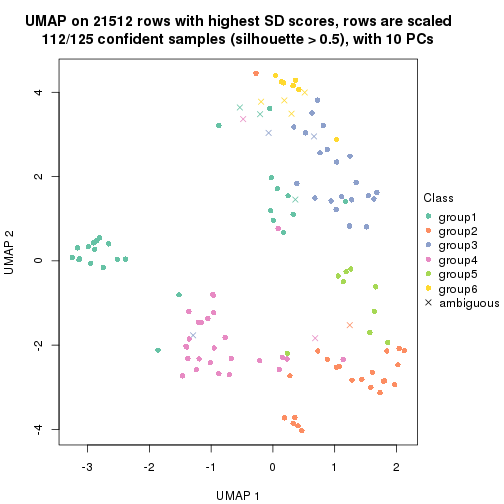</p>

</div>
</div>


Following heatmap shows how subgroups are split when increasing `k`:

```r
collect_classes(res)
```


Test correlation between subgroups and known annotations. If the known
annotation is numeric, one-way ANOVA test is applied, and if the known
annotation is discrete, chi-squared contingency table test is applied.

```r
test_to_known_factors(res)
```

```
#>             n time(p) gender(p) k
#> SD:mclust 124   0.251    0.9184 2
#> SD:mclust 103   0.311    0.1516 3
#> SD:mclust  97   0.511    0.0982 4
#> SD:mclust 112   0.115    0.2404 5
#> SD:mclust 112   0.298    0.1561 6
```


If matrix rows can be associated to genes, consider to use `functional_enrichment(res,
...)` to perform function enrichment for the signature genes. See [this vignette](http://bioconductor.org/packages/devel/bioc/vignettes/cola/inst/doc/functional_enrichment.html) for more detailed explanations.


 

---------------------------------------------------


### SD:NMF


The object with results only for a single top-value method and a single partition method 
can be extracted as:

```r
res = res_list["SD", "NMF"]
# you can also extract it by
# res = res_list["SD:NMF"]
```

A summary of `res` and all the functions that can be applied to it:

```r
res
```

```
#> A 'ConsensusPartition' object with k = 2, 3, 4, 5, 6.
#>   On a matrix with 21512 rows and 125 columns.
#>   Top rows (1000, 2000, 3000, 4000, 5000) are extracted by 'SD' method.
#>   Subgroups are detected by 'NMF' method.
#>   Performed in total 1250 partitions by row resampling.
#>   Best k for subgroups seems to be 2.
#> 
#> Following methods can be applied to this 'ConsensusPartition' object:
#>  [1] "cola_report"             "collect_classes"         "collect_plots"          
#>  [4] "collect_stats"           "colnames"                "compare_signatures"     
#>  [7] "consensus_heatmap"       "dimension_reduction"     "functional_enrichment"  
#> [10] "get_anno_col"            "get_anno"                "get_classes"            
#> [13] "get_consensus"           "get_matrix"              "get_membership"         
#> [16] "get_param"               "get_signatures"          "get_stats"              
#> [19] "is_best_k"               "is_stable_k"             "membership_heatmap"     
#> [22] "ncol"                    "nrow"                    "plot_ecdf"              
#> [25] "rownames"                "select_partition_number" "show"                   
#> [28] "suggest_best_k"          "test_to_known_factors"
```

`collect_plots()` function collects all the plots made from `res` for all `k` (number of partitions)
into one single page to provide an easy and fast comparison between different `k`.

```r
collect_plots(res)
```


The plots are:

- The first row: a plot of the ECDF (empirical cumulative distribution
  function) curves of the consensus matrix for each `k` and the heatmap of
  predicted classes for each `k`.
- The second row: heatmaps of the consensus matrix for each `k`.
- The third row: heatmaps of the membership matrix for each `k`.
- The fouth row: heatmaps of the signatures for each `k`.

All the plots in panels can be made by individual functions and they are
plotted later in this section.

`select_partition_number()` produces several plots showing different
statistics for choosing "optimized" `k`. There are following statistics:

- ECDF curves of the consensus matrix for each `k`;
- 1-PAC. [The PAC
  score](https://en.wikipedia.org/wiki/Consensus_clustering#Over-interpretation_potential_of_consensus_clustering)
  measures the proportion of the ambiguous subgrouping.
- Mean silhouette score.
- Concordance. The mean probability of fiting the consensus class ids in all
  partitions.
- Area increased. Denote $A_k$ as the area under the ECDF curve for current
  `k`, the area increased is defined as $A_k - A_{k-1}$.
- Rand index. The percent of pairs of samples that are both in a same cluster
  or both are not in a same cluster in the partition of k and k-1.
- Jaccard index. The ratio of pairs of samples are both in a same cluster in
  the partition of k and k-1 and the pairs of samples are both in a same
  cluster in the partition k or k-1.

The detailed explanations of these statistics can be found in [the _cola_
vignette](http://bioconductor.org/packages/devel/bioc/vignettes/cola/inst/doc/cola.html#toc_13).

Generally speaking, lower PAC score, higher mean silhouette score or higher
concordance corresponds to better partition. Rand index and Jaccard index
measure how similar the current partition is compared to partition with `k-1`.
If they are too similar, we won't accept `k` is better than `k-1`.

```r
select_partition_number(res)
```


The numeric values for all these statistics can be obtained by `get_stats()`.

```r
get_stats(res)
```

```
#>   k 1-PAC mean_silhouette concordance area_increased  Rand Jaccard
#> 2 2 0.886           0.932       0.971         0.5015 0.498   0.498
#> 3 3 0.403           0.543       0.753         0.3181 0.741   0.525
#> 4 4 0.441           0.463       0.700         0.1205 0.847   0.584
#> 5 5 0.460           0.376       0.620         0.0668 0.839   0.474
#> 6 6 0.514           0.377       0.610         0.0438 0.912   0.615
```

`suggest_best_k()` suggests the best $k$ based on these statistics. The rules are as follows:

- All $k$ with Jaccard index larger than 0.95 are removed because increasing
  $k$ does not provide enough extra information. If all $k$ are removed, it is
  marked as no subgroup is detected.
- For all $k$ with 1-PAC score larger than 0.9, the maximal $k$ is taken as
  the best $k$, and other $k$ are marked as optional $k$.
- If it does not fit the second rule. The $k$ with the maximal vote of the
  highest 1-PAC score, highest mean silhouette, and highest concordance is
  taken as the best $k$.

```r
suggest_best_k(res)
```

```
#> [1] 2
```


Following shows the table of the partitions (You need to click the **show/hide
code output** link to see it). The membership matrix (columns with name `p*`)
is inferred by
[`clue::cl_consensus()`](https://www.rdocumentation.org/link/cl_consensus?package=clue)
function with the `SE` method. Basically the value in the membership matrix
represents the probability to belong to a certain group. The finall class
label for an item is determined with the group with highest probability it
belongs to.

In `get_classes()` function, the entropy is calculated from the membership
matrix and the silhouette score is calculated from the consensus matrix.


<script>
$( function() {
	$( '#tabs-SD-NMF-get-classes' ).tabs();
} );
</script>
<div id='tabs-SD-NMF-get-classes'>
<ul>
<li><a href='#tab-SD-NMF-get-classes-1'>k = 2</a></li>
<li><a href='#tab-SD-NMF-get-classes-2'>k = 3</a></li>
<li><a href='#tab-SD-NMF-get-classes-3'>k = 4</a></li>
<li><a href='#tab-SD-NMF-get-classes-4'>k = 5</a></li>
<li><a href='#tab-SD-NMF-get-classes-5'>k = 6</a></li>
</ul>

<div id='tab-SD-NMF-get-classes-1'>
<p><a id='tab-SD-NMF-get-classes-1-a' style='color:#0366d6' href='#'>show/hide code output</a></p>
<pre><code class="r">cbind(get_classes(res, k = 2), get_membership(res, k = 2))
</code></pre>

<pre><code>#&gt;           class entropy silhouette    p1    p2
#&gt; GSM601872     2  0.0000      0.963 0.000 1.000
#&gt; GSM601882     2  0.0000      0.963 0.000 1.000
#&gt; GSM601887     1  0.6801      0.784 0.820 0.180
#&gt; GSM601892     1  0.0000      0.975 1.000 0.000
#&gt; GSM601897     1  0.2948      0.930 0.948 0.052
#&gt; GSM601902     2  0.0000      0.963 0.000 1.000
#&gt; GSM601912     1  0.0376      0.972 0.996 0.004
#&gt; GSM601927     1  0.0000      0.975 1.000 0.000
#&gt; GSM601932     2  0.0000      0.963 0.000 1.000
#&gt; GSM601937     2  0.0938      0.956 0.012 0.988
#&gt; GSM601942     2  0.0000      0.963 0.000 1.000
#&gt; GSM601947     2  0.0000      0.963 0.000 1.000
#&gt; GSM601957     1  0.0000      0.975 1.000 0.000
#&gt; GSM601972     2  0.0000      0.963 0.000 1.000
#&gt; GSM601977     2  0.0000      0.963 0.000 1.000
#&gt; GSM601987     2  0.0000      0.963 0.000 1.000
#&gt; GSM601877     1  0.0000      0.975 1.000 0.000
#&gt; GSM601907     2  0.0000      0.963 0.000 1.000
#&gt; GSM601917     2  0.4939      0.875 0.108 0.892
#&gt; GSM601922     2  0.7674      0.730 0.224 0.776
#&gt; GSM601952     2  0.0000      0.963 0.000 1.000
#&gt; GSM601962     1  0.0000      0.975 1.000 0.000
#&gt; GSM601967     1  0.0000      0.975 1.000 0.000
#&gt; GSM601982     2  0.3274      0.919 0.060 0.940
#&gt; GSM601992     2  0.0000      0.963 0.000 1.000
#&gt; GSM601873     2  0.0000      0.963 0.000 1.000
#&gt; GSM601883     2  0.0000      0.963 0.000 1.000
#&gt; GSM601888     1  0.8555      0.620 0.720 0.280
#&gt; GSM601893     1  0.0376      0.972 0.996 0.004
#&gt; GSM601898     1  0.0000      0.975 1.000 0.000
#&gt; GSM601903     2  0.0000      0.963 0.000 1.000
#&gt; GSM601913     1  0.0000      0.975 1.000 0.000
#&gt; GSM601928     1  0.0000      0.975 1.000 0.000
#&gt; GSM601933     2  0.0000      0.963 0.000 1.000
#&gt; GSM601938     2  0.0000      0.963 0.000 1.000
#&gt; GSM601943     2  0.0000      0.963 0.000 1.000
#&gt; GSM601948     1  0.0000      0.975 1.000 0.000
#&gt; GSM601958     1  0.0000      0.975 1.000 0.000
#&gt; GSM601973     2  0.0000      0.963 0.000 1.000
#&gt; GSM601978     2  0.0000      0.963 0.000 1.000
#&gt; GSM601988     2  0.0000      0.963 0.000 1.000
#&gt; GSM601878     1  0.0000      0.975 1.000 0.000
#&gt; GSM601908     2  0.0000      0.963 0.000 1.000
#&gt; GSM601918     2  0.0000      0.963 0.000 1.000
#&gt; GSM601923     1  0.0000      0.975 1.000 0.000
#&gt; GSM601953     2  0.0000      0.963 0.000 1.000
#&gt; GSM601963     1  0.0000      0.975 1.000 0.000
#&gt; GSM601968     1  0.0000      0.975 1.000 0.000
#&gt; GSM601983     1  0.0000      0.975 1.000 0.000
#&gt; GSM601993     2  0.0000      0.963 0.000 1.000
#&gt; GSM601874     2  0.0000      0.963 0.000 1.000
#&gt; GSM601884     2  0.0000      0.963 0.000 1.000
#&gt; GSM601889     1  0.0000      0.975 1.000 0.000
#&gt; GSM601894     1  0.0000      0.975 1.000 0.000
#&gt; GSM601899     1  0.4939      0.872 0.892 0.108
#&gt; GSM601904     1  0.9909      0.145 0.556 0.444
#&gt; GSM601914     1  0.0000      0.975 1.000 0.000
#&gt; GSM601929     1  0.0000      0.975 1.000 0.000
#&gt; GSM601934     2  0.0000      0.963 0.000 1.000
#&gt; GSM601939     1  0.0000      0.975 1.000 0.000
#&gt; GSM601944     2  0.0000      0.963 0.000 1.000
#&gt; GSM601949     1  0.0000      0.975 1.000 0.000
#&gt; GSM601959     1  0.0000      0.975 1.000 0.000
#&gt; GSM601974     1  0.6801      0.781 0.820 0.180
#&gt; GSM601979     2  0.0000      0.963 0.000 1.000
#&gt; GSM601989     1  0.0000      0.975 1.000 0.000
#&gt; GSM601879     1  0.0000      0.975 1.000 0.000
#&gt; GSM601909     1  0.0000      0.975 1.000 0.000
#&gt; GSM601919     2  0.1414      0.951 0.020 0.980
#&gt; GSM601924     1  0.0000      0.975 1.000 0.000
#&gt; GSM601954     2  0.0000      0.963 0.000 1.000
#&gt; GSM601964     1  0.0000      0.975 1.000 0.000
#&gt; GSM601969     1  0.0000      0.975 1.000 0.000
#&gt; GSM601984     1  0.0000      0.975 1.000 0.000
#&gt; GSM601994     2  0.0000      0.963 0.000 1.000
#&gt; GSM601875     2  0.0000      0.963 0.000 1.000
#&gt; GSM601885     2  0.0000      0.963 0.000 1.000
#&gt; GSM601890     1  0.0672      0.969 0.992 0.008
#&gt; GSM601895     1  0.0000      0.975 1.000 0.000
#&gt; GSM601900     1  0.0000      0.975 1.000 0.000
#&gt; GSM601905     2  0.4690      0.883 0.100 0.900
#&gt; GSM601915     1  0.0000      0.975 1.000 0.000
#&gt; GSM601930     1  0.0000      0.975 1.000 0.000
#&gt; GSM601935     1  0.1414      0.958 0.980 0.020
#&gt; GSM601940     1  0.0000      0.975 1.000 0.000
#&gt; GSM601945     2  0.0000      0.963 0.000 1.000
#&gt; GSM601950     1  0.0000      0.975 1.000 0.000
#&gt; GSM601960     1  0.0000      0.975 1.000 0.000
#&gt; GSM601975     2  0.0000      0.963 0.000 1.000
#&gt; GSM601980     2  0.1184      0.954 0.016 0.984
#&gt; GSM601990     1  0.0000      0.975 1.000 0.000
#&gt; GSM601880     1  0.0000      0.975 1.000 0.000
#&gt; GSM601910     1  0.0000      0.975 1.000 0.000
#&gt; GSM601920     2  0.6438      0.811 0.164 0.836
#&gt; GSM601925     1  0.0000      0.975 1.000 0.000
#&gt; GSM601955     2  0.9323      0.503 0.348 0.652
#&gt; GSM601965     1  0.0376      0.972 0.996 0.004
#&gt; GSM601970     1  0.0000      0.975 1.000 0.000
#&gt; GSM601985     1  0.0000      0.975 1.000 0.000
#&gt; GSM601995     2  0.6048      0.828 0.148 0.852
#&gt; GSM601876     1  0.0000      0.975 1.000 0.000
#&gt; GSM601886     2  0.9815      0.320 0.420 0.580
#&gt; GSM601891     1  0.8016      0.688 0.756 0.244
#&gt; GSM601896     1  0.0000      0.975 1.000 0.000
#&gt; GSM601901     2  0.0000      0.963 0.000 1.000
#&gt; GSM601906     1  0.0376      0.972 0.996 0.004
#&gt; GSM601916     2  0.1843      0.945 0.028 0.972
#&gt; GSM601931     1  0.0000      0.975 1.000 0.000
#&gt; GSM601936     2  0.2948      0.927 0.052 0.948
#&gt; GSM601941     2  0.0000      0.963 0.000 1.000
#&gt; GSM601946     1  0.0000      0.975 1.000 0.000
#&gt; GSM601951     1  0.0000      0.975 1.000 0.000
#&gt; GSM601961     2  0.0376      0.961 0.004 0.996
#&gt; GSM601976     2  0.0938      0.956 0.012 0.988
#&gt; GSM601981     2  0.0000      0.963 0.000 1.000
#&gt; GSM601991     1  0.0000      0.975 1.000 0.000
#&gt; GSM601881     1  0.0000      0.975 1.000 0.000
#&gt; GSM601911     2  0.9635      0.364 0.388 0.612
#&gt; GSM601921     2  0.0376      0.961 0.004 0.996
#&gt; GSM601926     1  0.0000      0.975 1.000 0.000
#&gt; GSM601956     2  0.0000      0.963 0.000 1.000
#&gt; GSM601966     2  0.0000      0.963 0.000 1.000
#&gt; GSM601971     1  0.0000      0.975 1.000 0.000
#&gt; GSM601986     1  0.2603      0.938 0.956 0.044
#&gt; GSM601996     2  0.0000      0.963 0.000 1.000
</code></pre>

<script>
$('#tab-SD-NMF-get-classes-1-a').parent().next().next().hide();
$('#tab-SD-NMF-get-classes-1-a').click(function(){
  $('#tab-SD-NMF-get-classes-1-a').parent().next().next().toggle();
  return(false);
});
</script>
</div>

<div id='tab-SD-NMF-get-classes-2'>
<p><a id='tab-SD-NMF-get-classes-2-a' style='color:#0366d6' href='#'>show/hide code output</a></p>
<pre><code class="r">cbind(get_classes(res, k = 3), get_membership(res, k = 3))
</code></pre>

<pre><code>#&gt;           class entropy silhouette    p1    p2    p3
#&gt; GSM601872     3  0.4062     0.4056 0.000 0.164 0.836
#&gt; GSM601882     2  0.3686     0.7624 0.000 0.860 0.140
#&gt; GSM601887     3  0.3816     0.5965 0.148 0.000 0.852
#&gt; GSM601892     3  0.5016     0.5820 0.240 0.000 0.760
#&gt; GSM601897     3  0.3551     0.6140 0.132 0.000 0.868
#&gt; GSM601902     2  0.3784     0.7336 0.132 0.864 0.004
#&gt; GSM601912     3  0.5016     0.6005 0.240 0.000 0.760
#&gt; GSM601927     1  0.0424     0.7246 0.992 0.000 0.008
#&gt; GSM601932     2  0.2680     0.7607 0.068 0.924 0.008
#&gt; GSM601937     3  0.6941     0.0481 0.016 0.464 0.520
#&gt; GSM601942     3  0.5621     0.2511 0.000 0.308 0.692
#&gt; GSM601947     2  0.5730     0.7679 0.060 0.796 0.144
#&gt; GSM601957     1  0.6235     0.0275 0.564 0.000 0.436
#&gt; GSM601972     2  0.3213     0.7788 0.028 0.912 0.060
#&gt; GSM601977     2  0.5859     0.6184 0.000 0.656 0.344
#&gt; GSM601987     2  0.3686     0.7678 0.000 0.860 0.140
#&gt; GSM601877     1  0.2063     0.6995 0.948 0.044 0.008
#&gt; GSM601907     2  0.4931     0.7389 0.000 0.768 0.232
#&gt; GSM601917     2  0.7181     0.2259 0.468 0.508 0.024
#&gt; GSM601922     1  0.7346    -0.0475 0.536 0.432 0.032
#&gt; GSM601952     2  0.4339     0.7810 0.048 0.868 0.084
#&gt; GSM601962     3  0.6422     0.5561 0.324 0.016 0.660
#&gt; GSM601967     1  0.6008     0.3044 0.628 0.000 0.372
#&gt; GSM601982     2  0.6859     0.4449 0.016 0.564 0.420
#&gt; GSM601992     2  0.1482     0.7688 0.012 0.968 0.020
#&gt; GSM601873     3  0.6252    -0.2110 0.000 0.444 0.556
#&gt; GSM601883     2  0.3267     0.7720 0.000 0.884 0.116
#&gt; GSM601888     3  0.5970     0.5078 0.160 0.060 0.780
#&gt; GSM601893     3  0.4235     0.5990 0.176 0.000 0.824
#&gt; GSM601898     3  0.6260     0.3704 0.448 0.000 0.552
#&gt; GSM601903     2  0.4293     0.7136 0.164 0.832 0.004
#&gt; GSM601913     1  0.6215    -0.0503 0.572 0.000 0.428
#&gt; GSM601928     1  0.1289     0.7228 0.968 0.000 0.032
#&gt; GSM601933     2  0.2711     0.7726 0.000 0.912 0.088
#&gt; GSM601938     2  0.2537     0.7633 0.000 0.920 0.080
#&gt; GSM601943     3  0.5178     0.3039 0.000 0.256 0.744
#&gt; GSM601948     1  0.3573     0.6955 0.876 0.004 0.120
#&gt; GSM601958     1  0.6192     0.0351 0.580 0.000 0.420
#&gt; GSM601973     2  0.3644     0.7382 0.124 0.872 0.004
#&gt; GSM601978     2  0.5835     0.6613 0.000 0.660 0.340
#&gt; GSM601988     3  0.7286     0.0413 0.028 0.464 0.508
#&gt; GSM601878     1  0.1753     0.7222 0.952 0.000 0.048
#&gt; GSM601908     2  0.3619     0.7703 0.000 0.864 0.136
#&gt; GSM601918     2  0.5319     0.7608 0.104 0.824 0.072
#&gt; GSM601923     1  0.0592     0.7254 0.988 0.000 0.012
#&gt; GSM601953     2  0.6314     0.5969 0.004 0.604 0.392
#&gt; GSM601963     1  0.6280    -0.1556 0.540 0.000 0.460
#&gt; GSM601968     3  0.6235     0.3254 0.436 0.000 0.564
#&gt; GSM601983     3  0.5988     0.5178 0.368 0.000 0.632
#&gt; GSM601993     2  0.3713     0.7508 0.032 0.892 0.076
#&gt; GSM601874     2  0.5363     0.7161 0.000 0.724 0.276
#&gt; GSM601884     2  0.6111     0.5070 0.000 0.604 0.396
#&gt; GSM601889     3  0.6308     0.2575 0.492 0.000 0.508
#&gt; GSM601894     3  0.6286     0.3276 0.464 0.000 0.536
#&gt; GSM601899     3  0.4002     0.5907 0.160 0.000 0.840
#&gt; GSM601904     1  0.6129     0.3329 0.668 0.324 0.008
#&gt; GSM601914     3  0.5988     0.5165 0.368 0.000 0.632
#&gt; GSM601929     1  0.0983     0.7185 0.980 0.016 0.004
#&gt; GSM601934     2  0.4654     0.7436 0.000 0.792 0.208
#&gt; GSM601939     1  0.3340     0.6734 0.880 0.000 0.120
#&gt; GSM601944     2  0.2066     0.7702 0.000 0.940 0.060
#&gt; GSM601949     1  0.4700     0.6536 0.812 0.008 0.180
#&gt; GSM601959     1  0.6062     0.1907 0.616 0.000 0.384
#&gt; GSM601974     3  0.8064     0.5054 0.328 0.084 0.588
#&gt; GSM601979     2  0.4555     0.7497 0.000 0.800 0.200
#&gt; GSM601989     3  0.6154     0.4566 0.408 0.000 0.592
#&gt; GSM601879     1  0.2443     0.7063 0.940 0.032 0.028
#&gt; GSM601909     3  0.5859     0.5359 0.344 0.000 0.656
#&gt; GSM601919     2  0.8857     0.4865 0.344 0.524 0.132
#&gt; GSM601924     1  0.1643     0.7213 0.956 0.000 0.044
#&gt; GSM601954     2  0.8838     0.6365 0.200 0.580 0.220
#&gt; GSM601964     3  0.6215     0.4221 0.428 0.000 0.572
#&gt; GSM601969     1  0.6322     0.5255 0.700 0.024 0.276
#&gt; GSM601984     1  0.3583     0.6884 0.900 0.056 0.044
#&gt; GSM601994     2  0.1453     0.7680 0.024 0.968 0.008
#&gt; GSM601875     2  0.5623     0.7104 0.004 0.716 0.280
#&gt; GSM601885     2  0.3482     0.7704 0.000 0.872 0.128
#&gt; GSM601890     3  0.3412     0.6015 0.124 0.000 0.876
#&gt; GSM601895     3  0.5810     0.5443 0.336 0.000 0.664
#&gt; GSM601900     3  0.6062     0.4897 0.384 0.000 0.616
#&gt; GSM601905     2  0.6675     0.3840 0.404 0.584 0.012
#&gt; GSM601915     1  0.6260    -0.1152 0.552 0.000 0.448
#&gt; GSM601930     1  0.0829     0.7245 0.984 0.004 0.012
#&gt; GSM601935     3  0.8082     0.4863 0.296 0.096 0.608
#&gt; GSM601940     1  0.4555     0.5875 0.800 0.000 0.200
#&gt; GSM601945     2  0.5178     0.7244 0.000 0.744 0.256
#&gt; GSM601950     1  0.3941     0.6667 0.844 0.000 0.156
#&gt; GSM601960     3  0.6111     0.4817 0.396 0.000 0.604
#&gt; GSM601975     2  0.4136     0.7439 0.116 0.864 0.020
#&gt; GSM601980     3  0.5785     0.2599 0.000 0.332 0.668
#&gt; GSM601990     3  0.6111     0.4794 0.396 0.000 0.604
#&gt; GSM601880     1  0.0424     0.7224 0.992 0.008 0.000
#&gt; GSM601910     3  0.6062     0.4660 0.384 0.000 0.616
#&gt; GSM601920     1  0.7517    -0.0278 0.540 0.420 0.040
#&gt; GSM601925     1  0.1399     0.7129 0.968 0.028 0.004
#&gt; GSM601955     3  0.5180     0.5495 0.032 0.156 0.812
#&gt; GSM601965     1  0.2066     0.7165 0.940 0.000 0.060
#&gt; GSM601970     1  0.6192     0.0752 0.580 0.000 0.420
#&gt; GSM601985     1  0.2878     0.6973 0.904 0.000 0.096
#&gt; GSM601995     3  0.7311     0.2482 0.036 0.384 0.580
#&gt; GSM601876     1  0.2878     0.6944 0.904 0.000 0.096
#&gt; GSM601886     2  0.9887     0.0489 0.336 0.396 0.268
#&gt; GSM601891     3  0.2939     0.5862 0.072 0.012 0.916
#&gt; GSM601896     1  0.5016     0.5090 0.760 0.000 0.240
#&gt; GSM601901     2  0.3965     0.7757 0.008 0.860 0.132
#&gt; GSM601906     1  0.3607     0.6366 0.880 0.112 0.008
#&gt; GSM601916     2  0.5815     0.5675 0.304 0.692 0.004
#&gt; GSM601931     1  0.0747     0.7250 0.984 0.000 0.016
#&gt; GSM601936     2  0.7660     0.4063 0.064 0.612 0.324
#&gt; GSM601941     2  0.2845     0.7600 0.068 0.920 0.012
#&gt; GSM601946     1  0.2448     0.7069 0.924 0.000 0.076
#&gt; GSM601951     1  0.2297     0.7214 0.944 0.020 0.036
#&gt; GSM601961     2  0.7558     0.5642 0.044 0.556 0.400
#&gt; GSM601976     2  0.5899     0.6387 0.244 0.736 0.020
#&gt; GSM601981     2  0.5058     0.7320 0.000 0.756 0.244
#&gt; GSM601991     3  0.6126     0.5838 0.268 0.020 0.712
#&gt; GSM601881     1  0.1267     0.7258 0.972 0.004 0.024
#&gt; GSM601911     1  0.7069    -0.1011 0.508 0.472 0.020
#&gt; GSM601921     2  0.6019     0.5926 0.288 0.700 0.012
#&gt; GSM601926     1  0.0592     0.7256 0.988 0.000 0.012
#&gt; GSM601956     2  0.6126     0.5861 0.000 0.600 0.400
#&gt; GSM601966     2  0.1163     0.7713 0.028 0.972 0.000
#&gt; GSM601971     1  0.4178     0.6270 0.828 0.000 0.172
#&gt; GSM601986     1  0.2945     0.6649 0.908 0.088 0.004
#&gt; GSM601996     2  0.2339     0.7663 0.048 0.940 0.012
</code></pre>

<script>
$('#tab-SD-NMF-get-classes-2-a').parent().next().next().hide();
$('#tab-SD-NMF-get-classes-2-a').click(function(){
  $('#tab-SD-NMF-get-classes-2-a').parent().next().next().toggle();
  return(false);
});
</script>
</div>

<div id='tab-SD-NMF-get-classes-3'>
<p><a id='tab-SD-NMF-get-classes-3-a' style='color:#0366d6' href='#'>show/hide code output</a></p>
<pre><code class="r">cbind(get_classes(res, k = 4), get_membership(res, k = 4))
</code></pre>

<pre><code>#&gt;           class entropy silhouette    p1    p2    p3    p4
#&gt; GSM601872     2   0.551    0.00791 0.000 0.512 0.472 0.016
#&gt; GSM601882     4   0.573    0.32534 0.000 0.344 0.040 0.616
#&gt; GSM601887     2   0.606    0.08759 0.044 0.588 0.364 0.004
#&gt; GSM601892     2   0.761   -0.24203 0.140 0.444 0.404 0.012
#&gt; GSM601897     3   0.267    0.59716 0.008 0.100 0.892 0.000
#&gt; GSM601902     4   0.525    0.63970 0.156 0.060 0.016 0.768
#&gt; GSM601912     3   0.384    0.63793 0.052 0.092 0.852 0.004
#&gt; GSM601927     1   0.322    0.73339 0.892 0.012 0.052 0.044
#&gt; GSM601932     4   0.376    0.66852 0.040 0.052 0.036 0.872
#&gt; GSM601937     3   0.535    0.18160 0.000 0.012 0.560 0.428
#&gt; GSM601942     3   0.612    0.38353 0.000 0.112 0.668 0.220
#&gt; GSM601947     2   0.699    0.17950 0.132 0.532 0.000 0.336
#&gt; GSM601957     1   0.734    0.19499 0.524 0.124 0.340 0.012
#&gt; GSM601972     4   0.612    0.38618 0.060 0.312 0.004 0.624
#&gt; GSM601977     4   0.786   -0.17158 0.000 0.344 0.276 0.380
#&gt; GSM601987     2   0.552    0.25955 0.000 0.568 0.020 0.412
#&gt; GSM601877     1   0.194    0.71865 0.936 0.012 0.000 0.052
#&gt; GSM601907     2   0.343    0.55272 0.012 0.844 0.000 0.144
#&gt; GSM601917     1   0.632   -0.17323 0.500 0.060 0.000 0.440
#&gt; GSM601922     1   0.625    0.14570 0.596 0.060 0.004 0.340
#&gt; GSM601952     4   0.635    0.49934 0.056 0.208 0.044 0.692
#&gt; GSM601962     3   0.391    0.65497 0.088 0.016 0.856 0.040
#&gt; GSM601967     1   0.738    0.15841 0.528 0.148 0.316 0.008
#&gt; GSM601982     2   0.754    0.40956 0.064 0.592 0.084 0.260
#&gt; GSM601992     4   0.198    0.64829 0.004 0.068 0.000 0.928
#&gt; GSM601873     3   0.762    0.01508 0.000 0.244 0.472 0.284
#&gt; GSM601883     4   0.546   -0.07311 0.008 0.484 0.004 0.504
#&gt; GSM601888     2   0.477    0.46974 0.072 0.800 0.120 0.008
#&gt; GSM601893     3   0.679    0.22942 0.072 0.436 0.484 0.008
#&gt; GSM601898     3   0.597    0.45265 0.296 0.032 0.652 0.020
#&gt; GSM601903     4   0.532    0.61801 0.192 0.064 0.004 0.740
#&gt; GSM601913     3   0.592    0.40173 0.328 0.012 0.628 0.032
#&gt; GSM601928     1   0.484    0.70492 0.792 0.012 0.144 0.052
#&gt; GSM601933     4   0.480    0.44795 0.000 0.260 0.020 0.720
#&gt; GSM601938     4   0.410    0.58533 0.000 0.148 0.036 0.816
#&gt; GSM601943     3   0.656    0.21684 0.000 0.296 0.596 0.108
#&gt; GSM601948     1   0.455    0.70269 0.820 0.116 0.040 0.024
#&gt; GSM601958     1   0.675    0.12655 0.512 0.056 0.416 0.016
#&gt; GSM601973     4   0.384    0.66865 0.088 0.032 0.020 0.860
#&gt; GSM601978     2   0.402    0.56291 0.000 0.828 0.044 0.128
#&gt; GSM601988     3   0.557    0.08967 0.004 0.012 0.520 0.464
#&gt; GSM601878     1   0.206    0.73012 0.940 0.032 0.020 0.008
#&gt; GSM601908     2   0.517    0.33443 0.012 0.620 0.000 0.368
#&gt; GSM601918     2   0.734   -0.10246 0.156 0.428 0.000 0.416
#&gt; GSM601923     1   0.180    0.73463 0.944 0.000 0.040 0.016
#&gt; GSM601953     2   0.299    0.56414 0.008 0.900 0.036 0.056
#&gt; GSM601963     3   0.474    0.48602 0.328 0.000 0.668 0.004
#&gt; GSM601968     3   0.778    0.38914 0.308 0.204 0.480 0.008
#&gt; GSM601983     3   0.409    0.64104 0.172 0.024 0.804 0.000
#&gt; GSM601993     4   0.330    0.62211 0.012 0.028 0.076 0.884
#&gt; GSM601874     2   0.265    0.56751 0.004 0.888 0.000 0.108
#&gt; GSM601884     2   0.744    0.27223 0.000 0.492 0.196 0.312
#&gt; GSM601889     3   0.717    0.20729 0.400 0.088 0.496 0.016
#&gt; GSM601894     3   0.654    0.30657 0.372 0.056 0.560 0.012
#&gt; GSM601899     2   0.648    0.07686 0.064 0.580 0.348 0.008
#&gt; GSM601904     1   0.690   -0.00993 0.472 0.016 0.064 0.448
#&gt; GSM601914     3   0.299    0.65831 0.112 0.012 0.876 0.000
#&gt; GSM601929     1   0.320    0.72444 0.892 0.016 0.028 0.064
#&gt; GSM601934     2   0.644    0.15394 0.000 0.488 0.068 0.444
#&gt; GSM601939     1   0.513    0.65886 0.760 0.020 0.188 0.032
#&gt; GSM601944     4   0.368    0.61285 0.000 0.060 0.084 0.856
#&gt; GSM601949     1   0.560    0.61779 0.716 0.228 0.032 0.024
#&gt; GSM601959     1   0.699    0.25845 0.540 0.060 0.372 0.028
#&gt; GSM601974     3   0.541    0.62607 0.072 0.016 0.760 0.152
#&gt; GSM601979     2   0.453    0.50409 0.000 0.744 0.016 0.240
#&gt; GSM601989     3   0.689    0.50264 0.252 0.104 0.624 0.020
#&gt; GSM601879     1   0.204    0.71979 0.936 0.032 0.000 0.032
#&gt; GSM601909     3   0.649    0.57058 0.204 0.156 0.640 0.000
#&gt; GSM601919     2   0.763    0.07348 0.368 0.424 0.000 0.208
#&gt; GSM601924     1   0.212    0.73169 0.932 0.012 0.052 0.004
#&gt; GSM601954     2   0.616    0.42507 0.172 0.676 0.000 0.152
#&gt; GSM601964     3   0.383    0.62213 0.204 0.000 0.792 0.004
#&gt; GSM601969     1   0.725    0.41959 0.588 0.264 0.128 0.020
#&gt; GSM601984     1   0.478    0.69002 0.788 0.000 0.116 0.096
#&gt; GSM601994     4   0.185    0.65632 0.012 0.048 0.000 0.940
#&gt; GSM601875     2   0.292    0.56761 0.004 0.884 0.008 0.104
#&gt; GSM601885     2   0.551    0.23331 0.008 0.568 0.008 0.416
#&gt; GSM601890     3   0.607    0.21703 0.036 0.432 0.528 0.004
#&gt; GSM601895     3   0.287    0.66167 0.072 0.032 0.896 0.000
#&gt; GSM601900     3   0.439    0.63762 0.132 0.024 0.820 0.024
#&gt; GSM601905     4   0.585    0.50586 0.308 0.024 0.020 0.648
#&gt; GSM601915     3   0.572    0.37302 0.344 0.012 0.624 0.020
#&gt; GSM601930     1   0.370    0.72973 0.868 0.012 0.068 0.052
#&gt; GSM601935     3   0.481    0.54539 0.028 0.000 0.736 0.236
#&gt; GSM601940     1   0.544    0.63612 0.740 0.036 0.200 0.024
#&gt; GSM601945     2   0.526    0.50444 0.000 0.700 0.040 0.260
#&gt; GSM601950     1   0.522    0.68110 0.784 0.120 0.072 0.024
#&gt; GSM601960     3   0.310    0.65453 0.116 0.004 0.872 0.008
#&gt; GSM601975     4   0.558    0.61479 0.156 0.104 0.004 0.736
#&gt; GSM601980     3   0.501    0.44579 0.000 0.024 0.700 0.276
#&gt; GSM601990     3   0.375    0.66029 0.088 0.008 0.860 0.044
#&gt; GSM601880     1   0.191    0.72964 0.940 0.000 0.020 0.040
#&gt; GSM601910     3   0.637    0.56145 0.244 0.104 0.648 0.004
#&gt; GSM601920     1   0.583    0.25704 0.632 0.052 0.000 0.316
#&gt; GSM601925     1   0.236    0.72323 0.920 0.000 0.024 0.056
#&gt; GSM601955     3   0.448    0.55642 0.016 0.032 0.812 0.140
#&gt; GSM601965     1   0.436    0.70469 0.816 0.008 0.136 0.040
#&gt; GSM601970     3   0.649    0.23205 0.436 0.060 0.500 0.004
#&gt; GSM601985     1   0.410    0.65209 0.792 0.000 0.192 0.016
#&gt; GSM601995     3   0.535    0.30686 0.004 0.012 0.616 0.368
#&gt; GSM601876     1   0.484    0.68018 0.788 0.024 0.160 0.028
#&gt; GSM601886     4   0.642    0.45305 0.092 0.016 0.224 0.668
#&gt; GSM601891     2   0.619   -0.14567 0.028 0.488 0.472 0.012
#&gt; GSM601896     1   0.568    0.60384 0.716 0.044 0.220 0.020
#&gt; GSM601901     2   0.618    0.07942 0.028 0.508 0.012 0.452
#&gt; GSM601906     1   0.539    0.61954 0.736 0.008 0.056 0.200
#&gt; GSM601916     4   0.589    0.55281 0.260 0.044 0.016 0.680
#&gt; GSM601931     1   0.386    0.72580 0.856 0.012 0.092 0.040
#&gt; GSM601936     4   0.596    0.31107 0.024 0.020 0.328 0.628
#&gt; GSM601941     4   0.231    0.67097 0.040 0.028 0.004 0.928
#&gt; GSM601946     1   0.490    0.67626 0.780 0.016 0.168 0.036
#&gt; GSM601951     1   0.327    0.72718 0.892 0.024 0.028 0.056
#&gt; GSM601961     2   0.362    0.54613 0.052 0.876 0.020 0.052
#&gt; GSM601976     4   0.634    0.59000 0.208 0.060 0.040 0.692
#&gt; GSM601981     2   0.447    0.53585 0.004 0.776 0.020 0.200
#&gt; GSM601991     3   0.268    0.64188 0.028 0.012 0.916 0.044
#&gt; GSM601881     1   0.170    0.73458 0.952 0.004 0.028 0.016
#&gt; GSM601911     1   0.674    0.26742 0.596 0.112 0.004 0.288
#&gt; GSM601921     4   0.642    0.47645 0.336 0.084 0.000 0.580
#&gt; GSM601926     1   0.238    0.73215 0.916 0.000 0.068 0.016
#&gt; GSM601956     2   0.465    0.55862 0.000 0.796 0.084 0.120
#&gt; GSM601966     4   0.393    0.63315 0.040 0.128 0.000 0.832
#&gt; GSM601971     1   0.457    0.61013 0.768 0.016 0.208 0.008
#&gt; GSM601986     1   0.339    0.72939 0.888 0.032 0.028 0.052
#&gt; GSM601996     4   0.276    0.66686 0.044 0.052 0.000 0.904
</code></pre>

<script>
$('#tab-SD-NMF-get-classes-3-a').parent().next().next().hide();
$('#tab-SD-NMF-get-classes-3-a').click(function(){
  $('#tab-SD-NMF-get-classes-3-a').parent().next().next().toggle();
  return(false);
});
</script>
</div>

<div id='tab-SD-NMF-get-classes-4'>
<p><a id='tab-SD-NMF-get-classes-4-a' style='color:#0366d6' href='#'>show/hide code output</a></p>
<pre><code class="r">cbind(get_classes(res, k = 5), get_membership(res, k = 5))
</code></pre>

<pre><code>#&gt;           class entropy silhouette    p1    p2    p3    p4    p5
#&gt; GSM601872     3   0.511     0.1492 0.012 0.420 0.552 0.008 0.008
#&gt; GSM601882     4   0.601    -0.0690 0.008 0.424 0.032 0.504 0.032
#&gt; GSM601887     2   0.656     0.3707 0.152 0.620 0.176 0.004 0.048
#&gt; GSM601892     2   0.726     0.0963 0.396 0.424 0.120 0.004 0.056
#&gt; GSM601897     3   0.363     0.6596 0.052 0.068 0.852 0.024 0.004
#&gt; GSM601902     4   0.588     0.4494 0.028 0.044 0.004 0.572 0.352
#&gt; GSM601912     3   0.645     0.5225 0.292 0.112 0.568 0.024 0.004
#&gt; GSM601927     1   0.477     0.3844 0.680 0.000 0.004 0.040 0.276
#&gt; GSM601932     4   0.665     0.3977 0.040 0.044 0.024 0.496 0.396
#&gt; GSM601937     4   0.613    -0.1051 0.040 0.016 0.456 0.468 0.020
#&gt; GSM601942     3   0.393     0.5998 0.004 0.044 0.832 0.092 0.028
#&gt; GSM601947     5   0.620     0.0894 0.012 0.236 0.000 0.160 0.592
#&gt; GSM601957     1   0.469     0.5458 0.784 0.064 0.092 0.000 0.060
#&gt; GSM601972     4   0.772     0.3343 0.036 0.224 0.012 0.388 0.340
#&gt; GSM601977     2   0.749     0.3398 0.008 0.444 0.228 0.288 0.032
#&gt; GSM601987     2   0.507     0.4800 0.020 0.656 0.004 0.300 0.020
#&gt; GSM601877     5   0.482     0.1825 0.416 0.004 0.000 0.016 0.564
#&gt; GSM601907     2   0.312     0.6029 0.000 0.860 0.000 0.076 0.064
#&gt; GSM601917     5   0.397     0.3983 0.028 0.016 0.004 0.144 0.808
#&gt; GSM601922     5   0.460     0.4774 0.092 0.016 0.000 0.120 0.772
#&gt; GSM601952     5   0.795    -0.0550 0.000 0.140 0.192 0.212 0.456
#&gt; GSM601962     3   0.366     0.6777 0.044 0.004 0.852 0.068 0.032
#&gt; GSM601967     1   0.765     0.3283 0.496 0.084 0.196 0.004 0.220
#&gt; GSM601982     2   0.783     0.4275 0.012 0.512 0.124 0.208 0.144
#&gt; GSM601992     4   0.439     0.5005 0.020 0.092 0.012 0.808 0.068
#&gt; GSM601873     2   0.760     0.2561 0.016 0.388 0.248 0.328 0.020
#&gt; GSM601883     2   0.514     0.3781 0.008 0.592 0.000 0.368 0.032
#&gt; GSM601888     2   0.525     0.5201 0.136 0.736 0.048 0.000 0.080
#&gt; GSM601893     2   0.730     0.1236 0.328 0.452 0.180 0.004 0.036
#&gt; GSM601898     1   0.529     0.2303 0.624 0.012 0.328 0.028 0.008
#&gt; GSM601903     4   0.589     0.3335 0.028 0.028 0.008 0.496 0.440
#&gt; GSM601913     1   0.561     0.3920 0.672 0.000 0.208 0.100 0.020
#&gt; GSM601928     1   0.524     0.3998 0.672 0.000 0.016 0.056 0.256
#&gt; GSM601933     4   0.612    -0.0396 0.048 0.372 0.000 0.536 0.044
#&gt; GSM601938     4   0.515     0.3927 0.032 0.208 0.016 0.720 0.024
#&gt; GSM601943     3   0.540     0.4192 0.016 0.248 0.676 0.052 0.008
#&gt; GSM601948     5   0.590     0.2540 0.328 0.036 0.020 0.020 0.596
#&gt; GSM601958     1   0.388     0.5615 0.824 0.020 0.120 0.004 0.032
#&gt; GSM601973     4   0.543     0.4183 0.016 0.016 0.012 0.568 0.388
#&gt; GSM601978     2   0.319     0.6070 0.000 0.864 0.012 0.088 0.036
#&gt; GSM601988     4   0.619     0.1967 0.064 0.012 0.340 0.564 0.020
#&gt; GSM601878     5   0.474    -0.0107 0.476 0.016 0.000 0.000 0.508
#&gt; GSM601908     2   0.510     0.4633 0.000 0.656 0.000 0.272 0.072
#&gt; GSM601918     5   0.588     0.0804 0.000 0.200 0.000 0.196 0.604
#&gt; GSM601923     5   0.499     0.1904 0.396 0.000 0.016 0.012 0.576
#&gt; GSM601953     2   0.346     0.5777 0.000 0.836 0.032 0.008 0.124
#&gt; GSM601963     3   0.618     0.4392 0.308 0.000 0.580 0.036 0.076
#&gt; GSM601968     3   0.750     0.4815 0.152 0.128 0.524 0.000 0.196
#&gt; GSM601983     3   0.583     0.6147 0.212 0.028 0.680 0.020 0.060
#&gt; GSM601993     4   0.440     0.5251 0.028 0.008 0.088 0.808 0.068
#&gt; GSM601874     2   0.350     0.6011 0.004 0.840 0.000 0.092 0.064
#&gt; GSM601884     2   0.673     0.4409 0.000 0.520 0.224 0.240 0.016
#&gt; GSM601889     1   0.504     0.4101 0.708 0.040 0.228 0.004 0.020
#&gt; GSM601894     1   0.521     0.4128 0.704 0.040 0.224 0.008 0.024
#&gt; GSM601899     2   0.648     0.3494 0.232 0.596 0.132 0.000 0.040
#&gt; GSM601904     5   0.662     0.0143 0.188 0.000 0.004 0.364 0.444
#&gt; GSM601914     3   0.461     0.5934 0.268 0.004 0.700 0.020 0.008
#&gt; GSM601929     1   0.508     0.2714 0.628 0.000 0.000 0.056 0.316
#&gt; GSM601934     2   0.792     0.3241 0.176 0.448 0.040 0.300 0.036
#&gt; GSM601939     1   0.353     0.5508 0.840 0.000 0.032 0.016 0.112
#&gt; GSM601944     4   0.558     0.4606 0.100 0.124 0.020 0.728 0.028
#&gt; GSM601949     1   0.593     0.0793 0.500 0.108 0.000 0.000 0.392
#&gt; GSM601959     1   0.435     0.5632 0.820 0.032 0.084 0.028 0.036
#&gt; GSM601974     3   0.719     0.4553 0.112 0.008 0.580 0.108 0.192
#&gt; GSM601979     2   0.441     0.5709 0.000 0.760 0.004 0.172 0.064
#&gt; GSM601989     1   0.571     0.4256 0.716 0.080 0.148 0.040 0.016
#&gt; GSM601879     5   0.472     0.2684 0.352 0.008 0.004 0.008 0.628
#&gt; GSM601909     3   0.653     0.5823 0.172 0.120 0.628 0.000 0.080
#&gt; GSM601919     5   0.399     0.4346 0.032 0.128 0.000 0.028 0.812
#&gt; GSM601924     1   0.489     0.0699 0.512 0.004 0.016 0.000 0.468
#&gt; GSM601954     5   0.620     0.1734 0.008 0.308 0.012 0.096 0.576
#&gt; GSM601964     3   0.394     0.6739 0.088 0.000 0.824 0.020 0.068
#&gt; GSM601969     5   0.746     0.0750 0.308 0.176 0.044 0.008 0.464
#&gt; GSM601984     1   0.663     0.3492 0.568 0.004 0.020 0.180 0.228
#&gt; GSM601994     4   0.413     0.5182 0.016 0.088 0.004 0.816 0.076
#&gt; GSM601875     2   0.377     0.6004 0.020 0.824 0.000 0.124 0.032
#&gt; GSM601885     2   0.594     0.4481 0.012 0.600 0.020 0.316 0.052
#&gt; GSM601890     3   0.661     0.2090 0.084 0.384 0.488 0.000 0.044
#&gt; GSM601895     3   0.493     0.6026 0.260 0.028 0.692 0.016 0.004
#&gt; GSM601900     1   0.654     0.1976 0.596 0.040 0.272 0.076 0.016
#&gt; GSM601905     4   0.633     0.3523 0.164 0.008 0.000 0.552 0.276
#&gt; GSM601915     1   0.492     0.3138 0.668 0.000 0.288 0.032 0.012
#&gt; GSM601930     1   0.429     0.4314 0.740 0.000 0.004 0.032 0.224
#&gt; GSM601935     3   0.637     0.4741 0.112 0.004 0.572 0.292 0.020
#&gt; GSM601940     1   0.265     0.5699 0.892 0.000 0.036 0.004 0.068
#&gt; GSM601945     2   0.446     0.5616 0.008 0.736 0.008 0.228 0.020
#&gt; GSM601950     1   0.477     0.4631 0.716 0.064 0.000 0.004 0.216
#&gt; GSM601960     3   0.452     0.6596 0.180 0.000 0.760 0.032 0.028
#&gt; GSM601975     4   0.604     0.3895 0.012 0.084 0.000 0.508 0.396
#&gt; GSM601980     3   0.406     0.6028 0.020 0.008 0.820 0.112 0.040
#&gt; GSM601990     3   0.464     0.6504 0.184 0.000 0.744 0.064 0.008
#&gt; GSM601880     5   0.507     0.0757 0.448 0.000 0.008 0.020 0.524
#&gt; GSM601910     3   0.784     0.3474 0.304 0.100 0.460 0.012 0.124
#&gt; GSM601920     5   0.503     0.4646 0.160 0.004 0.000 0.120 0.716
#&gt; GSM601925     5   0.494     0.2300 0.380 0.000 0.008 0.020 0.592
#&gt; GSM601955     3   0.309     0.6444 0.016 0.000 0.876 0.056 0.052
#&gt; GSM601965     1   0.713     0.3371 0.548 0.024 0.024 0.164 0.240
#&gt; GSM601970     3   0.737     0.2873 0.280 0.040 0.472 0.004 0.204
#&gt; GSM601985     1   0.532     0.4601 0.676 0.000 0.060 0.020 0.244
#&gt; GSM601995     3   0.439     0.5475 0.000 0.004 0.748 0.200 0.048
#&gt; GSM601876     1   0.253     0.5570 0.904 0.004 0.004 0.056 0.032
#&gt; GSM601886     4   0.659     0.4597 0.176 0.000 0.108 0.624 0.092
#&gt; GSM601891     2   0.657     0.0616 0.120 0.500 0.360 0.004 0.016
#&gt; GSM601896     1   0.228     0.5627 0.924 0.012 0.012 0.020 0.032
#&gt; GSM601901     2   0.766     0.1734 0.084 0.428 0.004 0.348 0.136
#&gt; GSM601906     1   0.616     0.0675 0.516 0.000 0.000 0.148 0.336
#&gt; GSM601916     4   0.674     0.4163 0.204 0.024 0.000 0.540 0.232
#&gt; GSM601931     1   0.445     0.4439 0.724 0.000 0.004 0.036 0.236
#&gt; GSM601936     4   0.584     0.4369 0.212 0.012 0.080 0.672 0.024
#&gt; GSM601941     4   0.554     0.4911 0.000 0.040 0.028 0.616 0.316
#&gt; GSM601946     1   0.278     0.5580 0.888 0.000 0.012 0.028 0.072
#&gt; GSM601951     1   0.578     0.0221 0.484 0.000 0.016 0.052 0.448
#&gt; GSM601961     2   0.507     0.5813 0.108 0.756 0.000 0.056 0.080
#&gt; GSM601976     4   0.650     0.4746 0.152 0.036 0.000 0.596 0.216
#&gt; GSM601981     2   0.489     0.5707 0.016 0.744 0.004 0.172 0.064
#&gt; GSM601991     3   0.565     0.6404 0.152 0.016 0.700 0.120 0.012
#&gt; GSM601881     1   0.470     0.0206 0.508 0.000 0.008 0.004 0.480
#&gt; GSM601911     1   0.834     0.0108 0.384 0.164 0.004 0.280 0.168
#&gt; GSM601921     5   0.523     0.2065 0.040 0.020 0.000 0.284 0.656
#&gt; GSM601926     1   0.526     0.0578 0.508 0.000 0.020 0.016 0.456
#&gt; GSM601956     2   0.516     0.5543 0.000 0.736 0.152 0.040 0.072
#&gt; GSM601966     4   0.483     0.4664 0.008 0.152 0.000 0.740 0.100
#&gt; GSM601971     5   0.727     0.0375 0.288 0.020 0.208 0.012 0.472
#&gt; GSM601986     1   0.671     0.3579 0.584 0.044 0.008 0.108 0.256
#&gt; GSM601996     4   0.436     0.5403 0.020 0.060 0.008 0.804 0.108
</code></pre>

<script>
$('#tab-SD-NMF-get-classes-4-a').parent().next().next().hide();
$('#tab-SD-NMF-get-classes-4-a').click(function(){
  $('#tab-SD-NMF-get-classes-4-a').parent().next().next().toggle();
  return(false);
});
</script>
</div>

<div id='tab-SD-NMF-get-classes-5'>
<p><a id='tab-SD-NMF-get-classes-5-a' style='color:#0366d6' href='#'>show/hide code output</a></p>
<pre><code class="r">cbind(get_classes(res, k = 6), get_membership(res, k = 6))
</code></pre>

<pre><code>#&gt;           class entropy silhouette    p1    p2    p3    p4    p5    p6
#&gt; GSM601872     3   0.517    0.34542 0.004 0.324 0.604 0.048 0.016 0.004
#&gt; GSM601882     5   0.703    0.18740 0.044 0.284 0.032 0.104 0.516 0.020
#&gt; GSM601887     2   0.560    0.49006 0.016 0.688 0.136 0.048 0.004 0.108
#&gt; GSM601892     2   0.620    0.18709 0.028 0.500 0.048 0.040 0.004 0.380
#&gt; GSM601897     3   0.412    0.65926 0.004 0.064 0.808 0.064 0.008 0.052
#&gt; GSM601902     4   0.626    0.51520 0.088 0.020 0.004 0.576 0.268 0.044
#&gt; GSM601912     3   0.711    0.53872 0.016 0.100 0.528 0.056 0.040 0.260
#&gt; GSM601927     1   0.493   -0.15361 0.480 0.000 0.000 0.032 0.016 0.472
#&gt; GSM601932     4   0.619    0.56412 0.060 0.056 0.016 0.652 0.176 0.040
#&gt; GSM601937     3   0.664    0.31236 0.020 0.008 0.524 0.104 0.300 0.044
#&gt; GSM601942     3   0.452    0.60661 0.008 0.052 0.776 0.100 0.060 0.004
#&gt; GSM601947     4   0.583    0.44556 0.228 0.208 0.000 0.552 0.012 0.000
#&gt; GSM601957     6   0.523    0.57580 0.100 0.092 0.048 0.032 0.000 0.728
#&gt; GSM601972     4   0.720    0.51033 0.088 0.152 0.000 0.532 0.180 0.048
#&gt; GSM601977     2   0.775    0.15499 0.000 0.352 0.220 0.172 0.248 0.008
#&gt; GSM601987     2   0.546    0.17608 0.004 0.492 0.000 0.052 0.428 0.024
#&gt; GSM601877     1   0.407    0.50501 0.780 0.004 0.000 0.032 0.036 0.148
#&gt; GSM601907     2   0.399    0.56828 0.020 0.796 0.000 0.092 0.088 0.004
#&gt; GSM601917     1   0.545    0.28224 0.644 0.012 0.036 0.244 0.064 0.000
#&gt; GSM601922     1   0.448    0.38920 0.724 0.008 0.000 0.168 0.100 0.000
#&gt; GSM601952     4   0.845    0.33341 0.176 0.116 0.168 0.436 0.076 0.028
#&gt; GSM601962     3   0.422    0.67129 0.056 0.000 0.804 0.024 0.060 0.056
#&gt; GSM601967     6   0.786    0.28577 0.268 0.092 0.120 0.060 0.012 0.448
#&gt; GSM601982     5   0.876   -0.00635 0.196 0.292 0.112 0.052 0.308 0.040
#&gt; GSM601992     5   0.256    0.44427 0.028 0.036 0.004 0.028 0.900 0.004
#&gt; GSM601873     5   0.774   -0.07131 0.004 0.316 0.240 0.080 0.336 0.024
#&gt; GSM601883     2   0.599    0.11159 0.008 0.444 0.004 0.104 0.428 0.012
#&gt; GSM601888     2   0.413    0.54592 0.044 0.808 0.016 0.040 0.004 0.088
#&gt; GSM601893     2   0.680    0.39811 0.032 0.580 0.116 0.044 0.020 0.208
#&gt; GSM601898     6   0.398    0.57769 0.028 0.000 0.128 0.040 0.008 0.796
#&gt; GSM601903     4   0.578    0.56316 0.156 0.012 0.008 0.620 0.196 0.008
#&gt; GSM601913     6   0.487    0.56659 0.024 0.004 0.100 0.056 0.056 0.760
#&gt; GSM601928     6   0.545    0.16232 0.420 0.000 0.000 0.084 0.012 0.484
#&gt; GSM601933     5   0.625    0.21503 0.004 0.272 0.004 0.116 0.556 0.048
#&gt; GSM601938     5   0.575    0.34351 0.020 0.076 0.016 0.176 0.676 0.036
#&gt; GSM601943     3   0.615    0.45663 0.000 0.208 0.616 0.080 0.076 0.020
#&gt; GSM601948     1   0.745    0.20414 0.428 0.060 0.040 0.280 0.000 0.192
#&gt; GSM601958     6   0.370    0.61072 0.088 0.020 0.040 0.016 0.004 0.832
#&gt; GSM601973     4   0.564    0.54148 0.100 0.008 0.012 0.628 0.240 0.012
#&gt; GSM601978     2   0.330    0.56979 0.004 0.824 0.008 0.136 0.028 0.000
#&gt; GSM601988     5   0.609    0.35260 0.000 0.008 0.212 0.084 0.608 0.088
#&gt; GSM601878     1   0.364    0.45921 0.776 0.012 0.004 0.008 0.004 0.196
#&gt; GSM601908     2   0.611    0.39545 0.024 0.548 0.000 0.184 0.240 0.004
#&gt; GSM601918     1   0.689   -0.26807 0.416 0.148 0.000 0.344 0.092 0.000
#&gt; GSM601923     1   0.278    0.51373 0.852 0.000 0.004 0.008 0.008 0.128
#&gt; GSM601953     2   0.449    0.55528 0.060 0.776 0.036 0.108 0.020 0.000
#&gt; GSM601963     3   0.605    0.60644 0.124 0.008 0.640 0.020 0.036 0.172
#&gt; GSM601968     3   0.742    0.50516 0.192 0.096 0.528 0.052 0.008 0.124
#&gt; GSM601983     3   0.581    0.65443 0.104 0.020 0.688 0.016 0.048 0.124
#&gt; GSM601993     5   0.369    0.42355 0.028 0.000 0.048 0.076 0.832 0.016
#&gt; GSM601874     2   0.353    0.57771 0.008 0.820 0.000 0.120 0.044 0.008
#&gt; GSM601884     2   0.758    0.25364 0.016 0.412 0.280 0.064 0.212 0.016
#&gt; GSM601889     6   0.369    0.58874 0.024 0.032 0.068 0.040 0.000 0.836
#&gt; GSM601894     6   0.603    0.54990 0.120 0.052 0.124 0.020 0.016 0.668
#&gt; GSM601899     2   0.565    0.48982 0.032 0.692 0.072 0.040 0.008 0.156
#&gt; GSM601904     1   0.721   -0.13487 0.380 0.000 0.000 0.308 0.208 0.104
#&gt; GSM601914     3   0.463    0.63282 0.016 0.012 0.712 0.012 0.020 0.228
#&gt; GSM601929     1   0.566   -0.01762 0.504 0.004 0.000 0.088 0.016 0.388
#&gt; GSM601934     5   0.749   -0.05794 0.004 0.356 0.016 0.104 0.372 0.148
#&gt; GSM601939     6   0.458    0.51065 0.288 0.000 0.020 0.024 0.004 0.664
#&gt; GSM601944     5   0.720    0.22411 0.024 0.072 0.008 0.296 0.476 0.124
#&gt; GSM601949     6   0.695    0.11867 0.336 0.104 0.004 0.124 0.000 0.432
#&gt; GSM601959     6   0.342    0.60169 0.056 0.028 0.020 0.044 0.000 0.852
#&gt; GSM601974     3   0.646    0.41960 0.068 0.004 0.560 0.268 0.016 0.084
#&gt; GSM601979     2   0.463    0.52471 0.004 0.700 0.000 0.180 0.116 0.000
#&gt; GSM601989     6   0.482    0.55750 0.012 0.096 0.036 0.036 0.048 0.772
#&gt; GSM601879     1   0.330    0.50732 0.820 0.008 0.004 0.024 0.000 0.144
#&gt; GSM601909     3   0.637    0.62888 0.132 0.092 0.640 0.028 0.008 0.100
#&gt; GSM601919     1   0.515    0.31328 0.664 0.084 0.000 0.220 0.032 0.000
#&gt; GSM601924     1   0.408    0.37381 0.700 0.008 0.024 0.000 0.000 0.268
#&gt; GSM601954     4   0.764    0.30147 0.236 0.212 0.024 0.444 0.016 0.068
#&gt; GSM601964     3   0.362    0.67364 0.076 0.000 0.836 0.020 0.020 0.048
#&gt; GSM601969     1   0.782    0.09658 0.392 0.116 0.028 0.148 0.008 0.308
#&gt; GSM601984     5   0.725   -0.16104 0.300 0.004 0.016 0.036 0.336 0.308
#&gt; GSM601994     5   0.314    0.43978 0.040 0.040 0.004 0.044 0.868 0.004
#&gt; GSM601875     2   0.439    0.53365 0.008 0.760 0.000 0.052 0.152 0.028
#&gt; GSM601885     2   0.634    0.16205 0.024 0.472 0.004 0.080 0.392 0.028
#&gt; GSM601890     3   0.621    0.15405 0.024 0.400 0.472 0.036 0.000 0.068
#&gt; GSM601895     3   0.536    0.62904 0.012 0.040 0.684 0.024 0.028 0.212
#&gt; GSM601900     6   0.576    0.51999 0.016 0.036 0.104 0.068 0.068 0.708
#&gt; GSM601905     5   0.717   -0.07733 0.244 0.008 0.000 0.220 0.444 0.084
#&gt; GSM601915     6   0.414    0.57649 0.028 0.000 0.128 0.044 0.012 0.788
#&gt; GSM601930     6   0.521    0.31957 0.380 0.000 0.000 0.060 0.016 0.544
#&gt; GSM601935     3   0.694    0.46234 0.008 0.004 0.532 0.112 0.200 0.144
#&gt; GSM601940     6   0.542    0.48386 0.292 0.024 0.008 0.032 0.020 0.624
#&gt; GSM601945     2   0.580    0.45620 0.004 0.604 0.000 0.176 0.192 0.024
#&gt; GSM601950     6   0.535    0.45725 0.276 0.060 0.000 0.044 0.000 0.620
#&gt; GSM601960     3   0.488    0.64434 0.016 0.004 0.708 0.044 0.020 0.208
#&gt; GSM601975     4   0.658    0.57708 0.120 0.056 0.004 0.584 0.208 0.028
#&gt; GSM601980     3   0.454    0.59985 0.024 0.004 0.756 0.148 0.060 0.008
#&gt; GSM601990     3   0.485    0.67486 0.012 0.012 0.736 0.028 0.044 0.168
#&gt; GSM601880     1   0.399    0.48106 0.764 0.000 0.000 0.016 0.044 0.176
#&gt; GSM601910     3   0.818    0.30093 0.184 0.084 0.416 0.028 0.044 0.244
#&gt; GSM601920     1   0.480    0.48849 0.752 0.012 0.004 0.108 0.092 0.032
#&gt; GSM601925     1   0.308    0.51305 0.844 0.000 0.004 0.016 0.016 0.120
#&gt; GSM601955     3   0.325    0.64192 0.028 0.000 0.848 0.096 0.020 0.008
#&gt; GSM601965     6   0.767    0.05444 0.304 0.012 0.016 0.060 0.300 0.308
#&gt; GSM601970     3   0.706    0.34180 0.208 0.008 0.472 0.056 0.008 0.248
#&gt; GSM601985     6   0.590    0.33893 0.348 0.000 0.040 0.036 0.032 0.544
#&gt; GSM601995     3   0.489    0.57819 0.028 0.000 0.724 0.076 0.160 0.012
#&gt; GSM601876     6   0.422    0.58706 0.148 0.008 0.000 0.024 0.048 0.772
#&gt; GSM601886     5   0.737    0.15019 0.040 0.000 0.048 0.236 0.436 0.240
#&gt; GSM601891     2   0.616    0.30573 0.004 0.568 0.252 0.036 0.004 0.136
#&gt; GSM601896     6   0.515    0.56198 0.164 0.032 0.004 0.036 0.044 0.720
#&gt; GSM601901     2   0.794   -0.13108 0.052 0.320 0.000 0.300 0.252 0.076
#&gt; GSM601906     6   0.696    0.16710 0.328 0.000 0.004 0.148 0.088 0.432
#&gt; GSM601916     4   0.742    0.16096 0.044 0.024 0.008 0.404 0.232 0.288
#&gt; GSM601931     6   0.499    0.31269 0.380 0.000 0.000 0.056 0.008 0.556
#&gt; GSM601936     5   0.594    0.34779 0.008 0.008 0.024 0.160 0.620 0.180
#&gt; GSM601941     4   0.594    0.51829 0.060 0.036 0.020 0.604 0.272 0.008
#&gt; GSM601946     6   0.437    0.54595 0.248 0.004 0.000 0.024 0.020 0.704
#&gt; GSM601951     6   0.613    0.19759 0.208 0.004 0.004 0.284 0.004 0.496
#&gt; GSM601961     2   0.460    0.54544 0.016 0.752 0.000 0.144 0.024 0.064
#&gt; GSM601976     5   0.807   -0.18691 0.124 0.032 0.004 0.276 0.344 0.220
#&gt; GSM601981     2   0.632    0.41583 0.004 0.548 0.000 0.256 0.136 0.056
#&gt; GSM601991     3   0.548    0.62104 0.000 0.016 0.664 0.020 0.128 0.172
#&gt; GSM601881     1   0.392    0.40658 0.728 0.008 0.000 0.004 0.016 0.244
#&gt; GSM601911     5   0.751    0.32472 0.176 0.100 0.000 0.048 0.488 0.188
#&gt; GSM601921     1   0.587    0.16703 0.584 0.032 0.000 0.224 0.160 0.000
#&gt; GSM601926     1   0.419    0.39878 0.720 0.000 0.008 0.016 0.016 0.240
#&gt; GSM601956     2   0.603    0.48370 0.012 0.616 0.196 0.128 0.048 0.000
#&gt; GSM601966     5   0.495    0.27743 0.024 0.068 0.000 0.204 0.696 0.008
#&gt; GSM601971     1   0.751    0.07276 0.384 0.000 0.148 0.144 0.012 0.312
#&gt; GSM601986     1   0.726   -0.01375 0.400 0.032 0.000 0.036 0.260 0.272
#&gt; GSM601996     5   0.326    0.42628 0.068 0.024 0.004 0.052 0.852 0.000
</code></pre>

<script>
$('#tab-SD-NMF-get-classes-5-a').parent().next().next().hide();
$('#tab-SD-NMF-get-classes-5-a').click(function(){
  $('#tab-SD-NMF-get-classes-5-a').parent().next().next().toggle();
  return(false);
});
</script>
</div>
</div>

Heatmaps for the consensus matrix. It visualizes the probability of two
samples to be in a same group.


<script>
$( function() {
	$( '#tabs-SD-NMF-consensus-heatmap' ).tabs();
} );
</script>
<div id='tabs-SD-NMF-consensus-heatmap'>
<ul>
<li><a href='#tab-SD-NMF-consensus-heatmap-1'>k = 2</a></li>
<li><a href='#tab-SD-NMF-consensus-heatmap-2'>k = 3</a></li>
<li><a href='#tab-SD-NMF-consensus-heatmap-3'>k = 4</a></li>
<li><a href='#tab-SD-NMF-consensus-heatmap-4'>k = 5</a></li>
<li><a href='#tab-SD-NMF-consensus-heatmap-5'>k = 6</a></li>
</ul>
<div id='tab-SD-NMF-consensus-heatmap-1'>
<pre><code class="r">consensus_heatmap(res, k = 2)
</code></pre>

<p></p>

</div>
<div id='tab-SD-NMF-consensus-heatmap-2'>
<pre><code class="r">consensus_heatmap(res, k = 3)
</code></pre>

<p></p>

</div>
<div id='tab-SD-NMF-consensus-heatmap-3'>
<pre><code class="r">consensus_heatmap(res, k = 4)
</code></pre>

<p></p>

</div>
<div id='tab-SD-NMF-consensus-heatmap-4'>
<pre><code class="r">consensus_heatmap(res, k = 5)
</code></pre>

<p></p>

</div>
<div id='tab-SD-NMF-consensus-heatmap-5'>
<pre><code class="r">consensus_heatmap(res, k = 6)
</code></pre>

<p></p>

</div>
</div>

Heatmaps for the membership of samples in all partitions to see how consistent they are:


<script>
$( function() {
	$( '#tabs-SD-NMF-membership-heatmap' ).tabs();
} );
</script>
<div id='tabs-SD-NMF-membership-heatmap'>
<ul>
<li><a href='#tab-SD-NMF-membership-heatmap-1'>k = 2</a></li>
<li><a href='#tab-SD-NMF-membership-heatmap-2'>k = 3</a></li>
<li><a href='#tab-SD-NMF-membership-heatmap-3'>k = 4</a></li>
<li><a href='#tab-SD-NMF-membership-heatmap-4'>k = 5</a></li>
<li><a href='#tab-SD-NMF-membership-heatmap-5'>k = 6</a></li>
</ul>
<div id='tab-SD-NMF-membership-heatmap-1'>
<pre><code class="r">membership_heatmap(res, k = 2)
</code></pre>

<p></p>

</div>
<div id='tab-SD-NMF-membership-heatmap-2'>
<pre><code class="r">membership_heatmap(res, k = 3)
</code></pre>

<p></p>

</div>
<div id='tab-SD-NMF-membership-heatmap-3'>
<pre><code class="r">membership_heatmap(res, k = 4)
</code></pre>

<p></p>

</div>
<div id='tab-SD-NMF-membership-heatmap-4'>
<pre><code class="r">membership_heatmap(res, k = 5)
</code></pre>

<p></p>

</div>
<div id='tab-SD-NMF-membership-heatmap-5'>
<pre><code class="r">membership_heatmap(res, k = 6)
</code></pre>

<p></p>

</div>
</div>

As soon as we have had the classes for columns, we can look for signatures
which are significantly different between classes which can be candidate marks
for certain classes. Following are the heatmaps for signatures.


Signature heatmaps where rows are scaled:


<script>
$( function() {
	$( '#tabs-SD-NMF-get-signatures' ).tabs();
} );
</script>
<div id='tabs-SD-NMF-get-signatures'>
<ul>
<li><a href='#tab-SD-NMF-get-signatures-1'>k = 2</a></li>
<li><a href='#tab-SD-NMF-get-signatures-2'>k = 3</a></li>
<li><a href='#tab-SD-NMF-get-signatures-3'>k = 4</a></li>
<li><a href='#tab-SD-NMF-get-signatures-4'>k = 5</a></li>
<li><a href='#tab-SD-NMF-get-signatures-5'>k = 6</a></li>
</ul>
<div id='tab-SD-NMF-get-signatures-1'>
<pre><code class="r">get_signatures(res, k = 2)
</code></pre>

<p></p>

</div>
<div id='tab-SD-NMF-get-signatures-2'>
<pre><code class="r">get_signatures(res, k = 3)
</code></pre>

<p></p>

</div>
<div id='tab-SD-NMF-get-signatures-3'>
<pre><code class="r">get_signatures(res, k = 4)
</code></pre>

<p></p>

</div>
<div id='tab-SD-NMF-get-signatures-4'>
<pre><code class="r">get_signatures(res, k = 5)
</code></pre>

<p></p>

</div>
<div id='tab-SD-NMF-get-signatures-5'>
<pre><code class="r">get_signatures(res, k = 6)
</code></pre>

<p></p>

</div>
</div>


Signature heatmaps where rows are not scaled:


<script>
$( function() {
	$( '#tabs-SD-NMF-get-signatures-no-scale' ).tabs();
} );
</script>
<div id='tabs-SD-NMF-get-signatures-no-scale'>
<ul>
<li><a href='#tab-SD-NMF-get-signatures-no-scale-1'>k = 2</a></li>
<li><a href='#tab-SD-NMF-get-signatures-no-scale-2'>k = 3</a></li>
<li><a href='#tab-SD-NMF-get-signatures-no-scale-3'>k = 4</a></li>
<li><a href='#tab-SD-NMF-get-signatures-no-scale-4'>k = 5</a></li>
<li><a href='#tab-SD-NMF-get-signatures-no-scale-5'>k = 6</a></li>
</ul>
<div id='tab-SD-NMF-get-signatures-no-scale-1'>
<pre><code class="r">get_signatures(res, k = 2, scale_rows = FALSE)
</code></pre>

<p></p>

</div>
<div id='tab-SD-NMF-get-signatures-no-scale-2'>
<pre><code class="r">get_signatures(res, k = 3, scale_rows = FALSE)
</code></pre>

<p>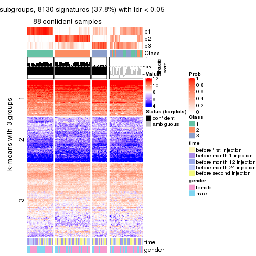</p>

</div>
<div id='tab-SD-NMF-get-signatures-no-scale-3'>
<pre><code class="r">get_signatures(res, k = 4, scale_rows = FALSE)
</code></pre>

<p></p>

</div>
<div id='tab-SD-NMF-get-signatures-no-scale-4'>
<pre><code class="r">get_signatures(res, k = 5, scale_rows = FALSE)
</code></pre>

<p></p>

</div>
<div id='tab-SD-NMF-get-signatures-no-scale-5'>
<pre><code class="r">get_signatures(res, k = 6, scale_rows = FALSE)
</code></pre>

<p></p>

</div>
</div>


Compare the overlap of signatures from different k:

```r
compare_signatures(res)
```


`get_signature()` returns a data frame invisibly. TO get the list of signatures, the function
call should be assigned to a variable explicitly. In following code, if `plot` argument is set
to `FALSE`, no heatmap is plotted while only the differential analysis is performed.

```r
# code only for demonstration
tb = get_signature(res, k = ..., plot = FALSE)
```

An example of the output of `tb` is:

```
#>   which_row         fdr    mean_1    mean_2 scaled_mean_1 scaled_mean_2 km
#> 1        38 0.042760348  8.373488  9.131774    -0.5533452     0.5164555  1
#> 2        40 0.018707592  7.106213  8.469186    -0.6173731     0.5762149  1
#> 3        55 0.019134737 10.221463 11.207825    -0.6159697     0.5749050  1
#> 4        59 0.006059896  5.921854  7.869574    -0.6899429     0.6439467  1
#> 5        60 0.018055526  8.928898 10.211722    -0.6204761     0.5791110  1
#> 6        98 0.009384629 15.714769 14.887706     0.6635654    -0.6193277  2
...
```

The columns in `tb` are:

1. `which_row`: row indices corresponding to the input matrix.
2. `fdr`: FDR for the differential test. 
3. `mean_x`: The mean value in group x.
4. `scaled_mean_x`: The mean value in group x after rows are scaled.
5. `km`: Row groups if k-means clustering is applied to rows.


UMAP plot which shows how samples are separated.


<script>
$( function() {
	$( '#tabs-SD-NMF-dimension-reduction' ).tabs();
} );
</script>
<div id='tabs-SD-NMF-dimension-reduction'>
<ul>
<li><a href='#tab-SD-NMF-dimension-reduction-1'>k = 2</a></li>
<li><a href='#tab-SD-NMF-dimension-reduction-2'>k = 3</a></li>
<li><a href='#tab-SD-NMF-dimension-reduction-3'>k = 4</a></li>
<li><a href='#tab-SD-NMF-dimension-reduction-4'>k = 5</a></li>
<li><a href='#tab-SD-NMF-dimension-reduction-5'>k = 6</a></li>
</ul>
<div id='tab-SD-NMF-dimension-reduction-1'>
<pre><code class="r">dimension_reduction(res, k = 2, method = &quot;UMAP&quot;)
</code></pre>

<p></p>

</div>
<div id='tab-SD-NMF-dimension-reduction-2'>
<pre><code class="r">dimension_reduction(res, k = 3, method = &quot;UMAP&quot;)
</code></pre>

<p></p>

</div>
<div id='tab-SD-NMF-dimension-reduction-3'>
<pre><code class="r">dimension_reduction(res, k = 4, method = &quot;UMAP&quot;)
</code></pre>

<p></p>

</div>
<div id='tab-SD-NMF-dimension-reduction-4'>
<pre><code class="r">dimension_reduction(res, k = 5, method = &quot;UMAP&quot;)
</code></pre>

<p></p>

</div>
<div id='tab-SD-NMF-dimension-reduction-5'>
<pre><code class="r">dimension_reduction(res, k = 6, method = &quot;UMAP&quot;)
</code></pre>

<p></p>

</div>
</div>


Following heatmap shows how subgroups are split when increasing `k`:

```r
collect_classes(res)
```


Test correlation between subgroups and known annotations. If the known
annotation is numeric, one-way ANOVA test is applied, and if the known
annotation is discrete, chi-squared contingency table test is applied.

```r
test_to_known_factors(res)
```

```
#>          n time(p) gender(p) k
#> SD:NMF 122   0.187  0.982701 2
#> SD:NMF  88   0.297  0.135001 3
#> SD:NMF  72   0.491  0.594910 4
#> SD:NMF  38   0.671  0.006390 5
#> SD:NMF  50   0.768  0.000246 6
```


If matrix rows can be associated to genes, consider to use `functional_enrichment(res,
...)` to perform function enrichment for the signature genes. See [this vignette](http://bioconductor.org/packages/devel/bioc/vignettes/cola/inst/doc/functional_enrichment.html) for more detailed explanations.


 

---------------------------------------------------


### CV:hclust


The object with results only for a single top-value method and a single partition method 
can be extracted as:

```r
res = res_list["CV", "hclust"]
# you can also extract it by
# res = res_list["CV:hclust"]
```

A summary of `res` and all the functions that can be applied to it:

```r
res
```

```
#> A 'ConsensusPartition' object with k = 2, 3, 4, 5, 6.
#>   On a matrix with 21512 rows and 125 columns.
#>   Top rows (1000, 2000, 3000, 4000, 5000) are extracted by 'CV' method.
#>   Subgroups are detected by 'hclust' method.
#>   Performed in total 1250 partitions by row resampling.
#>   Best k for subgroups seems to be 4.
#> 
#> Following methods can be applied to this 'ConsensusPartition' object:
#>  [1] "cola_report"             "collect_classes"         "collect_plots"          
#>  [4] "collect_stats"           "colnames"                "compare_signatures"     
#>  [7] "consensus_heatmap"       "dimension_reduction"     "functional_enrichment"  
#> [10] "get_anno_col"            "get_anno"                "get_classes"            
#> [13] "get_consensus"           "get_matrix"              "get_membership"         
#> [16] "get_param"               "get_signatures"          "get_stats"              
#> [19] "is_best_k"               "is_stable_k"             "membership_heatmap"     
#> [22] "ncol"                    "nrow"                    "plot_ecdf"              
#> [25] "rownames"                "select_partition_number" "show"                   
#> [28] "suggest_best_k"          "test_to_known_factors"
```

`collect_plots()` function collects all the plots made from `res` for all `k` (number of partitions)
into one single page to provide an easy and fast comparison between different `k`.

```r
collect_plots(res)
```

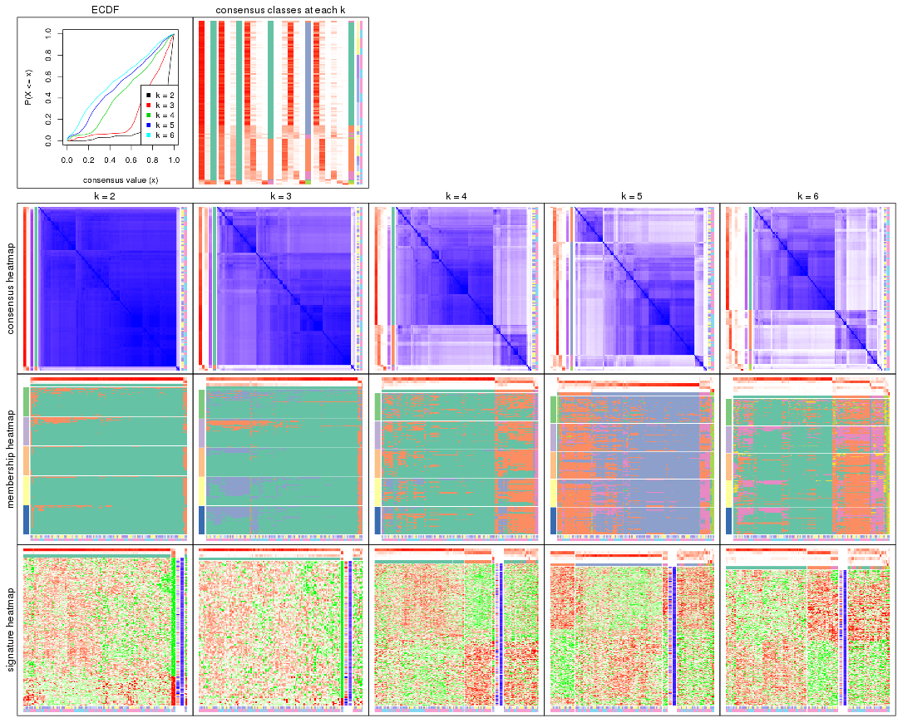

The plots are:

- The first row: a plot of the ECDF (empirical cumulative distribution
  function) curves of the consensus matrix for each `k` and the heatmap of
  predicted classes for each `k`.
- The second row: heatmaps of the consensus matrix for each `k`.
- The third row: heatmaps of the membership matrix for each `k`.
- The fouth row: heatmaps of the signatures for each `k`.

All the plots in panels can be made by individual functions and they are
plotted later in this section.

`select_partition_number()` produces several plots showing different
statistics for choosing "optimized" `k`. There are following statistics:

- ECDF curves of the consensus matrix for each `k`;
- 1-PAC. [The PAC
  score](https://en.wikipedia.org/wiki/Consensus_clustering#Over-interpretation_potential_of_consensus_clustering)
  measures the proportion of the ambiguous subgrouping.
- Mean silhouette score.
- Concordance. The mean probability of fiting the consensus class ids in all
  partitions.
- Area increased. Denote $A_k$ as the area under the ECDF curve for current
  `k`, the area increased is defined as $A_k - A_{k-1}$.
- Rand index. The percent of pairs of samples that are both in a same cluster
  or both are not in a same cluster in the partition of k and k-1.
- Jaccard index. The ratio of pairs of samples are both in a same cluster in
  the partition of k and k-1 and the pairs of samples are both in a same
  cluster in the partition k or k-1.

The detailed explanations of these statistics can be found in [the _cola_
vignette](http://bioconductor.org/packages/devel/bioc/vignettes/cola/inst/doc/cola.html#toc_13).

Generally speaking, lower PAC score, higher mean silhouette score or higher
concordance corresponds to better partition. Rand index and Jaccard index
measure how similar the current partition is compared to partition with `k-1`.
If they are too similar, we won't accept `k` is better than `k-1`.

```r
select_partition_number(res)
```


The numeric values for all these statistics can be obtained by `get_stats()`.

```r
get_stats(res)
```

```
#>   k 1-PAC mean_silhouette concordance area_increased  Rand Jaccard
#> 2 2 0.908           0.917       0.946         0.0977 0.953   0.953
#> 3 3 0.297           0.739       0.839         1.6340 0.984   0.984
#> 4 4 0.185           0.601       0.771         0.7043 0.640   0.616
#> 5 5 0.149           0.566       0.752         0.1915 0.930   0.880
#> 6 6 0.175           0.545       0.736         0.1012 0.904   0.821
```

`suggest_best_k()` suggests the best $k$ based on these statistics. The rules are as follows:

- All $k$ with Jaccard index larger than 0.95 are removed because increasing
  $k$ does not provide enough extra information. If all $k$ are removed, it is
  marked as no subgroup is detected.
- For all $k$ with 1-PAC score larger than 0.9, the maximal $k$ is taken as
  the best $k$, and other $k$ are marked as optional $k$.
- If it does not fit the second rule. The $k$ with the maximal vote of the
  highest 1-PAC score, highest mean silhouette, and highest concordance is
  taken as the best $k$.

```r
suggest_best_k(res)
```

```
#> [1] 4
```


Following shows the table of the partitions (You need to click the **show/hide
code output** link to see it). The membership matrix (columns with name `p*`)
is inferred by
[`clue::cl_consensus()`](https://www.rdocumentation.org/link/cl_consensus?package=clue)
function with the `SE` method. Basically the value in the membership matrix
represents the probability to belong to a certain group. The finall class
label for an item is determined with the group with highest probability it
belongs to.

In `get_classes()` function, the entropy is calculated from the membership
matrix and the silhouette score is calculated from the consensus matrix.


<script>
$( function() {
	$( '#tabs-CV-hclust-get-classes' ).tabs();
} );
</script>
<div id='tabs-CV-hclust-get-classes'>
<ul>
<li><a href='#tab-CV-hclust-get-classes-1'>k = 2</a></li>
<li><a href='#tab-CV-hclust-get-classes-2'>k = 3</a></li>
<li><a href='#tab-CV-hclust-get-classes-3'>k = 4</a></li>
<li><a href='#tab-CV-hclust-get-classes-4'>k = 5</a></li>
<li><a href='#tab-CV-hclust-get-classes-5'>k = 6</a></li>
</ul>

<div id='tab-CV-hclust-get-classes-1'>
<p><a id='tab-CV-hclust-get-classes-1-a' style='color:#0366d6' href='#'>show/hide code output</a></p>
<pre><code class="r">cbind(get_classes(res, k = 2), get_membership(res, k = 2))
</code></pre>

<pre><code>#&gt;           class entropy silhouette    p1    p2
#&gt; GSM601872     1  0.4562      0.906 0.904 0.096
#&gt; GSM601882     1  0.3733      0.923 0.928 0.072
#&gt; GSM601887     1  0.1633      0.948 0.976 0.024
#&gt; GSM601892     1  0.1633      0.948 0.976 0.024
#&gt; GSM601897     1  0.3584      0.933 0.932 0.068
#&gt; GSM601902     1  0.2778      0.939 0.952 0.048
#&gt; GSM601912     1  0.1633      0.948 0.976 0.024
#&gt; GSM601927     1  0.0376      0.947 0.996 0.004
#&gt; GSM601932     1  0.2236      0.943 0.964 0.036
#&gt; GSM601937     1  0.6973      0.754 0.812 0.188
#&gt; GSM601942     2  0.9909      0.623 0.444 0.556
#&gt; GSM601947     1  0.2948      0.939 0.948 0.052
#&gt; GSM601957     1  0.0938      0.945 0.988 0.012
#&gt; GSM601972     1  0.2423      0.943 0.960 0.040
#&gt; GSM601977     1  0.4298      0.917 0.912 0.088
#&gt; GSM601987     1  0.3879      0.922 0.924 0.076
#&gt; GSM601877     1  0.0672      0.946 0.992 0.008
#&gt; GSM601907     1  0.4431      0.909 0.908 0.092
#&gt; GSM601917     1  0.1633      0.945 0.976 0.024
#&gt; GSM601922     1  0.2043      0.946 0.968 0.032
#&gt; GSM601952     1  0.3431      0.933 0.936 0.064
#&gt; GSM601962     1  0.1184      0.944 0.984 0.016
#&gt; GSM601967     1  0.1414      0.946 0.980 0.020
#&gt; GSM601982     1  0.2948      0.943 0.948 0.052
#&gt; GSM601992     1  0.3879      0.923 0.924 0.076
#&gt; GSM601873     1  0.6712      0.788 0.824 0.176
#&gt; GSM601883     1  0.3733      0.923 0.928 0.072
#&gt; GSM601888     1  0.1633      0.948 0.976 0.024
#&gt; GSM601893     1  0.1843      0.948 0.972 0.028
#&gt; GSM601898     1  0.1184      0.944 0.984 0.016
#&gt; GSM601903     1  0.2603      0.940 0.956 0.044
#&gt; GSM601913     1  0.1184      0.945 0.984 0.016
#&gt; GSM601928     1  0.0672      0.946 0.992 0.008
#&gt; GSM601933     1  0.3733      0.926 0.928 0.072
#&gt; GSM601938     1  0.3733      0.923 0.928 0.072
#&gt; GSM601943     1  0.5842      0.851 0.860 0.140
#&gt; GSM601948     1  0.1184      0.948 0.984 0.016
#&gt; GSM601958     1  0.1184      0.944 0.984 0.016
#&gt; GSM601973     1  0.2948      0.938 0.948 0.052
#&gt; GSM601978     1  0.4690      0.902 0.900 0.100
#&gt; GSM601988     1  0.3879      0.922 0.924 0.076
#&gt; GSM601878     1  0.0672      0.946 0.992 0.008
#&gt; GSM601908     1  0.3879      0.921 0.924 0.076
#&gt; GSM601918     1  0.2603      0.939 0.956 0.044
#&gt; GSM601923     1  0.0672      0.946 0.992 0.008
#&gt; GSM601953     1  0.4298      0.910 0.912 0.088
#&gt; GSM601963     1  0.1184      0.944 0.984 0.016
#&gt; GSM601968     1  0.0938      0.945 0.988 0.012
#&gt; GSM601983     1  0.1843      0.948 0.972 0.028
#&gt; GSM601993     1  0.4431      0.900 0.908 0.092
#&gt; GSM601874     1  0.3584      0.926 0.932 0.068
#&gt; GSM601884     1  0.3733      0.923 0.928 0.072
#&gt; GSM601889     1  0.1633      0.944 0.976 0.024
#&gt; GSM601894     1  0.1414      0.947 0.980 0.020
#&gt; GSM601899     1  0.2236      0.947 0.964 0.036
#&gt; GSM601904     1  0.1843      0.947 0.972 0.028
#&gt; GSM601914     1  0.1184      0.944 0.984 0.016
#&gt; GSM601929     1  0.0672      0.948 0.992 0.008
#&gt; GSM601934     1  0.3879      0.927 0.924 0.076
#&gt; GSM601939     1  0.0938      0.945 0.988 0.012
#&gt; GSM601944     1  0.9608      0.072 0.616 0.384
#&gt; GSM601949     1  0.1414      0.948 0.980 0.020
#&gt; GSM601959     1  0.1414      0.948 0.980 0.020
#&gt; GSM601974     1  0.1843      0.947 0.972 0.028
#&gt; GSM601979     1  0.4562      0.906 0.904 0.096
#&gt; GSM601989     1  0.1633      0.945 0.976 0.024
#&gt; GSM601879     1  0.0672      0.946 0.992 0.008
#&gt; GSM601909     1  0.1633      0.947 0.976 0.024
#&gt; GSM601919     1  0.2603      0.939 0.956 0.044
#&gt; GSM601924     1  0.0672      0.946 0.992 0.008
#&gt; GSM601954     1  0.2423      0.944 0.960 0.040
#&gt; GSM601964     1  0.1184      0.944 0.984 0.016
#&gt; GSM601969     1  0.0938      0.947 0.988 0.012
#&gt; GSM601984     1  0.2236      0.948 0.964 0.036
#&gt; GSM601994     1  0.4022      0.916 0.920 0.080
#&gt; GSM601875     1  0.3879      0.926 0.924 0.076
#&gt; GSM601885     1  0.4022      0.923 0.920 0.080
#&gt; GSM601890     1  0.1843      0.947 0.972 0.028
#&gt; GSM601895     1  0.2603      0.931 0.956 0.044
#&gt; GSM601900     1  0.1633      0.943 0.976 0.024
#&gt; GSM601905     1  0.1843      0.945 0.972 0.028
#&gt; GSM601915     1  0.1414      0.944 0.980 0.020
#&gt; GSM601930     1  0.0938      0.947 0.988 0.012
#&gt; GSM601935     1  0.2948      0.939 0.948 0.052
#&gt; GSM601940     1  0.0938      0.945 0.988 0.012
#&gt; GSM601945     1  0.5059      0.887 0.888 0.112
#&gt; GSM601950     1  0.0938      0.947 0.988 0.012
#&gt; GSM601960     1  0.1414      0.943 0.980 0.020
#&gt; GSM601975     1  0.2423      0.942 0.960 0.040
#&gt; GSM601980     2  0.7815      0.810 0.232 0.768
#&gt; GSM601990     1  0.1184      0.944 0.984 0.016
#&gt; GSM601880     1  0.0376      0.946 0.996 0.004
#&gt; GSM601910     1  0.1633      0.945 0.976 0.024
#&gt; GSM601920     1  0.1633      0.946 0.976 0.024
#&gt; GSM601925     1  0.0672      0.946 0.992 0.008
#&gt; GSM601955     2  0.8386      0.832 0.268 0.732
#&gt; GSM601965     1  0.2043      0.948 0.968 0.032
#&gt; GSM601970     1  0.1184      0.946 0.984 0.016
#&gt; GSM601985     1  0.0938      0.945 0.988 0.012
#&gt; GSM601995     1  0.9170      0.192 0.668 0.332
#&gt; GSM601876     1  0.1414      0.945 0.980 0.020
#&gt; GSM601886     1  0.3879      0.899 0.924 0.076
#&gt; GSM601891     1  0.1633      0.948 0.976 0.024
#&gt; GSM601896     1  0.1184      0.944 0.984 0.016
#&gt; GSM601901     1  0.3274      0.931 0.940 0.060
#&gt; GSM601906     1  0.1843      0.946 0.972 0.028
#&gt; GSM601916     1  0.2778      0.940 0.952 0.048
#&gt; GSM601931     1  0.0376      0.946 0.996 0.004
#&gt; GSM601936     1  0.3274      0.930 0.940 0.060
#&gt; GSM601941     1  0.2948      0.938 0.948 0.052
#&gt; GSM601946     1  0.1184      0.944 0.984 0.016
#&gt; GSM601951     1  0.1633      0.948 0.976 0.024
#&gt; GSM601961     1  0.3733      0.934 0.928 0.072
#&gt; GSM601976     1  0.2603      0.943 0.956 0.044
#&gt; GSM601981     1  0.3733      0.924 0.928 0.072
#&gt; GSM601991     1  0.0938      0.945 0.988 0.012
#&gt; GSM601881     1  0.0672      0.946 0.992 0.008
#&gt; GSM601911     1  0.2423      0.945 0.960 0.040
#&gt; GSM601921     1  0.1633      0.946 0.976 0.024
#&gt; GSM601926     1  0.0672      0.946 0.992 0.008
#&gt; GSM601956     1  0.4562      0.905 0.904 0.096
#&gt; GSM601966     1  0.2948      0.937 0.948 0.052
#&gt; GSM601971     1  0.1414      0.945 0.980 0.020
#&gt; GSM601986     1  0.2236      0.947 0.964 0.036
#&gt; GSM601996     1  0.3584      0.928 0.932 0.068
</code></pre>

<script>
$('#tab-CV-hclust-get-classes-1-a').parent().next().next().hide();
$('#tab-CV-hclust-get-classes-1-a').click(function(){
  $('#tab-CV-hclust-get-classes-1-a').parent().next().next().toggle();
  return(false);
});
</script>
</div>

<div id='tab-CV-hclust-get-classes-2'>
<p><a id='tab-CV-hclust-get-classes-2-a' style='color:#0366d6' href='#'>show/hide code output</a></p>
<pre><code class="r">cbind(get_classes(res, k = 3), get_membership(res, k = 3))
</code></pre>

<pre><code>#&gt;           class entropy silhouette    p1    p2    p3
#&gt; GSM601872     1  0.6717      0.607 0.628 0.020 0.352
#&gt; GSM601882     1  0.6229      0.641 0.652 0.008 0.340
#&gt; GSM601887     1  0.2866      0.830 0.916 0.008 0.076
#&gt; GSM601892     1  0.2173      0.831 0.944 0.008 0.048
#&gt; GSM601897     1  0.4172      0.817 0.868 0.028 0.104
#&gt; GSM601902     1  0.5497      0.711 0.708 0.000 0.292
#&gt; GSM601912     1  0.1989      0.836 0.948 0.004 0.048
#&gt; GSM601927     1  0.0892      0.831 0.980 0.000 0.020
#&gt; GSM601932     1  0.5016      0.756 0.760 0.000 0.240
#&gt; GSM601937     1  0.8038      0.341 0.620 0.100 0.280
#&gt; GSM601942     2  0.8167     -0.151 0.212 0.640 0.148
#&gt; GSM601947     1  0.4887      0.764 0.772 0.000 0.228
#&gt; GSM601957     1  0.1453      0.829 0.968 0.008 0.024
#&gt; GSM601972     1  0.4931      0.765 0.768 0.000 0.232
#&gt; GSM601977     1  0.6543      0.620 0.640 0.016 0.344
#&gt; GSM601987     1  0.6381      0.643 0.648 0.012 0.340
#&gt; GSM601877     1  0.0829      0.829 0.984 0.004 0.012
#&gt; GSM601907     1  0.6359      0.606 0.628 0.008 0.364
#&gt; GSM601917     1  0.3116      0.822 0.892 0.000 0.108
#&gt; GSM601922     1  0.3619      0.816 0.864 0.000 0.136
#&gt; GSM601952     1  0.5506      0.760 0.764 0.016 0.220
#&gt; GSM601962     1  0.1015      0.826 0.980 0.008 0.012
#&gt; GSM601967     1  0.1620      0.829 0.964 0.012 0.024
#&gt; GSM601982     1  0.4351      0.798 0.828 0.004 0.168
#&gt; GSM601992     1  0.6229      0.639 0.652 0.008 0.340
#&gt; GSM601873     1  0.8361      0.374 0.544 0.092 0.364
#&gt; GSM601883     1  0.6229      0.641 0.652 0.008 0.340
#&gt; GSM601888     1  0.2866      0.830 0.916 0.008 0.076
#&gt; GSM601893     1  0.2939      0.833 0.916 0.012 0.072
#&gt; GSM601898     1  0.0848      0.824 0.984 0.008 0.008
#&gt; GSM601903     1  0.5591      0.699 0.696 0.000 0.304
#&gt; GSM601913     1  0.1337      0.825 0.972 0.012 0.016
#&gt; GSM601928     1  0.0747      0.830 0.984 0.000 0.016
#&gt; GSM601933     1  0.6102      0.667 0.672 0.008 0.320
#&gt; GSM601938     1  0.6229      0.641 0.652 0.008 0.340
#&gt; GSM601943     1  0.7519      0.450 0.568 0.044 0.388
#&gt; GSM601948     1  0.3272      0.823 0.892 0.004 0.104
#&gt; GSM601958     1  0.1170      0.826 0.976 0.008 0.016
#&gt; GSM601973     1  0.5650      0.692 0.688 0.000 0.312
#&gt; GSM601978     1  0.6667      0.589 0.616 0.016 0.368
#&gt; GSM601988     1  0.5559      0.757 0.780 0.028 0.192
#&gt; GSM601878     1  0.0829      0.829 0.984 0.004 0.012
#&gt; GSM601908     1  0.5988      0.620 0.632 0.000 0.368
#&gt; GSM601918     1  0.4504      0.785 0.804 0.000 0.196
#&gt; GSM601923     1  0.0829      0.829 0.984 0.004 0.012
#&gt; GSM601953     1  0.6275      0.624 0.644 0.008 0.348
#&gt; GSM601963     1  0.0848      0.824 0.984 0.008 0.008
#&gt; GSM601968     1  0.1877      0.831 0.956 0.012 0.032
#&gt; GSM601983     1  0.2096      0.834 0.944 0.004 0.052
#&gt; GSM601993     1  0.6798      0.496 0.584 0.016 0.400
#&gt; GSM601874     1  0.6104      0.634 0.648 0.004 0.348
#&gt; GSM601884     1  0.6229      0.641 0.652 0.008 0.340
#&gt; GSM601889     1  0.1337      0.825 0.972 0.016 0.012
#&gt; GSM601894     1  0.1774      0.828 0.960 0.016 0.024
#&gt; GSM601899     1  0.3043      0.829 0.908 0.008 0.084
#&gt; GSM601904     1  0.3425      0.822 0.884 0.004 0.112
#&gt; GSM601914     1  0.0848      0.824 0.984 0.008 0.008
#&gt; GSM601929     1  0.1289      0.833 0.968 0.000 0.032
#&gt; GSM601934     1  0.6200      0.672 0.676 0.012 0.312
#&gt; GSM601939     1  0.0237      0.828 0.996 0.004 0.000
#&gt; GSM601944     3  0.8162      0.000 0.164 0.192 0.644
#&gt; GSM601949     1  0.2772      0.828 0.916 0.004 0.080
#&gt; GSM601959     1  0.1129      0.830 0.976 0.004 0.020
#&gt; GSM601974     1  0.2486      0.834 0.932 0.008 0.060
#&gt; GSM601979     1  0.6416      0.590 0.616 0.008 0.376
#&gt; GSM601989     1  0.1585      0.833 0.964 0.008 0.028
#&gt; GSM601879     1  0.0829      0.829 0.984 0.004 0.012
#&gt; GSM601909     1  0.3091      0.828 0.912 0.016 0.072
#&gt; GSM601919     1  0.4504      0.785 0.804 0.000 0.196
#&gt; GSM601924     1  0.0592      0.829 0.988 0.000 0.012
#&gt; GSM601954     1  0.4399      0.795 0.812 0.000 0.188
#&gt; GSM601964     1  0.0848      0.824 0.984 0.008 0.008
#&gt; GSM601969     1  0.1399      0.831 0.968 0.004 0.028
#&gt; GSM601984     1  0.2584      0.834 0.928 0.008 0.064
#&gt; GSM601994     1  0.6632      0.532 0.596 0.012 0.392
#&gt; GSM601875     1  0.5956      0.664 0.672 0.004 0.324
#&gt; GSM601885     1  0.6252      0.635 0.648 0.008 0.344
#&gt; GSM601890     1  0.2772      0.829 0.916 0.004 0.080
#&gt; GSM601895     1  0.2443      0.816 0.940 0.032 0.028
#&gt; GSM601900     1  0.1919      0.826 0.956 0.020 0.024
#&gt; GSM601905     1  0.3619      0.814 0.864 0.000 0.136
#&gt; GSM601915     1  0.1015      0.825 0.980 0.012 0.008
#&gt; GSM601930     1  0.0983      0.832 0.980 0.004 0.016
#&gt; GSM601935     1  0.3670      0.804 0.888 0.020 0.092
#&gt; GSM601940     1  0.0475      0.830 0.992 0.004 0.004
#&gt; GSM601945     1  0.6735      0.474 0.564 0.012 0.424
#&gt; GSM601950     1  0.1711      0.831 0.960 0.008 0.032
#&gt; GSM601960     1  0.1015      0.824 0.980 0.008 0.012
#&gt; GSM601975     1  0.5016      0.757 0.760 0.000 0.240
#&gt; GSM601980     2  0.3921      0.535 0.080 0.884 0.036
#&gt; GSM601990     1  0.0848      0.824 0.984 0.008 0.008
#&gt; GSM601880     1  0.1399      0.832 0.968 0.004 0.028
#&gt; GSM601910     1  0.2492      0.829 0.936 0.016 0.048
#&gt; GSM601920     1  0.3192      0.821 0.888 0.000 0.112
#&gt; GSM601925     1  0.0829      0.829 0.984 0.004 0.012
#&gt; GSM601955     2  0.5722      0.544 0.084 0.804 0.112
#&gt; GSM601965     1  0.2584      0.834 0.928 0.008 0.064
#&gt; GSM601970     1  0.1620      0.829 0.964 0.012 0.024
#&gt; GSM601985     1  0.0475      0.827 0.992 0.004 0.004
#&gt; GSM601995     1  0.8479      0.158 0.580 0.300 0.120
#&gt; GSM601876     1  0.0829      0.832 0.984 0.004 0.012
#&gt; GSM601886     1  0.3649      0.782 0.896 0.036 0.068
#&gt; GSM601891     1  0.2860      0.829 0.912 0.004 0.084
#&gt; GSM601896     1  0.0829      0.829 0.984 0.004 0.012
#&gt; GSM601901     1  0.5706      0.674 0.680 0.000 0.320
#&gt; GSM601906     1  0.3267      0.821 0.884 0.000 0.116
#&gt; GSM601916     1  0.4978      0.772 0.780 0.004 0.216
#&gt; GSM601931     1  0.0892      0.831 0.980 0.000 0.020
#&gt; GSM601936     1  0.4799      0.780 0.836 0.032 0.132
#&gt; GSM601941     1  0.6018      0.685 0.684 0.008 0.308
#&gt; GSM601946     1  0.0661      0.829 0.988 0.004 0.008
#&gt; GSM601951     1  0.3272      0.822 0.892 0.004 0.104
#&gt; GSM601961     1  0.5517      0.723 0.728 0.004 0.268
#&gt; GSM601976     1  0.4883      0.779 0.788 0.004 0.208
#&gt; GSM601981     1  0.5650      0.691 0.688 0.000 0.312
#&gt; GSM601991     1  0.1015      0.825 0.980 0.008 0.012
#&gt; GSM601881     1  0.0829      0.829 0.984 0.004 0.012
#&gt; GSM601911     1  0.3695      0.825 0.880 0.012 0.108
#&gt; GSM601921     1  0.3267      0.820 0.884 0.000 0.116
#&gt; GSM601926     1  0.0829      0.829 0.984 0.004 0.012
#&gt; GSM601956     1  0.6490      0.606 0.628 0.012 0.360
#&gt; GSM601966     1  0.5760      0.677 0.672 0.000 0.328
#&gt; GSM601971     1  0.1337      0.824 0.972 0.012 0.016
#&gt; GSM601986     1  0.3043      0.830 0.908 0.008 0.084
#&gt; GSM601996     1  0.6008      0.657 0.664 0.004 0.332
</code></pre>

<script>
$('#tab-CV-hclust-get-classes-2-a').parent().next().next().hide();
$('#tab-CV-hclust-get-classes-2-a').click(function(){
  $('#tab-CV-hclust-get-classes-2-a').parent().next().next().toggle();
  return(false);
});
</script>
</div>

<div id='tab-CV-hclust-get-classes-3'>
<p><a id='tab-CV-hclust-get-classes-3-a' style='color:#0366d6' href='#'>show/hide code output</a></p>
<pre><code class="r">cbind(get_classes(res, k = 4), get_membership(res, k = 4))
</code></pre>

<pre><code>#&gt;           class entropy silhouette    p1    p2    p3    p4
#&gt; GSM601872     2  0.5279     0.7080 0.252 0.712 0.012 0.024
#&gt; GSM601882     2  0.5135     0.7526 0.296 0.684 0.012 0.008
#&gt; GSM601887     1  0.3402     0.7092 0.832 0.164 0.000 0.004
#&gt; GSM601892     1  0.2530     0.7628 0.896 0.100 0.000 0.004
#&gt; GSM601897     1  0.5429     0.5541 0.728 0.220 0.020 0.032
#&gt; GSM601902     1  0.7500    -0.3716 0.416 0.404 0.180 0.000
#&gt; GSM601912     1  0.2271     0.7742 0.916 0.076 0.008 0.000
#&gt; GSM601927     1  0.1978     0.7749 0.928 0.068 0.004 0.000
#&gt; GSM601932     1  0.7060    -0.2150 0.476 0.400 0.124 0.000
#&gt; GSM601937     1  0.9440    -0.1986 0.424 0.220 0.200 0.156
#&gt; GSM601942     4  0.7519     0.1868 0.088 0.192 0.092 0.628
#&gt; GSM601947     1  0.6067     0.0575 0.572 0.376 0.052 0.000
#&gt; GSM601957     1  0.1004     0.7783 0.972 0.024 0.000 0.004
#&gt; GSM601972     1  0.6737    -0.0539 0.532 0.368 0.100 0.000
#&gt; GSM601977     2  0.5243     0.7397 0.276 0.696 0.012 0.016
#&gt; GSM601987     2  0.5339     0.7518 0.312 0.664 0.008 0.016
#&gt; GSM601877     1  0.1847     0.7759 0.940 0.052 0.004 0.004
#&gt; GSM601907     2  0.4978     0.7194 0.256 0.720 0.016 0.008
#&gt; GSM601917     1  0.4839     0.6453 0.756 0.200 0.044 0.000
#&gt; GSM601922     1  0.5374     0.5558 0.704 0.244 0.052 0.000
#&gt; GSM601952     1  0.6781    -0.1577 0.524 0.404 0.048 0.024
#&gt; GSM601962     1  0.1339     0.7783 0.964 0.024 0.008 0.004
#&gt; GSM601967     1  0.1305     0.7783 0.960 0.036 0.000 0.004
#&gt; GSM601982     1  0.4836     0.3762 0.672 0.320 0.008 0.000
#&gt; GSM601992     2  0.7932     0.4839 0.336 0.412 0.248 0.004
#&gt; GSM601873     2  0.7506     0.3536 0.212 0.620 0.092 0.076
#&gt; GSM601883     2  0.5135     0.7526 0.296 0.684 0.012 0.008
#&gt; GSM601888     1  0.3402     0.7092 0.832 0.164 0.000 0.004
#&gt; GSM601893     1  0.3625     0.7141 0.828 0.160 0.000 0.012
#&gt; GSM601898     1  0.0469     0.7741 0.988 0.012 0.000 0.000
#&gt; GSM601903     1  0.7521    -0.3616 0.420 0.396 0.184 0.000
#&gt; GSM601913     1  0.1124     0.7760 0.972 0.012 0.012 0.004
#&gt; GSM601928     1  0.1824     0.7757 0.936 0.060 0.004 0.000
#&gt; GSM601933     2  0.5632     0.7051 0.352 0.620 0.020 0.008
#&gt; GSM601938     2  0.5223     0.7502 0.292 0.684 0.016 0.008
#&gt; GSM601943     2  0.7100     0.4722 0.224 0.640 0.080 0.056
#&gt; GSM601948     1  0.5060     0.6131 0.756 0.188 0.052 0.004
#&gt; GSM601958     1  0.0707     0.7763 0.980 0.020 0.000 0.000
#&gt; GSM601973     2  0.7550     0.4213 0.372 0.436 0.192 0.000
#&gt; GSM601978     2  0.5020     0.6920 0.232 0.736 0.020 0.012
#&gt; GSM601988     1  0.7180     0.3125 0.620 0.232 0.116 0.032
#&gt; GSM601878     1  0.1847     0.7759 0.940 0.052 0.004 0.004
#&gt; GSM601908     2  0.4725     0.7302 0.256 0.728 0.012 0.004
#&gt; GSM601918     1  0.5762     0.2529 0.608 0.352 0.040 0.000
#&gt; GSM601923     1  0.1762     0.7766 0.944 0.048 0.004 0.004
#&gt; GSM601953     2  0.5065     0.7254 0.268 0.708 0.016 0.008
#&gt; GSM601963     1  0.0336     0.7738 0.992 0.000 0.008 0.000
#&gt; GSM601968     1  0.1822     0.7788 0.944 0.044 0.008 0.004
#&gt; GSM601983     1  0.2266     0.7732 0.912 0.084 0.004 0.000
#&gt; GSM601993     2  0.8450     0.3736 0.304 0.364 0.312 0.020
#&gt; GSM601874     2  0.4762     0.7495 0.300 0.692 0.004 0.004
#&gt; GSM601884     2  0.5110     0.7515 0.292 0.688 0.012 0.008
#&gt; GSM601889     1  0.1191     0.7764 0.968 0.024 0.004 0.004
#&gt; GSM601894     1  0.1356     0.7795 0.960 0.032 0.000 0.008
#&gt; GSM601899     1  0.3636     0.6968 0.820 0.172 0.000 0.008
#&gt; GSM601904     1  0.4897     0.6454 0.760 0.196 0.040 0.004
#&gt; GSM601914     1  0.0804     0.7738 0.980 0.012 0.008 0.000
#&gt; GSM601929     1  0.2342     0.7745 0.912 0.080 0.008 0.000
#&gt; GSM601934     2  0.5893     0.6893 0.364 0.600 0.024 0.012
#&gt; GSM601939     1  0.1305     0.7777 0.960 0.036 0.000 0.004
#&gt; GSM601944     3  0.6108     0.0000 0.012 0.316 0.628 0.044
#&gt; GSM601949     1  0.4470     0.6686 0.792 0.172 0.032 0.004
#&gt; GSM601959     1  0.1022     0.7800 0.968 0.032 0.000 0.000
#&gt; GSM601974     1  0.4233     0.7190 0.820 0.140 0.032 0.008
#&gt; GSM601979     2  0.4788     0.6934 0.232 0.744 0.016 0.008
#&gt; GSM601989     1  0.1890     0.7823 0.936 0.056 0.008 0.000
#&gt; GSM601879     1  0.1762     0.7766 0.944 0.048 0.004 0.004
#&gt; GSM601909     1  0.3105     0.7405 0.868 0.120 0.000 0.012
#&gt; GSM601919     1  0.5762     0.2529 0.608 0.352 0.040 0.000
#&gt; GSM601924     1  0.1576     0.7762 0.948 0.048 0.004 0.000
#&gt; GSM601954     1  0.5947     0.1249 0.572 0.384 0.044 0.000
#&gt; GSM601964     1  0.0927     0.7737 0.976 0.016 0.008 0.000
#&gt; GSM601969     1  0.1722     0.7753 0.944 0.048 0.008 0.000
#&gt; GSM601984     1  0.3172     0.7462 0.872 0.112 0.012 0.004
#&gt; GSM601994     2  0.8088     0.3836 0.276 0.412 0.304 0.008
#&gt; GSM601875     2  0.4720     0.7403 0.324 0.672 0.004 0.000
#&gt; GSM601885     2  0.5060     0.7537 0.284 0.696 0.012 0.008
#&gt; GSM601890     1  0.3219     0.7042 0.836 0.164 0.000 0.000
#&gt; GSM601895     1  0.2376     0.7654 0.928 0.040 0.012 0.020
#&gt; GSM601900     1  0.2262     0.7721 0.932 0.040 0.016 0.012
#&gt; GSM601905     1  0.5052     0.5883 0.720 0.244 0.036 0.000
#&gt; GSM601915     1  0.0657     0.7747 0.984 0.004 0.012 0.000
#&gt; GSM601930     1  0.2048     0.7763 0.928 0.064 0.008 0.000
#&gt; GSM601935     1  0.4843     0.6645 0.808 0.096 0.076 0.020
#&gt; GSM601940     1  0.1398     0.7790 0.956 0.040 0.000 0.004
#&gt; GSM601945     2  0.5474     0.4091 0.160 0.756 0.064 0.020
#&gt; GSM601950     1  0.2520     0.7699 0.904 0.088 0.004 0.004
#&gt; GSM601960     1  0.0804     0.7736 0.980 0.008 0.012 0.000
#&gt; GSM601975     1  0.6911    -0.0844 0.504 0.384 0.112 0.000
#&gt; GSM601980     4  0.4466     0.5640 0.040 0.004 0.156 0.800
#&gt; GSM601990     1  0.0524     0.7735 0.988 0.004 0.008 0.000
#&gt; GSM601880     1  0.2238     0.7762 0.920 0.072 0.004 0.004
#&gt; GSM601910     1  0.2530     0.7676 0.912 0.072 0.008 0.008
#&gt; GSM601920     1  0.4842     0.6472 0.760 0.192 0.048 0.000
#&gt; GSM601925     1  0.1847     0.7759 0.940 0.052 0.004 0.004
#&gt; GSM601955     4  0.4146     0.5500 0.024 0.084 0.044 0.848
#&gt; GSM601965     1  0.3113     0.7479 0.876 0.108 0.012 0.004
#&gt; GSM601970     1  0.1191     0.7783 0.968 0.024 0.004 0.004
#&gt; GSM601985     1  0.0895     0.7775 0.976 0.020 0.000 0.004
#&gt; GSM601995     1  0.9031    -0.1249 0.456 0.136 0.132 0.276
#&gt; GSM601876     1  0.1722     0.7828 0.944 0.048 0.008 0.000
#&gt; GSM601886     1  0.4371     0.6617 0.836 0.064 0.080 0.020
#&gt; GSM601891     1  0.3266     0.7008 0.832 0.168 0.000 0.000
#&gt; GSM601896     1  0.1489     0.7830 0.952 0.044 0.004 0.000
#&gt; GSM601901     2  0.5237     0.7071 0.356 0.628 0.016 0.000
#&gt; GSM601906     1  0.4755     0.6494 0.760 0.200 0.040 0.000
#&gt; GSM601916     1  0.6423     0.1049 0.580 0.336 0.084 0.000
#&gt; GSM601931     1  0.1902     0.7753 0.932 0.064 0.004 0.000
#&gt; GSM601936     1  0.6229     0.4750 0.704 0.172 0.104 0.020
#&gt; GSM601941     2  0.7906     0.4181 0.376 0.412 0.204 0.008
#&gt; GSM601946     1  0.1302     0.7797 0.956 0.044 0.000 0.000
#&gt; GSM601951     1  0.4996     0.5900 0.752 0.192 0.056 0.000
#&gt; GSM601961     2  0.5673     0.5023 0.448 0.528 0.024 0.000
#&gt; GSM601976     1  0.6532     0.1367 0.572 0.336 0.092 0.000
#&gt; GSM601981     2  0.5400     0.6694 0.372 0.608 0.020 0.000
#&gt; GSM601991     1  0.0804     0.7755 0.980 0.012 0.008 0.000
#&gt; GSM601881     1  0.1847     0.7759 0.940 0.052 0.004 0.004
#&gt; GSM601911     1  0.4333     0.6573 0.776 0.208 0.008 0.008
#&gt; GSM601921     1  0.4800     0.6446 0.760 0.196 0.044 0.000
#&gt; GSM601926     1  0.1847     0.7759 0.940 0.052 0.004 0.004
#&gt; GSM601956     2  0.5155     0.7094 0.248 0.720 0.016 0.016
#&gt; GSM601966     2  0.7031     0.6116 0.348 0.520 0.132 0.000
#&gt; GSM601971     1  0.1296     0.7786 0.964 0.028 0.004 0.004
#&gt; GSM601986     1  0.3774     0.7038 0.820 0.168 0.008 0.004
#&gt; GSM601996     2  0.7731     0.4909 0.332 0.428 0.240 0.000
</code></pre>

<script>
$('#tab-CV-hclust-get-classes-3-a').parent().next().next().hide();
$('#tab-CV-hclust-get-classes-3-a').click(function(){
  $('#tab-CV-hclust-get-classes-3-a').parent().next().next().toggle();
  return(false);
});
</script>
</div>

<div id='tab-CV-hclust-get-classes-4'>
<p><a id='tab-CV-hclust-get-classes-4-a' style='color:#0366d6' href='#'>show/hide code output</a></p>
<pre><code class="r">cbind(get_classes(res, k = 5), get_membership(res, k = 5))
</code></pre>

<pre><code>#&gt;           class entropy silhouette    p1    p2    p3    p4    p5
#&gt; GSM601872     2  0.4100     0.6762 0.004 0.796 0.156 0.028 0.016
#&gt; GSM601882     2  0.4133     0.6921 0.000 0.768 0.180 0.052 0.000
#&gt; GSM601887     3  0.3231     0.7012 0.000 0.196 0.800 0.004 0.000
#&gt; GSM601892     3  0.2561     0.7495 0.000 0.144 0.856 0.000 0.000
#&gt; GSM601897     3  0.5408     0.5635 0.004 0.228 0.688 0.052 0.028
#&gt; GSM601902     4  0.6657     0.4512 0.000 0.352 0.232 0.416 0.000
#&gt; GSM601912     3  0.2305     0.7727 0.000 0.092 0.896 0.012 0.000
#&gt; GSM601927     3  0.2770     0.7612 0.000 0.076 0.880 0.044 0.000
#&gt; GSM601932     2  0.6805    -0.2970 0.000 0.372 0.320 0.308 0.000
#&gt; GSM601937     4  0.9008    -0.0856 0.204 0.144 0.220 0.384 0.048
#&gt; GSM601942     5  0.5185     0.1394 0.016 0.212 0.028 0.028 0.716
#&gt; GSM601947     3  0.6003    -0.1152 0.000 0.440 0.448 0.112 0.000
#&gt; GSM601957     3  0.0963     0.7706 0.000 0.036 0.964 0.000 0.000
#&gt; GSM601972     3  0.6588    -0.2474 0.000 0.392 0.400 0.208 0.000
#&gt; GSM601977     2  0.4260     0.6854 0.000 0.776 0.164 0.052 0.008
#&gt; GSM601987     2  0.4522     0.6714 0.000 0.736 0.196 0.068 0.000
#&gt; GSM601877     3  0.2376     0.7636 0.000 0.052 0.904 0.044 0.000
#&gt; GSM601907     2  0.4297     0.6847 0.004 0.784 0.152 0.052 0.008
#&gt; GSM601917     3  0.5478     0.5457 0.000 0.180 0.656 0.164 0.000
#&gt; GSM601922     3  0.5980     0.4550 0.004 0.220 0.604 0.172 0.000
#&gt; GSM601952     3  0.6750    -0.1790 0.032 0.408 0.444 0.116 0.000
#&gt; GSM601962     3  0.1106     0.7707 0.000 0.024 0.964 0.012 0.000
#&gt; GSM601967     3  0.1168     0.7705 0.000 0.032 0.960 0.008 0.000
#&gt; GSM601982     3  0.4987     0.3998 0.000 0.340 0.616 0.044 0.000
#&gt; GSM601992     4  0.6954     0.5487 0.024 0.312 0.164 0.496 0.004
#&gt; GSM601873     2  0.7111     0.1843 0.048 0.636 0.104 0.112 0.100
#&gt; GSM601883     2  0.4096     0.6923 0.000 0.772 0.176 0.052 0.000
#&gt; GSM601888     3  0.3231     0.7012 0.000 0.196 0.800 0.004 0.000
#&gt; GSM601893     3  0.3422     0.7015 0.000 0.200 0.792 0.004 0.004
#&gt; GSM601898     3  0.0794     0.7670 0.000 0.028 0.972 0.000 0.000
#&gt; GSM601903     4  0.6667     0.4591 0.000 0.364 0.232 0.404 0.000
#&gt; GSM601913     3  0.1018     0.7673 0.000 0.016 0.968 0.016 0.000
#&gt; GSM601928     3  0.2645     0.7617 0.000 0.068 0.888 0.044 0.000
#&gt; GSM601933     2  0.5066     0.5797 0.000 0.676 0.240 0.084 0.000
#&gt; GSM601938     2  0.4372     0.6837 0.000 0.756 0.172 0.072 0.000
#&gt; GSM601943     2  0.6570     0.3366 0.060 0.668 0.120 0.120 0.032
#&gt; GSM601948     3  0.5010     0.5799 0.000 0.224 0.688 0.088 0.000
#&gt; GSM601958     3  0.0880     0.7694 0.000 0.032 0.968 0.000 0.000
#&gt; GSM601973     4  0.6486     0.5092 0.000 0.376 0.188 0.436 0.000
#&gt; GSM601978     2  0.3729     0.6651 0.000 0.824 0.124 0.040 0.012
#&gt; GSM601988     3  0.7524     0.0657 0.032 0.228 0.504 0.212 0.024
#&gt; GSM601878     3  0.2376     0.7636 0.000 0.052 0.904 0.044 0.000
#&gt; GSM601908     2  0.4065     0.6732 0.004 0.796 0.148 0.048 0.004
#&gt; GSM601918     3  0.6164     0.0752 0.000 0.388 0.476 0.136 0.000
#&gt; GSM601923     3  0.2300     0.7646 0.000 0.052 0.908 0.040 0.000
#&gt; GSM601953     2  0.4160     0.6952 0.000 0.780 0.168 0.044 0.008
#&gt; GSM601963     3  0.0579     0.7656 0.000 0.008 0.984 0.008 0.000
#&gt; GSM601968     3  0.1800     0.7700 0.000 0.048 0.932 0.020 0.000
#&gt; GSM601983     3  0.2408     0.7717 0.000 0.092 0.892 0.016 0.000
#&gt; GSM601993     4  0.6460     0.4872 0.040 0.256 0.116 0.588 0.000
#&gt; GSM601874     2  0.3160     0.6995 0.000 0.808 0.188 0.004 0.000
#&gt; GSM601884     2  0.4096     0.6946 0.000 0.772 0.176 0.052 0.000
#&gt; GSM601889     3  0.1211     0.7722 0.000 0.024 0.960 0.016 0.000
#&gt; GSM601894     3  0.1121     0.7713 0.000 0.044 0.956 0.000 0.000
#&gt; GSM601899     3  0.3489     0.6953 0.000 0.208 0.784 0.004 0.004
#&gt; GSM601904     3  0.5602     0.5325 0.000 0.196 0.640 0.164 0.000
#&gt; GSM601914     3  0.0912     0.7654 0.000 0.016 0.972 0.012 0.000
#&gt; GSM601929     3  0.3159     0.7589 0.000 0.088 0.856 0.056 0.000
#&gt; GSM601934     2  0.5158     0.5638 0.000 0.656 0.264 0.080 0.000
#&gt; GSM601939     3  0.1741     0.7714 0.000 0.040 0.936 0.024 0.000
#&gt; GSM601944     1  0.5926     0.0000 0.608 0.268 0.000 0.012 0.112
#&gt; GSM601949     3  0.4302     0.6596 0.000 0.208 0.744 0.048 0.000
#&gt; GSM601959     3  0.1357     0.7735 0.000 0.048 0.948 0.004 0.000
#&gt; GSM601974     3  0.4592     0.6931 0.000 0.140 0.756 0.100 0.004
#&gt; GSM601979     2  0.3619     0.6663 0.000 0.828 0.124 0.040 0.008
#&gt; GSM601989     3  0.2172     0.7765 0.000 0.076 0.908 0.016 0.000
#&gt; GSM601879     3  0.2221     0.7657 0.000 0.052 0.912 0.036 0.000
#&gt; GSM601909     3  0.2929     0.7381 0.004 0.124 0.860 0.008 0.004
#&gt; GSM601919     3  0.6164     0.0752 0.000 0.388 0.476 0.136 0.000
#&gt; GSM601924     3  0.2370     0.7643 0.000 0.056 0.904 0.040 0.000
#&gt; GSM601954     3  0.6314     0.0454 0.008 0.384 0.484 0.124 0.000
#&gt; GSM601964     3  0.1018     0.7648 0.000 0.016 0.968 0.016 0.000
#&gt; GSM601969     3  0.2157     0.7707 0.004 0.040 0.920 0.036 0.000
#&gt; GSM601984     3  0.3365     0.7376 0.000 0.120 0.836 0.044 0.000
#&gt; GSM601994     4  0.6092     0.4677 0.036 0.288 0.076 0.600 0.000
#&gt; GSM601875     2  0.3901     0.6746 0.000 0.776 0.196 0.024 0.004
#&gt; GSM601885     2  0.4184     0.6928 0.000 0.772 0.176 0.048 0.004
#&gt; GSM601890     3  0.3282     0.7053 0.000 0.188 0.804 0.008 0.000
#&gt; GSM601895     3  0.2502     0.7607 0.004 0.040 0.912 0.024 0.020
#&gt; GSM601900     3  0.2264     0.7627 0.004 0.044 0.920 0.024 0.008
#&gt; GSM601905     3  0.5904     0.4563 0.000 0.232 0.596 0.172 0.000
#&gt; GSM601915     3  0.0807     0.7664 0.000 0.012 0.976 0.012 0.000
#&gt; GSM601930     3  0.2782     0.7621 0.000 0.072 0.880 0.048 0.000
#&gt; GSM601935     3  0.5428     0.5800 0.032 0.072 0.728 0.156 0.012
#&gt; GSM601940     3  0.1818     0.7726 0.000 0.044 0.932 0.024 0.000
#&gt; GSM601945     2  0.5054     0.3638 0.048 0.772 0.056 0.108 0.016
#&gt; GSM601950     3  0.2563     0.7600 0.000 0.120 0.872 0.008 0.000
#&gt; GSM601960     3  0.0798     0.7658 0.000 0.008 0.976 0.016 0.000
#&gt; GSM601975     3  0.6819    -0.4253 0.000 0.340 0.348 0.312 0.000
#&gt; GSM601980     5  0.2122     0.4761 0.040 0.008 0.016 0.008 0.928
#&gt; GSM601990     3  0.0693     0.7654 0.000 0.012 0.980 0.008 0.000
#&gt; GSM601880     3  0.2914     0.7604 0.000 0.076 0.872 0.052 0.000
#&gt; GSM601910     3  0.2354     0.7602 0.000 0.076 0.904 0.012 0.008
#&gt; GSM601920     3  0.5519     0.5534 0.004 0.184 0.664 0.148 0.000
#&gt; GSM601925     3  0.2514     0.7622 0.000 0.060 0.896 0.044 0.000
#&gt; GSM601955     5  0.7064     0.4207 0.272 0.056 0.000 0.148 0.524
#&gt; GSM601965     3  0.3090     0.7480 0.000 0.104 0.856 0.040 0.000
#&gt; GSM601970     3  0.1153     0.7693 0.004 0.024 0.964 0.008 0.000
#&gt; GSM601985     3  0.1211     0.7710 0.000 0.024 0.960 0.016 0.000
#&gt; GSM601995     3  0.9011    -0.4050 0.068 0.080 0.336 0.252 0.264
#&gt; GSM601876     3  0.2193     0.7772 0.000 0.060 0.912 0.028 0.000
#&gt; GSM601886     3  0.4760     0.5442 0.024 0.024 0.748 0.192 0.012
#&gt; GSM601891     3  0.3318     0.7031 0.000 0.192 0.800 0.008 0.000
#&gt; GSM601896     3  0.1670     0.7768 0.000 0.052 0.936 0.012 0.000
#&gt; GSM601901     2  0.4370     0.6219 0.000 0.724 0.236 0.040 0.000
#&gt; GSM601906     3  0.5466     0.5613 0.000 0.192 0.656 0.152 0.000
#&gt; GSM601916     3  0.6356    -0.0233 0.000 0.364 0.468 0.168 0.000
#&gt; GSM601931     3  0.2708     0.7613 0.000 0.072 0.884 0.044 0.000
#&gt; GSM601936     3  0.6889     0.1965 0.032 0.140 0.564 0.252 0.012
#&gt; GSM601941     4  0.6465     0.5221 0.000 0.376 0.184 0.440 0.000
#&gt; GSM601946     3  0.1981     0.7713 0.000 0.048 0.924 0.028 0.000
#&gt; GSM601951     3  0.5192     0.5416 0.000 0.244 0.664 0.092 0.000
#&gt; GSM601961     2  0.5085     0.3706 0.000 0.612 0.344 0.040 0.004
#&gt; GSM601976     3  0.6685    -0.1222 0.000 0.356 0.436 0.204 0.004
#&gt; GSM601981     2  0.5191     0.5255 0.000 0.660 0.252 0.088 0.000
#&gt; GSM601991     3  0.0898     0.7672 0.000 0.020 0.972 0.008 0.000
#&gt; GSM601881     3  0.2450     0.7637 0.000 0.052 0.900 0.048 0.000
#&gt; GSM601911     3  0.4584     0.6344 0.000 0.228 0.716 0.056 0.000
#&gt; GSM601921     3  0.5654     0.5260 0.004 0.192 0.648 0.156 0.000
#&gt; GSM601926     3  0.2376     0.7636 0.000 0.052 0.904 0.044 0.000
#&gt; GSM601956     2  0.4267     0.6856 0.004 0.788 0.152 0.044 0.012
#&gt; GSM601966     2  0.6319    -0.1076 0.004 0.540 0.176 0.280 0.000
#&gt; GSM601971     3  0.1372     0.7725 0.004 0.016 0.956 0.024 0.000
#&gt; GSM601986     3  0.4096     0.6905 0.000 0.176 0.772 0.052 0.000
#&gt; GSM601996     4  0.6739     0.5407 0.020 0.372 0.128 0.476 0.004
</code></pre>

<script>
$('#tab-CV-hclust-get-classes-4-a').parent().next().next().hide();
$('#tab-CV-hclust-get-classes-4-a').click(function(){
  $('#tab-CV-hclust-get-classes-4-a').parent().next().next().toggle();
  return(false);
});
</script>
</div>

<div id='tab-CV-hclust-get-classes-5'>
<p><a id='tab-CV-hclust-get-classes-5-a' style='color:#0366d6' href='#'>show/hide code output</a></p>
<pre><code class="r">cbind(get_classes(res, k = 6), get_membership(res, k = 6))
</code></pre>

<pre><code>#&gt;           class entropy silhouette    p1    p2    p3    p4    p5    p6
#&gt; GSM601872     2  0.3536    0.58780 0.092 0.832 0.004 0.040 0.032 0.000
#&gt; GSM601882     2  0.3215    0.59289 0.100 0.828 0.000 0.072 0.000 0.000
#&gt; GSM601887     1  0.3183    0.71073 0.788 0.200 0.000 0.000 0.008 0.004
#&gt; GSM601892     1  0.2573    0.76483 0.856 0.132 0.000 0.004 0.008 0.000
#&gt; GSM601897     1  0.5434    0.53009 0.648 0.248 0.004 0.056 0.032 0.012
#&gt; GSM601902     4  0.5415    0.59145 0.128 0.304 0.000 0.564 0.004 0.000
#&gt; GSM601912     1  0.2648    0.78949 0.876 0.092 0.004 0.020 0.008 0.000
#&gt; GSM601927     1  0.3013    0.76623 0.844 0.068 0.000 0.088 0.000 0.000
#&gt; GSM601932     4  0.6220    0.38661 0.216 0.344 0.000 0.428 0.012 0.000
#&gt; GSM601937     5  0.9512    0.00666 0.112 0.108 0.104 0.260 0.272 0.144
#&gt; GSM601942     5  0.7770   -0.22185 0.016 0.188 0.104 0.024 0.456 0.212
#&gt; GSM601947     2  0.5992    0.05260 0.360 0.436 0.000 0.200 0.004 0.000
#&gt; GSM601957     1  0.0865    0.78888 0.964 0.036 0.000 0.000 0.000 0.000
#&gt; GSM601972     2  0.6389   -0.18036 0.308 0.380 0.000 0.300 0.012 0.000
#&gt; GSM601977     2  0.3867    0.58290 0.096 0.808 0.000 0.072 0.012 0.012
#&gt; GSM601987     2  0.3880    0.58602 0.120 0.780 0.000 0.096 0.004 0.000
#&gt; GSM601877     1  0.2660    0.77021 0.868 0.048 0.000 0.084 0.000 0.000
#&gt; GSM601907     2  0.3716    0.58837 0.080 0.820 0.004 0.072 0.024 0.000
#&gt; GSM601917     1  0.5977    0.43575 0.564 0.180 0.004 0.232 0.020 0.000
#&gt; GSM601922     1  0.6032    0.33114 0.524 0.232 0.000 0.228 0.016 0.000
#&gt; GSM601952     2  0.7152    0.07527 0.360 0.420 0.004 0.136 0.032 0.048
#&gt; GSM601962     1  0.1495    0.78867 0.948 0.020 0.000 0.020 0.008 0.004
#&gt; GSM601967     1  0.1296    0.78918 0.952 0.032 0.000 0.012 0.000 0.004
#&gt; GSM601982     1  0.5065    0.35559 0.576 0.356 0.000 0.056 0.008 0.004
#&gt; GSM601992     4  0.6551    0.53989 0.092 0.260 0.016 0.556 0.072 0.004
#&gt; GSM601873     2  0.7078    0.10804 0.056 0.596 0.044 0.100 0.160 0.044
#&gt; GSM601883     2  0.3112    0.59191 0.096 0.836 0.000 0.068 0.000 0.000
#&gt; GSM601888     1  0.3183    0.71073 0.788 0.200 0.000 0.000 0.008 0.004
#&gt; GSM601893     1  0.3481    0.70463 0.772 0.208 0.000 0.004 0.012 0.004
#&gt; GSM601898     1  0.0692    0.78490 0.976 0.020 0.000 0.004 0.000 0.000
#&gt; GSM601903     4  0.5694    0.59503 0.132 0.296 0.000 0.556 0.016 0.000
#&gt; GSM601913     1  0.1232    0.78751 0.956 0.024 0.004 0.016 0.000 0.000
#&gt; GSM601928     1  0.2905    0.76735 0.852 0.064 0.000 0.084 0.000 0.000
#&gt; GSM601933     2  0.4700    0.50891 0.160 0.704 0.000 0.128 0.008 0.000
#&gt; GSM601938     2  0.3472    0.57868 0.092 0.808 0.000 0.100 0.000 0.000
#&gt; GSM601943     2  0.6631    0.23368 0.060 0.640 0.052 0.112 0.112 0.024
#&gt; GSM601948     1  0.5194    0.52566 0.624 0.232 0.000 0.140 0.004 0.000
#&gt; GSM601958     1  0.0891    0.78716 0.968 0.024 0.000 0.008 0.000 0.000
#&gt; GSM601973     4  0.5128    0.60575 0.076 0.312 0.000 0.600 0.012 0.000
#&gt; GSM601978     2  0.2995    0.57254 0.064 0.868 0.004 0.044 0.020 0.000
#&gt; GSM601988     1  0.7766   -0.08352 0.432 0.204 0.012 0.216 0.120 0.016
#&gt; GSM601878     1  0.2660    0.77021 0.868 0.048 0.000 0.084 0.000 0.000
#&gt; GSM601908     2  0.3636    0.57429 0.076 0.824 0.004 0.076 0.020 0.000
#&gt; GSM601918     2  0.6176   -0.00264 0.380 0.392 0.000 0.220 0.008 0.000
#&gt; GSM601923     1  0.2608    0.77194 0.872 0.048 0.000 0.080 0.000 0.000
#&gt; GSM601953     2  0.3546    0.60059 0.096 0.828 0.004 0.052 0.020 0.000
#&gt; GSM601963     1  0.0976    0.78462 0.968 0.016 0.000 0.008 0.008 0.000
#&gt; GSM601968     1  0.2208    0.78599 0.908 0.052 0.000 0.032 0.004 0.004
#&gt; GSM601983     1  0.2830    0.78645 0.868 0.092 0.000 0.024 0.012 0.004
#&gt; GSM601993     4  0.6551    0.32798 0.060 0.176 0.036 0.612 0.108 0.008
#&gt; GSM601874     2  0.2357    0.60842 0.116 0.872 0.000 0.012 0.000 0.000
#&gt; GSM601884     2  0.3103    0.59510 0.100 0.836 0.000 0.064 0.000 0.000
#&gt; GSM601889     1  0.1377    0.79181 0.952 0.024 0.000 0.016 0.004 0.004
#&gt; GSM601894     1  0.1542    0.78935 0.936 0.052 0.000 0.004 0.008 0.000
#&gt; GSM601899     1  0.3593    0.68648 0.756 0.224 0.000 0.004 0.012 0.004
#&gt; GSM601904     1  0.5686    0.45982 0.580 0.168 0.004 0.240 0.008 0.000
#&gt; GSM601914     1  0.0964    0.78491 0.968 0.016 0.000 0.012 0.004 0.000
#&gt; GSM601929     1  0.3466    0.75983 0.816 0.084 0.000 0.096 0.000 0.004
#&gt; GSM601934     2  0.4761    0.50643 0.184 0.696 0.004 0.112 0.004 0.000
#&gt; GSM601939     1  0.1856    0.78622 0.920 0.032 0.000 0.048 0.000 0.000
#&gt; GSM601944     3  0.2884    0.00000 0.000 0.164 0.824 0.008 0.004 0.000
#&gt; GSM601949     1  0.4586    0.63104 0.692 0.216 0.000 0.088 0.004 0.000
#&gt; GSM601959     1  0.1268    0.79171 0.952 0.036 0.000 0.008 0.000 0.004
#&gt; GSM601974     1  0.4933    0.68952 0.712 0.132 0.004 0.128 0.024 0.000
#&gt; GSM601979     2  0.2849    0.57024 0.060 0.876 0.004 0.044 0.016 0.000
#&gt; GSM601989     1  0.2221    0.79195 0.896 0.072 0.000 0.032 0.000 0.000
#&gt; GSM601879     1  0.2554    0.77331 0.876 0.048 0.000 0.076 0.000 0.000
#&gt; GSM601909     1  0.2951    0.75424 0.844 0.128 0.000 0.004 0.020 0.004
#&gt; GSM601919     2  0.6176   -0.00264 0.380 0.392 0.000 0.220 0.008 0.000
#&gt; GSM601924     1  0.2672    0.77144 0.868 0.052 0.000 0.080 0.000 0.000
#&gt; GSM601954     1  0.6704   -0.19946 0.388 0.368 0.000 0.204 0.036 0.004
#&gt; GSM601964     1  0.1406    0.78523 0.952 0.020 0.000 0.016 0.008 0.004
#&gt; GSM601969     1  0.2726    0.78299 0.884 0.044 0.004 0.052 0.016 0.000
#&gt; GSM601984     1  0.3649    0.73751 0.796 0.132 0.000 0.068 0.004 0.000
#&gt; GSM601994     4  0.5656    0.35130 0.020 0.196 0.036 0.664 0.080 0.004
#&gt; GSM601875     2  0.3249    0.58870 0.128 0.824 0.000 0.044 0.000 0.004
#&gt; GSM601885     2  0.3356    0.58760 0.100 0.824 0.000 0.072 0.000 0.004
#&gt; GSM601890     1  0.3281    0.70878 0.784 0.200 0.000 0.000 0.012 0.004
#&gt; GSM601895     1  0.2533    0.77989 0.904 0.036 0.004 0.020 0.012 0.024
#&gt; GSM601900     1  0.2278    0.78206 0.908 0.052 0.000 0.024 0.008 0.008
#&gt; GSM601905     1  0.5579    0.38697 0.544 0.192 0.000 0.264 0.000 0.000
#&gt; GSM601915     1  0.0964    0.78445 0.968 0.012 0.000 0.016 0.004 0.000
#&gt; GSM601930     1  0.3006    0.76722 0.844 0.064 0.000 0.092 0.000 0.000
#&gt; GSM601935     1  0.5561    0.53007 0.676 0.060 0.008 0.144 0.112 0.000
#&gt; GSM601940     1  0.1930    0.78721 0.916 0.036 0.000 0.048 0.000 0.000
#&gt; GSM601945     2  0.5505    0.31153 0.024 0.712 0.048 0.108 0.100 0.008
#&gt; GSM601950     1  0.2961    0.76813 0.840 0.132 0.000 0.020 0.008 0.000
#&gt; GSM601960     1  0.1026    0.78580 0.968 0.012 0.004 0.008 0.008 0.000
#&gt; GSM601975     4  0.6221    0.32075 0.256 0.312 0.000 0.424 0.008 0.000
#&gt; GSM601980     5  0.5736   -0.33750 0.008 0.004 0.188 0.000 0.576 0.224
#&gt; GSM601990     1  0.0984    0.78379 0.968 0.012 0.000 0.012 0.008 0.000
#&gt; GSM601880     1  0.3308    0.76259 0.828 0.072 0.000 0.096 0.004 0.000
#&gt; GSM601910     1  0.2565    0.77707 0.888 0.072 0.000 0.024 0.012 0.004
#&gt; GSM601920     1  0.5844    0.45251 0.568 0.180 0.000 0.232 0.020 0.000
#&gt; GSM601925     1  0.2776    0.76791 0.860 0.052 0.000 0.088 0.000 0.000
#&gt; GSM601955     6  0.0458    0.00000 0.000 0.016 0.000 0.000 0.000 0.984
#&gt; GSM601965     1  0.3438    0.74921 0.816 0.112 0.000 0.068 0.004 0.000
#&gt; GSM601970     1  0.1307    0.78778 0.952 0.032 0.000 0.008 0.008 0.000
#&gt; GSM601985     1  0.1367    0.78827 0.944 0.012 0.000 0.044 0.000 0.000
#&gt; GSM601995     5  0.8548    0.17409 0.280 0.060 0.024 0.232 0.316 0.088
#&gt; GSM601876     1  0.2197    0.79418 0.900 0.044 0.000 0.056 0.000 0.000
#&gt; GSM601886     1  0.5127    0.52185 0.704 0.016 0.012 0.156 0.108 0.004
#&gt; GSM601891     1  0.3301    0.69999 0.772 0.216 0.000 0.000 0.008 0.004
#&gt; GSM601896     1  0.1719    0.79478 0.932 0.032 0.000 0.032 0.004 0.000
#&gt; GSM601901     2  0.3637    0.54986 0.164 0.780 0.000 0.056 0.000 0.000
#&gt; GSM601906     1  0.5260    0.51037 0.604 0.172 0.000 0.224 0.000 0.000
#&gt; GSM601916     1  0.6351   -0.23379 0.384 0.344 0.000 0.260 0.012 0.000
#&gt; GSM601931     1  0.2962    0.76668 0.848 0.068 0.000 0.084 0.000 0.000
#&gt; GSM601936     1  0.6892    0.03153 0.500 0.092 0.008 0.252 0.148 0.000
#&gt; GSM601941     4  0.5124    0.60480 0.060 0.328 0.000 0.596 0.012 0.004
#&gt; GSM601946     1  0.2129    0.78479 0.904 0.040 0.000 0.056 0.000 0.000
#&gt; GSM601951     1  0.5337    0.48156 0.608 0.224 0.000 0.164 0.004 0.000
#&gt; GSM601961     2  0.5176    0.34310 0.280 0.620 0.000 0.088 0.008 0.004
#&gt; GSM601976     1  0.6414   -0.35030 0.352 0.324 0.000 0.312 0.012 0.000
#&gt; GSM601981     2  0.5220    0.41179 0.172 0.656 0.000 0.156 0.016 0.000
#&gt; GSM601991     1  0.1251    0.78735 0.956 0.024 0.000 0.012 0.008 0.000
#&gt; GSM601881     1  0.2660    0.77098 0.868 0.048 0.000 0.084 0.000 0.000
#&gt; GSM601911     1  0.4792    0.60587 0.672 0.232 0.000 0.088 0.008 0.000
#&gt; GSM601921     1  0.6006    0.41152 0.552 0.212 0.000 0.216 0.016 0.004
#&gt; GSM601926     1  0.2660    0.77021 0.868 0.048 0.000 0.084 0.000 0.000
#&gt; GSM601956     2  0.3458    0.58481 0.072 0.840 0.004 0.056 0.028 0.000
#&gt; GSM601966     2  0.5676   -0.29164 0.092 0.472 0.000 0.416 0.020 0.000
#&gt; GSM601971     1  0.2001    0.79228 0.924 0.028 0.000 0.032 0.012 0.004
#&gt; GSM601986     1  0.4282    0.68147 0.732 0.180 0.000 0.084 0.004 0.000
#&gt; GSM601996     4  0.6265    0.57093 0.080 0.276 0.016 0.564 0.064 0.000
</code></pre>

<script>
$('#tab-CV-hclust-get-classes-5-a').parent().next().next().hide();
$('#tab-CV-hclust-get-classes-5-a').click(function(){
  $('#tab-CV-hclust-get-classes-5-a').parent().next().next().toggle();
  return(false);
});
</script>
</div>
</div>

Heatmaps for the consensus matrix. It visualizes the probability of two
samples to be in a same group.


<script>
$( function() {
	$( '#tabs-CV-hclust-consensus-heatmap' ).tabs();
} );
</script>
<div id='tabs-CV-hclust-consensus-heatmap'>
<ul>
<li><a href='#tab-CV-hclust-consensus-heatmap-1'>k = 2</a></li>
<li><a href='#tab-CV-hclust-consensus-heatmap-2'>k = 3</a></li>
<li><a href='#tab-CV-hclust-consensus-heatmap-3'>k = 4</a></li>
<li><a href='#tab-CV-hclust-consensus-heatmap-4'>k = 5</a></li>
<li><a href='#tab-CV-hclust-consensus-heatmap-5'>k = 6</a></li>
</ul>
<div id='tab-CV-hclust-consensus-heatmap-1'>
<pre><code class="r">consensus_heatmap(res, k = 2)
</code></pre>

<p></p>

</div>
<div id='tab-CV-hclust-consensus-heatmap-2'>
<pre><code class="r">consensus_heatmap(res, k = 3)
</code></pre>

<p></p>

</div>
<div id='tab-CV-hclust-consensus-heatmap-3'>
<pre><code class="r">consensus_heatmap(res, k = 4)
</code></pre>

<p></p>

</div>
<div id='tab-CV-hclust-consensus-heatmap-4'>
<pre><code class="r">consensus_heatmap(res, k = 5)
</code></pre>

<p></p>

</div>
<div id='tab-CV-hclust-consensus-heatmap-5'>
<pre><code class="r">consensus_heatmap(res, k = 6)
</code></pre>

<p></p>

</div>
</div>

Heatmaps for the membership of samples in all partitions to see how consistent they are:


<script>
$( function() {
	$( '#tabs-CV-hclust-membership-heatmap' ).tabs();
} );
</script>
<div id='tabs-CV-hclust-membership-heatmap'>
<ul>
<li><a href='#tab-CV-hclust-membership-heatmap-1'>k = 2</a></li>
<li><a href='#tab-CV-hclust-membership-heatmap-2'>k = 3</a></li>
<li><a href='#tab-CV-hclust-membership-heatmap-3'>k = 4</a></li>
<li><a href='#tab-CV-hclust-membership-heatmap-4'>k = 5</a></li>
<li><a href='#tab-CV-hclust-membership-heatmap-5'>k = 6</a></li>
</ul>
<div id='tab-CV-hclust-membership-heatmap-1'>
<pre><code class="r">membership_heatmap(res, k = 2)
</code></pre>

<p></p>

</div>
<div id='tab-CV-hclust-membership-heatmap-2'>
<pre><code class="r">membership_heatmap(res, k = 3)
</code></pre>

<p></p>

</div>
<div id='tab-CV-hclust-membership-heatmap-3'>
<pre><code class="r">membership_heatmap(res, k = 4)
</code></pre>

<p></p>

</div>
<div id='tab-CV-hclust-membership-heatmap-4'>
<pre><code class="r">membership_heatmap(res, k = 5)
</code></pre>

<p></p>

</div>
<div id='tab-CV-hclust-membership-heatmap-5'>
<pre><code class="r">membership_heatmap(res, k = 6)
</code></pre>

<p></p>

</div>
</div>

As soon as we have had the classes for columns, we can look for signatures
which are significantly different between classes which can be candidate marks
for certain classes. Following are the heatmaps for signatures.


Signature heatmaps where rows are scaled:


<script>
$( function() {
	$( '#tabs-CV-hclust-get-signatures' ).tabs();
} );
</script>
<div id='tabs-CV-hclust-get-signatures'>
<ul>
<li><a href='#tab-CV-hclust-get-signatures-1'>k = 2</a></li>
<li><a href='#tab-CV-hclust-get-signatures-2'>k = 3</a></li>
<li><a href='#tab-CV-hclust-get-signatures-3'>k = 4</a></li>
<li><a href='#tab-CV-hclust-get-signatures-4'>k = 5</a></li>
<li><a href='#tab-CV-hclust-get-signatures-5'>k = 6</a></li>
</ul>
<div id='tab-CV-hclust-get-signatures-1'>
<pre><code class="r">get_signatures(res, k = 2)
</code></pre>

<p></p>

</div>
<div id='tab-CV-hclust-get-signatures-2'>
<pre><code class="r">get_signatures(res, k = 3)
</code></pre>

<p>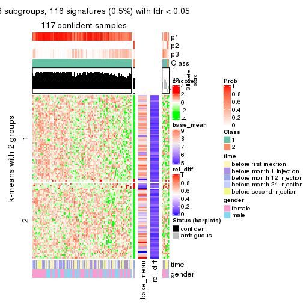</p>

</div>
<div id='tab-CV-hclust-get-signatures-3'>
<pre><code class="r">get_signatures(res, k = 4)
</code></pre>

<p></p>

</div>
<div id='tab-CV-hclust-get-signatures-4'>
<pre><code class="r">get_signatures(res, k = 5)
</code></pre>

<p></p>

</div>
<div id='tab-CV-hclust-get-signatures-5'>
<pre><code class="r">get_signatures(res, k = 6)
</code></pre>

<p></p>

</div>
</div>


Signature heatmaps where rows are not scaled:


<script>
$( function() {
	$( '#tabs-CV-hclust-get-signatures-no-scale' ).tabs();
} );
</script>
<div id='tabs-CV-hclust-get-signatures-no-scale'>
<ul>
<li><a href='#tab-CV-hclust-get-signatures-no-scale-1'>k = 2</a></li>
<li><a href='#tab-CV-hclust-get-signatures-no-scale-2'>k = 3</a></li>
<li><a href='#tab-CV-hclust-get-signatures-no-scale-3'>k = 4</a></li>
<li><a href='#tab-CV-hclust-get-signatures-no-scale-4'>k = 5</a></li>
<li><a href='#tab-CV-hclust-get-signatures-no-scale-5'>k = 6</a></li>
</ul>
<div id='tab-CV-hclust-get-signatures-no-scale-1'>
<pre><code class="r">get_signatures(res, k = 2, scale_rows = FALSE)
</code></pre>

<p></p>

</div>
<div id='tab-CV-hclust-get-signatures-no-scale-2'>
<pre><code class="r">get_signatures(res, k = 3, scale_rows = FALSE)
</code></pre>

<p></p>

</div>
<div id='tab-CV-hclust-get-signatures-no-scale-3'>
<pre><code class="r">get_signatures(res, k = 4, scale_rows = FALSE)
</code></pre>

<p></p>

</div>
<div id='tab-CV-hclust-get-signatures-no-scale-4'>
<pre><code class="r">get_signatures(res, k = 5, scale_rows = FALSE)
</code></pre>

<p></p>

</div>
<div id='tab-CV-hclust-get-signatures-no-scale-5'>
<pre><code class="r">get_signatures(res, k = 6, scale_rows = FALSE)
</code></pre>

<p></p>

</div>
</div>


Compare the overlap of signatures from different k:

```r
compare_signatures(res)
```


`get_signature()` returns a data frame invisibly. TO get the list of signatures, the function
call should be assigned to a variable explicitly. In following code, if `plot` argument is set
to `FALSE`, no heatmap is plotted while only the differential analysis is performed.

```r
# code only for demonstration
tb = get_signature(res, k = ..., plot = FALSE)
```

An example of the output of `tb` is:

```
#>   which_row         fdr    mean_1    mean_2 scaled_mean_1 scaled_mean_2 km
#> 1        38 0.042760348  8.373488  9.131774    -0.5533452     0.5164555  1
#> 2        40 0.018707592  7.106213  8.469186    -0.6173731     0.5762149  1
#> 3        55 0.019134737 10.221463 11.207825    -0.6159697     0.5749050  1
#> 4        59 0.006059896  5.921854  7.869574    -0.6899429     0.6439467  1
#> 5        60 0.018055526  8.928898 10.211722    -0.6204761     0.5791110  1
#> 6        98 0.009384629 15.714769 14.887706     0.6635654    -0.6193277  2
...
```

The columns in `tb` are:

1. `which_row`: row indices corresponding to the input matrix.
2. `fdr`: FDR for the differential test. 
3. `mean_x`: The mean value in group x.
4. `scaled_mean_x`: The mean value in group x after rows are scaled.
5. `km`: Row groups if k-means clustering is applied to rows.


UMAP plot which shows how samples are separated.


<script>
$( function() {
	$( '#tabs-CV-hclust-dimension-reduction' ).tabs();
} );
</script>
<div id='tabs-CV-hclust-dimension-reduction'>
<ul>
<li><a href='#tab-CV-hclust-dimension-reduction-1'>k = 2</a></li>
<li><a href='#tab-CV-hclust-dimension-reduction-2'>k = 3</a></li>
<li><a href='#tab-CV-hclust-dimension-reduction-3'>k = 4</a></li>
<li><a href='#tab-CV-hclust-dimension-reduction-4'>k = 5</a></li>
<li><a href='#tab-CV-hclust-dimension-reduction-5'>k = 6</a></li>
</ul>
<div id='tab-CV-hclust-dimension-reduction-1'>
<pre><code class="r">dimension_reduction(res, k = 2, method = &quot;UMAP&quot;)
</code></pre>

<p></p>

</div>
<div id='tab-CV-hclust-dimension-reduction-2'>
<pre><code class="r">dimension_reduction(res, k = 3, method = &quot;UMAP&quot;)
</code></pre>

<p>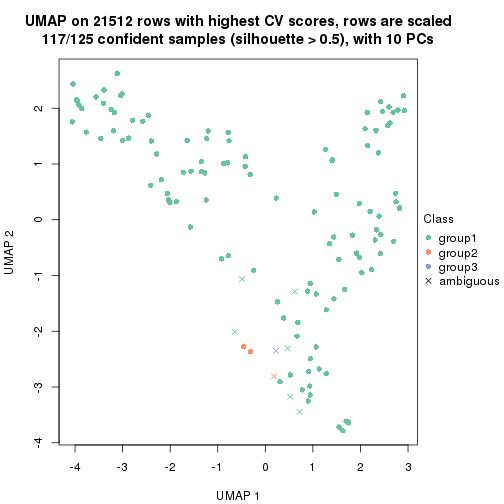</p>

</div>
<div id='tab-CV-hclust-dimension-reduction-3'>
<pre><code class="r">dimension_reduction(res, k = 4, method = &quot;UMAP&quot;)
</code></pre>

<p></p>

</div>
<div id='tab-CV-hclust-dimension-reduction-4'>
<pre><code class="r">dimension_reduction(res, k = 5, method = &quot;UMAP&quot;)
</code></pre>

<p></p>

</div>
<div id='tab-CV-hclust-dimension-reduction-5'>
<pre><code class="r">dimension_reduction(res, k = 6, method = &quot;UMAP&quot;)
</code></pre>

<p></p>

</div>
</div>


Following heatmap shows how subgroups are split when increasing `k`:

```r
collect_classes(res)
```

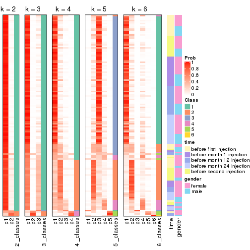


Test correlation between subgroups and known annotations. If the known
annotation is numeric, one-way ANOVA test is applied, and if the known
annotation is discrete, chi-squared contingency table test is applied.

```r
test_to_known_factors(res)
```

```
#>             n time(p) gender(p) k
#> CV:hclust 123  0.2302     1.000 2
#> CV:hclust 117  0.0807     1.000 3
#> CV:hclust  97  0.2204     0.318 4
#> CV:hclust  95  0.4349     0.231 5
#> CV:hclust  91  0.3102     0.394 6
```


If matrix rows can be associated to genes, consider to use `functional_enrichment(res,
...)` to perform function enrichment for the signature genes. See [this vignette](http://bioconductor.org/packages/devel/bioc/vignettes/cola/inst/doc/functional_enrichment.html) for more detailed explanations.


 

---------------------------------------------------


### CV:kmeans**


The object with results only for a single top-value method and a single partition method 
can be extracted as:

```r
res = res_list["CV", "kmeans"]
# you can also extract it by
# res = res_list["CV:kmeans"]
```

A summary of `res` and all the functions that can be applied to it:

```r
res
```

```
#> A 'ConsensusPartition' object with k = 2, 3, 4, 5, 6.
#>   On a matrix with 21512 rows and 125 columns.
#>   Top rows (1000, 2000, 3000, 4000, 5000) are extracted by 'CV' method.
#>   Subgroups are detected by 'kmeans' method.
#>   Performed in total 1250 partitions by row resampling.
#>   Best k for subgroups seems to be 2.
#> 
#> Following methods can be applied to this 'ConsensusPartition' object:
#>  [1] "cola_report"             "collect_classes"         "collect_plots"          
#>  [4] "collect_stats"           "colnames"                "compare_signatures"     
#>  [7] "consensus_heatmap"       "dimension_reduction"     "functional_enrichment"  
#> [10] "get_anno_col"            "get_anno"                "get_classes"            
#> [13] "get_consensus"           "get_matrix"              "get_membership"         
#> [16] "get_param"               "get_signatures"          "get_stats"              
#> [19] "is_best_k"               "is_stable_k"             "membership_heatmap"     
#> [22] "ncol"                    "nrow"                    "plot_ecdf"              
#> [25] "rownames"                "select_partition_number" "show"                   
#> [28] "suggest_best_k"          "test_to_known_factors"
```

`collect_plots()` function collects all the plots made from `res` for all `k` (number of partitions)
into one single page to provide an easy and fast comparison between different `k`.

```r
collect_plots(res)
```


The plots are:

- The first row: a plot of the ECDF (empirical cumulative distribution
  function) curves of the consensus matrix for each `k` and the heatmap of
  predicted classes for each `k`.
- The second row: heatmaps of the consensus matrix for each `k`.
- The third row: heatmaps of the membership matrix for each `k`.
- The fouth row: heatmaps of the signatures for each `k`.

All the plots in panels can be made by individual functions and they are
plotted later in this section.

`select_partition_number()` produces several plots showing different
statistics for choosing "optimized" `k`. There are following statistics:

- ECDF curves of the consensus matrix for each `k`;
- 1-PAC. [The PAC
  score](https://en.wikipedia.org/wiki/Consensus_clustering#Over-interpretation_potential_of_consensus_clustering)
  measures the proportion of the ambiguous subgrouping.
- Mean silhouette score.
- Concordance. The mean probability of fiting the consensus class ids in all
  partitions.
- Area increased. Denote $A_k$ as the area under the ECDF curve for current
  `k`, the area increased is defined as $A_k - A_{k-1}$.
- Rand index. The percent of pairs of samples that are both in a same cluster
  or both are not in a same cluster in the partition of k and k-1.
- Jaccard index. The ratio of pairs of samples are both in a same cluster in
  the partition of k and k-1 and the pairs of samples are both in a same
  cluster in the partition k or k-1.

The detailed explanations of these statistics can be found in [the _cola_
vignette](http://bioconductor.org/packages/devel/bioc/vignettes/cola/inst/doc/cola.html#toc_13).

Generally speaking, lower PAC score, higher mean silhouette score or higher
concordance corresponds to better partition. Rand index and Jaccard index
measure how similar the current partition is compared to partition with `k-1`.
If they are too similar, we won't accept `k` is better than `k-1`.

```r
select_partition_number(res)
```


The numeric values for all these statistics can be obtained by `get_stats()`.

```r
get_stats(res)
```

```
#>   k 1-PAC mean_silhouette concordance area_increased  Rand Jaccard
#> 2 2 1.000           0.962       0.982         0.5036 0.497   0.497
#> 3 3 0.606           0.649       0.772         0.2388 0.866   0.734
#> 4 4 0.607           0.693       0.781         0.1213 0.904   0.760
#> 5 5 0.604           0.606       0.737         0.0798 0.887   0.664
#> 6 6 0.635           0.658       0.745         0.0474 0.911   0.663
```

`suggest_best_k()` suggests the best $k$ based on these statistics. The rules are as follows:

- All $k$ with Jaccard index larger than 0.95 are removed because increasing
  $k$ does not provide enough extra information. If all $k$ are removed, it is
  marked as no subgroup is detected.
- For all $k$ with 1-PAC score larger than 0.9, the maximal $k$ is taken as
  the best $k$, and other $k$ are marked as optional $k$.
- If it does not fit the second rule. The $k$ with the maximal vote of the
  highest 1-PAC score, highest mean silhouette, and highest concordance is
  taken as the best $k$.

```r
suggest_best_k(res)
```

```
#> [1] 2
```


Following shows the table of the partitions (You need to click the **show/hide
code output** link to see it). The membership matrix (columns with name `p*`)
is inferred by
[`clue::cl_consensus()`](https://www.rdocumentation.org/link/cl_consensus?package=clue)
function with the `SE` method. Basically the value in the membership matrix
represents the probability to belong to a certain group. The finall class
label for an item is determined with the group with highest probability it
belongs to.

In `get_classes()` function, the entropy is calculated from the membership
matrix and the silhouette score is calculated from the consensus matrix.


<script>
$( function() {
	$( '#tabs-CV-kmeans-get-classes' ).tabs();
} );
</script>
<div id='tabs-CV-kmeans-get-classes'>
<ul>
<li><a href='#tab-CV-kmeans-get-classes-1'>k = 2</a></li>
<li><a href='#tab-CV-kmeans-get-classes-2'>k = 3</a></li>
<li><a href='#tab-CV-kmeans-get-classes-3'>k = 4</a></li>
<li><a href='#tab-CV-kmeans-get-classes-4'>k = 5</a></li>
<li><a href='#tab-CV-kmeans-get-classes-5'>k = 6</a></li>
</ul>

<div id='tab-CV-kmeans-get-classes-1'>
<p><a id='tab-CV-kmeans-get-classes-1-a' style='color:#0366d6' href='#'>show/hide code output</a></p>
<pre><code class="r">cbind(get_classes(res, k = 2), get_membership(res, k = 2))
</code></pre>

<pre><code>#&gt;           class entropy silhouette    p1    p2
#&gt; GSM601872     2  0.0000      0.987 0.000 1.000
#&gt; GSM601882     2  0.0000      0.987 0.000 1.000
#&gt; GSM601887     1  0.2948      0.940 0.948 0.052
#&gt; GSM601892     1  0.0376      0.978 0.996 0.004
#&gt; GSM601897     1  0.6531      0.810 0.832 0.168
#&gt; GSM601902     2  0.0376      0.985 0.004 0.996
#&gt; GSM601912     1  0.0376      0.978 0.996 0.004
#&gt; GSM601927     1  0.0000      0.977 1.000 0.000
#&gt; GSM601932     2  0.0376      0.985 0.004 0.996
#&gt; GSM601937     2  0.0000      0.987 0.000 1.000
#&gt; GSM601942     2  0.0000      0.987 0.000 1.000
#&gt; GSM601947     2  0.1184      0.978 0.016 0.984
#&gt; GSM601957     1  0.0376      0.978 0.996 0.004
#&gt; GSM601972     2  0.0000      0.987 0.000 1.000
#&gt; GSM601977     2  0.0000      0.987 0.000 1.000
#&gt; GSM601987     2  0.0000      0.987 0.000 1.000
#&gt; GSM601877     1  0.0000      0.977 1.000 0.000
#&gt; GSM601907     2  0.0000      0.987 0.000 1.000
#&gt; GSM601917     2  0.0376      0.985 0.004 0.996
#&gt; GSM601922     2  0.4298      0.908 0.088 0.912
#&gt; GSM601952     2  0.0000      0.987 0.000 1.000
#&gt; GSM601962     1  0.0376      0.978 0.996 0.004
#&gt; GSM601967     1  0.0376      0.978 0.996 0.004
#&gt; GSM601982     2  0.4939      0.880 0.108 0.892
#&gt; GSM601992     2  0.0000      0.987 0.000 1.000
#&gt; GSM601873     2  0.0000      0.987 0.000 1.000
#&gt; GSM601883     2  0.0000      0.987 0.000 1.000
#&gt; GSM601888     1  0.1843      0.960 0.972 0.028
#&gt; GSM601893     1  0.1414      0.967 0.980 0.020
#&gt; GSM601898     1  0.0376      0.978 0.996 0.004
#&gt; GSM601903     2  0.0376      0.985 0.004 0.996
#&gt; GSM601913     1  0.0376      0.978 0.996 0.004
#&gt; GSM601928     1  0.0000      0.977 1.000 0.000
#&gt; GSM601933     2  0.0000      0.987 0.000 1.000
#&gt; GSM601938     2  0.0000      0.987 0.000 1.000
#&gt; GSM601943     2  0.0000      0.987 0.000 1.000
#&gt; GSM601948     1  0.0000      0.977 1.000 0.000
#&gt; GSM601958     1  0.0376      0.978 0.996 0.004
#&gt; GSM601973     2  0.0376      0.985 0.004 0.996
#&gt; GSM601978     2  0.0000      0.987 0.000 1.000
#&gt; GSM601988     2  0.0000      0.987 0.000 1.000
#&gt; GSM601878     1  0.0000      0.977 1.000 0.000
#&gt; GSM601908     2  0.0000      0.987 0.000 1.000
#&gt; GSM601918     2  0.0376      0.985 0.004 0.996
#&gt; GSM601923     1  0.0000      0.977 1.000 0.000
#&gt; GSM601953     2  0.0000      0.987 0.000 1.000
#&gt; GSM601963     1  0.0376      0.978 0.996 0.004
#&gt; GSM601968     1  0.0376      0.978 0.996 0.004
#&gt; GSM601983     1  0.0376      0.978 0.996 0.004
#&gt; GSM601993     2  0.0000      0.987 0.000 1.000
#&gt; GSM601874     2  0.0000      0.987 0.000 1.000
#&gt; GSM601884     2  0.0000      0.987 0.000 1.000
#&gt; GSM601889     1  0.0376      0.978 0.996 0.004
#&gt; GSM601894     1  0.0376      0.978 0.996 0.004
#&gt; GSM601899     1  0.1184      0.970 0.984 0.016
#&gt; GSM601904     2  0.1414      0.974 0.020 0.980
#&gt; GSM601914     1  0.0376      0.978 0.996 0.004
#&gt; GSM601929     1  0.0000      0.977 1.000 0.000
#&gt; GSM601934     2  0.1184      0.975 0.016 0.984
#&gt; GSM601939     1  0.0000      0.977 1.000 0.000
#&gt; GSM601944     2  0.0000      0.987 0.000 1.000
#&gt; GSM601949     1  0.0000      0.977 1.000 0.000
#&gt; GSM601959     1  0.0376      0.978 0.996 0.004
#&gt; GSM601974     2  0.9000      0.545 0.316 0.684
#&gt; GSM601979     2  0.0000      0.987 0.000 1.000
#&gt; GSM601989     1  0.0376      0.978 0.996 0.004
#&gt; GSM601879     1  0.0000      0.977 1.000 0.000
#&gt; GSM601909     1  0.0376      0.978 0.996 0.004
#&gt; GSM601919     2  0.2043      0.964 0.032 0.968
#&gt; GSM601924     1  0.0000      0.977 1.000 0.000
#&gt; GSM601954     2  0.0376      0.985 0.004 0.996
#&gt; GSM601964     1  0.0376      0.978 0.996 0.004
#&gt; GSM601969     1  0.0000      0.977 1.000 0.000
#&gt; GSM601984     1  0.0376      0.978 0.996 0.004
#&gt; GSM601994     2  0.0000      0.987 0.000 1.000
#&gt; GSM601875     2  0.0000      0.987 0.000 1.000
#&gt; GSM601885     2  0.0000      0.987 0.000 1.000
#&gt; GSM601890     1  0.0672      0.975 0.992 0.008
#&gt; GSM601895     1  0.0376      0.978 0.996 0.004
#&gt; GSM601900     1  0.3114      0.936 0.944 0.056
#&gt; GSM601905     2  0.1184      0.978 0.016 0.984
#&gt; GSM601915     1  0.0376      0.978 0.996 0.004
#&gt; GSM601930     1  0.0000      0.977 1.000 0.000
#&gt; GSM601935     1  0.8955      0.562 0.688 0.312
#&gt; GSM601940     1  0.0000      0.977 1.000 0.000
#&gt; GSM601945     2  0.0000      0.987 0.000 1.000
#&gt; GSM601950     1  0.0000      0.977 1.000 0.000
#&gt; GSM601960     1  0.0376      0.978 0.996 0.004
#&gt; GSM601975     2  0.0376      0.985 0.004 0.996
#&gt; GSM601980     2  0.0000      0.987 0.000 1.000
#&gt; GSM601990     1  0.0376      0.978 0.996 0.004
#&gt; GSM601880     1  0.0000      0.977 1.000 0.000
#&gt; GSM601910     1  0.0376      0.978 0.996 0.004
#&gt; GSM601920     2  0.0376      0.985 0.004 0.996
#&gt; GSM601925     1  0.0000      0.977 1.000 0.000
#&gt; GSM601955     2  0.0000      0.987 0.000 1.000
#&gt; GSM601965     1  0.0000      0.977 1.000 0.000
#&gt; GSM601970     1  0.0376      0.978 0.996 0.004
#&gt; GSM601985     1  0.0000      0.977 1.000 0.000
#&gt; GSM601995     2  0.0000      0.987 0.000 1.000
#&gt; GSM601876     1  0.0000      0.977 1.000 0.000
#&gt; GSM601886     2  0.4939      0.881 0.108 0.892
#&gt; GSM601891     1  0.3879      0.917 0.924 0.076
#&gt; GSM601896     1  0.0000      0.977 1.000 0.000
#&gt; GSM601901     2  0.0000      0.987 0.000 1.000
#&gt; GSM601906     1  0.7376      0.748 0.792 0.208
#&gt; GSM601916     2  0.0376      0.985 0.004 0.996
#&gt; GSM601931     1  0.0000      0.977 1.000 0.000
#&gt; GSM601936     2  0.0000      0.987 0.000 1.000
#&gt; GSM601941     2  0.0376      0.985 0.004 0.996
#&gt; GSM601946     1  0.0000      0.977 1.000 0.000
#&gt; GSM601951     1  0.0000      0.977 1.000 0.000
#&gt; GSM601961     2  0.0000      0.987 0.000 1.000
#&gt; GSM601976     2  0.0000      0.987 0.000 1.000
#&gt; GSM601981     2  0.0000      0.987 0.000 1.000
#&gt; GSM601991     1  0.0672      0.975 0.992 0.008
#&gt; GSM601881     1  0.0000      0.977 1.000 0.000
#&gt; GSM601911     1  0.9775      0.333 0.588 0.412
#&gt; GSM601921     2  0.0376      0.985 0.004 0.996
#&gt; GSM601926     1  0.0000      0.977 1.000 0.000
#&gt; GSM601956     2  0.0000      0.987 0.000 1.000
#&gt; GSM601966     2  0.0000      0.987 0.000 1.000
#&gt; GSM601971     1  0.0000      0.977 1.000 0.000
#&gt; GSM601986     1  0.0376      0.978 0.996 0.004
#&gt; GSM601996     2  0.0000      0.987 0.000 1.000
</code></pre>

<script>
$('#tab-CV-kmeans-get-classes-1-a').parent().next().next().hide();
$('#tab-CV-kmeans-get-classes-1-a').click(function(){
  $('#tab-CV-kmeans-get-classes-1-a').parent().next().next().toggle();
  return(false);
});
</script>
</div>

<div id='tab-CV-kmeans-get-classes-2'>
<p><a id='tab-CV-kmeans-get-classes-2-a' style='color:#0366d6' href='#'>show/hide code output</a></p>
<pre><code class="r">cbind(get_classes(res, k = 3), get_membership(res, k = 3))
</code></pre>

<pre><code>#&gt;           class entropy silhouette    p1    p2    p3
#&gt; GSM601872     2  0.2682     0.6469 0.004 0.920 0.076
#&gt; GSM601882     2  0.3116     0.6718 0.000 0.892 0.108
#&gt; GSM601887     1  0.5595     0.7048 0.756 0.228 0.016
#&gt; GSM601892     1  0.1182     0.9018 0.976 0.012 0.012
#&gt; GSM601897     1  0.8953     0.4175 0.560 0.260 0.180
#&gt; GSM601902     3  0.6274     0.4008 0.000 0.456 0.544
#&gt; GSM601912     1  0.0747     0.9038 0.984 0.000 0.016
#&gt; GSM601927     1  0.3551     0.8854 0.868 0.000 0.132
#&gt; GSM601932     3  0.6280     0.3934 0.000 0.460 0.540
#&gt; GSM601937     3  0.5754     0.3701 0.004 0.296 0.700
#&gt; GSM601942     2  0.6204     0.1185 0.000 0.576 0.424
#&gt; GSM601947     2  0.6026     0.2058 0.000 0.624 0.376
#&gt; GSM601957     1  0.0592     0.9040 0.988 0.000 0.012
#&gt; GSM601972     2  0.5835     0.2731 0.000 0.660 0.340
#&gt; GSM601977     2  0.1753     0.7090 0.000 0.952 0.048
#&gt; GSM601987     2  0.1860     0.7076 0.000 0.948 0.052
#&gt; GSM601877     1  0.3619     0.8832 0.864 0.000 0.136
#&gt; GSM601907     2  0.0237     0.7109 0.000 0.996 0.004
#&gt; GSM601917     3  0.6168     0.4209 0.000 0.412 0.588
#&gt; GSM601922     3  0.6865     0.4116 0.020 0.384 0.596
#&gt; GSM601952     2  0.6180    -0.0308 0.000 0.584 0.416
#&gt; GSM601962     1  0.0592     0.9040 0.988 0.000 0.012
#&gt; GSM601967     1  0.0592     0.9040 0.988 0.000 0.012
#&gt; GSM601982     2  0.3899     0.6620 0.056 0.888 0.056
#&gt; GSM601992     2  0.6235    -0.1210 0.000 0.564 0.436
#&gt; GSM601873     2  0.4002     0.5432 0.000 0.840 0.160
#&gt; GSM601883     2  0.2448     0.6965 0.000 0.924 0.076
#&gt; GSM601888     1  0.6341     0.5767 0.672 0.312 0.016
#&gt; GSM601893     1  0.5643     0.7113 0.760 0.220 0.020
#&gt; GSM601898     1  0.0592     0.9040 0.988 0.000 0.012
#&gt; GSM601903     3  0.6274     0.4008 0.000 0.456 0.544
#&gt; GSM601913     1  0.0000     0.9051 1.000 0.000 0.000
#&gt; GSM601928     1  0.3551     0.8854 0.868 0.000 0.132
#&gt; GSM601933     2  0.3551     0.6462 0.000 0.868 0.132
#&gt; GSM601938     2  0.4235     0.5835 0.000 0.824 0.176
#&gt; GSM601943     2  0.5138     0.3932 0.000 0.748 0.252
#&gt; GSM601948     1  0.3482     0.8939 0.872 0.000 0.128
#&gt; GSM601958     1  0.0592     0.9040 0.988 0.000 0.012
#&gt; GSM601973     3  0.6274     0.4008 0.000 0.456 0.544
#&gt; GSM601978     2  0.0892     0.7023 0.000 0.980 0.020
#&gt; GSM601988     3  0.5529     0.4089 0.000 0.296 0.704
#&gt; GSM601878     1  0.3340     0.8904 0.880 0.000 0.120
#&gt; GSM601908     2  0.0747     0.7148 0.000 0.984 0.016
#&gt; GSM601918     2  0.6008     0.2081 0.000 0.628 0.372
#&gt; GSM601923     1  0.3551     0.8854 0.868 0.000 0.132
#&gt; GSM601953     2  0.0747     0.7050 0.000 0.984 0.016
#&gt; GSM601963     1  0.0592     0.9040 0.988 0.000 0.012
#&gt; GSM601968     1  0.0892     0.9024 0.980 0.000 0.020
#&gt; GSM601983     1  0.0592     0.9040 0.988 0.000 0.012
#&gt; GSM601993     3  0.5560     0.4162 0.000 0.300 0.700
#&gt; GSM601874     2  0.0000     0.7119 0.000 1.000 0.000
#&gt; GSM601884     2  0.1289     0.7139 0.000 0.968 0.032
#&gt; GSM601889     1  0.0747     0.9048 0.984 0.000 0.016
#&gt; GSM601894     1  0.0592     0.9040 0.988 0.000 0.012
#&gt; GSM601899     1  0.5817     0.6914 0.744 0.236 0.020
#&gt; GSM601904     3  0.6427     0.4155 0.012 0.348 0.640
#&gt; GSM601914     1  0.0747     0.9032 0.984 0.000 0.016
#&gt; GSM601929     1  0.3482     0.8873 0.872 0.000 0.128
#&gt; GSM601934     2  0.2496     0.7006 0.004 0.928 0.068
#&gt; GSM601939     1  0.2796     0.8996 0.908 0.000 0.092
#&gt; GSM601944     3  0.6079     0.3123 0.000 0.388 0.612
#&gt; GSM601949     1  0.3267     0.8983 0.884 0.000 0.116
#&gt; GSM601959     1  0.0592     0.9040 0.988 0.000 0.012
#&gt; GSM601974     3  0.8771     0.3060 0.304 0.140 0.556
#&gt; GSM601979     2  0.0237     0.7106 0.000 0.996 0.004
#&gt; GSM601989     1  0.0592     0.9040 0.988 0.000 0.012
#&gt; GSM601879     1  0.3551     0.8854 0.868 0.000 0.132
#&gt; GSM601909     1  0.1267     0.9006 0.972 0.004 0.024
#&gt; GSM601919     2  0.7295     0.1626 0.036 0.584 0.380
#&gt; GSM601924     1  0.3340     0.8904 0.880 0.000 0.120
#&gt; GSM601954     2  0.5650     0.3001 0.000 0.688 0.312
#&gt; GSM601964     1  0.0592     0.9040 0.988 0.000 0.012
#&gt; GSM601969     1  0.1031     0.9059 0.976 0.000 0.024
#&gt; GSM601984     1  0.2625     0.9008 0.916 0.000 0.084
#&gt; GSM601994     2  0.6235    -0.1214 0.000 0.564 0.436
#&gt; GSM601875     2  0.0424     0.7132 0.000 0.992 0.008
#&gt; GSM601885     2  0.2537     0.6939 0.000 0.920 0.080
#&gt; GSM601890     1  0.4748     0.7940 0.832 0.144 0.024
#&gt; GSM601895     1  0.1753     0.8934 0.952 0.000 0.048
#&gt; GSM601900     1  0.3764     0.8588 0.892 0.040 0.068
#&gt; GSM601905     3  0.6225     0.4047 0.000 0.432 0.568
#&gt; GSM601915     1  0.0000     0.9051 1.000 0.000 0.000
#&gt; GSM601930     1  0.3412     0.8889 0.876 0.000 0.124
#&gt; GSM601935     3  0.6539     0.3034 0.288 0.028 0.684
#&gt; GSM601940     1  0.2356     0.9030 0.928 0.000 0.072
#&gt; GSM601945     2  0.0892     0.7031 0.000 0.980 0.020
#&gt; GSM601950     1  0.2796     0.9036 0.908 0.000 0.092
#&gt; GSM601960     1  0.1529     0.8968 0.960 0.000 0.040
#&gt; GSM601975     3  0.6280     0.3945 0.000 0.460 0.540
#&gt; GSM601980     3  0.6033     0.3280 0.004 0.336 0.660
#&gt; GSM601990     1  0.0424     0.9047 0.992 0.000 0.008
#&gt; GSM601880     1  0.3686     0.8808 0.860 0.000 0.140
#&gt; GSM601910     1  0.1163     0.9005 0.972 0.000 0.028
#&gt; GSM601920     3  0.6095     0.4097 0.000 0.392 0.608
#&gt; GSM601925     1  0.3551     0.8854 0.868 0.000 0.132
#&gt; GSM601955     3  0.6081     0.3177 0.004 0.344 0.652
#&gt; GSM601965     1  0.2356     0.9032 0.928 0.000 0.072
#&gt; GSM601970     1  0.0592     0.9040 0.988 0.000 0.012
#&gt; GSM601985     1  0.2261     0.9035 0.932 0.000 0.068
#&gt; GSM601995     3  0.5763     0.3864 0.008 0.276 0.716
#&gt; GSM601876     1  0.2165     0.9042 0.936 0.000 0.064
#&gt; GSM601886     3  0.5069     0.4516 0.044 0.128 0.828
#&gt; GSM601891     1  0.6105     0.6651 0.724 0.252 0.024
#&gt; GSM601896     1  0.2165     0.9042 0.936 0.000 0.064
#&gt; GSM601901     2  0.3116     0.6725 0.000 0.892 0.108
#&gt; GSM601906     3  0.7585    -0.2403 0.476 0.040 0.484
#&gt; GSM601916     3  0.6235     0.4077 0.000 0.436 0.564
#&gt; GSM601931     1  0.3412     0.8893 0.876 0.000 0.124
#&gt; GSM601936     3  0.5254     0.4209 0.000 0.264 0.736
#&gt; GSM601941     3  0.6252     0.4010 0.000 0.444 0.556
#&gt; GSM601946     1  0.2959     0.8973 0.900 0.000 0.100
#&gt; GSM601951     1  0.3412     0.8889 0.876 0.000 0.124
#&gt; GSM601961     2  0.1031     0.7116 0.000 0.976 0.024
#&gt; GSM601976     3  0.6291     0.3702 0.000 0.468 0.532
#&gt; GSM601981     2  0.1289     0.7133 0.000 0.968 0.032
#&gt; GSM601991     1  0.4796     0.7221 0.780 0.000 0.220
#&gt; GSM601881     1  0.3551     0.8857 0.868 0.000 0.132
#&gt; GSM601911     1  0.9017     0.2526 0.516 0.336 0.148
#&gt; GSM601921     3  0.6286     0.3789 0.000 0.464 0.536
#&gt; GSM601926     1  0.3482     0.8873 0.872 0.000 0.128
#&gt; GSM601956     2  0.1163     0.6967 0.000 0.972 0.028
#&gt; GSM601966     2  0.5859     0.1846 0.000 0.656 0.344
#&gt; GSM601971     1  0.1031     0.9062 0.976 0.000 0.024
#&gt; GSM601986     1  0.3030     0.8992 0.904 0.004 0.092
#&gt; GSM601996     2  0.6302    -0.2731 0.000 0.520 0.480
</code></pre>

<script>
$('#tab-CV-kmeans-get-classes-2-a').parent().next().next().hide();
$('#tab-CV-kmeans-get-classes-2-a').click(function(){
  $('#tab-CV-kmeans-get-classes-2-a').parent().next().next().toggle();
  return(false);
});
</script>
</div>

<div id='tab-CV-kmeans-get-classes-3'>
<p><a id='tab-CV-kmeans-get-classes-3-a' style='color:#0366d6' href='#'>show/hide code output</a></p>
<pre><code class="r">cbind(get_classes(res, k = 4), get_membership(res, k = 4))
</code></pre>

<pre><code>#&gt;           class entropy silhouette    p1    p2    p3    p4
#&gt; GSM601872     2  0.1978     0.8157 0.000 0.928 0.068 0.004
#&gt; GSM601882     2  0.3962     0.7100 0.000 0.820 0.028 0.152
#&gt; GSM601887     1  0.7497     0.4389 0.528 0.308 0.152 0.012
#&gt; GSM601892     1  0.4993     0.7493 0.776 0.048 0.164 0.012
#&gt; GSM601897     1  0.8071     0.2472 0.420 0.180 0.380 0.020
#&gt; GSM601902     4  0.4238     0.7753 0.000 0.176 0.028 0.796
#&gt; GSM601912     1  0.3764     0.7687 0.816 0.000 0.172 0.012
#&gt; GSM601927     1  0.3900     0.7481 0.816 0.000 0.020 0.164
#&gt; GSM601932     4  0.4238     0.7753 0.000 0.176 0.028 0.796
#&gt; GSM601937     3  0.5035     0.7384 0.000 0.056 0.748 0.196
#&gt; GSM601942     3  0.5309     0.6091 0.000 0.256 0.700 0.044
#&gt; GSM601947     4  0.4857     0.7145 0.016 0.284 0.000 0.700
#&gt; GSM601957     1  0.3432     0.7792 0.848 0.004 0.140 0.008
#&gt; GSM601972     4  0.4857     0.6884 0.000 0.324 0.008 0.668
#&gt; GSM601977     2  0.2521     0.8247 0.000 0.912 0.024 0.064
#&gt; GSM601987     2  0.1624     0.8421 0.000 0.952 0.020 0.028
#&gt; GSM601877     1  0.4004     0.7478 0.812 0.000 0.024 0.164
#&gt; GSM601907     2  0.0804     0.8442 0.000 0.980 0.012 0.008
#&gt; GSM601917     4  0.3105     0.7551 0.004 0.140 0.000 0.856
#&gt; GSM601922     4  0.3932     0.7203 0.032 0.128 0.004 0.836
#&gt; GSM601952     4  0.7669     0.3228 0.000 0.328 0.228 0.444
#&gt; GSM601962     1  0.3448     0.7710 0.828 0.000 0.168 0.004
#&gt; GSM601967     1  0.3534     0.7784 0.840 0.004 0.148 0.008
#&gt; GSM601982     2  0.3385     0.8211 0.012 0.884 0.056 0.048
#&gt; GSM601992     4  0.7135     0.4027 0.000 0.400 0.132 0.468
#&gt; GSM601873     2  0.3625     0.7121 0.000 0.828 0.160 0.012
#&gt; GSM601883     2  0.2413     0.8258 0.000 0.916 0.020 0.064
#&gt; GSM601888     2  0.7560    -0.0616 0.388 0.464 0.136 0.012
#&gt; GSM601893     1  0.7502     0.4541 0.536 0.292 0.160 0.012
#&gt; GSM601898     1  0.3351     0.7780 0.844 0.000 0.148 0.008
#&gt; GSM601903     4  0.4281     0.7756 0.000 0.180 0.028 0.792
#&gt; GSM601913     1  0.3208     0.7788 0.848 0.000 0.148 0.004
#&gt; GSM601928     1  0.3946     0.7467 0.812 0.000 0.020 0.168
#&gt; GSM601933     2  0.3399     0.7886 0.000 0.868 0.040 0.092
#&gt; GSM601938     2  0.4636     0.6297 0.000 0.772 0.040 0.188
#&gt; GSM601943     2  0.4360     0.5607 0.000 0.744 0.248 0.008
#&gt; GSM601948     1  0.4046     0.7777 0.828 0.000 0.048 0.124
#&gt; GSM601958     1  0.3432     0.7792 0.848 0.004 0.140 0.008
#&gt; GSM601973     4  0.4281     0.7756 0.000 0.180 0.028 0.792
#&gt; GSM601978     2  0.0657     0.8407 0.000 0.984 0.012 0.004
#&gt; GSM601988     3  0.6248     0.6706 0.000 0.104 0.644 0.252
#&gt; GSM601878     1  0.3910     0.7516 0.820 0.000 0.024 0.156
#&gt; GSM601908     2  0.1661     0.8349 0.000 0.944 0.004 0.052
#&gt; GSM601918     4  0.4673     0.7172 0.008 0.292 0.000 0.700
#&gt; GSM601923     1  0.4004     0.7478 0.812 0.000 0.024 0.164
#&gt; GSM601953     2  0.1022     0.8367 0.000 0.968 0.032 0.000
#&gt; GSM601963     1  0.3266     0.7720 0.832 0.000 0.168 0.000
#&gt; GSM601968     1  0.4119     0.7636 0.796 0.004 0.188 0.012
#&gt; GSM601983     1  0.3311     0.7711 0.828 0.000 0.172 0.000
#&gt; GSM601993     3  0.6432     0.4661 0.000 0.076 0.552 0.372
#&gt; GSM601874     2  0.0524     0.8452 0.000 0.988 0.004 0.008
#&gt; GSM601884     2  0.1610     0.8415 0.000 0.952 0.016 0.032
#&gt; GSM601889     1  0.3326     0.7814 0.856 0.004 0.132 0.008
#&gt; GSM601894     1  0.3632     0.7747 0.832 0.004 0.156 0.008
#&gt; GSM601899     1  0.7536     0.4415 0.528 0.300 0.160 0.012
#&gt; GSM601904     4  0.1771     0.6075 0.012 0.036 0.004 0.948
#&gt; GSM601914     1  0.3486     0.7597 0.812 0.000 0.188 0.000
#&gt; GSM601929     1  0.3900     0.7501 0.816 0.000 0.020 0.164
#&gt; GSM601934     2  0.2383     0.8345 0.004 0.924 0.024 0.048
#&gt; GSM601939     1  0.3335     0.7663 0.860 0.000 0.020 0.120
#&gt; GSM601944     3  0.6750     0.6515 0.000 0.208 0.612 0.180
#&gt; GSM601949     1  0.3890     0.7750 0.836 0.004 0.028 0.132
#&gt; GSM601959     1  0.3484     0.7781 0.844 0.004 0.144 0.008
#&gt; GSM601974     4  0.7947    -0.0460 0.232 0.016 0.256 0.496
#&gt; GSM601979     2  0.0469     0.8451 0.000 0.988 0.000 0.012
#&gt; GSM601989     1  0.3272     0.7823 0.860 0.004 0.128 0.008
#&gt; GSM601879     1  0.4050     0.7470 0.808 0.000 0.024 0.168
#&gt; GSM601909     1  0.4387     0.7598 0.788 0.012 0.188 0.012
#&gt; GSM601919     4  0.5430     0.6994 0.036 0.252 0.008 0.704
#&gt; GSM601924     1  0.3910     0.7516 0.820 0.000 0.024 0.156
#&gt; GSM601954     4  0.5372     0.4664 0.000 0.444 0.012 0.544
#&gt; GSM601964     1  0.3266     0.7720 0.832 0.000 0.168 0.000
#&gt; GSM601969     1  0.4152     0.7803 0.808 0.000 0.160 0.032
#&gt; GSM601984     1  0.3032     0.7725 0.868 0.000 0.008 0.124
#&gt; GSM601994     4  0.7235     0.4372 0.000 0.372 0.148 0.480
#&gt; GSM601875     2  0.0524     0.8452 0.000 0.988 0.004 0.008
#&gt; GSM601885     2  0.2635     0.8176 0.000 0.904 0.020 0.076
#&gt; GSM601890     1  0.7386     0.5252 0.572 0.228 0.188 0.012
#&gt; GSM601895     1  0.4635     0.7007 0.720 0.000 0.268 0.012
#&gt; GSM601900     1  0.5756     0.6933 0.704 0.048 0.232 0.016
#&gt; GSM601905     4  0.3760     0.7695 0.004 0.156 0.012 0.828
#&gt; GSM601915     1  0.2760     0.7824 0.872 0.000 0.128 0.000
#&gt; GSM601930     1  0.3806     0.7519 0.824 0.000 0.020 0.156
#&gt; GSM601935     3  0.5451     0.6641 0.084 0.004 0.740 0.172
#&gt; GSM601940     1  0.2345     0.7763 0.900 0.000 0.000 0.100
#&gt; GSM601945     2  0.1929     0.8367 0.000 0.940 0.036 0.024
#&gt; GSM601950     1  0.3822     0.7780 0.844 0.004 0.032 0.120
#&gt; GSM601960     1  0.4319     0.7347 0.760 0.000 0.228 0.012
#&gt; GSM601975     4  0.4079     0.7762 0.000 0.180 0.020 0.800
#&gt; GSM601980     3  0.4953     0.7332 0.000 0.104 0.776 0.120
#&gt; GSM601990     1  0.3172     0.7733 0.840 0.000 0.160 0.000
#&gt; GSM601880     1  0.4050     0.7463 0.808 0.000 0.024 0.168
#&gt; GSM601910     1  0.4364     0.7456 0.764 0.000 0.220 0.016
#&gt; GSM601920     4  0.3326     0.7441 0.008 0.132 0.004 0.856
#&gt; GSM601925     1  0.4004     0.7478 0.812 0.000 0.024 0.164
#&gt; GSM601955     3  0.4784     0.7298 0.000 0.100 0.788 0.112
#&gt; GSM601965     1  0.2593     0.7759 0.892 0.000 0.004 0.104
#&gt; GSM601970     1  0.3625     0.7776 0.828 0.000 0.160 0.012
#&gt; GSM601985     1  0.2799     0.7742 0.884 0.000 0.008 0.108
#&gt; GSM601995     3  0.4485     0.7431 0.000 0.052 0.796 0.152
#&gt; GSM601876     1  0.2530     0.7770 0.896 0.000 0.004 0.100
#&gt; GSM601886     3  0.5065     0.6887 0.016 0.008 0.708 0.268
#&gt; GSM601891     1  0.7784     0.3281 0.468 0.360 0.156 0.016
#&gt; GSM601896     1  0.2651     0.7783 0.896 0.004 0.004 0.096
#&gt; GSM601901     2  0.3764     0.6986 0.000 0.816 0.012 0.172
#&gt; GSM601906     4  0.5675     0.1632 0.320 0.008 0.028 0.644
#&gt; GSM601916     4  0.4139     0.7756 0.000 0.176 0.024 0.800
#&gt; GSM601931     1  0.3853     0.7503 0.820 0.000 0.020 0.160
#&gt; GSM601936     3  0.5520     0.7001 0.000 0.060 0.696 0.244
#&gt; GSM601941     4  0.4379     0.7719 0.000 0.172 0.036 0.792
#&gt; GSM601946     1  0.3554     0.7601 0.844 0.000 0.020 0.136
#&gt; GSM601951     1  0.3900     0.7513 0.816 0.000 0.020 0.164
#&gt; GSM601961     2  0.1411     0.8385 0.000 0.960 0.020 0.020
#&gt; GSM601976     4  0.5436     0.7289 0.000 0.176 0.092 0.732
#&gt; GSM601981     2  0.1356     0.8437 0.000 0.960 0.008 0.032
#&gt; GSM601991     3  0.5292    -0.2618 0.480 0.000 0.512 0.008
#&gt; GSM601881     1  0.4004     0.7478 0.812 0.000 0.024 0.164
#&gt; GSM601911     1  0.6949     0.5269 0.616 0.208 0.008 0.168
#&gt; GSM601921     4  0.3681     0.7765 0.000 0.176 0.008 0.816
#&gt; GSM601926     1  0.4004     0.7478 0.812 0.000 0.024 0.164
#&gt; GSM601956     2  0.1722     0.8299 0.000 0.944 0.048 0.008
#&gt; GSM601966     2  0.6011    -0.3518 0.000 0.480 0.040 0.480
#&gt; GSM601971     1  0.3606     0.7857 0.844 0.000 0.132 0.024
#&gt; GSM601986     1  0.3272     0.7695 0.860 0.004 0.008 0.128
#&gt; GSM601996     4  0.5966     0.6877 0.000 0.280 0.072 0.648
</code></pre>

<script>
$('#tab-CV-kmeans-get-classes-3-a').parent().next().next().hide();
$('#tab-CV-kmeans-get-classes-3-a').click(function(){
  $('#tab-CV-kmeans-get-classes-3-a').parent().next().next().toggle();
  return(false);
});
</script>
</div>

<div id='tab-CV-kmeans-get-classes-4'>
<p><a id='tab-CV-kmeans-get-classes-4-a' style='color:#0366d6' href='#'>show/hide code output</a></p>
<pre><code class="r">cbind(get_classes(res, k = 5), get_membership(res, k = 5))
</code></pre>

<pre><code>#&gt;           class entropy silhouette    p1    p2    p3    p4    p5
#&gt; GSM601872     2  0.2964    0.80925 0.068 0.884 0.012 0.004 0.032
#&gt; GSM601882     2  0.4647    0.75301 0.052 0.772 0.004 0.148 0.024
#&gt; GSM601887     3  0.5815    0.45170 0.056 0.276 0.636 0.020 0.012
#&gt; GSM601892     3  0.3941    0.60735 0.064 0.072 0.836 0.016 0.012
#&gt; GSM601897     3  0.6559    0.46864 0.060 0.108 0.660 0.024 0.148
#&gt; GSM601902     4  0.2839    0.74398 0.024 0.048 0.000 0.892 0.036
#&gt; GSM601912     3  0.1310    0.64886 0.000 0.000 0.956 0.020 0.024
#&gt; GSM601927     1  0.4030    0.95148 0.648 0.000 0.352 0.000 0.000
#&gt; GSM601932     4  0.2564    0.74844 0.024 0.052 0.000 0.904 0.020
#&gt; GSM601937     5  0.2661    0.82535 0.004 0.012 0.024 0.060 0.900
#&gt; GSM601942     5  0.5485    0.74911 0.144 0.124 0.004 0.020 0.708
#&gt; GSM601947     4  0.3849    0.72931 0.052 0.136 0.000 0.808 0.004
#&gt; GSM601957     3  0.2340    0.63244 0.068 0.000 0.908 0.012 0.012
#&gt; GSM601972     4  0.3733    0.72615 0.028 0.156 0.000 0.808 0.008
#&gt; GSM601977     2  0.2569    0.84362 0.016 0.896 0.000 0.076 0.012
#&gt; GSM601987     2  0.2765    0.83966 0.044 0.896 0.000 0.036 0.024
#&gt; GSM601877     1  0.3966    0.95465 0.664 0.000 0.336 0.000 0.000
#&gt; GSM601907     2  0.1490    0.84857 0.032 0.952 0.004 0.008 0.004
#&gt; GSM601917     4  0.3154    0.73938 0.088 0.040 0.000 0.864 0.008
#&gt; GSM601922     4  0.3273    0.72395 0.112 0.036 0.000 0.848 0.004
#&gt; GSM601952     4  0.7129    0.36922 0.052 0.288 0.000 0.504 0.156
#&gt; GSM601962     3  0.3441    0.60933 0.092 0.000 0.852 0.020 0.036
#&gt; GSM601967     3  0.2630    0.63066 0.080 0.000 0.892 0.016 0.012
#&gt; GSM601982     2  0.5251    0.79228 0.080 0.768 0.056 0.072 0.024
#&gt; GSM601992     4  0.8140    0.11254 0.112 0.304 0.000 0.360 0.224
#&gt; GSM601873     2  0.4113    0.73780 0.048 0.788 0.000 0.008 0.156
#&gt; GSM601883     2  0.3915    0.80080 0.048 0.824 0.000 0.104 0.024
#&gt; GSM601888     2  0.6268    0.00741 0.056 0.460 0.452 0.020 0.012
#&gt; GSM601893     3  0.5517    0.48258 0.056 0.240 0.676 0.016 0.012
#&gt; GSM601898     3  0.2586    0.62912 0.084 0.000 0.892 0.012 0.012
#&gt; GSM601903     4  0.2839    0.74398 0.024 0.048 0.000 0.892 0.036
#&gt; GSM601913     3  0.3047    0.61379 0.096 0.000 0.868 0.012 0.024
#&gt; GSM601928     1  0.4196    0.94920 0.640 0.000 0.356 0.004 0.000
#&gt; GSM601933     2  0.4626    0.77539 0.064 0.784 0.000 0.108 0.044
#&gt; GSM601938     2  0.5331    0.71759 0.060 0.732 0.000 0.136 0.072
#&gt; GSM601943     2  0.4695    0.67404 0.068 0.744 0.004 0.004 0.180
#&gt; GSM601948     3  0.5520   -0.42071 0.420 0.004 0.532 0.028 0.016
#&gt; GSM601958     3  0.2589    0.62265 0.092 0.000 0.888 0.012 0.008
#&gt; GSM601973     4  0.2673    0.74738 0.024 0.048 0.000 0.900 0.028
#&gt; GSM601978     2  0.1074    0.84947 0.016 0.968 0.000 0.012 0.004
#&gt; GSM601988     5  0.5955    0.74979 0.044 0.040 0.056 0.152 0.708
#&gt; GSM601878     1  0.3983    0.95438 0.660 0.000 0.340 0.000 0.000
#&gt; GSM601908     2  0.1772    0.85012 0.020 0.940 0.000 0.032 0.008
#&gt; GSM601918     4  0.3708    0.72823 0.044 0.136 0.000 0.816 0.004
#&gt; GSM601923     1  0.3966    0.95465 0.664 0.000 0.336 0.000 0.000
#&gt; GSM601953     2  0.2017    0.83768 0.060 0.924 0.004 0.004 0.008
#&gt; GSM601963     3  0.3346    0.60894 0.092 0.000 0.856 0.016 0.036
#&gt; GSM601968     3  0.2437    0.64305 0.040 0.008 0.916 0.016 0.020
#&gt; GSM601983     3  0.3346    0.61554 0.092 0.000 0.856 0.016 0.036
#&gt; GSM601993     5  0.5840    0.61388 0.088 0.028 0.000 0.240 0.644
#&gt; GSM601874     2  0.1278    0.85030 0.020 0.960 0.000 0.016 0.004
#&gt; GSM601884     2  0.3134    0.83176 0.044 0.876 0.000 0.056 0.024
#&gt; GSM601889     3  0.2699    0.61442 0.100 0.000 0.880 0.012 0.008
#&gt; GSM601894     3  0.2047    0.64630 0.040 0.000 0.928 0.012 0.020
#&gt; GSM601899     3  0.5728    0.47358 0.056 0.244 0.664 0.020 0.016
#&gt; GSM601904     4  0.3019    0.70449 0.108 0.012 0.000 0.864 0.016
#&gt; GSM601914     3  0.3152    0.62128 0.064 0.000 0.872 0.016 0.048
#&gt; GSM601929     1  0.4060    0.94874 0.640 0.000 0.360 0.000 0.000
#&gt; GSM601934     2  0.3654    0.83160 0.044 0.856 0.008 0.060 0.032
#&gt; GSM601939     1  0.4192    0.88803 0.596 0.000 0.404 0.000 0.000
#&gt; GSM601944     5  0.5900    0.72939 0.084 0.132 0.000 0.092 0.692
#&gt; GSM601949     3  0.5313   -0.54018 0.452 0.004 0.512 0.020 0.012
#&gt; GSM601959     3  0.2644    0.62145 0.088 0.000 0.888 0.012 0.012
#&gt; GSM601974     4  0.6035    0.22238 0.008 0.004 0.336 0.560 0.092
#&gt; GSM601979     2  0.0566    0.85047 0.000 0.984 0.000 0.012 0.004
#&gt; GSM601989     3  0.1830    0.64205 0.052 0.000 0.932 0.012 0.004
#&gt; GSM601879     1  0.4101    0.94954 0.664 0.000 0.332 0.004 0.000
#&gt; GSM601909     3  0.2064    0.64969 0.028 0.004 0.932 0.016 0.020
#&gt; GSM601919     4  0.4422    0.70775 0.120 0.104 0.000 0.772 0.004
#&gt; GSM601924     1  0.3966    0.95465 0.664 0.000 0.336 0.000 0.000
#&gt; GSM601954     4  0.5261    0.55883 0.044 0.316 0.000 0.628 0.012
#&gt; GSM601964     3  0.3346    0.60894 0.092 0.000 0.856 0.016 0.036
#&gt; GSM601969     3  0.3663    0.61968 0.116 0.004 0.836 0.024 0.020
#&gt; GSM601984     3  0.4452   -0.61977 0.496 0.000 0.500 0.004 0.000
#&gt; GSM601994     4  0.8049    0.10360 0.096 0.276 0.000 0.376 0.252
#&gt; GSM601875     2  0.1012    0.84964 0.020 0.968 0.000 0.012 0.000
#&gt; GSM601885     2  0.3966    0.79741 0.048 0.820 0.000 0.108 0.024
#&gt; GSM601890     3  0.5159    0.53276 0.056 0.160 0.744 0.024 0.016
#&gt; GSM601895     3  0.2196    0.64218 0.004 0.000 0.916 0.024 0.056
#&gt; GSM601900     3  0.3193    0.63728 0.020 0.036 0.884 0.020 0.040
#&gt; GSM601905     4  0.1648    0.74984 0.020 0.040 0.000 0.940 0.000
#&gt; GSM601915     3  0.2967    0.60552 0.104 0.000 0.868 0.012 0.016
#&gt; GSM601930     1  0.4060    0.94754 0.640 0.000 0.360 0.000 0.000
#&gt; GSM601935     5  0.4444    0.72546 0.012 0.000 0.172 0.052 0.764
#&gt; GSM601940     3  0.4443   -0.57829 0.472 0.000 0.524 0.004 0.000
#&gt; GSM601945     2  0.2568    0.84211 0.048 0.904 0.000 0.016 0.032
#&gt; GSM601950     3  0.5302   -0.51384 0.440 0.004 0.524 0.020 0.012
#&gt; GSM601960     3  0.2482    0.64019 0.016 0.000 0.904 0.016 0.064
#&gt; GSM601975     4  0.2722    0.74951 0.020 0.056 0.000 0.896 0.028
#&gt; GSM601980     5  0.4314    0.80367 0.136 0.016 0.020 0.028 0.800
#&gt; GSM601990     3  0.3174    0.61351 0.080 0.000 0.868 0.016 0.036
#&gt; GSM601880     1  0.4101    0.94970 0.664 0.000 0.332 0.000 0.004
#&gt; GSM601910     3  0.2082    0.65002 0.024 0.000 0.928 0.016 0.032
#&gt; GSM601920     4  0.3187    0.73833 0.088 0.036 0.000 0.864 0.012
#&gt; GSM601925     1  0.3966    0.95465 0.664 0.000 0.336 0.000 0.000
#&gt; GSM601955     5  0.4837    0.79967 0.136 0.032 0.028 0.028 0.776
#&gt; GSM601965     3  0.4830   -0.39102 0.420 0.000 0.560 0.016 0.004
#&gt; GSM601970     3  0.2844    0.63280 0.088 0.000 0.880 0.012 0.020
#&gt; GSM601985     1  0.4583    0.70906 0.528 0.000 0.464 0.004 0.004
#&gt; GSM601995     5  0.3519    0.81705 0.080 0.004 0.024 0.036 0.856
#&gt; GSM601876     3  0.4443   -0.57613 0.472 0.000 0.524 0.004 0.000
#&gt; GSM601886     5  0.3640    0.81153 0.024 0.000 0.036 0.100 0.840
#&gt; GSM601891     3  0.5870    0.41653 0.052 0.300 0.616 0.020 0.012
#&gt; GSM601896     3  0.4437   -0.54998 0.464 0.000 0.532 0.004 0.000
#&gt; GSM601901     2  0.4048    0.69834 0.016 0.772 0.000 0.196 0.016
#&gt; GSM601906     4  0.5793    0.13487 0.452 0.004 0.064 0.476 0.004
#&gt; GSM601916     4  0.2627    0.74860 0.044 0.044 0.000 0.900 0.012
#&gt; GSM601931     1  0.4045    0.95065 0.644 0.000 0.356 0.000 0.000
#&gt; GSM601936     5  0.3031    0.80029 0.020 0.004 0.000 0.120 0.856
#&gt; GSM601941     4  0.3152    0.74395 0.044 0.052 0.000 0.876 0.028
#&gt; GSM601946     1  0.4182    0.89591 0.600 0.000 0.400 0.000 0.000
#&gt; GSM601951     1  0.4341    0.93954 0.628 0.000 0.364 0.008 0.000
#&gt; GSM601961     2  0.2721    0.81752 0.036 0.904 0.032 0.020 0.008
#&gt; GSM601976     4  0.3071    0.73956 0.012 0.080 0.000 0.872 0.036
#&gt; GSM601981     2  0.1757    0.84920 0.012 0.936 0.000 0.048 0.004
#&gt; GSM601991     3  0.4532    0.48737 0.020 0.000 0.716 0.016 0.248
#&gt; GSM601881     1  0.3966    0.95465 0.664 0.000 0.336 0.000 0.000
#&gt; GSM601911     3  0.7997   -0.29500 0.364 0.160 0.376 0.092 0.008
#&gt; GSM601921     4  0.2943    0.75045 0.060 0.052 0.000 0.880 0.008
#&gt; GSM601926     1  0.3966    0.95465 0.664 0.000 0.336 0.000 0.000
#&gt; GSM601956     2  0.2556    0.82990 0.068 0.900 0.004 0.004 0.024
#&gt; GSM601966     4  0.7074    0.10145 0.108 0.404 0.000 0.428 0.060
#&gt; GSM601971     3  0.3667    0.56523 0.156 0.000 0.812 0.012 0.020
#&gt; GSM601986     3  0.4747   -0.59504 0.484 0.000 0.500 0.016 0.000
#&gt; GSM601996     4  0.7024    0.44135 0.096 0.168 0.000 0.580 0.156
</code></pre>

<script>
$('#tab-CV-kmeans-get-classes-4-a').parent().next().next().hide();
$('#tab-CV-kmeans-get-classes-4-a').click(function(){
  $('#tab-CV-kmeans-get-classes-4-a').parent().next().next().toggle();
  return(false);
});
</script>
</div>

<div id='tab-CV-kmeans-get-classes-5'>
<p><a id='tab-CV-kmeans-get-classes-5-a' style='color:#0366d6' href='#'>show/hide code output</a></p>
<pre><code class="r">cbind(get_classes(res, k = 6), get_membership(res, k = 6))
</code></pre>

<pre><code>#&gt;           class entropy silhouette    p1    p2    p3    p4    p5    p6
#&gt; GSM601872     2   0.251     0.7049 0.008 0.884 0.004 0.000 0.016 0.088
#&gt; GSM601882     2   0.483     0.5698 0.000 0.688 0.004 0.116 0.004 0.188
#&gt; GSM601887     3   0.578     0.5887 0.016 0.220 0.572 0.000 0.000 0.192
#&gt; GSM601892     3   0.442     0.7301 0.028 0.048 0.732 0.000 0.000 0.192
#&gt; GSM601897     3   0.493     0.6382 0.012 0.068 0.744 0.000 0.092 0.084
#&gt; GSM601902     4   0.346     0.7385 0.020 0.008 0.000 0.832 0.032 0.108
#&gt; GSM601912     3   0.169     0.7657 0.020 0.000 0.936 0.000 0.012 0.032
#&gt; GSM601927     1   0.276     0.8252 0.804 0.000 0.196 0.000 0.000 0.000
#&gt; GSM601932     4   0.327     0.7471 0.024 0.008 0.000 0.840 0.016 0.112
#&gt; GSM601937     5   0.249     0.6205 0.028 0.000 0.012 0.012 0.900 0.048
#&gt; GSM601942     5   0.590     0.5394 0.048 0.088 0.000 0.004 0.576 0.284
#&gt; GSM601947     4   0.261     0.7506 0.028 0.056 0.000 0.888 0.000 0.028
#&gt; GSM601957     3   0.373     0.7493 0.060 0.000 0.784 0.004 0.000 0.152
#&gt; GSM601972     4   0.429     0.6791 0.028 0.096 0.000 0.768 0.000 0.108
#&gt; GSM601977     2   0.328     0.7215 0.012 0.848 0.000 0.080 0.008 0.052
#&gt; GSM601987     2   0.349     0.6832 0.000 0.804 0.000 0.040 0.008 0.148
#&gt; GSM601877     1   0.274     0.8266 0.820 0.000 0.176 0.000 0.000 0.004
#&gt; GSM601907     2   0.164     0.7366 0.000 0.932 0.004 0.012 0.000 0.052
#&gt; GSM601917     4   0.282     0.7542 0.044 0.012 0.000 0.876 0.004 0.064
#&gt; GSM601922     4   0.330     0.7260 0.084 0.004 0.000 0.836 0.004 0.072
#&gt; GSM601952     4   0.720     0.1070 0.060 0.248 0.000 0.512 0.100 0.080
#&gt; GSM601962     3   0.319     0.6982 0.100 0.000 0.844 0.000 0.020 0.036
#&gt; GSM601967     3   0.383     0.7485 0.072 0.000 0.768 0.000 0.000 0.160
#&gt; GSM601982     2   0.566     0.6092 0.016 0.676 0.060 0.072 0.004 0.172
#&gt; GSM601992     6   0.771     0.8052 0.008 0.200 0.000 0.188 0.232 0.372
#&gt; GSM601873     2   0.514     0.5825 0.048 0.708 0.000 0.004 0.112 0.128
#&gt; GSM601883     2   0.433     0.6356 0.000 0.736 0.000 0.084 0.008 0.172
#&gt; GSM601888     2   0.620    -0.0777 0.016 0.440 0.352 0.000 0.000 0.192
#&gt; GSM601893     3   0.575     0.6209 0.016 0.192 0.596 0.004 0.000 0.192
#&gt; GSM601898     3   0.328     0.7649 0.060 0.000 0.828 0.004 0.000 0.108
#&gt; GSM601903     4   0.299     0.7570 0.020 0.008 0.000 0.864 0.020 0.088
#&gt; GSM601913     3   0.358     0.7017 0.092 0.000 0.828 0.004 0.024 0.052
#&gt; GSM601928     1   0.290     0.8252 0.800 0.000 0.196 0.004 0.000 0.000
#&gt; GSM601933     2   0.471     0.6102 0.000 0.712 0.000 0.052 0.040 0.196
#&gt; GSM601938     2   0.544     0.5366 0.000 0.664 0.000 0.096 0.060 0.180
#&gt; GSM601943     2   0.490     0.5798 0.056 0.732 0.000 0.004 0.124 0.084
#&gt; GSM601948     1   0.625     0.3023 0.436 0.000 0.392 0.036 0.000 0.136
#&gt; GSM601958     3   0.382     0.7436 0.084 0.000 0.784 0.004 0.000 0.128
#&gt; GSM601973     4   0.291     0.7512 0.020 0.008 0.000 0.864 0.012 0.096
#&gt; GSM601978     2   0.126     0.7365 0.004 0.956 0.000 0.008 0.004 0.028
#&gt; GSM601988     5   0.609     0.3783 0.012 0.020 0.068 0.064 0.644 0.192
#&gt; GSM601878     1   0.274     0.8266 0.820 0.000 0.176 0.000 0.000 0.004
#&gt; GSM601908     2   0.205     0.7334 0.008 0.916 0.000 0.032 0.000 0.044
#&gt; GSM601918     4   0.280     0.7415 0.012 0.052 0.000 0.872 0.000 0.064
#&gt; GSM601923     1   0.274     0.8266 0.820 0.000 0.176 0.000 0.000 0.004
#&gt; GSM601953     2   0.203     0.7211 0.012 0.912 0.004 0.004 0.000 0.068
#&gt; GSM601963     3   0.334     0.6996 0.100 0.000 0.836 0.000 0.024 0.040
#&gt; GSM601968     3   0.356     0.7616 0.040 0.000 0.788 0.000 0.004 0.168
#&gt; GSM601983     3   0.333     0.7046 0.084 0.004 0.844 0.000 0.020 0.048
#&gt; GSM601993     5   0.603    -0.0425 0.008 0.028 0.000 0.120 0.552 0.292
#&gt; GSM601874     2   0.109     0.7400 0.000 0.960 0.000 0.016 0.000 0.024
#&gt; GSM601884     2   0.386     0.6694 0.000 0.780 0.000 0.064 0.008 0.148
#&gt; GSM601889     3   0.414     0.7312 0.092 0.000 0.752 0.004 0.000 0.152
#&gt; GSM601894     3   0.338     0.7628 0.052 0.000 0.816 0.004 0.000 0.128
#&gt; GSM601899     3   0.564     0.6189 0.016 0.188 0.596 0.000 0.000 0.200
#&gt; GSM601904     4   0.263     0.7522 0.064 0.004 0.000 0.888 0.020 0.024
#&gt; GSM601914     3   0.310     0.7144 0.060 0.000 0.860 0.000 0.036 0.044
#&gt; GSM601929     1   0.282     0.8261 0.796 0.000 0.204 0.000 0.000 0.000
#&gt; GSM601934     2   0.469     0.6422 0.004 0.736 0.008 0.036 0.040 0.176
#&gt; GSM601939     1   0.344     0.8124 0.752 0.000 0.236 0.004 0.000 0.008
#&gt; GSM601944     5   0.730     0.2962 0.072 0.144 0.000 0.052 0.500 0.232
#&gt; GSM601949     1   0.554     0.4627 0.492 0.000 0.368 0.000 0.000 0.140
#&gt; GSM601959     3   0.380     0.7455 0.068 0.000 0.780 0.004 0.000 0.148
#&gt; GSM601974     4   0.595     0.2166 0.020 0.000 0.368 0.516 0.072 0.024
#&gt; GSM601979     2   0.138     0.7382 0.004 0.952 0.000 0.016 0.004 0.024
#&gt; GSM601989     3   0.241     0.7639 0.052 0.000 0.892 0.004 0.000 0.052
#&gt; GSM601879     1   0.288     0.8248 0.816 0.000 0.176 0.004 0.000 0.004
#&gt; GSM601909     3   0.272     0.7762 0.028 0.000 0.868 0.000 0.008 0.096
#&gt; GSM601919     4   0.366     0.7259 0.068 0.044 0.000 0.824 0.000 0.064
#&gt; GSM601924     1   0.274     0.8266 0.820 0.000 0.176 0.000 0.000 0.004
#&gt; GSM601954     4   0.510     0.5087 0.032 0.212 0.000 0.684 0.008 0.064
#&gt; GSM601964     3   0.309     0.7024 0.092 0.000 0.852 0.000 0.020 0.036
#&gt; GSM601969     3   0.508     0.7183 0.100 0.004 0.688 0.024 0.000 0.184
#&gt; GSM601984     1   0.427     0.6801 0.596 0.000 0.384 0.000 0.004 0.016
#&gt; GSM601994     6   0.784     0.8132 0.012 0.196 0.000 0.200 0.240 0.352
#&gt; GSM601875     2   0.115     0.7385 0.000 0.956 0.000 0.012 0.000 0.032
#&gt; GSM601885     2   0.444     0.6267 0.000 0.724 0.000 0.088 0.008 0.180
#&gt; GSM601890     3   0.499     0.6797 0.016 0.120 0.680 0.000 0.000 0.184
#&gt; GSM601895     3   0.215     0.7533 0.008 0.000 0.908 0.000 0.060 0.024
#&gt; GSM601900     3   0.287     0.7516 0.016 0.004 0.880 0.004 0.052 0.044
#&gt; GSM601905     4   0.257     0.7625 0.012 0.004 0.000 0.888 0.024 0.072
#&gt; GSM601915     3   0.316     0.7166 0.096 0.000 0.844 0.004 0.004 0.052
#&gt; GSM601930     1   0.282     0.8256 0.796 0.000 0.204 0.000 0.000 0.000
#&gt; GSM601935     5   0.517     0.4404 0.016 0.000 0.248 0.020 0.660 0.056
#&gt; GSM601940     1   0.399     0.7026 0.608 0.000 0.384 0.004 0.000 0.004
#&gt; GSM601945     2   0.350     0.7030 0.048 0.840 0.000 0.016 0.016 0.080
#&gt; GSM601950     1   0.558     0.4380 0.476 0.000 0.380 0.000 0.000 0.144
#&gt; GSM601960     3   0.246     0.7494 0.008 0.000 0.892 0.000 0.052 0.048
#&gt; GSM601975     4   0.279     0.7618 0.024 0.008 0.000 0.872 0.008 0.088
#&gt; GSM601980     5   0.483     0.6110 0.048 0.012 0.008 0.008 0.696 0.228
#&gt; GSM601990     3   0.292     0.7018 0.084 0.000 0.864 0.000 0.020 0.032
#&gt; GSM601880     1   0.284     0.8227 0.820 0.000 0.172 0.004 0.000 0.004
#&gt; GSM601910     3   0.257     0.7757 0.020 0.000 0.884 0.000 0.020 0.076
#&gt; GSM601920     4   0.325     0.7470 0.048 0.004 0.000 0.848 0.016 0.084
#&gt; GSM601925     1   0.288     0.8248 0.816 0.000 0.176 0.004 0.000 0.004
#&gt; GSM601955     5   0.529     0.6020 0.064 0.012 0.016 0.004 0.648 0.256
#&gt; GSM601965     1   0.422     0.5467 0.520 0.000 0.468 0.000 0.004 0.008
#&gt; GSM601970     3   0.407     0.7502 0.080 0.000 0.756 0.004 0.000 0.160
#&gt; GSM601985     1   0.454     0.7095 0.620 0.000 0.336 0.004 0.000 0.040
#&gt; GSM601995     5   0.364     0.6345 0.032 0.000 0.016 0.008 0.812 0.132
#&gt; GSM601876     1   0.384     0.7081 0.616 0.000 0.380 0.004 0.000 0.000
#&gt; GSM601886     5   0.388     0.5762 0.020 0.000 0.024 0.076 0.820 0.060
#&gt; GSM601891     3   0.589     0.5406 0.016 0.248 0.548 0.000 0.000 0.188
#&gt; GSM601896     1   0.441     0.6311 0.556 0.000 0.420 0.004 0.000 0.020
#&gt; GSM601901     2   0.433     0.5433 0.008 0.720 0.000 0.220 0.004 0.048
#&gt; GSM601906     1   0.576     0.1610 0.528 0.000 0.040 0.376 0.020 0.036
#&gt; GSM601916     4   0.338     0.7520 0.024 0.008 0.000 0.844 0.036 0.088
#&gt; GSM601931     1   0.282     0.8254 0.796 0.000 0.204 0.000 0.000 0.000
#&gt; GSM601936     5   0.381     0.5648 0.008 0.008 0.020 0.052 0.824 0.088
#&gt; GSM601941     4   0.340     0.7362 0.020 0.008 0.000 0.832 0.024 0.116
#&gt; GSM601946     1   0.341     0.8134 0.756 0.000 0.232 0.004 0.000 0.008
#&gt; GSM601951     1   0.282     0.8249 0.796 0.000 0.204 0.000 0.000 0.000
#&gt; GSM601961     2   0.298     0.6628 0.004 0.848 0.020 0.008 0.000 0.120
#&gt; GSM601976     4   0.422     0.7302 0.020 0.032 0.000 0.796 0.056 0.096
#&gt; GSM601981     2   0.243     0.7345 0.016 0.896 0.000 0.032 0.000 0.056
#&gt; GSM601991     3   0.450     0.5697 0.024 0.004 0.720 0.000 0.212 0.040
#&gt; GSM601881     1   0.274     0.8266 0.820 0.000 0.176 0.000 0.000 0.004
#&gt; GSM601911     1   0.762     0.4456 0.440 0.164 0.276 0.052 0.004 0.064
#&gt; GSM601921     4   0.283     0.7514 0.020 0.020 0.000 0.876 0.008 0.076
#&gt; GSM601926     1   0.274     0.8266 0.820 0.000 0.176 0.000 0.000 0.004
#&gt; GSM601956     2   0.279     0.7016 0.020 0.864 0.004 0.000 0.008 0.104
#&gt; GSM601966     2   0.748    -0.5974 0.016 0.324 0.000 0.300 0.072 0.288
#&gt; GSM601971     3   0.457     0.6829 0.144 0.000 0.700 0.000 0.000 0.156
#&gt; GSM601986     1   0.488     0.6535 0.572 0.004 0.384 0.012 0.004 0.024
#&gt; GSM601996     6   0.742     0.6781 0.008 0.104 0.000 0.340 0.200 0.348
</code></pre>

<script>
$('#tab-CV-kmeans-get-classes-5-a').parent().next().next().hide();
$('#tab-CV-kmeans-get-classes-5-a').click(function(){
  $('#tab-CV-kmeans-get-classes-5-a').parent().next().next().toggle();
  return(false);
});
</script>
</div>
</div>

Heatmaps for the consensus matrix. It visualizes the probability of two
samples to be in a same group.


<script>
$( function() {
	$( '#tabs-CV-kmeans-consensus-heatmap' ).tabs();
} );
</script>
<div id='tabs-CV-kmeans-consensus-heatmap'>
<ul>
<li><a href='#tab-CV-kmeans-consensus-heatmap-1'>k = 2</a></li>
<li><a href='#tab-CV-kmeans-consensus-heatmap-2'>k = 3</a></li>
<li><a href='#tab-CV-kmeans-consensus-heatmap-3'>k = 4</a></li>
<li><a href='#tab-CV-kmeans-consensus-heatmap-4'>k = 5</a></li>
<li><a href='#tab-CV-kmeans-consensus-heatmap-5'>k = 6</a></li>
</ul>
<div id='tab-CV-kmeans-consensus-heatmap-1'>
<pre><code class="r">consensus_heatmap(res, k = 2)
</code></pre>

<p></p>

</div>
<div id='tab-CV-kmeans-consensus-heatmap-2'>
<pre><code class="r">consensus_heatmap(res, k = 3)
</code></pre>

<p></p>

</div>
<div id='tab-CV-kmeans-consensus-heatmap-3'>
<pre><code class="r">consensus_heatmap(res, k = 4)
</code></pre>

<p></p>

</div>
<div id='tab-CV-kmeans-consensus-heatmap-4'>
<pre><code class="r">consensus_heatmap(res, k = 5)
</code></pre>

<p></p>

</div>
<div id='tab-CV-kmeans-consensus-heatmap-5'>
<pre><code class="r">consensus_heatmap(res, k = 6)
</code></pre>

<p></p>

</div>
</div>

Heatmaps for the membership of samples in all partitions to see how consistent they are:


<script>
$( function() {
	$( '#tabs-CV-kmeans-membership-heatmap' ).tabs();
} );
</script>
<div id='tabs-CV-kmeans-membership-heatmap'>
<ul>
<li><a href='#tab-CV-kmeans-membership-heatmap-1'>k = 2</a></li>
<li><a href='#tab-CV-kmeans-membership-heatmap-2'>k = 3</a></li>
<li><a href='#tab-CV-kmeans-membership-heatmap-3'>k = 4</a></li>
<li><a href='#tab-CV-kmeans-membership-heatmap-4'>k = 5</a></li>
<li><a href='#tab-CV-kmeans-membership-heatmap-5'>k = 6</a></li>
</ul>
<div id='tab-CV-kmeans-membership-heatmap-1'>
<pre><code class="r">membership_heatmap(res, k = 2)
</code></pre>

<p></p>

</div>
<div id='tab-CV-kmeans-membership-heatmap-2'>
<pre><code class="r">membership_heatmap(res, k = 3)
</code></pre>

<p></p>

</div>
<div id='tab-CV-kmeans-membership-heatmap-3'>
<pre><code class="r">membership_heatmap(res, k = 4)
</code></pre>

<p></p>

</div>
<div id='tab-CV-kmeans-membership-heatmap-4'>
<pre><code class="r">membership_heatmap(res, k = 5)
</code></pre>

<p></p>

</div>
<div id='tab-CV-kmeans-membership-heatmap-5'>
<pre><code class="r">membership_heatmap(res, k = 6)
</code></pre>

<p></p>

</div>
</div>

As soon as we have had the classes for columns, we can look for signatures
which are significantly different between classes which can be candidate marks
for certain classes. Following are the heatmaps for signatures.


Signature heatmaps where rows are scaled:


<script>
$( function() {
	$( '#tabs-CV-kmeans-get-signatures' ).tabs();
} );
</script>
<div id='tabs-CV-kmeans-get-signatures'>
<ul>
<li><a href='#tab-CV-kmeans-get-signatures-1'>k = 2</a></li>
<li><a href='#tab-CV-kmeans-get-signatures-2'>k = 3</a></li>
<li><a href='#tab-CV-kmeans-get-signatures-3'>k = 4</a></li>
<li><a href='#tab-CV-kmeans-get-signatures-4'>k = 5</a></li>
<li><a href='#tab-CV-kmeans-get-signatures-5'>k = 6</a></li>
</ul>
<div id='tab-CV-kmeans-get-signatures-1'>
<pre><code class="r">get_signatures(res, k = 2)
</code></pre>

<p></p>

</div>
<div id='tab-CV-kmeans-get-signatures-2'>
<pre><code class="r">get_signatures(res, k = 3)
</code></pre>

<p></p>

</div>
<div id='tab-CV-kmeans-get-signatures-3'>
<pre><code class="r">get_signatures(res, k = 4)
</code></pre>

<p></p>

</div>
<div id='tab-CV-kmeans-get-signatures-4'>
<pre><code class="r">get_signatures(res, k = 5)
</code></pre>

<p></p>

</div>
<div id='tab-CV-kmeans-get-signatures-5'>
<pre><code class="r">get_signatures(res, k = 6)
</code></pre>

<p></p>

</div>
</div>


Signature heatmaps where rows are not scaled:


<script>
$( function() {
	$( '#tabs-CV-kmeans-get-signatures-no-scale' ).tabs();
} );
</script>
<div id='tabs-CV-kmeans-get-signatures-no-scale'>
<ul>
<li><a href='#tab-CV-kmeans-get-signatures-no-scale-1'>k = 2</a></li>
<li><a href='#tab-CV-kmeans-get-signatures-no-scale-2'>k = 3</a></li>
<li><a href='#tab-CV-kmeans-get-signatures-no-scale-3'>k = 4</a></li>
<li><a href='#tab-CV-kmeans-get-signatures-no-scale-4'>k = 5</a></li>
<li><a href='#tab-CV-kmeans-get-signatures-no-scale-5'>k = 6</a></li>
</ul>
<div id='tab-CV-kmeans-get-signatures-no-scale-1'>
<pre><code class="r">get_signatures(res, k = 2, scale_rows = FALSE)
</code></pre>

<p></p>

</div>
<div id='tab-CV-kmeans-get-signatures-no-scale-2'>
<pre><code class="r">get_signatures(res, k = 3, scale_rows = FALSE)
</code></pre>

<p>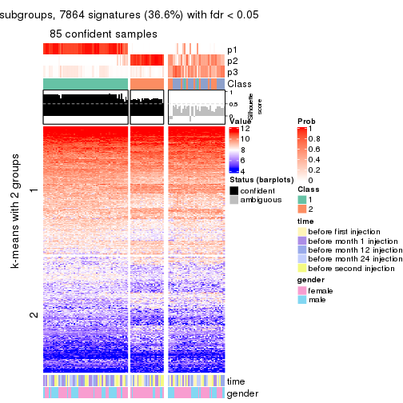</p>

</div>
<div id='tab-CV-kmeans-get-signatures-no-scale-3'>
<pre><code class="r">get_signatures(res, k = 4, scale_rows = FALSE)
</code></pre>

<p></p>

</div>
<div id='tab-CV-kmeans-get-signatures-no-scale-4'>
<pre><code class="r">get_signatures(res, k = 5, scale_rows = FALSE)
</code></pre>

<p></p>

</div>
<div id='tab-CV-kmeans-get-signatures-no-scale-5'>
<pre><code class="r">get_signatures(res, k = 6, scale_rows = FALSE)
</code></pre>

<p></p>

</div>
</div>


Compare the overlap of signatures from different k:

```r
compare_signatures(res)
```


`get_signature()` returns a data frame invisibly. TO get the list of signatures, the function
call should be assigned to a variable explicitly. In following code, if `plot` argument is set
to `FALSE`, no heatmap is plotted while only the differential analysis is performed.

```r
# code only for demonstration
tb = get_signature(res, k = ..., plot = FALSE)
```

An example of the output of `tb` is:

```
#>   which_row         fdr    mean_1    mean_2 scaled_mean_1 scaled_mean_2 km
#> 1        38 0.042760348  8.373488  9.131774    -0.5533452     0.5164555  1
#> 2        40 0.018707592  7.106213  8.469186    -0.6173731     0.5762149  1
#> 3        55 0.019134737 10.221463 11.207825    -0.6159697     0.5749050  1
#> 4        59 0.006059896  5.921854  7.869574    -0.6899429     0.6439467  1
#> 5        60 0.018055526  8.928898 10.211722    -0.6204761     0.5791110  1
#> 6        98 0.009384629 15.714769 14.887706     0.6635654    -0.6193277  2
...
```

The columns in `tb` are:

1. `which_row`: row indices corresponding to the input matrix.
2. `fdr`: FDR for the differential test. 
3. `mean_x`: The mean value in group x.
4. `scaled_mean_x`: The mean value in group x after rows are scaled.
5. `km`: Row groups if k-means clustering is applied to rows.


UMAP plot which shows how samples are separated.


<script>
$( function() {
	$( '#tabs-CV-kmeans-dimension-reduction' ).tabs();
} );
</script>
<div id='tabs-CV-kmeans-dimension-reduction'>
<ul>
<li><a href='#tab-CV-kmeans-dimension-reduction-1'>k = 2</a></li>
<li><a href='#tab-CV-kmeans-dimension-reduction-2'>k = 3</a></li>
<li><a href='#tab-CV-kmeans-dimension-reduction-3'>k = 4</a></li>
<li><a href='#tab-CV-kmeans-dimension-reduction-4'>k = 5</a></li>
<li><a href='#tab-CV-kmeans-dimension-reduction-5'>k = 6</a></li>
</ul>
<div id='tab-CV-kmeans-dimension-reduction-1'>
<pre><code class="r">dimension_reduction(res, k = 2, method = &quot;UMAP&quot;)
</code></pre>

<p></p>

</div>
<div id='tab-CV-kmeans-dimension-reduction-2'>
<pre><code class="r">dimension_reduction(res, k = 3, method = &quot;UMAP&quot;)
</code></pre>

<p></p>

</div>
<div id='tab-CV-kmeans-dimension-reduction-3'>
<pre><code class="r">dimension_reduction(res, k = 4, method = &quot;UMAP&quot;)
</code></pre>

<p></p>

</div>
<div id='tab-CV-kmeans-dimension-reduction-4'>
<pre><code class="r">dimension_reduction(res, k = 5, method = &quot;UMAP&quot;)
</code></pre>

<p></p>

</div>
<div id='tab-CV-kmeans-dimension-reduction-5'>
<pre><code class="r">dimension_reduction(res, k = 6, method = &quot;UMAP&quot;)
</code></pre>

<p></p>

</div>
</div>


Following heatmap shows how subgroups are split when increasing `k`:

```r
collect_classes(res)
```


Test correlation between subgroups and known annotations. If the known
annotation is numeric, one-way ANOVA test is applied, and if the known
annotation is discrete, chi-squared contingency table test is applied.

```r
test_to_known_factors(res)
```

```
#>             n time(p) gender(p) k
#> CV:kmeans 124   0.305    0.7666 2
#> CV:kmeans  85   0.425    0.1719 3
#> CV:kmeans 110   0.435    0.1252 4
#> CV:kmeans 101   0.615    0.1786 5
#> CV:kmeans 112   0.469    0.0374 6
```


If matrix rows can be associated to genes, consider to use `functional_enrichment(res,
...)` to perform function enrichment for the signature genes. See [this vignette](http://bioconductor.org/packages/devel/bioc/vignettes/cola/inst/doc/functional_enrichment.html) for more detailed explanations.


 

---------------------------------------------------


### CV:skmeans**


The object with results only for a single top-value method and a single partition method 
can be extracted as:

```r
res = res_list["CV", "skmeans"]
# you can also extract it by
# res = res_list["CV:skmeans"]
```

A summary of `res` and all the functions that can be applied to it:

```r
res
```

```
#> A 'ConsensusPartition' object with k = 2, 3, 4, 5, 6.
#>   On a matrix with 21512 rows and 125 columns.
#>   Top rows (1000, 2000, 3000, 4000, 5000) are extracted by 'CV' method.
#>   Subgroups are detected by 'skmeans' method.
#>   Performed in total 1250 partitions by row resampling.
#>   Best k for subgroups seems to be 2.
#> 
#> Following methods can be applied to this 'ConsensusPartition' object:
#>  [1] "cola_report"             "collect_classes"         "collect_plots"          
#>  [4] "collect_stats"           "colnames"                "compare_signatures"     
#>  [7] "consensus_heatmap"       "dimension_reduction"     "functional_enrichment"  
#> [10] "get_anno_col"            "get_anno"                "get_classes"            
#> [13] "get_consensus"           "get_matrix"              "get_membership"         
#> [16] "get_param"               "get_signatures"          "get_stats"              
#> [19] "is_best_k"               "is_stable_k"             "membership_heatmap"     
#> [22] "ncol"                    "nrow"                    "plot_ecdf"              
#> [25] "rownames"                "select_partition_number" "show"                   
#> [28] "suggest_best_k"          "test_to_known_factors"
```

`collect_plots()` function collects all the plots made from `res` for all `k` (number of partitions)
into one single page to provide an easy and fast comparison between different `k`.

```r
collect_plots(res)
```


The plots are:

- The first row: a plot of the ECDF (empirical cumulative distribution
  function) curves of the consensus matrix for each `k` and the heatmap of
  predicted classes for each `k`.
- The second row: heatmaps of the consensus matrix for each `k`.
- The third row: heatmaps of the membership matrix for each `k`.
- The fouth row: heatmaps of the signatures for each `k`.

All the plots in panels can be made by individual functions and they are
plotted later in this section.

`select_partition_number()` produces several plots showing different
statistics for choosing "optimized" `k`. There are following statistics:

- ECDF curves of the consensus matrix for each `k`;
- 1-PAC. [The PAC
  score](https://en.wikipedia.org/wiki/Consensus_clustering#Over-interpretation_potential_of_consensus_clustering)
  measures the proportion of the ambiguous subgrouping.
- Mean silhouette score.
- Concordance. The mean probability of fiting the consensus class ids in all
  partitions.
- Area increased. Denote $A_k$ as the area under the ECDF curve for current
  `k`, the area increased is defined as $A_k - A_{k-1}$.
- Rand index. The percent of pairs of samples that are both in a same cluster
  or both are not in a same cluster in the partition of k and k-1.
- Jaccard index. The ratio of pairs of samples are both in a same cluster in
  the partition of k and k-1 and the pairs of samples are both in a same
  cluster in the partition k or k-1.

The detailed explanations of these statistics can be found in [the _cola_
vignette](http://bioconductor.org/packages/devel/bioc/vignettes/cola/inst/doc/cola.html#toc_13).

Generally speaking, lower PAC score, higher mean silhouette score or higher
concordance corresponds to better partition. Rand index and Jaccard index
measure how similar the current partition is compared to partition with `k-1`.
If they are too similar, we won't accept `k` is better than `k-1`.

```r
select_partition_number(res)
```


The numeric values for all these statistics can be obtained by `get_stats()`.

```r
get_stats(res)
```

```
#>   k 1-PAC mean_silhouette concordance area_increased  Rand Jaccard
#> 2 2 0.999           0.957       0.981         0.5042 0.496   0.496
#> 3 3 0.409           0.523       0.696         0.2991 0.842   0.691
#> 4 4 0.404           0.410       0.639         0.1345 0.779   0.469
#> 5 5 0.405           0.358       0.571         0.0652 0.933   0.747
#> 6 6 0.450           0.289       0.496         0.0414 0.911   0.635
```

`suggest_best_k()` suggests the best $k$ based on these statistics. The rules are as follows:

- All $k$ with Jaccard index larger than 0.95 are removed because increasing
  $k$ does not provide enough extra information. If all $k$ are removed, it is
  marked as no subgroup is detected.
- For all $k$ with 1-PAC score larger than 0.9, the maximal $k$ is taken as
  the best $k$, and other $k$ are marked as optional $k$.
- If it does not fit the second rule. The $k$ with the maximal vote of the
  highest 1-PAC score, highest mean silhouette, and highest concordance is
  taken as the best $k$.

```r
suggest_best_k(res)
```

```
#> [1] 2
```


Following shows the table of the partitions (You need to click the **show/hide
code output** link to see it). The membership matrix (columns with name `p*`)
is inferred by
[`clue::cl_consensus()`](https://www.rdocumentation.org/link/cl_consensus?package=clue)
function with the `SE` method. Basically the value in the membership matrix
represents the probability to belong to a certain group. The finall class
label for an item is determined with the group with highest probability it
belongs to.

In `get_classes()` function, the entropy is calculated from the membership
matrix and the silhouette score is calculated from the consensus matrix.


<script>
$( function() {
	$( '#tabs-CV-skmeans-get-classes' ).tabs();
} );
</script>
<div id='tabs-CV-skmeans-get-classes'>
<ul>
<li><a href='#tab-CV-skmeans-get-classes-1'>k = 2</a></li>
<li><a href='#tab-CV-skmeans-get-classes-2'>k = 3</a></li>
<li><a href='#tab-CV-skmeans-get-classes-3'>k = 4</a></li>
<li><a href='#tab-CV-skmeans-get-classes-4'>k = 5</a></li>
<li><a href='#tab-CV-skmeans-get-classes-5'>k = 6</a></li>
</ul>

<div id='tab-CV-skmeans-get-classes-1'>
<p><a id='tab-CV-skmeans-get-classes-1-a' style='color:#0366d6' href='#'>show/hide code output</a></p>
<pre><code class="r">cbind(get_classes(res, k = 2), get_membership(res, k = 2))
</code></pre>

<pre><code>#&gt;           class entropy silhouette    p1    p2
#&gt; GSM601872     2  0.0672     0.9707 0.008 0.992
#&gt; GSM601882     2  0.0000     0.9759 0.000 1.000
#&gt; GSM601887     1  0.4022     0.9158 0.920 0.080
#&gt; GSM601892     1  0.0000     0.9855 1.000 0.000
#&gt; GSM601897     1  0.7745     0.7207 0.772 0.228
#&gt; GSM601902     2  0.0000     0.9759 0.000 1.000
#&gt; GSM601912     1  0.0000     0.9855 1.000 0.000
#&gt; GSM601927     1  0.0000     0.9855 1.000 0.000
#&gt; GSM601932     2  0.0000     0.9759 0.000 1.000
#&gt; GSM601937     2  0.0000     0.9759 0.000 1.000
#&gt; GSM601942     2  0.0000     0.9759 0.000 1.000
#&gt; GSM601947     2  0.0938     0.9679 0.012 0.988
#&gt; GSM601957     1  0.0000     0.9855 1.000 0.000
#&gt; GSM601972     2  0.0000     0.9759 0.000 1.000
#&gt; GSM601977     2  0.0000     0.9759 0.000 1.000
#&gt; GSM601987     2  0.0000     0.9759 0.000 1.000
#&gt; GSM601877     1  0.0000     0.9855 1.000 0.000
#&gt; GSM601907     2  0.0000     0.9759 0.000 1.000
#&gt; GSM601917     2  0.0672     0.9708 0.008 0.992
#&gt; GSM601922     2  0.4815     0.8825 0.104 0.896
#&gt; GSM601952     2  0.0000     0.9759 0.000 1.000
#&gt; GSM601962     1  0.0672     0.9801 0.992 0.008
#&gt; GSM601967     1  0.0000     0.9855 1.000 0.000
#&gt; GSM601982     2  0.4022     0.9073 0.080 0.920
#&gt; GSM601992     2  0.0000     0.9759 0.000 1.000
#&gt; GSM601873     2  0.0000     0.9759 0.000 1.000
#&gt; GSM601883     2  0.0000     0.9759 0.000 1.000
#&gt; GSM601888     1  0.2603     0.9514 0.956 0.044
#&gt; GSM601893     1  0.1184     0.9747 0.984 0.016
#&gt; GSM601898     1  0.0000     0.9855 1.000 0.000
#&gt; GSM601903     2  0.0000     0.9759 0.000 1.000
#&gt; GSM601913     1  0.0000     0.9855 1.000 0.000
#&gt; GSM601928     1  0.0000     0.9855 1.000 0.000
#&gt; GSM601933     2  0.0000     0.9759 0.000 1.000
#&gt; GSM601938     2  0.0000     0.9759 0.000 1.000
#&gt; GSM601943     2  0.0000     0.9759 0.000 1.000
#&gt; GSM601948     1  0.0000     0.9855 1.000 0.000
#&gt; GSM601958     1  0.0000     0.9855 1.000 0.000
#&gt; GSM601973     2  0.0000     0.9759 0.000 1.000
#&gt; GSM601978     2  0.0000     0.9759 0.000 1.000
#&gt; GSM601988     2  0.0000     0.9759 0.000 1.000
#&gt; GSM601878     1  0.0000     0.9855 1.000 0.000
#&gt; GSM601908     2  0.0000     0.9759 0.000 1.000
#&gt; GSM601918     2  0.0000     0.9759 0.000 1.000
#&gt; GSM601923     1  0.0000     0.9855 1.000 0.000
#&gt; GSM601953     2  0.0000     0.9759 0.000 1.000
#&gt; GSM601963     1  0.0000     0.9855 1.000 0.000
#&gt; GSM601968     1  0.0376     0.9829 0.996 0.004
#&gt; GSM601983     1  0.0000     0.9855 1.000 0.000
#&gt; GSM601993     2  0.0000     0.9759 0.000 1.000
#&gt; GSM601874     2  0.0000     0.9759 0.000 1.000
#&gt; GSM601884     2  0.0000     0.9759 0.000 1.000
#&gt; GSM601889     1  0.0000     0.9855 1.000 0.000
#&gt; GSM601894     1  0.0000     0.9855 1.000 0.000
#&gt; GSM601899     1  0.2236     0.9586 0.964 0.036
#&gt; GSM601904     2  0.1843     0.9554 0.028 0.972
#&gt; GSM601914     1  0.0000     0.9855 1.000 0.000
#&gt; GSM601929     1  0.0000     0.9855 1.000 0.000
#&gt; GSM601934     2  0.0376     0.9735 0.004 0.996
#&gt; GSM601939     1  0.0000     0.9855 1.000 0.000
#&gt; GSM601944     2  0.0000     0.9759 0.000 1.000
#&gt; GSM601949     1  0.0000     0.9855 1.000 0.000
#&gt; GSM601959     1  0.0000     0.9855 1.000 0.000
#&gt; GSM601974     2  0.7602     0.7310 0.220 0.780
#&gt; GSM601979     2  0.0000     0.9759 0.000 1.000
#&gt; GSM601989     1  0.0000     0.9855 1.000 0.000
#&gt; GSM601879     1  0.0000     0.9855 1.000 0.000
#&gt; GSM601909     1  0.0000     0.9855 1.000 0.000
#&gt; GSM601919     2  0.2423     0.9451 0.040 0.960
#&gt; GSM601924     1  0.0000     0.9855 1.000 0.000
#&gt; GSM601954     2  0.0000     0.9759 0.000 1.000
#&gt; GSM601964     1  0.0000     0.9855 1.000 0.000
#&gt; GSM601969     1  0.0000     0.9855 1.000 0.000
#&gt; GSM601984     1  0.0000     0.9855 1.000 0.000
#&gt; GSM601994     2  0.0000     0.9759 0.000 1.000
#&gt; GSM601875     2  0.0000     0.9759 0.000 1.000
#&gt; GSM601885     2  0.0000     0.9759 0.000 1.000
#&gt; GSM601890     1  0.0000     0.9855 1.000 0.000
#&gt; GSM601895     1  0.0376     0.9829 0.996 0.004
#&gt; GSM601900     1  0.3274     0.9360 0.940 0.060
#&gt; GSM601905     2  0.0938     0.9680 0.012 0.988
#&gt; GSM601915     1  0.0000     0.9855 1.000 0.000
#&gt; GSM601930     1  0.0000     0.9855 1.000 0.000
#&gt; GSM601935     2  0.9993     0.0796 0.484 0.516
#&gt; GSM601940     1  0.0000     0.9855 1.000 0.000
#&gt; GSM601945     2  0.0000     0.9759 0.000 1.000
#&gt; GSM601950     1  0.0000     0.9855 1.000 0.000
#&gt; GSM601960     1  0.0000     0.9855 1.000 0.000
#&gt; GSM601975     2  0.0000     0.9759 0.000 1.000
#&gt; GSM601980     2  0.0000     0.9759 0.000 1.000
#&gt; GSM601990     1  0.0000     0.9855 1.000 0.000
#&gt; GSM601880     1  0.0000     0.9855 1.000 0.000
#&gt; GSM601910     1  0.1184     0.9748 0.984 0.016
#&gt; GSM601920     2  0.0000     0.9759 0.000 1.000
#&gt; GSM601925     1  0.0000     0.9855 1.000 0.000
#&gt; GSM601955     2  0.0000     0.9759 0.000 1.000
#&gt; GSM601965     1  0.0000     0.9855 1.000 0.000
#&gt; GSM601970     1  0.0000     0.9855 1.000 0.000
#&gt; GSM601985     1  0.0000     0.9855 1.000 0.000
#&gt; GSM601995     2  0.0000     0.9759 0.000 1.000
#&gt; GSM601876     1  0.0000     0.9855 1.000 0.000
#&gt; GSM601886     2  0.4022     0.9075 0.080 0.920
#&gt; GSM601891     1  0.5294     0.8711 0.880 0.120
#&gt; GSM601896     1  0.0000     0.9855 1.000 0.000
#&gt; GSM601901     2  0.0000     0.9759 0.000 1.000
#&gt; GSM601906     1  0.7883     0.7028 0.764 0.236
#&gt; GSM601916     2  0.0000     0.9759 0.000 1.000
#&gt; GSM601931     1  0.0000     0.9855 1.000 0.000
#&gt; GSM601936     2  0.0376     0.9735 0.004 0.996
#&gt; GSM601941     2  0.0000     0.9759 0.000 1.000
#&gt; GSM601946     1  0.0000     0.9855 1.000 0.000
#&gt; GSM601951     1  0.0000     0.9855 1.000 0.000
#&gt; GSM601961     2  0.0376     0.9735 0.004 0.996
#&gt; GSM601976     2  0.0000     0.9759 0.000 1.000
#&gt; GSM601981     2  0.0000     0.9759 0.000 1.000
#&gt; GSM601991     1  0.1414     0.9718 0.980 0.020
#&gt; GSM601881     1  0.0000     0.9855 1.000 0.000
#&gt; GSM601911     2  0.9522     0.4128 0.372 0.628
#&gt; GSM601921     2  0.0000     0.9759 0.000 1.000
#&gt; GSM601926     1  0.0000     0.9855 1.000 0.000
#&gt; GSM601956     2  0.0000     0.9759 0.000 1.000
#&gt; GSM601966     2  0.0000     0.9759 0.000 1.000
#&gt; GSM601971     1  0.0000     0.9855 1.000 0.000
#&gt; GSM601986     1  0.1843     0.9648 0.972 0.028
#&gt; GSM601996     2  0.0000     0.9759 0.000 1.000
</code></pre>

<script>
$('#tab-CV-skmeans-get-classes-1-a').parent().next().next().hide();
$('#tab-CV-skmeans-get-classes-1-a').click(function(){
  $('#tab-CV-skmeans-get-classes-1-a').parent().next().next().toggle();
  return(false);
});
</script>
</div>

<div id='tab-CV-skmeans-get-classes-2'>
<p><a id='tab-CV-skmeans-get-classes-2-a' style='color:#0366d6' href='#'>show/hide code output</a></p>
<pre><code class="r">cbind(get_classes(res, k = 3), get_membership(res, k = 3))
</code></pre>

<pre><code>#&gt;           class entropy silhouette    p1    p2    p3
#&gt; GSM601872     3  0.6309    -0.6142 0.000 0.496 0.504
#&gt; GSM601882     2  0.4842     0.7976 0.000 0.776 0.224
#&gt; GSM601887     3  0.5159     0.4856 0.140 0.040 0.820
#&gt; GSM601892     3  0.6026     0.2799 0.376 0.000 0.624
#&gt; GSM601897     3  0.4914     0.4614 0.068 0.088 0.844
#&gt; GSM601902     2  0.2269     0.7771 0.040 0.944 0.016
#&gt; GSM601912     3  0.6773     0.3543 0.340 0.024 0.636
#&gt; GSM601927     1  0.0475     0.6318 0.992 0.004 0.004
#&gt; GSM601932     2  0.2269     0.7864 0.016 0.944 0.040
#&gt; GSM601937     2  0.5244     0.7546 0.004 0.756 0.240
#&gt; GSM601942     2  0.5397     0.7812 0.000 0.720 0.280
#&gt; GSM601947     2  0.7155     0.7398 0.128 0.720 0.152
#&gt; GSM601957     1  0.6286     0.1616 0.536 0.000 0.464
#&gt; GSM601972     2  0.2959     0.8010 0.000 0.900 0.100
#&gt; GSM601977     2  0.5325     0.7921 0.004 0.748 0.248
#&gt; GSM601987     2  0.5178     0.7809 0.000 0.744 0.256
#&gt; GSM601877     1  0.1015     0.6258 0.980 0.008 0.012
#&gt; GSM601907     2  0.5859     0.7341 0.000 0.656 0.344
#&gt; GSM601917     2  0.6820     0.5930 0.248 0.700 0.052
#&gt; GSM601922     2  0.7013     0.4320 0.364 0.608 0.028
#&gt; GSM601952     2  0.4805     0.8061 0.012 0.812 0.176
#&gt; GSM601962     3  0.7905     0.1279 0.444 0.056 0.500
#&gt; GSM601967     1  0.6307     0.0933 0.512 0.000 0.488
#&gt; GSM601982     2  0.7379     0.7189 0.048 0.616 0.336
#&gt; GSM601992     2  0.1643     0.7911 0.000 0.956 0.044
#&gt; GSM601873     2  0.5497     0.7771 0.000 0.708 0.292
#&gt; GSM601883     2  0.4978     0.7950 0.004 0.780 0.216
#&gt; GSM601888     3  0.5042     0.4574 0.104 0.060 0.836
#&gt; GSM601893     3  0.4937     0.4928 0.148 0.028 0.824
#&gt; GSM601898     1  0.6286     0.1525 0.536 0.000 0.464
#&gt; GSM601903     2  0.3028     0.7749 0.048 0.920 0.032
#&gt; GSM601913     1  0.6345     0.2732 0.596 0.004 0.400
#&gt; GSM601928     1  0.0747     0.6365 0.984 0.000 0.016
#&gt; GSM601933     2  0.4291     0.8013 0.000 0.820 0.180
#&gt; GSM601938     2  0.3619     0.8043 0.000 0.864 0.136
#&gt; GSM601943     2  0.6126     0.7191 0.000 0.600 0.400
#&gt; GSM601948     1  0.5731     0.5236 0.752 0.020 0.228
#&gt; GSM601958     1  0.6154     0.2898 0.592 0.000 0.408
#&gt; GSM601973     2  0.2527     0.7814 0.020 0.936 0.044
#&gt; GSM601978     2  0.5760     0.7425 0.000 0.672 0.328
#&gt; GSM601988     2  0.4235     0.7718 0.000 0.824 0.176
#&gt; GSM601878     1  0.0237     0.6307 0.996 0.000 0.004
#&gt; GSM601908     2  0.5254     0.7825 0.000 0.736 0.264
#&gt; GSM601918     2  0.3669     0.7914 0.040 0.896 0.064
#&gt; GSM601923     1  0.0000     0.6313 1.000 0.000 0.000
#&gt; GSM601953     2  0.6008     0.7195 0.000 0.628 0.372
#&gt; GSM601963     1  0.6516     0.0644 0.516 0.004 0.480
#&gt; GSM601968     3  0.6702     0.3656 0.328 0.024 0.648
#&gt; GSM601983     3  0.6442     0.1857 0.432 0.004 0.564
#&gt; GSM601993     2  0.2165     0.7799 0.000 0.936 0.064
#&gt; GSM601874     2  0.5706     0.7509 0.000 0.680 0.320
#&gt; GSM601884     2  0.5621     0.7685 0.000 0.692 0.308
#&gt; GSM601889     1  0.6299     0.1267 0.524 0.000 0.476
#&gt; GSM601894     3  0.6659     0.0704 0.460 0.008 0.532
#&gt; GSM601899     3  0.4475     0.4906 0.144 0.016 0.840
#&gt; GSM601904     2  0.7526     0.2908 0.424 0.536 0.040
#&gt; GSM601914     3  0.6295     0.0355 0.472 0.000 0.528
#&gt; GSM601929     1  0.2187     0.6205 0.948 0.028 0.024
#&gt; GSM601934     2  0.6180     0.7616 0.008 0.660 0.332
#&gt; GSM601939     1  0.4291     0.5931 0.820 0.000 0.180
#&gt; GSM601944     2  0.4002     0.8029 0.000 0.840 0.160
#&gt; GSM601949     1  0.4654     0.5658 0.792 0.000 0.208
#&gt; GSM601959     1  0.6654     0.1845 0.536 0.008 0.456
#&gt; GSM601974     3  0.9842     0.0590 0.248 0.368 0.384
#&gt; GSM601979     2  0.5706     0.7469 0.000 0.680 0.320
#&gt; GSM601989     1  0.6204     0.2620 0.576 0.000 0.424
#&gt; GSM601879     1  0.0747     0.6313 0.984 0.000 0.016
#&gt; GSM601909     3  0.6298     0.2408 0.388 0.004 0.608
#&gt; GSM601919     2  0.8770     0.5607 0.272 0.572 0.156
#&gt; GSM601924     1  0.1964     0.6364 0.944 0.000 0.056
#&gt; GSM601954     2  0.7021     0.7699 0.076 0.708 0.216
#&gt; GSM601964     1  0.6509     0.0718 0.524 0.004 0.472
#&gt; GSM601969     1  0.6822     0.0417 0.508 0.012 0.480
#&gt; GSM601984     1  0.4591     0.6088 0.848 0.032 0.120
#&gt; GSM601994     2  0.1878     0.7902 0.004 0.952 0.044
#&gt; GSM601875     2  0.5621     0.7563 0.000 0.692 0.308
#&gt; GSM601885     2  0.5244     0.7912 0.004 0.756 0.240
#&gt; GSM601890     3  0.4353     0.4919 0.156 0.008 0.836
#&gt; GSM601895     3  0.7262     0.1270 0.444 0.028 0.528
#&gt; GSM601900     3  0.7968     0.3172 0.372 0.068 0.560
#&gt; GSM601905     2  0.6226     0.5899 0.252 0.720 0.028
#&gt; GSM601915     1  0.6274     0.1560 0.544 0.000 0.456
#&gt; GSM601930     1  0.0892     0.6356 0.980 0.000 0.020
#&gt; GSM601935     2  0.9920    -0.1921 0.272 0.364 0.364
#&gt; GSM601940     1  0.4974     0.5506 0.764 0.000 0.236
#&gt; GSM601945     2  0.5291     0.7803 0.000 0.732 0.268
#&gt; GSM601950     1  0.5291     0.5171 0.732 0.000 0.268
#&gt; GSM601960     3  0.6489     0.0792 0.456 0.004 0.540
#&gt; GSM601975     2  0.2434     0.7892 0.024 0.940 0.036
#&gt; GSM601980     2  0.5325     0.7512 0.004 0.748 0.248
#&gt; GSM601990     3  0.6516     0.0051 0.480 0.004 0.516
#&gt; GSM601880     1  0.0848     0.6271 0.984 0.008 0.008
#&gt; GSM601910     3  0.6255     0.4104 0.300 0.016 0.684
#&gt; GSM601920     2  0.7189     0.5304 0.292 0.656 0.052
#&gt; GSM601925     1  0.0237     0.6324 0.996 0.000 0.004
#&gt; GSM601955     2  0.6180     0.5824 0.000 0.584 0.416
#&gt; GSM601965     1  0.6496     0.5288 0.736 0.056 0.208
#&gt; GSM601970     1  0.6308     0.0926 0.508 0.000 0.492
#&gt; GSM601985     1  0.4974     0.5385 0.764 0.000 0.236
#&gt; GSM601995     2  0.5098     0.7305 0.000 0.752 0.248
#&gt; GSM601876     1  0.4399     0.5875 0.812 0.000 0.188
#&gt; GSM601886     2  0.8566     0.5140 0.188 0.608 0.204
#&gt; GSM601891     3  0.5428     0.4739 0.120 0.064 0.816
#&gt; GSM601896     1  0.4178     0.6034 0.828 0.000 0.172
#&gt; GSM601901     2  0.4291     0.8020 0.000 0.820 0.180
#&gt; GSM601906     1  0.7265     0.2490 0.684 0.240 0.076
#&gt; GSM601916     2  0.5285     0.7115 0.148 0.812 0.040
#&gt; GSM601931     1  0.0747     0.6349 0.984 0.000 0.016
#&gt; GSM601936     2  0.5631     0.7583 0.044 0.792 0.164
#&gt; GSM601941     2  0.1877     0.7755 0.012 0.956 0.032
#&gt; GSM601946     1  0.2878     0.6284 0.904 0.000 0.096
#&gt; GSM601951     1  0.1877     0.6308 0.956 0.012 0.032
#&gt; GSM601961     3  0.7397    -0.5385 0.032 0.484 0.484
#&gt; GSM601976     2  0.5780     0.7638 0.080 0.800 0.120
#&gt; GSM601981     2  0.5178     0.7823 0.000 0.744 0.256
#&gt; GSM601991     3  0.7285     0.3674 0.320 0.048 0.632
#&gt; GSM601881     1  0.0475     0.6291 0.992 0.004 0.004
#&gt; GSM601911     1  0.9638    -0.1453 0.420 0.372 0.208
#&gt; GSM601921     2  0.4868     0.7459 0.100 0.844 0.056
#&gt; GSM601926     1  0.0747     0.6348 0.984 0.000 0.016
#&gt; GSM601956     2  0.6045     0.7224 0.000 0.620 0.380
#&gt; GSM601966     2  0.1964     0.7967 0.000 0.944 0.056
#&gt; GSM601971     1  0.5905     0.3923 0.648 0.000 0.352
#&gt; GSM601986     1  0.7984     0.2978 0.652 0.132 0.216
#&gt; GSM601996     2  0.1585     0.7894 0.008 0.964 0.028
</code></pre>

<script>
$('#tab-CV-skmeans-get-classes-2-a').parent().next().next().hide();
$('#tab-CV-skmeans-get-classes-2-a').click(function(){
  $('#tab-CV-skmeans-get-classes-2-a').parent().next().next().toggle();
  return(false);
});
</script>
</div>

<div id='tab-CV-skmeans-get-classes-3'>
<p><a id='tab-CV-skmeans-get-classes-3-a' style='color:#0366d6' href='#'>show/hide code output</a></p>
<pre><code class="r">cbind(get_classes(res, k = 4), get_membership(res, k = 4))
</code></pre>

<pre><code>#&gt;           class entropy silhouette    p1    p2    p3    p4
#&gt; GSM601872     2   0.525     0.4618 0.000 0.752 0.148 0.100
#&gt; GSM601882     2   0.586     0.4189 0.012 0.652 0.036 0.300
#&gt; GSM601887     3   0.728     0.4686 0.092 0.284 0.588 0.036
#&gt; GSM601892     3   0.636     0.5552 0.180 0.108 0.692 0.020
#&gt; GSM601897     3   0.794     0.3729 0.040 0.216 0.556 0.188
#&gt; GSM601902     4   0.592     0.2497 0.008 0.380 0.028 0.584
#&gt; GSM601912     3   0.784     0.4879 0.244 0.080 0.580 0.096
#&gt; GSM601927     1   0.194     0.6996 0.940 0.000 0.032 0.028
#&gt; GSM601932     4   0.620     0.2425 0.020 0.396 0.024 0.560
#&gt; GSM601937     4   0.684     0.3170 0.004 0.308 0.112 0.576
#&gt; GSM601942     2   0.652     0.2797 0.000 0.584 0.096 0.320
#&gt; GSM601947     2   0.758     0.0721 0.088 0.488 0.036 0.388
#&gt; GSM601957     3   0.531     0.4166 0.392 0.004 0.596 0.008
#&gt; GSM601972     2   0.544     0.1295 0.004 0.532 0.008 0.456
#&gt; GSM601977     2   0.581     0.4462 0.004 0.644 0.044 0.308
#&gt; GSM601987     2   0.397     0.5414 0.000 0.788 0.008 0.204
#&gt; GSM601877     1   0.172     0.6996 0.948 0.000 0.020 0.032
#&gt; GSM601907     2   0.234     0.5715 0.000 0.920 0.020 0.060
#&gt; GSM601917     4   0.808     0.3518 0.200 0.224 0.040 0.536
#&gt; GSM601922     4   0.844     0.3300 0.216 0.232 0.052 0.500
#&gt; GSM601952     2   0.712     0.1877 0.024 0.516 0.072 0.388
#&gt; GSM601962     3   0.869     0.3129 0.268 0.052 0.448 0.232
#&gt; GSM601967     3   0.608     0.4457 0.360 0.028 0.596 0.016
#&gt; GSM601982     2   0.720     0.4406 0.036 0.636 0.144 0.184
#&gt; GSM601992     4   0.615     0.0666 0.000 0.460 0.048 0.492
#&gt; GSM601873     2   0.536     0.5111 0.000 0.700 0.048 0.252
#&gt; GSM601883     2   0.451     0.5207 0.000 0.756 0.020 0.224
#&gt; GSM601888     3   0.702     0.3262 0.060 0.384 0.528 0.028
#&gt; GSM601893     3   0.736     0.4987 0.140 0.232 0.600 0.028
#&gt; GSM601898     3   0.571     0.4361 0.384 0.000 0.584 0.032
#&gt; GSM601903     4   0.610     0.3769 0.036 0.304 0.020 0.640
#&gt; GSM601913     1   0.684    -0.3041 0.452 0.000 0.448 0.100
#&gt; GSM601928     1   0.218     0.6957 0.924 0.000 0.064 0.012
#&gt; GSM601933     2   0.515     0.4084 0.000 0.648 0.016 0.336
#&gt; GSM601938     2   0.584     0.2160 0.000 0.564 0.036 0.400
#&gt; GSM601943     2   0.560     0.4484 0.000 0.724 0.116 0.160
#&gt; GSM601948     1   0.727     0.2192 0.540 0.020 0.340 0.100
#&gt; GSM601958     3   0.499     0.3059 0.468 0.000 0.532 0.000
#&gt; GSM601973     4   0.610     0.3344 0.020 0.340 0.028 0.612
#&gt; GSM601978     2   0.213     0.5638 0.000 0.932 0.036 0.032
#&gt; GSM601988     4   0.705     0.3577 0.012 0.300 0.112 0.576
#&gt; GSM601878     1   0.151     0.6984 0.956 0.000 0.028 0.016
#&gt; GSM601908     2   0.406     0.5654 0.000 0.812 0.028 0.160
#&gt; GSM601918     2   0.651     0.0467 0.040 0.492 0.016 0.452
#&gt; GSM601923     1   0.173     0.6983 0.948 0.000 0.028 0.024
#&gt; GSM601953     2   0.329     0.5391 0.000 0.876 0.080 0.044
#&gt; GSM601963     3   0.655     0.4604 0.340 0.004 0.576 0.080
#&gt; GSM601968     3   0.598     0.5811 0.176 0.048 0.728 0.048
#&gt; GSM601983     3   0.728     0.5123 0.276 0.024 0.584 0.116
#&gt; GSM601993     4   0.551     0.3534 0.000 0.300 0.040 0.660
#&gt; GSM601874     2   0.338     0.5746 0.000 0.872 0.052 0.076
#&gt; GSM601884     2   0.468     0.5564 0.000 0.772 0.044 0.184
#&gt; GSM601889     3   0.575     0.3953 0.428 0.008 0.548 0.016
#&gt; GSM601894     3   0.641     0.4967 0.348 0.028 0.592 0.032
#&gt; GSM601899     3   0.668     0.5017 0.068 0.244 0.652 0.036
#&gt; GSM601904     4   0.711     0.3389 0.312 0.096 0.020 0.572
#&gt; GSM601914     3   0.645     0.5382 0.260 0.008 0.640 0.092
#&gt; GSM601929     1   0.499     0.6453 0.796 0.024 0.124 0.056
#&gt; GSM601934     2   0.641     0.4574 0.024 0.664 0.068 0.244
#&gt; GSM601939     1   0.442     0.5027 0.748 0.000 0.240 0.012
#&gt; GSM601944     2   0.586     0.0475 0.000 0.500 0.032 0.468
#&gt; GSM601949     1   0.587     0.2874 0.600 0.008 0.364 0.028
#&gt; GSM601959     3   0.602     0.4920 0.344 0.028 0.612 0.016
#&gt; GSM601974     4   0.935     0.2231 0.120 0.184 0.308 0.388
#&gt; GSM601979     2   0.273     0.5737 0.000 0.896 0.016 0.088
#&gt; GSM601989     3   0.626     0.4686 0.372 0.012 0.576 0.040
#&gt; GSM601879     1   0.241     0.6896 0.920 0.000 0.040 0.040
#&gt; GSM601909     3   0.596     0.5803 0.208 0.036 0.712 0.044
#&gt; GSM601919     2   0.860    -0.1571 0.228 0.368 0.036 0.368
#&gt; GSM601924     1   0.280     0.6848 0.888 0.000 0.100 0.012
#&gt; GSM601954     2   0.789     0.3163 0.084 0.568 0.088 0.260
#&gt; GSM601964     3   0.657     0.4483 0.344 0.004 0.572 0.080
#&gt; GSM601969     3   0.746     0.4362 0.320 0.052 0.556 0.072
#&gt; GSM601984     1   0.629     0.4567 0.648 0.004 0.256 0.092
#&gt; GSM601994     4   0.548     0.1047 0.000 0.448 0.016 0.536
#&gt; GSM601875     2   0.402     0.5659 0.000 0.836 0.068 0.096
#&gt; GSM601885     2   0.517     0.5195 0.000 0.712 0.040 0.248
#&gt; GSM601890     3   0.605     0.5269 0.048 0.176 0.724 0.052
#&gt; GSM601895     3   0.729     0.5042 0.316 0.032 0.564 0.088
#&gt; GSM601900     3   0.854     0.4221 0.284 0.064 0.484 0.168
#&gt; GSM601905     4   0.809     0.3516 0.172 0.264 0.040 0.524
#&gt; GSM601915     3   0.595     0.3839 0.416 0.000 0.544 0.040
#&gt; GSM601930     1   0.264     0.6990 0.904 0.000 0.076 0.020
#&gt; GSM601935     4   0.854     0.1399 0.112 0.096 0.308 0.484
#&gt; GSM601940     1   0.488     0.4302 0.696 0.000 0.288 0.016
#&gt; GSM601945     2   0.444     0.5359 0.000 0.764 0.020 0.216
#&gt; GSM601950     1   0.599     0.2627 0.600 0.016 0.360 0.024
#&gt; GSM601960     3   0.637     0.5492 0.240 0.008 0.656 0.096
#&gt; GSM601975     4   0.642     0.1346 0.032 0.420 0.020 0.528
#&gt; GSM601980     4   0.720     0.2227 0.004 0.364 0.128 0.504
#&gt; GSM601990     3   0.692     0.4595 0.316 0.004 0.564 0.116
#&gt; GSM601880     1   0.232     0.6931 0.924 0.000 0.036 0.040
#&gt; GSM601910     3   0.733     0.5460 0.140 0.088 0.656 0.116
#&gt; GSM601920     4   0.804     0.3395 0.244 0.200 0.032 0.524
#&gt; GSM601925     1   0.232     0.6932 0.924 0.000 0.040 0.036
#&gt; GSM601955     4   0.766     0.1824 0.000 0.332 0.224 0.444
#&gt; GSM601965     1   0.851     0.2194 0.512 0.080 0.256 0.152
#&gt; GSM601970     3   0.565     0.4984 0.344 0.000 0.620 0.036
#&gt; GSM601985     1   0.543     0.3347 0.664 0.000 0.300 0.036
#&gt; GSM601995     4   0.680     0.3592 0.000 0.224 0.172 0.604
#&gt; GSM601876     1   0.547     0.4086 0.668 0.000 0.292 0.040
#&gt; GSM601886     4   0.788     0.3884 0.120 0.148 0.120 0.612
#&gt; GSM601891     3   0.781     0.3887 0.060 0.320 0.532 0.088
#&gt; GSM601896     1   0.475     0.5094 0.716 0.000 0.268 0.016
#&gt; GSM601901     2   0.573     0.4647 0.012 0.664 0.032 0.292
#&gt; GSM601906     1   0.767     0.2849 0.552 0.068 0.072 0.308
#&gt; GSM601916     4   0.714     0.4029 0.100 0.256 0.032 0.612
#&gt; GSM601931     1   0.155     0.6978 0.952 0.000 0.040 0.008
#&gt; GSM601936     4   0.656     0.3860 0.016 0.260 0.084 0.640
#&gt; GSM601941     4   0.538     0.3479 0.008 0.320 0.016 0.656
#&gt; GSM601946     1   0.384     0.6051 0.816 0.000 0.168 0.016
#&gt; GSM601951     1   0.456     0.6426 0.796 0.000 0.140 0.064
#&gt; GSM601961     2   0.557     0.4308 0.004 0.732 0.172 0.092
#&gt; GSM601976     4   0.755     0.2937 0.092 0.328 0.040 0.540
#&gt; GSM601981     2   0.469     0.5496 0.000 0.756 0.032 0.212
#&gt; GSM601991     3   0.773     0.4545 0.176 0.024 0.548 0.252
#&gt; GSM601881     1   0.163     0.6977 0.952 0.000 0.024 0.024
#&gt; GSM601911     2   0.954    -0.1554 0.312 0.332 0.116 0.240
#&gt; GSM601921     4   0.684     0.3890 0.096 0.260 0.020 0.624
#&gt; GSM601926     1   0.209     0.6997 0.932 0.000 0.048 0.020
#&gt; GSM601956     2   0.435     0.5496 0.000 0.816 0.080 0.104
#&gt; GSM601966     2   0.575     0.1534 0.000 0.532 0.028 0.440
#&gt; GSM601971     3   0.586     0.2449 0.476 0.000 0.492 0.032
#&gt; GSM601986     1   0.945     0.0625 0.420 0.152 0.204 0.224
#&gt; GSM601996     4   0.533     0.1869 0.000 0.420 0.012 0.568
</code></pre>

<script>
$('#tab-CV-skmeans-get-classes-3-a').parent().next().next().hide();
$('#tab-CV-skmeans-get-classes-3-a').click(function(){
  $('#tab-CV-skmeans-get-classes-3-a').parent().next().next().toggle();
  return(false);
});
</script>
</div>

<div id='tab-CV-skmeans-get-classes-4'>
<p><a id='tab-CV-skmeans-get-classes-4-a' style='color:#0366d6' href='#'>show/hide code output</a></p>
<pre><code class="r">cbind(get_classes(res, k = 5), get_membership(res, k = 5))
</code></pre>

<pre><code>#&gt;           class entropy silhouette    p1    p2    p3    p4    p5
#&gt; GSM601872     2   0.613    0.47121 0.000 0.664 0.136 0.060 0.140
#&gt; GSM601882     2   0.657    0.31203 0.000 0.528 0.028 0.324 0.120
#&gt; GSM601887     3   0.765    0.37930 0.096 0.216 0.544 0.024 0.120
#&gt; GSM601892     3   0.599    0.50587 0.160 0.064 0.676 0.000 0.100
#&gt; GSM601897     3   0.845   -0.12857 0.032 0.140 0.376 0.108 0.344
#&gt; GSM601902     4   0.559    0.40221 0.012 0.248 0.004 0.656 0.080
#&gt; GSM601912     3   0.876    0.35216 0.200 0.108 0.388 0.040 0.264
#&gt; GSM601927     1   0.260    0.65857 0.904 0.000 0.040 0.020 0.036
#&gt; GSM601932     4   0.667    0.36688 0.012 0.244 0.012 0.564 0.168
#&gt; GSM601937     5   0.754    0.19870 0.000 0.228 0.056 0.272 0.444
#&gt; GSM601942     2   0.730    0.23930 0.000 0.460 0.040 0.220 0.280
#&gt; GSM601947     4   0.779    0.18369 0.052 0.360 0.036 0.436 0.116
#&gt; GSM601957     3   0.481    0.40200 0.296 0.000 0.664 0.004 0.036
#&gt; GSM601972     2   0.638    0.07708 0.004 0.468 0.008 0.408 0.112
#&gt; GSM601977     2   0.643    0.46767 0.004 0.592 0.016 0.204 0.184
#&gt; GSM601987     2   0.500    0.53252 0.000 0.732 0.012 0.148 0.108
#&gt; GSM601877     1   0.286    0.65140 0.892 0.000 0.040 0.036 0.032
#&gt; GSM601907     2   0.335    0.56280 0.000 0.864 0.036 0.068 0.032
#&gt; GSM601917     4   0.757    0.30620 0.156 0.100 0.036 0.580 0.128
#&gt; GSM601922     4   0.839    0.26678 0.224 0.136 0.020 0.444 0.176
#&gt; GSM601952     2   0.731    0.28763 0.012 0.492 0.028 0.268 0.200
#&gt; GSM601962     5   0.884   -0.12855 0.212 0.052 0.288 0.088 0.360
#&gt; GSM601967     3   0.595    0.39059 0.304 0.016 0.608 0.016 0.056
#&gt; GSM601982     2   0.807    0.32580 0.044 0.512 0.084 0.216 0.144
#&gt; GSM601992     2   0.654    0.00217 0.000 0.408 0.000 0.396 0.196
#&gt; GSM601873     2   0.665    0.46172 0.000 0.584 0.040 0.196 0.180
#&gt; GSM601883     2   0.543    0.45761 0.000 0.636 0.004 0.276 0.084
#&gt; GSM601888     3   0.726    0.16532 0.040 0.380 0.456 0.020 0.104
#&gt; GSM601893     3   0.819    0.33925 0.124 0.248 0.464 0.020 0.144
#&gt; GSM601898     3   0.552    0.43381 0.292 0.000 0.624 0.008 0.076
#&gt; GSM601903     4   0.546    0.44983 0.020 0.172 0.000 0.696 0.112
#&gt; GSM601913     1   0.688   -0.16741 0.424 0.008 0.404 0.012 0.152
#&gt; GSM601928     1   0.294    0.65303 0.884 0.000 0.060 0.016 0.040
#&gt; GSM601933     2   0.618    0.45143 0.000 0.596 0.012 0.228 0.164
#&gt; GSM601938     2   0.600    0.29797 0.000 0.560 0.004 0.316 0.120
#&gt; GSM601943     2   0.587    0.48576 0.000 0.644 0.016 0.136 0.204
#&gt; GSM601948     1   0.831    0.06820 0.412 0.036 0.332 0.112 0.108
#&gt; GSM601958     3   0.572    0.23279 0.408 0.000 0.520 0.008 0.064
#&gt; GSM601973     4   0.600    0.41740 0.008 0.196 0.016 0.652 0.128
#&gt; GSM601978     2   0.262    0.57340 0.000 0.900 0.012 0.048 0.040
#&gt; GSM601988     5   0.761    0.01233 0.008 0.200 0.040 0.372 0.380
#&gt; GSM601878     1   0.181    0.65381 0.936 0.000 0.040 0.004 0.020
#&gt; GSM601908     2   0.482    0.54995 0.000 0.728 0.008 0.192 0.072
#&gt; GSM601918     4   0.651    0.16598 0.044 0.384 0.004 0.504 0.064
#&gt; GSM601923     1   0.285    0.65459 0.888 0.000 0.052 0.012 0.048
#&gt; GSM601953     2   0.454    0.54099 0.004 0.800 0.052 0.084 0.060
#&gt; GSM601963     3   0.701    0.38267 0.288 0.008 0.444 0.004 0.256
#&gt; GSM601968     3   0.651    0.52212 0.132 0.056 0.668 0.028 0.116
#&gt; GSM601983     3   0.734    0.41907 0.184 0.016 0.476 0.024 0.300
#&gt; GSM601993     4   0.694    0.23010 0.004 0.252 0.008 0.468 0.268
#&gt; GSM601874     2   0.476    0.56324 0.000 0.768 0.032 0.128 0.072
#&gt; GSM601884     2   0.582    0.51326 0.000 0.648 0.016 0.208 0.128
#&gt; GSM601889     3   0.622    0.29560 0.392 0.020 0.516 0.008 0.064
#&gt; GSM601894     3   0.652    0.47473 0.244 0.020 0.588 0.008 0.140
#&gt; GSM601899     3   0.745    0.31491 0.052 0.248 0.540 0.028 0.132
#&gt; GSM601904     4   0.780    0.14251 0.236 0.056 0.032 0.508 0.168
#&gt; GSM601914     3   0.641    0.45632 0.232 0.000 0.552 0.008 0.208
#&gt; GSM601929     1   0.616    0.54523 0.688 0.008 0.092 0.112 0.100
#&gt; GSM601934     2   0.663    0.45687 0.004 0.604 0.040 0.172 0.180
#&gt; GSM601939     1   0.446    0.52254 0.740 0.000 0.208 0.004 0.048
#&gt; GSM601944     2   0.710    0.12870 0.000 0.444 0.024 0.320 0.212
#&gt; GSM601949     1   0.661    0.16674 0.512 0.012 0.372 0.032 0.072
#&gt; GSM601959     3   0.613    0.43628 0.264 0.020 0.624 0.016 0.076
#&gt; GSM601974     5   0.934    0.22190 0.092 0.108 0.200 0.280 0.320
#&gt; GSM601979     2   0.262    0.57252 0.000 0.900 0.012 0.052 0.036
#&gt; GSM601989     3   0.616    0.41192 0.300 0.008 0.584 0.012 0.096
#&gt; GSM601879     1   0.386    0.64485 0.844 0.008 0.068 0.032 0.048
#&gt; GSM601909     3   0.682    0.51330 0.176 0.032 0.604 0.020 0.168
#&gt; GSM601919     4   0.850    0.25710 0.164 0.292 0.028 0.404 0.112
#&gt; GSM601924     1   0.383    0.63919 0.816 0.000 0.124 0.008 0.052
#&gt; GSM601954     2   0.821    0.16487 0.032 0.460 0.108 0.276 0.124
#&gt; GSM601964     3   0.721    0.35790 0.292 0.008 0.436 0.012 0.252
#&gt; GSM601969     3   0.761    0.38709 0.268 0.052 0.520 0.036 0.124
#&gt; GSM601984     1   0.791    0.29525 0.524 0.028 0.160 0.096 0.192
#&gt; GSM601994     4   0.686    0.01755 0.004 0.392 0.008 0.412 0.184
#&gt; GSM601875     2   0.438    0.56021 0.000 0.800 0.044 0.104 0.052
#&gt; GSM601885     2   0.651    0.44063 0.008 0.584 0.024 0.264 0.120
#&gt; GSM601890     3   0.677    0.38955 0.044 0.156 0.624 0.020 0.156
#&gt; GSM601895     3   0.758    0.43398 0.248 0.028 0.512 0.040 0.172
#&gt; GSM601900     3   0.824    0.42180 0.224 0.052 0.464 0.052 0.208
#&gt; GSM601905     4   0.779    0.36207 0.124 0.144 0.036 0.560 0.136
#&gt; GSM601915     3   0.602    0.27360 0.364 0.000 0.512 0.000 0.124
#&gt; GSM601930     1   0.331    0.64486 0.848 0.000 0.116 0.012 0.024
#&gt; GSM601935     5   0.823    0.37911 0.064 0.068 0.188 0.176 0.504
#&gt; GSM601940     1   0.625    0.36163 0.592 0.004 0.268 0.016 0.120
#&gt; GSM601945     2   0.564    0.52297 0.000 0.664 0.012 0.196 0.128
#&gt; GSM601950     1   0.605    0.23114 0.548 0.028 0.372 0.008 0.044
#&gt; GSM601960     3   0.648    0.46066 0.208 0.000 0.540 0.008 0.244
#&gt; GSM601975     4   0.647    0.37275 0.024 0.260 0.012 0.596 0.108
#&gt; GSM601980     4   0.772   -0.14599 0.000 0.232 0.060 0.360 0.348
#&gt; GSM601990     3   0.672    0.41122 0.208 0.000 0.476 0.008 0.308
#&gt; GSM601880     1   0.286    0.65832 0.892 0.000 0.040 0.032 0.036
#&gt; GSM601910     3   0.844    0.35154 0.116 0.100 0.476 0.068 0.240
#&gt; GSM601920     4   0.869    0.23415 0.188 0.132 0.048 0.448 0.184
#&gt; GSM601925     1   0.265    0.65261 0.900 0.000 0.036 0.016 0.048
#&gt; GSM601955     5   0.821    0.27022 0.004 0.196 0.128 0.264 0.408
#&gt; GSM601965     1   0.873    0.16540 0.440 0.064 0.196 0.096 0.204
#&gt; GSM601970     3   0.503    0.46873 0.260 0.000 0.668 0.000 0.072
#&gt; GSM601985     1   0.570    0.31259 0.596 0.000 0.304 0.004 0.096
#&gt; GSM601995     5   0.741    0.24275 0.004 0.120 0.076 0.328 0.472
#&gt; GSM601876     1   0.642    0.45137 0.616 0.008 0.220 0.028 0.128
#&gt; GSM601886     5   0.883    0.17099 0.112 0.124 0.068 0.344 0.352
#&gt; GSM601891     3   0.771    0.13337 0.024 0.324 0.456 0.048 0.148
#&gt; GSM601896     1   0.620    0.33797 0.560 0.000 0.292 0.008 0.140
#&gt; GSM601901     2   0.620    0.44329 0.008 0.620 0.012 0.216 0.144
#&gt; GSM601906     1   0.824    0.30285 0.488 0.040 0.092 0.212 0.168
#&gt; GSM601916     4   0.704    0.36693 0.108 0.148 0.016 0.616 0.112
#&gt; GSM601931     1   0.295    0.65302 0.876 0.000 0.068 0.004 0.052
#&gt; GSM601936     5   0.776    0.03719 0.040 0.164 0.024 0.368 0.404
#&gt; GSM601941     4   0.520    0.41641 0.000 0.180 0.012 0.708 0.100
#&gt; GSM601946     1   0.466    0.58621 0.752 0.000 0.168 0.012 0.068
#&gt; GSM601951     1   0.685    0.49735 0.608 0.004 0.180 0.092 0.116
#&gt; GSM601961     2   0.715    0.34695 0.020 0.604 0.172 0.108 0.096
#&gt; GSM601976     4   0.805    0.33892 0.064 0.236 0.048 0.500 0.152
#&gt; GSM601981     2   0.563    0.51607 0.000 0.660 0.016 0.224 0.100
#&gt; GSM601991     5   0.821   -0.19424 0.136 0.056 0.364 0.052 0.392
#&gt; GSM601881     1   0.176    0.65583 0.940 0.000 0.036 0.016 0.008
#&gt; GSM601911     5   0.977    0.06935 0.236 0.228 0.104 0.188 0.244
#&gt; GSM601921     4   0.755    0.40446 0.116 0.188 0.016 0.556 0.124
#&gt; GSM601926     1   0.281    0.65609 0.880 0.000 0.084 0.004 0.032
#&gt; GSM601956     2   0.507    0.54698 0.000 0.744 0.028 0.116 0.112
#&gt; GSM601966     4   0.634   -0.03963 0.004 0.440 0.012 0.448 0.096
#&gt; GSM601971     3   0.593    0.24437 0.400 0.000 0.520 0.020 0.060
#&gt; GSM601986     1   0.935    0.08093 0.384 0.104 0.164 0.148 0.200
#&gt; GSM601996     4   0.641    0.22317 0.000 0.332 0.004 0.500 0.164
</code></pre>

<script>
$('#tab-CV-skmeans-get-classes-4-a').parent().next().next().hide();
$('#tab-CV-skmeans-get-classes-4-a').click(function(){
  $('#tab-CV-skmeans-get-classes-4-a').parent().next().next().toggle();
  return(false);
});
</script>
</div>

<div id='tab-CV-skmeans-get-classes-5'>
<p><a id='tab-CV-skmeans-get-classes-5-a' style='color:#0366d6' href='#'>show/hide code output</a></p>
<pre><code class="r">cbind(get_classes(res, k = 6), get_membership(res, k = 6))
</code></pre>

<pre><code>#&gt;           class entropy silhouette    p1    p2    p3    p4    p5    p6
#&gt; GSM601872     2   0.664    0.39256 0.004 0.612 0.080 0.044 0.148 0.112
#&gt; GSM601882     2   0.755    0.24344 0.012 0.444 0.052 0.300 0.144 0.048
#&gt; GSM601887     6   0.734    0.26034 0.060 0.184 0.112 0.016 0.076 0.552
#&gt; GSM601892     6   0.491    0.34553 0.076 0.056 0.064 0.000 0.044 0.760
#&gt; GSM601897     5   0.863   -0.05980 0.028 0.164 0.244 0.028 0.272 0.264
#&gt; GSM601902     4   0.631    0.36598 0.028 0.200 0.024 0.608 0.128 0.012
#&gt; GSM601912     3   0.890    0.16460 0.140 0.060 0.344 0.052 0.144 0.260
#&gt; GSM601927     1   0.467    0.61885 0.764 0.000 0.092 0.036 0.020 0.088
#&gt; GSM601932     4   0.681    0.27734 0.008 0.252 0.028 0.508 0.184 0.020
#&gt; GSM601937     5   0.766    0.37679 0.004 0.196 0.136 0.172 0.464 0.028
#&gt; GSM601942     2   0.698    0.15013 0.000 0.460 0.064 0.128 0.324 0.024
#&gt; GSM601947     4   0.773    0.23724 0.108 0.284 0.056 0.452 0.088 0.012
#&gt; GSM601957     6   0.483    0.35693 0.216 0.004 0.068 0.008 0.008 0.696
#&gt; GSM601972     4   0.685    0.07037 0.012 0.348 0.036 0.460 0.128 0.016
#&gt; GSM601977     2   0.682    0.38494 0.012 0.552 0.060 0.192 0.172 0.012
#&gt; GSM601987     2   0.524    0.48021 0.000 0.692 0.016 0.156 0.116 0.020
#&gt; GSM601877     1   0.391    0.62479 0.820 0.000 0.060 0.068 0.016 0.036
#&gt; GSM601907     2   0.474    0.52107 0.000 0.764 0.024 0.088 0.080 0.044
#&gt; GSM601917     4   0.770    0.32509 0.192 0.100 0.076 0.512 0.108 0.012
#&gt; GSM601922     4   0.830    0.28229 0.212 0.088 0.112 0.448 0.116 0.024
#&gt; GSM601952     4   0.800   -0.05206 0.012 0.280 0.096 0.304 0.288 0.020
#&gt; GSM601962     3   0.845    0.33304 0.188 0.072 0.456 0.052 0.108 0.124
#&gt; GSM601967     6   0.666    0.32254 0.220 0.028 0.116 0.016 0.040 0.580
#&gt; GSM601982     2   0.804    0.36884 0.036 0.512 0.108 0.128 0.132 0.084
#&gt; GSM601992     2   0.719    0.04891 0.004 0.340 0.028 0.332 0.276 0.020
#&gt; GSM601873     2   0.614    0.39697 0.000 0.568 0.024 0.112 0.272 0.024
#&gt; GSM601883     2   0.610    0.41830 0.008 0.596 0.036 0.240 0.112 0.008
#&gt; GSM601888     6   0.716    0.18920 0.020 0.304 0.072 0.024 0.088 0.492
#&gt; GSM601893     6   0.773    0.22590 0.072 0.212 0.120 0.008 0.096 0.492
#&gt; GSM601898     6   0.651    0.13540 0.208 0.004 0.232 0.008 0.028 0.520
#&gt; GSM601903     4   0.622    0.33475 0.020 0.120 0.056 0.636 0.160 0.008
#&gt; GSM601913     6   0.754   -0.11798 0.292 0.004 0.292 0.024 0.052 0.336
#&gt; GSM601928     1   0.361    0.63269 0.832 0.000 0.052 0.020 0.012 0.084
#&gt; GSM601933     2   0.659    0.39938 0.000 0.560 0.056 0.156 0.208 0.020
#&gt; GSM601938     2   0.682    0.23548 0.000 0.444 0.028 0.312 0.196 0.020
#&gt; GSM601943     2   0.592    0.36772 0.000 0.600 0.052 0.068 0.264 0.016
#&gt; GSM601948     1   0.815    0.14602 0.440 0.012 0.132 0.108 0.080 0.228
#&gt; GSM601958     6   0.589    0.26583 0.296 0.000 0.108 0.012 0.020 0.564
#&gt; GSM601973     4   0.728    0.29185 0.016 0.240 0.068 0.472 0.196 0.008
#&gt; GSM601978     2   0.377    0.52984 0.000 0.828 0.024 0.044 0.080 0.024
#&gt; GSM601988     5   0.796    0.22543 0.004 0.168 0.168 0.252 0.384 0.024
#&gt; GSM601878     1   0.306    0.63548 0.860 0.000 0.052 0.024 0.000 0.064
#&gt; GSM601908     2   0.594    0.47655 0.004 0.644 0.060 0.160 0.124 0.008
#&gt; GSM601918     4   0.644    0.21138 0.048 0.320 0.048 0.528 0.056 0.000
#&gt; GSM601923     1   0.331    0.63175 0.852 0.000 0.060 0.044 0.004 0.040
#&gt; GSM601953     2   0.586    0.47247 0.000 0.680 0.044 0.068 0.088 0.120
#&gt; GSM601963     3   0.666    0.32532 0.208 0.000 0.428 0.008 0.028 0.328
#&gt; GSM601968     6   0.726    0.20822 0.080 0.032 0.240 0.032 0.080 0.536
#&gt; GSM601983     3   0.716    0.36886 0.156 0.012 0.508 0.020 0.064 0.240
#&gt; GSM601993     5   0.701    0.05369 0.000 0.212 0.052 0.348 0.380 0.008
#&gt; GSM601874     2   0.556    0.50611 0.004 0.704 0.028 0.112 0.104 0.048
#&gt; GSM601884     2   0.594    0.46685 0.000 0.648 0.068 0.160 0.108 0.016
#&gt; GSM601889     6   0.636    0.25890 0.208 0.012 0.156 0.016 0.024 0.584
#&gt; GSM601894     6   0.710    0.20602 0.192 0.020 0.196 0.028 0.036 0.528
#&gt; GSM601899     6   0.715    0.27161 0.036 0.200 0.096 0.032 0.068 0.568
#&gt; GSM601904     4   0.785    0.21053 0.216 0.024 0.100 0.464 0.168 0.028
#&gt; GSM601914     3   0.691    0.28575 0.164 0.004 0.440 0.008 0.052 0.332
#&gt; GSM601929     1   0.624    0.52505 0.648 0.000 0.092 0.116 0.044 0.100
#&gt; GSM601934     2   0.755    0.29488 0.016 0.476 0.096 0.136 0.252 0.024
#&gt; GSM601939     1   0.538    0.46573 0.640 0.000 0.108 0.004 0.020 0.228
#&gt; GSM601944     5   0.696   -0.05810 0.000 0.348 0.060 0.200 0.388 0.004
#&gt; GSM601949     6   0.645    0.08600 0.404 0.008 0.040 0.044 0.040 0.464
#&gt; GSM601959     6   0.649    0.32288 0.204 0.012 0.116 0.040 0.028 0.600
#&gt; GSM601974     4   0.934   -0.10094 0.088 0.068 0.244 0.248 0.240 0.112
#&gt; GSM601979     2   0.425    0.51502 0.000 0.776 0.008 0.108 0.092 0.016
#&gt; GSM601989     6   0.714    0.14386 0.204 0.020 0.252 0.016 0.032 0.476
#&gt; GSM601879     1   0.409    0.62107 0.812 0.000 0.036 0.064 0.028 0.060
#&gt; GSM601909     6   0.728    0.15203 0.140 0.040 0.264 0.008 0.056 0.492
#&gt; GSM601919     4   0.745    0.33321 0.208 0.188 0.060 0.488 0.052 0.004
#&gt; GSM601924     1   0.456    0.59467 0.760 0.000 0.076 0.028 0.012 0.124
#&gt; GSM601954     2   0.876    0.00782 0.052 0.328 0.100 0.276 0.196 0.048
#&gt; GSM601964     3   0.634    0.37573 0.204 0.008 0.508 0.000 0.020 0.260
#&gt; GSM601969     6   0.810    0.28189 0.172 0.048 0.124 0.080 0.076 0.500
#&gt; GSM601984     1   0.834    0.08768 0.416 0.048 0.276 0.064 0.116 0.080
#&gt; GSM601994     2   0.675    0.10464 0.000 0.404 0.032 0.304 0.256 0.004
#&gt; GSM601875     2   0.594    0.47963 0.000 0.668 0.040 0.120 0.116 0.056
#&gt; GSM601885     2   0.639    0.41385 0.000 0.580 0.040 0.204 0.152 0.024
#&gt; GSM601890     6   0.701    0.22132 0.036 0.140 0.224 0.008 0.052 0.540
#&gt; GSM601895     6   0.830   -0.12288 0.136 0.044 0.336 0.036 0.096 0.352
#&gt; GSM601900     6   0.880   -0.04431 0.172 0.052 0.196 0.056 0.136 0.388
#&gt; GSM601905     4   0.798    0.28631 0.100 0.128 0.072 0.508 0.160 0.032
#&gt; GSM601915     6   0.654   -0.02611 0.220 0.000 0.300 0.016 0.012 0.452
#&gt; GSM601930     1   0.438    0.62608 0.792 0.004 0.052 0.024 0.032 0.096
#&gt; GSM601935     5   0.821    0.12922 0.080 0.032 0.328 0.128 0.376 0.056
#&gt; GSM601940     1   0.678    0.26684 0.488 0.004 0.148 0.012 0.048 0.300
#&gt; GSM601945     2   0.579    0.49021 0.000 0.640 0.028 0.108 0.200 0.024
#&gt; GSM601950     6   0.635    0.14967 0.392 0.012 0.076 0.008 0.040 0.472
#&gt; GSM601960     6   0.673   -0.22127 0.116 0.000 0.396 0.020 0.048 0.420
#&gt; GSM601975     4   0.736    0.29062 0.028 0.252 0.052 0.492 0.156 0.020
#&gt; GSM601980     5   0.746    0.34724 0.000 0.236 0.096 0.164 0.468 0.036
#&gt; GSM601990     3   0.696    0.38917 0.148 0.004 0.488 0.012 0.068 0.280
#&gt; GSM601880     1   0.414    0.63204 0.808 0.000 0.060 0.040 0.024 0.068
#&gt; GSM601910     6   0.853    0.00181 0.112 0.048 0.240 0.040 0.168 0.392
#&gt; GSM601920     4   0.842    0.25320 0.172 0.096 0.108 0.460 0.128 0.036
#&gt; GSM601925     1   0.381    0.62894 0.824 0.000 0.076 0.048 0.012 0.040
#&gt; GSM601955     5   0.808    0.36108 0.004 0.168 0.244 0.108 0.412 0.064
#&gt; GSM601965     1   0.903   -0.10377 0.320 0.052 0.284 0.104 0.104 0.136
#&gt; GSM601970     6   0.567    0.27462 0.184 0.000 0.156 0.000 0.036 0.624
#&gt; GSM601985     1   0.636    0.16607 0.508 0.000 0.208 0.004 0.028 0.252
#&gt; GSM601995     5   0.727    0.41852 0.004 0.128 0.164 0.148 0.528 0.028
#&gt; GSM601876     1   0.670    0.33547 0.524 0.000 0.152 0.016 0.056 0.252
#&gt; GSM601886     5   0.848    0.28065 0.044 0.124 0.156 0.216 0.416 0.044
#&gt; GSM601891     6   0.796    0.19367 0.036 0.228 0.128 0.032 0.108 0.468
#&gt; GSM601896     1   0.686    0.25969 0.488 0.000 0.140 0.024 0.052 0.296
#&gt; GSM601901     2   0.703    0.22669 0.004 0.472 0.048 0.316 0.128 0.032
#&gt; GSM601906     1   0.828    0.21043 0.424 0.052 0.084 0.276 0.108 0.056
#&gt; GSM601916     4   0.889    0.22105 0.084 0.172 0.088 0.388 0.204 0.064
#&gt; GSM601931     1   0.322    0.63165 0.856 0.000 0.060 0.012 0.012 0.060
#&gt; GSM601936     5   0.766    0.25673 0.016 0.108 0.136 0.236 0.476 0.028
#&gt; GSM601941     4   0.653    0.30452 0.016 0.208 0.040 0.572 0.156 0.008
#&gt; GSM601946     1   0.583    0.47732 0.640 0.000 0.152 0.024 0.024 0.160
#&gt; GSM601951     1   0.710    0.42897 0.556 0.000 0.080 0.132 0.064 0.168
#&gt; GSM601961     2   0.791    0.23868 0.020 0.476 0.064 0.104 0.104 0.232
#&gt; GSM601976     4   0.845    0.18915 0.056 0.212 0.076 0.384 0.236 0.036
#&gt; GSM601981     2   0.619    0.46218 0.000 0.608 0.032 0.164 0.168 0.028
#&gt; GSM601991     3   0.808    0.32457 0.108 0.020 0.424 0.040 0.156 0.252
#&gt; GSM601881     1   0.236    0.63605 0.904 0.000 0.020 0.008 0.012 0.056
#&gt; GSM601911     3   0.973   -0.16077 0.196 0.192 0.224 0.124 0.184 0.080
#&gt; GSM601921     4   0.776    0.33990 0.072 0.200 0.084 0.488 0.148 0.008
#&gt; GSM601926     1   0.368    0.62769 0.816 0.000 0.056 0.012 0.008 0.108
#&gt; GSM601956     2   0.620    0.47800 0.000 0.648 0.064 0.112 0.128 0.048
#&gt; GSM601966     2   0.709    0.12196 0.000 0.412 0.060 0.320 0.196 0.012
#&gt; GSM601971     6   0.669    0.26568 0.292 0.004 0.148 0.032 0.020 0.504
#&gt; GSM601986     1   0.952   -0.03942 0.292 0.080 0.216 0.160 0.140 0.112
#&gt; GSM601996     4   0.656    0.09050 0.004 0.312 0.024 0.432 0.228 0.000
</code></pre>

<script>
$('#tab-CV-skmeans-get-classes-5-a').parent().next().next().hide();
$('#tab-CV-skmeans-get-classes-5-a').click(function(){
  $('#tab-CV-skmeans-get-classes-5-a').parent().next().next().toggle();
  return(false);
});
</script>
</div>
</div>

Heatmaps for the consensus matrix. It visualizes the probability of two
samples to be in a same group.


<script>
$( function() {
	$( '#tabs-CV-skmeans-consensus-heatmap' ).tabs();
} );
</script>
<div id='tabs-CV-skmeans-consensus-heatmap'>
<ul>
<li><a href='#tab-CV-skmeans-consensus-heatmap-1'>k = 2</a></li>
<li><a href='#tab-CV-skmeans-consensus-heatmap-2'>k = 3</a></li>
<li><a href='#tab-CV-skmeans-consensus-heatmap-3'>k = 4</a></li>
<li><a href='#tab-CV-skmeans-consensus-heatmap-4'>k = 5</a></li>
<li><a href='#tab-CV-skmeans-consensus-heatmap-5'>k = 6</a></li>
</ul>
<div id='tab-CV-skmeans-consensus-heatmap-1'>
<pre><code class="r">consensus_heatmap(res, k = 2)
</code></pre>

<p></p>

</div>
<div id='tab-CV-skmeans-consensus-heatmap-2'>
<pre><code class="r">consensus_heatmap(res, k = 3)
</code></pre>

<p></p>

</div>
<div id='tab-CV-skmeans-consensus-heatmap-3'>
<pre><code class="r">consensus_heatmap(res, k = 4)
</code></pre>

<p></p>

</div>
<div id='tab-CV-skmeans-consensus-heatmap-4'>
<pre><code class="r">consensus_heatmap(res, k = 5)
</code></pre>

<p>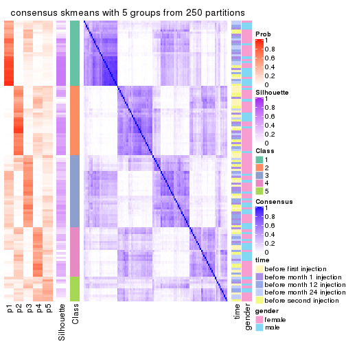</p>

</div>
<div id='tab-CV-skmeans-consensus-heatmap-5'>
<pre><code class="r">consensus_heatmap(res, k = 6)
</code></pre>

<p></p>

</div>
</div>

Heatmaps for the membership of samples in all partitions to see how consistent they are:


<script>
$( function() {
	$( '#tabs-CV-skmeans-membership-heatmap' ).tabs();
} );
</script>
<div id='tabs-CV-skmeans-membership-heatmap'>
<ul>
<li><a href='#tab-CV-skmeans-membership-heatmap-1'>k = 2</a></li>
<li><a href='#tab-CV-skmeans-membership-heatmap-2'>k = 3</a></li>
<li><a href='#tab-CV-skmeans-membership-heatmap-3'>k = 4</a></li>
<li><a href='#tab-CV-skmeans-membership-heatmap-4'>k = 5</a></li>
<li><a href='#tab-CV-skmeans-membership-heatmap-5'>k = 6</a></li>
</ul>
<div id='tab-CV-skmeans-membership-heatmap-1'>
<pre><code class="r">membership_heatmap(res, k = 2)
</code></pre>

<p></p>

</div>
<div id='tab-CV-skmeans-membership-heatmap-2'>
<pre><code class="r">membership_heatmap(res, k = 3)
</code></pre>

<p></p>

</div>
<div id='tab-CV-skmeans-membership-heatmap-3'>
<pre><code class="r">membership_heatmap(res, k = 4)
</code></pre>

<p></p>

</div>
<div id='tab-CV-skmeans-membership-heatmap-4'>
<pre><code class="r">membership_heatmap(res, k = 5)
</code></pre>

<p></p>

</div>
<div id='tab-CV-skmeans-membership-heatmap-5'>
<pre><code class="r">membership_heatmap(res, k = 6)
</code></pre>

<p></p>

</div>
</div>

As soon as we have had the classes for columns, we can look for signatures
which are significantly different between classes which can be candidate marks
for certain classes. Following are the heatmaps for signatures.


Signature heatmaps where rows are scaled:


<script>
$( function() {
	$( '#tabs-CV-skmeans-get-signatures' ).tabs();
} );
</script>
<div id='tabs-CV-skmeans-get-signatures'>
<ul>
<li><a href='#tab-CV-skmeans-get-signatures-1'>k = 2</a></li>
<li><a href='#tab-CV-skmeans-get-signatures-2'>k = 3</a></li>
<li><a href='#tab-CV-skmeans-get-signatures-3'>k = 4</a></li>
<li><a href='#tab-CV-skmeans-get-signatures-4'>k = 5</a></li>
<li><a href='#tab-CV-skmeans-get-signatures-5'>k = 6</a></li>
</ul>
<div id='tab-CV-skmeans-get-signatures-1'>
<pre><code class="r">get_signatures(res, k = 2)
</code></pre>

<p></p>

</div>
<div id='tab-CV-skmeans-get-signatures-2'>
<pre><code class="r">get_signatures(res, k = 3)
</code></pre>

<p></p>

</div>
<div id='tab-CV-skmeans-get-signatures-3'>
<pre><code class="r">get_signatures(res, k = 4)
</code></pre>

<p></p>

</div>
<div id='tab-CV-skmeans-get-signatures-4'>
<pre><code class="r">get_signatures(res, k = 5)
</code></pre>

<p></p>

</div>
<div id='tab-CV-skmeans-get-signatures-5'>
<pre><code class="r">get_signatures(res, k = 6)
</code></pre>

<p></p>

</div>
</div>


Signature heatmaps where rows are not scaled:


<script>
$( function() {
	$( '#tabs-CV-skmeans-get-signatures-no-scale' ).tabs();
} );
</script>
<div id='tabs-CV-skmeans-get-signatures-no-scale'>
<ul>
<li><a href='#tab-CV-skmeans-get-signatures-no-scale-1'>k = 2</a></li>
<li><a href='#tab-CV-skmeans-get-signatures-no-scale-2'>k = 3</a></li>
<li><a href='#tab-CV-skmeans-get-signatures-no-scale-3'>k = 4</a></li>
<li><a href='#tab-CV-skmeans-get-signatures-no-scale-4'>k = 5</a></li>
<li><a href='#tab-CV-skmeans-get-signatures-no-scale-5'>k = 6</a></li>
</ul>
<div id='tab-CV-skmeans-get-signatures-no-scale-1'>
<pre><code class="r">get_signatures(res, k = 2, scale_rows = FALSE)
</code></pre>

<p></p>

</div>
<div id='tab-CV-skmeans-get-signatures-no-scale-2'>
<pre><code class="r">get_signatures(res, k = 3, scale_rows = FALSE)
</code></pre>

<p></p>

</div>
<div id='tab-CV-skmeans-get-signatures-no-scale-3'>
<pre><code class="r">get_signatures(res, k = 4, scale_rows = FALSE)
</code></pre>

<p></p>

</div>
<div id='tab-CV-skmeans-get-signatures-no-scale-4'>
<pre><code class="r">get_signatures(res, k = 5, scale_rows = FALSE)
</code></pre>

<p></p>

</div>
<div id='tab-CV-skmeans-get-signatures-no-scale-5'>
<pre><code class="r">get_signatures(res, k = 6, scale_rows = FALSE)
</code></pre>

<p></p>

</div>
</div>


Compare the overlap of signatures from different k:

```r
compare_signatures(res)
```


`get_signature()` returns a data frame invisibly. TO get the list of signatures, the function
call should be assigned to a variable explicitly. In following code, if `plot` argument is set
to `FALSE`, no heatmap is plotted while only the differential analysis is performed.

```r
# code only for demonstration
tb = get_signature(res, k = ..., plot = FALSE)
```

An example of the output of `tb` is:

```
#>   which_row         fdr    mean_1    mean_2 scaled_mean_1 scaled_mean_2 km
#> 1        38 0.042760348  8.373488  9.131774    -0.5533452     0.5164555  1
#> 2        40 0.018707592  7.106213  8.469186    -0.6173731     0.5762149  1
#> 3        55 0.019134737 10.221463 11.207825    -0.6159697     0.5749050  1
#> 4        59 0.006059896  5.921854  7.869574    -0.6899429     0.6439467  1
#> 5        60 0.018055526  8.928898 10.211722    -0.6204761     0.5791110  1
#> 6        98 0.009384629 15.714769 14.887706     0.6635654    -0.6193277  2
...
```

The columns in `tb` are:

1. `which_row`: row indices corresponding to the input matrix.
2. `fdr`: FDR for the differential test. 
3. `mean_x`: The mean value in group x.
4. `scaled_mean_x`: The mean value in group x after rows are scaled.
5. `km`: Row groups if k-means clustering is applied to rows.


UMAP plot which shows how samples are separated.


<script>
$( function() {
	$( '#tabs-CV-skmeans-dimension-reduction' ).tabs();
} );
</script>
<div id='tabs-CV-skmeans-dimension-reduction'>
<ul>
<li><a href='#tab-CV-skmeans-dimension-reduction-1'>k = 2</a></li>
<li><a href='#tab-CV-skmeans-dimension-reduction-2'>k = 3</a></li>
<li><a href='#tab-CV-skmeans-dimension-reduction-3'>k = 4</a></li>
<li><a href='#tab-CV-skmeans-dimension-reduction-4'>k = 5</a></li>
<li><a href='#tab-CV-skmeans-dimension-reduction-5'>k = 6</a></li>
</ul>
<div id='tab-CV-skmeans-dimension-reduction-1'>
<pre><code class="r">dimension_reduction(res, k = 2, method = &quot;UMAP&quot;)
</code></pre>

<p></p>

</div>
<div id='tab-CV-skmeans-dimension-reduction-2'>
<pre><code class="r">dimension_reduction(res, k = 3, method = &quot;UMAP&quot;)
</code></pre>

<p></p>

</div>
<div id='tab-CV-skmeans-dimension-reduction-3'>
<pre><code class="r">dimension_reduction(res, k = 4, method = &quot;UMAP&quot;)
</code></pre>

<p></p>

</div>
<div id='tab-CV-skmeans-dimension-reduction-4'>
<pre><code class="r">dimension_reduction(res, k = 5, method = &quot;UMAP&quot;)
</code></pre>

<p></p>

</div>
<div id='tab-CV-skmeans-dimension-reduction-5'>
<pre><code class="r">dimension_reduction(res, k = 6, method = &quot;UMAP&quot;)
</code></pre>

<p></p>

</div>
</div>


Following heatmap shows how subgroups are split when increasing `k`:

```r
collect_classes(res)
```


Test correlation between subgroups and known annotations. If the known
annotation is numeric, one-way ANOVA test is applied, and if the known
annotation is discrete, chi-squared contingency table test is applied.

```r
test_to_known_factors(res)
```

```
#>              n time(p) gender(p) k
#> CV:skmeans 123   0.351     0.717 2
#> CV:skmeans  81   0.239     0.448 3
#> CV:skmeans  43   0.519     0.394 4
#> CV:skmeans  31   0.962     0.389 5
#> CV:skmeans  18   0.581     0.410 6
```


If matrix rows can be associated to genes, consider to use `functional_enrichment(res,
...)` to perform function enrichment for the signature genes. See [this vignette](http://bioconductor.org/packages/devel/bioc/vignettes/cola/inst/doc/functional_enrichment.html) for more detailed explanations.


 

---------------------------------------------------


### CV:pam


The object with results only for a single top-value method and a single partition method 
can be extracted as:

```r
res = res_list["CV", "pam"]
# you can also extract it by
# res = res_list["CV:pam"]
```

A summary of `res` and all the functions that can be applied to it:

```r
res
```

```
#> A 'ConsensusPartition' object with k = 2, 3, 4, 5, 6.
#>   On a matrix with 21512 rows and 125 columns.
#>   Top rows (1000, 2000, 3000, 4000, 5000) are extracted by 'CV' method.
#>   Subgroups are detected by 'pam' method.
#>   Performed in total 1250 partitions by row resampling.
#>   Best k for subgroups seems to be 3.
#> 
#> Following methods can be applied to this 'ConsensusPartition' object:
#>  [1] "cola_report"             "collect_classes"         "collect_plots"          
#>  [4] "collect_stats"           "colnames"                "compare_signatures"     
#>  [7] "consensus_heatmap"       "dimension_reduction"     "functional_enrichment"  
#> [10] "get_anno_col"            "get_anno"                "get_classes"            
#> [13] "get_consensus"           "get_matrix"              "get_membership"         
#> [16] "get_param"               "get_signatures"          "get_stats"              
#> [19] "is_best_k"               "is_stable_k"             "membership_heatmap"     
#> [22] "ncol"                    "nrow"                    "plot_ecdf"              
#> [25] "rownames"                "select_partition_number" "show"                   
#> [28] "suggest_best_k"          "test_to_known_factors"
```

`collect_plots()` function collects all the plots made from `res` for all `k` (number of partitions)
into one single page to provide an easy and fast comparison between different `k`.

```r
collect_plots(res)
```


The plots are:

- The first row: a plot of the ECDF (empirical cumulative distribution
  function) curves of the consensus matrix for each `k` and the heatmap of
  predicted classes for each `k`.
- The second row: heatmaps of the consensus matrix for each `k`.
- The third row: heatmaps of the membership matrix for each `k`.
- The fouth row: heatmaps of the signatures for each `k`.

All the plots in panels can be made by individual functions and they are
plotted later in this section.

`select_partition_number()` produces several plots showing different
statistics for choosing "optimized" `k`. There are following statistics:

- ECDF curves of the consensus matrix for each `k`;
- 1-PAC. [The PAC
  score](https://en.wikipedia.org/wiki/Consensus_clustering#Over-interpretation_potential_of_consensus_clustering)
  measures the proportion of the ambiguous subgrouping.
- Mean silhouette score.
- Concordance. The mean probability of fiting the consensus class ids in all
  partitions.
- Area increased. Denote $A_k$ as the area under the ECDF curve for current
  `k`, the area increased is defined as $A_k - A_{k-1}$.
- Rand index. The percent of pairs of samples that are both in a same cluster
  or both are not in a same cluster in the partition of k and k-1.
- Jaccard index. The ratio of pairs of samples are both in a same cluster in
  the partition of k and k-1 and the pairs of samples are both in a same
  cluster in the partition k or k-1.

The detailed explanations of these statistics can be found in [the _cola_
vignette](http://bioconductor.org/packages/devel/bioc/vignettes/cola/inst/doc/cola.html#toc_13).

Generally speaking, lower PAC score, higher mean silhouette score or higher
concordance corresponds to better partition. Rand index and Jaccard index
measure how similar the current partition is compared to partition with `k-1`.
If they are too similar, we won't accept `k` is better than `k-1`.

```r
select_partition_number(res)
```


The numeric values for all these statistics can be obtained by `get_stats()`.

```r
get_stats(res)
```

```
#>   k 1-PAC mean_silhouette concordance area_increased  Rand Jaccard
#> 2 2 0.119           0.469       0.732         0.4013 0.708   0.708
#> 3 3 0.311           0.725       0.823         0.4798 0.643   0.521
#> 4 4 0.371           0.457       0.745         0.1425 0.960   0.906
#> 5 5 0.390           0.430       0.721         0.0303 0.948   0.872
#> 6 6 0.403           0.419       0.719         0.0127 0.999   0.998
```

`suggest_best_k()` suggests the best $k$ based on these statistics. The rules are as follows:

- All $k$ with Jaccard index larger than 0.95 are removed because increasing
  $k$ does not provide enough extra information. If all $k$ are removed, it is
  marked as no subgroup is detected.
- For all $k$ with 1-PAC score larger than 0.9, the maximal $k$ is taken as
  the best $k$, and other $k$ are marked as optional $k$.
- If it does not fit the second rule. The $k$ with the maximal vote of the
  highest 1-PAC score, highest mean silhouette, and highest concordance is
  taken as the best $k$.

```r
suggest_best_k(res)
```

```
#> [1] 3
```


Following shows the table of the partitions (You need to click the **show/hide
code output** link to see it). The membership matrix (columns with name `p*`)
is inferred by
[`clue::cl_consensus()`](https://www.rdocumentation.org/link/cl_consensus?package=clue)
function with the `SE` method. Basically the value in the membership matrix
represents the probability to belong to a certain group. The finall class
label for an item is determined with the group with highest probability it
belongs to.

In `get_classes()` function, the entropy is calculated from the membership
matrix and the silhouette score is calculated from the consensus matrix.


<script>
$( function() {
	$( '#tabs-CV-pam-get-classes' ).tabs();
} );
</script>
<div id='tabs-CV-pam-get-classes'>
<ul>
<li><a href='#tab-CV-pam-get-classes-1'>k = 2</a></li>
<li><a href='#tab-CV-pam-get-classes-2'>k = 3</a></li>
<li><a href='#tab-CV-pam-get-classes-3'>k = 4</a></li>
<li><a href='#tab-CV-pam-get-classes-4'>k = 5</a></li>
<li><a href='#tab-CV-pam-get-classes-5'>k = 6</a></li>
</ul>

<div id='tab-CV-pam-get-classes-1'>
<p><a id='tab-CV-pam-get-classes-1-a' style='color:#0366d6' href='#'>show/hide code output</a></p>
<pre><code class="r">cbind(get_classes(res, k = 2), get_membership(res, k = 2))
</code></pre>

<pre><code>#&gt;           class entropy silhouette    p1    p2
#&gt; GSM601872     2  1.0000     0.3687 0.496 0.504
#&gt; GSM601882     1  0.0938     0.6806 0.988 0.012
#&gt; GSM601887     1  0.9996    -0.4040 0.512 0.488
#&gt; GSM601892     1  0.2043     0.6795 0.968 0.032
#&gt; GSM601897     1  0.7056     0.6064 0.808 0.192
#&gt; GSM601902     1  0.9170     0.4608 0.668 0.332
#&gt; GSM601912     1  0.1184     0.6837 0.984 0.016
#&gt; GSM601927     1  0.7219     0.5452 0.800 0.200
#&gt; GSM601932     1  0.5842     0.6302 0.860 0.140
#&gt; GSM601937     1  0.4939     0.6630 0.892 0.108
#&gt; GSM601942     1  0.7219     0.6020 0.800 0.200
#&gt; GSM601947     2  0.6973     0.4766 0.188 0.812
#&gt; GSM601957     1  0.8608     0.4396 0.716 0.284
#&gt; GSM601972     1  0.5408     0.6688 0.876 0.124
#&gt; GSM601977     1  0.6623     0.6100 0.828 0.172
#&gt; GSM601987     1  0.7745     0.3286 0.772 0.228
#&gt; GSM601877     1  0.8909     0.4048 0.692 0.308
#&gt; GSM601907     1  0.9998    -0.4096 0.508 0.492
#&gt; GSM601917     1  0.9661     0.2690 0.608 0.392
#&gt; GSM601922     1  0.9209     0.3788 0.664 0.336
#&gt; GSM601952     1  0.5519     0.6567 0.872 0.128
#&gt; GSM601962     1  0.8267     0.5730 0.740 0.260
#&gt; GSM601967     1  0.8955     0.4702 0.688 0.312
#&gt; GSM601982     1  0.0938     0.6829 0.988 0.012
#&gt; GSM601992     1  0.1184     0.6808 0.984 0.016
#&gt; GSM601873     1  0.9775     0.0963 0.588 0.412
#&gt; GSM601883     1  0.4562     0.6131 0.904 0.096
#&gt; GSM601888     2  0.5519     0.5639 0.128 0.872
#&gt; GSM601893     1  0.1843     0.6844 0.972 0.028
#&gt; GSM601898     1  0.5629     0.6555 0.868 0.132
#&gt; GSM601903     1  0.7528     0.5859 0.784 0.216
#&gt; GSM601913     1  0.6148     0.6551 0.848 0.152
#&gt; GSM601928     1  0.9998     0.1998 0.508 0.492
#&gt; GSM601933     1  0.9815    -0.2431 0.580 0.420
#&gt; GSM601938     2  0.9686     0.4650 0.396 0.604
#&gt; GSM601943     1  0.8813     0.3043 0.700 0.300
#&gt; GSM601948     2  0.5629     0.5219 0.132 0.868
#&gt; GSM601958     1  0.3114     0.6821 0.944 0.056
#&gt; GSM601973     1  0.5408     0.6622 0.876 0.124
#&gt; GSM601978     2  0.9993     0.4085 0.484 0.516
#&gt; GSM601988     1  0.2043     0.6851 0.968 0.032
#&gt; GSM601878     1  0.9996     0.1440 0.512 0.488
#&gt; GSM601908     1  0.9522    -0.1199 0.628 0.372
#&gt; GSM601918     2  0.9661     0.1685 0.392 0.608
#&gt; GSM601923     1  1.0000     0.1534 0.504 0.496
#&gt; GSM601953     2  0.7815     0.5731 0.232 0.768
#&gt; GSM601963     1  0.2236     0.6880 0.964 0.036
#&gt; GSM601968     1  0.8555     0.4528 0.720 0.280
#&gt; GSM601983     1  0.1414     0.6854 0.980 0.020
#&gt; GSM601993     1  0.1633     0.6839 0.976 0.024
#&gt; GSM601874     1  0.9608    -0.1754 0.616 0.384
#&gt; GSM601884     1  0.2236     0.6869 0.964 0.036
#&gt; GSM601889     1  0.4161     0.6665 0.916 0.084
#&gt; GSM601894     1  0.0000     0.6783 1.000 0.000
#&gt; GSM601899     2  0.9522     0.5004 0.372 0.628
#&gt; GSM601904     1  0.8081     0.5758 0.752 0.248
#&gt; GSM601914     1  0.8861     0.5250 0.696 0.304
#&gt; GSM601929     1  0.8813     0.4207 0.700 0.300
#&gt; GSM601934     1  0.4022     0.6432 0.920 0.080
#&gt; GSM601939     1  0.8813     0.4360 0.700 0.300
#&gt; GSM601944     1  0.1843     0.6840 0.972 0.028
#&gt; GSM601949     2  0.9963     0.2262 0.464 0.536
#&gt; GSM601959     1  0.3114     0.6802 0.944 0.056
#&gt; GSM601974     1  0.5629     0.6520 0.868 0.132
#&gt; GSM601979     1  0.9996    -0.4057 0.512 0.488
#&gt; GSM601989     1  0.0672     0.6807 0.992 0.008
#&gt; GSM601879     1  0.9833     0.2556 0.576 0.424
#&gt; GSM601909     2  0.9491     0.1647 0.368 0.632
#&gt; GSM601919     2  0.2948     0.5519 0.052 0.948
#&gt; GSM601924     1  0.9608     0.2755 0.616 0.384
#&gt; GSM601954     2  0.4161     0.5622 0.084 0.916
#&gt; GSM601964     1  0.2423     0.6856 0.960 0.040
#&gt; GSM601969     1  0.9944    -0.0194 0.544 0.456
#&gt; GSM601984     1  0.3733     0.6842 0.928 0.072
#&gt; GSM601994     1  0.2603     0.6834 0.956 0.044
#&gt; GSM601875     1  0.9983    -0.3781 0.524 0.476
#&gt; GSM601885     2  0.9988     0.3661 0.480 0.520
#&gt; GSM601890     2  0.3114     0.5552 0.056 0.944
#&gt; GSM601895     1  0.0938     0.6828 0.988 0.012
#&gt; GSM601900     1  0.5842     0.6694 0.860 0.140
#&gt; GSM601905     1  0.0938     0.6827 0.988 0.012
#&gt; GSM601915     1  0.3114     0.6802 0.944 0.056
#&gt; GSM601930     1  0.9944     0.2574 0.544 0.456
#&gt; GSM601935     1  0.1843     0.6854 0.972 0.028
#&gt; GSM601940     1  0.1633     0.6836 0.976 0.024
#&gt; GSM601945     2  0.9944     0.4229 0.456 0.544
#&gt; GSM601950     1  0.9710     0.2804 0.600 0.400
#&gt; GSM601960     1  0.8327     0.5406 0.736 0.264
#&gt; GSM601975     1  0.7299     0.6049 0.796 0.204
#&gt; GSM601980     1  0.9933    -0.0560 0.548 0.452
#&gt; GSM601990     1  0.4562     0.6766 0.904 0.096
#&gt; GSM601880     1  0.9491     0.3743 0.632 0.368
#&gt; GSM601910     1  0.9710     0.2778 0.600 0.400
#&gt; GSM601920     1  0.9795     0.2089 0.584 0.416
#&gt; GSM601925     1  0.9988     0.2129 0.520 0.480
#&gt; GSM601955     1  0.8763     0.5261 0.704 0.296
#&gt; GSM601965     1  0.4815     0.6709 0.896 0.104
#&gt; GSM601970     1  0.9850     0.2794 0.572 0.428
#&gt; GSM601985     1  0.3879     0.6790 0.924 0.076
#&gt; GSM601995     1  0.5408     0.6605 0.876 0.124
#&gt; GSM601876     1  0.3431     0.6778 0.936 0.064
#&gt; GSM601886     1  0.6531     0.6298 0.832 0.168
#&gt; GSM601891     2  0.6247     0.5773 0.156 0.844
#&gt; GSM601896     1  0.0000     0.6783 1.000 0.000
#&gt; GSM601901     1  0.2043     0.6789 0.968 0.032
#&gt; GSM601906     1  0.6343     0.6397 0.840 0.160
#&gt; GSM601916     1  0.1184     0.6841 0.984 0.016
#&gt; GSM601931     1  0.8909     0.4091 0.692 0.308
#&gt; GSM601936     1  0.1843     0.6867 0.972 0.028
#&gt; GSM601941     1  0.7883     0.5897 0.764 0.236
#&gt; GSM601946     1  0.0376     0.6796 0.996 0.004
#&gt; GSM601951     1  0.9993     0.1825 0.516 0.484
#&gt; GSM601961     2  0.9896     0.4585 0.440 0.560
#&gt; GSM601976     1  0.6887     0.6188 0.816 0.184
#&gt; GSM601981     2  0.9998     0.2942 0.492 0.508
#&gt; GSM601991     1  0.2236     0.6872 0.964 0.036
#&gt; GSM601881     1  0.9427     0.3659 0.640 0.360
#&gt; GSM601911     1  0.0000     0.6783 1.000 0.000
#&gt; GSM601921     2  0.9552     0.2218 0.376 0.624
#&gt; GSM601926     1  0.9248     0.3847 0.660 0.340
#&gt; GSM601956     2  0.9833     0.4326 0.424 0.576
#&gt; GSM601966     1  0.4022     0.6796 0.920 0.080
#&gt; GSM601971     2  0.9896     0.0593 0.440 0.560
#&gt; GSM601986     1  0.3274     0.6867 0.940 0.060
#&gt; GSM601996     1  0.1414     0.6839 0.980 0.020
</code></pre>

<script>
$('#tab-CV-pam-get-classes-1-a').parent().next().next().hide();
$('#tab-CV-pam-get-classes-1-a').click(function(){
  $('#tab-CV-pam-get-classes-1-a').parent().next().next().toggle();
  return(false);
});
</script>
</div>

<div id='tab-CV-pam-get-classes-2'>
<p><a id='tab-CV-pam-get-classes-2-a' style='color:#0366d6' href='#'>show/hide code output</a></p>
<pre><code class="r">cbind(get_classes(res, k = 3), get_membership(res, k = 3))
</code></pre>

<pre><code>#&gt;           class entropy silhouette    p1    p2    p3
#&gt; GSM601872     3  0.3425     0.8213 0.004 0.112 0.884
#&gt; GSM601882     2  0.2356     0.8208 0.000 0.928 0.072
#&gt; GSM601887     3  0.4465     0.7898 0.004 0.176 0.820
#&gt; GSM601892     2  0.4110     0.7858 0.004 0.844 0.152
#&gt; GSM601897     2  0.5662     0.8026 0.100 0.808 0.092
#&gt; GSM601902     2  0.7752    -0.0627 0.456 0.496 0.048
#&gt; GSM601912     2  0.0661     0.8270 0.008 0.988 0.004
#&gt; GSM601927     1  0.6513     0.4119 0.520 0.476 0.004
#&gt; GSM601932     2  0.4505     0.8044 0.092 0.860 0.048
#&gt; GSM601937     2  0.4075     0.8247 0.072 0.880 0.048
#&gt; GSM601942     2  0.5965     0.7941 0.108 0.792 0.100
#&gt; GSM601947     1  0.3030     0.7358 0.904 0.004 0.092
#&gt; GSM601957     2  0.7639     0.5825 0.088 0.656 0.256
#&gt; GSM601972     2  0.4095     0.8334 0.064 0.880 0.056
#&gt; GSM601977     2  0.6800     0.5892 0.032 0.660 0.308
#&gt; GSM601987     2  0.6225     0.1313 0.000 0.568 0.432
#&gt; GSM601877     1  0.3879     0.7935 0.848 0.152 0.000
#&gt; GSM601907     3  0.2448     0.8194 0.000 0.076 0.924
#&gt; GSM601917     1  0.3755     0.7980 0.872 0.120 0.008
#&gt; GSM601922     1  0.5656     0.7532 0.728 0.264 0.008
#&gt; GSM601952     2  0.5505     0.8106 0.088 0.816 0.096
#&gt; GSM601962     2  0.6322     0.6849 0.276 0.700 0.024
#&gt; GSM601967     1  0.7425     0.5532 0.620 0.328 0.052
#&gt; GSM601982     2  0.4556     0.8129 0.080 0.860 0.060
#&gt; GSM601992     2  0.2301     0.8351 0.004 0.936 0.060
#&gt; GSM601873     3  0.7451     0.2452 0.040 0.396 0.564
#&gt; GSM601883     2  0.4413     0.7531 0.008 0.832 0.160
#&gt; GSM601888     3  0.3028     0.8081 0.048 0.032 0.920
#&gt; GSM601893     2  0.3832     0.8316 0.036 0.888 0.076
#&gt; GSM601898     2  0.4349     0.7917 0.128 0.852 0.020
#&gt; GSM601903     2  0.7500     0.7291 0.140 0.696 0.164
#&gt; GSM601913     2  0.5413     0.7684 0.164 0.800 0.036
#&gt; GSM601928     1  0.5012     0.7610 0.840 0.080 0.080
#&gt; GSM601933     3  0.5619     0.7098 0.012 0.244 0.744
#&gt; GSM601938     3  0.2866     0.8055 0.008 0.076 0.916
#&gt; GSM601943     2  0.7979     0.0986 0.060 0.500 0.440
#&gt; GSM601948     1  0.2772     0.7453 0.916 0.004 0.080
#&gt; GSM601958     2  0.3349     0.7828 0.108 0.888 0.004
#&gt; GSM601973     2  0.4423     0.8224 0.088 0.864 0.048
#&gt; GSM601978     3  0.2537     0.8190 0.000 0.080 0.920
#&gt; GSM601988     2  0.1491     0.8342 0.016 0.968 0.016
#&gt; GSM601878     1  0.2384     0.7876 0.936 0.056 0.008
#&gt; GSM601908     3  0.6359     0.5620 0.008 0.364 0.628
#&gt; GSM601918     1  0.3207     0.7955 0.904 0.084 0.012
#&gt; GSM601923     1  0.2152     0.7736 0.948 0.036 0.016
#&gt; GSM601953     3  0.1620     0.8039 0.024 0.012 0.964
#&gt; GSM601963     2  0.4068     0.8111 0.120 0.864 0.016
#&gt; GSM601968     2  0.9549     0.0985 0.276 0.484 0.240
#&gt; GSM601983     2  0.3921     0.8067 0.112 0.872 0.016
#&gt; GSM601993     2  0.2313     0.8335 0.024 0.944 0.032
#&gt; GSM601874     3  0.6553     0.4661 0.008 0.412 0.580
#&gt; GSM601884     2  0.2446     0.8371 0.012 0.936 0.052
#&gt; GSM601889     2  0.5092     0.7623 0.020 0.804 0.176
#&gt; GSM601894     2  0.1289     0.8225 0.032 0.968 0.000
#&gt; GSM601899     3  0.3267     0.8160 0.044 0.044 0.912
#&gt; GSM601904     2  0.6968     0.7300 0.204 0.716 0.080
#&gt; GSM601914     2  0.7091     0.6712 0.268 0.676 0.056
#&gt; GSM601929     1  0.4974     0.7758 0.764 0.236 0.000
#&gt; GSM601934     2  0.2955     0.8197 0.008 0.912 0.080
#&gt; GSM601939     1  0.6008     0.6879 0.664 0.332 0.004
#&gt; GSM601944     2  0.1170     0.8306 0.008 0.976 0.016
#&gt; GSM601949     1  0.8196     0.5833 0.560 0.356 0.084
#&gt; GSM601959     2  0.2187     0.8369 0.024 0.948 0.028
#&gt; GSM601974     2  0.5466     0.7879 0.160 0.800 0.040
#&gt; GSM601979     3  0.2711     0.8192 0.000 0.088 0.912
#&gt; GSM601989     2  0.0661     0.8296 0.004 0.988 0.008
#&gt; GSM601879     1  0.2945     0.7929 0.908 0.088 0.004
#&gt; GSM601909     1  0.3856     0.7647 0.888 0.040 0.072
#&gt; GSM601919     1  0.1267     0.7552 0.972 0.004 0.024
#&gt; GSM601924     1  0.3715     0.7953 0.868 0.128 0.004
#&gt; GSM601954     3  0.6252     0.5879 0.268 0.024 0.708
#&gt; GSM601964     2  0.1877     0.8353 0.032 0.956 0.012
#&gt; GSM601969     2  0.9804    -0.0565 0.336 0.416 0.248
#&gt; GSM601984     2  0.3234     0.8270 0.072 0.908 0.020
#&gt; GSM601994     2  0.2564     0.8343 0.028 0.936 0.036
#&gt; GSM601875     3  0.3618     0.8240 0.012 0.104 0.884
#&gt; GSM601885     3  0.5235     0.7634 0.036 0.152 0.812
#&gt; GSM601890     3  0.2772     0.7865 0.080 0.004 0.916
#&gt; GSM601895     2  0.0661     0.8284 0.004 0.988 0.008
#&gt; GSM601900     2  0.5603     0.8012 0.060 0.804 0.136
#&gt; GSM601905     2  0.1399     0.8272 0.028 0.968 0.004
#&gt; GSM601915     2  0.3272     0.7924 0.104 0.892 0.004
#&gt; GSM601930     1  0.2096     0.7908 0.944 0.052 0.004
#&gt; GSM601935     2  0.1337     0.8326 0.016 0.972 0.012
#&gt; GSM601940     2  0.2066     0.8161 0.060 0.940 0.000
#&gt; GSM601945     3  0.2313     0.8182 0.024 0.032 0.944
#&gt; GSM601950     1  0.7129     0.4607 0.580 0.392 0.028
#&gt; GSM601960     2  0.7442     0.4921 0.348 0.604 0.048
#&gt; GSM601975     2  0.5915     0.7879 0.128 0.792 0.080
#&gt; GSM601980     2  0.9377     0.1121 0.172 0.448 0.380
#&gt; GSM601990     2  0.3896     0.8248 0.060 0.888 0.052
#&gt; GSM601880     1  0.4615     0.7965 0.836 0.144 0.020
#&gt; GSM601910     2  0.8649     0.5748 0.172 0.596 0.232
#&gt; GSM601920     1  0.7092     0.7483 0.708 0.208 0.084
#&gt; GSM601925     1  0.1950     0.7857 0.952 0.040 0.008
#&gt; GSM601955     2  0.7899     0.6974 0.192 0.664 0.144
#&gt; GSM601965     2  0.4978     0.7198 0.216 0.780 0.004
#&gt; GSM601970     1  0.7442     0.4529 0.588 0.368 0.044
#&gt; GSM601985     2  0.3769     0.7949 0.104 0.880 0.016
#&gt; GSM601995     2  0.5371     0.8038 0.048 0.812 0.140
#&gt; GSM601876     2  0.3148     0.8252 0.048 0.916 0.036
#&gt; GSM601886     2  0.5428     0.8016 0.120 0.816 0.064
#&gt; GSM601891     3  0.1751     0.8057 0.028 0.012 0.960
#&gt; GSM601896     2  0.0000     0.8247 0.000 1.000 0.000
#&gt; GSM601901     2  0.1877     0.8358 0.012 0.956 0.032
#&gt; GSM601906     2  0.5020     0.8111 0.108 0.836 0.056
#&gt; GSM601916     2  0.0829     0.8292 0.012 0.984 0.004
#&gt; GSM601931     1  0.4178     0.7956 0.828 0.172 0.000
#&gt; GSM601936     2  0.1182     0.8329 0.012 0.976 0.012
#&gt; GSM601941     2  0.5787     0.7962 0.136 0.796 0.068
#&gt; GSM601946     2  0.0000     0.8247 0.000 1.000 0.000
#&gt; GSM601951     1  0.6109     0.7223 0.760 0.192 0.048
#&gt; GSM601961     3  0.3272     0.8253 0.016 0.080 0.904
#&gt; GSM601976     2  0.6222     0.7898 0.092 0.776 0.132
#&gt; GSM601981     3  0.8148     0.5029 0.100 0.296 0.604
#&gt; GSM601991     2  0.2550     0.8347 0.056 0.932 0.012
#&gt; GSM601881     1  0.4531     0.7932 0.824 0.168 0.008
#&gt; GSM601911     2  0.0000     0.8247 0.000 1.000 0.000
#&gt; GSM601921     1  0.9066     0.4126 0.540 0.284 0.176
#&gt; GSM601926     1  0.3619     0.7952 0.864 0.136 0.000
#&gt; GSM601956     3  0.4527     0.7812 0.088 0.052 0.860
#&gt; GSM601966     2  0.4165     0.8282 0.048 0.876 0.076
#&gt; GSM601971     1  0.3850     0.7966 0.884 0.088 0.028
#&gt; GSM601986     2  0.3910     0.8197 0.104 0.876 0.020
#&gt; GSM601996     2  0.1170     0.8314 0.008 0.976 0.016
</code></pre>

<script>
$('#tab-CV-pam-get-classes-2-a').parent().next().next().hide();
$('#tab-CV-pam-get-classes-2-a').click(function(){
  $('#tab-CV-pam-get-classes-2-a').parent().next().next().toggle();
  return(false);
});
</script>
</div>

<div id='tab-CV-pam-get-classes-3'>
<p><a id='tab-CV-pam-get-classes-3-a' style='color:#0366d6' href='#'>show/hide code output</a></p>
<pre><code class="r">cbind(get_classes(res, k = 4), get_membership(res, k = 4))
</code></pre>

<pre><code>#&gt;           class entropy silhouette    p1    p2    p3    p4
#&gt; GSM601872     2  0.2010     0.7438 0.004 0.932 0.004 0.060
#&gt; GSM601882     4  0.5056     0.3620 0.000 0.044 0.224 0.732
#&gt; GSM601887     2  0.3501     0.7064 0.000 0.848 0.020 0.132
#&gt; GSM601892     4  0.2814     0.5681 0.000 0.132 0.000 0.868
#&gt; GSM601897     4  0.6206     0.2485 0.020 0.028 0.368 0.584
#&gt; GSM601902     4  0.8181    -0.3352 0.300 0.008 0.340 0.352
#&gt; GSM601912     4  0.0779     0.5967 0.004 0.000 0.016 0.980
#&gt; GSM601927     1  0.5285     0.2293 0.524 0.000 0.008 0.468
#&gt; GSM601932     4  0.4446     0.5048 0.028 0.000 0.196 0.776
#&gt; GSM601937     4  0.4996     0.5113 0.028 0.020 0.184 0.768
#&gt; GSM601942     3  0.6769    -0.0133 0.024 0.044 0.476 0.456
#&gt; GSM601947     1  0.5431     0.6103 0.668 0.028 0.300 0.004
#&gt; GSM601957     4  0.7908     0.0722 0.036 0.172 0.244 0.548
#&gt; GSM601972     4  0.4160     0.5750 0.028 0.012 0.132 0.828
#&gt; GSM601977     4  0.7917    -0.1611 0.004 0.312 0.256 0.428
#&gt; GSM601987     4  0.6206     0.0420 0.000 0.404 0.056 0.540
#&gt; GSM601877     1  0.1118     0.7450 0.964 0.000 0.000 0.036
#&gt; GSM601907     2  0.0188     0.7478 0.000 0.996 0.004 0.000
#&gt; GSM601917     1  0.1109     0.7475 0.968 0.000 0.004 0.028
#&gt; GSM601922     1  0.5781     0.6406 0.708 0.008 0.072 0.212
#&gt; GSM601952     4  0.4447     0.5556 0.036 0.028 0.108 0.828
#&gt; GSM601962     4  0.7164     0.1682 0.240 0.000 0.204 0.556
#&gt; GSM601967     1  0.6848     0.3300 0.592 0.000 0.160 0.248
#&gt; GSM601982     4  0.6892     0.3037 0.080 0.048 0.216 0.656
#&gt; GSM601992     4  0.6815     0.1348 0.012 0.076 0.360 0.552
#&gt; GSM601873     2  0.6907     0.0597 0.008 0.528 0.088 0.376
#&gt; GSM601883     4  0.5820     0.3040 0.000 0.084 0.232 0.684
#&gt; GSM601888     2  0.1305     0.7444 0.004 0.960 0.036 0.000
#&gt; GSM601893     4  0.3110     0.5982 0.004 0.048 0.056 0.892
#&gt; GSM601898     4  0.6111     0.2347 0.056 0.004 0.324 0.616
#&gt; GSM601903     4  0.6908     0.3426 0.044 0.080 0.228 0.648
#&gt; GSM601913     4  0.6377     0.3913 0.108 0.008 0.220 0.664
#&gt; GSM601928     1  0.5169     0.6073 0.696 0.000 0.272 0.032
#&gt; GSM601933     2  0.4840     0.5336 0.000 0.732 0.028 0.240
#&gt; GSM601938     2  0.4608     0.5628 0.000 0.692 0.304 0.004
#&gt; GSM601943     4  0.7538    -0.0648 0.016 0.380 0.124 0.480
#&gt; GSM601948     1  0.5005     0.6403 0.712 0.020 0.264 0.004
#&gt; GSM601958     4  0.4894     0.5180 0.100 0.000 0.120 0.780
#&gt; GSM601973     4  0.5546     0.2924 0.016 0.008 0.356 0.620
#&gt; GSM601978     2  0.0376     0.7484 0.000 0.992 0.004 0.004
#&gt; GSM601988     4  0.1545     0.6014 0.000 0.008 0.040 0.952
#&gt; GSM601878     1  0.0657     0.7423 0.984 0.004 0.000 0.012
#&gt; GSM601908     2  0.7765     0.1361 0.004 0.460 0.220 0.316
#&gt; GSM601918     1  0.4981     0.7034 0.780 0.012 0.156 0.052
#&gt; GSM601923     1  0.1004     0.7389 0.972 0.000 0.024 0.004
#&gt; GSM601953     2  0.0376     0.7482 0.004 0.992 0.004 0.000
#&gt; GSM601963     4  0.3682     0.5897 0.084 0.008 0.044 0.864
#&gt; GSM601968     4  0.7857    -0.1033 0.272 0.272 0.004 0.452
#&gt; GSM601983     4  0.3709     0.5790 0.100 0.004 0.040 0.856
#&gt; GSM601993     4  0.4993     0.4543 0.000 0.028 0.260 0.712
#&gt; GSM601874     2  0.7608     0.0360 0.000 0.408 0.200 0.392
#&gt; GSM601884     4  0.5569     0.3078 0.004 0.040 0.280 0.676
#&gt; GSM601889     4  0.5530     0.4067 0.000 0.212 0.076 0.712
#&gt; GSM601894     4  0.0188     0.5921 0.004 0.000 0.000 0.996
#&gt; GSM601899     2  0.3377     0.7205 0.000 0.848 0.140 0.012
#&gt; GSM601904     4  0.6055     0.0431 0.044 0.000 0.436 0.520
#&gt; GSM601914     4  0.7073    -0.1328 0.108 0.004 0.408 0.480
#&gt; GSM601929     1  0.3591     0.7130 0.824 0.000 0.008 0.168
#&gt; GSM601934     4  0.2413     0.5927 0.000 0.064 0.020 0.916
#&gt; GSM601939     1  0.5110     0.5171 0.656 0.000 0.016 0.328
#&gt; GSM601944     4  0.3400     0.5579 0.000 0.000 0.180 0.820
#&gt; GSM601949     1  0.8564     0.3154 0.452 0.068 0.144 0.336
#&gt; GSM601959     4  0.3695     0.5784 0.000 0.016 0.156 0.828
#&gt; GSM601974     4  0.4621     0.5259 0.076 0.000 0.128 0.796
#&gt; GSM601979     2  0.0779     0.7513 0.000 0.980 0.004 0.016
#&gt; GSM601989     4  0.0524     0.5963 0.000 0.008 0.004 0.988
#&gt; GSM601879     1  0.1584     0.7449 0.952 0.000 0.036 0.012
#&gt; GSM601909     1  0.5428     0.6667 0.736 0.028 0.208 0.028
#&gt; GSM601919     1  0.2654     0.7197 0.888 0.004 0.108 0.000
#&gt; GSM601924     1  0.1022     0.7454 0.968 0.000 0.000 0.032
#&gt; GSM601954     2  0.7482     0.4643 0.212 0.580 0.188 0.020
#&gt; GSM601964     4  0.2101     0.5992 0.012 0.000 0.060 0.928
#&gt; GSM601969     4  0.9641    -0.2548 0.284 0.184 0.168 0.364
#&gt; GSM601984     4  0.5667     0.4069 0.060 0.004 0.240 0.696
#&gt; GSM601994     4  0.5950     0.0901 0.000 0.040 0.416 0.544
#&gt; GSM601875     2  0.1824     0.7434 0.000 0.936 0.004 0.060
#&gt; GSM601885     2  0.6454     0.4140 0.000 0.572 0.344 0.084
#&gt; GSM601890     2  0.2662     0.7373 0.016 0.900 0.084 0.000
#&gt; GSM601895     4  0.2281     0.5921 0.000 0.000 0.096 0.904
#&gt; GSM601900     4  0.6855     0.4169 0.028 0.132 0.180 0.660
#&gt; GSM601905     4  0.1398     0.5985 0.004 0.000 0.040 0.956
#&gt; GSM601915     4  0.2775     0.5813 0.084 0.000 0.020 0.896
#&gt; GSM601930     1  0.1305     0.7427 0.960 0.000 0.036 0.004
#&gt; GSM601935     4  0.3402     0.5616 0.004 0.000 0.164 0.832
#&gt; GSM601940     4  0.1022     0.5964 0.032 0.000 0.000 0.968
#&gt; GSM601945     2  0.1837     0.7513 0.000 0.944 0.028 0.028
#&gt; GSM601950     1  0.7640     0.1557 0.444 0.004 0.180 0.372
#&gt; GSM601960     4  0.6916     0.0811 0.280 0.000 0.148 0.572
#&gt; GSM601975     4  0.5537     0.2180 0.016 0.004 0.392 0.588
#&gt; GSM601980     3  0.5336     0.3855 0.032 0.088 0.784 0.096
#&gt; GSM601990     4  0.5024     0.3184 0.008 0.000 0.360 0.632
#&gt; GSM601880     1  0.4236     0.7288 0.824 0.000 0.088 0.088
#&gt; GSM601910     3  0.7210     0.3224 0.020 0.092 0.536 0.352
#&gt; GSM601920     1  0.6015     0.6696 0.720 0.080 0.024 0.176
#&gt; GSM601925     1  0.1743     0.7413 0.940 0.000 0.056 0.004
#&gt; GSM601955     4  0.7136    -0.1082 0.052 0.036 0.444 0.468
#&gt; GSM601965     4  0.5055     0.4074 0.256 0.000 0.032 0.712
#&gt; GSM601970     1  0.8308    -0.0489 0.412 0.020 0.328 0.240
#&gt; GSM601985     4  0.3266     0.5866 0.084 0.000 0.040 0.876
#&gt; GSM601995     4  0.7172     0.1713 0.012 0.128 0.288 0.572
#&gt; GSM601876     4  0.4632     0.3839 0.004 0.000 0.308 0.688
#&gt; GSM601886     4  0.4898     0.4320 0.024 0.000 0.260 0.716
#&gt; GSM601891     2  0.1807     0.7506 0.000 0.940 0.052 0.008
#&gt; GSM601896     4  0.0000     0.5916 0.000 0.000 0.000 1.000
#&gt; GSM601901     4  0.2089     0.6033 0.000 0.020 0.048 0.932
#&gt; GSM601906     4  0.5055     0.4336 0.032 0.000 0.256 0.712
#&gt; GSM601916     4  0.2773     0.5843 0.004 0.000 0.116 0.880
#&gt; GSM601931     1  0.2281     0.7458 0.904 0.000 0.000 0.096
#&gt; GSM601936     4  0.1305     0.6009 0.000 0.004 0.036 0.960
#&gt; GSM601941     3  0.4800     0.3653 0.004 0.000 0.656 0.340
#&gt; GSM601946     4  0.0817     0.5976 0.000 0.000 0.024 0.976
#&gt; GSM601951     1  0.7274     0.4739 0.540 0.004 0.296 0.160
#&gt; GSM601961     2  0.2275     0.7505 0.004 0.928 0.048 0.020
#&gt; GSM601976     4  0.6228     0.3936 0.008 0.072 0.272 0.648
#&gt; GSM601981     2  0.7770    -0.1690 0.000 0.416 0.336 0.248
#&gt; GSM601991     4  0.4544     0.5620 0.048 0.000 0.164 0.788
#&gt; GSM601881     1  0.3760     0.7266 0.836 0.000 0.028 0.136
#&gt; GSM601911     4  0.0524     0.5951 0.000 0.004 0.008 0.988
#&gt; GSM601921     3  0.8153     0.2751 0.300 0.044 0.504 0.152
#&gt; GSM601926     1  0.1807     0.7495 0.940 0.000 0.008 0.052
#&gt; GSM601956     2  0.5155     0.6467 0.024 0.768 0.172 0.036
#&gt; GSM601966     4  0.6066     0.1695 0.004 0.040 0.392 0.564
#&gt; GSM601971     1  0.4893     0.7110 0.772 0.004 0.172 0.052
#&gt; GSM601986     4  0.4954     0.5323 0.092 0.004 0.120 0.784
#&gt; GSM601996     4  0.2805     0.5940 0.000 0.012 0.100 0.888
</code></pre>

<script>
$('#tab-CV-pam-get-classes-3-a').parent().next().next().hide();
$('#tab-CV-pam-get-classes-3-a').click(function(){
  $('#tab-CV-pam-get-classes-3-a').parent().next().next().toggle();
  return(false);
});
</script>
</div>

<div id='tab-CV-pam-get-classes-4'>
<p><a id='tab-CV-pam-get-classes-4-a' style='color:#0366d6' href='#'>show/hide code output</a></p>
<pre><code class="r">cbind(get_classes(res, k = 5), get_membership(res, k = 5))
</code></pre>

<pre><code>#&gt;           class entropy silhouette    p1    p2    p3    p4    p5
#&gt; GSM601872     2  0.1662    0.70172 0.004 0.936 0.056 0.000 0.004
#&gt; GSM601882     3  0.5579    0.38934 0.000 0.024 0.692 0.152 0.132
#&gt; GSM601887     2  0.2612    0.65977 0.000 0.868 0.124 0.008 0.000
#&gt; GSM601892     3  0.2377    0.57682 0.000 0.128 0.872 0.000 0.000
#&gt; GSM601897     3  0.6197    0.29314 0.008 0.028 0.564 0.340 0.060
#&gt; GSM601902     4  0.7409    0.45435 0.276 0.008 0.320 0.380 0.016
#&gt; GSM601912     3  0.0771    0.59204 0.004 0.000 0.976 0.020 0.000
#&gt; GSM601927     1  0.4552    0.11333 0.524 0.000 0.468 0.008 0.000
#&gt; GSM601932     3  0.4901    0.48201 0.008 0.000 0.724 0.188 0.080
#&gt; GSM601937     3  0.5270    0.52961 0.016 0.020 0.744 0.124 0.096
#&gt; GSM601942     3  0.7351    0.02046 0.008 0.024 0.412 0.356 0.200
#&gt; GSM601947     1  0.6109    0.47460 0.568 0.016 0.004 0.328 0.084
#&gt; GSM601957     3  0.6835   -0.11769 0.028 0.144 0.476 0.352 0.000
#&gt; GSM601972     3  0.4585    0.55773 0.016 0.012 0.780 0.144 0.048
#&gt; GSM601977     3  0.8149   -0.03245 0.004 0.272 0.404 0.212 0.108
#&gt; GSM601987     3  0.6310    0.12650 0.000 0.368 0.524 0.036 0.072
#&gt; GSM601877     1  0.0510    0.70579 0.984 0.000 0.016 0.000 0.000
#&gt; GSM601907     2  0.0000    0.70740 0.000 1.000 0.000 0.000 0.000
#&gt; GSM601917     1  0.0771    0.70918 0.976 0.000 0.020 0.004 0.000
#&gt; GSM601922     1  0.5302    0.56274 0.700 0.008 0.204 0.080 0.008
#&gt; GSM601952     3  0.4477    0.54695 0.024 0.028 0.812 0.084 0.052
#&gt; GSM601962     3  0.6777    0.11739 0.224 0.000 0.544 0.204 0.028
#&gt; GSM601967     1  0.5962    0.14936 0.584 0.000 0.248 0.168 0.000
#&gt; GSM601982     3  0.7162    0.35078 0.096 0.032 0.620 0.136 0.116
#&gt; GSM601992     3  0.7431    0.19418 0.016 0.060 0.504 0.300 0.120
#&gt; GSM601873     2  0.6297    0.08174 0.008 0.520 0.372 0.088 0.012
#&gt; GSM601883     3  0.6418    0.33278 0.000 0.060 0.632 0.172 0.136
#&gt; GSM601888     2  0.0771    0.70619 0.004 0.976 0.000 0.020 0.000
#&gt; GSM601893     3  0.2754    0.59348 0.004 0.032 0.884 0.080 0.000
#&gt; GSM601898     3  0.5256   -0.03513 0.048 0.000 0.532 0.420 0.000
#&gt; GSM601903     3  0.6769    0.38963 0.028 0.076 0.640 0.176 0.080
#&gt; GSM601913     3  0.5647    0.34105 0.108 0.008 0.640 0.244 0.000
#&gt; GSM601928     1  0.5497    0.53446 0.676 0.000 0.028 0.228 0.068
#&gt; GSM601933     2  0.4334    0.50447 0.000 0.744 0.220 0.016 0.020
#&gt; GSM601938     2  0.5594    0.30649 0.000 0.632 0.000 0.232 0.136
#&gt; GSM601943     3  0.6984    0.05997 0.000 0.360 0.480 0.084 0.076
#&gt; GSM601948     1  0.6017    0.49314 0.584 0.016 0.004 0.316 0.080
#&gt; GSM601958     3  0.4437    0.49881 0.100 0.000 0.760 0.140 0.000
#&gt; GSM601973     3  0.5875    0.37092 0.004 0.004 0.604 0.280 0.108
#&gt; GSM601978     2  0.0162    0.70807 0.000 0.996 0.004 0.000 0.000
#&gt; GSM601988     3  0.1503    0.59724 0.000 0.008 0.952 0.020 0.020
#&gt; GSM601878     1  0.0324    0.70334 0.992 0.004 0.004 0.000 0.000
#&gt; GSM601908     2  0.8066   -0.00556 0.004 0.408 0.308 0.160 0.120
#&gt; GSM601918     1  0.5019    0.62503 0.732 0.008 0.048 0.192 0.020
#&gt; GSM601923     1  0.1278    0.70331 0.960 0.000 0.004 0.020 0.016
#&gt; GSM601953     2  0.0162    0.70770 0.004 0.996 0.000 0.000 0.000
#&gt; GSM601963     3  0.3355    0.58474 0.076 0.004 0.860 0.052 0.008
#&gt; GSM601968     3  0.6780   -0.13471 0.272 0.276 0.448 0.004 0.000
#&gt; GSM601983     3  0.3502    0.57165 0.104 0.004 0.848 0.028 0.016
#&gt; GSM601993     3  0.5440    0.46330 0.000 0.012 0.664 0.240 0.084
#&gt; GSM601874     3  0.7565   -0.15087 0.000 0.376 0.388 0.168 0.068
#&gt; GSM601884     3  0.6179    0.34172 0.000 0.024 0.624 0.188 0.164
#&gt; GSM601889     3  0.5365    0.36719 0.000 0.204 0.664 0.132 0.000
#&gt; GSM601894     3  0.0162    0.58718 0.004 0.000 0.996 0.000 0.000
#&gt; GSM601899     2  0.3318    0.63531 0.000 0.808 0.012 0.180 0.000
#&gt; GSM601904     3  0.6256    0.01104 0.032 0.000 0.496 0.404 0.068
#&gt; GSM601914     4  0.6703    0.23367 0.096 0.000 0.424 0.440 0.040
#&gt; GSM601929     1  0.3304    0.65412 0.816 0.000 0.168 0.016 0.000
#&gt; GSM601934     3  0.2331    0.59308 0.000 0.068 0.908 0.016 0.008
#&gt; GSM601939     1  0.4558    0.42280 0.652 0.000 0.324 0.024 0.000
#&gt; GSM601944     3  0.4869    0.47239 0.000 0.000 0.712 0.192 0.096
#&gt; GSM601949     1  0.7947    0.11839 0.396 0.052 0.328 0.208 0.016
#&gt; GSM601959     3  0.3427    0.55814 0.000 0.012 0.796 0.192 0.000
#&gt; GSM601974     3  0.4776    0.52012 0.052 0.000 0.776 0.104 0.068
#&gt; GSM601979     2  0.0510    0.71172 0.000 0.984 0.016 0.000 0.000
#&gt; GSM601989     3  0.0451    0.59149 0.000 0.008 0.988 0.004 0.000
#&gt; GSM601879     1  0.1281    0.70758 0.956 0.000 0.012 0.032 0.000
#&gt; GSM601909     1  0.5068    0.57743 0.700 0.024 0.016 0.244 0.016
#&gt; GSM601919     1  0.3250    0.65110 0.820 0.004 0.000 0.168 0.008
#&gt; GSM601924     1  0.0404    0.70577 0.988 0.000 0.012 0.000 0.000
#&gt; GSM601954     2  0.7467    0.15918 0.196 0.500 0.020 0.252 0.032
#&gt; GSM601964     3  0.1907    0.59582 0.000 0.000 0.928 0.044 0.028
#&gt; GSM601969     3  0.8547   -0.34838 0.276 0.124 0.352 0.236 0.012
#&gt; GSM601984     3  0.5159    0.36326 0.060 0.004 0.672 0.260 0.004
#&gt; GSM601994     3  0.6709    0.12314 0.000 0.024 0.484 0.356 0.136
#&gt; GSM601875     2  0.1121    0.70954 0.000 0.956 0.044 0.000 0.000
#&gt; GSM601885     2  0.6988    0.17031 0.000 0.524 0.072 0.300 0.104
#&gt; GSM601890     2  0.2537    0.68663 0.016 0.904 0.000 0.056 0.024
#&gt; GSM601895     3  0.2280    0.58019 0.000 0.000 0.880 0.120 0.000
#&gt; GSM601900     3  0.6123    0.41501 0.032 0.128 0.636 0.204 0.000
#&gt; GSM601905     3  0.1798    0.58720 0.004 0.000 0.928 0.064 0.004
#&gt; GSM601915     3  0.2452    0.57401 0.084 0.000 0.896 0.016 0.004
#&gt; GSM601930     1  0.0865    0.70581 0.972 0.000 0.004 0.024 0.000
#&gt; GSM601935     3  0.3439    0.54216 0.004 0.000 0.800 0.188 0.008
#&gt; GSM601940     3  0.0794    0.59059 0.028 0.000 0.972 0.000 0.000
#&gt; GSM601945     2  0.1364    0.71130 0.000 0.952 0.012 0.036 0.000
#&gt; GSM601950     1  0.7569   -0.07707 0.364 0.000 0.344 0.248 0.044
#&gt; GSM601960     3  0.6889    0.06007 0.232 0.000 0.572 0.120 0.076
#&gt; GSM601975     3  0.5158    0.20900 0.004 0.000 0.568 0.392 0.036
#&gt; GSM601980     5  0.5569    0.00000 0.008 0.044 0.016 0.304 0.628
#&gt; GSM601990     3  0.4801    0.24964 0.008 0.000 0.584 0.396 0.012
#&gt; GSM601880     1  0.3840    0.66579 0.808 0.000 0.076 0.116 0.000
#&gt; GSM601910     4  0.5899    0.46742 0.012 0.072 0.284 0.620 0.012
#&gt; GSM601920     1  0.5368    0.60756 0.716 0.080 0.176 0.020 0.008
#&gt; GSM601925     1  0.1357    0.70334 0.948 0.000 0.004 0.048 0.000
#&gt; GSM601955     4  0.7510    0.09238 0.028 0.012 0.220 0.440 0.300
#&gt; GSM601965     3  0.4503    0.37502 0.268 0.000 0.696 0.036 0.000
#&gt; GSM601970     4  0.7198    0.14765 0.380 0.008 0.180 0.412 0.020
#&gt; GSM601985     3  0.2871    0.57490 0.088 0.000 0.872 0.040 0.000
#&gt; GSM601995     3  0.7395    0.29303 0.004 0.112 0.548 0.200 0.136
#&gt; GSM601876     3  0.4211    0.31941 0.004 0.000 0.636 0.360 0.000
#&gt; GSM601886     3  0.4881    0.42422 0.004 0.000 0.696 0.240 0.060
#&gt; GSM601891     2  0.1365    0.71170 0.000 0.952 0.004 0.040 0.004
#&gt; GSM601896     3  0.0000    0.58696 0.000 0.000 1.000 0.000 0.000
#&gt; GSM601901     3  0.2208    0.59709 0.000 0.020 0.908 0.072 0.000
#&gt; GSM601906     3  0.5266    0.40668 0.020 0.000 0.684 0.236 0.060
#&gt; GSM601916     3  0.2719    0.57069 0.004 0.000 0.852 0.144 0.000
#&gt; GSM601931     1  0.1851    0.70364 0.912 0.000 0.088 0.000 0.000
#&gt; GSM601936     3  0.1329    0.59652 0.000 0.004 0.956 0.032 0.008
#&gt; GSM601941     4  0.4526    0.44533 0.004 0.004 0.260 0.708 0.024
#&gt; GSM601946     3  0.0963    0.59291 0.000 0.000 0.964 0.036 0.000
#&gt; GSM601951     1  0.6988    0.26335 0.460 0.000 0.156 0.352 0.032
#&gt; GSM601961     2  0.1889    0.71090 0.004 0.936 0.020 0.036 0.004
#&gt; GSM601976     3  0.5393    0.38699 0.008 0.064 0.628 0.300 0.000
#&gt; GSM601981     2  0.6759   -0.14616 0.000 0.416 0.220 0.360 0.004
#&gt; GSM601991     3  0.4378    0.54197 0.040 0.000 0.760 0.188 0.012
#&gt; GSM601881     1  0.3193    0.67601 0.840 0.000 0.132 0.028 0.000
#&gt; GSM601911     3  0.0613    0.59159 0.000 0.004 0.984 0.008 0.004
#&gt; GSM601921     4  0.8188    0.24682 0.244 0.036 0.132 0.484 0.104
#&gt; GSM601926     1  0.1251    0.71075 0.956 0.000 0.036 0.008 0.000
#&gt; GSM601956     2  0.5231    0.51786 0.004 0.740 0.032 0.132 0.092
#&gt; GSM601966     3  0.6376    0.17704 0.004 0.024 0.524 0.364 0.084
#&gt; GSM601971     1  0.4898    0.60808 0.708 0.000 0.052 0.228 0.012
#&gt; GSM601986     3  0.4481    0.51761 0.100 0.004 0.776 0.116 0.004
#&gt; GSM601996     3  0.3269    0.58321 0.000 0.000 0.848 0.096 0.056
</code></pre>

<script>
$('#tab-CV-pam-get-classes-4-a').parent().next().next().hide();
$('#tab-CV-pam-get-classes-4-a').click(function(){
  $('#tab-CV-pam-get-classes-4-a').parent().next().next().toggle();
  return(false);
});
</script>
</div>

<div id='tab-CV-pam-get-classes-5'>
<p><a id='tab-CV-pam-get-classes-5-a' style='color:#0366d6' href='#'>show/hide code output</a></p>
<pre><code class="r">cbind(get_classes(res, k = 6), get_membership(res, k = 6))
</code></pre>

<pre><code>#&gt;           class entropy silhouette    p1    p2    p3    p4    p5    p6
#&gt; GSM601872     2  0.1493   0.707937 0.004 0.936 0.056 0.000 0.004 0.000
#&gt; GSM601882     3  0.5453   0.371138 0.000 0.016 0.680 0.160 0.112 0.032
#&gt; GSM601887     2  0.2092   0.666300 0.000 0.876 0.124 0.000 0.000 0.000
#&gt; GSM601892     3  0.2092   0.571804 0.000 0.124 0.876 0.000 0.000 0.000
#&gt; GSM601897     3  0.5870   0.304915 0.012 0.032 0.564 0.312 0.080 0.000
#&gt; GSM601902     4  0.6702   0.477530 0.272 0.008 0.308 0.392 0.020 0.000
#&gt; GSM601912     3  0.0692   0.583073 0.004 0.000 0.976 0.020 0.000 0.000
#&gt; GSM601927     1  0.4089   0.091961 0.524 0.000 0.468 0.008 0.000 0.000
#&gt; GSM601932     3  0.4747   0.476162 0.012 0.000 0.716 0.152 0.116 0.004
#&gt; GSM601937     3  0.4623   0.535948 0.016 0.016 0.760 0.108 0.096 0.004
#&gt; GSM601942     3  0.6963   0.026389 0.008 0.016 0.408 0.328 0.220 0.020
#&gt; GSM601947     1  0.5933   0.423958 0.536 0.012 0.004 0.324 0.116 0.008
#&gt; GSM601957     3  0.6157  -0.219904 0.020 0.140 0.444 0.392 0.000 0.004
#&gt; GSM601972     3  0.4685   0.528119 0.020 0.008 0.756 0.144 0.052 0.020
#&gt; GSM601977     3  0.7334  -0.000414 0.004 0.260 0.412 0.208 0.116 0.000
#&gt; GSM601987     3  0.6182   0.136153 0.000 0.348 0.524 0.048 0.048 0.032
#&gt; GSM601877     1  0.0363   0.693005 0.988 0.000 0.012 0.000 0.000 0.000
#&gt; GSM601907     2  0.0000   0.712451 0.000 1.000 0.000 0.000 0.000 0.000
#&gt; GSM601917     1  0.0603   0.697489 0.980 0.000 0.016 0.004 0.000 0.000
#&gt; GSM601922     1  0.4841   0.539840 0.696 0.004 0.204 0.084 0.008 0.004
#&gt; GSM601952     3  0.3990   0.540076 0.024 0.020 0.812 0.064 0.080 0.000
#&gt; GSM601962     3  0.6274   0.123248 0.228 0.000 0.544 0.188 0.036 0.004
#&gt; GSM601967     1  0.5516   0.076485 0.560 0.000 0.244 0.196 0.000 0.000
#&gt; GSM601982     3  0.6323   0.369915 0.096 0.020 0.632 0.128 0.120 0.004
#&gt; GSM601992     3  0.7099   0.171048 0.016 0.052 0.492 0.308 0.100 0.032
#&gt; GSM601873     2  0.5862   0.084097 0.008 0.516 0.372 0.080 0.020 0.004
#&gt; GSM601883     3  0.6369   0.290317 0.000 0.048 0.604 0.192 0.120 0.036
#&gt; GSM601888     2  0.0508   0.711534 0.004 0.984 0.000 0.012 0.000 0.000
#&gt; GSM601893     3  0.2554   0.580978 0.004 0.028 0.876 0.092 0.000 0.000
#&gt; GSM601898     3  0.4685  -0.114070 0.044 0.000 0.520 0.436 0.000 0.000
#&gt; GSM601903     3  0.6263   0.383892 0.032 0.072 0.632 0.148 0.116 0.000
#&gt; GSM601913     3  0.5132   0.319307 0.112 0.008 0.632 0.248 0.000 0.000
#&gt; GSM601928     1  0.5071   0.523954 0.676 0.000 0.028 0.204 0.092 0.000
#&gt; GSM601933     2  0.3921   0.532922 0.000 0.748 0.216 0.016 0.016 0.004
#&gt; GSM601938     2  0.5691   0.323858 0.000 0.600 0.000 0.244 0.124 0.032
#&gt; GSM601943     3  0.6347   0.063765 0.000 0.356 0.476 0.084 0.084 0.000
#&gt; GSM601948     1  0.5698   0.457732 0.568 0.012 0.004 0.304 0.108 0.004
#&gt; GSM601958     3  0.3992   0.485454 0.104 0.000 0.760 0.136 0.000 0.000
#&gt; GSM601973     3  0.5317   0.372186 0.004 0.000 0.604 0.272 0.116 0.004
#&gt; GSM601978     2  0.0146   0.712984 0.000 0.996 0.004 0.000 0.000 0.000
#&gt; GSM601988     3  0.1434   0.589093 0.000 0.008 0.948 0.024 0.020 0.000
#&gt; GSM601878     1  0.0291   0.691760 0.992 0.004 0.004 0.000 0.000 0.000
#&gt; GSM601908     2  0.7633   0.106972 0.000 0.392 0.308 0.172 0.096 0.032
#&gt; GSM601918     1  0.4725   0.591690 0.716 0.008 0.044 0.208 0.016 0.008
#&gt; GSM601923     1  0.0909   0.690597 0.968 0.000 0.000 0.012 0.020 0.000
#&gt; GSM601953     2  0.0146   0.712749 0.004 0.996 0.000 0.000 0.000 0.000
#&gt; GSM601963     3  0.2903   0.579351 0.068 0.004 0.868 0.052 0.008 0.000
#&gt; GSM601968     3  0.6090  -0.133398 0.272 0.276 0.448 0.004 0.000 0.000
#&gt; GSM601983     3  0.2988   0.569482 0.100 0.004 0.860 0.020 0.012 0.004
#&gt; GSM601993     3  0.5292   0.425869 0.000 0.008 0.636 0.268 0.060 0.028
#&gt; GSM601874     3  0.6757  -0.148188 0.000 0.380 0.388 0.168 0.064 0.000
#&gt; GSM601884     3  0.5981   0.335978 0.000 0.016 0.620 0.188 0.140 0.036
#&gt; GSM601889     3  0.5000   0.350266 0.000 0.200 0.656 0.140 0.000 0.004
#&gt; GSM601894     3  0.0146   0.578548 0.004 0.000 0.996 0.000 0.000 0.000
#&gt; GSM601899     2  0.3213   0.617393 0.000 0.784 0.008 0.204 0.000 0.004
#&gt; GSM601904     3  0.5801   0.028685 0.032 0.000 0.496 0.384 0.088 0.000
#&gt; GSM601914     4  0.6330   0.255718 0.100 0.000 0.416 0.428 0.052 0.004
#&gt; GSM601929     1  0.2932   0.642552 0.820 0.000 0.164 0.016 0.000 0.000
#&gt; GSM601934     3  0.2094   0.584572 0.000 0.068 0.908 0.016 0.008 0.000
#&gt; GSM601939     1  0.4094   0.403815 0.652 0.000 0.324 0.024 0.000 0.000
#&gt; GSM601944     3  0.6882  -0.072730 0.000 0.000 0.468 0.236 0.084 0.212
#&gt; GSM601949     1  0.7269   0.056019 0.380 0.048 0.328 0.224 0.016 0.004
#&gt; GSM601959     3  0.3230   0.536451 0.000 0.012 0.776 0.212 0.000 0.000
#&gt; GSM601974     3  0.4322   0.516256 0.056 0.000 0.776 0.084 0.084 0.000
#&gt; GSM601979     2  0.0458   0.716632 0.000 0.984 0.016 0.000 0.000 0.000
#&gt; GSM601989     3  0.0405   0.582910 0.000 0.008 0.988 0.004 0.000 0.000
#&gt; GSM601879     1  0.1367   0.696038 0.944 0.000 0.012 0.044 0.000 0.000
#&gt; GSM601909     1  0.4603   0.566409 0.700 0.024 0.016 0.244 0.012 0.004
#&gt; GSM601919     1  0.2989   0.630207 0.812 0.000 0.000 0.176 0.004 0.008
#&gt; GSM601924     1  0.0260   0.693088 0.992 0.000 0.008 0.000 0.000 0.000
#&gt; GSM601954     2  0.6948   0.158874 0.192 0.488 0.020 0.256 0.040 0.004
#&gt; GSM601964     3  0.1642   0.587648 0.000 0.000 0.936 0.028 0.032 0.004
#&gt; GSM601969     3  0.7893  -0.376945 0.272 0.116 0.348 0.240 0.020 0.004
#&gt; GSM601984     3  0.4505   0.346938 0.056 0.004 0.668 0.272 0.000 0.000
#&gt; GSM601994     3  0.6389   0.092394 0.000 0.016 0.468 0.372 0.112 0.032
#&gt; GSM601875     2  0.0865   0.716448 0.000 0.964 0.036 0.000 0.000 0.000
#&gt; GSM601885     2  0.6359   0.275746 0.000 0.512 0.072 0.304 0.112 0.000
#&gt; GSM601890     2  0.2188   0.692341 0.020 0.912 0.000 0.032 0.036 0.000
#&gt; GSM601895     3  0.2003   0.572490 0.000 0.000 0.884 0.116 0.000 0.000
#&gt; GSM601900     3  0.5641   0.417532 0.032 0.120 0.640 0.200 0.008 0.000
#&gt; GSM601905     3  0.1615   0.576299 0.004 0.000 0.928 0.064 0.004 0.000
#&gt; GSM601915     3  0.2203   0.563644 0.084 0.000 0.896 0.016 0.004 0.000
#&gt; GSM601930     1  0.0837   0.694644 0.972 0.000 0.004 0.020 0.004 0.000
#&gt; GSM601935     3  0.3014   0.535408 0.000 0.000 0.804 0.184 0.012 0.000
#&gt; GSM601940     3  0.0632   0.581847 0.024 0.000 0.976 0.000 0.000 0.000
#&gt; GSM601945     2  0.1010   0.714462 0.000 0.960 0.004 0.036 0.000 0.000
#&gt; GSM601950     1  0.7144  -0.129651 0.352 0.000 0.340 0.236 0.068 0.004
#&gt; GSM601960     3  0.6216   0.064852 0.240 0.000 0.568 0.096 0.096 0.000
#&gt; GSM601975     3  0.4875   0.215820 0.008 0.000 0.568 0.376 0.048 0.000
#&gt; GSM601980     5  0.2537   0.000000 0.008 0.000 0.000 0.088 0.880 0.024
#&gt; GSM601990     3  0.4151   0.230205 0.004 0.000 0.576 0.412 0.008 0.000
#&gt; GSM601880     1  0.3587   0.641369 0.792 0.000 0.068 0.140 0.000 0.000
#&gt; GSM601910     4  0.5088   0.494617 0.008 0.076 0.268 0.640 0.008 0.000
#&gt; GSM601920     1  0.4742   0.596502 0.720 0.076 0.176 0.024 0.004 0.000
#&gt; GSM601925     1  0.1349   0.692538 0.940 0.000 0.004 0.056 0.000 0.000
#&gt; GSM601955     6  0.4654   0.000000 0.004 0.008 0.040 0.180 0.032 0.736
#&gt; GSM601965     3  0.4067   0.380474 0.260 0.000 0.700 0.040 0.000 0.000
#&gt; GSM601970     4  0.6677   0.157796 0.372 0.008 0.172 0.416 0.028 0.004
#&gt; GSM601985     3  0.2579   0.564937 0.088 0.000 0.872 0.040 0.000 0.000
#&gt; GSM601995     3  0.6798   0.284252 0.004 0.104 0.540 0.196 0.152 0.004
#&gt; GSM601876     3  0.3727   0.276791 0.000 0.000 0.612 0.388 0.000 0.000
#&gt; GSM601886     3  0.4533   0.426412 0.004 0.000 0.700 0.208 0.088 0.000
#&gt; GSM601891     2  0.1116   0.716783 0.000 0.960 0.004 0.028 0.008 0.000
#&gt; GSM601896     3  0.0000   0.578397 0.000 0.000 1.000 0.000 0.000 0.000
#&gt; GSM601901     3  0.2147   0.588148 0.000 0.020 0.896 0.084 0.000 0.000
#&gt; GSM601906     3  0.4903   0.404330 0.020 0.000 0.684 0.208 0.088 0.000
#&gt; GSM601916     3  0.2520   0.559990 0.004 0.000 0.844 0.152 0.000 0.000
#&gt; GSM601931     1  0.1610   0.692133 0.916 0.000 0.084 0.000 0.000 0.000
#&gt; GSM601936     3  0.1232   0.587505 0.000 0.004 0.956 0.024 0.016 0.000
#&gt; GSM601941     4  0.4459   0.471469 0.004 0.004 0.240 0.708 0.024 0.020
#&gt; GSM601946     3  0.0937   0.584060 0.000 0.000 0.960 0.040 0.000 0.000
#&gt; GSM601951     1  0.6707   0.200161 0.440 0.000 0.156 0.344 0.056 0.004
#&gt; GSM601961     2  0.1623   0.714928 0.004 0.940 0.020 0.032 0.004 0.000
#&gt; GSM601976     3  0.5067   0.370777 0.008 0.064 0.624 0.296 0.008 0.000
#&gt; GSM601981     2  0.6017  -0.101155 0.004 0.424 0.204 0.368 0.000 0.000
#&gt; GSM601991     3  0.3867   0.532372 0.040 0.000 0.760 0.192 0.008 0.000
#&gt; GSM601881     1  0.2901   0.665043 0.840 0.000 0.128 0.032 0.000 0.000
#&gt; GSM601911     3  0.0508   0.583084 0.000 0.004 0.984 0.012 0.000 0.000
#&gt; GSM601921     4  0.7570   0.340924 0.212 0.036 0.136 0.484 0.128 0.004
#&gt; GSM601926     1  0.1225   0.699477 0.952 0.000 0.036 0.012 0.000 0.000
#&gt; GSM601956     2  0.4698   0.555989 0.008 0.748 0.032 0.108 0.104 0.000
#&gt; GSM601966     3  0.5545   0.155205 0.000 0.016 0.520 0.372 0.092 0.000
#&gt; GSM601971     1  0.4721   0.571861 0.684 0.000 0.052 0.244 0.016 0.004
#&gt; GSM601986     3  0.3968   0.506552 0.100 0.004 0.772 0.124 0.000 0.000
#&gt; GSM601996     3  0.3440   0.564277 0.000 0.000 0.828 0.108 0.028 0.036
</code></pre>

<script>
$('#tab-CV-pam-get-classes-5-a').parent().next().next().hide();
$('#tab-CV-pam-get-classes-5-a').click(function(){
  $('#tab-CV-pam-get-classes-5-a').parent().next().next().toggle();
  return(false);
});
</script>
</div>
</div>

Heatmaps for the consensus matrix. It visualizes the probability of two
samples to be in a same group.


<script>
$( function() {
	$( '#tabs-CV-pam-consensus-heatmap' ).tabs();
} );
</script>
<div id='tabs-CV-pam-consensus-heatmap'>
<ul>
<li><a href='#tab-CV-pam-consensus-heatmap-1'>k = 2</a></li>
<li><a href='#tab-CV-pam-consensus-heatmap-2'>k = 3</a></li>
<li><a href='#tab-CV-pam-consensus-heatmap-3'>k = 4</a></li>
<li><a href='#tab-CV-pam-consensus-heatmap-4'>k = 5</a></li>
<li><a href='#tab-CV-pam-consensus-heatmap-5'>k = 6</a></li>
</ul>
<div id='tab-CV-pam-consensus-heatmap-1'>
<pre><code class="r">consensus_heatmap(res, k = 2)
</code></pre>

<p>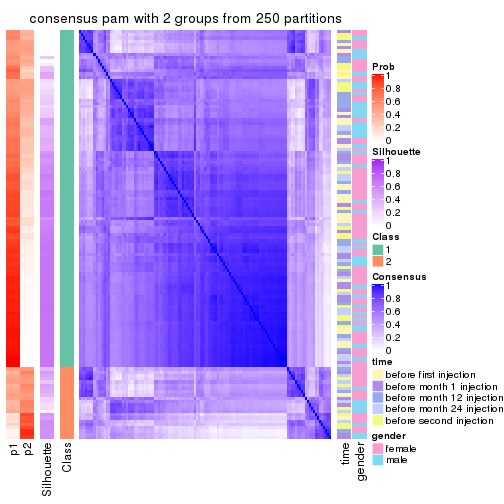</p>

</div>
<div id='tab-CV-pam-consensus-heatmap-2'>
<pre><code class="r">consensus_heatmap(res, k = 3)
</code></pre>

<p></p>

</div>
<div id='tab-CV-pam-consensus-heatmap-3'>
<pre><code class="r">consensus_heatmap(res, k = 4)
</code></pre>

<p></p>

</div>
<div id='tab-CV-pam-consensus-heatmap-4'>
<pre><code class="r">consensus_heatmap(res, k = 5)
</code></pre>

<p></p>

</div>
<div id='tab-CV-pam-consensus-heatmap-5'>
<pre><code class="r">consensus_heatmap(res, k = 6)
</code></pre>

<p></p>

</div>
</div>

Heatmaps for the membership of samples in all partitions to see how consistent they are:


<script>
$( function() {
	$( '#tabs-CV-pam-membership-heatmap' ).tabs();
} );
</script>
<div id='tabs-CV-pam-membership-heatmap'>
<ul>
<li><a href='#tab-CV-pam-membership-heatmap-1'>k = 2</a></li>
<li><a href='#tab-CV-pam-membership-heatmap-2'>k = 3</a></li>
<li><a href='#tab-CV-pam-membership-heatmap-3'>k = 4</a></li>
<li><a href='#tab-CV-pam-membership-heatmap-4'>k = 5</a></li>
<li><a href='#tab-CV-pam-membership-heatmap-5'>k = 6</a></li>
</ul>
<div id='tab-CV-pam-membership-heatmap-1'>
<pre><code class="r">membership_heatmap(res, k = 2)
</code></pre>

<p></p>

</div>
<div id='tab-CV-pam-membership-heatmap-2'>
<pre><code class="r">membership_heatmap(res, k = 3)
</code></pre>

<p></p>

</div>
<div id='tab-CV-pam-membership-heatmap-3'>
<pre><code class="r">membership_heatmap(res, k = 4)
</code></pre>

<p></p>

</div>
<div id='tab-CV-pam-membership-heatmap-4'>
<pre><code class="r">membership_heatmap(res, k = 5)
</code></pre>

<p></p>

</div>
<div id='tab-CV-pam-membership-heatmap-5'>
<pre><code class="r">membership_heatmap(res, k = 6)
</code></pre>

<p></p>

</div>
</div>

As soon as we have had the classes for columns, we can look for signatures
which are significantly different between classes which can be candidate marks
for certain classes. Following are the heatmaps for signatures.


Signature heatmaps where rows are scaled:


<script>
$( function() {
	$( '#tabs-CV-pam-get-signatures' ).tabs();
} );
</script>
<div id='tabs-CV-pam-get-signatures'>
<ul>
<li><a href='#tab-CV-pam-get-signatures-1'>k = 2</a></li>
<li><a href='#tab-CV-pam-get-signatures-2'>k = 3</a></li>
<li><a href='#tab-CV-pam-get-signatures-3'>k = 4</a></li>
<li><a href='#tab-CV-pam-get-signatures-4'>k = 5</a></li>
<li><a href='#tab-CV-pam-get-signatures-5'>k = 6</a></li>
</ul>
<div id='tab-CV-pam-get-signatures-1'>
<pre><code class="r">get_signatures(res, k = 2)
</code></pre>

<p></p>

</div>
<div id='tab-CV-pam-get-signatures-2'>
<pre><code class="r">get_signatures(res, k = 3)
</code></pre>

<p></p>

</div>
<div id='tab-CV-pam-get-signatures-3'>
<pre><code class="r">get_signatures(res, k = 4)
</code></pre>

<p></p>

</div>
<div id='tab-CV-pam-get-signatures-4'>
<pre><code class="r">get_signatures(res, k = 5)
</code></pre>

<p>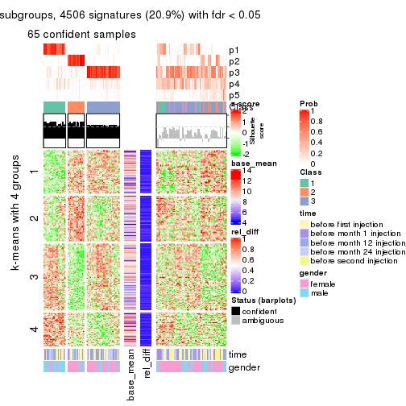</p>

</div>
<div id='tab-CV-pam-get-signatures-5'>
<pre><code class="r">get_signatures(res, k = 6)
</code></pre>

<p></p>

</div>
</div>


Signature heatmaps where rows are not scaled:


<script>
$( function() {
	$( '#tabs-CV-pam-get-signatures-no-scale' ).tabs();
} );
</script>
<div id='tabs-CV-pam-get-signatures-no-scale'>
<ul>
<li><a href='#tab-CV-pam-get-signatures-no-scale-1'>k = 2</a></li>
<li><a href='#tab-CV-pam-get-signatures-no-scale-2'>k = 3</a></li>
<li><a href='#tab-CV-pam-get-signatures-no-scale-3'>k = 4</a></li>
<li><a href='#tab-CV-pam-get-signatures-no-scale-4'>k = 5</a></li>
<li><a href='#tab-CV-pam-get-signatures-no-scale-5'>k = 6</a></li>
</ul>
<div id='tab-CV-pam-get-signatures-no-scale-1'>
<pre><code class="r">get_signatures(res, k = 2, scale_rows = FALSE)
</code></pre>

<p></p>

</div>
<div id='tab-CV-pam-get-signatures-no-scale-2'>
<pre><code class="r">get_signatures(res, k = 3, scale_rows = FALSE)
</code></pre>

<p></p>

</div>
<div id='tab-CV-pam-get-signatures-no-scale-3'>
<pre><code class="r">get_signatures(res, k = 4, scale_rows = FALSE)
</code></pre>

<p></p>

</div>
<div id='tab-CV-pam-get-signatures-no-scale-4'>
<pre><code class="r">get_signatures(res, k = 5, scale_rows = FALSE)
</code></pre>

<p></p>

</div>
<div id='tab-CV-pam-get-signatures-no-scale-5'>
<pre><code class="r">get_signatures(res, k = 6, scale_rows = FALSE)
</code></pre>

<p></p>

</div>
</div>


Compare the overlap of signatures from different k:

```r
compare_signatures(res)
```


`get_signature()` returns a data frame invisibly. TO get the list of signatures, the function
call should be assigned to a variable explicitly. In following code, if `plot` argument is set
to `FALSE`, no heatmap is plotted while only the differential analysis is performed.

```r
# code only for demonstration
tb = get_signature(res, k = ..., plot = FALSE)
```

An example of the output of `tb` is:

```
#>   which_row         fdr    mean_1    mean_2 scaled_mean_1 scaled_mean_2 km
#> 1        38 0.042760348  8.373488  9.131774    -0.5533452     0.5164555  1
#> 2        40 0.018707592  7.106213  8.469186    -0.6173731     0.5762149  1
#> 3        55 0.019134737 10.221463 11.207825    -0.6159697     0.5749050  1
#> 4        59 0.006059896  5.921854  7.869574    -0.6899429     0.6439467  1
#> 5        60 0.018055526  8.928898 10.211722    -0.6204761     0.5791110  1
#> 6        98 0.009384629 15.714769 14.887706     0.6635654    -0.6193277  2
...
```

The columns in `tb` are:

1. `which_row`: row indices corresponding to the input matrix.
2. `fdr`: FDR for the differential test. 
3. `mean_x`: The mean value in group x.
4. `scaled_mean_x`: The mean value in group x after rows are scaled.
5. `km`: Row groups if k-means clustering is applied to rows.


UMAP plot which shows how samples are separated.


<script>
$( function() {
	$( '#tabs-CV-pam-dimension-reduction' ).tabs();
} );
</script>
<div id='tabs-CV-pam-dimension-reduction'>
<ul>
<li><a href='#tab-CV-pam-dimension-reduction-1'>k = 2</a></li>
<li><a href='#tab-CV-pam-dimension-reduction-2'>k = 3</a></li>
<li><a href='#tab-CV-pam-dimension-reduction-3'>k = 4</a></li>
<li><a href='#tab-CV-pam-dimension-reduction-4'>k = 5</a></li>
<li><a href='#tab-CV-pam-dimension-reduction-5'>k = 6</a></li>
</ul>
<div id='tab-CV-pam-dimension-reduction-1'>
<pre><code class="r">dimension_reduction(res, k = 2, method = &quot;UMAP&quot;)
</code></pre>

<p>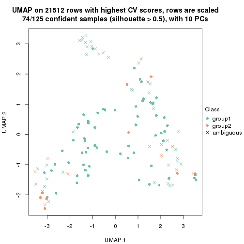</p>

</div>
<div id='tab-CV-pam-dimension-reduction-2'>
<pre><code class="r">dimension_reduction(res, k = 3, method = &quot;UMAP&quot;)
</code></pre>

<p></p>

</div>
<div id='tab-CV-pam-dimension-reduction-3'>
<pre><code class="r">dimension_reduction(res, k = 4, method = &quot;UMAP&quot;)
</code></pre>

<p></p>

</div>
<div id='tab-CV-pam-dimension-reduction-4'>
<pre><code class="r">dimension_reduction(res, k = 5, method = &quot;UMAP&quot;)
</code></pre>

<p></p>

</div>
<div id='tab-CV-pam-dimension-reduction-5'>
<pre><code class="r">dimension_reduction(res, k = 6, method = &quot;UMAP&quot;)
</code></pre>

<p></p>

</div>
</div>


Following heatmap shows how subgroups are split when increasing `k`:

```r
collect_classes(res)
```


Test correlation between subgroups and known annotations. If the known
annotation is numeric, one-way ANOVA test is applied, and if the known
annotation is discrete, chi-squared contingency table test is applied.

```r
test_to_known_factors(res)
```

```
#>          n time(p) gender(p) k
#> CV:pam  74   0.296  0.848709 2
#> CV:pam 112   0.942  0.002267 3
#> CV:pam  72   0.939  0.000563 4
#> CV:pam  65   0.968  0.000138 5
#> CV:pam  65   0.968  0.000138 6
```


If matrix rows can be associated to genes, consider to use `functional_enrichment(res,
...)` to perform function enrichment for the signature genes. See [this vignette](http://bioconductor.org/packages/devel/bioc/vignettes/cola/inst/doc/functional_enrichment.html) for more detailed explanations.


 

---------------------------------------------------


### CV:mclust


The object with results only for a single top-value method and a single partition method 
can be extracted as:

```r
res = res_list["CV", "mclust"]
# you can also extract it by
# res = res_list["CV:mclust"]
```

A summary of `res` and all the functions that can be applied to it:

```r
res
```

```
#> A 'ConsensusPartition' object with k = 2, 3, 4, 5, 6.
#>   On a matrix with 21512 rows and 125 columns.
#>   Top rows (1000, 2000, 3000, 4000, 5000) are extracted by 'CV' method.
#>   Subgroups are detected by 'mclust' method.
#>   Performed in total 1250 partitions by row resampling.
#>   Best k for subgroups seems to be 6.
#> 
#> Following methods can be applied to this 'ConsensusPartition' object:
#>  [1] "cola_report"             "collect_classes"         "collect_plots"          
#>  [4] "collect_stats"           "colnames"                "compare_signatures"     
#>  [7] "consensus_heatmap"       "dimension_reduction"     "functional_enrichment"  
#> [10] "get_anno_col"            "get_anno"                "get_classes"            
#> [13] "get_consensus"           "get_matrix"              "get_membership"         
#> [16] "get_param"               "get_signatures"          "get_stats"              
#> [19] "is_best_k"               "is_stable_k"             "membership_heatmap"     
#> [22] "ncol"                    "nrow"                    "plot_ecdf"              
#> [25] "rownames"                "select_partition_number" "show"                   
#> [28] "suggest_best_k"          "test_to_known_factors"
```

`collect_plots()` function collects all the plots made from `res` for all `k` (number of partitions)
into one single page to provide an easy and fast comparison between different `k`.

```r
collect_plots(res)
```


The plots are:

- The first row: a plot of the ECDF (empirical cumulative distribution
  function) curves of the consensus matrix for each `k` and the heatmap of
  predicted classes for each `k`.
- The second row: heatmaps of the consensus matrix for each `k`.
- The third row: heatmaps of the membership matrix for each `k`.
- The fouth row: heatmaps of the signatures for each `k`.

All the plots in panels can be made by individual functions and they are
plotted later in this section.

`select_partition_number()` produces several plots showing different
statistics for choosing "optimized" `k`. There are following statistics:

- ECDF curves of the consensus matrix for each `k`;
- 1-PAC. [The PAC
  score](https://en.wikipedia.org/wiki/Consensus_clustering#Over-interpretation_potential_of_consensus_clustering)
  measures the proportion of the ambiguous subgrouping.
- Mean silhouette score.
- Concordance. The mean probability of fiting the consensus class ids in all
  partitions.
- Area increased. Denote $A_k$ as the area under the ECDF curve for current
  `k`, the area increased is defined as $A_k - A_{k-1}$.
- Rand index. The percent of pairs of samples that are both in a same cluster
  or both are not in a same cluster in the partition of k and k-1.
- Jaccard index. The ratio of pairs of samples are both in a same cluster in
  the partition of k and k-1 and the pairs of samples are both in a same
  cluster in the partition k or k-1.

The detailed explanations of these statistics can be found in [the _cola_
vignette](http://bioconductor.org/packages/devel/bioc/vignettes/cola/inst/doc/cola.html#toc_13).

Generally speaking, lower PAC score, higher mean silhouette score or higher
concordance corresponds to better partition. Rand index and Jaccard index
measure how similar the current partition is compared to partition with `k-1`.
If they are too similar, we won't accept `k` is better than `k-1`.

```r
select_partition_number(res)
```


The numeric values for all these statistics can be obtained by `get_stats()`.

```r
get_stats(res)
```

```
#>   k 1-PAC mean_silhouette concordance area_increased  Rand Jaccard
#> 2 2 0.400           0.849       0.872         0.4437 0.496   0.496
#> 3 3 0.288           0.647       0.739         0.3014 0.858   0.730
#> 4 4 0.486           0.517       0.710         0.1625 0.863   0.688
#> 5 5 0.769           0.793       0.894         0.1527 0.782   0.427
#> 6 6 0.827           0.797       0.904         0.0515 0.952   0.786
```

`suggest_best_k()` suggests the best $k$ based on these statistics. The rules are as follows:

- All $k$ with Jaccard index larger than 0.95 are removed because increasing
  $k$ does not provide enough extra information. If all $k$ are removed, it is
  marked as no subgroup is detected.
- For all $k$ with 1-PAC score larger than 0.9, the maximal $k$ is taken as
  the best $k$, and other $k$ are marked as optional $k$.
- If it does not fit the second rule. The $k$ with the maximal vote of the
  highest 1-PAC score, highest mean silhouette, and highest concordance is
  taken as the best $k$.

```r
suggest_best_k(res)
```

```
#> [1] 6
```


Following shows the table of the partitions (You need to click the **show/hide
code output** link to see it). The membership matrix (columns with name `p*`)
is inferred by
[`clue::cl_consensus()`](https://www.rdocumentation.org/link/cl_consensus?package=clue)
function with the `SE` method. Basically the value in the membership matrix
represents the probability to belong to a certain group. The finall class
label for an item is determined with the group with highest probability it
belongs to.

In `get_classes()` function, the entropy is calculated from the membership
matrix and the silhouette score is calculated from the consensus matrix.


<script>
$( function() {
	$( '#tabs-CV-mclust-get-classes' ).tabs();
} );
</script>
<div id='tabs-CV-mclust-get-classes'>
<ul>
<li><a href='#tab-CV-mclust-get-classes-1'>k = 2</a></li>
<li><a href='#tab-CV-mclust-get-classes-2'>k = 3</a></li>
<li><a href='#tab-CV-mclust-get-classes-3'>k = 4</a></li>
<li><a href='#tab-CV-mclust-get-classes-4'>k = 5</a></li>
<li><a href='#tab-CV-mclust-get-classes-5'>k = 6</a></li>
</ul>

<div id='tab-CV-mclust-get-classes-1'>
<p><a id='tab-CV-mclust-get-classes-1-a' style='color:#0366d6' href='#'>show/hide code output</a></p>
<pre><code class="r">cbind(get_classes(res, k = 2), get_membership(res, k = 2))
</code></pre>

<pre><code>#&gt;           class entropy silhouette    p1    p2
#&gt; GSM601872     2  0.0938      0.933 0.012 0.988
#&gt; GSM601882     2  0.0000      0.943 0.000 1.000
#&gt; GSM601887     1  0.9954      0.571 0.540 0.460
#&gt; GSM601892     1  0.8713      0.842 0.708 0.292
#&gt; GSM601897     2  0.9954     -0.361 0.460 0.540
#&gt; GSM601902     2  0.4939      0.858 0.108 0.892
#&gt; GSM601912     1  0.8016      0.878 0.756 0.244
#&gt; GSM601927     1  0.0376      0.763 0.996 0.004
#&gt; GSM601932     2  0.1843      0.929 0.028 0.972
#&gt; GSM601937     2  0.0000      0.943 0.000 1.000
#&gt; GSM601942     2  0.0000      0.943 0.000 1.000
#&gt; GSM601947     2  0.0938      0.938 0.012 0.988
#&gt; GSM601957     1  0.7883      0.882 0.764 0.236
#&gt; GSM601972     2  0.1843      0.929 0.028 0.972
#&gt; GSM601977     2  0.0000      0.943 0.000 1.000
#&gt; GSM601987     2  0.0000      0.943 0.000 1.000
#&gt; GSM601877     1  0.2603      0.794 0.956 0.044
#&gt; GSM601907     2  0.0000      0.943 0.000 1.000
#&gt; GSM601917     2  0.4815      0.863 0.104 0.896
#&gt; GSM601922     2  0.4939      0.858 0.108 0.892
#&gt; GSM601952     2  0.0000      0.943 0.000 1.000
#&gt; GSM601962     1  0.8713      0.839 0.708 0.292
#&gt; GSM601967     1  0.7674      0.884 0.776 0.224
#&gt; GSM601982     2  0.4161      0.842 0.084 0.916
#&gt; GSM601992     2  0.0376      0.941 0.004 0.996
#&gt; GSM601873     2  0.0000      0.943 0.000 1.000
#&gt; GSM601883     2  0.0000      0.943 0.000 1.000
#&gt; GSM601888     1  0.9988      0.522 0.520 0.480
#&gt; GSM601893     1  0.9881      0.624 0.564 0.436
#&gt; GSM601898     1  0.7674      0.884 0.776 0.224
#&gt; GSM601903     2  0.4815      0.863 0.104 0.896
#&gt; GSM601913     1  0.7745      0.884 0.772 0.228
#&gt; GSM601928     1  0.1414      0.776 0.980 0.020
#&gt; GSM601933     2  0.0000      0.943 0.000 1.000
#&gt; GSM601938     2  0.0000      0.943 0.000 1.000
#&gt; GSM601943     2  0.0000      0.943 0.000 1.000
#&gt; GSM601948     1  0.7745      0.884 0.772 0.228
#&gt; GSM601958     1  0.7745      0.884 0.772 0.228
#&gt; GSM601973     2  0.2236      0.923 0.036 0.964
#&gt; GSM601978     2  0.0000      0.943 0.000 1.000
#&gt; GSM601988     2  0.0000      0.943 0.000 1.000
#&gt; GSM601878     1  0.5408      0.845 0.876 0.124
#&gt; GSM601908     2  0.0000      0.943 0.000 1.000
#&gt; GSM601918     2  0.3584      0.895 0.068 0.932
#&gt; GSM601923     1  0.0672      0.767 0.992 0.008
#&gt; GSM601953     2  0.0000      0.943 0.000 1.000
#&gt; GSM601963     1  0.7815      0.883 0.768 0.232
#&gt; GSM601968     1  0.8327      0.867 0.736 0.264
#&gt; GSM601983     1  0.7883      0.882 0.764 0.236
#&gt; GSM601993     2  0.0000      0.943 0.000 1.000
#&gt; GSM601874     2  0.0000      0.943 0.000 1.000
#&gt; GSM601884     2  0.0000      0.943 0.000 1.000
#&gt; GSM601889     1  0.7745      0.884 0.772 0.228
#&gt; GSM601894     1  0.8016      0.878 0.756 0.244
#&gt; GSM601899     1  0.9970      0.552 0.532 0.468
#&gt; GSM601904     2  0.4815      0.868 0.104 0.896
#&gt; GSM601914     1  0.8207      0.871 0.744 0.256
#&gt; GSM601929     1  0.4815      0.833 0.896 0.104
#&gt; GSM601934     2  0.0000      0.943 0.000 1.000
#&gt; GSM601939     1  0.7056      0.877 0.808 0.192
#&gt; GSM601944     2  0.0000      0.943 0.000 1.000
#&gt; GSM601949     1  0.7528      0.884 0.784 0.216
#&gt; GSM601959     1  0.7883      0.882 0.764 0.236
#&gt; GSM601974     2  0.8955      0.298 0.312 0.688
#&gt; GSM601979     2  0.0000      0.943 0.000 1.000
#&gt; GSM601989     1  0.7602      0.884 0.780 0.220
#&gt; GSM601879     1  0.5059      0.838 0.888 0.112
#&gt; GSM601909     1  0.8207      0.873 0.744 0.256
#&gt; GSM601919     2  0.3274      0.902 0.060 0.940
#&gt; GSM601924     1  0.5059      0.838 0.888 0.112
#&gt; GSM601954     2  0.0000      0.943 0.000 1.000
#&gt; GSM601964     1  0.7883      0.882 0.764 0.236
#&gt; GSM601969     1  0.7528      0.884 0.784 0.216
#&gt; GSM601984     1  0.7376      0.883 0.792 0.208
#&gt; GSM601994     2  0.0000      0.943 0.000 1.000
#&gt; GSM601875     2  0.0000      0.943 0.000 1.000
#&gt; GSM601885     2  0.0000      0.943 0.000 1.000
#&gt; GSM601890     1  0.9833      0.648 0.576 0.424
#&gt; GSM601895     1  0.8207      0.871 0.744 0.256
#&gt; GSM601900     1  0.8713      0.844 0.708 0.292
#&gt; GSM601905     2  0.4815      0.863 0.104 0.896
#&gt; GSM601915     1  0.7883      0.882 0.764 0.236
#&gt; GSM601930     1  0.1184      0.773 0.984 0.016
#&gt; GSM601935     2  0.9323      0.129 0.348 0.652
#&gt; GSM601940     1  0.7219      0.880 0.800 0.200
#&gt; GSM601945     2  0.0000      0.943 0.000 1.000
#&gt; GSM601950     1  0.7602      0.884 0.780 0.220
#&gt; GSM601960     1  0.8267      0.870 0.740 0.260
#&gt; GSM601975     2  0.2948      0.911 0.052 0.948
#&gt; GSM601980     2  0.0000      0.943 0.000 1.000
#&gt; GSM601990     1  0.7815      0.883 0.768 0.232
#&gt; GSM601880     1  0.2603      0.783 0.956 0.044
#&gt; GSM601910     1  0.8443      0.859 0.728 0.272
#&gt; GSM601920     2  0.5059      0.858 0.112 0.888
#&gt; GSM601925     1  0.0376      0.763 0.996 0.004
#&gt; GSM601955     2  0.0000      0.943 0.000 1.000
#&gt; GSM601965     1  0.7376      0.882 0.792 0.208
#&gt; GSM601970     1  0.7883      0.882 0.764 0.236
#&gt; GSM601985     1  0.7056      0.877 0.808 0.192
#&gt; GSM601995     2  0.0000      0.943 0.000 1.000
#&gt; GSM601876     1  0.7056      0.877 0.808 0.192
#&gt; GSM601886     2  0.0672      0.937 0.008 0.992
#&gt; GSM601891     1  0.9988      0.522 0.520 0.480
#&gt; GSM601896     1  0.7453      0.883 0.788 0.212
#&gt; GSM601901     2  0.0000      0.943 0.000 1.000
#&gt; GSM601906     1  0.9286      0.592 0.656 0.344
#&gt; GSM601916     2  0.2603      0.923 0.044 0.956
#&gt; GSM601931     1  0.1184      0.773 0.984 0.016
#&gt; GSM601936     2  0.0000      0.943 0.000 1.000
#&gt; GSM601941     2  0.2236      0.923 0.036 0.964
#&gt; GSM601946     1  0.7056      0.877 0.808 0.192
#&gt; GSM601951     1  0.4562      0.828 0.904 0.096
#&gt; GSM601961     2  0.0672      0.937 0.008 0.992
#&gt; GSM601976     2  0.0672      0.940 0.008 0.992
#&gt; GSM601981     2  0.0000      0.943 0.000 1.000
#&gt; GSM601991     1  0.9608      0.715 0.616 0.384
#&gt; GSM601881     1  0.0938      0.770 0.988 0.012
#&gt; GSM601911     2  0.5737      0.756 0.136 0.864
#&gt; GSM601921     2  0.4939      0.858 0.108 0.892
#&gt; GSM601926     1  0.0376      0.763 0.996 0.004
#&gt; GSM601956     2  0.0000      0.943 0.000 1.000
#&gt; GSM601966     2  0.0672      0.940 0.008 0.992
#&gt; GSM601971     1  0.7299      0.881 0.796 0.204
#&gt; GSM601986     1  0.9427      0.754 0.640 0.360
#&gt; GSM601996     2  0.1633      0.931 0.024 0.976
</code></pre>

<script>
$('#tab-CV-mclust-get-classes-1-a').parent().next().next().hide();
$('#tab-CV-mclust-get-classes-1-a').click(function(){
  $('#tab-CV-mclust-get-classes-1-a').parent().next().next().toggle();
  return(false);
});
</script>
</div>

<div id='tab-CV-mclust-get-classes-2'>
<p><a id='tab-CV-mclust-get-classes-2-a' style='color:#0366d6' href='#'>show/hide code output</a></p>
<pre><code class="r">cbind(get_classes(res, k = 3), get_membership(res, k = 3))
</code></pre>

<pre><code>#&gt;           class entropy silhouette    p1    p2    p3
#&gt; GSM601872     2  0.5028     0.7467 0.132 0.828 0.040
#&gt; GSM601882     2  0.4056     0.7805 0.092 0.876 0.032
#&gt; GSM601887     1  0.6967     0.5329 0.668 0.288 0.044
#&gt; GSM601892     1  0.4521     0.6550 0.816 0.180 0.004
#&gt; GSM601897     1  0.6745     0.1422 0.560 0.428 0.012
#&gt; GSM601902     2  0.5706     0.6398 0.000 0.680 0.320
#&gt; GSM601912     1  0.2772     0.7124 0.916 0.080 0.004
#&gt; GSM601927     3  0.5591     0.9278 0.304 0.000 0.696
#&gt; GSM601932     2  0.5848     0.6907 0.012 0.720 0.268
#&gt; GSM601937     2  0.7615     0.7029 0.148 0.688 0.164
#&gt; GSM601942     2  0.7039     0.7328 0.144 0.728 0.128
#&gt; GSM601947     2  0.6416     0.7033 0.032 0.708 0.260
#&gt; GSM601957     1  0.2165     0.7122 0.936 0.064 0.000
#&gt; GSM601972     2  0.6292     0.7349 0.044 0.740 0.216
#&gt; GSM601977     2  0.3933     0.7749 0.092 0.880 0.028
#&gt; GSM601987     2  0.4399     0.7689 0.092 0.864 0.044
#&gt; GSM601877     3  0.5621     0.9286 0.308 0.000 0.692
#&gt; GSM601907     2  0.4399     0.7689 0.092 0.864 0.044
#&gt; GSM601917     2  0.5706     0.6398 0.000 0.680 0.320
#&gt; GSM601922     2  0.6047     0.6400 0.008 0.680 0.312
#&gt; GSM601952     2  0.3042     0.7770 0.040 0.920 0.040
#&gt; GSM601962     1  0.4842     0.5417 0.776 0.224 0.000
#&gt; GSM601967     1  0.2280     0.7040 0.940 0.052 0.008
#&gt; GSM601982     2  0.4723     0.7295 0.160 0.824 0.016
#&gt; GSM601992     2  0.5506     0.7230 0.016 0.764 0.220
#&gt; GSM601873     2  0.4335     0.7721 0.100 0.864 0.036
#&gt; GSM601883     2  0.4232     0.7782 0.084 0.872 0.044
#&gt; GSM601888     2  0.6919     0.2014 0.448 0.536 0.016
#&gt; GSM601893     1  0.6633     0.5670 0.700 0.260 0.040
#&gt; GSM601898     1  0.1289     0.7028 0.968 0.032 0.000
#&gt; GSM601903     2  0.5678     0.6437 0.000 0.684 0.316
#&gt; GSM601913     1  0.0237     0.6868 0.996 0.004 0.000
#&gt; GSM601928     3  0.5621     0.9286 0.308 0.000 0.692
#&gt; GSM601933     2  0.3293     0.7783 0.088 0.900 0.012
#&gt; GSM601938     2  0.4556     0.7832 0.080 0.860 0.060
#&gt; GSM601943     2  0.5319     0.7585 0.104 0.824 0.072
#&gt; GSM601948     1  0.7078     0.3627 0.712 0.088 0.200
#&gt; GSM601958     1  0.1964     0.7086 0.944 0.056 0.000
#&gt; GSM601973     2  0.5884     0.6880 0.012 0.716 0.272
#&gt; GSM601978     2  0.4289     0.7698 0.092 0.868 0.040
#&gt; GSM601988     2  0.6693     0.7410 0.148 0.748 0.104
#&gt; GSM601878     3  0.6763     0.7525 0.436 0.012 0.552
#&gt; GSM601908     2  0.3973     0.7727 0.088 0.880 0.032
#&gt; GSM601918     2  0.5903     0.7169 0.024 0.744 0.232
#&gt; GSM601923     3  0.5591     0.9278 0.304 0.000 0.696
#&gt; GSM601953     2  0.4399     0.7689 0.092 0.864 0.044
#&gt; GSM601963     1  0.0424     0.6900 0.992 0.008 0.000
#&gt; GSM601968     1  0.2772     0.7120 0.916 0.080 0.004
#&gt; GSM601983     1  0.1289     0.7048 0.968 0.032 0.000
#&gt; GSM601993     2  0.5737     0.7547 0.092 0.804 0.104
#&gt; GSM601874     2  0.4399     0.7689 0.092 0.864 0.044
#&gt; GSM601884     2  0.4289     0.7699 0.092 0.868 0.040
#&gt; GSM601889     1  0.2400     0.7110 0.932 0.064 0.004
#&gt; GSM601894     1  0.2496     0.7119 0.928 0.068 0.004
#&gt; GSM601899     1  0.6967     0.5324 0.668 0.288 0.044
#&gt; GSM601904     2  0.6322     0.6768 0.024 0.700 0.276
#&gt; GSM601914     1  0.1163     0.6971 0.972 0.028 0.000
#&gt; GSM601929     1  0.9311    -0.3637 0.452 0.164 0.384
#&gt; GSM601934     2  0.3272     0.7742 0.104 0.892 0.004
#&gt; GSM601939     1  0.5948    -0.1105 0.640 0.000 0.360
#&gt; GSM601944     2  0.5285     0.7763 0.112 0.824 0.064
#&gt; GSM601949     1  0.8241     0.2979 0.636 0.160 0.204
#&gt; GSM601959     1  0.2400     0.7111 0.932 0.064 0.004
#&gt; GSM601974     2  0.8085     0.2779 0.412 0.520 0.068
#&gt; GSM601979     2  0.4289     0.7698 0.092 0.868 0.040
#&gt; GSM601989     1  0.2400     0.7110 0.932 0.064 0.004
#&gt; GSM601879     3  0.6359     0.8270 0.404 0.004 0.592
#&gt; GSM601909     1  0.2945     0.7104 0.908 0.088 0.004
#&gt; GSM601919     2  0.6335     0.7148 0.036 0.724 0.240
#&gt; GSM601924     3  0.6192     0.8012 0.420 0.000 0.580
#&gt; GSM601954     2  0.5191     0.7775 0.060 0.828 0.112
#&gt; GSM601964     1  0.0747     0.6942 0.984 0.016 0.000
#&gt; GSM601969     1  0.4249     0.6836 0.864 0.108 0.028
#&gt; GSM601984     1  0.9410    -0.0507 0.504 0.220 0.276
#&gt; GSM601994     2  0.5939     0.7269 0.028 0.748 0.224
#&gt; GSM601875     2  0.4399     0.7689 0.092 0.864 0.044
#&gt; GSM601885     2  0.3805     0.7771 0.092 0.884 0.024
#&gt; GSM601890     1  0.6562     0.5648 0.700 0.264 0.036
#&gt; GSM601895     1  0.2066     0.7099 0.940 0.060 0.000
#&gt; GSM601900     1  0.1860     0.7112 0.948 0.052 0.000
#&gt; GSM601905     2  0.6047     0.6544 0.008 0.680 0.312
#&gt; GSM601915     1  0.0747     0.6962 0.984 0.016 0.000
#&gt; GSM601930     3  0.5621     0.9286 0.308 0.000 0.692
#&gt; GSM601935     2  0.8211     0.4262 0.404 0.520 0.076
#&gt; GSM601940     1  0.5987     0.4208 0.756 0.036 0.208
#&gt; GSM601945     2  0.4289     0.7698 0.092 0.868 0.040
#&gt; GSM601950     1  0.6936     0.4830 0.732 0.108 0.160
#&gt; GSM601960     1  0.1753     0.7007 0.952 0.048 0.000
#&gt; GSM601975     2  0.5845     0.6536 0.004 0.688 0.308
#&gt; GSM601980     2  0.7615     0.7029 0.148 0.688 0.164
#&gt; GSM601990     1  0.0424     0.6900 0.992 0.008 0.000
#&gt; GSM601880     3  0.6387     0.9042 0.300 0.020 0.680
#&gt; GSM601910     1  0.2796     0.7122 0.908 0.092 0.000
#&gt; GSM601920     2  0.5678     0.6434 0.000 0.684 0.316
#&gt; GSM601925     3  0.5591     0.9278 0.304 0.000 0.696
#&gt; GSM601955     2  0.7615     0.7029 0.148 0.688 0.164
#&gt; GSM601965     1  0.9912    -0.1292 0.396 0.320 0.284
#&gt; GSM601970     1  0.1964     0.7078 0.944 0.056 0.000
#&gt; GSM601985     1  0.5325     0.3033 0.748 0.004 0.248
#&gt; GSM601995     2  0.7670     0.7005 0.152 0.684 0.164
#&gt; GSM601876     1  0.5956     0.0197 0.672 0.004 0.324
#&gt; GSM601886     2  0.7548     0.7162 0.204 0.684 0.112
#&gt; GSM601891     1  0.7186     0.4711 0.624 0.336 0.040
#&gt; GSM601896     1  0.5858     0.3160 0.740 0.020 0.240
#&gt; GSM601901     2  0.5731     0.7804 0.088 0.804 0.108
#&gt; GSM601906     2  0.9301     0.3871 0.212 0.520 0.268
#&gt; GSM601916     2  0.5902     0.6421 0.004 0.680 0.316
#&gt; GSM601931     3  0.5591     0.9278 0.304 0.000 0.696
#&gt; GSM601936     2  0.6470     0.7488 0.148 0.760 0.092
#&gt; GSM601941     2  0.5619     0.7067 0.012 0.744 0.244
#&gt; GSM601946     1  0.6079    -0.2688 0.612 0.000 0.388
#&gt; GSM601951     3  0.6848     0.7965 0.416 0.016 0.568
#&gt; GSM601961     2  0.5551     0.7033 0.212 0.768 0.020
#&gt; GSM601976     2  0.7188     0.7052 0.056 0.664 0.280
#&gt; GSM601981     2  0.4174     0.7706 0.092 0.872 0.036
#&gt; GSM601991     1  0.4750     0.5487 0.784 0.216 0.000
#&gt; GSM601881     3  0.5621     0.9286 0.308 0.000 0.692
#&gt; GSM601911     2  0.8472     0.6549 0.160 0.612 0.228
#&gt; GSM601921     2  0.5706     0.6398 0.000 0.680 0.320
#&gt; GSM601926     3  0.5591     0.9278 0.304 0.000 0.696
#&gt; GSM601956     2  0.4174     0.7710 0.092 0.872 0.036
#&gt; GSM601966     2  0.5756     0.7341 0.028 0.764 0.208
#&gt; GSM601971     1  0.3375     0.6645 0.908 0.048 0.044
#&gt; GSM601986     2  0.9883     0.0460 0.360 0.380 0.260
#&gt; GSM601996     2  0.5643     0.7246 0.020 0.760 0.220
</code></pre>

<script>
$('#tab-CV-mclust-get-classes-2-a').parent().next().next().hide();
$('#tab-CV-mclust-get-classes-2-a').click(function(){
  $('#tab-CV-mclust-get-classes-2-a').parent().next().next().toggle();
  return(false);
});
</script>
</div>

<div id='tab-CV-mclust-get-classes-3'>
<p><a id='tab-CV-mclust-get-classes-3-a' style='color:#0366d6' href='#'>show/hide code output</a></p>
<pre><code class="r">cbind(get_classes(res, k = 4), get_membership(res, k = 4))
</code></pre>

<pre><code>#&gt;           class entropy silhouette    p1    p2    p3    p4
#&gt; GSM601872     2  0.6747     0.7794 0.092 0.556 0.004 0.348
#&gt; GSM601882     4  0.5262     0.0292 0.020 0.304 0.004 0.672
#&gt; GSM601887     1  0.7182     0.3367 0.556 0.340 0.068 0.036
#&gt; GSM601892     1  0.3354     0.6821 0.880 0.084 0.020 0.016
#&gt; GSM601897     1  0.7928     0.3643 0.608 0.140 0.116 0.136
#&gt; GSM601902     4  0.3390     0.5307 0.000 0.132 0.016 0.852
#&gt; GSM601912     1  0.0844     0.7380 0.980 0.004 0.004 0.012
#&gt; GSM601927     3  0.5090     0.9395 0.324 0.000 0.660 0.016
#&gt; GSM601932     4  0.1256     0.5573 0.000 0.028 0.008 0.964
#&gt; GSM601937     4  0.9272     0.1611 0.084 0.272 0.276 0.368
#&gt; GSM601942     4  0.8987     0.0655 0.088 0.220 0.236 0.456
#&gt; GSM601947     4  0.0992     0.5557 0.012 0.008 0.004 0.976
#&gt; GSM601957     1  0.0804     0.7387 0.980 0.012 0.008 0.000
#&gt; GSM601972     4  0.1492     0.5450 0.004 0.036 0.004 0.956
#&gt; GSM601977     4  0.5643    -0.4578 0.016 0.440 0.004 0.540
#&gt; GSM601987     2  0.4950     0.8907 0.004 0.620 0.000 0.376
#&gt; GSM601877     3  0.5090     0.9395 0.324 0.000 0.660 0.016
#&gt; GSM601907     2  0.4819     0.9043 0.004 0.652 0.000 0.344
#&gt; GSM601917     4  0.3606     0.5266 0.000 0.132 0.024 0.844
#&gt; GSM601922     4  0.3736     0.5313 0.004 0.128 0.024 0.844
#&gt; GSM601952     4  0.3878     0.4147 0.016 0.156 0.004 0.824
#&gt; GSM601962     1  0.2002     0.7105 0.936 0.020 0.000 0.044
#&gt; GSM601967     1  0.0672     0.7387 0.984 0.008 0.008 0.000
#&gt; GSM601982     4  0.6991    -0.2980 0.128 0.348 0.000 0.524
#&gt; GSM601992     4  0.1296     0.5487 0.004 0.028 0.004 0.964
#&gt; GSM601873     4  0.7308    -0.5149 0.076 0.416 0.028 0.480
#&gt; GSM601883     2  0.5168     0.6644 0.004 0.504 0.000 0.492
#&gt; GSM601888     1  0.8299    -0.2443 0.400 0.368 0.024 0.208
#&gt; GSM601893     1  0.6769     0.3687 0.588 0.324 0.068 0.020
#&gt; GSM601898     1  0.0188     0.7400 0.996 0.004 0.000 0.000
#&gt; GSM601903     4  0.3217     0.5339 0.000 0.128 0.012 0.860
#&gt; GSM601913     1  0.0188     0.7400 0.996 0.004 0.000 0.000
#&gt; GSM601928     3  0.5090     0.9395 0.324 0.000 0.660 0.016
#&gt; GSM601933     4  0.4997     0.0817 0.012 0.296 0.004 0.688
#&gt; GSM601938     4  0.3105     0.4462 0.004 0.140 0.000 0.856
#&gt; GSM601943     4  0.8427    -0.3794 0.084 0.352 0.104 0.460
#&gt; GSM601948     1  0.3953     0.6379 0.848 0.024 0.108 0.020
#&gt; GSM601958     1  0.0188     0.7402 0.996 0.000 0.004 0.000
#&gt; GSM601973     4  0.1388     0.5581 0.000 0.028 0.012 0.960
#&gt; GSM601978     2  0.5349     0.8924 0.024 0.640 0.000 0.336
#&gt; GSM601988     4  0.9093     0.1917 0.080 0.268 0.236 0.416
#&gt; GSM601878     3  0.5602     0.6971 0.472 0.000 0.508 0.020
#&gt; GSM601908     2  0.5172     0.8417 0.008 0.588 0.000 0.404
#&gt; GSM601918     4  0.0844     0.5551 0.004 0.012 0.004 0.980
#&gt; GSM601923     3  0.5090     0.9395 0.324 0.000 0.660 0.016
#&gt; GSM601953     2  0.5848     0.8644 0.048 0.616 0.000 0.336
#&gt; GSM601963     1  0.0376     0.7396 0.992 0.004 0.004 0.000
#&gt; GSM601968     1  0.0672     0.7394 0.984 0.008 0.008 0.000
#&gt; GSM601983     1  0.0188     0.7400 0.996 0.004 0.000 0.000
#&gt; GSM601993     4  0.7242     0.3977 0.036 0.184 0.148 0.632
#&gt; GSM601874     2  0.4819     0.9043 0.004 0.652 0.000 0.344
#&gt; GSM601884     2  0.5441     0.8509 0.012 0.588 0.004 0.396
#&gt; GSM601889     1  0.0188     0.7400 0.996 0.004 0.000 0.000
#&gt; GSM601894     1  0.0000     0.7402 1.000 0.000 0.000 0.000
#&gt; GSM601899     1  0.7104     0.3559 0.576 0.320 0.068 0.036
#&gt; GSM601904     4  0.2949     0.5461 0.000 0.088 0.024 0.888
#&gt; GSM601914     1  0.0927     0.7348 0.976 0.008 0.016 0.000
#&gt; GSM601929     1  0.5827    -0.0220 0.632 0.000 0.316 0.052
#&gt; GSM601934     4  0.5805    -0.3104 0.036 0.388 0.000 0.576
#&gt; GSM601939     1  0.4126     0.4737 0.776 0.004 0.216 0.004
#&gt; GSM601944     4  0.6882     0.3061 0.040 0.144 0.144 0.672
#&gt; GSM601949     1  0.4937     0.5552 0.788 0.028 0.152 0.032
#&gt; GSM601959     1  0.0672     0.7387 0.984 0.008 0.008 0.000
#&gt; GSM601974     1  0.6678    -0.1193 0.480 0.056 0.012 0.452
#&gt; GSM601979     2  0.4819     0.9043 0.004 0.652 0.000 0.344
#&gt; GSM601989     1  0.0672     0.7387 0.984 0.008 0.008 0.000
#&gt; GSM601879     3  0.5459     0.7897 0.432 0.000 0.552 0.016
#&gt; GSM601909     1  0.0336     0.7399 0.992 0.008 0.000 0.000
#&gt; GSM601919     4  0.1247     0.5543 0.016 0.012 0.004 0.968
#&gt; GSM601924     3  0.5767     0.7766 0.436 0.008 0.540 0.016
#&gt; GSM601954     4  0.3547     0.4407 0.016 0.144 0.000 0.840
#&gt; GSM601964     1  0.0188     0.7400 0.996 0.004 0.000 0.000
#&gt; GSM601969     1  0.2585     0.7096 0.916 0.032 0.048 0.004
#&gt; GSM601984     1  0.6491     0.3195 0.680 0.020 0.188 0.112
#&gt; GSM601994     4  0.1082     0.5521 0.004 0.020 0.004 0.972
#&gt; GSM601875     2  0.4819     0.9043 0.004 0.652 0.000 0.344
#&gt; GSM601885     4  0.5150    -0.3283 0.008 0.396 0.000 0.596
#&gt; GSM601890     1  0.5632     0.5391 0.744 0.168 0.068 0.020
#&gt; GSM601895     1  0.0188     0.7400 0.996 0.004 0.000 0.000
#&gt; GSM601900     1  0.0524     0.7403 0.988 0.008 0.004 0.000
#&gt; GSM601905     4  0.3790     0.5289 0.004 0.132 0.024 0.840
#&gt; GSM601915     1  0.0188     0.7400 0.996 0.004 0.000 0.000
#&gt; GSM601930     3  0.5090     0.9395 0.324 0.000 0.660 0.016
#&gt; GSM601935     4  0.9684     0.1509 0.240 0.232 0.160 0.368
#&gt; GSM601940     1  0.3350     0.6433 0.864 0.016 0.116 0.004
#&gt; GSM601945     2  0.4837     0.9036 0.004 0.648 0.000 0.348
#&gt; GSM601950     1  0.3882     0.6421 0.852 0.028 0.104 0.016
#&gt; GSM601960     1  0.1488     0.7253 0.956 0.012 0.032 0.000
#&gt; GSM601975     4  0.3166     0.5390 0.000 0.116 0.016 0.868
#&gt; GSM601980     4  0.9322     0.1492 0.088 0.276 0.276 0.360
#&gt; GSM601990     1  0.0804     0.7362 0.980 0.008 0.012 0.000
#&gt; GSM601880     3  0.5291     0.9263 0.324 0.000 0.652 0.024
#&gt; GSM601910     1  0.0336     0.7399 0.992 0.008 0.000 0.000
#&gt; GSM601920     4  0.3606     0.5266 0.000 0.132 0.024 0.844
#&gt; GSM601925     3  0.5090     0.9395 0.324 0.000 0.660 0.016
#&gt; GSM601955     4  0.9322     0.1492 0.088 0.276 0.276 0.360
#&gt; GSM601965     1  0.6665     0.3579 0.680 0.028 0.140 0.152
#&gt; GSM601970     1  0.0188     0.7403 0.996 0.004 0.000 0.000
#&gt; GSM601985     1  0.3725     0.5583 0.812 0.008 0.180 0.000
#&gt; GSM601995     4  0.9305     0.1630 0.088 0.268 0.276 0.368
#&gt; GSM601876     1  0.4216     0.5018 0.788 0.008 0.196 0.008
#&gt; GSM601886     4  0.8228     0.2786 0.152 0.128 0.140 0.580
#&gt; GSM601891     1  0.7474     0.3175 0.540 0.340 0.068 0.052
#&gt; GSM601896     1  0.3755     0.5912 0.836 0.008 0.144 0.012
#&gt; GSM601901     4  0.4891     0.0428 0.012 0.308 0.000 0.680
#&gt; GSM601906     4  0.7044     0.2679 0.220 0.012 0.156 0.612
#&gt; GSM601916     4  0.3568     0.5375 0.004 0.116 0.024 0.856
#&gt; GSM601931     3  0.5090     0.9395 0.324 0.000 0.660 0.016
#&gt; GSM601936     4  0.8438     0.3077 0.076 0.228 0.168 0.528
#&gt; GSM601941     4  0.0524     0.5562 0.000 0.004 0.008 0.988
#&gt; GSM601946     1  0.4710     0.3498 0.732 0.008 0.252 0.008
#&gt; GSM601951     1  0.5508    -0.6145 0.508 0.000 0.476 0.016
#&gt; GSM601961     4  0.6248    -0.5850 0.044 0.472 0.004 0.480
#&gt; GSM601976     4  0.3344     0.5556 0.008 0.092 0.024 0.876
#&gt; GSM601981     2  0.5099     0.8852 0.008 0.612 0.000 0.380
#&gt; GSM601991     1  0.3218     0.6736 0.896 0.028 0.032 0.044
#&gt; GSM601881     3  0.5130     0.9328 0.332 0.000 0.652 0.016
#&gt; GSM601911     4  0.6976     0.2964 0.188 0.092 0.056 0.664
#&gt; GSM601921     4  0.3501     0.5290 0.000 0.132 0.020 0.848
#&gt; GSM601926     3  0.5090     0.9395 0.324 0.000 0.660 0.016
#&gt; GSM601956     2  0.6329     0.8453 0.064 0.588 0.004 0.344
#&gt; GSM601966     4  0.0967     0.5508 0.004 0.016 0.004 0.976
#&gt; GSM601971     1  0.1824     0.7058 0.936 0.004 0.060 0.000
#&gt; GSM601986     1  0.7669     0.0921 0.556 0.032 0.136 0.276
#&gt; GSM601996     4  0.0844     0.5549 0.004 0.012 0.004 0.980
</code></pre>

<script>
$('#tab-CV-mclust-get-classes-3-a').parent().next().next().hide();
$('#tab-CV-mclust-get-classes-3-a').click(function(){
  $('#tab-CV-mclust-get-classes-3-a').parent().next().next().toggle();
  return(false);
});
</script>
</div>

<div id='tab-CV-mclust-get-classes-4'>
<p><a id='tab-CV-mclust-get-classes-4-a' style='color:#0366d6' href='#'>show/hide code output</a></p>
<pre><code class="r">cbind(get_classes(res, k = 5), get_membership(res, k = 5))
</code></pre>

<pre><code>#&gt;           class entropy silhouette    p1    p2    p3    p4    p5
#&gt; GSM601872     2  0.3340     0.7281 0.000 0.856 0.044 0.012 0.088
#&gt; GSM601882     2  0.4387     0.4977 0.000 0.640 0.012 0.348 0.000
#&gt; GSM601887     3  0.3906     0.6936 0.000 0.240 0.744 0.000 0.016
#&gt; GSM601892     3  0.0693     0.9361 0.000 0.012 0.980 0.000 0.008
#&gt; GSM601897     3  0.2266     0.8924 0.000 0.016 0.912 0.008 0.064
#&gt; GSM601902     4  0.0000     0.9222 0.000 0.000 0.000 1.000 0.000
#&gt; GSM601912     3  0.0324     0.9430 0.004 0.000 0.992 0.004 0.000
#&gt; GSM601927     1  0.0000     0.8200 1.000 0.000 0.000 0.000 0.000
#&gt; GSM601932     4  0.0404     0.9254 0.000 0.012 0.000 0.988 0.000
#&gt; GSM601937     5  0.1195     0.8346 0.000 0.028 0.000 0.012 0.960
#&gt; GSM601942     5  0.2069     0.8163 0.000 0.076 0.000 0.012 0.912
#&gt; GSM601947     4  0.1121     0.9179 0.000 0.044 0.000 0.956 0.000
#&gt; GSM601957     3  0.0451     0.9440 0.008 0.000 0.988 0.000 0.004
#&gt; GSM601972     4  0.1478     0.9085 0.000 0.064 0.000 0.936 0.000
#&gt; GSM601977     2  0.1121     0.7966 0.000 0.956 0.000 0.044 0.000
#&gt; GSM601987     2  0.0510     0.8018 0.000 0.984 0.000 0.016 0.000
#&gt; GSM601877     1  0.0000     0.8200 1.000 0.000 0.000 0.000 0.000
#&gt; GSM601907     2  0.0162     0.8000 0.000 0.996 0.000 0.004 0.000
#&gt; GSM601917     4  0.0000     0.9222 0.000 0.000 0.000 1.000 0.000
#&gt; GSM601922     4  0.0566     0.9182 0.012 0.004 0.000 0.984 0.000
#&gt; GSM601952     2  0.4697     0.3986 0.000 0.592 0.000 0.388 0.020
#&gt; GSM601962     3  0.0740     0.9393 0.008 0.000 0.980 0.008 0.004
#&gt; GSM601967     3  0.0566     0.9429 0.012 0.000 0.984 0.000 0.004
#&gt; GSM601982     2  0.3424     0.7466 0.008 0.856 0.076 0.056 0.004
#&gt; GSM601992     4  0.3043     0.8574 0.000 0.080 0.000 0.864 0.056
#&gt; GSM601873     2  0.2293     0.7666 0.000 0.900 0.000 0.016 0.084
#&gt; GSM601883     2  0.3143     0.6929 0.000 0.796 0.000 0.204 0.000
#&gt; GSM601888     2  0.4899     0.0528 0.000 0.524 0.456 0.008 0.012
#&gt; GSM601893     3  0.2873     0.8369 0.000 0.128 0.856 0.000 0.016
#&gt; GSM601898     3  0.0290     0.9439 0.008 0.000 0.992 0.000 0.000
#&gt; GSM601903     4  0.0162     0.9241 0.000 0.004 0.000 0.996 0.000
#&gt; GSM601913     3  0.0404     0.9431 0.012 0.000 0.988 0.000 0.000
#&gt; GSM601928     1  0.0000     0.8200 1.000 0.000 0.000 0.000 0.000
#&gt; GSM601933     2  0.3707     0.6124 0.000 0.716 0.000 0.284 0.000
#&gt; GSM601938     4  0.4657     0.5254 0.000 0.296 0.000 0.668 0.036
#&gt; GSM601943     2  0.4511     0.4198 0.000 0.628 0.000 0.016 0.356
#&gt; GSM601948     1  0.3715     0.7122 0.736 0.000 0.260 0.000 0.004
#&gt; GSM601958     3  0.0404     0.9430 0.012 0.000 0.988 0.000 0.000
#&gt; GSM601973     4  0.0566     0.9251 0.000 0.012 0.000 0.984 0.004
#&gt; GSM601978     2  0.0324     0.7996 0.000 0.992 0.000 0.004 0.004
#&gt; GSM601988     5  0.3161     0.8108 0.000 0.092 0.004 0.044 0.860
#&gt; GSM601878     1  0.1121     0.8300 0.956 0.000 0.044 0.000 0.000
#&gt; GSM601908     2  0.0703     0.8009 0.000 0.976 0.000 0.024 0.000
#&gt; GSM601918     4  0.1121     0.9179 0.000 0.044 0.000 0.956 0.000
#&gt; GSM601923     1  0.0000     0.8200 1.000 0.000 0.000 0.000 0.000
#&gt; GSM601953     2  0.0324     0.7996 0.000 0.992 0.000 0.004 0.004
#&gt; GSM601963     3  0.0290     0.9439 0.008 0.000 0.992 0.000 0.000
#&gt; GSM601968     3  0.0324     0.9435 0.004 0.000 0.992 0.000 0.004
#&gt; GSM601983     3  0.0162     0.9437 0.004 0.000 0.996 0.000 0.000
#&gt; GSM601993     5  0.4392     0.4403 0.000 0.008 0.000 0.380 0.612
#&gt; GSM601874     2  0.0162     0.8000 0.000 0.996 0.000 0.004 0.000
#&gt; GSM601884     2  0.0671     0.8000 0.000 0.980 0.000 0.016 0.004
#&gt; GSM601889     3  0.0703     0.9369 0.024 0.000 0.976 0.000 0.000
#&gt; GSM601894     3  0.0162     0.9437 0.004 0.000 0.996 0.000 0.000
#&gt; GSM601899     3  0.3419     0.7767 0.000 0.180 0.804 0.000 0.016
#&gt; GSM601904     4  0.0162     0.9241 0.000 0.004 0.000 0.996 0.000
#&gt; GSM601914     3  0.0324     0.9438 0.004 0.000 0.992 0.000 0.004
#&gt; GSM601929     1  0.1942     0.8239 0.920 0.000 0.068 0.012 0.000
#&gt; GSM601934     2  0.2248     0.7776 0.000 0.900 0.012 0.088 0.000
#&gt; GSM601939     1  0.3636     0.6955 0.728 0.000 0.272 0.000 0.000
#&gt; GSM601944     2  0.6788     0.0260 0.000 0.372 0.000 0.344 0.284
#&gt; GSM601949     1  0.2392     0.8177 0.888 0.004 0.104 0.000 0.004
#&gt; GSM601959     3  0.0324     0.9435 0.004 0.000 0.992 0.000 0.004
#&gt; GSM601974     3  0.4730     0.6995 0.012 0.156 0.768 0.044 0.020
#&gt; GSM601979     2  0.0162     0.8000 0.000 0.996 0.000 0.004 0.000
#&gt; GSM601989     3  0.1043     0.9250 0.040 0.000 0.960 0.000 0.000
#&gt; GSM601879     1  0.1043     0.8298 0.960 0.000 0.040 0.000 0.000
#&gt; GSM601909     3  0.0162     0.9421 0.000 0.000 0.996 0.000 0.004
#&gt; GSM601919     4  0.1121     0.9179 0.000 0.044 0.000 0.956 0.000
#&gt; GSM601924     1  0.1043     0.8298 0.960 0.000 0.040 0.000 0.000
#&gt; GSM601954     2  0.4306     0.1198 0.000 0.508 0.000 0.492 0.000
#&gt; GSM601964     3  0.0290     0.9439 0.008 0.000 0.992 0.000 0.000
#&gt; GSM601969     3  0.3160     0.7363 0.188 0.000 0.808 0.000 0.004
#&gt; GSM601984     1  0.3039     0.7945 0.836 0.000 0.152 0.012 0.000
#&gt; GSM601994     4  0.2922     0.8639 0.000 0.072 0.000 0.872 0.056
#&gt; GSM601875     2  0.0162     0.8000 0.000 0.996 0.000 0.004 0.000
#&gt; GSM601885     2  0.2813     0.7281 0.000 0.832 0.000 0.168 0.000
#&gt; GSM601890     3  0.1117     0.9284 0.000 0.020 0.964 0.000 0.016
#&gt; GSM601895     3  0.0162     0.9437 0.004 0.000 0.996 0.000 0.000
#&gt; GSM601900     3  0.0324     0.9436 0.004 0.000 0.992 0.000 0.004
#&gt; GSM601905     4  0.0162     0.9239 0.000 0.004 0.000 0.996 0.000
#&gt; GSM601915     3  0.0404     0.9430 0.012 0.000 0.988 0.000 0.000
#&gt; GSM601930     1  0.0290     0.8200 0.992 0.000 0.008 0.000 0.000
#&gt; GSM601935     5  0.3982     0.7067 0.000 0.012 0.200 0.016 0.772
#&gt; GSM601940     1  0.4446     0.2489 0.520 0.000 0.476 0.000 0.004
#&gt; GSM601945     2  0.0162     0.8000 0.000 0.996 0.000 0.004 0.000
#&gt; GSM601950     1  0.2890     0.7936 0.836 0.000 0.160 0.000 0.004
#&gt; GSM601960     3  0.0451     0.9435 0.004 0.000 0.988 0.000 0.008
#&gt; GSM601975     4  0.0451     0.9250 0.000 0.008 0.000 0.988 0.004
#&gt; GSM601980     5  0.0404     0.8339 0.000 0.000 0.000 0.012 0.988
#&gt; GSM601990     3  0.0451     0.9437 0.008 0.000 0.988 0.000 0.004
#&gt; GSM601880     1  0.0000     0.8200 1.000 0.000 0.000 0.000 0.000
#&gt; GSM601910     3  0.0324     0.9435 0.004 0.000 0.992 0.000 0.004
#&gt; GSM601920     4  0.0000     0.9222 0.000 0.000 0.000 1.000 0.000
#&gt; GSM601925     1  0.0000     0.8200 1.000 0.000 0.000 0.000 0.000
#&gt; GSM601955     5  0.0404     0.8339 0.000 0.000 0.000 0.012 0.988
#&gt; GSM601965     1  0.4714     0.6008 0.644 0.000 0.324 0.032 0.000
#&gt; GSM601970     3  0.0290     0.9439 0.008 0.000 0.992 0.000 0.000
#&gt; GSM601985     1  0.4060     0.5519 0.640 0.000 0.360 0.000 0.000
#&gt; GSM601995     5  0.0566     0.8352 0.000 0.004 0.000 0.012 0.984
#&gt; GSM601876     1  0.3143     0.7651 0.796 0.000 0.204 0.000 0.000
#&gt; GSM601886     5  0.6676     0.6398 0.004 0.148 0.048 0.196 0.604
#&gt; GSM601891     3  0.2873     0.8388 0.000 0.128 0.856 0.000 0.016
#&gt; GSM601896     1  0.4182     0.4832 0.600 0.000 0.400 0.000 0.000
#&gt; GSM601901     2  0.4138     0.4368 0.000 0.616 0.000 0.384 0.000
#&gt; GSM601906     1  0.4987     0.4308 0.616 0.000 0.044 0.340 0.000
#&gt; GSM601916     4  0.0162     0.9239 0.000 0.004 0.000 0.996 0.000
#&gt; GSM601931     1  0.0000     0.8200 1.000 0.000 0.000 0.000 0.000
#&gt; GSM601936     5  0.4675     0.7507 0.000 0.088 0.004 0.164 0.744
#&gt; GSM601941     4  0.1725     0.9074 0.000 0.020 0.000 0.936 0.044
#&gt; GSM601946     1  0.2074     0.8192 0.896 0.000 0.104 0.000 0.000
#&gt; GSM601951     1  0.1121     0.8300 0.956 0.000 0.044 0.000 0.000
#&gt; GSM601961     2  0.1579     0.7911 0.000 0.944 0.024 0.032 0.000
#&gt; GSM601976     4  0.1502     0.9042 0.000 0.056 0.000 0.940 0.004
#&gt; GSM601981     2  0.0404     0.8008 0.000 0.988 0.000 0.012 0.000
#&gt; GSM601991     3  0.1990     0.8937 0.004 0.000 0.920 0.008 0.068
#&gt; GSM601881     1  0.0000     0.8200 1.000 0.000 0.000 0.000 0.000
#&gt; GSM601911     4  0.5827     0.4934 0.236 0.072 0.040 0.652 0.000
#&gt; GSM601921     4  0.0000     0.9222 0.000 0.000 0.000 1.000 0.000
#&gt; GSM601926     1  0.0000     0.8200 1.000 0.000 0.000 0.000 0.000
#&gt; GSM601956     2  0.0671     0.7971 0.000 0.980 0.000 0.004 0.016
#&gt; GSM601966     4  0.2020     0.8754 0.000 0.100 0.000 0.900 0.000
#&gt; GSM601971     3  0.2773     0.7804 0.164 0.000 0.836 0.000 0.000
#&gt; GSM601986     1  0.5689     0.6337 0.640 0.004 0.212 0.144 0.000
#&gt; GSM601996     4  0.2153     0.8992 0.000 0.040 0.000 0.916 0.044
</code></pre>

<script>
$('#tab-CV-mclust-get-classes-4-a').parent().next().next().hide();
$('#tab-CV-mclust-get-classes-4-a').click(function(){
  $('#tab-CV-mclust-get-classes-4-a').parent().next().next().toggle();
  return(false);
});
</script>
</div>

<div id='tab-CV-mclust-get-classes-5'>
<p><a id='tab-CV-mclust-get-classes-5-a' style='color:#0366d6' href='#'>show/hide code output</a></p>
<pre><code class="r">cbind(get_classes(res, k = 6), get_membership(res, k = 6))
</code></pre>

<pre><code>#&gt;           class entropy silhouette    p1    p2    p3    p4    p5    p6
#&gt; GSM601872     2  0.1866     0.8609 0.000 0.908 0.000 0.000 0.008 0.084
#&gt; GSM601882     2  0.3672     0.5629 0.000 0.688 0.000 0.304 0.000 0.008
#&gt; GSM601887     6  0.0508     0.9096 0.000 0.004 0.012 0.000 0.000 0.984
#&gt; GSM601892     6  0.0713     0.9032 0.000 0.000 0.028 0.000 0.000 0.972
#&gt; GSM601897     3  0.2119     0.8390 0.000 0.000 0.904 0.000 0.060 0.036
#&gt; GSM601902     4  0.0146     0.9104 0.000 0.000 0.000 0.996 0.000 0.004
#&gt; GSM601912     3  0.2092     0.8277 0.000 0.000 0.876 0.000 0.000 0.124
#&gt; GSM601927     1  0.0000     0.8725 1.000 0.000 0.000 0.000 0.000 0.000
#&gt; GSM601932     4  0.0146     0.9104 0.000 0.000 0.000 0.996 0.000 0.004
#&gt; GSM601937     5  0.0000     0.8335 0.000 0.000 0.000 0.000 1.000 0.000
#&gt; GSM601942     5  0.2631     0.7201 0.000 0.152 0.000 0.000 0.840 0.008
#&gt; GSM601947     4  0.0260     0.9092 0.000 0.008 0.000 0.992 0.000 0.000
#&gt; GSM601957     3  0.4312     0.4824 0.028 0.000 0.604 0.000 0.000 0.368
#&gt; GSM601972     4  0.1204     0.8737 0.000 0.056 0.000 0.944 0.000 0.000
#&gt; GSM601977     2  0.0547     0.8949 0.000 0.980 0.000 0.020 0.000 0.000
#&gt; GSM601987     2  0.0146     0.9002 0.000 0.996 0.000 0.000 0.000 0.004
#&gt; GSM601877     1  0.0000     0.8725 1.000 0.000 0.000 0.000 0.000 0.000
#&gt; GSM601907     2  0.0260     0.9000 0.000 0.992 0.000 0.000 0.000 0.008
#&gt; GSM601917     4  0.0146     0.9104 0.000 0.000 0.000 0.996 0.000 0.004
#&gt; GSM601922     4  0.0260     0.9071 0.008 0.000 0.000 0.992 0.000 0.000
#&gt; GSM601952     2  0.4076     0.2653 0.000 0.564 0.000 0.428 0.004 0.004
#&gt; GSM601962     3  0.0291     0.8705 0.004 0.000 0.992 0.000 0.004 0.000
#&gt; GSM601967     3  0.4632     0.2547 0.040 0.000 0.520 0.000 0.000 0.440
#&gt; GSM601982     2  0.2939     0.8423 0.004 0.868 0.016 0.036 0.000 0.076
#&gt; GSM601992     4  0.0717     0.9036 0.000 0.016 0.000 0.976 0.008 0.000
#&gt; GSM601873     2  0.1010     0.8874 0.000 0.960 0.000 0.000 0.036 0.004
#&gt; GSM601883     2  0.0865     0.8880 0.000 0.964 0.000 0.036 0.000 0.000
#&gt; GSM601888     6  0.0767     0.9064 0.000 0.008 0.012 0.000 0.004 0.976
#&gt; GSM601893     6  0.0508     0.9096 0.000 0.004 0.012 0.000 0.000 0.984
#&gt; GSM601898     3  0.0291     0.8723 0.004 0.000 0.992 0.000 0.000 0.004
#&gt; GSM601903     4  0.0146     0.9104 0.000 0.000 0.000 0.996 0.000 0.004
#&gt; GSM601913     3  0.0146     0.8722 0.004 0.000 0.996 0.000 0.000 0.000
#&gt; GSM601928     1  0.0000     0.8725 1.000 0.000 0.000 0.000 0.000 0.000
#&gt; GSM601933     2  0.3163     0.6914 0.000 0.764 0.000 0.232 0.000 0.004
#&gt; GSM601938     4  0.2778     0.7493 0.000 0.168 0.000 0.824 0.008 0.000
#&gt; GSM601943     2  0.2743     0.7799 0.000 0.828 0.000 0.000 0.164 0.008
#&gt; GSM601948     1  0.3707     0.7208 0.784 0.000 0.136 0.000 0.000 0.080
#&gt; GSM601958     3  0.1765     0.8550 0.024 0.000 0.924 0.000 0.000 0.052
#&gt; GSM601973     4  0.0291     0.9099 0.000 0.000 0.000 0.992 0.004 0.004
#&gt; GSM601978     2  0.0363     0.8997 0.000 0.988 0.000 0.000 0.000 0.012
#&gt; GSM601988     5  0.1194     0.8321 0.000 0.008 0.004 0.032 0.956 0.000
#&gt; GSM601878     1  0.0260     0.8728 0.992 0.000 0.008 0.000 0.000 0.000
#&gt; GSM601908     2  0.0000     0.8999 0.000 1.000 0.000 0.000 0.000 0.000
#&gt; GSM601918     4  0.0146     0.9103 0.000 0.004 0.000 0.996 0.000 0.000
#&gt; GSM601923     1  0.0000     0.8725 1.000 0.000 0.000 0.000 0.000 0.000
#&gt; GSM601953     2  0.0603     0.8979 0.000 0.980 0.000 0.000 0.004 0.016
#&gt; GSM601963     3  0.0000     0.8723 0.000 0.000 1.000 0.000 0.000 0.000
#&gt; GSM601968     3  0.3409     0.6371 0.000 0.000 0.700 0.000 0.000 0.300
#&gt; GSM601983     3  0.0000     0.8723 0.000 0.000 1.000 0.000 0.000 0.000
#&gt; GSM601993     5  0.2994     0.7233 0.000 0.000 0.000 0.208 0.788 0.004
#&gt; GSM601874     2  0.0260     0.9000 0.000 0.992 0.000 0.000 0.000 0.008
#&gt; GSM601884     2  0.0260     0.9000 0.000 0.992 0.000 0.000 0.000 0.008
#&gt; GSM601889     3  0.2747     0.8132 0.044 0.000 0.860 0.000 0.000 0.096
#&gt; GSM601894     3  0.0713     0.8687 0.000 0.000 0.972 0.000 0.000 0.028
#&gt; GSM601899     6  0.0508     0.9096 0.000 0.004 0.012 0.000 0.000 0.984
#&gt; GSM601904     4  0.0146     0.9104 0.000 0.000 0.000 0.996 0.000 0.004
#&gt; GSM601914     3  0.0000     0.8723 0.000 0.000 1.000 0.000 0.000 0.000
#&gt; GSM601929     1  0.0363     0.8721 0.988 0.000 0.012 0.000 0.000 0.000
#&gt; GSM601934     2  0.1950     0.8634 0.000 0.912 0.000 0.064 0.000 0.024
#&gt; GSM601939     1  0.2092     0.8094 0.876 0.000 0.124 0.000 0.000 0.000
#&gt; GSM601944     4  0.5029     0.3382 0.000 0.092 0.000 0.580 0.328 0.000
#&gt; GSM601949     1  0.4118     0.4420 0.628 0.000 0.020 0.000 0.000 0.352
#&gt; GSM601959     3  0.3279     0.7764 0.028 0.000 0.796 0.000 0.000 0.176
#&gt; GSM601974     3  0.3665     0.5843 0.000 0.000 0.728 0.252 0.020 0.000
#&gt; GSM601979     2  0.0146     0.9002 0.000 0.996 0.000 0.000 0.000 0.004
#&gt; GSM601989     3  0.3967     0.7441 0.092 0.000 0.760 0.000 0.000 0.148
#&gt; GSM601879     1  0.0363     0.8721 0.988 0.000 0.012 0.000 0.000 0.000
#&gt; GSM601909     3  0.3563     0.5916 0.000 0.000 0.664 0.000 0.000 0.336
#&gt; GSM601919     4  0.0146     0.9103 0.000 0.004 0.000 0.996 0.000 0.000
#&gt; GSM601924     1  0.0260     0.8728 0.992 0.000 0.008 0.000 0.000 0.000
#&gt; GSM601954     4  0.3868    -0.0741 0.000 0.492 0.000 0.508 0.000 0.000
#&gt; GSM601964     3  0.0000     0.8723 0.000 0.000 1.000 0.000 0.000 0.000
#&gt; GSM601969     6  0.5624     0.3637 0.296 0.000 0.180 0.000 0.000 0.524
#&gt; GSM601984     1  0.2003     0.8176 0.884 0.000 0.116 0.000 0.000 0.000
#&gt; GSM601994     4  0.0405     0.9084 0.000 0.004 0.000 0.988 0.008 0.000
#&gt; GSM601875     2  0.0146     0.9002 0.000 0.996 0.000 0.000 0.000 0.004
#&gt; GSM601885     2  0.2234     0.8161 0.000 0.872 0.000 0.124 0.000 0.004
#&gt; GSM601890     6  0.0632     0.9057 0.000 0.000 0.024 0.000 0.000 0.976
#&gt; GSM601895     3  0.0000     0.8723 0.000 0.000 1.000 0.000 0.000 0.000
#&gt; GSM601900     3  0.0146     0.8722 0.000 0.000 0.996 0.000 0.000 0.004
#&gt; GSM601905     4  0.0000     0.9103 0.000 0.000 0.000 1.000 0.000 0.000
#&gt; GSM601915     3  0.0146     0.8719 0.004 0.000 0.996 0.000 0.000 0.000
#&gt; GSM601930     1  0.0146     0.8722 0.996 0.000 0.004 0.000 0.000 0.000
#&gt; GSM601935     5  0.2933     0.6730 0.000 0.000 0.200 0.004 0.796 0.000
#&gt; GSM601940     1  0.4147     0.6423 0.716 0.000 0.224 0.000 0.000 0.060
#&gt; GSM601945     2  0.0000     0.8999 0.000 1.000 0.000 0.000 0.000 0.000
#&gt; GSM601950     1  0.3950     0.5814 0.696 0.000 0.028 0.000 0.000 0.276
#&gt; GSM601960     3  0.0000     0.8723 0.000 0.000 1.000 0.000 0.000 0.000
#&gt; GSM601975     4  0.0291     0.9095 0.000 0.000 0.000 0.992 0.004 0.004
#&gt; GSM601980     5  0.0146     0.8339 0.000 0.000 0.000 0.000 0.996 0.004
#&gt; GSM601990     3  0.0000     0.8723 0.000 0.000 1.000 0.000 0.000 0.000
#&gt; GSM601880     1  0.0000     0.8725 1.000 0.000 0.000 0.000 0.000 0.000
#&gt; GSM601910     3  0.2416     0.7987 0.000 0.000 0.844 0.000 0.000 0.156
#&gt; GSM601920     4  0.0000     0.9103 0.000 0.000 0.000 1.000 0.000 0.000
#&gt; GSM601925     1  0.0000     0.8725 1.000 0.000 0.000 0.000 0.000 0.000
#&gt; GSM601955     5  0.0146     0.8339 0.000 0.000 0.000 0.000 0.996 0.004
#&gt; GSM601965     1  0.4467     0.6496 0.712 0.000 0.092 0.192 0.000 0.004
#&gt; GSM601970     3  0.1387     0.8538 0.000 0.000 0.932 0.000 0.000 0.068
#&gt; GSM601985     1  0.3838     0.2880 0.552 0.000 0.448 0.000 0.000 0.000
#&gt; GSM601995     5  0.0146     0.8339 0.000 0.000 0.000 0.000 0.996 0.004
#&gt; GSM601876     1  0.1411     0.8522 0.936 0.000 0.060 0.000 0.000 0.004
#&gt; GSM601886     5  0.5157     0.5804 0.004 0.000 0.096 0.280 0.616 0.004
#&gt; GSM601891     6  0.0993     0.9019 0.000 0.012 0.024 0.000 0.000 0.964
#&gt; GSM601896     1  0.1895     0.8407 0.912 0.000 0.072 0.000 0.000 0.016
#&gt; GSM601901     4  0.3979     0.1582 0.000 0.456 0.000 0.540 0.000 0.004
#&gt; GSM601906     1  0.3429     0.5983 0.740 0.000 0.004 0.252 0.000 0.004
#&gt; GSM601916     4  0.0000     0.9103 0.000 0.000 0.000 1.000 0.000 0.000
#&gt; GSM601931     1  0.0000     0.8725 1.000 0.000 0.000 0.000 0.000 0.000
#&gt; GSM601936     5  0.2765     0.7742 0.000 0.004 0.004 0.148 0.840 0.004
#&gt; GSM601941     4  0.0405     0.9085 0.000 0.000 0.000 0.988 0.008 0.004
#&gt; GSM601946     1  0.0547     0.8706 0.980 0.000 0.020 0.000 0.000 0.000
#&gt; GSM601951     1  0.0458     0.8715 0.984 0.000 0.016 0.000 0.000 0.000
#&gt; GSM601961     2  0.3265     0.6422 0.000 0.748 0.004 0.000 0.000 0.248
#&gt; GSM601976     4  0.0603     0.9043 0.000 0.016 0.000 0.980 0.004 0.000
#&gt; GSM601981     2  0.0000     0.8999 0.000 1.000 0.000 0.000 0.000 0.000
#&gt; GSM601991     3  0.0363     0.8688 0.000 0.000 0.988 0.000 0.012 0.000
#&gt; GSM601881     1  0.0000     0.8725 1.000 0.000 0.000 0.000 0.000 0.000
#&gt; GSM601911     4  0.3595     0.7055 0.144 0.056 0.004 0.796 0.000 0.000
#&gt; GSM601921     4  0.0146     0.9104 0.000 0.000 0.000 0.996 0.000 0.004
#&gt; GSM601926     1  0.0000     0.8725 1.000 0.000 0.000 0.000 0.000 0.000
#&gt; GSM601956     2  0.0520     0.8988 0.000 0.984 0.000 0.000 0.008 0.008
#&gt; GSM601966     4  0.0692     0.9026 0.000 0.020 0.000 0.976 0.004 0.000
#&gt; GSM601971     3  0.3806     0.6626 0.200 0.000 0.752 0.000 0.000 0.048
#&gt; GSM601986     1  0.4034     0.5812 0.692 0.000 0.024 0.280 0.000 0.004
#&gt; GSM601996     4  0.0405     0.9084 0.000 0.004 0.000 0.988 0.008 0.000
</code></pre>

<script>
$('#tab-CV-mclust-get-classes-5-a').parent().next().next().hide();
$('#tab-CV-mclust-get-classes-5-a').click(function(){
  $('#tab-CV-mclust-get-classes-5-a').parent().next().next().toggle();
  return(false);
});
</script>
</div>
</div>

Heatmaps for the consensus matrix. It visualizes the probability of two
samples to be in a same group.


<script>
$( function() {
	$( '#tabs-CV-mclust-consensus-heatmap' ).tabs();
} );
</script>
<div id='tabs-CV-mclust-consensus-heatmap'>
<ul>
<li><a href='#tab-CV-mclust-consensus-heatmap-1'>k = 2</a></li>
<li><a href='#tab-CV-mclust-consensus-heatmap-2'>k = 3</a></li>
<li><a href='#tab-CV-mclust-consensus-heatmap-3'>k = 4</a></li>
<li><a href='#tab-CV-mclust-consensus-heatmap-4'>k = 5</a></li>
<li><a href='#tab-CV-mclust-consensus-heatmap-5'>k = 6</a></li>
</ul>
<div id='tab-CV-mclust-consensus-heatmap-1'>
<pre><code class="r">consensus_heatmap(res, k = 2)
</code></pre>

<p></p>

</div>
<div id='tab-CV-mclust-consensus-heatmap-2'>
<pre><code class="r">consensus_heatmap(res, k = 3)
</code></pre>

<p></p>

</div>
<div id='tab-CV-mclust-consensus-heatmap-3'>
<pre><code class="r">consensus_heatmap(res, k = 4)
</code></pre>

<p></p>

</div>
<div id='tab-CV-mclust-consensus-heatmap-4'>
<pre><code class="r">consensus_heatmap(res, k = 5)
</code></pre>

<p></p>

</div>
<div id='tab-CV-mclust-consensus-heatmap-5'>
<pre><code class="r">consensus_heatmap(res, k = 6)
</code></pre>

<p></p>

</div>
</div>

Heatmaps for the membership of samples in all partitions to see how consistent they are:


<script>
$( function() {
	$( '#tabs-CV-mclust-membership-heatmap' ).tabs();
} );
</script>
<div id='tabs-CV-mclust-membership-heatmap'>
<ul>
<li><a href='#tab-CV-mclust-membership-heatmap-1'>k = 2</a></li>
<li><a href='#tab-CV-mclust-membership-heatmap-2'>k = 3</a></li>
<li><a href='#tab-CV-mclust-membership-heatmap-3'>k = 4</a></li>
<li><a href='#tab-CV-mclust-membership-heatmap-4'>k = 5</a></li>
<li><a href='#tab-CV-mclust-membership-heatmap-5'>k = 6</a></li>
</ul>
<div id='tab-CV-mclust-membership-heatmap-1'>
<pre><code class="r">membership_heatmap(res, k = 2)
</code></pre>

<p></p>

</div>
<div id='tab-CV-mclust-membership-heatmap-2'>
<pre><code class="r">membership_heatmap(res, k = 3)
</code></pre>

<p></p>

</div>
<div id='tab-CV-mclust-membership-heatmap-3'>
<pre><code class="r">membership_heatmap(res, k = 4)
</code></pre>

<p></p>

</div>
<div id='tab-CV-mclust-membership-heatmap-4'>
<pre><code class="r">membership_heatmap(res, k = 5)
</code></pre>

<p></p>

</div>
<div id='tab-CV-mclust-membership-heatmap-5'>
<pre><code class="r">membership_heatmap(res, k = 6)
</code></pre>

<p></p>

</div>
</div>

As soon as we have had the classes for columns, we can look for signatures
which are significantly different between classes which can be candidate marks
for certain classes. Following are the heatmaps for signatures.


Signature heatmaps where rows are scaled:


<script>
$( function() {
	$( '#tabs-CV-mclust-get-signatures' ).tabs();
} );
</script>
<div id='tabs-CV-mclust-get-signatures'>
<ul>
<li><a href='#tab-CV-mclust-get-signatures-1'>k = 2</a></li>
<li><a href='#tab-CV-mclust-get-signatures-2'>k = 3</a></li>
<li><a href='#tab-CV-mclust-get-signatures-3'>k = 4</a></li>
<li><a href='#tab-CV-mclust-get-signatures-4'>k = 5</a></li>
<li><a href='#tab-CV-mclust-get-signatures-5'>k = 6</a></li>
</ul>
<div id='tab-CV-mclust-get-signatures-1'>
<pre><code class="r">get_signatures(res, k = 2)
</code></pre>

<p></p>

</div>
<div id='tab-CV-mclust-get-signatures-2'>
<pre><code class="r">get_signatures(res, k = 3)
</code></pre>

<p></p>

</div>
<div id='tab-CV-mclust-get-signatures-3'>
<pre><code class="r">get_signatures(res, k = 4)
</code></pre>

<p></p>

</div>
<div id='tab-CV-mclust-get-signatures-4'>
<pre><code class="r">get_signatures(res, k = 5)
</code></pre>

<p></p>

</div>
<div id='tab-CV-mclust-get-signatures-5'>
<pre><code class="r">get_signatures(res, k = 6)
</code></pre>

<p></p>

</div>
</div>


Signature heatmaps where rows are not scaled:


<script>
$( function() {
	$( '#tabs-CV-mclust-get-signatures-no-scale' ).tabs();
} );
</script>
<div id='tabs-CV-mclust-get-signatures-no-scale'>
<ul>
<li><a href='#tab-CV-mclust-get-signatures-no-scale-1'>k = 2</a></li>
<li><a href='#tab-CV-mclust-get-signatures-no-scale-2'>k = 3</a></li>
<li><a href='#tab-CV-mclust-get-signatures-no-scale-3'>k = 4</a></li>
<li><a href='#tab-CV-mclust-get-signatures-no-scale-4'>k = 5</a></li>
<li><a href='#tab-CV-mclust-get-signatures-no-scale-5'>k = 6</a></li>
</ul>
<div id='tab-CV-mclust-get-signatures-no-scale-1'>
<pre><code class="r">get_signatures(res, k = 2, scale_rows = FALSE)
</code></pre>

<p></p>

</div>
<div id='tab-CV-mclust-get-signatures-no-scale-2'>
<pre><code class="r">get_signatures(res, k = 3, scale_rows = FALSE)
</code></pre>

<p></p>

</div>
<div id='tab-CV-mclust-get-signatures-no-scale-3'>
<pre><code class="r">get_signatures(res, k = 4, scale_rows = FALSE)
</code></pre>

<p></p>

</div>
<div id='tab-CV-mclust-get-signatures-no-scale-4'>
<pre><code class="r">get_signatures(res, k = 5, scale_rows = FALSE)
</code></pre>

<p></p>

</div>
<div id='tab-CV-mclust-get-signatures-no-scale-5'>
<pre><code class="r">get_signatures(res, k = 6, scale_rows = FALSE)
</code></pre>

<p>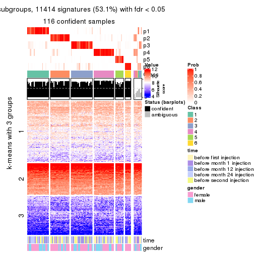</p>

</div>
</div>


Compare the overlap of signatures from different k:

```r
compare_signatures(res)
```


`get_signature()` returns a data frame invisibly. TO get the list of signatures, the function
call should be assigned to a variable explicitly. In following code, if `plot` argument is set
to `FALSE`, no heatmap is plotted while only the differential analysis is performed.

```r
# code only for demonstration
tb = get_signature(res, k = ..., plot = FALSE)
```

An example of the output of `tb` is:

```
#>   which_row         fdr    mean_1    mean_2 scaled_mean_1 scaled_mean_2 km
#> 1        38 0.042760348  8.373488  9.131774    -0.5533452     0.5164555  1
#> 2        40 0.018707592  7.106213  8.469186    -0.6173731     0.5762149  1
#> 3        55 0.019134737 10.221463 11.207825    -0.6159697     0.5749050  1
#> 4        59 0.006059896  5.921854  7.869574    -0.6899429     0.6439467  1
#> 5        60 0.018055526  8.928898 10.211722    -0.6204761     0.5791110  1
#> 6        98 0.009384629 15.714769 14.887706     0.6635654    -0.6193277  2
...
```

The columns in `tb` are:

1. `which_row`: row indices corresponding to the input matrix.
2. `fdr`: FDR for the differential test. 
3. `mean_x`: The mean value in group x.
4. `scaled_mean_x`: The mean value in group x after rows are scaled.
5. `km`: Row groups if k-means clustering is applied to rows.


UMAP plot which shows how samples are separated.


<script>
$( function() {
	$( '#tabs-CV-mclust-dimension-reduction' ).tabs();
} );
</script>
<div id='tabs-CV-mclust-dimension-reduction'>
<ul>
<li><a href='#tab-CV-mclust-dimension-reduction-1'>k = 2</a></li>
<li><a href='#tab-CV-mclust-dimension-reduction-2'>k = 3</a></li>
<li><a href='#tab-CV-mclust-dimension-reduction-3'>k = 4</a></li>
<li><a href='#tab-CV-mclust-dimension-reduction-4'>k = 5</a></li>
<li><a href='#tab-CV-mclust-dimension-reduction-5'>k = 6</a></li>
</ul>
<div id='tab-CV-mclust-dimension-reduction-1'>
<pre><code class="r">dimension_reduction(res, k = 2, method = &quot;UMAP&quot;)
</code></pre>

<p></p>

</div>
<div id='tab-CV-mclust-dimension-reduction-2'>
<pre><code class="r">dimension_reduction(res, k = 3, method = &quot;UMAP&quot;)
</code></pre>

<p></p>

</div>
<div id='tab-CV-mclust-dimension-reduction-3'>
<pre><code class="r">dimension_reduction(res, k = 4, method = &quot;UMAP&quot;)
</code></pre>

<p></p>

</div>
<div id='tab-CV-mclust-dimension-reduction-4'>
<pre><code class="r">dimension_reduction(res, k = 5, method = &quot;UMAP&quot;)
</code></pre>

<p></p>

</div>
<div id='tab-CV-mclust-dimension-reduction-5'>
<pre><code class="r">dimension_reduction(res, k = 6, method = &quot;UMAP&quot;)
</code></pre>

<p></p>

</div>
</div>


Following heatmap shows how subgroups are split when increasing `k`:

```r
collect_classes(res)
```


Test correlation between subgroups and known annotations. If the known
annotation is numeric, one-way ANOVA test is applied, and if the known
annotation is discrete, chi-squared contingency table test is applied.

```r
test_to_known_factors(res)
```

```
#>             n time(p) gender(p) k
#> CV:mclust 122   0.221     0.813 2
#> CV:mclust 106   0.423     0.107 3
#> CV:mclust  85   0.702     0.101 4
#> CV:mclust 113   0.450     0.221 5
#> CV:mclust 116   0.382     0.137 6
```


If matrix rows can be associated to genes, consider to use `functional_enrichment(res,
...)` to perform function enrichment for the signature genes. See [this vignette](http://bioconductor.org/packages/devel/bioc/vignettes/cola/inst/doc/functional_enrichment.html) for more detailed explanations.


 

---------------------------------------------------


### CV:NMF*


The object with results only for a single top-value method and a single partition method 
can be extracted as:

```r
res = res_list["CV", "NMF"]
# you can also extract it by
# res = res_list["CV:NMF"]
```

A summary of `res` and all the functions that can be applied to it:

```r
res
```

```
#> A 'ConsensusPartition' object with k = 2, 3, 4, 5, 6.
#>   On a matrix with 21512 rows and 125 columns.
#>   Top rows (1000, 2000, 3000, 4000, 5000) are extracted by 'CV' method.
#>   Subgroups are detected by 'NMF' method.
#>   Performed in total 1250 partitions by row resampling.
#>   Best k for subgroups seems to be 2.
#> 
#> Following methods can be applied to this 'ConsensusPartition' object:
#>  [1] "cola_report"             "collect_classes"         "collect_plots"          
#>  [4] "collect_stats"           "colnames"                "compare_signatures"     
#>  [7] "consensus_heatmap"       "dimension_reduction"     "functional_enrichment"  
#> [10] "get_anno_col"            "get_anno"                "get_classes"            
#> [13] "get_consensus"           "get_matrix"              "get_membership"         
#> [16] "get_param"               "get_signatures"          "get_stats"              
#> [19] "is_best_k"               "is_stable_k"             "membership_heatmap"     
#> [22] "ncol"                    "nrow"                    "plot_ecdf"              
#> [25] "rownames"                "select_partition_number" "show"                   
#> [28] "suggest_best_k"          "test_to_known_factors"
```

`collect_plots()` function collects all the plots made from `res` for all `k` (number of partitions)
into one single page to provide an easy and fast comparison between different `k`.

```r
collect_plots(res)
```


The plots are:

- The first row: a plot of the ECDF (empirical cumulative distribution
  function) curves of the consensus matrix for each `k` and the heatmap of
  predicted classes for each `k`.
- The second row: heatmaps of the consensus matrix for each `k`.
- The third row: heatmaps of the membership matrix for each `k`.
- The fouth row: heatmaps of the signatures for each `k`.

All the plots in panels can be made by individual functions and they are
plotted later in this section.

`select_partition_number()` produces several plots showing different
statistics for choosing "optimized" `k`. There are following statistics:

- ECDF curves of the consensus matrix for each `k`;
- 1-PAC. [The PAC
  score](https://en.wikipedia.org/wiki/Consensus_clustering#Over-interpretation_potential_of_consensus_clustering)
  measures the proportion of the ambiguous subgrouping.
- Mean silhouette score.
- Concordance. The mean probability of fiting the consensus class ids in all
  partitions.
- Area increased. Denote $A_k$ as the area under the ECDF curve for current
  `k`, the area increased is defined as $A_k - A_{k-1}$.
- Rand index. The percent of pairs of samples that are both in a same cluster
  or both are not in a same cluster in the partition of k and k-1.
- Jaccard index. The ratio of pairs of samples are both in a same cluster in
  the partition of k and k-1 and the pairs of samples are both in a same
  cluster in the partition k or k-1.

The detailed explanations of these statistics can be found in [the _cola_
vignette](http://bioconductor.org/packages/devel/bioc/vignettes/cola/inst/doc/cola.html#toc_13).

Generally speaking, lower PAC score, higher mean silhouette score or higher
concordance corresponds to better partition. Rand index and Jaccard index
measure how similar the current partition is compared to partition with `k-1`.
If they are too similar, we won't accept `k` is better than `k-1`.

```r
select_partition_number(res)
```


The numeric values for all these statistics can be obtained by `get_stats()`.

```r
get_stats(res)
```

```
#>   k 1-PAC mean_silhouette concordance area_increased  Rand Jaccard
#> 2 2 0.915           0.937       0.973         0.5011 0.498   0.498
#> 3 3 0.381           0.508       0.702         0.3074 0.806   0.632
#> 4 4 0.425           0.428       0.660         0.1283 0.756   0.429
#> 5 5 0.455           0.349       0.595         0.0694 0.842   0.475
#> 6 6 0.492           0.302       0.535         0.0410 0.870   0.495
```

`suggest_best_k()` suggests the best $k$ based on these statistics. The rules are as follows:

- All $k$ with Jaccard index larger than 0.95 are removed because increasing
  $k$ does not provide enough extra information. If all $k$ are removed, it is
  marked as no subgroup is detected.
- For all $k$ with 1-PAC score larger than 0.9, the maximal $k$ is taken as
  the best $k$, and other $k$ are marked as optional $k$.
- If it does not fit the second rule. The $k$ with the maximal vote of the
  highest 1-PAC score, highest mean silhouette, and highest concordance is
  taken as the best $k$.

```r
suggest_best_k(res)
```

```
#> [1] 2
```


Following shows the table of the partitions (You need to click the **show/hide
code output** link to see it). The membership matrix (columns with name `p*`)
is inferred by
[`clue::cl_consensus()`](https://www.rdocumentation.org/link/cl_consensus?package=clue)
function with the `SE` method. Basically the value in the membership matrix
represents the probability to belong to a certain group. The finall class
label for an item is determined with the group with highest probability it
belongs to.

In `get_classes()` function, the entropy is calculated from the membership
matrix and the silhouette score is calculated from the consensus matrix.


<script>
$( function() {
	$( '#tabs-CV-NMF-get-classes' ).tabs();
} );
</script>
<div id='tabs-CV-NMF-get-classes'>
<ul>
<li><a href='#tab-CV-NMF-get-classes-1'>k = 2</a></li>
<li><a href='#tab-CV-NMF-get-classes-2'>k = 3</a></li>
<li><a href='#tab-CV-NMF-get-classes-3'>k = 4</a></li>
<li><a href='#tab-CV-NMF-get-classes-4'>k = 5</a></li>
<li><a href='#tab-CV-NMF-get-classes-5'>k = 6</a></li>
</ul>

<div id='tab-CV-NMF-get-classes-1'>
<p><a id='tab-CV-NMF-get-classes-1-a' style='color:#0366d6' href='#'>show/hide code output</a></p>
<pre><code class="r">cbind(get_classes(res, k = 2), get_membership(res, k = 2))
</code></pre>

<pre><code>#&gt;           class entropy silhouette    p1    p2
#&gt; GSM601872     2  0.0000     0.9650 0.000 1.000
#&gt; GSM601882     2  0.0000     0.9650 0.000 1.000
#&gt; GSM601887     1  0.5737     0.8466 0.864 0.136
#&gt; GSM601892     1  0.0000     0.9787 1.000 0.000
#&gt; GSM601897     1  0.5629     0.8524 0.868 0.132
#&gt; GSM601902     2  0.0000     0.9650 0.000 1.000
#&gt; GSM601912     1  0.0376     0.9761 0.996 0.004
#&gt; GSM601927     1  0.0000     0.9787 1.000 0.000
#&gt; GSM601932     2  0.0000     0.9650 0.000 1.000
#&gt; GSM601937     2  0.0000     0.9650 0.000 1.000
#&gt; GSM601942     2  0.0000     0.9650 0.000 1.000
#&gt; GSM601947     2  0.0000     0.9650 0.000 1.000
#&gt; GSM601957     1  0.0000     0.9787 1.000 0.000
#&gt; GSM601972     2  0.0000     0.9650 0.000 1.000
#&gt; GSM601977     2  0.0000     0.9650 0.000 1.000
#&gt; GSM601987     2  0.0000     0.9650 0.000 1.000
#&gt; GSM601877     1  0.0000     0.9787 1.000 0.000
#&gt; GSM601907     2  0.0000     0.9650 0.000 1.000
#&gt; GSM601917     2  0.2948     0.9291 0.052 0.948
#&gt; GSM601922     2  0.8763     0.6034 0.296 0.704
#&gt; GSM601952     2  0.0000     0.9650 0.000 1.000
#&gt; GSM601962     1  0.0000     0.9787 1.000 0.000
#&gt; GSM601967     1  0.0000     0.9787 1.000 0.000
#&gt; GSM601982     2  0.2778     0.9326 0.048 0.952
#&gt; GSM601992     2  0.0000     0.9650 0.000 1.000
#&gt; GSM601873     2  0.0000     0.9650 0.000 1.000
#&gt; GSM601883     2  0.0000     0.9650 0.000 1.000
#&gt; GSM601888     1  0.3584     0.9219 0.932 0.068
#&gt; GSM601893     1  0.1843     0.9579 0.972 0.028
#&gt; GSM601898     1  0.0000     0.9787 1.000 0.000
#&gt; GSM601903     2  0.0000     0.9650 0.000 1.000
#&gt; GSM601913     1  0.0000     0.9787 1.000 0.000
#&gt; GSM601928     1  0.0000     0.9787 1.000 0.000
#&gt; GSM601933     2  0.0000     0.9650 0.000 1.000
#&gt; GSM601938     2  0.0000     0.9650 0.000 1.000
#&gt; GSM601943     2  0.0000     0.9650 0.000 1.000
#&gt; GSM601948     1  0.0000     0.9787 1.000 0.000
#&gt; GSM601958     1  0.0000     0.9787 1.000 0.000
#&gt; GSM601973     2  0.0000     0.9650 0.000 1.000
#&gt; GSM601978     2  0.0000     0.9650 0.000 1.000
#&gt; GSM601988     2  0.0000     0.9650 0.000 1.000
#&gt; GSM601878     1  0.0000     0.9787 1.000 0.000
#&gt; GSM601908     2  0.0000     0.9650 0.000 1.000
#&gt; GSM601918     2  0.0000     0.9650 0.000 1.000
#&gt; GSM601923     1  0.0000     0.9787 1.000 0.000
#&gt; GSM601953     2  0.0000     0.9650 0.000 1.000
#&gt; GSM601963     1  0.0000     0.9787 1.000 0.000
#&gt; GSM601968     1  0.0000     0.9787 1.000 0.000
#&gt; GSM601983     1  0.0000     0.9787 1.000 0.000
#&gt; GSM601993     2  0.0000     0.9650 0.000 1.000
#&gt; GSM601874     2  0.0000     0.9650 0.000 1.000
#&gt; GSM601884     2  0.0000     0.9650 0.000 1.000
#&gt; GSM601889     1  0.0000     0.9787 1.000 0.000
#&gt; GSM601894     1  0.0000     0.9787 1.000 0.000
#&gt; GSM601899     1  0.2948     0.9371 0.948 0.052
#&gt; GSM601904     1  0.9977     0.0655 0.528 0.472
#&gt; GSM601914     1  0.0000     0.9787 1.000 0.000
#&gt; GSM601929     1  0.0000     0.9787 1.000 0.000
#&gt; GSM601934     2  0.0376     0.9628 0.004 0.996
#&gt; GSM601939     1  0.0000     0.9787 1.000 0.000
#&gt; GSM601944     2  0.0000     0.9650 0.000 1.000
#&gt; GSM601949     1  0.0000     0.9787 1.000 0.000
#&gt; GSM601959     1  0.0000     0.9787 1.000 0.000
#&gt; GSM601974     1  0.5408     0.8535 0.876 0.124
#&gt; GSM601979     2  0.0000     0.9650 0.000 1.000
#&gt; GSM601989     1  0.0000     0.9787 1.000 0.000
#&gt; GSM601879     1  0.0000     0.9787 1.000 0.000
#&gt; GSM601909     1  0.0000     0.9787 1.000 0.000
#&gt; GSM601919     2  0.3114     0.9258 0.056 0.944
#&gt; GSM601924     1  0.0000     0.9787 1.000 0.000
#&gt; GSM601954     2  0.2778     0.9324 0.048 0.952
#&gt; GSM601964     1  0.0000     0.9787 1.000 0.000
#&gt; GSM601969     1  0.0000     0.9787 1.000 0.000
#&gt; GSM601984     1  0.0000     0.9787 1.000 0.000
#&gt; GSM601994     2  0.0000     0.9650 0.000 1.000
#&gt; GSM601875     2  0.0000     0.9650 0.000 1.000
#&gt; GSM601885     2  0.0000     0.9650 0.000 1.000
#&gt; GSM601890     1  0.0000     0.9787 1.000 0.000
#&gt; GSM601895     1  0.0938     0.9704 0.988 0.012
#&gt; GSM601900     1  0.0376     0.9761 0.996 0.004
#&gt; GSM601905     2  0.4815     0.8775 0.104 0.896
#&gt; GSM601915     1  0.0000     0.9787 1.000 0.000
#&gt; GSM601930     1  0.0000     0.9787 1.000 0.000
#&gt; GSM601935     1  0.5294     0.8659 0.880 0.120
#&gt; GSM601940     1  0.0000     0.9787 1.000 0.000
#&gt; GSM601945     2  0.0000     0.9650 0.000 1.000
#&gt; GSM601950     1  0.0000     0.9787 1.000 0.000
#&gt; GSM601960     1  0.0000     0.9787 1.000 0.000
#&gt; GSM601975     2  0.0000     0.9650 0.000 1.000
#&gt; GSM601980     2  0.0938     0.9583 0.012 0.988
#&gt; GSM601990     1  0.0000     0.9787 1.000 0.000
#&gt; GSM601880     1  0.0000     0.9787 1.000 0.000
#&gt; GSM601910     1  0.0000     0.9787 1.000 0.000
#&gt; GSM601920     2  0.6343     0.8078 0.160 0.840
#&gt; GSM601925     1  0.0000     0.9787 1.000 0.000
#&gt; GSM601955     2  0.3114     0.9254 0.056 0.944
#&gt; GSM601965     1  0.0000     0.9787 1.000 0.000
#&gt; GSM601970     1  0.0000     0.9787 1.000 0.000
#&gt; GSM601985     1  0.0000     0.9787 1.000 0.000
#&gt; GSM601995     2  0.1414     0.9533 0.020 0.980
#&gt; GSM601876     1  0.0000     0.9787 1.000 0.000
#&gt; GSM601886     2  0.9988     0.1155 0.480 0.520
#&gt; GSM601891     1  0.5178     0.8708 0.884 0.116
#&gt; GSM601896     1  0.0000     0.9787 1.000 0.000
#&gt; GSM601901     2  0.0000     0.9650 0.000 1.000
#&gt; GSM601906     1  0.2948     0.9370 0.948 0.052
#&gt; GSM601916     2  0.4939     0.8713 0.108 0.892
#&gt; GSM601931     1  0.0000     0.9787 1.000 0.000
#&gt; GSM601936     2  0.0376     0.9628 0.004 0.996
#&gt; GSM601941     2  0.0000     0.9650 0.000 1.000
#&gt; GSM601946     1  0.0000     0.9787 1.000 0.000
#&gt; GSM601951     1  0.0000     0.9787 1.000 0.000
#&gt; GSM601961     2  0.1633     0.9501 0.024 0.976
#&gt; GSM601976     2  0.1184     0.9556 0.016 0.984
#&gt; GSM601981     2  0.0000     0.9650 0.000 1.000
#&gt; GSM601991     1  0.0376     0.9761 0.996 0.004
#&gt; GSM601881     1  0.0000     0.9787 1.000 0.000
#&gt; GSM601911     2  1.0000    -0.0095 0.500 0.500
#&gt; GSM601921     2  0.0000     0.9650 0.000 1.000
#&gt; GSM601926     1  0.0000     0.9787 1.000 0.000
#&gt; GSM601956     2  0.0000     0.9650 0.000 1.000
#&gt; GSM601966     2  0.0000     0.9650 0.000 1.000
#&gt; GSM601971     1  0.0000     0.9787 1.000 0.000
#&gt; GSM601986     1  0.0672     0.9734 0.992 0.008
#&gt; GSM601996     2  0.0000     0.9650 0.000 1.000
</code></pre>

<script>
$('#tab-CV-NMF-get-classes-1-a').parent().next().next().hide();
$('#tab-CV-NMF-get-classes-1-a').click(function(){
  $('#tab-CV-NMF-get-classes-1-a').parent().next().next().toggle();
  return(false);
});
</script>
</div>

<div id='tab-CV-NMF-get-classes-2'>
<p><a id='tab-CV-NMF-get-classes-2-a' style='color:#0366d6' href='#'>show/hide code output</a></p>
<pre><code class="r">cbind(get_classes(res, k = 3), get_membership(res, k = 3))
</code></pre>

<pre><code>#&gt;           class entropy silhouette    p1    p2    p3
#&gt; GSM601872     3   0.329     0.4450 0.008 0.096 0.896
#&gt; GSM601882     2   0.556     0.5011 0.000 0.700 0.300
#&gt; GSM601887     3   0.540     0.2592 0.280 0.000 0.720
#&gt; GSM601892     3   0.623    -0.2135 0.436 0.000 0.564
#&gt; GSM601897     3   0.585     0.1775 0.268 0.012 0.720
#&gt; GSM601902     2   0.344     0.6258 0.088 0.896 0.016
#&gt; GSM601912     3   0.629    -0.3712 0.464 0.000 0.536
#&gt; GSM601927     1   0.303     0.7166 0.904 0.092 0.004
#&gt; GSM601932     2   0.200     0.6460 0.012 0.952 0.036
#&gt; GSM601937     2   0.606     0.5168 0.016 0.708 0.276
#&gt; GSM601942     3   0.606     0.1133 0.000 0.384 0.616
#&gt; GSM601947     2   0.703     0.5261 0.052 0.676 0.272
#&gt; GSM601957     1   0.588     0.6427 0.652 0.000 0.348
#&gt; GSM601972     2   0.493     0.5620 0.000 0.768 0.232
#&gt; GSM601977     2   0.628     0.2221 0.000 0.540 0.460
#&gt; GSM601987     2   0.623     0.2775 0.000 0.564 0.436
#&gt; GSM601877     1   0.403     0.6754 0.856 0.136 0.008
#&gt; GSM601907     3   0.621     0.0626 0.000 0.428 0.572
#&gt; GSM601917     2   0.636     0.4834 0.280 0.696 0.024
#&gt; GSM601922     2   0.695     0.4098 0.352 0.620 0.028
#&gt; GSM601952     2   0.561     0.5943 0.028 0.776 0.196
#&gt; GSM601962     1   0.694     0.6774 0.652 0.036 0.312
#&gt; GSM601967     1   0.579     0.6421 0.668 0.000 0.332
#&gt; GSM601982     3   0.757    -0.0528 0.040 0.452 0.508
#&gt; GSM601992     2   0.216     0.6371 0.000 0.936 0.064
#&gt; GSM601873     2   0.630     0.2007 0.000 0.524 0.476
#&gt; GSM601883     2   0.562     0.4883 0.000 0.692 0.308
#&gt; GSM601888     3   0.510     0.3262 0.248 0.000 0.752
#&gt; GSM601893     3   0.562     0.1551 0.308 0.000 0.692
#&gt; GSM601898     1   0.569     0.7060 0.708 0.004 0.288
#&gt; GSM601903     2   0.384     0.6072 0.116 0.872 0.012
#&gt; GSM601913     1   0.527     0.7405 0.776 0.012 0.212
#&gt; GSM601928     1   0.309     0.7299 0.912 0.072 0.016
#&gt; GSM601933     2   0.518     0.5355 0.000 0.744 0.256
#&gt; GSM601938     2   0.412     0.5962 0.000 0.832 0.168
#&gt; GSM601943     3   0.497     0.3594 0.000 0.236 0.764
#&gt; GSM601948     1   0.435     0.7430 0.836 0.008 0.156
#&gt; GSM601958     1   0.556     0.6911 0.700 0.000 0.300
#&gt; GSM601973     2   0.199     0.6398 0.048 0.948 0.004
#&gt; GSM601978     3   0.597     0.1957 0.000 0.364 0.636
#&gt; GSM601988     2   0.602     0.5224 0.020 0.724 0.256
#&gt; GSM601878     1   0.304     0.7359 0.920 0.040 0.040
#&gt; GSM601908     2   0.590     0.4280 0.000 0.648 0.352
#&gt; GSM601918     2   0.587     0.6126 0.056 0.784 0.160
#&gt; GSM601923     1   0.286     0.7178 0.912 0.084 0.004
#&gt; GSM601953     3   0.533     0.3269 0.000 0.272 0.728
#&gt; GSM601963     1   0.502     0.7465 0.796 0.012 0.192
#&gt; GSM601968     1   0.636     0.5567 0.592 0.004 0.404
#&gt; GSM601983     1   0.638     0.6743 0.648 0.012 0.340
#&gt; GSM601993     2   0.258     0.6364 0.008 0.928 0.064
#&gt; GSM601874     3   0.573     0.2585 0.000 0.324 0.676
#&gt; GSM601884     3   0.630    -0.0895 0.000 0.480 0.520
#&gt; GSM601889     1   0.568     0.6780 0.684 0.000 0.316
#&gt; GSM601894     1   0.571     0.6794 0.680 0.000 0.320
#&gt; GSM601899     3   0.546     0.2264 0.288 0.000 0.712
#&gt; GSM601904     2   0.745     0.2036 0.436 0.528 0.036
#&gt; GSM601914     1   0.619     0.7045 0.692 0.016 0.292
#&gt; GSM601929     1   0.346     0.7122 0.892 0.096 0.012
#&gt; GSM601934     3   0.631    -0.1508 0.000 0.496 0.504
#&gt; GSM601939     1   0.175     0.7559 0.952 0.000 0.048
#&gt; GSM601944     2   0.406     0.6068 0.000 0.836 0.164
#&gt; GSM601949     1   0.489     0.7144 0.772 0.000 0.228
#&gt; GSM601959     1   0.598     0.6659 0.668 0.004 0.328
#&gt; GSM601974     1   0.848     0.6021 0.600 0.140 0.260
#&gt; GSM601979     2   0.630     0.1839 0.000 0.524 0.476
#&gt; GSM601989     1   0.636     0.5813 0.592 0.004 0.404
#&gt; GSM601879     1   0.409     0.7055 0.872 0.100 0.028
#&gt; GSM601909     1   0.631     0.4155 0.512 0.000 0.488
#&gt; GSM601919     2   0.909     0.4435 0.224 0.552 0.224
#&gt; GSM601924     1   0.200     0.7398 0.952 0.036 0.012
#&gt; GSM601954     2   0.838     0.2341 0.084 0.492 0.424
#&gt; GSM601964     1   0.529     0.7377 0.764 0.008 0.228
#&gt; GSM601969     1   0.614     0.6816 0.720 0.024 0.256
#&gt; GSM601984     1   0.551     0.6649 0.800 0.156 0.044
#&gt; GSM601994     2   0.186     0.6402 0.000 0.948 0.052
#&gt; GSM601875     3   0.614     0.1084 0.000 0.404 0.596
#&gt; GSM601885     2   0.579     0.4577 0.000 0.668 0.332
#&gt; GSM601890     3   0.565     0.1411 0.312 0.000 0.688
#&gt; GSM601895     1   0.656     0.5844 0.576 0.008 0.416
#&gt; GSM601900     1   0.647     0.6747 0.652 0.016 0.332
#&gt; GSM601905     2   0.616     0.4720 0.288 0.696 0.016
#&gt; GSM601915     1   0.502     0.7398 0.776 0.004 0.220
#&gt; GSM601930     1   0.323     0.7323 0.908 0.072 0.020
#&gt; GSM601935     1   0.965     0.3260 0.464 0.288 0.248
#&gt; GSM601940     1   0.304     0.7558 0.896 0.000 0.104
#&gt; GSM601945     2   0.629     0.2071 0.000 0.532 0.468
#&gt; GSM601950     1   0.440     0.7380 0.812 0.000 0.188
#&gt; GSM601960     1   0.613     0.7096 0.700 0.016 0.284
#&gt; GSM601975     2   0.315     0.6432 0.044 0.916 0.040
#&gt; GSM601980     2   0.647     0.3881 0.008 0.604 0.388
#&gt; GSM601990     1   0.610     0.7099 0.704 0.016 0.280
#&gt; GSM601880     1   0.345     0.7025 0.888 0.104 0.008
#&gt; GSM601910     1   0.583     0.6576 0.660 0.000 0.340
#&gt; GSM601920     2   0.708     0.3990 0.356 0.612 0.032
#&gt; GSM601925     1   0.357     0.6939 0.876 0.120 0.004
#&gt; GSM601955     3   0.754    -0.0509 0.040 0.432 0.528
#&gt; GSM601965     1   0.353     0.7387 0.900 0.068 0.032
#&gt; GSM601970     1   0.525     0.7079 0.736 0.000 0.264
#&gt; GSM601985     1   0.290     0.7555 0.920 0.016 0.064
#&gt; GSM601995     2   0.630     0.5190 0.032 0.720 0.248
#&gt; GSM601876     1   0.277     0.7594 0.916 0.004 0.080
#&gt; GSM601886     2   0.845     0.2584 0.372 0.532 0.096
#&gt; GSM601891     3   0.489     0.3253 0.228 0.000 0.772
#&gt; GSM601896     1   0.424     0.7486 0.824 0.000 0.176
#&gt; GSM601901     2   0.593     0.4459 0.000 0.644 0.356
#&gt; GSM601906     1   0.608     0.4775 0.692 0.296 0.012
#&gt; GSM601916     2   0.576     0.5420 0.208 0.764 0.028
#&gt; GSM601931     1   0.220     0.7344 0.940 0.056 0.004
#&gt; GSM601936     2   0.602     0.5656 0.076 0.784 0.140
#&gt; GSM601941     2   0.129     0.6422 0.032 0.968 0.000
#&gt; GSM601946     1   0.217     0.7553 0.944 0.008 0.048
#&gt; GSM601951     1   0.323     0.7263 0.908 0.072 0.020
#&gt; GSM601961     3   0.515     0.4361 0.068 0.100 0.832
#&gt; GSM601976     2   0.509     0.6184 0.112 0.832 0.056
#&gt; GSM601981     3   0.617     0.0939 0.000 0.412 0.588
#&gt; GSM601991     1   0.782     0.5830 0.564 0.060 0.376
#&gt; GSM601881     1   0.304     0.7178 0.908 0.084 0.008
#&gt; GSM601911     1   0.830     0.2346 0.560 0.348 0.092
#&gt; GSM601921     2   0.486     0.5839 0.160 0.820 0.020
#&gt; GSM601926     1   0.280     0.7161 0.908 0.092 0.000
#&gt; GSM601956     3   0.571     0.2648 0.000 0.320 0.680
#&gt; GSM601966     2   0.338     0.6329 0.008 0.892 0.100
#&gt; GSM601971     1   0.462     0.7519 0.836 0.020 0.144
#&gt; GSM601986     1   0.441     0.7081 0.852 0.124 0.024
#&gt; GSM601996     2   0.177     0.6456 0.016 0.960 0.024
</code></pre>

<script>
$('#tab-CV-NMF-get-classes-2-a').parent().next().next().hide();
$('#tab-CV-NMF-get-classes-2-a').click(function(){
  $('#tab-CV-NMF-get-classes-2-a').parent().next().next().toggle();
  return(false);
});
</script>
</div>

<div id='tab-CV-NMF-get-classes-3'>
<p><a id='tab-CV-NMF-get-classes-3-a' style='color:#0366d6' href='#'>show/hide code output</a></p>
<pre><code class="r">cbind(get_classes(res, k = 4), get_membership(res, k = 4))
</code></pre>

<pre><code>#&gt;           class entropy silhouette    p1    p2    p3    p4
#&gt; GSM601872     2   0.504   0.342349 0.000 0.628 0.364 0.008
#&gt; GSM601882     4   0.582   0.356110 0.008 0.332 0.032 0.628
#&gt; GSM601887     2   0.630   0.228968 0.080 0.600 0.320 0.000
#&gt; GSM601892     2   0.748  -0.106842 0.188 0.468 0.344 0.000
#&gt; GSM601897     3   0.343   0.513198 0.008 0.140 0.848 0.004
#&gt; GSM601902     4   0.515   0.568687 0.140 0.072 0.012 0.776
#&gt; GSM601912     3   0.490   0.614124 0.104 0.116 0.780 0.000
#&gt; GSM601927     1   0.275   0.718576 0.904 0.000 0.040 0.056
#&gt; GSM601932     4   0.395   0.586363 0.020 0.084 0.040 0.856
#&gt; GSM601937     4   0.568   0.136166 0.004 0.016 0.488 0.492
#&gt; GSM601942     3   0.681   0.172097 0.000 0.156 0.596 0.248
#&gt; GSM601947     2   0.777   0.000128 0.156 0.476 0.016 0.352
#&gt; GSM601957     1   0.704  -0.063083 0.504 0.128 0.368 0.000
#&gt; GSM601972     4   0.562   0.420164 0.020 0.284 0.020 0.676
#&gt; GSM601977     4   0.786  -0.006786 0.000 0.328 0.280 0.392
#&gt; GSM601987     2   0.550   0.200376 0.000 0.576 0.020 0.404
#&gt; GSM601877     1   0.286   0.695350 0.900 0.012 0.012 0.076
#&gt; GSM601907     2   0.338   0.538752 0.008 0.852 0.004 0.136
#&gt; GSM601917     4   0.701   0.176431 0.452 0.080 0.012 0.456
#&gt; GSM601922     1   0.651   0.123787 0.572 0.056 0.012 0.360
#&gt; GSM601952     4   0.717   0.446325 0.040 0.236 0.100 0.624
#&gt; GSM601962     3   0.533   0.610528 0.188 0.012 0.748 0.052
#&gt; GSM601967     1   0.735  -0.196026 0.456 0.160 0.384 0.000
#&gt; GSM601982     2   0.646   0.473519 0.064 0.688 0.044 0.204
#&gt; GSM601992     4   0.384   0.573926 0.016 0.108 0.024 0.852
#&gt; GSM601873     4   0.786   0.044944 0.000 0.276 0.340 0.384
#&gt; GSM601883     4   0.540   0.017388 0.000 0.468 0.012 0.520
#&gt; GSM601888     2   0.502   0.481389 0.088 0.768 0.144 0.000
#&gt; GSM601893     3   0.651   0.056196 0.072 0.460 0.468 0.000
#&gt; GSM601898     3   0.582   0.548552 0.296 0.048 0.652 0.004
#&gt; GSM601903     4   0.514   0.558325 0.160 0.052 0.016 0.772
#&gt; GSM601913     3   0.552   0.540931 0.292 0.008 0.672 0.028
#&gt; GSM601928     1   0.480   0.667494 0.776 0.000 0.160 0.064
#&gt; GSM601933     4   0.570   0.416497 0.000 0.260 0.064 0.676
#&gt; GSM601938     4   0.422   0.542035 0.000 0.144 0.044 0.812
#&gt; GSM601943     3   0.677  -0.093335 0.000 0.364 0.532 0.104
#&gt; GSM601948     1   0.531   0.637157 0.764 0.096 0.132 0.008
#&gt; GSM601958     3   0.621   0.204319 0.464 0.052 0.484 0.000
#&gt; GSM601973     4   0.322   0.596453 0.060 0.016 0.032 0.892
#&gt; GSM601978     2   0.415   0.552661 0.000 0.824 0.056 0.120
#&gt; GSM601988     3   0.570   0.013181 0.004 0.020 0.560 0.416
#&gt; GSM601878     1   0.191   0.709922 0.940 0.040 0.020 0.000
#&gt; GSM601908     2   0.542   0.248805 0.008 0.600 0.008 0.384
#&gt; GSM601918     4   0.792   0.204064 0.188 0.368 0.012 0.432
#&gt; GSM601923     1   0.222   0.718746 0.932 0.004 0.028 0.036
#&gt; GSM601953     2   0.328   0.560183 0.020 0.892 0.048 0.040
#&gt; GSM601963     3   0.511   0.505349 0.352 0.000 0.636 0.012
#&gt; GSM601968     3   0.744   0.431716 0.328 0.188 0.484 0.000
#&gt; GSM601983     3   0.500   0.620745 0.216 0.036 0.744 0.004
#&gt; GSM601993     4   0.363   0.547548 0.016 0.004 0.136 0.844
#&gt; GSM601874     2   0.363   0.562986 0.000 0.856 0.048 0.096
#&gt; GSM601884     2   0.676   0.213563 0.000 0.524 0.100 0.376
#&gt; GSM601889     3   0.680   0.386420 0.400 0.100 0.500 0.000
#&gt; GSM601894     3   0.635   0.537939 0.296 0.092 0.612 0.000
#&gt; GSM601899     2   0.644   0.175411 0.084 0.576 0.340 0.000
#&gt; GSM601904     4   0.653   0.126922 0.420 0.000 0.076 0.504
#&gt; GSM601914     3   0.393   0.624341 0.200 0.000 0.792 0.008
#&gt; GSM601929     1   0.286   0.714235 0.904 0.004 0.040 0.052
#&gt; GSM601934     4   0.763  -0.092769 0.000 0.392 0.204 0.404
#&gt; GSM601939     1   0.424   0.615839 0.784 0.004 0.200 0.012
#&gt; GSM601944     4   0.508   0.526083 0.000 0.080 0.160 0.760
#&gt; GSM601949     1   0.480   0.606947 0.764 0.188 0.048 0.000
#&gt; GSM601959     3   0.678   0.168354 0.456 0.080 0.460 0.004
#&gt; GSM601974     3   0.621   0.555740 0.136 0.008 0.692 0.164
#&gt; GSM601979     2   0.428   0.484877 0.000 0.764 0.012 0.224
#&gt; GSM601989     3   0.662   0.529553 0.280 0.120 0.600 0.000
#&gt; GSM601879     1   0.264   0.700324 0.916 0.032 0.008 0.044
#&gt; GSM601909     3   0.703   0.526808 0.244 0.184 0.572 0.000
#&gt; GSM601919     1   0.813  -0.163744 0.412 0.336 0.012 0.240
#&gt; GSM601924     1   0.159   0.716166 0.952 0.004 0.040 0.004
#&gt; GSM601954     2   0.679   0.317665 0.124 0.632 0.012 0.232
#&gt; GSM601964     3   0.475   0.584736 0.276 0.004 0.712 0.008
#&gt; GSM601969     1   0.658   0.366246 0.632 0.196 0.172 0.000
#&gt; GSM601984     1   0.550   0.630052 0.744 0.004 0.140 0.112
#&gt; GSM601994     4   0.278   0.583521 0.008 0.072 0.016 0.904
#&gt; GSM601875     2   0.296   0.548310 0.004 0.876 0.004 0.116
#&gt; GSM601885     2   0.541  -0.001736 0.000 0.500 0.012 0.488
#&gt; GSM601890     2   0.669  -0.013904 0.088 0.492 0.420 0.000
#&gt; GSM601895     3   0.376   0.638442 0.116 0.032 0.848 0.004
#&gt; GSM601900     3   0.427   0.634155 0.168 0.020 0.804 0.008
#&gt; GSM601905     4   0.632   0.383664 0.348 0.048 0.012 0.592
#&gt; GSM601915     3   0.556   0.420679 0.392 0.012 0.588 0.008
#&gt; GSM601930     1   0.405   0.694347 0.828 0.000 0.124 0.048
#&gt; GSM601935     3   0.595   0.402259 0.052 0.012 0.672 0.264
#&gt; GSM601940     1   0.436   0.585835 0.784 0.028 0.188 0.000
#&gt; GSM601945     2   0.564   0.398439 0.000 0.648 0.044 0.308
#&gt; GSM601950     1   0.461   0.640286 0.800 0.108 0.092 0.000
#&gt; GSM601960     3   0.385   0.627827 0.192 0.000 0.800 0.008
#&gt; GSM601975     4   0.606   0.566550 0.124 0.104 0.036 0.736
#&gt; GSM601980     3   0.513   0.233418 0.000 0.020 0.668 0.312
#&gt; GSM601990     3   0.462   0.621786 0.164 0.000 0.784 0.052
#&gt; GSM601880     1   0.287   0.714383 0.896 0.000 0.032 0.072
#&gt; GSM601910     3   0.635   0.551495 0.276 0.100 0.624 0.000
#&gt; GSM601920     1   0.679   0.058859 0.544 0.072 0.012 0.372
#&gt; GSM601925     1   0.280   0.711157 0.900 0.000 0.032 0.068
#&gt; GSM601955     3   0.534   0.457971 0.028 0.036 0.756 0.180
#&gt; GSM601965     1   0.476   0.680379 0.800 0.012 0.132 0.056
#&gt; GSM601970     3   0.615   0.219419 0.476 0.048 0.476 0.000
#&gt; GSM601985     1   0.479   0.540530 0.740 0.004 0.236 0.020
#&gt; GSM601995     3   0.596   0.004678 0.012 0.020 0.544 0.424
#&gt; GSM601876     1   0.472   0.572203 0.748 0.020 0.228 0.004
#&gt; GSM601886     4   0.644   0.225085 0.076 0.000 0.376 0.548
#&gt; GSM601891     2   0.649   0.037138 0.060 0.496 0.440 0.004
#&gt; GSM601896     1   0.581   0.356957 0.644 0.056 0.300 0.000
#&gt; GSM601901     2   0.671   0.141883 0.032 0.540 0.036 0.392
#&gt; GSM601906     1   0.534   0.517188 0.688 0.000 0.040 0.272
#&gt; GSM601916     4   0.607   0.510237 0.244 0.028 0.044 0.684
#&gt; GSM601931     1   0.361   0.703557 0.856 0.000 0.100 0.044
#&gt; GSM601936     4   0.554   0.293667 0.016 0.004 0.392 0.588
#&gt; GSM601941     4   0.215   0.596979 0.036 0.020 0.008 0.936
#&gt; GSM601946     1   0.429   0.647615 0.796 0.000 0.172 0.032
#&gt; GSM601951     1   0.406   0.696954 0.840 0.008 0.108 0.044
#&gt; GSM601961     2   0.419   0.534490 0.072 0.848 0.056 0.024
#&gt; GSM601976     4   0.599   0.575338 0.128 0.048 0.080 0.744
#&gt; GSM601981     2   0.556   0.518149 0.000 0.720 0.092 0.188
#&gt; GSM601991     3   0.395   0.608309 0.072 0.008 0.852 0.068
#&gt; GSM601881     1   0.184   0.719525 0.948 0.008 0.016 0.028
#&gt; GSM601911     1   0.636   0.430003 0.664 0.128 0.004 0.204
#&gt; GSM601921     4   0.690   0.443318 0.300 0.100 0.012 0.588
#&gt; GSM601926     1   0.267   0.718115 0.908 0.000 0.052 0.040
#&gt; GSM601956     2   0.521   0.541853 0.000 0.748 0.172 0.080
#&gt; GSM601966     4   0.452   0.546944 0.032 0.164 0.008 0.796
#&gt; GSM601971     1   0.525   0.493000 0.724 0.056 0.220 0.000
#&gt; GSM601986     1   0.351   0.718499 0.884 0.036 0.040 0.040
#&gt; GSM601996     4   0.400   0.581711 0.044 0.104 0.008 0.844
</code></pre>

<script>
$('#tab-CV-NMF-get-classes-3-a').parent().next().next().hide();
$('#tab-CV-NMF-get-classes-3-a').click(function(){
  $('#tab-CV-NMF-get-classes-3-a').parent().next().next().toggle();
  return(false);
});
</script>
</div>

<div id='tab-CV-NMF-get-classes-4'>
<p><a id='tab-CV-NMF-get-classes-4-a' style='color:#0366d6' href='#'>show/hide code output</a></p>
<pre><code class="r">cbind(get_classes(res, k = 5), get_membership(res, k = 5))
</code></pre>

<pre><code>#&gt;           class entropy silhouette    p1    p2    p3    p4    p5
#&gt; GSM601872     2   0.554    0.34847 0.008 0.592 0.044 0.008 0.348
#&gt; GSM601882     4   0.525    0.36029 0.016 0.280 0.000 0.656 0.048
#&gt; GSM601887     2   0.516    0.53858 0.024 0.724 0.168 0.000 0.084
#&gt; GSM601892     2   0.599    0.12980 0.012 0.480 0.432 0.000 0.076
#&gt; GSM601897     5   0.553    0.54690 0.004 0.104 0.196 0.012 0.684
#&gt; GSM601902     4   0.640    0.49251 0.272 0.016 0.056 0.608 0.048
#&gt; GSM601912     3   0.668   -0.06216 0.016 0.128 0.544 0.012 0.300
#&gt; GSM601927     1   0.439    0.33044 0.612 0.000 0.380 0.008 0.000
#&gt; GSM601932     4   0.721    0.54368 0.196 0.048 0.052 0.600 0.104
#&gt; GSM601937     4   0.609    0.09826 0.008 0.004 0.080 0.460 0.448
#&gt; GSM601942     5   0.546    0.43161 0.004 0.088 0.032 0.160 0.716
#&gt; GSM601947     1   0.815   -0.02935 0.452 0.216 0.032 0.240 0.060
#&gt; GSM601957     3   0.651    0.52132 0.184 0.100 0.628 0.000 0.088
#&gt; GSM601972     4   0.692    0.44447 0.116 0.216 0.024 0.600 0.044
#&gt; GSM601977     4   0.755    0.01877 0.012 0.316 0.024 0.408 0.240
#&gt; GSM601987     2   0.579    0.14004 0.012 0.512 0.036 0.428 0.012
#&gt; GSM601877     1   0.375    0.50541 0.780 0.004 0.200 0.016 0.000
#&gt; GSM601907     2   0.286    0.58357 0.016 0.876 0.000 0.096 0.012
#&gt; GSM601917     1   0.539    0.36094 0.720 0.024 0.012 0.176 0.068
#&gt; GSM601922     1   0.390    0.49692 0.820 0.016 0.012 0.132 0.020
#&gt; GSM601952     5   0.860   -0.31571 0.212 0.124 0.016 0.320 0.328
#&gt; GSM601962     5   0.600    0.55739 0.064 0.008 0.192 0.060 0.676
#&gt; GSM601967     3   0.779    0.33496 0.184 0.148 0.488 0.000 0.180
#&gt; GSM601982     2   0.888    0.24388 0.136 0.424 0.064 0.232 0.144
#&gt; GSM601992     4   0.413    0.56963 0.064 0.040 0.032 0.836 0.028
#&gt; GSM601873     4   0.795    0.21667 0.024 0.244 0.060 0.472 0.200
#&gt; GSM601883     4   0.525   -0.02713 0.012 0.456 0.024 0.508 0.000
#&gt; GSM601888     2   0.327    0.60162 0.016 0.852 0.112 0.000 0.020
#&gt; GSM601893     2   0.618    0.34493 0.008 0.560 0.316 0.004 0.112
#&gt; GSM601898     3   0.499    0.36938 0.040 0.020 0.696 0.000 0.244
#&gt; GSM601903     4   0.649    0.25932 0.420 0.004 0.028 0.468 0.080
#&gt; GSM601913     3   0.420    0.40895 0.024 0.000 0.768 0.016 0.192
#&gt; GSM601928     1   0.527    0.15549 0.484 0.000 0.480 0.016 0.020
#&gt; GSM601933     4   0.611    0.37567 0.004 0.228 0.112 0.632 0.024
#&gt; GSM601938     4   0.399    0.56274 0.028 0.064 0.016 0.840 0.052
#&gt; GSM601943     5   0.698   -0.00271 0.004 0.356 0.052 0.100 0.488
#&gt; GSM601948     1   0.685    0.37532 0.588 0.068 0.248 0.012 0.084
#&gt; GSM601958     3   0.495    0.52748 0.088 0.040 0.760 0.000 0.112
#&gt; GSM601973     4   0.592    0.52200 0.240 0.004 0.012 0.632 0.112
#&gt; GSM601978     2   0.292    0.59279 0.004 0.876 0.004 0.092 0.024
#&gt; GSM601988     4   0.663    0.30948 0.012 0.004 0.172 0.536 0.276
#&gt; GSM601878     1   0.442    0.42103 0.700 0.012 0.276 0.000 0.012
#&gt; GSM601908     2   0.539    0.27415 0.024 0.592 0.000 0.356 0.028
#&gt; GSM601918     1   0.741    0.02750 0.508 0.180 0.012 0.256 0.044
#&gt; GSM601923     1   0.360    0.50556 0.796 0.000 0.180 0.000 0.024
#&gt; GSM601953     2   0.346    0.59194 0.040 0.868 0.020 0.016 0.056
#&gt; GSM601963     5   0.634    0.32955 0.104 0.004 0.364 0.012 0.516
#&gt; GSM601968     5   0.788    0.35877 0.144 0.172 0.216 0.000 0.468
#&gt; GSM601983     5   0.636    0.46277 0.068 0.020 0.320 0.020 0.572
#&gt; GSM601993     4   0.473    0.55289 0.028 0.000 0.064 0.764 0.144
#&gt; GSM601874     2   0.324    0.59164 0.008 0.864 0.020 0.096 0.012
#&gt; GSM601884     2   0.667    0.29467 0.016 0.524 0.012 0.332 0.116
#&gt; GSM601889     3   0.512    0.46781 0.040 0.064 0.736 0.000 0.160
#&gt; GSM601894     3   0.613    0.24819 0.048 0.060 0.592 0.000 0.300
#&gt; GSM601899     2   0.544    0.49730 0.008 0.684 0.204 0.004 0.100
#&gt; GSM601904     1   0.663    0.29870 0.580 0.000 0.136 0.240 0.044
#&gt; GSM601914     5   0.510    0.38823 0.012 0.008 0.412 0.008 0.560
#&gt; GSM601929     1   0.452    0.37501 0.616 0.000 0.372 0.008 0.004
#&gt; GSM601934     4   0.795    0.03386 0.012 0.308 0.260 0.372 0.048
#&gt; GSM601939     3   0.480    0.34919 0.328 0.000 0.636 0.000 0.036
#&gt; GSM601944     4   0.619    0.56101 0.032 0.040 0.088 0.688 0.152
#&gt; GSM601949     1   0.633    0.18142 0.520 0.124 0.344 0.000 0.012
#&gt; GSM601959     3   0.582    0.51264 0.096 0.076 0.708 0.004 0.116
#&gt; GSM601974     5   0.600    0.48255 0.108 0.000 0.172 0.052 0.668
#&gt; GSM601979     2   0.397    0.50703 0.008 0.764 0.000 0.212 0.016
#&gt; GSM601989     3   0.430    0.45564 0.016 0.092 0.796 0.000 0.096
#&gt; GSM601879     1   0.305    0.51444 0.832 0.004 0.160 0.004 0.000
#&gt; GSM601909     5   0.697    0.45963 0.060 0.148 0.240 0.000 0.552
#&gt; GSM601919     1   0.542    0.42378 0.732 0.124 0.016 0.108 0.020
#&gt; GSM601924     1   0.454    0.39799 0.684 0.004 0.288 0.000 0.024
#&gt; GSM601954     1   0.850   -0.08470 0.360 0.340 0.024 0.156 0.120
#&gt; GSM601964     5   0.528    0.54500 0.088 0.008 0.188 0.008 0.708
#&gt; GSM601969     1   0.781    0.05819 0.464 0.192 0.232 0.000 0.112
#&gt; GSM601984     3   0.639    0.24713 0.356 0.000 0.516 0.108 0.020
#&gt; GSM601994     4   0.317    0.57675 0.040 0.028 0.012 0.884 0.036
#&gt; GSM601875     2   0.395    0.56747 0.012 0.808 0.024 0.148 0.008
#&gt; GSM601885     4   0.625   -0.01650 0.016 0.428 0.044 0.488 0.024
#&gt; GSM601890     2   0.655    0.22528 0.016 0.532 0.160 0.000 0.292
#&gt; GSM601895     5   0.510    0.39945 0.004 0.016 0.424 0.008 0.548
#&gt; GSM601900     3   0.453    0.33110 0.004 0.016 0.748 0.028 0.204
#&gt; GSM601905     1   0.639   -0.09919 0.448 0.004 0.112 0.428 0.008
#&gt; GSM601915     3   0.473    0.46719 0.076 0.004 0.732 0.000 0.188
#&gt; GSM601930     3   0.481   -0.12559 0.464 0.000 0.520 0.008 0.008
#&gt; GSM601935     5   0.662    0.37720 0.012 0.000 0.244 0.216 0.528
#&gt; GSM601940     3   0.441    0.40160 0.308 0.008 0.676 0.004 0.004
#&gt; GSM601945     2   0.613    0.38613 0.024 0.604 0.036 0.304 0.032
#&gt; GSM601950     3   0.538    0.20320 0.392 0.060 0.548 0.000 0.000
#&gt; GSM601960     5   0.489    0.47370 0.016 0.012 0.360 0.000 0.612
#&gt; GSM601975     4   0.724    0.48732 0.268 0.048 0.048 0.560 0.076
#&gt; GSM601980     5   0.371    0.46650 0.012 0.000 0.032 0.136 0.820
#&gt; GSM601990     5   0.571    0.49661 0.024 0.008 0.312 0.040 0.616
#&gt; GSM601880     1   0.382    0.49312 0.772 0.000 0.208 0.004 0.016
#&gt; GSM601910     5   0.728    0.23554 0.096 0.076 0.388 0.004 0.436
#&gt; GSM601920     1   0.349    0.48061 0.836 0.012 0.008 0.132 0.012
#&gt; GSM601925     1   0.367    0.51008 0.792 0.000 0.188 0.012 0.008
#&gt; GSM601955     5   0.377    0.55462 0.016 0.016 0.048 0.072 0.848
#&gt; GSM601965     3   0.660    0.28489 0.356 0.008 0.512 0.104 0.020
#&gt; GSM601970     5   0.742    0.07386 0.212 0.044 0.316 0.000 0.428
#&gt; GSM601985     3   0.555    0.32510 0.380 0.000 0.552 0.004 0.064
#&gt; GSM601995     5   0.520    0.40482 0.028 0.004 0.040 0.228 0.700
#&gt; GSM601876     3   0.381    0.47525 0.200 0.004 0.780 0.012 0.004
#&gt; GSM601886     4   0.754    0.31173 0.072 0.000 0.188 0.468 0.272
#&gt; GSM601891     2   0.614    0.38684 0.000 0.596 0.200 0.008 0.196
#&gt; GSM601896     3   0.314    0.54256 0.108 0.032 0.856 0.004 0.000
#&gt; GSM601901     2   0.663    0.21289 0.048 0.524 0.056 0.360 0.012
#&gt; GSM601906     1   0.647    0.42325 0.572 0.000 0.256 0.148 0.024
#&gt; GSM601916     4   0.698    0.37811 0.224 0.004 0.244 0.508 0.020
#&gt; GSM601931     1   0.470    0.15794 0.516 0.000 0.472 0.008 0.004
#&gt; GSM601936     4   0.644    0.42299 0.024 0.000 0.264 0.572 0.140
#&gt; GSM601941     4   0.545    0.55490 0.200 0.008 0.004 0.684 0.104
#&gt; GSM601946     3   0.446    0.36981 0.308 0.000 0.672 0.004 0.016
#&gt; GSM601951     1   0.569    0.21240 0.496 0.012 0.452 0.016 0.024
#&gt; GSM601961     2   0.466    0.57817 0.044 0.792 0.116 0.028 0.020
#&gt; GSM601976     4   0.748    0.45008 0.240 0.032 0.172 0.524 0.032
#&gt; GSM601981     2   0.577    0.49908 0.004 0.676 0.064 0.212 0.044
#&gt; GSM601991     3   0.636   -0.37752 0.008 0.008 0.448 0.096 0.440
#&gt; GSM601881     1   0.391    0.42750 0.704 0.000 0.292 0.004 0.000
#&gt; GSM601911     3   0.827    0.07143 0.236 0.136 0.368 0.260 0.000
#&gt; GSM601921     1   0.511    0.24573 0.668 0.020 0.000 0.276 0.036
#&gt; GSM601926     1   0.417    0.45015 0.724 0.000 0.256 0.004 0.016
#&gt; GSM601956     2   0.595    0.48181 0.016 0.624 0.020 0.056 0.284
#&gt; GSM601966     4   0.524    0.54181 0.084 0.112 0.028 0.756 0.020
#&gt; GSM601971     1   0.700   -0.05613 0.468 0.020 0.292 0.000 0.220
#&gt; GSM601986     3   0.668    0.25414 0.348 0.016 0.512 0.112 0.012
#&gt; GSM601996     4   0.445    0.56658 0.112 0.056 0.020 0.800 0.012
</code></pre>

<script>
$('#tab-CV-NMF-get-classes-4-a').parent().next().next().hide();
$('#tab-CV-NMF-get-classes-4-a').click(function(){
  $('#tab-CV-NMF-get-classes-4-a').parent().next().next().toggle();
  return(false);
});
</script>
</div>

<div id='tab-CV-NMF-get-classes-5'>
<p><a id='tab-CV-NMF-get-classes-5-a' style='color:#0366d6' href='#'>show/hide code output</a></p>
<pre><code class="r">cbind(get_classes(res, k = 6), get_membership(res, k = 6))
</code></pre>

<pre><code>#&gt;           class entropy silhouette    p1    p2    p3    p4    p5    p6
#&gt; GSM601872     2   0.552    0.22528 0.008 0.476 0.444 0.012 0.004 0.056
#&gt; GSM601882     5   0.728    0.31518 0.000 0.244 0.076 0.096 0.508 0.076
#&gt; GSM601887     2   0.518    0.53969 0.144 0.720 0.076 0.016 0.004 0.040
#&gt; GSM601892     2   0.662    0.19289 0.380 0.464 0.060 0.016 0.008 0.072
#&gt; GSM601897     3   0.485    0.56421 0.040 0.068 0.752 0.004 0.016 0.120
#&gt; GSM601902     6   0.732    0.44122 0.024 0.032 0.004 0.312 0.300 0.328
#&gt; GSM601912     1   0.783   -0.13006 0.420 0.092 0.304 0.012 0.048 0.124
#&gt; GSM601927     1   0.560    0.17743 0.520 0.004 0.000 0.376 0.016 0.084
#&gt; GSM601932     6   0.715    0.43895 0.008 0.040 0.024 0.180 0.288 0.460
#&gt; GSM601937     3   0.630    0.20862 0.012 0.008 0.504 0.008 0.312 0.156
#&gt; GSM601942     3   0.527    0.47519 0.000 0.092 0.716 0.016 0.060 0.116
#&gt; GSM601947     4   0.684   -0.18815 0.004 0.124 0.008 0.508 0.084 0.272
#&gt; GSM601957     1   0.479    0.51659 0.768 0.068 0.052 0.040 0.000 0.072
#&gt; GSM601972     5   0.762   -0.26747 0.000 0.164 0.004 0.196 0.340 0.296
#&gt; GSM601977     2   0.806    0.09340 0.000 0.328 0.268 0.044 0.252 0.108
#&gt; GSM601987     5   0.529   -0.07861 0.008 0.468 0.008 0.004 0.468 0.044
#&gt; GSM601877     4   0.527    0.24193 0.352 0.000 0.008 0.576 0.036 0.028
#&gt; GSM601907     2   0.362    0.53345 0.000 0.824 0.000 0.040 0.088 0.048
#&gt; GSM601917     4   0.421    0.35839 0.016 0.020 0.012 0.804 0.056 0.092
#&gt; GSM601922     4   0.392    0.42796 0.056 0.008 0.000 0.812 0.088 0.036
#&gt; GSM601952     6   0.857    0.20642 0.000 0.084 0.248 0.236 0.148 0.284
#&gt; GSM601962     3   0.634    0.59359 0.176 0.016 0.636 0.028 0.060 0.084
#&gt; GSM601967     1   0.685    0.38251 0.596 0.088 0.152 0.056 0.004 0.104
#&gt; GSM601982     2   0.931   -0.01669 0.068 0.296 0.156 0.120 0.260 0.100
#&gt; GSM601992     5   0.356    0.40728 0.000 0.044 0.004 0.108 0.824 0.020
#&gt; GSM601873     2   0.736    0.00364 0.004 0.372 0.160 0.012 0.364 0.088
#&gt; GSM601883     2   0.634   -0.05971 0.004 0.436 0.012 0.052 0.428 0.068
#&gt; GSM601888     2   0.394    0.55676 0.132 0.796 0.016 0.012 0.000 0.044
#&gt; GSM601893     2   0.563    0.50430 0.196 0.664 0.076 0.004 0.012 0.048
#&gt; GSM601898     1   0.528    0.39652 0.680 0.020 0.152 0.004 0.004 0.140
#&gt; GSM601903     4   0.710   -0.44815 0.016 0.028 0.012 0.404 0.196 0.344
#&gt; GSM601913     1   0.550    0.40053 0.684 0.008 0.112 0.004 0.044 0.148
#&gt; GSM601928     1   0.652    0.23254 0.484 0.000 0.020 0.256 0.012 0.228
#&gt; GSM601933     5   0.511    0.30304 0.008 0.300 0.008 0.004 0.624 0.056
#&gt; GSM601938     5   0.625    0.35158 0.000 0.084 0.048 0.120 0.648 0.100
#&gt; GSM601943     3   0.603    0.03593 0.004 0.352 0.524 0.004 0.060 0.056
#&gt; GSM601948     4   0.757    0.24943 0.236 0.056 0.036 0.416 0.004 0.252
#&gt; GSM601958     1   0.363    0.53081 0.828 0.032 0.028 0.000 0.012 0.100
#&gt; GSM601973     6   0.730    0.45543 0.004 0.012 0.048 0.296 0.288 0.352
#&gt; GSM601978     2   0.350    0.54940 0.000 0.848 0.028 0.024 0.060 0.040
#&gt; GSM601988     5   0.623    0.27707 0.040 0.004 0.212 0.016 0.600 0.128
#&gt; GSM601878     1   0.558    0.04514 0.468 0.016 0.020 0.456 0.004 0.036
#&gt; GSM601908     2   0.607    0.28998 0.000 0.560 0.004 0.088 0.288 0.060
#&gt; GSM601918     4   0.564    0.13043 0.000 0.084 0.008 0.676 0.124 0.108
#&gt; GSM601923     4   0.500    0.23694 0.340 0.000 0.028 0.596 0.000 0.036
#&gt; GSM601953     2   0.373    0.54836 0.000 0.832 0.032 0.072 0.020 0.044
#&gt; GSM601963     3   0.623    0.44240 0.344 0.004 0.528 0.032 0.032 0.060
#&gt; GSM601968     3   0.730    0.40330 0.272 0.088 0.496 0.060 0.004 0.080
#&gt; GSM601983     3   0.634    0.54991 0.256 0.020 0.596 0.028 0.048 0.052
#&gt; GSM601993     5   0.403    0.35613 0.004 0.000 0.064 0.080 0.804 0.048
#&gt; GSM601874     2   0.365    0.55746 0.008 0.844 0.020 0.020 0.056 0.052
#&gt; GSM601884     2   0.747    0.29154 0.004 0.480 0.188 0.036 0.212 0.080
#&gt; GSM601889     1   0.529    0.46614 0.688 0.044 0.064 0.004 0.008 0.192
#&gt; GSM601894     1   0.605    0.35610 0.616 0.056 0.200 0.012 0.000 0.116
#&gt; GSM601899     2   0.522    0.52746 0.180 0.696 0.060 0.004 0.004 0.056
#&gt; GSM601904     4   0.693    0.06724 0.072 0.000 0.012 0.484 0.160 0.272
#&gt; GSM601914     3   0.592    0.45940 0.336 0.000 0.548 0.016 0.044 0.056
#&gt; GSM601929     1   0.591    0.08919 0.464 0.004 0.000 0.384 0.008 0.140
#&gt; GSM601934     5   0.663    0.00654 0.068 0.388 0.012 0.004 0.448 0.080
#&gt; GSM601939     1   0.386    0.53851 0.804 0.004 0.012 0.116 0.004 0.060
#&gt; GSM601944     5   0.673    0.13434 0.012 0.060 0.056 0.032 0.504 0.336
#&gt; GSM601949     1   0.672    0.26834 0.512 0.092 0.008 0.272 0.000 0.116
#&gt; GSM601959     1   0.523    0.48079 0.668 0.048 0.036 0.008 0.004 0.236
#&gt; GSM601974     3   0.668    0.31710 0.040 0.008 0.516 0.088 0.032 0.316
#&gt; GSM601979     2   0.468    0.48762 0.000 0.740 0.012 0.036 0.164 0.048
#&gt; GSM601989     1   0.541    0.44878 0.712 0.072 0.060 0.000 0.032 0.124
#&gt; GSM601879     4   0.530    0.29569 0.312 0.012 0.016 0.612 0.008 0.040
#&gt; GSM601909     3   0.653    0.52831 0.208 0.092 0.592 0.044 0.000 0.064
#&gt; GSM601919     4   0.449    0.37904 0.036 0.092 0.004 0.788 0.032 0.048
#&gt; GSM601924     1   0.556    0.15716 0.508 0.000 0.032 0.404 0.004 0.052
#&gt; GSM601954     6   0.788    0.13442 0.024 0.224 0.028 0.336 0.052 0.336
#&gt; GSM601964     3   0.540    0.59625 0.160 0.008 0.704 0.048 0.016 0.064
#&gt; GSM601969     1   0.877    0.06746 0.304 0.164 0.080 0.264 0.012 0.176
#&gt; GSM601984     1   0.686    0.34624 0.520 0.000 0.016 0.144 0.240 0.080
#&gt; GSM601994     5   0.314    0.40485 0.000 0.032 0.008 0.088 0.856 0.016
#&gt; GSM601875     2   0.458    0.50491 0.020 0.744 0.000 0.028 0.172 0.036
#&gt; GSM601885     5   0.687    0.09096 0.012 0.372 0.020 0.052 0.452 0.092
#&gt; GSM601890     2   0.641    0.34317 0.120 0.552 0.272 0.024 0.004 0.028
#&gt; GSM601895     3   0.645    0.46534 0.316 0.028 0.532 0.012 0.024 0.088
#&gt; GSM601900     1   0.706    0.26421 0.500 0.044 0.116 0.000 0.064 0.276
#&gt; GSM601905     4   0.712   -0.24438 0.080 0.004 0.000 0.380 0.344 0.192
#&gt; GSM601915     1   0.447    0.45995 0.756 0.000 0.116 0.008 0.016 0.104
#&gt; GSM601930     1   0.578    0.31766 0.568 0.004 0.004 0.288 0.012 0.124
#&gt; GSM601935     3   0.754    0.39361 0.092 0.008 0.484 0.032 0.172 0.212
#&gt; GSM601940     1   0.433    0.52960 0.760 0.000 0.008 0.144 0.012 0.076
#&gt; GSM601945     2   0.612    0.38081 0.008 0.584 0.016 0.012 0.224 0.156
#&gt; GSM601950     1   0.493    0.50764 0.724 0.044 0.004 0.136 0.000 0.092
#&gt; GSM601960     3   0.547    0.56144 0.236 0.004 0.640 0.012 0.012 0.096
#&gt; GSM601975     6   0.729    0.48752 0.020 0.028 0.012 0.280 0.264 0.396
#&gt; GSM601980     3   0.467    0.50522 0.004 0.008 0.748 0.024 0.072 0.144
#&gt; GSM601990     3   0.586    0.55064 0.272 0.000 0.600 0.016 0.060 0.052
#&gt; GSM601880     4   0.547    0.23547 0.336 0.000 0.020 0.580 0.036 0.028
#&gt; GSM601910     1   0.735   -0.17576 0.436 0.056 0.364 0.024 0.052 0.068
#&gt; GSM601920     4   0.468    0.43410 0.084 0.008 0.000 0.760 0.084 0.064
#&gt; GSM601925     4   0.526    0.25889 0.336 0.000 0.016 0.592 0.032 0.024
#&gt; GSM601955     3   0.405    0.54559 0.008 0.008 0.800 0.020 0.044 0.120
#&gt; GSM601965     1   0.680    0.38553 0.556 0.016 0.004 0.128 0.208 0.088
#&gt; GSM601970     3   0.643    0.16805 0.408 0.012 0.440 0.068 0.000 0.072
#&gt; GSM601985     1   0.458    0.52331 0.772 0.000 0.036 0.108 0.028 0.056
#&gt; GSM601995     3   0.540    0.47373 0.012 0.004 0.668 0.016 0.192 0.108
#&gt; GSM601876     1   0.433    0.55621 0.792 0.016 0.004 0.036 0.052 0.100
#&gt; GSM601886     5   0.793    0.03221 0.092 0.000 0.156 0.076 0.416 0.260
#&gt; GSM601891     2   0.623    0.48085 0.124 0.616 0.172 0.004 0.008 0.076
#&gt; GSM601896     1   0.464    0.53166 0.764 0.036 0.000 0.020 0.068 0.112
#&gt; GSM601901     2   0.715    0.23299 0.012 0.492 0.004 0.104 0.248 0.140
#&gt; GSM601906     4   0.769    0.21490 0.260 0.000 0.012 0.352 0.124 0.252
#&gt; GSM601916     6   0.691    0.26374 0.120 0.000 0.000 0.116 0.360 0.404
#&gt; GSM601931     1   0.538    0.35853 0.616 0.008 0.004 0.248 0.000 0.124
#&gt; GSM601936     5   0.612    0.27424 0.076 0.000 0.092 0.016 0.620 0.196
#&gt; GSM601941     5   0.705   -0.39943 0.000 0.016 0.036 0.260 0.396 0.292
#&gt; GSM601946     1   0.397    0.54642 0.796 0.004 0.012 0.068 0.004 0.116
#&gt; GSM601951     1   0.658    0.08961 0.400 0.004 0.008 0.252 0.008 0.328
#&gt; GSM601961     2   0.516    0.52715 0.100 0.716 0.000 0.020 0.032 0.132
#&gt; GSM601976     5   0.743   -0.27678 0.072 0.032 0.004 0.140 0.400 0.352
#&gt; GSM601981     2   0.622    0.41346 0.020 0.560 0.008 0.008 0.152 0.252
#&gt; GSM601991     3   0.757    0.39741 0.276 0.008 0.396 0.004 0.196 0.120
#&gt; GSM601881     1   0.458    0.04370 0.492 0.000 0.000 0.480 0.012 0.016
#&gt; GSM601911     5   0.788    0.17375 0.276 0.096 0.000 0.124 0.420 0.084
#&gt; GSM601921     4   0.416    0.26376 0.004 0.008 0.000 0.760 0.160 0.068
#&gt; GSM601926     1   0.529    0.05245 0.488 0.000 0.024 0.448 0.008 0.032
#&gt; GSM601956     2   0.600    0.38179 0.004 0.536 0.352 0.036 0.020 0.052
#&gt; GSM601966     5   0.593    0.30497 0.012 0.084 0.008 0.100 0.668 0.128
#&gt; GSM601971     1   0.790    0.26183 0.428 0.032 0.160 0.200 0.004 0.176
#&gt; GSM601986     1   0.734    0.28555 0.468 0.028 0.000 0.152 0.256 0.096
#&gt; GSM601996     5   0.345    0.38334 0.000 0.028 0.004 0.124 0.824 0.020
</code></pre>

<script>
$('#tab-CV-NMF-get-classes-5-a').parent().next().next().hide();
$('#tab-CV-NMF-get-classes-5-a').click(function(){
  $('#tab-CV-NMF-get-classes-5-a').parent().next().next().toggle();
  return(false);
});
</script>
</div>
</div>

Heatmaps for the consensus matrix. It visualizes the probability of two
samples to be in a same group.


<script>
$( function() {
	$( '#tabs-CV-NMF-consensus-heatmap' ).tabs();
} );
</script>
<div id='tabs-CV-NMF-consensus-heatmap'>
<ul>
<li><a href='#tab-CV-NMF-consensus-heatmap-1'>k = 2</a></li>
<li><a href='#tab-CV-NMF-consensus-heatmap-2'>k = 3</a></li>
<li><a href='#tab-CV-NMF-consensus-heatmap-3'>k = 4</a></li>
<li><a href='#tab-CV-NMF-consensus-heatmap-4'>k = 5</a></li>
<li><a href='#tab-CV-NMF-consensus-heatmap-5'>k = 6</a></li>
</ul>
<div id='tab-CV-NMF-consensus-heatmap-1'>
<pre><code class="r">consensus_heatmap(res, k = 2)
</code></pre>

<p></p>

</div>
<div id='tab-CV-NMF-consensus-heatmap-2'>
<pre><code class="r">consensus_heatmap(res, k = 3)
</code></pre>

<p></p>

</div>
<div id='tab-CV-NMF-consensus-heatmap-3'>
<pre><code class="r">consensus_heatmap(res, k = 4)
</code></pre>

<p>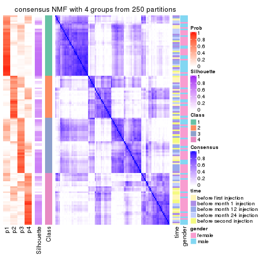</p>

</div>
<div id='tab-CV-NMF-consensus-heatmap-4'>
<pre><code class="r">consensus_heatmap(res, k = 5)
</code></pre>

<p></p>

</div>
<div id='tab-CV-NMF-consensus-heatmap-5'>
<pre><code class="r">consensus_heatmap(res, k = 6)
</code></pre>

<p></p>

</div>
</div>

Heatmaps for the membership of samples in all partitions to see how consistent they are:


<script>
$( function() {
	$( '#tabs-CV-NMF-membership-heatmap' ).tabs();
} );
</script>
<div id='tabs-CV-NMF-membership-heatmap'>
<ul>
<li><a href='#tab-CV-NMF-membership-heatmap-1'>k = 2</a></li>
<li><a href='#tab-CV-NMF-membership-heatmap-2'>k = 3</a></li>
<li><a href='#tab-CV-NMF-membership-heatmap-3'>k = 4</a></li>
<li><a href='#tab-CV-NMF-membership-heatmap-4'>k = 5</a></li>
<li><a href='#tab-CV-NMF-membership-heatmap-5'>k = 6</a></li>
</ul>
<div id='tab-CV-NMF-membership-heatmap-1'>
<pre><code class="r">membership_heatmap(res, k = 2)
</code></pre>

<p></p>

</div>
<div id='tab-CV-NMF-membership-heatmap-2'>
<pre><code class="r">membership_heatmap(res, k = 3)
</code></pre>

<p></p>

</div>
<div id='tab-CV-NMF-membership-heatmap-3'>
<pre><code class="r">membership_heatmap(res, k = 4)
</code></pre>

<p></p>

</div>
<div id='tab-CV-NMF-membership-heatmap-4'>
<pre><code class="r">membership_heatmap(res, k = 5)
</code></pre>

<p></p>

</div>
<div id='tab-CV-NMF-membership-heatmap-5'>
<pre><code class="r">membership_heatmap(res, k = 6)
</code></pre>

<p></p>

</div>
</div>

As soon as we have had the classes for columns, we can look for signatures
which are significantly different between classes which can be candidate marks
for certain classes. Following are the heatmaps for signatures.


Signature heatmaps where rows are scaled:


<script>
$( function() {
	$( '#tabs-CV-NMF-get-signatures' ).tabs();
} );
</script>
<div id='tabs-CV-NMF-get-signatures'>
<ul>
<li><a href='#tab-CV-NMF-get-signatures-1'>k = 2</a></li>
<li><a href='#tab-CV-NMF-get-signatures-2'>k = 3</a></li>
<li><a href='#tab-CV-NMF-get-signatures-3'>k = 4</a></li>
<li><a href='#tab-CV-NMF-get-signatures-4'>k = 5</a></li>
<li><a href='#tab-CV-NMF-get-signatures-5'>k = 6</a></li>
</ul>
<div id='tab-CV-NMF-get-signatures-1'>
<pre><code class="r">get_signatures(res, k = 2)
</code></pre>

<p></p>

</div>
<div id='tab-CV-NMF-get-signatures-2'>
<pre><code class="r">get_signatures(res, k = 3)
</code></pre>

<p></p>

</div>
<div id='tab-CV-NMF-get-signatures-3'>
<pre><code class="r">get_signatures(res, k = 4)
</code></pre>

<p></p>

</div>
<div id='tab-CV-NMF-get-signatures-4'>
<pre><code class="r">get_signatures(res, k = 5)
</code></pre>

<p></p>

</div>
<div id='tab-CV-NMF-get-signatures-5'>
<pre><code class="r">get_signatures(res, k = 6)
</code></pre>

<p></p>

</div>
</div>


Signature heatmaps where rows are not scaled:


<script>
$( function() {
	$( '#tabs-CV-NMF-get-signatures-no-scale' ).tabs();
} );
</script>
<div id='tabs-CV-NMF-get-signatures-no-scale'>
<ul>
<li><a href='#tab-CV-NMF-get-signatures-no-scale-1'>k = 2</a></li>
<li><a href='#tab-CV-NMF-get-signatures-no-scale-2'>k = 3</a></li>
<li><a href='#tab-CV-NMF-get-signatures-no-scale-3'>k = 4</a></li>
<li><a href='#tab-CV-NMF-get-signatures-no-scale-4'>k = 5</a></li>
<li><a href='#tab-CV-NMF-get-signatures-no-scale-5'>k = 6</a></li>
</ul>
<div id='tab-CV-NMF-get-signatures-no-scale-1'>
<pre><code class="r">get_signatures(res, k = 2, scale_rows = FALSE)
</code></pre>

<p></p>

</div>
<div id='tab-CV-NMF-get-signatures-no-scale-2'>
<pre><code class="r">get_signatures(res, k = 3, scale_rows = FALSE)
</code></pre>

<p></p>

</div>
<div id='tab-CV-NMF-get-signatures-no-scale-3'>
<pre><code class="r">get_signatures(res, k = 4, scale_rows = FALSE)
</code></pre>

<p></p>

</div>
<div id='tab-CV-NMF-get-signatures-no-scale-4'>
<pre><code class="r">get_signatures(res, k = 5, scale_rows = FALSE)
</code></pre>

<p></p>

</div>
<div id='tab-CV-NMF-get-signatures-no-scale-5'>
<pre><code class="r">get_signatures(res, k = 6, scale_rows = FALSE)
</code></pre>

<p></p>

</div>
</div>


Compare the overlap of signatures from different k:

```r
compare_signatures(res)
```

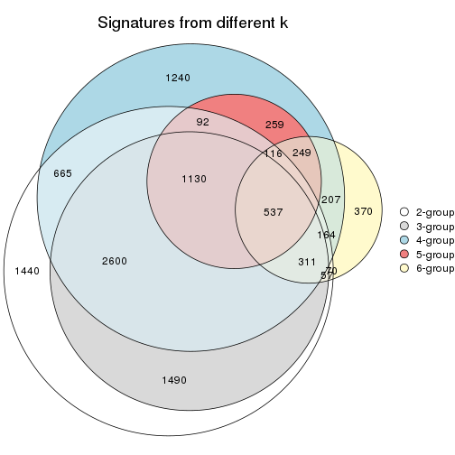

`get_signature()` returns a data frame invisibly. TO get the list of signatures, the function
call should be assigned to a variable explicitly. In following code, if `plot` argument is set
to `FALSE`, no heatmap is plotted while only the differential analysis is performed.

```r
# code only for demonstration
tb = get_signature(res, k = ..., plot = FALSE)
```

An example of the output of `tb` is:

```
#>   which_row         fdr    mean_1    mean_2 scaled_mean_1 scaled_mean_2 km
#> 1        38 0.042760348  8.373488  9.131774    -0.5533452     0.5164555  1
#> 2        40 0.018707592  7.106213  8.469186    -0.6173731     0.5762149  1
#> 3        55 0.019134737 10.221463 11.207825    -0.6159697     0.5749050  1
#> 4        59 0.006059896  5.921854  7.869574    -0.6899429     0.6439467  1
#> 5        60 0.018055526  8.928898 10.211722    -0.6204761     0.5791110  1
#> 6        98 0.009384629 15.714769 14.887706     0.6635654    -0.6193277  2
...
```

The columns in `tb` are:

1. `which_row`: row indices corresponding to the input matrix.
2. `fdr`: FDR for the differential test. 
3. `mean_x`: The mean value in group x.
4. `scaled_mean_x`: The mean value in group x after rows are scaled.
5. `km`: Row groups if k-means clustering is applied to rows.


UMAP plot which shows how samples are separated.


<script>
$( function() {
	$( '#tabs-CV-NMF-dimension-reduction' ).tabs();
} );
</script>
<div id='tabs-CV-NMF-dimension-reduction'>
<ul>
<li><a href='#tab-CV-NMF-dimension-reduction-1'>k = 2</a></li>
<li><a href='#tab-CV-NMF-dimension-reduction-2'>k = 3</a></li>
<li><a href='#tab-CV-NMF-dimension-reduction-3'>k = 4</a></li>
<li><a href='#tab-CV-NMF-dimension-reduction-4'>k = 5</a></li>
<li><a href='#tab-CV-NMF-dimension-reduction-5'>k = 6</a></li>
</ul>
<div id='tab-CV-NMF-dimension-reduction-1'>
<pre><code class="r">dimension_reduction(res, k = 2, method = &quot;UMAP&quot;)
</code></pre>

<p></p>

</div>
<div id='tab-CV-NMF-dimension-reduction-2'>
<pre><code class="r">dimension_reduction(res, k = 3, method = &quot;UMAP&quot;)
</code></pre>

<p></p>

</div>
<div id='tab-CV-NMF-dimension-reduction-3'>
<pre><code class="r">dimension_reduction(res, k = 4, method = &quot;UMAP&quot;)
</code></pre>

<p></p>

</div>
<div id='tab-CV-NMF-dimension-reduction-4'>
<pre><code class="r">dimension_reduction(res, k = 5, method = &quot;UMAP&quot;)
</code></pre>

<p></p>

</div>
<div id='tab-CV-NMF-dimension-reduction-5'>
<pre><code class="r">dimension_reduction(res, k = 6, method = &quot;UMAP&quot;)
</code></pre>

<p></p>

</div>
</div>


Following heatmap shows how subgroups are split when increasing `k`:

```r
collect_classes(res)
```


Test correlation between subgroups and known annotations. If the known
annotation is numeric, one-way ANOVA test is applied, and if the known
annotation is discrete, chi-squared contingency table test is applied.

```r
test_to_known_factors(res)
```

```
#>          n time(p) gender(p) k
#> CV:NMF 122   0.187    0.9827 2
#> CV:NMF  79   0.018    0.6148 3
#> CV:NMF  69   0.589    0.6600 4
#> CV:NMF  31   0.930    0.0206 5
#> CV:NMF  28   0.344    0.0856 6
```


If matrix rows can be associated to genes, consider to use `functional_enrichment(res,
...)` to perform function enrichment for the signature genes. See [this vignette](http://bioconductor.org/packages/devel/bioc/vignettes/cola/inst/doc/functional_enrichment.html) for more detailed explanations.


 

---------------------------------------------------


### MAD:hclust


The object with results only for a single top-value method and a single partition method 
can be extracted as:

```r
res = res_list["MAD", "hclust"]
# you can also extract it by
# res = res_list["MAD:hclust"]
```

A summary of `res` and all the functions that can be applied to it:

```r
res
```

```
#> A 'ConsensusPartition' object with k = 2, 3, 4, 5, 6.
#>   On a matrix with 21512 rows and 125 columns.
#>   Top rows (1000, 2000, 3000, 4000, 5000) are extracted by 'MAD' method.
#>   Subgroups are detected by 'hclust' method.
#>   Performed in total 1250 partitions by row resampling.
#>   Best k for subgroups seems to be 3.
#> 
#> Following methods can be applied to this 'ConsensusPartition' object:
#>  [1] "cola_report"             "collect_classes"         "collect_plots"          
#>  [4] "collect_stats"           "colnames"                "compare_signatures"     
#>  [7] "consensus_heatmap"       "dimension_reduction"     "functional_enrichment"  
#> [10] "get_anno_col"            "get_anno"                "get_classes"            
#> [13] "get_consensus"           "get_matrix"              "get_membership"         
#> [16] "get_param"               "get_signatures"          "get_stats"              
#> [19] "is_best_k"               "is_stable_k"             "membership_heatmap"     
#> [22] "ncol"                    "nrow"                    "plot_ecdf"              
#> [25] "rownames"                "select_partition_number" "show"                   
#> [28] "suggest_best_k"          "test_to_known_factors"
```

`collect_plots()` function collects all the plots made from `res` for all `k` (number of partitions)
into one single page to provide an easy and fast comparison between different `k`.

```r
collect_plots(res)
```


The plots are:

- The first row: a plot of the ECDF (empirical cumulative distribution
  function) curves of the consensus matrix for each `k` and the heatmap of
  predicted classes for each `k`.
- The second row: heatmaps of the consensus matrix for each `k`.
- The third row: heatmaps of the membership matrix for each `k`.
- The fouth row: heatmaps of the signatures for each `k`.

All the plots in panels can be made by individual functions and they are
plotted later in this section.

`select_partition_number()` produces several plots showing different
statistics for choosing "optimized" `k`. There are following statistics:

- ECDF curves of the consensus matrix for each `k`;
- 1-PAC. [The PAC
  score](https://en.wikipedia.org/wiki/Consensus_clustering#Over-interpretation_potential_of_consensus_clustering)
  measures the proportion of the ambiguous subgrouping.
- Mean silhouette score.
- Concordance. The mean probability of fiting the consensus class ids in all
  partitions.
- Area increased. Denote $A_k$ as the area under the ECDF curve for current
  `k`, the area increased is defined as $A_k - A_{k-1}$.
- Rand index. The percent of pairs of samples that are both in a same cluster
  or both are not in a same cluster in the partition of k and k-1.
- Jaccard index. The ratio of pairs of samples are both in a same cluster in
  the partition of k and k-1 and the pairs of samples are both in a same
  cluster in the partition k or k-1.

The detailed explanations of these statistics can be found in [the _cola_
vignette](http://bioconductor.org/packages/devel/bioc/vignettes/cola/inst/doc/cola.html#toc_13).

Generally speaking, lower PAC score, higher mean silhouette score or higher
concordance corresponds to better partition. Rand index and Jaccard index
measure how similar the current partition is compared to partition with `k-1`.
If they are too similar, we won't accept `k` is better than `k-1`.

```r
select_partition_number(res)
```


The numeric values for all these statistics can be obtained by `get_stats()`.

```r
get_stats(res)
```

```
#>   k 1-PAC mean_silhouette concordance area_increased  Rand Jaccard
#> 2 2 0.211           0.646       0.706         0.3334 0.550   0.550
#> 3 3 0.146           0.680       0.807         0.4859 0.827   0.715
#> 4 4 0.350           0.478       0.759         0.2021 0.966   0.930
#> 5 5 0.379           0.597       0.716         0.0851 0.861   0.706
#> 6 6 0.385           0.540       0.721         0.0776 0.981   0.948
```

`suggest_best_k()` suggests the best $k$ based on these statistics. The rules are as follows:

- All $k$ with Jaccard index larger than 0.95 are removed because increasing
  $k$ does not provide enough extra information. If all $k$ are removed, it is
  marked as no subgroup is detected.
- For all $k$ with 1-PAC score larger than 0.9, the maximal $k$ is taken as
  the best $k$, and other $k$ are marked as optional $k$.
- If it does not fit the second rule. The $k$ with the maximal vote of the
  highest 1-PAC score, highest mean silhouette, and highest concordance is
  taken as the best $k$.

```r
suggest_best_k(res)
```

```
#> [1] 3
```


Following shows the table of the partitions (You need to click the **show/hide
code output** link to see it). The membership matrix (columns with name `p*`)
is inferred by
[`clue::cl_consensus()`](https://www.rdocumentation.org/link/cl_consensus?package=clue)
function with the `SE` method. Basically the value in the membership matrix
represents the probability to belong to a certain group. The finall class
label for an item is determined with the group with highest probability it
belongs to.

In `get_classes()` function, the entropy is calculated from the membership
matrix and the silhouette score is calculated from the consensus matrix.


<script>
$( function() {
	$( '#tabs-MAD-hclust-get-classes' ).tabs();
} );
</script>
<div id='tabs-MAD-hclust-get-classes'>
<ul>
<li><a href='#tab-MAD-hclust-get-classes-1'>k = 2</a></li>
<li><a href='#tab-MAD-hclust-get-classes-2'>k = 3</a></li>
<li><a href='#tab-MAD-hclust-get-classes-3'>k = 4</a></li>
<li><a href='#tab-MAD-hclust-get-classes-4'>k = 5</a></li>
<li><a href='#tab-MAD-hclust-get-classes-5'>k = 6</a></li>
</ul>

<div id='tab-MAD-hclust-get-classes-1'>
<p><a id='tab-MAD-hclust-get-classes-1-a' style='color:#0366d6' href='#'>show/hide code output</a></p>
<pre><code class="r">cbind(get_classes(res, k = 2), get_membership(res, k = 2))
</code></pre>

<pre><code>#&gt;           class entropy silhouette    p1    p2
#&gt; GSM601872     2  0.9850    0.75448 0.428 0.572
#&gt; GSM601882     2  0.9815    0.81413 0.420 0.580
#&gt; GSM601887     1  0.7139    0.61847 0.804 0.196
#&gt; GSM601892     1  0.2603    0.78632 0.956 0.044
#&gt; GSM601897     1  0.6887    0.64281 0.816 0.184
#&gt; GSM601902     2  0.9977    0.72549 0.472 0.528
#&gt; GSM601912     1  0.3879    0.77131 0.924 0.076
#&gt; GSM601927     1  0.2423    0.79269 0.960 0.040
#&gt; GSM601932     2  0.9944    0.75608 0.456 0.544
#&gt; GSM601937     2  0.9686    0.53768 0.396 0.604
#&gt; GSM601942     2  0.9323    0.61218 0.348 0.652
#&gt; GSM601947     1  0.9358   -0.02473 0.648 0.352
#&gt; GSM601957     1  0.0672    0.78781 0.992 0.008
#&gt; GSM601972     2  0.9977    0.73742 0.472 0.528
#&gt; GSM601977     2  0.9815    0.81434 0.420 0.580
#&gt; GSM601987     2  0.9795    0.81615 0.416 0.584
#&gt; GSM601877     1  0.2423    0.79269 0.960 0.040
#&gt; GSM601907     2  0.9850    0.81578 0.428 0.572
#&gt; GSM601917     1  0.9044    0.24415 0.680 0.320
#&gt; GSM601922     1  0.9427    0.00182 0.640 0.360
#&gt; GSM601952     2  0.9996    0.69980 0.488 0.512
#&gt; GSM601962     1  0.2603    0.79055 0.956 0.044
#&gt; GSM601967     1  0.0672    0.79168 0.992 0.008
#&gt; GSM601982     1  0.9608   -0.22807 0.616 0.384
#&gt; GSM601992     2  0.9248    0.74086 0.340 0.660
#&gt; GSM601873     2  0.9933    0.74783 0.452 0.548
#&gt; GSM601883     2  0.9795    0.81374 0.416 0.584
#&gt; GSM601888     1  0.7219    0.61164 0.800 0.200
#&gt; GSM601893     1  0.4431    0.76428 0.908 0.092
#&gt; GSM601898     1  0.0376    0.78953 0.996 0.004
#&gt; GSM601903     2  0.9977    0.72549 0.472 0.528
#&gt; GSM601913     1  0.1843    0.78817 0.972 0.028
#&gt; GSM601928     1  0.2423    0.79269 0.960 0.040
#&gt; GSM601933     2  0.9866    0.81436 0.432 0.568
#&gt; GSM601938     2  0.9833    0.81322 0.424 0.576
#&gt; GSM601943     2  0.9850    0.73064 0.428 0.572
#&gt; GSM601948     1  0.4815    0.75077 0.896 0.104
#&gt; GSM601958     1  0.0376    0.78953 0.996 0.004
#&gt; GSM601973     2  0.9983    0.72372 0.476 0.524
#&gt; GSM601978     2  0.9795    0.81501 0.416 0.584
#&gt; GSM601988     1  0.9850   -0.11288 0.572 0.428
#&gt; GSM601878     1  0.2423    0.79269 0.960 0.040
#&gt; GSM601908     2  0.9833    0.81583 0.424 0.576
#&gt; GSM601918     1  0.9661   -0.19531 0.608 0.392
#&gt; GSM601923     1  0.2423    0.79269 0.960 0.040
#&gt; GSM601953     2  0.9833    0.81196 0.424 0.576
#&gt; GSM601963     1  0.2423    0.79421 0.960 0.040
#&gt; GSM601968     1  0.1414    0.79373 0.980 0.020
#&gt; GSM601983     1  0.3274    0.78300 0.940 0.060
#&gt; GSM601993     2  0.9286    0.71594 0.344 0.656
#&gt; GSM601874     2  0.9815    0.81012 0.420 0.580
#&gt; GSM601884     2  0.9815    0.81413 0.420 0.580
#&gt; GSM601889     1  0.0672    0.79221 0.992 0.008
#&gt; GSM601894     1  0.1633    0.78595 0.976 0.024
#&gt; GSM601899     1  0.5737    0.72502 0.864 0.136
#&gt; GSM601904     1  0.7674    0.53867 0.776 0.224
#&gt; GSM601914     1  0.2236    0.78337 0.964 0.036
#&gt; GSM601929     1  0.2948    0.79269 0.948 0.052
#&gt; GSM601934     2  0.9933    0.79824 0.452 0.548
#&gt; GSM601939     1  0.0376    0.78953 0.996 0.004
#&gt; GSM601944     2  0.9983    0.73837 0.476 0.524
#&gt; GSM601949     1  0.4431    0.76178 0.908 0.092
#&gt; GSM601959     1  0.0672    0.78891 0.992 0.008
#&gt; GSM601974     1  0.8661    0.40584 0.712 0.288
#&gt; GSM601979     2  0.9795    0.81501 0.416 0.584
#&gt; GSM601989     1  0.1633    0.79495 0.976 0.024
#&gt; GSM601879     1  0.2423    0.79269 0.960 0.040
#&gt; GSM601909     1  0.3114    0.78435 0.944 0.056
#&gt; GSM601919     1  0.9661   -0.19531 0.608 0.392
#&gt; GSM601924     1  0.2236    0.79362 0.964 0.036
#&gt; GSM601954     1  0.9896   -0.49962 0.560 0.440
#&gt; GSM601964     1  0.2778    0.78995 0.952 0.048
#&gt; GSM601969     1  0.1184    0.79488 0.984 0.016
#&gt; GSM601984     1  0.5294    0.73682 0.880 0.120
#&gt; GSM601994     2  0.9358    0.74010 0.352 0.648
#&gt; GSM601875     2  0.9866    0.81306 0.432 0.568
#&gt; GSM601885     2  0.9833    0.81323 0.424 0.576
#&gt; GSM601890     1  0.7376    0.59950 0.792 0.208
#&gt; GSM601895     1  0.1414    0.79390 0.980 0.020
#&gt; GSM601900     1  0.1843    0.79170 0.972 0.028
#&gt; GSM601905     1  0.8327    0.41738 0.736 0.264
#&gt; GSM601915     1  0.1843    0.78667 0.972 0.028
#&gt; GSM601930     1  0.2778    0.79200 0.952 0.048
#&gt; GSM601935     1  0.8813    0.38434 0.700 0.300
#&gt; GSM601940     1  0.0938    0.79306 0.988 0.012
#&gt; GSM601945     2  0.9881    0.80810 0.436 0.564
#&gt; GSM601950     1  0.2423    0.79585 0.960 0.040
#&gt; GSM601960     1  0.3431    0.77500 0.936 0.064
#&gt; GSM601975     1  0.9909   -0.46863 0.556 0.444
#&gt; GSM601980     2  0.7376    0.38734 0.208 0.792
#&gt; GSM601990     1  0.2236    0.79274 0.964 0.036
#&gt; GSM601880     1  0.2423    0.79269 0.960 0.040
#&gt; GSM601910     1  0.1843    0.79472 0.972 0.028
#&gt; GSM601920     1  0.8499    0.38844 0.724 0.276
#&gt; GSM601925     1  0.2423    0.79269 0.960 0.040
#&gt; GSM601955     2  0.7299    0.35141 0.204 0.796
#&gt; GSM601965     1  0.5178    0.74444 0.884 0.116
#&gt; GSM601970     1  0.0938    0.79052 0.988 0.012
#&gt; GSM601985     1  0.1414    0.78789 0.980 0.020
#&gt; GSM601995     2  0.9491    0.42580 0.368 0.632
#&gt; GSM601876     1  0.2043    0.79646 0.968 0.032
#&gt; GSM601886     1  0.8081    0.52116 0.752 0.248
#&gt; GSM601891     1  0.7299    0.60332 0.796 0.204
#&gt; GSM601896     1  0.1843    0.79507 0.972 0.028
#&gt; GSM601901     2  0.9922    0.79936 0.448 0.552
#&gt; GSM601906     1  0.7528    0.55672 0.784 0.216
#&gt; GSM601916     1  0.9954   -0.54090 0.540 0.460
#&gt; GSM601931     1  0.2236    0.79315 0.964 0.036
#&gt; GSM601936     1  0.9732   -0.05755 0.596 0.404
#&gt; GSM601941     2  0.9954    0.74399 0.460 0.540
#&gt; GSM601946     1  0.1184    0.79367 0.984 0.016
#&gt; GSM601951     1  0.5519    0.72209 0.872 0.128
#&gt; GSM601961     2  0.9983    0.75995 0.476 0.524
#&gt; GSM601976     1  0.9491   -0.10058 0.632 0.368
#&gt; GSM601981     2  0.9983    0.75961 0.476 0.524
#&gt; GSM601991     1  0.5059    0.74661 0.888 0.112
#&gt; GSM601881     1  0.2423    0.79269 0.960 0.040
#&gt; GSM601911     1  0.6887    0.63148 0.816 0.184
#&gt; GSM601921     1  0.8499    0.38844 0.724 0.276
#&gt; GSM601926     1  0.2236    0.79310 0.964 0.036
#&gt; GSM601956     2  0.9815    0.81310 0.420 0.580
#&gt; GSM601966     2  0.9963    0.74061 0.464 0.536
#&gt; GSM601971     1  0.0938    0.79401 0.988 0.012
#&gt; GSM601986     1  0.5178    0.73394 0.884 0.116
#&gt; GSM601996     2  0.9460    0.74315 0.364 0.636
</code></pre>

<script>
$('#tab-MAD-hclust-get-classes-1-a').parent().next().next().hide();
$('#tab-MAD-hclust-get-classes-1-a').click(function(){
  $('#tab-MAD-hclust-get-classes-1-a').parent().next().next().toggle();
  return(false);
});
</script>
</div>

<div id='tab-MAD-hclust-get-classes-2'>
<p><a id='tab-MAD-hclust-get-classes-2-a' style='color:#0366d6' href='#'>show/hide code output</a></p>
<pre><code class="r">cbind(get_classes(res, k = 3), get_membership(res, k = 3))
</code></pre>

<pre><code>#&gt;           class entropy silhouette    p1    p2    p3
#&gt; GSM601872     2  0.6191     0.6866 0.140 0.776 0.084
#&gt; GSM601882     2  0.3845     0.7462 0.116 0.872 0.012
#&gt; GSM601887     1  0.6414     0.6109 0.716 0.248 0.036
#&gt; GSM601892     1  0.2152     0.8234 0.948 0.036 0.016
#&gt; GSM601897     1  0.7021     0.6133 0.708 0.216 0.076
#&gt; GSM601902     2  0.6354     0.7043 0.196 0.748 0.056
#&gt; GSM601912     1  0.3752     0.8083 0.884 0.096 0.020
#&gt; GSM601927     1  0.3272     0.8180 0.892 0.104 0.004
#&gt; GSM601932     2  0.5901     0.7188 0.176 0.776 0.048
#&gt; GSM601937     2  0.8775     0.2663 0.152 0.568 0.280
#&gt; GSM601942     2  0.8521    -0.1042 0.092 0.468 0.440
#&gt; GSM601947     2  0.7735     0.2793 0.440 0.512 0.048
#&gt; GSM601957     1  0.0661     0.8250 0.988 0.008 0.004
#&gt; GSM601972     2  0.5384     0.7392 0.188 0.788 0.024
#&gt; GSM601977     2  0.4551     0.7489 0.140 0.840 0.020
#&gt; GSM601987     2  0.4209     0.7455 0.120 0.860 0.020
#&gt; GSM601877     1  0.3272     0.8180 0.892 0.104 0.004
#&gt; GSM601907     2  0.4136     0.7400 0.116 0.864 0.020
#&gt; GSM601917     1  0.7841    -0.1017 0.480 0.468 0.052
#&gt; GSM601922     2  0.7883     0.2997 0.428 0.516 0.056
#&gt; GSM601952     2  0.6079     0.7197 0.216 0.748 0.036
#&gt; GSM601962     1  0.2773     0.8265 0.928 0.048 0.024
#&gt; GSM601967     1  0.0592     0.8283 0.988 0.012 0.000
#&gt; GSM601982     2  0.7339     0.4691 0.392 0.572 0.036
#&gt; GSM601992     2  0.5722     0.6389 0.084 0.804 0.112
#&gt; GSM601873     2  0.6299     0.6765 0.132 0.772 0.096
#&gt; GSM601883     2  0.3771     0.7432 0.112 0.876 0.012
#&gt; GSM601888     1  0.6482     0.6097 0.716 0.244 0.040
#&gt; GSM601893     1  0.3933     0.7987 0.880 0.092 0.028
#&gt; GSM601898     1  0.0592     0.8283 0.988 0.012 0.000
#&gt; GSM601903     2  0.6258     0.7057 0.196 0.752 0.052
#&gt; GSM601913     1  0.1337     0.8283 0.972 0.012 0.016
#&gt; GSM601928     1  0.3272     0.8180 0.892 0.104 0.004
#&gt; GSM601933     2  0.4748     0.7535 0.144 0.832 0.024
#&gt; GSM601938     2  0.4209     0.7492 0.120 0.860 0.020
#&gt; GSM601943     2  0.6662     0.6651 0.128 0.752 0.120
#&gt; GSM601948     1  0.5115     0.7585 0.796 0.188 0.016
#&gt; GSM601958     1  0.0424     0.8259 0.992 0.008 0.000
#&gt; GSM601973     2  0.6007     0.7111 0.184 0.768 0.048
#&gt; GSM601978     2  0.4280     0.7412 0.124 0.856 0.020
#&gt; GSM601988     2  0.9506     0.2377 0.360 0.448 0.192
#&gt; GSM601878     1  0.3272     0.8180 0.892 0.104 0.004
#&gt; GSM601908     2  0.4068     0.7419 0.120 0.864 0.016
#&gt; GSM601918     2  0.7784     0.4376 0.388 0.556 0.056
#&gt; GSM601923     1  0.3272     0.8180 0.892 0.104 0.004
#&gt; GSM601953     2  0.4413     0.7368 0.124 0.852 0.024
#&gt; GSM601963     1  0.2152     0.8323 0.948 0.036 0.016
#&gt; GSM601968     1  0.1525     0.8320 0.964 0.032 0.004
#&gt; GSM601983     1  0.3237     0.8198 0.912 0.056 0.032
#&gt; GSM601993     2  0.6561     0.6117 0.100 0.756 0.144
#&gt; GSM601874     2  0.4519     0.7369 0.116 0.852 0.032
#&gt; GSM601884     2  0.3607     0.7441 0.112 0.880 0.008
#&gt; GSM601889     1  0.0592     0.8283 0.988 0.012 0.000
#&gt; GSM601894     1  0.1337     0.8217 0.972 0.016 0.012
#&gt; GSM601899     1  0.4937     0.7560 0.824 0.148 0.028
#&gt; GSM601904     1  0.7424     0.3205 0.592 0.364 0.044
#&gt; GSM601914     1  0.1919     0.8265 0.956 0.020 0.024
#&gt; GSM601929     1  0.3826     0.8094 0.868 0.124 0.008
#&gt; GSM601934     2  0.5178     0.7538 0.164 0.808 0.028
#&gt; GSM601939     1  0.0892     0.8321 0.980 0.020 0.000
#&gt; GSM601944     2  0.6679     0.6803 0.152 0.748 0.100
#&gt; GSM601949     1  0.4749     0.7747 0.816 0.172 0.012
#&gt; GSM601959     1  0.0661     0.8246 0.988 0.008 0.004
#&gt; GSM601974     1  0.8261     0.1815 0.524 0.396 0.080
#&gt; GSM601979     2  0.4280     0.7412 0.124 0.856 0.020
#&gt; GSM601989     1  0.1411     0.8318 0.964 0.036 0.000
#&gt; GSM601879     1  0.3272     0.8180 0.892 0.104 0.004
#&gt; GSM601909     1  0.3129     0.8180 0.904 0.088 0.008
#&gt; GSM601919     2  0.7784     0.4376 0.388 0.556 0.056
#&gt; GSM601924     1  0.3193     0.8193 0.896 0.100 0.004
#&gt; GSM601954     2  0.6988     0.6222 0.320 0.644 0.036
#&gt; GSM601964     1  0.2564     0.8277 0.936 0.036 0.028
#&gt; GSM601969     1  0.1337     0.8316 0.972 0.016 0.012
#&gt; GSM601984     1  0.5200     0.7485 0.796 0.184 0.020
#&gt; GSM601994     2  0.6254     0.6382 0.108 0.776 0.116
#&gt; GSM601875     2  0.4209     0.7451 0.120 0.860 0.020
#&gt; GSM601885     2  0.3918     0.7482 0.120 0.868 0.012
#&gt; GSM601890     1  0.6559     0.5996 0.708 0.252 0.040
#&gt; GSM601895     1  0.1482     0.8303 0.968 0.020 0.012
#&gt; GSM601900     1  0.1482     0.8290 0.968 0.012 0.020
#&gt; GSM601905     1  0.7634     0.0913 0.524 0.432 0.044
#&gt; GSM601915     1  0.1636     0.8266 0.964 0.016 0.020
#&gt; GSM601930     1  0.3532     0.8157 0.884 0.108 0.008
#&gt; GSM601935     1  0.8646     0.3115 0.556 0.320 0.124
#&gt; GSM601940     1  0.1267     0.8334 0.972 0.024 0.004
#&gt; GSM601945     2  0.4848     0.7338 0.128 0.836 0.036
#&gt; GSM601950     1  0.2711     0.8286 0.912 0.088 0.000
#&gt; GSM601960     1  0.3583     0.8111 0.900 0.044 0.056
#&gt; GSM601975     2  0.6897     0.6335 0.292 0.668 0.040
#&gt; GSM601980     3  0.4845     0.7535 0.052 0.104 0.844
#&gt; GSM601990     1  0.2176     0.8292 0.948 0.032 0.020
#&gt; GSM601880     1  0.3272     0.8180 0.892 0.104 0.004
#&gt; GSM601910     1  0.2063     0.8310 0.948 0.044 0.008
#&gt; GSM601920     1  0.7619     0.1138 0.532 0.424 0.044
#&gt; GSM601925     1  0.3272     0.8180 0.892 0.104 0.004
#&gt; GSM601955     3  0.4565     0.7481 0.064 0.076 0.860
#&gt; GSM601965     1  0.5331     0.7456 0.792 0.184 0.024
#&gt; GSM601970     1  0.0829     0.8274 0.984 0.012 0.004
#&gt; GSM601985     1  0.1015     0.8269 0.980 0.008 0.012
#&gt; GSM601995     3  0.9258     0.3838 0.204 0.272 0.524
#&gt; GSM601876     1  0.2400     0.8319 0.932 0.064 0.004
#&gt; GSM601886     1  0.7756     0.2866 0.564 0.380 0.056
#&gt; GSM601891     1  0.6526     0.5890 0.704 0.260 0.036
#&gt; GSM601896     1  0.2066     0.8334 0.940 0.060 0.000
#&gt; GSM601901     2  0.4873     0.7572 0.152 0.824 0.024
#&gt; GSM601906     1  0.7368     0.3586 0.604 0.352 0.044
#&gt; GSM601916     2  0.7213     0.6419 0.272 0.668 0.060
#&gt; GSM601931     1  0.3193     0.8189 0.896 0.100 0.004
#&gt; GSM601936     2  0.9167     0.2705 0.392 0.460 0.148
#&gt; GSM601941     2  0.5743     0.7115 0.172 0.784 0.044
#&gt; GSM601946     1  0.2066     0.8321 0.940 0.060 0.000
#&gt; GSM601951     1  0.5450     0.7027 0.760 0.228 0.012
#&gt; GSM601961     2  0.5470     0.7311 0.168 0.796 0.036
#&gt; GSM601976     2  0.7424     0.4326 0.388 0.572 0.040
#&gt; GSM601981     2  0.5223     0.7521 0.176 0.800 0.024
#&gt; GSM601991     1  0.5093     0.7776 0.836 0.088 0.076
#&gt; GSM601881     1  0.3272     0.8180 0.892 0.104 0.004
#&gt; GSM601911     1  0.6539     0.5741 0.684 0.288 0.028
#&gt; GSM601921     1  0.7619     0.1138 0.532 0.424 0.044
#&gt; GSM601926     1  0.3038     0.8189 0.896 0.104 0.000
#&gt; GSM601956     2  0.4342     0.7378 0.120 0.856 0.024
#&gt; GSM601966     2  0.5743     0.7153 0.172 0.784 0.044
#&gt; GSM601971     1  0.1015     0.8306 0.980 0.012 0.008
#&gt; GSM601986     1  0.5219     0.7304 0.788 0.196 0.016
#&gt; GSM601996     2  0.6462     0.6407 0.120 0.764 0.116
</code></pre>

<script>
$('#tab-MAD-hclust-get-classes-2-a').parent().next().next().hide();
$('#tab-MAD-hclust-get-classes-2-a').click(function(){
  $('#tab-MAD-hclust-get-classes-2-a').parent().next().next().toggle();
  return(false);
});
</script>
</div>

<div id='tab-MAD-hclust-get-classes-3'>
<p><a id='tab-MAD-hclust-get-classes-3-a' style='color:#0366d6' href='#'>show/hide code output</a></p>
<pre><code class="r">cbind(get_classes(res, k = 4), get_membership(res, k = 4))
</code></pre>

<pre><code>#&gt;           class entropy silhouette    p1    p2    p3    p4
#&gt; GSM601872     2  0.5512     0.4880 0.032 0.772 0.088 0.108
#&gt; GSM601882     2  0.1639     0.5950 0.008 0.952 0.004 0.036
#&gt; GSM601887     1  0.6088     0.4626 0.700 0.212 0.024 0.064
#&gt; GSM601892     1  0.1575     0.7516 0.956 0.028 0.012 0.004
#&gt; GSM601897     1  0.7020     0.4286 0.668 0.172 0.096 0.064
#&gt; GSM601902     2  0.6568     0.2478 0.096 0.572 0.000 0.332
#&gt; GSM601912     1  0.3725     0.7228 0.860 0.076 0.004 0.060
#&gt; GSM601927     1  0.3958     0.7129 0.816 0.024 0.000 0.160
#&gt; GSM601932     2  0.5966     0.3631 0.072 0.648 0.000 0.280
#&gt; GSM601937     4  0.7905    -0.1078 0.040 0.276 0.144 0.540
#&gt; GSM601942     3  0.6655     0.1753 0.000 0.440 0.476 0.084
#&gt; GSM601947     2  0.7808    -0.3338 0.312 0.416 0.000 0.272
#&gt; GSM601957     1  0.0376     0.7539 0.992 0.000 0.004 0.004
#&gt; GSM601972     2  0.5701     0.4424 0.080 0.712 0.004 0.204
#&gt; GSM601977     2  0.2838     0.5922 0.020 0.908 0.016 0.056
#&gt; GSM601987     2  0.1339     0.5966 0.008 0.964 0.004 0.024
#&gt; GSM601877     1  0.3910     0.7155 0.820 0.024 0.000 0.156
#&gt; GSM601907     2  0.2587     0.5797 0.004 0.908 0.012 0.076
#&gt; GSM601917     4  0.7914     0.2781 0.332 0.312 0.000 0.356
#&gt; GSM601922     2  0.7882    -0.3754 0.284 0.368 0.000 0.348
#&gt; GSM601952     2  0.6107     0.4353 0.100 0.708 0.016 0.176
#&gt; GSM601962     1  0.3080     0.7489 0.900 0.028 0.020 0.052
#&gt; GSM601967     1  0.0188     0.7564 0.996 0.000 0.000 0.004
#&gt; GSM601982     2  0.6594    -0.0464 0.308 0.612 0.024 0.056
#&gt; GSM601992     2  0.6049     0.1735 0.028 0.524 0.008 0.440
#&gt; GSM601873     2  0.6118     0.4183 0.024 0.712 0.084 0.180
#&gt; GSM601883     2  0.1492     0.5940 0.004 0.956 0.004 0.036
#&gt; GSM601888     1  0.6086     0.4518 0.696 0.220 0.024 0.060
#&gt; GSM601893     1  0.3617     0.7126 0.876 0.056 0.020 0.048
#&gt; GSM601898     1  0.0469     0.7568 0.988 0.000 0.000 0.012
#&gt; GSM601903     2  0.6519     0.2634 0.096 0.584 0.000 0.320
#&gt; GSM601913     1  0.1545     0.7566 0.952 0.000 0.008 0.040
#&gt; GSM601928     1  0.3958     0.7129 0.816 0.024 0.000 0.160
#&gt; GSM601933     2  0.2820     0.5946 0.020 0.904 0.008 0.068
#&gt; GSM601938     2  0.2380     0.5936 0.008 0.920 0.008 0.064
#&gt; GSM601943     2  0.5953     0.4127 0.016 0.724 0.104 0.156
#&gt; GSM601948     1  0.5678     0.6062 0.716 0.112 0.000 0.172
#&gt; GSM601958     1  0.0188     0.7547 0.996 0.000 0.000 0.004
#&gt; GSM601973     2  0.6435     0.3156 0.080 0.604 0.004 0.312
#&gt; GSM601978     2  0.2587     0.5765 0.004 0.908 0.012 0.076
#&gt; GSM601988     4  0.9406     0.4918 0.244 0.304 0.100 0.352
#&gt; GSM601878     1  0.3910     0.7155 0.820 0.024 0.000 0.156
#&gt; GSM601908     2  0.2528     0.5786 0.004 0.908 0.008 0.080
#&gt; GSM601918     2  0.7724    -0.2571 0.240 0.432 0.000 0.328
#&gt; GSM601923     1  0.3958     0.7129 0.816 0.024 0.000 0.160
#&gt; GSM601953     2  0.2795     0.5755 0.004 0.896 0.012 0.088
#&gt; GSM601963     1  0.2505     0.7564 0.920 0.008 0.020 0.052
#&gt; GSM601968     1  0.1139     0.7569 0.972 0.008 0.008 0.012
#&gt; GSM601983     1  0.3546     0.7395 0.880 0.032 0.028 0.060
#&gt; GSM601993     2  0.6784     0.0490 0.040 0.468 0.028 0.464
#&gt; GSM601874     2  0.2966     0.5839 0.020 0.896 0.008 0.076
#&gt; GSM601884     2  0.1575     0.5961 0.012 0.956 0.004 0.028
#&gt; GSM601889     1  0.0376     0.7566 0.992 0.004 0.000 0.004
#&gt; GSM601894     1  0.1042     0.7561 0.972 0.000 0.008 0.020
#&gt; GSM601899     1  0.4462     0.6548 0.824 0.116 0.024 0.036
#&gt; GSM601904     1  0.7597    -0.1671 0.468 0.224 0.000 0.308
#&gt; GSM601914     1  0.2246     0.7534 0.928 0.004 0.016 0.052
#&gt; GSM601929     1  0.4733     0.6930 0.780 0.044 0.004 0.172
#&gt; GSM601934     2  0.3526     0.5846 0.040 0.872 0.008 0.080
#&gt; GSM601939     1  0.1118     0.7606 0.964 0.000 0.000 0.036
#&gt; GSM601944     2  0.6242     0.3244 0.020 0.624 0.040 0.316
#&gt; GSM601949     1  0.5412     0.6352 0.736 0.096 0.000 0.168
#&gt; GSM601959     1  0.0376     0.7550 0.992 0.000 0.004 0.004
#&gt; GSM601974     1  0.8781    -0.2774 0.440 0.256 0.056 0.248
#&gt; GSM601979     2  0.2587     0.5765 0.004 0.908 0.012 0.076
#&gt; GSM601989     1  0.1182     0.7620 0.968 0.016 0.000 0.016
#&gt; GSM601879     1  0.3910     0.7155 0.820 0.024 0.000 0.156
#&gt; GSM601909     1  0.2982     0.7369 0.900 0.064 0.012 0.024
#&gt; GSM601919     2  0.7724    -0.2571 0.240 0.432 0.000 0.328
#&gt; GSM601924     1  0.3910     0.7160 0.820 0.024 0.000 0.156
#&gt; GSM601954     2  0.7241     0.1583 0.212 0.592 0.012 0.184
#&gt; GSM601964     1  0.2945     0.7506 0.904 0.016 0.024 0.056
#&gt; GSM601969     1  0.1284     0.7611 0.964 0.012 0.000 0.024
#&gt; GSM601984     1  0.5548     0.6323 0.740 0.112 0.004 0.144
#&gt; GSM601994     2  0.6436     0.0973 0.048 0.492 0.008 0.452
#&gt; GSM601875     2  0.2613     0.5926 0.024 0.916 0.008 0.052
#&gt; GSM601885     2  0.1706     0.5956 0.016 0.948 0.000 0.036
#&gt; GSM601890     1  0.6147     0.4567 0.696 0.216 0.028 0.060
#&gt; GSM601895     1  0.1486     0.7593 0.960 0.008 0.008 0.024
#&gt; GSM601900     1  0.1256     0.7581 0.964 0.000 0.008 0.028
#&gt; GSM601905     1  0.7873    -0.4003 0.388 0.292 0.000 0.320
#&gt; GSM601915     1  0.1584     0.7525 0.952 0.000 0.012 0.036
#&gt; GSM601930     1  0.4376     0.7019 0.796 0.028 0.004 0.172
#&gt; GSM601935     1  0.8468    -0.2176 0.456 0.164 0.052 0.328
#&gt; GSM601940     1  0.1398     0.7619 0.956 0.004 0.000 0.040
#&gt; GSM601945     2  0.3560     0.5518 0.004 0.844 0.012 0.140
#&gt; GSM601950     1  0.3441     0.7388 0.856 0.024 0.000 0.120
#&gt; GSM601960     1  0.3641     0.7204 0.868 0.008 0.052 0.072
#&gt; GSM601975     2  0.7153     0.0296 0.160 0.532 0.000 0.308
#&gt; GSM601980     3  0.3103     0.6012 0.024 0.048 0.900 0.028
#&gt; GSM601990     1  0.2604     0.7528 0.916 0.012 0.016 0.056
#&gt; GSM601880     1  0.3958     0.7129 0.816 0.024 0.000 0.160
#&gt; GSM601910     1  0.1920     0.7545 0.944 0.028 0.004 0.024
#&gt; GSM601920     1  0.7856    -0.3935 0.388 0.276 0.000 0.336
#&gt; GSM601925     1  0.3958     0.7129 0.816 0.024 0.000 0.160
#&gt; GSM601955     3  0.2019     0.5892 0.032 0.024 0.940 0.004
#&gt; GSM601965     1  0.5699     0.6237 0.736 0.120 0.008 0.136
#&gt; GSM601970     1  0.0376     0.7556 0.992 0.000 0.004 0.004
#&gt; GSM601985     1  0.1356     0.7590 0.960 0.000 0.008 0.032
#&gt; GSM601995     3  0.8833     0.0593 0.112 0.116 0.432 0.340
#&gt; GSM601876     1  0.2593     0.7565 0.904 0.016 0.000 0.080
#&gt; GSM601886     1  0.8139    -0.2621 0.436 0.224 0.016 0.324
#&gt; GSM601891     1  0.6089     0.4415 0.692 0.224 0.020 0.064
#&gt; GSM601896     1  0.2174     0.7617 0.928 0.020 0.000 0.052
#&gt; GSM601901     2  0.3505     0.5778 0.048 0.864 0.000 0.088
#&gt; GSM601906     1  0.7540    -0.1187 0.480 0.216 0.000 0.304
#&gt; GSM601916     2  0.7714     0.0158 0.160 0.504 0.016 0.320
#&gt; GSM601931     1  0.3806     0.7172 0.824 0.020 0.000 0.156
#&gt; GSM601936     4  0.8759     0.5217 0.244 0.292 0.048 0.416
#&gt; GSM601941     2  0.6106     0.3174 0.064 0.604 0.000 0.332
#&gt; GSM601946     1  0.2198     0.7574 0.920 0.008 0.000 0.072
#&gt; GSM601951     1  0.6405     0.4941 0.660 0.132 0.004 0.204
#&gt; GSM601961     2  0.4123     0.5564 0.068 0.848 0.016 0.068
#&gt; GSM601976     2  0.7948    -0.3044 0.256 0.412 0.004 0.328
#&gt; GSM601981     2  0.4711     0.5588 0.052 0.796 0.008 0.144
#&gt; GSM601991     1  0.5383     0.6618 0.784 0.056 0.052 0.108
#&gt; GSM601881     1  0.3910     0.7155 0.820 0.024 0.000 0.156
#&gt; GSM601911     1  0.6932     0.3053 0.600 0.240 0.004 0.156
#&gt; GSM601921     1  0.7856    -0.3935 0.388 0.276 0.000 0.336
#&gt; GSM601926     1  0.3910     0.7148 0.820 0.024 0.000 0.156
#&gt; GSM601956     2  0.2992     0.5843 0.016 0.892 0.008 0.084
#&gt; GSM601966     2  0.5986     0.3430 0.060 0.620 0.000 0.320
#&gt; GSM601971     1  0.0921     0.7613 0.972 0.000 0.000 0.028
#&gt; GSM601986     1  0.5480     0.6101 0.736 0.124 0.000 0.140
#&gt; GSM601996     2  0.6563     0.0890 0.056 0.488 0.008 0.448
</code></pre>

<script>
$('#tab-MAD-hclust-get-classes-3-a').parent().next().next().hide();
$('#tab-MAD-hclust-get-classes-3-a').click(function(){
  $('#tab-MAD-hclust-get-classes-3-a').parent().next().next().toggle();
  return(false);
});
</script>
</div>

<div id='tab-MAD-hclust-get-classes-4'>
<p><a id='tab-MAD-hclust-get-classes-4-a' style='color:#0366d6' href='#'>show/hide code output</a></p>
<pre><code class="r">cbind(get_classes(res, k = 5), get_membership(res, k = 5))
</code></pre>

<pre><code>#&gt;           class entropy silhouette    p1    p2    p3    p4    p5
#&gt; GSM601872     2  0.4290     0.6068 0.056 0.828 0.024 0.044 0.048
#&gt; GSM601882     2  0.4064     0.6934 0.000 0.756 0.004 0.216 0.024
#&gt; GSM601887     3  0.5643     0.5355 0.012 0.212 0.688 0.060 0.028
#&gt; GSM601892     3  0.1404     0.7986 0.004 0.028 0.956 0.004 0.008
#&gt; GSM601897     3  0.6491     0.5094 0.064 0.176 0.664 0.044 0.052
#&gt; GSM601902     4  0.5789     0.3284 0.000 0.212 0.044 0.668 0.076
#&gt; GSM601912     3  0.3466     0.7658 0.000 0.048 0.856 0.072 0.024
#&gt; GSM601927     3  0.3686     0.7169 0.000 0.004 0.780 0.204 0.012
#&gt; GSM601932     4  0.6189     0.1949 0.000 0.304 0.032 0.580 0.084
#&gt; GSM601937     5  0.6618    -0.1106 0.064 0.148 0.024 0.108 0.656
#&gt; GSM601942     2  0.6096    -0.1623 0.444 0.472 0.000 0.040 0.044
#&gt; GSM601947     4  0.6597     0.5233 0.000 0.200 0.240 0.544 0.016
#&gt; GSM601957     3  0.0324     0.7965 0.000 0.000 0.992 0.004 0.004
#&gt; GSM601972     2  0.5850     0.1726 0.000 0.468 0.032 0.464 0.036
#&gt; GSM601977     2  0.3893     0.7221 0.008 0.804 0.012 0.160 0.016
#&gt; GSM601987     2  0.3706     0.7100 0.000 0.792 0.004 0.184 0.020
#&gt; GSM601877     3  0.3686     0.7174 0.000 0.004 0.780 0.204 0.012
#&gt; GSM601907     2  0.1956     0.7172 0.000 0.916 0.000 0.076 0.008
#&gt; GSM601917     4  0.6299     0.5388 0.000 0.116 0.252 0.600 0.032
#&gt; GSM601922     4  0.5922     0.5491 0.000 0.116 0.204 0.652 0.028
#&gt; GSM601952     2  0.6417     0.3201 0.012 0.532 0.064 0.364 0.028
#&gt; GSM601962     3  0.2932     0.7876 0.004 0.012 0.888 0.044 0.052
#&gt; GSM601967     3  0.0451     0.7983 0.000 0.000 0.988 0.008 0.004
#&gt; GSM601982     2  0.7748     0.0958 0.016 0.456 0.296 0.180 0.052
#&gt; GSM601992     5  0.6595     0.5456 0.000 0.196 0.004 0.328 0.472
#&gt; GSM601873     2  0.4936     0.5345 0.044 0.780 0.012 0.084 0.080
#&gt; GSM601883     2  0.3877     0.6941 0.000 0.764 0.000 0.212 0.024
#&gt; GSM601888     3  0.5585     0.5241 0.012 0.224 0.684 0.056 0.024
#&gt; GSM601893     3  0.3659     0.7539 0.020 0.048 0.860 0.048 0.024
#&gt; GSM601898     3  0.0693     0.7986 0.000 0.000 0.980 0.008 0.012
#&gt; GSM601903     4  0.5845     0.3269 0.000 0.220 0.044 0.660 0.076
#&gt; GSM601913     3  0.1830     0.8015 0.000 0.000 0.932 0.040 0.028
#&gt; GSM601928     3  0.3686     0.7169 0.000 0.004 0.780 0.204 0.012
#&gt; GSM601933     2  0.4025     0.7060 0.000 0.780 0.012 0.184 0.024
#&gt; GSM601938     2  0.4141     0.6793 0.000 0.736 0.000 0.236 0.028
#&gt; GSM601943     2  0.4617     0.5473 0.064 0.796 0.004 0.080 0.056
#&gt; GSM601948     3  0.5344     0.5787 0.004 0.056 0.676 0.248 0.016
#&gt; GSM601958     3  0.0451     0.7968 0.000 0.000 0.988 0.008 0.004
#&gt; GSM601973     4  0.5780     0.2990 0.000 0.252 0.032 0.644 0.072
#&gt; GSM601978     2  0.1522     0.7128 0.000 0.944 0.000 0.044 0.012
#&gt; GSM601988     5  0.9142     0.2436 0.044 0.152 0.212 0.272 0.320
#&gt; GSM601878     3  0.3686     0.7174 0.000 0.004 0.780 0.204 0.012
#&gt; GSM601908     2  0.1478     0.7151 0.000 0.936 0.000 0.064 0.000
#&gt; GSM601918     4  0.6302     0.5347 0.000 0.196 0.172 0.608 0.024
#&gt; GSM601923     3  0.3719     0.7139 0.000 0.004 0.776 0.208 0.012
#&gt; GSM601953     2  0.1282     0.7094 0.000 0.952 0.000 0.044 0.004
#&gt; GSM601963     3  0.2359     0.7964 0.008 0.000 0.912 0.036 0.044
#&gt; GSM601968     3  0.1248     0.7984 0.004 0.008 0.964 0.008 0.016
#&gt; GSM601983     3  0.3447     0.7791 0.016 0.016 0.868 0.052 0.048
#&gt; GSM601993     5  0.6853     0.5447 0.004 0.144 0.024 0.328 0.500
#&gt; GSM601874     2  0.2912     0.7207 0.004 0.872 0.012 0.104 0.008
#&gt; GSM601884     2  0.4033     0.6961 0.000 0.760 0.004 0.212 0.024
#&gt; GSM601889     3  0.0566     0.7981 0.000 0.000 0.984 0.012 0.004
#&gt; GSM601894     3  0.1186     0.7995 0.008 0.000 0.964 0.020 0.008
#&gt; GSM601899     3  0.4429     0.6985 0.024 0.104 0.808 0.044 0.020
#&gt; GSM601904     4  0.6148     0.3758 0.000 0.060 0.400 0.508 0.032
#&gt; GSM601914     3  0.2308     0.7948 0.004 0.000 0.912 0.036 0.048
#&gt; GSM601929     3  0.3996     0.6921 0.000 0.008 0.752 0.228 0.012
#&gt; GSM601934     2  0.4670     0.6900 0.000 0.748 0.032 0.188 0.032
#&gt; GSM601939     3  0.1205     0.8007 0.000 0.000 0.956 0.040 0.004
#&gt; GSM601944     2  0.6206     0.2974 0.012 0.592 0.000 0.164 0.232
#&gt; GSM601949     3  0.5138     0.6133 0.004 0.048 0.696 0.236 0.016
#&gt; GSM601959     3  0.0579     0.7974 0.000 0.000 0.984 0.008 0.008
#&gt; GSM601974     3  0.8161    -0.2601 0.040 0.120 0.400 0.364 0.076
#&gt; GSM601979     2  0.1522     0.7128 0.000 0.944 0.000 0.044 0.012
#&gt; GSM601989     3  0.1153     0.8029 0.000 0.008 0.964 0.024 0.004
#&gt; GSM601879     3  0.3686     0.7174 0.000 0.004 0.780 0.204 0.012
#&gt; GSM601909     3  0.2950     0.7766 0.004 0.056 0.888 0.036 0.016
#&gt; GSM601919     4  0.6273     0.5362 0.000 0.192 0.172 0.612 0.024
#&gt; GSM601924     3  0.3686     0.7178 0.000 0.004 0.780 0.204 0.012
#&gt; GSM601954     2  0.7167    -0.0145 0.004 0.424 0.168 0.376 0.028
#&gt; GSM601964     3  0.2744     0.7904 0.008 0.004 0.896 0.040 0.052
#&gt; GSM601969     3  0.1412     0.8018 0.000 0.008 0.952 0.036 0.004
#&gt; GSM601984     3  0.5137     0.6568 0.000 0.052 0.720 0.192 0.036
#&gt; GSM601994     5  0.6739     0.5687 0.000 0.156 0.020 0.336 0.488
#&gt; GSM601875     2  0.2777     0.7253 0.000 0.864 0.016 0.120 0.000
#&gt; GSM601885     2  0.4033     0.6985 0.000 0.764 0.008 0.208 0.020
#&gt; GSM601890     3  0.5739     0.5310 0.016 0.212 0.684 0.060 0.028
#&gt; GSM601895     3  0.1106     0.8009 0.000 0.000 0.964 0.024 0.012
#&gt; GSM601900     3  0.1668     0.8001 0.000 0.000 0.940 0.032 0.028
#&gt; GSM601905     4  0.6645     0.5149 0.000 0.112 0.308 0.540 0.040
#&gt; GSM601915     3  0.1648     0.7965 0.000 0.000 0.940 0.020 0.040
#&gt; GSM601930     3  0.4097     0.6989 0.000 0.008 0.756 0.216 0.020
#&gt; GSM601935     3  0.8136    -0.0187 0.020 0.068 0.420 0.208 0.284
#&gt; GSM601940     3  0.1443     0.8018 0.000 0.004 0.948 0.044 0.004
#&gt; GSM601945     2  0.2616     0.6690 0.000 0.880 0.000 0.100 0.020
#&gt; GSM601950     3  0.3362     0.7536 0.000 0.012 0.824 0.156 0.008
#&gt; GSM601960     3  0.3768     0.7533 0.020 0.004 0.840 0.048 0.088
#&gt; GSM601975     4  0.5984     0.4605 0.000 0.224 0.096 0.644 0.036
#&gt; GSM601980     1  0.3642     0.6645 0.856 0.048 0.012 0.020 0.064
#&gt; GSM601990     3  0.2390     0.7937 0.004 0.000 0.908 0.044 0.044
#&gt; GSM601880     3  0.3719     0.7139 0.000 0.004 0.776 0.208 0.012
#&gt; GSM601910     3  0.2087     0.7946 0.000 0.020 0.928 0.032 0.020
#&gt; GSM601920     4  0.6479     0.5176 0.000 0.096 0.308 0.556 0.040
#&gt; GSM601925     3  0.3719     0.7139 0.000 0.004 0.776 0.208 0.012
#&gt; GSM601955     1  0.1460     0.6535 0.956 0.008 0.012 0.004 0.020
#&gt; GSM601965     3  0.5317     0.6561 0.004 0.060 0.720 0.180 0.036
#&gt; GSM601970     3  0.0451     0.7986 0.000 0.000 0.988 0.004 0.008
#&gt; GSM601985     3  0.1399     0.8020 0.000 0.000 0.952 0.020 0.028
#&gt; GSM601995     1  0.8739     0.1330 0.388 0.068 0.088 0.144 0.312
#&gt; GSM601876     3  0.2233     0.7895 0.000 0.004 0.892 0.104 0.000
#&gt; GSM601886     4  0.7474     0.2487 0.000 0.084 0.364 0.424 0.128
#&gt; GSM601891     3  0.5569     0.5175 0.008 0.228 0.680 0.060 0.024
#&gt; GSM601896     3  0.1970     0.8007 0.000 0.012 0.924 0.060 0.004
#&gt; GSM601901     2  0.5065     0.6339 0.000 0.664 0.036 0.284 0.016
#&gt; GSM601906     4  0.6220     0.3257 0.000 0.064 0.416 0.488 0.032
#&gt; GSM601916     4  0.6589     0.3897 0.000 0.236 0.104 0.596 0.064
#&gt; GSM601931     3  0.3496     0.7223 0.000 0.000 0.788 0.200 0.012
#&gt; GSM601936     5  0.8553     0.2109 0.016 0.124 0.196 0.328 0.336
#&gt; GSM601941     4  0.5735     0.2758 0.000 0.236 0.024 0.652 0.088
#&gt; GSM601946     3  0.1908     0.7910 0.000 0.000 0.908 0.092 0.000
#&gt; GSM601951     3  0.5543     0.4261 0.000 0.044 0.612 0.320 0.024
#&gt; GSM601961     2  0.4030     0.6879 0.000 0.808 0.060 0.120 0.012
#&gt; GSM601976     4  0.5908     0.5403 0.000 0.144 0.176 0.656 0.024
#&gt; GSM601981     2  0.4614     0.6256 0.000 0.728 0.032 0.224 0.016
#&gt; GSM601991     3  0.5090     0.7021 0.020 0.036 0.772 0.080 0.092
#&gt; GSM601881     3  0.3686     0.7174 0.000 0.004 0.780 0.204 0.012
#&gt; GSM601911     3  0.6726     0.3280 0.000 0.172 0.564 0.228 0.036
#&gt; GSM601921     4  0.6479     0.5176 0.000 0.096 0.308 0.556 0.040
#&gt; GSM601926     3  0.3686     0.7169 0.000 0.004 0.780 0.204 0.012
#&gt; GSM601956     2  0.2589     0.7181 0.000 0.888 0.012 0.092 0.008
#&gt; GSM601966     4  0.5877     0.2549 0.000 0.276 0.020 0.616 0.088
#&gt; GSM601971     3  0.1195     0.8033 0.000 0.000 0.960 0.028 0.012
#&gt; GSM601986     3  0.5388     0.6284 0.000 0.064 0.700 0.200 0.036
#&gt; GSM601996     5  0.6933     0.5709 0.000 0.160 0.028 0.344 0.468
</code></pre>

<script>
$('#tab-MAD-hclust-get-classes-4-a').parent().next().next().hide();
$('#tab-MAD-hclust-get-classes-4-a').click(function(){
  $('#tab-MAD-hclust-get-classes-4-a').parent().next().next().toggle();
  return(false);
});
</script>
</div>

<div id='tab-MAD-hclust-get-classes-5'>
<p><a id='tab-MAD-hclust-get-classes-5-a' style='color:#0366d6' href='#'>show/hide code output</a></p>
<pre><code class="r">cbind(get_classes(res, k = 6), get_membership(res, k = 6))
</code></pre>

<pre><code>#&gt;           class entropy silhouette    p1    p2    p3    p4    p5    p6
#&gt; GSM601872     2  0.4618    0.28565 0.016 0.784 0.092 0.024 0.056 0.028
#&gt; GSM601882     2  0.4068    0.64159 0.004 0.788 0.032 0.128 0.048 0.000
#&gt; GSM601887     1  0.5617    0.53056 0.672 0.196 0.052 0.056 0.016 0.008
#&gt; GSM601892     1  0.1375    0.75694 0.952 0.028 0.008 0.008 0.004 0.000
#&gt; GSM601897     1  0.6700    0.49331 0.624 0.164 0.068 0.044 0.072 0.028
#&gt; GSM601902     4  0.6833    0.38286 0.012 0.200 0.060 0.504 0.224 0.000
#&gt; GSM601912     1  0.4187    0.73040 0.804 0.048 0.044 0.080 0.024 0.000
#&gt; GSM601927     1  0.3592    0.61414 0.656 0.000 0.000 0.344 0.000 0.000
#&gt; GSM601932     4  0.7037    0.24121 0.004 0.288 0.064 0.412 0.232 0.000
#&gt; GSM601937     5  0.6052   -0.06086 0.000 0.084 0.248 0.048 0.600 0.020
#&gt; GSM601942     6  0.6459   -0.42940 0.000 0.408 0.124 0.004 0.048 0.416
#&gt; GSM601947     4  0.6431    0.52659 0.132 0.204 0.036 0.588 0.040 0.000
#&gt; GSM601957     1  0.0508    0.75568 0.984 0.000 0.012 0.000 0.004 0.000
#&gt; GSM601972     2  0.6176    0.17595 0.012 0.488 0.028 0.368 0.104 0.000
#&gt; GSM601977     2  0.3652    0.64978 0.004 0.828 0.040 0.096 0.028 0.004
#&gt; GSM601987     2  0.3604    0.65367 0.004 0.820 0.020 0.112 0.044 0.000
#&gt; GSM601877     1  0.3592    0.61480 0.656 0.000 0.000 0.344 0.000 0.000
#&gt; GSM601907     2  0.2342    0.60125 0.000 0.904 0.032 0.040 0.024 0.000
#&gt; GSM601917     4  0.4059    0.53347 0.068 0.076 0.016 0.808 0.032 0.000
#&gt; GSM601922     4  0.4667    0.54486 0.056 0.096 0.020 0.768 0.060 0.000
#&gt; GSM601952     2  0.6814    0.31318 0.024 0.524 0.072 0.300 0.064 0.016
#&gt; GSM601962     1  0.3757    0.73574 0.828 0.012 0.056 0.068 0.036 0.000
#&gt; GSM601967     1  0.0520    0.75676 0.984 0.000 0.008 0.008 0.000 0.000
#&gt; GSM601982     2  0.7410    0.10839 0.268 0.480 0.056 0.128 0.064 0.004
#&gt; GSM601992     5  0.4792    0.55505 0.000 0.148 0.000 0.180 0.672 0.000
#&gt; GSM601873     2  0.5576   -0.00911 0.012 0.700 0.144 0.036 0.084 0.024
#&gt; GSM601883     2  0.3886    0.64135 0.000 0.796 0.032 0.124 0.048 0.000
#&gt; GSM601888     1  0.5573    0.52130 0.668 0.208 0.040 0.060 0.016 0.008
#&gt; GSM601893     1  0.3554    0.72309 0.852 0.048 0.040 0.036 0.012 0.012
#&gt; GSM601898     1  0.0508    0.75680 0.984 0.000 0.012 0.000 0.004 0.000
#&gt; GSM601903     4  0.6855    0.37744 0.012 0.208 0.060 0.500 0.220 0.000
#&gt; GSM601913     1  0.2122    0.75830 0.916 0.000 0.032 0.024 0.028 0.000
#&gt; GSM601928     1  0.3592    0.61414 0.656 0.000 0.000 0.344 0.000 0.000
#&gt; GSM601933     2  0.3733    0.63747 0.008 0.808 0.016 0.128 0.040 0.000
#&gt; GSM601938     2  0.4368    0.62322 0.000 0.756 0.028 0.140 0.076 0.000
#&gt; GSM601943     2  0.5033    0.05503 0.000 0.736 0.120 0.036 0.080 0.028
#&gt; GSM601948     1  0.5048    0.48910 0.580 0.048 0.012 0.356 0.000 0.004
#&gt; GSM601958     1  0.0363    0.75536 0.988 0.000 0.012 0.000 0.000 0.000
#&gt; GSM601973     4  0.7051    0.34803 0.008 0.240 0.060 0.464 0.224 0.004
#&gt; GSM601978     2  0.2039    0.58862 0.000 0.916 0.052 0.020 0.012 0.000
#&gt; GSM601988     5  0.8913    0.22427 0.100 0.128 0.180 0.232 0.336 0.024
#&gt; GSM601878     1  0.3592    0.61480 0.656 0.000 0.000 0.344 0.000 0.000
#&gt; GSM601908     2  0.2081    0.59662 0.000 0.916 0.036 0.036 0.012 0.000
#&gt; GSM601918     4  0.5340    0.54129 0.052 0.180 0.020 0.692 0.056 0.000
#&gt; GSM601923     1  0.3607    0.61037 0.652 0.000 0.000 0.348 0.000 0.000
#&gt; GSM601953     2  0.2189    0.57157 0.000 0.904 0.060 0.032 0.004 0.000
#&gt; GSM601963     1  0.3287    0.74454 0.852 0.004 0.060 0.056 0.028 0.000
#&gt; GSM601968     1  0.1408    0.75685 0.952 0.008 0.024 0.008 0.008 0.000
#&gt; GSM601983     1  0.4119    0.72864 0.812 0.016 0.064 0.064 0.040 0.004
#&gt; GSM601993     5  0.4341    0.56145 0.008 0.088 0.000 0.168 0.736 0.000
#&gt; GSM601874     2  0.3090    0.61270 0.012 0.868 0.036 0.068 0.012 0.004
#&gt; GSM601884     2  0.4027    0.64478 0.004 0.792 0.032 0.124 0.048 0.000
#&gt; GSM601889     1  0.0520    0.75739 0.984 0.000 0.008 0.008 0.000 0.000
#&gt; GSM601894     1  0.1210    0.75828 0.960 0.000 0.020 0.008 0.004 0.008
#&gt; GSM601899     1  0.4228    0.67332 0.800 0.100 0.044 0.036 0.008 0.012
#&gt; GSM601904     4  0.4577    0.44649 0.208 0.040 0.008 0.720 0.024 0.000
#&gt; GSM601914     1  0.2917    0.74638 0.876 0.004 0.048 0.032 0.040 0.000
#&gt; GSM601929     1  0.4077    0.58054 0.620 0.004 0.004 0.368 0.004 0.000
#&gt; GSM601934     2  0.4392    0.61626 0.028 0.776 0.024 0.128 0.044 0.000
#&gt; GSM601939     1  0.2006    0.75126 0.892 0.000 0.004 0.104 0.000 0.000
#&gt; GSM601944     3  0.5083    0.00000 0.000 0.408 0.532 0.036 0.024 0.000
#&gt; GSM601949     1  0.4818    0.52517 0.600 0.040 0.008 0.348 0.000 0.004
#&gt; GSM601959     1  0.0363    0.75569 0.988 0.000 0.012 0.000 0.000 0.000
#&gt; GSM601974     4  0.8460    0.15933 0.280 0.120 0.088 0.392 0.088 0.032
#&gt; GSM601979     2  0.2039    0.58862 0.000 0.916 0.052 0.020 0.012 0.000
#&gt; GSM601989     1  0.1520    0.76348 0.948 0.008 0.008 0.020 0.016 0.000
#&gt; GSM601879     1  0.3592    0.61480 0.656 0.000 0.000 0.344 0.000 0.000
#&gt; GSM601909     1  0.3095    0.73699 0.868 0.052 0.036 0.036 0.008 0.000
#&gt; GSM601919     4  0.5253    0.54188 0.052 0.176 0.020 0.700 0.052 0.000
#&gt; GSM601924     1  0.3592    0.61475 0.656 0.000 0.000 0.344 0.000 0.000
#&gt; GSM601954     2  0.7646    0.07923 0.116 0.412 0.076 0.336 0.052 0.008
#&gt; GSM601964     1  0.3662    0.73522 0.832 0.008 0.060 0.064 0.036 0.000
#&gt; GSM601969     1  0.1578    0.75895 0.936 0.004 0.012 0.048 0.000 0.000
#&gt; GSM601984     1  0.5767    0.59409 0.628 0.052 0.052 0.244 0.024 0.000
#&gt; GSM601994     5  0.4676    0.57917 0.008 0.104 0.000 0.188 0.700 0.000
#&gt; GSM601875     2  0.2454    0.63938 0.008 0.884 0.020 0.088 0.000 0.000
#&gt; GSM601885     2  0.4019    0.64471 0.004 0.788 0.032 0.136 0.040 0.000
#&gt; GSM601890     1  0.5725    0.52131 0.664 0.196 0.052 0.064 0.016 0.008
#&gt; GSM601895     1  0.2007    0.75626 0.920 0.000 0.032 0.036 0.012 0.000
#&gt; GSM601900     1  0.1882    0.75658 0.928 0.000 0.020 0.028 0.024 0.000
#&gt; GSM601905     4  0.4717    0.52193 0.128 0.092 0.012 0.744 0.024 0.000
#&gt; GSM601915     1  0.1930    0.75461 0.924 0.000 0.036 0.012 0.028 0.000
#&gt; GSM601930     1  0.3911    0.58331 0.624 0.000 0.008 0.368 0.000 0.000
#&gt; GSM601935     1  0.8402   -0.23223 0.304 0.052 0.200 0.212 0.232 0.000
#&gt; GSM601940     1  0.2053    0.75220 0.888 0.000 0.004 0.108 0.000 0.000
#&gt; GSM601945     2  0.3414    0.42829 0.000 0.828 0.112 0.032 0.028 0.000
#&gt; GSM601950     1  0.3265    0.68562 0.748 0.004 0.000 0.248 0.000 0.000
#&gt; GSM601960     1  0.4047    0.69888 0.804 0.008 0.072 0.036 0.080 0.000
#&gt; GSM601975     4  0.5823    0.47525 0.004 0.220 0.040 0.612 0.124 0.000
#&gt; GSM601980     6  0.4191    0.48206 0.000 0.020 0.060 0.016 0.116 0.788
#&gt; GSM601990     1  0.3421    0.73880 0.844 0.004 0.060 0.060 0.032 0.000
#&gt; GSM601880     1  0.3620    0.60819 0.648 0.000 0.000 0.352 0.000 0.000
#&gt; GSM601910     1  0.2315    0.75021 0.908 0.016 0.032 0.040 0.004 0.000
#&gt; GSM601920     4  0.4195    0.51673 0.116 0.068 0.008 0.784 0.024 0.000
#&gt; GSM601925     1  0.3607    0.61037 0.652 0.000 0.000 0.348 0.000 0.000
#&gt; GSM601955     6  0.0767    0.45925 0.004 0.000 0.012 0.008 0.000 0.976
#&gt; GSM601965     1  0.5770    0.60490 0.644 0.056 0.048 0.220 0.032 0.000
#&gt; GSM601970     1  0.0881    0.75737 0.972 0.000 0.012 0.008 0.008 0.000
#&gt; GSM601985     1  0.2133    0.76420 0.912 0.000 0.020 0.052 0.016 0.000
#&gt; GSM601995     6  0.8481    0.00935 0.036 0.048 0.140 0.116 0.300 0.360
#&gt; GSM601876     1  0.3087    0.72974 0.808 0.000 0.012 0.176 0.004 0.000
#&gt; GSM601886     4  0.7316    0.14578 0.188 0.060 0.140 0.524 0.088 0.000
#&gt; GSM601891     1  0.5660    0.50951 0.660 0.212 0.044 0.060 0.016 0.008
#&gt; GSM601896     1  0.2680    0.75487 0.876 0.008 0.012 0.092 0.012 0.000
#&gt; GSM601901     2  0.5066    0.57998 0.020 0.692 0.028 0.212 0.048 0.000
#&gt; GSM601906     4  0.4524    0.42997 0.224 0.040 0.008 0.712 0.016 0.000
#&gt; GSM601916     4  0.7390    0.41196 0.040 0.256 0.072 0.480 0.148 0.004
#&gt; GSM601931     1  0.3699    0.62053 0.660 0.000 0.000 0.336 0.004 0.000
#&gt; GSM601936     5  0.8496    0.29064 0.104 0.088 0.180 0.300 0.320 0.008
#&gt; GSM601941     4  0.6693    0.33511 0.000 0.220 0.064 0.484 0.232 0.000
#&gt; GSM601946     1  0.2841    0.73096 0.824 0.000 0.012 0.164 0.000 0.000
#&gt; GSM601951     1  0.5636    0.32243 0.512 0.044 0.032 0.400 0.012 0.000
#&gt; GSM601961     2  0.3674    0.56985 0.052 0.832 0.024 0.076 0.016 0.000
#&gt; GSM601976     4  0.5950    0.54823 0.064 0.144 0.036 0.664 0.092 0.000
#&gt; GSM601981     2  0.4584    0.52258 0.008 0.736 0.036 0.180 0.040 0.000
#&gt; GSM601991     1  0.5719    0.63715 0.704 0.028 0.064 0.084 0.108 0.012
#&gt; GSM601881     1  0.3592    0.61480 0.656 0.000 0.000 0.344 0.000 0.000
#&gt; GSM601911     1  0.6964    0.29734 0.492 0.172 0.048 0.260 0.028 0.000
#&gt; GSM601921     4  0.4042    0.51856 0.112 0.068 0.004 0.792 0.024 0.000
#&gt; GSM601926     1  0.3592    0.61390 0.656 0.000 0.000 0.344 0.000 0.000
#&gt; GSM601956     2  0.3059    0.59290 0.004 0.860 0.072 0.052 0.012 0.000
#&gt; GSM601966     4  0.6790    0.32178 0.000 0.264 0.064 0.456 0.216 0.000
#&gt; GSM601971     1  0.1829    0.76015 0.920 0.000 0.024 0.056 0.000 0.000
#&gt; GSM601986     1  0.5878    0.57272 0.624 0.060 0.044 0.240 0.032 0.000
#&gt; GSM601996     5  0.4924    0.57650 0.008 0.112 0.000 0.212 0.668 0.000
</code></pre>

<script>
$('#tab-MAD-hclust-get-classes-5-a').parent().next().next().hide();
$('#tab-MAD-hclust-get-classes-5-a').click(function(){
  $('#tab-MAD-hclust-get-classes-5-a').parent().next().next().toggle();
  return(false);
});
</script>
</div>
</div>

Heatmaps for the consensus matrix. It visualizes the probability of two
samples to be in a same group.


<script>
$( function() {
	$( '#tabs-MAD-hclust-consensus-heatmap' ).tabs();
} );
</script>
<div id='tabs-MAD-hclust-consensus-heatmap'>
<ul>
<li><a href='#tab-MAD-hclust-consensus-heatmap-1'>k = 2</a></li>
<li><a href='#tab-MAD-hclust-consensus-heatmap-2'>k = 3</a></li>
<li><a href='#tab-MAD-hclust-consensus-heatmap-3'>k = 4</a></li>
<li><a href='#tab-MAD-hclust-consensus-heatmap-4'>k = 5</a></li>
<li><a href='#tab-MAD-hclust-consensus-heatmap-5'>k = 6</a></li>
</ul>
<div id='tab-MAD-hclust-consensus-heatmap-1'>
<pre><code class="r">consensus_heatmap(res, k = 2)
</code></pre>

<p></p>

</div>
<div id='tab-MAD-hclust-consensus-heatmap-2'>
<pre><code class="r">consensus_heatmap(res, k = 3)
</code></pre>

<p></p>

</div>
<div id='tab-MAD-hclust-consensus-heatmap-3'>
<pre><code class="r">consensus_heatmap(res, k = 4)
</code></pre>

<p></p>

</div>
<div id='tab-MAD-hclust-consensus-heatmap-4'>
<pre><code class="r">consensus_heatmap(res, k = 5)
</code></pre>

<p></p>

</div>
<div id='tab-MAD-hclust-consensus-heatmap-5'>
<pre><code class="r">consensus_heatmap(res, k = 6)
</code></pre>

<p></p>

</div>
</div>

Heatmaps for the membership of samples in all partitions to see how consistent they are:


<script>
$( function() {
	$( '#tabs-MAD-hclust-membership-heatmap' ).tabs();
} );
</script>
<div id='tabs-MAD-hclust-membership-heatmap'>
<ul>
<li><a href='#tab-MAD-hclust-membership-heatmap-1'>k = 2</a></li>
<li><a href='#tab-MAD-hclust-membership-heatmap-2'>k = 3</a></li>
<li><a href='#tab-MAD-hclust-membership-heatmap-3'>k = 4</a></li>
<li><a href='#tab-MAD-hclust-membership-heatmap-4'>k = 5</a></li>
<li><a href='#tab-MAD-hclust-membership-heatmap-5'>k = 6</a></li>
</ul>
<div id='tab-MAD-hclust-membership-heatmap-1'>
<pre><code class="r">membership_heatmap(res, k = 2)
</code></pre>

<p></p>

</div>
<div id='tab-MAD-hclust-membership-heatmap-2'>
<pre><code class="r">membership_heatmap(res, k = 3)
</code></pre>

<p></p>

</div>
<div id='tab-MAD-hclust-membership-heatmap-3'>
<pre><code class="r">membership_heatmap(res, k = 4)
</code></pre>

<p></p>

</div>
<div id='tab-MAD-hclust-membership-heatmap-4'>
<pre><code class="r">membership_heatmap(res, k = 5)
</code></pre>

<p></p>

</div>
<div id='tab-MAD-hclust-membership-heatmap-5'>
<pre><code class="r">membership_heatmap(res, k = 6)
</code></pre>

<p>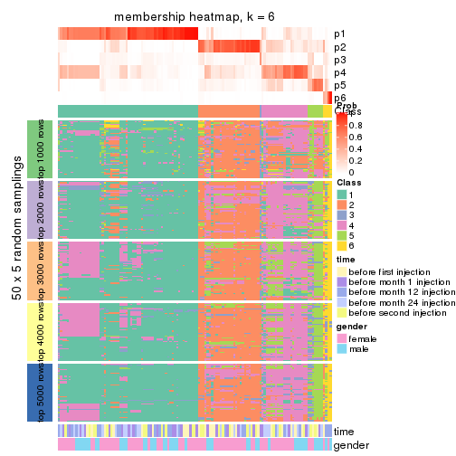</p>

</div>
</div>

As soon as we have had the classes for columns, we can look for signatures
which are significantly different between classes which can be candidate marks
for certain classes. Following are the heatmaps for signatures.


Signature heatmaps where rows are scaled:


<script>
$( function() {
	$( '#tabs-MAD-hclust-get-signatures' ).tabs();
} );
</script>
<div id='tabs-MAD-hclust-get-signatures'>
<ul>
<li><a href='#tab-MAD-hclust-get-signatures-1'>k = 2</a></li>
<li><a href='#tab-MAD-hclust-get-signatures-2'>k = 3</a></li>
<li><a href='#tab-MAD-hclust-get-signatures-3'>k = 4</a></li>
<li><a href='#tab-MAD-hclust-get-signatures-4'>k = 5</a></li>
<li><a href='#tab-MAD-hclust-get-signatures-5'>k = 6</a></li>
</ul>
<div id='tab-MAD-hclust-get-signatures-1'>
<pre><code class="r">get_signatures(res, k = 2)
</code></pre>

<p></p>

</div>
<div id='tab-MAD-hclust-get-signatures-2'>
<pre><code class="r">get_signatures(res, k = 3)
</code></pre>

<p></p>

</div>
<div id='tab-MAD-hclust-get-signatures-3'>
<pre><code class="r">get_signatures(res, k = 4)
</code></pre>

<p></p>

</div>
<div id='tab-MAD-hclust-get-signatures-4'>
<pre><code class="r">get_signatures(res, k = 5)
</code></pre>

<p></p>

</div>
<div id='tab-MAD-hclust-get-signatures-5'>
<pre><code class="r">get_signatures(res, k = 6)
</code></pre>

<p></p>

</div>
</div>


Signature heatmaps where rows are not scaled:


<script>
$( function() {
	$( '#tabs-MAD-hclust-get-signatures-no-scale' ).tabs();
} );
</script>
<div id='tabs-MAD-hclust-get-signatures-no-scale'>
<ul>
<li><a href='#tab-MAD-hclust-get-signatures-no-scale-1'>k = 2</a></li>
<li><a href='#tab-MAD-hclust-get-signatures-no-scale-2'>k = 3</a></li>
<li><a href='#tab-MAD-hclust-get-signatures-no-scale-3'>k = 4</a></li>
<li><a href='#tab-MAD-hclust-get-signatures-no-scale-4'>k = 5</a></li>
<li><a href='#tab-MAD-hclust-get-signatures-no-scale-5'>k = 6</a></li>
</ul>
<div id='tab-MAD-hclust-get-signatures-no-scale-1'>
<pre><code class="r">get_signatures(res, k = 2, scale_rows = FALSE)
</code></pre>

<p></p>

</div>
<div id='tab-MAD-hclust-get-signatures-no-scale-2'>
<pre><code class="r">get_signatures(res, k = 3, scale_rows = FALSE)
</code></pre>

<p></p>

</div>
<div id='tab-MAD-hclust-get-signatures-no-scale-3'>
<pre><code class="r">get_signatures(res, k = 4, scale_rows = FALSE)
</code></pre>

<p></p>

</div>
<div id='tab-MAD-hclust-get-signatures-no-scale-4'>
<pre><code class="r">get_signatures(res, k = 5, scale_rows = FALSE)
</code></pre>

<p></p>

</div>
<div id='tab-MAD-hclust-get-signatures-no-scale-5'>
<pre><code class="r">get_signatures(res, k = 6, scale_rows = FALSE)
</code></pre>

<p></p>

</div>
</div>


Compare the overlap of signatures from different k:

```r
compare_signatures(res)
```


`get_signature()` returns a data frame invisibly. TO get the list of signatures, the function
call should be assigned to a variable explicitly. In following code, if `plot` argument is set
to `FALSE`, no heatmap is plotted while only the differential analysis is performed.

```r
# code only for demonstration
tb = get_signature(res, k = ..., plot = FALSE)
```

An example of the output of `tb` is:

```
#>   which_row         fdr    mean_1    mean_2 scaled_mean_1 scaled_mean_2 km
#> 1        38 0.042760348  8.373488  9.131774    -0.5533452     0.5164555  1
#> 2        40 0.018707592  7.106213  8.469186    -0.6173731     0.5762149  1
#> 3        55 0.019134737 10.221463 11.207825    -0.6159697     0.5749050  1
#> 4        59 0.006059896  5.921854  7.869574    -0.6899429     0.6439467  1
#> 5        60 0.018055526  8.928898 10.211722    -0.6204761     0.5791110  1
#> 6        98 0.009384629 15.714769 14.887706     0.6635654    -0.6193277  2
...
```

The columns in `tb` are:

1. `which_row`: row indices corresponding to the input matrix.
2. `fdr`: FDR for the differential test. 
3. `mean_x`: The mean value in group x.
4. `scaled_mean_x`: The mean value in group x after rows are scaled.
5. `km`: Row groups if k-means clustering is applied to rows.


UMAP plot which shows how samples are separated.


<script>
$( function() {
	$( '#tabs-MAD-hclust-dimension-reduction' ).tabs();
} );
</script>
<div id='tabs-MAD-hclust-dimension-reduction'>
<ul>
<li><a href='#tab-MAD-hclust-dimension-reduction-1'>k = 2</a></li>
<li><a href='#tab-MAD-hclust-dimension-reduction-2'>k = 3</a></li>
<li><a href='#tab-MAD-hclust-dimension-reduction-3'>k = 4</a></li>
<li><a href='#tab-MAD-hclust-dimension-reduction-4'>k = 5</a></li>
<li><a href='#tab-MAD-hclust-dimension-reduction-5'>k = 6</a></li>
</ul>
<div id='tab-MAD-hclust-dimension-reduction-1'>
<pre><code class="r">dimension_reduction(res, k = 2, method = &quot;UMAP&quot;)
</code></pre>

<p></p>

</div>
<div id='tab-MAD-hclust-dimension-reduction-2'>
<pre><code class="r">dimension_reduction(res, k = 3, method = &quot;UMAP&quot;)
</code></pre>

<p></p>

</div>
<div id='tab-MAD-hclust-dimension-reduction-3'>
<pre><code class="r">dimension_reduction(res, k = 4, method = &quot;UMAP&quot;)
</code></pre>

<p></p>

</div>
<div id='tab-MAD-hclust-dimension-reduction-4'>
<pre><code class="r">dimension_reduction(res, k = 5, method = &quot;UMAP&quot;)
</code></pre>

<p></p>

</div>
<div id='tab-MAD-hclust-dimension-reduction-5'>
<pre><code class="r">dimension_reduction(res, k = 6, method = &quot;UMAP&quot;)
</code></pre>

<p></p>

</div>
</div>


Following heatmap shows how subgroups are split when increasing `k`:

```r
collect_classes(res)
```


Test correlation between subgroups and known annotations. If the known
annotation is numeric, one-way ANOVA test is applied, and if the known
annotation is discrete, chi-squared contingency table test is applied.

```r
test_to_known_factors(res)
```

```
#>              n time(p) gender(p) k
#> MAD:hclust 105   0.061   0.28412 2
#> MAD:hclust 105   0.101   0.40946 3
#> MAD:hclust  80   0.330   0.21415 4
#> MAD:hclust 100   0.577   0.00643 5
#> MAD:hclust  92   0.854   0.00800 6
```


If matrix rows can be associated to genes, consider to use `functional_enrichment(res,
...)` to perform function enrichment for the signature genes. See [this vignette](http://bioconductor.org/packages/devel/bioc/vignettes/cola/inst/doc/functional_enrichment.html) for more detailed explanations.


 

---------------------------------------------------


### MAD:kmeans**


The object with results only for a single top-value method and a single partition method 
can be extracted as:

```r
res = res_list["MAD", "kmeans"]
# you can also extract it by
# res = res_list["MAD:kmeans"]
```

A summary of `res` and all the functions that can be applied to it:

```r
res
```

```
#> A 'ConsensusPartition' object with k = 2, 3, 4, 5, 6.
#>   On a matrix with 21512 rows and 125 columns.
#>   Top rows (1000, 2000, 3000, 4000, 5000) are extracted by 'MAD' method.
#>   Subgroups are detected by 'kmeans' method.
#>   Performed in total 1250 partitions by row resampling.
#>   Best k for subgroups seems to be 2.
#> 
#> Following methods can be applied to this 'ConsensusPartition' object:
#>  [1] "cola_report"             "collect_classes"         "collect_plots"          
#>  [4] "collect_stats"           "colnames"                "compare_signatures"     
#>  [7] "consensus_heatmap"       "dimension_reduction"     "functional_enrichment"  
#> [10] "get_anno_col"            "get_anno"                "get_classes"            
#> [13] "get_consensus"           "get_matrix"              "get_membership"         
#> [16] "get_param"               "get_signatures"          "get_stats"              
#> [19] "is_best_k"               "is_stable_k"             "membership_heatmap"     
#> [22] "ncol"                    "nrow"                    "plot_ecdf"              
#> [25] "rownames"                "select_partition_number" "show"                   
#> [28] "suggest_best_k"          "test_to_known_factors"
```

`collect_plots()` function collects all the plots made from `res` for all `k` (number of partitions)
into one single page to provide an easy and fast comparison between different `k`.

```r
collect_plots(res)
```


The plots are:

- The first row: a plot of the ECDF (empirical cumulative distribution
  function) curves of the consensus matrix for each `k` and the heatmap of
  predicted classes for each `k`.
- The second row: heatmaps of the consensus matrix for each `k`.
- The third row: heatmaps of the membership matrix for each `k`.
- The fouth row: heatmaps of the signatures for each `k`.

All the plots in panels can be made by individual functions and they are
plotted later in this section.

`select_partition_number()` produces several plots showing different
statistics for choosing "optimized" `k`. There are following statistics:

- ECDF curves of the consensus matrix for each `k`;
- 1-PAC. [The PAC
  score](https://en.wikipedia.org/wiki/Consensus_clustering#Over-interpretation_potential_of_consensus_clustering)
  measures the proportion of the ambiguous subgrouping.
- Mean silhouette score.
- Concordance. The mean probability of fiting the consensus class ids in all
  partitions.
- Area increased. Denote $A_k$ as the area under the ECDF curve for current
  `k`, the area increased is defined as $A_k - A_{k-1}$.
- Rand index. The percent of pairs of samples that are both in a same cluster
  or both are not in a same cluster in the partition of k and k-1.
- Jaccard index. The ratio of pairs of samples are both in a same cluster in
  the partition of k and k-1 and the pairs of samples are both in a same
  cluster in the partition k or k-1.

The detailed explanations of these statistics can be found in [the _cola_
vignette](http://bioconductor.org/packages/devel/bioc/vignettes/cola/inst/doc/cola.html#toc_13).

Generally speaking, lower PAC score, higher mean silhouette score or higher
concordance corresponds to better partition. Rand index and Jaccard index
measure how similar the current partition is compared to partition with `k-1`.
If they are too similar, we won't accept `k` is better than `k-1`.

```r
select_partition_number(res)
```


The numeric values for all these statistics can be obtained by `get_stats()`.

```r
get_stats(res)
```

```
#>   k 1-PAC mean_silhouette concordance area_increased  Rand Jaccard
#> 2 2 1.000           0.986       0.992         0.5043 0.496   0.496
#> 3 3 0.545           0.460       0.705         0.2618 0.925   0.850
#> 4 4 0.560           0.549       0.717         0.1380 0.729   0.432
#> 5 5 0.632           0.730       0.792         0.0687 0.893   0.623
#> 6 6 0.694           0.666       0.752         0.0503 0.975   0.887
```

`suggest_best_k()` suggests the best $k$ based on these statistics. The rules are as follows:

- All $k$ with Jaccard index larger than 0.95 are removed because increasing
  $k$ does not provide enough extra information. If all $k$ are removed, it is
  marked as no subgroup is detected.
- For all $k$ with 1-PAC score larger than 0.9, the maximal $k$ is taken as
  the best $k$, and other $k$ are marked as optional $k$.
- If it does not fit the second rule. The $k$ with the maximal vote of the
  highest 1-PAC score, highest mean silhouette, and highest concordance is
  taken as the best $k$.

```r
suggest_best_k(res)
```

```
#> [1] 2
```


Following shows the table of the partitions (You need to click the **show/hide
code output** link to see it). The membership matrix (columns with name `p*`)
is inferred by
[`clue::cl_consensus()`](https://www.rdocumentation.org/link/cl_consensus?package=clue)
function with the `SE` method. Basically the value in the membership matrix
represents the probability to belong to a certain group. The finall class
label for an item is determined with the group with highest probability it
belongs to.

In `get_classes()` function, the entropy is calculated from the membership
matrix and the silhouette score is calculated from the consensus matrix.


<script>
$( function() {
	$( '#tabs-MAD-kmeans-get-classes' ).tabs();
} );
</script>
<div id='tabs-MAD-kmeans-get-classes'>
<ul>
<li><a href='#tab-MAD-kmeans-get-classes-1'>k = 2</a></li>
<li><a href='#tab-MAD-kmeans-get-classes-2'>k = 3</a></li>
<li><a href='#tab-MAD-kmeans-get-classes-3'>k = 4</a></li>
<li><a href='#tab-MAD-kmeans-get-classes-4'>k = 5</a></li>
<li><a href='#tab-MAD-kmeans-get-classes-5'>k = 6</a></li>
</ul>

<div id='tab-MAD-kmeans-get-classes-1'>
<p><a id='tab-MAD-kmeans-get-classes-1-a' style='color:#0366d6' href='#'>show/hide code output</a></p>
<pre><code class="r">cbind(get_classes(res, k = 2), get_membership(res, k = 2))
</code></pre>

<pre><code>#&gt;           class entropy silhouette    p1    p2
#&gt; GSM601872     2  0.0376      0.997 0.004 0.996
#&gt; GSM601882     2  0.0000      0.998 0.000 1.000
#&gt; GSM601887     1  0.2948      0.942 0.948 0.052
#&gt; GSM601892     1  0.0000      0.987 1.000 0.000
#&gt; GSM601897     1  0.1184      0.976 0.984 0.016
#&gt; GSM601902     2  0.0000      0.998 0.000 1.000
#&gt; GSM601912     1  0.0000      0.987 1.000 0.000
#&gt; GSM601927     1  0.0376      0.988 0.996 0.004
#&gt; GSM601932     2  0.0000      0.998 0.000 1.000
#&gt; GSM601937     2  0.0672      0.992 0.008 0.992
#&gt; GSM601942     2  0.0376      0.997 0.004 0.996
#&gt; GSM601947     2  0.0000      0.998 0.000 1.000
#&gt; GSM601957     1  0.0000      0.987 1.000 0.000
#&gt; GSM601972     2  0.0000      0.998 0.000 1.000
#&gt; GSM601977     2  0.0376      0.997 0.004 0.996
#&gt; GSM601987     2  0.0376      0.997 0.004 0.996
#&gt; GSM601877     1  0.0376      0.988 0.996 0.004
#&gt; GSM601907     2  0.0376      0.997 0.004 0.996
#&gt; GSM601917     2  0.0000      0.998 0.000 1.000
#&gt; GSM601922     2  0.0000      0.998 0.000 1.000
#&gt; GSM601952     2  0.0376      0.997 0.004 0.996
#&gt; GSM601962     1  0.0376      0.988 0.996 0.004
#&gt; GSM601967     1  0.0000      0.987 1.000 0.000
#&gt; GSM601982     2  0.0000      0.998 0.000 1.000
#&gt; GSM601992     2  0.0000      0.998 0.000 1.000
#&gt; GSM601873     2  0.0376      0.997 0.004 0.996
#&gt; GSM601883     2  0.0000      0.998 0.000 1.000
#&gt; GSM601888     1  0.5629      0.852 0.868 0.132
#&gt; GSM601893     1  0.0000      0.987 1.000 0.000
#&gt; GSM601898     1  0.0000      0.987 1.000 0.000
#&gt; GSM601903     2  0.0000      0.998 0.000 1.000
#&gt; GSM601913     1  0.0376      0.988 0.996 0.004
#&gt; GSM601928     1  0.0376      0.988 0.996 0.004
#&gt; GSM601933     2  0.0000      0.998 0.000 1.000
#&gt; GSM601938     2  0.0000      0.998 0.000 1.000
#&gt; GSM601943     2  0.0376      0.997 0.004 0.996
#&gt; GSM601948     1  0.0376      0.988 0.996 0.004
#&gt; GSM601958     1  0.0000      0.987 1.000 0.000
#&gt; GSM601973     2  0.0000      0.998 0.000 1.000
#&gt; GSM601978     2  0.0376      0.997 0.004 0.996
#&gt; GSM601988     2  0.0000      0.998 0.000 1.000
#&gt; GSM601878     1  0.0376      0.988 0.996 0.004
#&gt; GSM601908     2  0.0376      0.997 0.004 0.996
#&gt; GSM601918     2  0.0000      0.998 0.000 1.000
#&gt; GSM601923     1  0.0376      0.988 0.996 0.004
#&gt; GSM601953     2  0.0376      0.997 0.004 0.996
#&gt; GSM601963     1  0.0376      0.988 0.996 0.004
#&gt; GSM601968     1  0.0000      0.987 1.000 0.000
#&gt; GSM601983     1  0.0376      0.988 0.996 0.004
#&gt; GSM601993     2  0.0000      0.998 0.000 1.000
#&gt; GSM601874     2  0.0376      0.997 0.004 0.996
#&gt; GSM601884     2  0.0376      0.997 0.004 0.996
#&gt; GSM601889     1  0.0000      0.987 1.000 0.000
#&gt; GSM601894     1  0.0000      0.987 1.000 0.000
#&gt; GSM601899     1  0.0938      0.979 0.988 0.012
#&gt; GSM601904     2  0.0376      0.995 0.004 0.996
#&gt; GSM601914     1  0.0000      0.987 1.000 0.000
#&gt; GSM601929     1  0.0376      0.988 0.996 0.004
#&gt; GSM601934     2  0.0376      0.997 0.004 0.996
#&gt; GSM601939     1  0.0376      0.988 0.996 0.004
#&gt; GSM601944     2  0.0376      0.997 0.004 0.996
#&gt; GSM601949     1  0.0000      0.987 1.000 0.000
#&gt; GSM601959     1  0.0000      0.987 1.000 0.000
#&gt; GSM601974     2  0.0938      0.988 0.012 0.988
#&gt; GSM601979     2  0.0376      0.997 0.004 0.996
#&gt; GSM601989     1  0.0000      0.987 1.000 0.000
#&gt; GSM601879     1  0.0376      0.988 0.996 0.004
#&gt; GSM601909     1  0.0000      0.987 1.000 0.000
#&gt; GSM601919     2  0.0000      0.998 0.000 1.000
#&gt; GSM601924     1  0.0376      0.988 0.996 0.004
#&gt; GSM601954     2  0.0376      0.997 0.004 0.996
#&gt; GSM601964     1  0.0376      0.988 0.996 0.004
#&gt; GSM601969     1  0.0000      0.987 1.000 0.000
#&gt; GSM601984     1  0.0376      0.988 0.996 0.004
#&gt; GSM601994     2  0.0000      0.998 0.000 1.000
#&gt; GSM601875     2  0.0376      0.997 0.004 0.996
#&gt; GSM601885     2  0.0000      0.998 0.000 1.000
#&gt; GSM601890     1  0.2236      0.958 0.964 0.036
#&gt; GSM601895     1  0.0000      0.987 1.000 0.000
#&gt; GSM601900     1  0.0000      0.987 1.000 0.000
#&gt; GSM601905     2  0.0000      0.998 0.000 1.000
#&gt; GSM601915     1  0.0376      0.988 0.996 0.004
#&gt; GSM601930     1  0.0376      0.988 0.996 0.004
#&gt; GSM601935     1  0.8081      0.680 0.752 0.248
#&gt; GSM601940     1  0.0376      0.988 0.996 0.004
#&gt; GSM601945     2  0.0376      0.997 0.004 0.996
#&gt; GSM601950     1  0.0000      0.987 1.000 0.000
#&gt; GSM601960     1  0.0000      0.987 1.000 0.000
#&gt; GSM601975     2  0.0000      0.998 0.000 1.000
#&gt; GSM601980     2  0.0376      0.997 0.004 0.996
#&gt; GSM601990     1  0.0376      0.988 0.996 0.004
#&gt; GSM601880     1  0.0376      0.988 0.996 0.004
#&gt; GSM601910     1  0.0000      0.987 1.000 0.000
#&gt; GSM601920     2  0.0000      0.998 0.000 1.000
#&gt; GSM601925     1  0.0376      0.988 0.996 0.004
#&gt; GSM601955     2  0.1414      0.983 0.020 0.980
#&gt; GSM601965     1  0.0376      0.988 0.996 0.004
#&gt; GSM601970     1  0.0000      0.987 1.000 0.000
#&gt; GSM601985     1  0.0376      0.988 0.996 0.004
#&gt; GSM601995     2  0.0000      0.998 0.000 1.000
#&gt; GSM601876     1  0.0376      0.988 0.996 0.004
#&gt; GSM601886     2  0.0000      0.998 0.000 1.000
#&gt; GSM601891     1  0.6623      0.800 0.828 0.172
#&gt; GSM601896     1  0.0376      0.988 0.996 0.004
#&gt; GSM601901     2  0.0000      0.998 0.000 1.000
#&gt; GSM601906     1  0.0938      0.982 0.988 0.012
#&gt; GSM601916     2  0.0000      0.998 0.000 1.000
#&gt; GSM601931     1  0.0376      0.988 0.996 0.004
#&gt; GSM601936     2  0.0000      0.998 0.000 1.000
#&gt; GSM601941     2  0.0000      0.998 0.000 1.000
#&gt; GSM601946     1  0.0376      0.988 0.996 0.004
#&gt; GSM601951     1  0.0376      0.988 0.996 0.004
#&gt; GSM601961     2  0.0376      0.997 0.004 0.996
#&gt; GSM601976     2  0.0000      0.998 0.000 1.000
#&gt; GSM601981     2  0.0376      0.997 0.004 0.996
#&gt; GSM601991     1  0.0376      0.988 0.996 0.004
#&gt; GSM601881     1  0.0376      0.988 0.996 0.004
#&gt; GSM601911     2  0.0000      0.998 0.000 1.000
#&gt; GSM601921     2  0.0000      0.998 0.000 1.000
#&gt; GSM601926     1  0.0376      0.988 0.996 0.004
#&gt; GSM601956     2  0.0376      0.997 0.004 0.996
#&gt; GSM601966     2  0.0000      0.998 0.000 1.000
#&gt; GSM601971     1  0.0000      0.987 1.000 0.000
#&gt; GSM601986     1  0.0672      0.985 0.992 0.008
#&gt; GSM601996     2  0.0000      0.998 0.000 1.000
</code></pre>

<script>
$('#tab-MAD-kmeans-get-classes-1-a').parent().next().next().hide();
$('#tab-MAD-kmeans-get-classes-1-a').click(function(){
  $('#tab-MAD-kmeans-get-classes-1-a').parent().next().next().toggle();
  return(false);
});
</script>
</div>

<div id='tab-MAD-kmeans-get-classes-2'>
<p><a id='tab-MAD-kmeans-get-classes-2-a' style='color:#0366d6' href='#'>show/hide code output</a></p>
<pre><code class="r">cbind(get_classes(res, k = 3), get_membership(res, k = 3))
</code></pre>

<pre><code>#&gt;           class entropy silhouette    p1    p2    p3
#&gt; GSM601872     3  0.6209     0.6407 0.004 0.368 0.628
#&gt; GSM601882     2  0.6079    -0.2217 0.000 0.612 0.388
#&gt; GSM601887     1  0.5967     0.6842 0.752 0.032 0.216
#&gt; GSM601892     1  0.1964     0.8288 0.944 0.000 0.056
#&gt; GSM601897     1  0.5810     0.6124 0.664 0.000 0.336
#&gt; GSM601902     2  0.0000     0.4536 0.000 1.000 0.000
#&gt; GSM601912     1  0.3752     0.7910 0.856 0.000 0.144
#&gt; GSM601927     1  0.5178     0.8153 0.744 0.000 0.256
#&gt; GSM601932     2  0.0237     0.4529 0.000 0.996 0.004
#&gt; GSM601937     2  0.7534     0.0529 0.048 0.584 0.368
#&gt; GSM601942     3  0.5905     0.6395 0.000 0.352 0.648
#&gt; GSM601947     2  0.2796     0.4187 0.000 0.908 0.092
#&gt; GSM601957     1  0.1031     0.8383 0.976 0.000 0.024
#&gt; GSM601972     2  0.3116     0.3980 0.000 0.892 0.108
#&gt; GSM601977     3  0.6309     0.4420 0.000 0.500 0.500
#&gt; GSM601987     2  0.6274    -0.4018 0.000 0.544 0.456
#&gt; GSM601877     1  0.5443     0.8123 0.736 0.004 0.260
#&gt; GSM601907     2  0.6307    -0.4777 0.000 0.512 0.488
#&gt; GSM601917     2  0.2625     0.4208 0.000 0.916 0.084
#&gt; GSM601922     2  0.2945     0.4149 0.004 0.908 0.088
#&gt; GSM601952     2  0.6244    -0.3917 0.000 0.560 0.440
#&gt; GSM601962     1  0.4555     0.7784 0.800 0.000 0.200
#&gt; GSM601967     1  0.0892     0.8363 0.980 0.000 0.020
#&gt; GSM601982     3  0.7069     0.5084 0.020 0.472 0.508
#&gt; GSM601992     2  0.3619     0.3712 0.000 0.864 0.136
#&gt; GSM601873     3  0.6180     0.6010 0.000 0.416 0.584
#&gt; GSM601883     2  0.6215    -0.3273 0.000 0.572 0.428
#&gt; GSM601888     1  0.7481     0.4916 0.640 0.064 0.296
#&gt; GSM601893     1  0.3573     0.7962 0.876 0.004 0.120
#&gt; GSM601898     1  0.0892     0.8357 0.980 0.000 0.020
#&gt; GSM601903     2  0.0000     0.4536 0.000 1.000 0.000
#&gt; GSM601913     1  0.1163     0.8397 0.972 0.000 0.028
#&gt; GSM601928     1  0.5178     0.8153 0.744 0.000 0.256
#&gt; GSM601933     2  0.6008    -0.1764 0.000 0.628 0.372
#&gt; GSM601938     2  0.5560     0.0681 0.000 0.700 0.300
#&gt; GSM601943     3  0.5882     0.6406 0.000 0.348 0.652
#&gt; GSM601948     1  0.5216     0.8187 0.740 0.000 0.260
#&gt; GSM601958     1  0.0892     0.8379 0.980 0.000 0.020
#&gt; GSM601973     2  0.0000     0.4536 0.000 1.000 0.000
#&gt; GSM601978     2  0.6309    -0.5006 0.000 0.504 0.496
#&gt; GSM601988     2  0.6490     0.0938 0.012 0.628 0.360
#&gt; GSM601878     1  0.5216     0.8141 0.740 0.000 0.260
#&gt; GSM601908     2  0.6302    -0.4593 0.000 0.520 0.480
#&gt; GSM601918     2  0.2796     0.4143 0.000 0.908 0.092
#&gt; GSM601923     1  0.5178     0.8153 0.744 0.000 0.256
#&gt; GSM601953     2  0.6309    -0.5006 0.000 0.504 0.496
#&gt; GSM601963     1  0.3482     0.8186 0.872 0.000 0.128
#&gt; GSM601968     1  0.2356     0.8239 0.928 0.000 0.072
#&gt; GSM601983     1  0.3816     0.8095 0.852 0.000 0.148
#&gt; GSM601993     2  0.4887     0.2950 0.000 0.772 0.228
#&gt; GSM601874     2  0.6307    -0.4777 0.000 0.512 0.488
#&gt; GSM601884     2  0.6308    -0.4915 0.000 0.508 0.492
#&gt; GSM601889     1  0.0892     0.8357 0.980 0.000 0.020
#&gt; GSM601894     1  0.0892     0.8370 0.980 0.000 0.020
#&gt; GSM601899     1  0.5506     0.7039 0.764 0.016 0.220
#&gt; GSM601904     2  0.5627     0.2905 0.032 0.780 0.188
#&gt; GSM601914     1  0.3267     0.8078 0.884 0.000 0.116
#&gt; GSM601929     1  0.5404     0.8137 0.740 0.004 0.256
#&gt; GSM601934     2  0.6274    -0.4016 0.000 0.544 0.456
#&gt; GSM601939     1  0.4654     0.8295 0.792 0.000 0.208
#&gt; GSM601944     2  0.6111    -0.2313 0.000 0.604 0.396
#&gt; GSM601949     1  0.4887     0.8262 0.772 0.000 0.228
#&gt; GSM601959     1  0.0892     0.8370 0.980 0.000 0.020
#&gt; GSM601974     2  0.6834     0.1829 0.048 0.692 0.260
#&gt; GSM601979     2  0.6307    -0.4777 0.000 0.512 0.488
#&gt; GSM601989     1  0.1031     0.8350 0.976 0.000 0.024
#&gt; GSM601879     1  0.5443     0.8123 0.736 0.004 0.260
#&gt; GSM601909     1  0.2448     0.8226 0.924 0.000 0.076
#&gt; GSM601919     2  0.3879     0.4092 0.000 0.848 0.152
#&gt; GSM601924     1  0.5178     0.8153 0.744 0.000 0.256
#&gt; GSM601954     2  0.5254     0.0963 0.000 0.736 0.264
#&gt; GSM601964     1  0.3816     0.8095 0.852 0.000 0.148
#&gt; GSM601969     1  0.2448     0.8401 0.924 0.000 0.076
#&gt; GSM601984     1  0.4834     0.8327 0.792 0.004 0.204
#&gt; GSM601994     2  0.3619     0.3712 0.000 0.864 0.136
#&gt; GSM601875     2  0.6307    -0.4777 0.000 0.512 0.488
#&gt; GSM601885     2  0.6192    -0.3068 0.000 0.580 0.420
#&gt; GSM601890     1  0.5656     0.6757 0.728 0.008 0.264
#&gt; GSM601895     1  0.2537     0.8208 0.920 0.000 0.080
#&gt; GSM601900     1  0.2356     0.8252 0.928 0.000 0.072
#&gt; GSM601905     2  0.2590     0.4263 0.004 0.924 0.072
#&gt; GSM601915     1  0.0592     0.8380 0.988 0.000 0.012
#&gt; GSM601930     1  0.5404     0.8137 0.740 0.004 0.256
#&gt; GSM601935     1  0.9800     0.1058 0.412 0.344 0.244
#&gt; GSM601940     1  0.4399     0.8331 0.812 0.000 0.188
#&gt; GSM601945     3  0.6309     0.4330 0.000 0.500 0.500
#&gt; GSM601950     1  0.4796     0.8281 0.780 0.000 0.220
#&gt; GSM601960     1  0.3340     0.8061 0.880 0.000 0.120
#&gt; GSM601975     2  0.0000     0.4536 0.000 1.000 0.000
#&gt; GSM601980     3  0.6897     0.3131 0.016 0.436 0.548
#&gt; GSM601990     1  0.3752     0.8001 0.856 0.000 0.144
#&gt; GSM601880     1  0.5178     0.8153 0.744 0.000 0.256
#&gt; GSM601910     1  0.3686     0.7956 0.860 0.000 0.140
#&gt; GSM601920     2  0.3619     0.3737 0.000 0.864 0.136
#&gt; GSM601925     1  0.5404     0.8137 0.740 0.004 0.256
#&gt; GSM601955     3  0.7839     0.3012 0.060 0.380 0.560
#&gt; GSM601965     1  0.4784     0.8335 0.796 0.004 0.200
#&gt; GSM601970     1  0.1643     0.8308 0.956 0.000 0.044
#&gt; GSM601985     1  0.4399     0.8330 0.812 0.000 0.188
#&gt; GSM601995     2  0.7291     0.0798 0.040 0.604 0.356
#&gt; GSM601876     1  0.4605     0.8297 0.796 0.000 0.204
#&gt; GSM601886     2  0.5122     0.2783 0.012 0.788 0.200
#&gt; GSM601891     1  0.7181     0.5425 0.648 0.048 0.304
#&gt; GSM601896     1  0.4605     0.8296 0.796 0.000 0.204
#&gt; GSM601901     2  0.4178     0.3290 0.000 0.828 0.172
#&gt; GSM601906     2  0.9802    -0.1730 0.312 0.428 0.260
#&gt; GSM601916     2  0.0237     0.4530 0.000 0.996 0.004
#&gt; GSM601931     1  0.5178     0.8153 0.744 0.000 0.256
#&gt; GSM601936     2  0.5623     0.2224 0.004 0.716 0.280
#&gt; GSM601941     2  0.0237     0.4529 0.000 0.996 0.004
#&gt; GSM601946     1  0.5138     0.8167 0.748 0.000 0.252
#&gt; GSM601951     1  0.5618     0.8104 0.732 0.008 0.260
#&gt; GSM601961     2  0.6825    -0.5041 0.012 0.496 0.492
#&gt; GSM601976     2  0.0424     0.4526 0.000 0.992 0.008
#&gt; GSM601981     2  0.6291    -0.4382 0.000 0.532 0.468
#&gt; GSM601991     1  0.5016     0.7275 0.760 0.000 0.240
#&gt; GSM601881     1  0.5178     0.8153 0.744 0.000 0.256
#&gt; GSM601911     2  0.4413     0.3986 0.008 0.832 0.160
#&gt; GSM601921     2  0.2261     0.4305 0.000 0.932 0.068
#&gt; GSM601926     1  0.5178     0.8153 0.744 0.000 0.256
#&gt; GSM601956     2  0.6309    -0.5006 0.000 0.504 0.496
#&gt; GSM601966     2  0.3038     0.4076 0.000 0.896 0.104
#&gt; GSM601971     1  0.2711     0.8401 0.912 0.000 0.088
#&gt; GSM601986     1  0.7983     0.7394 0.648 0.124 0.228
#&gt; GSM601996     2  0.3267     0.3900 0.000 0.884 0.116
</code></pre>

<script>
$('#tab-MAD-kmeans-get-classes-2-a').parent().next().next().hide();
$('#tab-MAD-kmeans-get-classes-2-a').click(function(){
  $('#tab-MAD-kmeans-get-classes-2-a').parent().next().next().toggle();
  return(false);
});
</script>
</div>

<div id='tab-MAD-kmeans-get-classes-3'>
<p><a id='tab-MAD-kmeans-get-classes-3-a' style='color:#0366d6' href='#'>show/hide code output</a></p>
<pre><code class="r">cbind(get_classes(res, k = 4), get_membership(res, k = 4))
</code></pre>

<pre><code>#&gt;           class entropy silhouette    p1    p2    p3    p4
#&gt; GSM601872     2  0.2214     0.8284 0.000 0.928 0.028 0.044
#&gt; GSM601882     2  0.3910     0.7338 0.000 0.820 0.024 0.156
#&gt; GSM601887     3  0.7593     0.4350 0.216 0.248 0.528 0.008
#&gt; GSM601892     3  0.6506     0.3122 0.404 0.056 0.532 0.008
#&gt; GSM601897     3  0.6013     0.5060 0.152 0.064 0.736 0.048
#&gt; GSM601902     4  0.3444     0.7866 0.000 0.184 0.000 0.816
#&gt; GSM601912     3  0.5623     0.4874 0.292 0.000 0.660 0.048
#&gt; GSM601927     1  0.0000     0.7588 1.000 0.000 0.000 0.000
#&gt; GSM601932     4  0.3569     0.7838 0.000 0.196 0.000 0.804
#&gt; GSM601937     3  0.7231    -0.2244 0.000 0.144 0.464 0.392
#&gt; GSM601942     2  0.4898     0.6856 0.000 0.780 0.104 0.116
#&gt; GSM601947     4  0.4372     0.7287 0.000 0.268 0.004 0.728
#&gt; GSM601957     1  0.5168    -0.1211 0.504 0.000 0.492 0.004
#&gt; GSM601972     4  0.4632     0.6898 0.000 0.308 0.004 0.688
#&gt; GSM601977     2  0.0524     0.8686 0.000 0.988 0.008 0.004
#&gt; GSM601987     2  0.2313     0.8526 0.000 0.924 0.032 0.044
#&gt; GSM601877     1  0.0000     0.7588 1.000 0.000 0.000 0.000
#&gt; GSM601907     2  0.0592     0.8699 0.000 0.984 0.000 0.016
#&gt; GSM601917     4  0.4044     0.7820 0.024 0.152 0.004 0.820
#&gt; GSM601922     4  0.4095     0.7805 0.028 0.148 0.004 0.820
#&gt; GSM601952     2  0.3554     0.7739 0.000 0.844 0.020 0.136
#&gt; GSM601962     3  0.6194     0.4417 0.288 0.000 0.628 0.084
#&gt; GSM601967     3  0.4999     0.1108 0.492 0.000 0.508 0.000
#&gt; GSM601982     2  0.3320     0.8344 0.000 0.876 0.068 0.056
#&gt; GSM601992     4  0.6903     0.4539 0.000 0.380 0.112 0.508
#&gt; GSM601873     2  0.2722     0.8102 0.000 0.904 0.032 0.064
#&gt; GSM601883     2  0.2742     0.8323 0.000 0.900 0.024 0.076
#&gt; GSM601888     3  0.7598     0.3980 0.168 0.332 0.492 0.008
#&gt; GSM601893     3  0.7340     0.4035 0.316 0.144 0.532 0.008
#&gt; GSM601898     3  0.5168     0.1089 0.492 0.000 0.504 0.004
#&gt; GSM601903     4  0.3400     0.7870 0.000 0.180 0.000 0.820
#&gt; GSM601913     1  0.5764    -0.1394 0.520 0.000 0.452 0.028
#&gt; GSM601928     1  0.0000     0.7588 1.000 0.000 0.000 0.000
#&gt; GSM601933     2  0.3984     0.7538 0.000 0.828 0.040 0.132
#&gt; GSM601938     2  0.5267     0.5123 0.000 0.712 0.048 0.240
#&gt; GSM601943     2  0.3505     0.7708 0.000 0.864 0.048 0.088
#&gt; GSM601948     1  0.1978     0.7162 0.928 0.000 0.068 0.004
#&gt; GSM601958     1  0.5168    -0.1211 0.504 0.000 0.492 0.004
#&gt; GSM601973     4  0.3444     0.7866 0.000 0.184 0.000 0.816
#&gt; GSM601978     2  0.0672     0.8681 0.000 0.984 0.008 0.008
#&gt; GSM601988     3  0.7206    -0.2509 0.000 0.140 0.460 0.400
#&gt; GSM601878     1  0.0000     0.7588 1.000 0.000 0.000 0.000
#&gt; GSM601908     2  0.1256     0.8681 0.000 0.964 0.008 0.028
#&gt; GSM601918     4  0.4428     0.7205 0.000 0.276 0.004 0.720
#&gt; GSM601923     1  0.0000     0.7588 1.000 0.000 0.000 0.000
#&gt; GSM601953     2  0.0804     0.8670 0.000 0.980 0.008 0.012
#&gt; GSM601963     3  0.5613     0.4228 0.380 0.000 0.592 0.028
#&gt; GSM601968     3  0.5024     0.4132 0.360 0.000 0.632 0.008
#&gt; GSM601983     3  0.5869     0.4334 0.360 0.000 0.596 0.044
#&gt; GSM601993     4  0.7028     0.4403 0.000 0.172 0.260 0.568
#&gt; GSM601874     2  0.0927     0.8706 0.000 0.976 0.008 0.016
#&gt; GSM601884     2  0.1733     0.8625 0.000 0.948 0.024 0.028
#&gt; GSM601889     1  0.5168    -0.1331 0.500 0.000 0.496 0.004
#&gt; GSM601894     1  0.5168    -0.1211 0.504 0.000 0.492 0.004
#&gt; GSM601899     3  0.7500     0.4433 0.216 0.232 0.544 0.008
#&gt; GSM601904     4  0.3712     0.6667 0.152 0.012 0.004 0.832
#&gt; GSM601914     3  0.5614     0.4668 0.336 0.000 0.628 0.036
#&gt; GSM601929     1  0.0000     0.7588 1.000 0.000 0.000 0.000
#&gt; GSM601934     2  0.2319     0.8543 0.000 0.924 0.036 0.040
#&gt; GSM601939     1  0.0336     0.7559 0.992 0.000 0.008 0.000
#&gt; GSM601944     2  0.5864     0.5479 0.000 0.664 0.072 0.264
#&gt; GSM601949     1  0.2345     0.6911 0.900 0.000 0.100 0.000
#&gt; GSM601959     1  0.5168    -0.1211 0.504 0.000 0.492 0.004
#&gt; GSM601974     4  0.5733     0.4040 0.008 0.028 0.332 0.632
#&gt; GSM601979     2  0.0592     0.8699 0.000 0.984 0.000 0.016
#&gt; GSM601989     3  0.5167     0.1214 0.488 0.000 0.508 0.004
#&gt; GSM601879     1  0.0000     0.7588 1.000 0.000 0.000 0.000
#&gt; GSM601909     3  0.4643     0.4345 0.344 0.000 0.656 0.000
#&gt; GSM601919     4  0.4601     0.7344 0.008 0.256 0.004 0.732
#&gt; GSM601924     1  0.0000     0.7588 1.000 0.000 0.000 0.000
#&gt; GSM601954     2  0.5126    -0.1200 0.000 0.552 0.004 0.444
#&gt; GSM601964     3  0.5823     0.4404 0.348 0.000 0.608 0.044
#&gt; GSM601969     1  0.5392    -0.0629 0.528 0.000 0.460 0.012
#&gt; GSM601984     1  0.3447     0.6498 0.852 0.000 0.128 0.020
#&gt; GSM601994     4  0.6854     0.4904 0.000 0.360 0.112 0.528
#&gt; GSM601875     2  0.0779     0.8695 0.000 0.980 0.004 0.016
#&gt; GSM601885     2  0.2742     0.8316 0.000 0.900 0.024 0.076
#&gt; GSM601890     3  0.7437     0.4513 0.200 0.240 0.552 0.008
#&gt; GSM601895     3  0.4877     0.4560 0.328 0.000 0.664 0.008
#&gt; GSM601900     3  0.5268     0.3457 0.396 0.000 0.592 0.012
#&gt; GSM601905     4  0.3995     0.7802 0.024 0.148 0.004 0.824
#&gt; GSM601915     1  0.5290    -0.1261 0.516 0.000 0.476 0.008
#&gt; GSM601930     1  0.0000     0.7588 1.000 0.000 0.000 0.000
#&gt; GSM601935     3  0.5887     0.0469 0.036 0.004 0.600 0.360
#&gt; GSM601940     1  0.1004     0.7490 0.972 0.000 0.024 0.004
#&gt; GSM601945     2  0.0524     0.8669 0.000 0.988 0.008 0.004
#&gt; GSM601950     1  0.2345     0.6894 0.900 0.000 0.100 0.000
#&gt; GSM601960     3  0.5512     0.4850 0.300 0.000 0.660 0.040
#&gt; GSM601975     4  0.3668     0.7848 0.000 0.188 0.004 0.808
#&gt; GSM601980     3  0.7760    -0.1165 0.000 0.288 0.436 0.276
#&gt; GSM601990     3  0.5649     0.4803 0.284 0.000 0.664 0.052
#&gt; GSM601880     1  0.0000     0.7588 1.000 0.000 0.000 0.000
#&gt; GSM601910     3  0.4535     0.4846 0.292 0.000 0.704 0.004
#&gt; GSM601920     4  0.4398     0.7470 0.072 0.104 0.004 0.820
#&gt; GSM601925     1  0.0000     0.7588 1.000 0.000 0.000 0.000
#&gt; GSM601955     3  0.7554    -0.0568 0.000 0.244 0.488 0.268
#&gt; GSM601965     1  0.3392     0.6518 0.856 0.000 0.124 0.020
#&gt; GSM601970     3  0.5119     0.2557 0.440 0.000 0.556 0.004
#&gt; GSM601985     1  0.1004     0.7484 0.972 0.000 0.024 0.004
#&gt; GSM601995     3  0.7030    -0.2247 0.000 0.120 0.472 0.408
#&gt; GSM601876     1  0.0895     0.7495 0.976 0.000 0.020 0.004
#&gt; GSM601886     4  0.5013     0.5032 0.000 0.020 0.292 0.688
#&gt; GSM601891     3  0.7471     0.4327 0.172 0.288 0.532 0.008
#&gt; GSM601896     1  0.1109     0.7447 0.968 0.000 0.028 0.004
#&gt; GSM601901     4  0.5168     0.3261 0.000 0.492 0.004 0.504
#&gt; GSM601906     1  0.5070     0.1065 0.580 0.000 0.004 0.416
#&gt; GSM601916     4  0.3626     0.7868 0.000 0.184 0.004 0.812
#&gt; GSM601931     1  0.0000     0.7588 1.000 0.000 0.000 0.000
#&gt; GSM601936     4  0.6664     0.4118 0.000 0.112 0.308 0.580
#&gt; GSM601941     4  0.3486     0.7854 0.000 0.188 0.000 0.812
#&gt; GSM601946     1  0.0000     0.7588 1.000 0.000 0.000 0.000
#&gt; GSM601951     1  0.0000     0.7588 1.000 0.000 0.000 0.000
#&gt; GSM601961     2  0.1520     0.8610 0.000 0.956 0.024 0.020
#&gt; GSM601976     4  0.3494     0.7864 0.000 0.172 0.004 0.824
#&gt; GSM601981     2  0.1305     0.8666 0.000 0.960 0.004 0.036
#&gt; GSM601991     3  0.4852     0.4022 0.072 0.000 0.776 0.152
#&gt; GSM601881     1  0.0000     0.7588 1.000 0.000 0.000 0.000
#&gt; GSM601911     4  0.7651     0.5204 0.092 0.336 0.044 0.528
#&gt; GSM601921     4  0.3988     0.7827 0.020 0.156 0.004 0.820
#&gt; GSM601926     1  0.0000     0.7588 1.000 0.000 0.000 0.000
#&gt; GSM601956     2  0.0672     0.8655 0.000 0.984 0.008 0.008
#&gt; GSM601966     4  0.5311     0.6608 0.000 0.328 0.024 0.648
#&gt; GSM601971     1  0.5080     0.0609 0.576 0.000 0.420 0.004
#&gt; GSM601986     1  0.4882     0.5400 0.776 0.004 0.056 0.164
#&gt; GSM601996     4  0.6637     0.5660 0.000 0.324 0.104 0.572
</code></pre>

<script>
$('#tab-MAD-kmeans-get-classes-3-a').parent().next().next().hide();
$('#tab-MAD-kmeans-get-classes-3-a').click(function(){
  $('#tab-MAD-kmeans-get-classes-3-a').parent().next().next().toggle();
  return(false);
});
</script>
</div>

<div id='tab-MAD-kmeans-get-classes-4'>
<p><a id='tab-MAD-kmeans-get-classes-4-a' style='color:#0366d6' href='#'>show/hide code output</a></p>
<pre><code class="r">cbind(get_classes(res, k = 5), get_membership(res, k = 5))
</code></pre>

<pre><code>#&gt;           class entropy silhouette    p1    p2    p3    p4    p5
#&gt; GSM601872     2  0.2338      0.818 0.016 0.916 0.036 0.000 0.032
#&gt; GSM601882     2  0.4887      0.776 0.024 0.756 0.000 0.112 0.108
#&gt; GSM601887     3  0.4300      0.626 0.012 0.232 0.740 0.008 0.008
#&gt; GSM601892     3  0.2678      0.761 0.060 0.036 0.896 0.004 0.004
#&gt; GSM601897     3  0.4518      0.566 0.020 0.016 0.736 0.004 0.224
#&gt; GSM601902     4  0.2673      0.780 0.024 0.048 0.000 0.900 0.028
#&gt; GSM601912     3  0.4405      0.624 0.020 0.000 0.712 0.008 0.260
#&gt; GSM601927     1  0.2813      0.903 0.832 0.000 0.168 0.000 0.000
#&gt; GSM601932     4  0.2564      0.783 0.024 0.052 0.000 0.904 0.020
#&gt; GSM601937     5  0.3418      0.777 0.000 0.016 0.072 0.056 0.856
#&gt; GSM601942     2  0.5219      0.470 0.060 0.636 0.004 0.000 0.300
#&gt; GSM601947     4  0.2270      0.779 0.016 0.072 0.000 0.908 0.004
#&gt; GSM601957     3  0.2690      0.730 0.156 0.000 0.844 0.000 0.000
#&gt; GSM601972     4  0.4000      0.738 0.028 0.136 0.000 0.808 0.028
#&gt; GSM601977     2  0.1862      0.861 0.012 0.940 0.004 0.016 0.028
#&gt; GSM601987     2  0.4014      0.828 0.024 0.820 0.000 0.060 0.096
#&gt; GSM601877     1  0.2732      0.902 0.840 0.000 0.160 0.000 0.000
#&gt; GSM601907     2  0.1347      0.861 0.004 0.960 0.008 0.020 0.008
#&gt; GSM601917     4  0.2640      0.772 0.052 0.032 0.000 0.900 0.016
#&gt; GSM601922     4  0.2536      0.772 0.052 0.032 0.000 0.904 0.012
#&gt; GSM601952     2  0.5084      0.707 0.020 0.736 0.004 0.164 0.076
#&gt; GSM601962     3  0.5546      0.382 0.056 0.000 0.560 0.008 0.376
#&gt; GSM601967     3  0.2877      0.738 0.144 0.004 0.848 0.004 0.000
#&gt; GSM601982     2  0.4447      0.834 0.024 0.812 0.024 0.052 0.088
#&gt; GSM601992     4  0.7825      0.149 0.068 0.264 0.000 0.384 0.284
#&gt; GSM601873     2  0.2956      0.810 0.020 0.872 0.012 0.000 0.096
#&gt; GSM601883     2  0.4207      0.820 0.024 0.808 0.000 0.076 0.092
#&gt; GSM601888     3  0.4722      0.489 0.008 0.324 0.652 0.008 0.008
#&gt; GSM601893     3  0.3326      0.733 0.024 0.104 0.856 0.008 0.008
#&gt; GSM601898     3  0.2722      0.757 0.120 0.000 0.868 0.004 0.008
#&gt; GSM601903     4  0.2342      0.781 0.024 0.040 0.000 0.916 0.020
#&gt; GSM601913     3  0.4744      0.709 0.148 0.000 0.748 0.008 0.096
#&gt; GSM601928     1  0.2813      0.903 0.832 0.000 0.168 0.000 0.000
#&gt; GSM601933     2  0.4877      0.781 0.024 0.752 0.000 0.080 0.144
#&gt; GSM601938     2  0.6641      0.539 0.056 0.600 0.000 0.200 0.144
#&gt; GSM601943     2  0.3694      0.753 0.020 0.824 0.024 0.000 0.132
#&gt; GSM601948     1  0.4145      0.793 0.708 0.004 0.280 0.004 0.004
#&gt; GSM601958     3  0.2806      0.735 0.152 0.000 0.844 0.004 0.000
#&gt; GSM601973     4  0.2492      0.781 0.024 0.048 0.000 0.908 0.020
#&gt; GSM601978     2  0.0932      0.858 0.000 0.972 0.004 0.020 0.004
#&gt; GSM601988     5  0.3739      0.770 0.004 0.020 0.060 0.072 0.844
#&gt; GSM601878     1  0.2773      0.903 0.836 0.000 0.164 0.000 0.000
#&gt; GSM601908     2  0.2040      0.861 0.008 0.928 0.000 0.032 0.032
#&gt; GSM601918     4  0.2332      0.779 0.016 0.076 0.000 0.904 0.004
#&gt; GSM601923     1  0.2773      0.903 0.836 0.000 0.164 0.000 0.000
#&gt; GSM601953     2  0.1278      0.854 0.000 0.960 0.020 0.016 0.004
#&gt; GSM601963     3  0.5052      0.659 0.084 0.000 0.708 0.008 0.200
#&gt; GSM601968     3  0.1604      0.775 0.044 0.004 0.944 0.004 0.004
#&gt; GSM601983     3  0.5092      0.621 0.068 0.000 0.688 0.008 0.236
#&gt; GSM601993     5  0.6206      0.472 0.068 0.056 0.004 0.240 0.632
#&gt; GSM601874     2  0.1460      0.860 0.004 0.956 0.008 0.020 0.012
#&gt; GSM601884     2  0.3644      0.842 0.024 0.844 0.000 0.048 0.084
#&gt; GSM601889     3  0.2377      0.749 0.128 0.000 0.872 0.000 0.000
#&gt; GSM601894     3  0.2561      0.738 0.144 0.000 0.856 0.000 0.000
#&gt; GSM601899     3  0.3682      0.691 0.012 0.160 0.812 0.008 0.008
#&gt; GSM601904     4  0.3332      0.703 0.120 0.008 0.000 0.844 0.028
#&gt; GSM601914     3  0.3965      0.706 0.028 0.000 0.784 0.008 0.180
#&gt; GSM601929     1  0.2732      0.902 0.840 0.000 0.160 0.000 0.000
#&gt; GSM601934     2  0.3948      0.831 0.024 0.824 0.000 0.056 0.096
#&gt; GSM601939     1  0.3648      0.889 0.792 0.000 0.188 0.004 0.016
#&gt; GSM601944     2  0.6584      0.508 0.056 0.584 0.000 0.104 0.256
#&gt; GSM601949     1  0.4438      0.716 0.648 0.004 0.340 0.004 0.004
#&gt; GSM601959     3  0.2605      0.735 0.148 0.000 0.852 0.000 0.000
#&gt; GSM601974     5  0.6934      0.316 0.028 0.016 0.096 0.408 0.452
#&gt; GSM601979     2  0.0932      0.861 0.004 0.972 0.000 0.020 0.004
#&gt; GSM601989     3  0.3857      0.738 0.132 0.000 0.812 0.008 0.048
#&gt; GSM601879     1  0.2732      0.902 0.840 0.000 0.160 0.000 0.000
#&gt; GSM601909     3  0.1372      0.773 0.024 0.000 0.956 0.004 0.016
#&gt; GSM601919     4  0.2679      0.776 0.048 0.056 0.000 0.892 0.004
#&gt; GSM601924     1  0.2773      0.903 0.836 0.000 0.164 0.000 0.000
#&gt; GSM601954     4  0.5329      0.340 0.016 0.400 0.004 0.560 0.020
#&gt; GSM601964     3  0.4990      0.617 0.056 0.000 0.688 0.008 0.248
#&gt; GSM601969     3  0.3831      0.657 0.216 0.004 0.768 0.008 0.004
#&gt; GSM601984     1  0.6158      0.622 0.580 0.000 0.260 0.008 0.152
#&gt; GSM601994     4  0.7742      0.167 0.068 0.228 0.000 0.408 0.296
#&gt; GSM601875     2  0.1278      0.862 0.000 0.960 0.004 0.020 0.016
#&gt; GSM601885     2  0.4254      0.817 0.024 0.804 0.000 0.072 0.100
#&gt; GSM601890     3  0.4149      0.644 0.012 0.212 0.760 0.008 0.008
#&gt; GSM601895     3  0.3666      0.740 0.032 0.000 0.824 0.012 0.132
#&gt; GSM601900     3  0.2238      0.775 0.064 0.000 0.912 0.004 0.020
#&gt; GSM601905     4  0.2696      0.770 0.040 0.032 0.000 0.900 0.028
#&gt; GSM601915     3  0.3812      0.743 0.128 0.000 0.816 0.008 0.048
#&gt; GSM601930     1  0.2813      0.903 0.832 0.000 0.168 0.000 0.000
#&gt; GSM601935     5  0.3477      0.735 0.008 0.004 0.152 0.012 0.824
#&gt; GSM601940     1  0.4052      0.874 0.764 0.000 0.204 0.004 0.028
#&gt; GSM601945     2  0.1173      0.860 0.004 0.964 0.000 0.020 0.012
#&gt; GSM601950     1  0.4236      0.723 0.664 0.004 0.328 0.000 0.004
#&gt; GSM601960     3  0.3806      0.714 0.024 0.000 0.796 0.008 0.172
#&gt; GSM601975     4  0.1893      0.785 0.000 0.048 0.000 0.928 0.024
#&gt; GSM601980     5  0.5276      0.743 0.060 0.112 0.076 0.004 0.748
#&gt; GSM601990     3  0.4723      0.603 0.032 0.000 0.688 0.008 0.272
#&gt; GSM601880     1  0.2773      0.903 0.836 0.000 0.164 0.000 0.000
#&gt; GSM601910     3  0.1285      0.764 0.004 0.000 0.956 0.004 0.036
#&gt; GSM601920     4  0.3137      0.750 0.076 0.024 0.000 0.872 0.028
#&gt; GSM601925     1  0.2732      0.902 0.840 0.000 0.160 0.000 0.000
#&gt; GSM601955     5  0.5332      0.743 0.060 0.112 0.080 0.004 0.744
#&gt; GSM601965     1  0.5904      0.689 0.608 0.000 0.260 0.008 0.124
#&gt; GSM601970     3  0.1952      0.771 0.084 0.000 0.912 0.000 0.004
#&gt; GSM601985     1  0.4638      0.847 0.728 0.000 0.216 0.008 0.048
#&gt; GSM601995     5  0.4509      0.777 0.036 0.028 0.084 0.040 0.812
#&gt; GSM601876     1  0.4375      0.846 0.728 0.000 0.236 0.004 0.032
#&gt; GSM601886     5  0.4329      0.624 0.008 0.008 0.012 0.236 0.736
#&gt; GSM601891     3  0.4713      0.544 0.012 0.280 0.688 0.008 0.012
#&gt; GSM601896     1  0.4288      0.854 0.740 0.000 0.224 0.004 0.032
#&gt; GSM601901     4  0.5175      0.408 0.004 0.372 0.000 0.584 0.040
#&gt; GSM601906     1  0.4065      0.493 0.720 0.000 0.000 0.264 0.016
#&gt; GSM601916     4  0.2931      0.778 0.028 0.040 0.000 0.888 0.044
#&gt; GSM601931     1  0.2813      0.903 0.832 0.000 0.168 0.000 0.000
#&gt; GSM601936     5  0.3953      0.682 0.008 0.024 0.012 0.148 0.808
#&gt; GSM601941     4  0.2758      0.779 0.024 0.048 0.000 0.896 0.032
#&gt; GSM601946     1  0.3612      0.890 0.796 0.000 0.184 0.004 0.016
#&gt; GSM601951     1  0.2930      0.902 0.832 0.000 0.164 0.004 0.000
#&gt; GSM601961     2  0.2102      0.819 0.000 0.916 0.068 0.012 0.004
#&gt; GSM601976     4  0.2499      0.781 0.016 0.040 0.000 0.908 0.036
#&gt; GSM601981     2  0.2427      0.855 0.004 0.912 0.008 0.048 0.028
#&gt; GSM601991     5  0.3975      0.601 0.008 0.000 0.240 0.008 0.744
#&gt; GSM601881     1  0.2773      0.903 0.836 0.000 0.164 0.000 0.000
#&gt; GSM601911     4  0.8634      0.302 0.140 0.272 0.036 0.412 0.140
#&gt; GSM601921     4  0.3054      0.764 0.060 0.032 0.000 0.880 0.028
#&gt; GSM601926     1  0.2773      0.903 0.836 0.000 0.164 0.000 0.000
#&gt; GSM601956     2  0.1692      0.852 0.008 0.948 0.016 0.020 0.008
#&gt; GSM601966     4  0.6062      0.602 0.048 0.176 0.000 0.660 0.116
#&gt; GSM601971     3  0.3884      0.554 0.288 0.004 0.708 0.000 0.000
#&gt; GSM601986     1  0.7007      0.670 0.600 0.008 0.180 0.092 0.120
#&gt; GSM601996     4  0.7470      0.246 0.068 0.172 0.000 0.464 0.296
</code></pre>

<script>
$('#tab-MAD-kmeans-get-classes-4-a').parent().next().next().hide();
$('#tab-MAD-kmeans-get-classes-4-a').click(function(){
  $('#tab-MAD-kmeans-get-classes-4-a').parent().next().next().toggle();
  return(false);
});
</script>
</div>

<div id='tab-MAD-kmeans-get-classes-5'>
<p><a id='tab-MAD-kmeans-get-classes-5-a' style='color:#0366d6' href='#'>show/hide code output</a></p>
<pre><code class="r">cbind(get_classes(res, k = 6), get_membership(res, k = 6))
</code></pre>

<pre><code>#&gt;           class entropy silhouette    p1    p2    p3    p4    p5 p6
#&gt; GSM601872     2  0.2980     0.7367 0.000 0.864 0.040 0.000 0.024 NA
#&gt; GSM601882     2  0.5312     0.6791 0.000 0.680 0.000 0.088 0.064 NA
#&gt; GSM601887     3  0.4099     0.6439 0.036 0.132 0.780 0.000 0.000 NA
#&gt; GSM601892     3  0.1983     0.7326 0.060 0.012 0.916 0.000 0.000 NA
#&gt; GSM601897     3  0.5736     0.5337 0.020 0.008 0.608 0.000 0.228 NA
#&gt; GSM601902     4  0.1231     0.8179 0.000 0.012 0.004 0.960 0.012 NA
#&gt; GSM601912     3  0.6806     0.4728 0.056 0.000 0.456 0.004 0.196 NA
#&gt; GSM601927     1  0.0000     0.8650 1.000 0.000 0.000 0.000 0.000 NA
#&gt; GSM601932     4  0.1078     0.8197 0.000 0.012 0.000 0.964 0.008 NA
#&gt; GSM601937     5  0.1364     0.6341 0.000 0.000 0.012 0.016 0.952 NA
#&gt; GSM601942     2  0.6297     0.1692 0.000 0.476 0.028 0.000 0.312 NA
#&gt; GSM601947     4  0.2457     0.8183 0.000 0.036 0.000 0.880 0.000 NA
#&gt; GSM601957     3  0.3355     0.7363 0.132 0.000 0.816 0.004 0.000 NA
#&gt; GSM601972     4  0.2454     0.7604 0.000 0.104 0.000 0.876 0.004 NA
#&gt; GSM601977     2  0.1842     0.7916 0.000 0.932 0.008 0.012 0.012 NA
#&gt; GSM601987     2  0.4393     0.7231 0.000 0.748 0.000 0.036 0.052 NA
#&gt; GSM601877     1  0.0260     0.8647 0.992 0.000 0.000 0.000 0.000 NA
#&gt; GSM601907     2  0.0696     0.7904 0.000 0.980 0.004 0.004 0.008 NA
#&gt; GSM601917     4  0.3437     0.8106 0.004 0.012 0.012 0.808 0.004 NA
#&gt; GSM601922     4  0.3296     0.8105 0.004 0.012 0.012 0.812 0.000 NA
#&gt; GSM601952     2  0.4682     0.6812 0.000 0.740 0.000 0.136 0.060 NA
#&gt; GSM601962     5  0.7248    -0.2387 0.072 0.000 0.296 0.004 0.328 NA
#&gt; GSM601967     3  0.2404     0.7432 0.112 0.000 0.872 0.000 0.000 NA
#&gt; GSM601982     2  0.5796     0.6719 0.000 0.652 0.040 0.028 0.088 NA
#&gt; GSM601992     5  0.7870     0.2124 0.000 0.216 0.008 0.212 0.308 NA
#&gt; GSM601873     2  0.3509     0.7286 0.000 0.824 0.012 0.004 0.052 NA
#&gt; GSM601883     2  0.4678     0.7120 0.000 0.728 0.000 0.052 0.052 NA
#&gt; GSM601888     3  0.4225     0.5436 0.016 0.216 0.728 0.000 0.000 NA
#&gt; GSM601893     3  0.2754     0.7151 0.048 0.048 0.880 0.000 0.000 NA
#&gt; GSM601898     3  0.4092     0.7459 0.104 0.000 0.776 0.004 0.008 NA
#&gt; GSM601903     4  0.1325     0.8194 0.000 0.012 0.004 0.956 0.012 NA
#&gt; GSM601913     3  0.6511     0.6030 0.144 0.000 0.492 0.004 0.052 NA
#&gt; GSM601928     1  0.0000     0.8650 1.000 0.000 0.000 0.000 0.000 NA
#&gt; GSM601933     2  0.4874     0.7005 0.000 0.708 0.000 0.044 0.068 NA
#&gt; GSM601938     2  0.5907     0.5999 0.000 0.612 0.000 0.104 0.076 NA
#&gt; GSM601943     2  0.4681     0.6265 0.000 0.736 0.024 0.004 0.136 NA
#&gt; GSM601948     1  0.3200     0.7090 0.788 0.000 0.196 0.000 0.000 NA
#&gt; GSM601958     3  0.3716     0.7411 0.128 0.000 0.792 0.004 0.000 NA
#&gt; GSM601973     4  0.1129     0.8187 0.000 0.012 0.004 0.964 0.012 NA
#&gt; GSM601978     2  0.0291     0.7893 0.000 0.992 0.004 0.004 0.000 NA
#&gt; GSM601988     5  0.2817     0.6327 0.000 0.012 0.012 0.032 0.880 NA
#&gt; GSM601878     1  0.0260     0.8647 0.992 0.000 0.000 0.000 0.000 NA
#&gt; GSM601908     2  0.1078     0.7903 0.000 0.964 0.000 0.008 0.012 NA
#&gt; GSM601918     4  0.3281     0.8144 0.000 0.036 0.012 0.828 0.000 NA
#&gt; GSM601923     1  0.0146     0.8646 0.996 0.000 0.000 0.000 0.000 NA
#&gt; GSM601953     2  0.1138     0.7839 0.000 0.960 0.012 0.004 0.000 NA
#&gt; GSM601963     3  0.6987     0.4824 0.104 0.000 0.428 0.000 0.156 NA
#&gt; GSM601968     3  0.2668     0.7432 0.060 0.000 0.884 0.000 0.028 NA
#&gt; GSM601983     3  0.7272     0.4138 0.096 0.000 0.388 0.004 0.208 NA
#&gt; GSM601993     5  0.6005     0.5023 0.000 0.044 0.008 0.108 0.588 NA
#&gt; GSM601874     2  0.0912     0.7913 0.000 0.972 0.008 0.004 0.004 NA
#&gt; GSM601884     2  0.4366     0.7237 0.000 0.748 0.000 0.036 0.048 NA
#&gt; GSM601889     3  0.3411     0.7411 0.120 0.000 0.816 0.004 0.000 NA
#&gt; GSM601894     3  0.3411     0.7413 0.120 0.000 0.816 0.004 0.000 NA
#&gt; GSM601899     3  0.3041     0.6988 0.036 0.056 0.864 0.000 0.000 NA
#&gt; GSM601904     4  0.4474     0.7677 0.044 0.004 0.016 0.748 0.012 NA
#&gt; GSM601914     3  0.6645     0.5589 0.064 0.000 0.476 0.004 0.140 NA
#&gt; GSM601929     1  0.0146     0.8646 0.996 0.000 0.000 0.000 0.000 NA
#&gt; GSM601934     2  0.4241     0.7309 0.000 0.760 0.000 0.028 0.056 NA
#&gt; GSM601939     1  0.1285     0.8500 0.944 0.000 0.004 0.000 0.000 NA
#&gt; GSM601944     2  0.6502     0.3829 0.000 0.532 0.008 0.044 0.212 NA
#&gt; GSM601949     1  0.3641     0.6398 0.732 0.000 0.248 0.000 0.000 NA
#&gt; GSM601959     3  0.3454     0.7393 0.124 0.000 0.812 0.004 0.000 NA
#&gt; GSM601974     5  0.6035     0.0859 0.000 0.004 0.016 0.396 0.452 NA
#&gt; GSM601979     2  0.0291     0.7893 0.000 0.992 0.004 0.004 0.000 NA
#&gt; GSM601989     3  0.5356     0.6839 0.116 0.000 0.628 0.004 0.012 NA
#&gt; GSM601879     1  0.0260     0.8647 0.992 0.000 0.000 0.000 0.000 NA
#&gt; GSM601909     3  0.3083     0.7388 0.052 0.000 0.860 0.000 0.028 NA
#&gt; GSM601919     4  0.3483     0.8098 0.000 0.036 0.012 0.808 0.000 NA
#&gt; GSM601924     1  0.0260     0.8647 0.992 0.000 0.000 0.000 0.000 NA
#&gt; GSM601954     4  0.4482     0.3152 0.000 0.384 0.000 0.580 0.000 NA
#&gt; GSM601964     3  0.7275     0.3927 0.092 0.000 0.384 0.004 0.220 NA
#&gt; GSM601969     3  0.3628     0.7091 0.168 0.000 0.784 0.004 0.000 NA
#&gt; GSM601984     1  0.6628     0.4209 0.516 0.000 0.112 0.012 0.072 NA
#&gt; GSM601994     5  0.7841     0.2493 0.000 0.192 0.008 0.224 0.316 NA
#&gt; GSM601875     2  0.1109     0.7909 0.000 0.964 0.004 0.004 0.012 NA
#&gt; GSM601885     2  0.4651     0.7136 0.000 0.728 0.000 0.048 0.052 NA
#&gt; GSM601890     3  0.3994     0.6555 0.036 0.116 0.792 0.000 0.000 NA
#&gt; GSM601895     3  0.5900     0.6133 0.060 0.000 0.580 0.000 0.092 NA
#&gt; GSM601900     3  0.3918     0.7461 0.068 0.000 0.800 0.004 0.020 NA
#&gt; GSM601905     4  0.3657     0.8034 0.000 0.008 0.016 0.792 0.016 NA
#&gt; GSM601915     3  0.5681     0.6643 0.108 0.000 0.576 0.004 0.020 NA
#&gt; GSM601930     1  0.0000     0.8650 1.000 0.000 0.000 0.000 0.000 NA
#&gt; GSM601935     5  0.3645     0.5626 0.000 0.000 0.052 0.008 0.796 NA
#&gt; GSM601940     1  0.3291     0.7814 0.828 0.000 0.064 0.000 0.004 NA
#&gt; GSM601945     2  0.1036     0.7861 0.000 0.964 0.004 0.008 0.000 NA
#&gt; GSM601950     1  0.3259     0.6847 0.772 0.000 0.216 0.000 0.000 NA
#&gt; GSM601960     3  0.6139     0.6305 0.048 0.000 0.564 0.004 0.124 NA
#&gt; GSM601975     4  0.0767     0.8233 0.000 0.012 0.000 0.976 0.004 NA
#&gt; GSM601980     5  0.4615     0.5713 0.000 0.068 0.032 0.000 0.728 NA
#&gt; GSM601990     3  0.6974     0.3872 0.052 0.000 0.396 0.004 0.248 NA
#&gt; GSM601880     1  0.0146     0.8646 0.996 0.000 0.000 0.000 0.000 NA
#&gt; GSM601910     3  0.3481     0.7372 0.052 0.000 0.836 0.000 0.044 NA
#&gt; GSM601920     4  0.3582     0.8001 0.008 0.004 0.012 0.800 0.012 NA
#&gt; GSM601925     1  0.0146     0.8646 0.996 0.000 0.000 0.000 0.000 NA
#&gt; GSM601955     5  0.4650     0.5806 0.000 0.048 0.040 0.000 0.716 NA
#&gt; GSM601965     1  0.6583     0.4362 0.532 0.000 0.128 0.012 0.064 NA
#&gt; GSM601970     3  0.3940     0.7476 0.096 0.000 0.800 0.004 0.020 NA
#&gt; GSM601985     1  0.4112     0.6959 0.724 0.000 0.048 0.004 0.000 NA
#&gt; GSM601995     5  0.2709     0.6267 0.000 0.008 0.020 0.008 0.876 NA
#&gt; GSM601876     1  0.4235     0.7222 0.752 0.000 0.088 0.004 0.004 NA
#&gt; GSM601886     5  0.4391     0.5353 0.000 0.000 0.004 0.188 0.720 NA
#&gt; GSM601891     3  0.4048     0.6032 0.016 0.168 0.764 0.000 0.000 NA
#&gt; GSM601896     1  0.3883     0.7463 0.784 0.000 0.072 0.004 0.004 NA
#&gt; GSM601901     4  0.5009     0.1264 0.000 0.424 0.000 0.516 0.008 NA
#&gt; GSM601906     1  0.4875     0.5839 0.704 0.000 0.016 0.172 0.004 NA
#&gt; GSM601916     4  0.1793     0.8131 0.000 0.008 0.004 0.932 0.016 NA
#&gt; GSM601931     1  0.0000     0.8650 1.000 0.000 0.000 0.000 0.000 NA
#&gt; GSM601936     5  0.4024     0.5924 0.000 0.008 0.000 0.092 0.772 NA
#&gt; GSM601941     4  0.1269     0.8157 0.000 0.012 0.000 0.956 0.012 NA
#&gt; GSM601946     1  0.1285     0.8479 0.944 0.000 0.004 0.000 0.000 NA
#&gt; GSM601951     1  0.0603     0.8627 0.980 0.000 0.000 0.004 0.000 NA
#&gt; GSM601961     2  0.1924     0.7665 0.000 0.920 0.048 0.004 0.000 NA
#&gt; GSM601976     4  0.2424     0.8178 0.000 0.008 0.012 0.892 0.008 NA
#&gt; GSM601981     2  0.1810     0.7863 0.000 0.932 0.008 0.036 0.004 NA
#&gt; GSM601991     5  0.5609     0.2506 0.000 0.000 0.168 0.004 0.552 NA
#&gt; GSM601881     1  0.0260     0.8647 0.992 0.000 0.000 0.000 0.000 NA
#&gt; GSM601911     2  0.8609    -0.0473 0.104 0.292 0.012 0.248 0.076 NA
#&gt; GSM601921     4  0.3680     0.8054 0.004 0.012 0.012 0.796 0.012 NA
#&gt; GSM601926     1  0.0000     0.8650 1.000 0.000 0.000 0.000 0.000 NA
#&gt; GSM601956     2  0.1036     0.7838 0.000 0.964 0.008 0.004 0.000 NA
#&gt; GSM601966     4  0.6040     0.3625 0.000 0.160 0.004 0.604 0.052 NA
#&gt; GSM601971     3  0.4305     0.6408 0.256 0.000 0.692 0.004 0.000 NA
#&gt; GSM601986     1  0.6507     0.5409 0.572 0.000 0.060 0.060 0.056 NA
#&gt; GSM601996     5  0.7744     0.2592 0.000 0.148 0.008 0.252 0.320 NA
</code></pre>

<script>
$('#tab-MAD-kmeans-get-classes-5-a').parent().next().next().hide();
$('#tab-MAD-kmeans-get-classes-5-a').click(function(){
  $('#tab-MAD-kmeans-get-classes-5-a').parent().next().next().toggle();
  return(false);
});
</script>
</div>
</div>

Heatmaps for the consensus matrix. It visualizes the probability of two
samples to be in a same group.


<script>
$( function() {
	$( '#tabs-MAD-kmeans-consensus-heatmap' ).tabs();
} );
</script>
<div id='tabs-MAD-kmeans-consensus-heatmap'>
<ul>
<li><a href='#tab-MAD-kmeans-consensus-heatmap-1'>k = 2</a></li>
<li><a href='#tab-MAD-kmeans-consensus-heatmap-2'>k = 3</a></li>
<li><a href='#tab-MAD-kmeans-consensus-heatmap-3'>k = 4</a></li>
<li><a href='#tab-MAD-kmeans-consensus-heatmap-4'>k = 5</a></li>
<li><a href='#tab-MAD-kmeans-consensus-heatmap-5'>k = 6</a></li>
</ul>
<div id='tab-MAD-kmeans-consensus-heatmap-1'>
<pre><code class="r">consensus_heatmap(res, k = 2)
</code></pre>

<p></p>

</div>
<div id='tab-MAD-kmeans-consensus-heatmap-2'>
<pre><code class="r">consensus_heatmap(res, k = 3)
</code></pre>

<p></p>

</div>
<div id='tab-MAD-kmeans-consensus-heatmap-3'>
<pre><code class="r">consensus_heatmap(res, k = 4)
</code></pre>

<p></p>

</div>
<div id='tab-MAD-kmeans-consensus-heatmap-4'>
<pre><code class="r">consensus_heatmap(res, k = 5)
</code></pre>

<p></p>

</div>
<div id='tab-MAD-kmeans-consensus-heatmap-5'>
<pre><code class="r">consensus_heatmap(res, k = 6)
</code></pre>

<p></p>

</div>
</div>

Heatmaps for the membership of samples in all partitions to see how consistent they are:


<script>
$( function() {
	$( '#tabs-MAD-kmeans-membership-heatmap' ).tabs();
} );
</script>
<div id='tabs-MAD-kmeans-membership-heatmap'>
<ul>
<li><a href='#tab-MAD-kmeans-membership-heatmap-1'>k = 2</a></li>
<li><a href='#tab-MAD-kmeans-membership-heatmap-2'>k = 3</a></li>
<li><a href='#tab-MAD-kmeans-membership-heatmap-3'>k = 4</a></li>
<li><a href='#tab-MAD-kmeans-membership-heatmap-4'>k = 5</a></li>
<li><a href='#tab-MAD-kmeans-membership-heatmap-5'>k = 6</a></li>
</ul>
<div id='tab-MAD-kmeans-membership-heatmap-1'>
<pre><code class="r">membership_heatmap(res, k = 2)
</code></pre>

<p></p>

</div>
<div id='tab-MAD-kmeans-membership-heatmap-2'>
<pre><code class="r">membership_heatmap(res, k = 3)
</code></pre>

<p></p>

</div>
<div id='tab-MAD-kmeans-membership-heatmap-3'>
<pre><code class="r">membership_heatmap(res, k = 4)
</code></pre>

<p></p>

</div>
<div id='tab-MAD-kmeans-membership-heatmap-4'>
<pre><code class="r">membership_heatmap(res, k = 5)
</code></pre>

<p></p>

</div>
<div id='tab-MAD-kmeans-membership-heatmap-5'>
<pre><code class="r">membership_heatmap(res, k = 6)
</code></pre>

<p></p>

</div>
</div>

As soon as we have had the classes for columns, we can look for signatures
which are significantly different between classes which can be candidate marks
for certain classes. Following are the heatmaps for signatures.


Signature heatmaps where rows are scaled:


<script>
$( function() {
	$( '#tabs-MAD-kmeans-get-signatures' ).tabs();
} );
</script>
<div id='tabs-MAD-kmeans-get-signatures'>
<ul>
<li><a href='#tab-MAD-kmeans-get-signatures-1'>k = 2</a></li>
<li><a href='#tab-MAD-kmeans-get-signatures-2'>k = 3</a></li>
<li><a href='#tab-MAD-kmeans-get-signatures-3'>k = 4</a></li>
<li><a href='#tab-MAD-kmeans-get-signatures-4'>k = 5</a></li>
<li><a href='#tab-MAD-kmeans-get-signatures-5'>k = 6</a></li>
</ul>
<div id='tab-MAD-kmeans-get-signatures-1'>
<pre><code class="r">get_signatures(res, k = 2)
</code></pre>

<p></p>

</div>
<div id='tab-MAD-kmeans-get-signatures-2'>
<pre><code class="r">get_signatures(res, k = 3)
</code></pre>

<p></p>

</div>
<div id='tab-MAD-kmeans-get-signatures-3'>
<pre><code class="r">get_signatures(res, k = 4)
</code></pre>

<p></p>

</div>
<div id='tab-MAD-kmeans-get-signatures-4'>
<pre><code class="r">get_signatures(res, k = 5)
</code></pre>

<p></p>

</div>
<div id='tab-MAD-kmeans-get-signatures-5'>
<pre><code class="r">get_signatures(res, k = 6)
</code></pre>

<p></p>

</div>
</div>


Signature heatmaps where rows are not scaled:


<script>
$( function() {
	$( '#tabs-MAD-kmeans-get-signatures-no-scale' ).tabs();
} );
</script>
<div id='tabs-MAD-kmeans-get-signatures-no-scale'>
<ul>
<li><a href='#tab-MAD-kmeans-get-signatures-no-scale-1'>k = 2</a></li>
<li><a href='#tab-MAD-kmeans-get-signatures-no-scale-2'>k = 3</a></li>
<li><a href='#tab-MAD-kmeans-get-signatures-no-scale-3'>k = 4</a></li>
<li><a href='#tab-MAD-kmeans-get-signatures-no-scale-4'>k = 5</a></li>
<li><a href='#tab-MAD-kmeans-get-signatures-no-scale-5'>k = 6</a></li>
</ul>
<div id='tab-MAD-kmeans-get-signatures-no-scale-1'>
<pre><code class="r">get_signatures(res, k = 2, scale_rows = FALSE)
</code></pre>

<p></p>

</div>
<div id='tab-MAD-kmeans-get-signatures-no-scale-2'>
<pre><code class="r">get_signatures(res, k = 3, scale_rows = FALSE)
</code></pre>

<p></p>

</div>
<div id='tab-MAD-kmeans-get-signatures-no-scale-3'>
<pre><code class="r">get_signatures(res, k = 4, scale_rows = FALSE)
</code></pre>

<p></p>

</div>
<div id='tab-MAD-kmeans-get-signatures-no-scale-4'>
<pre><code class="r">get_signatures(res, k = 5, scale_rows = FALSE)
</code></pre>

<p></p>

</div>
<div id='tab-MAD-kmeans-get-signatures-no-scale-5'>
<pre><code class="r">get_signatures(res, k = 6, scale_rows = FALSE)
</code></pre>

<p></p>

</div>
</div>


Compare the overlap of signatures from different k:

```r
compare_signatures(res)
```

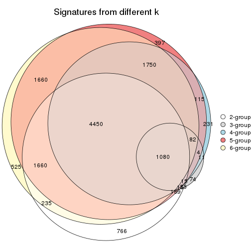

`get_signature()` returns a data frame invisibly. TO get the list of signatures, the function
call should be assigned to a variable explicitly. In following code, if `plot` argument is set
to `FALSE`, no heatmap is plotted while only the differential analysis is performed.

```r
# code only for demonstration
tb = get_signature(res, k = ..., plot = FALSE)
```

An example of the output of `tb` is:

```
#>   which_row         fdr    mean_1    mean_2 scaled_mean_1 scaled_mean_2 km
#> 1        38 0.042760348  8.373488  9.131774    -0.5533452     0.5164555  1
#> 2        40 0.018707592  7.106213  8.469186    -0.6173731     0.5762149  1
#> 3        55 0.019134737 10.221463 11.207825    -0.6159697     0.5749050  1
#> 4        59 0.006059896  5.921854  7.869574    -0.6899429     0.6439467  1
#> 5        60 0.018055526  8.928898 10.211722    -0.6204761     0.5791110  1
#> 6        98 0.009384629 15.714769 14.887706     0.6635654    -0.6193277  2
...
```

The columns in `tb` are:

1. `which_row`: row indices corresponding to the input matrix.
2. `fdr`: FDR for the differential test. 
3. `mean_x`: The mean value in group x.
4. `scaled_mean_x`: The mean value in group x after rows are scaled.
5. `km`: Row groups if k-means clustering is applied to rows.


UMAP plot which shows how samples are separated.


<script>
$( function() {
	$( '#tabs-MAD-kmeans-dimension-reduction' ).tabs();
} );
</script>
<div id='tabs-MAD-kmeans-dimension-reduction'>
<ul>
<li><a href='#tab-MAD-kmeans-dimension-reduction-1'>k = 2</a></li>
<li><a href='#tab-MAD-kmeans-dimension-reduction-2'>k = 3</a></li>
<li><a href='#tab-MAD-kmeans-dimension-reduction-3'>k = 4</a></li>
<li><a href='#tab-MAD-kmeans-dimension-reduction-4'>k = 5</a></li>
<li><a href='#tab-MAD-kmeans-dimension-reduction-5'>k = 6</a></li>
</ul>
<div id='tab-MAD-kmeans-dimension-reduction-1'>
<pre><code class="r">dimension_reduction(res, k = 2, method = &quot;UMAP&quot;)
</code></pre>

<p></p>

</div>
<div id='tab-MAD-kmeans-dimension-reduction-2'>
<pre><code class="r">dimension_reduction(res, k = 3, method = &quot;UMAP&quot;)
</code></pre>

<p></p>

</div>
<div id='tab-MAD-kmeans-dimension-reduction-3'>
<pre><code class="r">dimension_reduction(res, k = 4, method = &quot;UMAP&quot;)
</code></pre>

<p></p>

</div>
<div id='tab-MAD-kmeans-dimension-reduction-4'>
<pre><code class="r">dimension_reduction(res, k = 5, method = &quot;UMAP&quot;)
</code></pre>

<p></p>

</div>
<div id='tab-MAD-kmeans-dimension-reduction-5'>
<pre><code class="r">dimension_reduction(res, k = 6, method = &quot;UMAP&quot;)
</code></pre>

<p></p>

</div>
</div>


Following heatmap shows how subgroups are split when increasing `k`:

```r
collect_classes(res)
```


Test correlation between subgroups and known annotations. If the known
annotation is numeric, one-way ANOVA test is applied, and if the known
annotation is discrete, chi-squared contingency table test is applied.

```r
test_to_known_factors(res)
```

```
#>              n time(p) gender(p) k
#> MAD:kmeans 125  0.2945     0.864 2
#> MAD:kmeans  66  0.0459     0.706 3
#> MAD:kmeans  77  0.1908     0.193 4
#> MAD:kmeans 113  0.1591     0.338 5
#> MAD:kmeans 106  0.1978     0.616 6
```


If matrix rows can be associated to genes, consider to use `functional_enrichment(res,
...)` to perform function enrichment for the signature genes. See [this vignette](http://bioconductor.org/packages/devel/bioc/vignettes/cola/inst/doc/functional_enrichment.html) for more detailed explanations.


 

---------------------------------------------------


### MAD:skmeans**


The object with results only for a single top-value method and a single partition method 
can be extracted as:

```r
res = res_list["MAD", "skmeans"]
# you can also extract it by
# res = res_list["MAD:skmeans"]
```

A summary of `res` and all the functions that can be applied to it:

```r
res
```

```
#> A 'ConsensusPartition' object with k = 2, 3, 4, 5, 6.
#>   On a matrix with 21512 rows and 125 columns.
#>   Top rows (1000, 2000, 3000, 4000, 5000) are extracted by 'MAD' method.
#>   Subgroups are detected by 'skmeans' method.
#>   Performed in total 1250 partitions by row resampling.
#>   Best k for subgroups seems to be 2.
#> 
#> Following methods can be applied to this 'ConsensusPartition' object:
#>  [1] "cola_report"             "collect_classes"         "collect_plots"          
#>  [4] "collect_stats"           "colnames"                "compare_signatures"     
#>  [7] "consensus_heatmap"       "dimension_reduction"     "functional_enrichment"  
#> [10] "get_anno_col"            "get_anno"                "get_classes"            
#> [13] "get_consensus"           "get_matrix"              "get_membership"         
#> [16] "get_param"               "get_signatures"          "get_stats"              
#> [19] "is_best_k"               "is_stable_k"             "membership_heatmap"     
#> [22] "ncol"                    "nrow"                    "plot_ecdf"              
#> [25] "rownames"                "select_partition_number" "show"                   
#> [28] "suggest_best_k"          "test_to_known_factors"
```

`collect_plots()` function collects all the plots made from `res` for all `k` (number of partitions)
into one single page to provide an easy and fast comparison between different `k`.

```r
collect_plots(res)
```


The plots are:

- The first row: a plot of the ECDF (empirical cumulative distribution
  function) curves of the consensus matrix for each `k` and the heatmap of
  predicted classes for each `k`.
- The second row: heatmaps of the consensus matrix for each `k`.
- The third row: heatmaps of the membership matrix for each `k`.
- The fouth row: heatmaps of the signatures for each `k`.

All the plots in panels can be made by individual functions and they are
plotted later in this section.

`select_partition_number()` produces several plots showing different
statistics for choosing "optimized" `k`. There are following statistics:

- ECDF curves of the consensus matrix for each `k`;
- 1-PAC. [The PAC
  score](https://en.wikipedia.org/wiki/Consensus_clustering#Over-interpretation_potential_of_consensus_clustering)
  measures the proportion of the ambiguous subgrouping.
- Mean silhouette score.
- Concordance. The mean probability of fiting the consensus class ids in all
  partitions.
- Area increased. Denote $A_k$ as the area under the ECDF curve for current
  `k`, the area increased is defined as $A_k - A_{k-1}$.
- Rand index. The percent of pairs of samples that are both in a same cluster
  or both are not in a same cluster in the partition of k and k-1.
- Jaccard index. The ratio of pairs of samples are both in a same cluster in
  the partition of k and k-1 and the pairs of samples are both in a same
  cluster in the partition k or k-1.

The detailed explanations of these statistics can be found in [the _cola_
vignette](http://bioconductor.org/packages/devel/bioc/vignettes/cola/inst/doc/cola.html#toc_13).

Generally speaking, lower PAC score, higher mean silhouette score or higher
concordance corresponds to better partition. Rand index and Jaccard index
measure how similar the current partition is compared to partition with `k-1`.
If they are too similar, we won't accept `k` is better than `k-1`.

```r
select_partition_number(res)
```


The numeric values for all these statistics can be obtained by `get_stats()`.

```r
get_stats(res)
```

```
#>   k 1-PAC mean_silhouette concordance area_increased  Rand Jaccard
#> 2 2 1.000           0.985       0.993         0.5043 0.496   0.496
#> 3 3 0.551           0.763       0.835         0.2950 0.835   0.676
#> 4 4 0.465           0.544       0.725         0.1365 0.875   0.658
#> 5 5 0.484           0.474       0.658         0.0649 0.898   0.632
#> 6 6 0.513           0.386       0.608         0.0402 0.966   0.839
```

`suggest_best_k()` suggests the best $k$ based on these statistics. The rules are as follows:

- All $k$ with Jaccard index larger than 0.95 are removed because increasing
  $k$ does not provide enough extra information. If all $k$ are removed, it is
  marked as no subgroup is detected.
- For all $k$ with 1-PAC score larger than 0.9, the maximal $k$ is taken as
  the best $k$, and other $k$ are marked as optional $k$.
- If it does not fit the second rule. The $k$ with the maximal vote of the
  highest 1-PAC score, highest mean silhouette, and highest concordance is
  taken as the best $k$.

```r
suggest_best_k(res)
```

```
#> [1] 2
```


Following shows the table of the partitions (You need to click the **show/hide
code output** link to see it). The membership matrix (columns with name `p*`)
is inferred by
[`clue::cl_consensus()`](https://www.rdocumentation.org/link/cl_consensus?package=clue)
function with the `SE` method. Basically the value in the membership matrix
represents the probability to belong to a certain group. The finall class
label for an item is determined with the group with highest probability it
belongs to.

In `get_classes()` function, the entropy is calculated from the membership
matrix and the silhouette score is calculated from the consensus matrix.


<script>
$( function() {
	$( '#tabs-MAD-skmeans-get-classes' ).tabs();
} );
</script>
<div id='tabs-MAD-skmeans-get-classes'>
<ul>
<li><a href='#tab-MAD-skmeans-get-classes-1'>k = 2</a></li>
<li><a href='#tab-MAD-skmeans-get-classes-2'>k = 3</a></li>
<li><a href='#tab-MAD-skmeans-get-classes-3'>k = 4</a></li>
<li><a href='#tab-MAD-skmeans-get-classes-4'>k = 5</a></li>
<li><a href='#tab-MAD-skmeans-get-classes-5'>k = 6</a></li>
</ul>

<div id='tab-MAD-skmeans-get-classes-1'>
<p><a id='tab-MAD-skmeans-get-classes-1-a' style='color:#0366d6' href='#'>show/hide code output</a></p>
<pre><code class="r">cbind(get_classes(res, k = 2), get_membership(res, k = 2))
</code></pre>

<pre><code>#&gt;           class entropy silhouette    p1    p2
#&gt; GSM601872     2  0.0000      0.999 0.000 1.000
#&gt; GSM601882     2  0.0000      0.999 0.000 1.000
#&gt; GSM601887     1  0.2603      0.950 0.956 0.044
#&gt; GSM601892     1  0.0000      0.987 1.000 0.000
#&gt; GSM601897     1  0.1184      0.975 0.984 0.016
#&gt; GSM601902     2  0.0000      0.999 0.000 1.000
#&gt; GSM601912     1  0.0000      0.987 1.000 0.000
#&gt; GSM601927     1  0.0000      0.987 1.000 0.000
#&gt; GSM601932     2  0.0000      0.999 0.000 1.000
#&gt; GSM601937     2  0.0938      0.988 0.012 0.988
#&gt; GSM601942     2  0.0000      0.999 0.000 1.000
#&gt; GSM601947     2  0.0000      0.999 0.000 1.000
#&gt; GSM601957     1  0.0000      0.987 1.000 0.000
#&gt; GSM601972     2  0.0000      0.999 0.000 1.000
#&gt; GSM601977     2  0.0000      0.999 0.000 1.000
#&gt; GSM601987     2  0.0000      0.999 0.000 1.000
#&gt; GSM601877     1  0.0000      0.987 1.000 0.000
#&gt; GSM601907     2  0.0000      0.999 0.000 1.000
#&gt; GSM601917     2  0.0000      0.999 0.000 1.000
#&gt; GSM601922     2  0.0000      0.999 0.000 1.000
#&gt; GSM601952     2  0.0000      0.999 0.000 1.000
#&gt; GSM601962     1  0.0672      0.981 0.992 0.008
#&gt; GSM601967     1  0.0000      0.987 1.000 0.000
#&gt; GSM601982     2  0.0000      0.999 0.000 1.000
#&gt; GSM601992     2  0.0000      0.999 0.000 1.000
#&gt; GSM601873     2  0.0000      0.999 0.000 1.000
#&gt; GSM601883     2  0.0000      0.999 0.000 1.000
#&gt; GSM601888     1  0.5946      0.838 0.856 0.144
#&gt; GSM601893     1  0.0000      0.987 1.000 0.000
#&gt; GSM601898     1  0.0000      0.987 1.000 0.000
#&gt; GSM601903     2  0.0000      0.999 0.000 1.000
#&gt; GSM601913     1  0.0000      0.987 1.000 0.000
#&gt; GSM601928     1  0.0000      0.987 1.000 0.000
#&gt; GSM601933     2  0.0000      0.999 0.000 1.000
#&gt; GSM601938     2  0.0000      0.999 0.000 1.000
#&gt; GSM601943     2  0.0000      0.999 0.000 1.000
#&gt; GSM601948     1  0.0000      0.987 1.000 0.000
#&gt; GSM601958     1  0.0000      0.987 1.000 0.000
#&gt; GSM601973     2  0.0000      0.999 0.000 1.000
#&gt; GSM601978     2  0.0000      0.999 0.000 1.000
#&gt; GSM601988     2  0.0000      0.999 0.000 1.000
#&gt; GSM601878     1  0.0000      0.987 1.000 0.000
#&gt; GSM601908     2  0.0000      0.999 0.000 1.000
#&gt; GSM601918     2  0.0000      0.999 0.000 1.000
#&gt; GSM601923     1  0.0000      0.987 1.000 0.000
#&gt; GSM601953     2  0.0000      0.999 0.000 1.000
#&gt; GSM601963     1  0.0000      0.987 1.000 0.000
#&gt; GSM601968     1  0.0000      0.987 1.000 0.000
#&gt; GSM601983     1  0.0000      0.987 1.000 0.000
#&gt; GSM601993     2  0.0000      0.999 0.000 1.000
#&gt; GSM601874     2  0.0000      0.999 0.000 1.000
#&gt; GSM601884     2  0.0000      0.999 0.000 1.000
#&gt; GSM601889     1  0.0000      0.987 1.000 0.000
#&gt; GSM601894     1  0.0000      0.987 1.000 0.000
#&gt; GSM601899     1  0.0938      0.978 0.988 0.012
#&gt; GSM601904     2  0.1414      0.980 0.020 0.980
#&gt; GSM601914     1  0.0000      0.987 1.000 0.000
#&gt; GSM601929     1  0.0000      0.987 1.000 0.000
#&gt; GSM601934     2  0.0000      0.999 0.000 1.000
#&gt; GSM601939     1  0.0000      0.987 1.000 0.000
#&gt; GSM601944     2  0.0000      0.999 0.000 1.000
#&gt; GSM601949     1  0.0000      0.987 1.000 0.000
#&gt; GSM601959     1  0.0000      0.987 1.000 0.000
#&gt; GSM601974     2  0.1414      0.980 0.020 0.980
#&gt; GSM601979     2  0.0000      0.999 0.000 1.000
#&gt; GSM601989     1  0.0000      0.987 1.000 0.000
#&gt; GSM601879     1  0.0000      0.987 1.000 0.000
#&gt; GSM601909     1  0.0000      0.987 1.000 0.000
#&gt; GSM601919     2  0.0000      0.999 0.000 1.000
#&gt; GSM601924     1  0.0000      0.987 1.000 0.000
#&gt; GSM601954     2  0.0000      0.999 0.000 1.000
#&gt; GSM601964     1  0.0000      0.987 1.000 0.000
#&gt; GSM601969     1  0.0000      0.987 1.000 0.000
#&gt; GSM601984     1  0.0000      0.987 1.000 0.000
#&gt; GSM601994     2  0.0000      0.999 0.000 1.000
#&gt; GSM601875     2  0.0000      0.999 0.000 1.000
#&gt; GSM601885     2  0.0000      0.999 0.000 1.000
#&gt; GSM601890     1  0.2236      0.957 0.964 0.036
#&gt; GSM601895     1  0.0000      0.987 1.000 0.000
#&gt; GSM601900     1  0.0000      0.987 1.000 0.000
#&gt; GSM601905     2  0.0376      0.995 0.004 0.996
#&gt; GSM601915     1  0.0000      0.987 1.000 0.000
#&gt; GSM601930     1  0.0000      0.987 1.000 0.000
#&gt; GSM601935     1  0.9044      0.535 0.680 0.320
#&gt; GSM601940     1  0.0000      0.987 1.000 0.000
#&gt; GSM601945     2  0.0000      0.999 0.000 1.000
#&gt; GSM601950     1  0.0000      0.987 1.000 0.000
#&gt; GSM601960     1  0.0000      0.987 1.000 0.000
#&gt; GSM601975     2  0.0000      0.999 0.000 1.000
#&gt; GSM601980     2  0.0000      0.999 0.000 1.000
#&gt; GSM601990     1  0.0000      0.987 1.000 0.000
#&gt; GSM601880     1  0.0000      0.987 1.000 0.000
#&gt; GSM601910     1  0.0000      0.987 1.000 0.000
#&gt; GSM601920     2  0.0000      0.999 0.000 1.000
#&gt; GSM601925     1  0.0000      0.987 1.000 0.000
#&gt; GSM601955     2  0.0000      0.999 0.000 1.000
#&gt; GSM601965     1  0.0000      0.987 1.000 0.000
#&gt; GSM601970     1  0.0000      0.987 1.000 0.000
#&gt; GSM601985     1  0.0000      0.987 1.000 0.000
#&gt; GSM601995     2  0.0000      0.999 0.000 1.000
#&gt; GSM601876     1  0.0000      0.987 1.000 0.000
#&gt; GSM601886     2  0.0376      0.995 0.004 0.996
#&gt; GSM601891     1  0.6531      0.806 0.832 0.168
#&gt; GSM601896     1  0.0000      0.987 1.000 0.000
#&gt; GSM601901     2  0.0000      0.999 0.000 1.000
#&gt; GSM601906     1  0.2778      0.945 0.952 0.048
#&gt; GSM601916     2  0.0000      0.999 0.000 1.000
#&gt; GSM601931     1  0.0000      0.987 1.000 0.000
#&gt; GSM601936     2  0.0000      0.999 0.000 1.000
#&gt; GSM601941     2  0.0000      0.999 0.000 1.000
#&gt; GSM601946     1  0.0000      0.987 1.000 0.000
#&gt; GSM601951     1  0.0000      0.987 1.000 0.000
#&gt; GSM601961     2  0.0000      0.999 0.000 1.000
#&gt; GSM601976     2  0.0000      0.999 0.000 1.000
#&gt; GSM601981     2  0.0000      0.999 0.000 1.000
#&gt; GSM601991     1  0.0000      0.987 1.000 0.000
#&gt; GSM601881     1  0.0000      0.987 1.000 0.000
#&gt; GSM601911     2  0.0376      0.995 0.004 0.996
#&gt; GSM601921     2  0.0000      0.999 0.000 1.000
#&gt; GSM601926     1  0.0000      0.987 1.000 0.000
#&gt; GSM601956     2  0.0000      0.999 0.000 1.000
#&gt; GSM601966     2  0.0000      0.999 0.000 1.000
#&gt; GSM601971     1  0.0000      0.987 1.000 0.000
#&gt; GSM601986     1  0.2423      0.953 0.960 0.040
#&gt; GSM601996     2  0.0000      0.999 0.000 1.000
</code></pre>

<script>
$('#tab-MAD-skmeans-get-classes-1-a').parent().next().next().hide();
$('#tab-MAD-skmeans-get-classes-1-a').click(function(){
  $('#tab-MAD-skmeans-get-classes-1-a').parent().next().next().toggle();
  return(false);
});
</script>
</div>

<div id='tab-MAD-skmeans-get-classes-2'>
<p><a id='tab-MAD-skmeans-get-classes-2-a' style='color:#0366d6' href='#'>show/hide code output</a></p>
<pre><code class="r">cbind(get_classes(res, k = 3), get_membership(res, k = 3))
</code></pre>

<pre><code>#&gt;           class entropy silhouette    p1    p2    p3
#&gt; GSM601872     2  0.5098     0.8171 0.000 0.752 0.248
#&gt; GSM601882     2  0.2356     0.8855 0.000 0.928 0.072
#&gt; GSM601887     3  0.3456     0.7243 0.060 0.036 0.904
#&gt; GSM601892     3  0.4883     0.8029 0.208 0.004 0.788
#&gt; GSM601897     3  0.1453     0.7234 0.024 0.008 0.968
#&gt; GSM601902     2  0.1525     0.8650 0.032 0.964 0.004
#&gt; GSM601912     3  0.3682     0.7709 0.116 0.008 0.876
#&gt; GSM601927     1  0.0592     0.8394 0.988 0.000 0.012
#&gt; GSM601932     2  0.0475     0.8747 0.004 0.992 0.004
#&gt; GSM601937     2  0.4504     0.7973 0.000 0.804 0.196
#&gt; GSM601942     2  0.4605     0.8511 0.000 0.796 0.204
#&gt; GSM601947     2  0.2982     0.8644 0.056 0.920 0.024
#&gt; GSM601957     3  0.5650     0.7516 0.312 0.000 0.688
#&gt; GSM601972     2  0.1711     0.8803 0.008 0.960 0.032
#&gt; GSM601977     2  0.3482     0.8826 0.000 0.872 0.128
#&gt; GSM601987     2  0.2878     0.8833 0.000 0.904 0.096
#&gt; GSM601877     1  0.0592     0.8394 0.988 0.000 0.012
#&gt; GSM601907     2  0.3619     0.8751 0.000 0.864 0.136
#&gt; GSM601917     2  0.6057     0.4987 0.340 0.656 0.004
#&gt; GSM601922     2  0.6180     0.5190 0.332 0.660 0.008
#&gt; GSM601952     2  0.2625     0.8860 0.000 0.916 0.084
#&gt; GSM601962     3  0.6988     0.5947 0.320 0.036 0.644
#&gt; GSM601967     3  0.5529     0.7666 0.296 0.000 0.704
#&gt; GSM601982     2  0.4883     0.8442 0.004 0.788 0.208
#&gt; GSM601992     2  0.0661     0.8734 0.004 0.988 0.008
#&gt; GSM601873     2  0.4121     0.8651 0.000 0.832 0.168
#&gt; GSM601883     2  0.3030     0.8847 0.004 0.904 0.092
#&gt; GSM601888     3  0.4399     0.6591 0.044 0.092 0.864
#&gt; GSM601893     3  0.4453     0.7797 0.152 0.012 0.836
#&gt; GSM601898     3  0.5216     0.7952 0.260 0.000 0.740
#&gt; GSM601903     2  0.2200     0.8557 0.056 0.940 0.004
#&gt; GSM601913     3  0.6140     0.6295 0.404 0.000 0.596
#&gt; GSM601928     1  0.0592     0.8394 0.988 0.000 0.012
#&gt; GSM601933     2  0.2261     0.8858 0.000 0.932 0.068
#&gt; GSM601938     2  0.2165     0.8848 0.000 0.936 0.064
#&gt; GSM601943     2  0.4605     0.8485 0.000 0.796 0.204
#&gt; GSM601948     1  0.4346     0.6904 0.816 0.000 0.184
#&gt; GSM601958     3  0.5785     0.7421 0.332 0.000 0.668
#&gt; GSM601973     2  0.0661     0.8711 0.008 0.988 0.004
#&gt; GSM601978     2  0.3816     0.8709 0.000 0.852 0.148
#&gt; GSM601988     2  0.3918     0.8400 0.004 0.856 0.140
#&gt; GSM601878     1  0.0592     0.8394 0.988 0.000 0.012
#&gt; GSM601908     2  0.2959     0.8837 0.000 0.900 0.100
#&gt; GSM601918     2  0.1315     0.8761 0.008 0.972 0.020
#&gt; GSM601923     1  0.0592     0.8394 0.988 0.000 0.012
#&gt; GSM601953     2  0.3752     0.8721 0.000 0.856 0.144
#&gt; GSM601963     3  0.5560     0.7419 0.300 0.000 0.700
#&gt; GSM601968     3  0.4555     0.8069 0.200 0.000 0.800
#&gt; GSM601983     3  0.5678     0.6777 0.316 0.000 0.684
#&gt; GSM601993     2  0.1399     0.8711 0.004 0.968 0.028
#&gt; GSM601874     2  0.3816     0.8709 0.000 0.852 0.148
#&gt; GSM601884     2  0.3551     0.8791 0.000 0.868 0.132
#&gt; GSM601889     3  0.5327     0.7898 0.272 0.000 0.728
#&gt; GSM601894     3  0.5431     0.7813 0.284 0.000 0.716
#&gt; GSM601899     3  0.2446     0.7354 0.052 0.012 0.936
#&gt; GSM601904     1  0.6082     0.5063 0.692 0.296 0.012
#&gt; GSM601914     3  0.4702     0.8013 0.212 0.000 0.788
#&gt; GSM601929     1  0.0983     0.8293 0.980 0.004 0.016
#&gt; GSM601934     2  0.3482     0.8797 0.000 0.872 0.128
#&gt; GSM601939     1  0.4842     0.5910 0.776 0.000 0.224
#&gt; GSM601944     2  0.2625     0.8864 0.000 0.916 0.084
#&gt; GSM601949     1  0.4796     0.6304 0.780 0.000 0.220
#&gt; GSM601959     3  0.5529     0.7707 0.296 0.000 0.704
#&gt; GSM601974     3  0.9641     0.1327 0.228 0.316 0.456
#&gt; GSM601979     2  0.3482     0.8772 0.000 0.872 0.128
#&gt; GSM601989     3  0.5497     0.7837 0.292 0.000 0.708
#&gt; GSM601879     1  0.0592     0.8394 0.988 0.000 0.012
#&gt; GSM601909     3  0.4235     0.8048 0.176 0.000 0.824
#&gt; GSM601919     2  0.6066     0.6664 0.248 0.728 0.024
#&gt; GSM601924     1  0.1163     0.8338 0.972 0.000 0.028
#&gt; GSM601954     2  0.2749     0.8845 0.012 0.924 0.064
#&gt; GSM601964     3  0.5363     0.7497 0.276 0.000 0.724
#&gt; GSM601969     3  0.5948     0.6894 0.360 0.000 0.640
#&gt; GSM601984     1  0.4475     0.7477 0.840 0.016 0.144
#&gt; GSM601994     2  0.0475     0.8745 0.004 0.992 0.004
#&gt; GSM601875     2  0.3412     0.8791 0.000 0.876 0.124
#&gt; GSM601885     2  0.2796     0.8840 0.000 0.908 0.092
#&gt; GSM601890     3  0.1525     0.7268 0.032 0.004 0.964
#&gt; GSM601895     3  0.4842     0.8081 0.224 0.000 0.776
#&gt; GSM601900     3  0.5070     0.8080 0.224 0.004 0.772
#&gt; GSM601905     2  0.6451     0.3887 0.384 0.608 0.008
#&gt; GSM601915     3  0.5431     0.7868 0.284 0.000 0.716
#&gt; GSM601930     1  0.0592     0.8394 0.988 0.000 0.012
#&gt; GSM601935     3  0.9233     0.4111 0.268 0.204 0.528
#&gt; GSM601940     1  0.5678     0.3500 0.684 0.000 0.316
#&gt; GSM601945     2  0.3551     0.8759 0.000 0.868 0.132
#&gt; GSM601950     1  0.5529     0.4484 0.704 0.000 0.296
#&gt; GSM601960     3  0.4702     0.8052 0.212 0.000 0.788
#&gt; GSM601975     2  0.1015     0.8740 0.008 0.980 0.012
#&gt; GSM601980     2  0.4842     0.8158 0.000 0.776 0.224
#&gt; GSM601990     3  0.4796     0.7889 0.220 0.000 0.780
#&gt; GSM601880     1  0.0592     0.8394 0.988 0.000 0.012
#&gt; GSM601910     3  0.3551     0.7939 0.132 0.000 0.868
#&gt; GSM601920     1  0.6804     0.0513 0.528 0.460 0.012
#&gt; GSM601925     1  0.0424     0.8372 0.992 0.000 0.008
#&gt; GSM601955     2  0.6410     0.5793 0.004 0.576 0.420
#&gt; GSM601965     1  0.5987     0.6506 0.756 0.036 0.208
#&gt; GSM601970     3  0.4796     0.8066 0.220 0.000 0.780
#&gt; GSM601985     1  0.5431     0.4315 0.716 0.000 0.284
#&gt; GSM601995     2  0.5070     0.7740 0.004 0.772 0.224
#&gt; GSM601876     1  0.3482     0.7546 0.872 0.000 0.128
#&gt; GSM601886     2  0.8508     0.5084 0.232 0.608 0.160
#&gt; GSM601891     3  0.2804     0.6729 0.016 0.060 0.924
#&gt; GSM601896     1  0.2959     0.7823 0.900 0.000 0.100
#&gt; GSM601901     2  0.1860     0.8839 0.000 0.948 0.052
#&gt; GSM601906     1  0.3375     0.7320 0.892 0.100 0.008
#&gt; GSM601916     2  0.2496     0.8508 0.068 0.928 0.004
#&gt; GSM601931     1  0.0592     0.8394 0.988 0.000 0.012
#&gt; GSM601936     2  0.3043     0.8633 0.008 0.908 0.084
#&gt; GSM601941     2  0.0661     0.8711 0.008 0.988 0.004
#&gt; GSM601946     1  0.2261     0.8074 0.932 0.000 0.068
#&gt; GSM601951     1  0.1399     0.8314 0.968 0.004 0.028
#&gt; GSM601961     2  0.5397     0.7534 0.000 0.720 0.280
#&gt; GSM601976     2  0.5219     0.7307 0.196 0.788 0.016
#&gt; GSM601981     2  0.3116     0.8823 0.000 0.892 0.108
#&gt; GSM601991     3  0.4805     0.7752 0.176 0.012 0.812
#&gt; GSM601881     1  0.0592     0.8394 0.988 0.000 0.012
#&gt; GSM601911     2  0.7838     0.0902 0.460 0.488 0.052
#&gt; GSM601921     2  0.5285     0.6688 0.244 0.752 0.004
#&gt; GSM601926     1  0.0592     0.8394 0.988 0.000 0.012
#&gt; GSM601956     2  0.3752     0.8726 0.000 0.856 0.144
#&gt; GSM601966     2  0.1015     0.8741 0.008 0.980 0.012
#&gt; GSM601971     3  0.6126     0.6315 0.400 0.000 0.600
#&gt; GSM601986     1  0.4288     0.7627 0.872 0.068 0.060
#&gt; GSM601996     2  0.0475     0.8721 0.004 0.992 0.004
</code></pre>

<script>
$('#tab-MAD-skmeans-get-classes-2-a').parent().next().next().hide();
$('#tab-MAD-skmeans-get-classes-2-a').click(function(){
  $('#tab-MAD-skmeans-get-classes-2-a').parent().next().next().toggle();
  return(false);
});
</script>
</div>

<div id='tab-MAD-skmeans-get-classes-3'>
<p><a id='tab-MAD-skmeans-get-classes-3-a' style='color:#0366d6' href='#'>show/hide code output</a></p>
<pre><code class="r">cbind(get_classes(res, k = 4), get_membership(res, k = 4))
</code></pre>

<pre><code>#&gt;           class entropy silhouette    p1    p2    p3    p4
#&gt; GSM601872     2  0.4155     0.5475 0.000 0.828 0.072 0.100
#&gt; GSM601882     2  0.4391     0.5995 0.000 0.740 0.008 0.252
#&gt; GSM601887     3  0.5443     0.6375 0.024 0.232 0.720 0.024
#&gt; GSM601892     3  0.4265     0.7250 0.068 0.076 0.840 0.016
#&gt; GSM601897     3  0.4998     0.6787 0.004 0.088 0.780 0.128
#&gt; GSM601902     4  0.5681     0.1930 0.028 0.404 0.000 0.568
#&gt; GSM601912     3  0.7320     0.6159 0.088 0.076 0.640 0.196
#&gt; GSM601927     1  0.0188     0.8257 0.996 0.000 0.004 0.000
#&gt; GSM601932     2  0.5165     0.1078 0.000 0.512 0.004 0.484
#&gt; GSM601937     4  0.7155     0.2748 0.000 0.292 0.168 0.540
#&gt; GSM601942     2  0.4994     0.5431 0.000 0.744 0.048 0.208
#&gt; GSM601947     2  0.6319     0.0683 0.060 0.504 0.000 0.436
#&gt; GSM601957     3  0.4453     0.6588 0.244 0.000 0.744 0.012
#&gt; GSM601972     2  0.4804     0.3547 0.000 0.616 0.000 0.384
#&gt; GSM601977     2  0.3539     0.6635 0.000 0.820 0.004 0.176
#&gt; GSM601987     2  0.2589     0.6767 0.000 0.884 0.000 0.116
#&gt; GSM601877     1  0.0592     0.8208 0.984 0.000 0.000 0.016
#&gt; GSM601907     2  0.0779     0.6687 0.000 0.980 0.004 0.016
#&gt; GSM601917     4  0.7199     0.4106 0.232 0.216 0.000 0.552
#&gt; GSM601922     4  0.7445     0.3695 0.224 0.268 0.000 0.508
#&gt; GSM601952     2  0.4072     0.6062 0.000 0.748 0.000 0.252
#&gt; GSM601962     3  0.8356     0.3115 0.152 0.048 0.452 0.348
#&gt; GSM601967     3  0.4355     0.6988 0.212 0.004 0.772 0.012
#&gt; GSM601982     2  0.4974     0.5721 0.000 0.736 0.040 0.224
#&gt; GSM601992     2  0.4955     0.2576 0.000 0.556 0.000 0.444
#&gt; GSM601873     2  0.3812     0.5928 0.000 0.832 0.028 0.140
#&gt; GSM601883     2  0.3356     0.6466 0.000 0.824 0.000 0.176
#&gt; GSM601888     3  0.5701     0.5073 0.012 0.340 0.628 0.020
#&gt; GSM601893     3  0.5285     0.6998 0.056 0.132 0.780 0.032
#&gt; GSM601898     3  0.3625     0.7254 0.160 0.000 0.828 0.012
#&gt; GSM601903     4  0.5599     0.2808 0.032 0.352 0.000 0.616
#&gt; GSM601913     3  0.6375     0.5508 0.312 0.000 0.600 0.088
#&gt; GSM601928     1  0.0336     0.8257 0.992 0.000 0.008 0.000
#&gt; GSM601933     2  0.4040     0.6191 0.000 0.752 0.000 0.248
#&gt; GSM601938     2  0.4382     0.5424 0.000 0.704 0.000 0.296
#&gt; GSM601943     2  0.4290     0.5661 0.000 0.800 0.036 0.164
#&gt; GSM601948     1  0.5251     0.6128 0.712 0.008 0.252 0.028
#&gt; GSM601958     3  0.4422     0.6575 0.256 0.000 0.736 0.008
#&gt; GSM601973     4  0.4889     0.2530 0.004 0.360 0.000 0.636
#&gt; GSM601978     2  0.0895     0.6699 0.000 0.976 0.004 0.020
#&gt; GSM601988     4  0.6751     0.2893 0.000 0.272 0.136 0.592
#&gt; GSM601878     1  0.0376     0.8254 0.992 0.000 0.004 0.004
#&gt; GSM601908     2  0.2530     0.6722 0.000 0.888 0.000 0.112
#&gt; GSM601918     2  0.5112     0.2174 0.004 0.560 0.000 0.436
#&gt; GSM601923     1  0.0188     0.8257 0.996 0.000 0.004 0.000
#&gt; GSM601953     2  0.0804     0.6639 0.000 0.980 0.008 0.012
#&gt; GSM601963     3  0.6010     0.6191 0.220 0.000 0.676 0.104
#&gt; GSM601968     3  0.3342     0.7420 0.080 0.008 0.880 0.032
#&gt; GSM601983     3  0.6893     0.5270 0.204 0.004 0.612 0.180
#&gt; GSM601993     4  0.5755     0.2256 0.000 0.332 0.044 0.624
#&gt; GSM601874     2  0.1489     0.6740 0.000 0.952 0.004 0.044
#&gt; GSM601884     2  0.2714     0.6798 0.000 0.884 0.004 0.112
#&gt; GSM601889     3  0.4361     0.6960 0.208 0.000 0.772 0.020
#&gt; GSM601894     3  0.4011     0.6933 0.208 0.000 0.784 0.008
#&gt; GSM601899     3  0.5196     0.6756 0.028 0.184 0.760 0.028
#&gt; GSM601904     4  0.6434     0.2261 0.432 0.068 0.000 0.500
#&gt; GSM601914     3  0.4203     0.7087 0.068 0.000 0.824 0.108
#&gt; GSM601929     1  0.1724     0.8137 0.948 0.000 0.020 0.032
#&gt; GSM601934     2  0.3764     0.6413 0.000 0.816 0.012 0.172
#&gt; GSM601939     1  0.4482     0.5891 0.728 0.000 0.264 0.008
#&gt; GSM601944     2  0.4741     0.5158 0.000 0.668 0.004 0.328
#&gt; GSM601949     1  0.5026     0.5067 0.672 0.000 0.312 0.016
#&gt; GSM601959     3  0.4086     0.6860 0.216 0.000 0.776 0.008
#&gt; GSM601974     4  0.9163     0.2564 0.120 0.160 0.292 0.428
#&gt; GSM601979     2  0.1118     0.6745 0.000 0.964 0.000 0.036
#&gt; GSM601989     3  0.5109     0.7120 0.196 0.000 0.744 0.060
#&gt; GSM601879     1  0.0657     0.8252 0.984 0.000 0.004 0.012
#&gt; GSM601909     3  0.2751     0.7407 0.056 0.000 0.904 0.040
#&gt; GSM601919     2  0.7436    -0.1166 0.176 0.460 0.000 0.364
#&gt; GSM601924     1  0.1474     0.8145 0.948 0.000 0.052 0.000
#&gt; GSM601954     2  0.5255     0.5064 0.004 0.696 0.028 0.272
#&gt; GSM601964     3  0.6363     0.5918 0.172 0.000 0.656 0.172
#&gt; GSM601969     3  0.5634     0.5753 0.296 0.008 0.664 0.032
#&gt; GSM601984     1  0.6723     0.5473 0.632 0.004 0.176 0.188
#&gt; GSM601994     2  0.4925     0.2829 0.000 0.572 0.000 0.428
#&gt; GSM601875     2  0.1557     0.6761 0.000 0.944 0.000 0.056
#&gt; GSM601885     2  0.3494     0.6630 0.000 0.824 0.004 0.172
#&gt; GSM601890     3  0.5515     0.6553 0.012 0.208 0.728 0.052
#&gt; GSM601895     3  0.4541     0.7153 0.144 0.000 0.796 0.060
#&gt; GSM601900     3  0.4440     0.7380 0.136 0.000 0.804 0.060
#&gt; GSM601905     4  0.6573     0.4487 0.164 0.184 0.004 0.648
#&gt; GSM601915     3  0.5298     0.6768 0.244 0.000 0.708 0.048
#&gt; GSM601930     1  0.0672     0.8259 0.984 0.000 0.008 0.008
#&gt; GSM601935     4  0.7684     0.0518 0.080 0.056 0.332 0.532
#&gt; GSM601940     1  0.4655     0.5312 0.684 0.000 0.312 0.004
#&gt; GSM601945     2  0.1978     0.6770 0.000 0.928 0.004 0.068
#&gt; GSM601950     1  0.4769     0.5158 0.684 0.000 0.308 0.008
#&gt; GSM601960     3  0.4535     0.7271 0.084 0.000 0.804 0.112
#&gt; GSM601975     4  0.4977     0.0165 0.000 0.460 0.000 0.540
#&gt; GSM601980     2  0.6969    -0.0280 0.000 0.452 0.112 0.436
#&gt; GSM601990     3  0.5609     0.6400 0.088 0.000 0.712 0.200
#&gt; GSM601880     1  0.0000     0.8252 1.000 0.000 0.000 0.000
#&gt; GSM601910     3  0.3237     0.7388 0.040 0.008 0.888 0.064
#&gt; GSM601920     4  0.7165     0.3647 0.372 0.140 0.000 0.488
#&gt; GSM601925     1  0.0927     0.8221 0.976 0.000 0.008 0.016
#&gt; GSM601955     4  0.7576     0.1957 0.000 0.324 0.212 0.464
#&gt; GSM601965     1  0.7973     0.4518 0.552 0.040 0.204 0.204
#&gt; GSM601970     3  0.3105     0.7374 0.120 0.000 0.868 0.012
#&gt; GSM601985     1  0.6023     0.2929 0.600 0.000 0.344 0.056
#&gt; GSM601995     4  0.6513     0.3490 0.000 0.176 0.184 0.640
#&gt; GSM601876     1  0.4638     0.7061 0.776 0.000 0.180 0.044
#&gt; GSM601886     4  0.7545     0.4149 0.120 0.156 0.088 0.636
#&gt; GSM601891     3  0.6216     0.5662 0.016 0.276 0.652 0.056
#&gt; GSM601896     1  0.3900     0.7451 0.816 0.000 0.164 0.020
#&gt; GSM601901     2  0.4477     0.5107 0.000 0.688 0.000 0.312
#&gt; GSM601906     1  0.4287     0.6912 0.804 0.012 0.016 0.168
#&gt; GSM601916     4  0.5856     0.2793 0.036 0.352 0.004 0.608
#&gt; GSM601931     1  0.0469     0.8255 0.988 0.000 0.012 0.000
#&gt; GSM601936     4  0.5785     0.3022 0.008 0.280 0.044 0.668
#&gt; GSM601941     4  0.5060     0.1450 0.004 0.412 0.000 0.584
#&gt; GSM601946     1  0.3447     0.7570 0.852 0.000 0.128 0.020
#&gt; GSM601951     1  0.2670     0.8036 0.908 0.000 0.052 0.040
#&gt; GSM601961     2  0.4538     0.5199 0.004 0.808 0.124 0.064
#&gt; GSM601976     4  0.7083     0.3790 0.120 0.288 0.012 0.580
#&gt; GSM601981     2  0.2704     0.6713 0.000 0.876 0.000 0.124
#&gt; GSM601991     3  0.6416     0.5063 0.056 0.012 0.596 0.336
#&gt; GSM601881     1  0.0188     0.8257 0.996 0.000 0.004 0.000
#&gt; GSM601911     4  0.8974     0.2486 0.292 0.316 0.052 0.340
#&gt; GSM601921     4  0.7008     0.4029 0.156 0.252 0.004 0.588
#&gt; GSM601926     1  0.0336     0.8257 0.992 0.000 0.008 0.000
#&gt; GSM601956     2  0.1209     0.6621 0.000 0.964 0.004 0.032
#&gt; GSM601966     2  0.4941     0.2507 0.000 0.564 0.000 0.436
#&gt; GSM601971     3  0.5060     0.3740 0.412 0.000 0.584 0.004
#&gt; GSM601986     1  0.7099     0.5847 0.648 0.048 0.104 0.200
#&gt; GSM601996     4  0.4981    -0.0303 0.000 0.464 0.000 0.536
</code></pre>

<script>
$('#tab-MAD-skmeans-get-classes-3-a').parent().next().next().hide();
$('#tab-MAD-skmeans-get-classes-3-a').click(function(){
  $('#tab-MAD-skmeans-get-classes-3-a').parent().next().next().toggle();
  return(false);
});
</script>
</div>

<div id='tab-MAD-skmeans-get-classes-4'>
<p><a id='tab-MAD-skmeans-get-classes-4-a' style='color:#0366d6' href='#'>show/hide code output</a></p>
<pre><code class="r">cbind(get_classes(res, k = 5), get_membership(res, k = 5))
</code></pre>

<pre><code>#&gt;           class entropy silhouette    p1    p2    p3    p4    p5
#&gt; GSM601872     2  0.4184    0.61113 0.000 0.808 0.048 0.032 0.112
#&gt; GSM601882     2  0.5611    0.41088 0.000 0.584 0.012 0.344 0.060
#&gt; GSM601887     3  0.5399    0.47879 0.008 0.216 0.696 0.020 0.060
#&gt; GSM601892     3  0.3723    0.62775 0.052 0.080 0.844 0.004 0.020
#&gt; GSM601897     3  0.6738    0.23486 0.004 0.144 0.536 0.024 0.292
#&gt; GSM601902     4  0.4377    0.56178 0.008 0.160 0.004 0.776 0.052
#&gt; GSM601912     5  0.7614    0.10973 0.092 0.056 0.356 0.036 0.460
#&gt; GSM601927     1  0.1461    0.76709 0.952 0.000 0.028 0.004 0.016
#&gt; GSM601932     4  0.6186    0.40932 0.000 0.316 0.020 0.564 0.100
#&gt; GSM601937     5  0.7430    0.19938 0.004 0.228 0.040 0.264 0.464
#&gt; GSM601942     2  0.5135    0.55783 0.000 0.704 0.012 0.080 0.204
#&gt; GSM601947     4  0.6343    0.37415 0.028 0.356 0.012 0.544 0.060
#&gt; GSM601957     3  0.4003    0.65148 0.180 0.000 0.780 0.004 0.036
#&gt; GSM601972     4  0.5382    0.02162 0.000 0.476 0.004 0.476 0.044
#&gt; GSM601977     2  0.5438    0.62798 0.000 0.700 0.024 0.176 0.100
#&gt; GSM601987     2  0.4592    0.60012 0.000 0.728 0.012 0.224 0.036
#&gt; GSM601877     1  0.1617    0.76272 0.948 0.000 0.020 0.020 0.012
#&gt; GSM601907     2  0.1934    0.68040 0.000 0.928 0.004 0.052 0.016
#&gt; GSM601917     4  0.6741    0.53336 0.136 0.116 0.012 0.640 0.096
#&gt; GSM601922     4  0.6185    0.53628 0.140 0.088 0.004 0.676 0.092
#&gt; GSM601952     2  0.5862    0.46368 0.000 0.616 0.012 0.264 0.108
#&gt; GSM601962     5  0.7134    0.37282 0.160 0.032 0.176 0.040 0.592
#&gt; GSM601967     3  0.4738    0.64711 0.192 0.016 0.744 0.004 0.044
#&gt; GSM601982     2  0.6616    0.49320 0.004 0.600 0.036 0.192 0.168
#&gt; GSM601992     4  0.6030   -0.00397 0.000 0.424 0.004 0.472 0.100
#&gt; GSM601873     2  0.4976    0.63368 0.000 0.748 0.024 0.124 0.104
#&gt; GSM601883     2  0.5353    0.55225 0.000 0.668 0.024 0.256 0.052
#&gt; GSM601888     3  0.5678    0.36269 0.000 0.300 0.616 0.020 0.064
#&gt; GSM601893     3  0.5684    0.58565 0.052 0.116 0.728 0.016 0.088
#&gt; GSM601898     3  0.5046    0.62404 0.140 0.000 0.704 0.000 0.156
#&gt; GSM601903     4  0.4613    0.57076 0.020 0.124 0.004 0.780 0.072
#&gt; GSM601913     3  0.6961    0.32018 0.312 0.000 0.412 0.008 0.268
#&gt; GSM601928     1  0.0898    0.76533 0.972 0.000 0.020 0.000 0.008
#&gt; GSM601933     2  0.5887    0.45604 0.000 0.588 0.008 0.300 0.104
#&gt; GSM601938     2  0.6075    0.33464 0.000 0.552 0.012 0.336 0.100
#&gt; GSM601943     2  0.4414    0.63134 0.000 0.792 0.024 0.076 0.108
#&gt; GSM601948     1  0.6550    0.43850 0.580 0.004 0.284 0.068 0.064
#&gt; GSM601958     3  0.5115    0.62303 0.232 0.000 0.676 0.000 0.092
#&gt; GSM601973     4  0.5166    0.54000 0.000 0.208 0.012 0.700 0.080
#&gt; GSM601978     2  0.1911    0.68113 0.000 0.932 0.004 0.036 0.028
#&gt; GSM601988     5  0.7377   -0.01894 0.000 0.228 0.036 0.324 0.412
#&gt; GSM601878     1  0.0693    0.76480 0.980 0.000 0.008 0.012 0.000
#&gt; GSM601908     2  0.3548    0.65310 0.000 0.796 0.004 0.188 0.012
#&gt; GSM601918     4  0.5098    0.43104 0.004 0.316 0.008 0.640 0.032
#&gt; GSM601923     1  0.0854    0.76637 0.976 0.000 0.012 0.008 0.004
#&gt; GSM601953     2  0.2095    0.66827 0.000 0.928 0.020 0.028 0.024
#&gt; GSM601963     5  0.6784   -0.15992 0.224 0.000 0.376 0.004 0.396
#&gt; GSM601968     3  0.4414    0.62729 0.044 0.020 0.792 0.008 0.136
#&gt; GSM601983     5  0.7042    0.12141 0.216 0.000 0.288 0.024 0.472
#&gt; GSM601993     4  0.6777    0.29845 0.000 0.220 0.008 0.464 0.308
#&gt; GSM601874     2  0.2732    0.68320 0.000 0.884 0.008 0.088 0.020
#&gt; GSM601884     2  0.4738    0.65618 0.000 0.748 0.012 0.164 0.076
#&gt; GSM601889     3  0.4830    0.64643 0.208 0.000 0.716 0.004 0.072
#&gt; GSM601894     3  0.4627    0.64742 0.188 0.000 0.732 0.000 0.080
#&gt; GSM601899     3  0.5190    0.51726 0.012 0.172 0.736 0.028 0.052
#&gt; GSM601904     4  0.6780    0.22117 0.356 0.012 0.012 0.488 0.132
#&gt; GSM601914     3  0.5853    0.25485 0.084 0.000 0.500 0.004 0.412
#&gt; GSM601929     1  0.4173    0.71163 0.816 0.000 0.040 0.060 0.084
#&gt; GSM601934     2  0.6222    0.51955 0.000 0.604 0.024 0.244 0.128
#&gt; GSM601939     1  0.4495    0.57573 0.712 0.000 0.244 0.000 0.044
#&gt; GSM601944     2  0.6932    0.37179 0.000 0.536 0.048 0.268 0.148
#&gt; GSM601949     1  0.5670    0.32950 0.564 0.004 0.376 0.032 0.024
#&gt; GSM601959     3  0.4558    0.64182 0.208 0.000 0.728 0.000 0.064
#&gt; GSM601974     5  0.9065    0.30722 0.080 0.100 0.192 0.240 0.388
#&gt; GSM601979     2  0.3154    0.67306 0.000 0.860 0.012 0.104 0.024
#&gt; GSM601989     3  0.5800    0.58764 0.156 0.000 0.640 0.008 0.196
#&gt; GSM601879     1  0.2529    0.75789 0.908 0.000 0.036 0.032 0.024
#&gt; GSM601909     3  0.5213    0.60815 0.088 0.008 0.724 0.012 0.168
#&gt; GSM601919     4  0.6961    0.49553 0.100 0.244 0.008 0.576 0.072
#&gt; GSM601924     1  0.2054    0.75237 0.916 0.000 0.072 0.004 0.008
#&gt; GSM601954     2  0.7070    0.22997 0.008 0.512 0.084 0.328 0.068
#&gt; GSM601964     5  0.6397    0.10163 0.164 0.000 0.328 0.004 0.504
#&gt; GSM601969     3  0.5287    0.61083 0.216 0.016 0.708 0.024 0.036
#&gt; GSM601984     1  0.7740    0.18356 0.440 0.000 0.120 0.132 0.308
#&gt; GSM601994     4  0.5944    0.12904 0.000 0.404 0.000 0.488 0.108
#&gt; GSM601875     2  0.3506    0.68424 0.000 0.836 0.016 0.124 0.024
#&gt; GSM601885     2  0.5446    0.54562 0.000 0.632 0.008 0.288 0.072
#&gt; GSM601890     3  0.5649    0.48851 0.008 0.180 0.700 0.032 0.080
#&gt; GSM601895     3  0.6117    0.47462 0.152 0.000 0.588 0.008 0.252
#&gt; GSM601900     3  0.6074    0.60199 0.132 0.020 0.640 0.004 0.204
#&gt; GSM601905     4  0.6707    0.54962 0.108 0.104 0.012 0.644 0.132
#&gt; GSM601915     3  0.6178    0.52133 0.196 0.000 0.576 0.004 0.224
#&gt; GSM601930     1  0.1211    0.76735 0.960 0.000 0.016 0.000 0.024
#&gt; GSM601935     5  0.6654    0.47757 0.048 0.036 0.116 0.144 0.656
#&gt; GSM601940     1  0.5774    0.50029 0.632 0.000 0.248 0.012 0.108
#&gt; GSM601945     2  0.3265    0.68733 0.000 0.856 0.008 0.096 0.040
#&gt; GSM601950     1  0.5267    0.26431 0.560 0.000 0.400 0.020 0.020
#&gt; GSM601960     3  0.6021    0.35321 0.088 0.000 0.536 0.012 0.364
#&gt; GSM601975     4  0.5449    0.44758 0.000 0.328 0.004 0.600 0.068
#&gt; GSM601980     5  0.7183    0.03691 0.000 0.368 0.028 0.200 0.404
#&gt; GSM601990     5  0.5990    0.05402 0.076 0.000 0.372 0.016 0.536
#&gt; GSM601880     1  0.1617    0.76561 0.948 0.000 0.020 0.012 0.020
#&gt; GSM601910     3  0.5800    0.49944 0.020 0.036 0.656 0.032 0.256
#&gt; GSM601920     4  0.7677    0.37981 0.244 0.092 0.024 0.528 0.112
#&gt; GSM601925     1  0.1095    0.76402 0.968 0.000 0.012 0.008 0.012
#&gt; GSM601955     5  0.7595    0.37611 0.000 0.252 0.124 0.132 0.492
#&gt; GSM601965     1  0.8908    0.03646 0.364 0.040 0.160 0.152 0.284
#&gt; GSM601970     3  0.4653    0.65512 0.132 0.000 0.752 0.004 0.112
#&gt; GSM601985     1  0.6003    0.36623 0.592 0.000 0.252 0.004 0.152
#&gt; GSM601995     5  0.6686    0.32646 0.000 0.164 0.040 0.220 0.576
#&gt; GSM601876     1  0.6026    0.56220 0.640 0.000 0.196 0.024 0.140
#&gt; GSM601886     5  0.8311   -0.03628 0.088 0.112 0.048 0.344 0.408
#&gt; GSM601891     3  0.6221    0.35385 0.000 0.276 0.592 0.028 0.104
#&gt; GSM601896     1  0.5173    0.61956 0.704 0.000 0.184 0.008 0.104
#&gt; GSM601901     2  0.6180    0.27050 0.000 0.544 0.028 0.352 0.076
#&gt; GSM601906     1  0.6223    0.53332 0.636 0.000 0.044 0.200 0.120
#&gt; GSM601916     4  0.6754    0.54237 0.052 0.140 0.020 0.632 0.156
#&gt; GSM601931     1  0.1012    0.76612 0.968 0.000 0.020 0.000 0.012
#&gt; GSM601936     5  0.7218   -0.09849 0.004 0.208 0.020 0.372 0.396
#&gt; GSM601941     4  0.5658    0.50781 0.004 0.236 0.008 0.652 0.100
#&gt; GSM601946     1  0.2813    0.74098 0.884 0.000 0.064 0.004 0.048
#&gt; GSM601951     1  0.4454    0.71640 0.800 0.000 0.084 0.060 0.056
#&gt; GSM601961     2  0.5776    0.42736 0.000 0.664 0.220 0.076 0.040
#&gt; GSM601976     4  0.7837    0.47946 0.100 0.172 0.036 0.548 0.144
#&gt; GSM601981     2  0.5252    0.62534 0.000 0.704 0.032 0.208 0.056
#&gt; GSM601991     5  0.5579    0.30657 0.036 0.008 0.268 0.032 0.656
#&gt; GSM601881     1  0.0771    0.76580 0.976 0.000 0.020 0.000 0.004
#&gt; GSM601911     4  0.8989    0.21027 0.196 0.264 0.020 0.288 0.232
#&gt; GSM601921     4  0.6491    0.55168 0.108 0.096 0.012 0.664 0.120
#&gt; GSM601926     1  0.0932    0.76588 0.972 0.000 0.020 0.004 0.004
#&gt; GSM601956     2  0.2820    0.67494 0.000 0.884 0.004 0.056 0.056
#&gt; GSM601966     4  0.5904    0.28219 0.000 0.376 0.008 0.532 0.084
#&gt; GSM601971     3  0.5489    0.29791 0.420 0.000 0.528 0.012 0.040
#&gt; GSM601986     1  0.8823    0.20530 0.424 0.072 0.088 0.216 0.200
#&gt; GSM601996     4  0.5786    0.35347 0.000 0.320 0.008 0.584 0.088
</code></pre>

<script>
$('#tab-MAD-skmeans-get-classes-4-a').parent().next().next().hide();
$('#tab-MAD-skmeans-get-classes-4-a').click(function(){
  $('#tab-MAD-skmeans-get-classes-4-a').parent().next().next().toggle();
  return(false);
});
</script>
</div>

<div id='tab-MAD-skmeans-get-classes-5'>
<p><a id='tab-MAD-skmeans-get-classes-5-a' style='color:#0366d6' href='#'>show/hide code output</a></p>
<pre><code class="r">cbind(get_classes(res, k = 6), get_membership(res, k = 6))
</code></pre>

<pre><code>#&gt;           class entropy silhouette    p1    p2    p3    p4    p5    p6
#&gt; GSM601872     2   0.490    0.54333 0.000 0.740 0.064 0.020 0.136 0.040
#&gt; GSM601882     2   0.625    0.22061 0.000 0.508 0.020 0.200 0.268 0.004
#&gt; GSM601887     6   0.715    0.36765 0.028 0.188 0.100 0.008 0.132 0.544
#&gt; GSM601892     6   0.456    0.52309 0.032 0.060 0.032 0.000 0.100 0.776
#&gt; GSM601897     6   0.790   -0.05717 0.000 0.124 0.300 0.044 0.156 0.376
#&gt; GSM601902     4   0.576    0.32705 0.008 0.128 0.028 0.636 0.196 0.004
#&gt; GSM601912     3   0.792    0.28464 0.052 0.064 0.484 0.060 0.096 0.244
#&gt; GSM601927     1   0.264    0.73950 0.896 0.000 0.032 0.016 0.020 0.036
#&gt; GSM601932     4   0.670    0.20339 0.008 0.248 0.036 0.496 0.208 0.004
#&gt; GSM601937     3   0.770   -0.36880 0.000 0.204 0.368 0.116 0.292 0.020
#&gt; GSM601942     2   0.589    0.46204 0.000 0.616 0.112 0.072 0.200 0.000
#&gt; GSM601947     4   0.648    0.33385 0.036 0.292 0.008 0.500 0.164 0.000
#&gt; GSM601957     6   0.342    0.56549 0.116 0.000 0.044 0.000 0.016 0.824
#&gt; GSM601972     4   0.639    0.09813 0.000 0.392 0.020 0.400 0.184 0.004
#&gt; GSM601977     2   0.608    0.49817 0.000 0.632 0.088 0.104 0.164 0.012
#&gt; GSM601987     2   0.471    0.48398 0.000 0.684 0.004 0.104 0.208 0.000
#&gt; GSM601877     1   0.143    0.73452 0.952 0.000 0.008 0.016 0.008 0.016
#&gt; GSM601907     2   0.253    0.59695 0.000 0.888 0.012 0.036 0.064 0.000
#&gt; GSM601917     4   0.622    0.39026 0.112 0.096 0.032 0.644 0.116 0.000
#&gt; GSM601922     4   0.557    0.41411 0.120 0.080 0.012 0.696 0.088 0.004
#&gt; GSM601952     2   0.649    0.36917 0.000 0.532 0.052 0.200 0.212 0.004
#&gt; GSM601962     3   0.724    0.45264 0.096 0.052 0.596 0.040 0.112 0.104
#&gt; GSM601967     6   0.458    0.53759 0.172 0.000 0.072 0.004 0.020 0.732
#&gt; GSM601982     2   0.692    0.32522 0.000 0.508 0.108 0.096 0.268 0.020
#&gt; GSM601992     5   0.671    0.24646 0.000 0.356 0.036 0.252 0.356 0.000
#&gt; GSM601873     2   0.555    0.53747 0.000 0.656 0.064 0.064 0.208 0.008
#&gt; GSM601883     2   0.538    0.42551 0.000 0.620 0.004 0.204 0.168 0.004
#&gt; GSM601888     6   0.639    0.26638 0.012 0.320 0.040 0.000 0.120 0.508
#&gt; GSM601893     6   0.567    0.49053 0.016 0.084 0.104 0.004 0.100 0.692
#&gt; GSM601898     6   0.493    0.50527 0.096 0.000 0.176 0.008 0.016 0.704
#&gt; GSM601903     4   0.533    0.39457 0.020 0.120 0.032 0.700 0.128 0.000
#&gt; GSM601913     6   0.678    0.15092 0.240 0.000 0.316 0.012 0.024 0.408
#&gt; GSM601928     1   0.222    0.73833 0.912 0.000 0.036 0.004 0.012 0.036
#&gt; GSM601933     2   0.633    0.19872 0.000 0.504 0.032 0.164 0.296 0.004
#&gt; GSM601938     2   0.626    0.13878 0.000 0.496 0.024 0.232 0.248 0.000
#&gt; GSM601943     2   0.568    0.51380 0.000 0.660 0.092 0.032 0.188 0.028
#&gt; GSM601948     1   0.678    0.47208 0.568 0.004 0.052 0.064 0.080 0.232
#&gt; GSM601958     6   0.474    0.50272 0.216 0.000 0.092 0.000 0.008 0.684
#&gt; GSM601973     4   0.629    0.28334 0.004 0.164 0.036 0.556 0.236 0.004
#&gt; GSM601978     2   0.276    0.59856 0.000 0.876 0.008 0.040 0.072 0.004
#&gt; GSM601988     5   0.739    0.36687 0.000 0.188 0.312 0.144 0.356 0.000
#&gt; GSM601878     1   0.131    0.73831 0.956 0.000 0.012 0.008 0.004 0.020
#&gt; GSM601908     2   0.409    0.56719 0.000 0.784 0.028 0.108 0.080 0.000
#&gt; GSM601918     4   0.517    0.34982 0.000 0.288 0.012 0.612 0.088 0.000
#&gt; GSM601923     1   0.101    0.73651 0.968 0.000 0.004 0.008 0.004 0.016
#&gt; GSM601953     2   0.290    0.58446 0.000 0.876 0.012 0.020 0.068 0.024
#&gt; GSM601963     3   0.596    0.17129 0.204 0.000 0.500 0.000 0.008 0.288
#&gt; GSM601968     6   0.485    0.53288 0.048 0.020 0.148 0.004 0.036 0.744
#&gt; GSM601983     3   0.628    0.36668 0.132 0.008 0.596 0.008 0.048 0.208
#&gt; GSM601993     5   0.719    0.33506 0.000 0.184 0.116 0.300 0.400 0.000
#&gt; GSM601874     2   0.383    0.59454 0.000 0.804 0.008 0.088 0.092 0.008
#&gt; GSM601884     2   0.577    0.49637 0.000 0.636 0.068 0.092 0.200 0.004
#&gt; GSM601889     6   0.478    0.55369 0.120 0.000 0.088 0.008 0.040 0.744
#&gt; GSM601894     6   0.469    0.54514 0.132 0.000 0.120 0.004 0.016 0.728
#&gt; GSM601899     6   0.594    0.44498 0.008 0.132 0.092 0.004 0.108 0.656
#&gt; GSM601904     4   0.658    0.27425 0.220 0.012 0.064 0.572 0.124 0.008
#&gt; GSM601914     3   0.519   -0.06030 0.052 0.000 0.492 0.000 0.016 0.440
#&gt; GSM601929     1   0.421    0.69293 0.804 0.000 0.044 0.080 0.036 0.036
#&gt; GSM601934     2   0.654    0.36547 0.004 0.552 0.092 0.088 0.256 0.008
#&gt; GSM601939     1   0.546    0.53366 0.636 0.000 0.104 0.008 0.020 0.232
#&gt; GSM601944     2   0.725    0.21336 0.000 0.440 0.100 0.164 0.284 0.012
#&gt; GSM601949     1   0.587    0.26791 0.500 0.004 0.032 0.012 0.052 0.400
#&gt; GSM601959     6   0.447    0.54211 0.156 0.000 0.072 0.008 0.016 0.748
#&gt; GSM601974     3   0.916   -0.08107 0.076 0.100 0.288 0.256 0.216 0.064
#&gt; GSM601979     2   0.303    0.59247 0.000 0.860 0.020 0.072 0.048 0.000
#&gt; GSM601989     6   0.551    0.42408 0.100 0.000 0.284 0.000 0.024 0.592
#&gt; GSM601879     1   0.223    0.73064 0.916 0.000 0.016 0.032 0.012 0.024
#&gt; GSM601909     6   0.510    0.46927 0.040 0.000 0.240 0.016 0.032 0.672
#&gt; GSM601919     4   0.571    0.41841 0.088 0.180 0.012 0.664 0.052 0.004
#&gt; GSM601924     1   0.304    0.72609 0.848 0.000 0.020 0.008 0.008 0.116
#&gt; GSM601954     2   0.747    0.18469 0.008 0.444 0.036 0.264 0.200 0.048
#&gt; GSM601964     3   0.559    0.26393 0.088 0.000 0.592 0.000 0.036 0.284
#&gt; GSM601969     6   0.595    0.53431 0.164 0.028 0.052 0.024 0.056 0.676
#&gt; GSM601984     3   0.840    0.05377 0.316 0.004 0.320 0.096 0.156 0.108
#&gt; GSM601994     5   0.661    0.20020 0.000 0.316 0.024 0.324 0.336 0.000
#&gt; GSM601875     2   0.411    0.59155 0.000 0.788 0.020 0.068 0.116 0.008
#&gt; GSM601885     2   0.634    0.39954 0.000 0.560 0.040 0.160 0.228 0.012
#&gt; GSM601890     6   0.721    0.29807 0.012 0.200 0.152 0.004 0.128 0.504
#&gt; GSM601895     6   0.616    0.27141 0.076 0.004 0.352 0.020 0.028 0.520
#&gt; GSM601900     6   0.595    0.48232 0.092 0.008 0.188 0.016 0.048 0.648
#&gt; GSM601905     4   0.690    0.31833 0.100 0.084 0.064 0.592 0.156 0.004
#&gt; GSM601915     6   0.556    0.36993 0.144 0.000 0.260 0.000 0.012 0.584
#&gt; GSM601930     1   0.310    0.73153 0.872 0.000 0.044 0.020 0.032 0.032
#&gt; GSM601935     3   0.748    0.34394 0.040 0.028 0.528 0.072 0.208 0.124
#&gt; GSM601940     1   0.588    0.59434 0.632 0.000 0.144 0.012 0.040 0.172
#&gt; GSM601945     2   0.379    0.59548 0.000 0.816 0.036 0.048 0.096 0.004
#&gt; GSM601950     1   0.555    0.34360 0.544 0.000 0.040 0.016 0.028 0.372
#&gt; GSM601960     6   0.569    0.26530 0.068 0.000 0.340 0.004 0.036 0.552
#&gt; GSM601975     4   0.590    0.31470 0.004 0.232 0.032 0.592 0.140 0.000
#&gt; GSM601980     2   0.719   -0.08894 0.000 0.352 0.296 0.084 0.268 0.000
#&gt; GSM601990     3   0.541    0.28034 0.048 0.000 0.616 0.016 0.028 0.292
#&gt; GSM601880     1   0.168    0.73812 0.940 0.000 0.004 0.020 0.024 0.012
#&gt; GSM601910     6   0.585    0.36694 0.016 0.020 0.288 0.008 0.076 0.592
#&gt; GSM601920     4   0.630    0.34927 0.180 0.060 0.036 0.620 0.104 0.000
#&gt; GSM601925     1   0.221    0.73829 0.916 0.000 0.028 0.032 0.008 0.016
#&gt; GSM601955     3   0.777   -0.05557 0.000 0.216 0.412 0.072 0.244 0.056
#&gt; GSM601965     1   0.874   -0.05181 0.356 0.028 0.264 0.084 0.140 0.128
#&gt; GSM601970     6   0.447    0.55357 0.096 0.000 0.136 0.004 0.016 0.748
#&gt; GSM601985     1   0.646    0.12712 0.460 0.000 0.172 0.004 0.032 0.332
#&gt; GSM601995     5   0.733    0.24166 0.000 0.128 0.360 0.140 0.364 0.008
#&gt; GSM601876     1   0.673    0.49173 0.548 0.000 0.160 0.028 0.052 0.212
#&gt; GSM601886     5   0.810    0.10441 0.056 0.068 0.180 0.328 0.352 0.016
#&gt; GSM601891     6   0.749    0.17362 0.000 0.296 0.152 0.012 0.140 0.400
#&gt; GSM601896     1   0.611    0.57619 0.612 0.000 0.156 0.020 0.036 0.176
#&gt; GSM601901     2   0.718    0.02388 0.012 0.416 0.040 0.320 0.200 0.012
#&gt; GSM601906     1   0.674    0.39265 0.544 0.000 0.092 0.260 0.056 0.048
#&gt; GSM601916     4   0.738    0.20554 0.020 0.144 0.072 0.472 0.276 0.016
#&gt; GSM601931     1   0.201    0.73871 0.920 0.000 0.032 0.000 0.012 0.036
#&gt; GSM601936     5   0.782    0.32687 0.004 0.148 0.200 0.236 0.396 0.016
#&gt; GSM601941     4   0.613    0.21816 0.004 0.200 0.024 0.548 0.224 0.000
#&gt; GSM601946     1   0.522    0.63810 0.684 0.000 0.096 0.008 0.028 0.184
#&gt; GSM601951     1   0.610    0.60853 0.668 0.000 0.068 0.096 0.084 0.084
#&gt; GSM601961     2   0.646    0.42719 0.008 0.620 0.020 0.080 0.140 0.132
#&gt; GSM601976     4   0.747    0.26410 0.056 0.188 0.036 0.512 0.184 0.024
#&gt; GSM601981     2   0.556    0.53269 0.000 0.656 0.044 0.120 0.176 0.004
#&gt; GSM601991     3   0.559    0.40062 0.008 0.012 0.644 0.012 0.112 0.212
#&gt; GSM601881     1   0.131    0.73870 0.956 0.000 0.004 0.012 0.008 0.020
#&gt; GSM601911     4   0.909    0.00363 0.124 0.220 0.128 0.260 0.248 0.020
#&gt; GSM601921     4   0.640    0.38768 0.092 0.108 0.052 0.636 0.112 0.000
#&gt; GSM601926     1   0.134    0.73710 0.952 0.000 0.008 0.004 0.004 0.032
#&gt; GSM601956     2   0.349    0.59321 0.000 0.828 0.036 0.036 0.100 0.000
#&gt; GSM601966     4   0.672   -0.10118 0.000 0.324 0.032 0.340 0.304 0.000
#&gt; GSM601971     6   0.558    0.23953 0.384 0.004 0.060 0.008 0.016 0.528
#&gt; GSM601986     1   0.913    0.05612 0.352 0.044 0.156 0.136 0.196 0.116
#&gt; GSM601996     5   0.664    0.16936 0.000 0.276 0.028 0.340 0.356 0.000
</code></pre>

<script>
$('#tab-MAD-skmeans-get-classes-5-a').parent().next().next().hide();
$('#tab-MAD-skmeans-get-classes-5-a').click(function(){
  $('#tab-MAD-skmeans-get-classes-5-a').parent().next().next().toggle();
  return(false);
});
</script>
</div>
</div>

Heatmaps for the consensus matrix. It visualizes the probability of two
samples to be in a same group.


<script>
$( function() {
	$( '#tabs-MAD-skmeans-consensus-heatmap' ).tabs();
} );
</script>
<div id='tabs-MAD-skmeans-consensus-heatmap'>
<ul>
<li><a href='#tab-MAD-skmeans-consensus-heatmap-1'>k = 2</a></li>
<li><a href='#tab-MAD-skmeans-consensus-heatmap-2'>k = 3</a></li>
<li><a href='#tab-MAD-skmeans-consensus-heatmap-3'>k = 4</a></li>
<li><a href='#tab-MAD-skmeans-consensus-heatmap-4'>k = 5</a></li>
<li><a href='#tab-MAD-skmeans-consensus-heatmap-5'>k = 6</a></li>
</ul>
<div id='tab-MAD-skmeans-consensus-heatmap-1'>
<pre><code class="r">consensus_heatmap(res, k = 2)
</code></pre>

<p></p>

</div>
<div id='tab-MAD-skmeans-consensus-heatmap-2'>
<pre><code class="r">consensus_heatmap(res, k = 3)
</code></pre>

<p></p>

</div>
<div id='tab-MAD-skmeans-consensus-heatmap-3'>
<pre><code class="r">consensus_heatmap(res, k = 4)
</code></pre>

<p></p>

</div>
<div id='tab-MAD-skmeans-consensus-heatmap-4'>
<pre><code class="r">consensus_heatmap(res, k = 5)
</code></pre>

<p></p>

</div>
<div id='tab-MAD-skmeans-consensus-heatmap-5'>
<pre><code class="r">consensus_heatmap(res, k = 6)
</code></pre>

<p></p>

</div>
</div>

Heatmaps for the membership of samples in all partitions to see how consistent they are:


<script>
$( function() {
	$( '#tabs-MAD-skmeans-membership-heatmap' ).tabs();
} );
</script>
<div id='tabs-MAD-skmeans-membership-heatmap'>
<ul>
<li><a href='#tab-MAD-skmeans-membership-heatmap-1'>k = 2</a></li>
<li><a href='#tab-MAD-skmeans-membership-heatmap-2'>k = 3</a></li>
<li><a href='#tab-MAD-skmeans-membership-heatmap-3'>k = 4</a></li>
<li><a href='#tab-MAD-skmeans-membership-heatmap-4'>k = 5</a></li>
<li><a href='#tab-MAD-skmeans-membership-heatmap-5'>k = 6</a></li>
</ul>
<div id='tab-MAD-skmeans-membership-heatmap-1'>
<pre><code class="r">membership_heatmap(res, k = 2)
</code></pre>

<p></p>

</div>
<div id='tab-MAD-skmeans-membership-heatmap-2'>
<pre><code class="r">membership_heatmap(res, k = 3)
</code></pre>

<p>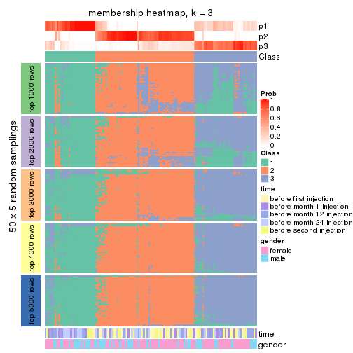</p>

</div>
<div id='tab-MAD-skmeans-membership-heatmap-3'>
<pre><code class="r">membership_heatmap(res, k = 4)
</code></pre>

<p></p>

</div>
<div id='tab-MAD-skmeans-membership-heatmap-4'>
<pre><code class="r">membership_heatmap(res, k = 5)
</code></pre>

<p></p>

</div>
<div id='tab-MAD-skmeans-membership-heatmap-5'>
<pre><code class="r">membership_heatmap(res, k = 6)
</code></pre>

<p></p>

</div>
</div>

As soon as we have had the classes for columns, we can look for signatures
which are significantly different between classes which can be candidate marks
for certain classes. Following are the heatmaps for signatures.


Signature heatmaps where rows are scaled:


<script>
$( function() {
	$( '#tabs-MAD-skmeans-get-signatures' ).tabs();
} );
</script>
<div id='tabs-MAD-skmeans-get-signatures'>
<ul>
<li><a href='#tab-MAD-skmeans-get-signatures-1'>k = 2</a></li>
<li><a href='#tab-MAD-skmeans-get-signatures-2'>k = 3</a></li>
<li><a href='#tab-MAD-skmeans-get-signatures-3'>k = 4</a></li>
<li><a href='#tab-MAD-skmeans-get-signatures-4'>k = 5</a></li>
<li><a href='#tab-MAD-skmeans-get-signatures-5'>k = 6</a></li>
</ul>
<div id='tab-MAD-skmeans-get-signatures-1'>
<pre><code class="r">get_signatures(res, k = 2)
</code></pre>

<p></p>

</div>
<div id='tab-MAD-skmeans-get-signatures-2'>
<pre><code class="r">get_signatures(res, k = 3)
</code></pre>

<p></p>

</div>
<div id='tab-MAD-skmeans-get-signatures-3'>
<pre><code class="r">get_signatures(res, k = 4)
</code></pre>

<p></p>

</div>
<div id='tab-MAD-skmeans-get-signatures-4'>
<pre><code class="r">get_signatures(res, k = 5)
</code></pre>

<p></p>

</div>
<div id='tab-MAD-skmeans-get-signatures-5'>
<pre><code class="r">get_signatures(res, k = 6)
</code></pre>

<p></p>

</div>
</div>


Signature heatmaps where rows are not scaled:


<script>
$( function() {
	$( '#tabs-MAD-skmeans-get-signatures-no-scale' ).tabs();
} );
</script>
<div id='tabs-MAD-skmeans-get-signatures-no-scale'>
<ul>
<li><a href='#tab-MAD-skmeans-get-signatures-no-scale-1'>k = 2</a></li>
<li><a href='#tab-MAD-skmeans-get-signatures-no-scale-2'>k = 3</a></li>
<li><a href='#tab-MAD-skmeans-get-signatures-no-scale-3'>k = 4</a></li>
<li><a href='#tab-MAD-skmeans-get-signatures-no-scale-4'>k = 5</a></li>
<li><a href='#tab-MAD-skmeans-get-signatures-no-scale-5'>k = 6</a></li>
</ul>
<div id='tab-MAD-skmeans-get-signatures-no-scale-1'>
<pre><code class="r">get_signatures(res, k = 2, scale_rows = FALSE)
</code></pre>

<p></p>

</div>
<div id='tab-MAD-skmeans-get-signatures-no-scale-2'>
<pre><code class="r">get_signatures(res, k = 3, scale_rows = FALSE)
</code></pre>

<p></p>

</div>
<div id='tab-MAD-skmeans-get-signatures-no-scale-3'>
<pre><code class="r">get_signatures(res, k = 4, scale_rows = FALSE)
</code></pre>

<p></p>

</div>
<div id='tab-MAD-skmeans-get-signatures-no-scale-4'>
<pre><code class="r">get_signatures(res, k = 5, scale_rows = FALSE)
</code></pre>

<p></p>

</div>
<div id='tab-MAD-skmeans-get-signatures-no-scale-5'>
<pre><code class="r">get_signatures(res, k = 6, scale_rows = FALSE)
</code></pre>

<p></p>

</div>
</div>


Compare the overlap of signatures from different k:

```r
compare_signatures(res)
```


`get_signature()` returns a data frame invisibly. TO get the list of signatures, the function
call should be assigned to a variable explicitly. In following code, if `plot` argument is set
to `FALSE`, no heatmap is plotted while only the differential analysis is performed.

```r
# code only for demonstration
tb = get_signature(res, k = ..., plot = FALSE)
```

An example of the output of `tb` is:

```
#>   which_row         fdr    mean_1    mean_2 scaled_mean_1 scaled_mean_2 km
#> 1        38 0.042760348  8.373488  9.131774    -0.5533452     0.5164555  1
#> 2        40 0.018707592  7.106213  8.469186    -0.6173731     0.5762149  1
#> 3        55 0.019134737 10.221463 11.207825    -0.6159697     0.5749050  1
#> 4        59 0.006059896  5.921854  7.869574    -0.6899429     0.6439467  1
#> 5        60 0.018055526  8.928898 10.211722    -0.6204761     0.5791110  1
#> 6        98 0.009384629 15.714769 14.887706     0.6635654    -0.6193277  2
...
```

The columns in `tb` are:

1. `which_row`: row indices corresponding to the input matrix.
2. `fdr`: FDR for the differential test. 
3. `mean_x`: The mean value in group x.
4. `scaled_mean_x`: The mean value in group x after rows are scaled.
5. `km`: Row groups if k-means clustering is applied to rows.


UMAP plot which shows how samples are separated.


<script>
$( function() {
	$( '#tabs-MAD-skmeans-dimension-reduction' ).tabs();
} );
</script>
<div id='tabs-MAD-skmeans-dimension-reduction'>
<ul>
<li><a href='#tab-MAD-skmeans-dimension-reduction-1'>k = 2</a></li>
<li><a href='#tab-MAD-skmeans-dimension-reduction-2'>k = 3</a></li>
<li><a href='#tab-MAD-skmeans-dimension-reduction-3'>k = 4</a></li>
<li><a href='#tab-MAD-skmeans-dimension-reduction-4'>k = 5</a></li>
<li><a href='#tab-MAD-skmeans-dimension-reduction-5'>k = 6</a></li>
</ul>
<div id='tab-MAD-skmeans-dimension-reduction-1'>
<pre><code class="r">dimension_reduction(res, k = 2, method = &quot;UMAP&quot;)
</code></pre>

<p></p>

</div>
<div id='tab-MAD-skmeans-dimension-reduction-2'>
<pre><code class="r">dimension_reduction(res, k = 3, method = &quot;UMAP&quot;)
</code></pre>

<p></p>

</div>
<div id='tab-MAD-skmeans-dimension-reduction-3'>
<pre><code class="r">dimension_reduction(res, k = 4, method = &quot;UMAP&quot;)
</code></pre>

<p></p>

</div>
<div id='tab-MAD-skmeans-dimension-reduction-4'>
<pre><code class="r">dimension_reduction(res, k = 5, method = &quot;UMAP&quot;)
</code></pre>

<p></p>

</div>
<div id='tab-MAD-skmeans-dimension-reduction-5'>
<pre><code class="r">dimension_reduction(res, k = 6, method = &quot;UMAP&quot;)
</code></pre>

<p></p>

</div>
</div>


Following heatmap shows how subgroups are split when increasing `k`:

```r
collect_classes(res)
```


Test correlation between subgroups and known annotations. If the known
annotation is numeric, one-way ANOVA test is applied, and if the known
annotation is discrete, chi-squared contingency table test is applied.

```r
test_to_known_factors(res)
```

```
#>               n time(p) gender(p) k
#> MAD:skmeans 125   0.294     0.864 2
#> MAD:skmeans 116   0.146     0.421 3
#> MAD:skmeans  88   0.108     0.299 4
#> MAD:skmeans  67   0.133     0.469 5
#> MAD:skmeans  43   0.392     0.621 6
```


If matrix rows can be associated to genes, consider to use `functional_enrichment(res,
...)` to perform function enrichment for the signature genes. See [this vignette](http://bioconductor.org/packages/devel/bioc/vignettes/cola/inst/doc/functional_enrichment.html) for more detailed explanations.


 

---------------------------------------------------


### MAD:pam


The object with results only for a single top-value method and a single partition method 
can be extracted as:

```r
res = res_list["MAD", "pam"]
# you can also extract it by
# res = res_list["MAD:pam"]
```

A summary of `res` and all the functions that can be applied to it:

```r
res
```

```
#> A 'ConsensusPartition' object with k = 2, 3, 4, 5, 6.
#>   On a matrix with 21512 rows and 125 columns.
#>   Top rows (1000, 2000, 3000, 4000, 5000) are extracted by 'MAD' method.
#>   Subgroups are detected by 'pam' method.
#>   Performed in total 1250 partitions by row resampling.
#>   Best k for subgroups seems to be 4.
#> 
#> Following methods can be applied to this 'ConsensusPartition' object:
#>  [1] "cola_report"             "collect_classes"         "collect_plots"          
#>  [4] "collect_stats"           "colnames"                "compare_signatures"     
#>  [7] "consensus_heatmap"       "dimension_reduction"     "functional_enrichment"  
#> [10] "get_anno_col"            "get_anno"                "get_classes"            
#> [13] "get_consensus"           "get_matrix"              "get_membership"         
#> [16] "get_param"               "get_signatures"          "get_stats"              
#> [19] "is_best_k"               "is_stable_k"             "membership_heatmap"     
#> [22] "ncol"                    "nrow"                    "plot_ecdf"              
#> [25] "rownames"                "select_partition_number" "show"                   
#> [28] "suggest_best_k"          "test_to_known_factors"
```

`collect_plots()` function collects all the plots made from `res` for all `k` (number of partitions)
into one single page to provide an easy and fast comparison between different `k`.

```r
collect_plots(res)
```


The plots are:

- The first row: a plot of the ECDF (empirical cumulative distribution
  function) curves of the consensus matrix for each `k` and the heatmap of
  predicted classes for each `k`.
- The second row: heatmaps of the consensus matrix for each `k`.
- The third row: heatmaps of the membership matrix for each `k`.
- The fouth row: heatmaps of the signatures for each `k`.

All the plots in panels can be made by individual functions and they are
plotted later in this section.

`select_partition_number()` produces several plots showing different
statistics for choosing "optimized" `k`. There are following statistics:

- ECDF curves of the consensus matrix for each `k`;
- 1-PAC. [The PAC
  score](https://en.wikipedia.org/wiki/Consensus_clustering#Over-interpretation_potential_of_consensus_clustering)
  measures the proportion of the ambiguous subgrouping.
- Mean silhouette score.
- Concordance. The mean probability of fiting the consensus class ids in all
  partitions.
- Area increased. Denote $A_k$ as the area under the ECDF curve for current
  `k`, the area increased is defined as $A_k - A_{k-1}$.
- Rand index. The percent of pairs of samples that are both in a same cluster
  or both are not in a same cluster in the partition of k and k-1.
- Jaccard index. The ratio of pairs of samples are both in a same cluster in
  the partition of k and k-1 and the pairs of samples are both in a same
  cluster in the partition k or k-1.

The detailed explanations of these statistics can be found in [the _cola_
vignette](http://bioconductor.org/packages/devel/bioc/vignettes/cola/inst/doc/cola.html#toc_13).

Generally speaking, lower PAC score, higher mean silhouette score or higher
concordance corresponds to better partition. Rand index and Jaccard index
measure how similar the current partition is compared to partition with `k-1`.
If they are too similar, we won't accept `k` is better than `k-1`.

```r
select_partition_number(res)
```


The numeric values for all these statistics can be obtained by `get_stats()`.

```r
get_stats(res)
```

```
#>   k 1-PAC mean_silhouette concordance area_increased  Rand Jaccard
#> 2 2 0.444           0.799       0.896         0.3856 0.632   0.632
#> 3 3 0.273           0.664       0.800         0.5456 0.761   0.625
#> 4 4 0.484           0.667       0.823         0.1720 0.879   0.710
#> 5 5 0.552           0.621       0.811         0.0679 0.934   0.795
#> 6 6 0.563           0.529       0.779         0.0321 0.990   0.963
```

`suggest_best_k()` suggests the best $k$ based on these statistics. The rules are as follows:

- All $k$ with Jaccard index larger than 0.95 are removed because increasing
  $k$ does not provide enough extra information. If all $k$ are removed, it is
  marked as no subgroup is detected.
- For all $k$ with 1-PAC score larger than 0.9, the maximal $k$ is taken as
  the best $k$, and other $k$ are marked as optional $k$.
- If it does not fit the second rule. The $k$ with the maximal vote of the
  highest 1-PAC score, highest mean silhouette, and highest concordance is
  taken as the best $k$.

```r
suggest_best_k(res)
```

```
#> [1] 4
```


Following shows the table of the partitions (You need to click the **show/hide
code output** link to see it). The membership matrix (columns with name `p*`)
is inferred by
[`clue::cl_consensus()`](https://www.rdocumentation.org/link/cl_consensus?package=clue)
function with the `SE` method. Basically the value in the membership matrix
represents the probability to belong to a certain group. The finall class
label for an item is determined with the group with highest probability it
belongs to.

In `get_classes()` function, the entropy is calculated from the membership
matrix and the silhouette score is calculated from the consensus matrix.


<script>
$( function() {
	$( '#tabs-MAD-pam-get-classes' ).tabs();
} );
</script>
<div id='tabs-MAD-pam-get-classes'>
<ul>
<li><a href='#tab-MAD-pam-get-classes-1'>k = 2</a></li>
<li><a href='#tab-MAD-pam-get-classes-2'>k = 3</a></li>
<li><a href='#tab-MAD-pam-get-classes-3'>k = 4</a></li>
<li><a href='#tab-MAD-pam-get-classes-4'>k = 5</a></li>
<li><a href='#tab-MAD-pam-get-classes-5'>k = 6</a></li>
</ul>

<div id='tab-MAD-pam-get-classes-1'>
<p><a id='tab-MAD-pam-get-classes-1-a' style='color:#0366d6' href='#'>show/hide code output</a></p>
<pre><code class="r">cbind(get_classes(res, k = 2), get_membership(res, k = 2))
</code></pre>

<pre><code>#&gt;           class entropy silhouette    p1    p2
#&gt; GSM601872     2  0.0938      0.812 0.012 0.988
#&gt; GSM601882     1  0.4815      0.846 0.896 0.104
#&gt; GSM601887     2  0.5408      0.819 0.124 0.876
#&gt; GSM601892     2  0.9522      0.598 0.372 0.628
#&gt; GSM601897     1  0.6623      0.746 0.828 0.172
#&gt; GSM601902     1  0.2778      0.890 0.952 0.048
#&gt; GSM601912     1  0.0000      0.902 1.000 0.000
#&gt; GSM601927     1  0.0000      0.902 1.000 0.000
#&gt; GSM601932     1  0.4690      0.857 0.900 0.100
#&gt; GSM601937     1  0.1414      0.898 0.980 0.020
#&gt; GSM601942     1  0.7376      0.766 0.792 0.208
#&gt; GSM601947     1  0.9710      0.285 0.600 0.400
#&gt; GSM601957     2  0.9686      0.541 0.396 0.604
#&gt; GSM601972     1  0.4690      0.857 0.900 0.100
#&gt; GSM601977     1  0.5842      0.813 0.860 0.140
#&gt; GSM601987     2  0.8555      0.672 0.280 0.720
#&gt; GSM601877     1  0.0376      0.901 0.996 0.004
#&gt; GSM601907     2  0.0000      0.807 0.000 1.000
#&gt; GSM601917     1  0.2603      0.892 0.956 0.044
#&gt; GSM601922     1  0.1184      0.900 0.984 0.016
#&gt; GSM601952     1  0.1633      0.898 0.976 0.024
#&gt; GSM601962     1  0.0672      0.901 0.992 0.008
#&gt; GSM601967     1  0.3274      0.877 0.940 0.060
#&gt; GSM601982     1  0.4562      0.852 0.904 0.096
#&gt; GSM601992     1  0.5178      0.840 0.884 0.116
#&gt; GSM601873     2  0.7453      0.757 0.212 0.788
#&gt; GSM601883     1  0.6438      0.800 0.836 0.164
#&gt; GSM601888     2  0.4298      0.824 0.088 0.912
#&gt; GSM601893     1  0.6343      0.782 0.840 0.160
#&gt; GSM601898     1  0.0672      0.900 0.992 0.008
#&gt; GSM601903     1  0.4562      0.863 0.904 0.096
#&gt; GSM601913     1  0.0000      0.902 1.000 0.000
#&gt; GSM601928     1  0.0000      0.902 1.000 0.000
#&gt; GSM601933     2  0.9323      0.585 0.348 0.652
#&gt; GSM601938     2  0.4431      0.810 0.092 0.908
#&gt; GSM601943     2  0.9896      0.408 0.440 0.560
#&gt; GSM601948     1  0.5737      0.826 0.864 0.136
#&gt; GSM601958     1  0.0000      0.902 1.000 0.000
#&gt; GSM601973     1  0.2043      0.895 0.968 0.032
#&gt; GSM601978     2  0.0000      0.807 0.000 1.000
#&gt; GSM601988     1  0.4431      0.854 0.908 0.092
#&gt; GSM601878     1  0.1414      0.896 0.980 0.020
#&gt; GSM601908     2  0.9209      0.573 0.336 0.664
#&gt; GSM601918     1  0.9909      0.159 0.556 0.444
#&gt; GSM601923     1  0.1184      0.899 0.984 0.016
#&gt; GSM601953     2  0.1414      0.814 0.020 0.980
#&gt; GSM601963     1  0.0000      0.902 1.000 0.000
#&gt; GSM601968     2  0.9522      0.608 0.372 0.628
#&gt; GSM601983     1  0.0376      0.901 0.996 0.004
#&gt; GSM601993     1  0.3431      0.872 0.936 0.064
#&gt; GSM601874     2  0.2603      0.825 0.044 0.956
#&gt; GSM601884     1  0.9286      0.495 0.656 0.344
#&gt; GSM601889     1  0.7299      0.723 0.796 0.204
#&gt; GSM601894     1  0.0376      0.901 0.996 0.004
#&gt; GSM601899     2  0.4298      0.823 0.088 0.912
#&gt; GSM601904     1  0.1184      0.899 0.984 0.016
#&gt; GSM601914     1  0.1633      0.895 0.976 0.024
#&gt; GSM601929     1  0.1414      0.896 0.980 0.020
#&gt; GSM601934     1  0.9427      0.394 0.640 0.360
#&gt; GSM601939     1  0.1414      0.896 0.980 0.020
#&gt; GSM601944     1  0.3584      0.869 0.932 0.068
#&gt; GSM601949     1  0.6887      0.747 0.816 0.184
#&gt; GSM601959     1  0.5059      0.839 0.888 0.112
#&gt; GSM601974     1  0.0376      0.901 0.996 0.004
#&gt; GSM601979     2  0.1184      0.812 0.016 0.984
#&gt; GSM601989     1  0.0000      0.902 1.000 0.000
#&gt; GSM601879     1  0.0672      0.900 0.992 0.008
#&gt; GSM601909     2  0.9129      0.658 0.328 0.672
#&gt; GSM601919     2  0.7815      0.755 0.232 0.768
#&gt; GSM601924     1  0.1184      0.898 0.984 0.016
#&gt; GSM601954     2  0.4298      0.824 0.088 0.912
#&gt; GSM601964     1  0.0000      0.902 1.000 0.000
#&gt; GSM601969     2  0.9460      0.602 0.364 0.636
#&gt; GSM601984     1  0.0000      0.902 1.000 0.000
#&gt; GSM601994     1  0.4431      0.854 0.908 0.092
#&gt; GSM601875     2  0.3584      0.826 0.068 0.932
#&gt; GSM601885     2  0.9833      0.417 0.424 0.576
#&gt; GSM601890     2  0.4431      0.823 0.092 0.908
#&gt; GSM601895     1  0.0000      0.902 1.000 0.000
#&gt; GSM601900     1  0.9044      0.472 0.680 0.320
#&gt; GSM601905     1  0.1184      0.901 0.984 0.016
#&gt; GSM601915     1  0.0000      0.902 1.000 0.000
#&gt; GSM601930     1  0.0000      0.902 1.000 0.000
#&gt; GSM601935     1  0.0000      0.902 1.000 0.000
#&gt; GSM601940     1  0.0000      0.902 1.000 0.000
#&gt; GSM601945     2  0.2778      0.824 0.048 0.952
#&gt; GSM601950     1  0.9732      0.166 0.596 0.404
#&gt; GSM601960     1  0.0000      0.902 1.000 0.000
#&gt; GSM601975     1  0.6438      0.783 0.836 0.164
#&gt; GSM601980     1  0.9754      0.209 0.592 0.408
#&gt; GSM601990     1  0.0000      0.902 1.000 0.000
#&gt; GSM601880     1  0.0376      0.901 0.996 0.004
#&gt; GSM601910     1  0.6438      0.776 0.836 0.164
#&gt; GSM601920     1  0.5408      0.828 0.876 0.124
#&gt; GSM601925     1  0.0000      0.902 1.000 0.000
#&gt; GSM601955     1  0.9000      0.468 0.684 0.316
#&gt; GSM601965     1  0.0000      0.902 1.000 0.000
#&gt; GSM601970     1  0.7815      0.663 0.768 0.232
#&gt; GSM601985     1  0.0000      0.902 1.000 0.000
#&gt; GSM601995     1  0.6973      0.740 0.812 0.188
#&gt; GSM601876     1  0.0000      0.902 1.000 0.000
#&gt; GSM601886     1  0.0000      0.902 1.000 0.000
#&gt; GSM601891     2  0.4939      0.823 0.108 0.892
#&gt; GSM601896     1  0.0000      0.902 1.000 0.000
#&gt; GSM601901     1  0.4562      0.865 0.904 0.096
#&gt; GSM601906     1  0.0672      0.900 0.992 0.008
#&gt; GSM601916     1  0.0938      0.901 0.988 0.012
#&gt; GSM601931     1  0.0000      0.902 1.000 0.000
#&gt; GSM601936     1  0.0000      0.902 1.000 0.000
#&gt; GSM601941     1  0.6712      0.803 0.824 0.176
#&gt; GSM601946     1  0.0000      0.902 1.000 0.000
#&gt; GSM601951     1  0.2236      0.893 0.964 0.036
#&gt; GSM601961     2  0.3431      0.826 0.064 0.936
#&gt; GSM601976     1  0.0000      0.902 1.000 0.000
#&gt; GSM601981     2  0.6247      0.797 0.156 0.844
#&gt; GSM601991     1  0.0000      0.902 1.000 0.000
#&gt; GSM601881     1  0.0000      0.902 1.000 0.000
#&gt; GSM601911     1  0.0376      0.901 0.996 0.004
#&gt; GSM601921     1  0.9323      0.428 0.652 0.348
#&gt; GSM601926     1  0.0376      0.901 0.996 0.004
#&gt; GSM601956     2  0.1414      0.812 0.020 0.980
#&gt; GSM601966     1  0.5629      0.837 0.868 0.132
#&gt; GSM601971     1  0.5408      0.826 0.876 0.124
#&gt; GSM601986     1  0.0000      0.902 1.000 0.000
#&gt; GSM601996     1  0.4431      0.854 0.908 0.092
</code></pre>

<script>
$('#tab-MAD-pam-get-classes-1-a').parent().next().next().hide();
$('#tab-MAD-pam-get-classes-1-a').click(function(){
  $('#tab-MAD-pam-get-classes-1-a').parent().next().next().toggle();
  return(false);
});
</script>
</div>

<div id='tab-MAD-pam-get-classes-2'>
<p><a id='tab-MAD-pam-get-classes-2-a' style='color:#0366d6' href='#'>show/hide code output</a></p>
<pre><code class="r">cbind(get_classes(res, k = 3), get_membership(res, k = 3))
</code></pre>

<pre><code>#&gt;           class entropy silhouette    p1    p2    p3
#&gt; GSM601872     3  0.0000     0.7297 0.000 0.000 1.000
#&gt; GSM601882     2  0.7633     0.6263 0.132 0.684 0.184
#&gt; GSM601887     3  0.4805     0.6847 0.012 0.176 0.812
#&gt; GSM601892     3  0.6140     0.4450 0.000 0.404 0.596
#&gt; GSM601897     2  0.4409     0.6762 0.004 0.824 0.172
#&gt; GSM601902     2  0.6379     0.4197 0.368 0.624 0.008
#&gt; GSM601912     2  0.0000     0.7894 0.000 1.000 0.000
#&gt; GSM601927     2  0.3619     0.6798 0.136 0.864 0.000
#&gt; GSM601932     2  0.7453     0.6527 0.148 0.700 0.152
#&gt; GSM601937     2  0.0892     0.7936 0.000 0.980 0.020
#&gt; GSM601942     2  0.8683     0.5180 0.172 0.592 0.236
#&gt; GSM601947     1  0.4232     0.5982 0.872 0.044 0.084
#&gt; GSM601957     3  0.8777     0.5116 0.148 0.288 0.564
#&gt; GSM601972     2  0.7666     0.6284 0.148 0.684 0.168
#&gt; GSM601977     2  0.3682     0.7692 0.008 0.876 0.116
#&gt; GSM601987     3  0.7584     0.5661 0.104 0.220 0.676
#&gt; GSM601877     1  0.5254     0.7891 0.736 0.264 0.000
#&gt; GSM601907     3  0.1529     0.7212 0.040 0.000 0.960
#&gt; GSM601917     1  0.4291     0.7590 0.820 0.180 0.000
#&gt; GSM601922     1  0.6305     0.3719 0.516 0.484 0.000
#&gt; GSM601952     2  0.3682     0.7647 0.116 0.876 0.008
#&gt; GSM601962     2  0.1585     0.7951 0.028 0.964 0.008
#&gt; GSM601967     2  0.6416     0.3519 0.304 0.676 0.020
#&gt; GSM601982     2  0.3377     0.7749 0.012 0.896 0.092
#&gt; GSM601992     2  0.6810     0.6636 0.068 0.720 0.212
#&gt; GSM601873     3  0.5688     0.6660 0.044 0.168 0.788
#&gt; GSM601883     2  0.8221     0.5511 0.128 0.624 0.248
#&gt; GSM601888     3  0.4575     0.6738 0.184 0.004 0.812
#&gt; GSM601893     2  0.4002     0.7302 0.000 0.840 0.160
#&gt; GSM601898     2  0.1163     0.7932 0.028 0.972 0.000
#&gt; GSM601903     2  0.6124     0.6769 0.220 0.744 0.036
#&gt; GSM601913     2  0.2066     0.7757 0.060 0.940 0.000
#&gt; GSM601928     1  0.6267     0.6053 0.548 0.452 0.000
#&gt; GSM601933     3  0.7338     0.5079 0.060 0.288 0.652
#&gt; GSM601938     3  0.6181     0.6631 0.156 0.072 0.772
#&gt; GSM601943     3  0.7558     0.3889 0.044 0.400 0.556
#&gt; GSM601948     1  0.3120     0.6883 0.908 0.080 0.012
#&gt; GSM601958     2  0.5968    -0.0577 0.364 0.636 0.000
#&gt; GSM601973     2  0.3966     0.7717 0.100 0.876 0.024
#&gt; GSM601978     3  0.0892     0.7286 0.020 0.000 0.980
#&gt; GSM601988     2  0.5292     0.7184 0.028 0.800 0.172
#&gt; GSM601878     1  0.4452     0.7704 0.808 0.192 0.000
#&gt; GSM601908     3  0.8779     0.4388 0.164 0.260 0.576
#&gt; GSM601918     1  0.6783     0.3939 0.736 0.088 0.176
#&gt; GSM601923     1  0.4555     0.7794 0.800 0.200 0.000
#&gt; GSM601953     3  0.0237     0.7303 0.004 0.000 0.996
#&gt; GSM601963     2  0.1529     0.7791 0.040 0.960 0.000
#&gt; GSM601968     3  0.6962     0.4426 0.020 0.412 0.568
#&gt; GSM601983     2  0.0983     0.7930 0.016 0.980 0.004
#&gt; GSM601993     2  0.5791     0.7109 0.060 0.792 0.148
#&gt; GSM601874     3  0.4615     0.7255 0.144 0.020 0.836
#&gt; GSM601884     2  0.9067     0.2197 0.140 0.476 0.384
#&gt; GSM601889     2  0.6435     0.6559 0.076 0.756 0.168
#&gt; GSM601894     2  0.0475     0.7922 0.004 0.992 0.004
#&gt; GSM601899     3  0.5235     0.6933 0.152 0.036 0.812
#&gt; GSM601904     2  0.6045     0.2955 0.380 0.620 0.000
#&gt; GSM601914     2  0.4504     0.6961 0.196 0.804 0.000
#&gt; GSM601929     1  0.5327     0.7826 0.728 0.272 0.000
#&gt; GSM601934     2  0.7015     0.3655 0.024 0.584 0.392
#&gt; GSM601939     1  0.6111     0.6247 0.604 0.396 0.000
#&gt; GSM601944     2  0.4982     0.7376 0.036 0.828 0.136
#&gt; GSM601949     1  0.5763     0.7648 0.740 0.244 0.016
#&gt; GSM601959     2  0.4446     0.7540 0.032 0.856 0.112
#&gt; GSM601974     2  0.1964     0.7865 0.056 0.944 0.000
#&gt; GSM601979     3  0.0000     0.7297 0.000 0.000 1.000
#&gt; GSM601989     2  0.0000     0.7894 0.000 1.000 0.000
#&gt; GSM601879     1  0.5291     0.7888 0.732 0.268 0.000
#&gt; GSM601909     3  0.9047     0.3050 0.344 0.148 0.508
#&gt; GSM601919     1  0.2165     0.5970 0.936 0.000 0.064
#&gt; GSM601924     1  0.5138     0.7908 0.748 0.252 0.000
#&gt; GSM601954     3  0.5355     0.6898 0.168 0.032 0.800
#&gt; GSM601964     2  0.0747     0.7927 0.016 0.984 0.000
#&gt; GSM601969     3  0.9048     0.4791 0.268 0.184 0.548
#&gt; GSM601984     2  0.0892     0.7898 0.020 0.980 0.000
#&gt; GSM601994     2  0.6388     0.6801 0.064 0.752 0.184
#&gt; GSM601875     3  0.2537     0.7384 0.000 0.080 0.920
#&gt; GSM601885     3  0.7901     0.2099 0.056 0.440 0.504
#&gt; GSM601890     3  0.4700     0.6760 0.180 0.008 0.812
#&gt; GSM601895     2  0.0000     0.7894 0.000 1.000 0.000
#&gt; GSM601900     2  0.6589     0.5524 0.032 0.688 0.280
#&gt; GSM601905     2  0.1399     0.7933 0.028 0.968 0.004
#&gt; GSM601915     2  0.2625     0.7493 0.084 0.916 0.000
#&gt; GSM601930     1  0.5760     0.7580 0.672 0.328 0.000
#&gt; GSM601935     2  0.0000     0.7894 0.000 1.000 0.000
#&gt; GSM601940     2  0.1289     0.7879 0.032 0.968 0.000
#&gt; GSM601945     3  0.4095     0.7414 0.056 0.064 0.880
#&gt; GSM601950     1  0.4964     0.7210 0.836 0.116 0.048
#&gt; GSM601960     2  0.1753     0.7831 0.048 0.952 0.000
#&gt; GSM601975     2  0.5688     0.7203 0.044 0.788 0.168
#&gt; GSM601980     2  0.9117     0.1947 0.160 0.512 0.328
#&gt; GSM601990     2  0.1163     0.7928 0.028 0.972 0.000
#&gt; GSM601880     1  0.6095     0.6948 0.608 0.392 0.000
#&gt; GSM601910     2  0.7278     0.6058 0.152 0.712 0.136
#&gt; GSM601920     1  0.7175     0.6238 0.592 0.376 0.032
#&gt; GSM601925     1  0.5650     0.7666 0.688 0.312 0.000
#&gt; GSM601955     2  0.7157     0.5026 0.056 0.668 0.276
#&gt; GSM601965     2  0.3340     0.7227 0.120 0.880 0.000
#&gt; GSM601970     1  0.7097     0.7138 0.668 0.280 0.052
#&gt; GSM601985     2  0.0424     0.7902 0.008 0.992 0.000
#&gt; GSM601995     2  0.4521     0.7154 0.004 0.816 0.180
#&gt; GSM601876     2  0.0000     0.7894 0.000 1.000 0.000
#&gt; GSM601886     2  0.0237     0.7908 0.004 0.996 0.000
#&gt; GSM601891     3  0.5357     0.7040 0.064 0.116 0.820
#&gt; GSM601896     2  0.0000     0.7894 0.000 1.000 0.000
#&gt; GSM601901     2  0.6968     0.6884 0.120 0.732 0.148
#&gt; GSM601906     2  0.3619     0.7276 0.136 0.864 0.000
#&gt; GSM601916     2  0.1753     0.7936 0.048 0.952 0.000
#&gt; GSM601931     1  0.6111     0.6938 0.604 0.396 0.000
#&gt; GSM601936     2  0.1170     0.7946 0.016 0.976 0.008
#&gt; GSM601941     2  0.8262     0.5261 0.304 0.592 0.104
#&gt; GSM601946     2  0.0237     0.7900 0.004 0.996 0.000
#&gt; GSM601951     1  0.3482     0.7172 0.872 0.128 0.000
#&gt; GSM601961     3  0.4602     0.7184 0.108 0.040 0.852
#&gt; GSM601976     2  0.0237     0.7907 0.004 0.996 0.000
#&gt; GSM601981     3  0.4818     0.7117 0.048 0.108 0.844
#&gt; GSM601991     2  0.0000     0.7894 0.000 1.000 0.000
#&gt; GSM601881     1  0.5497     0.7823 0.708 0.292 0.000
#&gt; GSM601911     2  0.0000     0.7894 0.000 1.000 0.000
#&gt; GSM601921     1  0.9188     0.1679 0.468 0.380 0.152
#&gt; GSM601926     1  0.5497     0.7835 0.708 0.292 0.000
#&gt; GSM601956     3  0.0237     0.7298 0.004 0.000 0.996
#&gt; GSM601966     2  0.7164     0.6807 0.140 0.720 0.140
#&gt; GSM601971     1  0.4418     0.7397 0.848 0.132 0.020
#&gt; GSM601986     2  0.1031     0.7896 0.024 0.976 0.000
#&gt; GSM601996     2  0.6728     0.6691 0.080 0.736 0.184
</code></pre>

<script>
$('#tab-MAD-pam-get-classes-2-a').parent().next().next().hide();
$('#tab-MAD-pam-get-classes-2-a').click(function(){
  $('#tab-MAD-pam-get-classes-2-a').parent().next().next().toggle();
  return(false);
});
</script>
</div>

<div id='tab-MAD-pam-get-classes-3'>
<p><a id='tab-MAD-pam-get-classes-3-a' style='color:#0366d6' href='#'>show/hide code output</a></p>
<pre><code class="r">cbind(get_classes(res, k = 4), get_membership(res, k = 4))
</code></pre>

<pre><code>#&gt;           class entropy silhouette    p1    p2    p3    p4
#&gt; GSM601872     3  0.2149     0.7264 0.000 0.088 0.912 0.000
#&gt; GSM601882     2  0.2542     0.7651 0.000 0.904 0.012 0.084
#&gt; GSM601887     3  0.0707     0.7489 0.000 0.000 0.980 0.020
#&gt; GSM601892     3  0.4836     0.4886 0.008 0.000 0.672 0.320
#&gt; GSM601897     4  0.4063     0.7039 0.004 0.016 0.172 0.808
#&gt; GSM601902     4  0.6608     0.4156 0.352 0.064 0.012 0.572
#&gt; GSM601912     4  0.0000     0.8046 0.000 0.000 0.000 1.000
#&gt; GSM601927     4  0.3024     0.7375 0.148 0.000 0.000 0.852
#&gt; GSM601932     4  0.5949    -0.0649 0.028 0.484 0.004 0.484
#&gt; GSM601937     4  0.1902     0.7998 0.000 0.064 0.004 0.932
#&gt; GSM601942     2  0.4305     0.7103 0.020 0.808 0.012 0.160
#&gt; GSM601947     1  0.5214     0.7263 0.784 0.128 0.060 0.028
#&gt; GSM601957     3  0.6330     0.4576 0.060 0.008 0.604 0.328
#&gt; GSM601972     2  0.4230     0.7064 0.008 0.776 0.004 0.212
#&gt; GSM601977     4  0.4605     0.7345 0.000 0.072 0.132 0.796
#&gt; GSM601987     2  0.3271     0.6897 0.000 0.856 0.132 0.012
#&gt; GSM601877     1  0.1557     0.8408 0.944 0.000 0.000 0.056
#&gt; GSM601907     3  0.4477     0.4758 0.000 0.312 0.688 0.000
#&gt; GSM601917     1  0.2631     0.8338 0.912 0.016 0.008 0.064
#&gt; GSM601922     1  0.5701     0.4756 0.612 0.028 0.004 0.356
#&gt; GSM601952     4  0.3568     0.7653 0.024 0.116 0.004 0.856
#&gt; GSM601962     4  0.2563     0.7950 0.020 0.072 0.000 0.908
#&gt; GSM601967     4  0.5444     0.2569 0.424 0.000 0.016 0.560
#&gt; GSM601982     4  0.4640     0.7440 0.012 0.112 0.064 0.812
#&gt; GSM601992     2  0.3047     0.7549 0.000 0.872 0.012 0.116
#&gt; GSM601873     2  0.6801     0.0591 0.000 0.452 0.452 0.096
#&gt; GSM601883     2  0.1452     0.7522 0.000 0.956 0.008 0.036
#&gt; GSM601888     3  0.0469     0.7490 0.012 0.000 0.988 0.000
#&gt; GSM601893     4  0.3356     0.7379 0.000 0.000 0.176 0.824
#&gt; GSM601898     4  0.0992     0.8085 0.012 0.004 0.008 0.976
#&gt; GSM601903     4  0.6581     0.6465 0.168 0.112 0.032 0.688
#&gt; GSM601913     4  0.2216     0.7933 0.092 0.000 0.000 0.908
#&gt; GSM601928     1  0.4406     0.6885 0.700 0.000 0.000 0.300
#&gt; GSM601933     2  0.5412     0.6671 0.000 0.736 0.168 0.096
#&gt; GSM601938     2  0.1209     0.7284 0.004 0.964 0.032 0.000
#&gt; GSM601943     3  0.8231     0.2299 0.024 0.204 0.440 0.332
#&gt; GSM601948     1  0.4567     0.7782 0.820 0.104 0.016 0.060
#&gt; GSM601958     4  0.4925     0.0413 0.428 0.000 0.000 0.572
#&gt; GSM601973     4  0.4702     0.7221 0.036 0.172 0.008 0.784
#&gt; GSM601978     3  0.4522     0.4611 0.000 0.320 0.680 0.000
#&gt; GSM601988     4  0.5165     0.0405 0.000 0.484 0.004 0.512
#&gt; GSM601878     1  0.0921     0.8280 0.972 0.000 0.000 0.028
#&gt; GSM601908     2  0.1677     0.7373 0.000 0.948 0.040 0.012
#&gt; GSM601918     2  0.7437     0.1975 0.384 0.504 0.072 0.040
#&gt; GSM601923     1  0.0921     0.8316 0.972 0.000 0.000 0.028
#&gt; GSM601953     3  0.0592     0.7469 0.000 0.016 0.984 0.000
#&gt; GSM601963     4  0.1211     0.8043 0.040 0.000 0.000 0.960
#&gt; GSM601968     3  0.4897     0.4986 0.004 0.004 0.668 0.324
#&gt; GSM601983     4  0.2413     0.7984 0.020 0.064 0.000 0.916
#&gt; GSM601993     2  0.4720     0.6125 0.000 0.672 0.004 0.324
#&gt; GSM601874     3  0.6154     0.4155 0.032 0.312 0.632 0.024
#&gt; GSM601884     2  0.1151     0.7376 0.000 0.968 0.024 0.008
#&gt; GSM601889     4  0.4767     0.6348 0.020 0.000 0.256 0.724
#&gt; GSM601894     4  0.0376     0.8065 0.004 0.000 0.004 0.992
#&gt; GSM601899     3  0.1305     0.7461 0.036 0.000 0.960 0.004
#&gt; GSM601904     4  0.5843     0.3464 0.400 0.028 0.004 0.568
#&gt; GSM601914     4  0.4554     0.7447 0.164 0.028 0.012 0.796
#&gt; GSM601929     1  0.3217     0.8338 0.860 0.000 0.012 0.128
#&gt; GSM601934     4  0.7992     0.1592 0.016 0.248 0.248 0.488
#&gt; GSM601939     1  0.4511     0.6754 0.724 0.000 0.008 0.268
#&gt; GSM601944     4  0.5050     0.1951 0.000 0.408 0.004 0.588
#&gt; GSM601949     1  0.4160     0.7904 0.808 0.008 0.016 0.168
#&gt; GSM601959     4  0.3105     0.7733 0.012 0.000 0.120 0.868
#&gt; GSM601974     4  0.1863     0.8035 0.040 0.012 0.004 0.944
#&gt; GSM601979     3  0.1022     0.7463 0.000 0.032 0.968 0.000
#&gt; GSM601989     4  0.0000     0.8046 0.000 0.000 0.000 1.000
#&gt; GSM601879     1  0.1716     0.8423 0.936 0.000 0.000 0.064
#&gt; GSM601909     3  0.7207     0.2613 0.364 0.008 0.512 0.116
#&gt; GSM601919     1  0.1305     0.8045 0.960 0.036 0.004 0.000
#&gt; GSM601924     1  0.2011     0.8479 0.920 0.000 0.000 0.080
#&gt; GSM601954     3  0.1863     0.7430 0.040 0.012 0.944 0.004
#&gt; GSM601964     4  0.0927     0.8075 0.008 0.016 0.000 0.976
#&gt; GSM601969     3  0.6863     0.5133 0.248 0.004 0.604 0.144
#&gt; GSM601984     4  0.0707     0.8084 0.020 0.000 0.000 0.980
#&gt; GSM601994     2  0.3668     0.7352 0.000 0.808 0.004 0.188
#&gt; GSM601875     3  0.1004     0.7478 0.000 0.024 0.972 0.004
#&gt; GSM601885     3  0.7456     0.2206 0.000 0.236 0.508 0.256
#&gt; GSM601890     3  0.0524     0.7501 0.008 0.000 0.988 0.004
#&gt; GSM601895     4  0.0000     0.8046 0.000 0.000 0.000 1.000
#&gt; GSM601900     4  0.5220     0.4816 0.016 0.000 0.352 0.632
#&gt; GSM601905     4  0.1369     0.8080 0.016 0.016 0.004 0.964
#&gt; GSM601915     4  0.2469     0.7764 0.108 0.000 0.000 0.892
#&gt; GSM601930     1  0.2530     0.8410 0.888 0.000 0.000 0.112
#&gt; GSM601935     4  0.0000     0.8046 0.000 0.000 0.000 1.000
#&gt; GSM601940     4  0.1557     0.8054 0.056 0.000 0.000 0.944
#&gt; GSM601945     3  0.2441     0.7389 0.004 0.068 0.916 0.012
#&gt; GSM601950     1  0.2010     0.8324 0.940 0.008 0.012 0.040
#&gt; GSM601960     4  0.1474     0.8068 0.052 0.000 0.000 0.948
#&gt; GSM601975     4  0.5102     0.7174 0.008 0.096 0.116 0.780
#&gt; GSM601980     4  0.8618     0.0701 0.036 0.252 0.304 0.408
#&gt; GSM601990     4  0.1151     0.8094 0.024 0.008 0.000 0.968
#&gt; GSM601880     1  0.3837     0.7676 0.776 0.000 0.000 0.224
#&gt; GSM601910     4  0.5276     0.6951 0.068 0.012 0.156 0.764
#&gt; GSM601920     1  0.6333     0.6498 0.656 0.040 0.036 0.268
#&gt; GSM601925     1  0.2149     0.8438 0.912 0.000 0.000 0.088
#&gt; GSM601955     4  0.6346     0.5218 0.040 0.032 0.284 0.644
#&gt; GSM601965     4  0.3266     0.7384 0.168 0.000 0.000 0.832
#&gt; GSM601970     1  0.5487     0.7053 0.712 0.016 0.032 0.240
#&gt; GSM601985     4  0.0469     0.8072 0.012 0.000 0.000 0.988
#&gt; GSM601995     4  0.5247     0.7011 0.004 0.112 0.120 0.764
#&gt; GSM601876     4  0.0000     0.8046 0.000 0.000 0.000 1.000
#&gt; GSM601886     4  0.0188     0.8055 0.004 0.000 0.000 0.996
#&gt; GSM601891     3  0.0712     0.7509 0.004 0.004 0.984 0.008
#&gt; GSM601896     4  0.0000     0.8046 0.000 0.000 0.000 1.000
#&gt; GSM601901     4  0.5561     0.5398 0.032 0.284 0.008 0.676
#&gt; GSM601906     4  0.3668     0.7123 0.188 0.000 0.004 0.808
#&gt; GSM601916     4  0.1629     0.8092 0.024 0.024 0.000 0.952
#&gt; GSM601931     1  0.3610     0.7915 0.800 0.000 0.000 0.200
#&gt; GSM601936     4  0.0804     0.8073 0.008 0.012 0.000 0.980
#&gt; GSM601941     2  0.6218     0.6585 0.076 0.708 0.032 0.184
#&gt; GSM601946     4  0.0188     0.8058 0.004 0.000 0.000 0.996
#&gt; GSM601951     1  0.4537     0.7762 0.824 0.088 0.016 0.072
#&gt; GSM601961     3  0.0524     0.7501 0.008 0.000 0.988 0.004
#&gt; GSM601976     4  0.0188     0.8055 0.004 0.000 0.000 0.996
#&gt; GSM601981     3  0.5747     0.5909 0.008 0.224 0.704 0.064
#&gt; GSM601991     4  0.0336     0.8056 0.000 0.008 0.000 0.992
#&gt; GSM601881     1  0.1867     0.8442 0.928 0.000 0.000 0.072
#&gt; GSM601911     4  0.0000     0.8046 0.000 0.000 0.000 1.000
#&gt; GSM601921     4  0.9189     0.0128 0.356 0.128 0.140 0.376
#&gt; GSM601926     1  0.2011     0.8464 0.920 0.000 0.000 0.080
#&gt; GSM601956     3  0.2530     0.7179 0.000 0.112 0.888 0.000
#&gt; GSM601966     2  0.5374     0.6296 0.012 0.708 0.028 0.252
#&gt; GSM601971     1  0.1509     0.8234 0.960 0.008 0.012 0.020
#&gt; GSM601986     4  0.1022     0.8086 0.032 0.000 0.000 0.968
#&gt; GSM601996     2  0.3208     0.7559 0.000 0.848 0.004 0.148
</code></pre>

<script>
$('#tab-MAD-pam-get-classes-3-a').parent().next().next().hide();
$('#tab-MAD-pam-get-classes-3-a').click(function(){
  $('#tab-MAD-pam-get-classes-3-a').parent().next().next().toggle();
  return(false);
});
</script>
</div>

<div id='tab-MAD-pam-get-classes-4'>
<p><a id='tab-MAD-pam-get-classes-4-a' style='color:#0366d6' href='#'>show/hide code output</a></p>
<pre><code class="r">cbind(get_classes(res, k = 5), get_membership(res, k = 5))
</code></pre>

<pre><code>#&gt;           class entropy silhouette    p1    p2    p3    p4    p5
#&gt; GSM601872     2  0.1732     0.7291 0.000 0.920 0.000 0.000 0.080
#&gt; GSM601882     5  0.2376     0.7288 0.000 0.000 0.052 0.044 0.904
#&gt; GSM601887     2  0.0000     0.7491 0.000 1.000 0.000 0.000 0.000
#&gt; GSM601892     2  0.4029     0.4684 0.004 0.680 0.316 0.000 0.000
#&gt; GSM601897     3  0.3527     0.6804 0.000 0.172 0.804 0.024 0.000
#&gt; GSM601902     3  0.7052    -0.3213 0.308 0.000 0.352 0.332 0.008
#&gt; GSM601912     3  0.0290     0.8042 0.000 0.000 0.992 0.008 0.000
#&gt; GSM601927     3  0.2648     0.7215 0.152 0.000 0.848 0.000 0.000
#&gt; GSM601932     4  0.5344     0.6171 0.008 0.000 0.188 0.688 0.116
#&gt; GSM601937     3  0.1915     0.7995 0.000 0.000 0.928 0.032 0.040
#&gt; GSM601942     5  0.5891     0.2633 0.000 0.000 0.120 0.328 0.552
#&gt; GSM601947     4  0.2233     0.6192 0.104 0.000 0.004 0.892 0.000
#&gt; GSM601957     2  0.6077     0.4129 0.012 0.568 0.312 0.108 0.000
#&gt; GSM601972     4  0.4863     0.5313 0.000 0.000 0.088 0.708 0.204
#&gt; GSM601977     3  0.4399     0.7162 0.004 0.136 0.792 0.032 0.036
#&gt; GSM601987     5  0.1518     0.7358 0.000 0.048 0.004 0.004 0.944
#&gt; GSM601877     1  0.0162     0.7720 0.996 0.000 0.004 0.000 0.000
#&gt; GSM601907     2  0.3895     0.4837 0.000 0.680 0.000 0.000 0.320
#&gt; GSM601917     1  0.3732     0.6800 0.792 0.000 0.032 0.176 0.000
#&gt; GSM601922     1  0.6342     0.2105 0.520 0.000 0.272 0.208 0.000
#&gt; GSM601952     4  0.4420     0.2715 0.004 0.000 0.448 0.548 0.000
#&gt; GSM601962     3  0.2955     0.7766 0.004 0.000 0.876 0.060 0.060
#&gt; GSM601967     3  0.4994     0.1528 0.464 0.016 0.512 0.008 0.000
#&gt; GSM601982     3  0.4208     0.7456 0.008 0.048 0.824 0.044 0.076
#&gt; GSM601992     5  0.0162     0.7446 0.000 0.000 0.004 0.000 0.996
#&gt; GSM601873     5  0.5799     0.1039 0.000 0.416 0.092 0.000 0.492
#&gt; GSM601883     5  0.0771     0.7454 0.000 0.000 0.004 0.020 0.976
#&gt; GSM601888     2  0.0000     0.7491 0.000 1.000 0.000 0.000 0.000
#&gt; GSM601893     3  0.2891     0.7225 0.000 0.176 0.824 0.000 0.000
#&gt; GSM601898     3  0.1331     0.8018 0.008 0.000 0.952 0.040 0.000
#&gt; GSM601903     4  0.5602     0.6286 0.072 0.016 0.252 0.656 0.004
#&gt; GSM601913     3  0.2127     0.7762 0.108 0.000 0.892 0.000 0.000
#&gt; GSM601928     1  0.3790     0.5997 0.724 0.000 0.272 0.004 0.000
#&gt; GSM601933     5  0.2914     0.7206 0.000 0.076 0.052 0.000 0.872
#&gt; GSM601938     5  0.2416     0.7089 0.000 0.012 0.000 0.100 0.888
#&gt; GSM601943     2  0.7688     0.2941 0.004 0.444 0.292 0.064 0.196
#&gt; GSM601948     4  0.4382     0.3926 0.288 0.000 0.024 0.688 0.000
#&gt; GSM601958     3  0.4390     0.1003 0.428 0.000 0.568 0.004 0.000
#&gt; GSM601973     4  0.5268     0.4924 0.024 0.000 0.368 0.588 0.020
#&gt; GSM601978     2  0.4238     0.3898 0.000 0.628 0.000 0.004 0.368
#&gt; GSM601988     5  0.4375     0.1477 0.000 0.000 0.420 0.004 0.576
#&gt; GSM601878     1  0.0162     0.7720 0.996 0.000 0.004 0.000 0.000
#&gt; GSM601908     5  0.1197     0.7382 0.000 0.000 0.000 0.048 0.952
#&gt; GSM601918     4  0.3570     0.6113 0.124 0.000 0.004 0.828 0.044
#&gt; GSM601923     1  0.0162     0.7705 0.996 0.000 0.000 0.004 0.000
#&gt; GSM601953     2  0.0000     0.7491 0.000 1.000 0.000 0.000 0.000
#&gt; GSM601963     3  0.1205     0.8019 0.040 0.000 0.956 0.004 0.000
#&gt; GSM601968     2  0.4503     0.4824 0.000 0.664 0.312 0.024 0.000
#&gt; GSM601983     3  0.2665     0.7906 0.020 0.000 0.900 0.032 0.048
#&gt; GSM601993     5  0.4086     0.5397 0.000 0.000 0.240 0.024 0.736
#&gt; GSM601874     2  0.6652     0.3528 0.004 0.532 0.008 0.232 0.224
#&gt; GSM601884     5  0.0609     0.7414 0.000 0.000 0.000 0.020 0.980
#&gt; GSM601889     3  0.4482     0.5857 0.004 0.252 0.712 0.032 0.000
#&gt; GSM601894     3  0.0451     0.8052 0.000 0.004 0.988 0.008 0.000
#&gt; GSM601899     2  0.1408     0.7398 0.008 0.948 0.000 0.044 0.000
#&gt; GSM601904     3  0.6357     0.1812 0.288 0.000 0.512 0.200 0.000
#&gt; GSM601914     3  0.4959     0.6715 0.108 0.000 0.736 0.144 0.012
#&gt; GSM601929     1  0.2740     0.7656 0.876 0.000 0.096 0.028 0.000
#&gt; GSM601934     3  0.6581     0.0727 0.000 0.228 0.456 0.000 0.316
#&gt; GSM601939     1  0.4026     0.5684 0.736 0.000 0.244 0.020 0.000
#&gt; GSM601944     3  0.4287     0.0800 0.000 0.000 0.540 0.000 0.460
#&gt; GSM601949     1  0.4961     0.6688 0.724 0.004 0.132 0.140 0.000
#&gt; GSM601959     3  0.2932     0.7610 0.004 0.112 0.864 0.020 0.000
#&gt; GSM601974     3  0.2416     0.7759 0.012 0.000 0.888 0.100 0.000
#&gt; GSM601979     2  0.0510     0.7479 0.000 0.984 0.000 0.000 0.016
#&gt; GSM601989     3  0.0000     0.8018 0.000 0.000 1.000 0.000 0.000
#&gt; GSM601879     1  0.0404     0.7749 0.988 0.000 0.012 0.000 0.000
#&gt; GSM601909     2  0.7156     0.2622 0.352 0.480 0.076 0.088 0.004
#&gt; GSM601919     1  0.4138     0.3472 0.616 0.000 0.000 0.384 0.000
#&gt; GSM601924     1  0.1357     0.7822 0.948 0.000 0.048 0.004 0.000
#&gt; GSM601954     2  0.2818     0.7010 0.012 0.856 0.000 0.132 0.000
#&gt; GSM601964     3  0.1399     0.8043 0.000 0.000 0.952 0.028 0.020
#&gt; GSM601969     2  0.6992     0.4791 0.164 0.588 0.136 0.112 0.000
#&gt; GSM601984     3  0.0510     0.8054 0.016 0.000 0.984 0.000 0.000
#&gt; GSM601994     5  0.1732     0.7290 0.000 0.000 0.080 0.000 0.920
#&gt; GSM601875     2  0.0324     0.7496 0.000 0.992 0.004 0.000 0.004
#&gt; GSM601885     2  0.7351     0.2569 0.000 0.488 0.252 0.056 0.204
#&gt; GSM601890     2  0.0000     0.7491 0.000 1.000 0.000 0.000 0.000
#&gt; GSM601895     3  0.0000     0.8018 0.000 0.000 1.000 0.000 0.000
#&gt; GSM601900     3  0.4341     0.4708 0.008 0.364 0.628 0.000 0.000
#&gt; GSM601905     3  0.1364     0.8045 0.000 0.000 0.952 0.036 0.012
#&gt; GSM601915     3  0.2230     0.7593 0.116 0.000 0.884 0.000 0.000
#&gt; GSM601930     1  0.1270     0.7812 0.948 0.000 0.052 0.000 0.000
#&gt; GSM601935     3  0.0404     0.8046 0.000 0.000 0.988 0.012 0.000
#&gt; GSM601940     3  0.1341     0.8012 0.056 0.000 0.944 0.000 0.000
#&gt; GSM601945     2  0.2679     0.7146 0.004 0.884 0.004 0.096 0.012
#&gt; GSM601950     1  0.2921     0.7432 0.856 0.000 0.020 0.124 0.000
#&gt; GSM601960     3  0.1557     0.8026 0.052 0.000 0.940 0.008 0.000
#&gt; GSM601975     3  0.5867     0.6117 0.008 0.092 0.708 0.124 0.068
#&gt; GSM601980     4  0.5165     0.6142 0.000 0.072 0.092 0.752 0.084
#&gt; GSM601990     3  0.1830     0.8019 0.012 0.000 0.932 0.052 0.004
#&gt; GSM601880     1  0.2891     0.7106 0.824 0.000 0.176 0.000 0.000
#&gt; GSM601910     3  0.5381     0.6105 0.012 0.144 0.708 0.132 0.004
#&gt; GSM601920     1  0.6511     0.4359 0.588 0.036 0.236 0.140 0.000
#&gt; GSM601925     1  0.0880     0.7812 0.968 0.000 0.032 0.000 0.000
#&gt; GSM601955     3  0.6657     0.2880 0.012 0.204 0.544 0.236 0.004
#&gt; GSM601965     3  0.3003     0.7083 0.188 0.000 0.812 0.000 0.000
#&gt; GSM601970     1  0.6063     0.5788 0.636 0.024 0.196 0.144 0.000
#&gt; GSM601985     3  0.0404     0.8047 0.012 0.000 0.988 0.000 0.000
#&gt; GSM601995     3  0.4979     0.6919 0.000 0.100 0.764 0.072 0.064
#&gt; GSM601876     3  0.0000     0.8018 0.000 0.000 1.000 0.000 0.000
#&gt; GSM601886     3  0.0162     0.8027 0.004 0.000 0.996 0.000 0.000
#&gt; GSM601891     2  0.0162     0.7490 0.000 0.996 0.000 0.000 0.004
#&gt; GSM601896     3  0.0000     0.8018 0.000 0.000 1.000 0.000 0.000
#&gt; GSM601901     3  0.6228     0.3560 0.004 0.004 0.588 0.196 0.208
#&gt; GSM601906     3  0.3530     0.6657 0.204 0.000 0.784 0.012 0.000
#&gt; GSM601916     3  0.2423     0.7796 0.024 0.000 0.896 0.080 0.000
#&gt; GSM601931     1  0.2806     0.7315 0.844 0.000 0.152 0.004 0.000
#&gt; GSM601936     3  0.0693     0.8060 0.000 0.000 0.980 0.008 0.012
#&gt; GSM601941     4  0.3289     0.6342 0.016 0.004 0.040 0.868 0.072
#&gt; GSM601946     3  0.0162     0.8032 0.004 0.000 0.996 0.000 0.000
#&gt; GSM601951     1  0.5039     0.1659 0.512 0.000 0.032 0.456 0.000
#&gt; GSM601961     2  0.0000     0.7491 0.000 1.000 0.000 0.000 0.000
#&gt; GSM601976     3  0.0451     0.8050 0.004 0.000 0.988 0.008 0.000
#&gt; GSM601981     2  0.5443     0.5699 0.000 0.676 0.024 0.068 0.232
#&gt; GSM601991     3  0.0609     0.8040 0.000 0.000 0.980 0.020 0.000
#&gt; GSM601881     1  0.0404     0.7764 0.988 0.000 0.012 0.000 0.000
#&gt; GSM601911     3  0.0162     0.8027 0.000 0.000 0.996 0.004 0.000
#&gt; GSM601921     4  0.6854     0.6151 0.136 0.056 0.176 0.616 0.016
#&gt; GSM601926     1  0.0703     0.7807 0.976 0.000 0.024 0.000 0.000
#&gt; GSM601956     2  0.2612     0.7082 0.000 0.868 0.000 0.008 0.124
#&gt; GSM601966     5  0.6976    -0.0155 0.000 0.020 0.192 0.344 0.444
#&gt; GSM601971     1  0.2416     0.7498 0.888 0.000 0.012 0.100 0.000
#&gt; GSM601986     3  0.0963     0.8056 0.036 0.000 0.964 0.000 0.000
#&gt; GSM601996     5  0.1205     0.7481 0.000 0.000 0.040 0.004 0.956
</code></pre>

<script>
$('#tab-MAD-pam-get-classes-4-a').parent().next().next().hide();
$('#tab-MAD-pam-get-classes-4-a').click(function(){
  $('#tab-MAD-pam-get-classes-4-a').parent().next().next().toggle();
  return(false);
});
</script>
</div>

<div id='tab-MAD-pam-get-classes-5'>
<p><a id='tab-MAD-pam-get-classes-5-a' style='color:#0366d6' href='#'>show/hide code output</a></p>
<pre><code class="r">cbind(get_classes(res, k = 6), get_membership(res, k = 6))
</code></pre>

<pre><code>#&gt;           class entropy silhouette    p1    p2    p3    p4    p5    p6
#&gt; GSM601872     2  0.1610     0.6515 0.000 0.916 0.000 0.000 0.084 0.000
#&gt; GSM601882     5  0.3485     0.7092 0.000 0.000 0.052 0.024 0.828 0.096
#&gt; GSM601887     2  0.0000     0.6704 0.000 1.000 0.000 0.000 0.000 0.000
#&gt; GSM601892     2  0.4220     0.2065 0.004 0.664 0.304 0.000 0.000 0.028
#&gt; GSM601897     3  0.4307     0.5453 0.000 0.164 0.744 0.012 0.000 0.080
#&gt; GSM601902     3  0.6902    -0.2775 0.296 0.000 0.344 0.312 0.000 0.048
#&gt; GSM601912     3  0.0291     0.7391 0.000 0.000 0.992 0.004 0.000 0.004
#&gt; GSM601927     3  0.2340     0.6640 0.148 0.000 0.852 0.000 0.000 0.000
#&gt; GSM601932     4  0.4603     0.5633 0.004 0.000 0.176 0.704 0.116 0.000
#&gt; GSM601937     3  0.2826     0.7131 0.000 0.000 0.856 0.008 0.024 0.112
#&gt; GSM601942     5  0.6814     0.2011 0.000 0.000 0.108 0.300 0.464 0.128
#&gt; GSM601947     4  0.1616     0.5745 0.048 0.000 0.000 0.932 0.000 0.020
#&gt; GSM601957     2  0.7013    -0.0760 0.000 0.452 0.264 0.108 0.000 0.176
#&gt; GSM601972     4  0.4166     0.5506 0.000 0.000 0.076 0.728 0.196 0.000
#&gt; GSM601977     3  0.4430     0.6392 0.000 0.124 0.772 0.028 0.016 0.060
#&gt; GSM601987     5  0.0692     0.7433 0.000 0.020 0.004 0.000 0.976 0.000
#&gt; GSM601877     1  0.0000     0.7392 1.000 0.000 0.000 0.000 0.000 0.000
#&gt; GSM601907     2  0.3835     0.4482 0.000 0.668 0.000 0.000 0.320 0.012
#&gt; GSM601917     1  0.3385     0.6544 0.796 0.000 0.028 0.172 0.000 0.004
#&gt; GSM601922     1  0.5968     0.1943 0.508 0.000 0.248 0.236 0.000 0.008
#&gt; GSM601952     4  0.3797     0.2138 0.000 0.000 0.420 0.580 0.000 0.000
#&gt; GSM601962     3  0.3314     0.6374 0.000 0.000 0.764 0.000 0.012 0.224
#&gt; GSM601967     3  0.5423     0.0602 0.448 0.016 0.476 0.008 0.000 0.052
#&gt; GSM601982     3  0.4137     0.6255 0.004 0.016 0.748 0.004 0.024 0.204
#&gt; GSM601992     5  0.0146     0.7419 0.000 0.000 0.000 0.000 0.996 0.004
#&gt; GSM601873     5  0.5467     0.0939 0.000 0.408 0.096 0.000 0.488 0.008
#&gt; GSM601883     5  0.1296     0.7458 0.000 0.000 0.004 0.012 0.952 0.032
#&gt; GSM601888     2  0.0000     0.6704 0.000 1.000 0.000 0.000 0.000 0.000
#&gt; GSM601893     3  0.3245     0.6337 0.000 0.172 0.800 0.000 0.000 0.028
#&gt; GSM601898     3  0.3781     0.6114 0.004 0.000 0.756 0.036 0.000 0.204
#&gt; GSM601903     4  0.5121     0.5085 0.064 0.012 0.236 0.668 0.000 0.020
#&gt; GSM601913     3  0.2573     0.7131 0.112 0.000 0.864 0.000 0.000 0.024
#&gt; GSM601928     1  0.3490     0.5311 0.724 0.000 0.268 0.008 0.000 0.000
#&gt; GSM601933     5  0.2144     0.7267 0.000 0.048 0.032 0.004 0.912 0.004
#&gt; GSM601938     5  0.2766     0.7140 0.000 0.012 0.000 0.092 0.868 0.028
#&gt; GSM601943     2  0.7586    -0.0517 0.000 0.440 0.284 0.052 0.132 0.092
#&gt; GSM601948     4  0.4886     0.3775 0.232 0.000 0.012 0.668 0.000 0.088
#&gt; GSM601958     3  0.5813     0.0136 0.308 0.000 0.504 0.004 0.000 0.184
#&gt; GSM601973     4  0.5160     0.3473 0.012 0.000 0.340 0.588 0.008 0.052
#&gt; GSM601978     2  0.3862     0.3732 0.000 0.608 0.000 0.004 0.388 0.000
#&gt; GSM601988     5  0.4715     0.0819 0.000 0.000 0.416 0.000 0.536 0.048
#&gt; GSM601878     1  0.0000     0.7392 1.000 0.000 0.000 0.000 0.000 0.000
#&gt; GSM601908     5  0.1657     0.7374 0.000 0.000 0.000 0.056 0.928 0.016
#&gt; GSM601918     4  0.3136     0.5735 0.096 0.000 0.004 0.852 0.028 0.020
#&gt; GSM601923     1  0.0000     0.7392 1.000 0.000 0.000 0.000 0.000 0.000
#&gt; GSM601953     2  0.0000     0.6704 0.000 1.000 0.000 0.000 0.000 0.000
#&gt; GSM601963     3  0.1196     0.7387 0.040 0.000 0.952 0.000 0.000 0.008
#&gt; GSM601968     2  0.4546     0.1995 0.000 0.644 0.312 0.024 0.000 0.020
#&gt; GSM601983     3  0.3321     0.6699 0.016 0.000 0.796 0.000 0.008 0.180
#&gt; GSM601993     5  0.4213     0.5660 0.000 0.000 0.160 0.004 0.744 0.092
#&gt; GSM601874     2  0.6927     0.2525 0.000 0.520 0.008 0.160 0.196 0.116
#&gt; GSM601884     5  0.2165     0.7271 0.000 0.000 0.000 0.008 0.884 0.108
#&gt; GSM601889     3  0.5349     0.4192 0.000 0.204 0.652 0.032 0.000 0.112
#&gt; GSM601894     3  0.2773     0.6806 0.000 0.004 0.836 0.008 0.000 0.152
#&gt; GSM601899     2  0.2573     0.6057 0.000 0.864 0.000 0.024 0.000 0.112
#&gt; GSM601904     3  0.5992     0.1837 0.260 0.000 0.516 0.212 0.000 0.012
#&gt; GSM601914     3  0.5835     0.3747 0.052 0.000 0.556 0.080 0.000 0.312
#&gt; GSM601929     1  0.3319     0.7094 0.836 0.000 0.096 0.016 0.000 0.052
#&gt; GSM601934     3  0.6271    -0.1104 0.000 0.216 0.420 0.004 0.352 0.008
#&gt; GSM601939     1  0.4082     0.4991 0.728 0.000 0.228 0.012 0.000 0.032
#&gt; GSM601944     3  0.4211     0.1150 0.000 0.000 0.532 0.004 0.456 0.008
#&gt; GSM601949     1  0.5882     0.5546 0.644 0.004 0.128 0.136 0.000 0.088
#&gt; GSM601959     3  0.4589     0.5773 0.000 0.088 0.720 0.016 0.000 0.176
#&gt; GSM601974     3  0.2466     0.7146 0.008 0.000 0.872 0.112 0.000 0.008
#&gt; GSM601979     2  0.0508     0.6702 0.000 0.984 0.000 0.004 0.012 0.000
#&gt; GSM601989     3  0.0000     0.7367 0.000 0.000 1.000 0.000 0.000 0.000
#&gt; GSM601879     1  0.0000     0.7392 1.000 0.000 0.000 0.000 0.000 0.000
#&gt; GSM601909     6  0.7373    -0.0375 0.212 0.340 0.040 0.040 0.000 0.368
#&gt; GSM601919     1  0.4310     0.2989 0.580 0.000 0.000 0.396 0.000 0.024
#&gt; GSM601924     1  0.0790     0.7443 0.968 0.000 0.032 0.000 0.000 0.000
#&gt; GSM601954     2  0.3405     0.5705 0.000 0.812 0.000 0.112 0.000 0.076
#&gt; GSM601964     3  0.1528     0.7394 0.000 0.000 0.936 0.016 0.000 0.048
#&gt; GSM601969     2  0.7680     0.0169 0.152 0.504 0.124 0.108 0.000 0.112
#&gt; GSM601984     3  0.0547     0.7413 0.020 0.000 0.980 0.000 0.000 0.000
#&gt; GSM601994     5  0.1141     0.7384 0.000 0.000 0.052 0.000 0.948 0.000
#&gt; GSM601875     2  0.0291     0.6706 0.000 0.992 0.004 0.000 0.004 0.000
#&gt; GSM601885     2  0.7534    -0.0342 0.000 0.452 0.236 0.076 0.192 0.044
#&gt; GSM601890     2  0.0000     0.6704 0.000 1.000 0.000 0.000 0.000 0.000
#&gt; GSM601895     3  0.0790     0.7379 0.000 0.000 0.968 0.000 0.000 0.032
#&gt; GSM601900     3  0.5863     0.1051 0.004 0.328 0.484 0.000 0.000 0.184
#&gt; GSM601905     3  0.1562     0.7422 0.000 0.000 0.940 0.032 0.004 0.024
#&gt; GSM601915     3  0.3978     0.6026 0.064 0.000 0.744 0.000 0.000 0.192
#&gt; GSM601930     1  0.0937     0.7432 0.960 0.000 0.040 0.000 0.000 0.000
#&gt; GSM601935     3  0.0935     0.7410 0.000 0.000 0.964 0.004 0.000 0.032
#&gt; GSM601940     3  0.1204     0.7388 0.056 0.000 0.944 0.000 0.000 0.000
#&gt; GSM601945     2  0.2683     0.6238 0.000 0.868 0.004 0.104 0.020 0.004
#&gt; GSM601950     1  0.4157     0.6591 0.772 0.000 0.020 0.124 0.000 0.084
#&gt; GSM601960     3  0.3884     0.6445 0.052 0.000 0.760 0.004 0.000 0.184
#&gt; GSM601975     3  0.5226     0.5510 0.000 0.072 0.696 0.140 0.092 0.000
#&gt; GSM601980     4  0.5162     0.4385 0.000 0.016 0.032 0.620 0.024 0.308
#&gt; GSM601990     3  0.3410     0.6634 0.008 0.000 0.768 0.008 0.000 0.216
#&gt; GSM601880     1  0.2527     0.6631 0.832 0.000 0.168 0.000 0.000 0.000
#&gt; GSM601910     3  0.6482     0.2481 0.000 0.092 0.528 0.120 0.000 0.260
#&gt; GSM601920     1  0.6233     0.3772 0.568 0.036 0.224 0.164 0.004 0.004
#&gt; GSM601925     1  0.0547     0.7441 0.980 0.000 0.020 0.000 0.000 0.000
#&gt; GSM601955     6  0.6267     0.0644 0.008 0.084 0.332 0.060 0.000 0.516
#&gt; GSM601965     3  0.2762     0.6442 0.196 0.000 0.804 0.000 0.000 0.000
#&gt; GSM601970     1  0.7221     0.1484 0.416 0.008 0.136 0.120 0.000 0.320
#&gt; GSM601985     3  0.0363     0.7401 0.012 0.000 0.988 0.000 0.000 0.000
#&gt; GSM601995     3  0.4777     0.5844 0.000 0.036 0.712 0.024 0.020 0.208
#&gt; GSM601876     3  0.0000     0.7367 0.000 0.000 1.000 0.000 0.000 0.000
#&gt; GSM601886     3  0.0146     0.7380 0.000 0.000 0.996 0.004 0.000 0.000
#&gt; GSM601891     2  0.0363     0.6692 0.000 0.988 0.000 0.000 0.000 0.012
#&gt; GSM601896     3  0.0000     0.7367 0.000 0.000 1.000 0.000 0.000 0.000
#&gt; GSM601901     3  0.5709     0.3189 0.000 0.004 0.568 0.204 0.220 0.004
#&gt; GSM601906     3  0.3328     0.6151 0.192 0.000 0.788 0.012 0.000 0.008
#&gt; GSM601916     3  0.2262     0.7276 0.016 0.000 0.896 0.080 0.000 0.008
#&gt; GSM601931     1  0.2260     0.6901 0.860 0.000 0.140 0.000 0.000 0.000
#&gt; GSM601936     3  0.1086     0.7433 0.000 0.000 0.964 0.012 0.012 0.012
#&gt; GSM601941     4  0.2100     0.6004 0.004 0.000 0.024 0.916 0.048 0.008
#&gt; GSM601946     3  0.0146     0.7381 0.004 0.000 0.996 0.000 0.000 0.000
#&gt; GSM601951     1  0.5837     0.1584 0.456 0.000 0.032 0.424 0.000 0.088
#&gt; GSM601961     2  0.0000     0.6704 0.000 1.000 0.000 0.000 0.000 0.000
#&gt; GSM601976     3  0.0260     0.7391 0.000 0.000 0.992 0.008 0.000 0.000
#&gt; GSM601981     2  0.4891     0.4540 0.000 0.648 0.020 0.044 0.284 0.004
#&gt; GSM601991     3  0.1556     0.7284 0.000 0.000 0.920 0.000 0.000 0.080
#&gt; GSM601881     1  0.0146     0.7409 0.996 0.000 0.004 0.000 0.000 0.000
#&gt; GSM601911     3  0.0146     0.7378 0.000 0.000 0.996 0.000 0.000 0.004
#&gt; GSM601921     4  0.5560     0.4734 0.120 0.048 0.168 0.660 0.004 0.000
#&gt; GSM601926     1  0.0547     0.7446 0.980 0.000 0.020 0.000 0.000 0.000
#&gt; GSM601956     2  0.2793     0.6244 0.000 0.856 0.000 0.004 0.112 0.028
#&gt; GSM601966     5  0.7530    -0.0465 0.000 0.024 0.168 0.344 0.368 0.096
#&gt; GSM601971     1  0.3677     0.6821 0.804 0.000 0.012 0.120 0.000 0.064
#&gt; GSM601986     3  0.0865     0.7417 0.036 0.000 0.964 0.000 0.000 0.000
#&gt; GSM601996     5  0.0692     0.7475 0.000 0.000 0.020 0.000 0.976 0.004
</code></pre>

<script>
$('#tab-MAD-pam-get-classes-5-a').parent().next().next().hide();
$('#tab-MAD-pam-get-classes-5-a').click(function(){
  $('#tab-MAD-pam-get-classes-5-a').parent().next().next().toggle();
  return(false);
});
</script>
</div>
</div>

Heatmaps for the consensus matrix. It visualizes the probability of two
samples to be in a same group.


<script>
$( function() {
	$( '#tabs-MAD-pam-consensus-heatmap' ).tabs();
} );
</script>
<div id='tabs-MAD-pam-consensus-heatmap'>
<ul>
<li><a href='#tab-MAD-pam-consensus-heatmap-1'>k = 2</a></li>
<li><a href='#tab-MAD-pam-consensus-heatmap-2'>k = 3</a></li>
<li><a href='#tab-MAD-pam-consensus-heatmap-3'>k = 4</a></li>
<li><a href='#tab-MAD-pam-consensus-heatmap-4'>k = 5</a></li>
<li><a href='#tab-MAD-pam-consensus-heatmap-5'>k = 6</a></li>
</ul>
<div id='tab-MAD-pam-consensus-heatmap-1'>
<pre><code class="r">consensus_heatmap(res, k = 2)
</code></pre>

<p></p>

</div>
<div id='tab-MAD-pam-consensus-heatmap-2'>
<pre><code class="r">consensus_heatmap(res, k = 3)
</code></pre>

<p></p>

</div>
<div id='tab-MAD-pam-consensus-heatmap-3'>
<pre><code class="r">consensus_heatmap(res, k = 4)
</code></pre>

<p></p>

</div>
<div id='tab-MAD-pam-consensus-heatmap-4'>
<pre><code class="r">consensus_heatmap(res, k = 5)
</code></pre>

<p></p>

</div>
<div id='tab-MAD-pam-consensus-heatmap-5'>
<pre><code class="r">consensus_heatmap(res, k = 6)
</code></pre>

<p></p>

</div>
</div>

Heatmaps for the membership of samples in all partitions to see how consistent they are:


<script>
$( function() {
	$( '#tabs-MAD-pam-membership-heatmap' ).tabs();
} );
</script>
<div id='tabs-MAD-pam-membership-heatmap'>
<ul>
<li><a href='#tab-MAD-pam-membership-heatmap-1'>k = 2</a></li>
<li><a href='#tab-MAD-pam-membership-heatmap-2'>k = 3</a></li>
<li><a href='#tab-MAD-pam-membership-heatmap-3'>k = 4</a></li>
<li><a href='#tab-MAD-pam-membership-heatmap-4'>k = 5</a></li>
<li><a href='#tab-MAD-pam-membership-heatmap-5'>k = 6</a></li>
</ul>
<div id='tab-MAD-pam-membership-heatmap-1'>
<pre><code class="r">membership_heatmap(res, k = 2)
</code></pre>

<p></p>

</div>
<div id='tab-MAD-pam-membership-heatmap-2'>
<pre><code class="r">membership_heatmap(res, k = 3)
</code></pre>

<p></p>

</div>
<div id='tab-MAD-pam-membership-heatmap-3'>
<pre><code class="r">membership_heatmap(res, k = 4)
</code></pre>

<p></p>

</div>
<div id='tab-MAD-pam-membership-heatmap-4'>
<pre><code class="r">membership_heatmap(res, k = 5)
</code></pre>

<p></p>

</div>
<div id='tab-MAD-pam-membership-heatmap-5'>
<pre><code class="r">membership_heatmap(res, k = 6)
</code></pre>

<p></p>

</div>
</div>

As soon as we have had the classes for columns, we can look for signatures
which are significantly different between classes which can be candidate marks
for certain classes. Following are the heatmaps for signatures.


Signature heatmaps where rows are scaled:


<script>
$( function() {
	$( '#tabs-MAD-pam-get-signatures' ).tabs();
} );
</script>
<div id='tabs-MAD-pam-get-signatures'>
<ul>
<li><a href='#tab-MAD-pam-get-signatures-1'>k = 2</a></li>
<li><a href='#tab-MAD-pam-get-signatures-2'>k = 3</a></li>
<li><a href='#tab-MAD-pam-get-signatures-3'>k = 4</a></li>
<li><a href='#tab-MAD-pam-get-signatures-4'>k = 5</a></li>
<li><a href='#tab-MAD-pam-get-signatures-5'>k = 6</a></li>
</ul>
<div id='tab-MAD-pam-get-signatures-1'>
<pre><code class="r">get_signatures(res, k = 2)
</code></pre>

<p></p>

</div>
<div id='tab-MAD-pam-get-signatures-2'>
<pre><code class="r">get_signatures(res, k = 3)
</code></pre>

<p></p>

</div>
<div id='tab-MAD-pam-get-signatures-3'>
<pre><code class="r">get_signatures(res, k = 4)
</code></pre>

<p></p>

</div>
<div id='tab-MAD-pam-get-signatures-4'>
<pre><code class="r">get_signatures(res, k = 5)
</code></pre>

<p></p>

</div>
<div id='tab-MAD-pam-get-signatures-5'>
<pre><code class="r">get_signatures(res, k = 6)
</code></pre>

<p></p>

</div>
</div>


Signature heatmaps where rows are not scaled:


<script>
$( function() {
	$( '#tabs-MAD-pam-get-signatures-no-scale' ).tabs();
} );
</script>
<div id='tabs-MAD-pam-get-signatures-no-scale'>
<ul>
<li><a href='#tab-MAD-pam-get-signatures-no-scale-1'>k = 2</a></li>
<li><a href='#tab-MAD-pam-get-signatures-no-scale-2'>k = 3</a></li>
<li><a href='#tab-MAD-pam-get-signatures-no-scale-3'>k = 4</a></li>
<li><a href='#tab-MAD-pam-get-signatures-no-scale-4'>k = 5</a></li>
<li><a href='#tab-MAD-pam-get-signatures-no-scale-5'>k = 6</a></li>
</ul>
<div id='tab-MAD-pam-get-signatures-no-scale-1'>
<pre><code class="r">get_signatures(res, k = 2, scale_rows = FALSE)
</code></pre>

<p>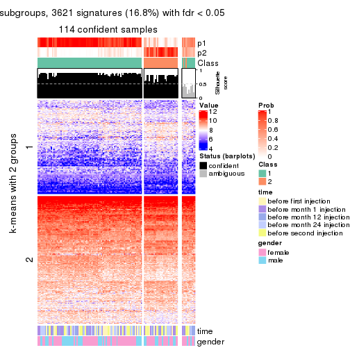</p>

</div>
<div id='tab-MAD-pam-get-signatures-no-scale-2'>
<pre><code class="r">get_signatures(res, k = 3, scale_rows = FALSE)
</code></pre>

<p></p>

</div>
<div id='tab-MAD-pam-get-signatures-no-scale-3'>
<pre><code class="r">get_signatures(res, k = 4, scale_rows = FALSE)
</code></pre>

<p></p>

</div>
<div id='tab-MAD-pam-get-signatures-no-scale-4'>
<pre><code class="r">get_signatures(res, k = 5, scale_rows = FALSE)
</code></pre>

<p></p>

</div>
<div id='tab-MAD-pam-get-signatures-no-scale-5'>
<pre><code class="r">get_signatures(res, k = 6, scale_rows = FALSE)
</code></pre>

<p></p>

</div>
</div>


Compare the overlap of signatures from different k:

```r
compare_signatures(res)
```


`get_signature()` returns a data frame invisibly. TO get the list of signatures, the function
call should be assigned to a variable explicitly. In following code, if `plot` argument is set
to `FALSE`, no heatmap is plotted while only the differential analysis is performed.

```r
# code only for demonstration
tb = get_signature(res, k = ..., plot = FALSE)
```

An example of the output of `tb` is:

```
#>   which_row         fdr    mean_1    mean_2 scaled_mean_1 scaled_mean_2 km
#> 1        38 0.042760348  8.373488  9.131774    -0.5533452     0.5164555  1
#> 2        40 0.018707592  7.106213  8.469186    -0.6173731     0.5762149  1
#> 3        55 0.019134737 10.221463 11.207825    -0.6159697     0.5749050  1
#> 4        59 0.006059896  5.921854  7.869574    -0.6899429     0.6439467  1
#> 5        60 0.018055526  8.928898 10.211722    -0.6204761     0.5791110  1
#> 6        98 0.009384629 15.714769 14.887706     0.6635654    -0.6193277  2
...
```

The columns in `tb` are:

1. `which_row`: row indices corresponding to the input matrix.
2. `fdr`: FDR for the differential test. 
3. `mean_x`: The mean value in group x.
4. `scaled_mean_x`: The mean value in group x after rows are scaled.
5. `km`: Row groups if k-means clustering is applied to rows.


UMAP plot which shows how samples are separated.


<script>
$( function() {
	$( '#tabs-MAD-pam-dimension-reduction' ).tabs();
} );
</script>
<div id='tabs-MAD-pam-dimension-reduction'>
<ul>
<li><a href='#tab-MAD-pam-dimension-reduction-1'>k = 2</a></li>
<li><a href='#tab-MAD-pam-dimension-reduction-2'>k = 3</a></li>
<li><a href='#tab-MAD-pam-dimension-reduction-3'>k = 4</a></li>
<li><a href='#tab-MAD-pam-dimension-reduction-4'>k = 5</a></li>
<li><a href='#tab-MAD-pam-dimension-reduction-5'>k = 6</a></li>
</ul>
<div id='tab-MAD-pam-dimension-reduction-1'>
<pre><code class="r">dimension_reduction(res, k = 2, method = &quot;UMAP&quot;)
</code></pre>

<p></p>

</div>
<div id='tab-MAD-pam-dimension-reduction-2'>
<pre><code class="r">dimension_reduction(res, k = 3, method = &quot;UMAP&quot;)
</code></pre>

<p></p>

</div>
<div id='tab-MAD-pam-dimension-reduction-3'>
<pre><code class="r">dimension_reduction(res, k = 4, method = &quot;UMAP&quot;)
</code></pre>

<p></p>

</div>
<div id='tab-MAD-pam-dimension-reduction-4'>
<pre><code class="r">dimension_reduction(res, k = 5, method = &quot;UMAP&quot;)
</code></pre>

<p></p>

</div>
<div id='tab-MAD-pam-dimension-reduction-5'>
<pre><code class="r">dimension_reduction(res, k = 6, method = &quot;UMAP&quot;)
</code></pre>

<p></p>

</div>
</div>


Following heatmap shows how subgroups are split when increasing `k`:

```r
collect_classes(res)
```


Test correlation between subgroups and known annotations. If the known
annotation is numeric, one-way ANOVA test is applied, and if the known
annotation is discrete, chi-squared contingency table test is applied.

```r
test_to_known_factors(res)
```

```
#>           n time(p) gender(p) k
#> MAD:pam 114   0.475    0.7129 2
#> MAD:pam 108   0.877    0.0108 3
#> MAD:pam 102   0.553    0.0831 4
#> MAD:pam  95   0.457    0.0505 5
#> MAD:pam  87   0.377    0.0455 6
```


If matrix rows can be associated to genes, consider to use `functional_enrichment(res,
...)` to perform function enrichment for the signature genes. See [this vignette](http://bioconductor.org/packages/devel/bioc/vignettes/cola/inst/doc/functional_enrichment.html) for more detailed explanations.


 

---------------------------------------------------


### MAD:mclust


The object with results only for a single top-value method and a single partition method 
can be extracted as:

```r
res = res_list["MAD", "mclust"]
# you can also extract it by
# res = res_list["MAD:mclust"]
```

A summary of `res` and all the functions that can be applied to it:

```r
res
```

```
#> A 'ConsensusPartition' object with k = 2, 3, 4, 5, 6.
#>   On a matrix with 21512 rows and 125 columns.
#>   Top rows (1000, 2000, 3000, 4000, 5000) are extracted by 'MAD' method.
#>   Subgroups are detected by 'mclust' method.
#>   Performed in total 1250 partitions by row resampling.
#>   Best k for subgroups seems to be 5.
#> 
#> Following methods can be applied to this 'ConsensusPartition' object:
#>  [1] "cola_report"             "collect_classes"         "collect_plots"          
#>  [4] "collect_stats"           "colnames"                "compare_signatures"     
#>  [7] "consensus_heatmap"       "dimension_reduction"     "functional_enrichment"  
#> [10] "get_anno_col"            "get_anno"                "get_classes"            
#> [13] "get_consensus"           "get_matrix"              "get_membership"         
#> [16] "get_param"               "get_signatures"          "get_stats"              
#> [19] "is_best_k"               "is_stable_k"             "membership_heatmap"     
#> [22] "ncol"                    "nrow"                    "plot_ecdf"              
#> [25] "rownames"                "select_partition_number" "show"                   
#> [28] "suggest_best_k"          "test_to_known_factors"
```

`collect_plots()` function collects all the plots made from `res` for all `k` (number of partitions)
into one single page to provide an easy and fast comparison between different `k`.

```r
collect_plots(res)
```


The plots are:

- The first row: a plot of the ECDF (empirical cumulative distribution
  function) curves of the consensus matrix for each `k` and the heatmap of
  predicted classes for each `k`.
- The second row: heatmaps of the consensus matrix for each `k`.
- The third row: heatmaps of the membership matrix for each `k`.
- The fouth row: heatmaps of the signatures for each `k`.

All the plots in panels can be made by individual functions and they are
plotted later in this section.

`select_partition_number()` produces several plots showing different
statistics for choosing "optimized" `k`. There are following statistics:

- ECDF curves of the consensus matrix for each `k`;
- 1-PAC. [The PAC
  score](https://en.wikipedia.org/wiki/Consensus_clustering#Over-interpretation_potential_of_consensus_clustering)
  measures the proportion of the ambiguous subgrouping.
- Mean silhouette score.
- Concordance. The mean probability of fiting the consensus class ids in all
  partitions.
- Area increased. Denote $A_k$ as the area under the ECDF curve for current
  `k`, the area increased is defined as $A_k - A_{k-1}$.
- Rand index. The percent of pairs of samples that are both in a same cluster
  or both are not in a same cluster in the partition of k and k-1.
- Jaccard index. The ratio of pairs of samples are both in a same cluster in
  the partition of k and k-1 and the pairs of samples are both in a same
  cluster in the partition k or k-1.

The detailed explanations of these statistics can be found in [the _cola_
vignette](http://bioconductor.org/packages/devel/bioc/vignettes/cola/inst/doc/cola.html#toc_13).

Generally speaking, lower PAC score, higher mean silhouette score or higher
concordance corresponds to better partition. Rand index and Jaccard index
measure how similar the current partition is compared to partition with `k-1`.
If they are too similar, we won't accept `k` is better than `k-1`.

```r
select_partition_number(res)
```


The numeric values for all these statistics can be obtained by `get_stats()`.

```r
get_stats(res)
```

```
#>   k 1-PAC mean_silhouette concordance area_increased  Rand Jaccard
#> 2 2 0.423           0.722       0.588         0.3967 0.498   0.498
#> 3 3 0.347           0.649       0.762         0.4920 0.817   0.663
#> 4 4 0.510           0.509       0.689         0.1417 0.839   0.613
#> 5 5 0.673           0.725       0.839         0.1329 0.865   0.563
#> 6 6 0.818           0.766       0.886         0.0699 0.935   0.716
```

`suggest_best_k()` suggests the best $k$ based on these statistics. The rules are as follows:

- All $k$ with Jaccard index larger than 0.95 are removed because increasing
  $k$ does not provide enough extra information. If all $k$ are removed, it is
  marked as no subgroup is detected.
- For all $k$ with 1-PAC score larger than 0.9, the maximal $k$ is taken as
  the best $k$, and other $k$ are marked as optional $k$.
- If it does not fit the second rule. The $k$ with the maximal vote of the
  highest 1-PAC score, highest mean silhouette, and highest concordance is
  taken as the best $k$.

```r
suggest_best_k(res)
```

```
#> [1] 5
```


Following shows the table of the partitions (You need to click the **show/hide
code output** link to see it). The membership matrix (columns with name `p*`)
is inferred by
[`clue::cl_consensus()`](https://www.rdocumentation.org/link/cl_consensus?package=clue)
function with the `SE` method. Basically the value in the membership matrix
represents the probability to belong to a certain group. The finall class
label for an item is determined with the group with highest probability it
belongs to.

In `get_classes()` function, the entropy is calculated from the membership
matrix and the silhouette score is calculated from the consensus matrix.


<script>
$( function() {
	$( '#tabs-MAD-mclust-get-classes' ).tabs();
} );
</script>
<div id='tabs-MAD-mclust-get-classes'>
<ul>
<li><a href='#tab-MAD-mclust-get-classes-1'>k = 2</a></li>
<li><a href='#tab-MAD-mclust-get-classes-2'>k = 3</a></li>
<li><a href='#tab-MAD-mclust-get-classes-3'>k = 4</a></li>
<li><a href='#tab-MAD-mclust-get-classes-4'>k = 5</a></li>
<li><a href='#tab-MAD-mclust-get-classes-5'>k = 6</a></li>
</ul>

<div id='tab-MAD-mclust-get-classes-1'>
<p><a id='tab-MAD-mclust-get-classes-1-a' style='color:#0366d6' href='#'>show/hide code output</a></p>
<pre><code class="r">cbind(get_classes(res, k = 2), get_membership(res, k = 2))
</code></pre>

<pre><code>#&gt;           class entropy silhouette    p1    p2
#&gt; GSM601872     2  0.9996      0.844 0.488 0.512
#&gt; GSM601882     2  0.9970      0.851 0.468 0.532
#&gt; GSM601887     1  0.1843      0.768 0.972 0.028
#&gt; GSM601892     1  0.0376      0.795 0.996 0.004
#&gt; GSM601897     1  0.1414      0.779 0.980 0.020
#&gt; GSM601902     2  0.3114      0.444 0.056 0.944
#&gt; GSM601912     1  0.0376      0.795 0.996 0.004
#&gt; GSM601927     1  0.9996      0.417 0.512 0.488
#&gt; GSM601932     2  0.9754      0.815 0.408 0.592
#&gt; GSM601937     2  0.9996      0.844 0.488 0.512
#&gt; GSM601942     2  0.9996      0.844 0.488 0.512
#&gt; GSM601947     2  0.9850      0.832 0.428 0.572
#&gt; GSM601957     1  0.0000      0.796 1.000 0.000
#&gt; GSM601972     2  0.9922      0.845 0.448 0.552
#&gt; GSM601977     2  0.9983      0.850 0.476 0.524
#&gt; GSM601987     2  0.9983      0.850 0.476 0.524
#&gt; GSM601877     1  0.9970      0.427 0.532 0.468
#&gt; GSM601907     2  0.9988      0.849 0.480 0.520
#&gt; GSM601917     2  0.3114      0.444 0.056 0.944
#&gt; GSM601922     2  0.3114      0.444 0.056 0.944
#&gt; GSM601952     2  0.9963      0.850 0.464 0.536
#&gt; GSM601962     1  0.1184      0.784 0.984 0.016
#&gt; GSM601967     1  0.0376      0.796 0.996 0.004
#&gt; GSM601982     2  0.9996      0.844 0.488 0.512
#&gt; GSM601992     2  0.9944      0.848 0.456 0.544
#&gt; GSM601873     2  0.9996      0.844 0.488 0.512
#&gt; GSM601883     2  0.9954      0.849 0.460 0.540
#&gt; GSM601888     1  0.4431      0.646 0.908 0.092
#&gt; GSM601893     1  0.0376      0.795 0.996 0.004
#&gt; GSM601898     1  0.0000      0.796 1.000 0.000
#&gt; GSM601903     2  0.3114      0.444 0.056 0.944
#&gt; GSM601913     1  0.1184      0.794 0.984 0.016
#&gt; GSM601928     1  0.9993      0.419 0.516 0.484
#&gt; GSM601933     2  0.9983      0.850 0.476 0.524
#&gt; GSM601938     2  0.9983      0.850 0.476 0.524
#&gt; GSM601943     2  0.9996      0.844 0.488 0.512
#&gt; GSM601948     1  0.2043      0.789 0.968 0.032
#&gt; GSM601958     1  0.0000      0.796 1.000 0.000
#&gt; GSM601973     2  0.8443      0.660 0.272 0.728
#&gt; GSM601978     2  0.9996      0.844 0.488 0.512
#&gt; GSM601988     2  0.9996      0.844 0.488 0.512
#&gt; GSM601878     1  0.4298      0.748 0.912 0.088
#&gt; GSM601908     2  0.9963      0.850 0.464 0.536
#&gt; GSM601918     2  0.9754      0.814 0.408 0.592
#&gt; GSM601923     1  0.9983      0.425 0.524 0.476
#&gt; GSM601953     2  0.9996      0.844 0.488 0.512
#&gt; GSM601963     1  0.0376      0.795 0.996 0.004
#&gt; GSM601968     1  0.0376      0.795 0.996 0.004
#&gt; GSM601983     1  0.0376      0.795 0.996 0.004
#&gt; GSM601993     2  0.9988      0.848 0.480 0.520
#&gt; GSM601874     2  0.9996      0.844 0.488 0.512
#&gt; GSM601884     2  0.9996      0.844 0.488 0.512
#&gt; GSM601889     1  0.0000      0.796 1.000 0.000
#&gt; GSM601894     1  0.0000      0.796 1.000 0.000
#&gt; GSM601899     1  0.1414      0.778 0.980 0.020
#&gt; GSM601904     2  0.6148      0.474 0.152 0.848
#&gt; GSM601914     1  0.0376      0.795 0.996 0.004
#&gt; GSM601929     1  0.3584      0.766 0.932 0.068
#&gt; GSM601934     2  0.9993      0.846 0.484 0.516
#&gt; GSM601939     1  0.2236      0.789 0.964 0.036
#&gt; GSM601944     2  0.9970      0.851 0.468 0.532
#&gt; GSM601949     1  0.1843      0.789 0.972 0.028
#&gt; GSM601959     1  0.0000      0.796 1.000 0.000
#&gt; GSM601974     1  0.9933     -0.736 0.548 0.452
#&gt; GSM601979     2  0.9970      0.851 0.468 0.532
#&gt; GSM601989     1  0.0000      0.796 1.000 0.000
#&gt; GSM601879     1  0.5059      0.727 0.888 0.112
#&gt; GSM601909     1  0.0376      0.795 0.996 0.004
#&gt; GSM601919     2  0.9815      0.825 0.420 0.580
#&gt; GSM601924     1  0.3274      0.772 0.940 0.060
#&gt; GSM601954     2  0.9963      0.850 0.464 0.536
#&gt; GSM601964     1  0.0376      0.795 0.996 0.004
#&gt; GSM601969     1  0.1843      0.790 0.972 0.028
#&gt; GSM601984     1  0.2236      0.787 0.964 0.036
#&gt; GSM601994     2  0.9922      0.845 0.448 0.552
#&gt; GSM601875     2  0.9977      0.850 0.472 0.528
#&gt; GSM601885     2  0.9963      0.850 0.464 0.536
#&gt; GSM601890     1  0.2603      0.742 0.956 0.044
#&gt; GSM601895     1  0.0376      0.795 0.996 0.004
#&gt; GSM601900     1  0.0000      0.796 1.000 0.000
#&gt; GSM601905     2  0.5519      0.512 0.128 0.872
#&gt; GSM601915     1  0.0000      0.796 1.000 0.000
#&gt; GSM601930     1  0.9996      0.417 0.512 0.488
#&gt; GSM601935     1  0.5294      0.578 0.880 0.120
#&gt; GSM601940     1  0.2236      0.789 0.964 0.036
#&gt; GSM601945     2  0.9988      0.848 0.480 0.520
#&gt; GSM601950     1  0.2236      0.789 0.964 0.036
#&gt; GSM601960     1  0.0376      0.795 0.996 0.004
#&gt; GSM601975     2  0.9552      0.780 0.376 0.624
#&gt; GSM601980     2  0.9996      0.844 0.488 0.512
#&gt; GSM601990     1  0.0376      0.795 0.996 0.004
#&gt; GSM601880     1  0.9996      0.417 0.512 0.488
#&gt; GSM601910     1  0.0376      0.795 0.996 0.004
#&gt; GSM601920     2  0.3114      0.444 0.056 0.944
#&gt; GSM601925     1  0.9996      0.417 0.512 0.488
#&gt; GSM601955     1  0.9970     -0.777 0.532 0.468
#&gt; GSM601965     1  0.2043      0.787 0.968 0.032
#&gt; GSM601970     1  0.0000      0.796 1.000 0.000
#&gt; GSM601985     1  0.2236      0.789 0.964 0.036
#&gt; GSM601995     2  0.9998      0.840 0.492 0.508
#&gt; GSM601876     1  0.2236      0.789 0.964 0.036
#&gt; GSM601886     2  0.9954      0.849 0.460 0.540
#&gt; GSM601891     1  0.4690      0.627 0.900 0.100
#&gt; GSM601896     1  0.2236      0.789 0.964 0.036
#&gt; GSM601901     2  0.9954      0.849 0.460 0.540
#&gt; GSM601906     1  0.9909      0.432 0.556 0.444
#&gt; GSM601916     2  0.9775      0.819 0.412 0.588
#&gt; GSM601931     1  0.9983      0.426 0.524 0.476
#&gt; GSM601936     2  0.9993      0.846 0.484 0.516
#&gt; GSM601941     2  0.5178      0.500 0.116 0.884
#&gt; GSM601946     1  0.2603      0.784 0.956 0.044
#&gt; GSM601951     1  0.4815      0.735 0.896 0.104
#&gt; GSM601961     2  0.9963      0.850 0.464 0.536
#&gt; GSM601976     2  0.9833      0.828 0.424 0.576
#&gt; GSM601981     2  0.9963      0.850 0.464 0.536
#&gt; GSM601991     1  0.0376      0.795 0.996 0.004
#&gt; GSM601881     1  0.9977      0.428 0.528 0.472
#&gt; GSM601911     2  0.9922      0.845 0.448 0.552
#&gt; GSM601921     2  0.3114      0.444 0.056 0.944
#&gt; GSM601926     1  0.9996      0.417 0.512 0.488
#&gt; GSM601956     2  0.9996      0.844 0.488 0.512
#&gt; GSM601966     2  0.9850      0.832 0.428 0.572
#&gt; GSM601971     1  0.2043      0.790 0.968 0.032
#&gt; GSM601986     1  0.4690      0.697 0.900 0.100
#&gt; GSM601996     2  0.9922      0.845 0.448 0.552
</code></pre>

<script>
$('#tab-MAD-mclust-get-classes-1-a').parent().next().next().hide();
$('#tab-MAD-mclust-get-classes-1-a').click(function(){
  $('#tab-MAD-mclust-get-classes-1-a').parent().next().next().toggle();
  return(false);
});
</script>
</div>

<div id='tab-MAD-mclust-get-classes-2'>
<p><a id='tab-MAD-mclust-get-classes-2-a' style='color:#0366d6' href='#'>show/hide code output</a></p>
<pre><code class="r">cbind(get_classes(res, k = 3), get_membership(res, k = 3))
</code></pre>

<pre><code>#&gt;           class entropy silhouette    p1    p2    p3
#&gt; GSM601872     2  0.2866     0.7333 0.076 0.916 0.008
#&gt; GSM601882     2  0.6174     0.7336 0.064 0.768 0.168
#&gt; GSM601887     1  0.7770     0.7274 0.628 0.292 0.080
#&gt; GSM601892     1  0.7306     0.7607 0.684 0.236 0.080
#&gt; GSM601897     1  0.5285     0.7369 0.752 0.244 0.004
#&gt; GSM601902     2  0.7023     0.5442 0.032 0.624 0.344
#&gt; GSM601912     1  0.5541     0.7291 0.740 0.252 0.008
#&gt; GSM601927     3  0.0747     0.8422 0.016 0.000 0.984
#&gt; GSM601932     2  0.6141     0.6591 0.032 0.736 0.232
#&gt; GSM601937     2  0.6264     0.6053 0.380 0.616 0.004
#&gt; GSM601942     2  0.3043     0.7353 0.084 0.908 0.008
#&gt; GSM601947     2  0.4887     0.6840 0.000 0.772 0.228
#&gt; GSM601957     1  0.7804     0.7584 0.664 0.216 0.120
#&gt; GSM601972     2  0.5167     0.7102 0.016 0.792 0.192
#&gt; GSM601977     2  0.2200     0.7428 0.056 0.940 0.004
#&gt; GSM601987     2  0.2384     0.7418 0.056 0.936 0.008
#&gt; GSM601877     3  0.1031     0.8389 0.024 0.000 0.976
#&gt; GSM601907     2  0.2384     0.7418 0.056 0.936 0.008
#&gt; GSM601917     2  0.7065     0.5329 0.032 0.616 0.352
#&gt; GSM601922     2  0.7085     0.5276 0.032 0.612 0.356
#&gt; GSM601952     2  0.2384     0.7464 0.056 0.936 0.008
#&gt; GSM601962     1  0.6330    -0.1409 0.600 0.396 0.004
#&gt; GSM601967     1  0.8153     0.7478 0.640 0.216 0.144
#&gt; GSM601982     2  0.3500     0.7135 0.116 0.880 0.004
#&gt; GSM601992     2  0.6349     0.7314 0.080 0.764 0.156
#&gt; GSM601873     2  0.2590     0.7403 0.072 0.924 0.004
#&gt; GSM601883     2  0.4357     0.7528 0.052 0.868 0.080
#&gt; GSM601888     2  0.8228    -0.0987 0.364 0.552 0.084
#&gt; GSM601893     1  0.7306     0.7607 0.684 0.236 0.080
#&gt; GSM601898     1  0.6895     0.7650 0.716 0.212 0.072
#&gt; GSM601903     2  0.7001     0.5494 0.032 0.628 0.340
#&gt; GSM601913     1  0.4865     0.6729 0.832 0.032 0.136
#&gt; GSM601928     3  0.0747     0.8422 0.016 0.000 0.984
#&gt; GSM601933     2  0.3183     0.7522 0.076 0.908 0.016
#&gt; GSM601938     2  0.6283     0.7287 0.064 0.760 0.176
#&gt; GSM601943     2  0.2955     0.7316 0.080 0.912 0.008
#&gt; GSM601948     1  0.7379     0.4539 0.584 0.040 0.376
#&gt; GSM601958     1  0.7330     0.7653 0.692 0.216 0.092
#&gt; GSM601973     2  0.6264     0.6503 0.032 0.724 0.244
#&gt; GSM601978     2  0.2584     0.7389 0.064 0.928 0.008
#&gt; GSM601988     2  0.6169     0.6250 0.360 0.636 0.004
#&gt; GSM601878     3  0.4261     0.7273 0.140 0.012 0.848
#&gt; GSM601908     2  0.2384     0.7418 0.056 0.936 0.008
#&gt; GSM601918     2  0.5061     0.6904 0.008 0.784 0.208
#&gt; GSM601923     3  0.0892     0.8407 0.020 0.000 0.980
#&gt; GSM601953     2  0.2584     0.7389 0.064 0.928 0.008
#&gt; GSM601963     1  0.1525     0.6646 0.964 0.032 0.004
#&gt; GSM601968     1  0.7444     0.7634 0.684 0.220 0.096
#&gt; GSM601983     1  0.1411     0.6638 0.964 0.036 0.000
#&gt; GSM601993     2  0.5873     0.6643 0.312 0.684 0.004
#&gt; GSM601874     2  0.2584     0.7389 0.064 0.928 0.008
#&gt; GSM601884     2  0.2261     0.7426 0.068 0.932 0.000
#&gt; GSM601889     1  0.7865     0.7564 0.660 0.216 0.124
#&gt; GSM601894     1  0.7741     0.7590 0.668 0.216 0.116
#&gt; GSM601899     1  0.7775     0.7192 0.620 0.304 0.076
#&gt; GSM601904     2  0.7141     0.5104 0.032 0.600 0.368
#&gt; GSM601914     1  0.1289     0.6626 0.968 0.032 0.000
#&gt; GSM601929     3  0.9484     0.2235 0.264 0.240 0.496
#&gt; GSM601934     2  0.2400     0.7460 0.064 0.932 0.004
#&gt; GSM601939     1  0.6937     0.3973 0.576 0.020 0.404
#&gt; GSM601944     2  0.4346     0.7330 0.184 0.816 0.000
#&gt; GSM601949     1  0.8834     0.7089 0.580 0.224 0.196
#&gt; GSM601959     1  0.7984     0.7534 0.652 0.216 0.132
#&gt; GSM601974     2  0.9268     0.5265 0.336 0.492 0.172
#&gt; GSM601979     2  0.2384     0.7418 0.056 0.936 0.008
#&gt; GSM601989     1  0.7543     0.7632 0.680 0.216 0.104
#&gt; GSM601879     3  0.3983     0.7318 0.144 0.004 0.852
#&gt; GSM601909     1  0.6897     0.7627 0.712 0.220 0.068
#&gt; GSM601919     2  0.5158     0.6841 0.004 0.764 0.232
#&gt; GSM601924     3  0.5763     0.5510 0.244 0.016 0.740
#&gt; GSM601954     2  0.2879     0.7449 0.052 0.924 0.024
#&gt; GSM601964     1  0.1289     0.6626 0.968 0.032 0.000
#&gt; GSM601969     1  0.8711     0.7207 0.592 0.224 0.184
#&gt; GSM601984     2  0.9877     0.2845 0.296 0.412 0.292
#&gt; GSM601994     2  0.6644     0.7212 0.092 0.748 0.160
#&gt; GSM601875     2  0.2384     0.7418 0.056 0.936 0.008
#&gt; GSM601885     2  0.2982     0.7523 0.056 0.920 0.024
#&gt; GSM601890     1  0.7825     0.7205 0.620 0.300 0.080
#&gt; GSM601895     1  0.3583     0.6964 0.900 0.056 0.044
#&gt; GSM601900     1  0.7568     0.7639 0.680 0.212 0.108
#&gt; GSM601905     2  0.6955     0.5615 0.032 0.636 0.332
#&gt; GSM601915     1  0.1877     0.6663 0.956 0.032 0.012
#&gt; GSM601930     3  0.0747     0.8422 0.016 0.000 0.984
#&gt; GSM601935     1  0.6659    -0.3372 0.532 0.460 0.008
#&gt; GSM601940     1  0.8132     0.5899 0.600 0.096 0.304
#&gt; GSM601945     2  0.2384     0.7418 0.056 0.936 0.008
#&gt; GSM601950     1  0.8767     0.7084 0.588 0.208 0.204
#&gt; GSM601960     1  0.1289     0.6626 0.968 0.032 0.000
#&gt; GSM601975     2  0.5894     0.6695 0.028 0.752 0.220
#&gt; GSM601980     2  0.6247     0.6100 0.376 0.620 0.004
#&gt; GSM601990     1  0.1289     0.6626 0.968 0.032 0.000
#&gt; GSM601880     3  0.0747     0.8422 0.016 0.000 0.984
#&gt; GSM601910     1  0.5360     0.7491 0.768 0.220 0.012
#&gt; GSM601920     2  0.7044     0.5386 0.032 0.620 0.348
#&gt; GSM601925     3  0.0747     0.8422 0.016 0.000 0.984
#&gt; GSM601955     2  0.6467     0.5991 0.388 0.604 0.008
#&gt; GSM601965     2  0.9606     0.3015 0.208 0.440 0.352
#&gt; GSM601970     1  0.7021     0.7652 0.708 0.216 0.076
#&gt; GSM601985     1  0.6303     0.6019 0.720 0.032 0.248
#&gt; GSM601995     2  0.6298     0.5975 0.388 0.608 0.004
#&gt; GSM601876     1  0.7156     0.4063 0.572 0.028 0.400
#&gt; GSM601886     2  0.7966     0.6947 0.220 0.652 0.128
#&gt; GSM601891     1  0.8085     0.6808 0.584 0.332 0.084
#&gt; GSM601896     1  0.7207     0.4379 0.584 0.032 0.384
#&gt; GSM601901     2  0.6000     0.7169 0.040 0.760 0.200
#&gt; GSM601906     3  0.7292    -0.2686 0.028 0.472 0.500
#&gt; GSM601916     2  0.6224     0.6531 0.032 0.728 0.240
#&gt; GSM601931     3  0.0747     0.8422 0.016 0.000 0.984
#&gt; GSM601936     2  0.5845     0.6673 0.308 0.688 0.004
#&gt; GSM601941     2  0.6379     0.6404 0.032 0.712 0.256
#&gt; GSM601946     1  0.6955     0.1768 0.492 0.016 0.492
#&gt; GSM601951     3  0.6247     0.6200 0.212 0.044 0.744
#&gt; GSM601961     2  0.2486     0.7407 0.060 0.932 0.008
#&gt; GSM601976     2  0.5244     0.6810 0.004 0.756 0.240
#&gt; GSM601981     2  0.2384     0.7418 0.056 0.936 0.008
#&gt; GSM601991     1  0.4002     0.5584 0.840 0.160 0.000
#&gt; GSM601881     3  0.0747     0.8422 0.016 0.000 0.984
#&gt; GSM601911     2  0.7383     0.6758 0.084 0.680 0.236
#&gt; GSM601921     2  0.7044     0.5386 0.032 0.620 0.348
#&gt; GSM601926     3  0.0747     0.8422 0.016 0.000 0.984
#&gt; GSM601956     2  0.2584     0.7389 0.064 0.928 0.008
#&gt; GSM601966     2  0.5585     0.6821 0.024 0.772 0.204
#&gt; GSM601971     1  0.8804     0.6985 0.584 0.204 0.212
#&gt; GSM601986     2  0.9282     0.3333 0.164 0.468 0.368
#&gt; GSM601996     2  0.6158     0.7142 0.052 0.760 0.188
</code></pre>

<script>
$('#tab-MAD-mclust-get-classes-2-a').parent().next().next().hide();
$('#tab-MAD-mclust-get-classes-2-a').click(function(){
  $('#tab-MAD-mclust-get-classes-2-a').parent().next().next().toggle();
  return(false);
});
</script>
</div>

<div id='tab-MAD-mclust-get-classes-3'>
<p><a id='tab-MAD-mclust-get-classes-3-a' style='color:#0366d6' href='#'>show/hide code output</a></p>
<pre><code class="r">cbind(get_classes(res, k = 4), get_membership(res, k = 4))
</code></pre>

<pre><code>#&gt;           class entropy silhouette    p1    p2    p3    p4
#&gt; GSM601872     2  0.2830     0.5321 0.000 0.900 0.040 0.060
#&gt; GSM601882     2  0.5378     0.1916 0.016 0.632 0.004 0.348
#&gt; GSM601887     3  0.3551     0.7146 0.008 0.120 0.856 0.016
#&gt; GSM601892     3  0.3507     0.7466 0.052 0.052 0.880 0.016
#&gt; GSM601897     3  0.4268     0.5865 0.004 0.232 0.760 0.004
#&gt; GSM601902     4  0.6016     0.6196 0.068 0.300 0.000 0.632
#&gt; GSM601912     3  0.4504     0.5963 0.004 0.204 0.772 0.020
#&gt; GSM601927     1  0.0336     0.8416 0.992 0.000 0.008 0.000
#&gt; GSM601932     4  0.6055     0.5993 0.052 0.372 0.000 0.576
#&gt; GSM601937     2  0.7524    -0.0317 0.000 0.408 0.184 0.408
#&gt; GSM601942     2  0.5113     0.4272 0.000 0.712 0.036 0.252
#&gt; GSM601947     4  0.6192     0.5238 0.052 0.436 0.000 0.512
#&gt; GSM601957     3  0.3088     0.7458 0.128 0.008 0.864 0.000
#&gt; GSM601972     2  0.6302    -0.3723 0.048 0.504 0.004 0.444
#&gt; GSM601977     2  0.4088     0.4651 0.000 0.764 0.004 0.232
#&gt; GSM601987     2  0.2868     0.5324 0.000 0.864 0.000 0.136
#&gt; GSM601877     1  0.0336     0.8416 0.992 0.000 0.008 0.000
#&gt; GSM601907     2  0.0524     0.5220 0.000 0.988 0.008 0.004
#&gt; GSM601917     4  0.6016     0.6196 0.068 0.300 0.000 0.632
#&gt; GSM601922     4  0.6016     0.6196 0.068 0.300 0.000 0.632
#&gt; GSM601952     2  0.4889     0.1884 0.000 0.636 0.004 0.360
#&gt; GSM601962     3  0.7558    -0.1616 0.000 0.224 0.480 0.296
#&gt; GSM601967     3  0.3448     0.7221 0.168 0.004 0.828 0.000
#&gt; GSM601982     2  0.6412     0.2506 0.004 0.616 0.084 0.296
#&gt; GSM601992     2  0.5666    -0.2806 0.016 0.520 0.004 0.460
#&gt; GSM601873     2  0.4175     0.4950 0.000 0.784 0.016 0.200
#&gt; GSM601883     2  0.5045     0.3402 0.012 0.680 0.004 0.304
#&gt; GSM601888     3  0.4820     0.5533 0.000 0.296 0.692 0.012
#&gt; GSM601893     3  0.3527     0.7296 0.024 0.088 0.872 0.016
#&gt; GSM601898     3  0.5188     0.7500 0.096 0.000 0.756 0.148
#&gt; GSM601903     4  0.6016     0.6196 0.068 0.300 0.000 0.632
#&gt; GSM601913     3  0.7247     0.6808 0.176 0.008 0.576 0.240
#&gt; GSM601928     1  0.0336     0.8416 0.992 0.000 0.008 0.000
#&gt; GSM601933     2  0.4857     0.3056 0.000 0.668 0.008 0.324
#&gt; GSM601938     2  0.5560     0.1914 0.024 0.628 0.004 0.344
#&gt; GSM601943     2  0.3463     0.5325 0.000 0.864 0.040 0.096
#&gt; GSM601948     3  0.6077     0.5924 0.300 0.036 0.644 0.020
#&gt; GSM601958     3  0.3653     0.7519 0.128 0.000 0.844 0.028
#&gt; GSM601973     4  0.6013     0.6222 0.064 0.312 0.000 0.624
#&gt; GSM601978     2  0.0524     0.5220 0.000 0.988 0.008 0.004
#&gt; GSM601988     4  0.7476    -0.0230 0.000 0.408 0.176 0.416
#&gt; GSM601878     1  0.1211     0.8221 0.960 0.000 0.040 0.000
#&gt; GSM601908     2  0.1174     0.5320 0.000 0.968 0.012 0.020
#&gt; GSM601918     4  0.6187     0.5300 0.052 0.432 0.000 0.516
#&gt; GSM601923     1  0.0336     0.8416 0.992 0.000 0.008 0.000
#&gt; GSM601953     2  0.0524     0.5220 0.000 0.988 0.008 0.004
#&gt; GSM601963     3  0.4475     0.7033 0.004 0.008 0.748 0.240
#&gt; GSM601968     3  0.2847     0.7544 0.084 0.016 0.896 0.004
#&gt; GSM601983     3  0.4295     0.7011 0.000 0.008 0.752 0.240
#&gt; GSM601993     4  0.6213     0.2603 0.000 0.464 0.052 0.484
#&gt; GSM601874     2  0.0524     0.5220 0.000 0.988 0.008 0.004
#&gt; GSM601884     2  0.2760     0.5351 0.000 0.872 0.000 0.128
#&gt; GSM601889     3  0.3224     0.7522 0.120 0.000 0.864 0.016
#&gt; GSM601894     3  0.2611     0.7556 0.096 0.000 0.896 0.008
#&gt; GSM601899     3  0.3551     0.7158 0.008 0.120 0.856 0.016
#&gt; GSM601904     4  0.6217     0.6077 0.084 0.292 0.000 0.624
#&gt; GSM601914     3  0.4228     0.7043 0.000 0.008 0.760 0.232
#&gt; GSM601929     1  0.8033     0.3291 0.572 0.076 0.224 0.128
#&gt; GSM601934     2  0.4647     0.3848 0.000 0.704 0.008 0.288
#&gt; GSM601939     3  0.7566     0.4973 0.356 0.016 0.496 0.132
#&gt; GSM601944     2  0.5024     0.2307 0.000 0.632 0.008 0.360
#&gt; GSM601949     3  0.5527     0.6471 0.256 0.024 0.700 0.020
#&gt; GSM601959     3  0.2921     0.7394 0.140 0.000 0.860 0.000
#&gt; GSM601974     2  0.8276    -0.1191 0.028 0.452 0.204 0.316
#&gt; GSM601979     2  0.0336     0.5241 0.000 0.992 0.008 0.000
#&gt; GSM601989     3  0.4488     0.7637 0.096 0.008 0.820 0.076
#&gt; GSM601879     1  0.1389     0.8159 0.952 0.000 0.048 0.000
#&gt; GSM601909     3  0.1716     0.7551 0.064 0.000 0.936 0.000
#&gt; GSM601919     4  0.6187     0.5300 0.052 0.432 0.000 0.516
#&gt; GSM601924     1  0.3808     0.6674 0.824 0.012 0.160 0.004
#&gt; GSM601954     2  0.5798    -0.2946 0.012 0.524 0.012 0.452
#&gt; GSM601964     3  0.4328     0.7000 0.000 0.008 0.748 0.244
#&gt; GSM601969     3  0.4806     0.6952 0.200 0.028 0.764 0.008
#&gt; GSM601984     4  0.9943     0.1148 0.200 0.256 0.260 0.284
#&gt; GSM601994     4  0.5864     0.3988 0.024 0.480 0.004 0.492
#&gt; GSM601875     2  0.0672     0.5275 0.000 0.984 0.008 0.008
#&gt; GSM601885     2  0.4584     0.3652 0.000 0.696 0.004 0.300
#&gt; GSM601890     3  0.3663     0.7086 0.008 0.128 0.848 0.016
#&gt; GSM601895     3  0.5340     0.7250 0.044 0.008 0.728 0.220
#&gt; GSM601900     3  0.5628     0.7408 0.132 0.000 0.724 0.144
#&gt; GSM601905     4  0.6016     0.6196 0.068 0.300 0.000 0.632
#&gt; GSM601915     3  0.5782     0.7300 0.068 0.008 0.704 0.220
#&gt; GSM601930     1  0.0336     0.8416 0.992 0.000 0.008 0.000
#&gt; GSM601935     4  0.8106     0.0532 0.008 0.336 0.264 0.392
#&gt; GSM601940     3  0.6687     0.6260 0.280 0.016 0.620 0.084
#&gt; GSM601945     2  0.0524     0.5220 0.000 0.988 0.008 0.004
#&gt; GSM601950     3  0.5437     0.6573 0.244 0.020 0.712 0.024
#&gt; GSM601960     3  0.4194     0.7051 0.000 0.008 0.764 0.228
#&gt; GSM601975     4  0.6023     0.6226 0.060 0.328 0.000 0.612
#&gt; GSM601980     2  0.7449     0.0341 0.000 0.464 0.180 0.356
#&gt; GSM601990     3  0.4391     0.6959 0.000 0.008 0.740 0.252
#&gt; GSM601880     1  0.0336     0.8416 0.992 0.000 0.008 0.000
#&gt; GSM601910     3  0.0967     0.7445 0.004 0.016 0.976 0.004
#&gt; GSM601920     4  0.6058     0.6158 0.072 0.296 0.000 0.632
#&gt; GSM601925     1  0.0336     0.8416 0.992 0.000 0.008 0.000
#&gt; GSM601955     2  0.7569     0.0138 0.000 0.436 0.196 0.368
#&gt; GSM601965     4  0.9967     0.1013 0.212 0.260 0.252 0.276
#&gt; GSM601970     3  0.2345     0.7530 0.100 0.000 0.900 0.000
#&gt; GSM601985     3  0.7834     0.5910 0.268 0.016 0.512 0.204
#&gt; GSM601995     4  0.7546    -0.0179 0.000 0.400 0.188 0.412
#&gt; GSM601876     3  0.8115     0.4953 0.340 0.060 0.492 0.108
#&gt; GSM601886     4  0.6190     0.4025 0.016 0.448 0.024 0.512
#&gt; GSM601891     3  0.4458     0.6552 0.008 0.196 0.780 0.016
#&gt; GSM601896     3  0.7643     0.5173 0.344 0.048 0.524 0.084
#&gt; GSM601901     4  0.6026     0.4343 0.032 0.468 0.004 0.496
#&gt; GSM601906     1  0.8791    -0.5298 0.344 0.336 0.040 0.280
#&gt; GSM601916     4  0.5847     0.6223 0.052 0.320 0.000 0.628
#&gt; GSM601931     1  0.0336     0.8416 0.992 0.000 0.008 0.000
#&gt; GSM601936     4  0.6615     0.1654 0.000 0.404 0.084 0.512
#&gt; GSM601941     4  0.6302     0.6025 0.068 0.368 0.000 0.564
#&gt; GSM601946     1  0.7226    -0.1583 0.512 0.016 0.376 0.096
#&gt; GSM601951     1  0.3455     0.7164 0.852 0.012 0.132 0.004
#&gt; GSM601961     2  0.5392     0.4502 0.000 0.724 0.072 0.204
#&gt; GSM601976     4  0.5954     0.6166 0.052 0.344 0.000 0.604
#&gt; GSM601981     2  0.2542     0.5359 0.000 0.904 0.012 0.084
#&gt; GSM601991     3  0.5105     0.6658 0.000 0.028 0.696 0.276
#&gt; GSM601881     1  0.0336     0.8416 0.992 0.000 0.008 0.000
#&gt; GSM601911     4  0.6022     0.4542 0.032 0.460 0.004 0.504
#&gt; GSM601921     4  0.6016     0.6196 0.068 0.300 0.000 0.632
#&gt; GSM601926     1  0.0336     0.8416 0.992 0.000 0.008 0.000
#&gt; GSM601956     2  0.0524     0.5220 0.000 0.988 0.008 0.004
#&gt; GSM601966     4  0.5843     0.4766 0.024 0.448 0.004 0.524
#&gt; GSM601971     3  0.4700     0.6942 0.208 0.016 0.764 0.012
#&gt; GSM601986     2  0.8709    -0.1902 0.236 0.408 0.044 0.312
#&gt; GSM601996     4  0.6074     0.4258 0.028 0.472 0.008 0.492
</code></pre>

<script>
$('#tab-MAD-mclust-get-classes-3-a').parent().next().next().hide();
$('#tab-MAD-mclust-get-classes-3-a').click(function(){
  $('#tab-MAD-mclust-get-classes-3-a').parent().next().next().toggle();
  return(false);
});
</script>
</div>

<div id='tab-MAD-mclust-get-classes-4'>
<p><a id='tab-MAD-mclust-get-classes-4-a' style='color:#0366d6' href='#'>show/hide code output</a></p>
<pre><code class="r">cbind(get_classes(res, k = 5), get_membership(res, k = 5))
</code></pre>

<pre><code>#&gt;           class entropy silhouette    p1    p2    p3    p4    p5
#&gt; GSM601872     2  0.2677     0.8485 0.000 0.896 0.020 0.020 0.064
#&gt; GSM601882     2  0.5370     0.4106 0.000 0.584 0.000 0.348 0.068
#&gt; GSM601887     3  0.2438     0.7777 0.000 0.060 0.900 0.000 0.040
#&gt; GSM601892     3  0.1074     0.8116 0.004 0.012 0.968 0.000 0.016
#&gt; GSM601897     3  0.3190     0.7953 0.000 0.012 0.840 0.008 0.140
#&gt; GSM601902     4  0.0451     0.8210 0.004 0.000 0.000 0.988 0.008
#&gt; GSM601912     3  0.3863     0.7641 0.000 0.020 0.792 0.012 0.176
#&gt; GSM601927     1  0.0000     0.7525 1.000 0.000 0.000 0.000 0.000
#&gt; GSM601932     4  0.1310     0.8274 0.000 0.020 0.000 0.956 0.024
#&gt; GSM601937     5  0.2124     0.8217 0.000 0.056 0.000 0.028 0.916
#&gt; GSM601942     2  0.3387     0.8158 0.000 0.836 0.008 0.024 0.132
#&gt; GSM601947     4  0.2419     0.8150 0.004 0.064 0.000 0.904 0.028
#&gt; GSM601957     3  0.1671     0.8254 0.076 0.000 0.924 0.000 0.000
#&gt; GSM601972     4  0.3608     0.7532 0.000 0.148 0.000 0.812 0.040
#&gt; GSM601977     2  0.1661     0.8641 0.000 0.940 0.000 0.024 0.036
#&gt; GSM601987     2  0.1568     0.8635 0.000 0.944 0.000 0.020 0.036
#&gt; GSM601877     1  0.0324     0.7536 0.992 0.000 0.004 0.004 0.000
#&gt; GSM601907     2  0.0451     0.8608 0.000 0.988 0.000 0.008 0.004
#&gt; GSM601917     4  0.0451     0.8210 0.004 0.000 0.000 0.988 0.008
#&gt; GSM601922     4  0.0451     0.8210 0.004 0.000 0.000 0.988 0.008
#&gt; GSM601952     2  0.3460     0.8081 0.000 0.828 0.000 0.128 0.044
#&gt; GSM601962     5  0.5365     0.3161 0.000 0.028 0.348 0.024 0.600
#&gt; GSM601967     3  0.1952     0.8238 0.084 0.004 0.912 0.000 0.000
#&gt; GSM601982     2  0.4957     0.7127 0.000 0.724 0.008 0.176 0.092
#&gt; GSM601992     4  0.4793     0.6624 0.000 0.068 0.000 0.700 0.232
#&gt; GSM601873     2  0.2707     0.8506 0.000 0.888 0.008 0.024 0.080
#&gt; GSM601883     2  0.3575     0.8193 0.000 0.824 0.000 0.120 0.056
#&gt; GSM601888     3  0.4081     0.6663 0.000 0.172 0.784 0.012 0.032
#&gt; GSM601893     3  0.1469     0.7991 0.000 0.016 0.948 0.000 0.036
#&gt; GSM601898     3  0.2238     0.8334 0.064 0.000 0.912 0.004 0.020
#&gt; GSM601903     4  0.0451     0.8210 0.004 0.000 0.000 0.988 0.008
#&gt; GSM601913     3  0.4833     0.7420 0.152 0.012 0.752 0.004 0.080
#&gt; GSM601928     1  0.0162     0.7528 0.996 0.000 0.000 0.004 0.000
#&gt; GSM601933     2  0.4676     0.7007 0.000 0.720 0.000 0.208 0.072
#&gt; GSM601938     4  0.6282     0.4362 0.000 0.248 0.000 0.536 0.216
#&gt; GSM601943     2  0.2881     0.8441 0.000 0.876 0.008 0.024 0.092
#&gt; GSM601948     1  0.5322     0.6368 0.664 0.016 0.276 0.012 0.032
#&gt; GSM601958     3  0.1928     0.8296 0.072 0.000 0.920 0.004 0.004
#&gt; GSM601973     4  0.0324     0.8239 0.004 0.000 0.000 0.992 0.004
#&gt; GSM601978     2  0.0613     0.8610 0.000 0.984 0.004 0.008 0.004
#&gt; GSM601988     5  0.2124     0.8217 0.000 0.056 0.000 0.028 0.916
#&gt; GSM601878     1  0.1780     0.7563 0.940 0.000 0.028 0.008 0.024
#&gt; GSM601908     2  0.1211     0.8688 0.000 0.960 0.000 0.024 0.016
#&gt; GSM601918     4  0.2304     0.8159 0.004 0.068 0.000 0.908 0.020
#&gt; GSM601923     1  0.0000     0.7525 1.000 0.000 0.000 0.000 0.000
#&gt; GSM601953     2  0.0854     0.8635 0.000 0.976 0.004 0.008 0.012
#&gt; GSM601963     3  0.3783     0.7501 0.000 0.012 0.768 0.004 0.216
#&gt; GSM601968     3  0.1469     0.8313 0.036 0.000 0.948 0.000 0.016
#&gt; GSM601983     3  0.3905     0.7349 0.000 0.012 0.752 0.004 0.232
#&gt; GSM601993     5  0.4649     0.5184 0.000 0.044 0.004 0.244 0.708
#&gt; GSM601874     2  0.0451     0.8608 0.000 0.988 0.000 0.008 0.004
#&gt; GSM601884     2  0.1725     0.8623 0.000 0.936 0.000 0.020 0.044
#&gt; GSM601889     3  0.1478     0.8296 0.064 0.000 0.936 0.000 0.000
#&gt; GSM601894     3  0.1478     0.8296 0.064 0.000 0.936 0.000 0.000
#&gt; GSM601899     3  0.2228     0.7849 0.000 0.048 0.912 0.000 0.040
#&gt; GSM601904     4  0.0579     0.8238 0.008 0.000 0.000 0.984 0.008
#&gt; GSM601914     3  0.3522     0.7597 0.000 0.004 0.780 0.004 0.212
#&gt; GSM601929     1  0.4610     0.7037 0.736 0.004 0.216 0.032 0.012
#&gt; GSM601934     2  0.2676     0.8470 0.000 0.884 0.000 0.036 0.080
#&gt; GSM601939     1  0.5632     0.5405 0.600 0.016 0.336 0.008 0.040
#&gt; GSM601944     2  0.5831     0.5518 0.000 0.604 0.000 0.236 0.160
#&gt; GSM601949     1  0.5594     0.5669 0.600 0.020 0.340 0.008 0.032
#&gt; GSM601959     3  0.1544     0.8284 0.068 0.000 0.932 0.000 0.000
#&gt; GSM601974     4  0.7852    -0.1977 0.000 0.072 0.236 0.364 0.328
#&gt; GSM601979     2  0.0404     0.8639 0.000 0.988 0.000 0.012 0.000
#&gt; GSM601989     3  0.2948     0.8279 0.064 0.008 0.884 0.004 0.040
#&gt; GSM601879     1  0.1799     0.7566 0.940 0.000 0.028 0.012 0.020
#&gt; GSM601909     3  0.0290     0.8189 0.000 0.000 0.992 0.000 0.008
#&gt; GSM601919     4  0.2238     0.8173 0.004 0.064 0.000 0.912 0.020
#&gt; GSM601924     1  0.4140     0.7393 0.796 0.016 0.152 0.004 0.032
#&gt; GSM601954     2  0.4615     0.6647 0.000 0.700 0.000 0.252 0.048
#&gt; GSM601964     3  0.3815     0.7466 0.000 0.012 0.764 0.004 0.220
#&gt; GSM601969     3  0.3875     0.6719 0.228 0.012 0.756 0.000 0.004
#&gt; GSM601984     1  0.8141     0.3834 0.448 0.028 0.288 0.080 0.156
#&gt; GSM601994     4  0.4666     0.6633 0.000 0.056 0.000 0.704 0.240
#&gt; GSM601875     2  0.0404     0.8641 0.000 0.988 0.000 0.012 0.000
#&gt; GSM601885     2  0.3779     0.7893 0.000 0.804 0.000 0.144 0.052
#&gt; GSM601890     3  0.2300     0.7819 0.000 0.052 0.908 0.000 0.040
#&gt; GSM601895     3  0.3493     0.8024 0.016 0.008 0.828 0.004 0.144
#&gt; GSM601900     3  0.2695     0.8361 0.052 0.004 0.896 0.004 0.044
#&gt; GSM601905     4  0.0324     0.8232 0.004 0.000 0.000 0.992 0.004
#&gt; GSM601915     3  0.3481     0.8153 0.036 0.004 0.840 0.004 0.116
#&gt; GSM601930     1  0.0000     0.7525 1.000 0.000 0.000 0.000 0.000
#&gt; GSM601935     5  0.3343     0.8068 0.000 0.040 0.068 0.028 0.864
#&gt; GSM601940     3  0.5711     0.3125 0.360 0.016 0.576 0.008 0.040
#&gt; GSM601945     2  0.0613     0.8610 0.000 0.984 0.004 0.008 0.004
#&gt; GSM601950     1  0.5560     0.5170 0.588 0.016 0.356 0.008 0.032
#&gt; GSM601960     3  0.3522     0.7597 0.000 0.004 0.780 0.004 0.212
#&gt; GSM601975     4  0.0912     0.8287 0.000 0.016 0.000 0.972 0.012
#&gt; GSM601980     5  0.2754     0.8073 0.000 0.080 0.004 0.032 0.884
#&gt; GSM601990     3  0.4764     0.3354 0.000 0.012 0.548 0.004 0.436
#&gt; GSM601880     1  0.0000     0.7525 1.000 0.000 0.000 0.000 0.000
#&gt; GSM601910     3  0.2228     0.8166 0.000 0.004 0.900 0.004 0.092
#&gt; GSM601920     4  0.0324     0.8232 0.004 0.000 0.000 0.992 0.004
#&gt; GSM601925     1  0.0000     0.7525 1.000 0.000 0.000 0.000 0.000
#&gt; GSM601955     5  0.3426     0.8177 0.000 0.068 0.040 0.032 0.860
#&gt; GSM601965     3  0.8277     0.1223 0.280 0.036 0.428 0.192 0.064
#&gt; GSM601970     3  0.1410     0.8309 0.060 0.000 0.940 0.000 0.000
#&gt; GSM601985     1  0.5711     0.4862 0.576 0.016 0.360 0.008 0.040
#&gt; GSM601995     5  0.2214     0.8222 0.000 0.052 0.004 0.028 0.916
#&gt; GSM601876     1  0.5484     0.6018 0.636 0.016 0.300 0.008 0.040
#&gt; GSM601886     4  0.5837     0.1081 0.000 0.080 0.004 0.460 0.456
#&gt; GSM601891     3  0.2927     0.7572 0.000 0.092 0.868 0.000 0.040
#&gt; GSM601896     1  0.5538     0.5867 0.624 0.016 0.312 0.008 0.040
#&gt; GSM601901     4  0.3970     0.7313 0.000 0.156 0.000 0.788 0.056
#&gt; GSM601906     1  0.6347     0.5586 0.608 0.012 0.108 0.252 0.020
#&gt; GSM601916     4  0.0771     0.8266 0.000 0.004 0.000 0.976 0.020
#&gt; GSM601931     1  0.0000     0.7525 1.000 0.000 0.000 0.000 0.000
#&gt; GSM601936     5  0.3248     0.7806 0.000 0.052 0.004 0.088 0.856
#&gt; GSM601941     4  0.1267     0.8284 0.004 0.024 0.000 0.960 0.012
#&gt; GSM601946     1  0.4916     0.7006 0.728 0.016 0.208 0.008 0.040
#&gt; GSM601951     1  0.3197     0.7527 0.852 0.000 0.116 0.008 0.024
#&gt; GSM601961     2  0.3711     0.7094 0.000 0.820 0.136 0.032 0.012
#&gt; GSM601976     4  0.1117     0.8279 0.000 0.020 0.000 0.964 0.016
#&gt; GSM601981     2  0.1251     0.8683 0.000 0.956 0.000 0.036 0.008
#&gt; GSM601991     5  0.4885     0.3463 0.000 0.016 0.332 0.016 0.636
#&gt; GSM601881     1  0.0000     0.7525 1.000 0.000 0.000 0.000 0.000
#&gt; GSM601911     4  0.4304     0.7542 0.008 0.092 0.024 0.812 0.064
#&gt; GSM601921     4  0.0451     0.8210 0.004 0.000 0.000 0.988 0.008
#&gt; GSM601926     1  0.0000     0.7525 1.000 0.000 0.000 0.000 0.000
#&gt; GSM601956     2  0.0740     0.8618 0.000 0.980 0.004 0.008 0.008
#&gt; GSM601966     4  0.2588     0.8097 0.000 0.060 0.000 0.892 0.048
#&gt; GSM601971     3  0.4548     0.6599 0.228 0.016 0.732 0.004 0.020
#&gt; GSM601986     4  0.8040     0.0952 0.268 0.044 0.192 0.456 0.040
#&gt; GSM601996     4  0.4701     0.6654 0.000 0.060 0.000 0.704 0.236
</code></pre>

<script>
$('#tab-MAD-mclust-get-classes-4-a').parent().next().next().hide();
$('#tab-MAD-mclust-get-classes-4-a').click(function(){
  $('#tab-MAD-mclust-get-classes-4-a').parent().next().next().toggle();
  return(false);
});
</script>
</div>

<div id='tab-MAD-mclust-get-classes-5'>
<p><a id='tab-MAD-mclust-get-classes-5-a' style='color:#0366d6' href='#'>show/hide code output</a></p>
<pre><code class="r">cbind(get_classes(res, k = 6), get_membership(res, k = 6))
</code></pre>

<pre><code>#&gt;           class entropy silhouette    p1    p2    p3    p4    p5    p6
#&gt; GSM601872     2  0.0405     0.9271 0.000 0.988 0.000 0.004 0.000 0.008
#&gt; GSM601882     2  0.3202     0.7775 0.000 0.800 0.000 0.176 0.024 0.000
#&gt; GSM601887     6  0.0146     0.6863 0.000 0.000 0.004 0.000 0.000 0.996
#&gt; GSM601892     6  0.0458     0.6886 0.000 0.000 0.016 0.000 0.000 0.984
#&gt; GSM601897     3  0.4389    -0.2488 0.000 0.000 0.528 0.000 0.024 0.448
#&gt; GSM601902     4  0.0146     0.8713 0.000 0.000 0.000 0.996 0.004 0.000
#&gt; GSM601912     3  0.2060     0.7569 0.000 0.000 0.900 0.000 0.016 0.084
#&gt; GSM601927     1  0.0000     0.9256 1.000 0.000 0.000 0.000 0.000 0.000
#&gt; GSM601932     4  0.0000     0.8722 0.000 0.000 0.000 1.000 0.000 0.000
#&gt; GSM601937     5  0.0520     0.9405 0.000 0.000 0.008 0.008 0.984 0.000
#&gt; GSM601942     2  0.1010     0.9181 0.000 0.960 0.000 0.004 0.036 0.000
#&gt; GSM601947     4  0.0146     0.8719 0.000 0.000 0.000 0.996 0.004 0.000
#&gt; GSM601957     6  0.4685     0.6464 0.096 0.000 0.240 0.000 0.000 0.664
#&gt; GSM601972     4  0.1757     0.8170 0.000 0.076 0.000 0.916 0.008 0.000
#&gt; GSM601977     2  0.0603     0.9260 0.000 0.980 0.000 0.004 0.016 0.000
#&gt; GSM601987     2  0.0291     0.9282 0.000 0.992 0.000 0.004 0.004 0.000
#&gt; GSM601877     1  0.0000     0.9256 1.000 0.000 0.000 0.000 0.000 0.000
#&gt; GSM601907     2  0.0000     0.9277 0.000 1.000 0.000 0.000 0.000 0.000
#&gt; GSM601917     4  0.0260     0.8700 0.000 0.000 0.000 0.992 0.008 0.000
#&gt; GSM601922     4  0.0260     0.8700 0.000 0.000 0.000 0.992 0.008 0.000
#&gt; GSM601952     2  0.2070     0.8639 0.000 0.892 0.000 0.100 0.008 0.000
#&gt; GSM601962     3  0.1700     0.7754 0.000 0.000 0.916 0.004 0.080 0.000
#&gt; GSM601967     6  0.4723     0.6444 0.140 0.000 0.180 0.000 0.000 0.680
#&gt; GSM601982     2  0.2586     0.8530 0.000 0.868 0.000 0.100 0.032 0.000
#&gt; GSM601992     4  0.4481     0.3179 0.000 0.024 0.000 0.556 0.416 0.004
#&gt; GSM601873     2  0.0508     0.9270 0.000 0.984 0.000 0.004 0.012 0.000
#&gt; GSM601883     2  0.0405     0.9282 0.000 0.988 0.000 0.008 0.004 0.000
#&gt; GSM601888     6  0.0291     0.6842 0.000 0.004 0.004 0.000 0.000 0.992
#&gt; GSM601893     6  0.0260     0.6876 0.000 0.000 0.008 0.000 0.000 0.992
#&gt; GSM601898     3  0.2814     0.6164 0.008 0.000 0.820 0.000 0.000 0.172
#&gt; GSM601903     4  0.0260     0.8700 0.000 0.000 0.000 0.992 0.008 0.000
#&gt; GSM601913     3  0.1444     0.7550 0.072 0.000 0.928 0.000 0.000 0.000
#&gt; GSM601928     1  0.0000     0.9256 1.000 0.000 0.000 0.000 0.000 0.000
#&gt; GSM601933     2  0.3190     0.8086 0.000 0.820 0.000 0.136 0.044 0.000
#&gt; GSM601938     4  0.5480     0.4406 0.000 0.252 0.000 0.580 0.164 0.004
#&gt; GSM601943     2  0.0405     0.9276 0.000 0.988 0.000 0.004 0.008 0.000
#&gt; GSM601948     1  0.1088     0.9075 0.960 0.000 0.016 0.000 0.000 0.024
#&gt; GSM601958     6  0.4806     0.4126 0.052 0.000 0.460 0.000 0.000 0.488
#&gt; GSM601973     4  0.0000     0.8722 0.000 0.000 0.000 1.000 0.000 0.000
#&gt; GSM601978     2  0.0000     0.9277 0.000 1.000 0.000 0.000 0.000 0.000
#&gt; GSM601988     5  0.0405     0.9402 0.000 0.000 0.004 0.008 0.988 0.000
#&gt; GSM601878     1  0.0000     0.9256 1.000 0.000 0.000 0.000 0.000 0.000
#&gt; GSM601908     2  0.0146     0.9282 0.000 0.996 0.000 0.004 0.000 0.000
#&gt; GSM601918     4  0.0146     0.8719 0.000 0.000 0.000 0.996 0.004 0.000
#&gt; GSM601923     1  0.0000     0.9256 1.000 0.000 0.000 0.000 0.000 0.000
#&gt; GSM601953     2  0.0000     0.9277 0.000 1.000 0.000 0.000 0.000 0.000
#&gt; GSM601963     3  0.0547     0.8088 0.000 0.000 0.980 0.000 0.020 0.000
#&gt; GSM601968     6  0.3371     0.6324 0.000 0.000 0.292 0.000 0.000 0.708
#&gt; GSM601983     3  0.0790     0.8055 0.000 0.000 0.968 0.000 0.032 0.000
#&gt; GSM601993     5  0.0748     0.9329 0.000 0.000 0.004 0.016 0.976 0.004
#&gt; GSM601874     2  0.0000     0.9277 0.000 1.000 0.000 0.000 0.000 0.000
#&gt; GSM601884     2  0.0603     0.9260 0.000 0.980 0.000 0.004 0.016 0.000
#&gt; GSM601889     6  0.4634     0.5295 0.044 0.000 0.400 0.000 0.000 0.556
#&gt; GSM601894     6  0.4328     0.4433 0.020 0.000 0.460 0.000 0.000 0.520
#&gt; GSM601899     6  0.0146     0.6863 0.000 0.000 0.004 0.000 0.000 0.996
#&gt; GSM601904     4  0.0146     0.8717 0.004 0.000 0.000 0.996 0.000 0.000
#&gt; GSM601914     3  0.0547     0.8087 0.000 0.000 0.980 0.000 0.020 0.000
#&gt; GSM601929     1  0.0291     0.9239 0.992 0.000 0.004 0.004 0.000 0.000
#&gt; GSM601934     2  0.0993     0.9199 0.000 0.964 0.000 0.012 0.024 0.000
#&gt; GSM601939     1  0.1204     0.8945 0.944 0.000 0.056 0.000 0.000 0.000
#&gt; GSM601944     2  0.4750     0.5834 0.000 0.652 0.000 0.252 0.096 0.000
#&gt; GSM601949     1  0.4052     0.3798 0.628 0.000 0.016 0.000 0.000 0.356
#&gt; GSM601959     6  0.4873     0.5983 0.080 0.000 0.320 0.000 0.000 0.600
#&gt; GSM601974     4  0.4299     0.6138 0.000 0.000 0.188 0.720 0.092 0.000
#&gt; GSM601979     2  0.0000     0.9277 0.000 1.000 0.000 0.000 0.000 0.000
#&gt; GSM601989     3  0.3245     0.5078 0.008 0.000 0.764 0.000 0.000 0.228
#&gt; GSM601879     1  0.0146     0.9247 0.996 0.000 0.004 0.000 0.000 0.000
#&gt; GSM601909     6  0.3717     0.5620 0.000 0.000 0.384 0.000 0.000 0.616
#&gt; GSM601919     4  0.0146     0.8719 0.000 0.000 0.000 0.996 0.004 0.000
#&gt; GSM601924     1  0.0260     0.9230 0.992 0.000 0.008 0.000 0.000 0.000
#&gt; GSM601954     2  0.3266     0.6619 0.000 0.728 0.000 0.272 0.000 0.000
#&gt; GSM601964     3  0.0632     0.8084 0.000 0.000 0.976 0.000 0.024 0.000
#&gt; GSM601969     6  0.3432     0.6050 0.216 0.000 0.020 0.000 0.000 0.764
#&gt; GSM601984     3  0.4265     0.5866 0.208 0.000 0.732 0.036 0.024 0.000
#&gt; GSM601994     4  0.3961     0.3009 0.000 0.000 0.000 0.556 0.440 0.004
#&gt; GSM601875     2  0.0146     0.9282 0.000 0.996 0.000 0.004 0.000 0.000
#&gt; GSM601885     2  0.2631     0.8182 0.000 0.840 0.000 0.152 0.008 0.000
#&gt; GSM601890     6  0.0146     0.6863 0.000 0.000 0.004 0.000 0.000 0.996
#&gt; GSM601895     3  0.0146     0.8025 0.000 0.000 0.996 0.000 0.000 0.004
#&gt; GSM601900     3  0.2404     0.7079 0.016 0.000 0.872 0.000 0.000 0.112
#&gt; GSM601905     4  0.0000     0.8722 0.000 0.000 0.000 1.000 0.000 0.000
#&gt; GSM601915     3  0.0000     0.8038 0.000 0.000 1.000 0.000 0.000 0.000
#&gt; GSM601930     1  0.0000     0.9256 1.000 0.000 0.000 0.000 0.000 0.000
#&gt; GSM601935     5  0.3468     0.6479 0.000 0.000 0.264 0.008 0.728 0.000
#&gt; GSM601940     1  0.4456     0.6307 0.708 0.000 0.180 0.000 0.000 0.112
#&gt; GSM601945     2  0.0000     0.9277 0.000 1.000 0.000 0.000 0.000 0.000
#&gt; GSM601950     1  0.3674     0.5760 0.716 0.000 0.016 0.000 0.000 0.268
#&gt; GSM601960     3  0.0458     0.8085 0.000 0.000 0.984 0.000 0.016 0.000
#&gt; GSM601975     4  0.0146     0.8719 0.000 0.000 0.000 0.996 0.004 0.000
#&gt; GSM601980     5  0.0520     0.9351 0.000 0.008 0.000 0.008 0.984 0.000
#&gt; GSM601990     3  0.0632     0.8084 0.000 0.000 0.976 0.000 0.024 0.000
#&gt; GSM601880     1  0.0000     0.9256 1.000 0.000 0.000 0.000 0.000 0.000
#&gt; GSM601910     6  0.4264     0.3341 0.000 0.000 0.488 0.000 0.016 0.496
#&gt; GSM601920     4  0.0146     0.8713 0.000 0.000 0.000 0.996 0.004 0.000
#&gt; GSM601925     1  0.0000     0.9256 1.000 0.000 0.000 0.000 0.000 0.000
#&gt; GSM601955     5  0.2174     0.8762 0.000 0.008 0.088 0.008 0.896 0.000
#&gt; GSM601965     4  0.5895     0.0611 0.208 0.000 0.356 0.436 0.000 0.000
#&gt; GSM601970     6  0.4250     0.4555 0.016 0.000 0.456 0.000 0.000 0.528
#&gt; GSM601985     3  0.3955     0.1263 0.436 0.000 0.560 0.000 0.000 0.004
#&gt; GSM601995     5  0.0520     0.9405 0.000 0.000 0.008 0.008 0.984 0.000
#&gt; GSM601876     1  0.2632     0.7907 0.832 0.000 0.164 0.004 0.000 0.000
#&gt; GSM601886     4  0.3930     0.3304 0.000 0.000 0.004 0.576 0.420 0.000
#&gt; GSM601891     6  0.0291     0.6858 0.000 0.004 0.004 0.000 0.000 0.992
#&gt; GSM601896     1  0.1806     0.8622 0.908 0.000 0.088 0.004 0.000 0.000
#&gt; GSM601901     4  0.1643     0.8250 0.000 0.068 0.000 0.924 0.008 0.000
#&gt; GSM601906     1  0.2730     0.7260 0.808 0.000 0.000 0.192 0.000 0.000
#&gt; GSM601916     4  0.0000     0.8722 0.000 0.000 0.000 1.000 0.000 0.000
#&gt; GSM601931     1  0.0000     0.9256 1.000 0.000 0.000 0.000 0.000 0.000
#&gt; GSM601936     5  0.0405     0.9402 0.000 0.000 0.004 0.008 0.988 0.000
#&gt; GSM601941     4  0.0000     0.8722 0.000 0.000 0.000 1.000 0.000 0.000
#&gt; GSM601946     1  0.0458     0.9207 0.984 0.000 0.016 0.000 0.000 0.000
#&gt; GSM601951     1  0.0146     0.9247 0.996 0.000 0.004 0.000 0.000 0.000
#&gt; GSM601961     2  0.2333     0.8407 0.000 0.872 0.004 0.004 0.000 0.120
#&gt; GSM601976     4  0.0146     0.8715 0.000 0.000 0.000 0.996 0.004 0.000
#&gt; GSM601981     2  0.0260     0.9283 0.000 0.992 0.000 0.008 0.000 0.000
#&gt; GSM601991     3  0.2854     0.6252 0.000 0.000 0.792 0.000 0.208 0.000
#&gt; GSM601881     1  0.0000     0.9256 1.000 0.000 0.000 0.000 0.000 0.000
#&gt; GSM601911     4  0.0291     0.8703 0.000 0.004 0.000 0.992 0.004 0.000
#&gt; GSM601921     4  0.0260     0.8700 0.000 0.000 0.000 0.992 0.008 0.000
#&gt; GSM601926     1  0.0000     0.9256 1.000 0.000 0.000 0.000 0.000 0.000
#&gt; GSM601956     2  0.0000     0.9277 0.000 1.000 0.000 0.000 0.000 0.000
#&gt; GSM601966     4  0.0260     0.8706 0.000 0.000 0.000 0.992 0.008 0.000
#&gt; GSM601971     6  0.5300     0.3163 0.400 0.000 0.104 0.000 0.000 0.496
#&gt; GSM601986     4  0.3012     0.6690 0.196 0.000 0.008 0.796 0.000 0.000
#&gt; GSM601996     4  0.3508     0.5969 0.000 0.000 0.000 0.704 0.292 0.004
</code></pre>

<script>
$('#tab-MAD-mclust-get-classes-5-a').parent().next().next().hide();
$('#tab-MAD-mclust-get-classes-5-a').click(function(){
  $('#tab-MAD-mclust-get-classes-5-a').parent().next().next().toggle();
  return(false);
});
</script>
</div>
</div>

Heatmaps for the consensus matrix. It visualizes the probability of two
samples to be in a same group.


<script>
$( function() {
	$( '#tabs-MAD-mclust-consensus-heatmap' ).tabs();
} );
</script>
<div id='tabs-MAD-mclust-consensus-heatmap'>
<ul>
<li><a href='#tab-MAD-mclust-consensus-heatmap-1'>k = 2</a></li>
<li><a href='#tab-MAD-mclust-consensus-heatmap-2'>k = 3</a></li>
<li><a href='#tab-MAD-mclust-consensus-heatmap-3'>k = 4</a></li>
<li><a href='#tab-MAD-mclust-consensus-heatmap-4'>k = 5</a></li>
<li><a href='#tab-MAD-mclust-consensus-heatmap-5'>k = 6</a></li>
</ul>
<div id='tab-MAD-mclust-consensus-heatmap-1'>
<pre><code class="r">consensus_heatmap(res, k = 2)
</code></pre>

<p></p>

</div>
<div id='tab-MAD-mclust-consensus-heatmap-2'>
<pre><code class="r">consensus_heatmap(res, k = 3)
</code></pre>

<p></p>

</div>
<div id='tab-MAD-mclust-consensus-heatmap-3'>
<pre><code class="r">consensus_heatmap(res, k = 4)
</code></pre>

<p></p>

</div>
<div id='tab-MAD-mclust-consensus-heatmap-4'>
<pre><code class="r">consensus_heatmap(res, k = 5)
</code></pre>

<p></p>

</div>
<div id='tab-MAD-mclust-consensus-heatmap-5'>
<pre><code class="r">consensus_heatmap(res, k = 6)
</code></pre>

<p>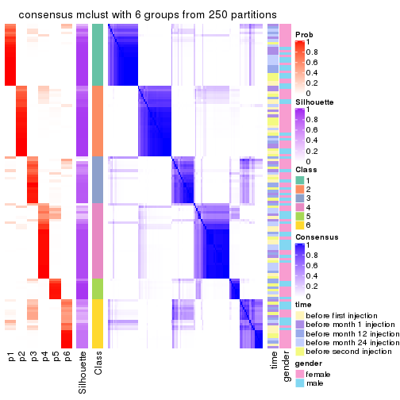</p>

</div>
</div>

Heatmaps for the membership of samples in all partitions to see how consistent they are:


<script>
$( function() {
	$( '#tabs-MAD-mclust-membership-heatmap' ).tabs();
} );
</script>
<div id='tabs-MAD-mclust-membership-heatmap'>
<ul>
<li><a href='#tab-MAD-mclust-membership-heatmap-1'>k = 2</a></li>
<li><a href='#tab-MAD-mclust-membership-heatmap-2'>k = 3</a></li>
<li><a href='#tab-MAD-mclust-membership-heatmap-3'>k = 4</a></li>
<li><a href='#tab-MAD-mclust-membership-heatmap-4'>k = 5</a></li>
<li><a href='#tab-MAD-mclust-membership-heatmap-5'>k = 6</a></li>
</ul>
<div id='tab-MAD-mclust-membership-heatmap-1'>
<pre><code class="r">membership_heatmap(res, k = 2)
</code></pre>

<p></p>

</div>
<div id='tab-MAD-mclust-membership-heatmap-2'>
<pre><code class="r">membership_heatmap(res, k = 3)
</code></pre>

<p></p>

</div>
<div id='tab-MAD-mclust-membership-heatmap-3'>
<pre><code class="r">membership_heatmap(res, k = 4)
</code></pre>

<p></p>

</div>
<div id='tab-MAD-mclust-membership-heatmap-4'>
<pre><code class="r">membership_heatmap(res, k = 5)
</code></pre>

<p></p>

</div>
<div id='tab-MAD-mclust-membership-heatmap-5'>
<pre><code class="r">membership_heatmap(res, k = 6)
</code></pre>

<p></p>

</div>
</div>

As soon as we have had the classes for columns, we can look for signatures
which are significantly different between classes which can be candidate marks
for certain classes. Following are the heatmaps for signatures.


Signature heatmaps where rows are scaled:


<script>
$( function() {
	$( '#tabs-MAD-mclust-get-signatures' ).tabs();
} );
</script>
<div id='tabs-MAD-mclust-get-signatures'>
<ul>
<li><a href='#tab-MAD-mclust-get-signatures-1'>k = 2</a></li>
<li><a href='#tab-MAD-mclust-get-signatures-2'>k = 3</a></li>
<li><a href='#tab-MAD-mclust-get-signatures-3'>k = 4</a></li>
<li><a href='#tab-MAD-mclust-get-signatures-4'>k = 5</a></li>
<li><a href='#tab-MAD-mclust-get-signatures-5'>k = 6</a></li>
</ul>
<div id='tab-MAD-mclust-get-signatures-1'>
<pre><code class="r">get_signatures(res, k = 2)
</code></pre>

<p></p>

</div>
<div id='tab-MAD-mclust-get-signatures-2'>
<pre><code class="r">get_signatures(res, k = 3)
</code></pre>

<p></p>

</div>
<div id='tab-MAD-mclust-get-signatures-3'>
<pre><code class="r">get_signatures(res, k = 4)
</code></pre>

<p></p>

</div>
<div id='tab-MAD-mclust-get-signatures-4'>
<pre><code class="r">get_signatures(res, k = 5)
</code></pre>

<p></p>

</div>
<div id='tab-MAD-mclust-get-signatures-5'>
<pre><code class="r">get_signatures(res, k = 6)
</code></pre>

<p></p>

</div>
</div>


Signature heatmaps where rows are not scaled:


<script>
$( function() {
	$( '#tabs-MAD-mclust-get-signatures-no-scale' ).tabs();
} );
</script>
<div id='tabs-MAD-mclust-get-signatures-no-scale'>
<ul>
<li><a href='#tab-MAD-mclust-get-signatures-no-scale-1'>k = 2</a></li>
<li><a href='#tab-MAD-mclust-get-signatures-no-scale-2'>k = 3</a></li>
<li><a href='#tab-MAD-mclust-get-signatures-no-scale-3'>k = 4</a></li>
<li><a href='#tab-MAD-mclust-get-signatures-no-scale-4'>k = 5</a></li>
<li><a href='#tab-MAD-mclust-get-signatures-no-scale-5'>k = 6</a></li>
</ul>
<div id='tab-MAD-mclust-get-signatures-no-scale-1'>
<pre><code class="r">get_signatures(res, k = 2, scale_rows = FALSE)
</code></pre>

<p></p>

</div>
<div id='tab-MAD-mclust-get-signatures-no-scale-2'>
<pre><code class="r">get_signatures(res, k = 3, scale_rows = FALSE)
</code></pre>

<p></p>

</div>
<div id='tab-MAD-mclust-get-signatures-no-scale-3'>
<pre><code class="r">get_signatures(res, k = 4, scale_rows = FALSE)
</code></pre>

<p></p>

</div>
<div id='tab-MAD-mclust-get-signatures-no-scale-4'>
<pre><code class="r">get_signatures(res, k = 5, scale_rows = FALSE)
</code></pre>

<p></p>

</div>
<div id='tab-MAD-mclust-get-signatures-no-scale-5'>
<pre><code class="r">get_signatures(res, k = 6, scale_rows = FALSE)
</code></pre>

<p></p>

</div>
</div>


Compare the overlap of signatures from different k:

```r
compare_signatures(res)
```


`get_signature()` returns a data frame invisibly. TO get the list of signatures, the function
call should be assigned to a variable explicitly. In following code, if `plot` argument is set
to `FALSE`, no heatmap is plotted while only the differential analysis is performed.

```r
# code only for demonstration
tb = get_signature(res, k = ..., plot = FALSE)
```

An example of the output of `tb` is:

```
#>   which_row         fdr    mean_1    mean_2 scaled_mean_1 scaled_mean_2 km
#> 1        38 0.042760348  8.373488  9.131774    -0.5533452     0.5164555  1
#> 2        40 0.018707592  7.106213  8.469186    -0.6173731     0.5762149  1
#> 3        55 0.019134737 10.221463 11.207825    -0.6159697     0.5749050  1
#> 4        59 0.006059896  5.921854  7.869574    -0.6899429     0.6439467  1
#> 5        60 0.018055526  8.928898 10.211722    -0.6204761     0.5791110  1
#> 6        98 0.009384629 15.714769 14.887706     0.6635654    -0.6193277  2
...
```

The columns in `tb` are:

1. `which_row`: row indices corresponding to the input matrix.
2. `fdr`: FDR for the differential test. 
3. `mean_x`: The mean value in group x.
4. `scaled_mean_x`: The mean value in group x after rows are scaled.
5. `km`: Row groups if k-means clustering is applied to rows.


UMAP plot which shows how samples are separated.


<script>
$( function() {
	$( '#tabs-MAD-mclust-dimension-reduction' ).tabs();
} );
</script>
<div id='tabs-MAD-mclust-dimension-reduction'>
<ul>
<li><a href='#tab-MAD-mclust-dimension-reduction-1'>k = 2</a></li>
<li><a href='#tab-MAD-mclust-dimension-reduction-2'>k = 3</a></li>
<li><a href='#tab-MAD-mclust-dimension-reduction-3'>k = 4</a></li>
<li><a href='#tab-MAD-mclust-dimension-reduction-4'>k = 5</a></li>
<li><a href='#tab-MAD-mclust-dimension-reduction-5'>k = 6</a></li>
</ul>
<div id='tab-MAD-mclust-dimension-reduction-1'>
<pre><code class="r">dimension_reduction(res, k = 2, method = &quot;UMAP&quot;)
</code></pre>

<p></p>

</div>
<div id='tab-MAD-mclust-dimension-reduction-2'>
<pre><code class="r">dimension_reduction(res, k = 3, method = &quot;UMAP&quot;)
</code></pre>

<p></p>

</div>
<div id='tab-MAD-mclust-dimension-reduction-3'>
<pre><code class="r">dimension_reduction(res, k = 4, method = &quot;UMAP&quot;)
</code></pre>

<p></p>

</div>
<div id='tab-MAD-mclust-dimension-reduction-4'>
<pre><code class="r">dimension_reduction(res, k = 5, method = &quot;UMAP&quot;)
</code></pre>

<p></p>

</div>
<div id='tab-MAD-mclust-dimension-reduction-5'>
<pre><code class="r">dimension_reduction(res, k = 6, method = &quot;UMAP&quot;)
</code></pre>

<p></p>

</div>
</div>


Following heatmap shows how subgroups are split when increasing `k`:

```r
collect_classes(res)
```


Test correlation between subgroups and known annotations. If the known
annotation is numeric, one-way ANOVA test is applied, and if the known
annotation is discrete, chi-squared contingency table test is applied.

```r
test_to_known_factors(res)
```

```
#>              n time(p) gender(p) k
#> MAD:mclust 105   0.152    0.8878 2
#> MAD:mclust 112   0.352    0.0639 3
#> MAD:mclust  85   0.849    0.0899 4
#> MAD:mclust 113   0.112    0.6706 5
#> MAD:mclust 112   0.114    0.8538 6
```


If matrix rows can be associated to genes, consider to use `functional_enrichment(res,
...)` to perform function enrichment for the signature genes. See [this vignette](http://bioconductor.org/packages/devel/bioc/vignettes/cola/inst/doc/functional_enrichment.html) for more detailed explanations.


 

---------------------------------------------------


### MAD:NMF*


The object with results only for a single top-value method and a single partition method 
can be extracted as:

```r
res = res_list["MAD", "NMF"]
# you can also extract it by
# res = res_list["MAD:NMF"]
```

A summary of `res` and all the functions that can be applied to it:

```r
res
```

```
#> A 'ConsensusPartition' object with k = 2, 3, 4, 5, 6.
#>   On a matrix with 21512 rows and 125 columns.
#>   Top rows (1000, 2000, 3000, 4000, 5000) are extracted by 'MAD' method.
#>   Subgroups are detected by 'NMF' method.
#>   Performed in total 1250 partitions by row resampling.
#>   Best k for subgroups seems to be 2.
#> 
#> Following methods can be applied to this 'ConsensusPartition' object:
#>  [1] "cola_report"             "collect_classes"         "collect_plots"          
#>  [4] "collect_stats"           "colnames"                "compare_signatures"     
#>  [7] "consensus_heatmap"       "dimension_reduction"     "functional_enrichment"  
#> [10] "get_anno_col"            "get_anno"                "get_classes"            
#> [13] "get_consensus"           "get_matrix"              "get_membership"         
#> [16] "get_param"               "get_signatures"          "get_stats"              
#> [19] "is_best_k"               "is_stable_k"             "membership_heatmap"     
#> [22] "ncol"                    "nrow"                    "plot_ecdf"              
#> [25] "rownames"                "select_partition_number" "show"                   
#> [28] "suggest_best_k"          "test_to_known_factors"
```

`collect_plots()` function collects all the plots made from `res` for all `k` (number of partitions)
into one single page to provide an easy and fast comparison between different `k`.

```r
collect_plots(res)
```


The plots are:

- The first row: a plot of the ECDF (empirical cumulative distribution
  function) curves of the consensus matrix for each `k` and the heatmap of
  predicted classes for each `k`.
- The second row: heatmaps of the consensus matrix for each `k`.
- The third row: heatmaps of the membership matrix for each `k`.
- The fouth row: heatmaps of the signatures for each `k`.

All the plots in panels can be made by individual functions and they are
plotted later in this section.

`select_partition_number()` produces several plots showing different
statistics for choosing "optimized" `k`. There are following statistics:

- ECDF curves of the consensus matrix for each `k`;
- 1-PAC. [The PAC
  score](https://en.wikipedia.org/wiki/Consensus_clustering#Over-interpretation_potential_of_consensus_clustering)
  measures the proportion of the ambiguous subgrouping.
- Mean silhouette score.
- Concordance. The mean probability of fiting the consensus class ids in all
  partitions.
- Area increased. Denote $A_k$ as the area under the ECDF curve for current
  `k`, the area increased is defined as $A_k - A_{k-1}$.
- Rand index. The percent of pairs of samples that are both in a same cluster
  or both are not in a same cluster in the partition of k and k-1.
- Jaccard index. The ratio of pairs of samples are both in a same cluster in
  the partition of k and k-1 and the pairs of samples are both in a same
  cluster in the partition k or k-1.

The detailed explanations of these statistics can be found in [the _cola_
vignette](http://bioconductor.org/packages/devel/bioc/vignettes/cola/inst/doc/cola.html#toc_13).

Generally speaking, lower PAC score, higher mean silhouette score or higher
concordance corresponds to better partition. Rand index and Jaccard index
measure how similar the current partition is compared to partition with `k-1`.
If they are too similar, we won't accept `k` is better than `k-1`.

```r
select_partition_number(res)
```


The numeric values for all these statistics can be obtained by `get_stats()`.

```r
get_stats(res)
```

```
#>   k 1-PAC mean_silhouette concordance area_increased  Rand Jaccard
#> 2 2 0.932           0.948       0.977          0.502 0.497   0.497
#> 3 3 0.452           0.538       0.734          0.322 0.727   0.505
#> 4 4 0.452           0.459       0.721          0.117 0.803   0.499
#> 5 5 0.493           0.409       0.606          0.068 0.875   0.570
#> 6 6 0.533           0.369       0.616          0.043 0.901   0.587
```

`suggest_best_k()` suggests the best $k$ based on these statistics. The rules are as follows:

- All $k$ with Jaccard index larger than 0.95 are removed because increasing
  $k$ does not provide enough extra information. If all $k$ are removed, it is
  marked as no subgroup is detected.
- For all $k$ with 1-PAC score larger than 0.9, the maximal $k$ is taken as
  the best $k$, and other $k$ are marked as optional $k$.
- If it does not fit the second rule. The $k$ with the maximal vote of the
  highest 1-PAC score, highest mean silhouette, and highest concordance is
  taken as the best $k$.

```r
suggest_best_k(res)
```

```
#> [1] 2
```


Following shows the table of the partitions (You need to click the **show/hide
code output** link to see it). The membership matrix (columns with name `p*`)
is inferred by
[`clue::cl_consensus()`](https://www.rdocumentation.org/link/cl_consensus?package=clue)
function with the `SE` method. Basically the value in the membership matrix
represents the probability to belong to a certain group. The finall class
label for an item is determined with the group with highest probability it
belongs to.

In `get_classes()` function, the entropy is calculated from the membership
matrix and the silhouette score is calculated from the consensus matrix.


<script>
$( function() {
	$( '#tabs-MAD-NMF-get-classes' ).tabs();
} );
</script>
<div id='tabs-MAD-NMF-get-classes'>
<ul>
<li><a href='#tab-MAD-NMF-get-classes-1'>k = 2</a></li>
<li><a href='#tab-MAD-NMF-get-classes-2'>k = 3</a></li>
<li><a href='#tab-MAD-NMF-get-classes-3'>k = 4</a></li>
<li><a href='#tab-MAD-NMF-get-classes-4'>k = 5</a></li>
<li><a href='#tab-MAD-NMF-get-classes-5'>k = 6</a></li>
</ul>

<div id='tab-MAD-NMF-get-classes-1'>
<p><a id='tab-MAD-NMF-get-classes-1-a' style='color:#0366d6' href='#'>show/hide code output</a></p>
<pre><code class="r">cbind(get_classes(res, k = 2), get_membership(res, k = 2))
</code></pre>

<pre><code>#&gt;           class entropy silhouette    p1    p2
#&gt; GSM601872     2  0.0000      0.970 0.000 1.000
#&gt; GSM601882     2  0.0000      0.970 0.000 1.000
#&gt; GSM601887     1  0.3114      0.933 0.944 0.056
#&gt; GSM601892     1  0.0000      0.981 1.000 0.000
#&gt; GSM601897     1  0.0376      0.978 0.996 0.004
#&gt; GSM601902     2  0.0000      0.970 0.000 1.000
#&gt; GSM601912     1  0.0938      0.972 0.988 0.012
#&gt; GSM601927     1  0.0000      0.981 1.000 0.000
#&gt; GSM601932     2  0.0000      0.970 0.000 1.000
#&gt; GSM601937     2  0.4298      0.903 0.088 0.912
#&gt; GSM601942     2  0.0000      0.970 0.000 1.000
#&gt; GSM601947     2  0.0000      0.970 0.000 1.000
#&gt; GSM601957     1  0.0000      0.981 1.000 0.000
#&gt; GSM601972     2  0.0000      0.970 0.000 1.000
#&gt; GSM601977     2  0.0000      0.970 0.000 1.000
#&gt; GSM601987     2  0.0000      0.970 0.000 1.000
#&gt; GSM601877     1  0.0000      0.981 1.000 0.000
#&gt; GSM601907     2  0.0000      0.970 0.000 1.000
#&gt; GSM601917     2  0.2778      0.938 0.048 0.952
#&gt; GSM601922     2  0.4298      0.903 0.088 0.912
#&gt; GSM601952     2  0.0000      0.970 0.000 1.000
#&gt; GSM601962     1  0.2043      0.956 0.968 0.032
#&gt; GSM601967     1  0.0000      0.981 1.000 0.000
#&gt; GSM601982     2  0.0000      0.970 0.000 1.000
#&gt; GSM601992     2  0.0000      0.970 0.000 1.000
#&gt; GSM601873     2  0.0000      0.970 0.000 1.000
#&gt; GSM601883     2  0.0000      0.970 0.000 1.000
#&gt; GSM601888     1  0.6247      0.818 0.844 0.156
#&gt; GSM601893     1  0.0672      0.975 0.992 0.008
#&gt; GSM601898     1  0.0000      0.981 1.000 0.000
#&gt; GSM601903     2  0.0000      0.970 0.000 1.000
#&gt; GSM601913     1  0.0000      0.981 1.000 0.000
#&gt; GSM601928     1  0.0000      0.981 1.000 0.000
#&gt; GSM601933     2  0.0000      0.970 0.000 1.000
#&gt; GSM601938     2  0.0000      0.970 0.000 1.000
#&gt; GSM601943     2  0.0000      0.970 0.000 1.000
#&gt; GSM601948     1  0.0000      0.981 1.000 0.000
#&gt; GSM601958     1  0.0000      0.981 1.000 0.000
#&gt; GSM601973     2  0.0000      0.970 0.000 1.000
#&gt; GSM601978     2  0.0000      0.970 0.000 1.000
#&gt; GSM601988     2  0.0000      0.970 0.000 1.000
#&gt; GSM601878     1  0.0000      0.981 1.000 0.000
#&gt; GSM601908     2  0.0000      0.970 0.000 1.000
#&gt; GSM601918     2  0.0000      0.970 0.000 1.000
#&gt; GSM601923     1  0.0000      0.981 1.000 0.000
#&gt; GSM601953     2  0.0000      0.970 0.000 1.000
#&gt; GSM601963     1  0.0000      0.981 1.000 0.000
#&gt; GSM601968     1  0.0000      0.981 1.000 0.000
#&gt; GSM601983     1  0.0000      0.981 1.000 0.000
#&gt; GSM601993     2  0.0000      0.970 0.000 1.000
#&gt; GSM601874     2  0.0000      0.970 0.000 1.000
#&gt; GSM601884     2  0.0000      0.970 0.000 1.000
#&gt; GSM601889     1  0.0000      0.981 1.000 0.000
#&gt; GSM601894     1  0.0000      0.981 1.000 0.000
#&gt; GSM601899     1  0.2043      0.956 0.968 0.032
#&gt; GSM601904     2  0.9710      0.370 0.400 0.600
#&gt; GSM601914     1  0.0000      0.981 1.000 0.000
#&gt; GSM601929     1  0.0000      0.981 1.000 0.000
#&gt; GSM601934     2  0.0000      0.970 0.000 1.000
#&gt; GSM601939     1  0.0000      0.981 1.000 0.000
#&gt; GSM601944     2  0.0000      0.970 0.000 1.000
#&gt; GSM601949     1  0.0000      0.981 1.000 0.000
#&gt; GSM601959     1  0.0000      0.981 1.000 0.000
#&gt; GSM601974     1  0.9954      0.101 0.540 0.460
#&gt; GSM601979     2  0.0000      0.970 0.000 1.000
#&gt; GSM601989     1  0.0000      0.981 1.000 0.000
#&gt; GSM601879     1  0.0000      0.981 1.000 0.000
#&gt; GSM601909     1  0.0000      0.981 1.000 0.000
#&gt; GSM601919     2  0.0000      0.970 0.000 1.000
#&gt; GSM601924     1  0.0000      0.981 1.000 0.000
#&gt; GSM601954     2  0.0000      0.970 0.000 1.000
#&gt; GSM601964     1  0.0000      0.981 1.000 0.000
#&gt; GSM601969     1  0.0000      0.981 1.000 0.000
#&gt; GSM601984     1  0.0000      0.981 1.000 0.000
#&gt; GSM601994     2  0.0000      0.970 0.000 1.000
#&gt; GSM601875     2  0.0000      0.970 0.000 1.000
#&gt; GSM601885     2  0.0000      0.970 0.000 1.000
#&gt; GSM601890     1  0.2603      0.945 0.956 0.044
#&gt; GSM601895     1  0.0000      0.981 1.000 0.000
#&gt; GSM601900     1  0.0000      0.981 1.000 0.000
#&gt; GSM601905     2  0.6887      0.791 0.184 0.816
#&gt; GSM601915     1  0.0000      0.981 1.000 0.000
#&gt; GSM601930     1  0.0000      0.981 1.000 0.000
#&gt; GSM601935     1  0.4815      0.876 0.896 0.104
#&gt; GSM601940     1  0.0000      0.981 1.000 0.000
#&gt; GSM601945     2  0.0000      0.970 0.000 1.000
#&gt; GSM601950     1  0.0000      0.981 1.000 0.000
#&gt; GSM601960     1  0.0000      0.981 1.000 0.000
#&gt; GSM601975     2  0.0000      0.970 0.000 1.000
#&gt; GSM601980     2  0.0000      0.970 0.000 1.000
#&gt; GSM601990     1  0.0000      0.981 1.000 0.000
#&gt; GSM601880     1  0.0000      0.981 1.000 0.000
#&gt; GSM601910     1  0.0000      0.981 1.000 0.000
#&gt; GSM601920     2  0.6048      0.832 0.148 0.852
#&gt; GSM601925     1  0.0000      0.981 1.000 0.000
#&gt; GSM601955     2  0.4939      0.884 0.108 0.892
#&gt; GSM601965     1  0.0672      0.975 0.992 0.008
#&gt; GSM601970     1  0.0000      0.981 1.000 0.000
#&gt; GSM601985     1  0.0000      0.981 1.000 0.000
#&gt; GSM601995     2  0.5737      0.853 0.136 0.864
#&gt; GSM601876     1  0.0000      0.981 1.000 0.000
#&gt; GSM601886     2  0.8909      0.584 0.308 0.692
#&gt; GSM601891     1  0.7950      0.692 0.760 0.240
#&gt; GSM601896     1  0.0000      0.981 1.000 0.000
#&gt; GSM601901     2  0.0000      0.970 0.000 1.000
#&gt; GSM601906     1  0.0000      0.981 1.000 0.000
#&gt; GSM601916     2  0.0672      0.966 0.008 0.992
#&gt; GSM601931     1  0.0000      0.981 1.000 0.000
#&gt; GSM601936     2  0.1633      0.956 0.024 0.976
#&gt; GSM601941     2  0.0000      0.970 0.000 1.000
#&gt; GSM601946     1  0.0000      0.981 1.000 0.000
#&gt; GSM601951     1  0.0000      0.981 1.000 0.000
#&gt; GSM601961     2  0.1184      0.961 0.016 0.984
#&gt; GSM601976     2  0.2423      0.944 0.040 0.960
#&gt; GSM601981     2  0.0000      0.970 0.000 1.000
#&gt; GSM601991     1  0.0000      0.981 1.000 0.000
#&gt; GSM601881     1  0.0000      0.981 1.000 0.000
#&gt; GSM601911     2  0.4690      0.886 0.100 0.900
#&gt; GSM601921     2  0.1414      0.958 0.020 0.980
#&gt; GSM601926     1  0.0000      0.981 1.000 0.000
#&gt; GSM601956     2  0.0000      0.970 0.000 1.000
#&gt; GSM601966     2  0.0000      0.970 0.000 1.000
#&gt; GSM601971     1  0.0000      0.981 1.000 0.000
#&gt; GSM601986     1  0.2423      0.947 0.960 0.040
#&gt; GSM601996     2  0.0000      0.970 0.000 1.000
</code></pre>

<script>
$('#tab-MAD-NMF-get-classes-1-a').parent().next().next().hide();
$('#tab-MAD-NMF-get-classes-1-a').click(function(){
  $('#tab-MAD-NMF-get-classes-1-a').parent().next().next().toggle();
  return(false);
});
</script>
</div>

<div id='tab-MAD-NMF-get-classes-2'>
<p><a id='tab-MAD-NMF-get-classes-2-a' style='color:#0366d6' href='#'>show/hide code output</a></p>
<pre><code class="r">cbind(get_classes(res, k = 3), get_membership(res, k = 3))
</code></pre>

<pre><code>#&gt;           class entropy silhouette    p1    p2    p3
#&gt; GSM601872     3  0.4062     0.4560 0.000 0.164 0.836
#&gt; GSM601882     2  0.1753     0.7419 0.000 0.952 0.048
#&gt; GSM601887     3  0.2200     0.6197 0.056 0.004 0.940
#&gt; GSM601892     3  0.2959     0.6186 0.100 0.000 0.900
#&gt; GSM601897     3  0.1031     0.6140 0.024 0.000 0.976
#&gt; GSM601902     2  0.5497     0.6096 0.292 0.708 0.000
#&gt; GSM601912     3  0.2537     0.6212 0.080 0.000 0.920
#&gt; GSM601927     1  0.0424     0.7666 0.992 0.000 0.008
#&gt; GSM601932     2  0.2878     0.7471 0.096 0.904 0.000
#&gt; GSM601937     2  0.5450     0.6419 0.012 0.760 0.228
#&gt; GSM601942     3  0.5905     0.0920 0.000 0.352 0.648
#&gt; GSM601947     2  0.4178     0.7129 0.172 0.828 0.000
#&gt; GSM601957     3  0.6192     0.3949 0.420 0.000 0.580
#&gt; GSM601972     2  0.1989     0.7520 0.048 0.948 0.004
#&gt; GSM601977     2  0.6168     0.4206 0.000 0.588 0.412
#&gt; GSM601987     2  0.3482     0.7146 0.000 0.872 0.128
#&gt; GSM601877     1  0.1163     0.7473 0.972 0.028 0.000
#&gt; GSM601907     2  0.5465     0.5898 0.000 0.712 0.288
#&gt; GSM601917     2  0.6267     0.3463 0.452 0.548 0.000
#&gt; GSM601922     2  0.6305     0.2702 0.484 0.516 0.000
#&gt; GSM601952     2  0.3989     0.7206 0.012 0.864 0.124
#&gt; GSM601962     3  0.6521     0.1231 0.496 0.004 0.500
#&gt; GSM601967     3  0.6008     0.4589 0.372 0.000 0.628
#&gt; GSM601982     2  0.5621     0.5782 0.000 0.692 0.308
#&gt; GSM601992     2  0.1529     0.7512 0.040 0.960 0.000
#&gt; GSM601873     3  0.6192    -0.0557 0.000 0.420 0.580
#&gt; GSM601883     2  0.1878     0.7428 0.004 0.952 0.044
#&gt; GSM601888     3  0.1636     0.6065 0.020 0.016 0.964
#&gt; GSM601893     3  0.2165     0.6204 0.064 0.000 0.936
#&gt; GSM601898     3  0.6225     0.3721 0.432 0.000 0.568
#&gt; GSM601903     2  0.5760     0.5665 0.328 0.672 0.000
#&gt; GSM601913     1  0.5591     0.4229 0.696 0.000 0.304
#&gt; GSM601928     1  0.1411     0.7691 0.964 0.000 0.036
#&gt; GSM601933     2  0.1964     0.7394 0.000 0.944 0.056
#&gt; GSM601938     2  0.1482     0.7483 0.012 0.968 0.020
#&gt; GSM601943     3  0.4555     0.4043 0.000 0.200 0.800
#&gt; GSM601948     1  0.3551     0.7079 0.868 0.000 0.132
#&gt; GSM601958     3  0.6291     0.2897 0.468 0.000 0.532
#&gt; GSM601973     2  0.5058     0.6556 0.244 0.756 0.000
#&gt; GSM601978     2  0.6062     0.4655 0.000 0.616 0.384
#&gt; GSM601988     2  0.5335     0.6352 0.008 0.760 0.232
#&gt; GSM601878     1  0.1964     0.7620 0.944 0.000 0.056
#&gt; GSM601908     2  0.3116     0.7227 0.000 0.892 0.108
#&gt; GSM601918     2  0.3267     0.7422 0.116 0.884 0.000
#&gt; GSM601923     1  0.1163     0.7691 0.972 0.000 0.028
#&gt; GSM601953     3  0.6225    -0.0731 0.000 0.432 0.568
#&gt; GSM601963     1  0.6126     0.1649 0.600 0.000 0.400
#&gt; GSM601968     3  0.4121     0.6040 0.168 0.000 0.832
#&gt; GSM601983     3  0.6280     0.2715 0.460 0.000 0.540
#&gt; GSM601993     2  0.2200     0.7516 0.056 0.940 0.004
#&gt; GSM601874     2  0.5968     0.5090 0.000 0.636 0.364
#&gt; GSM601884     2  0.5098     0.6470 0.000 0.752 0.248
#&gt; GSM601889     3  0.6062     0.4532 0.384 0.000 0.616
#&gt; GSM601894     3  0.6168     0.4089 0.412 0.000 0.588
#&gt; GSM601899     3  0.1643     0.6184 0.044 0.000 0.956
#&gt; GSM601904     1  0.6045     0.1109 0.620 0.380 0.000
#&gt; GSM601914     3  0.6154     0.4058 0.408 0.000 0.592
#&gt; GSM601929     1  0.0747     0.7559 0.984 0.016 0.000
#&gt; GSM601934     2  0.4842     0.6566 0.000 0.776 0.224
#&gt; GSM601939     1  0.4002     0.6809 0.840 0.000 0.160
#&gt; GSM601944     2  0.2496     0.7391 0.004 0.928 0.068
#&gt; GSM601949     1  0.5098     0.5411 0.752 0.000 0.248
#&gt; GSM601959     3  0.6299     0.2676 0.476 0.000 0.524
#&gt; GSM601974     2  0.9976     0.0184 0.344 0.356 0.300
#&gt; GSM601979     2  0.4605     0.6659 0.000 0.796 0.204
#&gt; GSM601989     3  0.5650     0.5259 0.312 0.000 0.688
#&gt; GSM601879     1  0.0829     0.7609 0.984 0.012 0.004
#&gt; GSM601909     3  0.4346     0.5972 0.184 0.000 0.816
#&gt; GSM601919     2  0.5650     0.5866 0.312 0.688 0.000
#&gt; GSM601924     1  0.2711     0.7460 0.912 0.000 0.088
#&gt; GSM601954     2  0.6905     0.6016 0.044 0.676 0.280
#&gt; GSM601964     3  0.6309     0.1778 0.496 0.000 0.504
#&gt; GSM601969     3  0.6565     0.3525 0.416 0.008 0.576
#&gt; GSM601984     1  0.3694     0.7341 0.896 0.052 0.052
#&gt; GSM601994     2  0.2066     0.7508 0.060 0.940 0.000
#&gt; GSM601875     2  0.6330     0.4360 0.004 0.600 0.396
#&gt; GSM601885     2  0.2066     0.7387 0.000 0.940 0.060
#&gt; GSM601890     3  0.1832     0.6154 0.036 0.008 0.956
#&gt; GSM601895     3  0.5905     0.4869 0.352 0.000 0.648
#&gt; GSM601900     3  0.5650     0.5282 0.312 0.000 0.688
#&gt; GSM601905     1  0.6286    -0.1604 0.536 0.464 0.000
#&gt; GSM601915     1  0.6126     0.1397 0.600 0.000 0.400
#&gt; GSM601930     1  0.0848     0.7641 0.984 0.008 0.008
#&gt; GSM601935     1  0.8233     0.4543 0.616 0.120 0.264
#&gt; GSM601940     1  0.4605     0.6197 0.796 0.000 0.204
#&gt; GSM601945     2  0.5926     0.5027 0.000 0.644 0.356
#&gt; GSM601950     1  0.5216     0.5152 0.740 0.000 0.260
#&gt; GSM601960     3  0.6079     0.4413 0.388 0.000 0.612
#&gt; GSM601975     2  0.3752     0.7299 0.144 0.856 0.000
#&gt; GSM601980     3  0.6295    -0.2276 0.000 0.472 0.528
#&gt; GSM601990     3  0.6286     0.2779 0.464 0.000 0.536
#&gt; GSM601880     1  0.0661     0.7659 0.988 0.004 0.008
#&gt; GSM601910     3  0.2711     0.6205 0.088 0.000 0.912
#&gt; GSM601920     1  0.6274    -0.1364 0.544 0.456 0.000
#&gt; GSM601925     1  0.0592     0.7580 0.988 0.012 0.000
#&gt; GSM601955     3  0.3941     0.4677 0.000 0.156 0.844
#&gt; GSM601965     1  0.2773     0.7627 0.928 0.024 0.048
#&gt; GSM601970     3  0.5905     0.4903 0.352 0.000 0.648
#&gt; GSM601985     1  0.4002     0.6823 0.840 0.000 0.160
#&gt; GSM601995     2  0.6025     0.6257 0.028 0.740 0.232
#&gt; GSM601876     1  0.2625     0.7500 0.916 0.000 0.084
#&gt; GSM601886     2  0.7075     0.2077 0.484 0.496 0.020
#&gt; GSM601891     3  0.1129     0.5996 0.004 0.020 0.976
#&gt; GSM601896     1  0.3551     0.7132 0.868 0.000 0.132
#&gt; GSM601901     2  0.2313     0.7488 0.024 0.944 0.032
#&gt; GSM601906     1  0.3879     0.6299 0.848 0.152 0.000
#&gt; GSM601916     2  0.5650     0.5855 0.312 0.688 0.000
#&gt; GSM601931     1  0.1643     0.7672 0.956 0.000 0.044
#&gt; GSM601936     2  0.4136     0.7414 0.116 0.864 0.020
#&gt; GSM601941     2  0.3619     0.7340 0.136 0.864 0.000
#&gt; GSM601946     1  0.2448     0.7544 0.924 0.000 0.076
#&gt; GSM601951     1  0.1182     0.7646 0.976 0.012 0.012
#&gt; GSM601961     3  0.6018     0.2467 0.008 0.308 0.684
#&gt; GSM601976     2  0.5988     0.5087 0.368 0.632 0.000
#&gt; GSM601981     2  0.5678     0.5529 0.000 0.684 0.316
#&gt; GSM601991     3  0.5291     0.5554 0.268 0.000 0.732
#&gt; GSM601881     1  0.1411     0.7686 0.964 0.000 0.036
#&gt; GSM601911     2  0.5926     0.5202 0.356 0.644 0.000
#&gt; GSM601921     2  0.6079     0.4746 0.388 0.612 0.000
#&gt; GSM601926     1  0.1411     0.7687 0.964 0.000 0.036
#&gt; GSM601956     3  0.6299    -0.1929 0.000 0.476 0.524
#&gt; GSM601966     2  0.2261     0.7504 0.068 0.932 0.000
#&gt; GSM601971     1  0.5988     0.2398 0.632 0.000 0.368
#&gt; GSM601986     1  0.3879     0.6300 0.848 0.152 0.000
#&gt; GSM601996     2  0.2356     0.7499 0.072 0.928 0.000
</code></pre>

<script>
$('#tab-MAD-NMF-get-classes-2-a').parent().next().next().hide();
$('#tab-MAD-NMF-get-classes-2-a').click(function(){
  $('#tab-MAD-NMF-get-classes-2-a').parent().next().next().toggle();
  return(false);
});
</script>
</div>

<div id='tab-MAD-NMF-get-classes-3'>
<p><a id='tab-MAD-NMF-get-classes-3-a' style='color:#0366d6' href='#'>show/hide code output</a></p>
<pre><code class="r">cbind(get_classes(res, k = 4), get_membership(res, k = 4))
</code></pre>

<pre><code>#&gt;           class entropy silhouette    p1    p2    p3    p4
#&gt; GSM601872     2   0.591     0.2499 0.000 0.584 0.372 0.044
#&gt; GSM601882     4   0.340     0.5773 0.000 0.152 0.008 0.840
#&gt; GSM601887     2   0.551     0.0506 0.020 0.572 0.408 0.000
#&gt; GSM601892     3   0.695     0.4102 0.124 0.348 0.528 0.000
#&gt; GSM601897     3   0.333     0.5911 0.004 0.132 0.856 0.008
#&gt; GSM601902     4   0.506     0.5338 0.256 0.032 0.000 0.712
#&gt; GSM601912     3   0.204     0.6399 0.012 0.048 0.936 0.004
#&gt; GSM601927     1   0.139     0.7375 0.952 0.000 0.048 0.000
#&gt; GSM601932     4   0.448     0.5961 0.084 0.108 0.000 0.808
#&gt; GSM601937     4   0.528     0.1914 0.004 0.004 0.432 0.560
#&gt; GSM601942     3   0.720     0.1985 0.000 0.176 0.536 0.288
#&gt; GSM601947     2   0.744     0.1540 0.284 0.504 0.000 0.212
#&gt; GSM601957     3   0.669     0.2094 0.424 0.088 0.488 0.000
#&gt; GSM601972     4   0.662     0.2664 0.088 0.380 0.000 0.532
#&gt; GSM601977     2   0.768     0.0698 0.000 0.400 0.216 0.384
#&gt; GSM601987     4   0.563     0.2530 0.000 0.384 0.028 0.588
#&gt; GSM601877     1   0.104     0.7276 0.972 0.020 0.000 0.008
#&gt; GSM601907     2   0.265     0.6463 0.004 0.896 0.004 0.096
#&gt; GSM601917     1   0.664    -0.0205 0.524 0.088 0.000 0.388
#&gt; GSM601922     1   0.603     0.0721 0.564 0.048 0.000 0.388
#&gt; GSM601952     4   0.657     0.0808 0.016 0.436 0.044 0.504
#&gt; GSM601962     3   0.463     0.5884 0.032 0.016 0.800 0.152
#&gt; GSM601967     3   0.726     0.3236 0.352 0.156 0.492 0.000
#&gt; GSM601982     4   0.750     0.2630 0.000 0.276 0.228 0.496
#&gt; GSM601992     4   0.193     0.6144 0.000 0.036 0.024 0.940
#&gt; GSM601873     3   0.769     0.0319 0.000 0.256 0.456 0.288
#&gt; GSM601883     4   0.511     0.3033 0.008 0.384 0.000 0.608
#&gt; GSM601888     2   0.423     0.5392 0.052 0.816 0.132 0.000
#&gt; GSM601893     3   0.576     0.3570 0.036 0.372 0.592 0.000
#&gt; GSM601898     3   0.425     0.5873 0.220 0.012 0.768 0.000
#&gt; GSM601903     4   0.545     0.4693 0.320 0.032 0.000 0.648
#&gt; GSM601913     3   0.490     0.5644 0.236 0.000 0.732 0.032
#&gt; GSM601928     1   0.293     0.7186 0.880 0.000 0.108 0.012
#&gt; GSM601933     4   0.367     0.5921 0.000 0.116 0.036 0.848
#&gt; GSM601938     4   0.233     0.6043 0.000 0.088 0.004 0.908
#&gt; GSM601943     3   0.660     0.1972 0.000 0.340 0.564 0.096
#&gt; GSM601948     1   0.396     0.6872 0.832 0.124 0.044 0.000
#&gt; GSM601958     3   0.553     0.2723 0.416 0.020 0.564 0.000
#&gt; GSM601973     4   0.409     0.5839 0.172 0.024 0.000 0.804
#&gt; GSM601978     2   0.311     0.6397 0.000 0.872 0.016 0.112
#&gt; GSM601988     4   0.554     0.1472 0.012 0.004 0.444 0.540
#&gt; GSM601878     1   0.202     0.7311 0.936 0.040 0.024 0.000
#&gt; GSM601908     2   0.451     0.4782 0.008 0.724 0.000 0.268
#&gt; GSM601918     2   0.752    -0.1653 0.184 0.408 0.000 0.408
#&gt; GSM601923     1   0.158     0.7374 0.948 0.004 0.048 0.000
#&gt; GSM601953     2   0.149     0.6454 0.000 0.956 0.012 0.032
#&gt; GSM601963     3   0.487     0.5516 0.244 0.000 0.728 0.028
#&gt; GSM601968     3   0.616     0.5980 0.164 0.160 0.676 0.000
#&gt; GSM601983     3   0.356     0.6465 0.108 0.000 0.856 0.036
#&gt; GSM601993     4   0.311     0.5783 0.016 0.000 0.112 0.872
#&gt; GSM601874     2   0.280     0.6457 0.000 0.892 0.016 0.092
#&gt; GSM601884     4   0.717     0.2543 0.000 0.332 0.152 0.516
#&gt; GSM601889     3   0.590     0.5085 0.280 0.068 0.652 0.000
#&gt; GSM601894     3   0.586     0.4771 0.308 0.056 0.636 0.000
#&gt; GSM601899     2   0.556    -0.0266 0.020 0.544 0.436 0.000
#&gt; GSM601904     1   0.512     0.0648 0.556 0.004 0.000 0.440
#&gt; GSM601914     3   0.254     0.6614 0.084 0.000 0.904 0.012
#&gt; GSM601929     1   0.141     0.7372 0.960 0.020 0.020 0.000
#&gt; GSM601934     4   0.714     0.2671 0.000 0.296 0.164 0.540
#&gt; GSM601939     1   0.425     0.5419 0.724 0.000 0.276 0.000
#&gt; GSM601944     4   0.475     0.5711 0.004 0.124 0.076 0.796
#&gt; GSM601949     1   0.494     0.6436 0.768 0.160 0.072 0.000
#&gt; GSM601959     3   0.627     0.1399 0.452 0.056 0.492 0.000
#&gt; GSM601974     3   0.722     0.2225 0.120 0.008 0.520 0.352
#&gt; GSM601979     2   0.399     0.5844 0.004 0.800 0.008 0.188
#&gt; GSM601989     3   0.395     0.6469 0.136 0.036 0.828 0.000
#&gt; GSM601879     1   0.159     0.7263 0.952 0.040 0.004 0.004
#&gt; GSM601909     3   0.510     0.6326 0.100 0.136 0.764 0.000
#&gt; GSM601919     2   0.745     0.0796 0.412 0.416 0.000 0.172
#&gt; GSM601924     1   0.333     0.7121 0.864 0.024 0.112 0.000
#&gt; GSM601954     2   0.331     0.6082 0.072 0.876 0.000 0.052
#&gt; GSM601964     3   0.355     0.6493 0.096 0.000 0.860 0.044
#&gt; GSM601969     1   0.782    -0.0342 0.416 0.296 0.288 0.000
#&gt; GSM601984     1   0.773     0.2127 0.444 0.000 0.292 0.264
#&gt; GSM601994     4   0.170     0.6141 0.016 0.004 0.028 0.952
#&gt; GSM601875     2   0.357     0.6401 0.004 0.848 0.016 0.132
#&gt; GSM601885     4   0.513     0.2985 0.008 0.388 0.000 0.604
#&gt; GSM601890     3   0.530     0.1032 0.008 0.488 0.504 0.000
#&gt; GSM601895     3   0.216     0.6654 0.068 0.004 0.924 0.004
#&gt; GSM601900     3   0.321     0.6612 0.104 0.024 0.872 0.000
#&gt; GSM601905     4   0.510     0.2376 0.432 0.004 0.000 0.564
#&gt; GSM601915     3   0.445     0.4834 0.308 0.000 0.692 0.000
#&gt; GSM601930     1   0.202     0.7353 0.932 0.000 0.056 0.012
#&gt; GSM601935     3   0.588     0.3494 0.056 0.000 0.632 0.312
#&gt; GSM601940     1   0.458     0.5616 0.728 0.012 0.260 0.000
#&gt; GSM601945     2   0.393     0.6349 0.008 0.832 0.020 0.140
#&gt; GSM601950     1   0.499     0.6359 0.768 0.080 0.152 0.000
#&gt; GSM601960     3   0.247     0.6622 0.080 0.000 0.908 0.012
#&gt; GSM601975     4   0.614     0.5256 0.184 0.140 0.000 0.676
#&gt; GSM601980     3   0.580     0.0791 0.000 0.032 0.548 0.420
#&gt; GSM601990     3   0.361     0.6446 0.060 0.000 0.860 0.080
#&gt; GSM601880     1   0.151     0.7344 0.956 0.000 0.028 0.016
#&gt; GSM601910     3   0.311     0.6463 0.036 0.080 0.884 0.000
#&gt; GSM601920     1   0.558     0.2559 0.636 0.036 0.000 0.328
#&gt; GSM601925     1   0.139     0.7362 0.960 0.000 0.028 0.012
#&gt; GSM601955     3   0.507     0.4873 0.000 0.056 0.744 0.200
#&gt; GSM601965     1   0.596     0.5693 0.676 0.000 0.228 0.096
#&gt; GSM601970     3   0.546     0.5683 0.236 0.060 0.704 0.000
#&gt; GSM601985     1   0.476     0.3527 0.628 0.000 0.372 0.000
#&gt; GSM601995     3   0.541    -0.0390 0.012 0.000 0.500 0.488
#&gt; GSM601876     1   0.447     0.6315 0.768 0.004 0.212 0.016
#&gt; GSM601886     4   0.546     0.5035 0.076 0.000 0.204 0.720
#&gt; GSM601891     3   0.515     0.1453 0.004 0.464 0.532 0.000
#&gt; GSM601896     1   0.437     0.5626 0.728 0.004 0.268 0.000
#&gt; GSM601901     2   0.632    -0.0392 0.060 0.500 0.000 0.440
#&gt; GSM601906     1   0.438     0.6145 0.792 0.000 0.036 0.172
#&gt; GSM601916     4   0.535     0.5310 0.272 0.032 0.004 0.692
#&gt; GSM601931     1   0.228     0.7239 0.904 0.000 0.096 0.000
#&gt; GSM601936     4   0.508     0.4488 0.028 0.000 0.272 0.700
#&gt; GSM601941     4   0.330     0.6127 0.092 0.028 0.004 0.876
#&gt; GSM601946     1   0.387     0.6381 0.788 0.000 0.208 0.004
#&gt; GSM601951     1   0.157     0.7327 0.956 0.028 0.012 0.004
#&gt; GSM601961     2   0.228     0.6232 0.052 0.924 0.024 0.000
#&gt; GSM601976     4   0.598     0.2561 0.432 0.040 0.000 0.528
#&gt; GSM601981     2   0.379     0.6343 0.004 0.836 0.020 0.140
#&gt; GSM601991     3   0.304     0.6188 0.020 0.000 0.880 0.100
#&gt; GSM601881     1   0.173     0.7364 0.948 0.024 0.028 0.000
#&gt; GSM601911     4   0.676     0.3925 0.360 0.104 0.000 0.536
#&gt; GSM601921     1   0.620    -0.1277 0.500 0.052 0.000 0.448
#&gt; GSM601926     1   0.205     0.7326 0.924 0.000 0.072 0.004
#&gt; GSM601956     2   0.362     0.6312 0.000 0.860 0.072 0.068
#&gt; GSM601966     4   0.371     0.5974 0.040 0.112 0.000 0.848
#&gt; GSM601971     1   0.599     0.3834 0.628 0.064 0.308 0.000
#&gt; GSM601986     1   0.495     0.6544 0.776 0.008 0.052 0.164
#&gt; GSM601996     4   0.164     0.6159 0.012 0.012 0.020 0.956
</code></pre>

<script>
$('#tab-MAD-NMF-get-classes-3-a').parent().next().next().hide();
$('#tab-MAD-NMF-get-classes-3-a').click(function(){
  $('#tab-MAD-NMF-get-classes-3-a').parent().next().next().toggle();
  return(false);
});
</script>
</div>

<div id='tab-MAD-NMF-get-classes-4'>
<p><a id='tab-MAD-NMF-get-classes-4-a' style='color:#0366d6' href='#'>show/hide code output</a></p>
<pre><code class="r">cbind(get_classes(res, k = 5), get_membership(res, k = 5))
</code></pre>

<pre><code>#&gt;           class entropy silhouette    p1    p2    p3    p4    p5
#&gt; GSM601872     2  0.5599     0.1630 0.000 0.492 0.052 0.008 0.448
#&gt; GSM601882     4  0.4338     0.5683 0.000 0.112 0.040 0.800 0.048
#&gt; GSM601887     2  0.5967     0.4936 0.032 0.660 0.160 0.000 0.148
#&gt; GSM601892     2  0.7449    -0.0848 0.104 0.404 0.392 0.000 0.100
#&gt; GSM601897     5  0.3574     0.6313 0.004 0.088 0.072 0.000 0.836
#&gt; GSM601902     4  0.6390     0.4561 0.260 0.012 0.108 0.600 0.020
#&gt; GSM601912     5  0.5302     0.5348 0.008 0.048 0.300 0.004 0.640
#&gt; GSM601927     1  0.2723     0.5286 0.864 0.000 0.124 0.012 0.000
#&gt; GSM601932     4  0.7378     0.5214 0.108 0.060 0.188 0.592 0.052
#&gt; GSM601937     5  0.5684     0.0754 0.000 0.000 0.080 0.432 0.488
#&gt; GSM601942     5  0.4702     0.5748 0.000 0.052 0.060 0.108 0.780
#&gt; GSM601947     1  0.8135     0.0449 0.408 0.256 0.196 0.140 0.000
#&gt; GSM601957     3  0.7210     0.6043 0.300 0.072 0.500 0.000 0.128
#&gt; GSM601972     4  0.7569     0.3188 0.076 0.316 0.144 0.460 0.004
#&gt; GSM601977     2  0.7641     0.0831 0.000 0.400 0.060 0.328 0.212
#&gt; GSM601987     4  0.6289     0.2882 0.000 0.336 0.096 0.544 0.024
#&gt; GSM601877     1  0.0992     0.5804 0.968 0.000 0.024 0.008 0.000
#&gt; GSM601907     2  0.2798     0.5752 0.000 0.852 0.008 0.140 0.000
#&gt; GSM601917     1  0.7198     0.2820 0.564 0.036 0.208 0.168 0.024
#&gt; GSM601922     1  0.6525     0.3118 0.604 0.024 0.160 0.204 0.008
#&gt; GSM601952     4  0.8618     0.1189 0.024 0.328 0.124 0.348 0.176
#&gt; GSM601962     5  0.3775     0.6542 0.016 0.000 0.092 0.060 0.832
#&gt; GSM601967     3  0.8334     0.5037 0.280 0.152 0.352 0.000 0.216
#&gt; GSM601982     4  0.8424     0.1994 0.012 0.244 0.124 0.400 0.220
#&gt; GSM601992     4  0.2228     0.5924 0.000 0.008 0.056 0.916 0.020
#&gt; GSM601873     2  0.8186     0.0444 0.000 0.340 0.140 0.340 0.180
#&gt; GSM601883     4  0.5417     0.2995 0.000 0.372 0.048 0.572 0.008
#&gt; GSM601888     2  0.3458     0.6096 0.016 0.840 0.120 0.000 0.024
#&gt; GSM601893     2  0.7060     0.2237 0.040 0.460 0.352 0.000 0.148
#&gt; GSM601898     3  0.6879     0.4299 0.176 0.020 0.464 0.000 0.340
#&gt; GSM601903     4  0.7450     0.2690 0.324 0.016 0.180 0.452 0.028
#&gt; GSM601913     3  0.6608     0.5679 0.224 0.000 0.544 0.016 0.216
#&gt; GSM601928     1  0.3667     0.4975 0.812 0.000 0.156 0.020 0.012
#&gt; GSM601933     4  0.5414     0.5209 0.000 0.128 0.124 0.716 0.032
#&gt; GSM601938     4  0.3601     0.5976 0.008 0.048 0.048 0.860 0.036
#&gt; GSM601943     5  0.5830     0.3398 0.000 0.264 0.056 0.044 0.636
#&gt; GSM601948     1  0.4841     0.4997 0.748 0.064 0.164 0.000 0.024
#&gt; GSM601958     3  0.6692     0.6130 0.312 0.024 0.516 0.000 0.148
#&gt; GSM601973     4  0.7086     0.4876 0.196 0.012 0.164 0.576 0.052
#&gt; GSM601978     2  0.2800     0.6008 0.000 0.888 0.024 0.072 0.016
#&gt; GSM601988     4  0.6120     0.3091 0.004 0.000 0.172 0.580 0.244
#&gt; GSM601878     1  0.2172     0.5637 0.908 0.016 0.076 0.000 0.000
#&gt; GSM601908     2  0.4546     0.3258 0.000 0.668 0.028 0.304 0.000
#&gt; GSM601918     1  0.8588    -0.1797 0.336 0.240 0.180 0.240 0.004
#&gt; GSM601923     1  0.1251     0.5815 0.956 0.000 0.036 0.000 0.008
#&gt; GSM601953     2  0.1908     0.6177 0.000 0.936 0.024 0.024 0.016
#&gt; GSM601963     5  0.5912     0.3783 0.144 0.004 0.248 0.000 0.604
#&gt; GSM601968     5  0.6945     0.3872 0.080 0.136 0.208 0.000 0.576
#&gt; GSM601983     5  0.4904     0.6062 0.052 0.004 0.208 0.012 0.724
#&gt; GSM601993     4  0.4139     0.5735 0.016 0.000 0.088 0.808 0.088
#&gt; GSM601874     2  0.2392     0.5933 0.000 0.888 0.004 0.104 0.004
#&gt; GSM601884     4  0.7469     0.2921 0.000 0.248 0.060 0.472 0.220
#&gt; GSM601889     3  0.6974     0.5616 0.232 0.020 0.480 0.000 0.268
#&gt; GSM601894     3  0.7076     0.6268 0.248 0.048 0.524 0.000 0.180
#&gt; GSM601899     2  0.6016     0.4879 0.028 0.636 0.224 0.000 0.112
#&gt; GSM601904     1  0.6411     0.2410 0.564 0.000 0.140 0.276 0.020
#&gt; GSM601914     5  0.4919     0.5126 0.040 0.004 0.304 0.000 0.652
#&gt; GSM601929     1  0.2276     0.5790 0.908 0.004 0.076 0.008 0.004
#&gt; GSM601934     4  0.7331     0.1959 0.000 0.296 0.216 0.448 0.040
#&gt; GSM601939     1  0.4909    -0.1810 0.560 0.000 0.412 0.000 0.028
#&gt; GSM601944     4  0.6224     0.5342 0.004 0.104 0.164 0.664 0.064
#&gt; GSM601949     1  0.5389     0.2700 0.660 0.100 0.236 0.000 0.004
#&gt; GSM601959     3  0.6777     0.5901 0.308 0.060 0.536 0.000 0.096
#&gt; GSM601974     5  0.6413     0.5155 0.116 0.016 0.148 0.056 0.664
#&gt; GSM601979     2  0.3675     0.5097 0.000 0.788 0.024 0.188 0.000
#&gt; GSM601989     3  0.6210     0.5586 0.148 0.048 0.648 0.000 0.156
#&gt; GSM601879     1  0.1569     0.5798 0.944 0.008 0.044 0.004 0.000
#&gt; GSM601909     5  0.5894     0.5505 0.044 0.104 0.180 0.000 0.672
#&gt; GSM601919     1  0.7529     0.2224 0.516 0.196 0.176 0.112 0.000
#&gt; GSM601924     1  0.3484     0.4561 0.820 0.004 0.152 0.000 0.024
#&gt; GSM601954     2  0.7362     0.3421 0.092 0.564 0.232 0.088 0.024
#&gt; GSM601964     5  0.2925     0.6570 0.024 0.004 0.084 0.008 0.880
#&gt; GSM601969     3  0.7944     0.4239 0.260 0.268 0.388 0.000 0.084
#&gt; GSM601984     3  0.7369     0.2845 0.224 0.000 0.456 0.276 0.044
#&gt; GSM601994     4  0.2478     0.5935 0.008 0.000 0.060 0.904 0.028
#&gt; GSM601875     2  0.4191     0.5610 0.000 0.780 0.060 0.156 0.004
#&gt; GSM601885     4  0.6793     0.2362 0.012 0.364 0.112 0.492 0.020
#&gt; GSM601890     2  0.6502     0.0728 0.020 0.460 0.112 0.000 0.408
#&gt; GSM601895     5  0.5021     0.5466 0.044 0.012 0.268 0.000 0.676
#&gt; GSM601900     3  0.6498     0.4534 0.116 0.036 0.596 0.004 0.248
#&gt; GSM601905     4  0.5973     0.2461 0.388 0.008 0.088 0.516 0.000
#&gt; GSM601915     3  0.6458     0.5148 0.216 0.000 0.492 0.000 0.292
#&gt; GSM601930     1  0.3238     0.5283 0.836 0.000 0.136 0.028 0.000
#&gt; GSM601935     5  0.6084     0.5170 0.012 0.000 0.144 0.240 0.604
#&gt; GSM601940     1  0.4980    -0.1372 0.576 0.008 0.396 0.000 0.020
#&gt; GSM601945     2  0.3967     0.5753 0.000 0.808 0.040 0.136 0.016
#&gt; GSM601950     1  0.5325     0.0396 0.612 0.044 0.332 0.000 0.012
#&gt; GSM601960     5  0.4250     0.6069 0.016 0.008 0.228 0.004 0.744
#&gt; GSM601975     4  0.7696     0.4479 0.204 0.104 0.184 0.504 0.004
#&gt; GSM601980     5  0.4493     0.5769 0.004 0.012 0.068 0.136 0.780
#&gt; GSM601990     5  0.3697     0.6409 0.008 0.000 0.180 0.016 0.796
#&gt; GSM601880     1  0.1282     0.5764 0.952 0.000 0.044 0.004 0.000
#&gt; GSM601910     5  0.6581     0.2508 0.020 0.104 0.424 0.004 0.448
#&gt; GSM601920     1  0.5834     0.3930 0.648 0.016 0.132 0.204 0.000
#&gt; GSM601925     1  0.1195     0.5813 0.960 0.000 0.028 0.012 0.000
#&gt; GSM601955     5  0.3047     0.6443 0.004 0.020 0.056 0.036 0.884
#&gt; GSM601965     3  0.7090     0.2880 0.332 0.000 0.440 0.204 0.024
#&gt; GSM601970     5  0.6578     0.3539 0.116 0.056 0.232 0.000 0.596
#&gt; GSM601985     3  0.5652     0.3679 0.464 0.000 0.468 0.004 0.064
#&gt; GSM601995     5  0.4827     0.5254 0.004 0.000 0.060 0.232 0.704
#&gt; GSM601876     3  0.5231     0.2752 0.468 0.000 0.496 0.028 0.008
#&gt; GSM601886     4  0.6200     0.4898 0.044 0.004 0.188 0.652 0.112
#&gt; GSM601891     2  0.6124     0.2576 0.000 0.520 0.144 0.000 0.336
#&gt; GSM601896     1  0.4889    -0.3150 0.504 0.000 0.476 0.004 0.016
#&gt; GSM601901     4  0.6034     0.1281 0.016 0.448 0.060 0.472 0.004
#&gt; GSM601906     1  0.5254     0.4899 0.692 0.000 0.200 0.100 0.008
#&gt; GSM601916     4  0.5445     0.5719 0.140 0.020 0.124 0.712 0.004
#&gt; GSM601931     1  0.3439     0.4661 0.800 0.000 0.188 0.008 0.004
#&gt; GSM601936     4  0.5842     0.4761 0.020 0.000 0.216 0.648 0.116
#&gt; GSM601941     4  0.6296     0.5514 0.112 0.012 0.144 0.672 0.060
#&gt; GSM601946     1  0.4680    -0.1824 0.540 0.000 0.448 0.008 0.004
#&gt; GSM601951     1  0.3328     0.5409 0.812 0.004 0.176 0.000 0.008
#&gt; GSM601961     2  0.2630     0.6163 0.012 0.892 0.080 0.016 0.000
#&gt; GSM601976     4  0.6381     0.4552 0.252 0.028 0.132 0.588 0.000
#&gt; GSM601981     2  0.4251     0.5266 0.000 0.756 0.040 0.200 0.004
#&gt; GSM601991     5  0.5532     0.5550 0.000 0.000 0.280 0.104 0.616
#&gt; GSM601881     1  0.1608     0.5663 0.928 0.000 0.072 0.000 0.000
#&gt; GSM601911     4  0.7366     0.4481 0.116 0.100 0.228 0.548 0.008
#&gt; GSM601921     1  0.6830     0.1667 0.532 0.028 0.148 0.288 0.004
#&gt; GSM601926     1  0.1478     0.5695 0.936 0.000 0.064 0.000 0.000
#&gt; GSM601956     2  0.3542     0.6106 0.000 0.856 0.048 0.044 0.052
#&gt; GSM601966     4  0.2523     0.5940 0.008 0.064 0.020 0.904 0.004
#&gt; GSM601971     1  0.7565    -0.3411 0.412 0.052 0.312 0.000 0.224
#&gt; GSM601986     3  0.6969     0.2574 0.300 0.004 0.452 0.236 0.008
#&gt; GSM601996     4  0.1865     0.5983 0.008 0.000 0.032 0.936 0.024
</code></pre>

<script>
$('#tab-MAD-NMF-get-classes-4-a').parent().next().next().hide();
$('#tab-MAD-NMF-get-classes-4-a').click(function(){
  $('#tab-MAD-NMF-get-classes-4-a').parent().next().next().toggle();
  return(false);
});
</script>
</div>

<div id='tab-MAD-NMF-get-classes-5'>
<p><a id='tab-MAD-NMF-get-classes-5-a' style='color:#0366d6' href='#'>show/hide code output</a></p>
<pre><code class="r">cbind(get_classes(res, k = 6), get_membership(res, k = 6))
</code></pre>

<pre><code>#&gt;           class entropy silhouette    p1    p2    p3    p4    p5    p6
#&gt; GSM601872     3   0.495     0.2670 0.000 0.380 0.568 0.032 0.004 0.016
#&gt; GSM601882     5   0.571     0.3998 0.028 0.132 0.068 0.088 0.684 0.000
#&gt; GSM601887     2   0.625     0.4724 0.036 0.632 0.160 0.064 0.000 0.108
#&gt; GSM601892     2   0.656     0.0798 0.020 0.448 0.080 0.060 0.000 0.392
#&gt; GSM601897     3   0.324     0.6317 0.000 0.040 0.852 0.060 0.000 0.048
#&gt; GSM601902     5   0.670    -0.3713 0.220 0.016 0.008 0.308 0.440 0.008
#&gt; GSM601912     3   0.647     0.5546 0.012 0.056 0.616 0.064 0.048 0.204
#&gt; GSM601927     1   0.409     0.4557 0.668 0.000 0.000 0.020 0.004 0.308
#&gt; GSM601932     4   0.668     0.4571 0.096 0.044 0.008 0.532 0.292 0.028
#&gt; GSM601937     3   0.562     0.1674 0.000 0.000 0.476 0.072 0.424 0.028
#&gt; GSM601942     3   0.379     0.6063 0.000 0.044 0.800 0.136 0.008 0.012
#&gt; GSM601947     1   0.679    -0.2860 0.392 0.184 0.008 0.380 0.032 0.004
#&gt; GSM601957     6   0.376     0.6291 0.040 0.044 0.040 0.040 0.000 0.836
#&gt; GSM601972     4   0.741     0.3728 0.096 0.224 0.008 0.368 0.304 0.000
#&gt; GSM601977     2   0.757     0.1097 0.004 0.348 0.280 0.136 0.232 0.000
#&gt; GSM601987     5   0.511     0.2744 0.008 0.348 0.008 0.044 0.588 0.004
#&gt; GSM601877     1   0.270     0.5766 0.844 0.000 0.000 0.016 0.000 0.140
#&gt; GSM601907     2   0.291     0.5956 0.000 0.844 0.000 0.040 0.116 0.000
#&gt; GSM601917     1   0.503     0.2787 0.640 0.016 0.008 0.284 0.052 0.000
#&gt; GSM601922     1   0.414     0.4121 0.752 0.012 0.000 0.176 0.060 0.000
#&gt; GSM601952     4   0.770     0.3360 0.032 0.224 0.072 0.484 0.160 0.028
#&gt; GSM601962     3   0.526     0.6121 0.048 0.004 0.740 0.060 0.088 0.060
#&gt; GSM601967     6   0.707     0.4974 0.080 0.116 0.140 0.092 0.000 0.572
#&gt; GSM601982     5   0.846     0.0192 0.044 0.272 0.260 0.128 0.284 0.012
#&gt; GSM601992     5   0.214     0.4478 0.000 0.028 0.012 0.048 0.912 0.000
#&gt; GSM601873     2   0.780     0.0409 0.004 0.384 0.112 0.124 0.332 0.044
#&gt; GSM601883     5   0.628     0.1253 0.024 0.388 0.016 0.112 0.460 0.000
#&gt; GSM601888     2   0.406     0.5869 0.008 0.808 0.032 0.064 0.004 0.084
#&gt; GSM601893     2   0.702     0.3611 0.028 0.520 0.096 0.092 0.004 0.260
#&gt; GSM601898     6   0.364     0.5617 0.004 0.004 0.140 0.052 0.000 0.800
#&gt; GSM601903     4   0.652     0.4217 0.304 0.012 0.004 0.428 0.248 0.004
#&gt; GSM601913     6   0.514     0.5936 0.080 0.000 0.076 0.072 0.032 0.740
#&gt; GSM601928     1   0.451     0.4025 0.620 0.000 0.004 0.028 0.004 0.344
#&gt; GSM601933     5   0.514     0.4402 0.008 0.164 0.008 0.056 0.716 0.048
#&gt; GSM601938     5   0.447     0.4259 0.012 0.064 0.072 0.072 0.780 0.000
#&gt; GSM601943     3   0.603     0.4204 0.000 0.236 0.600 0.112 0.020 0.032
#&gt; GSM601948     1   0.684     0.3631 0.500 0.060 0.012 0.188 0.000 0.240
#&gt; GSM601958     6   0.322     0.6310 0.064 0.012 0.040 0.024 0.000 0.860
#&gt; GSM601973     4   0.695     0.4075 0.184 0.016 0.028 0.432 0.332 0.008
#&gt; GSM601978     2   0.351     0.5867 0.020 0.836 0.008 0.084 0.052 0.000
#&gt; GSM601988     5   0.528     0.3627 0.000 0.004 0.200 0.056 0.676 0.064
#&gt; GSM601878     1   0.314     0.5502 0.796 0.000 0.000 0.016 0.000 0.188
#&gt; GSM601908     2   0.553     0.3892 0.012 0.608 0.004 0.136 0.240 0.000
#&gt; GSM601918     1   0.685    -0.1938 0.456 0.156 0.000 0.296 0.092 0.000
#&gt; GSM601923     1   0.257     0.5814 0.856 0.000 0.004 0.008 0.000 0.132
#&gt; GSM601953     2   0.297     0.5948 0.012 0.872 0.012 0.080 0.016 0.008
#&gt; GSM601963     3   0.599     0.4815 0.104 0.004 0.628 0.036 0.020 0.208
#&gt; GSM601968     3   0.632     0.3941 0.008 0.096 0.540 0.064 0.000 0.292
#&gt; GSM601983     3   0.563     0.5975 0.072 0.008 0.708 0.040 0.052 0.120
#&gt; GSM601993     5   0.324     0.4188 0.008 0.000 0.032 0.096 0.848 0.016
#&gt; GSM601874     2   0.335     0.5988 0.004 0.832 0.004 0.076 0.084 0.000
#&gt; GSM601884     3   0.737    -0.1351 0.008 0.296 0.316 0.076 0.304 0.000
#&gt; GSM601889     6   0.405     0.5989 0.012 0.028 0.084 0.072 0.000 0.804
#&gt; GSM601894     6   0.461     0.6261 0.084 0.032 0.068 0.040 0.000 0.776
#&gt; GSM601899     2   0.585     0.5233 0.008 0.664 0.116 0.080 0.004 0.128
#&gt; GSM601904     1   0.622     0.2053 0.524 0.000 0.000 0.288 0.144 0.044
#&gt; GSM601914     3   0.521     0.5173 0.004 0.000 0.624 0.040 0.040 0.292
#&gt; GSM601929     1   0.418     0.5605 0.732 0.000 0.000 0.064 0.004 0.200
#&gt; GSM601934     5   0.700     0.2079 0.012 0.332 0.020 0.080 0.476 0.080
#&gt; GSM601939     6   0.426     0.4435 0.308 0.000 0.012 0.012 0.004 0.664
#&gt; GSM601944     5   0.699     0.0938 0.008 0.092 0.016 0.352 0.452 0.080
#&gt; GSM601949     6   0.667     0.0496 0.400 0.112 0.004 0.076 0.000 0.408
#&gt; GSM601959     6   0.425     0.6164 0.056 0.032 0.024 0.092 0.000 0.796
#&gt; GSM601974     3   0.625     0.3903 0.072 0.008 0.548 0.316 0.020 0.036
#&gt; GSM601979     2   0.392     0.5585 0.004 0.776 0.000 0.096 0.124 0.000
#&gt; GSM601989     6   0.543     0.5806 0.036 0.064 0.064 0.072 0.024 0.740
#&gt; GSM601879     1   0.308     0.5863 0.828 0.000 0.000 0.040 0.000 0.132
#&gt; GSM601909     3   0.488     0.5766 0.020 0.052 0.716 0.024 0.000 0.188
#&gt; GSM601919     1   0.501     0.3019 0.672 0.108 0.000 0.204 0.016 0.000
#&gt; GSM601924     1   0.416     0.3524 0.632 0.000 0.004 0.016 0.000 0.348
#&gt; GSM601954     4   0.718     0.1142 0.076 0.328 0.004 0.448 0.024 0.120
#&gt; GSM601964     3   0.329     0.6472 0.024 0.000 0.860 0.024 0.036 0.056
#&gt; GSM601969     6   0.681     0.4173 0.096 0.132 0.020 0.200 0.000 0.552
#&gt; GSM601984     5   0.751    -0.0707 0.172 0.004 0.032 0.064 0.388 0.340
#&gt; GSM601994     5   0.155     0.4391 0.004 0.008 0.004 0.044 0.940 0.000
#&gt; GSM601875     2   0.419     0.5726 0.008 0.760 0.000 0.036 0.176 0.020
#&gt; GSM601885     5   0.655     0.1304 0.020 0.376 0.016 0.084 0.476 0.028
#&gt; GSM601890     3   0.564     0.1244 0.004 0.412 0.496 0.040 0.000 0.048
#&gt; GSM601895     3   0.620     0.4353 0.044 0.016 0.584 0.048 0.024 0.284
#&gt; GSM601900     6   0.542     0.5301 0.020 0.032 0.088 0.120 0.020 0.720
#&gt; GSM601905     1   0.655    -0.2122 0.392 0.000 0.004 0.192 0.384 0.028
#&gt; GSM601915     6   0.374     0.5881 0.032 0.000 0.136 0.032 0.000 0.800
#&gt; GSM601930     1   0.414     0.4151 0.656 0.000 0.000 0.020 0.004 0.320
#&gt; GSM601935     3   0.719     0.3987 0.004 0.000 0.456 0.172 0.240 0.128
#&gt; GSM601940     6   0.601     0.2602 0.400 0.008 0.028 0.068 0.008 0.488
#&gt; GSM601945     2   0.550     0.5290 0.012 0.676 0.008 0.180 0.100 0.024
#&gt; GSM601950     6   0.529     0.3985 0.284 0.036 0.004 0.052 0.000 0.624
#&gt; GSM601960     3   0.568     0.4878 0.004 0.004 0.576 0.124 0.008 0.284
#&gt; GSM601975     4   0.708     0.4828 0.164 0.080 0.004 0.436 0.312 0.004
#&gt; GSM601980     3   0.416     0.5805 0.000 0.004 0.756 0.180 0.044 0.016
#&gt; GSM601990     3   0.436     0.6339 0.000 0.000 0.768 0.048 0.068 0.116
#&gt; GSM601880     1   0.314     0.5645 0.788 0.000 0.000 0.012 0.000 0.200
#&gt; GSM601910     6   0.700    -0.1463 0.004 0.100 0.356 0.076 0.020 0.444
#&gt; GSM601920     1   0.548     0.3926 0.648 0.004 0.000 0.224 0.072 0.052
#&gt; GSM601925     1   0.267     0.5728 0.836 0.000 0.008 0.000 0.000 0.156
#&gt; GSM601955     3   0.397     0.6019 0.000 0.016 0.768 0.184 0.012 0.020
#&gt; GSM601965     6   0.830     0.2048 0.272 0.008 0.056 0.092 0.264 0.308
#&gt; GSM601970     3   0.592     0.3167 0.020 0.024 0.512 0.068 0.000 0.376
#&gt; GSM601985     6   0.454     0.5755 0.184 0.000 0.028 0.044 0.008 0.736
#&gt; GSM601995     3   0.536     0.4885 0.000 0.000 0.620 0.188 0.184 0.008
#&gt; GSM601876     6   0.549     0.4698 0.260 0.000 0.012 0.044 0.052 0.632
#&gt; GSM601886     5   0.733     0.0831 0.036 0.000 0.068 0.264 0.460 0.172
#&gt; GSM601891     2   0.625     0.2701 0.000 0.528 0.300 0.092 0.000 0.080
#&gt; GSM601896     6   0.583     0.4403 0.284 0.016 0.008 0.064 0.028 0.600
#&gt; GSM601901     2   0.705    -0.1533 0.040 0.372 0.004 0.232 0.344 0.008
#&gt; GSM601906     1   0.703     0.3079 0.436 0.000 0.004 0.200 0.076 0.284
#&gt; GSM601916     5   0.692    -0.1753 0.080 0.036 0.004 0.320 0.492 0.068
#&gt; GSM601931     1   0.466     0.1940 0.540 0.000 0.000 0.028 0.008 0.424
#&gt; GSM601936     5   0.499     0.4057 0.012 0.000 0.044 0.108 0.732 0.104
#&gt; GSM601941     5   0.624    -0.3487 0.076 0.024 0.032 0.408 0.460 0.000
#&gt; GSM601946     6   0.440     0.4559 0.276 0.000 0.008 0.032 0.004 0.680
#&gt; GSM601951     1   0.577     0.2582 0.472 0.004 0.000 0.156 0.000 0.368
#&gt; GSM601961     2   0.373     0.5754 0.004 0.812 0.000 0.112 0.020 0.052
#&gt; GSM601976     5   0.750    -0.2379 0.204 0.044 0.000 0.280 0.416 0.056
#&gt; GSM601981     2   0.543     0.4929 0.004 0.660 0.004 0.176 0.136 0.020
#&gt; GSM601991     3   0.636     0.5511 0.004 0.004 0.584 0.064 0.172 0.172
#&gt; GSM601881     1   0.308     0.5404 0.776 0.000 0.000 0.004 0.000 0.220
#&gt; GSM601911     5   0.733     0.3707 0.096 0.124 0.008 0.088 0.564 0.120
#&gt; GSM601921     1   0.541     0.2529 0.620 0.008 0.000 0.248 0.116 0.008
#&gt; GSM601926     1   0.352     0.5112 0.732 0.000 0.000 0.012 0.000 0.256
#&gt; GSM601956     2   0.491     0.5607 0.012 0.748 0.100 0.100 0.032 0.008
#&gt; GSM601966     5   0.488     0.3580 0.028 0.072 0.008 0.128 0.748 0.016
#&gt; GSM601971     6   0.690     0.4221 0.120 0.020 0.100 0.228 0.000 0.532
#&gt; GSM601986     6   0.778     0.1866 0.268 0.024 0.008 0.072 0.276 0.352
#&gt; GSM601996     5   0.188     0.4387 0.008 0.020 0.004 0.040 0.928 0.000
</code></pre>

<script>
$('#tab-MAD-NMF-get-classes-5-a').parent().next().next().hide();
$('#tab-MAD-NMF-get-classes-5-a').click(function(){
  $('#tab-MAD-NMF-get-classes-5-a').parent().next().next().toggle();
  return(false);
});
</script>
</div>
</div>

Heatmaps for the consensus matrix. It visualizes the probability of two
samples to be in a same group.


<script>
$( function() {
	$( '#tabs-MAD-NMF-consensus-heatmap' ).tabs();
} );
</script>
<div id='tabs-MAD-NMF-consensus-heatmap'>
<ul>
<li><a href='#tab-MAD-NMF-consensus-heatmap-1'>k = 2</a></li>
<li><a href='#tab-MAD-NMF-consensus-heatmap-2'>k = 3</a></li>
<li><a href='#tab-MAD-NMF-consensus-heatmap-3'>k = 4</a></li>
<li><a href='#tab-MAD-NMF-consensus-heatmap-4'>k = 5</a></li>
<li><a href='#tab-MAD-NMF-consensus-heatmap-5'>k = 6</a></li>
</ul>
<div id='tab-MAD-NMF-consensus-heatmap-1'>
<pre><code class="r">consensus_heatmap(res, k = 2)
</code></pre>

<p></p>

</div>
<div id='tab-MAD-NMF-consensus-heatmap-2'>
<pre><code class="r">consensus_heatmap(res, k = 3)
</code></pre>

<p></p>

</div>
<div id='tab-MAD-NMF-consensus-heatmap-3'>
<pre><code class="r">consensus_heatmap(res, k = 4)
</code></pre>

<p></p>

</div>
<div id='tab-MAD-NMF-consensus-heatmap-4'>
<pre><code class="r">consensus_heatmap(res, k = 5)
</code></pre>

<p></p>

</div>
<div id='tab-MAD-NMF-consensus-heatmap-5'>
<pre><code class="r">consensus_heatmap(res, k = 6)
</code></pre>

<p></p>

</div>
</div>

Heatmaps for the membership of samples in all partitions to see how consistent they are:


<script>
$( function() {
	$( '#tabs-MAD-NMF-membership-heatmap' ).tabs();
} );
</script>
<div id='tabs-MAD-NMF-membership-heatmap'>
<ul>
<li><a href='#tab-MAD-NMF-membership-heatmap-1'>k = 2</a></li>
<li><a href='#tab-MAD-NMF-membership-heatmap-2'>k = 3</a></li>
<li><a href='#tab-MAD-NMF-membership-heatmap-3'>k = 4</a></li>
<li><a href='#tab-MAD-NMF-membership-heatmap-4'>k = 5</a></li>
<li><a href='#tab-MAD-NMF-membership-heatmap-5'>k = 6</a></li>
</ul>
<div id='tab-MAD-NMF-membership-heatmap-1'>
<pre><code class="r">membership_heatmap(res, k = 2)
</code></pre>

<p></p>

</div>
<div id='tab-MAD-NMF-membership-heatmap-2'>
<pre><code class="r">membership_heatmap(res, k = 3)
</code></pre>

<p></p>

</div>
<div id='tab-MAD-NMF-membership-heatmap-3'>
<pre><code class="r">membership_heatmap(res, k = 4)
</code></pre>

<p></p>

</div>
<div id='tab-MAD-NMF-membership-heatmap-4'>
<pre><code class="r">membership_heatmap(res, k = 5)
</code></pre>

<p></p>

</div>
<div id='tab-MAD-NMF-membership-heatmap-5'>
<pre><code class="r">membership_heatmap(res, k = 6)
</code></pre>

<p>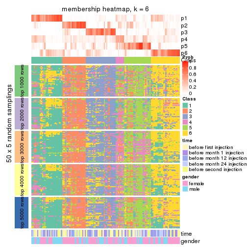</p>

</div>
</div>

As soon as we have had the classes for columns, we can look for signatures
which are significantly different between classes which can be candidate marks
for certain classes. Following are the heatmaps for signatures.


Signature heatmaps where rows are scaled:


<script>
$( function() {
	$( '#tabs-MAD-NMF-get-signatures' ).tabs();
} );
</script>
<div id='tabs-MAD-NMF-get-signatures'>
<ul>
<li><a href='#tab-MAD-NMF-get-signatures-1'>k = 2</a></li>
<li><a href='#tab-MAD-NMF-get-signatures-2'>k = 3</a></li>
<li><a href='#tab-MAD-NMF-get-signatures-3'>k = 4</a></li>
<li><a href='#tab-MAD-NMF-get-signatures-4'>k = 5</a></li>
<li><a href='#tab-MAD-NMF-get-signatures-5'>k = 6</a></li>
</ul>
<div id='tab-MAD-NMF-get-signatures-1'>
<pre><code class="r">get_signatures(res, k = 2)
</code></pre>

<p></p>

</div>
<div id='tab-MAD-NMF-get-signatures-2'>
<pre><code class="r">get_signatures(res, k = 3)
</code></pre>

<p></p>

</div>
<div id='tab-MAD-NMF-get-signatures-3'>
<pre><code class="r">get_signatures(res, k = 4)
</code></pre>

<p></p>

</div>
<div id='tab-MAD-NMF-get-signatures-4'>
<pre><code class="r">get_signatures(res, k = 5)
</code></pre>

<p></p>

</div>
<div id='tab-MAD-NMF-get-signatures-5'>
<pre><code class="r">get_signatures(res, k = 6)
</code></pre>

<p></p>

</div>
</div>


Signature heatmaps where rows are not scaled:


<script>
$( function() {
	$( '#tabs-MAD-NMF-get-signatures-no-scale' ).tabs();
} );
</script>
<div id='tabs-MAD-NMF-get-signatures-no-scale'>
<ul>
<li><a href='#tab-MAD-NMF-get-signatures-no-scale-1'>k = 2</a></li>
<li><a href='#tab-MAD-NMF-get-signatures-no-scale-2'>k = 3</a></li>
<li><a href='#tab-MAD-NMF-get-signatures-no-scale-3'>k = 4</a></li>
<li><a href='#tab-MAD-NMF-get-signatures-no-scale-4'>k = 5</a></li>
<li><a href='#tab-MAD-NMF-get-signatures-no-scale-5'>k = 6</a></li>
</ul>
<div id='tab-MAD-NMF-get-signatures-no-scale-1'>
<pre><code class="r">get_signatures(res, k = 2, scale_rows = FALSE)
</code></pre>

<p></p>

</div>
<div id='tab-MAD-NMF-get-signatures-no-scale-2'>
<pre><code class="r">get_signatures(res, k = 3, scale_rows = FALSE)
</code></pre>

<p></p>

</div>
<div id='tab-MAD-NMF-get-signatures-no-scale-3'>
<pre><code class="r">get_signatures(res, k = 4, scale_rows = FALSE)
</code></pre>

<p></p>

</div>
<div id='tab-MAD-NMF-get-signatures-no-scale-4'>
<pre><code class="r">get_signatures(res, k = 5, scale_rows = FALSE)
</code></pre>

<p></p>

</div>
<div id='tab-MAD-NMF-get-signatures-no-scale-5'>
<pre><code class="r">get_signatures(res, k = 6, scale_rows = FALSE)
</code></pre>

<p></p>

</div>
</div>


Compare the overlap of signatures from different k:

```r
compare_signatures(res)
```


`get_signature()` returns a data frame invisibly. TO get the list of signatures, the function
call should be assigned to a variable explicitly. In following code, if `plot` argument is set
to `FALSE`, no heatmap is plotted while only the differential analysis is performed.

```r
# code only for demonstration
tb = get_signature(res, k = ..., plot = FALSE)
```

An example of the output of `tb` is:

```
#>   which_row         fdr    mean_1    mean_2 scaled_mean_1 scaled_mean_2 km
#> 1        38 0.042760348  8.373488  9.131774    -0.5533452     0.5164555  1
#> 2        40 0.018707592  7.106213  8.469186    -0.6173731     0.5762149  1
#> 3        55 0.019134737 10.221463 11.207825    -0.6159697     0.5749050  1
#> 4        59 0.006059896  5.921854  7.869574    -0.6899429     0.6439467  1
#> 5        60 0.018055526  8.928898 10.211722    -0.6204761     0.5791110  1
#> 6        98 0.009384629 15.714769 14.887706     0.6635654    -0.6193277  2
...
```

The columns in `tb` are:

1. `which_row`: row indices corresponding to the input matrix.
2. `fdr`: FDR for the differential test. 
3. `mean_x`: The mean value in group x.
4. `scaled_mean_x`: The mean value in group x after rows are scaled.
5. `km`: Row groups if k-means clustering is applied to rows.


UMAP plot which shows how samples are separated.


<script>
$( function() {
	$( '#tabs-MAD-NMF-dimension-reduction' ).tabs();
} );
</script>
<div id='tabs-MAD-NMF-dimension-reduction'>
<ul>
<li><a href='#tab-MAD-NMF-dimension-reduction-1'>k = 2</a></li>
<li><a href='#tab-MAD-NMF-dimension-reduction-2'>k = 3</a></li>
<li><a href='#tab-MAD-NMF-dimension-reduction-3'>k = 4</a></li>
<li><a href='#tab-MAD-NMF-dimension-reduction-4'>k = 5</a></li>
<li><a href='#tab-MAD-NMF-dimension-reduction-5'>k = 6</a></li>
</ul>
<div id='tab-MAD-NMF-dimension-reduction-1'>
<pre><code class="r">dimension_reduction(res, k = 2, method = &quot;UMAP&quot;)
</code></pre>

<p></p>

</div>
<div id='tab-MAD-NMF-dimension-reduction-2'>
<pre><code class="r">dimension_reduction(res, k = 3, method = &quot;UMAP&quot;)
</code></pre>

<p></p>

</div>
<div id='tab-MAD-NMF-dimension-reduction-3'>
<pre><code class="r">dimension_reduction(res, k = 4, method = &quot;UMAP&quot;)
</code></pre>

<p></p>

</div>
<div id='tab-MAD-NMF-dimension-reduction-4'>
<pre><code class="r">dimension_reduction(res, k = 5, method = &quot;UMAP&quot;)
</code></pre>

<p></p>

</div>
<div id='tab-MAD-NMF-dimension-reduction-5'>
<pre><code class="r">dimension_reduction(res, k = 6, method = &quot;UMAP&quot;)
</code></pre>

<p></p>

</div>
</div>


Following heatmap shows how subgroups are split when increasing `k`:

```r
collect_classes(res)
```


Test correlation between subgroups and known annotations. If the known
annotation is numeric, one-way ANOVA test is applied, and if the known
annotation is discrete, chi-squared contingency table test is applied.

```r
test_to_known_factors(res)
```

```
#>           n time(p) gender(p) k
#> MAD:NMF 123   0.204   0.97448 2
#> MAD:NMF  84   0.422   0.21684 3
#> MAD:NMF  74   0.509   0.88272 4
#> MAD:NMF  61   0.362   0.10623 5
#> MAD:NMF  43   0.813   0.00271 6
```


If matrix rows can be associated to genes, consider to use `functional_enrichment(res,
...)` to perform function enrichment for the signature genes. See [this vignette](http://bioconductor.org/packages/devel/bioc/vignettes/cola/inst/doc/functional_enrichment.html) for more detailed explanations.


 

---------------------------------------------------


### ATC:hclust


The object with results only for a single top-value method and a single partition method 
can be extracted as:

```r
res = res_list["ATC", "hclust"]
# you can also extract it by
# res = res_list["ATC:hclust"]
```

A summary of `res` and all the functions that can be applied to it:

```r
res
```

```
#> A 'ConsensusPartition' object with k = 2, 3, 4, 5, 6.
#>   On a matrix with 21512 rows and 125 columns.
#>   Top rows (1000, 2000, 3000, 4000, 5000) are extracted by 'ATC' method.
#>   Subgroups are detected by 'hclust' method.
#>   Performed in total 1250 partitions by row resampling.
#>   Best k for subgroups seems to be 4.
#> 
#> Following methods can be applied to this 'ConsensusPartition' object:
#>  [1] "cola_report"             "collect_classes"         "collect_plots"          
#>  [4] "collect_stats"           "colnames"                "compare_signatures"     
#>  [7] "consensus_heatmap"       "dimension_reduction"     "functional_enrichment"  
#> [10] "get_anno_col"            "get_anno"                "get_classes"            
#> [13] "get_consensus"           "get_matrix"              "get_membership"         
#> [16] "get_param"               "get_signatures"          "get_stats"              
#> [19] "is_best_k"               "is_stable_k"             "membership_heatmap"     
#> [22] "ncol"                    "nrow"                    "plot_ecdf"              
#> [25] "rownames"                "select_partition_number" "show"                   
#> [28] "suggest_best_k"          "test_to_known_factors"
```

`collect_plots()` function collects all the plots made from `res` for all `k` (number of partitions)
into one single page to provide an easy and fast comparison between different `k`.

```r
collect_plots(res)
```


The plots are:

- The first row: a plot of the ECDF (empirical cumulative distribution
  function) curves of the consensus matrix for each `k` and the heatmap of
  predicted classes for each `k`.
- The second row: heatmaps of the consensus matrix for each `k`.
- The third row: heatmaps of the membership matrix for each `k`.
- The fouth row: heatmaps of the signatures for each `k`.

All the plots in panels can be made by individual functions and they are
plotted later in this section.

`select_partition_number()` produces several plots showing different
statistics for choosing "optimized" `k`. There are following statistics:

- ECDF curves of the consensus matrix for each `k`;
- 1-PAC. [The PAC
  score](https://en.wikipedia.org/wiki/Consensus_clustering#Over-interpretation_potential_of_consensus_clustering)
  measures the proportion of the ambiguous subgrouping.
- Mean silhouette score.
- Concordance. The mean probability of fiting the consensus class ids in all
  partitions.
- Area increased. Denote $A_k$ as the area under the ECDF curve for current
  `k`, the area increased is defined as $A_k - A_{k-1}$.
- Rand index. The percent of pairs of samples that are both in a same cluster
  or both are not in a same cluster in the partition of k and k-1.
- Jaccard index. The ratio of pairs of samples are both in a same cluster in
  the partition of k and k-1 and the pairs of samples are both in a same
  cluster in the partition k or k-1.

The detailed explanations of these statistics can be found in [the _cola_
vignette](http://bioconductor.org/packages/devel/bioc/vignettes/cola/inst/doc/cola.html#toc_13).

Generally speaking, lower PAC score, higher mean silhouette score or higher
concordance corresponds to better partition. Rand index and Jaccard index
measure how similar the current partition is compared to partition with `k-1`.
If they are too similar, we won't accept `k` is better than `k-1`.

```r
select_partition_number(res)
```


The numeric values for all these statistics can be obtained by `get_stats()`.

```r
get_stats(res)
```

```
#>   k 1-PAC mean_silhouette concordance area_increased  Rand Jaccard
#> 2 2 0.496           0.966       0.857         0.3689 0.496   0.496
#> 3 3 0.949           0.953       0.982         0.4037 0.992   0.984
#> 4 4 0.720           0.820       0.892         0.1445 0.965   0.927
#> 5 5 0.659           0.778       0.865         0.1262 0.899   0.779
#> 6 6 0.634           0.695       0.796         0.0653 0.976   0.934
```

`suggest_best_k()` suggests the best $k$ based on these statistics. The rules are as follows:

- All $k$ with Jaccard index larger than 0.95 are removed because increasing
  $k$ does not provide enough extra information. If all $k$ are removed, it is
  marked as no subgroup is detected.
- For all $k$ with 1-PAC score larger than 0.9, the maximal $k$ is taken as
  the best $k$, and other $k$ are marked as optional $k$.
- If it does not fit the second rule. The $k$ with the maximal vote of the
  highest 1-PAC score, highest mean silhouette, and highest concordance is
  taken as the best $k$.

```r
suggest_best_k(res)
```

```
#> [1] 4
```


Following shows the table of the partitions (You need to click the **show/hide
code output** link to see it). The membership matrix (columns with name `p*`)
is inferred by
[`clue::cl_consensus()`](https://www.rdocumentation.org/link/cl_consensus?package=clue)
function with the `SE` method. Basically the value in the membership matrix
represents the probability to belong to a certain group. The finall class
label for an item is determined with the group with highest probability it
belongs to.

In `get_classes()` function, the entropy is calculated from the membership
matrix and the silhouette score is calculated from the consensus matrix.


<script>
$( function() {
	$( '#tabs-ATC-hclust-get-classes' ).tabs();
} );
</script>
<div id='tabs-ATC-hclust-get-classes'>
<ul>
<li><a href='#tab-ATC-hclust-get-classes-1'>k = 2</a></li>
<li><a href='#tab-ATC-hclust-get-classes-2'>k = 3</a></li>
<li><a href='#tab-ATC-hclust-get-classes-3'>k = 4</a></li>
<li><a href='#tab-ATC-hclust-get-classes-4'>k = 5</a></li>
<li><a href='#tab-ATC-hclust-get-classes-5'>k = 6</a></li>
</ul>

<div id='tab-ATC-hclust-get-classes-1'>
<p><a id='tab-ATC-hclust-get-classes-1-a' style='color:#0366d6' href='#'>show/hide code output</a></p>
<pre><code class="r">cbind(get_classes(res, k = 2), get_membership(res, k = 2))
</code></pre>

<pre><code>#&gt;           class entropy silhouette    p1    p2
#&gt; GSM601872     2  0.8555      0.987 0.280 0.720
#&gt; GSM601882     2  0.8555      0.987 0.280 0.720
#&gt; GSM601887     1  0.0000      0.976 1.000 0.000
#&gt; GSM601892     1  0.0000      0.976 1.000 0.000
#&gt; GSM601897     1  0.0376      0.973 0.996 0.004
#&gt; GSM601902     2  0.8555      0.987 0.280 0.720
#&gt; GSM601912     1  0.4022      0.891 0.920 0.080
#&gt; GSM601927     1  0.0000      0.976 1.000 0.000
#&gt; GSM601932     2  0.8555      0.987 0.280 0.720
#&gt; GSM601937     2  0.8555      0.987 0.280 0.720
#&gt; GSM601942     2  0.8555      0.987 0.280 0.720
#&gt; GSM601947     2  0.8909      0.952 0.308 0.692
#&gt; GSM601957     1  0.0000      0.976 1.000 0.000
#&gt; GSM601972     2  0.8555      0.987 0.280 0.720
#&gt; GSM601977     2  0.8555      0.987 0.280 0.720
#&gt; GSM601987     2  0.8555      0.987 0.280 0.720
#&gt; GSM601877     1  0.0000      0.976 1.000 0.000
#&gt; GSM601907     2  0.8555      0.987 0.280 0.720
#&gt; GSM601917     2  0.8555      0.987 0.280 0.720
#&gt; GSM601922     2  0.8555      0.987 0.280 0.720
#&gt; GSM601952     2  0.8555      0.987 0.280 0.720
#&gt; GSM601962     1  0.4022      0.891 0.920 0.080
#&gt; GSM601967     1  0.0000      0.976 1.000 0.000
#&gt; GSM601982     2  0.8555      0.987 0.280 0.720
#&gt; GSM601992     2  0.8555      0.987 0.280 0.720
#&gt; GSM601873     2  0.8555      0.987 0.280 0.720
#&gt; GSM601883     2  0.8555      0.987 0.280 0.720
#&gt; GSM601888     1  0.0000      0.976 1.000 0.000
#&gt; GSM601893     1  0.0000      0.976 1.000 0.000
#&gt; GSM601898     1  0.0000      0.976 1.000 0.000
#&gt; GSM601903     2  0.8555      0.987 0.280 0.720
#&gt; GSM601913     1  0.0938      0.967 0.988 0.012
#&gt; GSM601928     1  0.0000      0.976 1.000 0.000
#&gt; GSM601933     2  0.8555      0.987 0.280 0.720
#&gt; GSM601938     2  0.8555      0.987 0.280 0.720
#&gt; GSM601943     2  0.8555      0.987 0.280 0.720
#&gt; GSM601948     1  0.0376      0.973 0.996 0.004
#&gt; GSM601958     1  0.0000      0.976 1.000 0.000
#&gt; GSM601973     2  0.8555      0.987 0.280 0.720
#&gt; GSM601978     2  0.8555      0.987 0.280 0.720
#&gt; GSM601988     2  0.8207      0.960 0.256 0.744
#&gt; GSM601878     1  0.0000      0.976 1.000 0.000
#&gt; GSM601908     2  0.8555      0.987 0.280 0.720
#&gt; GSM601918     2  0.8555      0.987 0.280 0.720
#&gt; GSM601923     1  0.0000      0.976 1.000 0.000
#&gt; GSM601953     2  0.8555      0.987 0.280 0.720
#&gt; GSM601963     1  0.0000      0.976 1.000 0.000
#&gt; GSM601968     1  0.0000      0.976 1.000 0.000
#&gt; GSM601983     1  0.0000      0.976 1.000 0.000
#&gt; GSM601993     2  0.8555      0.987 0.280 0.720
#&gt; GSM601874     2  0.8555      0.987 0.280 0.720
#&gt; GSM601884     2  0.8555      0.987 0.280 0.720
#&gt; GSM601889     1  0.0000      0.976 1.000 0.000
#&gt; GSM601894     1  0.0000      0.976 1.000 0.000
#&gt; GSM601899     1  0.0000      0.976 1.000 0.000
#&gt; GSM601904     2  0.8608      0.983 0.284 0.716
#&gt; GSM601914     1  0.0000      0.976 1.000 0.000
#&gt; GSM601929     1  0.2778      0.931 0.952 0.048
#&gt; GSM601934     2  0.8555      0.987 0.280 0.720
#&gt; GSM601939     1  0.0000      0.976 1.000 0.000
#&gt; GSM601944     2  0.8555      0.987 0.280 0.720
#&gt; GSM601949     1  0.0000      0.976 1.000 0.000
#&gt; GSM601959     1  0.0000      0.976 1.000 0.000
#&gt; GSM601974     2  0.8955      0.947 0.312 0.688
#&gt; GSM601979     2  0.8555      0.987 0.280 0.720
#&gt; GSM601989     1  0.0672      0.970 0.992 0.008
#&gt; GSM601879     1  0.0000      0.976 1.000 0.000
#&gt; GSM601909     1  0.0000      0.976 1.000 0.000
#&gt; GSM601919     2  0.8555      0.987 0.280 0.720
#&gt; GSM601924     1  0.0000      0.976 1.000 0.000
#&gt; GSM601954     2  0.8909      0.952 0.308 0.692
#&gt; GSM601964     1  0.0000      0.976 1.000 0.000
#&gt; GSM601969     1  0.0000      0.976 1.000 0.000
#&gt; GSM601984     1  0.3733      0.901 0.928 0.072
#&gt; GSM601994     2  0.8555      0.987 0.280 0.720
#&gt; GSM601875     2  0.8555      0.987 0.280 0.720
#&gt; GSM601885     2  0.8555      0.987 0.280 0.720
#&gt; GSM601890     1  0.0000      0.976 1.000 0.000
#&gt; GSM601895     1  0.0000      0.976 1.000 0.000
#&gt; GSM601900     1  0.0938      0.967 0.988 0.012
#&gt; GSM601905     2  0.8661      0.979 0.288 0.712
#&gt; GSM601915     1  0.0000      0.976 1.000 0.000
#&gt; GSM601930     1  0.0000      0.976 1.000 0.000
#&gt; GSM601935     2  0.8207      0.960 0.256 0.744
#&gt; GSM601940     1  0.0000      0.976 1.000 0.000
#&gt; GSM601945     2  0.8555      0.987 0.280 0.720
#&gt; GSM601950     1  0.0000      0.976 1.000 0.000
#&gt; GSM601960     1  0.0000      0.976 1.000 0.000
#&gt; GSM601975     2  0.8555      0.987 0.280 0.720
#&gt; GSM601980     2  0.8207      0.960 0.256 0.744
#&gt; GSM601990     1  0.5842      0.789 0.860 0.140
#&gt; GSM601880     1  0.0000      0.976 1.000 0.000
#&gt; GSM601910     1  0.0376      0.973 0.996 0.004
#&gt; GSM601920     2  0.8661      0.979 0.288 0.712
#&gt; GSM601925     1  0.0000      0.976 1.000 0.000
#&gt; GSM601955     2  0.8207      0.960 0.256 0.744
#&gt; GSM601965     1  0.3879      0.896 0.924 0.076
#&gt; GSM601970     1  0.0000      0.976 1.000 0.000
#&gt; GSM601985     1  0.0000      0.976 1.000 0.000
#&gt; GSM601995     2  0.0000      0.631 0.000 1.000
#&gt; GSM601876     1  0.2423      0.940 0.960 0.040
#&gt; GSM601886     2  0.8555      0.987 0.280 0.720
#&gt; GSM601891     1  0.0000      0.976 1.000 0.000
#&gt; GSM601896     1  0.2423      0.940 0.960 0.040
#&gt; GSM601901     2  0.8555      0.987 0.280 0.720
#&gt; GSM601906     2  0.8661      0.979 0.288 0.712
#&gt; GSM601916     2  0.8661      0.979 0.288 0.712
#&gt; GSM601931     1  0.0000      0.976 1.000 0.000
#&gt; GSM601936     2  0.8207      0.960 0.256 0.744
#&gt; GSM601941     2  0.8555      0.987 0.280 0.720
#&gt; GSM601946     1  0.0000      0.976 1.000 0.000
#&gt; GSM601951     1  0.0376      0.973 0.996 0.004
#&gt; GSM601961     1  0.4815      0.848 0.896 0.104
#&gt; GSM601976     2  0.8608      0.983 0.284 0.716
#&gt; GSM601981     2  0.8555      0.987 0.280 0.720
#&gt; GSM601991     1  0.5842      0.789 0.860 0.140
#&gt; GSM601881     1  0.0000      0.976 1.000 0.000
#&gt; GSM601911     1  0.5059      0.842 0.888 0.112
#&gt; GSM601921     2  0.8661      0.979 0.288 0.712
#&gt; GSM601926     1  0.0000      0.976 1.000 0.000
#&gt; GSM601956     2  0.8555      0.987 0.280 0.720
#&gt; GSM601966     2  0.8555      0.987 0.280 0.720
#&gt; GSM601971     1  0.0000      0.976 1.000 0.000
#&gt; GSM601986     1  0.5059      0.842 0.888 0.112
#&gt; GSM601996     2  0.8555      0.987 0.280 0.720
</code></pre>

<script>
$('#tab-ATC-hclust-get-classes-1-a').parent().next().next().hide();
$('#tab-ATC-hclust-get-classes-1-a').click(function(){
  $('#tab-ATC-hclust-get-classes-1-a').parent().next().next().toggle();
  return(false);
});
</script>
</div>

<div id='tab-ATC-hclust-get-classes-2'>
<p><a id='tab-ATC-hclust-get-classes-2-a' style='color:#0366d6' href='#'>show/hide code output</a></p>
<pre><code class="r">cbind(get_classes(res, k = 3), get_membership(res, k = 3))
</code></pre>

<pre><code>#&gt;           class entropy silhouette    p1    p2    p3
#&gt; GSM601872     2  0.0000      0.980 0.000 1.000 0.000
#&gt; GSM601882     2  0.0000      0.980 0.000 1.000 0.000
#&gt; GSM601887     1  0.0000      0.977 1.000 0.000 0.000
#&gt; GSM601892     1  0.0000      0.977 1.000 0.000 0.000
#&gt; GSM601897     1  0.0237      0.975 0.996 0.004 0.000
#&gt; GSM601902     2  0.0000      0.980 0.000 1.000 0.000
#&gt; GSM601912     1  0.2537      0.899 0.920 0.080 0.000
#&gt; GSM601927     1  0.0000      0.977 1.000 0.000 0.000
#&gt; GSM601932     2  0.0237      0.978 0.000 0.996 0.004
#&gt; GSM601937     2  0.2261      0.927 0.000 0.932 0.068
#&gt; GSM601942     2  0.0000      0.980 0.000 1.000 0.000
#&gt; GSM601947     2  0.3941      0.746 0.156 0.844 0.000
#&gt; GSM601957     1  0.0000      0.977 1.000 0.000 0.000
#&gt; GSM601972     2  0.0000      0.980 0.000 1.000 0.000
#&gt; GSM601977     2  0.0000      0.980 0.000 1.000 0.000
#&gt; GSM601987     2  0.0000      0.980 0.000 1.000 0.000
#&gt; GSM601877     1  0.0000      0.977 1.000 0.000 0.000
#&gt; GSM601907     2  0.0000      0.980 0.000 1.000 0.000
#&gt; GSM601917     2  0.1031      0.964 0.000 0.976 0.024
#&gt; GSM601922     2  0.0000      0.980 0.000 1.000 0.000
#&gt; GSM601952     2  0.0237      0.978 0.000 0.996 0.004
#&gt; GSM601962     1  0.2774      0.903 0.920 0.072 0.008
#&gt; GSM601967     1  0.0000      0.977 1.000 0.000 0.000
#&gt; GSM601982     2  0.0000      0.980 0.000 1.000 0.000
#&gt; GSM601992     2  0.0000      0.980 0.000 1.000 0.000
#&gt; GSM601873     2  0.0000      0.980 0.000 1.000 0.000
#&gt; GSM601883     2  0.0000      0.980 0.000 1.000 0.000
#&gt; GSM601888     1  0.0000      0.977 1.000 0.000 0.000
#&gt; GSM601893     1  0.0000      0.977 1.000 0.000 0.000
#&gt; GSM601898     1  0.0000      0.977 1.000 0.000 0.000
#&gt; GSM601903     2  0.0000      0.980 0.000 1.000 0.000
#&gt; GSM601913     1  0.0592      0.968 0.988 0.012 0.000
#&gt; GSM601928     1  0.0000      0.977 1.000 0.000 0.000
#&gt; GSM601933     2  0.0000      0.980 0.000 1.000 0.000
#&gt; GSM601938     2  0.0000      0.980 0.000 1.000 0.000
#&gt; GSM601943     2  0.0000      0.980 0.000 1.000 0.000
#&gt; GSM601948     1  0.0237      0.974 0.996 0.004 0.000
#&gt; GSM601958     1  0.0000      0.977 1.000 0.000 0.000
#&gt; GSM601973     2  0.0000      0.980 0.000 1.000 0.000
#&gt; GSM601978     2  0.0000      0.980 0.000 1.000 0.000
#&gt; GSM601988     2  0.2625      0.912 0.000 0.916 0.084
#&gt; GSM601878     1  0.0000      0.977 1.000 0.000 0.000
#&gt; GSM601908     2  0.0000      0.980 0.000 1.000 0.000
#&gt; GSM601918     2  0.0000      0.980 0.000 1.000 0.000
#&gt; GSM601923     1  0.0000      0.977 1.000 0.000 0.000
#&gt; GSM601953     2  0.0000      0.980 0.000 1.000 0.000
#&gt; GSM601963     1  0.0000      0.977 1.000 0.000 0.000
#&gt; GSM601968     1  0.0000      0.977 1.000 0.000 0.000
#&gt; GSM601983     1  0.0000      0.977 1.000 0.000 0.000
#&gt; GSM601993     2  0.0000      0.980 0.000 1.000 0.000
#&gt; GSM601874     2  0.0000      0.980 0.000 1.000 0.000
#&gt; GSM601884     2  0.0000      0.980 0.000 1.000 0.000
#&gt; GSM601889     1  0.0000      0.977 1.000 0.000 0.000
#&gt; GSM601894     1  0.0000      0.977 1.000 0.000 0.000
#&gt; GSM601899     1  0.0000      0.977 1.000 0.000 0.000
#&gt; GSM601904     2  0.0237      0.977 0.004 0.996 0.000
#&gt; GSM601914     1  0.0000      0.977 1.000 0.000 0.000
#&gt; GSM601929     1  0.1753      0.934 0.952 0.048 0.000
#&gt; GSM601934     2  0.0000      0.980 0.000 1.000 0.000
#&gt; GSM601939     1  0.0000      0.977 1.000 0.000 0.000
#&gt; GSM601944     2  0.0000      0.980 0.000 1.000 0.000
#&gt; GSM601949     1  0.0000      0.977 1.000 0.000 0.000
#&gt; GSM601959     1  0.0000      0.977 1.000 0.000 0.000
#&gt; GSM601974     2  0.1289      0.947 0.032 0.968 0.000
#&gt; GSM601979     2  0.0000      0.980 0.000 1.000 0.000
#&gt; GSM601989     1  0.0424      0.971 0.992 0.008 0.000
#&gt; GSM601879     1  0.0000      0.977 1.000 0.000 0.000
#&gt; GSM601909     1  0.0000      0.977 1.000 0.000 0.000
#&gt; GSM601919     2  0.0000      0.980 0.000 1.000 0.000
#&gt; GSM601924     1  0.0000      0.977 1.000 0.000 0.000
#&gt; GSM601954     2  0.1411      0.940 0.036 0.964 0.000
#&gt; GSM601964     1  0.0000      0.977 1.000 0.000 0.000
#&gt; GSM601969     1  0.0000      0.977 1.000 0.000 0.000
#&gt; GSM601984     1  0.2448      0.903 0.924 0.076 0.000
#&gt; GSM601994     2  0.0000      0.980 0.000 1.000 0.000
#&gt; GSM601875     2  0.0000      0.980 0.000 1.000 0.000
#&gt; GSM601885     2  0.0000      0.980 0.000 1.000 0.000
#&gt; GSM601890     1  0.0000      0.977 1.000 0.000 0.000
#&gt; GSM601895     1  0.0000      0.977 1.000 0.000 0.000
#&gt; GSM601900     1  0.0592      0.968 0.988 0.012 0.000
#&gt; GSM601905     2  0.0424      0.973 0.008 0.992 0.000
#&gt; GSM601915     1  0.0000      0.977 1.000 0.000 0.000
#&gt; GSM601930     1  0.0000      0.977 1.000 0.000 0.000
#&gt; GSM601935     2  0.3879      0.837 0.000 0.848 0.152
#&gt; GSM601940     1  0.0000      0.977 1.000 0.000 0.000
#&gt; GSM601945     2  0.0000      0.980 0.000 1.000 0.000
#&gt; GSM601950     1  0.0000      0.977 1.000 0.000 0.000
#&gt; GSM601960     1  0.0000      0.977 1.000 0.000 0.000
#&gt; GSM601975     2  0.0000      0.980 0.000 1.000 0.000
#&gt; GSM601980     2  0.2878      0.899 0.000 0.904 0.096
#&gt; GSM601990     1  0.4544      0.842 0.860 0.084 0.056
#&gt; GSM601880     1  0.0000      0.977 1.000 0.000 0.000
#&gt; GSM601910     1  0.0237      0.975 0.996 0.004 0.000
#&gt; GSM601920     2  0.0424      0.973 0.008 0.992 0.000
#&gt; GSM601925     1  0.0000      0.977 1.000 0.000 0.000
#&gt; GSM601955     2  0.4702      0.757 0.000 0.788 0.212
#&gt; GSM601965     1  0.2537      0.899 0.920 0.080 0.000
#&gt; GSM601970     1  0.0000      0.977 1.000 0.000 0.000
#&gt; GSM601985     1  0.0000      0.977 1.000 0.000 0.000
#&gt; GSM601995     3  0.0000      0.000 0.000 0.000 1.000
#&gt; GSM601876     1  0.1643      0.939 0.956 0.044 0.000
#&gt; GSM601886     2  0.0892      0.967 0.000 0.980 0.020
#&gt; GSM601891     1  0.0000      0.977 1.000 0.000 0.000
#&gt; GSM601896     1  0.1643      0.939 0.956 0.044 0.000
#&gt; GSM601901     2  0.0000      0.980 0.000 1.000 0.000
#&gt; GSM601906     2  0.0424      0.973 0.008 0.992 0.000
#&gt; GSM601916     2  0.0424      0.973 0.008 0.992 0.000
#&gt; GSM601931     1  0.0000      0.977 1.000 0.000 0.000
#&gt; GSM601936     2  0.3879      0.837 0.000 0.848 0.152
#&gt; GSM601941     2  0.0000      0.980 0.000 1.000 0.000
#&gt; GSM601946     1  0.0000      0.977 1.000 0.000 0.000
#&gt; GSM601951     1  0.0237      0.974 0.996 0.004 0.000
#&gt; GSM601961     1  0.3038      0.859 0.896 0.104 0.000
#&gt; GSM601976     2  0.0237      0.977 0.004 0.996 0.000
#&gt; GSM601981     2  0.0000      0.980 0.000 1.000 0.000
#&gt; GSM601991     1  0.4544      0.842 0.860 0.084 0.056
#&gt; GSM601881     1  0.0000      0.977 1.000 0.000 0.000
#&gt; GSM601911     1  0.3267      0.851 0.884 0.116 0.000
#&gt; GSM601921     2  0.0424      0.973 0.008 0.992 0.000
#&gt; GSM601926     1  0.0000      0.977 1.000 0.000 0.000
#&gt; GSM601956     2  0.0000      0.980 0.000 1.000 0.000
#&gt; GSM601966     2  0.0000      0.980 0.000 1.000 0.000
#&gt; GSM601971     1  0.0000      0.977 1.000 0.000 0.000
#&gt; GSM601986     1  0.3267      0.851 0.884 0.116 0.000
#&gt; GSM601996     2  0.0000      0.980 0.000 1.000 0.000
</code></pre>

<script>
$('#tab-ATC-hclust-get-classes-2-a').parent().next().next().hide();
$('#tab-ATC-hclust-get-classes-2-a').click(function(){
  $('#tab-ATC-hclust-get-classes-2-a').parent().next().next().toggle();
  return(false);
});
</script>
</div>

<div id='tab-ATC-hclust-get-classes-3'>
<p><a id='tab-ATC-hclust-get-classes-3-a' style='color:#0366d6' href='#'>show/hide code output</a></p>
<pre><code class="r">cbind(get_classes(res, k = 4), get_membership(res, k = 4))
</code></pre>

<pre><code>#&gt;           class entropy silhouette    p1    p2    p3    p4
#&gt; GSM601872     2  0.0469      0.869 0.000 0.988 0.000 0.012
#&gt; GSM601882     2  0.0921      0.861 0.000 0.972 0.000 0.028
#&gt; GSM601887     1  0.3266      0.857 0.832 0.000 0.000 0.168
#&gt; GSM601892     1  0.3219      0.859 0.836 0.000 0.000 0.164
#&gt; GSM601897     1  0.1389      0.910 0.952 0.000 0.000 0.048
#&gt; GSM601902     2  0.1940      0.857 0.000 0.924 0.000 0.076
#&gt; GSM601912     1  0.3575      0.869 0.852 0.020 0.004 0.124
#&gt; GSM601927     1  0.0921      0.915 0.972 0.000 0.028 0.000
#&gt; GSM601932     2  0.2011      0.863 0.000 0.920 0.000 0.080
#&gt; GSM601937     4  0.5657      0.722 0.000 0.436 0.024 0.540
#&gt; GSM601942     2  0.0469      0.869 0.000 0.988 0.000 0.012
#&gt; GSM601947     2  0.4122      0.578 0.000 0.760 0.004 0.236
#&gt; GSM601957     1  0.1576      0.912 0.948 0.000 0.048 0.004
#&gt; GSM601972     2  0.1867      0.857 0.000 0.928 0.000 0.072
#&gt; GSM601977     2  0.0469      0.869 0.000 0.988 0.000 0.012
#&gt; GSM601987     2  0.1940      0.855 0.000 0.924 0.000 0.076
#&gt; GSM601877     1  0.0817      0.913 0.976 0.000 0.000 0.024
#&gt; GSM601907     2  0.0188      0.871 0.000 0.996 0.000 0.004
#&gt; GSM601917     2  0.3271      0.794 0.000 0.856 0.012 0.132
#&gt; GSM601922     2  0.1940      0.857 0.000 0.924 0.000 0.076
#&gt; GSM601952     2  0.1302      0.861 0.000 0.956 0.000 0.044
#&gt; GSM601962     1  0.3172      0.877 0.872 0.012 0.004 0.112
#&gt; GSM601967     1  0.2530      0.895 0.896 0.000 0.004 0.100
#&gt; GSM601982     2  0.0817      0.865 0.000 0.976 0.000 0.024
#&gt; GSM601992     2  0.3649      0.598 0.000 0.796 0.000 0.204
#&gt; GSM601873     2  0.0707      0.868 0.000 0.980 0.000 0.020
#&gt; GSM601883     2  0.0921      0.861 0.000 0.972 0.000 0.028
#&gt; GSM601888     1  0.3668      0.843 0.808 0.000 0.004 0.188
#&gt; GSM601893     1  0.0524      0.915 0.988 0.000 0.004 0.008
#&gt; GSM601898     1  0.1722      0.913 0.944 0.000 0.048 0.008
#&gt; GSM601903     2  0.1940      0.857 0.000 0.924 0.000 0.076
#&gt; GSM601913     1  0.1724      0.915 0.948 0.000 0.032 0.020
#&gt; GSM601928     1  0.1389      0.912 0.952 0.000 0.048 0.000
#&gt; GSM601933     2  0.0188      0.871 0.000 0.996 0.000 0.004
#&gt; GSM601938     2  0.4972     -0.514 0.000 0.544 0.000 0.456
#&gt; GSM601943     2  0.0592      0.869 0.000 0.984 0.000 0.016
#&gt; GSM601948     1  0.3908      0.825 0.784 0.000 0.004 0.212
#&gt; GSM601958     1  0.1576      0.912 0.948 0.000 0.048 0.004
#&gt; GSM601973     2  0.2149      0.855 0.000 0.912 0.000 0.088
#&gt; GSM601978     2  0.0188      0.871 0.000 0.996 0.000 0.004
#&gt; GSM601988     4  0.5159      0.764 0.000 0.364 0.012 0.624
#&gt; GSM601878     1  0.0817      0.913 0.976 0.000 0.000 0.024
#&gt; GSM601908     2  0.0188      0.871 0.000 0.996 0.000 0.004
#&gt; GSM601918     2  0.1940      0.857 0.000 0.924 0.000 0.076
#&gt; GSM601923     1  0.1389      0.912 0.952 0.000 0.048 0.000
#&gt; GSM601953     2  0.2011      0.850 0.000 0.920 0.000 0.080
#&gt; GSM601963     1  0.1389      0.912 0.952 0.000 0.048 0.000
#&gt; GSM601968     1  0.2530      0.895 0.896 0.000 0.004 0.100
#&gt; GSM601983     1  0.1398      0.915 0.956 0.000 0.040 0.004
#&gt; GSM601993     2  0.3649      0.598 0.000 0.796 0.000 0.204
#&gt; GSM601874     2  0.0188      0.871 0.000 0.996 0.000 0.004
#&gt; GSM601884     2  0.0921      0.861 0.000 0.972 0.000 0.028
#&gt; GSM601889     1  0.1722      0.913 0.944 0.000 0.048 0.008
#&gt; GSM601894     1  0.1389      0.912 0.952 0.000 0.048 0.000
#&gt; GSM601899     1  0.3400      0.851 0.820 0.000 0.000 0.180
#&gt; GSM601904     2  0.2530      0.833 0.000 0.888 0.000 0.112
#&gt; GSM601914     1  0.1389      0.912 0.952 0.000 0.048 0.000
#&gt; GSM601929     1  0.2597      0.896 0.916 0.040 0.004 0.040
#&gt; GSM601934     2  0.0188      0.871 0.000 0.996 0.000 0.004
#&gt; GSM601939     1  0.1389      0.912 0.952 0.000 0.048 0.000
#&gt; GSM601944     2  0.0592      0.870 0.000 0.984 0.000 0.016
#&gt; GSM601949     1  0.3710      0.840 0.804 0.000 0.004 0.192
#&gt; GSM601959     1  0.1722      0.913 0.944 0.000 0.048 0.008
#&gt; GSM601974     2  0.3326      0.795 0.008 0.856 0.004 0.132
#&gt; GSM601979     2  0.0188      0.871 0.000 0.996 0.000 0.004
#&gt; GSM601989     1  0.1716      0.907 0.936 0.000 0.000 0.064
#&gt; GSM601879     1  0.0817      0.913 0.976 0.000 0.000 0.024
#&gt; GSM601909     1  0.1833      0.917 0.944 0.000 0.032 0.024
#&gt; GSM601919     2  0.1940      0.857 0.000 0.924 0.000 0.076
#&gt; GSM601924     1  0.1389      0.912 0.952 0.000 0.048 0.000
#&gt; GSM601954     2  0.2647      0.810 0.000 0.880 0.000 0.120
#&gt; GSM601964     1  0.1389      0.912 0.952 0.000 0.048 0.000
#&gt; GSM601969     1  0.3710      0.841 0.804 0.000 0.004 0.192
#&gt; GSM601984     1  0.3891      0.858 0.828 0.020 0.004 0.148
#&gt; GSM601994     2  0.3649      0.598 0.000 0.796 0.000 0.204
#&gt; GSM601875     2  0.0188      0.871 0.000 0.996 0.000 0.004
#&gt; GSM601885     2  0.0817      0.865 0.000 0.976 0.000 0.024
#&gt; GSM601890     1  0.3400      0.851 0.820 0.000 0.000 0.180
#&gt; GSM601895     1  0.0376      0.915 0.992 0.000 0.004 0.004
#&gt; GSM601900     1  0.0895      0.915 0.976 0.000 0.004 0.020
#&gt; GSM601905     2  0.2647      0.825 0.000 0.880 0.000 0.120
#&gt; GSM601915     1  0.1389      0.912 0.952 0.000 0.048 0.000
#&gt; GSM601930     1  0.0817      0.916 0.976 0.000 0.024 0.000
#&gt; GSM601935     4  0.5267      0.662 0.000 0.240 0.048 0.712
#&gt; GSM601940     1  0.0817      0.916 0.976 0.000 0.024 0.000
#&gt; GSM601945     2  0.0188      0.871 0.000 0.996 0.000 0.004
#&gt; GSM601950     1  0.3668      0.843 0.808 0.000 0.004 0.188
#&gt; GSM601960     1  0.1389      0.912 0.952 0.000 0.048 0.000
#&gt; GSM601975     2  0.1940      0.859 0.000 0.924 0.000 0.076
#&gt; GSM601980     4  0.5778      0.669 0.000 0.472 0.028 0.500
#&gt; GSM601990     1  0.4165      0.844 0.824 0.012 0.024 0.140
#&gt; GSM601880     1  0.0895      0.916 0.976 0.000 0.020 0.004
#&gt; GSM601910     1  0.1302      0.911 0.956 0.000 0.000 0.044
#&gt; GSM601920     2  0.2647      0.825 0.000 0.880 0.000 0.120
#&gt; GSM601925     1  0.0592      0.914 0.984 0.000 0.000 0.016
#&gt; GSM601955     2  0.7037     -0.612 0.000 0.464 0.120 0.416
#&gt; GSM601965     1  0.3940      0.855 0.824 0.020 0.004 0.152
#&gt; GSM601970     1  0.2089      0.913 0.932 0.000 0.048 0.020
#&gt; GSM601985     1  0.1389      0.912 0.952 0.000 0.048 0.000
#&gt; GSM601995     3  0.1557      0.000 0.000 0.000 0.944 0.056
#&gt; GSM601876     1  0.2909      0.890 0.888 0.020 0.000 0.092
#&gt; GSM601886     2  0.4855      0.138 0.000 0.644 0.004 0.352
#&gt; GSM601891     1  0.3400      0.851 0.820 0.000 0.000 0.180
#&gt; GSM601896     1  0.2909      0.890 0.888 0.020 0.000 0.092
#&gt; GSM601901     2  0.1557      0.867 0.000 0.944 0.000 0.056
#&gt; GSM601906     2  0.2647      0.825 0.000 0.880 0.000 0.120
#&gt; GSM601916     2  0.2281      0.847 0.000 0.904 0.000 0.096
#&gt; GSM601931     1  0.1389      0.912 0.952 0.000 0.048 0.000
#&gt; GSM601936     4  0.5267      0.662 0.000 0.240 0.048 0.712
#&gt; GSM601941     2  0.1940      0.860 0.000 0.924 0.000 0.076
#&gt; GSM601946     1  0.1389      0.912 0.952 0.000 0.048 0.000
#&gt; GSM601951     1  0.3908      0.825 0.784 0.000 0.004 0.212
#&gt; GSM601961     1  0.5161      0.727 0.700 0.024 0.004 0.272
#&gt; GSM601976     2  0.2469      0.836 0.000 0.892 0.000 0.108
#&gt; GSM601981     2  0.0188      0.871 0.000 0.996 0.000 0.004
#&gt; GSM601991     1  0.4165      0.844 0.824 0.012 0.024 0.140
#&gt; GSM601881     1  0.1389      0.912 0.952 0.000 0.048 0.000
#&gt; GSM601911     1  0.4538      0.828 0.800 0.048 0.004 0.148
#&gt; GSM601921     2  0.2647      0.825 0.000 0.880 0.000 0.120
#&gt; GSM601926     1  0.1389      0.912 0.952 0.000 0.048 0.000
#&gt; GSM601956     2  0.0188      0.871 0.000 0.996 0.000 0.004
#&gt; GSM601966     2  0.1389      0.868 0.000 0.952 0.000 0.048
#&gt; GSM601971     1  0.3743      0.856 0.824 0.000 0.016 0.160
#&gt; GSM601986     1  0.4538      0.828 0.800 0.048 0.004 0.148
#&gt; GSM601996     2  0.3649      0.598 0.000 0.796 0.000 0.204
</code></pre>

<script>
$('#tab-ATC-hclust-get-classes-3-a').parent().next().next().hide();
$('#tab-ATC-hclust-get-classes-3-a').click(function(){
  $('#tab-ATC-hclust-get-classes-3-a').parent().next().next().toggle();
  return(false);
});
</script>
</div>

<div id='tab-ATC-hclust-get-classes-4'>
<p><a id='tab-ATC-hclust-get-classes-4-a' style='color:#0366d6' href='#'>show/hide code output</a></p>
<pre><code class="r">cbind(get_classes(res, k = 5), get_membership(res, k = 5))
</code></pre>

<pre><code>#&gt;           class entropy silhouette    p1    p2    p3    p4    p5
#&gt; GSM601872     2  0.0290    0.89619 0.000 0.992 0.000 0.000 0.008
#&gt; GSM601882     2  0.0963    0.88882 0.000 0.964 0.000 0.000 0.036
#&gt; GSM601887     1  0.3274    0.90597 0.780 0.000 0.220 0.000 0.000
#&gt; GSM601892     1  0.3366    0.89406 0.768 0.000 0.232 0.000 0.000
#&gt; GSM601897     3  0.3719    0.77254 0.208 0.000 0.776 0.012 0.004
#&gt; GSM601902     2  0.2149    0.88544 0.036 0.916 0.000 0.000 0.048
#&gt; GSM601912     3  0.5895    0.62426 0.280 0.012 0.628 0.020 0.060
#&gt; GSM601927     3  0.1331    0.83008 0.040 0.000 0.952 0.008 0.000
#&gt; GSM601932     2  0.2144    0.89150 0.020 0.912 0.000 0.000 0.068
#&gt; GSM601937     5  0.3913    0.60717 0.000 0.324 0.000 0.000 0.676
#&gt; GSM601942     2  0.0290    0.89619 0.000 0.992 0.000 0.000 0.008
#&gt; GSM601947     2  0.4134    0.66841 0.196 0.760 0.000 0.000 0.044
#&gt; GSM601957     3  0.1041    0.82197 0.032 0.000 0.964 0.004 0.000
#&gt; GSM601972     2  0.2067    0.88645 0.032 0.920 0.000 0.000 0.048
#&gt; GSM601977     2  0.0404    0.89607 0.000 0.988 0.000 0.000 0.012
#&gt; GSM601987     2  0.2069    0.88021 0.012 0.912 0.000 0.000 0.076
#&gt; GSM601877     3  0.3612    0.74982 0.228 0.000 0.764 0.008 0.000
#&gt; GSM601907     2  0.0000    0.89791 0.000 1.000 0.000 0.000 0.000
#&gt; GSM601917     2  0.3284    0.81622 0.024 0.828 0.000 0.000 0.148
#&gt; GSM601922     2  0.2149    0.88544 0.036 0.916 0.000 0.000 0.048
#&gt; GSM601952     2  0.1408    0.88816 0.008 0.948 0.000 0.000 0.044
#&gt; GSM601962     3  0.5551    0.66843 0.240 0.000 0.664 0.024 0.072
#&gt; GSM601967     3  0.4294    0.04428 0.468 0.000 0.532 0.000 0.000
#&gt; GSM601982     2  0.0609    0.89330 0.000 0.980 0.000 0.000 0.020
#&gt; GSM601992     2  0.3636    0.54286 0.000 0.728 0.000 0.000 0.272
#&gt; GSM601873     2  0.0510    0.89582 0.000 0.984 0.000 0.000 0.016
#&gt; GSM601883     2  0.0963    0.88882 0.000 0.964 0.000 0.000 0.036
#&gt; GSM601888     1  0.2813    0.92926 0.832 0.000 0.168 0.000 0.000
#&gt; GSM601893     3  0.2843    0.80787 0.144 0.000 0.848 0.008 0.000
#&gt; GSM601898     3  0.1041    0.82323 0.032 0.000 0.964 0.004 0.000
#&gt; GSM601903     2  0.2149    0.88544 0.036 0.916 0.000 0.000 0.048
#&gt; GSM601913     3  0.1830    0.82793 0.052 0.000 0.932 0.004 0.012
#&gt; GSM601928     3  0.0162    0.82302 0.004 0.000 0.996 0.000 0.000
#&gt; GSM601933     2  0.0000    0.89791 0.000 1.000 0.000 0.000 0.000
#&gt; GSM601938     5  0.4249    0.50509 0.000 0.432 0.000 0.000 0.568
#&gt; GSM601943     2  0.0404    0.89690 0.000 0.988 0.000 0.000 0.012
#&gt; GSM601948     1  0.2763    0.90882 0.848 0.000 0.148 0.004 0.000
#&gt; GSM601958     3  0.1041    0.82197 0.032 0.000 0.964 0.004 0.000
#&gt; GSM601973     2  0.2344    0.88419 0.032 0.904 0.000 0.000 0.064
#&gt; GSM601978     2  0.0000    0.89791 0.000 1.000 0.000 0.000 0.000
#&gt; GSM601988     5  0.2813    0.53552 0.000 0.168 0.000 0.000 0.832
#&gt; GSM601878     3  0.3612    0.74982 0.228 0.000 0.764 0.008 0.000
#&gt; GSM601908     2  0.0000    0.89791 0.000 1.000 0.000 0.000 0.000
#&gt; GSM601918     2  0.2149    0.88544 0.036 0.916 0.000 0.000 0.048
#&gt; GSM601923     3  0.1205    0.81890 0.040 0.000 0.956 0.004 0.000
#&gt; GSM601953     2  0.2153    0.87963 0.044 0.916 0.000 0.000 0.040
#&gt; GSM601963     3  0.1608    0.82121 0.072 0.000 0.928 0.000 0.000
#&gt; GSM601968     3  0.4294    0.04428 0.468 0.000 0.532 0.000 0.000
#&gt; GSM601983     3  0.1892    0.82043 0.080 0.000 0.916 0.004 0.000
#&gt; GSM601993     2  0.3636    0.54286 0.000 0.728 0.000 0.000 0.272
#&gt; GSM601874     2  0.0000    0.89791 0.000 1.000 0.000 0.000 0.000
#&gt; GSM601884     2  0.0963    0.88882 0.000 0.964 0.000 0.000 0.036
#&gt; GSM601889     3  0.1041    0.82323 0.032 0.000 0.964 0.004 0.000
#&gt; GSM601894     3  0.0771    0.82373 0.020 0.000 0.976 0.004 0.000
#&gt; GSM601899     1  0.3074    0.92734 0.804 0.000 0.196 0.000 0.000
#&gt; GSM601904     2  0.2850    0.86080 0.036 0.872 0.000 0.000 0.092
#&gt; GSM601914     3  0.0404    0.82356 0.012 0.000 0.988 0.000 0.000
#&gt; GSM601929     3  0.4930    0.69701 0.240 0.040 0.704 0.012 0.004
#&gt; GSM601934     2  0.0000    0.89791 0.000 1.000 0.000 0.000 0.000
#&gt; GSM601939     3  0.0324    0.82215 0.004 0.000 0.992 0.004 0.000
#&gt; GSM601944     2  0.0404    0.89733 0.000 0.988 0.000 0.000 0.012
#&gt; GSM601949     1  0.2813    0.92827 0.832 0.000 0.168 0.000 0.000
#&gt; GSM601959     3  0.1124    0.82251 0.036 0.000 0.960 0.004 0.000
#&gt; GSM601974     2  0.3507    0.83198 0.060 0.844 0.000 0.008 0.088
#&gt; GSM601979     2  0.0000    0.89791 0.000 1.000 0.000 0.000 0.000
#&gt; GSM601989     3  0.3966    0.76014 0.224 0.000 0.756 0.012 0.008
#&gt; GSM601879     3  0.3612    0.74982 0.228 0.000 0.764 0.008 0.000
#&gt; GSM601909     3  0.2488    0.81949 0.124 0.000 0.872 0.004 0.000
#&gt; GSM601919     2  0.2149    0.88544 0.036 0.916 0.000 0.000 0.048
#&gt; GSM601924     3  0.1205    0.81890 0.040 0.000 0.956 0.004 0.000
#&gt; GSM601954     2  0.2813    0.84802 0.084 0.876 0.000 0.000 0.040
#&gt; GSM601964     3  0.1608    0.82121 0.072 0.000 0.928 0.000 0.000
#&gt; GSM601969     1  0.2773    0.92722 0.836 0.000 0.164 0.000 0.000
#&gt; GSM601984     3  0.6107    0.58063 0.300 0.016 0.604 0.024 0.056
#&gt; GSM601994     2  0.3636    0.54286 0.000 0.728 0.000 0.000 0.272
#&gt; GSM601875     2  0.0000    0.89791 0.000 1.000 0.000 0.000 0.000
#&gt; GSM601885     2  0.0609    0.89330 0.000 0.980 0.000 0.000 0.020
#&gt; GSM601890     1  0.3039    0.92836 0.808 0.000 0.192 0.000 0.000
#&gt; GSM601895     3  0.2707    0.81257 0.132 0.000 0.860 0.008 0.000
#&gt; GSM601900     3  0.3163    0.80953 0.128 0.000 0.848 0.012 0.012
#&gt; GSM601905     2  0.2983    0.85435 0.040 0.864 0.000 0.000 0.096
#&gt; GSM601915     3  0.0404    0.82356 0.012 0.000 0.988 0.000 0.000
#&gt; GSM601930     3  0.1484    0.82968 0.048 0.000 0.944 0.008 0.000
#&gt; GSM601935     5  0.1043    0.33625 0.000 0.040 0.000 0.000 0.960
#&gt; GSM601940     3  0.1124    0.83130 0.036 0.000 0.960 0.004 0.000
#&gt; GSM601945     2  0.0000    0.89791 0.000 1.000 0.000 0.000 0.000
#&gt; GSM601950     1  0.2966    0.93080 0.816 0.000 0.184 0.000 0.000
#&gt; GSM601960     3  0.0771    0.82545 0.020 0.000 0.976 0.004 0.000
#&gt; GSM601975     2  0.2139    0.88768 0.032 0.916 0.000 0.000 0.052
#&gt; GSM601980     5  0.4820    0.59838 0.036 0.332 0.000 0.000 0.632
#&gt; GSM601990     3  0.5783    0.65720 0.196 0.000 0.660 0.020 0.124
#&gt; GSM601880     3  0.2612    0.81335 0.124 0.000 0.868 0.008 0.000
#&gt; GSM601910     3  0.3686    0.77496 0.204 0.000 0.780 0.012 0.004
#&gt; GSM601920     2  0.2983    0.85435 0.040 0.864 0.000 0.000 0.096
#&gt; GSM601925     3  0.3388    0.76943 0.200 0.000 0.792 0.008 0.000
#&gt; GSM601955     5  0.6547    0.42243 0.060 0.308 0.000 0.076 0.556
#&gt; GSM601965     3  0.6165    0.57760 0.300 0.016 0.600 0.024 0.060
#&gt; GSM601970     3  0.1430    0.81496 0.052 0.000 0.944 0.004 0.000
#&gt; GSM601985     3  0.0404    0.82356 0.012 0.000 0.988 0.000 0.000
#&gt; GSM601995     4  0.0794    0.00000 0.000 0.000 0.000 0.972 0.028
#&gt; GSM601876     3  0.5079    0.69023 0.248 0.016 0.696 0.012 0.028
#&gt; GSM601886     2  0.4684   -0.00755 0.008 0.536 0.000 0.004 0.452
#&gt; GSM601891     1  0.3074    0.92684 0.804 0.000 0.196 0.000 0.000
#&gt; GSM601896     3  0.5079    0.69023 0.248 0.016 0.696 0.012 0.028
#&gt; GSM601901     2  0.1626    0.89550 0.016 0.940 0.000 0.000 0.044
#&gt; GSM601906     2  0.2983    0.85435 0.040 0.864 0.000 0.000 0.096
#&gt; GSM601916     2  0.2504    0.87823 0.040 0.896 0.000 0.000 0.064
#&gt; GSM601931     3  0.0451    0.82137 0.008 0.000 0.988 0.004 0.000
#&gt; GSM601936     5  0.1043    0.33625 0.000 0.040 0.000 0.000 0.960
#&gt; GSM601941     2  0.2124    0.88885 0.028 0.916 0.000 0.000 0.056
#&gt; GSM601946     3  0.0162    0.82302 0.004 0.000 0.996 0.000 0.000
#&gt; GSM601951     1  0.2763    0.90882 0.848 0.000 0.148 0.004 0.000
#&gt; GSM601961     1  0.3164    0.75343 0.872 0.020 0.068 0.000 0.040
#&gt; GSM601976     2  0.2735    0.86519 0.036 0.880 0.000 0.000 0.084
#&gt; GSM601981     2  0.0000    0.89791 0.000 1.000 0.000 0.000 0.000
#&gt; GSM601991     3  0.5783    0.65720 0.196 0.000 0.660 0.020 0.124
#&gt; GSM601881     3  0.0566    0.82200 0.012 0.000 0.984 0.004 0.000
#&gt; GSM601911     3  0.6612    0.56080 0.276 0.044 0.592 0.020 0.068
#&gt; GSM601921     2  0.2983    0.85435 0.040 0.864 0.000 0.000 0.096
#&gt; GSM601926     3  0.1205    0.81890 0.040 0.000 0.956 0.004 0.000
#&gt; GSM601956     2  0.0000    0.89791 0.000 1.000 0.000 0.000 0.000
#&gt; GSM601966     2  0.1444    0.89644 0.012 0.948 0.000 0.000 0.040
#&gt; GSM601971     1  0.3884    0.78711 0.708 0.000 0.288 0.004 0.000
#&gt; GSM601986     3  0.6612    0.56080 0.276 0.044 0.592 0.020 0.068
#&gt; GSM601996     2  0.3636    0.54286 0.000 0.728 0.000 0.000 0.272
</code></pre>

<script>
$('#tab-ATC-hclust-get-classes-4-a').parent().next().next().hide();
$('#tab-ATC-hclust-get-classes-4-a').click(function(){
  $('#tab-ATC-hclust-get-classes-4-a').parent().next().next().toggle();
  return(false);
});
</script>
</div>

<div id='tab-ATC-hclust-get-classes-5'>
<p><a id='tab-ATC-hclust-get-classes-5-a' style='color:#0366d6' href='#'>show/hide code output</a></p>
<pre><code class="r">cbind(get_classes(res, k = 6), get_membership(res, k = 6))
</code></pre>

<pre><code>#&gt;           class entropy silhouette    p1    p2    p3 p4    p5    p6
#&gt; GSM601872     2  0.0622      0.805 0.000 0.980 0.000 NA 0.008 0.000
#&gt; GSM601882     2  0.1367      0.793 0.000 0.944 0.000 NA 0.044 0.000
#&gt; GSM601887     6  0.2003      0.823 0.116 0.000 0.000 NA 0.000 0.884
#&gt; GSM601892     6  0.2135      0.813 0.128 0.000 0.000 NA 0.000 0.872
#&gt; GSM601897     1  0.4279      0.746 0.732 0.000 0.000 NA 0.000 0.140
#&gt; GSM601902     2  0.3103      0.779 0.000 0.784 0.000 NA 0.008 0.000
#&gt; GSM601912     1  0.6112      0.585 0.556 0.008 0.000 NA 0.024 0.160
#&gt; GSM601927     1  0.1908      0.814 0.916 0.000 0.000 NA 0.000 0.056
#&gt; GSM601932     2  0.3739      0.777 0.000 0.768 0.000 NA 0.056 0.000
#&gt; GSM601937     5  0.4403      0.541 0.000 0.196 0.000 NA 0.708 0.000
#&gt; GSM601942     2  0.0622      0.805 0.000 0.980 0.000 NA 0.008 0.000
#&gt; GSM601947     2  0.4668      0.652 0.000 0.700 0.000 NA 0.004 0.160
#&gt; GSM601957     1  0.1867      0.800 0.916 0.000 0.000 NA 0.000 0.064
#&gt; GSM601972     2  0.3012      0.784 0.000 0.796 0.000 NA 0.008 0.000
#&gt; GSM601977     2  0.0717      0.805 0.000 0.976 0.000 NA 0.016 0.000
#&gt; GSM601987     2  0.3501      0.746 0.000 0.804 0.000 NA 0.080 0.000
#&gt; GSM601877     1  0.4032      0.729 0.740 0.000 0.000 NA 0.000 0.192
#&gt; GSM601907     2  0.0520      0.806 0.000 0.984 0.000 NA 0.008 0.000
#&gt; GSM601917     2  0.4697      0.699 0.000 0.684 0.000 NA 0.144 0.000
#&gt; GSM601922     2  0.3103      0.779 0.000 0.784 0.000 NA 0.008 0.000
#&gt; GSM601952     2  0.2190      0.798 0.000 0.900 0.000 NA 0.060 0.000
#&gt; GSM601962     1  0.5504      0.625 0.592 0.000 0.000 NA 0.036 0.076
#&gt; GSM601967     6  0.3838      0.127 0.448 0.000 0.000 NA 0.000 0.552
#&gt; GSM601982     2  0.0806      0.803 0.000 0.972 0.000 NA 0.020 0.000
#&gt; GSM601992     2  0.6095     -0.229 0.000 0.384 0.000 NA 0.292 0.000
#&gt; GSM601873     2  0.0820      0.804 0.000 0.972 0.000 NA 0.016 0.000
#&gt; GSM601883     2  0.1367      0.793 0.000 0.944 0.000 NA 0.044 0.000
#&gt; GSM601888     6  0.1267      0.830 0.060 0.000 0.000 NA 0.000 0.940
#&gt; GSM601893     1  0.3473      0.784 0.808 0.000 0.000 NA 0.000 0.096
#&gt; GSM601898     1  0.1807      0.801 0.920 0.000 0.000 NA 0.000 0.060
#&gt; GSM601903     2  0.3103      0.779 0.000 0.784 0.000 NA 0.008 0.000
#&gt; GSM601913     1  0.2398      0.810 0.888 0.000 0.000 NA 0.004 0.028
#&gt; GSM601928     1  0.0972      0.808 0.964 0.000 0.000 NA 0.000 0.028
#&gt; GSM601933     2  0.0622      0.805 0.000 0.980 0.000 NA 0.008 0.000
#&gt; GSM601938     5  0.5027      0.488 0.000 0.304 0.000 NA 0.596 0.000
#&gt; GSM601943     2  0.0725      0.804 0.000 0.976 0.000 NA 0.012 0.000
#&gt; GSM601948     6  0.1745      0.815 0.056 0.000 0.000 NA 0.000 0.924
#&gt; GSM601958     1  0.1867      0.800 0.916 0.000 0.000 NA 0.000 0.064
#&gt; GSM601973     2  0.3543      0.773 0.000 0.768 0.000 NA 0.032 0.000
#&gt; GSM601978     2  0.0520      0.805 0.000 0.984 0.000 NA 0.008 0.000
#&gt; GSM601988     5  0.2509      0.497 0.000 0.088 0.000 NA 0.876 0.000
#&gt; GSM601878     1  0.4032      0.729 0.740 0.000 0.000 NA 0.000 0.192
#&gt; GSM601908     2  0.0520      0.806 0.000 0.984 0.000 NA 0.008 0.000
#&gt; GSM601918     2  0.3103      0.779 0.000 0.784 0.000 NA 0.008 0.000
#&gt; GSM601923     1  0.1686      0.807 0.924 0.000 0.000 NA 0.000 0.064
#&gt; GSM601953     2  0.2006      0.794 0.000 0.904 0.000 NA 0.000 0.016
#&gt; GSM601963     1  0.2112      0.799 0.896 0.000 0.000 NA 0.000 0.016
#&gt; GSM601968     6  0.3838      0.127 0.448 0.000 0.000 NA 0.000 0.552
#&gt; GSM601983     1  0.2311      0.798 0.880 0.000 0.000 NA 0.000 0.016
#&gt; GSM601993     2  0.6095     -0.229 0.000 0.384 0.000 NA 0.292 0.000
#&gt; GSM601874     2  0.0520      0.805 0.000 0.984 0.000 NA 0.008 0.000
#&gt; GSM601884     2  0.1367      0.793 0.000 0.944 0.000 NA 0.044 0.000
#&gt; GSM601889     1  0.1807      0.801 0.920 0.000 0.000 NA 0.000 0.060
#&gt; GSM601894     1  0.1461      0.805 0.940 0.000 0.000 NA 0.000 0.044
#&gt; GSM601899     6  0.1714      0.837 0.092 0.000 0.000 NA 0.000 0.908
#&gt; GSM601904     2  0.4120      0.744 0.000 0.728 0.000 NA 0.068 0.000
#&gt; GSM601914     1  0.0993      0.809 0.964 0.000 0.000 NA 0.000 0.024
#&gt; GSM601929     1  0.5161      0.686 0.680 0.040 0.000 NA 0.000 0.188
#&gt; GSM601934     2  0.0622      0.805 0.000 0.980 0.000 NA 0.008 0.000
#&gt; GSM601939     1  0.1074      0.807 0.960 0.000 0.000 NA 0.000 0.028
#&gt; GSM601944     2  0.0725      0.805 0.000 0.976 0.000 NA 0.012 0.000
#&gt; GSM601949     6  0.1471      0.830 0.064 0.000 0.000 NA 0.000 0.932
#&gt; GSM601959     1  0.1926      0.799 0.912 0.000 0.000 NA 0.000 0.068
#&gt; GSM601974     2  0.4390      0.720 0.000 0.700 0.000 NA 0.064 0.004
#&gt; GSM601979     2  0.0520      0.805 0.000 0.984 0.000 NA 0.008 0.000
#&gt; GSM601989     1  0.4482      0.725 0.708 0.000 0.000 NA 0.000 0.168
#&gt; GSM601879     1  0.4032      0.729 0.740 0.000 0.000 NA 0.000 0.192
#&gt; GSM601909     1  0.3241      0.792 0.824 0.000 0.000 NA 0.000 0.112
#&gt; GSM601919     2  0.3103      0.779 0.000 0.784 0.000 NA 0.008 0.000
#&gt; GSM601924     1  0.1686      0.807 0.924 0.000 0.000 NA 0.000 0.064
#&gt; GSM601954     2  0.3044      0.782 0.000 0.836 0.000 NA 0.000 0.048
#&gt; GSM601964     1  0.2112      0.799 0.896 0.000 0.000 NA 0.000 0.016
#&gt; GSM601969     6  0.1411      0.830 0.060 0.000 0.000 NA 0.000 0.936
#&gt; GSM601984     1  0.6301      0.544 0.528 0.008 0.000 NA 0.024 0.196
#&gt; GSM601994     2  0.6095     -0.229 0.000 0.384 0.000 NA 0.292 0.000
#&gt; GSM601875     2  0.0622      0.805 0.000 0.980 0.000 NA 0.008 0.000
#&gt; GSM601885     2  0.0806      0.803 0.000 0.972 0.000 NA 0.020 0.000
#&gt; GSM601890     6  0.1663      0.838 0.088 0.000 0.000 NA 0.000 0.912
#&gt; GSM601895     1  0.3372      0.788 0.816 0.000 0.000 NA 0.000 0.084
#&gt; GSM601900     1  0.3716      0.788 0.792 0.000 0.000 NA 0.004 0.076
#&gt; GSM601905     2  0.4176      0.737 0.000 0.720 0.000 NA 0.068 0.000
#&gt; GSM601915     1  0.0993      0.809 0.964 0.000 0.000 NA 0.000 0.024
#&gt; GSM601930     1  0.2046      0.814 0.908 0.000 0.000 NA 0.000 0.060
#&gt; GSM601935     5  0.0777      0.372 0.000 0.004 0.000 NA 0.972 0.000
#&gt; GSM601940     1  0.1700      0.816 0.928 0.000 0.000 NA 0.000 0.048
#&gt; GSM601945     2  0.0622      0.805 0.000 0.980 0.000 NA 0.008 0.000
#&gt; GSM601950     6  0.1501      0.836 0.076 0.000 0.000 NA 0.000 0.924
#&gt; GSM601960     1  0.1257      0.810 0.952 0.000 0.000 NA 0.000 0.028
#&gt; GSM601975     2  0.3333      0.781 0.000 0.784 0.000 NA 0.024 0.000
#&gt; GSM601980     5  0.4981      0.504 0.000 0.208 0.000 NA 0.656 0.004
#&gt; GSM601990     1  0.5520      0.610 0.588 0.000 0.000 NA 0.076 0.036
#&gt; GSM601880     1  0.2923      0.795 0.848 0.000 0.000 NA 0.000 0.100
#&gt; GSM601910     1  0.4277      0.746 0.732 0.000 0.000 NA 0.000 0.144
#&gt; GSM601920     2  0.4176      0.737 0.000 0.720 0.000 NA 0.068 0.000
#&gt; GSM601925     1  0.3717      0.756 0.776 0.000 0.000 NA 0.000 0.160
#&gt; GSM601955     5  0.6569      0.138 0.000 0.128 0.048 NA 0.532 0.020
#&gt; GSM601965     1  0.6312      0.539 0.524 0.008 0.000 NA 0.024 0.192
#&gt; GSM601970     1  0.2301      0.776 0.884 0.000 0.000 NA 0.000 0.096
#&gt; GSM601985     1  0.0993      0.809 0.964 0.000 0.000 NA 0.000 0.024
#&gt; GSM601995     3  0.0000      0.000 0.000 0.000 1.000 NA 0.000 0.000
#&gt; GSM601876     1  0.5593      0.648 0.620 0.008 0.000 NA 0.012 0.204
#&gt; GSM601886     5  0.5753      0.134 0.000 0.364 0.000 NA 0.460 0.000
#&gt; GSM601891     6  0.1714      0.837 0.092 0.000 0.000 NA 0.000 0.908
#&gt; GSM601896     1  0.5593      0.648 0.620 0.008 0.000 NA 0.012 0.204
#&gt; GSM601901     2  0.2988      0.796 0.000 0.828 0.000 NA 0.028 0.000
#&gt; GSM601906     2  0.4176      0.737 0.000 0.720 0.000 NA 0.068 0.000
#&gt; GSM601916     2  0.3460      0.771 0.000 0.760 0.000 NA 0.020 0.000
#&gt; GSM601931     1  0.1151      0.806 0.956 0.000 0.000 NA 0.000 0.032
#&gt; GSM601936     5  0.0777      0.372 0.000 0.004 0.000 NA 0.972 0.000
#&gt; GSM601941     2  0.3470      0.780 0.000 0.772 0.000 NA 0.028 0.000
#&gt; GSM601946     1  0.0858      0.809 0.968 0.000 0.000 NA 0.000 0.028
#&gt; GSM601951     6  0.1745      0.815 0.056 0.000 0.000 NA 0.000 0.924
#&gt; GSM601961     6  0.2239      0.671 0.008 0.020 0.000 NA 0.000 0.900
#&gt; GSM601976     2  0.4008      0.751 0.000 0.740 0.000 NA 0.064 0.000
#&gt; GSM601981     2  0.0363      0.805 0.000 0.988 0.000 NA 0.000 0.000
#&gt; GSM601991     1  0.5520      0.610 0.588 0.000 0.000 NA 0.076 0.036
#&gt; GSM601881     1  0.1225      0.806 0.952 0.000 0.000 NA 0.000 0.036
#&gt; GSM601911     1  0.6723      0.530 0.512 0.032 0.000 NA 0.028 0.172
#&gt; GSM601921     2  0.4176      0.737 0.000 0.720 0.000 NA 0.068 0.000
#&gt; GSM601926     1  0.1686      0.807 0.924 0.000 0.000 NA 0.000 0.064
#&gt; GSM601956     2  0.0363      0.805 0.000 0.988 0.000 NA 0.000 0.000
#&gt; GSM601966     2  0.3023      0.794 0.000 0.828 0.000 NA 0.032 0.000
#&gt; GSM601971     6  0.3136      0.706 0.188 0.000 0.000 NA 0.000 0.796
#&gt; GSM601986     1  0.6723      0.530 0.512 0.032 0.000 NA 0.028 0.172
#&gt; GSM601996     2  0.6095     -0.229 0.000 0.384 0.000 NA 0.292 0.000
</code></pre>

<script>
$('#tab-ATC-hclust-get-classes-5-a').parent().next().next().hide();
$('#tab-ATC-hclust-get-classes-5-a').click(function(){
  $('#tab-ATC-hclust-get-classes-5-a').parent().next().next().toggle();
  return(false);
});
</script>
</div>
</div>

Heatmaps for the consensus matrix. It visualizes the probability of two
samples to be in a same group.


<script>
$( function() {
	$( '#tabs-ATC-hclust-consensus-heatmap' ).tabs();
} );
</script>
<div id='tabs-ATC-hclust-consensus-heatmap'>
<ul>
<li><a href='#tab-ATC-hclust-consensus-heatmap-1'>k = 2</a></li>
<li><a href='#tab-ATC-hclust-consensus-heatmap-2'>k = 3</a></li>
<li><a href='#tab-ATC-hclust-consensus-heatmap-3'>k = 4</a></li>
<li><a href='#tab-ATC-hclust-consensus-heatmap-4'>k = 5</a></li>
<li><a href='#tab-ATC-hclust-consensus-heatmap-5'>k = 6</a></li>
</ul>
<div id='tab-ATC-hclust-consensus-heatmap-1'>
<pre><code class="r">consensus_heatmap(res, k = 2)
</code></pre>

<p></p>

</div>
<div id='tab-ATC-hclust-consensus-heatmap-2'>
<pre><code class="r">consensus_heatmap(res, k = 3)
</code></pre>

<p></p>

</div>
<div id='tab-ATC-hclust-consensus-heatmap-3'>
<pre><code class="r">consensus_heatmap(res, k = 4)
</code></pre>

<p></p>

</div>
<div id='tab-ATC-hclust-consensus-heatmap-4'>
<pre><code class="r">consensus_heatmap(res, k = 5)
</code></pre>

<p></p>

</div>
<div id='tab-ATC-hclust-consensus-heatmap-5'>
<pre><code class="r">consensus_heatmap(res, k = 6)
</code></pre>

<p></p>

</div>
</div>

Heatmaps for the membership of samples in all partitions to see how consistent they are:


<script>
$( function() {
	$( '#tabs-ATC-hclust-membership-heatmap' ).tabs();
} );
</script>
<div id='tabs-ATC-hclust-membership-heatmap'>
<ul>
<li><a href='#tab-ATC-hclust-membership-heatmap-1'>k = 2</a></li>
<li><a href='#tab-ATC-hclust-membership-heatmap-2'>k = 3</a></li>
<li><a href='#tab-ATC-hclust-membership-heatmap-3'>k = 4</a></li>
<li><a href='#tab-ATC-hclust-membership-heatmap-4'>k = 5</a></li>
<li><a href='#tab-ATC-hclust-membership-heatmap-5'>k = 6</a></li>
</ul>
<div id='tab-ATC-hclust-membership-heatmap-1'>
<pre><code class="r">membership_heatmap(res, k = 2)
</code></pre>

<p></p>

</div>
<div id='tab-ATC-hclust-membership-heatmap-2'>
<pre><code class="r">membership_heatmap(res, k = 3)
</code></pre>

<p></p>

</div>
<div id='tab-ATC-hclust-membership-heatmap-3'>
<pre><code class="r">membership_heatmap(res, k = 4)
</code></pre>

<p></p>

</div>
<div id='tab-ATC-hclust-membership-heatmap-4'>
<pre><code class="r">membership_heatmap(res, k = 5)
</code></pre>

<p></p>

</div>
<div id='tab-ATC-hclust-membership-heatmap-5'>
<pre><code class="r">membership_heatmap(res, k = 6)
</code></pre>

<p></p>

</div>
</div>

As soon as we have had the classes for columns, we can look for signatures
which are significantly different between classes which can be candidate marks
for certain classes. Following are the heatmaps for signatures.


Signature heatmaps where rows are scaled:


<script>
$( function() {
	$( '#tabs-ATC-hclust-get-signatures' ).tabs();
} );
</script>
<div id='tabs-ATC-hclust-get-signatures'>
<ul>
<li><a href='#tab-ATC-hclust-get-signatures-1'>k = 2</a></li>
<li><a href='#tab-ATC-hclust-get-signatures-2'>k = 3</a></li>
<li><a href='#tab-ATC-hclust-get-signatures-3'>k = 4</a></li>
<li><a href='#tab-ATC-hclust-get-signatures-4'>k = 5</a></li>
<li><a href='#tab-ATC-hclust-get-signatures-5'>k = 6</a></li>
</ul>
<div id='tab-ATC-hclust-get-signatures-1'>
<pre><code class="r">get_signatures(res, k = 2)
</code></pre>

<p></p>

</div>
<div id='tab-ATC-hclust-get-signatures-2'>
<pre><code class="r">get_signatures(res, k = 3)
</code></pre>

<p></p>

</div>
<div id='tab-ATC-hclust-get-signatures-3'>
<pre><code class="r">get_signatures(res, k = 4)
</code></pre>

<p></p>

</div>
<div id='tab-ATC-hclust-get-signatures-4'>
<pre><code class="r">get_signatures(res, k = 5)
</code></pre>

<p></p>

</div>
<div id='tab-ATC-hclust-get-signatures-5'>
<pre><code class="r">get_signatures(res, k = 6)
</code></pre>

<p></p>

</div>
</div>


Signature heatmaps where rows are not scaled:


<script>
$( function() {
	$( '#tabs-ATC-hclust-get-signatures-no-scale' ).tabs();
} );
</script>
<div id='tabs-ATC-hclust-get-signatures-no-scale'>
<ul>
<li><a href='#tab-ATC-hclust-get-signatures-no-scale-1'>k = 2</a></li>
<li><a href='#tab-ATC-hclust-get-signatures-no-scale-2'>k = 3</a></li>
<li><a href='#tab-ATC-hclust-get-signatures-no-scale-3'>k = 4</a></li>
<li><a href='#tab-ATC-hclust-get-signatures-no-scale-4'>k = 5</a></li>
<li><a href='#tab-ATC-hclust-get-signatures-no-scale-5'>k = 6</a></li>
</ul>
<div id='tab-ATC-hclust-get-signatures-no-scale-1'>
<pre><code class="r">get_signatures(res, k = 2, scale_rows = FALSE)
</code></pre>

<p></p>

</div>
<div id='tab-ATC-hclust-get-signatures-no-scale-2'>
<pre><code class="r">get_signatures(res, k = 3, scale_rows = FALSE)
</code></pre>

<p></p>

</div>
<div id='tab-ATC-hclust-get-signatures-no-scale-3'>
<pre><code class="r">get_signatures(res, k = 4, scale_rows = FALSE)
</code></pre>

<p></p>

</div>
<div id='tab-ATC-hclust-get-signatures-no-scale-4'>
<pre><code class="r">get_signatures(res, k = 5, scale_rows = FALSE)
</code></pre>

<p></p>

</div>
<div id='tab-ATC-hclust-get-signatures-no-scale-5'>
<pre><code class="r">get_signatures(res, k = 6, scale_rows = FALSE)
</code></pre>

<p></p>

</div>
</div>


Compare the overlap of signatures from different k:

```r
compare_signatures(res)
```


`get_signature()` returns a data frame invisibly. TO get the list of signatures, the function
call should be assigned to a variable explicitly. In following code, if `plot` argument is set
to `FALSE`, no heatmap is plotted while only the differential analysis is performed.

```r
# code only for demonstration
tb = get_signature(res, k = ..., plot = FALSE)
```

An example of the output of `tb` is:

```
#>   which_row         fdr    mean_1    mean_2 scaled_mean_1 scaled_mean_2 km
#> 1        38 0.042760348  8.373488  9.131774    -0.5533452     0.5164555  1
#> 2        40 0.018707592  7.106213  8.469186    -0.6173731     0.5762149  1
#> 3        55 0.019134737 10.221463 11.207825    -0.6159697     0.5749050  1
#> 4        59 0.006059896  5.921854  7.869574    -0.6899429     0.6439467  1
#> 5        60 0.018055526  8.928898 10.211722    -0.6204761     0.5791110  1
#> 6        98 0.009384629 15.714769 14.887706     0.6635654    -0.6193277  2
...
```

The columns in `tb` are:

1. `which_row`: row indices corresponding to the input matrix.
2. `fdr`: FDR for the differential test. 
3. `mean_x`: The mean value in group x.
4. `scaled_mean_x`: The mean value in group x after rows are scaled.
5. `km`: Row groups if k-means clustering is applied to rows.


UMAP plot which shows how samples are separated.


<script>
$( function() {
	$( '#tabs-ATC-hclust-dimension-reduction' ).tabs();
} );
</script>
<div id='tabs-ATC-hclust-dimension-reduction'>
<ul>
<li><a href='#tab-ATC-hclust-dimension-reduction-1'>k = 2</a></li>
<li><a href='#tab-ATC-hclust-dimension-reduction-2'>k = 3</a></li>
<li><a href='#tab-ATC-hclust-dimension-reduction-3'>k = 4</a></li>
<li><a href='#tab-ATC-hclust-dimension-reduction-4'>k = 5</a></li>
<li><a href='#tab-ATC-hclust-dimension-reduction-5'>k = 6</a></li>
</ul>
<div id='tab-ATC-hclust-dimension-reduction-1'>
<pre><code class="r">dimension_reduction(res, k = 2, method = &quot;UMAP&quot;)
</code></pre>

<p></p>

</div>
<div id='tab-ATC-hclust-dimension-reduction-2'>
<pre><code class="r">dimension_reduction(res, k = 3, method = &quot;UMAP&quot;)
</code></pre>

<p></p>

</div>
<div id='tab-ATC-hclust-dimension-reduction-3'>
<pre><code class="r">dimension_reduction(res, k = 4, method = &quot;UMAP&quot;)
</code></pre>

<p></p>

</div>
<div id='tab-ATC-hclust-dimension-reduction-4'>
<pre><code class="r">dimension_reduction(res, k = 5, method = &quot;UMAP&quot;)
</code></pre>

<p></p>

</div>
<div id='tab-ATC-hclust-dimension-reduction-5'>
<pre><code class="r">dimension_reduction(res, k = 6, method = &quot;UMAP&quot;)
</code></pre>

<p></p>

</div>
</div>


Following heatmap shows how subgroups are split when increasing `k`:

```r
collect_classes(res)
```


Test correlation between subgroups and known annotations. If the known
annotation is numeric, one-way ANOVA test is applied, and if the known
annotation is discrete, chi-squared contingency table test is applied.

```r
test_to_known_factors(res)
```

```
#>              n time(p) gender(p) k
#> ATC:hclust 125   0.410     0.586 2
#> ATC:hclust 124   0.353     0.501 3
#> ATC:hclust 121   0.453     0.210 4
#> ATC:hclust 118   0.470     0.127 5
#> ATC:hclust 112   0.568     0.152 6
```


If matrix rows can be associated to genes, consider to use `functional_enrichment(res,
...)` to perform function enrichment for the signature genes. See [this vignette](http://bioconductor.org/packages/devel/bioc/vignettes/cola/inst/doc/functional_enrichment.html) for more detailed explanations.


 

---------------------------------------------------


### ATC:kmeans**


The object with results only for a single top-value method and a single partition method 
can be extracted as:

```r
res = res_list["ATC", "kmeans"]
# you can also extract it by
# res = res_list["ATC:kmeans"]
```

A summary of `res` and all the functions that can be applied to it:

```r
res
```

```
#> A 'ConsensusPartition' object with k = 2, 3, 4, 5, 6.
#>   On a matrix with 21512 rows and 125 columns.
#>   Top rows (1000, 2000, 3000, 4000, 5000) are extracted by 'ATC' method.
#>   Subgroups are detected by 'kmeans' method.
#>   Performed in total 1250 partitions by row resampling.
#>   Best k for subgroups seems to be 2.
#> 
#> Following methods can be applied to this 'ConsensusPartition' object:
#>  [1] "cola_report"             "collect_classes"         "collect_plots"          
#>  [4] "collect_stats"           "colnames"                "compare_signatures"     
#>  [7] "consensus_heatmap"       "dimension_reduction"     "functional_enrichment"  
#> [10] "get_anno_col"            "get_anno"                "get_classes"            
#> [13] "get_consensus"           "get_matrix"              "get_membership"         
#> [16] "get_param"               "get_signatures"          "get_stats"              
#> [19] "is_best_k"               "is_stable_k"             "membership_heatmap"     
#> [22] "ncol"                    "nrow"                    "plot_ecdf"              
#> [25] "rownames"                "select_partition_number" "show"                   
#> [28] "suggest_best_k"          "test_to_known_factors"
```

`collect_plots()` function collects all the plots made from `res` for all `k` (number of partitions)
into one single page to provide an easy and fast comparison between different `k`.

```r
collect_plots(res)
```


The plots are:

- The first row: a plot of the ECDF (empirical cumulative distribution
  function) curves of the consensus matrix for each `k` and the heatmap of
  predicted classes for each `k`.
- The second row: heatmaps of the consensus matrix for each `k`.
- The third row: heatmaps of the membership matrix for each `k`.
- The fouth row: heatmaps of the signatures for each `k`.

All the plots in panels can be made by individual functions and they are
plotted later in this section.

`select_partition_number()` produces several plots showing different
statistics for choosing "optimized" `k`. There are following statistics:

- ECDF curves of the consensus matrix for each `k`;
- 1-PAC. [The PAC
  score](https://en.wikipedia.org/wiki/Consensus_clustering#Over-interpretation_potential_of_consensus_clustering)
  measures the proportion of the ambiguous subgrouping.
- Mean silhouette score.
- Concordance. The mean probability of fiting the consensus class ids in all
  partitions.
- Area increased. Denote $A_k$ as the area under the ECDF curve for current
  `k`, the area increased is defined as $A_k - A_{k-1}$.
- Rand index. The percent of pairs of samples that are both in a same cluster
  or both are not in a same cluster in the partition of k and k-1.
- Jaccard index. The ratio of pairs of samples are both in a same cluster in
  the partition of k and k-1 and the pairs of samples are both in a same
  cluster in the partition k or k-1.

The detailed explanations of these statistics can be found in [the _cola_
vignette](http://bioconductor.org/packages/devel/bioc/vignettes/cola/inst/doc/cola.html#toc_13).

Generally speaking, lower PAC score, higher mean silhouette score or higher
concordance corresponds to better partition. Rand index and Jaccard index
measure how similar the current partition is compared to partition with `k-1`.
If they are too similar, we won't accept `k` is better than `k-1`.

```r
select_partition_number(res)
```


The numeric values for all these statistics can be obtained by `get_stats()`.

```r
get_stats(res)
```

```
#>   k 1-PAC mean_silhouette concordance area_increased  Rand Jaccard
#> 2 2 1.000           0.996       0.998         0.5043 0.496   0.496
#> 3 3 0.693           0.654       0.796         0.2437 0.945   0.890
#> 4 4 0.604           0.644       0.761         0.1361 0.785   0.534
#> 5 5 0.636           0.671       0.758         0.0793 0.876   0.588
#> 6 6 0.700           0.633       0.765         0.0485 0.946   0.761
```

`suggest_best_k()` suggests the best $k$ based on these statistics. The rules are as follows:

- All $k$ with Jaccard index larger than 0.95 are removed because increasing
  $k$ does not provide enough extra information. If all $k$ are removed, it is
  marked as no subgroup is detected.
- For all $k$ with 1-PAC score larger than 0.9, the maximal $k$ is taken as
  the best $k$, and other $k$ are marked as optional $k$.
- If it does not fit the second rule. The $k$ with the maximal vote of the
  highest 1-PAC score, highest mean silhouette, and highest concordance is
  taken as the best $k$.

```r
suggest_best_k(res)
```

```
#> [1] 2
```


Following shows the table of the partitions (You need to click the **show/hide
code output** link to see it). The membership matrix (columns with name `p*`)
is inferred by
[`clue::cl_consensus()`](https://www.rdocumentation.org/link/cl_consensus?package=clue)
function with the `SE` method. Basically the value in the membership matrix
represents the probability to belong to a certain group. The finall class
label for an item is determined with the group with highest probability it
belongs to.

In `get_classes()` function, the entropy is calculated from the membership
matrix and the silhouette score is calculated from the consensus matrix.


<script>
$( function() {
	$( '#tabs-ATC-kmeans-get-classes' ).tabs();
} );
</script>
<div id='tabs-ATC-kmeans-get-classes'>
<ul>
<li><a href='#tab-ATC-kmeans-get-classes-1'>k = 2</a></li>
<li><a href='#tab-ATC-kmeans-get-classes-2'>k = 3</a></li>
<li><a href='#tab-ATC-kmeans-get-classes-3'>k = 4</a></li>
<li><a href='#tab-ATC-kmeans-get-classes-4'>k = 5</a></li>
<li><a href='#tab-ATC-kmeans-get-classes-5'>k = 6</a></li>
</ul>

<div id='tab-ATC-kmeans-get-classes-1'>
<p><a id='tab-ATC-kmeans-get-classes-1-a' style='color:#0366d6' href='#'>show/hide code output</a></p>
<pre><code class="r">cbind(get_classes(res, k = 2), get_membership(res, k = 2))
</code></pre>

<pre><code>#&gt;           class entropy silhouette    p1    p2
#&gt; GSM601872     2  0.0000      0.997 0.000 1.000
#&gt; GSM601882     2  0.0000      0.997 0.000 1.000
#&gt; GSM601887     1  0.0000      1.000 1.000 0.000
#&gt; GSM601892     1  0.0000      1.000 1.000 0.000
#&gt; GSM601897     1  0.0000      1.000 1.000 0.000
#&gt; GSM601902     2  0.0000      0.997 0.000 1.000
#&gt; GSM601912     1  0.0000      1.000 1.000 0.000
#&gt; GSM601927     1  0.0000      1.000 1.000 0.000
#&gt; GSM601932     2  0.0000      0.997 0.000 1.000
#&gt; GSM601937     2  0.0000      0.997 0.000 1.000
#&gt; GSM601942     2  0.0000      0.997 0.000 1.000
#&gt; GSM601947     2  0.0000      0.997 0.000 1.000
#&gt; GSM601957     1  0.0000      1.000 1.000 0.000
#&gt; GSM601972     2  0.0000      0.997 0.000 1.000
#&gt; GSM601977     2  0.0000      0.997 0.000 1.000
#&gt; GSM601987     2  0.0000      0.997 0.000 1.000
#&gt; GSM601877     1  0.0000      1.000 1.000 0.000
#&gt; GSM601907     2  0.0000      0.997 0.000 1.000
#&gt; GSM601917     2  0.0000      0.997 0.000 1.000
#&gt; GSM601922     2  0.0000      0.997 0.000 1.000
#&gt; GSM601952     2  0.0000      0.997 0.000 1.000
#&gt; GSM601962     1  0.0000      1.000 1.000 0.000
#&gt; GSM601967     1  0.0000      1.000 1.000 0.000
#&gt; GSM601982     2  0.0000      0.997 0.000 1.000
#&gt; GSM601992     2  0.0000      0.997 0.000 1.000
#&gt; GSM601873     2  0.0000      0.997 0.000 1.000
#&gt; GSM601883     2  0.0000      0.997 0.000 1.000
#&gt; GSM601888     1  0.0000      1.000 1.000 0.000
#&gt; GSM601893     1  0.0000      1.000 1.000 0.000
#&gt; GSM601898     1  0.0000      1.000 1.000 0.000
#&gt; GSM601903     2  0.0000      0.997 0.000 1.000
#&gt; GSM601913     1  0.0000      1.000 1.000 0.000
#&gt; GSM601928     1  0.0000      1.000 1.000 0.000
#&gt; GSM601933     2  0.0000      0.997 0.000 1.000
#&gt; GSM601938     2  0.0000      0.997 0.000 1.000
#&gt; GSM601943     2  0.0000      0.997 0.000 1.000
#&gt; GSM601948     1  0.0000      1.000 1.000 0.000
#&gt; GSM601958     1  0.0000      1.000 1.000 0.000
#&gt; GSM601973     2  0.0000      0.997 0.000 1.000
#&gt; GSM601978     2  0.0000      0.997 0.000 1.000
#&gt; GSM601988     2  0.0000      0.997 0.000 1.000
#&gt; GSM601878     1  0.0000      1.000 1.000 0.000
#&gt; GSM601908     2  0.0000      0.997 0.000 1.000
#&gt; GSM601918     2  0.0000      0.997 0.000 1.000
#&gt; GSM601923     1  0.0000      1.000 1.000 0.000
#&gt; GSM601953     2  0.0000      0.997 0.000 1.000
#&gt; GSM601963     1  0.0000      1.000 1.000 0.000
#&gt; GSM601968     1  0.0000      1.000 1.000 0.000
#&gt; GSM601983     1  0.0000      1.000 1.000 0.000
#&gt; GSM601993     2  0.0000      0.997 0.000 1.000
#&gt; GSM601874     2  0.0000      0.997 0.000 1.000
#&gt; GSM601884     2  0.0000      0.997 0.000 1.000
#&gt; GSM601889     1  0.0000      1.000 1.000 0.000
#&gt; GSM601894     1  0.0000      1.000 1.000 0.000
#&gt; GSM601899     1  0.0000      1.000 1.000 0.000
#&gt; GSM601904     2  0.0000      0.997 0.000 1.000
#&gt; GSM601914     1  0.0000      1.000 1.000 0.000
#&gt; GSM601929     1  0.0000      1.000 1.000 0.000
#&gt; GSM601934     2  0.0000      0.997 0.000 1.000
#&gt; GSM601939     1  0.0000      1.000 1.000 0.000
#&gt; GSM601944     2  0.0000      0.997 0.000 1.000
#&gt; GSM601949     1  0.0000      1.000 1.000 0.000
#&gt; GSM601959     1  0.0000      1.000 1.000 0.000
#&gt; GSM601974     2  0.0000      0.997 0.000 1.000
#&gt; GSM601979     2  0.0000      0.997 0.000 1.000
#&gt; GSM601989     1  0.0000      1.000 1.000 0.000
#&gt; GSM601879     1  0.0000      1.000 1.000 0.000
#&gt; GSM601909     1  0.0000      1.000 1.000 0.000
#&gt; GSM601919     2  0.0000      0.997 0.000 1.000
#&gt; GSM601924     1  0.0000      1.000 1.000 0.000
#&gt; GSM601954     2  0.0000      0.997 0.000 1.000
#&gt; GSM601964     1  0.0000      1.000 1.000 0.000
#&gt; GSM601969     1  0.0000      1.000 1.000 0.000
#&gt; GSM601984     1  0.0000      1.000 1.000 0.000
#&gt; GSM601994     2  0.0000      0.997 0.000 1.000
#&gt; GSM601875     2  0.0000      0.997 0.000 1.000
#&gt; GSM601885     2  0.0000      0.997 0.000 1.000
#&gt; GSM601890     1  0.0000      1.000 1.000 0.000
#&gt; GSM601895     1  0.0000      1.000 1.000 0.000
#&gt; GSM601900     1  0.0000      1.000 1.000 0.000
#&gt; GSM601905     2  0.0000      0.997 0.000 1.000
#&gt; GSM601915     1  0.0000      1.000 1.000 0.000
#&gt; GSM601930     1  0.0000      1.000 1.000 0.000
#&gt; GSM601935     2  0.0000      0.997 0.000 1.000
#&gt; GSM601940     1  0.0000      1.000 1.000 0.000
#&gt; GSM601945     2  0.0000      0.997 0.000 1.000
#&gt; GSM601950     1  0.0000      1.000 1.000 0.000
#&gt; GSM601960     1  0.0000      1.000 1.000 0.000
#&gt; GSM601975     2  0.0000      0.997 0.000 1.000
#&gt; GSM601980     2  0.0000      0.997 0.000 1.000
#&gt; GSM601990     1  0.0000      1.000 1.000 0.000
#&gt; GSM601880     1  0.0000      1.000 1.000 0.000
#&gt; GSM601910     1  0.0000      1.000 1.000 0.000
#&gt; GSM601920     2  0.0000      0.997 0.000 1.000
#&gt; GSM601925     1  0.0000      1.000 1.000 0.000
#&gt; GSM601955     2  0.0000      0.997 0.000 1.000
#&gt; GSM601965     1  0.0000      1.000 1.000 0.000
#&gt; GSM601970     1  0.0000      1.000 1.000 0.000
#&gt; GSM601985     1  0.0000      1.000 1.000 0.000
#&gt; GSM601995     2  0.0000      0.997 0.000 1.000
#&gt; GSM601876     1  0.0000      1.000 1.000 0.000
#&gt; GSM601886     2  0.0000      0.997 0.000 1.000
#&gt; GSM601891     1  0.0000      1.000 1.000 0.000
#&gt; GSM601896     1  0.0000      1.000 1.000 0.000
#&gt; GSM601901     2  0.0000      0.997 0.000 1.000
#&gt; GSM601906     2  0.0000      0.997 0.000 1.000
#&gt; GSM601916     2  0.0000      0.997 0.000 1.000
#&gt; GSM601931     1  0.0000      1.000 1.000 0.000
#&gt; GSM601936     2  0.0000      0.997 0.000 1.000
#&gt; GSM601941     2  0.0000      0.997 0.000 1.000
#&gt; GSM601946     1  0.0000      1.000 1.000 0.000
#&gt; GSM601951     1  0.0000      1.000 1.000 0.000
#&gt; GSM601961     2  0.7056      0.762 0.192 0.808
#&gt; GSM601976     2  0.0000      0.997 0.000 1.000
#&gt; GSM601981     2  0.0000      0.997 0.000 1.000
#&gt; GSM601991     1  0.0000      1.000 1.000 0.000
#&gt; GSM601881     1  0.0000      1.000 1.000 0.000
#&gt; GSM601911     2  0.0000      0.997 0.000 1.000
#&gt; GSM601921     2  0.0000      0.997 0.000 1.000
#&gt; GSM601926     1  0.0000      1.000 1.000 0.000
#&gt; GSM601956     2  0.0000      0.997 0.000 1.000
#&gt; GSM601966     2  0.0000      0.997 0.000 1.000
#&gt; GSM601971     1  0.0000      1.000 1.000 0.000
#&gt; GSM601986     2  0.0376      0.993 0.004 0.996
#&gt; GSM601996     2  0.0000      0.997 0.000 1.000
</code></pre>

<script>
$('#tab-ATC-kmeans-get-classes-1-a').parent().next().next().hide();
$('#tab-ATC-kmeans-get-classes-1-a').click(function(){
  $('#tab-ATC-kmeans-get-classes-1-a').parent().next().next().toggle();
  return(false);
});
</script>
</div>

<div id='tab-ATC-kmeans-get-classes-2'>
<p><a id='tab-ATC-kmeans-get-classes-2-a' style='color:#0366d6' href='#'>show/hide code output</a></p>
<pre><code class="r">cbind(get_classes(res, k = 3), get_membership(res, k = 3))
</code></pre>

<pre><code>#&gt;           class entropy silhouette    p1    p2    p3
#&gt; GSM601872     2  0.0000     0.8576 0.000 1.000 0.000
#&gt; GSM601882     2  0.0747     0.8540 0.000 0.984 0.016
#&gt; GSM601887     1  0.6280     0.5948 0.540 0.000 0.460
#&gt; GSM601892     1  0.6280     0.5948 0.540 0.000 0.460
#&gt; GSM601897     1  0.6260     0.5930 0.552 0.000 0.448
#&gt; GSM601902     2  0.2165     0.8452 0.000 0.936 0.064
#&gt; GSM601912     1  0.6008     0.0936 0.628 0.000 0.372
#&gt; GSM601927     1  0.0424     0.6399 0.992 0.000 0.008
#&gt; GSM601932     2  0.2356     0.8486 0.000 0.928 0.072
#&gt; GSM601937     2  0.6274     0.4547 0.000 0.544 0.456
#&gt; GSM601942     2  0.0237     0.8571 0.000 0.996 0.004
#&gt; GSM601947     2  0.2066     0.8460 0.000 0.940 0.060
#&gt; GSM601957     1  0.6045     0.6022 0.620 0.000 0.380
#&gt; GSM601972     2  0.2066     0.8460 0.000 0.940 0.060
#&gt; GSM601977     2  0.0237     0.8571 0.000 0.996 0.004
#&gt; GSM601987     2  0.0592     0.8553 0.000 0.988 0.012
#&gt; GSM601877     1  0.3752     0.6224 0.856 0.000 0.144
#&gt; GSM601907     2  0.0000     0.8576 0.000 1.000 0.000
#&gt; GSM601917     2  0.5988     0.6053 0.000 0.632 0.368
#&gt; GSM601922     2  0.2625     0.8386 0.000 0.916 0.084
#&gt; GSM601952     2  0.1163     0.8565 0.000 0.972 0.028
#&gt; GSM601962     3  0.6302     0.3336 0.480 0.000 0.520
#&gt; GSM601967     1  0.6280     0.5948 0.540 0.000 0.460
#&gt; GSM601982     2  0.0592     0.8573 0.000 0.988 0.012
#&gt; GSM601992     2  0.1411     0.8537 0.000 0.964 0.036
#&gt; GSM601873     2  0.0747     0.8572 0.000 0.984 0.016
#&gt; GSM601883     2  0.0747     0.8540 0.000 0.984 0.016
#&gt; GSM601888     1  0.6295     0.5886 0.528 0.000 0.472
#&gt; GSM601893     1  0.6274     0.5966 0.544 0.000 0.456
#&gt; GSM601898     1  0.5882     0.6050 0.652 0.000 0.348
#&gt; GSM601903     2  0.2356     0.8430 0.000 0.928 0.072
#&gt; GSM601913     1  0.0747     0.6377 0.984 0.000 0.016
#&gt; GSM601928     1  0.0424     0.6399 0.992 0.000 0.008
#&gt; GSM601933     2  0.0000     0.8576 0.000 1.000 0.000
#&gt; GSM601938     2  0.1753     0.8519 0.000 0.952 0.048
#&gt; GSM601943     2  0.0237     0.8571 0.000 0.996 0.004
#&gt; GSM601948     1  0.6302     0.5850 0.520 0.000 0.480
#&gt; GSM601958     1  0.5859     0.6050 0.656 0.000 0.344
#&gt; GSM601973     2  0.3879     0.7993 0.000 0.848 0.152
#&gt; GSM601978     2  0.0000     0.8576 0.000 1.000 0.000
#&gt; GSM601988     2  0.6260     0.4675 0.000 0.552 0.448
#&gt; GSM601878     1  0.4504     0.6431 0.804 0.000 0.196
#&gt; GSM601908     2  0.0000     0.8576 0.000 1.000 0.000
#&gt; GSM601918     2  0.2165     0.8452 0.000 0.936 0.064
#&gt; GSM601923     1  0.0592     0.6420 0.988 0.000 0.012
#&gt; GSM601953     2  0.0000     0.8576 0.000 1.000 0.000
#&gt; GSM601963     1  0.0592     0.6393 0.988 0.000 0.012
#&gt; GSM601968     1  0.6280     0.5948 0.540 0.000 0.460
#&gt; GSM601983     1  0.2959     0.6239 0.900 0.000 0.100
#&gt; GSM601993     2  0.5497     0.6572 0.000 0.708 0.292
#&gt; GSM601874     2  0.0000     0.8576 0.000 1.000 0.000
#&gt; GSM601884     2  0.0000     0.8576 0.000 1.000 0.000
#&gt; GSM601889     1  0.5926     0.6048 0.644 0.000 0.356
#&gt; GSM601894     1  0.5785     0.6081 0.668 0.000 0.332
#&gt; GSM601899     1  0.6280     0.5948 0.540 0.000 0.460
#&gt; GSM601904     2  0.5948     0.5986 0.000 0.640 0.360
#&gt; GSM601914     1  0.0592     0.6393 0.988 0.000 0.012
#&gt; GSM601929     1  0.4178     0.5880 0.828 0.000 0.172
#&gt; GSM601934     2  0.0000     0.8576 0.000 1.000 0.000
#&gt; GSM601939     1  0.1289     0.6494 0.968 0.000 0.032
#&gt; GSM601944     2  0.0000     0.8576 0.000 1.000 0.000
#&gt; GSM601949     1  0.6295     0.5900 0.528 0.000 0.472
#&gt; GSM601959     1  0.6111     0.6015 0.604 0.000 0.396
#&gt; GSM601974     2  0.6735     0.4548 0.012 0.564 0.424
#&gt; GSM601979     2  0.0000     0.8576 0.000 1.000 0.000
#&gt; GSM601989     1  0.6267     0.5976 0.548 0.000 0.452
#&gt; GSM601879     1  0.4121     0.6271 0.832 0.000 0.168
#&gt; GSM601909     1  0.6252     0.5982 0.556 0.000 0.444
#&gt; GSM601919     2  0.2066     0.8460 0.000 0.940 0.060
#&gt; GSM601924     1  0.2356     0.6514 0.928 0.000 0.072
#&gt; GSM601954     2  0.1529     0.8472 0.000 0.960 0.040
#&gt; GSM601964     1  0.0892     0.6362 0.980 0.000 0.020
#&gt; GSM601969     1  0.6295     0.5886 0.528 0.000 0.472
#&gt; GSM601984     1  0.4235     0.5754 0.824 0.000 0.176
#&gt; GSM601994     2  0.0892     0.8524 0.000 0.980 0.020
#&gt; GSM601875     2  0.0000     0.8576 0.000 1.000 0.000
#&gt; GSM601885     2  0.0237     0.8571 0.000 0.996 0.004
#&gt; GSM601890     1  0.6280     0.5948 0.540 0.000 0.460
#&gt; GSM601895     1  0.0237     0.6435 0.996 0.000 0.004
#&gt; GSM601900     1  0.2261     0.6332 0.932 0.000 0.068
#&gt; GSM601905     2  0.5785     0.6306 0.000 0.668 0.332
#&gt; GSM601915     1  0.0592     0.6393 0.988 0.000 0.012
#&gt; GSM601930     1  0.0747     0.6368 0.984 0.000 0.016
#&gt; GSM601935     2  0.6513     0.4137 0.004 0.520 0.476
#&gt; GSM601940     1  0.4002     0.6474 0.840 0.000 0.160
#&gt; GSM601945     2  0.0000     0.8576 0.000 1.000 0.000
#&gt; GSM601950     1  0.6274     0.5966 0.544 0.000 0.456
#&gt; GSM601960     1  0.0592     0.6436 0.988 0.000 0.012
#&gt; GSM601975     2  0.2066     0.8460 0.000 0.940 0.060
#&gt; GSM601980     2  0.5529     0.6524 0.000 0.704 0.296
#&gt; GSM601990     1  0.6308    -0.4222 0.508 0.000 0.492
#&gt; GSM601880     1  0.0592     0.6420 0.988 0.000 0.012
#&gt; GSM601910     1  0.6280     0.5904 0.540 0.000 0.460
#&gt; GSM601920     2  0.5948     0.5986 0.000 0.640 0.360
#&gt; GSM601925     1  0.0747     0.6368 0.984 0.000 0.016
#&gt; GSM601955     2  0.6299     0.4223 0.000 0.524 0.476
#&gt; GSM601965     1  0.5465     0.3407 0.712 0.000 0.288
#&gt; GSM601970     1  0.6045     0.6022 0.620 0.000 0.380
#&gt; GSM601985     1  0.0424     0.6451 0.992 0.000 0.008
#&gt; GSM601995     2  0.6678     0.3965 0.008 0.512 0.480
#&gt; GSM601876     1  0.2537     0.6264 0.920 0.000 0.080
#&gt; GSM601886     2  0.5988     0.5951 0.000 0.632 0.368
#&gt; GSM601891     1  0.6299     0.5868 0.524 0.000 0.476
#&gt; GSM601896     1  0.2625     0.6260 0.916 0.000 0.084
#&gt; GSM601901     2  0.1964     0.8477 0.000 0.944 0.056
#&gt; GSM601906     3  0.9678     0.5531 0.328 0.228 0.444
#&gt; GSM601916     2  0.5785     0.6306 0.000 0.668 0.332
#&gt; GSM601931     1  0.0592     0.6420 0.988 0.000 0.012
#&gt; GSM601936     2  0.6295     0.4294 0.000 0.528 0.472
#&gt; GSM601941     2  0.2261     0.8442 0.000 0.932 0.068
#&gt; GSM601946     1  0.0000     0.6425 1.000 0.000 0.000
#&gt; GSM601951     3  0.6286    -0.5704 0.464 0.000 0.536
#&gt; GSM601961     3  0.7164     0.0761 0.024 0.452 0.524
#&gt; GSM601976     2  0.4842     0.7352 0.000 0.776 0.224
#&gt; GSM601981     2  0.0000     0.8576 0.000 1.000 0.000
#&gt; GSM601991     3  0.6307     0.3485 0.488 0.000 0.512
#&gt; GSM601881     1  0.0592     0.6420 0.988 0.000 0.012
#&gt; GSM601911     3  0.9725     0.5392 0.320 0.240 0.440
#&gt; GSM601921     2  0.5859     0.6170 0.000 0.656 0.344
#&gt; GSM601926     1  0.0592     0.6420 0.988 0.000 0.012
#&gt; GSM601956     2  0.0000     0.8576 0.000 1.000 0.000
#&gt; GSM601966     2  0.0592     0.8560 0.000 0.988 0.012
#&gt; GSM601971     1  0.6180     0.5990 0.584 0.000 0.416
#&gt; GSM601986     3  0.9688     0.5569 0.332 0.228 0.440
#&gt; GSM601996     2  0.1411     0.8537 0.000 0.964 0.036
</code></pre>

<script>
$('#tab-ATC-kmeans-get-classes-2-a').parent().next().next().hide();
$('#tab-ATC-kmeans-get-classes-2-a').click(function(){
  $('#tab-ATC-kmeans-get-classes-2-a').parent().next().next().toggle();
  return(false);
});
</script>
</div>

<div id='tab-ATC-kmeans-get-classes-3'>
<p><a id='tab-ATC-kmeans-get-classes-3-a' style='color:#0366d6' href='#'>show/hide code output</a></p>
<pre><code class="r">cbind(get_classes(res, k = 4), get_membership(res, k = 4))
</code></pre>

<pre><code>#&gt;           class entropy silhouette    p1    p2    p3    p4
#&gt; GSM601872     2  0.0336     0.8288 0.000 0.992 0.008 0.000
#&gt; GSM601882     2  0.1489     0.8161 0.000 0.952 0.044 0.004
#&gt; GSM601887     3  0.4356     0.8888 0.292 0.000 0.708 0.000
#&gt; GSM601892     3  0.4356     0.8888 0.292 0.000 0.708 0.000
#&gt; GSM601897     3  0.5184     0.8272 0.304 0.000 0.672 0.024
#&gt; GSM601902     2  0.4914     0.5765 0.000 0.676 0.012 0.312
#&gt; GSM601912     1  0.7202     0.3474 0.464 0.000 0.140 0.396
#&gt; GSM601927     1  0.0672     0.7541 0.984 0.000 0.008 0.008
#&gt; GSM601932     2  0.5228     0.5831 0.000 0.664 0.024 0.312
#&gt; GSM601937     4  0.6992     0.5541 0.000 0.176 0.248 0.576
#&gt; GSM601942     2  0.0927     0.8268 0.000 0.976 0.016 0.008
#&gt; GSM601947     2  0.4483     0.6168 0.000 0.712 0.004 0.284
#&gt; GSM601957     3  0.5183     0.6992 0.408 0.000 0.584 0.008
#&gt; GSM601972     2  0.4690     0.6231 0.000 0.712 0.012 0.276
#&gt; GSM601977     2  0.0779     0.8281 0.000 0.980 0.016 0.004
#&gt; GSM601987     2  0.1302     0.8179 0.000 0.956 0.044 0.000
#&gt; GSM601877     1  0.4868     0.5534 0.748 0.000 0.212 0.040
#&gt; GSM601907     2  0.0000     0.8295 0.000 1.000 0.000 0.000
#&gt; GSM601917     4  0.5799     0.4865 0.000 0.264 0.068 0.668
#&gt; GSM601922     2  0.5244     0.4261 0.000 0.600 0.012 0.388
#&gt; GSM601952     2  0.2924     0.7800 0.000 0.884 0.016 0.100
#&gt; GSM601962     4  0.7588     0.1953 0.320 0.000 0.216 0.464
#&gt; GSM601967     3  0.4356     0.8888 0.292 0.000 0.708 0.000
#&gt; GSM601982     2  0.1109     0.8182 0.000 0.968 0.004 0.028
#&gt; GSM601992     2  0.2919     0.7928 0.000 0.896 0.044 0.060
#&gt; GSM601873     2  0.1059     0.8259 0.000 0.972 0.016 0.012
#&gt; GSM601883     2  0.1489     0.8161 0.000 0.952 0.044 0.004
#&gt; GSM601888     3  0.4222     0.8822 0.272 0.000 0.728 0.000
#&gt; GSM601893     3  0.4608     0.8792 0.304 0.000 0.692 0.004
#&gt; GSM601898     1  0.5295    -0.4672 0.504 0.000 0.488 0.008
#&gt; GSM601903     2  0.5075     0.5206 0.000 0.644 0.012 0.344
#&gt; GSM601913     1  0.2722     0.7533 0.904 0.000 0.032 0.064
#&gt; GSM601928     1  0.0524     0.7545 0.988 0.000 0.004 0.008
#&gt; GSM601933     2  0.0336     0.8290 0.000 0.992 0.008 0.000
#&gt; GSM601938     2  0.3850     0.7527 0.000 0.840 0.044 0.116
#&gt; GSM601943     2  0.0927     0.8268 0.000 0.976 0.016 0.008
#&gt; GSM601948     3  0.4406     0.8644 0.300 0.000 0.700 0.000
#&gt; GSM601958     1  0.5296    -0.4788 0.500 0.000 0.492 0.008
#&gt; GSM601973     2  0.5657     0.3092 0.000 0.540 0.024 0.436
#&gt; GSM601978     2  0.0000     0.8295 0.000 1.000 0.000 0.000
#&gt; GSM601988     4  0.7105     0.5445 0.000 0.184 0.256 0.560
#&gt; GSM601878     1  0.4673     0.3781 0.700 0.000 0.292 0.008
#&gt; GSM601908     2  0.0000     0.8295 0.000 1.000 0.000 0.000
#&gt; GSM601918     2  0.4769     0.5847 0.000 0.684 0.008 0.308
#&gt; GSM601923     1  0.0672     0.7541 0.984 0.000 0.008 0.008
#&gt; GSM601953     2  0.0188     0.8290 0.000 0.996 0.004 0.000
#&gt; GSM601963     1  0.3071     0.7494 0.888 0.000 0.044 0.068
#&gt; GSM601968     3  0.4356     0.8888 0.292 0.000 0.708 0.000
#&gt; GSM601983     1  0.4419     0.7223 0.812 0.000 0.104 0.084
#&gt; GSM601993     2  0.7679    -0.1963 0.000 0.408 0.216 0.376
#&gt; GSM601874     2  0.0000     0.8295 0.000 1.000 0.000 0.000
#&gt; GSM601884     2  0.1305     0.8198 0.000 0.960 0.036 0.004
#&gt; GSM601889     1  0.5296    -0.4788 0.500 0.000 0.492 0.008
#&gt; GSM601894     1  0.5253     0.0124 0.624 0.000 0.360 0.016
#&gt; GSM601899     3  0.4356     0.8888 0.292 0.000 0.708 0.000
#&gt; GSM601904     4  0.4356     0.4848 0.000 0.292 0.000 0.708
#&gt; GSM601914     1  0.3071     0.7494 0.888 0.000 0.044 0.068
#&gt; GSM601929     1  0.5985     0.5419 0.692 0.000 0.168 0.140
#&gt; GSM601934     2  0.0336     0.8290 0.000 0.992 0.008 0.000
#&gt; GSM601939     1  0.2450     0.7402 0.912 0.000 0.072 0.016
#&gt; GSM601944     2  0.0657     0.8287 0.000 0.984 0.012 0.004
#&gt; GSM601949     3  0.4406     0.8713 0.300 0.000 0.700 0.000
#&gt; GSM601959     3  0.4857     0.8494 0.324 0.000 0.668 0.008
#&gt; GSM601974     4  0.5334     0.4893 0.004 0.284 0.028 0.684
#&gt; GSM601979     2  0.0000     0.8295 0.000 1.000 0.000 0.000
#&gt; GSM601989     3  0.4382     0.8796 0.296 0.000 0.704 0.000
#&gt; GSM601879     1  0.5890     0.4344 0.660 0.000 0.268 0.072
#&gt; GSM601909     3  0.4406     0.8855 0.300 0.000 0.700 0.000
#&gt; GSM601919     2  0.4560     0.6024 0.000 0.700 0.004 0.296
#&gt; GSM601924     1  0.2142     0.7229 0.928 0.000 0.056 0.016
#&gt; GSM601954     2  0.4053     0.6638 0.000 0.768 0.004 0.228
#&gt; GSM601964     1  0.3128     0.7503 0.884 0.000 0.040 0.076
#&gt; GSM601969     3  0.4222     0.8822 0.272 0.000 0.728 0.000
#&gt; GSM601984     1  0.6503     0.5371 0.640 0.000 0.164 0.196
#&gt; GSM601994     2  0.2500     0.7984 0.000 0.916 0.044 0.040
#&gt; GSM601875     2  0.0000     0.8295 0.000 1.000 0.000 0.000
#&gt; GSM601885     2  0.1109     0.8204 0.000 0.968 0.028 0.004
#&gt; GSM601890     3  0.4356     0.8888 0.292 0.000 0.708 0.000
#&gt; GSM601895     1  0.3071     0.7494 0.888 0.000 0.044 0.068
#&gt; GSM601900     1  0.3972     0.7364 0.840 0.000 0.080 0.080
#&gt; GSM601905     4  0.4741     0.4346 0.000 0.328 0.004 0.668
#&gt; GSM601915     1  0.3144     0.7487 0.884 0.000 0.044 0.072
#&gt; GSM601930     1  0.1004     0.7516 0.972 0.000 0.004 0.024
#&gt; GSM601935     4  0.6133     0.5841 0.004 0.100 0.220 0.676
#&gt; GSM601940     1  0.4836     0.3991 0.672 0.000 0.320 0.008
#&gt; GSM601945     2  0.0000     0.8295 0.000 1.000 0.000 0.000
#&gt; GSM601950     3  0.4500     0.8742 0.316 0.000 0.684 0.000
#&gt; GSM601960     1  0.3144     0.7487 0.884 0.000 0.044 0.072
#&gt; GSM601975     2  0.4673     0.6057 0.000 0.700 0.008 0.292
#&gt; GSM601980     4  0.7786     0.2418 0.000 0.368 0.244 0.388
#&gt; GSM601990     4  0.7674     0.1536 0.340 0.000 0.224 0.436
#&gt; GSM601880     1  0.0672     0.7541 0.984 0.000 0.008 0.008
#&gt; GSM601910     3  0.4744     0.8678 0.284 0.000 0.704 0.012
#&gt; GSM601920     4  0.4382     0.4831 0.000 0.296 0.000 0.704
#&gt; GSM601925     1  0.1151     0.7515 0.968 0.000 0.008 0.024
#&gt; GSM601955     4  0.6522     0.5792 0.000 0.144 0.224 0.632
#&gt; GSM601965     1  0.6848     0.4818 0.592 0.000 0.160 0.248
#&gt; GSM601970     3  0.5028     0.7212 0.400 0.000 0.596 0.004
#&gt; GSM601985     1  0.2739     0.7550 0.904 0.000 0.036 0.060
#&gt; GSM601995     4  0.5839     0.5825 0.004 0.080 0.220 0.696
#&gt; GSM601876     1  0.3667     0.7341 0.856 0.000 0.088 0.056
#&gt; GSM601886     4  0.4594     0.4981 0.000 0.280 0.008 0.712
#&gt; GSM601891     3  0.4222     0.8822 0.272 0.000 0.728 0.000
#&gt; GSM601896     1  0.3505     0.7340 0.864 0.000 0.088 0.048
#&gt; GSM601901     2  0.4606     0.6366 0.000 0.724 0.012 0.264
#&gt; GSM601906     4  0.6006     0.5297 0.228 0.052 0.024 0.696
#&gt; GSM601916     4  0.4655     0.4572 0.000 0.312 0.004 0.684
#&gt; GSM601931     1  0.0672     0.7541 0.984 0.000 0.008 0.008
#&gt; GSM601936     4  0.6703     0.5701 0.000 0.156 0.232 0.612
#&gt; GSM601941     2  0.4957     0.5697 0.000 0.668 0.012 0.320
#&gt; GSM601946     1  0.2032     0.7582 0.936 0.000 0.028 0.036
#&gt; GSM601951     3  0.6336     0.4235 0.088 0.000 0.608 0.304
#&gt; GSM601961     3  0.5956     0.4247 0.000 0.220 0.680 0.100
#&gt; GSM601976     4  0.5070     0.1949 0.000 0.416 0.004 0.580
#&gt; GSM601981     2  0.0188     0.8290 0.000 0.996 0.004 0.000
#&gt; GSM601991     4  0.7188     0.3610 0.204 0.000 0.244 0.552
#&gt; GSM601881     1  0.0672     0.7541 0.984 0.000 0.008 0.008
#&gt; GSM601911     4  0.6931     0.4287 0.292 0.056 0.044 0.608
#&gt; GSM601921     4  0.4632     0.4642 0.000 0.308 0.004 0.688
#&gt; GSM601926     1  0.0804     0.7533 0.980 0.000 0.008 0.012
#&gt; GSM601956     2  0.0000     0.8295 0.000 1.000 0.000 0.000
#&gt; GSM601966     2  0.0937     0.8278 0.000 0.976 0.012 0.012
#&gt; GSM601971     3  0.4699     0.8717 0.320 0.000 0.676 0.004
#&gt; GSM601986     4  0.6952     0.4221 0.296 0.056 0.044 0.604
#&gt; GSM601996     2  0.2919     0.7928 0.000 0.896 0.044 0.060
</code></pre>

<script>
$('#tab-ATC-kmeans-get-classes-3-a').parent().next().next().hide();
$('#tab-ATC-kmeans-get-classes-3-a').click(function(){
  $('#tab-ATC-kmeans-get-classes-3-a').parent().next().next().toggle();
  return(false);
});
</script>
</div>

<div id='tab-ATC-kmeans-get-classes-4'>
<p><a id='tab-ATC-kmeans-get-classes-4-a' style='color:#0366d6' href='#'>show/hide code output</a></p>
<pre><code class="r">cbind(get_classes(res, k = 5), get_membership(res, k = 5))
</code></pre>

<pre><code>#&gt;           class entropy silhouette    p1    p2    p3    p4    p5
#&gt; GSM601872     2  0.0486     0.9213 0.004 0.988 0.000 0.004 0.004
#&gt; GSM601882     2  0.2338     0.8867 0.032 0.916 0.000 0.016 0.036
#&gt; GSM601887     3  0.0404     0.8075 0.012 0.000 0.988 0.000 0.000
#&gt; GSM601892     3  0.0404     0.8075 0.012 0.000 0.988 0.000 0.000
#&gt; GSM601897     3  0.4752     0.6035 0.012 0.000 0.732 0.056 0.200
#&gt; GSM601902     4  0.4499     0.6484 0.004 0.408 0.000 0.584 0.004
#&gt; GSM601912     1  0.8337     0.3799 0.332 0.000 0.152 0.208 0.308
#&gt; GSM601927     1  0.2284     0.7467 0.896 0.000 0.096 0.004 0.004
#&gt; GSM601932     4  0.5229     0.5212 0.008 0.464 0.000 0.500 0.028
#&gt; GSM601937     5  0.5658     0.6926 0.012 0.076 0.000 0.300 0.612
#&gt; GSM601942     2  0.0740     0.9167 0.004 0.980 0.000 0.008 0.008
#&gt; GSM601947     4  0.4410     0.6057 0.000 0.440 0.000 0.556 0.004
#&gt; GSM601957     3  0.3904     0.6904 0.156 0.000 0.792 0.000 0.052
#&gt; GSM601972     4  0.4567     0.5964 0.004 0.448 0.000 0.544 0.004
#&gt; GSM601977     2  0.0486     0.9203 0.004 0.988 0.000 0.004 0.004
#&gt; GSM601987     2  0.2417     0.8798 0.032 0.912 0.000 0.016 0.040
#&gt; GSM601877     1  0.6685     0.5723 0.584 0.000 0.248 0.080 0.088
#&gt; GSM601907     2  0.0162     0.9228 0.000 0.996 0.000 0.000 0.004
#&gt; GSM601917     4  0.4221     0.5039 0.000 0.108 0.000 0.780 0.112
#&gt; GSM601922     4  0.4084     0.6993 0.000 0.328 0.000 0.668 0.004
#&gt; GSM601952     2  0.1788     0.8811 0.004 0.932 0.000 0.056 0.008
#&gt; GSM601962     5  0.6854    -0.1421 0.316 0.000 0.012 0.212 0.460
#&gt; GSM601967     3  0.0404     0.8075 0.012 0.000 0.988 0.000 0.000
#&gt; GSM601982     2  0.1041     0.9046 0.004 0.964 0.000 0.032 0.000
#&gt; GSM601992     2  0.4011     0.8042 0.044 0.828 0.000 0.064 0.064
#&gt; GSM601873     2  0.1267     0.9031 0.004 0.960 0.000 0.024 0.012
#&gt; GSM601883     2  0.2417     0.8835 0.032 0.912 0.000 0.016 0.040
#&gt; GSM601888     3  0.0486     0.8028 0.004 0.000 0.988 0.004 0.004
#&gt; GSM601893     3  0.3413     0.7407 0.044 0.000 0.832 0.000 0.124
#&gt; GSM601898     3  0.5754     0.4213 0.292 0.000 0.588 0.000 0.120
#&gt; GSM601903     4  0.4426     0.6708 0.004 0.380 0.000 0.612 0.004
#&gt; GSM601913     1  0.5382     0.7302 0.640 0.000 0.100 0.000 0.260
#&gt; GSM601928     1  0.1965     0.7463 0.904 0.000 0.096 0.000 0.000
#&gt; GSM601933     2  0.0000     0.9224 0.000 1.000 0.000 0.000 0.000
#&gt; GSM601938     2  0.4806     0.7372 0.044 0.772 0.000 0.108 0.076
#&gt; GSM601943     2  0.0854     0.9163 0.004 0.976 0.000 0.008 0.012
#&gt; GSM601948     3  0.1087     0.7963 0.016 0.000 0.968 0.008 0.008
#&gt; GSM601958     3  0.5691     0.4242 0.296 0.000 0.592 0.000 0.112
#&gt; GSM601973     4  0.4317     0.7002 0.004 0.320 0.000 0.668 0.008
#&gt; GSM601978     2  0.0162     0.9228 0.000 0.996 0.000 0.000 0.004
#&gt; GSM601988     5  0.5752     0.6914 0.016 0.076 0.000 0.300 0.608
#&gt; GSM601878     1  0.4801     0.4057 0.584 0.000 0.396 0.008 0.012
#&gt; GSM601908     2  0.0162     0.9228 0.000 0.996 0.000 0.000 0.004
#&gt; GSM601918     4  0.4557     0.6093 0.004 0.440 0.000 0.552 0.004
#&gt; GSM601923     1  0.1965     0.7463 0.904 0.000 0.096 0.000 0.000
#&gt; GSM601953     2  0.0324     0.9210 0.000 0.992 0.000 0.004 0.004
#&gt; GSM601963     1  0.5382     0.7199 0.644 0.000 0.104 0.000 0.252
#&gt; GSM601968     3  0.0404     0.8075 0.012 0.000 0.988 0.000 0.000
#&gt; GSM601983     1  0.7287     0.6714 0.504 0.000 0.148 0.072 0.276
#&gt; GSM601993     5  0.7355     0.4582 0.044 0.244 0.000 0.248 0.464
#&gt; GSM601874     2  0.0162     0.9228 0.000 0.996 0.000 0.000 0.004
#&gt; GSM601884     2  0.1306     0.9119 0.016 0.960 0.000 0.016 0.008
#&gt; GSM601889     3  0.5637     0.4481 0.284 0.000 0.604 0.000 0.112
#&gt; GSM601894     3  0.6468     0.0792 0.360 0.000 0.452 0.000 0.188
#&gt; GSM601899     3  0.0290     0.8074 0.008 0.000 0.992 0.000 0.000
#&gt; GSM601904     4  0.3333     0.6347 0.008 0.164 0.000 0.820 0.008
#&gt; GSM601914     1  0.5405     0.7176 0.640 0.000 0.104 0.000 0.256
#&gt; GSM601929     1  0.6850     0.5456 0.600 0.000 0.168 0.136 0.096
#&gt; GSM601934     2  0.0000     0.9224 0.000 1.000 0.000 0.000 0.000
#&gt; GSM601939     1  0.5116     0.7186 0.692 0.000 0.120 0.000 0.188
#&gt; GSM601944     2  0.0000     0.9224 0.000 1.000 0.000 0.000 0.000
#&gt; GSM601949     3  0.0740     0.8009 0.008 0.000 0.980 0.004 0.008
#&gt; GSM601959     3  0.2149     0.7855 0.048 0.000 0.916 0.000 0.036
#&gt; GSM601974     4  0.4492     0.5014 0.020 0.100 0.012 0.800 0.068
#&gt; GSM601979     2  0.0162     0.9228 0.000 0.996 0.000 0.000 0.004
#&gt; GSM601989     3  0.4341     0.6848 0.056 0.000 0.788 0.020 0.136
#&gt; GSM601879     1  0.6840     0.5329 0.568 0.000 0.252 0.100 0.080
#&gt; GSM601909     3  0.1818     0.7943 0.024 0.000 0.932 0.000 0.044
#&gt; GSM601919     4  0.4367     0.6414 0.000 0.416 0.000 0.580 0.004
#&gt; GSM601924     1  0.2522     0.7381 0.880 0.000 0.108 0.000 0.012
#&gt; GSM601954     2  0.4425    -0.4278 0.000 0.544 0.000 0.452 0.004
#&gt; GSM601964     1  0.5832     0.7215 0.588 0.000 0.096 0.008 0.308
#&gt; GSM601969     3  0.0486     0.8028 0.004 0.000 0.988 0.004 0.004
#&gt; GSM601984     1  0.7808     0.5452 0.480 0.000 0.180 0.136 0.204
#&gt; GSM601994     2  0.3880     0.8131 0.044 0.836 0.000 0.056 0.064
#&gt; GSM601875     2  0.0162     0.9228 0.000 0.996 0.000 0.000 0.004
#&gt; GSM601885     2  0.0854     0.9186 0.012 0.976 0.000 0.008 0.004
#&gt; GSM601890     3  0.0290     0.8074 0.008 0.000 0.992 0.000 0.000
#&gt; GSM601895     1  0.5844     0.7239 0.612 0.000 0.116 0.008 0.264
#&gt; GSM601900     1  0.7223     0.6847 0.484 0.000 0.144 0.060 0.312
#&gt; GSM601905     4  0.3611     0.6785 0.008 0.208 0.000 0.780 0.004
#&gt; GSM601915     1  0.5382     0.7181 0.644 0.000 0.104 0.000 0.252
#&gt; GSM601930     1  0.3870     0.7370 0.828 0.000 0.092 0.020 0.060
#&gt; GSM601935     5  0.4877     0.7008 0.012 0.024 0.000 0.312 0.652
#&gt; GSM601940     3  0.6017    -0.2633 0.404 0.000 0.480 0.000 0.116
#&gt; GSM601945     2  0.0162     0.9228 0.000 0.996 0.000 0.000 0.004
#&gt; GSM601950     3  0.0771     0.8056 0.020 0.000 0.976 0.000 0.004
#&gt; GSM601960     1  0.5426     0.7184 0.640 0.000 0.108 0.000 0.252
#&gt; GSM601975     4  0.4227     0.6415 0.000 0.420 0.000 0.580 0.000
#&gt; GSM601980     5  0.6435     0.5793 0.016 0.192 0.000 0.220 0.572
#&gt; GSM601990     5  0.6587    -0.1778 0.328 0.000 0.008 0.176 0.488
#&gt; GSM601880     1  0.2284     0.7467 0.896 0.000 0.096 0.004 0.004
#&gt; GSM601910     3  0.3875     0.6937 0.008 0.000 0.808 0.044 0.140
#&gt; GSM601920     4  0.3443     0.6320 0.008 0.164 0.000 0.816 0.012
#&gt; GSM601925     1  0.4024     0.7347 0.820 0.000 0.092 0.024 0.064
#&gt; GSM601955     5  0.5388     0.7053 0.012 0.052 0.000 0.316 0.620
#&gt; GSM601965     1  0.7949     0.5115 0.460 0.000 0.176 0.156 0.208
#&gt; GSM601970     3  0.3669     0.7156 0.128 0.000 0.816 0.000 0.056
#&gt; GSM601985     1  0.5354     0.7220 0.652 0.000 0.108 0.000 0.240
#&gt; GSM601995     5  0.5407     0.6963 0.036 0.024 0.000 0.320 0.620
#&gt; GSM601876     1  0.7055     0.6883 0.552 0.000 0.144 0.072 0.232
#&gt; GSM601886     4  0.4230     0.6186 0.008 0.168 0.000 0.776 0.048
#&gt; GSM601891     3  0.0324     0.8035 0.004 0.000 0.992 0.000 0.004
#&gt; GSM601896     1  0.6780     0.6934 0.596 0.000 0.144 0.072 0.188
#&gt; GSM601901     4  0.4576     0.5822 0.004 0.456 0.000 0.536 0.004
#&gt; GSM601906     4  0.4372     0.3188 0.120 0.008 0.012 0.796 0.064
#&gt; GSM601916     4  0.3611     0.6785 0.008 0.208 0.000 0.780 0.004
#&gt; GSM601931     1  0.1965     0.7463 0.904 0.000 0.096 0.000 0.000
#&gt; GSM601936     5  0.5156     0.7029 0.000 0.060 0.000 0.320 0.620
#&gt; GSM601941     4  0.4871     0.6089 0.008 0.432 0.000 0.548 0.012
#&gt; GSM601946     1  0.5030     0.7376 0.696 0.000 0.104 0.000 0.200
#&gt; GSM601951     3  0.6209     0.1037 0.040 0.000 0.464 0.444 0.052
#&gt; GSM601961     3  0.2984     0.6922 0.008 0.092 0.876 0.012 0.012
#&gt; GSM601976     4  0.3870     0.7048 0.004 0.260 0.000 0.732 0.004
#&gt; GSM601981     2  0.0162     0.9228 0.000 0.996 0.000 0.000 0.004
#&gt; GSM601991     5  0.4272     0.5128 0.052 0.000 0.000 0.196 0.752
#&gt; GSM601881     1  0.1965     0.7463 0.904 0.000 0.096 0.000 0.000
#&gt; GSM601911     4  0.7270    -0.1986 0.300 0.008 0.020 0.452 0.220
#&gt; GSM601921     4  0.3578     0.6758 0.008 0.204 0.000 0.784 0.004
#&gt; GSM601926     1  0.1965     0.7463 0.904 0.000 0.096 0.000 0.000
#&gt; GSM601956     2  0.0162     0.9228 0.000 0.996 0.000 0.000 0.004
#&gt; GSM601966     2  0.2599     0.8664 0.024 0.904 0.000 0.044 0.028
#&gt; GSM601971     3  0.0771     0.8056 0.020 0.000 0.976 0.000 0.004
#&gt; GSM601986     4  0.7289    -0.2147 0.308 0.008 0.020 0.444 0.220
#&gt; GSM601996     2  0.3947     0.8085 0.044 0.832 0.000 0.060 0.064
</code></pre>

<script>
$('#tab-ATC-kmeans-get-classes-4-a').parent().next().next().hide();
$('#tab-ATC-kmeans-get-classes-4-a').click(function(){
  $('#tab-ATC-kmeans-get-classes-4-a').parent().next().next().toggle();
  return(false);
});
</script>
</div>

<div id='tab-ATC-kmeans-get-classes-5'>
<p><a id='tab-ATC-kmeans-get-classes-5-a' style='color:#0366d6' href='#'>show/hide code output</a></p>
<pre><code class="r">cbind(get_classes(res, k = 6), get_membership(res, k = 6))
</code></pre>

<pre><code>#&gt;           class entropy silhouette    p1    p2    p3    p4    p5    p6
#&gt; GSM601872     2  0.1180     0.8779 0.000 0.960 0.024 0.008 0.004 0.004
#&gt; GSM601882     2  0.4473     0.7780 0.000 0.752 0.164 0.044 0.028 0.012
#&gt; GSM601887     6  0.1204     0.8209 0.056 0.000 0.000 0.000 0.000 0.944
#&gt; GSM601892     6  0.1204     0.8209 0.056 0.000 0.000 0.000 0.000 0.944
#&gt; GSM601897     3  0.5243    -0.0923 0.080 0.000 0.464 0.000 0.004 0.452
#&gt; GSM601902     4  0.3302     0.7818 0.000 0.232 0.004 0.760 0.004 0.000
#&gt; GSM601912     3  0.5961     0.5361 0.228 0.000 0.624 0.052 0.028 0.068
#&gt; GSM601927     1  0.0458     0.5664 0.984 0.000 0.000 0.000 0.000 0.016
#&gt; GSM601932     4  0.5244     0.7107 0.000 0.232 0.056 0.664 0.040 0.008
#&gt; GSM601937     5  0.2418     0.9045 0.000 0.016 0.008 0.092 0.884 0.000
#&gt; GSM601942     2  0.1465     0.8741 0.000 0.948 0.024 0.004 0.020 0.004
#&gt; GSM601947     4  0.4215     0.7310 0.000 0.300 0.004 0.672 0.016 0.008
#&gt; GSM601957     6  0.5262     0.7077 0.156 0.000 0.048 0.036 0.048 0.712
#&gt; GSM601972     4  0.4139     0.7414 0.000 0.284 0.016 0.688 0.004 0.008
#&gt; GSM601977     2  0.1323     0.8774 0.000 0.956 0.020 0.008 0.008 0.008
#&gt; GSM601987     2  0.4631     0.7483 0.000 0.728 0.188 0.048 0.028 0.008
#&gt; GSM601877     1  0.4973     0.0463 0.640 0.000 0.276 0.008 0.004 0.072
#&gt; GSM601907     2  0.0405     0.8836 0.000 0.988 0.004 0.008 0.000 0.000
#&gt; GSM601917     4  0.3184     0.6683 0.000 0.020 0.004 0.828 0.140 0.008
#&gt; GSM601922     4  0.2643     0.7896 0.000 0.128 0.008 0.856 0.000 0.008
#&gt; GSM601952     2  0.3502     0.7964 0.000 0.836 0.024 0.096 0.032 0.012
#&gt; GSM601962     3  0.6115     0.5323 0.208 0.000 0.592 0.056 0.140 0.004
#&gt; GSM601967     6  0.1204     0.8209 0.056 0.000 0.000 0.000 0.000 0.944
#&gt; GSM601982     2  0.2201     0.8578 0.000 0.912 0.024 0.048 0.004 0.012
#&gt; GSM601992     2  0.5964     0.6183 0.000 0.604 0.216 0.084 0.096 0.000
#&gt; GSM601873     2  0.1971     0.8681 0.000 0.928 0.024 0.016 0.024 0.008
#&gt; GSM601883     2  0.4409     0.7804 0.000 0.756 0.164 0.040 0.028 0.012
#&gt; GSM601888     6  0.1801     0.8142 0.056 0.000 0.016 0.000 0.004 0.924
#&gt; GSM601893     6  0.4448     0.7239 0.084 0.000 0.136 0.012 0.012 0.756
#&gt; GSM601898     6  0.6836     0.4460 0.284 0.000 0.088 0.044 0.064 0.520
#&gt; GSM601903     4  0.2805     0.7905 0.000 0.184 0.000 0.812 0.004 0.000
#&gt; GSM601913     1  0.4629     0.2430 0.560 0.000 0.408 0.020 0.008 0.004
#&gt; GSM601928     1  0.0458     0.5664 0.984 0.000 0.000 0.000 0.000 0.016
#&gt; GSM601933     2  0.0870     0.8832 0.000 0.972 0.004 0.012 0.012 0.000
#&gt; GSM601938     2  0.6316     0.5655 0.000 0.568 0.216 0.096 0.120 0.000
#&gt; GSM601943     2  0.1465     0.8741 0.000 0.948 0.024 0.004 0.020 0.004
#&gt; GSM601948     6  0.2903     0.7953 0.064 0.000 0.028 0.008 0.024 0.876
#&gt; GSM601958     6  0.6754     0.4571 0.284 0.000 0.080 0.044 0.064 0.528
#&gt; GSM601973     4  0.2504     0.7858 0.000 0.136 0.004 0.856 0.004 0.000
#&gt; GSM601978     2  0.0405     0.8836 0.000 0.988 0.004 0.008 0.000 0.000
#&gt; GSM601988     5  0.2816     0.8989 0.000 0.020 0.024 0.088 0.868 0.000
#&gt; GSM601878     1  0.3934     0.2482 0.676 0.000 0.020 0.000 0.000 0.304
#&gt; GSM601908     2  0.0405     0.8836 0.000 0.988 0.004 0.008 0.000 0.000
#&gt; GSM601918     4  0.4330     0.7437 0.000 0.276 0.028 0.684 0.004 0.008
#&gt; GSM601923     1  0.0458     0.5664 0.984 0.000 0.000 0.000 0.000 0.016
#&gt; GSM601953     2  0.0405     0.8836 0.000 0.988 0.004 0.008 0.000 0.000
#&gt; GSM601963     1  0.5444     0.4208 0.600 0.000 0.312 0.036 0.036 0.016
#&gt; GSM601968     6  0.1204     0.8209 0.056 0.000 0.000 0.000 0.000 0.944
#&gt; GSM601983     3  0.4361     0.2681 0.424 0.000 0.552 0.000 0.000 0.024
#&gt; GSM601993     5  0.6183     0.6594 0.000 0.080 0.216 0.124 0.580 0.000
#&gt; GSM601874     2  0.0405     0.8836 0.000 0.988 0.004 0.008 0.000 0.000
#&gt; GSM601884     2  0.2996     0.8501 0.000 0.872 0.064 0.032 0.020 0.012
#&gt; GSM601889     6  0.6740     0.4652 0.280 0.000 0.080 0.044 0.064 0.532
#&gt; GSM601894     1  0.7761     0.0909 0.376 0.000 0.204 0.056 0.064 0.300
#&gt; GSM601899     6  0.1349     0.8207 0.056 0.000 0.000 0.000 0.004 0.940
#&gt; GSM601904     4  0.3362     0.7589 0.000 0.080 0.052 0.840 0.028 0.000
#&gt; GSM601914     1  0.5472     0.4200 0.592 0.000 0.320 0.036 0.036 0.016
#&gt; GSM601929     1  0.5497    -0.0510 0.604 0.000 0.292 0.056 0.004 0.044
#&gt; GSM601934     2  0.0870     0.8832 0.000 0.972 0.004 0.012 0.012 0.000
#&gt; GSM601939     1  0.5768     0.4781 0.656 0.000 0.196 0.056 0.064 0.028
#&gt; GSM601944     2  0.0870     0.8834 0.000 0.972 0.004 0.012 0.012 0.000
#&gt; GSM601949     6  0.2638     0.8053 0.052 0.000 0.028 0.008 0.020 0.892
#&gt; GSM601959     6  0.4288     0.7737 0.092 0.000 0.036 0.032 0.044 0.796
#&gt; GSM601974     4  0.3792     0.6625 0.004 0.032 0.160 0.788 0.016 0.000
#&gt; GSM601979     2  0.0405     0.8836 0.000 0.988 0.004 0.008 0.000 0.000
#&gt; GSM601989     6  0.5052     0.4311 0.088 0.000 0.308 0.000 0.004 0.600
#&gt; GSM601879     1  0.5589     0.0325 0.616 0.000 0.248 0.020 0.008 0.108
#&gt; GSM601909     6  0.3601     0.7925 0.072 0.000 0.024 0.028 0.036 0.840
#&gt; GSM601919     4  0.3421     0.7749 0.000 0.256 0.000 0.736 0.000 0.008
#&gt; GSM601924     1  0.1829     0.5462 0.928 0.000 0.028 0.000 0.008 0.036
#&gt; GSM601954     4  0.4712     0.4524 0.000 0.456 0.008 0.512 0.016 0.008
#&gt; GSM601964     1  0.4577     0.1227 0.528 0.000 0.444 0.020 0.004 0.004
#&gt; GSM601969     6  0.1914     0.8129 0.056 0.000 0.016 0.000 0.008 0.920
#&gt; GSM601984     3  0.5638     0.4537 0.376 0.000 0.528 0.048 0.004 0.044
#&gt; GSM601994     2  0.5784     0.6383 0.000 0.620 0.216 0.072 0.092 0.000
#&gt; GSM601875     2  0.0405     0.8836 0.000 0.988 0.004 0.008 0.000 0.000
#&gt; GSM601885     2  0.2177     0.8708 0.000 0.916 0.044 0.016 0.012 0.012
#&gt; GSM601890     6  0.1349     0.8207 0.056 0.000 0.000 0.000 0.004 0.940
#&gt; GSM601895     1  0.5521     0.3162 0.536 0.000 0.384 0.036 0.020 0.024
#&gt; GSM601900     3  0.4276     0.1991 0.416 0.000 0.564 0.000 0.000 0.020
#&gt; GSM601905     4  0.3237     0.7730 0.000 0.100 0.056 0.836 0.008 0.000
#&gt; GSM601915     1  0.5802     0.4391 0.596 0.000 0.284 0.052 0.052 0.016
#&gt; GSM601930     1  0.1644     0.4874 0.920 0.000 0.076 0.000 0.000 0.004
#&gt; GSM601935     5  0.2800     0.8954 0.000 0.004 0.036 0.100 0.860 0.000
#&gt; GSM601940     6  0.6532     0.1342 0.352 0.000 0.108 0.028 0.032 0.480
#&gt; GSM601945     2  0.0508     0.8834 0.000 0.984 0.004 0.012 0.000 0.000
#&gt; GSM601950     6  0.1349     0.8206 0.056 0.000 0.004 0.000 0.000 0.940
#&gt; GSM601960     1  0.6041     0.4275 0.572 0.000 0.292 0.056 0.064 0.016
#&gt; GSM601975     4  0.3023     0.7844 0.000 0.232 0.000 0.768 0.000 0.000
#&gt; GSM601980     5  0.3837     0.8667 0.000 0.048 0.048 0.084 0.816 0.004
#&gt; GSM601990     3  0.6059     0.4790 0.252 0.000 0.568 0.036 0.140 0.004
#&gt; GSM601880     1  0.0458     0.5664 0.984 0.000 0.000 0.000 0.000 0.016
#&gt; GSM601910     6  0.5138     0.3310 0.072 0.000 0.360 0.000 0.008 0.560
#&gt; GSM601920     4  0.3394     0.7537 0.000 0.068 0.060 0.840 0.032 0.000
#&gt; GSM601925     1  0.1700     0.4828 0.916 0.000 0.080 0.000 0.000 0.004
#&gt; GSM601955     5  0.3365     0.8951 0.000 0.008 0.052 0.104 0.832 0.004
#&gt; GSM601965     3  0.5638     0.4537 0.376 0.000 0.528 0.048 0.004 0.044
#&gt; GSM601970     6  0.4780     0.7367 0.140 0.000 0.048 0.024 0.040 0.748
#&gt; GSM601985     1  0.5768     0.4449 0.604 0.000 0.276 0.052 0.052 0.016
#&gt; GSM601995     5  0.4210     0.8795 0.000 0.004 0.076 0.104 0.784 0.032
#&gt; GSM601876     1  0.4184    -0.2701 0.500 0.000 0.488 0.000 0.000 0.012
#&gt; GSM601886     4  0.3889     0.7412 0.000 0.080 0.052 0.808 0.060 0.000
#&gt; GSM601891     6  0.2036     0.8079 0.064 0.000 0.016 0.000 0.008 0.912
#&gt; GSM601896     1  0.4172    -0.2424 0.528 0.000 0.460 0.000 0.000 0.012
#&gt; GSM601901     4  0.4383     0.7229 0.000 0.296 0.020 0.668 0.008 0.008
#&gt; GSM601906     4  0.4290     0.5809 0.076 0.000 0.168 0.744 0.012 0.000
#&gt; GSM601916     4  0.3200     0.7703 0.000 0.092 0.060 0.840 0.008 0.000
#&gt; GSM601931     1  0.0458     0.5664 0.984 0.000 0.000 0.000 0.000 0.016
#&gt; GSM601936     5  0.2786     0.9035 0.000 0.012 0.024 0.100 0.864 0.000
#&gt; GSM601941     4  0.4702     0.7382 0.000 0.228 0.056 0.696 0.012 0.008
#&gt; GSM601946     1  0.5549     0.4570 0.636 0.000 0.248 0.052 0.052 0.012
#&gt; GSM601951     4  0.6566     0.1648 0.016 0.000 0.156 0.428 0.024 0.376
#&gt; GSM601961     6  0.3301     0.7133 0.000 0.092 0.024 0.012 0.024 0.848
#&gt; GSM601976     4  0.2933     0.7817 0.000 0.108 0.032 0.852 0.008 0.000
#&gt; GSM601981     2  0.0508     0.8819 0.000 0.984 0.004 0.012 0.000 0.000
#&gt; GSM601991     3  0.5183     0.2567 0.028 0.000 0.540 0.040 0.392 0.000
#&gt; GSM601881     1  0.0458     0.5664 0.984 0.000 0.000 0.000 0.000 0.016
#&gt; GSM601911     3  0.6364     0.4641 0.180 0.000 0.508 0.276 0.032 0.004
#&gt; GSM601921     4  0.3249     0.7687 0.000 0.088 0.060 0.840 0.012 0.000
#&gt; GSM601926     1  0.0458     0.5664 0.984 0.000 0.000 0.000 0.000 0.016
#&gt; GSM601956     2  0.0405     0.8836 0.000 0.988 0.004 0.008 0.000 0.000
#&gt; GSM601966     2  0.4075     0.7829 0.000 0.772 0.152 0.060 0.012 0.004
#&gt; GSM601971     6  0.2805     0.8114 0.056 0.000 0.024 0.012 0.024 0.884
#&gt; GSM601986     3  0.6381     0.4687 0.188 0.000 0.508 0.268 0.032 0.004
#&gt; GSM601996     2  0.5879     0.6269 0.000 0.612 0.216 0.084 0.088 0.000
</code></pre>

<script>
$('#tab-ATC-kmeans-get-classes-5-a').parent().next().next().hide();
$('#tab-ATC-kmeans-get-classes-5-a').click(function(){
  $('#tab-ATC-kmeans-get-classes-5-a').parent().next().next().toggle();
  return(false);
});
</script>
</div>
</div>

Heatmaps for the consensus matrix. It visualizes the probability of two
samples to be in a same group.


<script>
$( function() {
	$( '#tabs-ATC-kmeans-consensus-heatmap' ).tabs();
} );
</script>
<div id='tabs-ATC-kmeans-consensus-heatmap'>
<ul>
<li><a href='#tab-ATC-kmeans-consensus-heatmap-1'>k = 2</a></li>
<li><a href='#tab-ATC-kmeans-consensus-heatmap-2'>k = 3</a></li>
<li><a href='#tab-ATC-kmeans-consensus-heatmap-3'>k = 4</a></li>
<li><a href='#tab-ATC-kmeans-consensus-heatmap-4'>k = 5</a></li>
<li><a href='#tab-ATC-kmeans-consensus-heatmap-5'>k = 6</a></li>
</ul>
<div id='tab-ATC-kmeans-consensus-heatmap-1'>
<pre><code class="r">consensus_heatmap(res, k = 2)
</code></pre>

<p></p>

</div>
<div id='tab-ATC-kmeans-consensus-heatmap-2'>
<pre><code class="r">consensus_heatmap(res, k = 3)
</code></pre>

<p></p>

</div>
<div id='tab-ATC-kmeans-consensus-heatmap-3'>
<pre><code class="r">consensus_heatmap(res, k = 4)
</code></pre>

<p></p>

</div>
<div id='tab-ATC-kmeans-consensus-heatmap-4'>
<pre><code class="r">consensus_heatmap(res, k = 5)
</code></pre>

<p></p>

</div>
<div id='tab-ATC-kmeans-consensus-heatmap-5'>
<pre><code class="r">consensus_heatmap(res, k = 6)
</code></pre>

<p></p>

</div>
</div>

Heatmaps for the membership of samples in all partitions to see how consistent they are:


<script>
$( function() {
	$( '#tabs-ATC-kmeans-membership-heatmap' ).tabs();
} );
</script>
<div id='tabs-ATC-kmeans-membership-heatmap'>
<ul>
<li><a href='#tab-ATC-kmeans-membership-heatmap-1'>k = 2</a></li>
<li><a href='#tab-ATC-kmeans-membership-heatmap-2'>k = 3</a></li>
<li><a href='#tab-ATC-kmeans-membership-heatmap-3'>k = 4</a></li>
<li><a href='#tab-ATC-kmeans-membership-heatmap-4'>k = 5</a></li>
<li><a href='#tab-ATC-kmeans-membership-heatmap-5'>k = 6</a></li>
</ul>
<div id='tab-ATC-kmeans-membership-heatmap-1'>
<pre><code class="r">membership_heatmap(res, k = 2)
</code></pre>

<p></p>

</div>
<div id='tab-ATC-kmeans-membership-heatmap-2'>
<pre><code class="r">membership_heatmap(res, k = 3)
</code></pre>

<p></p>

</div>
<div id='tab-ATC-kmeans-membership-heatmap-3'>
<pre><code class="r">membership_heatmap(res, k = 4)
</code></pre>

<p></p>

</div>
<div id='tab-ATC-kmeans-membership-heatmap-4'>
<pre><code class="r">membership_heatmap(res, k = 5)
</code></pre>

<p></p>

</div>
<div id='tab-ATC-kmeans-membership-heatmap-5'>
<pre><code class="r">membership_heatmap(res, k = 6)
</code></pre>

<p></p>

</div>
</div>

As soon as we have had the classes for columns, we can look for signatures
which are significantly different between classes which can be candidate marks
for certain classes. Following are the heatmaps for signatures.


Signature heatmaps where rows are scaled:


<script>
$( function() {
	$( '#tabs-ATC-kmeans-get-signatures' ).tabs();
} );
</script>
<div id='tabs-ATC-kmeans-get-signatures'>
<ul>
<li><a href='#tab-ATC-kmeans-get-signatures-1'>k = 2</a></li>
<li><a href='#tab-ATC-kmeans-get-signatures-2'>k = 3</a></li>
<li><a href='#tab-ATC-kmeans-get-signatures-3'>k = 4</a></li>
<li><a href='#tab-ATC-kmeans-get-signatures-4'>k = 5</a></li>
<li><a href='#tab-ATC-kmeans-get-signatures-5'>k = 6</a></li>
</ul>
<div id='tab-ATC-kmeans-get-signatures-1'>
<pre><code class="r">get_signatures(res, k = 2)
</code></pre>

<p></p>

</div>
<div id='tab-ATC-kmeans-get-signatures-2'>
<pre><code class="r">get_signatures(res, k = 3)
</code></pre>

<p></p>

</div>
<div id='tab-ATC-kmeans-get-signatures-3'>
<pre><code class="r">get_signatures(res, k = 4)
</code></pre>

<p></p>

</div>
<div id='tab-ATC-kmeans-get-signatures-4'>
<pre><code class="r">get_signatures(res, k = 5)
</code></pre>

<p></p>

</div>
<div id='tab-ATC-kmeans-get-signatures-5'>
<pre><code class="r">get_signatures(res, k = 6)
</code></pre>

<p></p>

</div>
</div>


Signature heatmaps where rows are not scaled:


<script>
$( function() {
	$( '#tabs-ATC-kmeans-get-signatures-no-scale' ).tabs();
} );
</script>
<div id='tabs-ATC-kmeans-get-signatures-no-scale'>
<ul>
<li><a href='#tab-ATC-kmeans-get-signatures-no-scale-1'>k = 2</a></li>
<li><a href='#tab-ATC-kmeans-get-signatures-no-scale-2'>k = 3</a></li>
<li><a href='#tab-ATC-kmeans-get-signatures-no-scale-3'>k = 4</a></li>
<li><a href='#tab-ATC-kmeans-get-signatures-no-scale-4'>k = 5</a></li>
<li><a href='#tab-ATC-kmeans-get-signatures-no-scale-5'>k = 6</a></li>
</ul>
<div id='tab-ATC-kmeans-get-signatures-no-scale-1'>
<pre><code class="r">get_signatures(res, k = 2, scale_rows = FALSE)
</code></pre>

<p></p>

</div>
<div id='tab-ATC-kmeans-get-signatures-no-scale-2'>
<pre><code class="r">get_signatures(res, k = 3, scale_rows = FALSE)
</code></pre>

<p></p>

</div>
<div id='tab-ATC-kmeans-get-signatures-no-scale-3'>
<pre><code class="r">get_signatures(res, k = 4, scale_rows = FALSE)
</code></pre>

<p></p>

</div>
<div id='tab-ATC-kmeans-get-signatures-no-scale-4'>
<pre><code class="r">get_signatures(res, k = 5, scale_rows = FALSE)
</code></pre>

<p></p>

</div>
<div id='tab-ATC-kmeans-get-signatures-no-scale-5'>
<pre><code class="r">get_signatures(res, k = 6, scale_rows = FALSE)
</code></pre>

<p></p>

</div>
</div>


Compare the overlap of signatures from different k:

```r
compare_signatures(res)
```


`get_signature()` returns a data frame invisibly. TO get the list of signatures, the function
call should be assigned to a variable explicitly. In following code, if `plot` argument is set
to `FALSE`, no heatmap is plotted while only the differential analysis is performed.

```r
# code only for demonstration
tb = get_signature(res, k = ..., plot = FALSE)
```

An example of the output of `tb` is:

```
#>   which_row         fdr    mean_1    mean_2 scaled_mean_1 scaled_mean_2 km
#> 1        38 0.042760348  8.373488  9.131774    -0.5533452     0.5164555  1
#> 2        40 0.018707592  7.106213  8.469186    -0.6173731     0.5762149  1
#> 3        55 0.019134737 10.221463 11.207825    -0.6159697     0.5749050  1
#> 4        59 0.006059896  5.921854  7.869574    -0.6899429     0.6439467  1
#> 5        60 0.018055526  8.928898 10.211722    -0.6204761     0.5791110  1
#> 6        98 0.009384629 15.714769 14.887706     0.6635654    -0.6193277  2
...
```

The columns in `tb` are:

1. `which_row`: row indices corresponding to the input matrix.
2. `fdr`: FDR for the differential test. 
3. `mean_x`: The mean value in group x.
4. `scaled_mean_x`: The mean value in group x after rows are scaled.
5. `km`: Row groups if k-means clustering is applied to rows.


UMAP plot which shows how samples are separated.


<script>
$( function() {
	$( '#tabs-ATC-kmeans-dimension-reduction' ).tabs();
} );
</script>
<div id='tabs-ATC-kmeans-dimension-reduction'>
<ul>
<li><a href='#tab-ATC-kmeans-dimension-reduction-1'>k = 2</a></li>
<li><a href='#tab-ATC-kmeans-dimension-reduction-2'>k = 3</a></li>
<li><a href='#tab-ATC-kmeans-dimension-reduction-3'>k = 4</a></li>
<li><a href='#tab-ATC-kmeans-dimension-reduction-4'>k = 5</a></li>
<li><a href='#tab-ATC-kmeans-dimension-reduction-5'>k = 6</a></li>
</ul>
<div id='tab-ATC-kmeans-dimension-reduction-1'>
<pre><code class="r">dimension_reduction(res, k = 2, method = &quot;UMAP&quot;)
</code></pre>

<p></p>

</div>
<div id='tab-ATC-kmeans-dimension-reduction-2'>
<pre><code class="r">dimension_reduction(res, k = 3, method = &quot;UMAP&quot;)
</code></pre>

<p></p>

</div>
<div id='tab-ATC-kmeans-dimension-reduction-3'>
<pre><code class="r">dimension_reduction(res, k = 4, method = &quot;UMAP&quot;)
</code></pre>

<p></p>

</div>
<div id='tab-ATC-kmeans-dimension-reduction-4'>
<pre><code class="r">dimension_reduction(res, k = 5, method = &quot;UMAP&quot;)
</code></pre>

<p></p>

</div>
<div id='tab-ATC-kmeans-dimension-reduction-5'>
<pre><code class="r">dimension_reduction(res, k = 6, method = &quot;UMAP&quot;)
</code></pre>

<p></p>

</div>
</div>


Following heatmap shows how subgroups are split when increasing `k`:

```r
collect_classes(res)
```


Test correlation between subgroups and known annotations. If the known
annotation is numeric, one-way ANOVA test is applied, and if the known
annotation is discrete, chi-squared contingency table test is applied.

```r
test_to_known_factors(res)
```

```
#>              n time(p) gender(p) k
#> ATC:kmeans 125  0.2945     0.840 2
#> ATC:kmeans 111  0.0113     0.503 3
#> ATC:kmeans  96  0.2780     0.707 4
#> ATC:kmeans 110  0.3298     0.544 5
#> ATC:kmeans  89  0.3638     0.609 6
```


If matrix rows can be associated to genes, consider to use `functional_enrichment(res,
...)` to perform function enrichment for the signature genes. See [this vignette](http://bioconductor.org/packages/devel/bioc/vignettes/cola/inst/doc/functional_enrichment.html) for more detailed explanations.


 

---------------------------------------------------


### ATC:skmeans**


The object with results only for a single top-value method and a single partition method 
can be extracted as:

```r
res = res_list["ATC", "skmeans"]
# you can also extract it by
# res = res_list["ATC:skmeans"]
```

A summary of `res` and all the functions that can be applied to it:

```r
res
```

```
#> A 'ConsensusPartition' object with k = 2, 3, 4, 5, 6.
#>   On a matrix with 21512 rows and 125 columns.
#>   Top rows (1000, 2000, 3000, 4000, 5000) are extracted by 'ATC' method.
#>   Subgroups are detected by 'skmeans' method.
#>   Performed in total 1250 partitions by row resampling.
#>   Best k for subgroups seems to be 3.
#> 
#> Following methods can be applied to this 'ConsensusPartition' object:
#>  [1] "cola_report"             "collect_classes"         "collect_plots"          
#>  [4] "collect_stats"           "colnames"                "compare_signatures"     
#>  [7] "consensus_heatmap"       "dimension_reduction"     "functional_enrichment"  
#> [10] "get_anno_col"            "get_anno"                "get_classes"            
#> [13] "get_consensus"           "get_matrix"              "get_membership"         
#> [16] "get_param"               "get_signatures"          "get_stats"              
#> [19] "is_best_k"               "is_stable_k"             "membership_heatmap"     
#> [22] "ncol"                    "nrow"                    "plot_ecdf"              
#> [25] "rownames"                "select_partition_number" "show"                   
#> [28] "suggest_best_k"          "test_to_known_factors"
```

`collect_plots()` function collects all the plots made from `res` for all `k` (number of partitions)
into one single page to provide an easy and fast comparison between different `k`.

```r
collect_plots(res)
```


The plots are:

- The first row: a plot of the ECDF (empirical cumulative distribution
  function) curves of the consensus matrix for each `k` and the heatmap of
  predicted classes for each `k`.
- The second row: heatmaps of the consensus matrix for each `k`.
- The third row: heatmaps of the membership matrix for each `k`.
- The fouth row: heatmaps of the signatures for each `k`.

All the plots in panels can be made by individual functions and they are
plotted later in this section.

`select_partition_number()` produces several plots showing different
statistics for choosing "optimized" `k`. There are following statistics:

- ECDF curves of the consensus matrix for each `k`;
- 1-PAC. [The PAC
  score](https://en.wikipedia.org/wiki/Consensus_clustering#Over-interpretation_potential_of_consensus_clustering)
  measures the proportion of the ambiguous subgrouping.
- Mean silhouette score.
- Concordance. The mean probability of fiting the consensus class ids in all
  partitions.
- Area increased. Denote $A_k$ as the area under the ECDF curve for current
  `k`, the area increased is defined as $A_k - A_{k-1}$.
- Rand index. The percent of pairs of samples that are both in a same cluster
  or both are not in a same cluster in the partition of k and k-1.
- Jaccard index. The ratio of pairs of samples are both in a same cluster in
  the partition of k and k-1 and the pairs of samples are both in a same
  cluster in the partition k or k-1.

The detailed explanations of these statistics can be found in [the _cola_
vignette](http://bioconductor.org/packages/devel/bioc/vignettes/cola/inst/doc/cola.html#toc_13).

Generally speaking, lower PAC score, higher mean silhouette score or higher
concordance corresponds to better partition. Rand index and Jaccard index
measure how similar the current partition is compared to partition with `k-1`.
If they are too similar, we won't accept `k` is better than `k-1`.

```r
select_partition_number(res)
```


The numeric values for all these statistics can be obtained by `get_stats()`.

```r
get_stats(res)
```

```
#>   k 1-PAC mean_silhouette concordance area_increased  Rand Jaccard
#> 2 2 1.000           0.994       0.998         0.5043 0.496   0.496
#> 3 3 0.985           0.923       0.958         0.2605 0.833   0.674
#> 4 4 0.728           0.689       0.864         0.1532 0.866   0.646
#> 5 5 0.728           0.733       0.841         0.0646 0.908   0.676
#> 6 6 0.732           0.642       0.801         0.0390 0.941   0.740
```

`suggest_best_k()` suggests the best $k$ based on these statistics. The rules are as follows:

- All $k$ with Jaccard index larger than 0.95 are removed because increasing
  $k$ does not provide enough extra information. If all $k$ are removed, it is
  marked as no subgroup is detected.
- For all $k$ with 1-PAC score larger than 0.9, the maximal $k$ is taken as
  the best $k$, and other $k$ are marked as optional $k$.
- If it does not fit the second rule. The $k$ with the maximal vote of the
  highest 1-PAC score, highest mean silhouette, and highest concordance is
  taken as the best $k$.

```r
suggest_best_k(res)
```

```
#> [1] 3
#> attr(,"optional")
#> [1] 2
```

There is also optional best $k$ = 2 that is worth to check.

Following shows the table of the partitions (You need to click the **show/hide
code output** link to see it). The membership matrix (columns with name `p*`)
is inferred by
[`clue::cl_consensus()`](https://www.rdocumentation.org/link/cl_consensus?package=clue)
function with the `SE` method. Basically the value in the membership matrix
represents the probability to belong to a certain group. The finall class
label for an item is determined with the group with highest probability it
belongs to.

In `get_classes()` function, the entropy is calculated from the membership
matrix and the silhouette score is calculated from the consensus matrix.


<script>
$( function() {
	$( '#tabs-ATC-skmeans-get-classes' ).tabs();
} );
</script>
<div id='tabs-ATC-skmeans-get-classes'>
<ul>
<li><a href='#tab-ATC-skmeans-get-classes-1'>k = 2</a></li>
<li><a href='#tab-ATC-skmeans-get-classes-2'>k = 3</a></li>
<li><a href='#tab-ATC-skmeans-get-classes-3'>k = 4</a></li>
<li><a href='#tab-ATC-skmeans-get-classes-4'>k = 5</a></li>
<li><a href='#tab-ATC-skmeans-get-classes-5'>k = 6</a></li>
</ul>

<div id='tab-ATC-skmeans-get-classes-1'>
<p><a id='tab-ATC-skmeans-get-classes-1-a' style='color:#0366d6' href='#'>show/hide code output</a></p>
<pre><code class="r">cbind(get_classes(res, k = 2), get_membership(res, k = 2))
</code></pre>

<pre><code>#&gt;           class entropy silhouette    p1    p2
#&gt; GSM601872     2   0.000      0.995 0.000 1.000
#&gt; GSM601882     2   0.000      0.995 0.000 1.000
#&gt; GSM601887     1   0.000      1.000 1.000 0.000
#&gt; GSM601892     1   0.000      1.000 1.000 0.000
#&gt; GSM601897     1   0.000      1.000 1.000 0.000
#&gt; GSM601902     2   0.000      0.995 0.000 1.000
#&gt; GSM601912     1   0.000      1.000 1.000 0.000
#&gt; GSM601927     1   0.000      1.000 1.000 0.000
#&gt; GSM601932     2   0.000      0.995 0.000 1.000
#&gt; GSM601937     2   0.000      0.995 0.000 1.000
#&gt; GSM601942     2   0.000      0.995 0.000 1.000
#&gt; GSM601947     2   0.000      0.995 0.000 1.000
#&gt; GSM601957     1   0.000      1.000 1.000 0.000
#&gt; GSM601972     2   0.000      0.995 0.000 1.000
#&gt; GSM601977     2   0.000      0.995 0.000 1.000
#&gt; GSM601987     2   0.000      0.995 0.000 1.000
#&gt; GSM601877     1   0.000      1.000 1.000 0.000
#&gt; GSM601907     2   0.000      0.995 0.000 1.000
#&gt; GSM601917     2   0.000      0.995 0.000 1.000
#&gt; GSM601922     2   0.000      0.995 0.000 1.000
#&gt; GSM601952     2   0.000      0.995 0.000 1.000
#&gt; GSM601962     1   0.000      1.000 1.000 0.000
#&gt; GSM601967     1   0.000      1.000 1.000 0.000
#&gt; GSM601982     2   0.000      0.995 0.000 1.000
#&gt; GSM601992     2   0.000      0.995 0.000 1.000
#&gt; GSM601873     2   0.000      0.995 0.000 1.000
#&gt; GSM601883     2   0.000      0.995 0.000 1.000
#&gt; GSM601888     1   0.000      1.000 1.000 0.000
#&gt; GSM601893     1   0.000      1.000 1.000 0.000
#&gt; GSM601898     1   0.000      1.000 1.000 0.000
#&gt; GSM601903     2   0.000      0.995 0.000 1.000
#&gt; GSM601913     1   0.000      1.000 1.000 0.000
#&gt; GSM601928     1   0.000      1.000 1.000 0.000
#&gt; GSM601933     2   0.000      0.995 0.000 1.000
#&gt; GSM601938     2   0.000      0.995 0.000 1.000
#&gt; GSM601943     2   0.000      0.995 0.000 1.000
#&gt; GSM601948     1   0.000      1.000 1.000 0.000
#&gt; GSM601958     1   0.000      1.000 1.000 0.000
#&gt; GSM601973     2   0.000      0.995 0.000 1.000
#&gt; GSM601978     2   0.000      0.995 0.000 1.000
#&gt; GSM601988     2   0.000      0.995 0.000 1.000
#&gt; GSM601878     1   0.000      1.000 1.000 0.000
#&gt; GSM601908     2   0.000      0.995 0.000 1.000
#&gt; GSM601918     2   0.000      0.995 0.000 1.000
#&gt; GSM601923     1   0.000      1.000 1.000 0.000
#&gt; GSM601953     2   0.000      0.995 0.000 1.000
#&gt; GSM601963     1   0.000      1.000 1.000 0.000
#&gt; GSM601968     1   0.000      1.000 1.000 0.000
#&gt; GSM601983     1   0.000      1.000 1.000 0.000
#&gt; GSM601993     2   0.000      0.995 0.000 1.000
#&gt; GSM601874     2   0.000      0.995 0.000 1.000
#&gt; GSM601884     2   0.000      0.995 0.000 1.000
#&gt; GSM601889     1   0.000      1.000 1.000 0.000
#&gt; GSM601894     1   0.000      1.000 1.000 0.000
#&gt; GSM601899     1   0.000      1.000 1.000 0.000
#&gt; GSM601904     2   0.000      0.995 0.000 1.000
#&gt; GSM601914     1   0.000      1.000 1.000 0.000
#&gt; GSM601929     1   0.000      1.000 1.000 0.000
#&gt; GSM601934     2   0.000      0.995 0.000 1.000
#&gt; GSM601939     1   0.000      1.000 1.000 0.000
#&gt; GSM601944     2   0.000      0.995 0.000 1.000
#&gt; GSM601949     1   0.000      1.000 1.000 0.000
#&gt; GSM601959     1   0.000      1.000 1.000 0.000
#&gt; GSM601974     2   0.000      0.995 0.000 1.000
#&gt; GSM601979     2   0.000      0.995 0.000 1.000
#&gt; GSM601989     1   0.000      1.000 1.000 0.000
#&gt; GSM601879     1   0.000      1.000 1.000 0.000
#&gt; GSM601909     1   0.000      1.000 1.000 0.000
#&gt; GSM601919     2   0.000      0.995 0.000 1.000
#&gt; GSM601924     1   0.000      1.000 1.000 0.000
#&gt; GSM601954     2   0.000      0.995 0.000 1.000
#&gt; GSM601964     1   0.000      1.000 1.000 0.000
#&gt; GSM601969     1   0.000      1.000 1.000 0.000
#&gt; GSM601984     1   0.000      1.000 1.000 0.000
#&gt; GSM601994     2   0.000      0.995 0.000 1.000
#&gt; GSM601875     2   0.000      0.995 0.000 1.000
#&gt; GSM601885     2   0.000      0.995 0.000 1.000
#&gt; GSM601890     1   0.000      1.000 1.000 0.000
#&gt; GSM601895     1   0.000      1.000 1.000 0.000
#&gt; GSM601900     1   0.000      1.000 1.000 0.000
#&gt; GSM601905     2   0.000      0.995 0.000 1.000
#&gt; GSM601915     1   0.000      1.000 1.000 0.000
#&gt; GSM601930     1   0.000      1.000 1.000 0.000
#&gt; GSM601935     2   0.000      0.995 0.000 1.000
#&gt; GSM601940     1   0.000      1.000 1.000 0.000
#&gt; GSM601945     2   0.000      0.995 0.000 1.000
#&gt; GSM601950     1   0.000      1.000 1.000 0.000
#&gt; GSM601960     1   0.000      1.000 1.000 0.000
#&gt; GSM601975     2   0.000      0.995 0.000 1.000
#&gt; GSM601980     2   0.000      0.995 0.000 1.000
#&gt; GSM601990     1   0.000      1.000 1.000 0.000
#&gt; GSM601880     1   0.000      1.000 1.000 0.000
#&gt; GSM601910     1   0.000      1.000 1.000 0.000
#&gt; GSM601920     2   0.000      0.995 0.000 1.000
#&gt; GSM601925     1   0.000      1.000 1.000 0.000
#&gt; GSM601955     2   0.000      0.995 0.000 1.000
#&gt; GSM601965     1   0.000      1.000 1.000 0.000
#&gt; GSM601970     1   0.000      1.000 1.000 0.000
#&gt; GSM601985     1   0.000      1.000 1.000 0.000
#&gt; GSM601995     2   0.000      0.995 0.000 1.000
#&gt; GSM601876     1   0.000      1.000 1.000 0.000
#&gt; GSM601886     2   0.000      0.995 0.000 1.000
#&gt; GSM601891     1   0.000      1.000 1.000 0.000
#&gt; GSM601896     1   0.000      1.000 1.000 0.000
#&gt; GSM601901     2   0.000      0.995 0.000 1.000
#&gt; GSM601906     2   0.000      0.995 0.000 1.000
#&gt; GSM601916     2   0.000      0.995 0.000 1.000
#&gt; GSM601931     1   0.000      1.000 1.000 0.000
#&gt; GSM601936     2   0.000      0.995 0.000 1.000
#&gt; GSM601941     2   0.000      0.995 0.000 1.000
#&gt; GSM601946     1   0.000      1.000 1.000 0.000
#&gt; GSM601951     1   0.000      1.000 1.000 0.000
#&gt; GSM601961     2   0.839      0.634 0.268 0.732
#&gt; GSM601976     2   0.000      0.995 0.000 1.000
#&gt; GSM601981     2   0.000      0.995 0.000 1.000
#&gt; GSM601991     1   0.000      1.000 1.000 0.000
#&gt; GSM601881     1   0.000      1.000 1.000 0.000
#&gt; GSM601911     2   0.000      0.995 0.000 1.000
#&gt; GSM601921     2   0.000      0.995 0.000 1.000
#&gt; GSM601926     1   0.000      1.000 1.000 0.000
#&gt; GSM601956     2   0.000      0.995 0.000 1.000
#&gt; GSM601966     2   0.000      0.995 0.000 1.000
#&gt; GSM601971     1   0.000      1.000 1.000 0.000
#&gt; GSM601986     2   0.260      0.951 0.044 0.956
#&gt; GSM601996     2   0.000      0.995 0.000 1.000
</code></pre>

<script>
$('#tab-ATC-skmeans-get-classes-1-a').parent().next().next().hide();
$('#tab-ATC-skmeans-get-classes-1-a').click(function(){
  $('#tab-ATC-skmeans-get-classes-1-a').parent().next().next().toggle();
  return(false);
});
</script>
</div>

<div id='tab-ATC-skmeans-get-classes-2'>
<p><a id='tab-ATC-skmeans-get-classes-2-a' style='color:#0366d6' href='#'>show/hide code output</a></p>
<pre><code class="r">cbind(get_classes(res, k = 3), get_membership(res, k = 3))
</code></pre>

<pre><code>#&gt;           class entropy silhouette    p1    p2    p3
#&gt; GSM601872     2  0.0237     0.9901 0.000 0.996 0.004
#&gt; GSM601882     2  0.0237     0.9901 0.000 0.996 0.004
#&gt; GSM601887     3  0.0592     0.9313 0.012 0.000 0.988
#&gt; GSM601892     3  0.0592     0.9313 0.012 0.000 0.988
#&gt; GSM601897     3  0.0592     0.9313 0.012 0.000 0.988
#&gt; GSM601902     2  0.0424     0.9888 0.000 0.992 0.008
#&gt; GSM601912     3  0.6295     0.1081 0.472 0.000 0.528
#&gt; GSM601927     1  0.1411     0.9439 0.964 0.000 0.036
#&gt; GSM601932     2  0.0424     0.9888 0.000 0.992 0.008
#&gt; GSM601937     2  0.1411     0.9739 0.036 0.964 0.000
#&gt; GSM601942     2  0.0237     0.9901 0.000 0.996 0.004
#&gt; GSM601947     2  0.0424     0.9888 0.000 0.992 0.008
#&gt; GSM601957     3  0.0592     0.9313 0.012 0.000 0.988
#&gt; GSM601972     2  0.0424     0.9888 0.000 0.992 0.008
#&gt; GSM601977     2  0.0237     0.9901 0.000 0.996 0.004
#&gt; GSM601987     2  0.0237     0.9901 0.000 0.996 0.004
#&gt; GSM601877     1  0.4931     0.7085 0.768 0.000 0.232
#&gt; GSM601907     2  0.0237     0.9901 0.000 0.996 0.004
#&gt; GSM601917     2  0.1711     0.9746 0.032 0.960 0.008
#&gt; GSM601922     2  0.0424     0.9888 0.000 0.992 0.008
#&gt; GSM601952     2  0.0000     0.9898 0.000 1.000 0.000
#&gt; GSM601962     1  0.0000     0.9156 1.000 0.000 0.000
#&gt; GSM601967     3  0.0592     0.9313 0.012 0.000 0.988
#&gt; GSM601982     2  0.0237     0.9901 0.000 0.996 0.004
#&gt; GSM601992     2  0.0000     0.9898 0.000 1.000 0.000
#&gt; GSM601873     2  0.0237     0.9901 0.000 0.996 0.004
#&gt; GSM601883     2  0.0237     0.9901 0.000 0.996 0.004
#&gt; GSM601888     3  0.0592     0.9313 0.012 0.000 0.988
#&gt; GSM601893     3  0.1411     0.9184 0.036 0.000 0.964
#&gt; GSM601898     3  0.2066     0.9025 0.060 0.000 0.940
#&gt; GSM601903     2  0.0424     0.9888 0.000 0.992 0.008
#&gt; GSM601913     1  0.1411     0.9439 0.964 0.000 0.036
#&gt; GSM601928     1  0.1411     0.9439 0.964 0.000 0.036
#&gt; GSM601933     2  0.0237     0.9901 0.000 0.996 0.004
#&gt; GSM601938     2  0.0000     0.9898 0.000 1.000 0.000
#&gt; GSM601943     2  0.0237     0.9901 0.000 0.996 0.004
#&gt; GSM601948     3  0.0592     0.9313 0.012 0.000 0.988
#&gt; GSM601958     3  0.1964     0.9057 0.056 0.000 0.944
#&gt; GSM601973     2  0.0424     0.9888 0.000 0.992 0.008
#&gt; GSM601978     2  0.0237     0.9901 0.000 0.996 0.004
#&gt; GSM601988     2  0.1411     0.9739 0.036 0.964 0.000
#&gt; GSM601878     3  0.6154     0.3075 0.408 0.000 0.592
#&gt; GSM601908     2  0.0237     0.9901 0.000 0.996 0.004
#&gt; GSM601918     2  0.0424     0.9888 0.000 0.992 0.008
#&gt; GSM601923     1  0.1411     0.9439 0.964 0.000 0.036
#&gt; GSM601953     2  0.0237     0.9901 0.000 0.996 0.004
#&gt; GSM601963     1  0.1411     0.9439 0.964 0.000 0.036
#&gt; GSM601968     3  0.0592     0.9313 0.012 0.000 0.988
#&gt; GSM601983     1  0.1411     0.9439 0.964 0.000 0.036
#&gt; GSM601993     2  0.0892     0.9828 0.020 0.980 0.000
#&gt; GSM601874     2  0.0237     0.9901 0.000 0.996 0.004
#&gt; GSM601884     2  0.0237     0.9901 0.000 0.996 0.004
#&gt; GSM601889     3  0.1964     0.9057 0.056 0.000 0.944
#&gt; GSM601894     1  0.6302     0.0376 0.520 0.000 0.480
#&gt; GSM601899     3  0.0592     0.9313 0.012 0.000 0.988
#&gt; GSM601904     2  0.1832     0.9720 0.036 0.956 0.008
#&gt; GSM601914     1  0.1411     0.9439 0.964 0.000 0.036
#&gt; GSM601929     1  0.1411     0.9439 0.964 0.000 0.036
#&gt; GSM601934     2  0.0237     0.9901 0.000 0.996 0.004
#&gt; GSM601939     1  0.1411     0.9439 0.964 0.000 0.036
#&gt; GSM601944     2  0.0237     0.9901 0.000 0.996 0.004
#&gt; GSM601949     3  0.0592     0.9313 0.012 0.000 0.988
#&gt; GSM601959     3  0.0592     0.9313 0.012 0.000 0.988
#&gt; GSM601974     2  0.1832     0.9720 0.036 0.956 0.008
#&gt; GSM601979     2  0.0237     0.9901 0.000 0.996 0.004
#&gt; GSM601989     3  0.1860     0.9087 0.052 0.000 0.948
#&gt; GSM601879     3  0.6079     0.3545 0.388 0.000 0.612
#&gt; GSM601909     3  0.0592     0.9313 0.012 0.000 0.988
#&gt; GSM601919     2  0.0424     0.9888 0.000 0.992 0.008
#&gt; GSM601924     1  0.5138     0.6720 0.748 0.000 0.252
#&gt; GSM601954     2  0.0592     0.9888 0.000 0.988 0.012
#&gt; GSM601964     1  0.1411     0.9439 0.964 0.000 0.036
#&gt; GSM601969     3  0.0592     0.9313 0.012 0.000 0.988
#&gt; GSM601984     1  0.1411     0.9439 0.964 0.000 0.036
#&gt; GSM601994     2  0.0000     0.9898 0.000 1.000 0.000
#&gt; GSM601875     2  0.0237     0.9901 0.000 0.996 0.004
#&gt; GSM601885     2  0.0237     0.9901 0.000 0.996 0.004
#&gt; GSM601890     3  0.0592     0.9313 0.012 0.000 0.988
#&gt; GSM601895     1  0.1411     0.9439 0.964 0.000 0.036
#&gt; GSM601900     1  0.2448     0.9081 0.924 0.000 0.076
#&gt; GSM601905     2  0.0848     0.9866 0.008 0.984 0.008
#&gt; GSM601915     1  0.1411     0.9439 0.964 0.000 0.036
#&gt; GSM601930     1  0.1411     0.9439 0.964 0.000 0.036
#&gt; GSM601935     2  0.1411     0.9739 0.036 0.964 0.000
#&gt; GSM601940     3  0.5650     0.5558 0.312 0.000 0.688
#&gt; GSM601945     2  0.0237     0.9901 0.000 0.996 0.004
#&gt; GSM601950     3  0.0592     0.9313 0.012 0.000 0.988
#&gt; GSM601960     1  0.1411     0.9439 0.964 0.000 0.036
#&gt; GSM601975     2  0.0424     0.9888 0.000 0.992 0.008
#&gt; GSM601980     2  0.0892     0.9828 0.020 0.980 0.000
#&gt; GSM601990     1  0.0000     0.9156 1.000 0.000 0.000
#&gt; GSM601880     1  0.1411     0.9439 0.964 0.000 0.036
#&gt; GSM601910     3  0.0592     0.9313 0.012 0.000 0.988
#&gt; GSM601920     2  0.1832     0.9720 0.036 0.956 0.008
#&gt; GSM601925     1  0.1411     0.9439 0.964 0.000 0.036
#&gt; GSM601955     2  0.1411     0.9739 0.036 0.964 0.000
#&gt; GSM601965     1  0.1411     0.9439 0.964 0.000 0.036
#&gt; GSM601970     3  0.0592     0.9313 0.012 0.000 0.988
#&gt; GSM601985     1  0.1411     0.9439 0.964 0.000 0.036
#&gt; GSM601995     2  0.1411     0.9739 0.036 0.964 0.000
#&gt; GSM601876     1  0.1411     0.9439 0.964 0.000 0.036
#&gt; GSM601886     2  0.1832     0.9720 0.036 0.956 0.008
#&gt; GSM601891     3  0.0592     0.9313 0.012 0.000 0.988
#&gt; GSM601896     1  0.1411     0.9439 0.964 0.000 0.036
#&gt; GSM601901     2  0.0237     0.9895 0.000 0.996 0.004
#&gt; GSM601906     1  0.6018     0.5118 0.684 0.308 0.008
#&gt; GSM601916     2  0.0661     0.9879 0.004 0.988 0.008
#&gt; GSM601931     1  0.1411     0.9439 0.964 0.000 0.036
#&gt; GSM601936     2  0.1411     0.9739 0.036 0.964 0.000
#&gt; GSM601941     2  0.0424     0.9888 0.000 0.992 0.008
#&gt; GSM601946     1  0.1411     0.9439 0.964 0.000 0.036
#&gt; GSM601951     3  0.0237     0.9243 0.004 0.000 0.996
#&gt; GSM601961     3  0.1529     0.8797 0.000 0.040 0.960
#&gt; GSM601976     2  0.0424     0.9888 0.000 0.992 0.008
#&gt; GSM601981     2  0.0237     0.9901 0.000 0.996 0.004
#&gt; GSM601991     1  0.0000     0.9156 1.000 0.000 0.000
#&gt; GSM601881     1  0.1411     0.9439 0.964 0.000 0.036
#&gt; GSM601911     1  0.2860     0.8273 0.912 0.084 0.004
#&gt; GSM601921     2  0.1170     0.9832 0.016 0.976 0.008
#&gt; GSM601926     1  0.1411     0.9439 0.964 0.000 0.036
#&gt; GSM601956     2  0.0237     0.9901 0.000 0.996 0.004
#&gt; GSM601966     2  0.0237     0.9901 0.000 0.996 0.004
#&gt; GSM601971     3  0.0592     0.9313 0.012 0.000 0.988
#&gt; GSM601986     1  0.2200     0.8594 0.940 0.056 0.004
#&gt; GSM601996     2  0.0000     0.9898 0.000 1.000 0.000
</code></pre>

<script>
$('#tab-ATC-skmeans-get-classes-2-a').parent().next().next().hide();
$('#tab-ATC-skmeans-get-classes-2-a').click(function(){
  $('#tab-ATC-skmeans-get-classes-2-a').parent().next().next().toggle();
  return(false);
});
</script>
</div>

<div id='tab-ATC-skmeans-get-classes-3'>
<p><a id='tab-ATC-skmeans-get-classes-3-a' style='color:#0366d6' href='#'>show/hide code output</a></p>
<pre><code class="r">cbind(get_classes(res, k = 4), get_membership(res, k = 4))
</code></pre>

<pre><code>#&gt;           class entropy silhouette    p1    p2    p3    p4
#&gt; GSM601872     2  0.0188    0.78737 0.000 0.996 0.000 0.004
#&gt; GSM601882     2  0.0336    0.78599 0.000 0.992 0.000 0.008
#&gt; GSM601887     3  0.0188    0.92822 0.004 0.000 0.996 0.000
#&gt; GSM601892     3  0.0188    0.92822 0.004 0.000 0.996 0.000
#&gt; GSM601897     3  0.0817    0.91731 0.024 0.000 0.976 0.000
#&gt; GSM601902     2  0.4998   -0.03616 0.000 0.512 0.000 0.488
#&gt; GSM601912     1  0.7571    0.23697 0.476 0.008 0.360 0.156
#&gt; GSM601927     1  0.0524    0.89949 0.988 0.000 0.004 0.008
#&gt; GSM601932     2  0.4981    0.01156 0.000 0.536 0.000 0.464
#&gt; GSM601937     4  0.4761    0.50739 0.000 0.332 0.004 0.664
#&gt; GSM601942     2  0.0469    0.78302 0.000 0.988 0.000 0.012
#&gt; GSM601947     2  0.4730    0.30709 0.000 0.636 0.000 0.364
#&gt; GSM601957     3  0.0188    0.92822 0.004 0.000 0.996 0.000
#&gt; GSM601972     2  0.4888    0.20960 0.000 0.588 0.000 0.412
#&gt; GSM601977     2  0.0336    0.78599 0.000 0.992 0.000 0.008
#&gt; GSM601987     2  0.0000    0.78845 0.000 1.000 0.000 0.000
#&gt; GSM601877     1  0.2988    0.81971 0.876 0.000 0.112 0.012
#&gt; GSM601907     2  0.0000    0.78845 0.000 1.000 0.000 0.000
#&gt; GSM601917     4  0.3649    0.63539 0.000 0.204 0.000 0.796
#&gt; GSM601922     4  0.4998    0.06019 0.000 0.488 0.000 0.512
#&gt; GSM601952     2  0.2345    0.71812 0.000 0.900 0.000 0.100
#&gt; GSM601962     1  0.4088    0.73829 0.764 0.000 0.004 0.232
#&gt; GSM601967     3  0.0188    0.92822 0.004 0.000 0.996 0.000
#&gt; GSM601982     2  0.0336    0.78599 0.000 0.992 0.000 0.008
#&gt; GSM601992     2  0.3024    0.65356 0.000 0.852 0.000 0.148
#&gt; GSM601873     2  0.0469    0.78302 0.000 0.988 0.000 0.012
#&gt; GSM601883     2  0.0336    0.78599 0.000 0.992 0.000 0.008
#&gt; GSM601888     3  0.0188    0.92822 0.004 0.000 0.996 0.000
#&gt; GSM601893     3  0.2973    0.82095 0.144 0.000 0.856 0.000
#&gt; GSM601898     3  0.4331    0.62526 0.288 0.000 0.712 0.000
#&gt; GSM601903     4  0.4985    0.13418 0.000 0.468 0.000 0.532
#&gt; GSM601913     1  0.0817    0.89748 0.976 0.000 0.000 0.024
#&gt; GSM601928     1  0.0336    0.89933 0.992 0.000 0.000 0.008
#&gt; GSM601933     2  0.0000    0.78845 0.000 1.000 0.000 0.000
#&gt; GSM601938     2  0.3649    0.57631 0.000 0.796 0.000 0.204
#&gt; GSM601943     2  0.0336    0.78599 0.000 0.992 0.000 0.008
#&gt; GSM601948     3  0.0188    0.92822 0.004 0.000 0.996 0.000
#&gt; GSM601958     3  0.4193    0.65825 0.268 0.000 0.732 0.000
#&gt; GSM601973     4  0.4500    0.52706 0.000 0.316 0.000 0.684
#&gt; GSM601978     2  0.0000    0.78845 0.000 1.000 0.000 0.000
#&gt; GSM601988     4  0.4837    0.49652 0.000 0.348 0.004 0.648
#&gt; GSM601878     1  0.5250    0.16290 0.552 0.000 0.440 0.008
#&gt; GSM601908     2  0.0000    0.78845 0.000 1.000 0.000 0.000
#&gt; GSM601918     2  0.4985    0.03991 0.000 0.532 0.000 0.468
#&gt; GSM601923     1  0.0524    0.89949 0.988 0.000 0.004 0.008
#&gt; GSM601953     2  0.0000    0.78845 0.000 1.000 0.000 0.000
#&gt; GSM601963     1  0.0817    0.89748 0.976 0.000 0.000 0.024
#&gt; GSM601968     3  0.0188    0.92822 0.004 0.000 0.996 0.000
#&gt; GSM601983     1  0.0817    0.89748 0.976 0.000 0.000 0.024
#&gt; GSM601993     2  0.4994   -0.23653 0.000 0.520 0.000 0.480
#&gt; GSM601874     2  0.0000    0.78845 0.000 1.000 0.000 0.000
#&gt; GSM601884     2  0.0336    0.78599 0.000 0.992 0.000 0.008
#&gt; GSM601889     3  0.4008    0.69708 0.244 0.000 0.756 0.000
#&gt; GSM601894     1  0.4250    0.59159 0.724 0.000 0.276 0.000
#&gt; GSM601899     3  0.0188    0.92822 0.004 0.000 0.996 0.000
#&gt; GSM601904     4  0.3266    0.64493 0.000 0.168 0.000 0.832
#&gt; GSM601914     1  0.0817    0.89748 0.976 0.000 0.000 0.024
#&gt; GSM601929     1  0.0657    0.89851 0.984 0.000 0.004 0.012
#&gt; GSM601934     2  0.0000    0.78845 0.000 1.000 0.000 0.000
#&gt; GSM601939     1  0.0188    0.90011 0.996 0.000 0.004 0.000
#&gt; GSM601944     2  0.0188    0.78712 0.000 0.996 0.000 0.004
#&gt; GSM601949     3  0.0188    0.92822 0.004 0.000 0.996 0.000
#&gt; GSM601959     3  0.0188    0.92822 0.004 0.000 0.996 0.000
#&gt; GSM601974     4  0.3400    0.64302 0.000 0.180 0.000 0.820
#&gt; GSM601979     2  0.0000    0.78845 0.000 1.000 0.000 0.000
#&gt; GSM601989     3  0.3266    0.79683 0.168 0.000 0.832 0.000
#&gt; GSM601879     3  0.5366    0.17304 0.440 0.000 0.548 0.012
#&gt; GSM601909     3  0.0188    0.92822 0.004 0.000 0.996 0.000
#&gt; GSM601919     2  0.4941    0.14498 0.000 0.564 0.000 0.436
#&gt; GSM601924     1  0.2480    0.83967 0.904 0.000 0.088 0.008
#&gt; GSM601954     2  0.4193    0.45737 0.000 0.732 0.000 0.268
#&gt; GSM601964     1  0.0817    0.89748 0.976 0.000 0.000 0.024
#&gt; GSM601969     3  0.0188    0.92822 0.004 0.000 0.996 0.000
#&gt; GSM601984     1  0.0188    0.89986 0.996 0.000 0.000 0.004
#&gt; GSM601994     2  0.2216    0.71748 0.000 0.908 0.000 0.092
#&gt; GSM601875     2  0.0000    0.78845 0.000 1.000 0.000 0.000
#&gt; GSM601885     2  0.0336    0.78599 0.000 0.992 0.000 0.008
#&gt; GSM601890     3  0.0188    0.92822 0.004 0.000 0.996 0.000
#&gt; GSM601895     1  0.1284    0.89407 0.964 0.000 0.012 0.024
#&gt; GSM601900     1  0.2635    0.85194 0.904 0.000 0.076 0.020
#&gt; GSM601905     4  0.4250    0.58372 0.000 0.276 0.000 0.724
#&gt; GSM601915     1  0.0817    0.89748 0.976 0.000 0.000 0.024
#&gt; GSM601930     1  0.0336    0.89933 0.992 0.000 0.000 0.008
#&gt; GSM601935     4  0.4634    0.51733 0.004 0.280 0.004 0.712
#&gt; GSM601940     1  0.4877    0.28297 0.592 0.000 0.408 0.000
#&gt; GSM601945     2  0.0000    0.78845 0.000 1.000 0.000 0.000
#&gt; GSM601950     3  0.0188    0.92822 0.004 0.000 0.996 0.000
#&gt; GSM601960     1  0.1004    0.89803 0.972 0.000 0.004 0.024
#&gt; GSM601975     2  0.4916    0.18026 0.000 0.576 0.000 0.424
#&gt; GSM601980     2  0.4898   -0.00655 0.000 0.584 0.000 0.416
#&gt; GSM601990     1  0.3870    0.76212 0.788 0.000 0.004 0.208
#&gt; GSM601880     1  0.0524    0.89949 0.988 0.000 0.004 0.008
#&gt; GSM601910     3  0.0188    0.92822 0.004 0.000 0.996 0.000
#&gt; GSM601920     4  0.3219    0.64362 0.000 0.164 0.000 0.836
#&gt; GSM601925     1  0.0524    0.89949 0.988 0.000 0.004 0.008
#&gt; GSM601955     4  0.4584    0.51931 0.000 0.300 0.004 0.696
#&gt; GSM601965     1  0.0336    0.89997 0.992 0.000 0.000 0.008
#&gt; GSM601970     3  0.0188    0.92822 0.004 0.000 0.996 0.000
#&gt; GSM601985     1  0.0592    0.89886 0.984 0.000 0.000 0.016
#&gt; GSM601995     4  0.4483    0.51840 0.000 0.284 0.004 0.712
#&gt; GSM601876     1  0.0469    0.89932 0.988 0.000 0.000 0.012
#&gt; GSM601886     4  0.3837    0.63512 0.000 0.224 0.000 0.776
#&gt; GSM601891     3  0.0188    0.92822 0.004 0.000 0.996 0.000
#&gt; GSM601896     1  0.0000    0.89988 1.000 0.000 0.000 0.000
#&gt; GSM601901     2  0.4008    0.54140 0.000 0.756 0.000 0.244
#&gt; GSM601906     4  0.3464    0.59676 0.076 0.056 0.000 0.868
#&gt; GSM601916     4  0.4624    0.52801 0.000 0.340 0.000 0.660
#&gt; GSM601931     1  0.0524    0.89949 0.988 0.000 0.004 0.008
#&gt; GSM601936     4  0.4584    0.51931 0.000 0.300 0.004 0.696
#&gt; GSM601941     2  0.5000   -0.07374 0.000 0.504 0.000 0.496
#&gt; GSM601946     1  0.0188    0.89995 0.996 0.000 0.000 0.004
#&gt; GSM601951     3  0.2466    0.84419 0.004 0.000 0.900 0.096
#&gt; GSM601961     3  0.0336    0.92006 0.000 0.008 0.992 0.000
#&gt; GSM601976     4  0.4830    0.37655 0.000 0.392 0.000 0.608
#&gt; GSM601981     2  0.0000    0.78845 0.000 1.000 0.000 0.000
#&gt; GSM601991     1  0.4837    0.58894 0.648 0.000 0.004 0.348
#&gt; GSM601881     1  0.0524    0.89949 0.988 0.000 0.004 0.008
#&gt; GSM601911     4  0.6404    0.00947 0.388 0.060 0.004 0.548
#&gt; GSM601921     4  0.4103    0.60320 0.000 0.256 0.000 0.744
#&gt; GSM601926     1  0.0524    0.89949 0.988 0.000 0.004 0.008
#&gt; GSM601956     2  0.0000    0.78845 0.000 1.000 0.000 0.000
#&gt; GSM601966     2  0.0592    0.78167 0.000 0.984 0.000 0.016
#&gt; GSM601971     3  0.0188    0.92822 0.004 0.000 0.996 0.000
#&gt; GSM601986     1  0.5105    0.41891 0.564 0.000 0.004 0.432
#&gt; GSM601996     2  0.2921    0.66356 0.000 0.860 0.000 0.140
</code></pre>

<script>
$('#tab-ATC-skmeans-get-classes-3-a').parent().next().next().hide();
$('#tab-ATC-skmeans-get-classes-3-a').click(function(){
  $('#tab-ATC-skmeans-get-classes-3-a').parent().next().next().toggle();
  return(false);
});
</script>
</div>

<div id='tab-ATC-skmeans-get-classes-4'>
<p><a id='tab-ATC-skmeans-get-classes-4-a' style='color:#0366d6' href='#'>show/hide code output</a></p>
<pre><code class="r">cbind(get_classes(res, k = 5), get_membership(res, k = 5))
</code></pre>

<pre><code>#&gt;           class entropy silhouette    p1    p2    p3    p4    p5
#&gt; GSM601872     2  0.0290     0.8869 0.000 0.992 0.000 0.008 0.000
#&gt; GSM601882     2  0.0671     0.8865 0.000 0.980 0.000 0.016 0.004
#&gt; GSM601887     3  0.0000     0.8750 0.000 0.000 1.000 0.000 0.000
#&gt; GSM601892     3  0.0000     0.8750 0.000 0.000 1.000 0.000 0.000
#&gt; GSM601897     3  0.3446     0.7880 0.048 0.000 0.840 0.004 0.108
#&gt; GSM601902     4  0.3586     0.7671 0.000 0.264 0.000 0.736 0.000
#&gt; GSM601912     5  0.3019     0.5568 0.088 0.000 0.048 0.000 0.864
#&gt; GSM601927     1  0.0162     0.7874 0.996 0.000 0.000 0.000 0.004
#&gt; GSM601932     4  0.4824     0.5413 0.000 0.376 0.000 0.596 0.028
#&gt; GSM601937     5  0.6314     0.5374 0.000 0.184 0.000 0.304 0.512
#&gt; GSM601942     2  0.0451     0.8863 0.000 0.988 0.000 0.008 0.004
#&gt; GSM601947     4  0.4182     0.6016 0.000 0.400 0.000 0.600 0.000
#&gt; GSM601957     3  0.1202     0.8640 0.032 0.000 0.960 0.004 0.004
#&gt; GSM601972     4  0.3966     0.6992 0.000 0.336 0.000 0.664 0.000
#&gt; GSM601977     2  0.0579     0.8865 0.000 0.984 0.000 0.008 0.008
#&gt; GSM601987     2  0.0671     0.8849 0.000 0.980 0.000 0.016 0.004
#&gt; GSM601877     1  0.1444     0.7638 0.948 0.000 0.040 0.000 0.012
#&gt; GSM601907     2  0.0162     0.8869 0.000 0.996 0.000 0.004 0.000
#&gt; GSM601917     4  0.1012     0.6762 0.000 0.012 0.000 0.968 0.020
#&gt; GSM601922     4  0.3231     0.7800 0.000 0.196 0.000 0.800 0.004
#&gt; GSM601952     2  0.2900     0.8073 0.000 0.864 0.000 0.108 0.028
#&gt; GSM601962     5  0.1965     0.5824 0.096 0.000 0.000 0.000 0.904
#&gt; GSM601967     3  0.0000     0.8750 0.000 0.000 1.000 0.000 0.000
#&gt; GSM601982     2  0.0404     0.8876 0.000 0.988 0.000 0.012 0.000
#&gt; GSM601992     2  0.3608     0.7505 0.000 0.812 0.000 0.148 0.040
#&gt; GSM601873     2  0.1300     0.8728 0.000 0.956 0.000 0.028 0.016
#&gt; GSM601883     2  0.0566     0.8874 0.000 0.984 0.000 0.012 0.004
#&gt; GSM601888     3  0.0000     0.8750 0.000 0.000 1.000 0.000 0.000
#&gt; GSM601893     3  0.5039     0.6394 0.188 0.000 0.708 0.004 0.100
#&gt; GSM601898     3  0.5791     0.1549 0.400 0.000 0.516 0.004 0.080
#&gt; GSM601903     4  0.3003     0.7816 0.000 0.188 0.000 0.812 0.000
#&gt; GSM601913     1  0.4009     0.7469 0.684 0.000 0.000 0.004 0.312
#&gt; GSM601928     1  0.0000     0.7892 1.000 0.000 0.000 0.000 0.000
#&gt; GSM601933     2  0.1568     0.8693 0.000 0.944 0.000 0.036 0.020
#&gt; GSM601938     2  0.4010     0.7209 0.000 0.784 0.000 0.160 0.056
#&gt; GSM601943     2  0.0566     0.8855 0.000 0.984 0.000 0.012 0.004
#&gt; GSM601948     3  0.0566     0.8683 0.012 0.000 0.984 0.004 0.000
#&gt; GSM601958     3  0.5657     0.2972 0.360 0.000 0.560 0.004 0.076
#&gt; GSM601973     4  0.2179     0.7628 0.000 0.100 0.000 0.896 0.004
#&gt; GSM601978     2  0.0162     0.8869 0.000 0.996 0.000 0.004 0.000
#&gt; GSM601988     5  0.6422     0.5072 0.000 0.200 0.000 0.308 0.492
#&gt; GSM601878     1  0.2563     0.6974 0.872 0.000 0.120 0.000 0.008
#&gt; GSM601908     2  0.0162     0.8869 0.000 0.996 0.000 0.004 0.000
#&gt; GSM601918     4  0.3876     0.7243 0.000 0.316 0.000 0.684 0.000
#&gt; GSM601923     1  0.0000     0.7892 1.000 0.000 0.000 0.000 0.000
#&gt; GSM601953     2  0.0290     0.8850 0.000 0.992 0.000 0.008 0.000
#&gt; GSM601963     1  0.4280     0.7445 0.676 0.000 0.008 0.004 0.312
#&gt; GSM601968     3  0.0000     0.8750 0.000 0.000 1.000 0.000 0.000
#&gt; GSM601983     1  0.4353     0.7367 0.660 0.000 0.008 0.004 0.328
#&gt; GSM601993     2  0.6695    -0.0487 0.000 0.432 0.000 0.280 0.288
#&gt; GSM601874     2  0.0162     0.8869 0.000 0.996 0.000 0.004 0.000
#&gt; GSM601884     2  0.0290     0.8877 0.000 0.992 0.000 0.008 0.000
#&gt; GSM601889     3  0.5439     0.4354 0.312 0.000 0.612 0.004 0.072
#&gt; GSM601894     1  0.6249     0.5044 0.548 0.000 0.284 0.004 0.164
#&gt; GSM601899     3  0.0000     0.8750 0.000 0.000 1.000 0.000 0.000
#&gt; GSM601904     4  0.0671     0.6882 0.000 0.016 0.000 0.980 0.004
#&gt; GSM601914     1  0.4299     0.7425 0.672 0.000 0.008 0.004 0.316
#&gt; GSM601929     1  0.0510     0.7823 0.984 0.000 0.000 0.000 0.016
#&gt; GSM601934     2  0.1469     0.8715 0.000 0.948 0.000 0.036 0.016
#&gt; GSM601939     1  0.3250     0.7899 0.820 0.000 0.008 0.004 0.168
#&gt; GSM601944     2  0.1469     0.8698 0.000 0.948 0.000 0.036 0.016
#&gt; GSM601949     3  0.0000     0.8750 0.000 0.000 1.000 0.000 0.000
#&gt; GSM601959     3  0.0833     0.8698 0.016 0.000 0.976 0.004 0.004
#&gt; GSM601974     4  0.1924     0.7285 0.004 0.064 0.000 0.924 0.008
#&gt; GSM601979     2  0.0162     0.8869 0.000 0.996 0.000 0.004 0.000
#&gt; GSM601989     3  0.5292     0.5459 0.252 0.000 0.660 0.004 0.084
#&gt; GSM601879     1  0.3642     0.5544 0.760 0.000 0.232 0.000 0.008
#&gt; GSM601909     3  0.1914     0.8519 0.032 0.000 0.932 0.004 0.032
#&gt; GSM601919     4  0.3949     0.7405 0.000 0.300 0.000 0.696 0.004
#&gt; GSM601924     1  0.0703     0.7794 0.976 0.000 0.024 0.000 0.000
#&gt; GSM601954     2  0.3983     0.2197 0.000 0.660 0.000 0.340 0.000
#&gt; GSM601964     1  0.4317     0.7400 0.668 0.000 0.008 0.004 0.320
#&gt; GSM601969     3  0.0000     0.8750 0.000 0.000 1.000 0.000 0.000
#&gt; GSM601984     1  0.3305     0.7376 0.776 0.000 0.000 0.000 0.224
#&gt; GSM601994     2  0.3242     0.7872 0.000 0.844 0.000 0.116 0.040
#&gt; GSM601875     2  0.0000     0.8874 0.000 1.000 0.000 0.000 0.000
#&gt; GSM601885     2  0.0671     0.8870 0.000 0.980 0.000 0.016 0.004
#&gt; GSM601890     3  0.0000     0.8750 0.000 0.000 1.000 0.000 0.000
#&gt; GSM601895     1  0.4830     0.7273 0.648 0.000 0.032 0.004 0.316
#&gt; GSM601900     1  0.5333     0.7089 0.628 0.000 0.068 0.004 0.300
#&gt; GSM601905     4  0.1956     0.7451 0.000 0.076 0.000 0.916 0.008
#&gt; GSM601915     1  0.4280     0.7445 0.676 0.000 0.008 0.004 0.312
#&gt; GSM601930     1  0.0000     0.7892 1.000 0.000 0.000 0.000 0.000
#&gt; GSM601935     5  0.5005     0.6435 0.000 0.064 0.000 0.276 0.660
#&gt; GSM601940     1  0.5832     0.4142 0.560 0.000 0.340 0.004 0.096
#&gt; GSM601945     2  0.0162     0.8869 0.000 0.996 0.000 0.004 0.000
#&gt; GSM601950     3  0.0000     0.8750 0.000 0.000 1.000 0.000 0.000
#&gt; GSM601960     1  0.4385     0.7428 0.672 0.000 0.012 0.004 0.312
#&gt; GSM601975     4  0.3857     0.7280 0.000 0.312 0.000 0.688 0.000
#&gt; GSM601980     2  0.6662    -0.1255 0.000 0.420 0.000 0.236 0.344
#&gt; GSM601990     5  0.2179     0.5661 0.112 0.000 0.000 0.000 0.888
#&gt; GSM601880     1  0.0162     0.7874 0.996 0.000 0.000 0.000 0.004
#&gt; GSM601910     3  0.1970     0.8460 0.012 0.000 0.924 0.004 0.060
#&gt; GSM601920     4  0.1106     0.6769 0.000 0.012 0.000 0.964 0.024
#&gt; GSM601925     1  0.0000     0.7892 1.000 0.000 0.000 0.000 0.000
#&gt; GSM601955     5  0.5797     0.6132 0.000 0.132 0.000 0.276 0.592
#&gt; GSM601965     1  0.3534     0.7203 0.744 0.000 0.000 0.000 0.256
#&gt; GSM601970     3  0.1862     0.8509 0.048 0.000 0.932 0.004 0.016
#&gt; GSM601985     1  0.3928     0.7550 0.700 0.000 0.000 0.004 0.296
#&gt; GSM601995     5  0.4691     0.6473 0.000 0.044 0.000 0.276 0.680
#&gt; GSM601876     1  0.3579     0.7757 0.756 0.000 0.000 0.004 0.240
#&gt; GSM601886     4  0.4959     0.4559 0.000 0.128 0.000 0.712 0.160
#&gt; GSM601891     3  0.0000     0.8750 0.000 0.000 1.000 0.000 0.000
#&gt; GSM601896     1  0.2536     0.7931 0.868 0.000 0.000 0.004 0.128
#&gt; GSM601901     2  0.4108     0.4018 0.000 0.684 0.000 0.308 0.008
#&gt; GSM601906     4  0.3299     0.5553 0.152 0.004 0.000 0.828 0.016
#&gt; GSM601916     4  0.4429     0.7034 0.000 0.192 0.000 0.744 0.064
#&gt; GSM601931     1  0.0000     0.7892 1.000 0.000 0.000 0.000 0.000
#&gt; GSM601936     5  0.5974     0.5930 0.000 0.148 0.000 0.284 0.568
#&gt; GSM601941     4  0.3990     0.7218 0.000 0.308 0.000 0.688 0.004
#&gt; GSM601946     1  0.3430     0.7796 0.776 0.000 0.000 0.004 0.220
#&gt; GSM601951     3  0.3639     0.6985 0.044 0.000 0.812 0.144 0.000
#&gt; GSM601961     3  0.0671     0.8626 0.000 0.016 0.980 0.004 0.000
#&gt; GSM601976     4  0.2690     0.7751 0.000 0.156 0.000 0.844 0.000
#&gt; GSM601981     2  0.0162     0.8869 0.000 0.996 0.000 0.004 0.000
#&gt; GSM601991     5  0.1845     0.6238 0.056 0.000 0.000 0.016 0.928
#&gt; GSM601881     1  0.0000     0.7892 1.000 0.000 0.000 0.000 0.000
#&gt; GSM601911     5  0.4866     0.6471 0.120 0.008 0.000 0.132 0.740
#&gt; GSM601921     4  0.1774     0.7271 0.000 0.052 0.000 0.932 0.016
#&gt; GSM601926     1  0.0000     0.7892 1.000 0.000 0.000 0.000 0.000
#&gt; GSM601956     2  0.0162     0.8869 0.000 0.996 0.000 0.004 0.000
#&gt; GSM601966     2  0.1608     0.8466 0.000 0.928 0.000 0.072 0.000
#&gt; GSM601971     3  0.0000     0.8750 0.000 0.000 1.000 0.000 0.000
#&gt; GSM601986     5  0.5578     0.4564 0.272 0.000 0.000 0.112 0.616
#&gt; GSM601996     2  0.3242     0.7817 0.000 0.844 0.000 0.116 0.040
</code></pre>

<script>
$('#tab-ATC-skmeans-get-classes-4-a').parent().next().next().hide();
$('#tab-ATC-skmeans-get-classes-4-a').click(function(){
  $('#tab-ATC-skmeans-get-classes-4-a').parent().next().next().toggle();
  return(false);
});
</script>
</div>

<div id='tab-ATC-skmeans-get-classes-5'>
<p><a id='tab-ATC-skmeans-get-classes-5-a' style='color:#0366d6' href='#'>show/hide code output</a></p>
<pre><code class="r">cbind(get_classes(res, k = 6), get_membership(res, k = 6))
</code></pre>

<pre><code>#&gt;           class entropy silhouette    p1    p2    p3    p4    p5    p6
#&gt; GSM601872     2  0.0458     0.8767 0.000 0.984 0.016 0.000 0.000 0.000
#&gt; GSM601882     2  0.1901     0.8706 0.000 0.924 0.008 0.040 0.028 0.000
#&gt; GSM601887     6  0.0146     0.8325 0.000 0.000 0.004 0.000 0.000 0.996
#&gt; GSM601892     6  0.0405     0.8323 0.000 0.000 0.008 0.000 0.004 0.988
#&gt; GSM601897     6  0.4202     0.6918 0.052 0.000 0.208 0.004 0.004 0.732
#&gt; GSM601902     4  0.2300     0.8170 0.000 0.144 0.000 0.856 0.000 0.000
#&gt; GSM601912     3  0.4453     0.3180 0.024 0.000 0.720 0.008 0.220 0.028
#&gt; GSM601927     1  0.0146     0.7296 0.996 0.000 0.004 0.000 0.000 0.000
#&gt; GSM601932     4  0.5028     0.5969 0.000 0.248 0.004 0.636 0.112 0.000
#&gt; GSM601937     5  0.1970     0.7923 0.000 0.028 0.000 0.060 0.912 0.000
#&gt; GSM601942     2  0.1462     0.8683 0.000 0.936 0.008 0.000 0.056 0.000
#&gt; GSM601947     4  0.3833     0.6992 0.000 0.272 0.016 0.708 0.004 0.000
#&gt; GSM601957     6  0.2604     0.8017 0.064 0.000 0.044 0.004 0.004 0.884
#&gt; GSM601972     4  0.2793     0.7810 0.000 0.200 0.000 0.800 0.000 0.000
#&gt; GSM601977     2  0.1410     0.8747 0.000 0.944 0.004 0.008 0.044 0.000
#&gt; GSM601987     2  0.1826     0.8698 0.000 0.924 0.004 0.052 0.020 0.000
#&gt; GSM601877     1  0.2504     0.6396 0.880 0.000 0.088 0.000 0.004 0.028
#&gt; GSM601907     2  0.0508     0.8781 0.000 0.984 0.012 0.004 0.000 0.000
#&gt; GSM601917     4  0.2723     0.7553 0.000 0.016 0.004 0.852 0.128 0.000
#&gt; GSM601922     4  0.1349     0.8251 0.000 0.056 0.000 0.940 0.004 0.000
#&gt; GSM601952     2  0.3985     0.7019 0.000 0.744 0.008 0.040 0.208 0.000
#&gt; GSM601962     3  0.4310    -0.0483 0.020 0.000 0.540 0.000 0.440 0.000
#&gt; GSM601967     6  0.0260     0.8326 0.000 0.000 0.008 0.000 0.000 0.992
#&gt; GSM601982     2  0.1346     0.8779 0.000 0.952 0.008 0.016 0.024 0.000
#&gt; GSM601992     2  0.5070     0.6177 0.000 0.660 0.008 0.156 0.176 0.000
#&gt; GSM601873     2  0.2149     0.8350 0.000 0.888 0.004 0.004 0.104 0.000
#&gt; GSM601883     2  0.1679     0.8748 0.000 0.936 0.008 0.028 0.028 0.000
#&gt; GSM601888     6  0.0363     0.8294 0.000 0.000 0.012 0.000 0.000 0.988
#&gt; GSM601893     6  0.5246     0.5501 0.144 0.000 0.212 0.004 0.004 0.636
#&gt; GSM601898     6  0.6030     0.2351 0.288 0.000 0.212 0.004 0.004 0.492
#&gt; GSM601903     4  0.1806     0.8293 0.000 0.088 0.000 0.908 0.004 0.000
#&gt; GSM601913     3  0.4184     0.4749 0.432 0.000 0.556 0.000 0.008 0.004
#&gt; GSM601928     1  0.0260     0.7272 0.992 0.000 0.008 0.000 0.000 0.000
#&gt; GSM601933     2  0.1692     0.8714 0.000 0.932 0.008 0.012 0.048 0.000
#&gt; GSM601938     2  0.5280     0.5320 0.000 0.616 0.008 0.128 0.248 0.000
#&gt; GSM601943     2  0.1333     0.8708 0.000 0.944 0.008 0.000 0.048 0.000
#&gt; GSM601948     6  0.2226     0.7942 0.028 0.000 0.044 0.008 0.008 0.912
#&gt; GSM601958     6  0.5945     0.2877 0.280 0.000 0.200 0.004 0.004 0.512
#&gt; GSM601973     4  0.2094     0.8267 0.000 0.080 0.000 0.900 0.020 0.000
#&gt; GSM601978     2  0.0508     0.8781 0.000 0.984 0.012 0.004 0.000 0.000
#&gt; GSM601988     5  0.2365     0.7833 0.000 0.040 0.000 0.072 0.888 0.000
#&gt; GSM601878     1  0.2651     0.6165 0.872 0.000 0.036 0.000 0.004 0.088
#&gt; GSM601908     2  0.0508     0.8781 0.000 0.984 0.012 0.004 0.000 0.000
#&gt; GSM601918     4  0.2823     0.7778 0.000 0.204 0.000 0.796 0.000 0.000
#&gt; GSM601923     1  0.0146     0.7296 0.996 0.000 0.004 0.000 0.000 0.000
#&gt; GSM601953     2  0.0603     0.8774 0.000 0.980 0.016 0.004 0.000 0.000
#&gt; GSM601963     3  0.4184     0.4749 0.432 0.000 0.556 0.000 0.008 0.004
#&gt; GSM601968     6  0.0260     0.8326 0.000 0.000 0.008 0.000 0.000 0.992
#&gt; GSM601983     3  0.4118     0.4765 0.396 0.000 0.592 0.000 0.008 0.004
#&gt; GSM601993     5  0.5456     0.4875 0.000 0.244 0.008 0.152 0.596 0.000
#&gt; GSM601874     2  0.0508     0.8781 0.000 0.984 0.012 0.004 0.000 0.000
#&gt; GSM601884     2  0.1675     0.8751 0.000 0.936 0.008 0.032 0.024 0.000
#&gt; GSM601889     6  0.5839     0.3583 0.252 0.000 0.200 0.004 0.004 0.540
#&gt; GSM601894     3  0.6253     0.2212 0.376 0.000 0.380 0.004 0.004 0.236
#&gt; GSM601899     6  0.0146     0.8320 0.000 0.000 0.004 0.000 0.000 0.996
#&gt; GSM601904     4  0.1857     0.7878 0.000 0.012 0.028 0.928 0.032 0.000
#&gt; GSM601914     3  0.4184     0.4749 0.432 0.000 0.556 0.000 0.008 0.004
#&gt; GSM601929     1  0.1814     0.6503 0.900 0.000 0.100 0.000 0.000 0.000
#&gt; GSM601934     2  0.1873     0.8689 0.000 0.924 0.008 0.020 0.048 0.000
#&gt; GSM601939     1  0.4343    -0.1678 0.584 0.000 0.396 0.004 0.004 0.012
#&gt; GSM601944     2  0.1707     0.8704 0.000 0.928 0.004 0.012 0.056 0.000
#&gt; GSM601949     6  0.1230     0.8168 0.000 0.000 0.028 0.008 0.008 0.956
#&gt; GSM601959     6  0.2415     0.8086 0.040 0.000 0.056 0.004 0.004 0.896
#&gt; GSM601974     4  0.2144     0.7624 0.000 0.004 0.040 0.908 0.048 0.000
#&gt; GSM601979     2  0.0508     0.8781 0.000 0.984 0.012 0.004 0.000 0.000
#&gt; GSM601989     6  0.5670     0.4317 0.184 0.000 0.236 0.004 0.004 0.572
#&gt; GSM601879     1  0.4247     0.4575 0.740 0.000 0.092 0.000 0.004 0.164
#&gt; GSM601909     6  0.3558     0.7536 0.052 0.000 0.132 0.004 0.004 0.808
#&gt; GSM601919     4  0.2357     0.8261 0.000 0.116 0.012 0.872 0.000 0.000
#&gt; GSM601924     1  0.0363     0.7218 0.988 0.000 0.000 0.000 0.000 0.012
#&gt; GSM601954     2  0.4035     0.4563 0.000 0.680 0.020 0.296 0.004 0.000
#&gt; GSM601964     3  0.4262     0.4786 0.424 0.000 0.560 0.000 0.012 0.004
#&gt; GSM601969     6  0.0458     0.8283 0.000 0.000 0.016 0.000 0.000 0.984
#&gt; GSM601984     3  0.4672     0.0267 0.432 0.000 0.532 0.008 0.028 0.000
#&gt; GSM601994     2  0.4814     0.6613 0.000 0.692 0.008 0.148 0.152 0.000
#&gt; GSM601875     2  0.0508     0.8781 0.000 0.984 0.012 0.004 0.000 0.000
#&gt; GSM601885     2  0.1592     0.8765 0.000 0.940 0.008 0.020 0.032 0.000
#&gt; GSM601890     6  0.0000     0.8323 0.000 0.000 0.000 0.000 0.000 1.000
#&gt; GSM601895     3  0.4890     0.4611 0.404 0.000 0.548 0.004 0.008 0.036
#&gt; GSM601900     3  0.4983     0.4373 0.404 0.000 0.532 0.000 0.004 0.060
#&gt; GSM601905     4  0.1666     0.8012 0.000 0.020 0.036 0.936 0.008 0.000
#&gt; GSM601915     3  0.4189     0.4701 0.436 0.000 0.552 0.000 0.008 0.004
#&gt; GSM601930     1  0.0260     0.7272 0.992 0.000 0.008 0.000 0.000 0.000
#&gt; GSM601935     5  0.1332     0.7870 0.000 0.008 0.012 0.028 0.952 0.000
#&gt; GSM601940     1  0.6311    -0.1280 0.380 0.000 0.264 0.004 0.004 0.348
#&gt; GSM601945     2  0.0508     0.8781 0.000 0.984 0.012 0.004 0.000 0.000
#&gt; GSM601950     6  0.0146     0.8318 0.000 0.000 0.004 0.000 0.000 0.996
#&gt; GSM601960     3  0.4512     0.4595 0.436 0.000 0.540 0.004 0.012 0.008
#&gt; GSM601975     4  0.2378     0.8145 0.000 0.152 0.000 0.848 0.000 0.000
#&gt; GSM601980     5  0.4174     0.6617 0.000 0.184 0.000 0.084 0.732 0.000
#&gt; GSM601990     3  0.4864     0.1437 0.064 0.000 0.552 0.000 0.384 0.000
#&gt; GSM601880     1  0.0000     0.7288 1.000 0.000 0.000 0.000 0.000 0.000
#&gt; GSM601910     6  0.3335     0.7528 0.020 0.000 0.168 0.004 0.004 0.804
#&gt; GSM601920     4  0.2257     0.7767 0.000 0.008 0.040 0.904 0.048 0.000
#&gt; GSM601925     1  0.0146     0.7296 0.996 0.000 0.004 0.000 0.000 0.000
#&gt; GSM601955     5  0.1434     0.7889 0.000 0.012 0.012 0.028 0.948 0.000
#&gt; GSM601965     3  0.4670     0.1073 0.380 0.000 0.580 0.012 0.028 0.000
#&gt; GSM601970     6  0.3018     0.7887 0.056 0.000 0.080 0.004 0.004 0.856
#&gt; GSM601985     3  0.4204     0.4519 0.448 0.000 0.540 0.000 0.008 0.004
#&gt; GSM601995     5  0.1401     0.7802 0.000 0.004 0.020 0.028 0.948 0.000
#&gt; GSM601876     1  0.4083    -0.2941 0.532 0.000 0.460 0.000 0.008 0.000
#&gt; GSM601886     5  0.4938     0.3045 0.000 0.052 0.008 0.380 0.560 0.000
#&gt; GSM601891     6  0.0146     0.8320 0.000 0.000 0.004 0.000 0.000 0.996
#&gt; GSM601896     1  0.3489     0.2202 0.708 0.000 0.288 0.000 0.004 0.000
#&gt; GSM601901     2  0.4293     0.0749 0.000 0.536 0.004 0.448 0.012 0.000
#&gt; GSM601906     4  0.4615     0.5785 0.168 0.000 0.056 0.732 0.044 0.000
#&gt; GSM601916     4  0.5735     0.5924 0.000 0.168 0.040 0.620 0.172 0.000
#&gt; GSM601931     1  0.0146     0.7296 0.996 0.000 0.004 0.000 0.000 0.000
#&gt; GSM601936     5  0.1296     0.7913 0.000 0.012 0.004 0.032 0.952 0.000
#&gt; GSM601941     4  0.3514     0.7592 0.000 0.208 0.004 0.768 0.020 0.000
#&gt; GSM601946     1  0.4041    -0.1659 0.584 0.000 0.408 0.004 0.004 0.000
#&gt; GSM601951     6  0.4392     0.6660 0.060 0.000 0.044 0.112 0.008 0.776
#&gt; GSM601961     6  0.1749     0.8041 0.000 0.024 0.036 0.008 0.000 0.932
#&gt; GSM601976     4  0.1578     0.8207 0.000 0.048 0.012 0.936 0.004 0.000
#&gt; GSM601981     2  0.0508     0.8781 0.000 0.984 0.012 0.004 0.000 0.000
#&gt; GSM601991     5  0.3727     0.2256 0.000 0.000 0.388 0.000 0.612 0.000
#&gt; GSM601881     1  0.0000     0.7288 1.000 0.000 0.000 0.000 0.000 0.000
#&gt; GSM601911     3  0.6261    -0.0887 0.084 0.008 0.532 0.064 0.312 0.000
#&gt; GSM601921     4  0.2172     0.7942 0.000 0.020 0.044 0.912 0.024 0.000
#&gt; GSM601926     1  0.0146     0.7296 0.996 0.000 0.004 0.000 0.000 0.000
#&gt; GSM601956     2  0.0508     0.8781 0.000 0.984 0.012 0.004 0.000 0.000
#&gt; GSM601966     2  0.2462     0.8114 0.000 0.860 0.004 0.132 0.004 0.000
#&gt; GSM601971     6  0.0982     0.8276 0.004 0.000 0.020 0.004 0.004 0.968
#&gt; GSM601986     3  0.6398     0.0887 0.148 0.008 0.564 0.060 0.220 0.000
#&gt; GSM601996     2  0.4946     0.6415 0.000 0.676 0.008 0.164 0.152 0.000
</code></pre>

<script>
$('#tab-ATC-skmeans-get-classes-5-a').parent().next().next().hide();
$('#tab-ATC-skmeans-get-classes-5-a').click(function(){
  $('#tab-ATC-skmeans-get-classes-5-a').parent().next().next().toggle();
  return(false);
});
</script>
</div>
</div>

Heatmaps for the consensus matrix. It visualizes the probability of two
samples to be in a same group.


<script>
$( function() {
	$( '#tabs-ATC-skmeans-consensus-heatmap' ).tabs();
} );
</script>
<div id='tabs-ATC-skmeans-consensus-heatmap'>
<ul>
<li><a href='#tab-ATC-skmeans-consensus-heatmap-1'>k = 2</a></li>
<li><a href='#tab-ATC-skmeans-consensus-heatmap-2'>k = 3</a></li>
<li><a href='#tab-ATC-skmeans-consensus-heatmap-3'>k = 4</a></li>
<li><a href='#tab-ATC-skmeans-consensus-heatmap-4'>k = 5</a></li>
<li><a href='#tab-ATC-skmeans-consensus-heatmap-5'>k = 6</a></li>
</ul>
<div id='tab-ATC-skmeans-consensus-heatmap-1'>
<pre><code class="r">consensus_heatmap(res, k = 2)
</code></pre>

<p></p>

</div>
<div id='tab-ATC-skmeans-consensus-heatmap-2'>
<pre><code class="r">consensus_heatmap(res, k = 3)
</code></pre>

<p></p>

</div>
<div id='tab-ATC-skmeans-consensus-heatmap-3'>
<pre><code class="r">consensus_heatmap(res, k = 4)
</code></pre>

<p></p>

</div>
<div id='tab-ATC-skmeans-consensus-heatmap-4'>
<pre><code class="r">consensus_heatmap(res, k = 5)
</code></pre>

<p></p>

</div>
<div id='tab-ATC-skmeans-consensus-heatmap-5'>
<pre><code class="r">consensus_heatmap(res, k = 6)
</code></pre>

<p></p>

</div>
</div>

Heatmaps for the membership of samples in all partitions to see how consistent they are:


<script>
$( function() {
	$( '#tabs-ATC-skmeans-membership-heatmap' ).tabs();
} );
</script>
<div id='tabs-ATC-skmeans-membership-heatmap'>
<ul>
<li><a href='#tab-ATC-skmeans-membership-heatmap-1'>k = 2</a></li>
<li><a href='#tab-ATC-skmeans-membership-heatmap-2'>k = 3</a></li>
<li><a href='#tab-ATC-skmeans-membership-heatmap-3'>k = 4</a></li>
<li><a href='#tab-ATC-skmeans-membership-heatmap-4'>k = 5</a></li>
<li><a href='#tab-ATC-skmeans-membership-heatmap-5'>k = 6</a></li>
</ul>
<div id='tab-ATC-skmeans-membership-heatmap-1'>
<pre><code class="r">membership_heatmap(res, k = 2)
</code></pre>

<p></p>

</div>
<div id='tab-ATC-skmeans-membership-heatmap-2'>
<pre><code class="r">membership_heatmap(res, k = 3)
</code></pre>

<p></p>

</div>
<div id='tab-ATC-skmeans-membership-heatmap-3'>
<pre><code class="r">membership_heatmap(res, k = 4)
</code></pre>

<p></p>

</div>
<div id='tab-ATC-skmeans-membership-heatmap-4'>
<pre><code class="r">membership_heatmap(res, k = 5)
</code></pre>

<p></p>

</div>
<div id='tab-ATC-skmeans-membership-heatmap-5'>
<pre><code class="r">membership_heatmap(res, k = 6)
</code></pre>

<p></p>

</div>
</div>

As soon as we have had the classes for columns, we can look for signatures
which are significantly different between classes which can be candidate marks
for certain classes. Following are the heatmaps for signatures.


Signature heatmaps where rows are scaled:


<script>
$( function() {
	$( '#tabs-ATC-skmeans-get-signatures' ).tabs();
} );
</script>
<div id='tabs-ATC-skmeans-get-signatures'>
<ul>
<li><a href='#tab-ATC-skmeans-get-signatures-1'>k = 2</a></li>
<li><a href='#tab-ATC-skmeans-get-signatures-2'>k = 3</a></li>
<li><a href='#tab-ATC-skmeans-get-signatures-3'>k = 4</a></li>
<li><a href='#tab-ATC-skmeans-get-signatures-4'>k = 5</a></li>
<li><a href='#tab-ATC-skmeans-get-signatures-5'>k = 6</a></li>
</ul>
<div id='tab-ATC-skmeans-get-signatures-1'>
<pre><code class="r">get_signatures(res, k = 2)
</code></pre>

<p></p>

</div>
<div id='tab-ATC-skmeans-get-signatures-2'>
<pre><code class="r">get_signatures(res, k = 3)
</code></pre>

<p></p>

</div>
<div id='tab-ATC-skmeans-get-signatures-3'>
<pre><code class="r">get_signatures(res, k = 4)
</code></pre>

<p></p>

</div>
<div id='tab-ATC-skmeans-get-signatures-4'>
<pre><code class="r">get_signatures(res, k = 5)
</code></pre>

<p></p>

</div>
<div id='tab-ATC-skmeans-get-signatures-5'>
<pre><code class="r">get_signatures(res, k = 6)
</code></pre>

<p></p>

</div>
</div>


Signature heatmaps where rows are not scaled:


<script>
$( function() {
	$( '#tabs-ATC-skmeans-get-signatures-no-scale' ).tabs();
} );
</script>
<div id='tabs-ATC-skmeans-get-signatures-no-scale'>
<ul>
<li><a href='#tab-ATC-skmeans-get-signatures-no-scale-1'>k = 2</a></li>
<li><a href='#tab-ATC-skmeans-get-signatures-no-scale-2'>k = 3</a></li>
<li><a href='#tab-ATC-skmeans-get-signatures-no-scale-3'>k = 4</a></li>
<li><a href='#tab-ATC-skmeans-get-signatures-no-scale-4'>k = 5</a></li>
<li><a href='#tab-ATC-skmeans-get-signatures-no-scale-5'>k = 6</a></li>
</ul>
<div id='tab-ATC-skmeans-get-signatures-no-scale-1'>
<pre><code class="r">get_signatures(res, k = 2, scale_rows = FALSE)
</code></pre>

<p></p>

</div>
<div id='tab-ATC-skmeans-get-signatures-no-scale-2'>
<pre><code class="r">get_signatures(res, k = 3, scale_rows = FALSE)
</code></pre>

<p></p>

</div>
<div id='tab-ATC-skmeans-get-signatures-no-scale-3'>
<pre><code class="r">get_signatures(res, k = 4, scale_rows = FALSE)
</code></pre>

<p></p>

</div>
<div id='tab-ATC-skmeans-get-signatures-no-scale-4'>
<pre><code class="r">get_signatures(res, k = 5, scale_rows = FALSE)
</code></pre>

<p></p>

</div>
<div id='tab-ATC-skmeans-get-signatures-no-scale-5'>
<pre><code class="r">get_signatures(res, k = 6, scale_rows = FALSE)
</code></pre>

<p></p>

</div>
</div>


Compare the overlap of signatures from different k:

```r
compare_signatures(res)
```


`get_signature()` returns a data frame invisibly. TO get the list of signatures, the function
call should be assigned to a variable explicitly. In following code, if `plot` argument is set
to `FALSE`, no heatmap is plotted while only the differential analysis is performed.

```r
# code only for demonstration
tb = get_signature(res, k = ..., plot = FALSE)
```

An example of the output of `tb` is:

```
#>   which_row         fdr    mean_1    mean_2 scaled_mean_1 scaled_mean_2 km
#> 1        38 0.042760348  8.373488  9.131774    -0.5533452     0.5164555  1
#> 2        40 0.018707592  7.106213  8.469186    -0.6173731     0.5762149  1
#> 3        55 0.019134737 10.221463 11.207825    -0.6159697     0.5749050  1
#> 4        59 0.006059896  5.921854  7.869574    -0.6899429     0.6439467  1
#> 5        60 0.018055526  8.928898 10.211722    -0.6204761     0.5791110  1
#> 6        98 0.009384629 15.714769 14.887706     0.6635654    -0.6193277  2
...
```

The columns in `tb` are:

1. `which_row`: row indices corresponding to the input matrix.
2. `fdr`: FDR for the differential test. 
3. `mean_x`: The mean value in group x.
4. `scaled_mean_x`: The mean value in group x after rows are scaled.
5. `km`: Row groups if k-means clustering is applied to rows.


UMAP plot which shows how samples are separated.


<script>
$( function() {
	$( '#tabs-ATC-skmeans-dimension-reduction' ).tabs();
} );
</script>
<div id='tabs-ATC-skmeans-dimension-reduction'>
<ul>
<li><a href='#tab-ATC-skmeans-dimension-reduction-1'>k = 2</a></li>
<li><a href='#tab-ATC-skmeans-dimension-reduction-2'>k = 3</a></li>
<li><a href='#tab-ATC-skmeans-dimension-reduction-3'>k = 4</a></li>
<li><a href='#tab-ATC-skmeans-dimension-reduction-4'>k = 5</a></li>
<li><a href='#tab-ATC-skmeans-dimension-reduction-5'>k = 6</a></li>
</ul>
<div id='tab-ATC-skmeans-dimension-reduction-1'>
<pre><code class="r">dimension_reduction(res, k = 2, method = &quot;UMAP&quot;)
</code></pre>

<p></p>

</div>
<div id='tab-ATC-skmeans-dimension-reduction-2'>
<pre><code class="r">dimension_reduction(res, k = 3, method = &quot;UMAP&quot;)
</code></pre>

<p></p>

</div>
<div id='tab-ATC-skmeans-dimension-reduction-3'>
<pre><code class="r">dimension_reduction(res, k = 4, method = &quot;UMAP&quot;)
</code></pre>

<p></p>

</div>
<div id='tab-ATC-skmeans-dimension-reduction-4'>
<pre><code class="r">dimension_reduction(res, k = 5, method = &quot;UMAP&quot;)
</code></pre>

<p></p>

</div>
<div id='tab-ATC-skmeans-dimension-reduction-5'>
<pre><code class="r">dimension_reduction(res, k = 6, method = &quot;UMAP&quot;)
</code></pre>

<p></p>

</div>
</div>


Following heatmap shows how subgroups are split when increasing `k`:

```r
collect_classes(res)
```


Test correlation between subgroups and known annotations. If the known
annotation is numeric, one-way ANOVA test is applied, and if the known
annotation is discrete, chi-squared contingency table test is applied.

```r
test_to_known_factors(res)
```

```
#>               n time(p) gender(p) k
#> ATC:skmeans 125   0.294     0.840 2
#> ATC:skmeans 121   0.370     0.203 3
#> ATC:skmeans 104   0.326     0.584 4
#> ATC:skmeans 115   0.452     0.601 5
#> ATC:skmeans  92   0.714     0.351 6
```


If matrix rows can be associated to genes, consider to use `functional_enrichment(res,
...)` to perform function enrichment for the signature genes. See [this vignette](http://bioconductor.org/packages/devel/bioc/vignettes/cola/inst/doc/functional_enrichment.html) for more detailed explanations.


 

---------------------------------------------------


### ATC:pam**


The object with results only for a single top-value method and a single partition method 
can be extracted as:

```r
res = res_list["ATC", "pam"]
# you can also extract it by
# res = res_list["ATC:pam"]
```

A summary of `res` and all the functions that can be applied to it:

```r
res
```

```
#> A 'ConsensusPartition' object with k = 2, 3, 4, 5, 6.
#>   On a matrix with 21512 rows and 125 columns.
#>   Top rows (1000, 2000, 3000, 4000, 5000) are extracted by 'ATC' method.
#>   Subgroups are detected by 'pam' method.
#>   Performed in total 1250 partitions by row resampling.
#>   Best k for subgroups seems to be 3.
#> 
#> Following methods can be applied to this 'ConsensusPartition' object:
#>  [1] "cola_report"             "collect_classes"         "collect_plots"          
#>  [4] "collect_stats"           "colnames"                "compare_signatures"     
#>  [7] "consensus_heatmap"       "dimension_reduction"     "functional_enrichment"  
#> [10] "get_anno_col"            "get_anno"                "get_classes"            
#> [13] "get_consensus"           "get_matrix"              "get_membership"         
#> [16] "get_param"               "get_signatures"          "get_stats"              
#> [19] "is_best_k"               "is_stable_k"             "membership_heatmap"     
#> [22] "ncol"                    "nrow"                    "plot_ecdf"              
#> [25] "rownames"                "select_partition_number" "show"                   
#> [28] "suggest_best_k"          "test_to_known_factors"
```

`collect_plots()` function collects all the plots made from `res` for all `k` (number of partitions)
into one single page to provide an easy and fast comparison between different `k`.

```r
collect_plots(res)
```


The plots are:

- The first row: a plot of the ECDF (empirical cumulative distribution
  function) curves of the consensus matrix for each `k` and the heatmap of
  predicted classes for each `k`.
- The second row: heatmaps of the consensus matrix for each `k`.
- The third row: heatmaps of the membership matrix for each `k`.
- The fouth row: heatmaps of the signatures for each `k`.

All the plots in panels can be made by individual functions and they are
plotted later in this section.

`select_partition_number()` produces several plots showing different
statistics for choosing "optimized" `k`. There are following statistics:

- ECDF curves of the consensus matrix for each `k`;
- 1-PAC. [The PAC
  score](https://en.wikipedia.org/wiki/Consensus_clustering#Over-interpretation_potential_of_consensus_clustering)
  measures the proportion of the ambiguous subgrouping.
- Mean silhouette score.
- Concordance. The mean probability of fiting the consensus class ids in all
  partitions.
- Area increased. Denote $A_k$ as the area under the ECDF curve for current
  `k`, the area increased is defined as $A_k - A_{k-1}$.
- Rand index. The percent of pairs of samples that are both in a same cluster
  or both are not in a same cluster in the partition of k and k-1.
- Jaccard index. The ratio of pairs of samples are both in a same cluster in
  the partition of k and k-1 and the pairs of samples are both in a same
  cluster in the partition k or k-1.

The detailed explanations of these statistics can be found in [the _cola_
vignette](http://bioconductor.org/packages/devel/bioc/vignettes/cola/inst/doc/cola.html#toc_13).

Generally speaking, lower PAC score, higher mean silhouette score or higher
concordance corresponds to better partition. Rand index and Jaccard index
measure how similar the current partition is compared to partition with `k-1`.
If they are too similar, we won't accept `k` is better than `k-1`.

```r
select_partition_number(res)
```


The numeric values for all these statistics can be obtained by `get_stats()`.

```r
get_stats(res)
```

```
#>   k 1-PAC mean_silhouette concordance area_increased  Rand Jaccard
#> 2 2 1.000           0.975       0.990         0.5014 0.499   0.499
#> 3 3 0.973           0.948       0.978         0.2794 0.856   0.714
#> 4 4 0.885           0.885       0.937         0.1486 0.902   0.730
#> 5 5 0.783           0.659       0.844         0.0617 0.979   0.923
#> 6 6 0.815           0.775       0.888         0.0554 0.900   0.620
```

`suggest_best_k()` suggests the best $k$ based on these statistics. The rules are as follows:

- All $k$ with Jaccard index larger than 0.95 are removed because increasing
  $k$ does not provide enough extra information. If all $k$ are removed, it is
  marked as no subgroup is detected.
- For all $k$ with 1-PAC score larger than 0.9, the maximal $k$ is taken as
  the best $k$, and other $k$ are marked as optional $k$.
- If it does not fit the second rule. The $k$ with the maximal vote of the
  highest 1-PAC score, highest mean silhouette, and highest concordance is
  taken as the best $k$.

```r
suggest_best_k(res)
```

```
#> [1] 3
#> attr(,"optional")
#> [1] 2
```

There is also optional best $k$ = 2 that is worth to check.

Following shows the table of the partitions (You need to click the **show/hide
code output** link to see it). The membership matrix (columns with name `p*`)
is inferred by
[`clue::cl_consensus()`](https://www.rdocumentation.org/link/cl_consensus?package=clue)
function with the `SE` method. Basically the value in the membership matrix
represents the probability to belong to a certain group. The finall class
label for an item is determined with the group with highest probability it
belongs to.

In `get_classes()` function, the entropy is calculated from the membership
matrix and the silhouette score is calculated from the consensus matrix.


<script>
$( function() {
	$( '#tabs-ATC-pam-get-classes' ).tabs();
} );
</script>
<div id='tabs-ATC-pam-get-classes'>
<ul>
<li><a href='#tab-ATC-pam-get-classes-1'>k = 2</a></li>
<li><a href='#tab-ATC-pam-get-classes-2'>k = 3</a></li>
<li><a href='#tab-ATC-pam-get-classes-3'>k = 4</a></li>
<li><a href='#tab-ATC-pam-get-classes-4'>k = 5</a></li>
<li><a href='#tab-ATC-pam-get-classes-5'>k = 6</a></li>
</ul>

<div id='tab-ATC-pam-get-classes-1'>
<p><a id='tab-ATC-pam-get-classes-1-a' style='color:#0366d6' href='#'>show/hide code output</a></p>
<pre><code class="r">cbind(get_classes(res, k = 2), get_membership(res, k = 2))
</code></pre>

<pre><code>#&gt;           class entropy silhouette    p1    p2
#&gt; GSM601872     2  0.0000      0.987 0.000 1.000
#&gt; GSM601882     2  0.0000      0.987 0.000 1.000
#&gt; GSM601887     1  0.0000      0.992 1.000 0.000
#&gt; GSM601892     1  0.0000      0.992 1.000 0.000
#&gt; GSM601897     1  0.0000      0.992 1.000 0.000
#&gt; GSM601902     2  0.0000      0.987 0.000 1.000
#&gt; GSM601912     1  0.0938      0.982 0.988 0.012
#&gt; GSM601927     1  0.0000      0.992 1.000 0.000
#&gt; GSM601932     2  0.0000      0.987 0.000 1.000
#&gt; GSM601937     2  0.0000      0.987 0.000 1.000
#&gt; GSM601942     2  0.0000      0.987 0.000 1.000
#&gt; GSM601947     2  0.0000      0.987 0.000 1.000
#&gt; GSM601957     1  0.0000      0.992 1.000 0.000
#&gt; GSM601972     2  0.0000      0.987 0.000 1.000
#&gt; GSM601977     2  0.0000      0.987 0.000 1.000
#&gt; GSM601987     2  0.0000      0.987 0.000 1.000
#&gt; GSM601877     1  0.0000      0.992 1.000 0.000
#&gt; GSM601907     2  0.0000      0.987 0.000 1.000
#&gt; GSM601917     2  0.0000      0.987 0.000 1.000
#&gt; GSM601922     2  0.0000      0.987 0.000 1.000
#&gt; GSM601952     2  0.0000      0.987 0.000 1.000
#&gt; GSM601962     1  0.0000      0.992 1.000 0.000
#&gt; GSM601967     1  0.0000      0.992 1.000 0.000
#&gt; GSM601982     2  0.1633      0.964 0.024 0.976
#&gt; GSM601992     2  0.0000      0.987 0.000 1.000
#&gt; GSM601873     2  0.0000      0.987 0.000 1.000
#&gt; GSM601883     2  0.0000      0.987 0.000 1.000
#&gt; GSM601888     1  0.0000      0.992 1.000 0.000
#&gt; GSM601893     1  0.0000      0.992 1.000 0.000
#&gt; GSM601898     1  0.0000      0.992 1.000 0.000
#&gt; GSM601903     2  0.0000      0.987 0.000 1.000
#&gt; GSM601913     1  0.0000      0.992 1.000 0.000
#&gt; GSM601928     1  0.0000      0.992 1.000 0.000
#&gt; GSM601933     2  0.0000      0.987 0.000 1.000
#&gt; GSM601938     2  0.0000      0.987 0.000 1.000
#&gt; GSM601943     2  0.0000      0.987 0.000 1.000
#&gt; GSM601948     1  0.0000      0.992 1.000 0.000
#&gt; GSM601958     1  0.0000      0.992 1.000 0.000
#&gt; GSM601973     2  0.0000      0.987 0.000 1.000
#&gt; GSM601978     2  0.0000      0.987 0.000 1.000
#&gt; GSM601988     2  0.0000      0.987 0.000 1.000
#&gt; GSM601878     1  0.0000      0.992 1.000 0.000
#&gt; GSM601908     2  0.0000      0.987 0.000 1.000
#&gt; GSM601918     2  0.0000      0.987 0.000 1.000
#&gt; GSM601923     1  0.0000      0.992 1.000 0.000
#&gt; GSM601953     2  0.0000      0.987 0.000 1.000
#&gt; GSM601963     1  0.0000      0.992 1.000 0.000
#&gt; GSM601968     1  0.0000      0.992 1.000 0.000
#&gt; GSM601983     1  0.0000      0.992 1.000 0.000
#&gt; GSM601993     2  0.0000      0.987 0.000 1.000
#&gt; GSM601874     2  0.0000      0.987 0.000 1.000
#&gt; GSM601884     2  0.0000      0.987 0.000 1.000
#&gt; GSM601889     1  0.0000      0.992 1.000 0.000
#&gt; GSM601894     1  0.0000      0.992 1.000 0.000
#&gt; GSM601899     1  0.0000      0.992 1.000 0.000
#&gt; GSM601904     1  0.9732      0.309 0.596 0.404
#&gt; GSM601914     1  0.0000      0.992 1.000 0.000
#&gt; GSM601929     1  0.0000      0.992 1.000 0.000
#&gt; GSM601934     2  0.0000      0.987 0.000 1.000
#&gt; GSM601939     1  0.0000      0.992 1.000 0.000
#&gt; GSM601944     2  0.0000      0.987 0.000 1.000
#&gt; GSM601949     1  0.0000      0.992 1.000 0.000
#&gt; GSM601959     1  0.0000      0.992 1.000 0.000
#&gt; GSM601974     1  0.1184      0.979 0.984 0.016
#&gt; GSM601979     2  0.0000      0.987 0.000 1.000
#&gt; GSM601989     1  0.0000      0.992 1.000 0.000
#&gt; GSM601879     1  0.0000      0.992 1.000 0.000
#&gt; GSM601909     1  0.0000      0.992 1.000 0.000
#&gt; GSM601919     2  0.0000      0.987 0.000 1.000
#&gt; GSM601924     1  0.0000      0.992 1.000 0.000
#&gt; GSM601954     2  0.0000      0.987 0.000 1.000
#&gt; GSM601964     1  0.0000      0.992 1.000 0.000
#&gt; GSM601969     1  0.0000      0.992 1.000 0.000
#&gt; GSM601984     1  0.0000      0.992 1.000 0.000
#&gt; GSM601994     2  0.0000      0.987 0.000 1.000
#&gt; GSM601875     2  0.0000      0.987 0.000 1.000
#&gt; GSM601885     2  0.0000      0.987 0.000 1.000
#&gt; GSM601890     1  0.0000      0.992 1.000 0.000
#&gt; GSM601895     1  0.0000      0.992 1.000 0.000
#&gt; GSM601900     1  0.0000      0.992 1.000 0.000
#&gt; GSM601905     2  0.0000      0.987 0.000 1.000
#&gt; GSM601915     1  0.0000      0.992 1.000 0.000
#&gt; GSM601930     1  0.0000      0.992 1.000 0.000
#&gt; GSM601935     2  0.0000      0.987 0.000 1.000
#&gt; GSM601940     1  0.0000      0.992 1.000 0.000
#&gt; GSM601945     2  0.0000      0.987 0.000 1.000
#&gt; GSM601950     1  0.0000      0.992 1.000 0.000
#&gt; GSM601960     1  0.0000      0.992 1.000 0.000
#&gt; GSM601975     2  0.0000      0.987 0.000 1.000
#&gt; GSM601980     2  0.0000      0.987 0.000 1.000
#&gt; GSM601990     1  0.0000      0.992 1.000 0.000
#&gt; GSM601880     1  0.0000      0.992 1.000 0.000
#&gt; GSM601910     1  0.0000      0.992 1.000 0.000
#&gt; GSM601920     2  0.0000      0.987 0.000 1.000
#&gt; GSM601925     1  0.0000      0.992 1.000 0.000
#&gt; GSM601955     2  0.0000      0.987 0.000 1.000
#&gt; GSM601965     1  0.0000      0.992 1.000 0.000
#&gt; GSM601970     1  0.0000      0.992 1.000 0.000
#&gt; GSM601985     1  0.0000      0.992 1.000 0.000
#&gt; GSM601995     1  0.1633      0.971 0.976 0.024
#&gt; GSM601876     1  0.0000      0.992 1.000 0.000
#&gt; GSM601886     2  0.8861      0.562 0.304 0.696
#&gt; GSM601891     1  0.0000      0.992 1.000 0.000
#&gt; GSM601896     1  0.0000      0.992 1.000 0.000
#&gt; GSM601901     2  0.0000      0.987 0.000 1.000
#&gt; GSM601906     1  0.1633      0.971 0.976 0.024
#&gt; GSM601916     2  0.0000      0.987 0.000 1.000
#&gt; GSM601931     1  0.0000      0.992 1.000 0.000
#&gt; GSM601936     2  0.0000      0.987 0.000 1.000
#&gt; GSM601941     2  0.0000      0.987 0.000 1.000
#&gt; GSM601946     1  0.0000      0.992 1.000 0.000
#&gt; GSM601951     1  0.0000      0.992 1.000 0.000
#&gt; GSM601961     2  0.0672      0.980 0.008 0.992
#&gt; GSM601976     2  0.9552      0.397 0.376 0.624
#&gt; GSM601981     2  0.0000      0.987 0.000 1.000
#&gt; GSM601991     1  0.1184      0.979 0.984 0.016
#&gt; GSM601881     1  0.0000      0.992 1.000 0.000
#&gt; GSM601911     1  0.1184      0.979 0.984 0.016
#&gt; GSM601921     2  0.0000      0.987 0.000 1.000
#&gt; GSM601926     1  0.0000      0.992 1.000 0.000
#&gt; GSM601956     2  0.0000      0.987 0.000 1.000
#&gt; GSM601966     2  0.0000      0.987 0.000 1.000
#&gt; GSM601971     1  0.0000      0.992 1.000 0.000
#&gt; GSM601986     1  0.1184      0.979 0.984 0.016
#&gt; GSM601996     2  0.0000      0.987 0.000 1.000
</code></pre>

<script>
$('#tab-ATC-pam-get-classes-1-a').parent().next().next().hide();
$('#tab-ATC-pam-get-classes-1-a').click(function(){
  $('#tab-ATC-pam-get-classes-1-a').parent().next().next().toggle();
  return(false);
});
</script>
</div>

<div id='tab-ATC-pam-get-classes-2'>
<p><a id='tab-ATC-pam-get-classes-2-a' style='color:#0366d6' href='#'>show/hide code output</a></p>
<pre><code class="r">cbind(get_classes(res, k = 3), get_membership(res, k = 3))
</code></pre>

<pre><code>#&gt;           class entropy silhouette    p1    p2    p3
#&gt; GSM601872     2  0.0000      0.986 0.000 1.000 0.000
#&gt; GSM601882     2  0.0000      0.986 0.000 1.000 0.000
#&gt; GSM601887     3  0.0000      0.987 0.000 0.000 1.000
#&gt; GSM601892     3  0.0000      0.987 0.000 0.000 1.000
#&gt; GSM601897     3  0.1753      0.948 0.048 0.000 0.952
#&gt; GSM601902     2  0.0000      0.986 0.000 1.000 0.000
#&gt; GSM601912     1  0.0000      0.955 1.000 0.000 0.000
#&gt; GSM601927     1  0.0000      0.955 1.000 0.000 0.000
#&gt; GSM601932     2  0.0000      0.986 0.000 1.000 0.000
#&gt; GSM601937     2  0.0000      0.986 0.000 1.000 0.000
#&gt; GSM601942     2  0.0000      0.986 0.000 1.000 0.000
#&gt; GSM601947     2  0.0000      0.986 0.000 1.000 0.000
#&gt; GSM601957     3  0.0000      0.987 0.000 0.000 1.000
#&gt; GSM601972     2  0.0000      0.986 0.000 1.000 0.000
#&gt; GSM601977     2  0.0000      0.986 0.000 1.000 0.000
#&gt; GSM601987     2  0.0000      0.986 0.000 1.000 0.000
#&gt; GSM601877     1  0.0000      0.955 1.000 0.000 0.000
#&gt; GSM601907     2  0.0000      0.986 0.000 1.000 0.000
#&gt; GSM601917     2  0.0000      0.986 0.000 1.000 0.000
#&gt; GSM601922     2  0.0000      0.986 0.000 1.000 0.000
#&gt; GSM601952     2  0.0000      0.986 0.000 1.000 0.000
#&gt; GSM601962     1  0.0000      0.955 1.000 0.000 0.000
#&gt; GSM601967     3  0.0000      0.987 0.000 0.000 1.000
#&gt; GSM601982     2  0.1031      0.961 0.024 0.976 0.000
#&gt; GSM601992     2  0.0000      0.986 0.000 1.000 0.000
#&gt; GSM601873     2  0.0000      0.986 0.000 1.000 0.000
#&gt; GSM601883     2  0.0000      0.986 0.000 1.000 0.000
#&gt; GSM601888     3  0.0000      0.987 0.000 0.000 1.000
#&gt; GSM601893     3  0.2711      0.906 0.088 0.000 0.912
#&gt; GSM601898     3  0.0000      0.987 0.000 0.000 1.000
#&gt; GSM601903     2  0.0000      0.986 0.000 1.000 0.000
#&gt; GSM601913     1  0.0000      0.955 1.000 0.000 0.000
#&gt; GSM601928     1  0.0000      0.955 1.000 0.000 0.000
#&gt; GSM601933     2  0.0000      0.986 0.000 1.000 0.000
#&gt; GSM601938     2  0.0000      0.986 0.000 1.000 0.000
#&gt; GSM601943     2  0.0000      0.986 0.000 1.000 0.000
#&gt; GSM601948     3  0.0000      0.987 0.000 0.000 1.000
#&gt; GSM601958     3  0.0000      0.987 0.000 0.000 1.000
#&gt; GSM601973     2  0.0000      0.986 0.000 1.000 0.000
#&gt; GSM601978     2  0.0000      0.986 0.000 1.000 0.000
#&gt; GSM601988     2  0.0000      0.986 0.000 1.000 0.000
#&gt; GSM601878     1  0.3879      0.822 0.848 0.000 0.152
#&gt; GSM601908     2  0.0000      0.986 0.000 1.000 0.000
#&gt; GSM601918     2  0.0000      0.986 0.000 1.000 0.000
#&gt; GSM601923     1  0.0000      0.955 1.000 0.000 0.000
#&gt; GSM601953     2  0.0000      0.986 0.000 1.000 0.000
#&gt; GSM601963     1  0.0000      0.955 1.000 0.000 0.000
#&gt; GSM601968     3  0.0000      0.987 0.000 0.000 1.000
#&gt; GSM601983     1  0.0000      0.955 1.000 0.000 0.000
#&gt; GSM601993     2  0.0000      0.986 0.000 1.000 0.000
#&gt; GSM601874     2  0.0000      0.986 0.000 1.000 0.000
#&gt; GSM601884     2  0.0000      0.986 0.000 1.000 0.000
#&gt; GSM601889     3  0.0000      0.987 0.000 0.000 1.000
#&gt; GSM601894     3  0.2165      0.932 0.064 0.000 0.936
#&gt; GSM601899     3  0.0000      0.987 0.000 0.000 1.000
#&gt; GSM601904     1  0.6140      0.319 0.596 0.404 0.000
#&gt; GSM601914     1  0.0000      0.955 1.000 0.000 0.000
#&gt; GSM601929     1  0.0000      0.955 1.000 0.000 0.000
#&gt; GSM601934     2  0.0000      0.986 0.000 1.000 0.000
#&gt; GSM601939     1  0.4399      0.774 0.812 0.000 0.188
#&gt; GSM601944     2  0.0000      0.986 0.000 1.000 0.000
#&gt; GSM601949     3  0.0000      0.987 0.000 0.000 1.000
#&gt; GSM601959     3  0.0000      0.987 0.000 0.000 1.000
#&gt; GSM601974     1  0.0000      0.955 1.000 0.000 0.000
#&gt; GSM601979     2  0.0000      0.986 0.000 1.000 0.000
#&gt; GSM601989     1  0.0000      0.955 1.000 0.000 0.000
#&gt; GSM601879     1  0.0000      0.955 1.000 0.000 0.000
#&gt; GSM601909     3  0.0000      0.987 0.000 0.000 1.000
#&gt; GSM601919     2  0.0000      0.986 0.000 1.000 0.000
#&gt; GSM601924     1  0.4235      0.792 0.824 0.000 0.176
#&gt; GSM601954     2  0.0000      0.986 0.000 1.000 0.000
#&gt; GSM601964     1  0.0000      0.955 1.000 0.000 0.000
#&gt; GSM601969     3  0.0000      0.987 0.000 0.000 1.000
#&gt; GSM601984     1  0.0000      0.955 1.000 0.000 0.000
#&gt; GSM601994     2  0.0000      0.986 0.000 1.000 0.000
#&gt; GSM601875     2  0.0000      0.986 0.000 1.000 0.000
#&gt; GSM601885     2  0.0000      0.986 0.000 1.000 0.000
#&gt; GSM601890     3  0.0000      0.987 0.000 0.000 1.000
#&gt; GSM601895     1  0.3412      0.841 0.876 0.000 0.124
#&gt; GSM601900     1  0.0424      0.950 0.992 0.000 0.008
#&gt; GSM601905     2  0.0000      0.986 0.000 1.000 0.000
#&gt; GSM601915     1  0.0000      0.955 1.000 0.000 0.000
#&gt; GSM601930     1  0.0000      0.955 1.000 0.000 0.000
#&gt; GSM601935     2  0.0000      0.986 0.000 1.000 0.000
#&gt; GSM601940     1  0.6140      0.315 0.596 0.000 0.404
#&gt; GSM601945     2  0.0000      0.986 0.000 1.000 0.000
#&gt; GSM601950     3  0.0000      0.987 0.000 0.000 1.000
#&gt; GSM601960     1  0.1411      0.930 0.964 0.000 0.036
#&gt; GSM601975     2  0.0000      0.986 0.000 1.000 0.000
#&gt; GSM601980     2  0.0000      0.986 0.000 1.000 0.000
#&gt; GSM601990     1  0.0000      0.955 1.000 0.000 0.000
#&gt; GSM601880     1  0.0000      0.955 1.000 0.000 0.000
#&gt; GSM601910     3  0.2959      0.896 0.100 0.000 0.900
#&gt; GSM601920     2  0.0000      0.986 0.000 1.000 0.000
#&gt; GSM601925     1  0.0000      0.955 1.000 0.000 0.000
#&gt; GSM601955     2  0.0000      0.986 0.000 1.000 0.000
#&gt; GSM601965     1  0.0000      0.955 1.000 0.000 0.000
#&gt; GSM601970     3  0.0000      0.987 0.000 0.000 1.000
#&gt; GSM601985     1  0.0000      0.955 1.000 0.000 0.000
#&gt; GSM601995     1  0.0592      0.945 0.988 0.012 0.000
#&gt; GSM601876     1  0.0000      0.955 1.000 0.000 0.000
#&gt; GSM601886     2  0.5591      0.553 0.304 0.696 0.000
#&gt; GSM601891     3  0.0000      0.987 0.000 0.000 1.000
#&gt; GSM601896     1  0.0000      0.955 1.000 0.000 0.000
#&gt; GSM601901     2  0.0000      0.986 0.000 1.000 0.000
#&gt; GSM601906     1  0.0747      0.941 0.984 0.016 0.000
#&gt; GSM601916     2  0.0000      0.986 0.000 1.000 0.000
#&gt; GSM601931     1  0.0000      0.955 1.000 0.000 0.000
#&gt; GSM601936     2  0.0000      0.986 0.000 1.000 0.000
#&gt; GSM601941     2  0.0000      0.986 0.000 1.000 0.000
#&gt; GSM601946     1  0.0000      0.955 1.000 0.000 0.000
#&gt; GSM601951     1  0.4931      0.715 0.768 0.000 0.232
#&gt; GSM601961     3  0.0000      0.987 0.000 0.000 1.000
#&gt; GSM601976     2  0.6026      0.384 0.376 0.624 0.000
#&gt; GSM601981     2  0.0000      0.986 0.000 1.000 0.000
#&gt; GSM601991     1  0.0000      0.955 1.000 0.000 0.000
#&gt; GSM601881     1  0.0000      0.955 1.000 0.000 0.000
#&gt; GSM601911     1  0.0000      0.955 1.000 0.000 0.000
#&gt; GSM601921     2  0.0000      0.986 0.000 1.000 0.000
#&gt; GSM601926     1  0.0000      0.955 1.000 0.000 0.000
#&gt; GSM601956     2  0.0000      0.986 0.000 1.000 0.000
#&gt; GSM601966     2  0.0000      0.986 0.000 1.000 0.000
#&gt; GSM601971     3  0.0000      0.987 0.000 0.000 1.000
#&gt; GSM601986     1  0.0000      0.955 1.000 0.000 0.000
#&gt; GSM601996     2  0.0000      0.986 0.000 1.000 0.000
</code></pre>

<script>
$('#tab-ATC-pam-get-classes-2-a').parent().next().next().hide();
$('#tab-ATC-pam-get-classes-2-a').click(function(){
  $('#tab-ATC-pam-get-classes-2-a').parent().next().next().toggle();
  return(false);
});
</script>
</div>

<div id='tab-ATC-pam-get-classes-3'>
<p><a id='tab-ATC-pam-get-classes-3-a' style='color:#0366d6' href='#'>show/hide code output</a></p>
<pre><code class="r">cbind(get_classes(res, k = 4), get_membership(res, k = 4))
</code></pre>

<pre><code>#&gt;           class entropy silhouette    p1    p2    p3    p4
#&gt; GSM601872     2  0.2149      0.940 0.000 0.912 0.000 0.088
#&gt; GSM601882     2  0.2149      0.940 0.000 0.912 0.000 0.088
#&gt; GSM601887     3  0.0000      0.977 0.000 0.000 1.000 0.000
#&gt; GSM601892     3  0.0000      0.977 0.000 0.000 1.000 0.000
#&gt; GSM601897     3  0.1389      0.940 0.048 0.000 0.952 0.000
#&gt; GSM601902     4  0.2868      0.831 0.000 0.136 0.000 0.864
#&gt; GSM601912     1  0.0000      0.950 1.000 0.000 0.000 0.000
#&gt; GSM601927     1  0.0817      0.946 0.976 0.024 0.000 0.000
#&gt; GSM601932     4  0.0336      0.904 0.000 0.008 0.000 0.992
#&gt; GSM601937     4  0.0000      0.906 0.000 0.000 0.000 1.000
#&gt; GSM601942     2  0.2973      0.908 0.000 0.856 0.000 0.144
#&gt; GSM601947     2  0.0921      0.908 0.000 0.972 0.000 0.028
#&gt; GSM601957     3  0.0188      0.976 0.000 0.004 0.996 0.000
#&gt; GSM601972     2  0.0921      0.908 0.000 0.972 0.000 0.028
#&gt; GSM601977     2  0.2345      0.937 0.000 0.900 0.000 0.100
#&gt; GSM601987     2  0.2814      0.919 0.000 0.868 0.000 0.132
#&gt; GSM601877     1  0.0592      0.948 0.984 0.016 0.000 0.000
#&gt; GSM601907     2  0.2149      0.940 0.000 0.912 0.000 0.088
#&gt; GSM601917     4  0.1637      0.878 0.000 0.060 0.000 0.940
#&gt; GSM601922     4  0.1637      0.878 0.000 0.060 0.000 0.940
#&gt; GSM601952     4  0.0817      0.898 0.000 0.024 0.000 0.976
#&gt; GSM601962     1  0.0000      0.950 1.000 0.000 0.000 0.000
#&gt; GSM601967     3  0.0000      0.977 0.000 0.000 1.000 0.000
#&gt; GSM601982     2  0.4304      0.725 0.000 0.716 0.000 0.284
#&gt; GSM601992     4  0.0000      0.906 0.000 0.000 0.000 1.000
#&gt; GSM601873     4  0.0000      0.906 0.000 0.000 0.000 1.000
#&gt; GSM601883     2  0.1792      0.933 0.000 0.932 0.000 0.068
#&gt; GSM601888     3  0.0000      0.977 0.000 0.000 1.000 0.000
#&gt; GSM601893     3  0.2149      0.897 0.088 0.000 0.912 0.000
#&gt; GSM601898     3  0.0336      0.975 0.000 0.008 0.992 0.000
#&gt; GSM601903     4  0.1716      0.877 0.000 0.064 0.000 0.936
#&gt; GSM601913     1  0.0000      0.950 1.000 0.000 0.000 0.000
#&gt; GSM601928     1  0.0817      0.946 0.976 0.024 0.000 0.000
#&gt; GSM601933     4  0.0000      0.906 0.000 0.000 0.000 1.000
#&gt; GSM601938     4  0.0000      0.906 0.000 0.000 0.000 1.000
#&gt; GSM601943     4  0.0000      0.906 0.000 0.000 0.000 1.000
#&gt; GSM601948     3  0.0817      0.963 0.000 0.024 0.976 0.000
#&gt; GSM601958     3  0.0469      0.973 0.000 0.012 0.988 0.000
#&gt; GSM601973     4  0.1637      0.878 0.000 0.060 0.000 0.940
#&gt; GSM601978     2  0.2149      0.940 0.000 0.912 0.000 0.088
#&gt; GSM601988     4  0.0000      0.906 0.000 0.000 0.000 1.000
#&gt; GSM601878     1  0.3659      0.834 0.840 0.024 0.136 0.000
#&gt; GSM601908     2  0.3311      0.883 0.000 0.828 0.000 0.172
#&gt; GSM601918     4  0.4933      0.279 0.000 0.432 0.000 0.568
#&gt; GSM601923     1  0.0817      0.946 0.976 0.024 0.000 0.000
#&gt; GSM601953     2  0.2149      0.940 0.000 0.912 0.000 0.088
#&gt; GSM601963     1  0.0000      0.950 1.000 0.000 0.000 0.000
#&gt; GSM601968     3  0.0000      0.977 0.000 0.000 1.000 0.000
#&gt; GSM601983     1  0.0000      0.950 1.000 0.000 0.000 0.000
#&gt; GSM601993     4  0.0000      0.906 0.000 0.000 0.000 1.000
#&gt; GSM601874     2  0.2149      0.940 0.000 0.912 0.000 0.088
#&gt; GSM601884     2  0.1557      0.928 0.000 0.944 0.000 0.056
#&gt; GSM601889     3  0.0188      0.976 0.000 0.004 0.996 0.000
#&gt; GSM601894     3  0.2048      0.919 0.064 0.008 0.928 0.000
#&gt; GSM601899     3  0.0000      0.977 0.000 0.000 1.000 0.000
#&gt; GSM601904     1  0.5582      0.269 0.576 0.024 0.000 0.400
#&gt; GSM601914     1  0.0000      0.950 1.000 0.000 0.000 0.000
#&gt; GSM601929     1  0.0000      0.950 1.000 0.000 0.000 0.000
#&gt; GSM601934     4  0.0000      0.906 0.000 0.000 0.000 1.000
#&gt; GSM601939     1  0.4194      0.785 0.800 0.028 0.172 0.000
#&gt; GSM601944     4  0.0000      0.906 0.000 0.000 0.000 1.000
#&gt; GSM601949     3  0.0000      0.977 0.000 0.000 1.000 0.000
#&gt; GSM601959     3  0.0188      0.976 0.000 0.004 0.996 0.000
#&gt; GSM601974     1  0.0921      0.937 0.972 0.028 0.000 0.000
#&gt; GSM601979     2  0.2149      0.940 0.000 0.912 0.000 0.088
#&gt; GSM601989     1  0.0000      0.950 1.000 0.000 0.000 0.000
#&gt; GSM601879     1  0.0336      0.949 0.992 0.008 0.000 0.000
#&gt; GSM601909     3  0.0000      0.977 0.000 0.000 1.000 0.000
#&gt; GSM601919     2  0.4277      0.619 0.000 0.720 0.000 0.280
#&gt; GSM601924     1  0.3862      0.816 0.824 0.024 0.152 0.000
#&gt; GSM601954     2  0.1637      0.926 0.000 0.940 0.000 0.060
#&gt; GSM601964     1  0.0000      0.950 1.000 0.000 0.000 0.000
#&gt; GSM601969     3  0.0000      0.977 0.000 0.000 1.000 0.000
#&gt; GSM601984     1  0.0000      0.950 1.000 0.000 0.000 0.000
#&gt; GSM601994     4  0.0000      0.906 0.000 0.000 0.000 1.000
#&gt; GSM601875     4  0.0000      0.906 0.000 0.000 0.000 1.000
#&gt; GSM601885     4  0.4955      0.030 0.000 0.444 0.000 0.556
#&gt; GSM601890     3  0.0000      0.977 0.000 0.000 1.000 0.000
#&gt; GSM601895     1  0.2704      0.843 0.876 0.000 0.124 0.000
#&gt; GSM601900     1  0.0188      0.949 0.996 0.000 0.004 0.000
#&gt; GSM601905     4  0.0592      0.902 0.000 0.016 0.000 0.984
#&gt; GSM601915     1  0.0921      0.945 0.972 0.028 0.000 0.000
#&gt; GSM601930     1  0.0469      0.949 0.988 0.012 0.000 0.000
#&gt; GSM601935     4  0.0000      0.906 0.000 0.000 0.000 1.000
#&gt; GSM601940     1  0.4866      0.309 0.596 0.000 0.404 0.000
#&gt; GSM601945     4  0.4624      0.386 0.000 0.340 0.000 0.660
#&gt; GSM601950     3  0.0000      0.977 0.000 0.000 1.000 0.000
#&gt; GSM601960     1  0.1936      0.926 0.940 0.028 0.032 0.000
#&gt; GSM601975     4  0.4624      0.469 0.000 0.340 0.000 0.660
#&gt; GSM601980     4  0.0000      0.906 0.000 0.000 0.000 1.000
#&gt; GSM601990     1  0.0000      0.950 1.000 0.000 0.000 0.000
#&gt; GSM601880     1  0.0817      0.946 0.976 0.024 0.000 0.000
#&gt; GSM601910     3  0.2345      0.888 0.100 0.000 0.900 0.000
#&gt; GSM601920     4  0.0592      0.902 0.000 0.016 0.000 0.984
#&gt; GSM601925     1  0.0000      0.950 1.000 0.000 0.000 0.000
#&gt; GSM601955     4  0.0707      0.899 0.000 0.020 0.000 0.980
#&gt; GSM601965     1  0.0000      0.950 1.000 0.000 0.000 0.000
#&gt; GSM601970     3  0.0000      0.977 0.000 0.000 1.000 0.000
#&gt; GSM601985     1  0.0921      0.945 0.972 0.028 0.000 0.000
#&gt; GSM601995     1  0.0779      0.941 0.980 0.004 0.000 0.016
#&gt; GSM601876     1  0.0000      0.950 1.000 0.000 0.000 0.000
#&gt; GSM601886     4  0.4608      0.542 0.304 0.004 0.000 0.692
#&gt; GSM601891     3  0.0000      0.977 0.000 0.000 1.000 0.000
#&gt; GSM601896     1  0.0000      0.950 1.000 0.000 0.000 0.000
#&gt; GSM601901     4  0.1118      0.884 0.000 0.036 0.000 0.964
#&gt; GSM601906     1  0.0657      0.943 0.984 0.004 0.000 0.012
#&gt; GSM601916     4  0.0000      0.906 0.000 0.000 0.000 1.000
#&gt; GSM601931     1  0.0817      0.946 0.976 0.024 0.000 0.000
#&gt; GSM601936     4  0.0000      0.906 0.000 0.000 0.000 1.000
#&gt; GSM601941     4  0.1557      0.880 0.000 0.056 0.000 0.944
#&gt; GSM601946     1  0.0336      0.949 0.992 0.008 0.000 0.000
#&gt; GSM601951     1  0.4678      0.694 0.744 0.024 0.232 0.000
#&gt; GSM601961     3  0.2704      0.855 0.000 0.124 0.876 0.000
#&gt; GSM601976     4  0.5298      0.393 0.372 0.016 0.000 0.612
#&gt; GSM601981     2  0.2281      0.939 0.000 0.904 0.000 0.096
#&gt; GSM601991     1  0.0000      0.950 1.000 0.000 0.000 0.000
#&gt; GSM601881     1  0.0817      0.946 0.976 0.024 0.000 0.000
#&gt; GSM601911     1  0.0000      0.950 1.000 0.000 0.000 0.000
#&gt; GSM601921     4  0.0592      0.902 0.000 0.016 0.000 0.984
#&gt; GSM601926     1  0.0817      0.946 0.976 0.024 0.000 0.000
#&gt; GSM601956     2  0.2149      0.940 0.000 0.912 0.000 0.088
#&gt; GSM601966     2  0.3801      0.827 0.000 0.780 0.000 0.220
#&gt; GSM601971     3  0.0000      0.977 0.000 0.000 1.000 0.000
#&gt; GSM601986     1  0.0000      0.950 1.000 0.000 0.000 0.000
#&gt; GSM601996     4  0.0000      0.906 0.000 0.000 0.000 1.000
</code></pre>

<script>
$('#tab-ATC-pam-get-classes-3-a').parent().next().next().hide();
$('#tab-ATC-pam-get-classes-3-a').click(function(){
  $('#tab-ATC-pam-get-classes-3-a').parent().next().next().toggle();
  return(false);
});
</script>
</div>

<div id='tab-ATC-pam-get-classes-4'>
<p><a id='tab-ATC-pam-get-classes-4-a' style='color:#0366d6' href='#'>show/hide code output</a></p>
<pre><code class="r">cbind(get_classes(res, k = 5), get_membership(res, k = 5))
</code></pre>

<pre><code>#&gt;           class entropy silhouette    p1    p2    p3    p4    p5
#&gt; GSM601872     2  0.4420     0.8122 0.000 0.548 0.000 0.004 0.448
#&gt; GSM601882     2  0.4420     0.8117 0.000 0.548 0.000 0.004 0.448
#&gt; GSM601887     3  0.0000     0.9607 0.000 0.000 1.000 0.000 0.000
#&gt; GSM601892     3  0.0000     0.9607 0.000 0.000 1.000 0.000 0.000
#&gt; GSM601897     3  0.1121     0.9367 0.044 0.000 0.956 0.000 0.000
#&gt; GSM601902     4  0.4451     0.5307 0.000 0.492 0.000 0.504 0.004
#&gt; GSM601912     1  0.0000     0.7205 1.000 0.000 0.000 0.000 0.000
#&gt; GSM601927     1  0.4256     0.1779 0.564 0.000 0.000 0.000 0.436
#&gt; GSM601932     4  0.0609     0.8281 0.000 0.020 0.000 0.980 0.000
#&gt; GSM601937     4  0.0000     0.8321 0.000 0.000 0.000 1.000 0.000
#&gt; GSM601942     2  0.5527     0.7778 0.000 0.540 0.000 0.072 0.388
#&gt; GSM601947     2  0.0510     0.5280 0.000 0.984 0.000 0.000 0.016
#&gt; GSM601957     3  0.0510     0.9575 0.000 0.000 0.984 0.000 0.016
#&gt; GSM601972     2  0.0000     0.5153 0.000 1.000 0.000 0.000 0.000
#&gt; GSM601977     2  0.4627     0.8100 0.000 0.544 0.000 0.012 0.444
#&gt; GSM601987     2  0.5450     0.7822 0.000 0.496 0.000 0.060 0.444
#&gt; GSM601877     1  0.4235     0.2096 0.576 0.000 0.000 0.000 0.424
#&gt; GSM601907     2  0.4420     0.8122 0.000 0.548 0.000 0.004 0.448
#&gt; GSM601917     4  0.4538     0.5800 0.000 0.452 0.000 0.540 0.008
#&gt; GSM601922     4  0.4538     0.5800 0.000 0.452 0.000 0.540 0.008
#&gt; GSM601952     4  0.2179     0.7971 0.000 0.112 0.000 0.888 0.000
#&gt; GSM601962     1  0.0000     0.7205 1.000 0.000 0.000 0.000 0.000
#&gt; GSM601967     3  0.0000     0.9607 0.000 0.000 1.000 0.000 0.000
#&gt; GSM601982     5  0.6719    -0.7143 0.004 0.372 0.000 0.208 0.416
#&gt; GSM601992     4  0.0000     0.8321 0.000 0.000 0.000 1.000 0.000
#&gt; GSM601873     4  0.0000     0.8321 0.000 0.000 0.000 1.000 0.000
#&gt; GSM601883     2  0.3607     0.6990 0.000 0.752 0.000 0.004 0.244
#&gt; GSM601888     3  0.0000     0.9607 0.000 0.000 1.000 0.000 0.000
#&gt; GSM601893     3  0.1965     0.8840 0.096 0.000 0.904 0.000 0.000
#&gt; GSM601898     3  0.0880     0.9519 0.000 0.000 0.968 0.000 0.032
#&gt; GSM601903     4  0.4542     0.5754 0.000 0.456 0.000 0.536 0.008
#&gt; GSM601913     1  0.0510     0.7169 0.984 0.000 0.000 0.000 0.016
#&gt; GSM601928     1  0.4300     0.1068 0.524 0.000 0.000 0.000 0.476
#&gt; GSM601933     4  0.0000     0.8321 0.000 0.000 0.000 1.000 0.000
#&gt; GSM601938     4  0.0000     0.8321 0.000 0.000 0.000 1.000 0.000
#&gt; GSM601943     4  0.0000     0.8321 0.000 0.000 0.000 1.000 0.000
#&gt; GSM601948     3  0.3389     0.8404 0.000 0.116 0.836 0.000 0.048
#&gt; GSM601958     3  0.1792     0.9200 0.000 0.000 0.916 0.000 0.084
#&gt; GSM601973     4  0.4538     0.5800 0.000 0.452 0.000 0.540 0.008
#&gt; GSM601978     2  0.4420     0.8122 0.000 0.548 0.000 0.004 0.448
#&gt; GSM601988     4  0.0162     0.8315 0.000 0.004 0.000 0.996 0.000
#&gt; GSM601878     1  0.4907    -0.0169 0.492 0.000 0.024 0.000 0.484
#&gt; GSM601908     2  0.5896     0.7422 0.000 0.452 0.000 0.100 0.448
#&gt; GSM601918     2  0.3366     0.1973 0.000 0.784 0.000 0.212 0.004
#&gt; GSM601923     1  0.4305     0.0594 0.512 0.000 0.000 0.000 0.488
#&gt; GSM601953     2  0.4420     0.8122 0.000 0.548 0.000 0.004 0.448
#&gt; GSM601963     1  0.1341     0.7015 0.944 0.000 0.000 0.000 0.056
#&gt; GSM601968     3  0.0000     0.9607 0.000 0.000 1.000 0.000 0.000
#&gt; GSM601983     1  0.0000     0.7205 1.000 0.000 0.000 0.000 0.000
#&gt; GSM601993     4  0.0000     0.8321 0.000 0.000 0.000 1.000 0.000
#&gt; GSM601874     2  0.4420     0.8122 0.000 0.548 0.000 0.004 0.448
#&gt; GSM601884     2  0.4273     0.8106 0.000 0.552 0.000 0.000 0.448
#&gt; GSM601889     3  0.0510     0.9575 0.000 0.000 0.984 0.000 0.016
#&gt; GSM601894     3  0.3056     0.8709 0.068 0.000 0.864 0.000 0.068
#&gt; GSM601899     3  0.0000     0.9607 0.000 0.000 1.000 0.000 0.000
#&gt; GSM601904     1  0.6632    -0.0105 0.456 0.172 0.000 0.364 0.008
#&gt; GSM601914     1  0.1197     0.7014 0.952 0.000 0.000 0.000 0.048
#&gt; GSM601929     1  0.0000     0.7205 1.000 0.000 0.000 0.000 0.000
#&gt; GSM601934     4  0.0000     0.8321 0.000 0.000 0.000 1.000 0.000
#&gt; GSM601939     5  0.5546    -0.2209 0.436 0.000 0.068 0.000 0.496
#&gt; GSM601944     4  0.0000     0.8321 0.000 0.000 0.000 1.000 0.000
#&gt; GSM601949     3  0.1197     0.9374 0.000 0.000 0.952 0.000 0.048
#&gt; GSM601959     3  0.0510     0.9575 0.000 0.000 0.984 0.000 0.016
#&gt; GSM601974     1  0.3582     0.4706 0.768 0.224 0.000 0.000 0.008
#&gt; GSM601979     2  0.4420     0.8122 0.000 0.548 0.000 0.004 0.448
#&gt; GSM601989     1  0.0162     0.7196 0.996 0.000 0.004 0.000 0.000
#&gt; GSM601879     1  0.3612     0.4920 0.732 0.000 0.000 0.000 0.268
#&gt; GSM601909     3  0.0000     0.9607 0.000 0.000 1.000 0.000 0.000
#&gt; GSM601919     2  0.3177     0.2010 0.000 0.792 0.000 0.208 0.000
#&gt; GSM601924     5  0.5293    -0.2506 0.460 0.000 0.048 0.000 0.492
#&gt; GSM601954     2  0.3759     0.6697 0.000 0.764 0.000 0.016 0.220
#&gt; GSM601964     1  0.0162     0.7197 0.996 0.000 0.000 0.000 0.004
#&gt; GSM601969     3  0.0000     0.9607 0.000 0.000 1.000 0.000 0.000
#&gt; GSM601984     1  0.0000     0.7205 1.000 0.000 0.000 0.000 0.000
#&gt; GSM601994     4  0.0000     0.8321 0.000 0.000 0.000 1.000 0.000
#&gt; GSM601875     4  0.0000     0.8321 0.000 0.000 0.000 1.000 0.000
#&gt; GSM601885     4  0.5953     0.0930 0.000 0.112 0.000 0.504 0.384
#&gt; GSM601890     3  0.0000     0.9607 0.000 0.000 1.000 0.000 0.000
#&gt; GSM601895     1  0.2439     0.6031 0.876 0.000 0.120 0.000 0.004
#&gt; GSM601900     1  0.0290     0.7187 0.992 0.000 0.008 0.000 0.000
#&gt; GSM601905     4  0.2770     0.7893 0.004 0.124 0.000 0.864 0.008
#&gt; GSM601915     1  0.3274     0.5831 0.780 0.000 0.000 0.000 0.220
#&gt; GSM601930     1  0.4088     0.3206 0.632 0.000 0.000 0.000 0.368
#&gt; GSM601935     4  0.0000     0.8321 0.000 0.000 0.000 1.000 0.000
#&gt; GSM601940     1  0.4192     0.2166 0.596 0.000 0.404 0.000 0.000
#&gt; GSM601945     4  0.5612     0.3843 0.000 0.128 0.000 0.624 0.248
#&gt; GSM601950     3  0.0000     0.9607 0.000 0.000 1.000 0.000 0.000
#&gt; GSM601960     1  0.3455     0.5881 0.784 0.000 0.008 0.000 0.208
#&gt; GSM601975     4  0.6133     0.2717 0.000 0.436 0.000 0.436 0.128
#&gt; GSM601980     4  0.0162     0.8316 0.000 0.004 0.000 0.996 0.000
#&gt; GSM601990     1  0.0000     0.7205 1.000 0.000 0.000 0.000 0.000
#&gt; GSM601880     1  0.4304     0.0685 0.516 0.000 0.000 0.000 0.484
#&gt; GSM601910     3  0.1965     0.8895 0.096 0.000 0.904 0.000 0.000
#&gt; GSM601920     4  0.2660     0.7882 0.000 0.128 0.000 0.864 0.008
#&gt; GSM601925     1  0.2127     0.6600 0.892 0.000 0.000 0.000 0.108
#&gt; GSM601955     4  0.3333     0.7426 0.000 0.208 0.000 0.788 0.004
#&gt; GSM601965     1  0.0000     0.7205 1.000 0.000 0.000 0.000 0.000
#&gt; GSM601970     3  0.0162     0.9601 0.000 0.000 0.996 0.000 0.004
#&gt; GSM601985     1  0.3837     0.4708 0.692 0.000 0.000 0.000 0.308
#&gt; GSM601995     1  0.1200     0.7037 0.964 0.016 0.000 0.012 0.008
#&gt; GSM601876     1  0.0000     0.7205 1.000 0.000 0.000 0.000 0.000
#&gt; GSM601886     4  0.4380     0.4574 0.304 0.020 0.000 0.676 0.000
#&gt; GSM601891     3  0.0000     0.9607 0.000 0.000 1.000 0.000 0.000
#&gt; GSM601896     1  0.0162     0.7197 0.996 0.000 0.000 0.000 0.004
#&gt; GSM601901     4  0.1082     0.8146 0.000 0.028 0.000 0.964 0.008
#&gt; GSM601906     1  0.1087     0.7060 0.968 0.016 0.000 0.008 0.008
#&gt; GSM601916     4  0.0324     0.8304 0.004 0.000 0.000 0.992 0.004
#&gt; GSM601931     1  0.4283     0.1337 0.544 0.000 0.000 0.000 0.456
#&gt; GSM601936     4  0.0000     0.8321 0.000 0.000 0.000 1.000 0.000
#&gt; GSM601941     4  0.4256     0.5940 0.000 0.436 0.000 0.564 0.000
#&gt; GSM601946     1  0.1478     0.6976 0.936 0.000 0.000 0.000 0.064
#&gt; GSM601951     1  0.6456     0.2892 0.604 0.116 0.232 0.000 0.048
#&gt; GSM601961     3  0.2773     0.8473 0.000 0.020 0.868 0.000 0.112
#&gt; GSM601976     4  0.6096     0.4356 0.284 0.132 0.000 0.576 0.008
#&gt; GSM601981     2  0.4723     0.8090 0.000 0.536 0.000 0.016 0.448
#&gt; GSM601991     1  0.0000     0.7205 1.000 0.000 0.000 0.000 0.000
#&gt; GSM601881     1  0.4304     0.0685 0.516 0.000 0.000 0.000 0.484
#&gt; GSM601911     1  0.0000     0.7205 1.000 0.000 0.000 0.000 0.000
#&gt; GSM601921     4  0.2660     0.7882 0.000 0.128 0.000 0.864 0.008
#&gt; GSM601926     1  0.4302     0.0782 0.520 0.000 0.000 0.000 0.480
#&gt; GSM601956     2  0.4420     0.8122 0.000 0.548 0.000 0.004 0.448
#&gt; GSM601966     2  0.6132     0.7089 0.000 0.440 0.000 0.128 0.432
#&gt; GSM601971     3  0.1341     0.9330 0.000 0.000 0.944 0.000 0.056
#&gt; GSM601986     1  0.0000     0.7205 1.000 0.000 0.000 0.000 0.000
#&gt; GSM601996     4  0.0000     0.8321 0.000 0.000 0.000 1.000 0.000
</code></pre>

<script>
$('#tab-ATC-pam-get-classes-4-a').parent().next().next().hide();
$('#tab-ATC-pam-get-classes-4-a').click(function(){
  $('#tab-ATC-pam-get-classes-4-a').parent().next().next().toggle();
  return(false);
});
</script>
</div>

<div id='tab-ATC-pam-get-classes-5'>
<p><a id='tab-ATC-pam-get-classes-5-a' style='color:#0366d6' href='#'>show/hide code output</a></p>
<pre><code class="r">cbind(get_classes(res, k = 6), get_membership(res, k = 6))
</code></pre>

<pre><code>#&gt;           class entropy silhouette    p1    p2    p3    p4    p5    p6
#&gt; GSM601872     2  0.0000     0.8712 0.000 1.000 0.000 0.000 0.000 0.000
#&gt; GSM601882     2  0.0146     0.8706 0.000 0.996 0.000 0.000 0.004 0.000
#&gt; GSM601887     6  0.0000     0.9423 0.000 0.000 0.000 0.000 0.000 1.000
#&gt; GSM601892     6  0.0000     0.9423 0.000 0.000 0.000 0.000 0.000 1.000
#&gt; GSM601897     6  0.0937     0.9240 0.000 0.000 0.040 0.000 0.000 0.960
#&gt; GSM601902     4  0.2581     0.7912 0.000 0.016 0.000 0.856 0.128 0.000
#&gt; GSM601912     3  0.0000     0.8526 0.000 0.000 1.000 0.000 0.000 0.000
#&gt; GSM601927     1  0.2664     0.8400 0.816 0.000 0.184 0.000 0.000 0.000
#&gt; GSM601932     5  0.0547     0.8647 0.000 0.000 0.000 0.020 0.980 0.000
#&gt; GSM601937     5  0.0000     0.8754 0.000 0.000 0.000 0.000 1.000 0.000
#&gt; GSM601942     2  0.1387     0.8338 0.000 0.932 0.000 0.000 0.068 0.000
#&gt; GSM601947     4  0.3198     0.5947 0.000 0.260 0.000 0.740 0.000 0.000
#&gt; GSM601957     6  0.0820     0.9364 0.016 0.000 0.000 0.012 0.000 0.972
#&gt; GSM601972     4  0.2416     0.7209 0.000 0.156 0.000 0.844 0.000 0.000
#&gt; GSM601977     2  0.0363     0.8685 0.000 0.988 0.000 0.000 0.012 0.000
#&gt; GSM601987     2  0.1204     0.8445 0.000 0.944 0.000 0.000 0.056 0.000
#&gt; GSM601877     1  0.2135     0.8660 0.872 0.000 0.128 0.000 0.000 0.000
#&gt; GSM601907     2  0.0000     0.8712 0.000 1.000 0.000 0.000 0.000 0.000
#&gt; GSM601917     4  0.1765     0.7959 0.000 0.000 0.000 0.904 0.096 0.000
#&gt; GSM601922     4  0.1765     0.7959 0.000 0.000 0.000 0.904 0.096 0.000
#&gt; GSM601952     5  0.2350     0.7813 0.000 0.020 0.000 0.100 0.880 0.000
#&gt; GSM601962     3  0.0000     0.8526 0.000 0.000 1.000 0.000 0.000 0.000
#&gt; GSM601967     6  0.0000     0.9423 0.000 0.000 0.000 0.000 0.000 1.000
#&gt; GSM601982     2  0.4658     0.5826 0.000 0.700 0.004 0.168 0.128 0.000
#&gt; GSM601992     5  0.0000     0.8754 0.000 0.000 0.000 0.000 1.000 0.000
#&gt; GSM601873     5  0.0000     0.8754 0.000 0.000 0.000 0.000 1.000 0.000
#&gt; GSM601883     2  0.3774     0.2189 0.000 0.592 0.000 0.408 0.000 0.000
#&gt; GSM601888     6  0.0000     0.9423 0.000 0.000 0.000 0.000 0.000 1.000
#&gt; GSM601893     6  0.1714     0.8783 0.000 0.000 0.092 0.000 0.000 0.908
#&gt; GSM601898     6  0.1225     0.9290 0.036 0.000 0.000 0.012 0.000 0.952
#&gt; GSM601903     4  0.1765     0.7959 0.000 0.000 0.000 0.904 0.096 0.000
#&gt; GSM601913     3  0.0891     0.8450 0.008 0.000 0.968 0.024 0.000 0.000
#&gt; GSM601928     1  0.2119     0.8657 0.904 0.000 0.060 0.036 0.000 0.000
#&gt; GSM601933     5  0.0000     0.8754 0.000 0.000 0.000 0.000 1.000 0.000
#&gt; GSM601938     5  0.0000     0.8754 0.000 0.000 0.000 0.000 1.000 0.000
#&gt; GSM601943     5  0.0000     0.8754 0.000 0.000 0.000 0.000 1.000 0.000
#&gt; GSM601948     6  0.4003     0.7507 0.124 0.000 0.000 0.116 0.000 0.760
#&gt; GSM601958     6  0.2966     0.8552 0.076 0.000 0.000 0.076 0.000 0.848
#&gt; GSM601973     4  0.2416     0.7723 0.000 0.000 0.000 0.844 0.156 0.000
#&gt; GSM601978     2  0.0000     0.8712 0.000 1.000 0.000 0.000 0.000 0.000
#&gt; GSM601988     5  0.0547     0.8650 0.000 0.000 0.000 0.020 0.980 0.000
#&gt; GSM601878     1  0.1367     0.8827 0.944 0.000 0.044 0.000 0.000 0.012
#&gt; GSM601908     2  0.1814     0.8075 0.000 0.900 0.000 0.000 0.100 0.000
#&gt; GSM601918     4  0.3370     0.7357 0.000 0.148 0.000 0.804 0.048 0.000
#&gt; GSM601923     1  0.1204     0.8898 0.944 0.000 0.056 0.000 0.000 0.000
#&gt; GSM601953     2  0.0000     0.8712 0.000 1.000 0.000 0.000 0.000 0.000
#&gt; GSM601963     3  0.2376     0.8106 0.044 0.000 0.888 0.068 0.000 0.000
#&gt; GSM601968     6  0.0000     0.9423 0.000 0.000 0.000 0.000 0.000 1.000
#&gt; GSM601983     3  0.0146     0.8519 0.000 0.000 0.996 0.000 0.000 0.004
#&gt; GSM601993     5  0.0000     0.8754 0.000 0.000 0.000 0.000 1.000 0.000
#&gt; GSM601874     2  0.0000     0.8712 0.000 1.000 0.000 0.000 0.000 0.000
#&gt; GSM601884     2  0.0000     0.8712 0.000 1.000 0.000 0.000 0.000 0.000
#&gt; GSM601889     6  0.0914     0.9355 0.016 0.000 0.000 0.016 0.000 0.968
#&gt; GSM601894     6  0.4261     0.7902 0.060 0.000 0.064 0.096 0.000 0.780
#&gt; GSM601899     6  0.0000     0.9423 0.000 0.000 0.000 0.000 0.000 1.000
#&gt; GSM601904     4  0.4897     0.4936 0.000 0.000 0.292 0.616 0.092 0.000
#&gt; GSM601914     3  0.2527     0.8020 0.040 0.000 0.876 0.084 0.000 0.000
#&gt; GSM601929     3  0.0260     0.8501 0.008 0.000 0.992 0.000 0.000 0.000
#&gt; GSM601934     5  0.0000     0.8754 0.000 0.000 0.000 0.000 1.000 0.000
#&gt; GSM601939     1  0.3682     0.7884 0.816 0.000 0.060 0.096 0.000 0.028
#&gt; GSM601944     5  0.0000     0.8754 0.000 0.000 0.000 0.000 1.000 0.000
#&gt; GSM601949     6  0.2048     0.8656 0.120 0.000 0.000 0.000 0.000 0.880
#&gt; GSM601959     6  0.0820     0.9364 0.016 0.000 0.000 0.012 0.000 0.972
#&gt; GSM601974     3  0.3851     0.1947 0.000 0.000 0.540 0.460 0.000 0.000
#&gt; GSM601979     2  0.0000     0.8712 0.000 1.000 0.000 0.000 0.000 0.000
#&gt; GSM601989     3  0.0146     0.8519 0.000 0.000 0.996 0.000 0.000 0.004
#&gt; GSM601879     1  0.3528     0.6725 0.700 0.000 0.296 0.000 0.000 0.004
#&gt; GSM601909     6  0.0000     0.9423 0.000 0.000 0.000 0.000 0.000 1.000
#&gt; GSM601919     4  0.2889     0.7655 0.000 0.108 0.000 0.848 0.044 0.000
#&gt; GSM601924     1  0.1225     0.8544 0.952 0.000 0.012 0.000 0.000 0.036
#&gt; GSM601954     2  0.3802     0.4390 0.000 0.676 0.000 0.312 0.012 0.000
#&gt; GSM601964     3  0.0146     0.8522 0.000 0.000 0.996 0.004 0.000 0.000
#&gt; GSM601969     6  0.0000     0.9423 0.000 0.000 0.000 0.000 0.000 1.000
#&gt; GSM601984     3  0.0000     0.8526 0.000 0.000 1.000 0.000 0.000 0.000
#&gt; GSM601994     5  0.0000     0.8754 0.000 0.000 0.000 0.000 1.000 0.000
#&gt; GSM601875     5  0.0000     0.8754 0.000 0.000 0.000 0.000 1.000 0.000
#&gt; GSM601885     2  0.3869     0.0160 0.000 0.500 0.000 0.000 0.500 0.000
#&gt; GSM601890     6  0.0000     0.9423 0.000 0.000 0.000 0.000 0.000 1.000
#&gt; GSM601895     3  0.2234     0.7546 0.004 0.000 0.872 0.000 0.000 0.124
#&gt; GSM601900     3  0.0260     0.8511 0.000 0.000 0.992 0.000 0.000 0.008
#&gt; GSM601905     5  0.3782     0.3935 0.000 0.000 0.004 0.360 0.636 0.000
#&gt; GSM601915     3  0.4441     0.6543 0.208 0.000 0.700 0.092 0.000 0.000
#&gt; GSM601930     1  0.3221     0.7592 0.736 0.000 0.264 0.000 0.000 0.000
#&gt; GSM601935     5  0.0000     0.8754 0.000 0.000 0.000 0.000 1.000 0.000
#&gt; GSM601940     3  0.3899     0.2902 0.004 0.000 0.592 0.000 0.000 0.404
#&gt; GSM601945     5  0.3737     0.2902 0.000 0.392 0.000 0.000 0.608 0.000
#&gt; GSM601950     6  0.0405     0.9407 0.008 0.000 0.000 0.004 0.000 0.988
#&gt; GSM601960     3  0.4374     0.6693 0.192 0.000 0.712 0.096 0.000 0.000
#&gt; GSM601975     4  0.4466     0.6799 0.000 0.176 0.000 0.708 0.116 0.000
#&gt; GSM601980     5  0.0713     0.8583 0.000 0.000 0.000 0.028 0.972 0.000
#&gt; GSM601990     3  0.0000     0.8526 0.000 0.000 1.000 0.000 0.000 0.000
#&gt; GSM601880     1  0.1204     0.8898 0.944 0.000 0.056 0.000 0.000 0.000
#&gt; GSM601910     6  0.1765     0.8777 0.000 0.000 0.096 0.000 0.000 0.904
#&gt; GSM601920     5  0.3515     0.4746 0.000 0.000 0.000 0.324 0.676 0.000
#&gt; GSM601925     3  0.3782     0.0403 0.412 0.000 0.588 0.000 0.000 0.000
#&gt; GSM601955     5  0.3823     0.0892 0.000 0.000 0.000 0.436 0.564 0.000
#&gt; GSM601965     3  0.0000     0.8526 0.000 0.000 1.000 0.000 0.000 0.000
#&gt; GSM601970     6  0.0146     0.9418 0.004 0.000 0.000 0.000 0.000 0.996
#&gt; GSM601985     3  0.4764     0.5637 0.272 0.000 0.640 0.088 0.000 0.000
#&gt; GSM601995     3  0.2743     0.7413 0.000 0.000 0.828 0.164 0.008 0.000
#&gt; GSM601876     3  0.0000     0.8526 0.000 0.000 1.000 0.000 0.000 0.000
#&gt; GSM601886     5  0.5214     0.2749 0.000 0.000 0.304 0.120 0.576 0.000
#&gt; GSM601891     6  0.0000     0.9423 0.000 0.000 0.000 0.000 0.000 1.000
#&gt; GSM601896     3  0.0146     0.8516 0.004 0.000 0.996 0.000 0.000 0.000
#&gt; GSM601901     5  0.1007     0.8458 0.000 0.044 0.000 0.000 0.956 0.000
#&gt; GSM601906     3  0.2805     0.7248 0.000 0.000 0.812 0.184 0.004 0.000
#&gt; GSM601916     5  0.0692     0.8630 0.000 0.000 0.004 0.020 0.976 0.000
#&gt; GSM601931     1  0.2378     0.8638 0.848 0.000 0.152 0.000 0.000 0.000
#&gt; GSM601936     5  0.0000     0.8754 0.000 0.000 0.000 0.000 1.000 0.000
#&gt; GSM601941     4  0.3330     0.6241 0.000 0.000 0.000 0.716 0.284 0.000
#&gt; GSM601946     3  0.2786     0.7944 0.056 0.000 0.860 0.084 0.000 0.000
#&gt; GSM601951     3  0.6555     0.3704 0.124 0.000 0.540 0.116 0.000 0.220
#&gt; GSM601961     6  0.2135     0.8427 0.000 0.128 0.000 0.000 0.000 0.872
#&gt; GSM601976     4  0.6088     0.1905 0.000 0.000 0.280 0.380 0.340 0.000
#&gt; GSM601981     2  0.0260     0.8694 0.000 0.992 0.000 0.000 0.008 0.000
#&gt; GSM601991     3  0.0000     0.8526 0.000 0.000 1.000 0.000 0.000 0.000
#&gt; GSM601881     1  0.1204     0.8898 0.944 0.000 0.056 0.000 0.000 0.000
#&gt; GSM601911     3  0.0146     0.8520 0.000 0.000 0.996 0.004 0.000 0.000
#&gt; GSM601921     5  0.3499     0.4818 0.000 0.000 0.000 0.320 0.680 0.000
#&gt; GSM601926     1  0.1327     0.8909 0.936 0.000 0.064 0.000 0.000 0.000
#&gt; GSM601956     2  0.0000     0.8712 0.000 1.000 0.000 0.000 0.000 0.000
#&gt; GSM601966     2  0.1714     0.8150 0.000 0.908 0.000 0.000 0.092 0.000
#&gt; GSM601971     6  0.2340     0.8385 0.148 0.000 0.000 0.000 0.000 0.852
#&gt; GSM601986     3  0.0146     0.8521 0.000 0.000 0.996 0.004 0.000 0.000
#&gt; GSM601996     5  0.0000     0.8754 0.000 0.000 0.000 0.000 1.000 0.000
</code></pre>

<script>
$('#tab-ATC-pam-get-classes-5-a').parent().next().next().hide();
$('#tab-ATC-pam-get-classes-5-a').click(function(){
  $('#tab-ATC-pam-get-classes-5-a').parent().next().next().toggle();
  return(false);
});
</script>
</div>
</div>

Heatmaps for the consensus matrix. It visualizes the probability of two
samples to be in a same group.


<script>
$( function() {
	$( '#tabs-ATC-pam-consensus-heatmap' ).tabs();
} );
</script>
<div id='tabs-ATC-pam-consensus-heatmap'>
<ul>
<li><a href='#tab-ATC-pam-consensus-heatmap-1'>k = 2</a></li>
<li><a href='#tab-ATC-pam-consensus-heatmap-2'>k = 3</a></li>
<li><a href='#tab-ATC-pam-consensus-heatmap-3'>k = 4</a></li>
<li><a href='#tab-ATC-pam-consensus-heatmap-4'>k = 5</a></li>
<li><a href='#tab-ATC-pam-consensus-heatmap-5'>k = 6</a></li>
</ul>
<div id='tab-ATC-pam-consensus-heatmap-1'>
<pre><code class="r">consensus_heatmap(res, k = 2)
</code></pre>

<p></p>

</div>
<div id='tab-ATC-pam-consensus-heatmap-2'>
<pre><code class="r">consensus_heatmap(res, k = 3)
</code></pre>

<p></p>

</div>
<div id='tab-ATC-pam-consensus-heatmap-3'>
<pre><code class="r">consensus_heatmap(res, k = 4)
</code></pre>

<p></p>

</div>
<div id='tab-ATC-pam-consensus-heatmap-4'>
<pre><code class="r">consensus_heatmap(res, k = 5)
</code></pre>

<p></p>

</div>
<div id='tab-ATC-pam-consensus-heatmap-5'>
<pre><code class="r">consensus_heatmap(res, k = 6)
</code></pre>

<p></p>

</div>
</div>

Heatmaps for the membership of samples in all partitions to see how consistent they are:


<script>
$( function() {
	$( '#tabs-ATC-pam-membership-heatmap' ).tabs();
} );
</script>
<div id='tabs-ATC-pam-membership-heatmap'>
<ul>
<li><a href='#tab-ATC-pam-membership-heatmap-1'>k = 2</a></li>
<li><a href='#tab-ATC-pam-membership-heatmap-2'>k = 3</a></li>
<li><a href='#tab-ATC-pam-membership-heatmap-3'>k = 4</a></li>
<li><a href='#tab-ATC-pam-membership-heatmap-4'>k = 5</a></li>
<li><a href='#tab-ATC-pam-membership-heatmap-5'>k = 6</a></li>
</ul>
<div id='tab-ATC-pam-membership-heatmap-1'>
<pre><code class="r">membership_heatmap(res, k = 2)
</code></pre>

<p></p>

</div>
<div id='tab-ATC-pam-membership-heatmap-2'>
<pre><code class="r">membership_heatmap(res, k = 3)
</code></pre>

<p></p>

</div>
<div id='tab-ATC-pam-membership-heatmap-3'>
<pre><code class="r">membership_heatmap(res, k = 4)
</code></pre>

<p>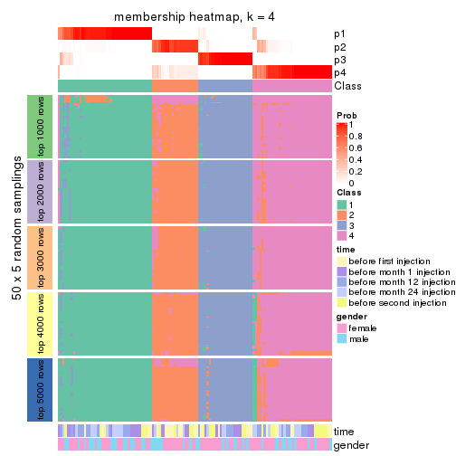</p>

</div>
<div id='tab-ATC-pam-membership-heatmap-4'>
<pre><code class="r">membership_heatmap(res, k = 5)
</code></pre>

<p></p>

</div>
<div id='tab-ATC-pam-membership-heatmap-5'>
<pre><code class="r">membership_heatmap(res, k = 6)
</code></pre>

<p></p>

</div>
</div>

As soon as we have had the classes for columns, we can look for signatures
which are significantly different between classes which can be candidate marks
for certain classes. Following are the heatmaps for signatures.


Signature heatmaps where rows are scaled:


<script>
$( function() {
	$( '#tabs-ATC-pam-get-signatures' ).tabs();
} );
</script>
<div id='tabs-ATC-pam-get-signatures'>
<ul>
<li><a href='#tab-ATC-pam-get-signatures-1'>k = 2</a></li>
<li><a href='#tab-ATC-pam-get-signatures-2'>k = 3</a></li>
<li><a href='#tab-ATC-pam-get-signatures-3'>k = 4</a></li>
<li><a href='#tab-ATC-pam-get-signatures-4'>k = 5</a></li>
<li><a href='#tab-ATC-pam-get-signatures-5'>k = 6</a></li>
</ul>
<div id='tab-ATC-pam-get-signatures-1'>
<pre><code class="r">get_signatures(res, k = 2)
</code></pre>

<p></p>

</div>
<div id='tab-ATC-pam-get-signatures-2'>
<pre><code class="r">get_signatures(res, k = 3)
</code></pre>

<p></p>

</div>
<div id='tab-ATC-pam-get-signatures-3'>
<pre><code class="r">get_signatures(res, k = 4)
</code></pre>

<p></p>

</div>
<div id='tab-ATC-pam-get-signatures-4'>
<pre><code class="r">get_signatures(res, k = 5)
</code></pre>

<p></p>

</div>
<div id='tab-ATC-pam-get-signatures-5'>
<pre><code class="r">get_signatures(res, k = 6)
</code></pre>

<p></p>

</div>
</div>


Signature heatmaps where rows are not scaled:


<script>
$( function() {
	$( '#tabs-ATC-pam-get-signatures-no-scale' ).tabs();
} );
</script>
<div id='tabs-ATC-pam-get-signatures-no-scale'>
<ul>
<li><a href='#tab-ATC-pam-get-signatures-no-scale-1'>k = 2</a></li>
<li><a href='#tab-ATC-pam-get-signatures-no-scale-2'>k = 3</a></li>
<li><a href='#tab-ATC-pam-get-signatures-no-scale-3'>k = 4</a></li>
<li><a href='#tab-ATC-pam-get-signatures-no-scale-4'>k = 5</a></li>
<li><a href='#tab-ATC-pam-get-signatures-no-scale-5'>k = 6</a></li>
</ul>
<div id='tab-ATC-pam-get-signatures-no-scale-1'>
<pre><code class="r">get_signatures(res, k = 2, scale_rows = FALSE)
</code></pre>

<p></p>

</div>
<div id='tab-ATC-pam-get-signatures-no-scale-2'>
<pre><code class="r">get_signatures(res, k = 3, scale_rows = FALSE)
</code></pre>

<p></p>

</div>
<div id='tab-ATC-pam-get-signatures-no-scale-3'>
<pre><code class="r">get_signatures(res, k = 4, scale_rows = FALSE)
</code></pre>

<p></p>

</div>
<div id='tab-ATC-pam-get-signatures-no-scale-4'>
<pre><code class="r">get_signatures(res, k = 5, scale_rows = FALSE)
</code></pre>

<p></p>

</div>
<div id='tab-ATC-pam-get-signatures-no-scale-5'>
<pre><code class="r">get_signatures(res, k = 6, scale_rows = FALSE)
</code></pre>

<p></p>

</div>
</div>


Compare the overlap of signatures from different k:

```r
compare_signatures(res)
```


`get_signature()` returns a data frame invisibly. TO get the list of signatures, the function
call should be assigned to a variable explicitly. In following code, if `plot` argument is set
to `FALSE`, no heatmap is plotted while only the differential analysis is performed.

```r
# code only for demonstration
tb = get_signature(res, k = ..., plot = FALSE)
```

An example of the output of `tb` is:

```
#>   which_row         fdr    mean_1    mean_2 scaled_mean_1 scaled_mean_2 km
#> 1        38 0.042760348  8.373488  9.131774    -0.5533452     0.5164555  1
#> 2        40 0.018707592  7.106213  8.469186    -0.6173731     0.5762149  1
#> 3        55 0.019134737 10.221463 11.207825    -0.6159697     0.5749050  1
#> 4        59 0.006059896  5.921854  7.869574    -0.6899429     0.6439467  1
#> 5        60 0.018055526  8.928898 10.211722    -0.6204761     0.5791110  1
#> 6        98 0.009384629 15.714769 14.887706     0.6635654    -0.6193277  2
...
```

The columns in `tb` are:

1. `which_row`: row indices corresponding to the input matrix.
2. `fdr`: FDR for the differential test. 
3. `mean_x`: The mean value in group x.
4. `scaled_mean_x`: The mean value in group x after rows are scaled.
5. `km`: Row groups if k-means clustering is applied to rows.


UMAP plot which shows how samples are separated.


<script>
$( function() {
	$( '#tabs-ATC-pam-dimension-reduction' ).tabs();
} );
</script>
<div id='tabs-ATC-pam-dimension-reduction'>
<ul>
<li><a href='#tab-ATC-pam-dimension-reduction-1'>k = 2</a></li>
<li><a href='#tab-ATC-pam-dimension-reduction-2'>k = 3</a></li>
<li><a href='#tab-ATC-pam-dimension-reduction-3'>k = 4</a></li>
<li><a href='#tab-ATC-pam-dimension-reduction-4'>k = 5</a></li>
<li><a href='#tab-ATC-pam-dimension-reduction-5'>k = 6</a></li>
</ul>
<div id='tab-ATC-pam-dimension-reduction-1'>
<pre><code class="r">dimension_reduction(res, k = 2, method = &quot;UMAP&quot;)
</code></pre>

<p></p>

</div>
<div id='tab-ATC-pam-dimension-reduction-2'>
<pre><code class="r">dimension_reduction(res, k = 3, method = &quot;UMAP&quot;)
</code></pre>

<p></p>

</div>
<div id='tab-ATC-pam-dimension-reduction-3'>
<pre><code class="r">dimension_reduction(res, k = 4, method = &quot;UMAP&quot;)
</code></pre>

<p></p>

</div>
<div id='tab-ATC-pam-dimension-reduction-4'>
<pre><code class="r">dimension_reduction(res, k = 5, method = &quot;UMAP&quot;)
</code></pre>

<p></p>

</div>
<div id='tab-ATC-pam-dimension-reduction-5'>
<pre><code class="r">dimension_reduction(res, k = 6, method = &quot;UMAP&quot;)
</code></pre>

<p></p>

</div>
</div>


Following heatmap shows how subgroups are split when increasing `k`:

```r
collect_classes(res)
```


Test correlation between subgroups and known annotations. If the known
annotation is numeric, one-way ANOVA test is applied, and if the known
annotation is discrete, chi-squared contingency table test is applied.

```r
test_to_known_factors(res)
```

```
#>           n time(p) gender(p) k
#> ATC:pam 123  0.1870     0.611 2
#> ATC:pam 122  0.2339     0.268 3
#> ATC:pam 118  0.0881     0.440 4
#> ATC:pam  99  0.1276     0.838 5
#> ATC:pam 110  0.3759     0.349 6
```


If matrix rows can be associated to genes, consider to use `functional_enrichment(res,
...)` to perform function enrichment for the signature genes. See [this vignette](http://bioconductor.org/packages/devel/bioc/vignettes/cola/inst/doc/functional_enrichment.html) for more detailed explanations.


 

---------------------------------------------------


### ATC:mclust*


The object with results only for a single top-value method and a single partition method 
can be extracted as:

```r
res = res_list["ATC", "mclust"]
# you can also extract it by
# res = res_list["ATC:mclust"]
```

A summary of `res` and all the functions that can be applied to it:

```r
res
```

```
#> A 'ConsensusPartition' object with k = 2, 3, 4, 5, 6.
#>   On a matrix with 21512 rows and 125 columns.
#>   Top rows (1000, 2000, 3000, 4000, 5000) are extracted by 'ATC' method.
#>   Subgroups are detected by 'mclust' method.
#>   Performed in total 1250 partitions by row resampling.
#>   Best k for subgroups seems to be 3.
#> 
#> Following methods can be applied to this 'ConsensusPartition' object:
#>  [1] "cola_report"             "collect_classes"         "collect_plots"          
#>  [4] "collect_stats"           "colnames"                "compare_signatures"     
#>  [7] "consensus_heatmap"       "dimension_reduction"     "functional_enrichment"  
#> [10] "get_anno_col"            "get_anno"                "get_classes"            
#> [13] "get_consensus"           "get_matrix"              "get_membership"         
#> [16] "get_param"               "get_signatures"          "get_stats"              
#> [19] "is_best_k"               "is_stable_k"             "membership_heatmap"     
#> [22] "ncol"                    "nrow"                    "plot_ecdf"              
#> [25] "rownames"                "select_partition_number" "show"                   
#> [28] "suggest_best_k"          "test_to_known_factors"
```

`collect_plots()` function collects all the plots made from `res` for all `k` (number of partitions)
into one single page to provide an easy and fast comparison between different `k`.

```r
collect_plots(res)
```


The plots are:

- The first row: a plot of the ECDF (empirical cumulative distribution
  function) curves of the consensus matrix for each `k` and the heatmap of
  predicted classes for each `k`.
- The second row: heatmaps of the consensus matrix for each `k`.
- The third row: heatmaps of the membership matrix for each `k`.
- The fouth row: heatmaps of the signatures for each `k`.

All the plots in panels can be made by individual functions and they are
plotted later in this section.

`select_partition_number()` produces several plots showing different
statistics for choosing "optimized" `k`. There are following statistics:

- ECDF curves of the consensus matrix for each `k`;
- 1-PAC. [The PAC
  score](https://en.wikipedia.org/wiki/Consensus_clustering#Over-interpretation_potential_of_consensus_clustering)
  measures the proportion of the ambiguous subgrouping.
- Mean silhouette score.
- Concordance. The mean probability of fiting the consensus class ids in all
  partitions.
- Area increased. Denote $A_k$ as the area under the ECDF curve for current
  `k`, the area increased is defined as $A_k - A_{k-1}$.
- Rand index. The percent of pairs of samples that are both in a same cluster
  or both are not in a same cluster in the partition of k and k-1.
- Jaccard index. The ratio of pairs of samples are both in a same cluster in
  the partition of k and k-1 and the pairs of samples are both in a same
  cluster in the partition k or k-1.

The detailed explanations of these statistics can be found in [the _cola_
vignette](http://bioconductor.org/packages/devel/bioc/vignettes/cola/inst/doc/cola.html#toc_13).

Generally speaking, lower PAC score, higher mean silhouette score or higher
concordance corresponds to better partition. Rand index and Jaccard index
measure how similar the current partition is compared to partition with `k-1`.
If they are too similar, we won't accept `k` is better than `k-1`.

```r
select_partition_number(res)
```


The numeric values for all these statistics can be obtained by `get_stats()`.

```r
get_stats(res)
```

```
#>   k 1-PAC mean_silhouette concordance area_increased  Rand Jaccard
#> 2 2 0.416           0.798       0.882         0.4512 0.567   0.567
#> 3 3 0.915           0.913       0.963         0.4801 0.731   0.539
#> 4 4 0.767           0.824       0.902         0.0618 0.950   0.854
#> 5 5 0.850           0.875       0.923         0.0666 0.901   0.695
#> 6 6 0.892           0.887       0.928         0.0841 0.924   0.694
```

`suggest_best_k()` suggests the best $k$ based on these statistics. The rules are as follows:

- All $k$ with Jaccard index larger than 0.95 are removed because increasing
  $k$ does not provide enough extra information. If all $k$ are removed, it is
  marked as no subgroup is detected.
- For all $k$ with 1-PAC score larger than 0.9, the maximal $k$ is taken as
  the best $k$, and other $k$ are marked as optional $k$.
- If it does not fit the second rule. The $k$ with the maximal vote of the
  highest 1-PAC score, highest mean silhouette, and highest concordance is
  taken as the best $k$.

```r
suggest_best_k(res)
```

```
#> [1] 3
```


Following shows the table of the partitions (You need to click the **show/hide
code output** link to see it). The membership matrix (columns with name `p*`)
is inferred by
[`clue::cl_consensus()`](https://www.rdocumentation.org/link/cl_consensus?package=clue)
function with the `SE` method. Basically the value in the membership matrix
represents the probability to belong to a certain group. The finall class
label for an item is determined with the group with highest probability it
belongs to.

In `get_classes()` function, the entropy is calculated from the membership
matrix and the silhouette score is calculated from the consensus matrix.


<script>
$( function() {
	$( '#tabs-ATC-mclust-get-classes' ).tabs();
} );
</script>
<div id='tabs-ATC-mclust-get-classes'>
<ul>
<li><a href='#tab-ATC-mclust-get-classes-1'>k = 2</a></li>
<li><a href='#tab-ATC-mclust-get-classes-2'>k = 3</a></li>
<li><a href='#tab-ATC-mclust-get-classes-3'>k = 4</a></li>
<li><a href='#tab-ATC-mclust-get-classes-4'>k = 5</a></li>
<li><a href='#tab-ATC-mclust-get-classes-5'>k = 6</a></li>
</ul>

<div id='tab-ATC-mclust-get-classes-1'>
<p><a id='tab-ATC-mclust-get-classes-1-a' style='color:#0366d6' href='#'>show/hide code output</a></p>
<pre><code class="r">cbind(get_classes(res, k = 2), get_membership(res, k = 2))
</code></pre>

<pre><code>#&gt;           class entropy silhouette    p1    p2
#&gt; GSM601872     1  0.0000      0.856 1.000 0.000
#&gt; GSM601882     1  0.0000      0.856 1.000 0.000
#&gt; GSM601887     1  0.6343      0.859 0.840 0.160
#&gt; GSM601892     1  0.6343      0.859 0.840 0.160
#&gt; GSM601897     1  0.6343      0.859 0.840 0.160
#&gt; GSM601902     2  0.6343      0.861 0.160 0.840
#&gt; GSM601912     1  0.6343      0.859 0.840 0.160
#&gt; GSM601927     2  0.0000      0.852 0.000 1.000
#&gt; GSM601932     2  0.9866      0.501 0.432 0.568
#&gt; GSM601937     1  0.0000      0.856 1.000 0.000
#&gt; GSM601942     1  0.0000      0.856 1.000 0.000
#&gt; GSM601947     2  0.7139      0.841 0.196 0.804
#&gt; GSM601957     1  0.6343      0.859 0.840 0.160
#&gt; GSM601972     2  0.6343      0.861 0.160 0.840
#&gt; GSM601977     1  0.0000      0.856 1.000 0.000
#&gt; GSM601987     1  0.0000      0.856 1.000 0.000
#&gt; GSM601877     2  0.0000      0.852 0.000 1.000
#&gt; GSM601907     1  0.0000      0.856 1.000 0.000
#&gt; GSM601917     2  0.6343      0.861 0.160 0.840
#&gt; GSM601922     2  0.6343      0.861 0.160 0.840
#&gt; GSM601952     1  0.0000      0.856 1.000 0.000
#&gt; GSM601962     1  0.6343      0.859 0.840 0.160
#&gt; GSM601967     1  0.6343      0.859 0.840 0.160
#&gt; GSM601982     1  0.0000      0.856 1.000 0.000
#&gt; GSM601992     1  0.4022      0.794 0.920 0.080
#&gt; GSM601873     1  0.0000      0.856 1.000 0.000
#&gt; GSM601883     1  0.0000      0.856 1.000 0.000
#&gt; GSM601888     1  0.6343      0.859 0.840 0.160
#&gt; GSM601893     1  0.6343      0.859 0.840 0.160
#&gt; GSM601898     1  0.6343      0.859 0.840 0.160
#&gt; GSM601903     2  0.6343      0.861 0.160 0.840
#&gt; GSM601913     1  0.6343      0.859 0.840 0.160
#&gt; GSM601928     2  0.0672      0.849 0.008 0.992
#&gt; GSM601933     1  0.0000      0.856 1.000 0.000
#&gt; GSM601938     1  0.0000      0.856 1.000 0.000
#&gt; GSM601943     1  0.0000      0.856 1.000 0.000
#&gt; GSM601948     2  0.4161      0.794 0.084 0.916
#&gt; GSM601958     1  0.6343      0.859 0.840 0.160
#&gt; GSM601973     2  0.6343      0.861 0.160 0.840
#&gt; GSM601978     1  0.0000      0.856 1.000 0.000
#&gt; GSM601988     1  0.0000      0.856 1.000 0.000
#&gt; GSM601878     2  0.0000      0.852 0.000 1.000
#&gt; GSM601908     1  0.0000      0.856 1.000 0.000
#&gt; GSM601918     2  0.6343      0.861 0.160 0.840
#&gt; GSM601923     2  0.0000      0.852 0.000 1.000
#&gt; GSM601953     1  0.0000      0.856 1.000 0.000
#&gt; GSM601963     1  0.6343      0.859 0.840 0.160
#&gt; GSM601968     1  0.6343      0.859 0.840 0.160
#&gt; GSM601983     1  0.6343      0.859 0.840 0.160
#&gt; GSM601993     1  0.0000      0.856 1.000 0.000
#&gt; GSM601874     1  0.0000      0.856 1.000 0.000
#&gt; GSM601884     1  0.0000      0.856 1.000 0.000
#&gt; GSM601889     1  0.6343      0.859 0.840 0.160
#&gt; GSM601894     1  0.6343      0.859 0.840 0.160
#&gt; GSM601899     1  0.6343      0.859 0.840 0.160
#&gt; GSM601904     2  0.6343      0.861 0.160 0.840
#&gt; GSM601914     1  0.6343      0.859 0.840 0.160
#&gt; GSM601929     2  0.0000      0.852 0.000 1.000
#&gt; GSM601934     1  0.0000      0.856 1.000 0.000
#&gt; GSM601939     1  0.8661      0.748 0.712 0.288
#&gt; GSM601944     1  0.0000      0.856 1.000 0.000
#&gt; GSM601949     2  0.7219      0.637 0.200 0.800
#&gt; GSM601959     1  0.6343      0.859 0.840 0.160
#&gt; GSM601974     2  0.8386      0.774 0.268 0.732
#&gt; GSM601979     1  0.0000      0.856 1.000 0.000
#&gt; GSM601989     1  0.6343      0.859 0.840 0.160
#&gt; GSM601879     2  0.0000      0.852 0.000 1.000
#&gt; GSM601909     1  0.6343      0.859 0.840 0.160
#&gt; GSM601919     2  0.6343      0.861 0.160 0.840
#&gt; GSM601924     2  0.0000      0.852 0.000 1.000
#&gt; GSM601954     1  0.9993     -0.284 0.516 0.484
#&gt; GSM601964     1  0.6343      0.859 0.840 0.160
#&gt; GSM601969     1  0.6343      0.859 0.840 0.160
#&gt; GSM601984     1  0.9944      0.435 0.544 0.456
#&gt; GSM601994     1  0.0938      0.849 0.988 0.012
#&gt; GSM601875     1  0.0000      0.856 1.000 0.000
#&gt; GSM601885     1  0.0000      0.856 1.000 0.000
#&gt; GSM601890     1  0.6343      0.859 0.840 0.160
#&gt; GSM601895     1  0.6343      0.859 0.840 0.160
#&gt; GSM601900     1  0.6343      0.859 0.840 0.160
#&gt; GSM601905     2  0.6343      0.861 0.160 0.840
#&gt; GSM601915     1  0.6343      0.859 0.840 0.160
#&gt; GSM601930     2  0.0000      0.852 0.000 1.000
#&gt; GSM601935     1  0.0000      0.856 1.000 0.000
#&gt; GSM601940     1  0.6438      0.857 0.836 0.164
#&gt; GSM601945     1  0.0000      0.856 1.000 0.000
#&gt; GSM601950     2  0.8813      0.423 0.300 0.700
#&gt; GSM601960     1  0.6343      0.859 0.840 0.160
#&gt; GSM601975     2  0.6531      0.857 0.168 0.832
#&gt; GSM601980     1  0.0000      0.856 1.000 0.000
#&gt; GSM601990     1  0.6343      0.859 0.840 0.160
#&gt; GSM601880     2  0.0000      0.852 0.000 1.000
#&gt; GSM601910     1  0.6343      0.859 0.840 0.160
#&gt; GSM601920     2  0.6343      0.861 0.160 0.840
#&gt; GSM601925     2  0.0000      0.852 0.000 1.000
#&gt; GSM601955     1  0.0000      0.856 1.000 0.000
#&gt; GSM601965     1  0.8207      0.785 0.744 0.256
#&gt; GSM601970     1  0.6343      0.859 0.840 0.160
#&gt; GSM601985     1  0.6343      0.859 0.840 0.160
#&gt; GSM601995     1  0.0000      0.856 1.000 0.000
#&gt; GSM601876     1  0.7139      0.837 0.804 0.196
#&gt; GSM601886     1  0.9922     -0.136 0.552 0.448
#&gt; GSM601891     1  0.6343      0.859 0.840 0.160
#&gt; GSM601896     1  0.8955      0.716 0.688 0.312
#&gt; GSM601901     1  0.9970     -0.212 0.532 0.468
#&gt; GSM601906     2  0.6247      0.861 0.156 0.844
#&gt; GSM601916     2  0.9000      0.716 0.316 0.684
#&gt; GSM601931     2  0.0000      0.852 0.000 1.000
#&gt; GSM601936     1  0.0000      0.856 1.000 0.000
#&gt; GSM601941     2  0.6343      0.861 0.160 0.840
#&gt; GSM601946     1  0.8555      0.758 0.720 0.280
#&gt; GSM601951     2  0.0000      0.852 0.000 1.000
#&gt; GSM601961     1  0.3274      0.859 0.940 0.060
#&gt; GSM601976     2  0.6343      0.861 0.160 0.840
#&gt; GSM601981     1  0.0000      0.856 1.000 0.000
#&gt; GSM601991     1  0.6343      0.859 0.840 0.160
#&gt; GSM601881     2  0.0000      0.852 0.000 1.000
#&gt; GSM601911     1  0.5294      0.771 0.880 0.120
#&gt; GSM601921     2  0.6343      0.861 0.160 0.840
#&gt; GSM601926     2  0.0000      0.852 0.000 1.000
#&gt; GSM601956     1  0.0000      0.856 1.000 0.000
#&gt; GSM601966     1  0.9970     -0.214 0.532 0.468
#&gt; GSM601971     2  0.8909      0.401 0.308 0.692
#&gt; GSM601986     1  0.7376      0.634 0.792 0.208
#&gt; GSM601996     1  0.5737      0.729 0.864 0.136
</code></pre>

<script>
$('#tab-ATC-mclust-get-classes-1-a').parent().next().next().hide();
$('#tab-ATC-mclust-get-classes-1-a').click(function(){
  $('#tab-ATC-mclust-get-classes-1-a').parent().next().next().toggle();
  return(false);
});
</script>
</div>

<div id='tab-ATC-mclust-get-classes-2'>
<p><a id='tab-ATC-mclust-get-classes-2-a' style='color:#0366d6' href='#'>show/hide code output</a></p>
<pre><code class="r">cbind(get_classes(res, k = 3), get_membership(res, k = 3))
</code></pre>

<pre><code>#&gt;           class entropy silhouette    p1    p2    p3
#&gt; GSM601872     2  0.0237    0.96975 0.004 0.996 0.000
#&gt; GSM601882     2  0.0237    0.96975 0.004 0.996 0.000
#&gt; GSM601887     1  0.0000    0.95798 1.000 0.000 0.000
#&gt; GSM601892     1  0.0000    0.95798 1.000 0.000 0.000
#&gt; GSM601897     1  0.0000    0.95798 1.000 0.000 0.000
#&gt; GSM601902     3  0.0424    0.95678 0.000 0.008 0.992
#&gt; GSM601912     1  0.0000    0.95798 1.000 0.000 0.000
#&gt; GSM601927     3  0.0237    0.95811 0.004 0.000 0.996
#&gt; GSM601932     2  0.6180    0.26262 0.000 0.584 0.416
#&gt; GSM601937     2  0.0237    0.96975 0.004 0.996 0.000
#&gt; GSM601942     2  0.0237    0.96975 0.004 0.996 0.000
#&gt; GSM601947     3  0.2711    0.88896 0.000 0.088 0.912
#&gt; GSM601957     1  0.0000    0.95798 1.000 0.000 0.000
#&gt; GSM601972     3  0.0747    0.95322 0.000 0.016 0.984
#&gt; GSM601977     2  0.0237    0.96975 0.004 0.996 0.000
#&gt; GSM601987     2  0.0237    0.96975 0.004 0.996 0.000
#&gt; GSM601877     3  0.0237    0.95811 0.004 0.000 0.996
#&gt; GSM601907     2  0.0237    0.96975 0.004 0.996 0.000
#&gt; GSM601917     3  0.0892    0.95088 0.000 0.020 0.980
#&gt; GSM601922     3  0.0592    0.95517 0.000 0.012 0.988
#&gt; GSM601952     2  0.0237    0.96975 0.004 0.996 0.000
#&gt; GSM601962     1  0.0000    0.95798 1.000 0.000 0.000
#&gt; GSM601967     1  0.0000    0.95798 1.000 0.000 0.000
#&gt; GSM601982     2  0.0237    0.96975 0.004 0.996 0.000
#&gt; GSM601992     2  0.0000    0.96668 0.000 1.000 0.000
#&gt; GSM601873     2  0.0237    0.96975 0.004 0.996 0.000
#&gt; GSM601883     2  0.0237    0.96975 0.004 0.996 0.000
#&gt; GSM601888     1  0.0000    0.95798 1.000 0.000 0.000
#&gt; GSM601893     1  0.0000    0.95798 1.000 0.000 0.000
#&gt; GSM601898     1  0.0000    0.95798 1.000 0.000 0.000
#&gt; GSM601903     3  0.0237    0.95777 0.000 0.004 0.996
#&gt; GSM601913     1  0.0000    0.95798 1.000 0.000 0.000
#&gt; GSM601928     3  0.0747    0.95164 0.016 0.000 0.984
#&gt; GSM601933     2  0.0237    0.96975 0.004 0.996 0.000
#&gt; GSM601938     2  0.0237    0.96975 0.004 0.996 0.000
#&gt; GSM601943     2  0.0237    0.96975 0.004 0.996 0.000
#&gt; GSM601948     3  0.3272    0.86467 0.104 0.004 0.892
#&gt; GSM601958     1  0.0000    0.95798 1.000 0.000 0.000
#&gt; GSM601973     3  0.0747    0.95322 0.000 0.016 0.984
#&gt; GSM601978     2  0.0237    0.96975 0.004 0.996 0.000
#&gt; GSM601988     2  0.0237    0.96975 0.004 0.996 0.000
#&gt; GSM601878     3  0.0237    0.95811 0.004 0.000 0.996
#&gt; GSM601908     2  0.0237    0.96975 0.004 0.996 0.000
#&gt; GSM601918     3  0.1163    0.94505 0.000 0.028 0.972
#&gt; GSM601923     3  0.0237    0.95811 0.004 0.000 0.996
#&gt; GSM601953     2  0.0237    0.96975 0.004 0.996 0.000
#&gt; GSM601963     1  0.0000    0.95798 1.000 0.000 0.000
#&gt; GSM601968     1  0.0000    0.95798 1.000 0.000 0.000
#&gt; GSM601983     1  0.0000    0.95798 1.000 0.000 0.000
#&gt; GSM601993     2  0.0237    0.96975 0.004 0.996 0.000
#&gt; GSM601874     2  0.0237    0.96975 0.004 0.996 0.000
#&gt; GSM601884     2  0.0237    0.96975 0.004 0.996 0.000
#&gt; GSM601889     1  0.0000    0.95798 1.000 0.000 0.000
#&gt; GSM601894     1  0.0000    0.95798 1.000 0.000 0.000
#&gt; GSM601899     1  0.0000    0.95798 1.000 0.000 0.000
#&gt; GSM601904     3  0.0237    0.95777 0.000 0.004 0.996
#&gt; GSM601914     1  0.0000    0.95798 1.000 0.000 0.000
#&gt; GSM601929     3  0.0237    0.95811 0.004 0.000 0.996
#&gt; GSM601934     2  0.0237    0.96975 0.004 0.996 0.000
#&gt; GSM601939     1  0.0237    0.95499 0.996 0.004 0.000
#&gt; GSM601944     2  0.0237    0.96975 0.004 0.996 0.000
#&gt; GSM601949     3  0.6520    0.00717 0.488 0.004 0.508
#&gt; GSM601959     1  0.0000    0.95798 1.000 0.000 0.000
#&gt; GSM601974     3  0.3769    0.85926 0.104 0.016 0.880
#&gt; GSM601979     2  0.0237    0.96975 0.004 0.996 0.000
#&gt; GSM601989     1  0.0000    0.95798 1.000 0.000 0.000
#&gt; GSM601879     3  0.0237    0.95811 0.004 0.000 0.996
#&gt; GSM601909     1  0.0000    0.95798 1.000 0.000 0.000
#&gt; GSM601919     3  0.0424    0.95678 0.000 0.008 0.992
#&gt; GSM601924     3  0.0237    0.95811 0.004 0.000 0.996
#&gt; GSM601954     2  0.4399    0.75952 0.000 0.812 0.188
#&gt; GSM601964     1  0.0000    0.95798 1.000 0.000 0.000
#&gt; GSM601969     1  0.0000    0.95798 1.000 0.000 0.000
#&gt; GSM601984     1  0.5815    0.56769 0.692 0.004 0.304
#&gt; GSM601994     2  0.0237    0.96458 0.000 0.996 0.004
#&gt; GSM601875     2  0.0237    0.96975 0.004 0.996 0.000
#&gt; GSM601885     2  0.0237    0.96975 0.004 0.996 0.000
#&gt; GSM601890     1  0.0000    0.95798 1.000 0.000 0.000
#&gt; GSM601895     1  0.0000    0.95798 1.000 0.000 0.000
#&gt; GSM601900     1  0.0000    0.95798 1.000 0.000 0.000
#&gt; GSM601905     3  0.0237    0.95777 0.000 0.004 0.996
#&gt; GSM601915     1  0.0000    0.95798 1.000 0.000 0.000
#&gt; GSM601930     3  0.0237    0.95811 0.004 0.000 0.996
#&gt; GSM601935     2  0.0475    0.96725 0.004 0.992 0.004
#&gt; GSM601940     1  0.0000    0.95798 1.000 0.000 0.000
#&gt; GSM601945     2  0.0237    0.96975 0.004 0.996 0.000
#&gt; GSM601950     1  0.6432    0.22706 0.568 0.004 0.428
#&gt; GSM601960     1  0.0000    0.95798 1.000 0.000 0.000
#&gt; GSM601975     3  0.2066    0.91739 0.000 0.060 0.940
#&gt; GSM601980     2  0.0237    0.96975 0.004 0.996 0.000
#&gt; GSM601990     1  0.0000    0.95798 1.000 0.000 0.000
#&gt; GSM601880     3  0.0237    0.95811 0.004 0.000 0.996
#&gt; GSM601910     1  0.0000    0.95798 1.000 0.000 0.000
#&gt; GSM601920     3  0.0237    0.95777 0.000 0.004 0.996
#&gt; GSM601925     3  0.0237    0.95811 0.004 0.000 0.996
#&gt; GSM601955     2  0.0475    0.96725 0.004 0.992 0.004
#&gt; GSM601965     1  0.2400    0.90096 0.932 0.004 0.064
#&gt; GSM601970     1  0.0000    0.95798 1.000 0.000 0.000
#&gt; GSM601985     1  0.0000    0.95798 1.000 0.000 0.000
#&gt; GSM601995     2  0.0829    0.96055 0.012 0.984 0.004
#&gt; GSM601876     1  0.0237    0.95499 0.996 0.004 0.000
#&gt; GSM601886     2  0.5178    0.65354 0.000 0.744 0.256
#&gt; GSM601891     1  0.0000    0.95798 1.000 0.000 0.000
#&gt; GSM601896     1  0.3573    0.84396 0.876 0.004 0.120
#&gt; GSM601901     2  0.3879    0.81298 0.000 0.848 0.152
#&gt; GSM601906     3  0.0237    0.95777 0.000 0.004 0.996
#&gt; GSM601916     3  0.6095    0.34973 0.000 0.392 0.608
#&gt; GSM601931     3  0.0237    0.95811 0.004 0.000 0.996
#&gt; GSM601936     2  0.0475    0.96725 0.004 0.992 0.004
#&gt; GSM601941     3  0.0892    0.95088 0.000 0.020 0.980
#&gt; GSM601946     1  0.0237    0.95499 0.996 0.004 0.000
#&gt; GSM601951     3  0.0237    0.95811 0.004 0.000 0.996
#&gt; GSM601961     1  0.0237    0.95424 0.996 0.004 0.000
#&gt; GSM601976     3  0.0237    0.95777 0.000 0.004 0.996
#&gt; GSM601981     2  0.0237    0.96975 0.004 0.996 0.000
#&gt; GSM601991     1  0.0237    0.95527 0.996 0.000 0.004
#&gt; GSM601881     3  0.0237    0.95811 0.004 0.000 0.996
#&gt; GSM601911     1  0.4033    0.82272 0.856 0.008 0.136
#&gt; GSM601921     3  0.0237    0.95777 0.000 0.004 0.996
#&gt; GSM601926     3  0.0237    0.95811 0.004 0.000 0.996
#&gt; GSM601956     2  0.0237    0.96975 0.004 0.996 0.000
#&gt; GSM601966     2  0.2959    0.87395 0.000 0.900 0.100
#&gt; GSM601971     1  0.6518    0.02832 0.512 0.004 0.484
#&gt; GSM601986     1  0.5541    0.65803 0.740 0.008 0.252
#&gt; GSM601996     2  0.0747    0.95549 0.000 0.984 0.016
</code></pre>

<script>
$('#tab-ATC-mclust-get-classes-2-a').parent().next().next().hide();
$('#tab-ATC-mclust-get-classes-2-a').click(function(){
  $('#tab-ATC-mclust-get-classes-2-a').parent().next().next().toggle();
  return(false);
});
</script>
</div>

<div id='tab-ATC-mclust-get-classes-3'>
<p><a id='tab-ATC-mclust-get-classes-3-a' style='color:#0366d6' href='#'>show/hide code output</a></p>
<pre><code class="r">cbind(get_classes(res, k = 4), get_membership(res, k = 4))
</code></pre>

<pre><code>#&gt;           class entropy silhouette    p1    p2    p3    p4
#&gt; GSM601872     2  0.0188      0.931 0.000 0.996 0.004 0.000
#&gt; GSM601882     2  0.0000      0.932 0.000 1.000 0.000 0.000
#&gt; GSM601887     1  0.1489      0.874 0.952 0.000 0.044 0.004
#&gt; GSM601892     1  0.1489      0.874 0.952 0.000 0.044 0.004
#&gt; GSM601897     1  0.0188      0.878 0.996 0.000 0.004 0.000
#&gt; GSM601902     4  0.0707      0.887 0.000 0.020 0.000 0.980
#&gt; GSM601912     1  0.3668      0.751 0.808 0.004 0.188 0.000
#&gt; GSM601927     4  0.2773      0.886 0.004 0.000 0.116 0.880
#&gt; GSM601932     2  0.4974      0.584 0.000 0.736 0.040 0.224
#&gt; GSM601937     3  0.4998      0.351 0.000 0.488 0.512 0.000
#&gt; GSM601942     2  0.0188      0.931 0.000 0.996 0.004 0.000
#&gt; GSM601947     4  0.3311      0.723 0.000 0.172 0.000 0.828
#&gt; GSM601957     1  0.0817      0.878 0.976 0.000 0.024 0.000
#&gt; GSM601972     4  0.1302      0.874 0.000 0.044 0.000 0.956
#&gt; GSM601977     2  0.0188      0.931 0.000 0.996 0.004 0.000
#&gt; GSM601987     2  0.0000      0.932 0.000 1.000 0.000 0.000
#&gt; GSM601877     4  0.2773      0.886 0.004 0.000 0.116 0.880
#&gt; GSM601907     2  0.0188      0.931 0.000 0.996 0.004 0.000
#&gt; GSM601917     4  0.1302      0.873 0.000 0.044 0.000 0.956
#&gt; GSM601922     4  0.0707      0.887 0.000 0.020 0.000 0.980
#&gt; GSM601952     2  0.0000      0.932 0.000 1.000 0.000 0.000
#&gt; GSM601962     1  0.4679      0.559 0.648 0.000 0.352 0.000
#&gt; GSM601967     1  0.1489      0.874 0.952 0.000 0.044 0.004
#&gt; GSM601982     2  0.0188      0.931 0.000 0.996 0.004 0.000
#&gt; GSM601992     2  0.0469      0.923 0.000 0.988 0.000 0.012
#&gt; GSM601873     2  0.0188      0.931 0.000 0.996 0.004 0.000
#&gt; GSM601883     2  0.0000      0.932 0.000 1.000 0.000 0.000
#&gt; GSM601888     1  0.1302      0.875 0.956 0.000 0.044 0.000
#&gt; GSM601893     1  0.0336      0.879 0.992 0.000 0.008 0.000
#&gt; GSM601898     1  0.0000      0.878 1.000 0.000 0.000 0.000
#&gt; GSM601903     4  0.0707      0.887 0.000 0.020 0.000 0.980
#&gt; GSM601913     1  0.3266      0.806 0.832 0.000 0.168 0.000
#&gt; GSM601928     4  0.3278      0.879 0.020 0.000 0.116 0.864
#&gt; GSM601933     2  0.0000      0.932 0.000 1.000 0.000 0.000
#&gt; GSM601938     2  0.0000      0.932 0.000 1.000 0.000 0.000
#&gt; GSM601943     2  0.0188      0.931 0.000 0.996 0.004 0.000
#&gt; GSM601948     4  0.5911      0.648 0.196 0.000 0.112 0.692
#&gt; GSM601958     1  0.0000      0.878 1.000 0.000 0.000 0.000
#&gt; GSM601973     4  0.0921      0.883 0.000 0.028 0.000 0.972
#&gt; GSM601978     2  0.0000      0.932 0.000 1.000 0.000 0.000
#&gt; GSM601988     2  0.2814      0.757 0.000 0.868 0.132 0.000
#&gt; GSM601878     4  0.2773      0.886 0.004 0.000 0.116 0.880
#&gt; GSM601908     2  0.0000      0.932 0.000 1.000 0.000 0.000
#&gt; GSM601918     4  0.2011      0.842 0.000 0.080 0.000 0.920
#&gt; GSM601923     4  0.2773      0.886 0.004 0.000 0.116 0.880
#&gt; GSM601953     2  0.0188      0.931 0.000 0.996 0.004 0.000
#&gt; GSM601963     1  0.3873      0.701 0.772 0.000 0.228 0.000
#&gt; GSM601968     1  0.1489      0.874 0.952 0.000 0.044 0.004
#&gt; GSM601983     1  0.0336      0.877 0.992 0.000 0.008 0.000
#&gt; GSM601993     2  0.0000      0.932 0.000 1.000 0.000 0.000
#&gt; GSM601874     2  0.0000      0.932 0.000 1.000 0.000 0.000
#&gt; GSM601884     2  0.0188      0.931 0.000 0.996 0.004 0.000
#&gt; GSM601889     1  0.0000      0.878 1.000 0.000 0.000 0.000
#&gt; GSM601894     1  0.0336      0.877 0.992 0.000 0.008 0.000
#&gt; GSM601899     1  0.1576      0.873 0.948 0.000 0.048 0.004
#&gt; GSM601904     4  0.0188      0.890 0.000 0.004 0.000 0.996
#&gt; GSM601914     1  0.3528      0.746 0.808 0.000 0.192 0.000
#&gt; GSM601929     4  0.2334      0.890 0.004 0.000 0.088 0.908
#&gt; GSM601934     2  0.0188      0.931 0.000 0.996 0.004 0.000
#&gt; GSM601939     1  0.2831      0.838 0.876 0.000 0.120 0.004
#&gt; GSM601944     2  0.0188      0.931 0.000 0.996 0.004 0.000
#&gt; GSM601949     1  0.6110      0.611 0.680 0.000 0.144 0.176
#&gt; GSM601959     1  0.0921      0.878 0.972 0.000 0.028 0.000
#&gt; GSM601974     4  0.8582      0.123 0.288 0.144 0.080 0.488
#&gt; GSM601979     2  0.0000      0.932 0.000 1.000 0.000 0.000
#&gt; GSM601989     1  0.0469      0.879 0.988 0.000 0.012 0.000
#&gt; GSM601879     4  0.2773      0.886 0.004 0.000 0.116 0.880
#&gt; GSM601909     1  0.0817      0.878 0.976 0.000 0.024 0.000
#&gt; GSM601919     4  0.0817      0.885 0.000 0.024 0.000 0.976
#&gt; GSM601924     4  0.2773      0.886 0.004 0.000 0.116 0.880
#&gt; GSM601954     2  0.3306      0.741 0.000 0.840 0.004 0.156
#&gt; GSM601964     1  0.3688      0.746 0.792 0.000 0.208 0.000
#&gt; GSM601969     1  0.1474      0.874 0.948 0.000 0.052 0.000
#&gt; GSM601984     1  0.5672      0.654 0.712 0.000 0.100 0.188
#&gt; GSM601994     2  0.0469      0.922 0.000 0.988 0.000 0.012
#&gt; GSM601875     2  0.0188      0.931 0.000 0.996 0.004 0.000
#&gt; GSM601885     2  0.0188      0.931 0.000 0.996 0.004 0.000
#&gt; GSM601890     1  0.1576      0.873 0.948 0.000 0.048 0.004
#&gt; GSM601895     1  0.0336      0.877 0.992 0.000 0.008 0.000
#&gt; GSM601900     1  0.0336      0.877 0.992 0.000 0.008 0.000
#&gt; GSM601905     4  0.0188      0.890 0.000 0.004 0.000 0.996
#&gt; GSM601915     1  0.4382      0.597 0.704 0.000 0.296 0.000
#&gt; GSM601930     4  0.2773      0.886 0.004 0.000 0.116 0.880
#&gt; GSM601935     3  0.4328      0.774 0.008 0.244 0.748 0.000
#&gt; GSM601940     1  0.0921      0.879 0.972 0.000 0.028 0.000
#&gt; GSM601945     2  0.0000      0.932 0.000 1.000 0.000 0.000
#&gt; GSM601950     1  0.5314      0.712 0.748 0.000 0.144 0.108
#&gt; GSM601960     1  0.1940      0.849 0.924 0.000 0.076 0.000
#&gt; GSM601975     4  0.4103      0.580 0.000 0.256 0.000 0.744
#&gt; GSM601980     2  0.0188      0.931 0.000 0.996 0.004 0.000
#&gt; GSM601990     1  0.4855      0.462 0.600 0.000 0.400 0.000
#&gt; GSM601880     4  0.2773      0.886 0.004 0.000 0.116 0.880
#&gt; GSM601910     1  0.0000      0.878 1.000 0.000 0.000 0.000
#&gt; GSM601920     4  0.0188      0.890 0.000 0.004 0.000 0.996
#&gt; GSM601925     4  0.2773      0.886 0.004 0.000 0.116 0.880
#&gt; GSM601955     3  0.4391      0.772 0.008 0.252 0.740 0.000
#&gt; GSM601965     1  0.3521      0.824 0.864 0.000 0.084 0.052
#&gt; GSM601970     1  0.0707      0.878 0.980 0.000 0.020 0.000
#&gt; GSM601985     1  0.1867      0.857 0.928 0.000 0.072 0.000
#&gt; GSM601995     3  0.4420      0.773 0.012 0.240 0.748 0.000
#&gt; GSM601876     1  0.2216      0.851 0.908 0.000 0.092 0.000
#&gt; GSM601886     2  0.5397      0.564 0.000 0.720 0.068 0.212
#&gt; GSM601891     1  0.1118      0.876 0.964 0.000 0.036 0.000
#&gt; GSM601896     1  0.3907      0.809 0.836 0.000 0.120 0.044
#&gt; GSM601901     2  0.4482      0.708 0.000 0.804 0.068 0.128
#&gt; GSM601906     4  0.0188      0.889 0.004 0.000 0.000 0.996
#&gt; GSM601916     2  0.6023      0.353 0.000 0.612 0.060 0.328
#&gt; GSM601931     4  0.2773      0.886 0.004 0.000 0.116 0.880
#&gt; GSM601936     3  0.4164      0.763 0.000 0.264 0.736 0.000
#&gt; GSM601941     4  0.1637      0.861 0.000 0.060 0.000 0.940
#&gt; GSM601946     1  0.2773      0.839 0.880 0.000 0.116 0.004
#&gt; GSM601951     4  0.1890      0.892 0.008 0.000 0.056 0.936
#&gt; GSM601961     1  0.2174      0.865 0.928 0.020 0.052 0.000
#&gt; GSM601976     4  0.0336      0.889 0.000 0.008 0.000 0.992
#&gt; GSM601981     2  0.0000      0.932 0.000 1.000 0.000 0.000
#&gt; GSM601991     3  0.5277     -0.224 0.460 0.008 0.532 0.000
#&gt; GSM601881     4  0.2773      0.886 0.004 0.000 0.116 0.880
#&gt; GSM601911     1  0.6084      0.700 0.740 0.052 0.084 0.124
#&gt; GSM601921     4  0.0336      0.889 0.000 0.008 0.000 0.992
#&gt; GSM601926     4  0.2773      0.886 0.004 0.000 0.116 0.880
#&gt; GSM601956     2  0.0188      0.931 0.000 0.996 0.004 0.000
#&gt; GSM601966     2  0.4144      0.741 0.000 0.828 0.068 0.104
#&gt; GSM601971     1  0.5938      0.636 0.696 0.000 0.136 0.168
#&gt; GSM601986     1  0.6002      0.648 0.708 0.016 0.080 0.196
#&gt; GSM601996     2  0.1389      0.885 0.000 0.952 0.000 0.048
</code></pre>

<script>
$('#tab-ATC-mclust-get-classes-3-a').parent().next().next().hide();
$('#tab-ATC-mclust-get-classes-3-a').click(function(){
  $('#tab-ATC-mclust-get-classes-3-a').parent().next().next().toggle();
  return(false);
});
</script>
</div>

<div id='tab-ATC-mclust-get-classes-4'>
<p><a id='tab-ATC-mclust-get-classes-4-a' style='color:#0366d6' href='#'>show/hide code output</a></p>
<pre><code class="r">cbind(get_classes(res, k = 5), get_membership(res, k = 5))
</code></pre>

<pre><code>#&gt;           class entropy silhouette    p1    p2    p3    p4    p5
#&gt; GSM601872     2  0.0510     0.9754 0.000 0.984 0.000 0.000 0.016
#&gt; GSM601882     2  0.0000     0.9808 0.000 1.000 0.000 0.000 0.000
#&gt; GSM601887     3  0.2116     0.8794 0.076 0.000 0.912 0.004 0.008
#&gt; GSM601892     3  0.2177     0.8774 0.080 0.000 0.908 0.004 0.008
#&gt; GSM601897     3  0.1124     0.9019 0.000 0.000 0.960 0.004 0.036
#&gt; GSM601902     4  0.0451     0.9307 0.004 0.008 0.000 0.988 0.000
#&gt; GSM601912     3  0.1638     0.8971 0.000 0.000 0.932 0.004 0.064
#&gt; GSM601927     1  0.2124     0.9154 0.900 0.000 0.004 0.096 0.000
#&gt; GSM601932     4  0.3751     0.7003 0.004 0.212 0.000 0.772 0.012
#&gt; GSM601937     5  0.4294     0.2227 0.000 0.468 0.000 0.000 0.532
#&gt; GSM601942     2  0.0510     0.9754 0.000 0.984 0.000 0.000 0.016
#&gt; GSM601947     4  0.0955     0.9205 0.004 0.028 0.000 0.968 0.000
#&gt; GSM601957     3  0.1502     0.8908 0.056 0.000 0.940 0.000 0.004
#&gt; GSM601972     4  0.0451     0.9307 0.004 0.008 0.000 0.988 0.000
#&gt; GSM601977     2  0.0162     0.9799 0.000 0.996 0.000 0.000 0.004
#&gt; GSM601987     2  0.0000     0.9808 0.000 1.000 0.000 0.000 0.000
#&gt; GSM601877     1  0.2304     0.9107 0.892 0.000 0.000 0.100 0.008
#&gt; GSM601907     2  0.0000     0.9808 0.000 1.000 0.000 0.000 0.000
#&gt; GSM601917     4  0.0451     0.9307 0.004 0.008 0.000 0.988 0.000
#&gt; GSM601922     4  0.0451     0.9307 0.004 0.008 0.000 0.988 0.000
#&gt; GSM601952     2  0.0290     0.9788 0.000 0.992 0.000 0.000 0.008
#&gt; GSM601962     3  0.1991     0.8929 0.004 0.000 0.916 0.004 0.076
#&gt; GSM601967     3  0.2116     0.8808 0.076 0.000 0.912 0.004 0.008
#&gt; GSM601982     2  0.0404     0.9774 0.000 0.988 0.000 0.000 0.012
#&gt; GSM601992     2  0.1386     0.9438 0.000 0.952 0.000 0.032 0.016
#&gt; GSM601873     2  0.0510     0.9754 0.000 0.984 0.000 0.000 0.016
#&gt; GSM601883     2  0.0000     0.9808 0.000 1.000 0.000 0.000 0.000
#&gt; GSM601888     3  0.2293     0.8793 0.084 0.000 0.900 0.000 0.016
#&gt; GSM601893     3  0.1124     0.9025 0.004 0.000 0.960 0.000 0.036
#&gt; GSM601898     3  0.0451     0.9029 0.004 0.000 0.988 0.000 0.008
#&gt; GSM601903     4  0.0451     0.9307 0.004 0.008 0.000 0.988 0.000
#&gt; GSM601913     3  0.1502     0.8992 0.004 0.000 0.940 0.000 0.056
#&gt; GSM601928     1  0.2249     0.9130 0.896 0.000 0.008 0.096 0.000
#&gt; GSM601933     2  0.0000     0.9808 0.000 1.000 0.000 0.000 0.000
#&gt; GSM601938     2  0.0510     0.9754 0.000 0.984 0.000 0.000 0.016
#&gt; GSM601943     2  0.0510     0.9754 0.000 0.984 0.000 0.000 0.016
#&gt; GSM601948     1  0.3385     0.7899 0.856 0.000 0.084 0.044 0.016
#&gt; GSM601958     3  0.0451     0.9029 0.004 0.000 0.988 0.000 0.008
#&gt; GSM601973     4  0.0451     0.9307 0.004 0.008 0.000 0.988 0.000
#&gt; GSM601978     2  0.0000     0.9808 0.000 1.000 0.000 0.000 0.000
#&gt; GSM601988     2  0.1608     0.9191 0.000 0.928 0.000 0.000 0.072
#&gt; GSM601878     1  0.2124     0.9154 0.900 0.000 0.004 0.096 0.000
#&gt; GSM601908     2  0.0000     0.9808 0.000 1.000 0.000 0.000 0.000
#&gt; GSM601918     4  0.0566     0.9293 0.004 0.012 0.000 0.984 0.000
#&gt; GSM601923     1  0.2124     0.9154 0.900 0.000 0.004 0.096 0.000
#&gt; GSM601953     2  0.0451     0.9776 0.004 0.988 0.000 0.000 0.008
#&gt; GSM601963     3  0.1430     0.9004 0.004 0.000 0.944 0.000 0.052
#&gt; GSM601968     3  0.2237     0.8755 0.084 0.000 0.904 0.004 0.008
#&gt; GSM601983     3  0.1282     0.8992 0.004 0.000 0.952 0.000 0.044
#&gt; GSM601993     2  0.0898     0.9680 0.000 0.972 0.000 0.008 0.020
#&gt; GSM601874     2  0.0000     0.9808 0.000 1.000 0.000 0.000 0.000
#&gt; GSM601884     2  0.0000     0.9808 0.000 1.000 0.000 0.000 0.000
#&gt; GSM601889     3  0.0324     0.9027 0.004 0.000 0.992 0.000 0.004
#&gt; GSM601894     3  0.0290     0.9033 0.000 0.000 0.992 0.000 0.008
#&gt; GSM601899     3  0.2295     0.8736 0.088 0.000 0.900 0.004 0.008
#&gt; GSM601904     4  0.0451     0.9284 0.008 0.004 0.000 0.988 0.000
#&gt; GSM601914     3  0.1502     0.8992 0.004 0.000 0.940 0.000 0.056
#&gt; GSM601929     1  0.2416     0.9095 0.888 0.000 0.000 0.100 0.012
#&gt; GSM601934     2  0.0000     0.9808 0.000 1.000 0.000 0.000 0.000
#&gt; GSM601939     3  0.0968     0.9023 0.012 0.000 0.972 0.004 0.012
#&gt; GSM601944     2  0.0162     0.9800 0.000 0.996 0.000 0.000 0.004
#&gt; GSM601949     1  0.3107     0.7120 0.852 0.000 0.124 0.008 0.016
#&gt; GSM601959     3  0.1628     0.8905 0.056 0.000 0.936 0.000 0.008
#&gt; GSM601974     4  0.2353     0.8681 0.004 0.008 0.044 0.916 0.028
#&gt; GSM601979     2  0.0000     0.9808 0.000 1.000 0.000 0.000 0.000
#&gt; GSM601989     3  0.0324     0.9027 0.004 0.000 0.992 0.000 0.004
#&gt; GSM601879     1  0.2416     0.9095 0.888 0.000 0.000 0.100 0.012
#&gt; GSM601909     3  0.0703     0.9013 0.024 0.000 0.976 0.000 0.000
#&gt; GSM601919     4  0.0451     0.9307 0.004 0.008 0.000 0.988 0.000
#&gt; GSM601924     1  0.2124     0.9154 0.900 0.000 0.004 0.096 0.000
#&gt; GSM601954     4  0.3937     0.7395 0.012 0.184 0.000 0.784 0.020
#&gt; GSM601964     3  0.1502     0.8992 0.004 0.000 0.940 0.000 0.056
#&gt; GSM601969     3  0.2233     0.8803 0.080 0.000 0.904 0.000 0.016
#&gt; GSM601984     3  0.5676     0.4693 0.300 0.000 0.620 0.048 0.032
#&gt; GSM601994     2  0.1774     0.9169 0.000 0.932 0.000 0.052 0.016
#&gt; GSM601875     2  0.0000     0.9808 0.000 1.000 0.000 0.000 0.000
#&gt; GSM601885     2  0.0000     0.9808 0.000 1.000 0.000 0.000 0.000
#&gt; GSM601890     3  0.2237     0.8755 0.084 0.000 0.904 0.004 0.008
#&gt; GSM601895     3  0.1124     0.9011 0.004 0.000 0.960 0.000 0.036
#&gt; GSM601900     3  0.1124     0.9011 0.004 0.000 0.960 0.000 0.036
#&gt; GSM601905     4  0.0451     0.9284 0.008 0.004 0.000 0.988 0.000
#&gt; GSM601915     3  0.1357     0.9031 0.004 0.000 0.948 0.000 0.048
#&gt; GSM601930     1  0.2124     0.9154 0.900 0.000 0.004 0.096 0.000
#&gt; GSM601935     5  0.1544     0.8540 0.000 0.068 0.000 0.000 0.932
#&gt; GSM601940     3  0.0486     0.9030 0.004 0.000 0.988 0.004 0.004
#&gt; GSM601945     2  0.0000     0.9808 0.000 1.000 0.000 0.000 0.000
#&gt; GSM601950     1  0.3183     0.6660 0.828 0.000 0.156 0.000 0.016
#&gt; GSM601960     3  0.0955     0.9031 0.004 0.000 0.968 0.000 0.028
#&gt; GSM601975     4  0.0865     0.9232 0.004 0.024 0.000 0.972 0.000
#&gt; GSM601980     2  0.0609     0.9734 0.000 0.980 0.000 0.000 0.020
#&gt; GSM601990     3  0.2806     0.8475 0.000 0.000 0.844 0.004 0.152
#&gt; GSM601880     1  0.2124     0.9154 0.900 0.000 0.004 0.096 0.000
#&gt; GSM601910     3  0.1251     0.9029 0.008 0.000 0.956 0.000 0.036
#&gt; GSM601920     4  0.0451     0.9284 0.008 0.004 0.000 0.988 0.000
#&gt; GSM601925     1  0.2124     0.9154 0.900 0.000 0.004 0.096 0.000
#&gt; GSM601955     5  0.2020     0.8465 0.000 0.100 0.000 0.000 0.900
#&gt; GSM601965     3  0.2297     0.8893 0.020 0.000 0.912 0.008 0.060
#&gt; GSM601970     3  0.0609     0.9019 0.020 0.000 0.980 0.000 0.000
#&gt; GSM601985     3  0.0566     0.9030 0.004 0.000 0.984 0.000 0.012
#&gt; GSM601995     5  0.1544     0.8540 0.000 0.068 0.000 0.000 0.932
#&gt; GSM601876     3  0.1788     0.8958 0.008 0.000 0.932 0.004 0.056
#&gt; GSM601886     4  0.2880     0.8380 0.004 0.108 0.000 0.868 0.020
#&gt; GSM601891     3  0.2554     0.8894 0.072 0.000 0.892 0.000 0.036
#&gt; GSM601896     3  0.3774     0.7672 0.152 0.000 0.808 0.008 0.032
#&gt; GSM601901     4  0.2570     0.8409 0.004 0.108 0.000 0.880 0.008
#&gt; GSM601906     4  0.0579     0.9219 0.008 0.000 0.000 0.984 0.008
#&gt; GSM601916     4  0.2463     0.8501 0.004 0.100 0.000 0.888 0.008
#&gt; GSM601931     1  0.2124     0.9154 0.900 0.000 0.004 0.096 0.000
#&gt; GSM601936     5  0.1671     0.8544 0.000 0.076 0.000 0.000 0.924
#&gt; GSM601941     4  0.0451     0.9307 0.004 0.008 0.000 0.988 0.000
#&gt; GSM601946     3  0.2396     0.8672 0.068 0.000 0.904 0.004 0.024
#&gt; GSM601951     1  0.3500     0.8419 0.808 0.000 0.004 0.172 0.016
#&gt; GSM601961     3  0.6585     0.0716 0.084 0.428 0.448 0.000 0.040
#&gt; GSM601976     4  0.0451     0.9284 0.008 0.004 0.000 0.988 0.000
#&gt; GSM601981     2  0.0000     0.9808 0.000 1.000 0.000 0.000 0.000
#&gt; GSM601991     5  0.2850     0.7560 0.000 0.036 0.092 0.000 0.872
#&gt; GSM601881     1  0.2124     0.9154 0.900 0.000 0.004 0.096 0.000
#&gt; GSM601911     3  0.7645     0.0481 0.008 0.256 0.432 0.264 0.040
#&gt; GSM601921     4  0.0451     0.9284 0.008 0.004 0.000 0.988 0.000
#&gt; GSM601926     1  0.2124     0.9154 0.900 0.000 0.004 0.096 0.000
#&gt; GSM601956     2  0.0000     0.9808 0.000 1.000 0.000 0.000 0.000
#&gt; GSM601966     4  0.3875     0.6763 0.004 0.228 0.000 0.756 0.012
#&gt; GSM601971     1  0.4270     0.4032 0.656 0.000 0.336 0.004 0.004
#&gt; GSM601986     3  0.5399     0.3123 0.008 0.008 0.560 0.396 0.028
#&gt; GSM601996     2  0.2881     0.7994 0.004 0.860 0.000 0.124 0.012
</code></pre>

<script>
$('#tab-ATC-mclust-get-classes-4-a').parent().next().next().hide();
$('#tab-ATC-mclust-get-classes-4-a').click(function(){
  $('#tab-ATC-mclust-get-classes-4-a').parent().next().next().toggle();
  return(false);
});
</script>
</div>

<div id='tab-ATC-mclust-get-classes-5'>
<p><a id='tab-ATC-mclust-get-classes-5-a' style='color:#0366d6' href='#'>show/hide code output</a></p>
<pre><code class="r">cbind(get_classes(res, k = 6), get_membership(res, k = 6))
</code></pre>

<pre><code>#&gt;           class entropy silhouette    p1    p2    p3    p4    p5    p6
#&gt; GSM601872     2  0.0363      0.948 0.000 0.988 0.000 0.000 0.012 0.000
#&gt; GSM601882     2  0.0291      0.950 0.000 0.992 0.004 0.000 0.004 0.000
#&gt; GSM601887     6  0.0000      0.944 0.000 0.000 0.000 0.000 0.000 1.000
#&gt; GSM601892     6  0.0000      0.944 0.000 0.000 0.000 0.000 0.000 1.000
#&gt; GSM601897     3  0.1863      0.886 0.000 0.000 0.896 0.000 0.000 0.104
#&gt; GSM601902     4  0.0000      0.944 0.000 0.000 0.000 1.000 0.000 0.000
#&gt; GSM601912     3  0.1918      0.885 0.000 0.000 0.904 0.000 0.008 0.088
#&gt; GSM601927     1  0.0146      0.941 0.996 0.000 0.000 0.004 0.000 0.000
#&gt; GSM601932     4  0.5196      0.408 0.000 0.312 0.020 0.600 0.068 0.000
#&gt; GSM601937     5  0.1327      0.913 0.000 0.064 0.000 0.000 0.936 0.000
#&gt; GSM601942     2  0.2793      0.748 0.000 0.800 0.000 0.000 0.200 0.000
#&gt; GSM601947     4  0.0000      0.944 0.000 0.000 0.000 1.000 0.000 0.000
#&gt; GSM601957     6  0.0632      0.944 0.000 0.000 0.024 0.000 0.000 0.976
#&gt; GSM601972     4  0.0000      0.944 0.000 0.000 0.000 1.000 0.000 0.000
#&gt; GSM601977     2  0.0146      0.951 0.000 0.996 0.000 0.000 0.004 0.000
#&gt; GSM601987     2  0.0717      0.942 0.000 0.976 0.008 0.000 0.016 0.000
#&gt; GSM601877     1  0.1152      0.931 0.952 0.000 0.044 0.004 0.000 0.000
#&gt; GSM601907     2  0.0260      0.950 0.000 0.992 0.000 0.000 0.008 0.000
#&gt; GSM601917     4  0.0000      0.944 0.000 0.000 0.000 1.000 0.000 0.000
#&gt; GSM601922     4  0.0000      0.944 0.000 0.000 0.000 1.000 0.000 0.000
#&gt; GSM601952     2  0.0146      0.951 0.000 0.996 0.000 0.000 0.004 0.000
#&gt; GSM601962     3  0.1926      0.880 0.000 0.000 0.912 0.000 0.020 0.068
#&gt; GSM601967     6  0.0260      0.945 0.000 0.000 0.008 0.000 0.000 0.992
#&gt; GSM601982     2  0.0146      0.951 0.000 0.996 0.000 0.000 0.004 0.000
#&gt; GSM601992     2  0.2828      0.861 0.000 0.872 0.020 0.036 0.072 0.000
#&gt; GSM601873     2  0.2823      0.741 0.000 0.796 0.000 0.000 0.204 0.000
#&gt; GSM601883     2  0.1007      0.930 0.000 0.956 0.000 0.000 0.044 0.000
#&gt; GSM601888     6  0.0260      0.945 0.000 0.000 0.008 0.000 0.000 0.992
#&gt; GSM601893     3  0.2378      0.854 0.000 0.000 0.848 0.000 0.000 0.152
#&gt; GSM601898     6  0.1141      0.931 0.000 0.000 0.052 0.000 0.000 0.948
#&gt; GSM601903     4  0.0000      0.944 0.000 0.000 0.000 1.000 0.000 0.000
#&gt; GSM601913     3  0.1556      0.890 0.000 0.000 0.920 0.000 0.000 0.080
#&gt; GSM601928     1  0.0146      0.941 0.996 0.000 0.000 0.004 0.000 0.000
#&gt; GSM601933     2  0.0000      0.952 0.000 1.000 0.000 0.000 0.000 0.000
#&gt; GSM601938     2  0.1588      0.904 0.000 0.924 0.004 0.000 0.072 0.000
#&gt; GSM601943     2  0.2762      0.753 0.000 0.804 0.000 0.000 0.196 0.000
#&gt; GSM601948     1  0.1625      0.916 0.928 0.000 0.060 0.000 0.000 0.012
#&gt; GSM601958     6  0.1075      0.934 0.000 0.000 0.048 0.000 0.000 0.952
#&gt; GSM601973     4  0.0000      0.944 0.000 0.000 0.000 1.000 0.000 0.000
#&gt; GSM601978     2  0.0260      0.950 0.000 0.992 0.000 0.000 0.008 0.000
#&gt; GSM601988     5  0.2320      0.885 0.000 0.132 0.004 0.000 0.864 0.000
#&gt; GSM601878     1  0.0777      0.936 0.972 0.000 0.024 0.004 0.000 0.000
#&gt; GSM601908     2  0.0260      0.950 0.000 0.992 0.000 0.000 0.008 0.000
#&gt; GSM601918     4  0.0000      0.944 0.000 0.000 0.000 1.000 0.000 0.000
#&gt; GSM601923     1  0.0146      0.941 0.996 0.000 0.000 0.004 0.000 0.000
#&gt; GSM601953     2  0.0146      0.951 0.000 0.996 0.000 0.000 0.004 0.000
#&gt; GSM601963     3  0.1556      0.890 0.000 0.000 0.920 0.000 0.000 0.080
#&gt; GSM601968     6  0.0000      0.944 0.000 0.000 0.000 0.000 0.000 1.000
#&gt; GSM601983     3  0.1663      0.890 0.000 0.000 0.912 0.000 0.000 0.088
#&gt; GSM601993     5  0.3831      0.760 0.000 0.224 0.012 0.020 0.744 0.000
#&gt; GSM601874     2  0.0260      0.950 0.000 0.992 0.000 0.000 0.008 0.000
#&gt; GSM601884     2  0.0000      0.952 0.000 1.000 0.000 0.000 0.000 0.000
#&gt; GSM601889     6  0.1141      0.931 0.000 0.000 0.052 0.000 0.000 0.948
#&gt; GSM601894     6  0.2762      0.767 0.000 0.000 0.196 0.000 0.000 0.804
#&gt; GSM601899     6  0.0000      0.944 0.000 0.000 0.000 0.000 0.000 1.000
#&gt; GSM601904     4  0.0000      0.944 0.000 0.000 0.000 1.000 0.000 0.000
#&gt; GSM601914     3  0.1556      0.890 0.000 0.000 0.920 0.000 0.000 0.080
#&gt; GSM601929     1  0.1219      0.930 0.948 0.000 0.048 0.004 0.000 0.000
#&gt; GSM601934     2  0.0000      0.952 0.000 1.000 0.000 0.000 0.000 0.000
#&gt; GSM601939     6  0.4822      0.422 0.332 0.000 0.072 0.000 0.000 0.596
#&gt; GSM601944     2  0.0000      0.952 0.000 1.000 0.000 0.000 0.000 0.000
#&gt; GSM601949     1  0.3168      0.775 0.804 0.000 0.024 0.000 0.000 0.172
#&gt; GSM601959     6  0.0547      0.945 0.000 0.000 0.020 0.000 0.000 0.980
#&gt; GSM601974     4  0.0922      0.928 0.000 0.004 0.024 0.968 0.004 0.000
#&gt; GSM601979     2  0.0260      0.950 0.000 0.992 0.000 0.000 0.008 0.000
#&gt; GSM601989     6  0.2092      0.843 0.000 0.000 0.124 0.000 0.000 0.876
#&gt; GSM601879     1  0.1219      0.930 0.948 0.000 0.048 0.004 0.000 0.000
#&gt; GSM601909     6  0.0632      0.944 0.000 0.000 0.024 0.000 0.000 0.976
#&gt; GSM601919     4  0.0000      0.944 0.000 0.000 0.000 1.000 0.000 0.000
#&gt; GSM601924     1  0.0146      0.941 0.996 0.000 0.000 0.004 0.000 0.000
#&gt; GSM601954     4  0.1987      0.867 0.004 0.080 0.004 0.908 0.004 0.000
#&gt; GSM601964     3  0.1556      0.890 0.000 0.000 0.920 0.000 0.000 0.080
#&gt; GSM601969     6  0.0603      0.940 0.004 0.000 0.016 0.000 0.000 0.980
#&gt; GSM601984     3  0.5884      0.666 0.084 0.000 0.640 0.160 0.004 0.112
#&gt; GSM601994     2  0.2681      0.869 0.000 0.880 0.020 0.028 0.072 0.000
#&gt; GSM601875     2  0.0000      0.952 0.000 1.000 0.000 0.000 0.000 0.000
#&gt; GSM601885     2  0.0000      0.952 0.000 1.000 0.000 0.000 0.000 0.000
#&gt; GSM601890     6  0.0000      0.944 0.000 0.000 0.000 0.000 0.000 1.000
#&gt; GSM601895     3  0.1556      0.890 0.000 0.000 0.920 0.000 0.000 0.080
#&gt; GSM601900     3  0.1610      0.890 0.000 0.000 0.916 0.000 0.000 0.084
#&gt; GSM601905     4  0.0000      0.944 0.000 0.000 0.000 1.000 0.000 0.000
#&gt; GSM601915     3  0.1556      0.890 0.000 0.000 0.920 0.000 0.000 0.080
#&gt; GSM601930     1  0.0146      0.941 0.996 0.000 0.000 0.004 0.000 0.000
#&gt; GSM601935     5  0.0260      0.899 0.000 0.008 0.000 0.000 0.992 0.000
#&gt; GSM601940     6  0.0865      0.941 0.000 0.000 0.036 0.000 0.000 0.964
#&gt; GSM601945     2  0.0260      0.950 0.000 0.992 0.000 0.000 0.008 0.000
#&gt; GSM601950     1  0.3269      0.762 0.792 0.000 0.024 0.000 0.000 0.184
#&gt; GSM601960     3  0.1556      0.890 0.000 0.000 0.920 0.000 0.000 0.080
#&gt; GSM601975     4  0.0000      0.944 0.000 0.000 0.000 1.000 0.000 0.000
#&gt; GSM601980     5  0.2135      0.887 0.000 0.128 0.000 0.000 0.872 0.000
#&gt; GSM601990     3  0.1812      0.888 0.000 0.000 0.912 0.000 0.008 0.080
#&gt; GSM601880     1  0.0146      0.941 0.996 0.000 0.000 0.004 0.000 0.000
#&gt; GSM601910     3  0.2003      0.882 0.000 0.000 0.884 0.000 0.000 0.116
#&gt; GSM601920     4  0.0000      0.944 0.000 0.000 0.000 1.000 0.000 0.000
#&gt; GSM601925     1  0.0146      0.941 0.996 0.000 0.000 0.004 0.000 0.000
#&gt; GSM601955     5  0.1714      0.900 0.000 0.092 0.000 0.000 0.908 0.000
#&gt; GSM601965     3  0.4353      0.774 0.024 0.000 0.740 0.040 0.004 0.192
#&gt; GSM601970     6  0.0865      0.940 0.000 0.000 0.036 0.000 0.000 0.964
#&gt; GSM601985     3  0.3151      0.762 0.000 0.000 0.748 0.000 0.000 0.252
#&gt; GSM601995     5  0.0260      0.899 0.000 0.008 0.000 0.000 0.992 0.000
#&gt; GSM601876     3  0.2092      0.865 0.000 0.000 0.876 0.000 0.000 0.124
#&gt; GSM601886     4  0.2163      0.848 0.000 0.096 0.008 0.892 0.004 0.000
#&gt; GSM601891     6  0.0260      0.945 0.000 0.000 0.008 0.000 0.000 0.992
#&gt; GSM601896     3  0.4253      0.731 0.064 0.000 0.704 0.000 0.000 0.232
#&gt; GSM601901     4  0.1138      0.919 0.000 0.024 0.012 0.960 0.004 0.000
#&gt; GSM601906     4  0.0363      0.938 0.000 0.000 0.012 0.988 0.000 0.000
#&gt; GSM601916     4  0.0653      0.933 0.000 0.004 0.012 0.980 0.004 0.000
#&gt; GSM601931     1  0.0146      0.941 0.996 0.000 0.000 0.004 0.000 0.000
#&gt; GSM601936     5  0.0713      0.909 0.000 0.028 0.000 0.000 0.972 0.000
#&gt; GSM601941     4  0.0000      0.944 0.000 0.000 0.000 1.000 0.000 0.000
#&gt; GSM601946     3  0.4191      0.724 0.056 0.000 0.704 0.000 0.000 0.240
#&gt; GSM601951     1  0.1528      0.924 0.936 0.000 0.048 0.016 0.000 0.000
#&gt; GSM601961     6  0.1261      0.919 0.004 0.008 0.028 0.000 0.004 0.956
#&gt; GSM601976     4  0.0000      0.944 0.000 0.000 0.000 1.000 0.000 0.000
#&gt; GSM601981     2  0.0000      0.952 0.000 1.000 0.000 0.000 0.000 0.000
#&gt; GSM601991     5  0.2307      0.872 0.000 0.048 0.016 0.000 0.904 0.032
#&gt; GSM601881     1  0.0146      0.941 0.996 0.000 0.000 0.004 0.000 0.000
#&gt; GSM601911     3  0.5126      0.622 0.000 0.012 0.652 0.248 0.008 0.080
#&gt; GSM601921     4  0.0000      0.944 0.000 0.000 0.000 1.000 0.000 0.000
#&gt; GSM601926     1  0.0146      0.941 0.996 0.000 0.000 0.004 0.000 0.000
#&gt; GSM601956     2  0.0260      0.950 0.000 0.992 0.000 0.000 0.008 0.000
#&gt; GSM601966     4  0.4187      0.436 0.000 0.356 0.016 0.624 0.004 0.000
#&gt; GSM601971     1  0.3819      0.616 0.700 0.000 0.020 0.000 0.000 0.280
#&gt; GSM601986     3  0.5377      0.411 0.000 0.008 0.540 0.368 0.004 0.080
#&gt; GSM601996     2  0.2966      0.852 0.000 0.864 0.020 0.044 0.072 0.000
</code></pre>

<script>
$('#tab-ATC-mclust-get-classes-5-a').parent().next().next().hide();
$('#tab-ATC-mclust-get-classes-5-a').click(function(){
  $('#tab-ATC-mclust-get-classes-5-a').parent().next().next().toggle();
  return(false);
});
</script>
</div>
</div>

Heatmaps for the consensus matrix. It visualizes the probability of two
samples to be in a same group.


<script>
$( function() {
	$( '#tabs-ATC-mclust-consensus-heatmap' ).tabs();
} );
</script>
<div id='tabs-ATC-mclust-consensus-heatmap'>
<ul>
<li><a href='#tab-ATC-mclust-consensus-heatmap-1'>k = 2</a></li>
<li><a href='#tab-ATC-mclust-consensus-heatmap-2'>k = 3</a></li>
<li><a href='#tab-ATC-mclust-consensus-heatmap-3'>k = 4</a></li>
<li><a href='#tab-ATC-mclust-consensus-heatmap-4'>k = 5</a></li>
<li><a href='#tab-ATC-mclust-consensus-heatmap-5'>k = 6</a></li>
</ul>
<div id='tab-ATC-mclust-consensus-heatmap-1'>
<pre><code class="r">consensus_heatmap(res, k = 2)
</code></pre>

<p>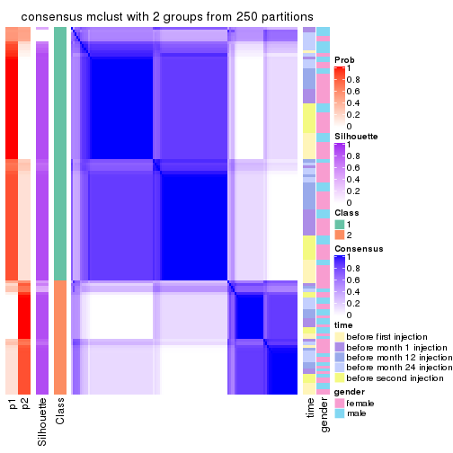</p>

</div>
<div id='tab-ATC-mclust-consensus-heatmap-2'>
<pre><code class="r">consensus_heatmap(res, k = 3)
</code></pre>

<p></p>

</div>
<div id='tab-ATC-mclust-consensus-heatmap-3'>
<pre><code class="r">consensus_heatmap(res, k = 4)
</code></pre>

<p></p>

</div>
<div id='tab-ATC-mclust-consensus-heatmap-4'>
<pre><code class="r">consensus_heatmap(res, k = 5)
</code></pre>

<p></p>

</div>
<div id='tab-ATC-mclust-consensus-heatmap-5'>
<pre><code class="r">consensus_heatmap(res, k = 6)
</code></pre>

<p></p>

</div>
</div>

Heatmaps for the membership of samples in all partitions to see how consistent they are:


<script>
$( function() {
	$( '#tabs-ATC-mclust-membership-heatmap' ).tabs();
} );
</script>
<div id='tabs-ATC-mclust-membership-heatmap'>
<ul>
<li><a href='#tab-ATC-mclust-membership-heatmap-1'>k = 2</a></li>
<li><a href='#tab-ATC-mclust-membership-heatmap-2'>k = 3</a></li>
<li><a href='#tab-ATC-mclust-membership-heatmap-3'>k = 4</a></li>
<li><a href='#tab-ATC-mclust-membership-heatmap-4'>k = 5</a></li>
<li><a href='#tab-ATC-mclust-membership-heatmap-5'>k = 6</a></li>
</ul>
<div id='tab-ATC-mclust-membership-heatmap-1'>
<pre><code class="r">membership_heatmap(res, k = 2)
</code></pre>

<p></p>

</div>
<div id='tab-ATC-mclust-membership-heatmap-2'>
<pre><code class="r">membership_heatmap(res, k = 3)
</code></pre>

<p></p>

</div>
<div id='tab-ATC-mclust-membership-heatmap-3'>
<pre><code class="r">membership_heatmap(res, k = 4)
</code></pre>

<p></p>

</div>
<div id='tab-ATC-mclust-membership-heatmap-4'>
<pre><code class="r">membership_heatmap(res, k = 5)
</code></pre>

<p></p>

</div>
<div id='tab-ATC-mclust-membership-heatmap-5'>
<pre><code class="r">membership_heatmap(res, k = 6)
</code></pre>

<p></p>

</div>
</div>

As soon as we have had the classes for columns, we can look for signatures
which are significantly different between classes which can be candidate marks
for certain classes. Following are the heatmaps for signatures.


Signature heatmaps where rows are scaled:


<script>
$( function() {
	$( '#tabs-ATC-mclust-get-signatures' ).tabs();
} );
</script>
<div id='tabs-ATC-mclust-get-signatures'>
<ul>
<li><a href='#tab-ATC-mclust-get-signatures-1'>k = 2</a></li>
<li><a href='#tab-ATC-mclust-get-signatures-2'>k = 3</a></li>
<li><a href='#tab-ATC-mclust-get-signatures-3'>k = 4</a></li>
<li><a href='#tab-ATC-mclust-get-signatures-4'>k = 5</a></li>
<li><a href='#tab-ATC-mclust-get-signatures-5'>k = 6</a></li>
</ul>
<div id='tab-ATC-mclust-get-signatures-1'>
<pre><code class="r">get_signatures(res, k = 2)
</code></pre>

<p></p>

</div>
<div id='tab-ATC-mclust-get-signatures-2'>
<pre><code class="r">get_signatures(res, k = 3)
</code></pre>

<p></p>

</div>
<div id='tab-ATC-mclust-get-signatures-3'>
<pre><code class="r">get_signatures(res, k = 4)
</code></pre>

<p></p>

</div>
<div id='tab-ATC-mclust-get-signatures-4'>
<pre><code class="r">get_signatures(res, k = 5)
</code></pre>

<p></p>

</div>
<div id='tab-ATC-mclust-get-signatures-5'>
<pre><code class="r">get_signatures(res, k = 6)
</code></pre>

<p></p>

</div>
</div>


Signature heatmaps where rows are not scaled:


<script>
$( function() {
	$( '#tabs-ATC-mclust-get-signatures-no-scale' ).tabs();
} );
</script>
<div id='tabs-ATC-mclust-get-signatures-no-scale'>
<ul>
<li><a href='#tab-ATC-mclust-get-signatures-no-scale-1'>k = 2</a></li>
<li><a href='#tab-ATC-mclust-get-signatures-no-scale-2'>k = 3</a></li>
<li><a href='#tab-ATC-mclust-get-signatures-no-scale-3'>k = 4</a></li>
<li><a href='#tab-ATC-mclust-get-signatures-no-scale-4'>k = 5</a></li>
<li><a href='#tab-ATC-mclust-get-signatures-no-scale-5'>k = 6</a></li>
</ul>
<div id='tab-ATC-mclust-get-signatures-no-scale-1'>
<pre><code class="r">get_signatures(res, k = 2, scale_rows = FALSE)
</code></pre>

<p></p>

</div>
<div id='tab-ATC-mclust-get-signatures-no-scale-2'>
<pre><code class="r">get_signatures(res, k = 3, scale_rows = FALSE)
</code></pre>

<p></p>

</div>
<div id='tab-ATC-mclust-get-signatures-no-scale-3'>
<pre><code class="r">get_signatures(res, k = 4, scale_rows = FALSE)
</code></pre>

<p></p>

</div>
<div id='tab-ATC-mclust-get-signatures-no-scale-4'>
<pre><code class="r">get_signatures(res, k = 5, scale_rows = FALSE)
</code></pre>

<p></p>

</div>
<div id='tab-ATC-mclust-get-signatures-no-scale-5'>
<pre><code class="r">get_signatures(res, k = 6, scale_rows = FALSE)
</code></pre>

<p></p>

</div>
</div>


Compare the overlap of signatures from different k:

```r
compare_signatures(res)
```


`get_signature()` returns a data frame invisibly. TO get the list of signatures, the function
call should be assigned to a variable explicitly. In following code, if `plot` argument is set
to `FALSE`, no heatmap is plotted while only the differential analysis is performed.

```r
# code only for demonstration
tb = get_signature(res, k = ..., plot = FALSE)
```

An example of the output of `tb` is:

```
#>   which_row         fdr    mean_1    mean_2 scaled_mean_1 scaled_mean_2 km
#> 1        38 0.042760348  8.373488  9.131774    -0.5533452     0.5164555  1
#> 2        40 0.018707592  7.106213  8.469186    -0.6173731     0.5762149  1
#> 3        55 0.019134737 10.221463 11.207825    -0.6159697     0.5749050  1
#> 4        59 0.006059896  5.921854  7.869574    -0.6899429     0.6439467  1
#> 5        60 0.018055526  8.928898 10.211722    -0.6204761     0.5791110  1
#> 6        98 0.009384629 15.714769 14.887706     0.6635654    -0.6193277  2
...
```

The columns in `tb` are:

1. `which_row`: row indices corresponding to the input matrix.
2. `fdr`: FDR for the differential test. 
3. `mean_x`: The mean value in group x.
4. `scaled_mean_x`: The mean value in group x after rows are scaled.
5. `km`: Row groups if k-means clustering is applied to rows.


UMAP plot which shows how samples are separated.


<script>
$( function() {
	$( '#tabs-ATC-mclust-dimension-reduction' ).tabs();
} );
</script>
<div id='tabs-ATC-mclust-dimension-reduction'>
<ul>
<li><a href='#tab-ATC-mclust-dimension-reduction-1'>k = 2</a></li>
<li><a href='#tab-ATC-mclust-dimension-reduction-2'>k = 3</a></li>
<li><a href='#tab-ATC-mclust-dimension-reduction-3'>k = 4</a></li>
<li><a href='#tab-ATC-mclust-dimension-reduction-4'>k = 5</a></li>
<li><a href='#tab-ATC-mclust-dimension-reduction-5'>k = 6</a></li>
</ul>
<div id='tab-ATC-mclust-dimension-reduction-1'>
<pre><code class="r">dimension_reduction(res, k = 2, method = &quot;UMAP&quot;)
</code></pre>

<p>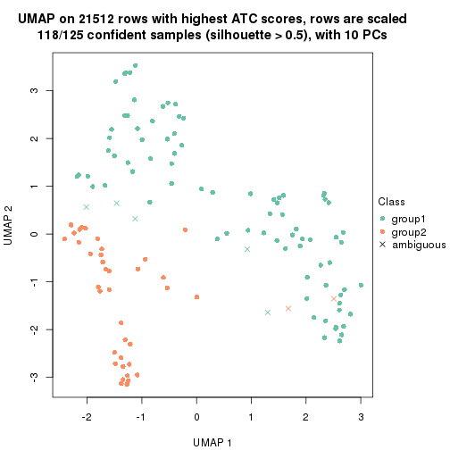</p>

</div>
<div id='tab-ATC-mclust-dimension-reduction-2'>
<pre><code class="r">dimension_reduction(res, k = 3, method = &quot;UMAP&quot;)
</code></pre>

<p></p>

</div>
<div id='tab-ATC-mclust-dimension-reduction-3'>
<pre><code class="r">dimension_reduction(res, k = 4, method = &quot;UMAP&quot;)
</code></pre>

<p></p>

</div>
<div id='tab-ATC-mclust-dimension-reduction-4'>
<pre><code class="r">dimension_reduction(res, k = 5, method = &quot;UMAP&quot;)
</code></pre>

<p></p>

</div>
<div id='tab-ATC-mclust-dimension-reduction-5'>
<pre><code class="r">dimension_reduction(res, k = 6, method = &quot;UMAP&quot;)
</code></pre>

<p></p>

</div>
</div>


Following heatmap shows how subgroups are split when increasing `k`:

```r
collect_classes(res)
```

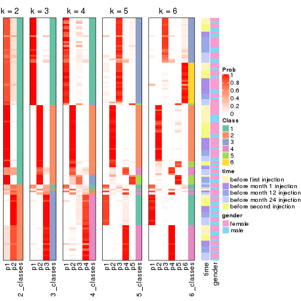


Test correlation between subgroups and known annotations. If the known
annotation is numeric, one-way ANOVA test is applied, and if the known
annotation is discrete, chi-squared contingency table test is applied.

```r
test_to_known_factors(res)
```

```
#>              n time(p) gender(p) k
#> ATC:mclust 118   0.757     0.493 2
#> ATC:mclust 120   0.921     0.565 3
#> ATC:mclust 120   0.248     0.635 4
#> ATC:mclust 119   0.135     0.644 5
#> ATC:mclust 121   0.379     0.538 6
```


If matrix rows can be associated to genes, consider to use `functional_enrichment(res,
...)` to perform function enrichment for the signature genes. See [this vignette](http://bioconductor.org/packages/devel/bioc/vignettes/cola/inst/doc/functional_enrichment.html) for more detailed explanations.


 

---------------------------------------------------


### ATC:NMF**


The object with results only for a single top-value method and a single partition method 
can be extracted as:

```r
res = res_list["ATC", "NMF"]
# you can also extract it by
# res = res_list["ATC:NMF"]
```

A summary of `res` and all the functions that can be applied to it:

```r
res
```

```
#> A 'ConsensusPartition' object with k = 2, 3, 4, 5, 6.
#>   On a matrix with 21512 rows and 125 columns.
#>   Top rows (1000, 2000, 3000, 4000, 5000) are extracted by 'ATC' method.
#>   Subgroups are detected by 'NMF' method.
#>   Performed in total 1250 partitions by row resampling.
#>   Best k for subgroups seems to be 2.
#> 
#> Following methods can be applied to this 'ConsensusPartition' object:
#>  [1] "cola_report"             "collect_classes"         "collect_plots"          
#>  [4] "collect_stats"           "colnames"                "compare_signatures"     
#>  [7] "consensus_heatmap"       "dimension_reduction"     "functional_enrichment"  
#> [10] "get_anno_col"            "get_anno"                "get_classes"            
#> [13] "get_consensus"           "get_matrix"              "get_membership"         
#> [16] "get_param"               "get_signatures"          "get_stats"              
#> [19] "is_best_k"               "is_stable_k"             "membership_heatmap"     
#> [22] "ncol"                    "nrow"                    "plot_ecdf"              
#> [25] "rownames"                "select_partition_number" "show"                   
#> [28] "suggest_best_k"          "test_to_known_factors"
```

`collect_plots()` function collects all the plots made from `res` for all `k` (number of partitions)
into one single page to provide an easy and fast comparison between different `k`.

```r
collect_plots(res)
```


The plots are:

- The first row: a plot of the ECDF (empirical cumulative distribution
  function) curves of the consensus matrix for each `k` and the heatmap of
  predicted classes for each `k`.
- The second row: heatmaps of the consensus matrix for each `k`.
- The third row: heatmaps of the membership matrix for each `k`.
- The fouth row: heatmaps of the signatures for each `k`.

All the plots in panels can be made by individual functions and they are
plotted later in this section.

`select_partition_number()` produces several plots showing different
statistics for choosing "optimized" `k`. There are following statistics:

- ECDF curves of the consensus matrix for each `k`;
- 1-PAC. [The PAC
  score](https://en.wikipedia.org/wiki/Consensus_clustering#Over-interpretation_potential_of_consensus_clustering)
  measures the proportion of the ambiguous subgrouping.
- Mean silhouette score.
- Concordance. The mean probability of fiting the consensus class ids in all
  partitions.
- Area increased. Denote $A_k$ as the area under the ECDF curve for current
  `k`, the area increased is defined as $A_k - A_{k-1}$.
- Rand index. The percent of pairs of samples that are both in a same cluster
  or both are not in a same cluster in the partition of k and k-1.
- Jaccard index. The ratio of pairs of samples are both in a same cluster in
  the partition of k and k-1 and the pairs of samples are both in a same
  cluster in the partition k or k-1.

The detailed explanations of these statistics can be found in [the _cola_
vignette](http://bioconductor.org/packages/devel/bioc/vignettes/cola/inst/doc/cola.html#toc_13).

Generally speaking, lower PAC score, higher mean silhouette score or higher
concordance corresponds to better partition. Rand index and Jaccard index
measure how similar the current partition is compared to partition with `k-1`.
If they are too similar, we won't accept `k` is better than `k-1`.

```r
select_partition_number(res)
```

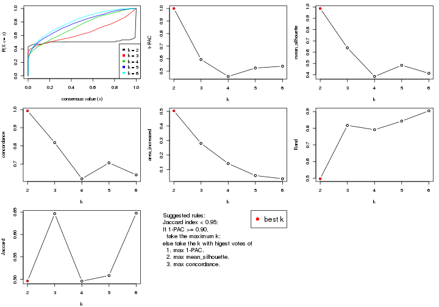

The numeric values for all these statistics can be obtained by `get_stats()`.

```r
get_stats(res)
```

```
#>   k 1-PAC mean_silhouette concordance area_increased  Rand Jaccard
#> 2 2 1.000           0.987       0.994         0.5041 0.496   0.496
#> 3 3 0.593           0.639       0.818         0.2802 0.818   0.646
#> 4 4 0.458           0.385       0.619         0.1417 0.791   0.496
#> 5 5 0.526           0.484       0.706         0.0593 0.843   0.508
#> 6 6 0.540           0.413       0.640         0.0368 0.905   0.648
```

`suggest_best_k()` suggests the best $k$ based on these statistics. The rules are as follows:

- All $k$ with Jaccard index larger than 0.95 are removed because increasing
  $k$ does not provide enough extra information. If all $k$ are removed, it is
  marked as no subgroup is detected.
- For all $k$ with 1-PAC score larger than 0.9, the maximal $k$ is taken as
  the best $k$, and other $k$ are marked as optional $k$.
- If it does not fit the second rule. The $k$ with the maximal vote of the
  highest 1-PAC score, highest mean silhouette, and highest concordance is
  taken as the best $k$.

```r
suggest_best_k(res)
```

```
#> [1] 2
```


Following shows the table of the partitions (You need to click the **show/hide
code output** link to see it). The membership matrix (columns with name `p*`)
is inferred by
[`clue::cl_consensus()`](https://www.rdocumentation.org/link/cl_consensus?package=clue)
function with the `SE` method. Basically the value in the membership matrix
represents the probability to belong to a certain group. The finall class
label for an item is determined with the group with highest probability it
belongs to.

In `get_classes()` function, the entropy is calculated from the membership
matrix and the silhouette score is calculated from the consensus matrix.


<script>
$( function() {
	$( '#tabs-ATC-NMF-get-classes' ).tabs();
} );
</script>
<div id='tabs-ATC-NMF-get-classes'>
<ul>
<li><a href='#tab-ATC-NMF-get-classes-1'>k = 2</a></li>
<li><a href='#tab-ATC-NMF-get-classes-2'>k = 3</a></li>
<li><a href='#tab-ATC-NMF-get-classes-3'>k = 4</a></li>
<li><a href='#tab-ATC-NMF-get-classes-4'>k = 5</a></li>
<li><a href='#tab-ATC-NMF-get-classes-5'>k = 6</a></li>
</ul>

<div id='tab-ATC-NMF-get-classes-1'>
<p><a id='tab-ATC-NMF-get-classes-1-a' style='color:#0366d6' href='#'>show/hide code output</a></p>
<pre><code class="r">cbind(get_classes(res, k = 2), get_membership(res, k = 2))
</code></pre>

<pre><code>#&gt;           class entropy silhouette    p1    p2
#&gt; GSM601872     2  0.0000      0.991 0.000 1.000
#&gt; GSM601882     2  0.0000      0.991 0.000 1.000
#&gt; GSM601887     1  0.0000      0.996 1.000 0.000
#&gt; GSM601892     1  0.0000      0.996 1.000 0.000
#&gt; GSM601897     1  0.0000      0.996 1.000 0.000
#&gt; GSM601902     2  0.0000      0.991 0.000 1.000
#&gt; GSM601912     1  0.6887      0.773 0.816 0.184
#&gt; GSM601927     1  0.0000      0.996 1.000 0.000
#&gt; GSM601932     2  0.0000      0.991 0.000 1.000
#&gt; GSM601937     2  0.0000      0.991 0.000 1.000
#&gt; GSM601942     2  0.0000      0.991 0.000 1.000
#&gt; GSM601947     2  0.0000      0.991 0.000 1.000
#&gt; GSM601957     1  0.0000      0.996 1.000 0.000
#&gt; GSM601972     2  0.0000      0.991 0.000 1.000
#&gt; GSM601977     2  0.0000      0.991 0.000 1.000
#&gt; GSM601987     2  0.0000      0.991 0.000 1.000
#&gt; GSM601877     1  0.0000      0.996 1.000 0.000
#&gt; GSM601907     2  0.0000      0.991 0.000 1.000
#&gt; GSM601917     2  0.0000      0.991 0.000 1.000
#&gt; GSM601922     2  0.0000      0.991 0.000 1.000
#&gt; GSM601952     2  0.0000      0.991 0.000 1.000
#&gt; GSM601962     1  0.2236      0.961 0.964 0.036
#&gt; GSM601967     1  0.0000      0.996 1.000 0.000
#&gt; GSM601982     2  0.0000      0.991 0.000 1.000
#&gt; GSM601992     2  0.0000      0.991 0.000 1.000
#&gt; GSM601873     2  0.0000      0.991 0.000 1.000
#&gt; GSM601883     2  0.0000      0.991 0.000 1.000
#&gt; GSM601888     1  0.0000      0.996 1.000 0.000
#&gt; GSM601893     1  0.0000      0.996 1.000 0.000
#&gt; GSM601898     1  0.0000      0.996 1.000 0.000
#&gt; GSM601903     2  0.0000      0.991 0.000 1.000
#&gt; GSM601913     1  0.0000      0.996 1.000 0.000
#&gt; GSM601928     1  0.0000      0.996 1.000 0.000
#&gt; GSM601933     2  0.0000      0.991 0.000 1.000
#&gt; GSM601938     2  0.0000      0.991 0.000 1.000
#&gt; GSM601943     2  0.0000      0.991 0.000 1.000
#&gt; GSM601948     1  0.0000      0.996 1.000 0.000
#&gt; GSM601958     1  0.0000      0.996 1.000 0.000
#&gt; GSM601973     2  0.0000      0.991 0.000 1.000
#&gt; GSM601978     2  0.0000      0.991 0.000 1.000
#&gt; GSM601988     2  0.0000      0.991 0.000 1.000
#&gt; GSM601878     1  0.0000      0.996 1.000 0.000
#&gt; GSM601908     2  0.0000      0.991 0.000 1.000
#&gt; GSM601918     2  0.0000      0.991 0.000 1.000
#&gt; GSM601923     1  0.0000      0.996 1.000 0.000
#&gt; GSM601953     2  0.0000      0.991 0.000 1.000
#&gt; GSM601963     1  0.0000      0.996 1.000 0.000
#&gt; GSM601968     1  0.0000      0.996 1.000 0.000
#&gt; GSM601983     1  0.0000      0.996 1.000 0.000
#&gt; GSM601993     2  0.0000      0.991 0.000 1.000
#&gt; GSM601874     2  0.0000      0.991 0.000 1.000
#&gt; GSM601884     2  0.0000      0.991 0.000 1.000
#&gt; GSM601889     1  0.0000      0.996 1.000 0.000
#&gt; GSM601894     1  0.0000      0.996 1.000 0.000
#&gt; GSM601899     1  0.0000      0.996 1.000 0.000
#&gt; GSM601904     2  0.0000      0.991 0.000 1.000
#&gt; GSM601914     1  0.0000      0.996 1.000 0.000
#&gt; GSM601929     1  0.0000      0.996 1.000 0.000
#&gt; GSM601934     2  0.0000      0.991 0.000 1.000
#&gt; GSM601939     1  0.0000      0.996 1.000 0.000
#&gt; GSM601944     2  0.0000      0.991 0.000 1.000
#&gt; GSM601949     1  0.0000      0.996 1.000 0.000
#&gt; GSM601959     1  0.0000      0.996 1.000 0.000
#&gt; GSM601974     2  0.1414      0.973 0.020 0.980
#&gt; GSM601979     2  0.0000      0.991 0.000 1.000
#&gt; GSM601989     1  0.0000      0.996 1.000 0.000
#&gt; GSM601879     1  0.0000      0.996 1.000 0.000
#&gt; GSM601909     1  0.0000      0.996 1.000 0.000
#&gt; GSM601919     2  0.0000      0.991 0.000 1.000
#&gt; GSM601924     1  0.0000      0.996 1.000 0.000
#&gt; GSM601954     2  0.0000      0.991 0.000 1.000
#&gt; GSM601964     1  0.0000      0.996 1.000 0.000
#&gt; GSM601969     1  0.0000      0.996 1.000 0.000
#&gt; GSM601984     1  0.0000      0.996 1.000 0.000
#&gt; GSM601994     2  0.0000      0.991 0.000 1.000
#&gt; GSM601875     2  0.0000      0.991 0.000 1.000
#&gt; GSM601885     2  0.0000      0.991 0.000 1.000
#&gt; GSM601890     1  0.0000      0.996 1.000 0.000
#&gt; GSM601895     1  0.0000      0.996 1.000 0.000
#&gt; GSM601900     1  0.0000      0.996 1.000 0.000
#&gt; GSM601905     2  0.0000      0.991 0.000 1.000
#&gt; GSM601915     1  0.0000      0.996 1.000 0.000
#&gt; GSM601930     1  0.0000      0.996 1.000 0.000
#&gt; GSM601935     2  0.0000      0.991 0.000 1.000
#&gt; GSM601940     1  0.0000      0.996 1.000 0.000
#&gt; GSM601945     2  0.0000      0.991 0.000 1.000
#&gt; GSM601950     1  0.0000      0.996 1.000 0.000
#&gt; GSM601960     1  0.0000      0.996 1.000 0.000
#&gt; GSM601975     2  0.0000      0.991 0.000 1.000
#&gt; GSM601980     2  0.0000      0.991 0.000 1.000
#&gt; GSM601990     1  0.0000      0.996 1.000 0.000
#&gt; GSM601880     1  0.0000      0.996 1.000 0.000
#&gt; GSM601910     1  0.0000      0.996 1.000 0.000
#&gt; GSM601920     2  0.0000      0.991 0.000 1.000
#&gt; GSM601925     1  0.0000      0.996 1.000 0.000
#&gt; GSM601955     2  0.0000      0.991 0.000 1.000
#&gt; GSM601965     1  0.0376      0.992 0.996 0.004
#&gt; GSM601970     1  0.0000      0.996 1.000 0.000
#&gt; GSM601985     1  0.0000      0.996 1.000 0.000
#&gt; GSM601995     2  0.0000      0.991 0.000 1.000
#&gt; GSM601876     1  0.0000      0.996 1.000 0.000
#&gt; GSM601886     2  0.0000      0.991 0.000 1.000
#&gt; GSM601891     1  0.0000      0.996 1.000 0.000
#&gt; GSM601896     1  0.0000      0.996 1.000 0.000
#&gt; GSM601901     2  0.0000      0.991 0.000 1.000
#&gt; GSM601906     2  0.6887      0.782 0.184 0.816
#&gt; GSM601916     2  0.0000      0.991 0.000 1.000
#&gt; GSM601931     1  0.0000      0.996 1.000 0.000
#&gt; GSM601936     2  0.0000      0.991 0.000 1.000
#&gt; GSM601941     2  0.0000      0.991 0.000 1.000
#&gt; GSM601946     1  0.0000      0.996 1.000 0.000
#&gt; GSM601951     1  0.0000      0.996 1.000 0.000
#&gt; GSM601961     2  0.5842      0.843 0.140 0.860
#&gt; GSM601976     2  0.0000      0.991 0.000 1.000
#&gt; GSM601981     2  0.0000      0.991 0.000 1.000
#&gt; GSM601991     1  0.1633      0.973 0.976 0.024
#&gt; GSM601881     1  0.0000      0.996 1.000 0.000
#&gt; GSM601911     2  0.3274      0.934 0.060 0.940
#&gt; GSM601921     2  0.0000      0.991 0.000 1.000
#&gt; GSM601926     1  0.0000      0.996 1.000 0.000
#&gt; GSM601956     2  0.0000      0.991 0.000 1.000
#&gt; GSM601966     2  0.0000      0.991 0.000 1.000
#&gt; GSM601971     1  0.0000      0.996 1.000 0.000
#&gt; GSM601986     2  0.5946      0.838 0.144 0.856
#&gt; GSM601996     2  0.0000      0.991 0.000 1.000
</code></pre>

<script>
$('#tab-ATC-NMF-get-classes-1-a').parent().next().next().hide();
$('#tab-ATC-NMF-get-classes-1-a').click(function(){
  $('#tab-ATC-NMF-get-classes-1-a').parent().next().next().toggle();
  return(false);
});
</script>
</div>

<div id='tab-ATC-NMF-get-classes-2'>
<p><a id='tab-ATC-NMF-get-classes-2-a' style='color:#0366d6' href='#'>show/hide code output</a></p>
<pre><code class="r">cbind(get_classes(res, k = 3), get_membership(res, k = 3))
</code></pre>

<pre><code>#&gt;           class entropy silhouette    p1    p2    p3
#&gt; GSM601872     2  0.0983    0.65195 0.004 0.980 0.016
#&gt; GSM601882     2  0.6168    0.30395 0.000 0.588 0.412
#&gt; GSM601887     1  0.3091    0.85737 0.912 0.072 0.016
#&gt; GSM601892     1  0.3445    0.84854 0.896 0.088 0.016
#&gt; GSM601897     1  0.1337    0.88036 0.972 0.016 0.012
#&gt; GSM601902     2  0.4178    0.65046 0.000 0.828 0.172
#&gt; GSM601912     1  0.6937    0.54085 0.680 0.048 0.272
#&gt; GSM601927     1  0.2356    0.87353 0.928 0.000 0.072
#&gt; GSM601932     3  0.6235    0.27600 0.000 0.436 0.564
#&gt; GSM601937     3  0.1964    0.68726 0.000 0.056 0.944
#&gt; GSM601942     2  0.6244    0.21087 0.000 0.560 0.440
#&gt; GSM601947     2  0.0237    0.64038 0.000 0.996 0.004
#&gt; GSM601957     1  0.1337    0.88036 0.972 0.016 0.012
#&gt; GSM601972     2  0.1289    0.66221 0.000 0.968 0.032
#&gt; GSM601977     2  0.6307   -0.00475 0.000 0.512 0.488
#&gt; GSM601987     2  0.4504    0.63975 0.000 0.804 0.196
#&gt; GSM601877     1  0.1337    0.88036 0.972 0.016 0.012
#&gt; GSM601907     2  0.0424    0.64920 0.000 0.992 0.008
#&gt; GSM601917     3  0.3686    0.68283 0.000 0.140 0.860
#&gt; GSM601922     2  0.5216    0.58574 0.000 0.740 0.260
#&gt; GSM601952     3  0.6235    0.27592 0.000 0.436 0.564
#&gt; GSM601962     3  0.2448    0.59541 0.076 0.000 0.924
#&gt; GSM601967     1  0.3359    0.85081 0.900 0.084 0.016
#&gt; GSM601982     2  0.4452    0.64313 0.000 0.808 0.192
#&gt; GSM601992     3  0.6267    0.22296 0.000 0.452 0.548
#&gt; GSM601873     3  0.6154    0.34800 0.000 0.408 0.592
#&gt; GSM601883     2  0.6180    0.29035 0.000 0.584 0.416
#&gt; GSM601888     2  0.6948   -0.25881 0.472 0.512 0.016
#&gt; GSM601893     1  0.0983    0.88158 0.980 0.016 0.004
#&gt; GSM601898     1  0.0000    0.88332 1.000 0.000 0.000
#&gt; GSM601903     2  0.6062    0.37770 0.000 0.616 0.384
#&gt; GSM601913     1  0.6062    0.59214 0.616 0.000 0.384
#&gt; GSM601928     1  0.5363    0.72977 0.724 0.000 0.276
#&gt; GSM601933     2  0.5905    0.44563 0.000 0.648 0.352
#&gt; GSM601938     3  0.6126    0.36528 0.000 0.400 0.600
#&gt; GSM601943     2  0.6026    0.39726 0.000 0.624 0.376
#&gt; GSM601948     1  0.6587    0.57327 0.632 0.352 0.016
#&gt; GSM601958     1  0.0000    0.88332 1.000 0.000 0.000
#&gt; GSM601973     3  0.6095    0.38097 0.000 0.392 0.608
#&gt; GSM601978     2  0.1289    0.66219 0.000 0.968 0.032
#&gt; GSM601988     3  0.2537    0.69089 0.000 0.080 0.920
#&gt; GSM601878     1  0.1337    0.88036 0.972 0.016 0.012
#&gt; GSM601908     2  0.1411    0.66327 0.000 0.964 0.036
#&gt; GSM601918     2  0.4931    0.61254 0.000 0.768 0.232
#&gt; GSM601923     1  0.2165    0.87608 0.936 0.000 0.064
#&gt; GSM601953     2  0.0983    0.62617 0.004 0.980 0.016
#&gt; GSM601963     1  0.5058    0.76256 0.756 0.000 0.244
#&gt; GSM601968     1  0.4068    0.82826 0.864 0.120 0.016
#&gt; GSM601983     1  0.2537    0.87089 0.920 0.000 0.080
#&gt; GSM601993     3  0.4796    0.62468 0.000 0.220 0.780
#&gt; GSM601874     2  0.0000    0.64349 0.000 1.000 0.000
#&gt; GSM601884     2  0.4504    0.64058 0.000 0.804 0.196
#&gt; GSM601889     1  0.0000    0.88332 1.000 0.000 0.000
#&gt; GSM601894     1  0.0592    0.88308 0.988 0.000 0.012
#&gt; GSM601899     1  0.5763    0.71515 0.740 0.244 0.016
#&gt; GSM601904     3  0.3412    0.68728 0.000 0.124 0.876
#&gt; GSM601914     1  0.4702    0.78952 0.788 0.000 0.212
#&gt; GSM601929     1  0.0000    0.88332 1.000 0.000 0.000
#&gt; GSM601934     2  0.6095    0.35966 0.000 0.608 0.392
#&gt; GSM601939     1  0.1643    0.88025 0.956 0.000 0.044
#&gt; GSM601944     2  0.6225    0.24066 0.000 0.568 0.432
#&gt; GSM601949     1  0.6587    0.57269 0.632 0.352 0.016
#&gt; GSM601959     1  0.1337    0.88036 0.972 0.016 0.012
#&gt; GSM601974     2  0.6180    0.28627 0.000 0.584 0.416
#&gt; GSM601979     2  0.1289    0.66219 0.000 0.968 0.032
#&gt; GSM601989     1  0.0237    0.88317 0.996 0.004 0.000
#&gt; GSM601879     1  0.2902    0.86214 0.920 0.064 0.016
#&gt; GSM601909     1  0.1337    0.88036 0.972 0.016 0.012
#&gt; GSM601919     2  0.0892    0.65646 0.000 0.980 0.020
#&gt; GSM601924     1  0.0237    0.88330 0.996 0.000 0.004
#&gt; GSM601954     2  0.1491    0.61477 0.016 0.968 0.016
#&gt; GSM601964     1  0.6045    0.59821 0.620 0.000 0.380
#&gt; GSM601969     1  0.6897    0.41518 0.548 0.436 0.016
#&gt; GSM601984     1  0.1860    0.88063 0.948 0.000 0.052
#&gt; GSM601994     2  0.6309   -0.05342 0.000 0.504 0.496
#&gt; GSM601875     2  0.2796    0.66350 0.000 0.908 0.092
#&gt; GSM601885     2  0.6126    0.33952 0.000 0.600 0.400
#&gt; GSM601890     1  0.5461    0.74546 0.768 0.216 0.016
#&gt; GSM601895     1  0.2066    0.87716 0.940 0.000 0.060
#&gt; GSM601900     1  0.2261    0.87598 0.932 0.000 0.068
#&gt; GSM601905     3  0.6286    0.17748 0.000 0.464 0.536
#&gt; GSM601915     1  0.4796    0.78306 0.780 0.000 0.220
#&gt; GSM601930     1  0.6008    0.60950 0.628 0.000 0.372
#&gt; GSM601935     3  0.0747    0.66737 0.000 0.016 0.984
#&gt; GSM601940     1  0.0000    0.88332 1.000 0.000 0.000
#&gt; GSM601945     2  0.1529    0.66418 0.000 0.960 0.040
#&gt; GSM601950     1  0.2031    0.87443 0.952 0.032 0.016
#&gt; GSM601960     1  0.3192    0.85575 0.888 0.000 0.112
#&gt; GSM601975     2  0.4062    0.65294 0.000 0.836 0.164
#&gt; GSM601980     3  0.4555    0.64354 0.000 0.200 0.800
#&gt; GSM601990     3  0.3752    0.51579 0.144 0.000 0.856
#&gt; GSM601880     1  0.1289    0.88153 0.968 0.000 0.032
#&gt; GSM601910     1  0.1482    0.87936 0.968 0.020 0.012
#&gt; GSM601920     3  0.3816    0.68003 0.000 0.148 0.852
#&gt; GSM601925     1  0.2448    0.87228 0.924 0.000 0.076
#&gt; GSM601955     3  0.1289    0.67806 0.000 0.032 0.968
#&gt; GSM601965     1  0.0424    0.88364 0.992 0.000 0.008
#&gt; GSM601970     1  0.1337    0.88036 0.972 0.016 0.012
#&gt; GSM601985     1  0.3686    0.83975 0.860 0.000 0.140
#&gt; GSM601995     3  0.0829    0.66418 0.004 0.012 0.984
#&gt; GSM601876     1  0.4750    0.78689 0.784 0.000 0.216
#&gt; GSM601886     3  0.3816    0.67984 0.000 0.148 0.852
#&gt; GSM601891     1  0.6543    0.58256 0.640 0.344 0.016
#&gt; GSM601896     1  0.1964    0.87812 0.944 0.000 0.056
#&gt; GSM601901     2  0.5178    0.58994 0.000 0.744 0.256
#&gt; GSM601906     3  0.2063    0.68081 0.008 0.044 0.948
#&gt; GSM601916     3  0.6192    0.31905 0.000 0.420 0.580
#&gt; GSM601931     1  0.2537    0.87114 0.920 0.000 0.080
#&gt; GSM601936     3  0.1163    0.67577 0.000 0.028 0.972
#&gt; GSM601941     2  0.5678    0.50566 0.000 0.684 0.316
#&gt; GSM601946     1  0.5254    0.74248 0.736 0.000 0.264
#&gt; GSM601951     2  0.6798   -0.03983 0.400 0.584 0.016
#&gt; GSM601961     2  0.4723    0.45484 0.160 0.824 0.016
#&gt; GSM601976     2  0.5098    0.59907 0.000 0.752 0.248
#&gt; GSM601981     2  0.1860    0.66506 0.000 0.948 0.052
#&gt; GSM601991     3  0.1964    0.61613 0.056 0.000 0.944
#&gt; GSM601881     1  0.1643    0.88010 0.956 0.000 0.044
#&gt; GSM601911     3  0.2625    0.69242 0.000 0.084 0.916
#&gt; GSM601921     3  0.6267    0.22354 0.000 0.452 0.548
#&gt; GSM601926     1  0.2261    0.87487 0.932 0.000 0.068
#&gt; GSM601956     2  0.1529    0.66418 0.000 0.960 0.040
#&gt; GSM601966     2  0.4346    0.64590 0.000 0.816 0.184
#&gt; GSM601971     1  0.1774    0.87706 0.960 0.024 0.016
#&gt; GSM601986     3  0.2774    0.69073 0.008 0.072 0.920
#&gt; GSM601996     3  0.6309    0.01345 0.000 0.500 0.500
</code></pre>

<script>
$('#tab-ATC-NMF-get-classes-2-a').parent().next().next().hide();
$('#tab-ATC-NMF-get-classes-2-a').click(function(){
  $('#tab-ATC-NMF-get-classes-2-a').parent().next().next().toggle();
  return(false);
});
</script>
</div>

<div id='tab-ATC-NMF-get-classes-3'>
<p><a id='tab-ATC-NMF-get-classes-3-a' style='color:#0366d6' href='#'>show/hide code output</a></p>
<pre><code class="r">cbind(get_classes(res, k = 4), get_membership(res, k = 4))
</code></pre>

<pre><code>#&gt;           class entropy silhouette    p1    p2    p3    p4
#&gt; GSM601872     2  0.2060    0.44813 0.016 0.932 0.052 0.000
#&gt; GSM601882     2  0.7870    0.11207 0.000 0.392 0.304 0.304
#&gt; GSM601887     1  0.4843    0.38880 0.604 0.396 0.000 0.000
#&gt; GSM601892     1  0.4972    0.29761 0.544 0.456 0.000 0.000
#&gt; GSM601897     1  0.7332    0.29398 0.480 0.356 0.164 0.000
#&gt; GSM601902     4  0.2469    0.56602 0.000 0.108 0.000 0.892
#&gt; GSM601912     3  0.6915    0.38508 0.212 0.196 0.592 0.000
#&gt; GSM601927     1  0.7238    0.38951 0.524 0.000 0.172 0.304
#&gt; GSM601932     4  0.7369    0.21965 0.000 0.292 0.196 0.512
#&gt; GSM601937     3  0.4285    0.56633 0.000 0.156 0.804 0.040
#&gt; GSM601942     3  0.5151    0.29062 0.000 0.464 0.532 0.004
#&gt; GSM601947     4  0.4422    0.43428 0.000 0.256 0.008 0.736
#&gt; GSM601957     1  0.0895    0.68836 0.976 0.020 0.000 0.004
#&gt; GSM601972     4  0.3937    0.50902 0.000 0.188 0.012 0.800
#&gt; GSM601977     3  0.6597    0.28300 0.000 0.372 0.540 0.088
#&gt; GSM601987     2  0.7576    0.11309 0.000 0.452 0.204 0.344
#&gt; GSM601877     4  0.5697   -0.23840 0.468 0.008 0.012 0.512
#&gt; GSM601907     2  0.2179    0.49301 0.000 0.924 0.012 0.064
#&gt; GSM601917     4  0.5463    0.49263 0.000 0.052 0.256 0.692
#&gt; GSM601922     4  0.1247    0.57877 0.004 0.016 0.012 0.968
#&gt; GSM601952     3  0.7878   -0.00786 0.000 0.324 0.384 0.292
#&gt; GSM601962     3  0.3245    0.55532 0.100 0.028 0.872 0.000
#&gt; GSM601967     1  0.4889    0.44436 0.636 0.360 0.000 0.004
#&gt; GSM601982     2  0.5489    0.33826 0.000 0.700 0.240 0.060
#&gt; GSM601992     4  0.7786    0.07858 0.000 0.308 0.268 0.424
#&gt; GSM601873     3  0.4889    0.43619 0.000 0.360 0.636 0.004
#&gt; GSM601883     2  0.7877    0.02282 0.000 0.364 0.280 0.356
#&gt; GSM601888     2  0.6171    0.15714 0.284 0.644 0.008 0.064
#&gt; GSM601893     1  0.5901    0.49816 0.652 0.280 0.068 0.000
#&gt; GSM601898     1  0.0779    0.68749 0.980 0.016 0.004 0.000
#&gt; GSM601903     4  0.1854    0.58261 0.000 0.048 0.012 0.940
#&gt; GSM601913     3  0.4877   -0.09115 0.408 0.000 0.592 0.000
#&gt; GSM601928     1  0.6542    0.52679 0.636 0.000 0.196 0.168
#&gt; GSM601933     2  0.7806    0.05006 0.000 0.392 0.252 0.356
#&gt; GSM601938     4  0.7894   -0.01927 0.000 0.292 0.344 0.364
#&gt; GSM601943     3  0.5163    0.26741 0.000 0.480 0.516 0.004
#&gt; GSM601948     1  0.6820    0.32762 0.528 0.080 0.008 0.384
#&gt; GSM601958     1  0.0524    0.68769 0.988 0.008 0.004 0.000
#&gt; GSM601973     4  0.5209    0.55155 0.000 0.104 0.140 0.756
#&gt; GSM601978     2  0.3486    0.50277 0.000 0.864 0.044 0.092
#&gt; GSM601988     3  0.4452    0.56161 0.000 0.156 0.796 0.048
#&gt; GSM601878     1  0.5250    0.49338 0.640 0.004 0.012 0.344
#&gt; GSM601908     2  0.5256    0.44817 0.000 0.732 0.064 0.204
#&gt; GSM601918     4  0.4898    0.46924 0.000 0.260 0.024 0.716
#&gt; GSM601923     1  0.6856    0.45700 0.576 0.000 0.140 0.284
#&gt; GSM601953     2  0.2924    0.46902 0.016 0.884 0.000 0.100
#&gt; GSM601963     1  0.5060    0.38029 0.584 0.000 0.412 0.004
#&gt; GSM601968     1  0.4992    0.25270 0.524 0.476 0.000 0.000
#&gt; GSM601983     1  0.4661    0.45063 0.652 0.000 0.348 0.000
#&gt; GSM601993     3  0.7658    0.17071 0.000 0.236 0.456 0.308
#&gt; GSM601874     2  0.2480    0.49793 0.000 0.904 0.008 0.088
#&gt; GSM601884     2  0.6816    0.34164 0.000 0.604 0.212 0.184
#&gt; GSM601889     1  0.0779    0.68749 0.980 0.016 0.004 0.000
#&gt; GSM601894     1  0.1489    0.68290 0.952 0.004 0.044 0.000
#&gt; GSM601899     2  0.5137   -0.15512 0.452 0.544 0.004 0.000
#&gt; GSM601904     4  0.4188    0.50750 0.000 0.004 0.244 0.752
#&gt; GSM601914     1  0.5147    0.26661 0.536 0.004 0.460 0.000
#&gt; GSM601929     4  0.6052   -0.08845 0.396 0.000 0.048 0.556
#&gt; GSM601934     2  0.7856    0.07149 0.000 0.388 0.336 0.276
#&gt; GSM601939     1  0.2089    0.68367 0.932 0.000 0.048 0.020
#&gt; GSM601944     2  0.7684    0.06173 0.000 0.420 0.360 0.220
#&gt; GSM601949     1  0.7727    0.26689 0.452 0.364 0.008 0.176
#&gt; GSM601959     1  0.1109    0.68808 0.968 0.028 0.000 0.004
#&gt; GSM601974     4  0.2261    0.58040 0.008 0.036 0.024 0.932
#&gt; GSM601979     2  0.5254    0.42801 0.000 0.724 0.056 0.220
#&gt; GSM601989     1  0.1398    0.68404 0.956 0.040 0.004 0.000
#&gt; GSM601879     4  0.6296   -0.20303 0.452 0.040 0.008 0.500
#&gt; GSM601909     1  0.3768    0.61296 0.808 0.184 0.008 0.000
#&gt; GSM601919     4  0.2918    0.54659 0.000 0.116 0.008 0.876
#&gt; GSM601924     1  0.4225    0.63813 0.792 0.000 0.024 0.184
#&gt; GSM601954     2  0.5272    0.21114 0.004 0.608 0.008 0.380
#&gt; GSM601964     3  0.5070   -0.09115 0.416 0.004 0.580 0.000
#&gt; GSM601969     2  0.5764   -0.06111 0.404 0.568 0.004 0.024
#&gt; GSM601984     1  0.3550    0.66908 0.860 0.000 0.096 0.044
#&gt; GSM601994     4  0.7753    0.07597 0.000 0.312 0.256 0.432
#&gt; GSM601875     2  0.4673    0.46367 0.000 0.792 0.132 0.076
#&gt; GSM601885     2  0.7745    0.06638 0.000 0.412 0.352 0.236
#&gt; GSM601890     2  0.5158   -0.19325 0.472 0.524 0.004 0.000
#&gt; GSM601895     1  0.5339    0.36582 0.600 0.016 0.384 0.000
#&gt; GSM601900     1  0.5459    0.26943 0.552 0.016 0.432 0.000
#&gt; GSM601905     4  0.2480    0.58364 0.000 0.008 0.088 0.904
#&gt; GSM601915     1  0.5143    0.34488 0.540 0.000 0.456 0.004
#&gt; GSM601930     1  0.7449    0.35556 0.500 0.000 0.208 0.292
#&gt; GSM601935     3  0.1284    0.57666 0.000 0.012 0.964 0.024
#&gt; GSM601940     1  0.0336    0.68828 0.992 0.000 0.000 0.008
#&gt; GSM601945     2  0.4235    0.49213 0.000 0.824 0.084 0.092
#&gt; GSM601950     1  0.3001    0.68184 0.896 0.036 0.004 0.064
#&gt; GSM601960     1  0.4193    0.55529 0.732 0.000 0.268 0.000
#&gt; GSM601975     4  0.3351    0.55042 0.000 0.148 0.008 0.844
#&gt; GSM601980     3  0.6432    0.43312 0.000 0.236 0.636 0.128
#&gt; GSM601990     3  0.3182    0.49822 0.132 0.004 0.860 0.004
#&gt; GSM601880     1  0.6532    0.43378 0.572 0.000 0.092 0.336
#&gt; GSM601910     1  0.6926    0.29530 0.496 0.392 0.112 0.000
#&gt; GSM601920     4  0.4198    0.51586 0.004 0.004 0.224 0.768
#&gt; GSM601925     1  0.7410    0.33342 0.488 0.000 0.184 0.328
#&gt; GSM601955     3  0.3257    0.56990 0.000 0.152 0.844 0.004
#&gt; GSM601965     1  0.1486    0.68823 0.960 0.008 0.024 0.008
#&gt; GSM601970     1  0.1824    0.68004 0.936 0.060 0.004 0.000
#&gt; GSM601985     1  0.3583    0.64567 0.816 0.000 0.180 0.004
#&gt; GSM601995     3  0.1677    0.57076 0.000 0.012 0.948 0.040
#&gt; GSM601876     1  0.3486    0.64711 0.812 0.000 0.188 0.000
#&gt; GSM601886     4  0.6658    0.14082 0.000 0.084 0.444 0.472
#&gt; GSM601891     2  0.4877   -0.05285 0.408 0.592 0.000 0.000
#&gt; GSM601896     1  0.3051    0.67441 0.884 0.000 0.088 0.028
#&gt; GSM601901     4  0.6748    0.29008 0.000 0.328 0.112 0.560
#&gt; GSM601906     4  0.4874    0.50428 0.056 0.000 0.180 0.764
#&gt; GSM601916     4  0.6646    0.41116 0.000 0.224 0.156 0.620
#&gt; GSM601931     1  0.6567    0.50211 0.616 0.000 0.128 0.256
#&gt; GSM601936     3  0.2578    0.58355 0.000 0.052 0.912 0.036
#&gt; GSM601941     4  0.5074    0.48259 0.000 0.236 0.040 0.724
#&gt; GSM601946     1  0.4086    0.63277 0.776 0.000 0.216 0.008
#&gt; GSM601951     4  0.6851    0.04693 0.356 0.088 0.008 0.548
#&gt; GSM601961     2  0.5950    0.36104 0.100 0.708 0.008 0.184
#&gt; GSM601976     4  0.1339    0.57595 0.008 0.024 0.004 0.964
#&gt; GSM601981     2  0.5417    0.46664 0.000 0.732 0.088 0.180
#&gt; GSM601991     3  0.2891    0.55766 0.080 0.020 0.896 0.004
#&gt; GSM601881     1  0.6618    0.49054 0.604 0.000 0.124 0.272
#&gt; GSM601911     3  0.6961    0.21941 0.000 0.136 0.548 0.316
#&gt; GSM601921     4  0.2412    0.58379 0.000 0.008 0.084 0.908
#&gt; GSM601926     1  0.6157    0.54569 0.660 0.000 0.108 0.232
#&gt; GSM601956     2  0.3687    0.49104 0.000 0.856 0.080 0.064
#&gt; GSM601966     4  0.6928    0.19121 0.000 0.372 0.116 0.512
#&gt; GSM601971     1  0.2781    0.68393 0.904 0.016 0.008 0.072
#&gt; GSM601986     3  0.6933   -0.08466 0.016 0.068 0.496 0.420
#&gt; GSM601996     4  0.7733    0.09312 0.000 0.304 0.256 0.440
</code></pre>

<script>
$('#tab-ATC-NMF-get-classes-3-a').parent().next().next().hide();
$('#tab-ATC-NMF-get-classes-3-a').click(function(){
  $('#tab-ATC-NMF-get-classes-3-a').parent().next().next().toggle();
  return(false);
});
</script>
</div>

<div id='tab-ATC-NMF-get-classes-4'>
<p><a id='tab-ATC-NMF-get-classes-4-a' style='color:#0366d6' href='#'>show/hide code output</a></p>
<pre><code class="r">cbind(get_classes(res, k = 5), get_membership(res, k = 5))
</code></pre>

<pre><code>#&gt;           class entropy silhouette    p1    p2    p3    p4    p5
#&gt; GSM601872     1   0.490    0.41783 0.732 0.164 0.000 0.008 0.096
#&gt; GSM601882     2   0.532    0.67456 0.044 0.732 0.000 0.104 0.120
#&gt; GSM601887     3   0.436    0.14184 0.412 0.000 0.584 0.004 0.000
#&gt; GSM601892     3   0.505    0.38393 0.284 0.032 0.668 0.012 0.004
#&gt; GSM601897     3   0.697   -0.12779 0.360 0.008 0.380 0.000 0.252
#&gt; GSM601902     4   0.385    0.57559 0.032 0.172 0.000 0.792 0.004
#&gt; GSM601912     2   0.845   -0.17479 0.172 0.344 0.304 0.004 0.176
#&gt; GSM601927     3   0.570    0.05069 0.008 0.000 0.500 0.432 0.060
#&gt; GSM601932     2   0.618    0.47774 0.040 0.548 0.000 0.352 0.060
#&gt; GSM601937     5   0.517    0.28532 0.004 0.436 0.000 0.032 0.528
#&gt; GSM601942     5   0.561    0.65218 0.192 0.128 0.000 0.012 0.668
#&gt; GSM601947     4   0.488    0.16732 0.444 0.024 0.000 0.532 0.000
#&gt; GSM601957     3   0.160    0.67589 0.048 0.000 0.940 0.012 0.000
#&gt; GSM601972     4   0.491    0.55011 0.204 0.080 0.000 0.712 0.004
#&gt; GSM601977     5   0.600    0.61163 0.120 0.220 0.000 0.024 0.636
#&gt; GSM601987     2   0.365    0.73089 0.036 0.828 0.000 0.124 0.012
#&gt; GSM601877     4   0.485    0.36882 0.028 0.000 0.312 0.652 0.008
#&gt; GSM601907     2   0.486    0.35889 0.364 0.608 0.000 0.024 0.004
#&gt; GSM601917     4   0.558    0.44774 0.020 0.060 0.000 0.628 0.292
#&gt; GSM601922     4   0.260    0.63165 0.060 0.040 0.000 0.896 0.004
#&gt; GSM601952     5   0.668    0.49832 0.084 0.256 0.000 0.080 0.580
#&gt; GSM601962     5   0.206    0.71952 0.008 0.052 0.016 0.000 0.924
#&gt; GSM601967     3   0.384    0.44470 0.280 0.000 0.716 0.004 0.000
#&gt; GSM601982     2   0.603    0.35274 0.344 0.560 0.000 0.024 0.072
#&gt; GSM601992     2   0.354    0.70486 0.008 0.812 0.000 0.164 0.016
#&gt; GSM601873     5   0.462    0.68701 0.148 0.108 0.000 0.000 0.744
#&gt; GSM601883     2   0.430    0.71830 0.020 0.792 0.000 0.132 0.056
#&gt; GSM601888     1   0.543    0.56563 0.708 0.056 0.192 0.040 0.004
#&gt; GSM601893     3   0.542    0.45191 0.244 0.024 0.680 0.008 0.044
#&gt; GSM601898     3   0.184    0.67679 0.052 0.000 0.932 0.008 0.008
#&gt; GSM601903     4   0.246    0.62245 0.008 0.100 0.000 0.888 0.004
#&gt; GSM601913     3   0.520    0.26097 0.012 0.016 0.544 0.004 0.424
#&gt; GSM601928     3   0.616    0.38946 0.012 0.000 0.588 0.260 0.140
#&gt; GSM601933     2   0.305    0.73088 0.044 0.868 0.000 0.084 0.004
#&gt; GSM601938     2   0.383    0.70761 0.000 0.796 0.000 0.156 0.048
#&gt; GSM601943     5   0.593    0.60708 0.208 0.176 0.000 0.004 0.612
#&gt; GSM601948     1   0.586    0.01898 0.496 0.000 0.084 0.416 0.004
#&gt; GSM601958     3   0.133    0.68213 0.032 0.000 0.956 0.004 0.008
#&gt; GSM601973     4   0.353    0.61539 0.004 0.104 0.000 0.836 0.056
#&gt; GSM601978     1   0.511    0.00544 0.564 0.400 0.000 0.032 0.004
#&gt; GSM601988     5   0.481    0.55385 0.000 0.312 0.004 0.032 0.652
#&gt; GSM601878     3   0.511    0.22584 0.024 0.000 0.548 0.420 0.008
#&gt; GSM601908     2   0.341    0.68130 0.144 0.824 0.000 0.032 0.000
#&gt; GSM601918     4   0.530    0.50127 0.120 0.192 0.000 0.684 0.004
#&gt; GSM601923     3   0.549    0.03318 0.008 0.000 0.480 0.468 0.044
#&gt; GSM601953     1   0.375    0.49040 0.820 0.116 0.000 0.060 0.004
#&gt; GSM601963     5   0.369    0.52124 0.004 0.000 0.256 0.000 0.740
#&gt; GSM601968     1   0.465    0.17135 0.520 0.000 0.468 0.012 0.000
#&gt; GSM601983     5   0.451    0.29635 0.016 0.000 0.356 0.000 0.628
#&gt; GSM601993     2   0.439    0.69523 0.004 0.772 0.004 0.160 0.060
#&gt; GSM601874     1   0.511    0.08692 0.588 0.372 0.000 0.036 0.004
#&gt; GSM601884     2   0.702    0.27050 0.412 0.428 0.000 0.064 0.096
#&gt; GSM601889     3   0.144    0.67887 0.044 0.000 0.948 0.004 0.004
#&gt; GSM601894     3   0.175    0.68232 0.028 0.000 0.936 0.000 0.036
#&gt; GSM601899     1   0.491    0.41135 0.612 0.028 0.356 0.000 0.004
#&gt; GSM601904     4   0.453    0.61119 0.008 0.096 0.016 0.792 0.088
#&gt; GSM601914     5   0.403    0.42042 0.004 0.000 0.316 0.000 0.680
#&gt; GSM601929     4   0.441    0.44881 0.008 0.000 0.276 0.700 0.016
#&gt; GSM601934     2   0.207    0.71927 0.044 0.924 0.000 0.028 0.004
#&gt; GSM601939     3   0.106    0.68458 0.004 0.000 0.968 0.008 0.020
#&gt; GSM601944     2   0.254    0.70927 0.056 0.904 0.000 0.020 0.020
#&gt; GSM601949     1   0.586    0.50000 0.632 0.008 0.200 0.160 0.000
#&gt; GSM601959     3   0.238    0.67629 0.060 0.008 0.912 0.008 0.012
#&gt; GSM601974     4   0.502    0.50511 0.212 0.008 0.004 0.712 0.064
#&gt; GSM601979     2   0.472    0.68959 0.180 0.728 0.000 0.092 0.000
#&gt; GSM601989     3   0.223    0.67708 0.076 0.012 0.908 0.000 0.004
#&gt; GSM601879     4   0.493    0.23236 0.024 0.000 0.388 0.584 0.004
#&gt; GSM601909     3   0.275    0.64258 0.112 0.008 0.872 0.008 0.000
#&gt; GSM601919     4   0.379    0.55583 0.192 0.028 0.000 0.780 0.000
#&gt; GSM601924     3   0.361    0.58390 0.000 0.000 0.764 0.228 0.008
#&gt; GSM601954     1   0.473    0.32753 0.676 0.028 0.008 0.288 0.000
#&gt; GSM601964     5   0.261    0.67787 0.020 0.000 0.088 0.004 0.888
#&gt; GSM601969     1   0.557    0.18622 0.492 0.024 0.460 0.020 0.004
#&gt; GSM601984     3   0.468    0.62238 0.020 0.084 0.796 0.076 0.024
#&gt; GSM601994     2   0.307    0.71694 0.004 0.844 0.000 0.140 0.012
#&gt; GSM601875     2   0.340    0.63262 0.168 0.812 0.000 0.020 0.000
#&gt; GSM601885     2   0.389    0.72007 0.056 0.836 0.000 0.060 0.048
#&gt; GSM601890     1   0.453    0.38697 0.612 0.000 0.376 0.008 0.004
#&gt; GSM601895     3   0.372    0.62186 0.024 0.004 0.796 0.000 0.176
#&gt; GSM601900     3   0.462    0.58326 0.028 0.024 0.736 0.000 0.212
#&gt; GSM601905     4   0.436    0.51200 0.004 0.228 0.012 0.740 0.016
#&gt; GSM601915     3   0.452    0.32364 0.004 0.004 0.576 0.000 0.416
#&gt; GSM601930     4   0.624    0.23475 0.012 0.000 0.368 0.512 0.108
#&gt; GSM601935     5   0.191    0.71940 0.000 0.060 0.000 0.016 0.924
#&gt; GSM601940     3   0.127    0.68357 0.024 0.000 0.960 0.004 0.012
#&gt; GSM601945     2   0.347    0.64928 0.148 0.824 0.000 0.020 0.008
#&gt; GSM601950     3   0.228    0.67639 0.044 0.000 0.916 0.032 0.008
#&gt; GSM601960     3   0.423    0.51693 0.012 0.000 0.676 0.000 0.312
#&gt; GSM601975     4   0.373    0.60455 0.056 0.120 0.000 0.820 0.004
#&gt; GSM601980     5   0.531    0.60051 0.040 0.256 0.000 0.032 0.672
#&gt; GSM601990     5   0.405    0.66691 0.004 0.052 0.120 0.012 0.812
#&gt; GSM601880     4   0.510   -0.02380 0.012 0.000 0.476 0.496 0.016
#&gt; GSM601910     3   0.630    0.26540 0.280 0.084 0.600 0.012 0.024
#&gt; GSM601920     4   0.587    0.37190 0.016 0.300 0.032 0.620 0.032
#&gt; GSM601925     4   0.536    0.05755 0.008 0.000 0.460 0.496 0.036
#&gt; GSM601955     5   0.258    0.71712 0.036 0.056 0.000 0.008 0.900
#&gt; GSM601965     3   0.507    0.57887 0.024 0.152 0.756 0.040 0.028
#&gt; GSM601970     3   0.376    0.61761 0.148 0.000 0.812 0.012 0.028
#&gt; GSM601985     3   0.245    0.68031 0.012 0.008 0.904 0.004 0.072
#&gt; GSM601995     5   0.144    0.71696 0.004 0.032 0.000 0.012 0.952
#&gt; GSM601876     3   0.240    0.67818 0.016 0.024 0.920 0.012 0.028
#&gt; GSM601886     4   0.710    0.10853 0.012 0.272 0.004 0.444 0.268
#&gt; GSM601891     1   0.576    0.39044 0.564 0.056 0.364 0.012 0.004
#&gt; GSM601896     3   0.198    0.67999 0.016 0.004 0.936 0.024 0.020
#&gt; GSM601901     2   0.581    0.46342 0.080 0.556 0.000 0.356 0.008
#&gt; GSM601906     4   0.491    0.61608 0.012 0.080 0.060 0.784 0.064
#&gt; GSM601916     2   0.538    0.50301 0.020 0.628 0.012 0.320 0.020
#&gt; GSM601931     3   0.456    0.49349 0.008 0.000 0.696 0.272 0.024
#&gt; GSM601936     5   0.664    0.19487 0.008 0.404 0.020 0.100 0.468
#&gt; GSM601941     4   0.529    0.21655 0.052 0.348 0.000 0.596 0.004
#&gt; GSM601946     3   0.335    0.66821 0.016 0.032 0.876 0.032 0.044
#&gt; GSM601951     4   0.507    0.33875 0.344 0.000 0.048 0.608 0.000
#&gt; GSM601961     1   0.424    0.57178 0.820 0.052 0.052 0.072 0.004
#&gt; GSM601976     4   0.250    0.63519 0.012 0.068 0.012 0.904 0.004
#&gt; GSM601981     2   0.471    0.65350 0.212 0.716 0.000 0.072 0.000
#&gt; GSM601991     5   0.213    0.71658 0.004 0.052 0.024 0.000 0.920
#&gt; GSM601881     3   0.482    0.31772 0.008 0.000 0.608 0.368 0.016
#&gt; GSM601911     2   0.619    0.59655 0.024 0.676 0.084 0.176 0.040
#&gt; GSM601921     4   0.551   -0.01627 0.020 0.436 0.012 0.520 0.012
#&gt; GSM601926     3   0.444    0.52773 0.008 0.000 0.716 0.252 0.024
#&gt; GSM601956     2   0.529    0.21718 0.456 0.504 0.000 0.032 0.008
#&gt; GSM601966     2   0.444    0.66843 0.028 0.724 0.000 0.240 0.008
#&gt; GSM601971     3   0.628    0.08492 0.352 0.000 0.504 0.140 0.004
#&gt; GSM601986     2   0.659    0.53012 0.016 0.628 0.108 0.204 0.044
#&gt; GSM601996     2   0.371    0.69376 0.000 0.784 0.000 0.192 0.024
</code></pre>

<script>
$('#tab-ATC-NMF-get-classes-4-a').parent().next().next().hide();
$('#tab-ATC-NMF-get-classes-4-a').click(function(){
  $('#tab-ATC-NMF-get-classes-4-a').parent().next().next().toggle();
  return(false);
});
</script>
</div>

<div id='tab-ATC-NMF-get-classes-5'>
<p><a id='tab-ATC-NMF-get-classes-5-a' style='color:#0366d6' href='#'>show/hide code output</a></p>
<pre><code class="r">cbind(get_classes(res, k = 6), get_membership(res, k = 6))
</code></pre>

<pre><code>#&gt;           class entropy silhouette    p1    p2    p3    p4 p5    p6
#&gt; GSM601872     6   0.604     0.3523 0.000 0.060 0.160 0.012 NA 0.628
#&gt; GSM601882     2   0.751     0.3592 0.000 0.476 0.056 0.080 NA 0.156
#&gt; GSM601887     1   0.484     0.3215 0.616 0.000 0.016 0.000 NA 0.324
#&gt; GSM601892     1   0.423     0.4289 0.692 0.000 0.004 0.000 NA 0.264
#&gt; GSM601897     1   0.724     0.0118 0.404 0.008 0.136 0.000 NA 0.332
#&gt; GSM601902     4   0.459     0.4887 0.000 0.232 0.000 0.696 NA 0.020
#&gt; GSM601912     1   0.846    -0.1142 0.352 0.244 0.108 0.000 NA 0.160
#&gt; GSM601927     4   0.561     0.1184 0.428 0.000 0.020 0.468 NA 0.000
#&gt; GSM601932     2   0.646     0.4757 0.000 0.584 0.060 0.188 NA 0.020
#&gt; GSM601937     2   0.571    -0.0468 0.000 0.468 0.420 0.024 NA 0.000
#&gt; GSM601942     3   0.443     0.6374 0.000 0.092 0.768 0.000 NA 0.072
#&gt; GSM601947     4   0.571     0.2862 0.000 0.012 0.000 0.536 NA 0.316
#&gt; GSM601957     1   0.181     0.6320 0.920 0.000 0.000 0.000 NA 0.060
#&gt; GSM601972     4   0.533     0.5470 0.000 0.100 0.000 0.692 NA 0.092
#&gt; GSM601977     3   0.653     0.3385 0.000 0.276 0.512 0.000 NA 0.124
#&gt; GSM601987     2   0.409     0.5628 0.000 0.780 0.000 0.024 NA 0.076
#&gt; GSM601877     4   0.427     0.4977 0.248 0.004 0.000 0.704 NA 0.004
#&gt; GSM601907     6   0.571     0.0595 0.000 0.328 0.008 0.000 NA 0.520
#&gt; GSM601917     4   0.668     0.2654 0.000 0.108 0.292 0.504 NA 0.008
#&gt; GSM601922     4   0.324     0.6060 0.000 0.072 0.004 0.852 NA 0.020
#&gt; GSM601952     3   0.644     0.4271 0.000 0.232 0.576 0.032 NA 0.044
#&gt; GSM601962     3   0.483     0.6544 0.040 0.056 0.732 0.012 NA 0.000
#&gt; GSM601967     1   0.376     0.5059 0.740 0.000 0.004 0.000 NA 0.232
#&gt; GSM601982     2   0.759     0.0904 0.000 0.344 0.056 0.036 NA 0.304
#&gt; GSM601992     2   0.221     0.5928 0.000 0.908 0.012 0.032 NA 0.000
#&gt; GSM601873     3   0.651     0.4549 0.000 0.148 0.560 0.000 NA 0.164
#&gt; GSM601883     2   0.610     0.5023 0.000 0.632 0.040 0.060 NA 0.068
#&gt; GSM601888     6   0.390     0.5300 0.188 0.000 0.000 0.008 NA 0.760
#&gt; GSM601893     1   0.550     0.4154 0.628 0.004 0.040 0.000 NA 0.252
#&gt; GSM601898     1   0.172     0.6496 0.936 0.000 0.020 0.000 NA 0.024
#&gt; GSM601903     4   0.325     0.5836 0.000 0.128 0.000 0.828 NA 0.012
#&gt; GSM601913     1   0.639     0.4214 0.548 0.020 0.220 0.024 NA 0.000
#&gt; GSM601928     1   0.599     0.1597 0.500 0.000 0.028 0.348 NA 0.000
#&gt; GSM601933     2   0.478     0.5494 0.000 0.700 0.008 0.008 NA 0.084
#&gt; GSM601938     2   0.317     0.5842 0.000 0.856 0.028 0.032 NA 0.004
#&gt; GSM601943     3   0.558     0.5767 0.000 0.112 0.664 0.000 NA 0.140
#&gt; GSM601948     4   0.643     0.0462 0.044 0.000 0.000 0.416 NA 0.392
#&gt; GSM601958     1   0.107     0.6431 0.960 0.000 0.000 0.000 NA 0.028
#&gt; GSM601973     4   0.387     0.5464 0.000 0.180 0.004 0.768 NA 0.004
#&gt; GSM601978     6   0.595     0.1914 0.000 0.284 0.012 0.012 NA 0.552
#&gt; GSM601988     2   0.617     0.0233 0.000 0.460 0.328 0.008 NA 0.004
#&gt; GSM601878     1   0.487    -0.0219 0.484 0.000 0.000 0.472 NA 0.016
#&gt; GSM601908     2   0.505     0.5188 0.000 0.688 0.008 0.012 NA 0.176
#&gt; GSM601918     4   0.599     0.3548 0.000 0.252 0.012 0.584 NA 0.028
#&gt; GSM601923     4   0.515     0.1542 0.428 0.000 0.012 0.504 NA 0.000
#&gt; GSM601953     6   0.412     0.4745 0.000 0.068 0.012 0.032 NA 0.800
#&gt; GSM601963     1   0.574     0.1762 0.464 0.000 0.412 0.016 NA 0.000
#&gt; GSM601968     1   0.471     0.0675 0.516 0.000 0.008 0.008 NA 0.452
#&gt; GSM601983     1   0.754     0.2599 0.432 0.016 0.224 0.040 NA 0.032
#&gt; GSM601993     2   0.322     0.5786 0.000 0.848 0.036 0.032 NA 0.000
#&gt; GSM601874     6   0.617     0.2662 0.000 0.240 0.008 0.040 NA 0.572
#&gt; GSM601884     2   0.804     0.0381 0.000 0.320 0.072 0.072 NA 0.316
#&gt; GSM601889     1   0.123     0.6420 0.952 0.000 0.004 0.000 NA 0.040
#&gt; GSM601894     1   0.154     0.6494 0.944 0.000 0.020 0.000 NA 0.012
#&gt; GSM601899     6   0.469     0.3306 0.348 0.000 0.008 0.004 NA 0.608
#&gt; GSM601904     4   0.427     0.5755 0.004 0.096 0.012 0.764 NA 0.000
#&gt; GSM601914     3   0.539    -0.1150 0.436 0.000 0.464 0.004 NA 0.000
#&gt; GSM601929     4   0.381     0.5478 0.200 0.000 0.000 0.752 NA 0.000
#&gt; GSM601934     2   0.481     0.5422 0.000 0.700 0.008 0.004 NA 0.112
#&gt; GSM601939     1   0.181     0.6496 0.932 0.000 0.008 0.008 NA 0.012
#&gt; GSM601944     2   0.422     0.5750 0.000 0.752 0.008 0.000 NA 0.096
#&gt; GSM601949     6   0.680     0.3802 0.152 0.000 0.000 0.196 NA 0.516
#&gt; GSM601959     1   0.297     0.6120 0.848 0.000 0.000 0.000 NA 0.076
#&gt; GSM601974     4   0.496     0.5606 0.000 0.008 0.060 0.736 NA 0.104
#&gt; GSM601979     2   0.528     0.5152 0.000 0.676 0.012 0.020 NA 0.188
#&gt; GSM601989     1   0.326     0.6447 0.856 0.012 0.008 0.004 NA 0.052
#&gt; GSM601879     4   0.496     0.4421 0.304 0.000 0.000 0.624 NA 0.020
#&gt; GSM601909     1   0.237     0.6257 0.888 0.000 0.004 0.000 NA 0.084
#&gt; GSM601919     4   0.502     0.5674 0.000 0.084 0.000 0.720 NA 0.092
#&gt; GSM601924     1   0.390     0.5112 0.736 0.000 0.004 0.232 NA 0.004
#&gt; GSM601954     6   0.673     0.2816 0.008 0.060 0.004 0.212 NA 0.532
#&gt; GSM601964     3   0.375     0.6219 0.104 0.000 0.800 0.004 NA 0.004
#&gt; GSM601969     6   0.502     0.1490 0.428 0.000 0.000 0.000 NA 0.500
#&gt; GSM601984     1   0.776     0.1872 0.380 0.228 0.024 0.092 NA 0.004
#&gt; GSM601994     2   0.205     0.5936 0.000 0.912 0.004 0.028 NA 0.000
#&gt; GSM601875     2   0.530     0.4732 0.000 0.624 0.008 0.000 NA 0.216
#&gt; GSM601885     2   0.593     0.4042 0.000 0.588 0.020 0.008 NA 0.184
#&gt; GSM601890     6   0.512     0.1352 0.420 0.000 0.012 0.004 NA 0.520
#&gt; GSM601895     1   0.344     0.6418 0.836 0.004 0.084 0.004 NA 0.008
#&gt; GSM601900     1   0.573     0.5433 0.660 0.008 0.144 0.004 NA 0.044
#&gt; GSM601905     4   0.464     0.4338 0.000 0.248 0.000 0.664 NA 0.000
#&gt; GSM601915     1   0.554     0.4106 0.568 0.000 0.284 0.008 NA 0.000
#&gt; GSM601930     4   0.581     0.2840 0.336 0.000 0.016 0.516 NA 0.000
#&gt; GSM601935     3   0.350     0.6550 0.000 0.052 0.820 0.016 NA 0.000
#&gt; GSM601940     1   0.107     0.6468 0.960 0.000 0.000 0.000 NA 0.012
#&gt; GSM601945     2   0.531     0.4806 0.004 0.616 0.000 0.000 NA 0.184
#&gt; GSM601950     1   0.313     0.6114 0.848 0.000 0.000 0.012 NA 0.088
#&gt; GSM601960     1   0.427     0.5622 0.700 0.000 0.252 0.000 NA 0.008
#&gt; GSM601975     4   0.502     0.5266 0.000 0.184 0.000 0.696 NA 0.052
#&gt; GSM601980     3   0.545     0.3965 0.000 0.288 0.604 0.016 NA 0.008
#&gt; GSM601990     3   0.622     0.5449 0.152 0.044 0.604 0.020 NA 0.000
#&gt; GSM601880     4   0.511     0.1327 0.436 0.000 0.012 0.500 NA 0.000
#&gt; GSM601910     1   0.556     0.3340 0.612 0.008 0.028 0.000 NA 0.272
#&gt; GSM601920     2   0.648     0.1096 0.004 0.408 0.020 0.360 NA 0.000
#&gt; GSM601925     4   0.566     0.1718 0.416 0.000 0.012 0.464 NA 0.000
#&gt; GSM601955     3   0.225     0.6696 0.000 0.024 0.912 0.008 NA 0.012
#&gt; GSM601965     1   0.533     0.5110 0.668 0.192 0.000 0.024 NA 0.008
#&gt; GSM601970     1   0.383     0.5958 0.792 0.000 0.044 0.000 NA 0.140
#&gt; GSM601985     1   0.281     0.6449 0.864 0.000 0.036 0.008 NA 0.000
#&gt; GSM601995     3   0.210     0.6720 0.000 0.028 0.916 0.016 NA 0.000
#&gt; GSM601876     1   0.218     0.6485 0.908 0.008 0.004 0.016 NA 0.000
#&gt; GSM601886     2   0.788     0.1237 0.008 0.328 0.160 0.264 NA 0.004
#&gt; GSM601891     6   0.505     0.3276 0.336 0.000 0.016 0.000 NA 0.592
#&gt; GSM601896     1   0.384     0.6256 0.800 0.008 0.008 0.068 NA 0.000
#&gt; GSM601901     2   0.595     0.4389 0.000 0.584 0.008 0.276 NA 0.060
#&gt; GSM601906     4   0.520     0.5596 0.044 0.112 0.012 0.712 NA 0.000
#&gt; GSM601916     2   0.457     0.5586 0.000 0.720 0.004 0.112 NA 0.004
#&gt; GSM601931     1   0.485     0.3701 0.632 0.000 0.000 0.272 NA 0.000
#&gt; GSM601936     2   0.656     0.1096 0.000 0.448 0.288 0.036 NA 0.000
#&gt; GSM601941     2   0.586     0.2710 0.000 0.508 0.004 0.348 NA 0.012
#&gt; GSM601946     1   0.397     0.6135 0.796 0.008 0.020 0.052 NA 0.000
#&gt; GSM601951     4   0.538     0.4319 0.012 0.004 0.000 0.632 NA 0.224
#&gt; GSM601961     6   0.411     0.5189 0.064 0.004 0.004 0.028 NA 0.796
#&gt; GSM601976     4   0.355     0.5997 0.000 0.084 0.000 0.828 NA 0.032
#&gt; GSM601981     2   0.611     0.3731 0.000 0.536 0.012 0.024 NA 0.308
#&gt; GSM601991     3   0.472     0.6225 0.040 0.056 0.728 0.004 NA 0.000
#&gt; GSM601881     1   0.518     0.0591 0.516 0.000 0.012 0.412 NA 0.000
#&gt; GSM601911     2   0.499     0.5156 0.124 0.716 0.004 0.036 NA 0.000
#&gt; GSM601921     2   0.633     0.2843 0.000 0.488 0.016 0.292 NA 0.008
#&gt; GSM601926     1   0.482     0.3703 0.636 0.000 0.004 0.284 NA 0.000
#&gt; GSM601956     2   0.630     0.1721 0.000 0.436 0.024 0.008 NA 0.396
#&gt; GSM601966     2   0.406     0.5866 0.000 0.788 0.000 0.096 NA 0.028
#&gt; GSM601971     1   0.760    -0.0348 0.404 0.000 0.024 0.140 NA 0.296
#&gt; GSM601986     2   0.648     0.3794 0.140 0.572 0.008 0.084 NA 0.000
#&gt; GSM601996     2   0.376     0.5772 0.000 0.796 0.000 0.064 NA 0.012
</code></pre>

<script>
$('#tab-ATC-NMF-get-classes-5-a').parent().next().next().hide();
$('#tab-ATC-NMF-get-classes-5-a').click(function(){
  $('#tab-ATC-NMF-get-classes-5-a').parent().next().next().toggle();
  return(false);
});
</script>
</div>
</div>

Heatmaps for the consensus matrix. It visualizes the probability of two
samples to be in a same group.


<script>
$( function() {
	$( '#tabs-ATC-NMF-consensus-heatmap' ).tabs();
} );
</script>
<div id='tabs-ATC-NMF-consensus-heatmap'>
<ul>
<li><a href='#tab-ATC-NMF-consensus-heatmap-1'>k = 2</a></li>
<li><a href='#tab-ATC-NMF-consensus-heatmap-2'>k = 3</a></li>
<li><a href='#tab-ATC-NMF-consensus-heatmap-3'>k = 4</a></li>
<li><a href='#tab-ATC-NMF-consensus-heatmap-4'>k = 5</a></li>
<li><a href='#tab-ATC-NMF-consensus-heatmap-5'>k = 6</a></li>
</ul>
<div id='tab-ATC-NMF-consensus-heatmap-1'>
<pre><code class="r">consensus_heatmap(res, k = 2)
</code></pre>

<p></p>

</div>
<div id='tab-ATC-NMF-consensus-heatmap-2'>
<pre><code class="r">consensus_heatmap(res, k = 3)
</code></pre>

<p></p>

</div>
<div id='tab-ATC-NMF-consensus-heatmap-3'>
<pre><code class="r">consensus_heatmap(res, k = 4)
</code></pre>

<p></p>

</div>
<div id='tab-ATC-NMF-consensus-heatmap-4'>
<pre><code class="r">consensus_heatmap(res, k = 5)
</code></pre>

<p></p>

</div>
<div id='tab-ATC-NMF-consensus-heatmap-5'>
<pre><code class="r">consensus_heatmap(res, k = 6)
</code></pre>

<p></p>

</div>
</div>

Heatmaps for the membership of samples in all partitions to see how consistent they are:


<script>
$( function() {
	$( '#tabs-ATC-NMF-membership-heatmap' ).tabs();
} );
</script>
<div id='tabs-ATC-NMF-membership-heatmap'>
<ul>
<li><a href='#tab-ATC-NMF-membership-heatmap-1'>k = 2</a></li>
<li><a href='#tab-ATC-NMF-membership-heatmap-2'>k = 3</a></li>
<li><a href='#tab-ATC-NMF-membership-heatmap-3'>k = 4</a></li>
<li><a href='#tab-ATC-NMF-membership-heatmap-4'>k = 5</a></li>
<li><a href='#tab-ATC-NMF-membership-heatmap-5'>k = 6</a></li>
</ul>
<div id='tab-ATC-NMF-membership-heatmap-1'>
<pre><code class="r">membership_heatmap(res, k = 2)
</code></pre>

<p></p>

</div>
<div id='tab-ATC-NMF-membership-heatmap-2'>
<pre><code class="r">membership_heatmap(res, k = 3)
</code></pre>

<p></p>

</div>
<div id='tab-ATC-NMF-membership-heatmap-3'>
<pre><code class="r">membership_heatmap(res, k = 4)
</code></pre>

<p></p>

</div>
<div id='tab-ATC-NMF-membership-heatmap-4'>
<pre><code class="r">membership_heatmap(res, k = 5)
</code></pre>

<p></p>

</div>
<div id='tab-ATC-NMF-membership-heatmap-5'>
<pre><code class="r">membership_heatmap(res, k = 6)
</code></pre>

<p></p>

</div>
</div>

As soon as we have had the classes for columns, we can look for signatures
which are significantly different between classes which can be candidate marks
for certain classes. Following are the heatmaps for signatures.


Signature heatmaps where rows are scaled:


<script>
$( function() {
	$( '#tabs-ATC-NMF-get-signatures' ).tabs();
} );
</script>
<div id='tabs-ATC-NMF-get-signatures'>
<ul>
<li><a href='#tab-ATC-NMF-get-signatures-1'>k = 2</a></li>
<li><a href='#tab-ATC-NMF-get-signatures-2'>k = 3</a></li>
<li><a href='#tab-ATC-NMF-get-signatures-3'>k = 4</a></li>
<li><a href='#tab-ATC-NMF-get-signatures-4'>k = 5</a></li>
<li><a href='#tab-ATC-NMF-get-signatures-5'>k = 6</a></li>
</ul>
<div id='tab-ATC-NMF-get-signatures-1'>
<pre><code class="r">get_signatures(res, k = 2)
</code></pre>

<p></p>

</div>
<div id='tab-ATC-NMF-get-signatures-2'>
<pre><code class="r">get_signatures(res, k = 3)
</code></pre>

<p></p>

</div>
<div id='tab-ATC-NMF-get-signatures-3'>
<pre><code class="r">get_signatures(res, k = 4)
</code></pre>

<p></p>

</div>
<div id='tab-ATC-NMF-get-signatures-4'>
<pre><code class="r">get_signatures(res, k = 5)
</code></pre>

<p></p>

</div>
<div id='tab-ATC-NMF-get-signatures-5'>
<pre><code class="r">get_signatures(res, k = 6)
</code></pre>

<p></p>

</div>
</div>


Signature heatmaps where rows are not scaled:


<script>
$( function() {
	$( '#tabs-ATC-NMF-get-signatures-no-scale' ).tabs();
} );
</script>
<div id='tabs-ATC-NMF-get-signatures-no-scale'>
<ul>
<li><a href='#tab-ATC-NMF-get-signatures-no-scale-1'>k = 2</a></li>
<li><a href='#tab-ATC-NMF-get-signatures-no-scale-2'>k = 3</a></li>
<li><a href='#tab-ATC-NMF-get-signatures-no-scale-3'>k = 4</a></li>
<li><a href='#tab-ATC-NMF-get-signatures-no-scale-4'>k = 5</a></li>
<li><a href='#tab-ATC-NMF-get-signatures-no-scale-5'>k = 6</a></li>
</ul>
<div id='tab-ATC-NMF-get-signatures-no-scale-1'>
<pre><code class="r">get_signatures(res, k = 2, scale_rows = FALSE)
</code></pre>

<p></p>

</div>
<div id='tab-ATC-NMF-get-signatures-no-scale-2'>
<pre><code class="r">get_signatures(res, k = 3, scale_rows = FALSE)
</code></pre>

<p></p>

</div>
<div id='tab-ATC-NMF-get-signatures-no-scale-3'>
<pre><code class="r">get_signatures(res, k = 4, scale_rows = FALSE)
</code></pre>

<p></p>

</div>
<div id='tab-ATC-NMF-get-signatures-no-scale-4'>
<pre><code class="r">get_signatures(res, k = 5, scale_rows = FALSE)
</code></pre>

<p></p>

</div>
<div id='tab-ATC-NMF-get-signatures-no-scale-5'>
<pre><code class="r">get_signatures(res, k = 6, scale_rows = FALSE)
</code></pre>

<p></p>

</div>
</div>


Compare the overlap of signatures from different k:

```r
compare_signatures(res)
```


`get_signature()` returns a data frame invisibly. TO get the list of signatures, the function
call should be assigned to a variable explicitly. In following code, if `plot` argument is set
to `FALSE`, no heatmap is plotted while only the differential analysis is performed.

```r
# code only for demonstration
tb = get_signature(res, k = ..., plot = FALSE)
```

An example of the output of `tb` is:

```
#>   which_row         fdr    mean_1    mean_2 scaled_mean_1 scaled_mean_2 km
#> 1        38 0.042760348  8.373488  9.131774    -0.5533452     0.5164555  1
#> 2        40 0.018707592  7.106213  8.469186    -0.6173731     0.5762149  1
#> 3        55 0.019134737 10.221463 11.207825    -0.6159697     0.5749050  1
#> 4        59 0.006059896  5.921854  7.869574    -0.6899429     0.6439467  1
#> 5        60 0.018055526  8.928898 10.211722    -0.6204761     0.5791110  1
#> 6        98 0.009384629 15.714769 14.887706     0.6635654    -0.6193277  2
...
```

The columns in `tb` are:

1. `which_row`: row indices corresponding to the input matrix.
2. `fdr`: FDR for the differential test. 
3. `mean_x`: The mean value in group x.
4. `scaled_mean_x`: The mean value in group x after rows are scaled.
5. `km`: Row groups if k-means clustering is applied to rows.


UMAP plot which shows how samples are separated.


<script>
$( function() {
	$( '#tabs-ATC-NMF-dimension-reduction' ).tabs();
} );
</script>
<div id='tabs-ATC-NMF-dimension-reduction'>
<ul>
<li><a href='#tab-ATC-NMF-dimension-reduction-1'>k = 2</a></li>
<li><a href='#tab-ATC-NMF-dimension-reduction-2'>k = 3</a></li>
<li><a href='#tab-ATC-NMF-dimension-reduction-3'>k = 4</a></li>
<li><a href='#tab-ATC-NMF-dimension-reduction-4'>k = 5</a></li>
<li><a href='#tab-ATC-NMF-dimension-reduction-5'>k = 6</a></li>
</ul>
<div id='tab-ATC-NMF-dimension-reduction-1'>
<pre><code class="r">dimension_reduction(res, k = 2, method = &quot;UMAP&quot;)
</code></pre>

<p></p>

</div>
<div id='tab-ATC-NMF-dimension-reduction-2'>
<pre><code class="r">dimension_reduction(res, k = 3, method = &quot;UMAP&quot;)
</code></pre>

<p></p>

</div>
<div id='tab-ATC-NMF-dimension-reduction-3'>
<pre><code class="r">dimension_reduction(res, k = 4, method = &quot;UMAP&quot;)
</code></pre>

<p></p>

</div>
<div id='tab-ATC-NMF-dimension-reduction-4'>
<pre><code class="r">dimension_reduction(res, k = 5, method = &quot;UMAP&quot;)
</code></pre>

<p></p>

</div>
<div id='tab-ATC-NMF-dimension-reduction-5'>
<pre><code class="r">dimension_reduction(res, k = 6, method = &quot;UMAP&quot;)
</code></pre>

<p></p>

</div>
</div>


Following heatmap shows how subgroups are split when increasing `k`:

```r
collect_classes(res)
```


Test correlation between subgroups and known annotations. If the known
annotation is numeric, one-way ANOVA test is applied, and if the known
annotation is discrete, chi-squared contingency table test is applied.

```r
test_to_known_factors(res)
```

```
#>           n time(p) gender(p) k
#> ATC:NMF 125   0.294     0.840 2
#> ATC:NMF  99   0.213     0.889 3
#> ATC:NMF  47   0.406     0.878 4
#> ATC:NMF  73   0.418     0.755 5
#> ATC:NMF  59   0.315     0.374 6
```


If matrix rows can be associated to genes, consider to use `functional_enrichment(res,
...)` to perform function enrichment for the signature genes. See [this vignette](http://bioconductor.org/packages/devel/bioc/vignettes/cola/inst/doc/functional_enrichment.html) for more detailed explanations.


 

## Session info


```r
sessionInfo()
```

```
#> R version 3.6.0 (2019-04-26)
#> Platform: x86_64-pc-linux-gnu (64-bit)
#> Running under: CentOS Linux 7 (Core)
#> 
#> Matrix products: default
#> BLAS:   /usr/lib64/libblas.so.3.4.2
#> LAPACK: /usr/lib64/liblapack.so.3.4.2
#> 
#> locale:
#>  [1] LC_CTYPE=en_GB.UTF-8       LC_NUMERIC=C               LC_TIME=en_GB.UTF-8       
#>  [4] LC_COLLATE=en_GB.UTF-8     LC_MONETARY=en_GB.UTF-8    LC_MESSAGES=en_GB.UTF-8   
#>  [7] LC_PAPER=en_GB.UTF-8       LC_NAME=C                  LC_ADDRESS=C              
#> [10] LC_TELEPHONE=C             LC_MEASUREMENT=en_GB.UTF-8 LC_IDENTIFICATION=C       
#> 
#> attached base packages:
#> [1] grid      stats     graphics  grDevices utils     datasets  methods   base     
#> 
#> other attached packages:
#> [1] genefilter_1.66.0    ComplexHeatmap_2.3.1 markdown_1.1         knitr_1.26          
#> [5] GetoptLong_0.1.7     cola_1.3.2          
#> 
#> loaded via a namespace (and not attached):
#>  [1] circlize_0.4.8       shape_1.4.4          xfun_0.11            slam_0.1-46         
#>  [5] lattice_0.20-38      splines_3.6.0        colorspace_1.4-1     vctrs_0.2.0         
#>  [9] stats4_3.6.0         blob_1.2.0           XML_3.98-1.20        survival_2.44-1.1   
#> [13] rlang_0.4.2          pillar_1.4.2         DBI_1.0.0            BiocGenerics_0.30.0 
#> [17] bit64_0.9-7          RColorBrewer_1.1-2   matrixStats_0.55.0   stringr_1.4.0       
#> [21] GlobalOptions_0.1.1  evaluate_0.14        memoise_1.1.0        Biobase_2.44.0      
#> [25] IRanges_2.18.3       parallel_3.6.0       AnnotationDbi_1.46.1 highr_0.8           
#> [29] Rcpp_1.0.3           xtable_1.8-4         backports_1.1.5      S4Vectors_0.22.1    
#> [33] annotate_1.62.0      skmeans_0.2-11       bit_1.1-14           microbenchmark_1.4-7
#> [37] brew_1.0-6           impute_1.58.0        rjson_0.2.20         png_0.1-7           
#> [41] digest_0.6.23        stringi_1.4.3        polyclip_1.10-0      clue_0.3-57         
#> [45] tools_3.6.0          bitops_1.0-6         magrittr_1.5         eulerr_6.0.0        
#> [49] RCurl_1.95-4.12      RSQLite_2.1.4        tibble_2.1.3         cluster_2.1.0       
#> [53] crayon_1.3.4         pkgconfig_2.0.3      zeallot_0.1.0        Matrix_1.2-17       
#> [57] xml2_1.2.2           httr_1.4.1           R6_2.4.1             mclust_5.4.5        
#> [61] compiler_3.6.0
```


